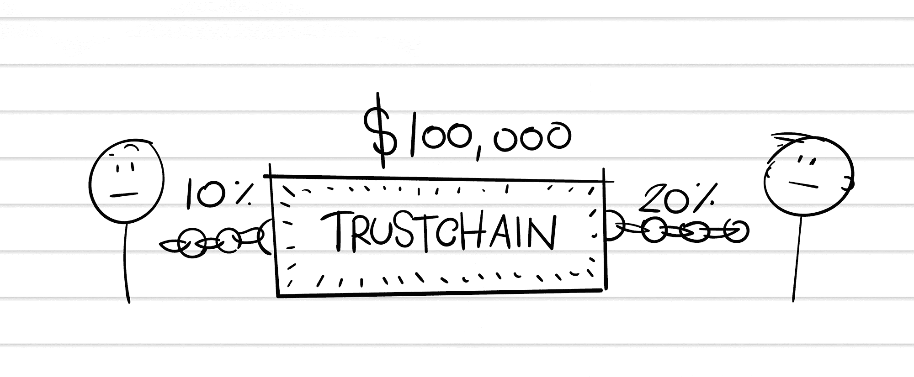
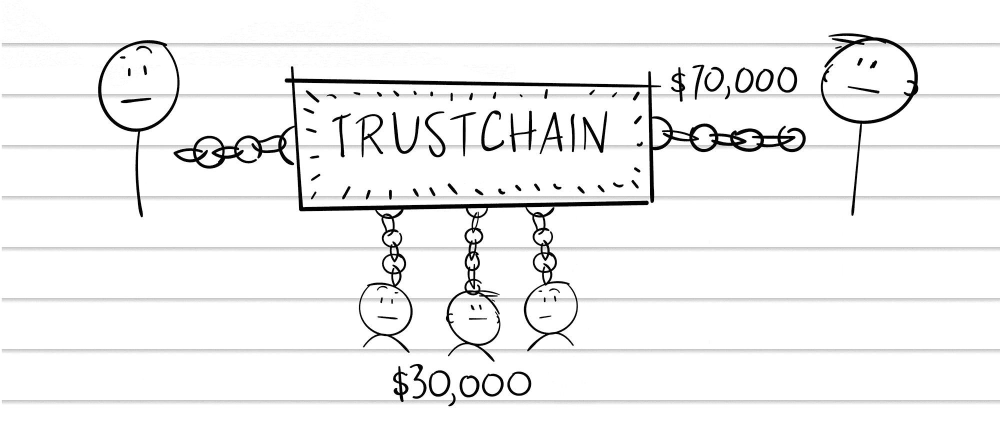

## 第二十八章

## 《玻璃与深渊》

埃隆·马斯克曾经说过，当创业者在最糟糕的时刻，就像在嚼玻璃和凝视深渊。今天这似乎是一个轻描淡写。

玉儿和我去了银行，要求再次延长我们的信贷额度。我们的所有信用都耗尽了，现金只够再支撑一个月。一切——银行账户、生意、房子——都押上了。

我们是怎么到这里的？

“嘿。”我把手放在她手上。“我们还有彼此。”

她笑了。“我们有彼此。”

“感激你。”

她把头靠在我的肩膀上。“你也是。”

“嗯，早上好。”爱尔兰口音让我感到温暖。“我通常不这么说，但我知道你喜欢。”

“肖恩，很高兴看到你。”玉儿微笑着和他握手。

“很高兴见到你。”他看到我时停了下来。“你看起来很累。”

“非常感谢。”

他更仔细地检查了我的脸。“你没事吧？发生了什么？”

“我被树枝打在脸上，”我回答。

“嗯，进来我的办公室，”他说，“看看我们能做些什么。”

里面的气氛很沉重。“肖恩，我们已经尽可能地管理了我们的现金，”玉儿开始说，“但我们有几位客户违约了……”

“包括你的银行，”我插嘴，一想到宋英就痛苦不堪。

“我有一个十二个月的现金预测，”玉儿继续说，递给他一份预算报告，“有一个让我们回到盈利的计划。但我们需要再延长一次。”

肖恩查看预算时皱起了眉头。“那么这一年是不是有点艰难？”

你不知道，我想，眼泪涌了上来。

肖恩看了看我，然后迅速移开了目光。“这怎么可能发生？”

“我们的业务在放缓，所以我们试图重新定义自己，”玉儿总结道。

“怎么弄？”

“我们转向了区块链，”我回答。

“区块链是什么？”

玉儿和我都沉默了一会儿。“你想要处理这件事吗？”她问我。

“肖恩，你还记得我们买比特币的时候吗？”

“哦，是的。那怎么样了？”

“这仍然是我做过的最好的投资之一。”

“那么你为什么不卖掉一些？你可以卖掉，对吧？”

玉儿看着我，眉毛扬起。

“我相信它的长期前景。”

“但你这里有一些短期问题。”他指着电子表格。“你有流动性；为什么不利用它？”

“但没付我们钱的银行，”我争辩。“你知道他们欠我们多少钱吗？”我指向电子表格上的数字。

肖恩吹了声口哨。“那么你为什么不为此而上法庭呢？”

“我们尝试过了！”

“律师费用在这里列出。”玉儿指着一条项目。“我们也在偿还那些。”

“我们需要的是基于区块链的仲裁系统，”我告诉他。

“不是时候或地点，”玉儿催促道。

我还是拿出了我的 Moleskine 笔记本。

### 区块链仲裁：10 万美元的想法

假设为了争论 sake，一个客户欠你 10 万美元。

支付服务费用的挑战是没有人愿意提前支付。你雇佣一个人来给你做屋顶，你不可能提前支付整个屋顶的费用。

通常的解决方案是按里程碑付款：比如说屋顶完成了一半时付 50%，项目完成后付 50%。但即使这样也不理想，因为屋顶工人仍然可能在最后一半被坑。如果你不付钱，他能把屋顶掀掉吗？

解决方案是一个基于区块链的托管系统，类似于我们的气球动物示例，但有一个变化。你和屋顶工人签订一个智能合约，并且一次性支付整个屋顶的费用。立即这个系统就更好，因为他知道你有支付能力。从心理上你已经全力以赴。

现在假设出现了分歧。屋顶工人说项目完成了，但你说屋顶在漏水。你们俩来来回回争论，但达不成一致。10 万美元（这是一个大屋顶）坐在智能合约里，就像托管一样。你不会释放它，但你也拿不回来。

假设这一切都在一个名为 TrustChain 的支付区块链上进行。当对支付有异议时，每一方投入他们愿意支付仲裁的费用百分比——换句话说，你们各自愿意“放弃”多少来解决争端。

质押：为了获得某些好处而“锁定”一定数量的钱或代币。

可以把它想象成酒店会对你的信用卡“冻结”：只要你不破坏房间，你就会拿回钱。

现在这个质押百分比归一个去中心化的仲裁委员会（即靠解决 TrustChain 争端为生的人）。他们与你两人一起寻找解决方案，委员会成员可以得到你质押的金额。

例如，你投入了 10%的 10 万美元，而屋顶工人投入了 20%（因为他已经支付了材料和劳动力费用，所以他有更多的损失）。仲裁员听取双方的故事，查看工作的照片，并查看屋顶工人的之前的 TrustChain 反馈（42 个正面评价）和你的反馈（你是新用户）。他们裁决支持屋顶工人，他获得了 7 万美元，仲裁员平分了 3 万美元的赌注。

请注意，没有一个中央化的“公司”在管理这一切！这不像要求 Visa 撤销信用卡收费或把某人告上法庭：这是一个由人民管理的去中心化系统。不需要律师。

“那很有趣，”Sean 心不在焉地喃喃自语，“但我认为我们再也没有其他办法了。”他放下预算。“你已经筋疲力尽了。”

在我脑海中，我想象着把一个大锤扔进 Sean 办公室的墙壁，让我原始的尖叫声在慢动作中随着飞溅的玻璃碎片四散。

“除非……”肖恩转过身去，敲了几下电脑键盘。我和佳得都坐直了身子，屏住呼吸。

“不。”他转头看着我们。“你已经差不多用光了。”

我再咬了一口玻璃。“也许我们可以卖掉比特币，”我对佳得叹了口气。

“你已经在支付一大笔利息了，”肖恩推理道。“承担更多债务是没有意义的。你有流动性。就用它吧！”

我朝佳得看去。她的脸色变得苍白。

“你还好吗？”我问她。她把手机递给我，眼里充满了泪水。

非常抱歉用这种方式告诉你这个消息，但我不能从医院打电话。

你哥哥乔尔今天早上去世了。
