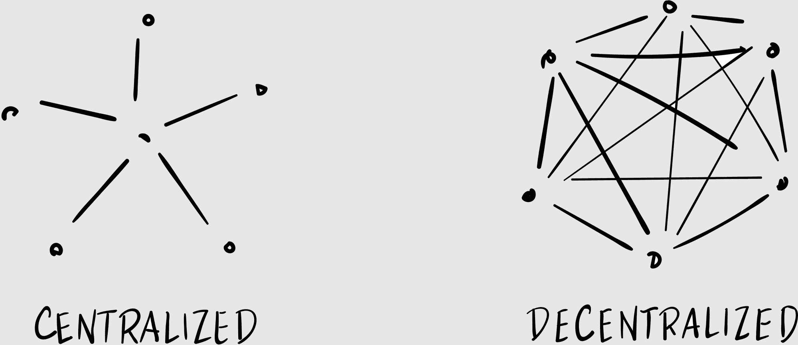
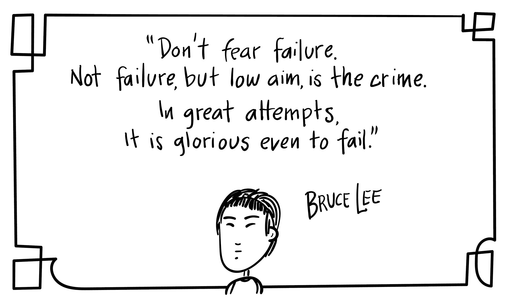

## 第三十一章

## 结束开始

保罗·艾伦去世了。

我清楚地记得在哪里收到了短信，因为我当时正站在保罗·艾伦的校园里。

我在微软总部的一个异常温暖的秋日里，液态的阳光在铁杉和冷杉之间流淌。微软的员工们在慢跑、踢足球、在占地五百英亩的奇迹之地远足。

我简直无法想象还有比这更美的工作场所。与我们的湿漉漉的咖啡店相比，这简直是 ridiculidyllic（荒诞的田园诗）。

保罗·艾伦建造了它。

这位与比尔·盖茨共同创立微软的天才，建立了价值数十亿美元的投资组合，将数十亿美元捐给了慈善机构，是西雅图市的赞助人，已经离开了。今天，在雷德蒙德，总是下雨的天气似乎在庆祝他的一生。

当我准备在微软舞台上发言时，艾伦的死让我心情沉重。他是我个人心目中的英雄，而且奇怪的是，我在他去世的那天讲话。这个巧合让我觉得充满了意义，但像我生活中现在许多事情一样，我想不出为什么。

我应该在我的讲话中提到保罗·艾伦吗？

绝不要提保罗·艾伦。

为什么不呢？

你甚至不在那里工作。

我可以带领大家做祈祷吗？

为保罗·艾伦祈祷？

我是认真的。

当我给杰德发短信时，一个名叫彼得·雷兰的动态演讲者正在台上。彼得用连续创业者的幽默和优雅讲述了他的公司故事。这令人畏惧：这是大联盟，他是大联盟的投球手。

“你需要什么吗？”我的两个年轻的微软主持人马修和布鲁斯，从我的焦虑沉思中惊醒了我。

我回应道，“再十年的经验，”我在舞台上点点头，向彼得致意。

“他很棒，不是吗？”马修笑了笑。

“大多数区块链演讲者都有燕麦粥的个性。”就像约好了一样，人群对彼得的一个笑话笑了。“这人是超级巨星。”

“你会做得很好的，”马修安慰我。“你行的。”

“嘿，我应该提一下保罗·艾伦吗？比如，默哀一分钟之类的东西？”

布伦斯皱了皱眉。“我不会这么做。”

我抿了抿嘴唇。“有个小问题。”

马修指向舞台，那里彼得正走下舞台，迎来热烈的掌声。“你需要什么？快点。你上。”

我调整了耳机，深吸了一口气。“我整个讲话都是关于保罗·艾伦的。”

****

这次活动是微软 Gig 峰会，主题是“零工经济”，即雇佣自由职业者为你开车（Uber）、做图形设计（Upwork），或为你取干洗衣物（TaskRabbit）的趋势。

这绝不是个午餐时间的培训课：这是一场员工活动，在一个企业剧院举行，有完整的音响和灯光工作人员，专业摄影师，以及包括龙虾三明治和手工切制的土豆片，淋上松露油的自助午餐。

我的演讲是当天最后一场，我看到很多微软员工在我上台时向门口涌去。这让我有些动摇。我以为我是压轴的，但现在我发现我成了观众和高峰期之间唯一的障碍。

“欢迎来到今天的最后一场会议！”我开始说。“我是约翰·哈格里夫斯……”然后我精神性地朝着天花板飘去。我该如何介绍自己？作家？企业家？区块链传教士？

我是谁？

我低头看着自己的身体，不知怎的身体在向人群讲话。这太不真实了：嘴巴在决定说什么，但我只是隐约意识到话从嘴里说出来。

这就像走进一场面试，听到那个令人畏惧的问题：“那么告诉我一些关于你自己的事情。”这甚至不是一个问题！你想听什么？你想让我成为什么样的人？你想让我展示哪一段人生经历的精华？

你如何定位自己，成为一个值得信赖、有趣、知识渊博、风趣、智慧的人？我们每个人都有一系列面具，不同的角色，我们在家庭、朋友、商业同事等人面前戴上不同的面具。我应该戴哪个面具？

但目标是不戴任何面具。难道不是每个人都这么说吗？“做你自己。”这到底是什么意思？目标是保持真实。这让我回到了最初的问题：我是谁？

我对自己的介绍说了什么，我已经没有记忆了。我整个人都在飘，所有的这些想法在我的脑海中盘旋，直到我回过神来开始我的演讲。保罗·艾伦已经去世了。

“马云买不了互联网，”我即兴发挥道。

### 区块链是去中心化的

马云是中国最富有的人。他如此富有，以至于一些中国家庭把他的照片放在家里，与中国的财富之神蔡神并列。他是一位现代神祇。他不仅仅是一个亿万富翁，他是一个十亿富翁。^(53)

马云如此富有，以至于在任何一天，他都可以字面上买下中国所有的茶叶。^(54)

尽管拥有这么多的财富，马云还是买不了互联网。这个想法似乎有点荒谬。我们都知道互联网是一个巨大的计算机网络，没有人拥有它。没有互联网总部，没有互联网 CEO，没有互联网电源插头可以被拔掉。

那是因为互联网是去中心化的。

我们的大脑并不适合去中心化。首先，它有六个音节，这让人感到压倒性。其次，我们建立的大部分人类机构都是集中化的。政府、教堂、微软。几百年来，我们一直在建立国家，有集中化的首都、领导和机构。

去中心化：不被中央机构拥有或控制。最有用的例子就是互联网。

要小心所谓的“私有”或“许可”的区块链，它们更加集中化。问一问：他们为什么需要区块链？

这并不是说集中式机构不好。

实际上，许多今天的问题都是中心化和去中心化之间的摩擦造成的：例如，中心化媒体在去中心化社交媒体世界中的角色。或者中心化军队如何应对去中心化恐怖网络。

区块链具有去中心化的基因。例如，比特币不是一个公司。以太坊没有总裁。区块链可能有基金会或财团——就像互联网有一个标准化机构一样——但它们通常不是由一个在桃花心木桌子后面的人经营的。

这是反直觉的。说“让我们创建这个庞大的区块链项目，然后把它送给全世界”与美国的梦想直接相悖：努力工作，相信自己，建立一家大公司，然后出售获利。

我不是说区块链创业者都是特蕾莎修女。但当他们专注于构建有用技术时，他们似乎是在不知不觉中获得了利润。他们的财富看起来几乎像是区块链的副产品。

去中心化的最佳例子就是一位谦逊的铁匠如何改变了历史进程。我们现代社会很大程度上要归功于这位独自制作马蹄铁的天才。

那位铁匠名叫约翰内斯·古腾堡，他在 15 世纪混合了几种现有技术——比如木版印刷和制作葡萄酒的螺旋压榨机——来制造第一台印刷机。

这个谦逊的发明引发了一系列社会公益的连锁反应：突然之间，知识——信息——触手可及。在印刷机之前，如果你想听圣经，你必须去教堂听牧师朗读。现在：每个人都有圣经！

人类，结果证明，喜欢学习。信息越多越好！印刷机开始尽可能快地生产书籍，就像它们的螺旋压榨机一样，创造了一个知识雪球。更多的书籍导致了更多的想法，导致了更多的文化，导致了更多的书籍和更多的想法。

随着雪球加速，它导致了宗教改革、科学革命和工业革命——随着旧的国家和教会的头目逐渐被新思想取代。到 1500 年，有二十百万本书；下一个世纪，有两亿本书。^(55)

如果这听起来熟悉，那是因为它就像区块链一样。

想象一下，如果古腾堡说：“这是一项伟大的发明。我将申请专利。然后我会印刷一本关于铁匠技术的少量书籍。我的第一本书将是一本名为《一锤定音》的回忆录。第二本将是一本珍贵的黑色幽默集，名为《闻到的人》。“

如果古腾堡集中了他的知识——如果他将印刷机据为己有——我们可能最终会得到古腾堡小册子而不是《古腾堡圣经》。但印刷机是一项去中心化的发明，它去中心化了信息。

当我们把面包撒在水里时，我们可能最终会得到一个湿漉漉的百吉饼——但当我们把好的东西投入到世界中，它们似乎会以倍数回报给我们。

我正在建立一些我不会拥有的事物。这是公司、政府和中央银行难以理解的一种心态转变。但如果你不建立开放的区块链，那么其他人会的。那样你就失去了餐桌上的位置。你是一个乘客，而不是驾驶员。

看看由 Linux 基金会启动的区块链平台 Hyperledger（它本身是一个中心化的组织，致力于去中心化的 Linux）。Hyperledger 是一个由像 IBM 和 Cisco 这样的中心化科技公司联盟支持的去中心化项目。

中心化的组织可以研究去中心化的区块链；他们只是不能以传统的意义“拥有”它们。这是令人害怕的。“我们如何从这赚钱？”老板会问。“这对我们有什么好处？”我们的政治家们会想知道。

但这些都是在颠覆性技术历史上一直被问到的问题。

1400 年代的罗马天主教廷问：“我们为什么应该关心印刷？”“我们已经手工复制圣经近一千四百年了。”与此同时，人们现在在读自己的圣经，提出自己的解释，认为教会需要一场改革。

1990 年代的媒体公司问：“我们应该对互联网感兴趣吗？”“我们印刷书籍、杂志和报纸已经好几个世纪了。”与此同时，互联网使得出版、复制和印刷变得前所未有的容易，摧毁了媒体景观。

就像互联网一样，没有人能拥有区块链——尽管许多公司和政府会尝试。要小心“私有的”区块链，它们是为了私人的利益，不要将它们与“公共的”区块链混淆，后者是为了公共利益。

互联网的悖论在于，没有人拥有它，但每个人都拥有它。它是去中心化的。寻找去中心化的区块链。

我总结道：“今天的事件是关于共享经济，这是一种去中心化形式。你不拥有自由职业者。事实上，自由职业者拥有你。你依赖他们来运营你的业务。

“去中心化很激进！”我大喊，吓到了第二排的一位年轻女子。“去中心化将颠覆你在微软所做的每一件事，所以请把这种模式牢记在心。”

我开始寻找例子。“古巴的互联网服务很糟糕，所以公民们建立了一个名为 SNET 的自己的版本，意为‘街头网络’。每个人都把他们的电脑连接起来，一个由志愿者组成的社区提供技术支持。人们拥有 SNET，只要他们行为规范，政府就假装没看到。那就是去中心化。”几个极客点了点头。网状网络。

“或者记得，小时候，你和朋友们聚在一起为大人表演小戏吗？那才是去中心化。没有人拥有它。你们都拥有它。

“自助餐晚餐。自发聚会。表情包。俚语。好想法的传播。这些都是去中心化的例子，而去中心化是区块链的精神。”

我犹豫了一下：现在来到了有争议的部分。

“当你将经济分散到零工经济时，”我继续说道，“你必须记住零工也是人。”我切换到下一张幻灯片：一张种族多样、面带微笑的人们的典型照片。 “不是这些人，”我澄清道。 “这是一张库存照片。” 大家都笑了。

“看：我被你的校园美景震惊了。但记住零工不会在这样的环境中工作。他们在咖啡店工作，在倾盆大雨中。他们在家做自由职业者，孩子们在旁边尖叫。他们不断为下一份工作而努力。这是一个艰苦的过程。

“我们所有人的诱惑是将零工视为可消耗品，视为数字工厂中没有面孔的齿轮。但这些人都是人。你越把他们当成人对待，他们就越会以同样的方式回报你。” 剧院后排的一两个零工鼓掌，让我激动不已。

“即使是伟大的保罗·艾伦也无法购买互联网，”我总结道，“愿他的灵魂安息。没有人拥有互联网，但我们所有人又都拥有它。区块链也是如此。它属于人民。人民权力。区块链属于每个人。”

* * *

后台，我感到担忧。掌声一般般，不是我希望引发的变革。今天已经很晚了，我想大家都想回家。虽然马修和布鲁斯依然精力充沛。

“嘿，我给你带来了一份礼物，”布鲁斯突然说道，递给我一本书。

我看了看封面。李小龙的《截拳道之道》。“有趣。” 我翻阅着页面。“我现在应该读它，还是 . . . ？”

“不，”他笑了。“我读了你的书《心灵黑客》，我认为李小龙的很多哲学都与你的相似。我想你会喜欢的。”

“谢谢你的布鲁斯，布鲁斯。” 我翻阅着页面，里面收集了李的标志性武术动作，穿插着他的禅宗哲学。我停在：

“他把这些话写在了一个他随身携带的小笔记本里，”布鲁斯解释道。“有点像肯定语句。心灵黑客。”

“心灵黑客，”我惊叹道。“在一个笔记本里。”

之前精力充沛的动态企业家彼得走了过来，握了握我的手。“我对区块链非常感兴趣，”他告诉我，“但我现在所在的公司更专注于人工智能。” 尽管他看起来年纪已经不小，但他的朝气蓬勃让我觉得他可以经营一个灵性 retreat。“我喜欢你关于那个女人在你摊位上吓到你的故事。”

“痛苦的回忆。” 我微笑着。

“所以你们还在做内容代理的工作，对吧？我们正在疯狂增长，需要你们的帮助。这是人工智能，不是区块链……至少，还不是。”他意味深长地看着我。

“我们很乐意提供帮助，”我回答说，心里暗自松了一口气。

“很好。我们下周再聊。”他递给我一张名片，然后消失在了门外。

“嗯，这次旅行是值得的，”马修评论道。

“你不知道，”我回答。飞机正在掠过树梢，向一座山飞去。这是给油箱再加一点油，也许刚好足够越过这座山。

保罗·艾伦可能已经去世，但我们还将看到另一个日子！
