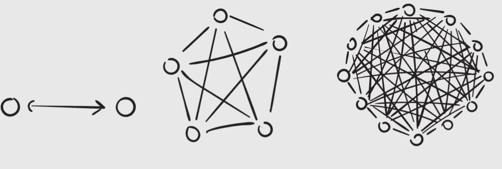
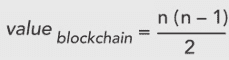
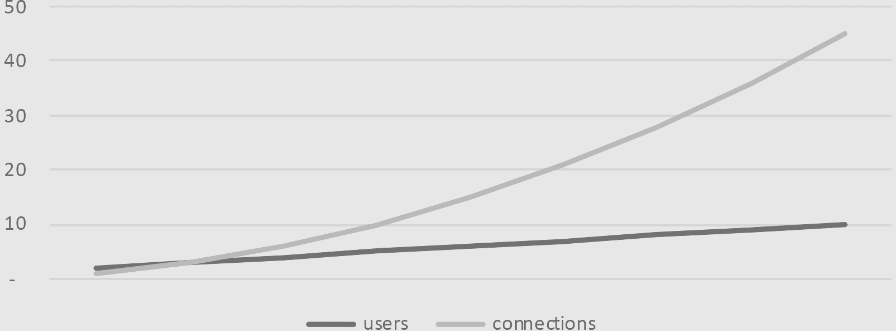
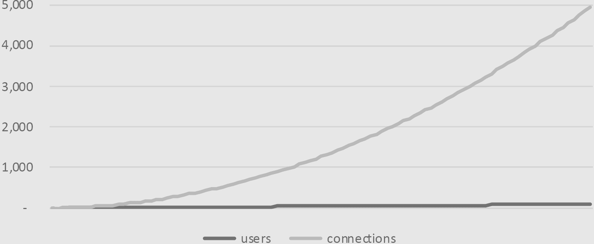

## CHAPTER 32

## Tearing It Up

媒体淋浴公司已经减少到只留下一个核心团队。

随着比特币价格的持续下跌——已经跌破 5000 美元——区块链业务开始萎靡不振。媒体开始称其为“加密寒冬”，我经常深夜难以入睡，想知道我们如何熬过春天的解冻。

如果看起来不是这样，那是因为我参加了越来越多的会议——但总是免费的。我甚至升级了我的衣橱，聘请了一个预订代理，但区块链会议都不愿意支付。这是“付费参与”的另一个例子：大多数演讲者都在炒作他们的区块链项目，所以他们都得自掏腰包。但像一个挣扎中的单口喜剧演员一样，我免费工作。

这给了我很多机会来练习新素材。今天我在波士顿世界贸易中心的一个人区块链大会上，我在一个充满区块链投资者的多功能厅发表演讲。

“如果区块链真的是一种新的资产类别，”我在人群热身之后开始说，“那么我们如何给它们估值？如何衡量它们？”

我点击了我在微软时使用过的同一张种族多样、面带微笑的人的股票照片。

“我提醒你们，区块链是关于人的。你必须让人们使用这些该死的东西。区块链是由人民推动的。人民的力量！”我开始举起拳头，妻子告诉我这看起来像是在试图领导一场极客力量大会。

“人民的力量，”我重复道，尴尬地放下我的手。“如果这项技术真的关于人，”我继续说道，“那么我们需要一个衡量人们使用区块链的指标。

“这让我们得出了一个至关重要的指标，一个统治一切的法则。我们称它为火箭法则。”

### network effects: 网络效应的火箭法则

你有没有想过第一台电话是谁拥有的？

亚历山大·格拉汉姆·贝尔当然算一个，但我指的是他之后的第一台电话。我想听听贝尔的推销词。“哎，看看这个神奇的设备，它能让您用普通的声音，无论身处何地，与他人交谈！”

“真的吗？”他的潜在客户问道，此人当然长着一把八字胡，戴着一顶俏皮的圆顶礼帽。“还有谁有一部？”

network effects: 每有一个新成员加入网络，这个网络对每个人来说都变得更加有用。

好的例子有电话和 Facebook。

“嗯，就我一个。”

“对。所以我只能和你说话。”

“是的。”贝尔看起来很沮丧。“还有贝尔夫人，也是。”

“哦！”圆顶礼帽男子兴奋起来。“贝尔夫人？让我加入！”他大声说道，还有几十个其他急于下单的绅士排队等着。

这产生了我们所说的网络效应，而电话是经典的例子。当只有贝尔先生和夫人拥有电话时，只有一种连接。当五个人加入时，可能有十种连接，当十二个人加入时，可能有六十六种连接。

越来越多的人拥有电话，电话对每个人来说变得更有用。

大多数现代技术都以某种方式利用网络效应。Facebook 起始于哈佛的一个小网络，然后扩展到其他常春藤学校，然后扩展到所有学校，最后扩展到所有祖母。随着更多的人加入，Facebook 对所有人来说变得更有用。

区块链极大地享受网络效应。换句话说，你的区块链上用户越多，对所有用户来说区块链就越有用。例如，拥有比特币的人越多，用它来购买、销售或交易就越有用。

网络效应在一个被称为梅特卡夫定律的数学方程中被量化，这个名字是以互联网先驱鲍勃·梅特卡夫命名的。简单来说，网络的价值与用户数 n 的平方成比例增长：

当 n = 用户数量时

梅特卡夫定律（它更多的是一个经验法则而不是法律）已经被证明可以描述 Facebook 和腾讯等上市公司“网络”公司的价值。^(56)它已经被用来描述互联网本身。^(57)这也是为什么传统投资者如此重视“网络效应”公司的原因。

使用的词不是“指数增长”，而是“二次方增长”。这是解释它的简单方法：每次我们把用户数翻倍，我们增加的连接数就会增加 4 倍。下面是贝尔电话网络的价值，当他卖出他的第一批十部电话时：

1-10 用户网络价值

换句话说，当有 10 个用户时，每个用户有 50 条可能的电话连接。现在让我们想象一个投资者走过来，说：“看看这里，贝尔先生。我愿意支付 50 美元来购买你的这个新式的电信网络。”现在贝尔的估值变成了每用户 5 美元（50 美元 ÷ 10），或每连接 1 美元。

对贝尔先生来说，这真是一笔好交易！凭借每条连接 1 美元的初始估值，看看当用户从 10 个增加到 100 个时，整个网络的价值是如何增长的：

1-100 用户网络价值

我们的大脑不是用来这样思考的。我们习惯于线性增长，因为这是我们日常生活中体验大多数事物的方式：我们以线性速率变老；价格以缓慢但线性的方式上涨；我们的工资以线性方式增加。

想象一辆加速不是线性而是二次方的公交车：司机踩下油门，它从 1 英里每小时加速到 3、6、10 英里每小时。哇，这辆公交车启动得可真慢，你这样想，同时它从 15 英里每小时加速到 21、28、36 英里每小时。一辆汽车排队跟在区块链公交车后面，不耐烦地按着喇叭。

然后速度提高到 45 英里，然后是 55 英里，然后是 66 英里，然后是 78 英里，然后是 91 英里，然后是 105 英里每小时。你仍然给它同样的油量，但它加速到 120 英里，136 英里，153 英里，171 英里，190 英里和 210 英里每小时。很快，乘客们紧紧抓住扶手，火热的鼻锥包围着公交车的正面，热量摩擦使侧面板脱落。

火箭法则：随着区块链吸引初始用户，它们会缓慢起飞，遵循梅特卡夫定律。一旦它们达到逃逸速度，天空就是极限。

二次方增长就像火箭起飞：起初，看起来好像什么都没发生。很多烟雾和噪音，但没有动静。等到你意识到你已经起飞时，火箭正在进入轨道。我们称这为火箭法则。

在我开场白之后，我安排与波士顿一位领先的区块链投资者进行台上采访。我坐在他旁边的椅子上，打量了他一番。牛仔裤，夹克，设计眼镜。一头浓密的头发。“芬恩，你正在使用区块链建立一家风险投资公司，”我把话题抛给他。“告诉我们它是如何运作的。”

“当然。在传统的风险投资结构中，”他解释道，“你有一些有限合伙人，他们投入资金。”

“他们把钱交给你去投资，”我解释道，“然后你，风险投资公司，用这些钱投资新创业公司。”

“确实如此。”

“‘风险’意味着新业务；‘资本’意味着资金。‘风险资本’意味着为新业务提供资金。”

他怀疑地看了我一眼。“谢谢你。”

“我昨晚一夜没睡，在读《风险投资傻瓜书》。”我开玩笑说。这不是开玩笑。

“我能说完吗？”

“请继续。”

“通过我们的新代币化风险投资公司，任何人都可以投资，有机会从这些新投资机会的底层开始——”

“让我们来分析一下，”我再次打断道。“假设你们找到了下一个 Facebook。那么，持有你们代币的每个人都将获得奖励，因为代币的价值会飞速上涨。”

“这真的让每个人都有机会从底层开始。”

“那么，你说的‘每个人’是指每个人吗？”我澄清道。

“嗯，指的是居住在美国的有资格投资者。”

“所以，指的是有钱人。”

“嗯，这几乎是美国 10%的家庭，”他回应道。^(58)

“所以，指的是有点钱的。”

“嗯，证券法就是这样写的，”他解释道。

我静静地坐了一会儿，我的血液开始沸腾。啊，一个恰到好处的沉默真的能吸引观众的注意力。我延长的沉默，直到有什么东西断裂。

是的，还有...

“证券法就是这样写的，”我重复道。“是的，证券法就是这样写的，过时且脱离现实。你知道吗？”我戏剧性地把我的笔记页撕碎，扔到地上。“你知道我再也不想听到的两个字是什么吗？‘有资格投资者。’我们应该都是有资格投资者。”

观众鼓掌。经过一年的训练，我终于找到了宝藏。

“区块链是一场去中心化的运动，”我咆哮道，“属于人民，为了人民，属于人民。但是人民却坐在场边，胆小怕事，等待政府告诉他们该做什么！我们想要爸爸告诉我们该做什么。”

“听着，我们的工作是确保我们符合所有现有的证券法规，”风险投资家冷静地回答。“如果你想要改变那些法律，如果你认为它们不理想……嗯，我并不不同意。”

“那么你同意，”我反驳道。

他看起来好像我朝他吐了一口金鱼缸的水。

“如果你不不同意，那么你就同意，”我澄清道。

他眨了眨眼，不确定他同意了什么。通常这些区块链采访都像烤面包一样干燥。观众中有一些人眼睛睁得大大的，笑着，不确定他们是否被允许笑。

“为什么要把一切都搞复杂呢？”我问。“为什么不说任何人都可以投资区块链代币呢？一次性平衡竞争环境。”

“嗯，我们现有的证券法律是在 1930 年代写的，”他回答道，“旨在保护投资者不要把他们的终身积蓄都赌光。”

“那么我们也必须把赌博限制在富有人群中。除非你是认证投资者，否则没有更多的赌场，没有更多的彩票，没有更多的刮刮卡。你可以两者兼得。”有几个勇敢的人鼓起了掌。

“所以你想要领导一场革命——”

“我们都想要领导一场革命，”我打断道。“我们人民。这就是它的意思。我们是人民。政府为我们服务。他们的权力来自我们的授权。当我们的政府背叛我们的时候，那么——就像一个管理不善公司的股东——我们必须引领。我们必须自我组织。这就是区块链允许我们做的。”

“我一直在想我们什么时候再谈谈区块链，”芬恩俏皮地说，引起了一阵大笑。

“我们必须引领，”我继续说道。“你觉得政府理解这些吗？他们离我们有一百万英里远！我们必须为未来写下愿景，否则未来将由别人为我们书写。旧老板，还是新老板。”我的公交车轮子正在脱落。“我是说，新老板，还是……啊，糟糕。”

“你做得很好，”他评论道。

“我能得到一声赞美吗？”我喊道。我没有得到赞美。

“我们认为区块链可以改变我们的金融、政府和商业系统，”芬恩救了我。“而这些都是强大的系统。它们抵制变革。新技术总是威胁现状，并且常常颠覆当权者。”

“你的意思是他们强迫当权者改变，”我翻译道。“进化或死亡。”

“是的，你说得对，我们必须引领。我们正在通过稍微开放一点风险投资来做我们的一份工作。一步一步来。稳扎稳打，才能取得最后的胜利。”

“进化，而非革命。”

“你说你想要一场革命。”他笑了笑。

“大家一起来！”我自发地引导观众唱歌——其中一些人实际上跟着唱了起来。

你说你想要一场革命

我们大家都想改变世界……

现在来到了尴尬的部分：在后台与芬恩见面。

我有好多话想说。这些事情很重要，我只是想让它变得有趣，这样人们才会关心。我采取极端立场以强调观点。我无法与你权力和财富相匹敌，但我现在知道如何说你的语言。我已经渗透进你的系统。

“谢谢你的采访，”我说的只有这句。

“开玩笑吗？那可能是我在这类会议上做过的最棒的采访，”他笑着说。“我们真的让对方陷入了困境！”

“嗯，我让你陷入了困境，”我纠正他。

“我在大学时主修戏剧，”他坦白道，“实际上，舞台才是我唯一的真爱。”

“真的？”我试图想象他扮演哈姆雷特的样子。

“真的。那是一场精彩的演出。我明白了。”

“你明白了。”他惊讶得无言以对。

“听着，我们下个月有一个大型的投资者会议。不像这样。”他挥手随意地四周示意。“真正的投资者。家族办公室，机构。我很想让你担任主持人。”

“你想要我担任主持人？”

“我们得让这些事情变得有趣，”他告诉我。

“我们必须让这些事情变得有趣。”

“我会让我的团队和你安排。”我们握手。“现在，我们的预算有限。但我们会在投资者面前款待你。这将是一次极好的网络交流，极好的曝光机会。”

我如此惊讶，甚至没有注意到他刚刚让我免费做这件事。“活动在哪里？”我问。

“瑞兹卡尔顿酒店。”

有限的预算！

我离开会议，如履云端。我内心某处已经被释放。又一次不付费的演出，但是，嘿，和一些百万富翁在瑞兹卡尔顿酒店吃晚餐听起来也不错。

我想起了火箭法则：很长时间看起来好像什么都没发生。然后，在你意识到之前，火箭已经达到了逃逸速度，正朝着轨道飞去。

但是很难说。生意还是这么糟糕。我们会到达轨道吗？还是火箭会在压力下爆炸？
