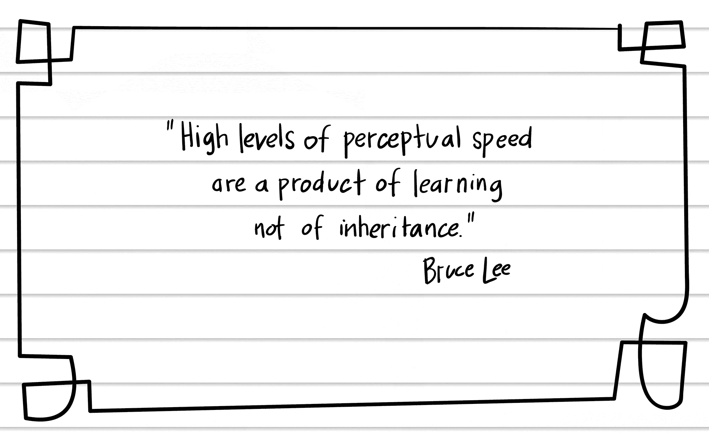
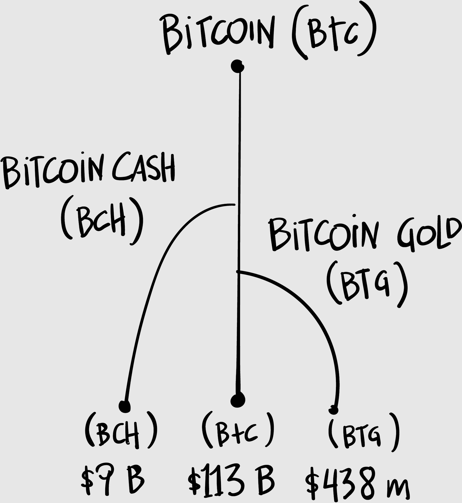

## 第三十三章

## 《疯狂亚洲富豪》

没有乒乓球桌。

这让我很沮丧。我来到了麻省理工学院：世界科技之都！极客天堂！一定有 n 张乒乓球桌在半径 r 内，但我解不出 n。

首先是我试图向我的中国主人解释为什么我需要一张乒乓球桌来谈论区块链。然后尝试把我自己的乒乓球桌塞进我那辆小巧的电动车里。为乒乓球桌送货报价。我已经练习了好几周！但乒乓球是一项讲究细腻，而非力量的运动。接受失败，我准备了一个乒乓球视频 instead。

“我想今天”，我开始说，“谈谈乒乓球。”

我正在对波士顿华人投资俱乐部发表演讲，这是一个由麻省理工学院斯隆管理学院成立的团体，这个学院培养了不少科技百万富翁。区块链投资在中国非常热门，尤其是因为中国政府最近禁止了首次代币发行（ICO）。

现在所有的钱都流向了香港——和美国。这就是为什么我站在麻省理工学院的一个讲座厅里，面对着一小群富有的中国投资者，其中大多数人不知道我是谁，我在说什么，也不知道我为什么提起乒乓球。

“是的，乒乓球，”我重复道。“我们这两个伟大国家之间的贸易战已经引起了广泛的关注，危险在于我们可能会陷入像 20 世纪 50 年代和 60 年代在我们之间存在的冷战。”我表现得像自己在中国一样，尽管这些投资者中的大多数是美国公民。

“你们记得我们是如何解冻那场冷战了吗？”我问。

“乒乓球！”后台一位老先生宣布。

“乒乓球。”我给他竖了个大拇指，然后点击了我的下一张幻灯片。“这是一张中国和美国最佳球队打乒乓球的照片。我们称之为‘乒乓球外交’，它导致了这个。”点击。“毛泽东会见理查德·尼克松。不是我们最好的总统，但也不是我们最差的。”轻松的一笑。

“有多少人认识这个人？”我问，又推进了一张幻灯片。有人举手。“他是谁？”

“马龙，”一个衣着得体的女人回答。

“马龙！”我大喊，甚至把自己都吓了一跳。“在 2016 年夏季奥运会上，我和我哥哥看着这位伟大的中国乒乓球运动员马龙，既着迷又敬畏。绝对是粉丝 boys。而每当他在前臂力量扣杀得分时，我们就会像这样。”

我双手捧着嘴。“马 aaaaa 龙！”

他们可能是有钱疯狂的亚洲人，但他们看着我却是正常的疯狂。

“看这个，”我说，然后拿出了 YouTube 视频。视频显示马龙面对日本世界冠军水谷隼。双方的回合越来越激烈，两位选手都离球桌几英尺远，挥拍全力击球，球成了模糊的一团。然后马龙进行最后的回球，稍作停顿，球距球桌仅几英寸。马龙得分。视频里的观众疯狂了，即使在房间里，人们也屏住了呼吸。

“来吧！”我对人群喊道，用手捂住嘴巴。“马 AAAAAAAA 龙！”

他们真的做到了！他们真的做到了马龙的助威口号。

“我的观点是，竞争可以是有趣的。它可以是一场游戏。我们的政治家谈论贸易战，但游戏与战争相反。游戏是我们一起玩的东西。”然后我讲述了关于莱斯特的故事。

### 聆听莱斯特

我住在美国波士顿附近的一个小镇，这里的直接民主形式让我体验到了镇民会议。这些会议从我们镇在 1600 年代建立以来就一直在举行，镇民们聚在一起就政策和预算进行投票。

我学到的直接民主是艰苦的工作。有一位年长的先生——我叫他莱斯特——对想象中的每个话题都有意见。在一场镇民会议上，讨论了动物控制部门应该如何处理田鼠的问题。

老莱斯特蹒跚地走向麦克风。每个人都可以发言三分钟，莱斯特从不错过机会。“田鼠是邪恶的！”他宣称。“它们挖你的院子，吃你的草，它们交配并在你的洞里产卵。去弄把猎枪吧！”

莱斯特关于田鼠的演讲持续了整整三分钟。

另一个小镇会议聚焦在高速公路部门。（这里其实没有高速公路，事实上只有一个红绿灯。）高速公路部门能否砍倒一棵巨大的、正在腐烂的树桩？一位女士——我叫她多洛雷斯——为了那树桩争得就像它是她已故丈夫的纪念物。

“那棵树里住着一家松鼠！”她哭着说，眼泪都要掉下来了。她把树桩叫做树。“那些松鼠让每个路过的人都感到魅力十足！”我耐心地坐着，试图回忆起是否曾经被松鼠，或者 indeed 任何啮齿动物吸引过。

我们小镇会议的主持人有着圣人的耐心。经过大约半小时的讨论，我开始变得焦躁不安。我的意思是，我在互联网上工作，那里的人都在午餐前想赚一百万美元。松鼠们三分钟的讨论？树桩们九十分钟的讨论？

但民主就是这么一回事。当我们说每个人都有发言权，我们指的是每个人：不仅仅是那些聪明而善于表达的人，还有那些在家独自度过很多时间的人。

民主的梦想是一个人，一票。但当你真正置身于这个梦想中时，这可能会变成一个噩梦。你看到今天全球区块链社区正在上演这种情况，这让人感到非常烦恼。

****

### 解决问题，不要分叉问题

这是一个真实的例子。随着比特币越来越受欢迎，比特币网络运行变得缓慢，耗电量大，交易成本过高。它需要升级，但最佳的前行路径是什么？

在这里，我们得依靠核心比特币开发者，每个人都有自己解决这个问题的方案。通常这些方案会在互联网论坛上讨论（不是一个好主意），这会导致口水战和 BBC 迷你剧集级别的戏剧。

通常一个团队的解决方案会胜出，另一个团队决定走自己的路，这会导致比特币分叉。这就好像我们制作了会计账本的副本，然后从某个时间点开始保存账本的两个独立副本——如果你愿意，可以说是平行现实。

分叉：当区块链被分成两个不同版本时，就像道路的分叉口。

比特币已经被分叉好几次，产生了为不同用途设计的山寨币：例如比特币现金、比特币黄金和比特币私链。

真正的民主是困难的，而区块链就是真正的民主。区块链是关于人的，但许多区块链开发者并不具备最好的人际交往能力。分叉比解决问题更容易。但团结就是力量，分裂就会失败。

需要的是更好的治理体系，更好的对话和辩论论坛。我设想一种区块链联合国，领先的开发者聚集在一起，用他们的散列算法来解决散列问题。我们称它们为#HashOuts。

治理：管理区块链项目变更的系统。其中一部分编码到区块链本身（就像法律），但另一部分取决于监督该系统的人（就像政府）。

我认为这些可以看作是模仿美国乡村的市政厅会议或瑞士的公民会议。会议有一个主持人。每个人有三分钟发言时间。有正式投票。乒乓球桌肯定应该参与其中。

如果区块链在民主方面如此出色，你可能会想，为什么不能在区块链上完成所有这一切？原因和你不能通过咨询会计账本来制定财政政策一样。人们需要打乒乓球。

编写区块链代码就像为个国家制定法律。它需要所有的规划、流程、提案和政府的乒乓球。这就是我们称之为混乱而美好的过程治理的原因。

如果我们能够找出如何将直接民主的最佳流程应用于区块链本身，那么我们——即我们人民——有可能掌控世界。关于这一点稍后再详细讨论。

打乒乓球是一项艰苦的工作。（问问马龙就知道了。）它需要耐心和毅力。它要求我们听从莱斯特的话。

一位头发花白的投资者举手发言。“所以你的意思是我们要一起合作。”

“嗯，良性竞争可以帮助我们双方变得更好，”我回复道。“关键词是‘良性’。”

“我认为你太天真了，”他回复道。

“或者是充满希望的。”我微笑着说。

一位衣着得体的年轻女士举手发言：“既然中国已经禁止了 ICO，我想知道您对司法套利的看法。”

“司法——什么？对不起。”

“司法套利。”

“我还是不明白。”

“司法 . . .”

这种情况持续了很长时间。这不是我想要的乒乓球赛。

司法套利。“司法”=领土，位置。“套利”=利用价格差异。利用不同地区的价格差异？

“我认为我们正在看到资金流向其他地区，”我边说边拖延时间，试图弄清楚情况。“投资资金正在流向其他地区。”现在我只是在说词。“香港。韩国。”现在我只是在背诵亚洲国家。“朝鲜。”

我本应该直接说，“我不知道那个问题的意思，”我心想。我为什么害怕承认我不知道的东西？我默默地发誓不再犯这个错误。

“没错，”她说道，至少我们中有一个人是满意的。“区块链经济是全球的。”

“全天二十四小时交易，全世界都在交易，”我同意道。“区块链从不停歇。”

“但是，如果你想投资区块链，而你的国家禁止它，你该怎么办？”

“你可以搬到别的地方去。”引起了一些笑声。“有些政府正在创建对区块链友好的环境，以吸引投资者和企业家。在波多黎各甚至有一个很大的区块链社区，它使用美元，但税收优惠。”

司法套利！就像苹果在爱尔兰开设了一家大办公室，以利用更友好的税法一样。她就是这个意思！“司法套利，”我总结道，指着她。

MAAAAAAA LOOOOOOOOOOOOOONG! 我心里想，觉得自己刚刚完成了相当于腕力力量砸击的动作。后来我才知道，亚洲人认为指指点点是不礼貌的。

“感谢您的问题，也感谢您的时间，”我结束道，鞠了个小躬。礼貌的掌声响起，我为下一位演讲者取下笔记本电脑，他已经走到讲台前，站在我面前。

我礼貌地微笑着，试图取下视频适配器，但它紧紧地附在 HDMI 电缆上。房间变得死一般寂静。当我挣扎着把它弄出来时，时间变慢了。

我的遥控器仍在我的手中。我把它放回保护套里，这个过程花了十五分钟。下一个演讲者正在等待，微笑着，点头。我摸索着把鼠标放回包里。我为什么有这么多外围设备？我带来了打印机吗？

与此同时，一片寂静。没有人在笔记本电脑上工作。没有人在打电话。每个人都礼貌地等待着，微笑着，点头。岁月流逝。我的孩子们从大学毕业了。

现在我的笔记本电脑又回到了包里，就像打包一箱要运往海外的重盘子。泡沫塑料膜。标签。现在逐一贴上邮票。我死去又转世成为了一头驴。

最后，我从讲台上走下来，收拾好东西准备徒步穿越阿巴拉契亚山脉。就在这时我意识到那位先生不是下一个演讲者。他是在等待机会送给我一份感谢的礼物。他双手捧着一只盒子，里面装有一支刻有中国国旗的漂亮钢笔。观众鼓起了掌。

几天后的某个晚上，我会用这支笔勾勒出一个重要的领悟。
