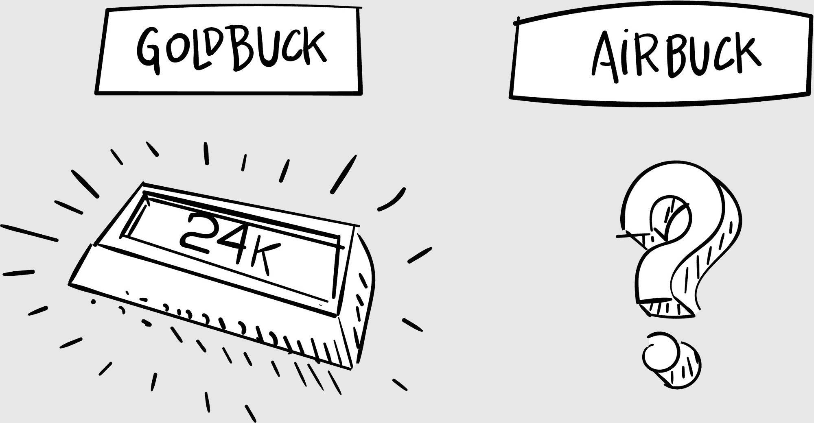
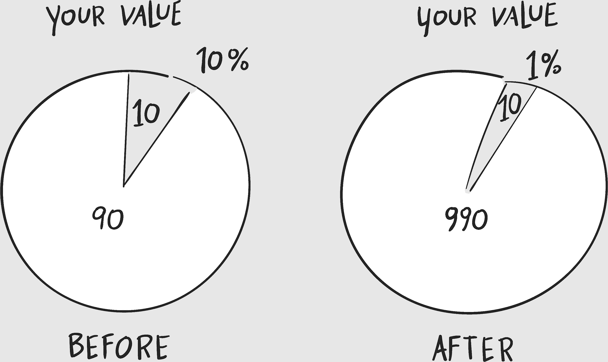
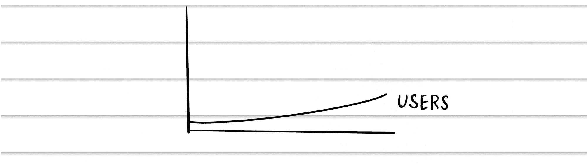
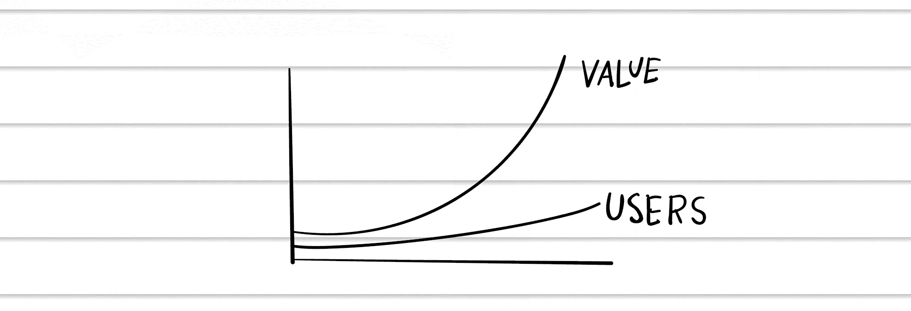
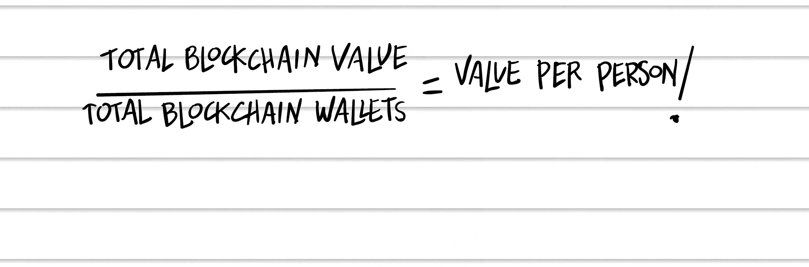

## CHAPTER 34

## 重要指标

“抱歉我迟到了。”我摇掉了外套上的雨。“外面太糟糕了。”

“才刚开始，”柯克说。“我们在玩金矿工人。”

“最近怎么样？”埃文问，拉出一把椅子。

“就像在外面的那种天气里跑马拉松。”我打开了一瓶苏打水。“裤子里还有一只水耗子。”

“这是区块链？”本澄清。

“现在这就是我的生活了，”我叹了口气，坐了下来。

“比特币的最新价格是多少？”

“别问。”

“孩子们还记得规则吗，”柯克概述。“我们在对土地进行地块投注。有些地块里有金子，有些有假金子，还有些两者都有。”

我评论，“我无法告诉你有多少新的区块链项目背后有黄金支持。”

本问，“有多少是假金子？”

“你知道美国政府脱离金本位以阻止其他国家掠夺我们的黄金储备吗？”埃文开始即兴发挥。“当美元背后是黄金时，你可以用一百万美元交换一百万美元的黄金。其他国家只会装满美元，然后买光我们的黄金储备。”

本 laid down a token on a claim card，“金本位是个好主意。”他说。“政府只能印刷更多的钱，如果它挖掘更多的黄金。货币背后有真正的价值。”

“那么今天支撑我们货币的是什么？”柯克问，抽了一张牌。

我回答，“信任，就像其他一切。但如果政府继续印刷货币，它可能会侵蚀那种信任。”

埃文观察到，“我查看过的很多区块链项目都有那个问题。即使它们一开始有一些价值，它们也保留发行更多代币的权利，这会贬值每个人的代币。”

“请解释，”柯克问。

### 金币族的故事

让我们想象两个政府。一个政府拥有固定数量的货币，背后有黄金储备支持，所以每一种“金币”都可以兑换一盎司黄金。另一个政府没有黄金，只要需要就会印刷“空气币”。

对于区块链投资者来说，这个概念至关重要。一些代币（如比特币）在其代码中有固定的供应量。比特币有 2100 万个，而且不会有更多的了。周期。

其他代币有能力按需创造更多。假设你拥有 100 个总量的十分之一的 AirCoin，或 AirCoin 供应量的 10%。AirCoin 团队需要筹集资金，所以他们创造额外的 900 个代币，并以现行价格出售（随着他们的出售，价格会下降）。

代币经济学：区块链代币的经济学，包括今天有多少代币，以及随着时间的推移是否可以创建新的代币。

现在你拥有总量的百分之一，或总供应量的 1%：他们“印刷货币”，从空气中创造代币，贬值了你的投资。

当然，这在现实经济中经常发生。政府不断印刷没有支撑的货币。它背后的真实价值除了我们共同的信念，即新钱和旧钱一样好，没有别的。

一个怀疑论者会问：“但所有的代币不是都是凭空创造出来的吗？”一开始，是的。但是一旦经济的价值得到确立，任何意外的新代币都会“稀释”所有代币的价值。这就是代币经济学（tokenomics）的规则非常重要的原因。

代币经济学是一个未知的领域，最好的实践非常少。如果你的孩子即将上大学，告诉他们主修经济学和计算机科学。在未来的几年里，代币经济学家将会赚取很多钱。

本插嘴说：“正是这样，我还是不明白区块链的价值。我是一个价值投资者。找到伟大的公司，当它们的股票打折时买入。”

我同意：“交易价格合理的股票，”我打出一张牌。

“一个典型的价值公司，你知道，就像 Dairy Queen 或 Heinz。好的品牌，好的经济学，和好的股价。那就是价值。”

“我想价值来自于我们都认为它有价值这个事实，”我陈述道。“看看特斯拉。”

柯克告诉我：“本刚付了辆新特斯拉的定金。”

我挑了挑眉。“恭喜你。”

本继续说：“谢谢。我的意思是，你必须找到一种衡量这些区块链价值的方法。”

我抱怨道：“我们正在解决这个问题。这是一个难题。我们知道区块链是关于人的，”我第一百次说道，“区块链上的人越多，它就越有价值。网络效应。”

“那为什么不把一个区块链的总价值除以使用它的人数呢？”

我回答：“这很复杂，”我在一张牌上占了便宜。“有些区块链是私有的。人们可以有多个钱包。”

沃顿商学院毕业生埃文建议：“把整个区块链市场考虑在内，”他打出了最后一张牌。“游戏结束。”

我在湿透的大衣里摸索着找到了我的 Moleskine 笔记本和中国钢笔。灵感一来，我迅速画出了以下内容：

我说：“假设区块链投资者的数量线性增长，”当柯克计算每个人的分数时，我补充说，然后我又画了一条线。

“所有区块链的总价值都应该这样增加。”二次增长。网络效应。“随着更多用户加入，区块链对所有用户来说变得更有用。火箭规则。”

“有趣的是，”埃文观察到，“如果代币数量固定，每个代币在网络中‘持有’的价值会变得更有价值。”

我思考了一会儿。“价值来自于人。”

当然！

我好像打开了我脑海中的一只野虎。我急忙写下：

就是这么回事。肯定是这样。

这些将成为我们评估区块链市场的根本原则。它们可以用作“护栏”，以显示区块链市场是高估还是低估——不是完美的，但足够接近。（更多细节，请参见参考指南 3。）

“本，最终是什么给一家公司它的价值？是人民。收入、利润，无论什么——都是由人民创造的。”

“也许吧，”本表示同意。

“没有也许。”我旋转着手中的 Moleskine 笔记本，用中国钢笔轻敲着。“一家公司必须生产出有价值的产品来吸引客户，但反过来，客户也为公司提供了价值。区块链必须为人民提供价值，但人民也为区块链提供价值。衡量人民，就是衡量价值。”

“好吧，猜猜谁赢了游戏，”柯克宣布，看着我。
