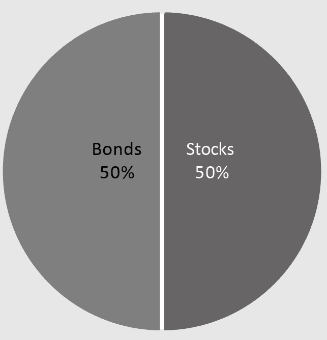
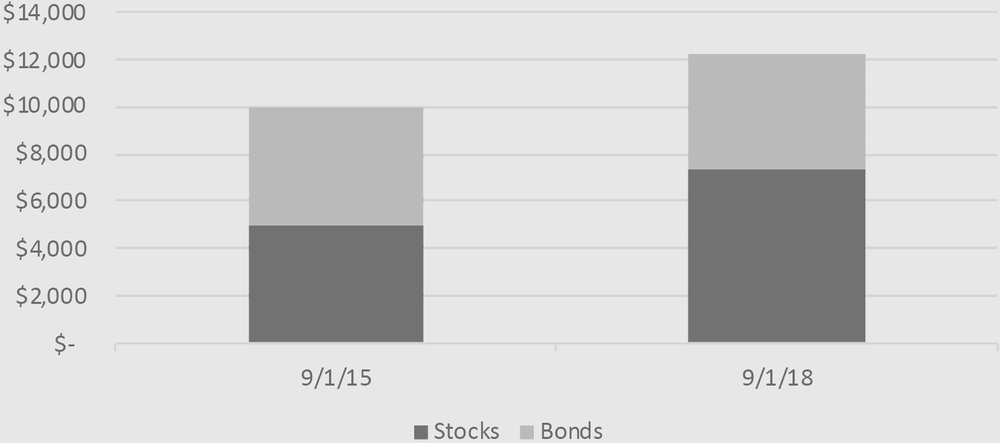
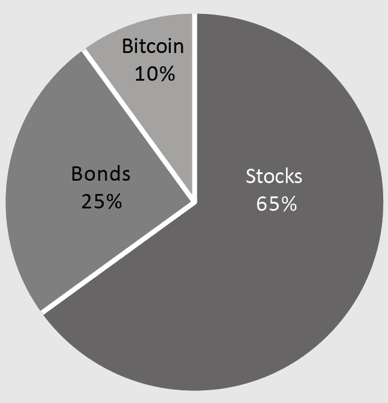
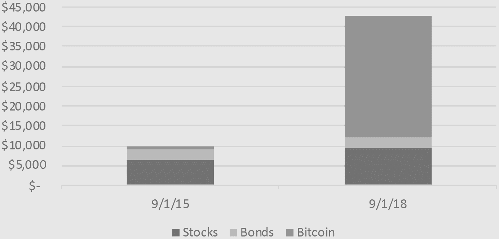
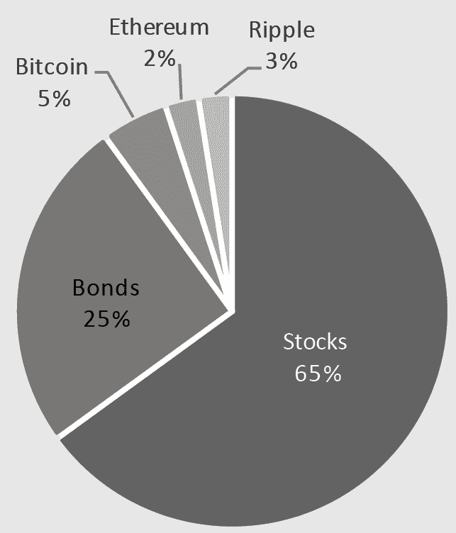
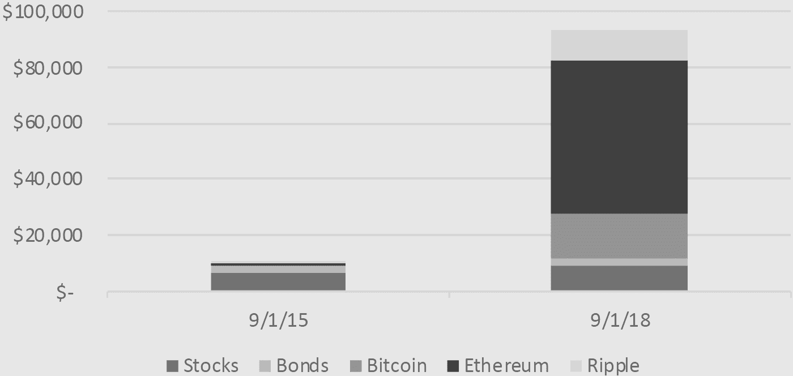
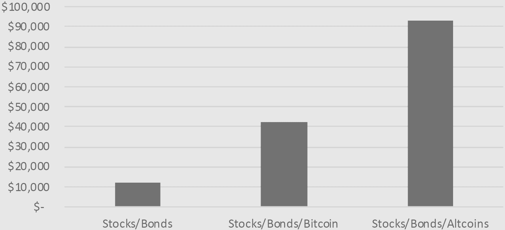

## 第三十五章

## 鸡斗

全球区块链峰会并不全球。

而且，这根本不是一个峰会。

当他们邀请我免费演讲时，原来的会场是在波士顿的一个大型露天剧场。网站上显示着美食、数百名参会者、来自世界各地的顶级商业领袖。我怎么能拒绝？这是全球区块链峰会！

现在我站在一个微型共享工作空间的大厅里，透过一扇玻璃墙看向一个大约有十几个人的会议室。在一个角落里，一块吃了一半的披萨无力地垂在纸盒边缘，湿漉漉的沙拉散落在桌子上。

然后我看到了一个我在网站上认出的面孔：我之前的演讲者。他是一位著名的哈佛学者，我期待着听他的演讲。当他走近时，我们四目相对。“不值得我花时间，”他嘟囔着，走出门来到街上。

我一度考虑过逃跑。

“John，欢迎你！”全球区块链峰会的主持人热情地迎接我。

“Sandeep，你好。”现在说这些已经太晚了。

“真高兴见到你！”他热情地握住我的手。“你要水吗？”他指了指地板上的一大箱瓶装水，它的塑料包装被口渴的熊撕得乱七八糟。

“完全补充了水分，谢谢。”

“太好了！你下一个。我们之前的几个演讲者取消了，所以你准备好了我们就开始了。”

几分钟后，我连接到墙上的小电视屏幕上，向九个人做了我练习了九百次的演讲。

### 数鸡

我家养了一群鸡。结果发现，鸡是下蛋的。

我知道这听起来很疯狂。你以为鸡蛋是在工厂生产的，然后装在纸板箱里。但是动物生产它们。它们坐在巢里，从某个蛋洞里生产出来。大自然——总是有新东西！

能吃到新鲜的鸡蛋真是太好了，尤其是当你和下这些蛋的鸡关系好的时候。当你敲开一个新鲜的鸡蛋，蛋黄是亮黄色的。与商店里买来的蛋黄相比，新鲜鸡蛋的蛋黄充满了丰富的营养和美味。

我们刚开始养鸡时，我想，免费的鸡蛋！现在我意识到它们根本不是免费的。它们住在这个后现代鸡舍里，这是由伦敦皇家艺术学院的一个团队设计的。它们吃着高端混合坚果。冬天还有电热。按每个蛋的成本计算，大约是一美元。

在冬天，鸡生产的蛋较少。我会走到鸡舍里给它们加油。“加油，小鸡们！”我会大喊。（这可不是性别歧视；这是提醒它们来自哪里。）“开始下蛋吧，女士们！”

“爸爸想要早餐！”几小时后我会大声喊着窗外。“下蛋吧，如果你有的话！”

有人告诉我，鸡蛋生产与光照量有关，所以你可以在冬天通过在鸡舍里安装室内照明来促使它们生产更多的蛋。我想，好家伙。现在他们想要一个晒黑沙龙。

“打扰一下，”一位留着马尾辫的大 T 恤 gentlemen 打断说。“我不明白这和区块链有什么关系。”

“等一下。”

“我们要谈谈区块链如何改变供应链吗？”

“不了。”

他激动地抚摸着他的胡子。“有趣的是，我们将能够使用分布式账本技术跟踪鸡。当然，共识机制需要重新设计以实现无信任交易。而不是权益证明，我们可能会有一个权威证明，其中……。”

他像这样继续了整整三分钟。我很恼火，我被骗来做这个演讲，然后被辛普森家庭的漫画书家伙愚弄。我迅速测量了一下观众的温度，他们求助地看着我。

“我们为什么不把问题留到结束，或者至少是中间？”我建议。

他交叉双臂抱在宽阔的胸前。“好吧。”

每两天，我们会去鸡舍收集鸡蛋。我们把它们放进这个矩形的冰箱容器里，然后放进车库的冰箱，最后在我们准备吃的时候放进楼上的冰箱。

每打 12 美元，你会小心这些珍贵的最新鸡蛋。它们就像充满了金子。所以你可以想象我当容器卡在车库冰箱的门上，我摔了鸡蛋时的沮丧。悲伤的蛋黄，一种发亮的黄色灾难，我自己的鸡变异。

“没关系！”我大喊。“它们只是有点脏！我们还可以做煎蛋卷！”我冲到车库地板上捡起鸡蛋，拿起一些硬纸板。

这很可怕，沙子、灰尘和机油与鸡蛋混合在一起。鸡有时候会进入车库，给我们留下礼物，所以那也混合进去了。这是一个充满黄金的珍贵最新鸡蛋的完全加载的地狱煎蛋。一个弗洛米蛋。

每本投资书籍都会告诉你不要把所有的鸡蛋放在一个篮子里，因为如果你掉了篮子，你会失去所有的鸡蛋。这是真的。但同样真实的是，你必须有一些篮子。否则你得一个接一个地把鸡蛋从鸡舍搬到楼上的冰箱。

保守投资组合

假设 2015 年你将 10,000 美元投资于一个经典的股票和债券组合，各占 50%。那是一个很好的牛市，三年后你祝贺自己 10,000 美元增长到 12,219 美元：增长了 22%。

股票和债券

现在假设你进一步将那 10,000 美元分散投资为 65%的股票，25%的债券和 10%的比特币。换句话说，你将 9,000 美元投入你的“经典”组合，并投资 1,000 美元在这个名为比特币的新事物中。三年后，你的投资组合价值将翻倍，超过 42,000 美元。

积极投资组合

股票、债券和比特币

现在假设你投资了 9000 美元在你的“经典”混合物中，其中 65%是股票，25%是债券，但剩下的 1000 美元已经分散投资到了三大加密货币中：500 美元投入比特币，250 美元投入以太坊，另外 250 美元投入瑞波币。三年后，那 10000 美元的投资将价值超过 93000 美元。

多元化的投资组合

股票、债券和三大加密货币

这是应该让我们的财务规划师心脏病发作的图表。什么投资在三年的时间里增加了九倍？他们为什么甚至不知道它？这是在过去三年里比较三种策略的图表。^(59)

投资策略比较

我们通过购买 Total Stock Market Fund 来分散我们的股票。我们通过购买 Total Bond Market Fund 来分散我们的债券。我们最多只将 10% 投资于多元化的区块链。我们试图让我们的投资多样化，这样我们就不会得到一个煎蛋卷。

“对不起，但我来这里是想了解区块链的，”漫画书先生打断说。“这是全球区块链峰会。”

“不是全球性的，”我立刻反驳，“而且不是高峰会议。”

“对投资者来说更有趣的是，”他继续说，“SHA-256 哈希算法如何在 Merkle 树中存储数据，以更好地实现无需法定货币的无信任交易 . . .”

在他继续讲下去的时候，我平静地走向会议室旁边的洗手间，让他自己跟自己说话。我真地花了很长时间。洗手后，打开了空气干燥机，在那个狭小的空间里，它的声音听起来像战斗机的涡轮引擎。

当我出来的时候，大家都沉默不语。

“正如我刚才说的 . . .”我继续说道。

总结：

 我们的首要任务是分散我们的整体投资组合——将馅饼切成互补的块，使它们相互平衡。

 我们的第二个任务是在我们有时间和兴趣的时候，像分散我们的区块链投资组合一样进行投资。

这就是我们如何将鸡蛋放在合适的篮子里。那可不是个蛋黄。

“我欣赏你的幽默感。”他是唯一在笑的人。“那很好。”

我决定见好就收。“谢谢您的宝贵时间，”我鞠了一躬说道。

供应链：将产品从供应商送到客户的一系列人员网络。鸡蛋从养鸡场送到分销商，然后是仓库，接着是超市，最后到你的肚子里。

区块链可以简化所有这些复杂的文件，让消费者看到他们的鸡蛋是从哪里来的。

去中心化账本技术：天空中的大支票簿。

共识机制：不同的区块链有不同的实现共识（即，对账本中存储的内容达成一致）的方式。当你向网络贡献某些东西时，你“获得”了投票权：要么是计算能力（工作量证明），要么是金钱（权益证明），要么是其他东西（填空证明）。这些系统没有一个是完美的。

无信任：区块链极客们喜欢说“无信任”，这是一个令人困惑的词。它的意思是“让你信任一个你不认识的人。”

一个更好的词是“可信”。

散列算法：将数据混淆，使其不能被其他人阅读。

区块链的核心技术密码学使用散列来保护敏感数据。

SHA-256：简称“安全散列算法”，这是一种高度安全的数据混淆方式。

默克尔树：以计算机科学家拉尔夫·默克尔的名字命名，这是一种有效的方式，在大型数据集中查找值（例如，在整个区块链上）。

法定货币：美元、英镑、欧元等。

回到大堂，一位衣着得体的先生正从沙发上微笑着看着我。“那很艰难，”他笑着说。“但很有趣。”

“在两点上我都同意。”我摇了摇头，然后和他握手。“约翰·哈格雷夫。”

“我在波士顿经营一家联合办公空间的连锁店，”他继续说道，“我们正在讨论建立一个区块链孵化器。你对此感兴趣吗？”

“这取决于，”我小心翼翼地回答。“你们公司的名字叫 TechLab 吗？”

“不可能，”他回答道。“TechLab 是我们的竞争对手。我们真的想发展波士顿的区块链社区，”他继续说道，然后压低了声音。“我有信心我们可以做得比全球区块链峰会更好。”

我开玩笑说：“我在忏悔室里面对的听众更多。”

他笑着说：“哦，别担心。我们要建立一些大的听众群体。”
