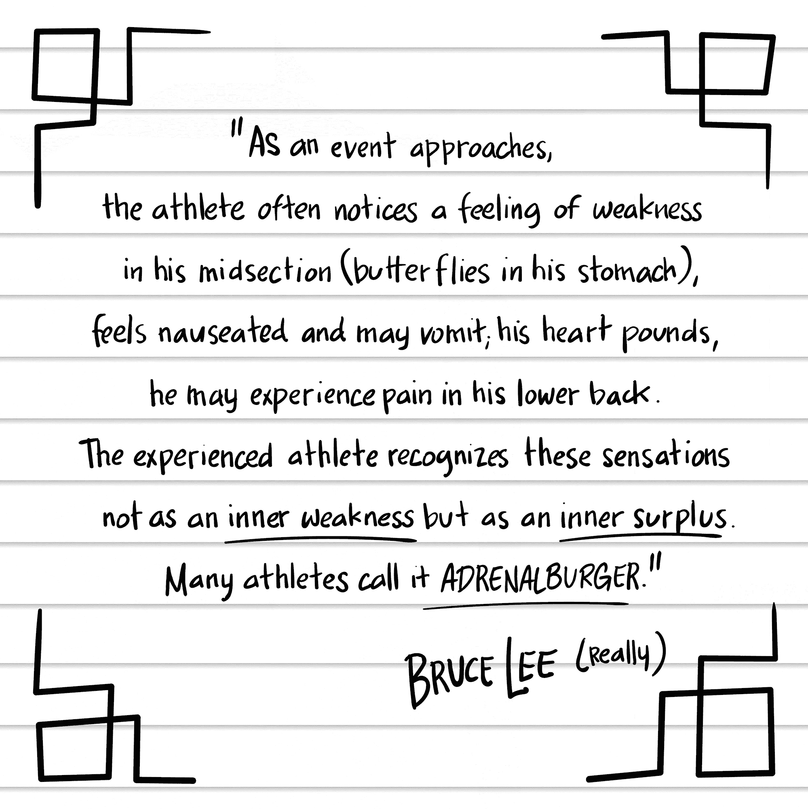

## 第三十六章

## 《区块链亿万富翁》

公开演讲有一个秘诀：多失败。

失败是不可避免的。尽管你的脑海会因为你公开的尴尬而折磨你好几天，但当你再次失败时，你公开的尴尬会减轻，引发新一轮的痛苦。

当你失败足够多次后，你会得到一个解放的认识：你会活下来。我已经失败得比德国空军还要多，我仍然还活着。失败培养了韧性。它给了你尝试新事物的勇气。失败给了你一份珍贵的礼物：奥巴马总统所说的“无畏”。^(60)

话虽如此，但在 2500 人面前上台前，我吓得魂飞魄散。

世界加密会议在拉斯维加斯的 Aria 会议中心举行，这是一个充满渴望了解如何赚钱的区块链投资者的巨大大厅。我很紧张——不是因为观众人数太多，而是因为我将要说什么。

“你还好吗？”舞台管理员一边把无线麦克风电缆穿进我的衬衫，一边问道。“需要水吗？”

“不，我想保持清醒。”我面无表情地回答。

“好的。”他把听筒挂在我的皮带上。“你以前在巨型屏幕前说过话吗？”

“有一次，在我表弟的婚礼上。”

“这对很多人来说都是分散注意力的。试着不要看它。”

“试着不要看巨型屏幕，”我重复道。“直接在我视野内的巨型屏幕。”

“它在你的背后。只需看着你面前的监视器。你会在那里看到你的演讲。你需要开场音乐吗？”

“肯定是开场音乐，”我回答道。“一些能量极高的音乐。”

“我会告诉 DJ 的。”他在记事板上做了一个笔记。“灯光会很亮，所以你无法看到任何人。”

“还有别的事情吗？”我心想。“我需要躲开掉落的砖块吗？”

“除非有人朝你扔一个，”他面无表情地回答。

“请欢迎，”主持人高声喊道，“即将出版的最佳畅销书《区块链入门》的作者 JOHN HARGRAVE！”

Techno 音乐大声播放。彩色的聚光灯疯狂地舞动。疯狂的混乱，声音和噪音。在那里，有男孩和女孩。

“有多少人想成为区块链亿万富翁？”我对着超新星大喊。掌声。

“过去的一年里，我一直在研究这些区块链亿万富翁，”我开始说，“并逆向工程他们的秘密。通常有三种致富之路。”

1. 他们很早就买了比特币。但他们不仅仅是购买；他们相信。以 Winklevoss 双胞胎为例，他们用从起诉马克·扎克伯格窃取 Facebook 赢得的钱，然后投资于比特币。但他们不仅仅是购买；他们持有。每当市场崩溃时，他们都会持有。他们甚至还有一个口号：“斯巴达人持有。”

2. 他们创建了价值巨大的区块链。他们不仅仅是投资者，更是发明家。以 19 岁的天才维塔利克·布特林为例，他发现区块链不仅可以用于比特币，还可以用于去中心化应用（或 dapps）。他发明了一个区块链开发平台——不是为了发财，而是为了创造有价值的东西。投资者们让他发了财，他们纷纷向以太坊投入数十亿美元。

Dapps：简称“去中心化应用”，运行在分布式网络上的由区块链驱动的应用程序。

3. 他们投资于伟大的区块链项目。区块链巨鲸不需要再工作。他们做什么呢？他们将那些钱再投资到新的区块链项目中去。这就好比在《大富翁》游戏中在圣詹姆斯大道上建酒店，为你带来收入，以便你再投资于你的马文花园酒店，这让你得以在董事会大道上建酒店。游戏结束。

DWeb：简称“去中心化网”，意味着整个 dapp 生态系统的全部，正如“网络”意味着整个网站生态系统的全部。

“中本聪的愿景是开源货币，”我说，从口袋里掏出一张钞票。“我们不再需要这些玩意儿了。”我戏剧性地撕掉了一张美元钞票，人群沸腾了。

“但是如果是开源货币，那我们为什么还要如此紧紧地抓住它呢？”我的目光捕捉到了巨幕的一角，我暂时陷入了困惑。我的头像被放大到会议中心那么大，同步模仿着我的每一个动作，但延迟半秒。我迅速转开了头。

“让我给你讲一个真实的故事，”我继续说，“我教堂里有一个年轻人，他在非洲的一个最贫穷的国家做了将近一年的人道主义工作。他忍受了极具挑战性的生活条件：睡在床单下，周围蟑螂横行，他试图获得足够的营养，试图在没有道路和桥梁的情况下帮助人们满足基本需求。

“我几周前见过他。他那时和家人待在一起，他们家在波士顿有一座美丽的房子，我就问，‘从那样的地方搬到这儿来感觉怎么样？’他眼中露出了那种见过战争的人的遥远目光。”我停顿了一下。

“看到一个年轻人脸上露出那种不言而喻的悲伤和痛苦，真是让人印象深刻。他告诉我，‘主要是它让我感到愤怒。愤怒我们如此富有，而世界上其他地方的人却如此贫穷。’”

现在你甚至可以听到圆珠笔掉落的声音。“我敬佩像比尔·盖茨和沃伦·巴菲特这样的亿万富翁，他们发起了捐赠誓言，呼吁其他亿万富翁捐赠他们的财富，以改善世界。”我激动地说，“新的区块链亿万富翁们必须效仿。”

掌声？没有掌声。也许我应该再撕一些钱。

“我们正在构建我们想要生活的世界。我想要生活的世界是一个我们不仅为自己创造财富，也为整个世界创造财富的世界。财富属于每个人，而不仅仅是富人。”

前排传来零星的掌声。我点击进入一个全球地图，它被投影在巨幕上，几乎和实际大小一样。

“想象一下金钱在全球范围内的流动就像水的流动。拥有健康金融系统的国家之间有强大的金钱河流：那些是粗线。基础设施破败的国家，比如津巴布韦和委内瑞拉，只有细小的溪流。那些是细线。”

“今天世界上有 20 亿未接入银行的人。^(61) 20 亿！如果你来自一个贫穷的国家，为了更好的生活搬到美国，你怎么把钱寄给家里的家人？这个过程很慢，很昂贵，而且银行根本不运作。这个系统已经破碎了。”

再来一点掌声。越来越有劲了。“比特币和山寨币能像清除溪流中的障碍物一样解锁财富和价值的流动。但真相是，朋友们，比特币不是免费的：发送它需要支付费用。它不具备可扩展性：随着区块链的增大，它变得越来越慢。而且很多人并不信任它。

“所以我的愿景比比特币更激进。我们需要一种具备四方面特点的数字货币。

 免费。我说的不是手续费低的数字货币：我说的没有手续费。在定价方面，没有比免费更好的了。

 瞬间完成。从一个钱包到另一个钱包，无论世界何地。金钱的速度应该和光速一样快。

 可扩展。我们需要一种能够支撑整个人类的数字货币。每天数以万计的交易。

 值得信赖。所有的货币系统都建立在信任之上。在我们所做的一切中，在我们所说的一切中，我们必须努力建立那种信任。这是我对你们的号召。

“免费、瞬间、可扩展、值得信赖。FIST。”我点击进入我的最后一张幻灯片：一个按照苏联宣传风格举起来的拳头。

“如果你和我站在一边”——我提高了声音——“那就举起你的 FIST。这就是我们带领世界摆脱贫困的方式。”有人举起拳头了吗？我仿佛盯着一个核反应堆。

“我是约翰·哈格雷夫，我祝愿你们健康、财富和幸福。”我鞠了一躬，但无法听到掌声的响度，因为震耳欲聋的电子音乐和耀眼的灯光太强烈了。

* * *

在幕后，舞台管理员忙着从我衬衫里取出麦克风。我迫切想知道效果如何，但我已经了解到舞台管理员忙于管理舞台。他可能一个字都没听到我说的。

“嘿。”一个声音向我这边喊，我转过身去。是比特币社区传奇人物查理·施雷姆。他穿着 T 恤、运动夹克和帽子，被他的随行人员包围：十足一个比特币大亨的派头。

他上下打量了我一番。“你又叫什么名字？”
