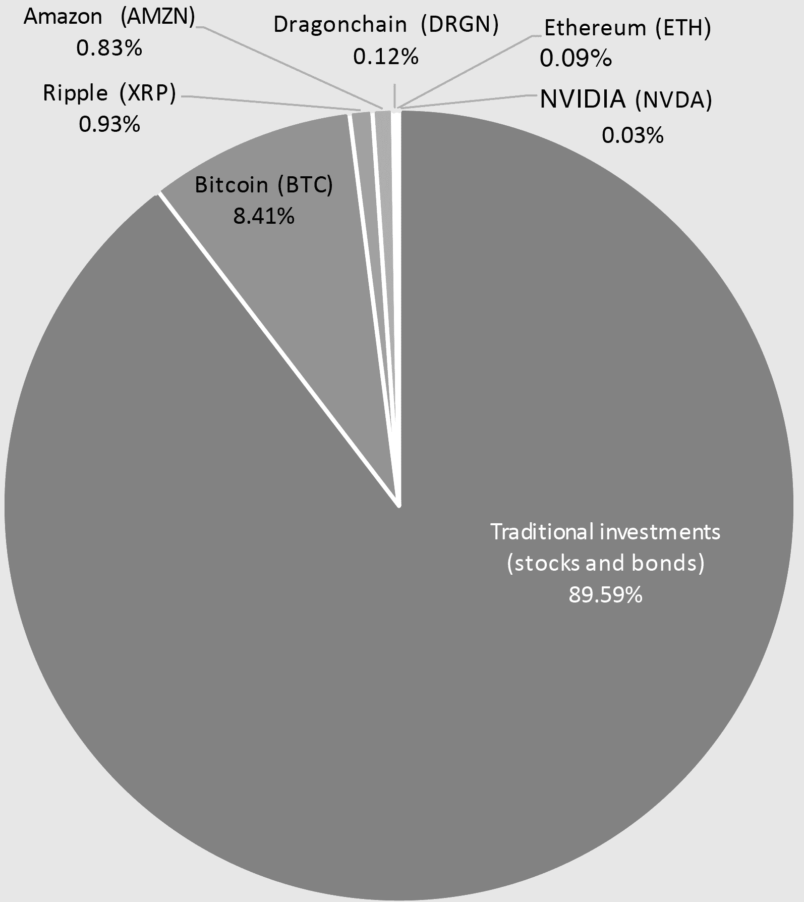
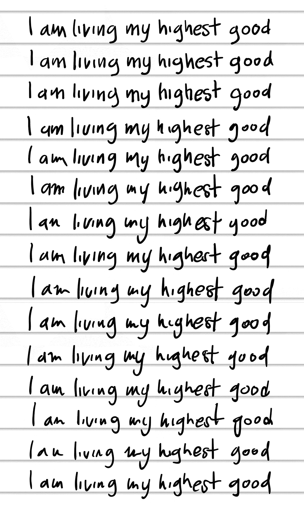

## CHAPTER 37

## 加密货币兄弟 vs. 区块链专家

“我认为区块链世界正在分成两组，”我开始说。就在几个小时前，我还在 aria 的会议室里发表了主题演讲，现在我正在与 Rosewind Capital 几位合伙人进行私人培训。会议室里人满为患。

“第一组是想快速致富的人。他们是投机者。他们试图操纵市场。他们‘哄抬价格然后抛售’。我称这些家伙——他们几乎都是男人——为加密货币兄弟。

“第二组是想慢慢致富的人。他们是具有影响力的投资者。他们寻找具有真正价值的区块链项目。他们长期持有。我将这些人称为区块链专家。

“加密货币兄弟对区块链专家。这也可能是张糟糕的饶舌专辑标题。”几个人笑了。“现在，今天你有两个选择：你可以参加我们的私人会议，或者你可以去哪里？”

“扑克锦标赛，”前排桌子的一位先生提议道。

“你可以去参加扑克锦标赛。你可以来这里学习投资，或者你可以赌博。你做出了正确的选择。我为你鼓掌。”一旦我开始鼓掌，其他人也都跟着鼓掌。

“扑克是一种技巧游戏，”一个声音从会议室后面传来。我寻找着声音的来源，它来自一个穿着白亚麻衬衫和飞行员太阳镜的男子。

如果你看看历史数据，纳斯达克和比特币早期价格波动和波动性有着惊人的相似之处。每个新的资产类别都涉及一个价格发现和市场验证的过程，这个过程需要一段时间。与此同时，传统智慧是有效的：分散你的投资组合，对冲风险。^(62)

—Navroop Sahdev，55Foundry 经济战略负责人

“嘿，摘掉太阳镜，这样我就能看到你了。”

“这里太亮了，伙计。”他露出了牙齿。“我靠窗坐。”

“你说扑克是一种技巧游戏，”我重复道。

“如果你厉害，那就是。”

“那你靠什么谋生？”

“加密货币交易员。”

“对，但你要怎么做才能赚钱？”一些人笑了。

“加密货币交易员，全职。”

“你赚钱吗？”

“很多。”

“那好吧，一年后，五年后，十年后回访我们。因为最终你会遭受重大损失。与此同时，我们其他人将享受悠闲的泡澡。享受增长。”

“什么时候能买到兰博基尼？”同一个桌子的一位年轻络腮胡男士问道，许多人笑了。

“如果你刚刚加入我们，”我解释道，“‘When Lambo’是‘When will I get my Lamborghini’的俚语，这是一款价格昂贵、油耗糟糕的汽车：市区 10 公里/小时，高速 17 公里/小时。”^(63) 我一直等着用这个。这是小小的快乐。

“我已经放弃了快速致富的念头，”我继续说。“风险太大。在我寻找一家十亿美元公司的征途中，我将整个公司都投入到了区块链。我为那个决定付出了沉重的代价。但我们的损失变成了教训。当你遭遇挫折——你会的——你能将它们视为向生活学校支付的学费吗？

“我学到了很多宝贵的教训。我了解了自己的力量。我找到了自己的声音。我学会了如何自己洗衣服。”

人群中传来几声窃笑。

“巨大的风险可能带来巨大的回报。但巨大的风险也可能带来巨大的遗憾。”我笑了笑。“谈到区块链，永远不要投资超过你承受损失能力的资金。百分之百。高风险赌博、日交易、投机——那是加密币兄弟的方式。”

从会议室的后面，我看到那桌男人们站起来，从边门走了出去。“对我们大多数人来说，”我继续说，“慢慢积累财富更好。我在一方面对冲了风险：我没有动我的个人投资。所以现在我会敞开我的胸怀，展示我的个人投资组合。”

### 区块链上的价值投资

价值投资的基本原则很简单；我们已经将其更新为适应区块链时代。

 采取长期“价值投资”策略，寻找那些价格合理的伟大公司。

 采用稳扎稳打的投资策略，每个月自动将相同金额的资金转入你的投资组合。

 将你的投资组合的大部分放在股票和债券上。

 将区块链视为你的“替代投资”，是整个投资中的一小部分。

 为了找到有前景的区块链投资，你需要做足功课（定性和定量分析）。

 你的区块链投资可以是比特币、山寨币和传统上市公司的混合。

让我们看看我的个人投资组合，看看你可能会如何将这些理论付诸实践。

传统投资构成了我持股的大约 90%：股票、债券和房地产。最简单的方法就是购买一个全面股票市场基金和一个全面债券市场基金。（详见参考指南 3，每个类别的样本比例。）

比特币（BTC）构成了我区块链投资中最大的一部分（约 8%），因为我已经做了功课，并决定对我来说，比特币似乎是所有区块链投资中最稳定且具有最长远大前景的——更不用说品牌知名度最高了。

Ripple（XRP）、以太坊（ETH）和龙链（DRGN）等山寨币大约占 1%的比例，因为我的研究显示它们代表了未来的区块链平台。

像亚马逊（AMZN）和英伟达（NVDA）这样的传统公司构成了我的投资组合，因为我的分析显示它们是伟大的公司，正处于从区块链中获利的有利位置。

透明对我很重要。我想让你知道我的投资，这样你就可以看到我可能存在的偏见。我跟你分享这些，并不是希望你投资相同的东西：事实上，我希望你不要这么做。我更希望你自己做研究，得出自己的结论，做出自己的决定。

这一切的目标是共同学习。我希望我们都能做出最勇敢、最有信息量的决策，分享我们的成功和失败。开源数据：这是区块链的精神。

“与其让自己变富，你的投资应该让你过上富足的生活，”我指出。

我停顿了一下，突然感到有些情绪化。“你知道，我过去一年一直在重新启动我的思维，重新启动我的业务，重新启动我的生活。这很难，真的很难。”我吞了吞口水。“但我真的很高兴我这么做了。否则我就不会今天在这里和你在一起了。

“我们时不时需要重启。否则我们会变得有漏洞且运行缓慢。区块链技术正在重启我们的政府，我们的金融系统，我们的医疗系统，我们的财富分配，还有成千上万的其他事物。这是需要时不时发生的事情。现在是时候了。

“我有一个这样的 Moleskine 小笔记本……顺便说一句，Moleskine 并没有给我付钱，我只是觉得这个名字很有趣，好像它们身上覆盖着小鼹鼠的皮：加拿大鼹鼠捕猎者，鼹鼠皮贸易，濒临灭绝的鼹鼠，鼹鼠很美运动，MAB 暴民，鼹鼠保护立法，鼹鼠保护区，导致鼹鼠过度繁殖，然后是鼹鼠赏金猎人和更多的 Moleskine 笔记本。”

我打开一页。“这只是我在这里写下的一个想法。”有些人笑了；有些人看着我，想知道我什么时候会谈论比特币。

“不管怎样，我在我的 Moleskine 笔记本上用李小龙的风格写下了一些小肯定语句，这是最新的。”

“至少现在，我的最高追求是让区块链变得有趣和好玩。用简单的英语解释它。让世界上另外 99%的人以安全和理智的方式投资——这样这个生态系统才能发展。引导它的成长和发展，这对世界是有好处的。”

我微笑着举起三根手指。“易于理解，易于使用，易于投资。但我不能独自完成。我希望你能加入我。我希望每个人都能加入我。我希望我们能共同实现……”

我切换到我的书皮的幻灯片，就是你现在正在读的这本书，带领房间里的大家说：

“区块链属于每个人！”
