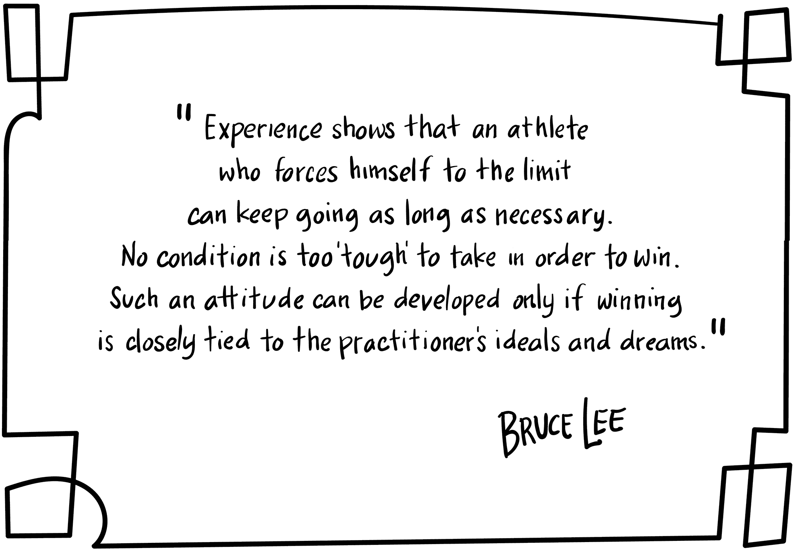
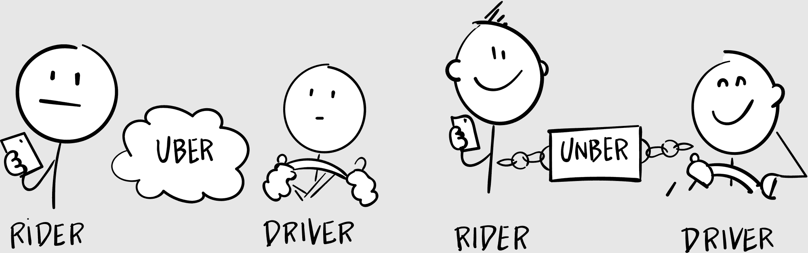
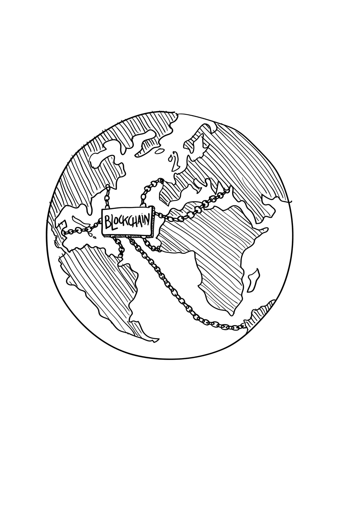

## 第三十八章

## 离开兰博基尼展

这是一个晴朗的 10 月日子，在拉斯维加斯，我高兴地眯着眼睛，把我的行李搬到 aria 酒店外的路边。行李员跟在我后面，推着我们的贸易展位。

我翻看了一下我的钱包，发现我只有 2 美元的现金。“对不起，朋友，”我笑着说，然后把它递给了门童。“这是我所有的。”

他亲切地接受了。“没问题。”

我叫了一辆优步，然后给我妻子打了个电话。

“嘿，宝贝，”她回答道。“表演怎么样？”

“我觉得我们有一些生意要谈。”

“这真是个好消息，”她说。

“还有更多的好消息：我收到了一张支票。我的第一次有偿演讲。”

“呜呼！”她说道，尽力模仿霍默·辛普森。“还有更多的好消息：从这个月开始，我们正式回到盈利状态。”

我突然想到亚特拉斯背负着世界，最后把它放在行李车上。“真让人松一口气，”我叹了口气。

“还有更好的消息，”她说。“我还有更多的好消息。”

“还有更多的吗？葡萄干吐司现在免费了吗？”

“我收到了我的申请的回复。”

“然后呢？”

“他们接受了我！”她兴奋地叫道。

“恭喜你！”听到这个消息，我感到一股复杂的情绪涌上心头。我不得不坐在我的手提箱上。

“不仅如此。他们还授予我了一份全额奖学金！”

“神圣的主。”

“我非常激动！”她说，我能感觉到她在颤抖。

“波士顿大学神学院。 bust！你将要去一个以乳沟命名的神学院。”

“你知道，马丁·路德·金去过那里。”

“他们在‘博士’这个词前面加上了‘博士’马丁·路德·金博士。”

“我已经想好了，”她继续说。“我仍然会全职为媒体淋浴工作，并兼职完成我的学位。我已经把我的第一学期都草拟出来了。”她停顿了一下。“你没问题吧？”

“我非常为你感到高兴，”我对她说。这是一个新的开始，也是一个结束。

“你确定吗？”

“你在我所做的一切事情上都支持我。当事情变得尽可能糟糕时，你从未放弃过。你是个圣人。这是有意义的，现在轮到我来支持你了。绝对是。”

“这需要几年时间。我甚至不知道我想用它做什么。”

“我觉得你应该成为一名传教士。”

“不，”她说。“真的吗？”

“然后我可以说，‘你知道，我不是一个传教士，但我曾经和一个传教士睡过。’”

“这太神奇了！”她晕乎乎地说。

“我为你们感到骄傲。”我抬头看了看。“嘿，我从机场给你打电话。优步到了。”

### 与陌生人同行

你的一生中，人们一直在告诉你，你永远不应该接受陌生人的搭车。然后优步出现了。

现在我们不仅跳上了一位陌生人的二手普锐斯，我们甚至为这种经历付钱。这是因为这种体验比另一种选择好得多：招揽出租车。

你还记得坐出租车吗？你进入这个潮湿的亚克力玻璃箱，里面有椰子空气清新剂的味道。座位缺失弹簧。一个电视屏幕朝你大声播放噪音。你看着计价器一点一点上涨，就像倒计时的炸弹，担心司机故意带你绕远路。

然后你应该付小费！你是因为司机没有撞死你才给小费的吗？

优步一次性解决了所有这些问题。平坦的票价。正常的汽车。透明的路线。尽管优步有很多缺点，但它已经将出租车行业的黑色心脏刺穿。优步通过使整个体验变得更好，使世界变得更好。

出租车行业亟待颠覆。你无法从内部改革出租车行业：不良行为，令人窒息的监管，司机与乘客之间的敌对情绪...它们都根深蒂固。

创造性破坏：当一个旧行业或机构被一个更新、更好的替代品摧毁（想想出租车对优步）。

出租车行业不能只是将技术嫁接到他们旧的业务模式上：优步颠覆了旧的业务模式。经济学家称这为创造性破坏，^(64)，今天我们看到旧的（集中的）公司在努力整合这种新的（去中心的）区块链技术，以免它们也被创造性地摧毁。

优步不是区块链。虽然优步在某些方面是去中心化的，但在其他方面却是高度中心化的。谁拥有司机池？优步。谁拥有用户生成的评分？优步。谁拥有所有那宝贵的客户数据？优步至上。

下一波创造性破坏将针对优步本身。想象一下无优步：一个基于区块链智能合约的优步去中心化版本。当你想要一辆车时，你打开无优步应用，输入目的地，然后将预估的付款（以比特币）发送给智能合约。

我开着我那辆二手的普锐斯接你，把你送到那里，边开车边闲聊，并给你一瓶气泡水（我们表现得很好）。一旦到达，智能合约通过我们的 GPS 坐标看出行程已完成，并将付款释放给司机。我们互相给对方五星评价。

在这个系统中，没有人“拥有”数据、付款或评分：所有内容都记录在公共区块链、公共账本、天空中的大支票簿上。因为没有了优步总部，司机能获得更大的收入份额。

创造性破坏无处不在。它可能导致革命，但也可能导致进化。如果我们灵活且开放，如果我们欢迎变革并拥抱增长，我们可以变得更好、更强大。如果不是，嗯，你可以一直开世界上最后一辆出租车。

“要去机场吗？”我的优步司机问，帮我把所有的行李都放进他 SUV 的后备箱。

“回家，”我说。“终于。”

“你是来参加汽车展的吗？”

“不是，这是一个区块链聚会。”

“区块链。”他关上后盖。“区块链是什么？”

“这是一个很长的故事。”我爬到了后座。

我的优步司机说，“看看那个，”他系上安全带。“一辆兰博基尼。”他嘟囔着。“还有一辆布加迪。一辆法拉利。那是个……让我看看，那是个迈凯轮。还有……”他吹了声口哨。“那是一辆莱肯超跑。”

我站在一个豪华车展旁边，就在 aria 的下车圆环中间。我甚至没有注意到。“所以他们把这些车停在这里？”我问。

他笑了。“这周有个大型的汽车展在这个城市举行。肯定是他们的活动之一。伙计，看看那个。”他把车开得离超跑更近，伸长脖子去看。“那是一辆价值 300 万美元的车。看，它的车灯里嵌有钻石。看看人群。没有人关心这些其他的车。”

我回到我的手机上。“你自己看看吧，”我说。“我要登机了。”

他说，“你可能再也看不到另一辆那样的车了，”他慢慢地把目光移开。

我说，“嗯，谁知道未来会怎样？”

