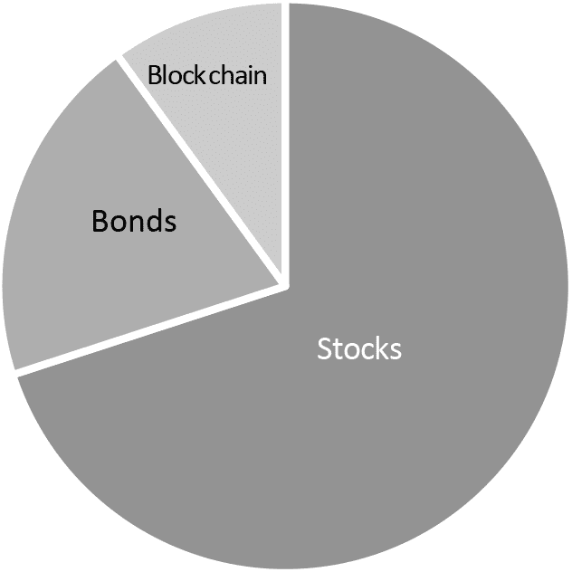
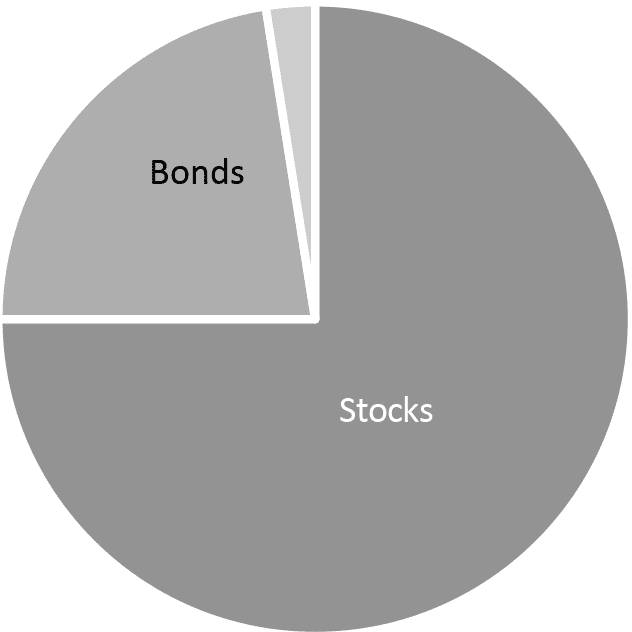

## REFERENCE GUIDE 1

## 区块链投资者组合

数字资产投资的逐步模板

为你的投资留出一笔每月的金额——即使只有 100 美元。理想情况下，这将是从你的银行账户自动扣除到你的投资组合的，这样你就可以“设置并忘记它”。

将你的每月投资分配到三个部分：股票、债券和区块链（2%至 10%）。

大信徒

Baby Believers

例如，假设你决定每月进行稳定滴水式投资，金额为 500 美元。每个月，你将这 500 美元分开并根据你的风险承受能力和对区块链的信念进行投资：

 大信徒：70%的传统股票，20%的传统债券，10%的区块链

 婴儿信徒：75%的传统股票，22.5%的传统债券，2.5%的区块链

大型区块链信徒愿意承担更多的风险（即，亏钱）以换取更大的回报（即，赚钱）。他们每月的 500 美元滴水式付款将分为 350 美元投入股票，100 美元投入债券，50 美元投入区块链投资。

婴儿信徒们想要在区块链上投资一些钱——但如果这最终证明是一个奇怪的梦，不会造成太大的损失。他们每月的 500 美元滴水式付款将分为 375 美元投入股票，113 美元投入债券，12 美元投入区块链。

作为一个经验法则，你的债券比例可以大致等于你的年龄。当股市下跌时，债券提供保护：当你年轻时，你需要较少的保护，而当你准备退休时，你需要更多。如果你能接受更高的风险，你可以保持较高的股票比例，但尽量不要使风险比例超过 75%/25%的任一方向。

与其尝试挑选个股、债券和区块链投资，最简单的投资方式是通过指数基金，它为你买下整个市场：

 股票。美国投资者可以考虑先锋 Total Stock Market Index，它费用低廉且具有广泛多元化。其十年平均年回报率为 7.4%。您可以通过像 TD Ameritrade 这样的在线券商购买。

 债券。为了接触整个债券市场，可以考虑通过同一在线券商购买低成本的先锋 Total Bond Index。当股价下跌时，债券价格通常会上升，因此债券可以作为抵消帮助你保护投资。

 区块链。在撰写本文时，还没有区块链市场指数基金，所以最简单的解决方案是通过像 Coinbase 这样的在线交易所每月购买比特币。您可以通过购买其他代币进行多元化，关于这一点我们将在下一节中介绍。

-   因此，每月投资 500 美元的“坚定信徒”将会投资：

-    350 美元在她的总股票市场基金中，通过她的在线券商；

-    100 美元通过她的在线券商投资总债券市场基金；

-    50 美元通过她的在线比特币交易所购买比特币；

-   每六个月平衡比例一次。在您的日历上为 1 月 1 日和 7 月 1 日设置一个定期约会。这意味着你可能需要出售你的比特币并将这些收益重新投资于传统的股票和债券，反之亦然。

-   在区块链市场迅猛发展时这样做并不容易，但在区块链市场低迷时却能提供保护。想想那些在 2017 年搭上区块链热潮的投资者，却在 2018 年损失了所有利润。那些将区块链利润转化为股票和债券（即每半年平衡一次投资组合）的投资者保护了他们的财富。

-   使用这种方法，你将拥有一个经过研究证明的投资方法，在投资总股票和债券市场的同时留出一部分给区块链投资。你将能够享受区块链投资的增值，同时在情况变坏时仍然受到保护。

-   但除了比特币，你如何挑选这些投资？直到我们拥有一个易于使用的区块链指数基金，你可以使用定性分析（研究和判断）和定量分析（研究和数字），这在接下来的两个指南中会涉及。

-   成功的投资者既使用定性分析也使用定量分析。他们是投资领域的连体双胞胎。

-   仅凭 Investor Scorecard 评分在参考指南 2 中购买山寨币是愚蠢的，而不去深入了解背后的数字。同样，仅凭参考指南 3 中的图表做出投资决策而不做 Investor Scorecard 也是愚蠢的。

-   如果你擅长其中一个而非另一个，那么与能补充你的人合作。互相作为对方的意见箱，并尝试一起找到真相。开源数据——这是区块链的精神。
