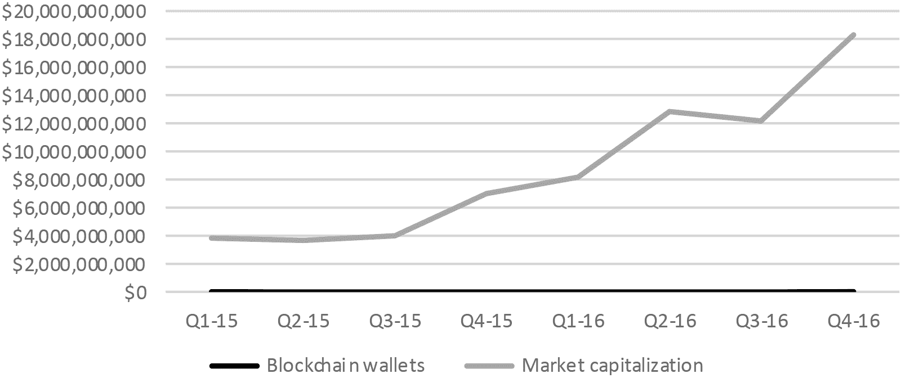
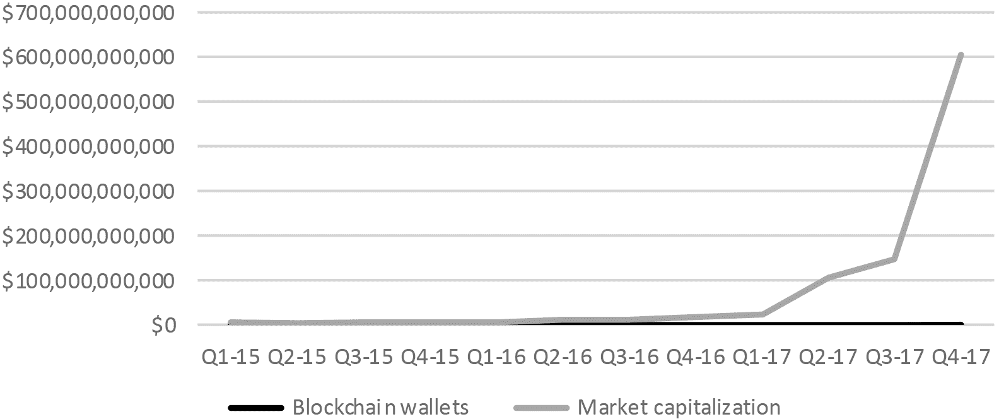
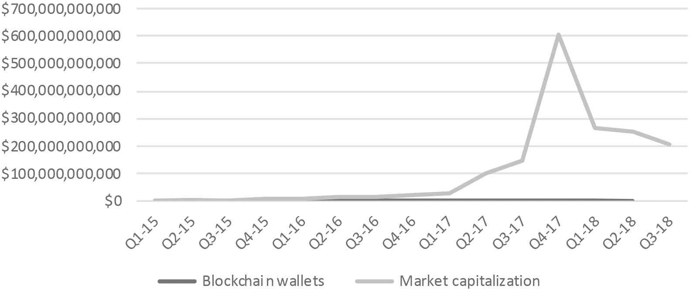
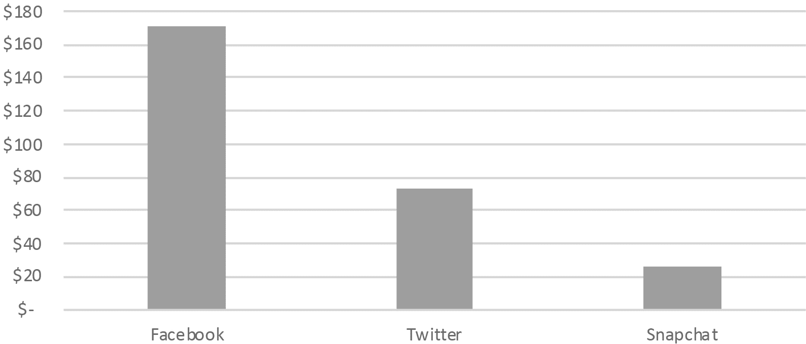
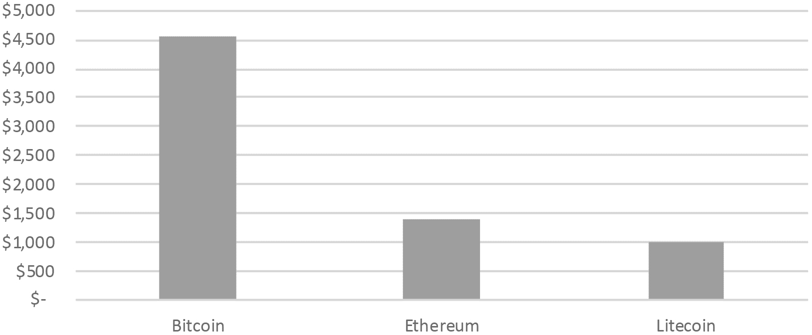
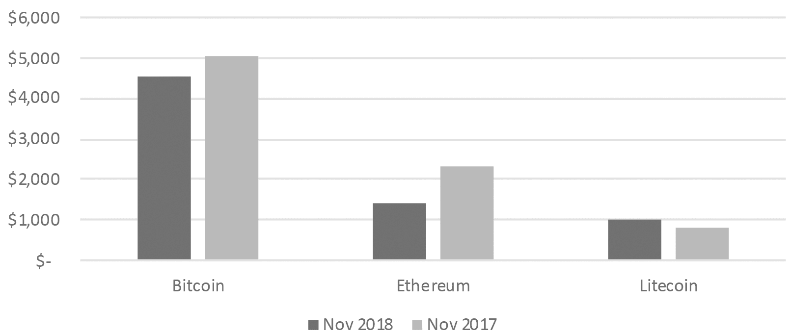
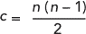
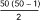

## 参考指南 3

## 区块链投资者指标

区块链具有网络效应：使用区块链的人数越多，它的价值就越大。

就像电话网络一样，随着区块链吸引更多用户，它对所有用户来说变得更有用。用户越多，连接越多，价值越大。假设代币数量固定，每个代币的价值变得更高，因为它在网络中“持有”了更多价值。

#### 总网络价值

让我们来看看这个理论在现实生活中是否站得住脚，我们将比较 2016 年底之前的区块链投资者与整个区块链市值（即所有替代币的总价值），看是否遵循类似的模式。

区块链总网络价值 2015-2016

用通俗英语来说，随着区块链用户（通过钱包测量）数量的线性增加，区块链市场的总体价值呈二次增加。火箭起飞前稍有延迟，但最终成功发射。到目前为止，一切顺利。然后是 2017 年。

区块链总网络价值 2015-2017

2017 年 12 月，区块链狂热达到高潮，推动比特币和替代币的价值达到令人眩晕的高度。让我们看看那之后发生了什么：

区块链总网络价值 2015-2018

区块链用户继续以稳定的速度增长（每个季度大约两百万），但市值在市场地图上到处都是。

区块链投资者可以使用总网络价值作为市场高估或低估的“护栏”。火箭规则可以使用基本工具如 Microsoft Excel 简单地绘制，我将右键点击并添加一个“多项式趋势线”：

区块链总网络价值 2015-2018

虚线显示了趋势，暗示 2017 年第四季度可能是出售区块链投资的良机，2018 年第二季度可能是买入的好时机。这是我个人的看法：对我来说，这通过了常识测试。

总结一下，你可以使用任何在线区块链交易所为任何时间段（比如说每月）的替代币绘制总网络价值——然后你可以绘制“火箭规则”，或者用 Microsoft Excel 的“多项式趋势线”。这可以为正在打折的代币发出信号。

#### 每用户价值

分析人员评估 Facebook 和 Twitter 等网络公司价值的另一种方式是关注每用户价值。我们将他们的市值除以他们的月活跃用户数。

每用户价值：传统网络

数据截至 2018 年 11 月 20 日。来源：Omnicore Group，Yahoo Finance。

在顶级社交媒体网络中，每用户价值通常在 25 到 250 美元之间。这些数值波动，但它们为我们提供了某些护栏。对于像比特币这样的区块链资产，我们可以用市值（总比特币×每比特币价格），然后除以月活跃用户数。看起来像这样：

每用户价值：区块链网络

数据截至 2018 年 11 月 20 日。来源：Bitinfocharts，CoinMarketCap。

我们能追踪到的区块链中，每用户的价值观在 1000 到 5000 美元之间。我们期望这个数字比社交媒体网络要高，因为这些用户要宝贵得多：他们不仅仅是像在 Facebook 上那样消耗广告的机器。他们在积极交易价值。

最好的部分是：尽管市场动荡，区块链每用户价值相对保持一致。看看 2017 年 11 月的狂热与 2018 年 11 月的萧条：

每用户价值：区块链

用简单的话来说：2017 年有更多的人积极使用比特币，所以整体市值要高得多。2018 年价格下跌时，每月用户数也下降了，但每用户价值整体保持在 4500 到 5000 美元的范围内。

这是好消息。这意味着有条不紊，有理由，疯狂中有方法。

一个警告：通常很难确定区块链上的确切用户数量。（人们可以有多个钱包。）因此我们必须尽我们所能利用我们现有的数据——比如使用总钱包数作为总用户数的代理，就像我们在这里所做的那样。如果你分析一种特定的替代币，你也可以用交易次数作为总用户数的代理。不是完美的，但这是我们拥有的。

在这里再次看到，2017 年每个用户的价值很可能被高估了，而其他时间的价值很可能被低估了。如果你对一种替代币进行了定性分析，并使用了区块链投资者评分表，而且你对其结果感到满意，那么在每用户价值低于虚线时考虑购买。

#### 连接数增加

你可能知道托尼·希伊，在线鞋类零售商 Zappos 的才华横溢、古怪的创始人。

希伊的一个宠物项目是将拉斯维加斯市区的商业区改造成一个充满活力的科技社区。多年来，拉斯维加斯市区——你在老电影中看到的“挥手牛仔”式的拉斯维加斯——已经停滞不前，而大量资金流向了 Strip 上光彩照人的赌场。

希伊（发音为“Shay”）将他的总部搬到了拉斯维加斯，然后开始吸引投资重建市区——包括一个大型公共空间“集装箱公园”，由集装箱建造而成，并由喷火祈祷螳螂守护。（嘿，这是拉斯维加斯。）

集装箱公园是一个有趣的实验。精品店和风格多样的餐厅环绕着一个大型游乐场，孩子们和成人都能在这里享受到乐趣。在一个角落里有一个大舞台，定期晚上进行表演，配备了沙发和休息椅。这是一个聚会场所，会议地点，以及购物中心集于一体。

作为一名互联网企业家，希尔斯为评估他高科技社区的成功提出了一系列定量指标。这些之一是陌生人之间的“碰撞”次数，或者说是意外相遇。

对像托尼·希尔斯、史蒂夫·乔布斯和玛丽莎·梅耶这样的技术创新者来说，当来自不同背景的人在意外的方式下“碰撞”时，创新就发生了。希尔斯甚至衡量“碰撞回报”，即通过随机遭遇来衡量他的投资价值。

这种“人碰撞”（以好的方式）的想法也适用于区块链技术。你在这本书中可以看到，通过我们的区块链孵化器、投资者聚会和区块链会议。第三个指标“连接数增加”捕捉了希尔斯“碰撞回报”的精神。

记住火箭法则：随着用户数量的线性增长，连接数量呈二次增长。如果我们知道用户数量，我们可以计算出每个时间段增加了多少连接。（想想希尔斯的公园吸引了更多人后，增加了多少连接。）

要找到连接数 c，我们使用以下公式

其中 n 是用户数量。

因此，如果希尔斯在集装箱公园有 50 个人闲逛，可能的连接数是，或者 1,225 个可能的碰撞。将人数翻倍（到一百人），我们将四倍可能的连接数（到 4,950 个）。

正如希尔斯的拉斯维加斯市区项目随着增加更多人而呈二次增长一样，随着我们增加更多人，区块链的价值也会增长。

连接数（以万亿美元为单位）

这显示了通过区块链钱包测量整体区块链市场的连接数。如我们上面讨论的，虚线趋势线（你可以在 Microsoft Excel 中轻松绘制）提供了“护栏”，以表明市场可能被高估或低估。

到 2017 年第三季度，区块链市场的定价符合我们的预期。（实线与虚线相匹配。）随着 2017 年底市场的疯狂，投资者纷纷涌向开设新的区块链钱包（过度定价），然后陷入萧条（低估定价）。

结论是：区块链是关于人的。区块链上的用户数量很重要，因为这增加了连接，而连接增加了价值。这适用于拉斯维加斯市区，以及区块链投资市场。
