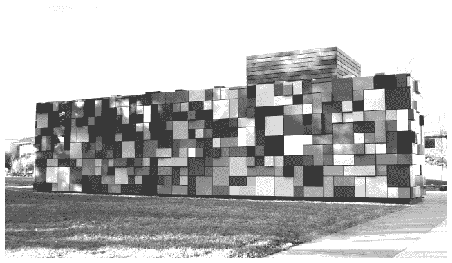

## 作者致谢

许多人参与了这个研究项目，提供了信息和指导。我特别感谢所有接受这次研究采访的高管。我希望这本指南能恰当地宣扬您的愿景和成就。

2018 年 6 月，我成为了阿肯色大学沃尔顿商学院区块链卓越中心主任（BCoE）。有机会与 fellow 区块链爱好者一起工作，包括沃尔顿商学院院长 Matt Waller 教授；信息系统（ISYS）系主任 Rajiv Sabherwal 教授；管理信息系统（MIS）研究生项目总监 Paul Cronan 教授；以及 IS 的助理教授 Zach Steelman 博士（也是常驻区块链专家）。他们为 BCoE 奠定了基础。

我依靠我们极具能力的 BCoE 团队获得见解和灵感：BCoE 高级管理总监 Kathryn Carlisle；BCoE 副主任 Dan Conway 教授；BCoE 顾问 Remko Van Hoek 教授；以及 ISYS 系助理 Andrea Morgan。特别感谢我们的摇滚明星研究生 MIS 学生 Jacob Yates，他更新了统计数据和用例。Jacob，你具备成为一名大学教授的所有素质，期待着在你与我们一起追求博士学位的未来合作中。

在来到阿肯色大学之前，我得到了密苏里大学圣路易斯分校超过四分之一个世纪的全支持。信息系统系主任 Dinesh Mirchandani 博士和商学院院长 Charles Hoffman 博士支持了我们的区块链研究每一项请求。其他同事也投入到这项研究的有益对话中，特别是金融教授 Nasser Arshadi 博士；当时研究生学习的副总监和导演 Tom Eyssell 博士；信息系统副教授 Shaji Khan 博士；以及会计系主任 Steve Moehrle 博士。我的长期合作者、知己和朋友 Joseph Rottman 博士也是 Associate Dean。

非常感谢 Epic Books、SB Publishing 以及阿肯色大学出版社。我对 Matt Waller 启动 Epic 书籍系列以及他的远见、善良和领导力深表感激。SB Publishing 多年来一直是我们的优秀合作伙伴，其编辑和制作服务能让我们的作品比任何传统出版方式更快地进入市场。感谢阿肯色大学出版社的 Mike Bieker 导演，他理解并满足了商业出版物的独特需求。

我衷心感谢我的家人和朋友圈子。这项工作占用了我大量时间，导致我忽视了那些丰富我生活的人。感谢我的长期同事、合著者和朋友，伦敦经济学院的 Leslie Willcocks 教授。Christine Emma Cotney Benson，感谢你在我的多次纽约研究之旅中陪伴我。感谢我的父母保罗和琼·拉西蒂，我的姐妹卡伦、戴 iane（总是这么亲密）和朱莉，以及我亲爱的朋友迈克尔·麦克德维特、贝丝·纳泽米和瓦莱·格雷瑟，感谢你们坚定不移的支持和幽默。感谢我的儿子迈克尔·克里斯托弗，我每天每小时都把他放在心上。最后，感谢让这一切都值得的杰里·潘乔，我的过去、现在和未来。

书籍封面艺术

玛戈·索耶（Margo Sawyer）是德克萨斯大学奥斯汀分校艺术与艺术史系的雕塑教授和工作室助理椅子。索耶是伦敦切尔西艺术学校的毕业生，也是耶鲁大学的毕业生，是一位国际艺术家。她曾获得约翰·西蒙·古根海姆奖学金、路易斯·舒适·蒂法尼基金会、美国国家艺术基金会、日本基金会、罗马美国学院、印度和日本福布莱特奖学金的荣誉。

艺术家 Sawyer 的艺术作品*Synchronicity of Color: Blue*, 2008 在德克萨斯州休斯敦的 Discovery Green，已成为休斯敦市深受喜爱的标志，该艺术品的图像被用作本书封面的插图。

*Synchronicity of Color: Blue*, by Margo Sawyer

在德克萨斯州休斯敦的 Discovery Green 进行的安装

来源：[www.margosawyer.com](http://www.margosawyer.com)

出版致谢

我们早期的工作版本已为此指南进行了修订和更新，包括：

Lacity, M. (2020), ‘Crypto and Blockchain Fundamentals’, *Arkansas Law Review*, 73.

Lacity, M. (2020), *Re-inventing Talent Acquisition: The SmartResume® Solution,* Blockchain Center of Excellence Case Study Series, BCoE-2020-01, University of Arkansas.

Van Hoek, R., and Lacity, M. (April 27, 2020), 'How the Pandemic Is Pushing Blockchain Forward,' *Harvard Business Review*, [`hbr.org/2020/04/how-the-pandemic-is-pushing-blockchain-forward`](https://hbr.org/2020/04/how-the-pandemic-is-pushing-blockchain-forward)

Lacity, M. (2019), *An Overview of the Internet of Value, Powered by Blockchains*, Blockchain Center of Excellence white paper, BCoE-2019-03, University of Arkansas.

Lacity, M., Zach, S., Paul, C. (2019), *Blockchain Governance Models: Insights for Enterprises*. Blockchain Center of Excellence white paper, BCoE-2019-02, University of Arkansas.

Lacity, M., Zach, S., Paul, C. (2019), *Towards Blockchain 3.0 Interoperability: Business and Technical Considerations*, Blockchain Center of Excellence white paper, BCoE-2019-01, University of Arkansas.

Lacity, M., Steelman, Z. R., Yates, J., Wei, J. (2019), ‘美国和中国争夺区块链主导权’，*CoinTelegraph*.

Lacity, M., Allee, K., Zhu, Y. (2019), ‘企业中的区块链：公司的 10-K 报告如何看待 DTL？’，*CoinTelegraph.*

Lacity, M. (2018), ‘解决使企业区块链应用成为现实的关键挑战’，*MIS Quarterly Executive*: (3), 文章 3.

Lacity, M. (2018), 《业务经理的区块链指南》，SB 出版社，英国斯特拉特福德-阿波恩。
