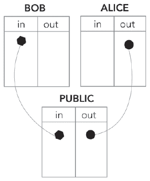

## 为什么高管、专业人士和学生应该了解区块链

*“大多数技术往往自动化外围工人的琐碎任务，而区块链则消除了中心。这不是让出租车司机失业，而是让优步失业，让出租车司机直接与客户合作。”*

**维塔利克·布特林,以太坊联合创始人**

*“比特币什么也不做。它就在那里。它就像一个贝壳或什么东西，这对我来说不是一种投资。”*

**沃伦·巴菲特，伯克希尔·哈撒韦公司董事长兼首席执行官。**

*“也许我太老了，但我会让这种狂热在没有我的情况下继续进行。”*

**杰弗里·冈德 ach, DoubleLine Capital 首席执行官**

毫无疑问，区块链是一项令人兴奋的新发展。高管必须决定是否领导区块链发展；与生态系统合作伙伴共同开发；还是等其他人开发平台和应用程序后再加入。正如上面维塔利克·布特林的引言所示，区块链承诺彻底颠覆某些商业模式。因此，区块链消除第三方的威胁开辟了一个全新的自动化和效率的世界，这应该让大多数高管做好作业。沃伦·巴菲特的第二个引用表达了对比特币相当无力的看法，似乎暗示它还不值得高管们的时间（至少现在不是）。在我们的研究中，区块链的反对者发表了类似的声明，如*“没有合法用例”*和*“区块链被过度炒作”*。第三个引用似乎暗示区块链最好留给年轻一代。哪种观点最有说服力？在论点和证据中跋涉，我们承认，到 2020 年，商业区块链确实遵循着传统技术的炒作周期。然而，关键是大多数技术最终确实成熟；管理者最终学会将它们用于有目的的使用；最终，像区块链这样的创新成为我们技术架构的一部分。这对于本指南中讨论的早期采用者来说已经发生。底线：我们相信高管需要比他们对分析或人工智能等其他技术创新给予更多的关注。为什么？大多数创新决策发生在公司的边界内，而区块链是共享应用程序，需要与生态系统合作伙伴共享决策。这需要与竞争对手前所未有的合作，以及其他只有高管才能有效倡导的思维转变。

至于专业人士和学生，价值的互联网将改变 IT；金融；会计；供应链；市场营销；法律；和医疗保健等领域的工作任务，从而改变所需技能：

信息技术

区块链 IT 技能受到各种规模企业和跨行业、跨地理区域的高度需求。根据领英的数据，**区块链是 2020 年美国、英国、法国、德国和澳大利亚需求最旺的技术技能**。信息技术专业人士需要学习如何开发、测试和集成去中心化应用程序（dApps）。此外，区块链技术很可能只代表端到端系统的 20%至 30%，因此信息技术学生和 IT 专业人士必须学会如何将 dApps 与传统应用程序集成。具体来说，dApps 将与物联网（IoT）和射频识别（RFID）等数据收集设备集成；与企业资源计划（ERP）和客户关系管理（CRM）软件等现有记录系统集成；以及与基于网页和移动的用户界面集成。第三章和第八章将特别吸引 IT 专业人士和学生。

财务

摩根大通已经发行了自己的稳定币；桑坦德银行已经在一个公共区块链上发行并结算了一笔债券；R3，一家为金融服务公司成立的区块链联盟，已经发布了 Corda——其用于保密交易的区块链代码库。财经专业的学生和专业人士需要了解新的融资模式，如首次币发行、证券化通证发行、首次交易所发行和点对点借贷，这些内容在第二章中有详细介绍。财经专业的学生和专业人士需要了解区块链技术如何改进或颠覆传统的金融服务，包括汇款、跨境支付、债券发行和结算、衍生品、股票、贸易融资等。第四章介绍了金融服务的特定区块链应用。

会计

区块链技术使我们从传统的双重记账系统转变为三重记账系统，其中每笔交易都有三个记录：信用、 debit 和存储在共享账本上的公共收据（参见图 0.1）。借助区块链技术，账本中的每笔交易都已得到验证，余额保证正确且最新，一切透明。会计师需要理解这对簿记、对账、审计以及应付账款和应收账款的影响。微软应用创新和数字化转型高级总监迈克·沃克表示，“对账正濒临灭绝”。然而，这并不意味着对会计技能的需求会减少。区块链技术实际上可以通过解放会计师，让他们处理需要判断和咨询的任务，为会计师创造更多增值工作。根据英格兰和威尔士特许会计师事务所（ICAEW）的说法：

会计中代表的一系列技能将因区块链而改变。[因为区块链，]一些诸如对账和来源保证的工作将减少或消除，而其他领域，如技术、咨询和其他增值活动将扩大。要适当审计一家进行大量基于区块链交易的公司，审计员的方向将发生转变。几乎没有必要与外部来源确认区块链交易的准确性或存在性，但仍需关注这些交易在财务报表中的记录和确认方式，以及如何决定判断性元素（如估值）的方式。*

**图 0.1：区块链账本采用三账簿会计法**

来源：改编自* [`miro.medium.com/max/4724/1*c3OFdrYqUO2ZqO1-E7nMkQ.png`](https://miro.medium.com/max/4724/1*c3OFdrYqUO2ZqO1-E7nMkQ.png)

供应链管理（SCM）

在过去的三十年中，公司通过（1）采用 ERP 和其他 IT 系统；（2）应用六西格玛质量改进计划；（3）改进库存管理实践，一直在提高内部运营效率。许多运营是精益的，但仅限于公司的边界内。仍有许多机会可以提高跨供应链合作伙伴的运营效率和效果。今天的全球供应链是一个复杂的贸易伙伴和可信第三方之间的网络。每个参与者都维护自己的集中系统，因此合作伙伴面临同步关于实体商品和服务流动的*数据*以及实际商品和服务流动的重大挑战。通过共享区块链应用程序，供应链合作伙伴可以共同享有减少行政成本、提高供应链透明度、验证可持续实践、减少丢失商品和减少假冒产品等好处，不一而足。简单来说：

供应链管理的未来将包括区块链。*

**Remko Van Hoek 等，2019 年，第 215 页**

第五章涵盖了供应链中区块链应用的多个方面。

市场营销

社交媒体和数字营销目前已成为主流营销策略，但区块链技术有潜力颠覆它们。密苏里大学圣路易斯分校数字和社会媒体营销教授佩里·德雷克说，“这种新的区块链技术不仅会颠覆并改变我们日常业务的运作方式，还会改变营销人员与客户的互动方式。如果我们要继续将技术扩展到日常生活中，这些新的安全应用非常急需。”*

《福布斯》撰稿人 Daniel Newman 表示，“虽然人工智能和分析技术可能更多地惠及企业而非消费者，但区块链技术可能通过将数据权力归还给消费者本身而平衡这一局面。”当“价值互联网”变得无处不在时，个人将掌控自己的数据；他们将决定数据的价值以及与谁分享。营销人员不再需要向谷歌或脸书支付费用发布广告，他们可能会直接向消费者支付费用以观看广告。营销人员将不得不采用新的方法来寻找消费者，并获得他们的关注和信任。像基于区块链的 Steemit 这样的社交媒体平台，已经允许社区决定支付给内容策展人的费用。

法律

区块链技术对法律实践有着重大的影响。据《国家法律评论》的作者 Jaliz Maldonado 所说，“区块链技术是自互联网诞生以来最具变革性的技术。”联邦快递的区块链策略师 Dale Chrystie 表示，法律专业人士将不得不在“智能合约”（参见第三章）和“法律合约”方面成为双语言人才。阿肯色大学的 Carol Goforth 教授，同时也是《加密货币交易监管》的作者，解释了法律专业人士需要了解的内容：“法律需求远远超出对比特币现象的认识，甚至不仅仅是了解加密货币是如何受到监管的。理解区块链以及客户是如何将新技术整合到日常运营中，对于提供关于商业规划和企业战略、风险管理和合规性方面的专业法律意见至关重要。”法律专业人士需要了解区块链技术如何影响公司文件、刑事和民事案件、争端解决、文件公证、知识产权、土地登记和房产契约以及律师事务所的运营。

医疗保健

在美国，区块链技术有可能为医疗保健行业节省 1000 亿到 1500 亿美元的行政成本。例如，一个共享的区块链应用程序可以简化索赔审批流程。

除了医疗保健行业内部机构的用例，区块链技术还承诺要赋权患者。从患者角度看，我们的医疗保健数据——比如疫苗接种、血液检测、诊断、过敏反应、处方药物、治疗、手术程序、行为（比如抽烟或锻炼）——在医生、政府、医疗保健提供者、雇主和保险公司手中。越来越多的人开始关注 TTPs 和政府可能会如何处理他们的医疗数据。例如，数百万人将自己的 DNA 样本用于“寻找祖先”，但如果这些数据被卖给保险公司会怎样？他们是否可能会利用遗传弱点来决定保险覆盖范围和保险费率，或者完全拒绝承保？另外，如果每个人的医疗保健数据都存储在区块链上，个人可以决定与谁分享自己的信息。这种模式可能还有待时日，但有许多初创公司正在致力于实现这一目标。MedRec，来自麻省理工学院媒体实验室的初创公司，提供了一个以患者为中心的电子健康记录共享平台。根据《哈佛商业评论》的一篇文章，“它不存储医疗记录或要求改变实践。它在区块链上存储记录的签名，并通知患者，最终控制该记录可以传递给谁。”

除了 IT、金融、会计、供应链、营销、法律和医疗保健，区块链应用还正在为政府、媒体、娱乐、制造、教育和其他行业进行中。 wherever there is a need for a tamper-resistant record of transactions among multiple parties who do not trust each other, we are sure to see blockchain-based solutions.

本指南概述

虽然关于区块链的书籍很多，但本指南专注于***区块链在商业中的应用***。目标读者是希望了解整体区块链景观——投资、市场规模、主要玩家和全球影响力——以及区块链应用潜在商业价值的商业学生、专业人士和管理人员。读者将了解到足够的底层技术知识，以便能够与该领域的技术专家进行明智的对话，因为本指南还涵盖了区块链协议、代码库，并提供了术语表。

根据个人需求，读者可以选择部分阅读或通读全文。内容有意进行了重复，以便各章节能独立成篇，满足不同读者的需求。**第一部分** 涵盖了区块链的基础知识，并回答了这些问题：

- 第一章：比特币是如何启动价值互联网的？

- 第二章：如今的区块链领域有多大？哪些参与者处于领先地位？

- 第三章：区块链应用到底是什么？它们承诺了什么价值，是如何工作的？

在**第二部分**中，我们深入探讨了金融服务业、供应链、能源和证明文件的实际企业区块链解决方案。我们将了解到这些努力的领先组织，包括：传统企业；传统企业的衍生企业；合作伙伴关系；私人初创公司；非营利组织；以及行业联盟。在这些案例中，我们遇到了有远见的领导者，他们不仅仅是等待区块链技术成熟——他们正在积极努力推动技术成熟，定义行业标准，创建新的共享治理模式，游说新的法律和法规。这些领导者在漫长的实施旅程中坚持不懈。具体来说，各章节回答了以下问题：

• 第四章：金融服务业的实际区块链应用示例有哪些？

• 第五章：供应链的实际区块链应用示例有哪些？

• 第六章：能源领域的实际区块链应用示例有哪些？

• 第七章：证明文件的实际区块链应用示例有哪些？

通过深入案例，我们更加深刻地认识到将区块链应用从创新实验室和概念验证转移到市场准备平台的技术和商业挑战。这些案例的共同点是，领导者正在解决真实的业务问题，这些问题恰好非常适合使用区块链解决方案。

在**第三部分**中，我们探讨了技术、数据、法律、生态系统、策略和管理方面的挑战以及应对这些挑战的 emerging solutions（见图 0.2）。

**图 0.2：实现“价值互联网”的挑战，尤其是对企业的挑战**

具体来说，各章节回答了以下问题：

• 第八章：技术挑战和新兴解决方案有哪些？

• 第九章：企业应该考虑哪些思维转变、策略和行动原则？

• 第十章：区块链的未来是什么？

虽然现在还很难预测未来会发生什么，但我们已经了解到，尽管全球在区块链方面的投资达数十亿美元，所有行业都有数千个原型，以及高调的小组正在努力制定标准和开发代码，但企业级区块链应用在 2018-2019 年实际上才真正开始生产。一些平台，如 IBM 食品信任、贸易透视和 EY 葡萄酒链，已经处理了数百万笔交易，有数百个平台参与者。然而，许多其他区块链解决方案尚未实现规模扩大，但生态系统参与者正在获得价值，并且他们的参与者网络正在增长。因此，虽然我们同意现在还处于“价值互联网”的完整愿景到来之前的早期阶段，但现在是学习区块链的时候了。

引用：

¹ 马尔，B.（2018 年 8 月 15 日），‘23 个令人着迷的比特币和区块链引语，每个人都应该阅读’，《福布斯》[`www.forbes.com/sites/bernardmarr/2018/08/15/23-fascinating-bitcoin-and-blockchain-quotes-everyone-should-read/#74a245e57e8a`](https://www.forbes.com/sites/bernardmarr/2018/08/15/23-fascinating-bitcoin-and-blockchain-quotes-everyone-should-read/#74a245e57e8a)

² 李，Y.（2019 年 5 月 4 日），‘沃伦·巴菲特称比特币是一个“赌博装置”，与之相关的“很多欺诈行为”’，《CNBC》[`www.cnbc.com/2019/05/04/warren-buffett-says-bitcoin-is-a-gambling-device-with-a-lot-of-frauds-connected-with-it.html`](https://www.cnbc.com/2019/05/04/warren-buffett-says-bitcoin-is-a-gambling-device-with-a-lot-of-frauds-connected-with-it.html)

³ 马尔，B.（2018 年 8 月 15 日），‘23 个令人着迷的比特币和区块链引语，每个人都应该阅读’，《福布斯》[`www.forbes.com/sites/bernardmarr/2018/08/15/23-fascinating-bitcoin-and-blockchain-quotes-everyone-should-read/#74a245e57e8a`](https://www.forbes.com/sites/bernardmarr/2018/08/15/23-fascinating-bitcoin-and-blockchain-quotes-everyone-should-read/#74a245e57e8a)

⁴ 安德森，B.（2020 年 1 月 9 日），《2020 年最受欢迎的硬技能和软技能》，[`business.linkedin.com/talent-solutions/blog/trends-and-research/2020/most-in-demand-hard-and-soft-skills`](https://business.linkedin.com/talent-solutions/blog/trends-and-research/2020/most-in-demand-hard-and-soft-skills) 尤吉·伊吉里（1989），‘动量会计和三重记账：探索会计测量的动态结构’，《会计研究杂志》，美国会计协会，萨拉索塔（31）。

⁵ 拉 acity，M.，扎 ach，S.，保罗，C.（2019）。《区块链治理模型：企业的洞察》（第 2 版，2019 卷）。区块链卓越中心。

⑥ ICAEW（2018），《区块链和会计的未来》，[`www.icaew.com/-/media/corporate/Files/technical/information-technology/thought-leadership/blockchain-and-the-future-of-accountancy.ashx`](https://www.icaew.com/-/media/corporate/Files/technical/information-technology/thought-leadership/blockchain-and-the-future-of-accountancy.ashx)

⁷ 范胡克，R.，弗盖特，B.，达夫莱辛，M.，和沃勒，M.（2019 年），*将区块链整合到供应链管理中*，科冈出版社，伦敦。

⁸ 新曼，D.（2019 年 9 月 18 日），《福布斯》，“区块链如何改变数字营销”，[`www.forbes.com/sites/danielnewman/2019/09/18/how-blockchain-is-changing-digital-marketing/#6a68af7f16eb`](https://www.forbes.com/sites/danielnewman/2019/09/18/how-blockchain-is-changing-digital-marketing/#6a68af7f16eb)

⁹ 马尔多纳多，J.（2018 年），*区块链技术将如何改变法律服务行业十大方式*，国家法律评论，[`www.natlawreview.com/article/10-ways-blockchain-technology-will-change-legal-industry`](https://www.natlawreview.com/article/10-ways-blockchain-technology-will-change-legal-industry)

-   （10）戈夫，C.（2020 年）。*加密货币交易的监管*，威斯敏斯特出版社，明尼苏达州圣保罗。

-   （11）阿森纳，C.（2019 年 2 月 21 日），*区块链在医疗行业的应用：2020 年执行官指南*，[`www.digitalauthority.me/resources/blockchain-in-healthcare/`](https://www.digitalauthority.me/resources/blockchain-in-healthcare/)

-   （12）哈拉马卡，J.，利普曼，A.，和埃克布劳，A.（2017 年 3 月），《哈佛商业评论》，“区块链潜力巨大，可以改变电子健康记录”，[`hbr.org/2017/03/the-potential-for-blockchain-to-transform-electronic-health-records`](https://hbr.org/2017/03/the-potential-for-blockchain-to-transform-electronic-health-records)

-   （13）CB Insights（2017 年 10 月）*区块链回顾：投资趋势与机遇*。

