## 第二部分

## 业务应用示例

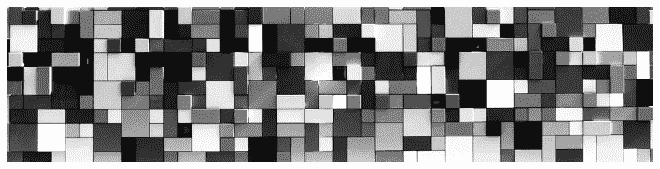

## 第四章

## 金融服务业务应用

*“在国际贸易金融案例中，这是一个非常古老的遗留流程，有很多纸质文件。人们认为可能有价值，银行能够通过这项技术引入一个更高效的流程。”*

**大型全球银行的数字架构负责人^(1)**

*“最初，人们对加密货币的支付给予了关注，他们适当地监督了这个新现象。大约在 2015 年中期，整个金融服务行业——包括我们自己——意识到这比加密货币的应用范围要广泛得多。”*

**大型全球银行的区块链架构师**^(2)

4.1. 案例概述

金融服务行业的公司一直是第一批认识到加密货币所提供威胁和机会的传统组织。包括巴克莱、桑坦德、道富银行和富国银行在内的传统企业，这些企业在连续运营了数百年后，是区块链技术的早期探索者之一。成立于 2014 年的行业联盟 R3 就是为现有企业创建标准、编写代码库并使区块链金融服务应用程序栩栩如生而成立的。已有超过 250 家金融科技公司进入该领域——例如 Axoni、BitPesa 和 Digital Asset Holdings。^(3) 这些企业已经为一系列金融服务开发了概念验证（POCs）：反洗钱（AML）；赌博和预测市场；债券发行；抵押品管理；合规报告；商品定价；跨境支付；众筹；货币兑换；交易发起；衍生品交易；股票；固定收益；了解你的客户（KYC）；共同基金市场；支付；点对点借贷；购买新证券的订单；结算；总回报互换（TRS）；贸易金融；和贸易报告。许多 POCs 从未超出沙盒阶段。

在本章中，我们提供了由 Ripple、Stellar、WeTrade 和 Santander 开发的四个已部署的基于区块链的金融服务应用实例（见表 4.1）。有趣的是，前两个例子是全球支付应用，用于货币兑换和汇款。从某种意义上说，全球支付是企业区块链应用的典范，它支持点对点交易；快速的结算时间；低交易成本；执行保证；以及符合所有法规的法定货币（以及加密货币）交易的增强安全性。我们将看到**Ripple**和**Stellar**确实拥有原生数字货币资产——这吸引了大量注意力，因为这两种加密货币通常市值排名前十——但我们的关注点是企业应用。Ripple 和 Stellar 作为已经部署运营应用的新企业的例子；Ripple 成立于 2012 年，Stellar 成立于 2015 年。

**WeTrade** 是由一组银行组成的联盟创立的，这些银行筹集资金开发一个区块链平台以自动化贸易金融服务，主要针对中小型客户，然后成立合资企业于 2018 年将服务投入生产。全球银行**Santander** 参与了多种基于区块链的金融服务，但本章中我们重点介绍其公链上的债券发行和结算。但首先，我们需要更好地了解当今金融服务中的痛点，以便欣赏这些区块链应用的目标。我们先从了解全球支付在没有区块链时如何运作开始。

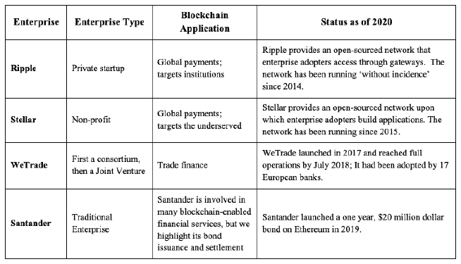

**表 4.1：金融服务区块链应用示例**

4.2. 区块链之前的全球支付

*“大约有 20 亿人没有使用正规的金融服务，最贫困家庭中的超过 50%的成年人是未银行账户持有者。金融包容性是减少贫困和提高繁荣的关键推动力。”*

**世界银行行长金永俊**^(4)

根据麦肯锡公司的数据，全球每年跨境汇款总额超过 135 万亿美元。^(5)第三方中介机构大约收取 2.2 万亿美元的收入来促成这些交易。资金通过多种服务以几种方式在全球范围内流动，但我们将会关注这个过程的简化版。在当今的全球金融体系中，每个国家都有自己的国家支付系统，并使用自己的主权货币。^(6)银行必须获得许可才能使用其所在国家的国家支付系统。国际交易经常依赖于不同国家银行之间的合作，从而形成了一团糟的代理银行关系网（见图 4.1 的简化描述）。^(7)在当今全球金融体系中进行跨境支付时，发送方和接收方的金融机构、国家支付系统以及代理银行处理交易。交易各方无法获取交易的进度情况，甚至不知道哪个机构控制着交易在系统中的流转。随着流程的每一步，费用都会累积。交易伙伴并不总是能提前知道费用，这可能会变得相当可观。发送汇款平均需要支付发送金额的 7.99%，并且需要数个工作日来结算。^(8)^,^(9)

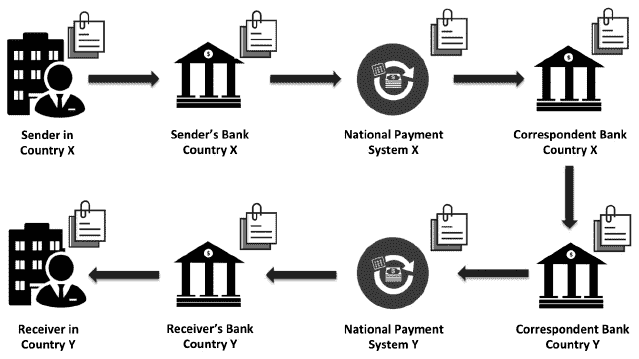

**图 4.1: 区块链之前的跨境支付简化示例**

由于高额的交易成本，金融机构无法为低收入人群提供合理价格的服务。平均而言，美国银行每个活期账户一年的成本为 349 美元，而仅通过交易费用回收 268 美元。^(10)简而言之，银行在活期账户上亏损，因此它们没有多少为低收入人群提供金融服务的激励。结果，全球多达四分之一的人口无法获得金融服务——他们完全依赖现金。根据麦肯锡公司的研究，金融包容性越大，人人将受益。^(11)如果再有 16 亿人口被纳入其中，麦肯锡公司估计他们将会创造：

• 到 2025 年 GDP 增长 3.7 万亿美元

• 2.1 万亿美元的新信贷

• 4.2 万亿美元的新存款

• 9500 万新增就业岗位

专家们普遍认为，银行和政府需要成为解决方案的一部分。^(12)穷人不能简单地采用加密货币来解决他们所有的金融需求。他们需要接入法定货币以获得信贷和支付。由比尔及梅琳达·盖茨基金会资助的贫困人群金融服务计划定义了一个全球包容性移动支付平台的最小要求：该平台必须在低成本手机上运行；^(13)它必须支持各国货币；政府必须设定法规以防止欺诈、洗钱和网络恐怖主义；对于小商家来说，交易必须快速结算，并且必须与其他系统互操作。^(14)到目前为止，大约有 150 个移动支付平台（如 bKash 和 M-pesa），但它们在孤岛上运行。^(15)^,^(16)那么区块链如何帮助呢？

麻省理工学院数字货币倡议成员 Alin Dragos 认为，如果银行采用区块链技术大幅降低其后台中介成本，它们可以增加金融包容性。他估计，银行可以将每个账户的平均成本降低到每年 100 美元。更有雄心的银行可能会建立一个以区块链为核心的银行，这可能会将成本降低到每年 50 美元。^(17)此外，身份验证的区块链可以帮助全球超过 2.3 亿无文档移民获得金融服务和就业机会。^(18)

所以，在全球支付领域有很多问题需要解决。作为第一个商业区块链应用之一，许多人认识到，跨境支付的区块链应用可以缓解许多痛点。^(19)比特币提供了基础模型，但其匿名性、低可扩展性和大量资源消耗无法满足金融服务业高度监管世界中交易伙伴的需求。Ripple 和 Stellar 各自建立了全球支付应用，克服了比特币的局限性，同时仍提供快速的结算时间和低交易成本。它们各自的兴趣在于它们针对不同的市场。Ripple 针对机构客户；Stellar 旨在扩大今天被排除在外的金融服务的接入。讲述了他们的故事之后，我们将转向其他金融服务环境，具体是贸易融资和债券的发行与结算。

4.3. ripple

“银行加入 Ripple 的全球结算网络，以实时发送跨境支付。Ripple 消除了时间延迟，确保结算的确定性，为银行及其客户创造了新的收入机会和降低了交易成本。”*

**Ripple 官网**^(20)

*“数字货币应运而生，因为我们需要一种不由中央银行控制、不受政治操纵的货币形式……Ripple 是第一个允许交易所有货币或任何有价值的单位（如积分里程、虚拟货币和手机话费）的货币交易所。”*

**埃利奥特·布兰森（Elliott Branson），《Ripple：理解 Ripple 货币终极指南》的作者。^(21)

Ripple 是由克里斯·拉森（Chris Larsen）和杰布·麦卡勒布（Jeb McCaleb）于 2012 年创立的，目的是基于瑞恩·福格尔（Ryan Fugger）关于去中心化、实时结算系统的想法。该公司总部位于旧金山，布拉德·加林豪斯（Brad Garlinghouse）是现任首席执行官。^(22) 2013 年，Ripple 获得了天使投资，2015 年完成了 A 轮融资，2016 年完成了 B 轮融资。投资者包括 Accenture、安德里森·霍洛维茨（Andreessen Horowitz）、CME 风险投资（CME Ventures）、谷歌风险投资（Google Ventures）、SBI 集团（SBI Group）、桑坦德创新 Ventures（Santander InnoVentures）、标准渣打银行（Standard Chartered）和 Tetagon。^(23) 到 2019 年，已有超过 300 家金融机构加入了 RippleNet，Ripple 共有 534 名员工。^(24)

Ripple 的目标是克服比特币相对较慢的结算时间、无法交易其他货币以及巨大的电力消耗等问题，同时仍保持低成本、透明、隐私和安全性。据 Ripple 官网介绍，其网络每秒处理 1500 次交易（TPS），在四秒内结算支付，24 小时不间断运行，并可扩展至每秒 50000 次交易。它还声称其分布式账本有七年的无事故关闭记录。^(25)

Ripple 的目标客户主要是银行、企业、支付提供商和交易所等机构企业。截至 2018 年，Ripple 在其 RippleNet 平台上提供了三项综合服务：***xCurrent*** 用于处理支付；***xRapid*** 用于获取流动性；***xVia*** 用于发送支付。对于银行客户，Ripple 设想银行通过签约新的企业和消费者客户来捕捉新的收入，降低他们的交易成本，并为规则、标准和治理提供一个集成点和一致的体验。^(26) 对于企业客户，Ripple 承诺提供按需支付、跟踪和交付确认以及更丰富的数据传输，例如将发票附加到支付转移上。^(27)

德国在线银行 Fidor 是 Ripple 的第一个机构客户，该客户在 2014 年初宣布了合作伙伴关系。截至 2019 年，Ripple 的客户包括美国运通、MoneyGram、桑坦德和 SBI 等巨头。^(28) 2018 年，桑坦德在英国、波兰、西班牙和巴西推出了一个名为 One Pay FX 的服务——该服务基于 RippleNet。^(29) 借助一个应用程序，客户只需四五点击即可发送全球汇款。^(30) 另一家企业客户 SBI Remit，让在日本的泰国国民可以直接将钱汇到他们在泰国的暹罗商业银行账户。在此服务之前，日本居住的泰国国民必须雇佣代理并使用现金进行转账。在仅部署了三个月的服务之后，转账在三秒内完成。^(31) 《财富》杂志报道了一篇关于美国运通使用 Ripple 为其美国企业客户将资金汇到桑坦德银行在英国的账户的故事。根据这篇文章，一些客户实际上在 2017 年 11 月就已经在使用这项服务。^(32)

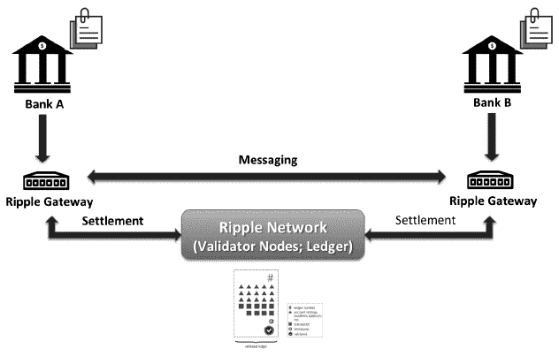

**图 4.2：两家银行使用 Ripple 的高级描绘**

机构客户使用 API 通过 Ripple Gateway 连接到 Ripple 网络（参见图 4.2）。网关可以与其他网关建立高达一定金额的信任线。两个相互信任的网关可以直接进行交易。然而，如果发送网关没有与接收网关直接的信任线，网络协议将找到一条信任路径，从而使交易在网络中“扩散”。人们可能会认为这条路径是在利用他人的信任。如果 Sally 想在没有真正信任 Sam 的情况下向 Sam 发送钱，Sally 可以把钱发送给她信任的人，比如 John；John 然后把钱发送给他信任的人，比如 Sue；Sue 把钱发送给 Sam，她信任 Sam。如果找不到信任路径，价值可以使用 Ripple 的本地数字货币“Ripple”（符号 XRP）进行转移。这样，如果没有交易伙伴之间的信任路径，XRP 可以用作桥货币。协议寻找最可能的汇率，并在几秒钟内完成货币兑换，只需支付几美分价值的费用。^(33)

那么账本发生了什么？Ripple 的账本记录了发行情况，即代表发行者持有的货币或资产的数字余额。这是如何运作的：

*“当客户将资金存入 XRP 账本时，网关会在 Ripple 之外保管这些资产，并向客户的地址发送 XRP 账本的发行。当客户从 XRP 账本中转出资金时，她会向网关支付 XRP 账本中的金额，网关会在自己的记录系统或另一个账户中为客户记账。与发行一样，XRP 可以在 XRP 账本地址之间自由发送和交换。然而，与发行不同，XRP 不绑定在会计关系上——XRP 可以直接从任何 XRP 账本地址发送到任何其他地址，无需通过网关或流动性提供者。”*^(34)

图 4.3 将 Ripple 映射到在第三章中开发的区块链应用框架中。从协议开始，Ripple 定义了一种新的分布式账本协议，称为 Ripple 交易协议 (RTXP)。^(35) 该协议有时被称为“半许可”的，因为 XRP 可以直接发送给任何人（无需许可），但也具有信任线，交易只能通过网络上的批准路径传播。

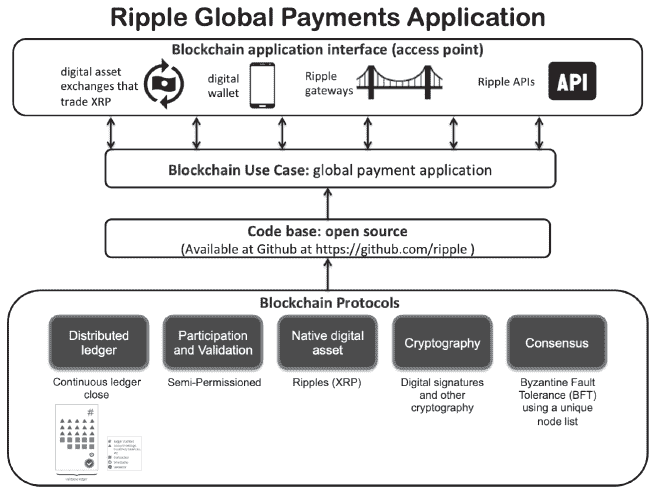

**图 4.3：Ripple 映射到区块链应用框架**

分布式账本

Ripple 并没有将交易结构化为一个区块链。它将账本结构化为一个长长的、按顺序排列的交易和账户设置/余额列表，这个列表每几秒钟就会关闭一次。^(36) 账本还存储了不同货币的买入和卖出报价。账本的每个版本都有一个唯一的 ID 和时间戳。与比特币一样，Ripple 交易被永久存储在 Ripple 的分布式账本上，不可逆转。2020 年 3 月 22 日，Ripple 处于账本的第 54,290,062 版（见图 4.4）。

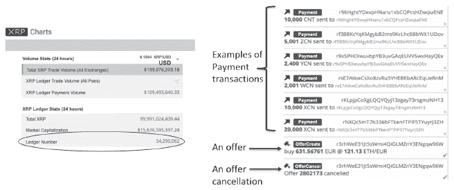

**图 4.4：2020 年 3 月 22 日的实时 Ripple 账本**

*Ripple 账本可以在 [`xrpcharts.ripple.com/#/transactions`](https://xrpcharts.ripple.com/#/transactions) 上查看*

原生加密货币

被称为“ripples”的 Ripple 原生加密货币（XRP）有几个用途。正如上面提到的，如果没有在交易伙伴之间找到信任路径，XRP 可以用作桥接货币。XRP 也是支付网关的方式，因为每个网关都可以通过 XRP 形式设定费用。如果交易伙伴之间直接交易而不使用网关，ripple 交易的发送者支付少量 ripples，这样攻击者就不会用数百万交易来淹没系统，因为攻击者会耗尽 XRP。^(37)作为一种稀缺资产，XRP 的货币供应量恰好是 1000 亿 ripples，并且是在协议启动时发行的，而不是像比特币那样通过挖矿过程释放。^(38)Ripple 是一种通货紧缩货币——一旦 ripples 被用来支付交易，它们就会被销毁。参与者不必使用 ripples；他们可以直接使用其他货币进行交易。^(39)

共识协议

Ripple 使用一种拜占庭容错（BFT）共识协议。在这个共识系统中，大多数网络节点同意的交易将被记录在账本上。^(40)（关于更详细的解释，请参见第三章）。当 ripple 交易被 80%的节点验证后，被认为是“安全”的。^(41)

当机构或消费者加入 Ripple 网络时，他们可以从注册的 130 多个节点（截至 2020 年 3 月）中选择他们想要执行验证检查的节点，或者他们可以接受 Ripple 维护的默认节点列表，这个列表被称为唯一节点列表（UNL）。（参见[`xrpcharts.ripple.com/#/`](https://xrpcharts.ripple.com/#/) validators 获取注册节点的列表）。Ripple 建议用户选择跨大陆和跨行业的验证节点，这样合谋的可能性很小，比如选择来自北美、南美、欧洲、亚洲和澳大利亚的商人；金融机构；非营利组织；政党；和宗教团体（参见图 4.5）。^(42)

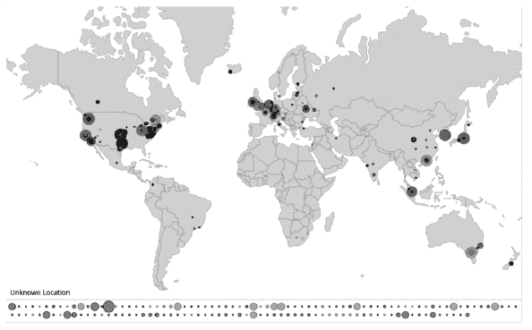

**图 4.5. 2020 年 3 月 23 日活性的 Ripple 网络拓扑结构**

ripple 节点的位置可以在[`xrpcharts.ripple.com/#/topology`](https://xrpcharts.ripple.com/#/topology)上查看。

在没有挖矿激励的情况下，Ripple 要求机构在加入系统时运行一个验证节点来帮助保护网络。执行验证角色所需的成本接近零美元。^(43)交易结算只需几秒钟，比比特币消耗的电力少得多——大约和运行一个电子邮件服务器的电力成本一样。^(44)

智能合约

2014 年 7 月，Ripple Labs 提出了一个将智能合约添加到 Ripple 的项目。仅仅一年后，Ripple 放弃了这个项目，称它是不必要的。^(45)

代码库

Ripple 的代码库是开源的，可以从 Github 下载。^(46)

应用接口

用户可以使用 Ripple 钱包直接与 Ripple 网络交易，但这需要至少 20 个 XRP 的最低余额。^(47) 大多数客户使用由加密货币交易所或金融机构运营的 Ripple 网关。^(48) Ripple 拥有桥接协议，允许与外部网络的支付。例如，Ripple 有一个比特币桥接协议，允许用户将 ripple 发送到比特币地址。^(49)

关于 Ripple 的问题

与所有初创公司一样，Ripple 在信任、黑客攻击和合规方面也面临一些挑战。关于信任问题，一些人担心 Ripple 的拥有者对货币库存和网络节点的控制权过大。Ripple 的创始人在启动时保留了 200 亿 ripple，并将其余的赠予 Ripple，后者负责分发给网关、市场制造商和慈善组织。^(50) 人们的担忧是：拥有者如何阻止兑现，从而使货币贬值？在多年的担忧之后，Ripple 的创始人在 2017 年 5 月承诺，将 550 亿 ripple 放入托管账户，并每月向市场释放大约 10 亿。^(51)

原则上，区块链不应该依赖可信任的第三方机构。实际上，网络参与者通常接受 Ripple 的默认节点列表而不是选择自己的节点，从而使 Ripple 拥有集中的权力。Stellar 基金会的大卫·马齐埃 res 在报告中写道：

**“通常，拜占庭共识系统的成员资格由中央机构或封闭谈判设定。之前尝试去中心化加入过程已经放弃了一些好处。一种方法，由 Ripple 采用，是发布一个“入门”成员名单，参与者可以自行编辑，希望人们的编辑要么无关紧要，要么被绝大多数参与者复制。不幸的是，由于不同列表使安全保证无效，用户实际上不愿编辑列表，最终大量权力集中在起步名单的维护者手中。”** **^(52)**

2015 年，美国财政部对 Ripple 处以 70 万美元的罚款，理由是 Ripple 违反了 1970 年的银行保密法，具体指控 Ripple 故意没有实施反洗钱(AML)计划，也没有报告可疑活动。^(53) Ripple 同意改进其协议以满足当前的银行法规。^(54)

像许多新区块链一样，Ripple 在 2014 年 10 月早期也曾被黑客攻击过。由于代码中的一个漏洞，一名黑客能够从一个只有 0.0001 比特币资金的地址发送 1000 个比特币。^(55) Ripple 在几天后报告说已经修复了这个错误，自那时以来，网络运营没有再出现问题。

总之，Ripple 是一个重要的区块链应用——它正在运行，它正在工作，其被机构客户采用的比例正在增加。下一个例子将聚焦于解决金融排斥的问题。

4.4. 恒星

*“恒星开发基金会和恒星致力于通过使货币更加流动、市场更加开放、人们更加赋权来释放世界的经济潜力。”*

**恒星开发基金会**^(56)

*“我们的目标是使全球支付像互联网一样开放，这样任何人都可以轻松地跨越世界发送资金，无论他们使用的是哪家金融机构。支付应该像电子邮件一样流动，并且应该全部是可互操作的。”*

**恒星开发基金会联合创始人兼 CTO 杰德·麦卡勒布**^(57)

杰德·麦卡勒布和乔伊斯·金共同创立了恒星开发基金会（SDF）——一个位于美国的非营利组织——于 2014 年。恒星的使命是扩大全球的金融接入和金融素养。^(58) 恒星协议的白皮书于 2015 年 4 月发布，该网络于同年 11 月上线。^(59)^,^(60) 到 2017 年底，SDF 从 Plug and Play、Innovating Capital 和 Stripe 获得了 300 万美元的资助。^(61) 截至 2020 年 3 月，SDF 约有 60 名员工。^(62)

恒星网络支持所有数字资产的创建和交易，包括货币、加密货币、商品、股票和债券。^(63) 恒星网络用于全球支付，能在三到五秒内完成交易，且手续费极低，每 100,000 笔交易只需一个恒星币（恒星网络的原生数字货币）。2020 年 3 月 26 日，一个恒星币的价格仅为 0.04 美元（四美分）！恒星网络每秒可以处理超过 1,000 项操作。

SDF 没有直接与用户接触。相反，SDF 希望其他机构开发商业模式，并使用恒星的基础代码开发诸如汇款、微支付、移动分行、移动货币等服务的应用。恒星不向机构或个人收取使用恒星网络的费用，除了每笔交易的小额手续费。其网络基于由基金会支持的开源代码，但采用者可以自由开发商业应用、修改或分发源代码。

它的第一个采用者之一是 Parkway 项目，该项目涉及 Oradian，一家关注非洲的金融科技企业，旨在为尼日利亚农村地区的 30 万未银行人口提供金融服务，其中 90% 是女性。^(64) 项目在尼日利亚中央银行停止所有汇款公司在国内运营，除了西方联合和 MoneyGram 之后暂时停止。最终，位于尼日利亚的金融科技企业 Cowrie 成功在 Stellar 网络上开发了一项服务。**Cowrie 交易所**与尼日利亚银行结算系统有限公司（NIBSS）相连。Cowrie 充当稳定币 NGNT 的发行者，该稳定币与尼日利亚法定货币——尼日利亚奈拉——挂钩，允许人们向尼日利亚和欧盟发送和接收支付。^(65) 其客户包括 Tempo、SatoshiPay 和 Coinqvest，它们也自己在 Stellar 网络上构建了自己的服务。

**Tempo** 采用 Stellar 进行跨境支付，以便客户支付公用事业账单。^(66) 到 2018 年，Tempo 已帮助来自欧洲的客户——大部分位于法国和德国——将支付转移至 Coins.ph，他们在菲律宾的公司。^(67) Jed McCaleb 说：*“Tempo 很棒；真实资金正在活跃网络中流动。”*^(68)

**SatoshiPay** 允许网页出版商向浏览者收取非常小的加密货币金额。出版商在其网站上作为支付选项发布 Stellar 钱包小部件，用户只需点击它，微支付就会在 Stellar 账本上得到处理和结算。

**Coinqvest** 有一个应用程序，允许客户使用数字货币（欧元、奈拉和美国美元）或加密货币（ Lumens、比特币、以太坊、莱特币或 Ripples）向商家支付。^(69)

**Saldo** 也是采用者之一。它使用 Stellar 网络帮助美国移民工人为其在墨西哥的家人支付公用事业账单。这个应用程序解决了一个重要需求，因为公用事业提供商要求每月支付，但典型的公用事业账单金额低于跨越国界发送支付的交易费。^(70)

**IBM** 是迄今为止 Stellar 最著名的机构采用者。2017 年 10 月，IBM 和 KlickEx（一个基于波利尼西亚的低值电子外汇支付系统）宣布将使用 Stellar 进行跨境支付。Jed McCaleb 说：“IBM 正在使用 Hyperledger Fabric 项目的某些部分，他们正在使用 Stellar 进行跨境支付。”*(71) 最近，**IBM World Wire** 允许现有金融机构使用 World Wire API 连接到网络，通过 Stellar 锚点发送支付，并在 Stellar 网络上结算交易。*(72) 根据 IBM 副总裁 Jesse Lund 的说法，“Stellar 为我们提供了一个桥梁，从这些纯粹的私有网络和完全开放的荒野网络。”*IBM 本质上建立了一个子网络来执行规则，但使用 Stellar 网络提供一个开放的审计跟踪。*

作为连接到 Stellar 网络的机构用户，作为锚点，需要获得许可并遵守规定。(74) Jed McCaleb 解释说，“Stellar 基金会从不参与资金流动；我们没有客户。我们提供软件，金融机构部署它。合规的责任落在锚点*—*金融机构*—*上，因为它们仍然与汇款人和收款人保持关系。”*(75)

Stellar 基金会没有能力帮助机构开发使用 Stellar 网络的应用程序，尽管对这种服务有强烈的需求。为了满足这种需求，Jed McCaleb 于 2017 年 5 月创立了 Lightyear.io（现在称为 Inter/Stellar）。他解释说：“当我们与金融机构交谈时，他们希望有人提供服务和支持，并帮助他们进行集成。SDF 没有设立做那些事情。很快，我们意识到需要一个盈利机构。所以，你可以把 SDF 看作是 Linux，而 Lightyear 是 RedHat。”*

就网络统计而言，Stellar 网络拥有超过 450 万个账户；超过 6100 个账户每天活跃，2020 年 3 月 23 日，账本每 5.4 秒关闭一次。*(76)*

图 4.6 将 Stellar 映射到第三章开发的区块链应用框架中。如上所述，McCaleb 也是 Ripple 的联合创始人，他离开 Ripple 创立了 Stellar。*(77)* 由于有共同的历史，Stellar 的协议基于 Ripple 的协议，所以在分布式账本过程方面它们是相似的。两个网络还都利用 API 将组织连接到网络，但 Stellar 使用“锚点”这个术语，而 Ripple 称它们为“网关”之间的“信任线”。正如我们将看到的，Stellar 使用不同于 Ripple 的共识算法，并旨在实现更去中心化。

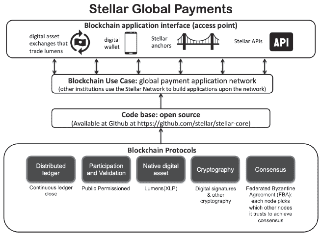

**图 4.6：恒星与区块链应用框架的映射**

分布式账本

像 Ripple 一样，恒星将账本结构化为一系列按顺序排列的交易和账户余额，每几秒钟关闭一次。账本还存储当前的订单簿，记录不同货币的买入和卖出报价。恒星的交易永久存储在分布式账本上，且不可撤销。然而，恒星用户可以在账本上冻结资金，以便在存在争议或错误交易的情况下，它们无法被使用。^(78) 2020 年 3 月 23 日，恒星是其第 28,825,068^(th) 个账本版本（参见 图 4.7）。

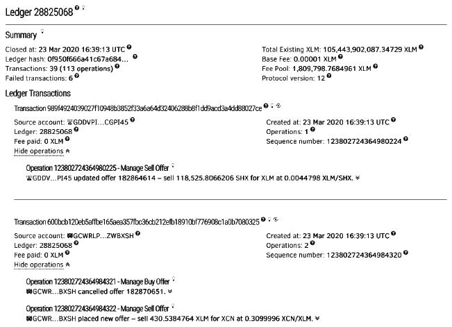

**图 4.7：星际账本示例，显示标题和前两笔交易**

*来源：[`stellar.expert/explorer/public/ledger/28825068`](https://stellar.expert/explorer/public/ledger/28825068)*

原生加密货币

恒星的原生数字资产，恒星币（XLM），有几个用途。首先，恒星币用于资助 SDF 的运营。恒星在 2014 年发行了 1000 亿恒星币，保留 5% 作为基金会运营资金，其余的储备起来。XLM 是一种通货膨胀货币——每年以货币供应量的 1% 的速度向网络中添加新的恒星币。^(79) 基金会旨在将恒星币分发给广泛的个人和组织，包括 50% 给个人；25% 给旨在服务未被服务人群的非营利组织；以及 20% 给比特币持有者。^(80) 为了分发给个人，基金会将恒星币在像 Kraken 这样的交易所上进行拍卖。个人和机构还可以向 SDF 申请恒星币以资助项目。为了给系统提供额外的稳定性，基金会员工不允许在拍卖会上购买恒星币，并且恒星的所有人同意至少五年内不出售任何恒星币。^(81)^,^(82) 2019 年 11 月，SDF 决定烧毁 500 亿储备中的恒星币，因为它们很难将其分发到市场。^(83) 到 2020 年 3 月，总货币供应量为 500 亿恒星币，其中超过 200 亿恒星币已分发。^(84)

第二，如果星际网络中的交易伙伴之间不存在直接市场，那么恒星币可以作为桥梁货币使用。 Jed McCaleb 举了这样一个例子：

*“如果你想象有人想从泰国向巴西发送货币，这两国之间可能没有一个好的流动市场。所以你会走到中间的某种桥接货币。也许你会从泰铢到美元，美元到巴西雷亚尔。但你也可以走到中间的恒星币，或者比特币。你可以通过多个跳点来获得最好的汇率。”*^(85)

最后，恒星币用来防止服务拒绝（DoS）攻击。每个恒星网络的交易都需要支付微小的费用，即 0.00001 恒星币。*“这笔费用防止了怀有恶意意图的用户淹没整个网络（这被称为 DoS 攻击）。恒星币作为安全令牌，减轻了试图生成大量交易或消耗账本大量空间的 DoS 攻击。”*^(86)

共识协议

恒星网络的协议被称为恒星共识协议（SCP）。^(87) 它与 Ripple 的主要区别在于一种新的共识模型，即联邦拜占庭协议（FBA）。FBA 区分了需要达成共识的网络级***节点集***和***节点集切片***，特定节点选择依赖它来验证交易。该协议确保了恒星网络在任何人都可以加入的同时，赋予每个运行节点的参与者决定信任哪些其他节点来验证交易并将其添加到账本的权力。^(88)

截至 2020 年 3 月，恒星网络有 34 个完整的验证节点，由 SDF、IBM Worldwire、SatoshiPay、Coinqvest 和其他许多机构运营。^(89)^,^(90) 节点在全球范围内分布，包括美国、英国、德国和新加坡等国家。^(91) 当被问及实际中节点集切片选择是如何运作的，Jed McCaleb 解释说，人们会选择一组多样化的节点，这样幕后勾结的可能性会非常低。他说：

*“节点在每个公司的网站上宣传。IBM、Tempo 和一所大学幕后勾结的可能性非常低，所以虽然没有万能的答案，人们可以做出合理的判断。”*

智能合约

恒星网络不包含图灵完备的智能合约功能。^(92)

代码库

恒星网络的代码库是开源的，可以从 Github 下载，([`github.com/stellar/stellar-core`](https://github.com/stellar/stellar-core)).

应用接口

用户可能直接使用数字钱包与 Stellar 网络进行交易，但需要最低余额 20 XLM 以确保账户的真实性。^(93) Stellar 不拥有或运营任何数字钱包，但维护着一个组织列表（参见[`www.stellar.org/lumens/wallets/`](https://www.stellar.org/lumens/wallets/)）。用户还可以通过建立在网络之上的锚点机构访问 Stellar 网络。锚点机构从客户那里接收存款，并向存储在分布式账本上的地址发放信贷。根据 McCaleb 的说法，SDF 在 2020 年的目标包括：

**“我们仍然非常专注于让网络对人们有用。我们不仅仅是为了技术而建造这个；我们希望 Stellar 能实质性改善人们的生活。我们今年春天将发布一个面向拉丁美洲的消费者钱包，并且我们将做很多工作来促进其采用和实用性。”**^(94)

总结一下，Stellar 是一个重要的区块链网络——它正在运行，它正在工作，它的采用率在增加。下一个案例提供了一个银行联盟建立和推出贸易金融平台的例子。

4.5. WeTrade

**“区块链并不容易。你需要许多参与者步调一致地前进，这不仅仅是关于技术。商业方面、销售和市场营销、法律、合规和运营都同样非常重要。关键目标之一是让所有参与者都能在网络上步调一致地行动。”**

**WeTrade 首席执行官 Ciaran McGowen**^(95)

**WeTrade 是一家成立于 2017 年的贸易金融平台，到 2018 年 7 月已全面运营。WeTrade 平台最初是由一个欧洲银行联盟开发的，然后成为一家位于都柏林的合资企业（JV），参与者包括 CaixaBank；德意志银行；Erste Group；汇丰银行；KBC；Natixis；Nordea；rabobank；桑坦德银行；法国巴黎银行；瑞银；和 UniCredit。WeTrade 的合作伙伴提供了约 1500 万欧元（约 1600 万美元）的融资。IBM 区块链服务是技术提供商。截至 2020 年 3 月，该平台被 17 家公司的交易伙伴在 19 个国家使用。^(97)

上下文

贸易金融是一个帮助减少买方和卖方之间贸易融资的对手方风险的过程，通常涉及国际交易。出口商/卖家需要减轻支付风险，并希望尽可能早地从进口商/买家那里获得付款。进口商/买家希望确保货物已经发货，并且通常希望延长付款信用期。像银行这样的可信第三方介入，以减少出口商和进口商的金融风险。出口商的银行可能会根据合同向出口商贷款。如果出口商想要进一步减轻风险，他们甚至可能会以折扣价出售他们的应收账款。进口商的银行可能会提供信用证，以确保在货物已发货的证明下，出口商能够收到付款，例如提单。许多银行在建立贸易金融服务时都面临着困难，尤其是扩大规模方面。据当时 WeTrade 的联合创始人兼首席运营官罗伯托·曼科内（Roberto Mancone）表示：

**理查德·费曼**，诺贝尔物理学奖得主，提出了*“传统的银行贸易金融模型数十年来并未发生变化。银行和公司都受到了限制。银行无法扩大其平台规模，使其对所有客户都可用。”*^(98)

解决方案

WeTrade 是由七家欧洲银行在 2017 年 3 月创立的，他们团结起来解决了许多银行共同面临的问题。最初，这七家银行成立了一个财团，每家银行投入 20 万美元，这个数额低于不需要多层审批的资本投资水平。这些银行不仅仅想要做一个 POC——他们致力于在 12 个月内开发一个实时平台。为了推动事情进展，他们不需要达成一致决定，而是根据决策的复杂性需要 51%或 67%的多数票。为了防止反竞争行为，银行被禁止讨论上市策略。虽然财团专注于技术实施，但合作伙伴们也在并行开发一个法律实体。合资企业在 2018 年 2 月成立，当时所有财团的知识产权都转让给了它。银行现在已增长到 12 家，成为合资企业的股东，但每家银行仍然需要一个运营软件的许可证。银行也可以不成为投资者而仅获得软件许可。罗伯托·曼科内成为了合资企业的首席运营官。他说：

需要一个在平台上线前就设立的法律实体，这个实体应有一个完整的董事会、清晰的策略和标准的治理规则。*“我们需要一个法律实体，以便在平台上线之前，有一个完整的董事会、清晰的策略和标准的治理规则。”*^(99)

在还是一个财团的时候，WeTrade 引入了 IBM，因为它希望建立一个不仅适用于最初的参与银行，而是适用于数百银行的平台。^(100)WeTrade 是基于 IBM 区块链平台，使用 HyperLedger Fabric 这一受许可的区块链构建的。每个银行运营一个节点。功能上，WeTrade 帮助客户寻找可靠的贸易伙伴，请求融资，自动化并保障支付，以及端到端跟踪贸易旅程。参与银行验证买家和卖家。一个典型的流程如下进行：作为卖家的 Alice 想向买家 Bob 出售商品。假设 Alice 和 Bob 的银行被授权使用 WeTrade，他们可以使用该平台促进交易。Alice 通过自己银行的门户登录 WeTrade，为 Bob 创建一个指定条款和条件的交易提案，比如支付计划。Bob 收到通知以审查该提案。如果 Bob 同意，Bob 的银行然后审查提案。如果 Bob 的银行同意，智能合约被启动。所有参与合同的各方可以观察到交易的纸质记录。一旦 Bob 表示收到货物，Bob 的银行会自动支付给 Alice。图 4.8 提供了产品概述。

根据 Mancone 的说法，实现 WeTrade 最困难的挑战是让传统的竞争对手达成一致。合资企业让竞争对手共享风险和收益，并建立一套仿佛他们是一家公司的规则。截至 2019 年，交易量每月增长 38%。^(101)

Mancone 在 2019 年 4 月离开了 WeTrade，部分原因是该平台并没有重新发明贸易融资，它主要是对传统流程进行自动化和改善。他说：

*“我们正在构建的解决方案被认为是解决方案提供者的宝贵之物，而不是用户的。”*^(102)

他认为 WeTrade 是一个重要且勇敢的第一步，但最终得出结论：

*“我可以预见这项技术如何改变商业模式，但要做到这一点，你需要来自不同行业的利益相关者，而不是同一个行业。这样最终的消费者（公司或企业）才能获得回报，而不是一群在位者。”*^(103)

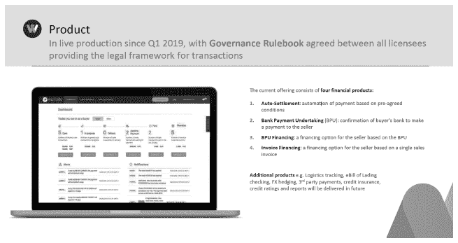

**图 4.8 WeTrade 产品概述**

*来源：WeTrade 授权许可*

WeTrade 现任 CEO Ciaran McGowan 表示，他正在专注于提升客户价值：

*“[客户]的反馈非常积极，认为这是一个创新且直观的解决方案。但还有改进空间：我们的客户希望能有更多。例如，在终端用户效率方面，他们希望与他们的 ERP 系统集成，而不是重复输入。他们还非常希望物流服务能作为产品的一部分。我们收到的另一反馈是公司配对搜索功能的改进——他们希望有更多客户在上面，以增加机会。”*^(104) *这就是推动我们优先级最高的事项，即扩大 WeTrade 网络并走向全球。”*^(105)

截至 2020 年 3 月，已有来自奥地利、比利时、捷克共和国、丹麦、芬兰、德国、希腊、爱尔兰、意大利、列支敦士登、卢森堡、荷兰、挪威、西班牙、瑞典、瑞士和英国的银行参与。^(106) 银行使用该平台的费用起价为 5.5 万美元，主要用于覆盖应用程序的云托管成本。截至 2020 年，55%的交易是自动支付；27%是银行支付承诺（BPU）；18%是 BPU 融资。客户主要是中小企业（SMEs），它们在全球范围内承受着延迟支付的主要压力。^(107) WeTrade 的主要网络扩展挑战是出口商和买家都需要与获得许可的采用者之一银行合作。^(108)

竞争

2018 年初，有五个活跃的贸易金融财团（参见图 4.9）。**马可波罗**在 2017 年启动其网络，并与**WeTrade**一起崛起为主要参与者。由香港金融管理局（HKMA）和 20 家银行领导的香港贸易融资平台（HKTFP）成为一家名为**eTradeConnect**的独立公司。为了帮助不同平台之间的互操作性，eTradeConnect 在 2018 年 10 月与 WeTrade 签署了一份谅解备忘录。^(109) 巴达维亚财团在有三家巴达维亚银行加入 WeTrade 后解散。^(110)

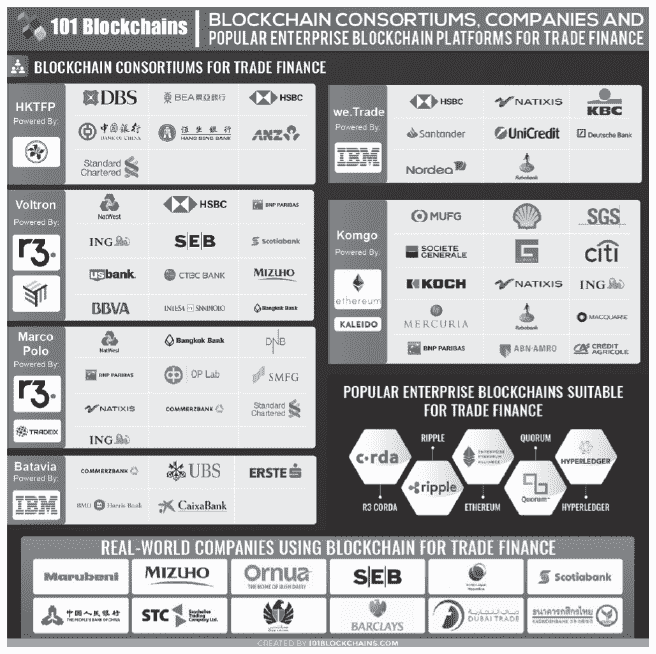

**图 4.9。2019 年活跃的贸易金融财团**

*来源：[`fintechnews.ch/wp-content/uploads/2019/06/trade-finance-blockchain-consortia-101blockchains.com_.jpg`](https://fintechnews.ch/wp-content/uploads/2019/06/trade-finance-blockchain-consortia-101blockchains.com_.jpg)*

在 Voltron 平台上，标准渣打银行在 2019 年成为了首家完成国际信用证的银行。^(111) 2020 年 1 月，Voltron 财团在新加坡成立了一个名为**Contour**的独立法人实体，此前在 14 个国家进行了现场试点，共有 50 多家银行参与。其主要服务是将信用证从 5-10 天简化至 24 小时以内。^(112) **Komgo** 在 2018 年 8 月创建了一个合资企业，并推出了其平台，声称有 12 家银行和 100 家 corporate clients 使用其最初的两个服务，分别是数字信用证和 KYC。股东包括荷兰 ABN Amro 银行；法国 BNP Paribas 银行；美国花旗集团；法国农业信贷银行；瑞士 Gunvor 能源公司；荷兰 ING 银行；美国 Koch Supply & Trading 公司；澳大利亚麦格理集团；南美 Mercuria 能源公司；日本三菱日联银行；法国 Natixis 银行；荷兰 Rabobank 银行；荷兰皇家壳牌集团；瑞士 SGS 集团；以及法国 Société Générale 银行。^(113)

世界最终将接纳多少贸易金融平台？未来，贸易金融平台之间可能会继续进行合并和合作，以实现互操作性。

4.6\. 桑坦德

*“桑坦德银行是首批真正希望理解区块链技术对金融行业影响的全球金融机构之一。我们是首批认真对待这一概念并分配资源来弄清楚的银行之一。”*

**约翰·怀兰，桑坦德数字投资银行 Managing Director**^(114)

桑坦德是西班牙企业集团桑坦德集团的全资子公司。桑坦德的历史可以追溯到 1857 年，当时它在西班牙成立。^(115) 像许多全球银行一样，桑坦德积极探索新兴技术，以帮助实现其使命：“提供易于使用的银行产品和服务”。^(116) 桑坦德是首批认识到比特币对金融服务行业潜在影响的大型银行之一。自 2014 年以来，它在该领域一直很活跃。到目前为止，桑坦德的主要区块链探索包括：

• **影响研究。** 2014 年，桑坦德银行是首批委托研究比特币及其在金融行业潜在用途的银行之一。**^(117)**

• **区块链实验室。** 2016 年，桑坦德银行也是首批创建区块链实验室的银行之一，以实验区块链技术。桑坦德银行基于三个问题探索用例：当前流程是否缓慢？成本高昂？易于出错？在区块链领域，该银行主要探索由一个组织或财团运营的私有网络，但也已经实验过公共区块链。**^(118)**

• **风险投资**。桑坦德银行位于英国的风险投资部门 Innoventures，如上所述，为 Ripple 提供了资金。它还为 Blythe Masters 创立的私人区块链平台 Digital Asset Holdings 提供了资金；Elliptic，一家旨在建立全球区块链监控标准的初创公司；以及 Securitize，一个安全令牌发行和管理平台。^(119)

• **桑坦德一支付 FX**。2018 年，桑坦德银行利用支持 Ripple 的移动应用程序，为零售客户提供了西班牙、英国、巴西和波兰之间的跨境支付。^(120) 一支付 FX 没有使用公共 Ripple 网络或 XRP，而是使用了一个新的企业平台，该平台应用了 Ripple 的技术。

• **企业以太坊联盟** (EEA)。桑坦德银行是 EEA 的成员。2018 年，EEA 的主席、桑坦德银行的创始成员 Julio Faura 表示：

• “联盟自成立以来一直致力于构建一个可以满足所有成员需求的框架。企业以太坊架构堆栈的公开发布使企业成员能够协作共同贡献，并从全球以太坊努力和 EEA 即将发布的规范中受益。”^(122)

• **WeTrade**。2018 年，桑坦德银行，如上所述，成为 WeTrade 的创始成员。^(121)

• **超级账本项目**。桑坦德银行是超级账本项目的活跃成员。例如，它正在参与开发超级账本阿瓦隆，这是一个可信赖的计算服务框架，旨在确保通过使用零知识证明、多方计算和可信执行环境正确且秘密地完成计算。^(123)

• **智能支付**。2019 年，桑坦德银行与其他西班牙银行（Bankia、BBVA 和 CaixaBank）以及管理西班牙国家支付系统的 Iberpay 开始了一个为期六个月的 POC，以测试私有区块链上的智能支付。Grant Thornton 的区块链实验室担任技术合作伙伴。每个合作伙伴运行一个节点。^(124)

• **实用结算币（USC）。** 桑坦德银行和 13 家其他大型银行（纽约梅隆银行；巴克莱银行；加拿大帝国商业银行；德意志银行；瑞士信贷；荷兰国际集团；KBC 银行；劳埃德银行集团；三菱日联金融集团；纳斯达克；三井住友银行集团；美国道富银行和瑞银）已经在悄悄进行几年之久的全球商业和中央银行领域的区块链货币发行工作。2019 年 6 月 3 日，这些银行公开宣布了一个新公司，名为***Fnality 国际***。Fnality 总部位于伦敦，并从参与银行筹集了 6320 万美元的资金。USC 旨在成为一种始终由中央银行的国家级法定货币全面支持并保证的代币。^(125) Fnality 计划从欧元、美元、英镑、加拿大元和日元开始进行代币化。^(126) 在每个司法管辖区内，USCs 将确保遵守当地结算最终性法律和规定。^(127) ***Clearmatics***，Fnality 的技术合作伙伴，正在基于名为 Autonity 的以太坊私有版本上构建解决方案。^(128)

• **数字债券发行。** 2019 年，桑坦德银行在公共以太坊区块链网络上完成了完整的债券发行端到端流程。^(129) 我们现在将更详细地查看这一独特且重要的应用。

4.6.1\. 桑坦德银行的数字债券发行

背景

桑坦德银行希望了解在公共区块链上推出真实金融工具需要什么。对于桑坦德来说，进行试点是一个重大的任务，因为它涉及到真实资金，这意味着解决方案必须符合所有内部安全要求以及所有法规，并且必须得到新产品委员会的批准。它选择了发行债券，因为这是一种资金量小的金融工具，规则明确定义。桑坦德还可以使用其单独的法律实体来充当债券发行和结算中通常涉及的独立各方。**^(130)**

解决方案

桑坦德银行的数字债券发行是一种标准的、一年期的 2000 万美元债券，支付 1.98%的固定利率，分四个季度支付。该债券于 2019 年 9 月在以太坊上推出，这是一个公共区块链，被用作注册和清算所。^(131) 桑坦德银行作为债券的*发行人*；桑坦德证券服务部作为*投资者*；桑坦德企业投资银行作为连接发行人和投资者的*交易商*；桑坦德银行作为*保管行*。^(132) 基于全球律师事务所艾伦与奥弗利提供的法律建议，桑坦德银行依据英国法律发行了数字债券，因为英国法律要求有记录的注册表，但并未指定注册表的类型。^(133) 根据英国法律，记录的注册表可能是一张纸、一个电子表格、一个中心证券存托机构，或者是，是的，甚至是区块链。 (桑坦德不能使用西班牙法律，因为它要求记录的注册表是一个中心证券存托机构。)

为了执行数字债券，发行人和投资者必须加入区块链发行平台，以符合 KYC 和 AML 的规定。该区块链发行平台维护一个可信参与者的白名单，同时也控制着所有权限额。债券代币以每单位 20 万美元的 100 个单位的形式创建。^(134) 图 4.10 描述了工作流程，可以在 etherscan.io 上跟踪该流程。

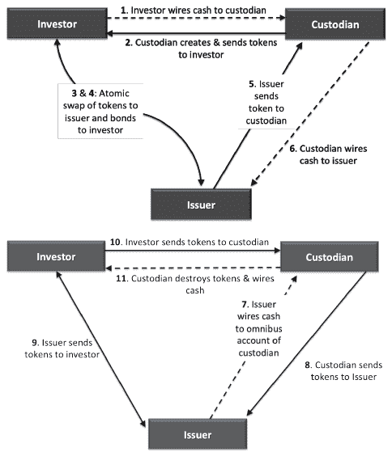

**图 4.10：数字区块链债券发行和结算流程**

***现金流发生在步骤 1、6、7 和 11 中；令牌流发生在步骤 2、3、5、8、9 和 10 中；债券是步骤 4***

在第一步中，***投资者***从他们的现金账户向保管银行的一个保管账户转入了 2000 万美元的真实现金。

• 在第二步中，***保管行***验证了实际现金确实已经收到，并创建了数字现金代币，然后将其发送回投资者。（这是令牌化步骤）。然后投资者准备好用他们的数字现金代币投资债券。

• 步骤 3 和 4 是同时发生的：投资者承诺将 2000 万数字现金代币投资于 2000 万美元的债券；***发行人***授权交易继续进行。进行了一次原子交换，债券交付给投资者，发行人收到了 2000 万的数字现金代币。债券和承诺都由运行在以太坊上的智能合约控制。本质上，智能合约充当了托管账户。将来，发行人可能有许多关于这些数字代币的投资选项。在今天的世界里，发行人对此无能为力，因此在这个区块链成熟阶段，发行人将其换回美元。

• 在第五步中，***发行人***将数字现金代币发送到保管行。

在第六步，***保管方***销毁了代币（称为去代币化），并将 2000 万美元的真实现金电汇到发行方的账户。

至于发行方对投资者季度付款，步骤 7 到 11 由智能合约控制。

在第七步，***发行方***从他们的现金账户向保管方的保管账户发送真实现金的季度付款。

在第八步，***保管方***验证真实现金确实已经收到，创建数字现金代币，并将代币发送回发行方。

在第九步，***发行方***将数字现金代币发送至智能合约，智能合约再将代币分发给投资者。

在第十步，***投资者***将代币发送给保管银行。

在第十一步，***保管方***银行销毁了代币，并将真实现金电汇到投资者的账户。^(135)

交易证明可以在以太坊上查看（见图 4.11）。^(136)

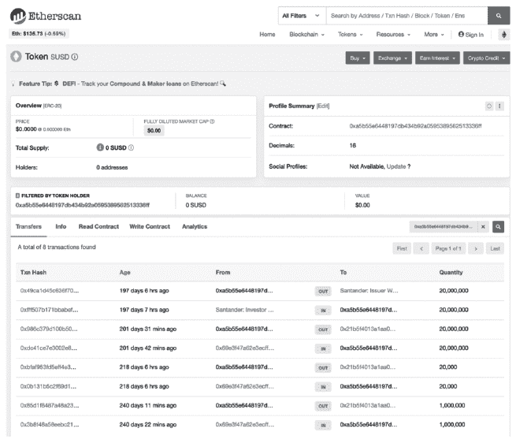

**图 4.11：2020 年 3 月 25 日桑坦德银行的 ERC-20 代币（SUSD）的以太坊记录**

*来源：[`etherscan.io/token/0xa5b55e6448197db434b92a0595389562513336ff?a=0xa5b55e6448197db434b92a0595389562513336ff`](https://etherscan.io/token/0xa5b55e6448197db434b92a0595389562513336ff?a=0xa5b55e6448197db434b92a0595389562513336ff)*

应用映射在图 4.12 中。

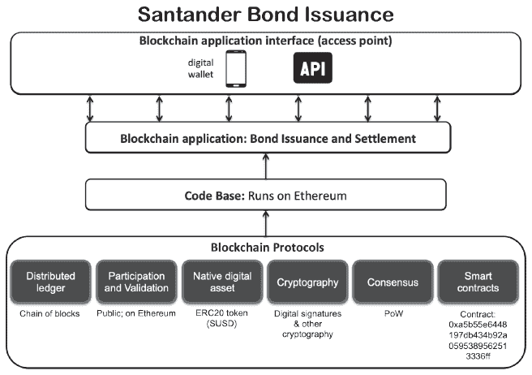

**图 4.12：桑坦德债券映射到区块链应用框架**

在反思桑坦德银行的所有的区块链举措时——其中许多可能会颠覆银行的传统收入渠道——数字投资银行董事约翰·怀兰说：

*“我个人感觉我们别无选择。这项技术允许这样做。如果我们不做，别人会做。所以，我认为银行意识到我们的竞争对手不仅仅是其他银行，还包括像 Facebook、Google、阿里巴巴或腾讯这样的大科技。在许多方面，货币和价值只是机器中的 ones 和 zeros，这是一个工程问题，而不是金融问题。”* **^(137)**

4.7. 结论

瑞波、恒星、WeTrade 和桑坦德代表了许多探索区块链应用以解决当今金融体系问题的组织。它们是企业中使用的实时生产系统的的重要例子。还有许多其他实时示例和更多金融服务的平台。在下一章，我们将探讨区块链在供应链中的应用。

引用：

^(1) 与玛丽·拉西奇的个人访谈

^(2) 与玛丽·拉西奇的个人访谈

^(3) CBInsights (2017), The FinTech 250, [`www.cbinsights.com/research-fintech250`](https://www.cbinsights.com/research-fintech250)

世界银行发布的关于《金融包容性》的文章，^(4)。

麦肯锡公司在 2016 年的报告《全球支付 2016：强劲的基本面 despite 不确定的时期》中提到，^(5)。

实际的流程取决于使用哪些服务。许多银行使用 SWIFT（国际银行金融电信协会），一个国际支付网络；欧盟成员国可能会使用 SEPA（单一欧元支付区）来管理银行转账。SEPA *“允许客户无需现金即可向位于该区域的任何人进行欧元支付，只需一个银行账户和一套支付工具；SEPA 保证欧元支付在保证时间内收到，并且银行不得扣除转账的金额。”* 冰岛、列支敦士登、挪威、瑞士、摩纳哥和圣马力诺也使用 SEPA。^(6)。

一篇题为《There is no such thing as an international wire》的文章，^(7)。

一篇题为《Navigating the world of cross-border payments》的文章，^(8)。

[麦肯锡公司](http://www.mckinsey.com/~/media/mckinsey/dotcom/client_service/financialservices/latest%20thinking/payments/global_payments_2015_a_healthy_industry_confronts_disruption.ashx)在 2015 年的报告《全球支付 2015：一个健康的行业面临颠覆》中提到，^(9)。

美国银行协会在 2016 年的报告《银行产品费用和定价》，^(10)。

麦肯锡公司在 2016 年的报告《为所有人提供数字金融》中提到，^(11)。

^(12) Peric, K. (2017 年 4 月 18 日), *用数字支付抗击贫困*, 在 MIT 商业区块链会议上发表。 [`events.technologyreview.com/video/watch/kosta-peric-bill-and-melinda-gates-foundation-fighting-poverty/`](http://events.technologyreview.com/video/watch/kosta-peric-bill-and-melinda-gates-foundation-fighting-poverty/)

^(13) 非洲和亚洲的大多数 150 个人对个人的移动支付平台可以在 5 美元的手机上运行，只需要基本的 2G 通话和短信功能。来源：Peric, K. (2017 年 4 月 18 日), *用数字支付抗击贫困*, 在 MIT 商业区块链会议上发表。 [`events.technologyreview.com/video/watch/kosta-peric-bill-and-melinda-gates-foundation-fighting-poverty/`](http://events.technologyreview.com/video/watch/kosta-peric-bill-and-melinda-gates-foundation-fighting-poverty/)

^(14) Peric, K. (2017 年 4 月 18 日), *用数字支付抗击贫困*, 在 MIT 商业区块链会议上发表。 [`events.technologyreview.com/video/watch/kosta-peric-bill-and-melinda-gates-foundation-fighting-poverty/`](http://events.technologyreview.com/video/watch/kosta-peric-bill-and-melinda-gates-foundation-fighting-poverty/)

^(15) bKash，一个在 2011 年在孟加拉国推出的移动支付平台，到 2015 年已有超过 1700 万用户。来源：Young, Y. (2016 年 1 月 20 日), *比尔·盖茨投资移动支付网络 bKash；由 10%的孟加拉国人使用*, [`btcmanager.com/bill-gates-invests-in-mobile-payment-network-bkash-used-by-10-of-bangladeshis/`](https://btcmanager.com/bill-gates-invests-in-mobile-payment-network-bkash-used-by-10-of-bangladeshis/)

^(16) 沃达丰在 2007 年推出的 M-Pesa 是一个移动支付平台，在肯尼亚、坦桑尼亚、阿富汗、南非、印度和东欧地区运营。 [`www.mpesa.in/portal/`](https://www.mpesa.in/portal/)

^(17) Dragos, A. (2017 年 6 月 27 日), *区块链技术承诺大大降低提供支票账户的成本*, [`medium.com/mit-media-lab-digital-currency-initiative/blockchains-and-financial-inclusion-f767a2347e3d`](https://medium.com/mit-media-lab-digital-currency-initiative/blockchains-and-financial-inclusion-f767a2347e3d)

^(18) *区块链与金融包容：贫困公民的解决方案*, 2016 年 7 月 11 日, [`letstalkpayments.com/blockchain-and-financial-inclusion-for-citizens-in-poverty/`](https://letstalkpayments.com/blockchain-and-financial-inclusion-for-citizens-in-poverty/)

^(19) Arshadi, N. (2017), *将区块链应用于支付系统：一种更低成本、更安全的 ACH 替代方案*, 工作论文。

^(20) [`ripple.com/network/financial-institutions/`](https://ripple.com/network/financial-institutions/)

Branson, R. (2015), *Ripple: The Ultimate Guide to Understanding Ripple Currency*, Elliot Branson Publications.

[`ripple.com/`](https://ripple.com/)

[`ripple.com/`](https://ripple.com/)

[`en.wikipedia.org/wiki/Ripple_(company)`](https://en.wikipedia.org/wiki/Ripple_(company))

[`ripple.com/xrp/`](https://ripple.com/xrp/)

[`ripple.com/use-cases/`](https://ripple.com/use-cases/)

[`ripple.com/use-cases/corporates/`](https://ripple.com/use-cases/corporates/)

[`ripple.com/network/financial-institutions/`](https://ripple.com/network/financial-institutions/)

[`www.santander.com/en/stories/one-pay-fx-blockchain-for-streamlining-international-transfers`](https://www.santander.com/en/stories/one-pay-fx-blockchain-for-streamlining-international-transfers)

[`ripple.com/insights/swell-2018-how-banco-santander-launched-a-payment-app-for-millions/`](https://ripple.com/insights/swell-2018-how-banco-santander-launched-a-payment-app-for-millions/)

[`ripple.com/customer-case-study/sbi-remit/`](https://ripple.com/customer-case-study/sbi-remit/)

[`fortune.com/2017/11/16/amex-payments-ripple-blockchain/`](http://fortune.com/2017/11/16/amex-payments-ripple-blockchain/)

Branson, R. (2015), *Ripple: The Ultimate Guide to Understanding Ripple Currency*, Elliot Branson Publications.

[`ripple.com/build/gateway-guide/`](https://ripple.com/build/gateway-guide/)

Schwartz, D., Youngs, N., and Britto, A. (2014), *The Ripple Protocol Consensus Algorithm*, [`ripple.com/files/ripple_consensus_whitepaper.pdf`](https://ripple.com/files/ripple_consensus_whitepaper.pdf)

[`ripple.com/build/ledger-format/`](https://ripple.com/build/ledger-format/)

Branson, R. (2015), *Ripple: The Ultimate Guide to Understanding Ripple Currency*, Elliot Branson Publications.

Branson, R. (2015), *Ripple: The Ultimate Guide to Understanding Ripple Currency*, Elliot Branson Publications.

[`ripple.com/technical-faq-ripple-consensus-ledger/`](https://ripple.com/technical-faq-ripple-consensus-ledger/)

[`www.toptenreviews.com/money/investing/best-cryptocurrencies/ripple-review/`](http://www.toptenreviews.com/money/investing/best-cryptocurrencies/ripple-review/)

^(41) Bob Way 在[Ripple.com](http://Ripple.com)上，据 Seibold, S. 和 Samman, G. (2016), *共识：价值互联网的不变协议*, KPMG 白皮书报道。

^(42) *选择验证者*, [`wiki.ripple.com/Consensus`](https://wiki.ripple.com/Consensus)

^(43) *技术常见问题：Ripple 共识账本*, [`ripple.com/technical-faq-ripple-consensus-ledger/`](https://ripple.com/technical-faq-ripple-consensus-ledger/)

^(44) *技术常见问题：Ripple 共识账本*, [`ripple.com/technical-faq-ripple-consensus-ledger/`](https://ripple.com/technical-faq-ripple-consensus-ledger/)

^(45) Maxim, J. (2015 年 6 月 24 日), *R

^(46) [`github.com/ripple`](https://github.com/ripple)

^(47) Agarwal, H. (2017 年 12 月 31 日), *Ripple (XRP) 钱包—最佳的 Ripple 钱包*, [`coinsutra.com/best-ripple-xrp-wallets/`](https://coinsutra.com/best-ripple-xrp-wallets/)

^(48) [`ripple.com/build/gateway-guide/`](https://ripple.com/build/gateway-guide/)

^(49) Branson, R. (2015), *Ripple：理解 Ripple 货币的终极指南*, Elliot Branson 出版社。

^(50) Branson, R. (2015), *Ripple: The Ultimate Guide to Understanding Ripple Currency*, Elliot Branson Publications.

^(51) Levy, A. (2017 年 5 月 26 日), *比特币竞争对手 Ripple 突然坐拥数十亿美元加密货币*, CNBC 新闻, [`www.cnbc.com/2017/05/26/bitcoin-rival-ripple-is-sitting-on-many-billions-of-dollars-of-xrp.html`](http://www.cnbc.com/2017/05/26/bitcoin-rival-ripple-is-sitting-on-many-billions-of-dollars-of-xrp.html)

^(52) Maziières, D. (2016), *Stellar 共识协议：互联网级共识的联邦模型*, 白皮书, [`www.stellar.org/papers/stellar-consensus-protocol.pdf`](https://www.stellar.org/papers/stellar-consensus-protocol.pdf)

^(53) 2016 年 5 月 5 日美国财政部发布的新闻稿：[`www.fincen.gov/sites/default/files/shared/20150505.pdf`](https://www.fincen.gov/sites/default/files/shared/20150505.pdf)

^(54) Todd, S. 和 McKendry, I. (2015), ‘Ripple 的 Fincen 罚款对数字货币行业的意义’, *美国银行家*, [`www.americanbanker.com/news/what-ripples-fincen-fine-means-for-the-digital-currency-industry`](https://www.americanbanker.com/news/what-ripples-fincen-fine-means-for-the-digital-currency-industry)

见注释 55：*Stellar 和 Ripple 被黑: Justcoin 前来救援*，2014 年 10 月 14 日，[文章链接](https://cointelegraph.com/news/stellar-and-ripple-hacked-justcoin-to-the-rescue)

[Stellar.org 基金会](https://www.stellar.org/foundation)

2017 年与 Mary Lacity 的个人访谈

[关于 Stellar 的使命](https://www.stellar.org/about/mandate/)

见注释 59：Maziières, D. (2016), *The Stellar Consensus Protocol: A Federated Model for Internet-level Consensus*, White Paper, [论文链接](https://www.stellar.org/papers/stellar-consensus-protocol.pdf)

[星际支付网络](https://en.wikipedia.org/wiki/Stellar_(payment_network))，见注释 60

[Stellar 资金](https://www.crunchbase.com/organization/stellar)

2020 年 3 月 25 日与 Jed McCaleb 的电子邮件交流。

见注释 63：Stellar Develop Foundation (2020), *Cowrie’s cross-border payment services for Nigeria powered by Stellar*, [视频链接](https://www.youtube.com/watch?v=sDj8THW1UWg&feature=youtu.be)

见注释 64：ShapShak, T. (2016), ‘Instant Money Transfer Service Stellar Launches for Nigeria’s Rural Women’, *Forbes Magazine*, [文章链接](https://www.forbes.com/sites/tobyshapshak/2016/02/02/stellar-launches-mobile-money-service-for-nigerias-rural-woman/#49d71f577183)

见注释 65：Stellar Develop Foundation (2020), *Cowrie’s cross-border payment services for Nigeria powered by Stellar*, [视频链接](https://www.youtube.com/watch?v=sDj8THW1UWg&feature=youtu.be)

[由 Stellar 提供动力的商业解决方案](https://www.stellar.org/how-it-works/powered-by-stellar)

[从欧洲向菲律宾发送资金变得更加便捷 - Tempo](https://coins.ph/blog/conveniently-send-money-from-europe-to-the-philippines-with-tempo/)，见注释 62

见注释 68：与 Mary Lacity 的个人访谈

见注释 69：[Coinqvest 的集成](https://www.coinqvest.com/en/integrations)

[Stellar 案例研究 - Saldo](https://www.stellar.org/case-studies/saldo)，见注释 70

见注释 71：与 Mary Lacity 的个人访谈

下载 IBM World Wire 的 Stellar 案例研究，[链接](https://www.ibm.com/downloads/cas/YW3W2JPZ)

[IBM World Wire 的 Stellar 案例研究](https://youtu.be/GtQY8Jfa4NA)，见注释 73

^(74) [`www.stellar.org/how-it-works/stellar-basics/`](https://www.stellar.org/how-it-works/stellar-basics/)

^(75) 与 Mary Lacity 的个人访谈

^(76) [`stellar.expert/explorer/public/network-activity`](https://stellar.expert/explorer/public/network-activity)

[`stellar.expert/explorer/public/ledger/28825068`](https://stellar.expert/explorer/public/ledger/28825068)

^(77) Bello, K. (May 2016), *Ripple 与 Stellar Lumens 的对比*, [`www.youtube.com/watch?v=aeONeHlF9y4`](https://www.youtube.com/watch?v=aeONeHlF9y4)

^(78) [`www.stellar.org/how-it-works/stellar-basics/`](https://www.stellar.org/how-it-works/stellar-basics/)

^(79) *Ripple 与 Stellar 之间的区别*, [`galactictalk.org/d/242-difference-between-ripple-and-stellar`](https://galactictalk.org/d/242-difference-between-ripple-and-stellar)

^(80) [`www.stellar.org/lumens/`](https://www.stellar.org/lumens/)

^(81) [`www.stellar.org/about/mandate/`](https://www.stellar.org/about/mandate/)

^(82) [`www.stellar.org/lumens/`](https://www.stellar.org/lumens/)

^(83) Dale, B. (November 5^(th,) 2019), *Stellar 基金会刚刚销毁了其莱姆币加密货币一半的供应量*, Coindesk, [`www.coindesk.com/stellars-foundation-just-destroyed-half-the-supply-of-its-lumens-cryptocurrency`](https://www.coindesk.com/stellars-foundation-just-destroyed-half-the-supply-of-its-lumens-cryptocurrency)

^(84) 当前分配数量请查看[`dashboard.stellar.org/`](https://dashboard.stellar.org/)

^(85) 与 Mary Lacity 的个人访谈

^(86) [`www.stellar.org/lumens/`](https://www.stellar.org/lumens/)

87 Maziières, D. (2016), *The Stellar Consensus Protocol: A Federated Model for Internet-level Consensus*, White Paper, [`www.stellar.org/papers/stellar-consensus-protocol.pdf`](https://www.stellar.org/papers/stellar-consensus-protocol.pdf)

88 [`medium.com/a-stellar-journey/on-worldwide-consensus-359e9eb3e949`](https://medium.com/a-stellar-journey/on-worldwide-consensus-359e9eb3e949)

89 [`stellarbeat.io/nodes`](https://stellarbeat.io/nodes)

90 To view organizations operating nodes, see [`stellarbeat.io/organizations`](https://stellarbeat.io/organizations)

91 To view live nodes, see [`dashboard.stellar.org/`](https://dashboard.stellar.org/)

92 Benoliel, M. (December 4^(th) 2017), *Why Stellar could be the next big ICO platform*, [`hackernoon.com/why-stellar-could-be-the-next-big-ico-platform-f48fc3cb9a6c`](https://hackernoon.com/why-stellar-could-be-the-next-big-ico-platform-f48fc3cb9a6c)

93 [`www.stellar.org/lumens/`](https://www.stellar.org/lumens/)

94 Email exchange with Jed McCaleb, March 25, 2020.

^(95) 2020 年 3 月 22 日与 Mary Lacity 的电子邮件交流。

^(96) IBM. 用 IBM 区块链帮助公司无缝交易。

^(97) 莫里斯，N.（2020 年），《we.trade 区块链贸易支付证明受欢迎》。Ledger Insights，[`www.ledgerinsights.com/wetrade-blockchain-trade-finance-automated-payments/`](https://www.ledgerinsights.com/wetrade-blockchain-trade-finance-automated-payments/)

^(98) IBM，《用 IBM 区块链帮助公司无缝交易》。[`www.ibm.com/blockchain/use-cases/success-stories/#section-7`](https://www.ibm.com/blockchain/use-cases/success-stories/#section-7)

^(99) 2020 年 3 月 24 日与 Mary Lacity 的访谈。

^(100) IBM 区块链视频。《宝贵的愿景家：罗伯托·曼科内》，view-source:[`www.ibm.com/blockchain/use-cases/success-stories/#section-7`](https://www.ibm.com/blockchain/use-cases/success-stories/#section-7)

^(101) 2020 年 8 月 8 日**理查德·费曼**诺贝尔物理学奖得主。we.trade 交易量在 2019 年每月增长 38%。[`cms.we-trade.com/app/uploads/we.trade_press_release_38percentgrowth_2019.08.08.pdf`](https://cms.we-trade.com/app/uploads/we.trade_press_release_38percentgrowth_2019.08.08.pdf)

^(102) PYMNTS（2019 年 4 月 30 日）的引用。B2B 支付*we.trade 联合创始人辞职，透露对区块链的疑虑*。[`www.pymnts.com/news/b2b-payments/2019/wetrade-cofounder-quits-blockchain-doubt/`](https://www.pymnts.com/news/b2b-payments/2019/wetrade-cofounder-quits-blockchain-doubt/)

^(104) 瓦尼，M.（2019 年 12 月 17 日），《五家西班牙银行将测试私有区块链支付》，*criptonoticias*。[`www.criptonoticias.com/negocios/servicios-financieros/cinco-bancos-espanoles-probaran-pagos-blockchain-privada/`](https://www.criptonoticias.com/negocios/servicios-financieros/cinco-bancos-espanoles-probaran-pagos-blockchain-privada/)

^(105) 瓦斯，S.（2019 年 9 月），《独家采访：we.trade 新任经理谈论扩张计划、TradeLens 合作和平台路线图》，全球贸易评论。[`www.gtreview.com/news/fintech/exclusive-interview-new-we-trade-manager-talks-expansion-plans-tradelens-partnership-and-platform-roadmap/`](https://www.gtreview.com/news/fintech/exclusive-interview-new-we-trade-manager-talks-expansion-plans-tradelens-partnership-and-platform-roadmap/)

^(106) WeTrade 网站。国家下拉菜单。[`we-trade.com/request-access`](https://we-trade.com/request-access)

Morris, N.（2020 年），*we.trade 区块链贸易金融自动化支付受欢迎*，Ledger Insights。[`www.ledgerinsights.com/wetrade-blockchain-trade-finance-automated-payments/`](https://www.ledgerinsights.com/wetrade-blockchain-trade-finance-automated-payments/)

Morris, N.（2018 年），*贸易金融区块链竞赛即将开始*。[`www.ledgerinsights.com/wetrade-trade-finance-blockchain-race/`](https://www.ledgerinsights.com/wetrade-trade-finance-blockchain-race/)

香港金融管理局新闻稿（2018 年 10 月 18 日）。[`www.hkma.gov.hk/eng/news-and-media/press-releases/2018/10/20181031-4/`](https://www.hkma.gov.hk/eng/news-and-media/press-releases/2018/10/20181031-4/)

Wass, S.（2018 年 3 月 10 日），*we.trade 和 Batavia 合并贸易金融区块链平台*，全球贸易评论。[`www.gtreview.com/news/fintech/we-trade-and-batavia-merge-blockchain-platforms-for-trade-finance/`](https://www.gtreview.com/news/fintech/we-trade-and-batavia-merge-blockchain-platforms-for-trade-finance/)

Palmer, D.（2019 年 8 月 7 日），‘Standard Chartered 完成在区块链贸易平台 Voltron 上的首次交易’，*Coindesk*。[`www.coindesk.com/standard-chartered-completes-first-transaction-on-oil-industry-blockchain-voltron`](https://www.coindesk.com/standard-chartered-completes-first-transaction-on-oil-industry-blockchain-voltron)

FinExtra（2020 年 1 月 28 日），*银行支持的区块链贸易金融平台 Contour 启动*。[`www.finextra.com/newsarticle/35179/bank-backed-blockchain-trade-finance-platform-contour-launches`](https://www.finextra.com/newsarticle/35179/bank-backed-blockchain-trade-finance-platform-contour-launches)

Wass, S.（2019 年 9 月 1 日），*Komgo 区块链平台为商品贸易金融上线*，全球贸易评论。[`www.gtreview.com/news/fintech/komgo-blockchain-platform-for-commodity-trade-finance-goes-live/`](https://www.gtreview.com/news/fintech/komgo-blockchain-platform-for-commodity-trade-finance-goes-live/)

John Whelan 在阿肯色大学区块链卓越中心的演讲（2019 年 12 月 3 日）， Managing Director, Digital Investment Bank, Santander。

[`en.wikipedia.org/wiki/Santander_Bank`](https://en.wikipedia.org/wiki/Santander_Bank)

Santander 网站 [`www.santanderbank.com/us/about/about-us/leadership`](https://www.santanderbank.com/us/about/about-us/leadership)

John Whelan 在阿肯色大学区块链卓越中心的演讲（2019 年 12 月 3 日）， Managing Director, Digital Investment Bank, Santander。

2019 年 12 月 3 日，John Whelan，数字投资银行 Managing Director，桑坦德，在阿肯色大学区块链卓越中心做的演讲。（注：118）

^(119) [`santanderinnoventures.com/portfolio-companies/`](https://santanderinnoventures.com/portfolio-companies/)（注：119）

Delventhal, S. (2018 年 4 月 13 日)，*桑坦德推出区块链支付服务*，Investopedia，[`www.investopedia.com/news/santander-launches-blockchain-payments-service/`](https://www.investopedia.com/news/santander-launches-blockchain-payments-service/)（注：120）

^(121) [`we-trade.com/banking-partners`](https://we-trade.com/banking-partners)（注：121）

Enterprise Ethereum Alliance Press Release (2018 年 5 月 2 日)，*企业以太坊联盟通过公开发布企业以太坊架构堆栈推进 Web 3.0 时代*。[`entethalliance.org/enterprise-ethereum-alliance-advances-web-3-0-era-public-release-enterprise-ethereum-architecture-stack/`](https://entethalliance.org/enterprise-ethereum-alliance-advances-web-3-0-era-public-release-enterprise-ethereum-architecture-stack/)（注：122）

HyperLedger Avalon (2019 年 10 月 3 日)，*介绍 Hyperledger Avalon*，[`www.hyperledger.org/blog/2019/10/03/introducing-hyperledger-avalon`](https://www.hyperledger.org/blog/2019/10/03/introducing-hyperled

^(124) LedgerInsights (2019 年 12 月 23 日)，*桑坦德和 BBVA 在西班牙区块链智能支付试验中*，[`www.ledgerinsights.com/enterprise-blockchain-news-roundup-23dec/`](https://www.ledgerinsights.com/enterprise-blockchain-news-roundup-23dec/)（注：124）

[主要公用事业结算币项目筹集 6300 万美元用于商业化实现](https://cointelegraph.com/news/major-utility-settlement-coin-project-raises-63-mln-for-commercial-realization)，Huillet, M. (2019 年 6 月 3 日)，*CoinTelegraph*，[`cointelegraph.com/news/major-utility-settlement-coin-project-raises-63-mln-for-commercial-realization`](https://cointelegraph.com/news/major-utility-settlement-coin-project-raises-63-mln-for-commercial-realization)（注：125）

Allison, I. (2019 年 6 月 13 日)，*14 家银行，5 种代币：深入了解 Fnality 对银行间区块链的广泛愿景*，*Coindesk*，[`www.coindesk.com/fnality-utility-settlement-coin-central-bank-token-blockchain`](https://www.coindesk.com/fnality-utility-settlement-coin-central-bank-token-blockchain)（注：126）

Huillet, M. (2019 年 6 月 3 日)，*主要公用事业结算币项目筹集 6300 万美元用于商业化实现*，*CoinTelegraph*，[`cointelegraph.com/news/major-utility-settlement-coin-project-raises-63-mln-for-commercial-realization`](https://cointelegraph.com/news/major-utility-settlement-coin-project-raises-63-mln-for-commercial-realization)（注：127）

128 Allison, I. (June 13, 2019), ‘14 Banks, 5 Tokens: Inside Fnality’s Expansive Vision for Interbank Blockchains’, *Coindesk*, [`www.coindesk.com/fnality-utility-settlement-coin-central-bank-token-blockchain`](https://www.coindesk.com/fnality-utility-settlement-coin-central-bank-token-blockchain)

129 Palmer, D. (December 10^(th,) 2019), ‘Santander Exec Claims Blockchain Success as Bank Redeems Ethereum-Issued Bond’, *Coindesk*, [`www.coindesk.com/santander-exec-claims-blockchain-success-as-bank-redeems-ethereum-issued-bond`](https://www.coindesk.com/santander-exec-claims-blockchain-success-as-bank-redeems-ethereum-issued-bond)

^(130) John Whelan 董事，数字投资银行，桑坦德银行，在阿肯色大学区块链卓越中心所做的演讲，2019 年 12 月 3^(rd,) 2019.

^(131) Palmer, D. (2019 年 12 月 10^(th,) 2019), ‘桑坦德银行高管宣称区块链成功，因为银行赎回了以太坊发行的债券’，*Coindesk*, [`www.coindesk.com/santander-exec-claims-blockchain-success-as-bank-redeems-ethereum-issued-bond`](https://www.coindesk.com/santander-exec-claims-blockchain-success-as-bank-redeems-ethereum-issued-bond)

^(132) 桑坦德银行新闻稿 (2019 年 9 月 12 日), *桑坦德银行推出首个端到端区块链债券*, [`www.santander.com/en/press-room/press-releases/santander-launches-the-first-end-to-end-blockchain-bond percentC2 percentA0`](https://www.santander.com/en/press-room/press-releases/santander-launches-the-first-end-to-end-blockchain-bond%20percentC2percentA0)

^(133) Huillet, M. (2019 年 9 月 12 日). [`cointelegraph.com/news/santander-issues-20-million-end-to-end-blockchain-bond-on-ethereum`](https://cointelegraph.com/news/santander-issues-20-million-end-to-end-blockchain-bond-on-ethereum), *CoinTelegraph*, [`cointelegraph.com/news/santander-issues-20-million-end-to-end-blockchain-bond-on-ethereum`](https://cointelegraph.com/news/santander-issues-20-million-end-to-end-blockchain-bond-on-ethereum)

^(134) 在以太坊上可查看智能合约: [`etherscan.io/address/0xa5b55e6448197db434b92a0595389562513336ff`](https://etherscan.io/address/0xa5b55e6448197db434b92a0595389562513336ff)

^(135) John Whelan 董事，数字投资银行，桑坦德银行，在阿肯色大学区块链卓越中心所做的演讲，2019 年 12 月 3^(rd, 2019.)

^(136) 与数字债券相关的以太坊交易可见:

**桑坦德发行人钱包:** [`etherscan.io/address/0x12959b84d507df134ec59c1fc4044b03f33a9947#tokentxns`](https://etherscan.io/address/0x12959b84d507df134ec59c1fc4044b03f33a9947#tokentxns).

**桑坦德投资钱包:** [`etherscan.io/address/0xe08193b5afcfea60fceb22f065e88e76718c6ee3`](https://etherscan.io/address/0xe08193b5afcfea60fceb22f065e88e76718c6ee3)

**ERC20 代币（SUSD）：** [`etherscan.io/token/0xa5b55e6448197db434b92a0595389562513336ff?a=0xa5b55e6448197db434b92a0595389562513336ff`](https://etherscan.io/token/0xa5b55e6448197db434b92a0595389562513336ff?a=0xa5b55e6448197db434b92a0595389562513336ff)

^(137)约翰·怀兰，数字投资银行总经理，桑坦德银行，在阿肯色大学区块链卓越中心所做的演讲，2019 年 12 月 3^(日)。

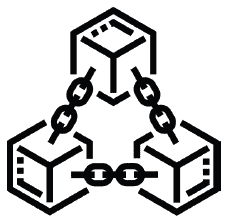

## 第五章

## 供应链的商业应用

“新技术的出现——最引人注目的是区块链——有潜力彻底改变供应链中交易记录、存储和使用的方式。结果：一个透明的供应链，如果炒作成真，将带来前所未有的可见性、责任感、效率、合作和信任。”

**Remko Van Hoek, Brian Fugate, Marat Davletshin, 和 Matthew Waller, 供应链管理中集成区块链.**^(1)

“消费者越来越希望知道公司对其产品的道德主张是真实的。分布式账本提供了轻松验证我们所购买物品的故事真实性的方法。透明度伴随着基于区块链的时间戳日期和位置——例如道德钻石——与产品编号相对应。”

**Blockgeeks**^(2)

5.1. 案例概述

今天的全球供应链是一个复杂的贸易伙伴和可信第三方之间的网络。在区块链解决方案之前，每个参与者都维护着自己的集中式系统，随后合作伙伴面临着试图同步关于实体商品和服务流动的数据，以及实际商品和服务流动（见 图 5.1）的重大挑战。

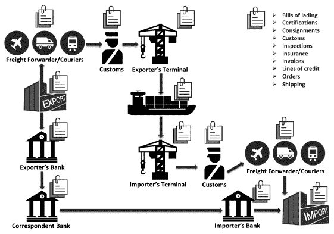

**图 5.1：区块链应用前的全球供应链**

在制造商；出口商；快递员；货运代理人；海关；检查员；装运商和进口商通过全球供应链移动实体商品的同时，他们还在创建关于这些运动的账单；证书；托运单；海关表格；检查数据；保险单；发票；信用额度；订单；装运清单和收货单据等数据。

在制造商、出口商、快递公司、货运代理、海关、检查员、出口商、货主和进口商运输实物商品的同时，他们还创建了关于这些商品运动的文件，包括提单；证书；货物托运；海关表格检查数据；保险单；发票；信用证；采购订单；运单；和收货文件等。由于有这么多参与者各自拥有自己的集中式系统，以及如此多的文件工作：资产丢失；由于缺少文件，货物集装箱在港口被延误；交易伙伴之间记录不一致引发争端；以及假冒产品渗透供应链等问题。因此，消费者通常无法确信地知道他们购买产品的实际来源。

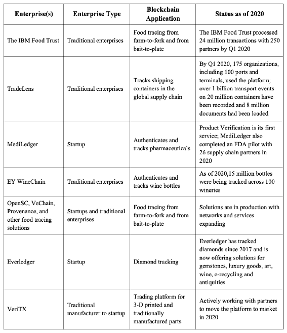

**表 5.1：供应链中的区块链应用示例**

已经有一些基于区块链的供应链投入生产，以解决许多挑战。与金融服务相比，供应链合作伙伴通常更容易部署区块链解决方案，因为许多供应链解决方案跟踪的是物品，而不是金钱（尚且如此）。因此，合规负担较小。在第三章中，我们已经介绍了 IBM Food Trust、TradeLens、MediLedger 和 WineChain 作为供应链示例。在本章中，我们将更深入地研究 IBM Food Trust，并探讨其他针对食品、钻石和零部件的活区块链解决方案（参见表 5.1）。

5.2. 食品安全挑战与解决方案

由于其规模庞大，食品供应链的协调一直是一个特别具有挑战性的问题。2020 年全球食品和杂货零售市场预计将超过 12 万亿美元。^(3)虽然世界上大部分的食品供应是安全的，但仍有很大的改进空间。世界卫生组织报告称，每年有 6 亿人口因食用受污染的食品而食物中毒，42 万人死亡。^(4)除了食品污染问题，全球食品供应还遭受大量的食品浪费、食品标签不实和食品欺诈等问题，比如将马肉标成羊肉，将非有机蔬菜标成有机蔬菜等。^(5)人权和环境问题，如奴隶劳动和未经授权使用农药等，仍然是严重的问题。例如，国际劳工组织估计，有 350 万人被强迫在农业、渔业和林业工作。^(6)每个国家都有自己的食品安全挑战，但在这里我们重点关注美国和中国，因为它们是最大的食品生产和消费国。

美国的食品产业是一个价值 6 万亿美元的行业。**7** 美国疾病控制与预防中心（CDC）估计，每年有 4800 万美国人因食物而生病；12.8 万美国人住院；3000 人因食物传播的疾病而死亡。**8** 2020 年 1 月，美国农业部（USDA）发布了 61 项活跃的食品召回令，主要涉及牛肉；猪肉；家禽；海鲜；以及沙拉。例如，佛罗里达之傲召回了近 7 万千克可能含有**大肠杆菌**的生牛肉产品。其他召回事件是由于标签错误，一些是由于绕过进口检查，一些是由于重新标识，还有一些是因为未声明的过敏原。

食品浪费也是一个大问题；美国每年浪费 1620 亿美元的食品，主要原因是无法估算需求和追踪供应。**9** 美国食品药品监督管理局（FDA）和美国农业部（USDA）需要食品供应链上每个人的合作来提高食品安全。FDA 负责食品政策和应对的副局长 Frank Yiannas 在 2020 年初宣布：

**美国食品药品监督管理局（FDA）发布的新食品安全时代的蓝图**很快就会公布。在预防仍然是我们优先考虑的事项的同时，我们也将寻求利用行动性实时信息赋权消费者，包括直接对消费者进行宣传和通知。**10**

中国的食品市场价值 5270 亿美元，其中肉类产品是最大的细分市场。**11** 中国发生了一系列食品安全危机。例如，2008 年，牛奶和婴儿配方奶粉被掺入了有毒物质（三聚氰胺），以提高蛋白质含量，导致膀胱和肾结石，使 30 万婴儿患病并导致 5.4 万人住院。**12** 2013 年，一些当地中国猪肉经销商从河里打捞起 1.5 万头死猪，加工后出售。**13** 2020 年，中国的鱼贩继续向垂死的鱼中添加柴油燃料，使其挣扎。**14** 除了这些耸人听闻的消息之外，使用农药、危险的化学添加剂和不卫生的条件仍然是挑战。为了帮助提高食品安全，中国政府在 2003 年创建了中国国家食品药品监督管理局（SFDA）来统一食品安全监管。然而，2007 年，CFDA 的负责人因受贿被处决。今天，大约有十个政府部门和部委负责食品安全，包括卫生部门；国家食品药品监督管理局；农业部；国家工商行政管理总局；国家质量监督检验检疫总局；商务部；科技部；以及国家营养与食品安全研究所。**15**

所有利益相关者，包括农民、分销商、供应商、零售商、消费者、政府和学术界都需要参与食品安全。虽然没有单一的解决方案，但与供应链合作伙伴分享信息是任何食品安全解决方案的重要组成部分。正如我们多次指出的，在没有区块链解决方案的情况下，食品供应链中的每一方都管理着自己的记录系统（软件和数据），在企业内部或依赖一个可信赖的第三方代表他们管理他们的系统。每个环节只能看到自己系统内外传入和流出的数据，这就是为什么从零售店召回食品追溯到原始农场或渔场需要几周时间。提高食品安全需要更好地跟踪食品在整个供应链中传递的信息，这被称为“从农场到餐桌”和“从诱饵到餐桌”的追溯性。基于区块链的解决方案提供了与生态系统合作伙伴安全分享数据的能力。在食品行业，已经开发出许多基于区块链的解决方案。我们将从最成熟的解决方案开始。

5.2.1 节. IBM 食品信任

虽然我们在第三章中从高层次上介绍了**IBM 食品信任**，但在这里我们详细考察了这个解决方案。IBM 和沃尔玛——世界上最大的零售商，2019 年的收入达到了 5140 亿美元——早在 2016 年就开始了针对芒果和猪肉的食物追溯试点项目。这个解决方案基于 HyperLedger Fabric，将芒果的追溯时间从七天缩短到了三秒以内。^(16)2017 年，其他供应链合作伙伴加入了该网络，包括 Dole、McCormack、McLane、Driscoll’s、Unilever、Golden State Foods、雀巢和克罗格。截至 2020 年，已有 250 个成员加入。

IBM 在该平台上提供三项服务：追踪、认证和新鲜洞察（见图 5.2）。**追踪**帮助参与者通过跟踪产品标识、产品标签和购买订单号，跟随产品通过供应链。追踪还可以用来跟踪原料是如何从原始材料转化为成品产品的。**认证**监控当前、到期和过期的证书。**新鲜洞察**通过跟踪例如收获后时间和供应链中每个地点的停留时间等事件，监控风险库存。IBM 有一个基于企业规模的分层定价模型，起价为每月 100 美元。

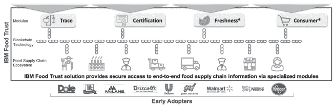

**图 5.2：IBM 食品信任解决方案概览**

来源：[`www.slideshare.net/bluecrux/build-a-supply-chain-40-ecosystem-using-blockchain/10`](https://www.slideshare.net/bluecrux/build-a-supply-chain-40-ecosystem-using-blockchain/10)*

数据项基于 GS1 标准。^(17)IBM 在其云中运行该平台，但它无法解释任何数据。IBM Food Trust 平台依赖于“信任锚点”进行验证，使用实用拜占庭容错（PBFT）共识机制（参见第三章或词汇表）。信任锚点收到加密账本的一个完整副本，但在数据所有者授予访问权限之前，只能查看交易散列值。信任锚点负责以下事项：^(18)

• **资源所有权**：在防篡改的 Z Secure Service Containers 中运行账户，确保数据加密，无论是在传输过程中还是静止状态下。

• **验证**：提供事件由个人提交的验证，以及相应的散列值。

• **背书**：信任锚点可以作为背书者添加到 incoming transactions 中，为提交公司提供额外的信任层，例如私人标签品牌。

• **数据提取**：在调查事件时，IBM Food Trust 的成员可以使用他们的解密密钥，并要求信任锚点从共享账本中提取相关数据，并证明其真实性。

随着网络的增长，更多的参与者将运行信任节点，可能还会在其他云环境中运行。^(19)截至 2020 年第一季度，该平台已处理超过 2400 万笔交易，并跟踪超过 19000 个 SKU。^(20)IBM Food Trust 继续扩大其网络和服务，特别是在冷链和消费者应用方面。IBM 区块链解决方案副总裁 Ramesh Gopinath 讨论了 2020 年的计划：

*“Food Trust 最初是为了使食品召回变得精确，并帮助供应链成员使食品系统更加可持续。随着我们构建解决方案，我们的所有模块将继续专注于解决供应链中的特定摩擦。物联网集成是一个增长领域，通过使用传感器数据，我们可以进一步自动化食品追溯性，并使监控冷链条件变得更容易，确保食品新鲜度并减少浪费。还有巨大的兴趣将该平台与面向消费者的应用程序集成，让消费者确切了解他们的食品来源，了解产品信息，如何准备它们，等等。”*^(21)

5.2.2 其他基于区块链的食品追溯性解决方案

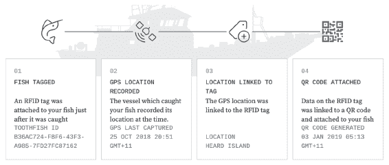

**图 5.3：追踪阿根廷牙鱼示例**

*来源：[`opensc.org/product-example`](https://opensc.org/product-example)*

除了 IBM 食品信任，还有其他使用区块链技术的食品解决方案。例如，**OpenSC**，由世界自然基金会和波士顿咨询集团共同创立，帮助澳大利亚渔业从“诱饵到餐桌”追踪鱼类。^(22) 新捕获的鱼被贴上 RFID 标签并在区块链上注册。全球定位系统（GPS）与 RFID 标签相连，所以每次扫描鱼的时候，事件都被记录在区块链上以追踪它的旅程（见图 5.3）。当鱼被加工时，标签上的数据创建了一个独特的二维码，附在包装上。

许多其他解决方案也使用贴在动物或包装上的二维码作为公钥标识符。作为另一个例子，位于阿肯色州小石城的草根农民合作社使用**Provenance**平台追踪家禽、猪肉和牛肉（见图 5.4）。

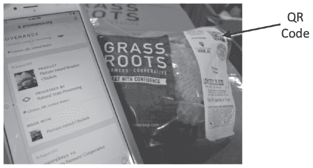

**图 5.4：草根区块链解决方案**

来源：[`mediad.publicbroadcasting.net/p/shared/npr/styles/medium/nprshared/201710/558623705.png`](https://mediad.publicbroadcasting.net/p/shared/npr/styles/medium/nprshared/201710/558623705.png)

***草根使用二维码、区块链技术和移动应用程序，让消费者能够追踪家禽供应链回到农场***

其他例子：明尼苏达州总部的大谷物公司追踪了 70 个农场生产的 20 万只火鸡到零售店。^(23) 一些食品巨头已经开发了自己的解决方案，如法国的卡乐福超市追踪牛奶，美国的三文鱼巨头 Bumble Bee Foods 也这样做了（使用 SAP）。^(24)

**VeChain**，位于新加坡，是一个由以太坊‘启发’的公有区块链，但它使用中心化治理使得更新更加容易。它使用一个权威证明的共识机制，其中 101 个权威主节点运营商是已知和验证的。这些包括学术机构、企业用户和商业和技术合作伙伴。它使用双重代币本地数字资产，VET 和 VTHO。VET 作为商业活动中的价值传输介质，而 VTHO 用于资助交易处理。后者与以太坊收取‘燃料费’以处理交易的方式类似。在 VeChain 中，30% 的交易燃料费（以 VTHO 计）奖励给主节点运营商，70% 被销毁。该设计旨在防止交易费（VTHO）直接暴露在 VET 价格的波动中。根据 VeChain 白皮书：

*“VTHO 通过持有 VET 自动产生。换句话说，持有 VET 的人将获得 VTHO，只要执行的操作消耗的 VTHO 少于产生的 VTHO，就能免费使用 VeChainThor 区块链。VTHO 可以转让和交易，使用户能够为了执行更大规模操作（如运行区块链应用）获得额外的 VTHO。”*^(25)

VeChain 可以访问[`vechainstats.com/`](https://vechainstats.com/)。

2019 年，沃尔玛在中国推出了沃尔玛中国区块链追溯平台，得到了**普华永道**（PricewaterhouseCoopers）和**VeChain**的帮助。到年底，它计划追踪超过 100 种产品，涵盖肉类、大米和新鲜农产品等 10 个类别。信息是在名为 VeChainThor 的公共区块链上追踪的，消费者可以在网站上了解产品信息，包括来源、路线和从农场到零售店的检查。(26)

除了基于区块链的食品追溯解决方案，还有其他供应链解决方案用于追踪不同类型的商品。接下来我们考察钻石追踪的解决方案。

5.3 Everledger

Everledger 追踪从矿山到零售店的钻石。该公司成立于 2015 年，由 Leanne Kemp 创立，她旨在通过更好地追踪与公平贸易实践有关的保证书，帮助阻止“血钻”——在塞拉利昂、利比里亚、安哥拉和科特迪瓦等地资助冲突的钻石开采。联合国成立了世界钻石大会来定义标准，该标准于 2003 年通过。这一过程被称为“ Kimberley Process Certification”，要求钻石的销售者在发票上插入一个保证声明，内容如下：

*“发票中的钻石已从合法来源购买，这些来源未涉及资助冲突，并符合联合国决议。卖家特此保证，根据个人知识和对钻石供应商提供的书面保证，这些钻石与冲突无关。”*(27)

Everledger 通过创建高清照片指定的 40 个元数据点的物理钻石的独特数字孪生版本来追踪钻石（见图 5.5）。Everledger 与 IBM 合作，在 Hyperledger Fabric 上构建了区块链应用程序。截至 2017 年 3 月，超过 100 万颗钻石在账本上有所表示。(28) Everledger 此后扩大了其业务模式，追踪和追踪其他贵重资产，如宝石、奢侈品、艺术品、葡萄酒、电子回收和古董。(29)

尽管 Everledger 最早推出了追踪钻石的产品，但此后其他参与者也进入了市场。2018 年 5 月，戴比尔斯公司通过区块链将 100 颗高价值钻石从矿山追踪到零售商，最终推出了一个名为**Tracr**的分支公司。2019 年 1 月，俄罗斯教育和科学部推出了自己的负责任钻石贸易区块链解决方案，该方案由一家名为**[Bitcarat.com](http://Bitcarat.com)**的俄罗斯初创公司开发。(30) 总部位于加拿大的卢卡拉钻石公司使用**Clara**，这是另一种基于区块链的追踪器。(31) 其解决方案追踪钻石从“矿山到手指”。(32)

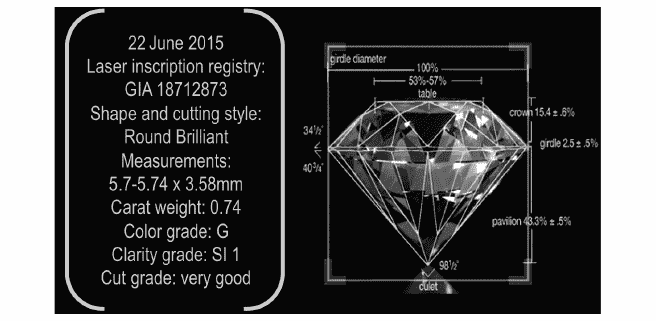

**图 5.5：Everledger 为公平贸易钻石设计的数字标识**

来源：[`www.youtube.com/watch?v=GAdjL-nultI`](https://www.youtube.com/watch?v=GAdjL-nultI)

5.4. VeriTX

*“科斯经济学认为，企业存在是因为公司内部存在信任。区块链使我们能够将信任扩展到公司的四壁之外，并加以分配，因此我们拥有分布式信任。”*

**VeriTX 的创始人兼首席执行官詹姆斯·艾伦·雷根纳**。^(33)

美国空军（退役）上校詹姆斯·艾伦·雷根纳在 2019 年创立了 VeriTX。VeriTX 在特拉华州注册，总部位于纽约州伊斯特奥罗拉。VeriTX 的使命是启用第四种物流模式，雷根纳称之为数字模式，这种模式继陆地、海洋和空中三种模式之后出现。该公司建立了一个面向企业的购买和销售数字资产（如打印规格）和实体资产的平台，该平台由区块链技术提供动力。该平台已经与许多全球战略合作伙伴进行了构建和测试，并将于 2020 年投入生产。2020 年的时间表之所以可能，是因为 VeriTX 实际上有着更长的历史，追溯到雷根纳上校在 2013 年从美国空军退役后加入穆格公司。VeriTX 的旅程从那时开始，当时穆格公司在 2015 年 11 月收购了位于密歇根州底特律的 3D 打印业务。

穆格公司是一家美国精密制造商，提供综合控制系统，市值为 32 亿美元。该公司运营三个部门：飞机、航天和防御，以及工业系统。其最大的市场是国防和商用飞机。^(34) 雷根纳被聘用于飞机部门，部分原因是他的情景规划技能，以帮助穆格预见未来的业务方向。其中一个情景是这样的：

*“设想一个情景，生命依赖于一架远在大海上的航空母舰甲板上起飞的任务。唯一可用的飞机刚刚因为一个关键部件的故障而被停飞。航母上没有这种部件的库存。但我们确实有一台 3D 打印机和一批粉末。有一个技术数据包可用于该部件，并且很快就被打印出来。你是负责的人，需要迅速将这个新打印的增材制造部件安装到飞机上，并签署飞机为安全并准备好起飞。你怎么知道你手中拿着的新打印的增材制造部件是否可以使用？”*^(35)

本质上，雷根纳设想了一个完全去中心化的制造过程，在该过程中，军事和商业客户可以在需要时打印所需的部件。潜在的商业价值巨大，例如显著减少停机时间、降低库存成本、降低关税费用以及降低运输成本。^(36)实现这样一个去中心化制造过程的挑战——尤其是在如此高度受监管的背景下——同样也是巨大的。如果 3D 打印指令被网络恐怖分子篡改怎么办？或者如果这些指令是伪造的呢？军事和商业用户需要一种方式来保证从打印机上出来的部件是真实的，并且部件已准备好使用。此外，新打印的部件需要在其整个生命周期内进行追踪，因此它需要在打印出来时嵌入唯一的 ID。军事和商业用户需要一个具有最高安全性的去中心化网络。技术上，雷根纳和他的团队很快意识到区块链技术可能是理想的技术解决方案：用于去中心化增材制造的去中心化区块链应用程序。^(37)

雷根纳在 2016 年 4 月成为了穆格公司的增材制造与创新业务部总监，随后在 2017 年成为了变革技术总监，以实现这一愿景。他的团队开始为 3D 打印部件的全生命周期构建基于平台的业务模型——从部件设计到退役。

下面描述了 VeriTX 设计的 main components.

3D 打印部件上独特的嵌入式 ID

雷根纳和他的团队创建了一个双层认证协议，以确保供应链中部件的完整性。首先，每个部件都会打印上一个嵌入的独特哈希‘水印’，可以通过智能手机应用上的相机查看。其次，哈希在原始时间永久存储在区块链上。此外，区块链应用程序还将记录部件的每一次移动和每一次所有权的转移，从而使部件能够通过供应链进行追踪和追溯。^(38)

区块链平台

VeriTX 平台旨在整合 3D 打印、区块链和人工智能技术（见图 5.6）。

Regenor 和他的团队开始与区块链合作伙伴合作构建解决方案，因为目前还没有出现单一的区块链标准。例如，VeriTX 可能需要连接到多个区块链。Nuco，一个于 2016 年由三位德勤区块链领导创立的多伦多区块链初创公司，是其早期合作伙伴之一。Nuco 正在构建一个名为 Aion 的可互操作区块链网络，可以作为枢纽。^(39) Regenor 说：*“Aion 将允许我们在供应链中存在的多个区块链之间移动数据。我们认为这是一个非常重要的步骤，我们很高兴能参与其中。”*^(40) Regenor 和他的团队还与一家主要的 ERP 供应商合作，因为该平台不仅需要与其他区块链连接，还需要与遗留的 ERP 系统连接，特别是对于 Moog 的企业客户。

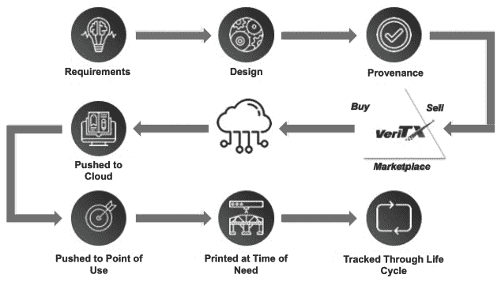

**图 5.6：VeriTX 的区块链端到端解决方案**

来源：James Regenor，经允许

概念验证

Regenor 和他的团队与工业客户和技术提供商合作进行了许多 POC。2018 年 2 月 7 日，Moog 和新加坡科技宇航（STA）宣布完成了在区块链上首个数字端到端制造的 3D 打印航空航天部件的演示。在演示中，STA 使用微软的 Azure 区块链应用程序从 Moog 购买了一个数字部件，并在他们的设施内打印了该部件。当 STA 下载文件时，结算立即完成；支付使用了一个在 Moog 和 STA 之间移动价值的代币。

在另一个 POC 中，Moog、Nuco 和 Moog 最大的一个航空航天客户测试了使用区块链验证零部件来源的传统制造零部件，因为 3D 打印航空零部件的认证途径仍在认证机构的开发中。Regenor 开始探索其他技术来唯一标识传统制造的零部件。Moog 与 Alitheon 公司进行了一次试点项目，Alitheon 公司使用简单的移动电话相机和专有软件，将个体对象的 54,000 个独特表面特征转化为唯一的数字 ID——没有附加标签，对象本身作为其自己的标识符！(参见图 5.7。) Alitheon 的软件可以随时用移动电话扫描物体，如果物体之前记录在区块链上，软件会验证该物体并提供一个匹配置信度分数^。^(41) 对于这个 POC，Moog 向 Alitheon 发送了 20 个金属零件进行扫描，然后 Alitheon 将它们送回 Moog。Moog 在收到它们后进行了扫描，与 Moog 的 ID 进行匹配，然后将它们材料粗暴地摔在混凝土地板上，用便携式电机磨削它们，用喷砂机喷砂零件。Moog 将这些磨损的零件送回 Alitheon，Alitheon 仍然能够识别出独特的零件，即使原始零件上只剩下 3,700 个独特表面特征。^(42)

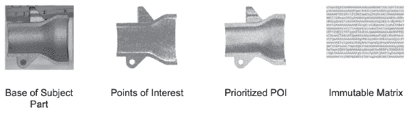

**图 5.7：为金属零件的 54,000 个独特表面区域创建唯一 ID**

*来源：[`www.moog.com/news/blog-new/VeriPart-linking-digital-to-physical.html`](https://www.moog.com/news/blog-new/VeriPart-linking-digital-to-physical.html)*

2019 年，Regenor 和他的团队进行了一次备受关注的现场试验，为从新西兰奥克兰起飞的一架 incoming 飞机的商务舱座椅零件制作了一个 3D 替代品。波音 777-300 飞机从新西兰奥克兰出发，在飞行过程中，它向奥克兰的新西兰航空维护设施报告了零件损坏。尽管这个零件不是关键的，但它会使座椅变得无法销售。维护设施从其供应商、新加坡的 ST Engineering (STE) 订购了数字零件。STE 将订单推给 Moog，在洛杉矶打印零件。使用移动打印机，Regenor 打印了该零件，并在波音 777-300 降落在洛杉矶后 30 分钟内由维护人员更换。^(43) Regenor 解释说：

*“我们证明了我们可以将 43 天的领先时间缩短到一个小时。数字物流从根本上改变了供应链。”*^(44)

2019 年，Moog 与国家制造科学中心；微软；海军陆战队制造厂；AMRDEC；舰队准备中心；海军水下作战中心；以及廷克空军基地完成了一个大型的 POC。每个场所打印了两个零件，一个由聚合物制成，一个由金属制成。POC 证实了：

“它能够确保数字资产不被操纵，来源是有效的，只生产了允许的数量，并且知识产权所有权得到了保护”。*^(45)

除了 POCs，雷根 or 和他的团队还在寻求对新发明进行知识产权保护；与竞争对手和贸易伙伴定义标准；与政府立法者和监管机构定义军事采购 3D 零件的法规；以及制定一个可行的商业模式来产生收入和吸引采用的市场策略。再次，这里有一个例子，说明为什么企业需要比预期更长的时间才能将区块链应用从创新实验室投入到实际生产中。技术障碍是可以克服的……生态系统障碍更像是一个障碍赛。让我们来看看雷根 or 和他的团队在各个前线都在做什么。

从事标准和数字数据工作

雷根 or 和他的团队开始与一个非营利组织合作，该组织进行研究并管理几个美国的国家级实验室，以及其他合作伙伴在航空航天行业的增材制造行业联盟。雷根 or 说：

“当他们开始制定飞机的标准时，这些标准是基于木材、胶水和布料的。从那时起，他们帮助制定了金属锻造和铸造、塑料、复合材料以及其他一切的标准。”*^(46)

该联盟正在建立一个关于 3D 打印材料通用特性的数字图书馆。这一步是必要的，这样制造商就可以从“点批准”转向“设计允许”。雷根 or 解释说：

“目前，当你制造一个部件时，你必须将其送到军队或联邦航空局（FAA）寻求批准，批准一个特定机型上特定图案制造的特定部件。这非常狭窄。借助增材制造，我们需要为一系列机型上的一组图案获得一个家族零件的批准。为了实现这一点，你必须创建数据，所以我们一直在做这件事。”*^(47)

雷根 or 预见到数据将成为一个开放数字目录的一部分。尽管一些竞争对手正在建立专有数据目录，这些目录必须建立在专有机器上，但雷根 or 认为，真正的客户价值来自于开放架构。雷根 or 还在与美国标准协会（ASA）合作，制定 3D 打印零件的标准，称为“美国制造和 ANSI 增材制造标准化合作小组（AMSC）”。*^(48) AMSC 在 2018 年 6 月发布了增材制造的 2.0 版路线图。*^(49)

与立法者和监管机构合作

为了使这一愿景成为现实，雷根 or 和他的团队需要美国政府为五角大楼（DoD）的采购制定 3D 打印法规。雷根 or 描述了他第一次尝试更新法规的方式：

“在联邦采购法规中有关电子零件的规定，要求必须有原始来源证明。因此，我拿起我的笔，把所有出现‘电子’字眼的地方都改成了‘增材制造’。我回到我们的游说者那里，跟他说，‘嘿，让我们把这个提交给委员会。让我们将这个添加到联邦采购法规中去。’所以，我们决定利用联邦法规来创造市场空间。”*^(50)

接下来，雷根 or 向美国众议院军事服务委员会汇报了关于增材制造零件造假的风险。雷根 or 解释道：

“随着 3D 打印技术的发展，你得担心复杂零件会被造假。任何人都可以打印出看起来和他们手里拿着的零件一样的物品。这种仿制品可能不具备相同的材料属性或特征，但货架上的那个家伙是不会看出区别的。”*^(51)

立法者理解了这一关切；2018 年的《国防授权法》为增材制造技术发展提供了资金，并要求机构就区块链技术提供简报。^(52)

努力保护知识产权

在莫格公司工作时，雷根 or 有几位内部和外部律师在努力保护公司的知识产权。VeriPart**’**s 的第一个注册商标延期申请于 2018 年 1 月 15 日获得批准^。^(53)莫格公司还提交了多项专利申请。名为‘安全可追溯的制造零件’的专利描述了 3D 零件的来源，从最初的要求到整个产品生命周期，都使用区块链技术。^(54)该专利描述了三种完整性：数据完整性、过程完整性和性能完整性。2017 年 12 月，莫格公司将专利扩展到太空领域。^(55)雷根 or 解释道：

“如果你在空间站、太空工厂、宇宙飞船或太空殖民地，你会需要 3D 打印的零件。”*^(56)

莫格公司还申请了一项与平台神经网络部分相关的专利。

从事商业模式研究

最初，雷根 or 有一个非常简单的策略：如何在由区块链支持的生态系统中为客户创造价值？为了吸引客户使用这个平台，雷根 or 预见到了苹果公司在推出 iTunes 时所采取的策略。苹果公司最初提供了一份音乐种子目录以吸引客户，然后每周更新目录以吸引客户回归。同样，雷根 or 计划为 3D 打印材料的通用属性建立一个数字目录。这个目录将使客户能够从“点批准”转向“设计允许”。客户最初会访问平台以获取数字目录，但随着生态系统的成长，其他方将能够在平台之上提供更多服务。

最初，商业计划包括与至少五个平等伙伴（其中 Moog 将是其中之一）创建一个合资企业，以管理平台，另一个联盟将管理每个行业垂直领域。Regenor 计划首先为航空航天行业建立平台，然后扩展到汽车、医疗和其他使用 3D 打印部件的行业。

在传统业务内尝试启动新业务被证明是一个缓慢的过程。最终，Regenor 在 2018 年 5 月决定离开 Moog，以加速从 POCs 到实际生产的转变。他还说：

“为了成功，我们需要 VeriTX 成为一个中立的第三方平台。”

Regenor 在 Moog 担任顾问的同时启动了 VeriTX。虽然 Regenor 和其他 Moog 员工一起在专利上签字，但 Moog 拥有这些专利，所以 VeriTX 从 Moog 那里获得了这些专利的许可。2019 年底，Moog 成为 VeriTX 的策略合作伙伴。

前进

Regenor，在 Moog 工作期间，然后通过启动 VeriTX，在实现构建一个使增材和传统制造能够提供部件来源的区块链平台愿景方面取得了很大进展。技术已经准备好了；POCs 已经证明了技术和商业可行性；VeriTX 已经有了战略合作伙伴（见图 5.8）；它有一个数字目录。最后一块是最后一轮投资。Regenor 预计 2020 年启动：

人们常说互联网用了 10 年，所以区块链也会用 10 年。但是区块链是建立在互联网之上的，因此我们将利用互联网协议，并将这些融入区块链，这样我们就可以实现指数加速而不是线性加速。

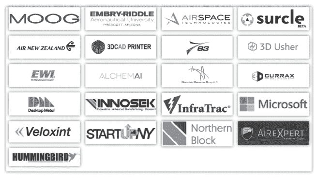

**图 5.8：2020 年 VeriTX 的战略合作伙伴**

来源：[`www.veritx.co/`](https://www.veritx.co/)

5.5. 结论

IBM Food Trust；TradeLens；MediLedger；EY WineChain；OpenSC；VeChain；Provenance；Everledger；Tracr；[Bitcarat.com](http://Bitcarat.com)；Clara；和 VeriTX 展示了生态系统平台如何帮助改善供应链。他们提高了供应链的可见性，验证产品，消除贸易中的摩擦点，降低行政成本，减少在文件工作上浪费的时间。对于那些对供应链中区块链有更深入研究兴趣的人来说，Remko Van Hoek，Brian Fugate，Marat Davletshin 和 Matthew Waller 合著的《将区块链整合到供应链管理中》一书是推荐的。^(57)

在下一章，我们探讨区块链解决方案在能源领域的应用。

引用：

^(1) Van Hoek, R., Fugate, B., Davletshin, M., 和 Waller, M. (2019). *Integrating Blockchain into Supply Chain Management*, Kogan Page, London.

^(2) [`blockgeeks.com/guides/what-is-blockchain-technology/`](https://blockgeeks.com/guides/what-is-blockchain-technology/)

[ReportBuyer 新闻稿](https://www.prnewswire.com/news-releases/the-global-food-and-grocery-retail-market-size-is-expected-to-reach-usd-12-24-trillion-by-2020--300702659.html)（2018 年 8 月 27 日），*到 2020 年，全球食品和杂货零售市场规模预计将达到 12.24 万亿美元*

[世界卫生组织（2020 年）。食品安全](https://www.who.int/news-room/fact-sheets/detail/food-safety)

[斯平克等人](https://www.nature.com/articles/s41538-019-0044-x)（2019 年），*全球食品欺诈 perspective: results from a WHO survey of members of the International Food Safety Authorities Network (INFOSAN)*

[格罗斯曼](https://civileats.com/2016/10/25/did-slaves-produce-your-food-forced-labor/)（2016 年 10 月 25 日），*你的食物是由奴隶生产的吗？*

[Statista（2020 年）。1992 年至 2018 年美国的零售和餐饮服务销售额](https://www.statista.com/statistics/197569/annual-retail-and-food-services-sales/)

[疾病控制与预防中心（2020 年），食物传播疾病的负担：发现](https://www.cdc.gov/foodborneburden/2011-foodborne-estimates.html)

[食物浪费：拯救美国美食](https://www.rescuingleftovercuisine.org/challenge?gclid=Cj-0KCQiA4NTxBRDxARIsAHyp6gBqhPgXvYsvwoDJHRewOeXi5nv1sK8f1oMw5BP0AtNnseRDNRYkvqgaAgu5EALw_wcB)

[Yiannas，F](https://www.linkedin.com/posts/frank-yiannas-3b106015_fda-activity-6627357552072015872--eaC)（2020 年 1 月 26 日），*FDA 的 Frank Yiannas 谈论食品安全*

[Statista（2020 年）。中国的食品](https://www.statista.com/outlook/40000000/117/food/china)

[黄艳](https://www.forbes.com/sites/yanzhong-huang/2014/07/16/the-2008-milk-scandal-revisited/#1d10db394105)（2014 年 7 月 16 日），*2008 年牛奶丑闻重述*

^(13) Crouch，E.（2013 年 3 月 26 日），“浙江非法猪肉经销商与上海生猪清洗有关”。Shanghaiist.* `shanghaiist.com/2

^([14`) 左，M.（2020 年 1 月 10 日），“中国城市在顾客被欺骗购买柴油污染鱼后加强打击”，*南华早报*， [`www.scmp.com/news/china/society/article/3045601/chinese-city-clamps-down-after-customer-tricked-buying-fish`](https://www.scmp.com/news/china/society/article/3045601/chinese-city-clamps-down-after-customer-tricked-buying-fish)

^(15) 中国食品安全。 [`en.wikipedia.org/wiki/Food_safety_in_China#Food_safety_incidents`](https://en.wikipedia.org/wiki/Food_safety_in_China#Food_safety_incidents)

^(16) 卡马特，R.（2018），“区块链上的食品追溯：沃尔玛与 IBM 合作的猪肉和芒果试点项目”，*英国区块链协会期刊*，1（1），1-12。

^(17) [`www.ibm.com/blockchain/solutions/food-trust`](https://www.ibm.com/blockchain/solutions/food-trust)

^(18) *信任锚的主要职责是什么？* [`www.ibm.com/blockchain/solutions/food-trust/food-industry-technology#1797811`](https://www.ibm.com/blockchain/solutions/food-trust/food-industry-technology#1797811)

^(19) IBM 新闻稿（2018 年 10 月 23 日），*IBM 和微软宣布云服务之间的合作伙伴关系*， [`www.pbsnow.com/ibm-news/ibm-and-microsoft-announce-partnership-between-cloud-offerings/`](https://www.pbsnow.com/ibm-news/ibm-and-microsoft-announce-partnership-between-cloud-offerings/)

^(20) 与 IBM 区块链解决方案副总裁拉姆什·戈皮纳思的电子邮件交流，2020 年 3 月 31 日

^(21) 与 IBM 区块链解决方案副总裁拉姆什·戈皮纳思的电子邮件交流，2020 年 3 月 31 日

^(22) [`opensc.org/case-studies.html`](https://opensc.org/case-studies.html)

^(23) 草根农民合作社（2019 年 2 月 10 日），*从牧场到餐桌——追踪你的食品之旅*。 [`www.grassrootscoop.com/blog/from-pasture-to-plate-trace-the-journey-of-your-food/`](https://www.grassrootscoop.com/blog/from-pasture-to-plate-trace-the-journey-of-your-food/)

Bloch，S.，和法斯勒，J.（2018 年 11 月 23 日），*为什么汽车“基于区块链”的火鸡比它们揭示的更多*，The Counter， [`thecounter.org/cargill-blockchain-traceable-turkey-contract-farming-reality-thanksgiving/`](https://thecounter.org/cargill-blockchain-traceable-turkey-contract-farming-reality-thanksgiving/)

^(24) O’Neil，S.（2019 年 7 月 7 日），“食品行业的区块链技术应用”。

*CoinTelegraph*, [链接](https://cointelegraph.com/news/blockchain-for-the-food-how-industry-makes-use-of-the-technology)

^(25) VeChain 白皮书 [链接](https://www.vechain.org/whitepaper/)

^(26) Palmer, D. (2019 年 6 月 25 日), *沃尔玛中国团队与 VeChain、PwC 合作推出区块链食品安全平台*, Coindesk, [链接](https://www.coindesk.com/walmart-china-teams-with-vechain-on-blockchain-food-safety-platform)

Mitra, R. (2019 年 8 月 28 日), *VeChain 与沃尔玛、比亚迪、DNG VL 和宝马合作。FXStreet*, [链接](https://www.fxstreet.com/cryptocurrencies/news/vechain-partners-with-walmart-byd-dng-vl-and-bmw-201908280048)

消费者视角：[沃尔玛追踪链接](https://traceability.walmartmobile.cn/walmart/p/10000919067888862973)

^(27) [链接](https://en.wikipedia.org/wiki/Kimberley_Process_Certification_Scheme)

^(28) Everledger 首席执行官在 IBM Interconnect 上的演讲：[链接](https://ibmgo.com/interconnect2017/?cm_mc_uid=19734726856314943335282&cm_mc_sid_50200000=1494367094&cm_mc_sid_52640000=1494367094)（视频中大约一个小时十五分钟）

^(29) [链接](https://www.everledger.io/industry-solutions/)

^(30) [链接](https://bitcarat.com/)

^(31) O’Neal, S. (2019 年 2 月 6 日), ‘钻石是区块链最好的朋友’，*CoinTelegraph*, [链接](https://cointelegraph.com/news/diamonds-are-blockchains-best-friend-how-dlt-helps-tracking-gems-and-prevents-fraud)

^(32) [链接](https://www.lucaradiamond.com/clara/)

^(33) Regenor, J. (2017 年 4 月 18 日), *行业影响：航空航天供应链*, 在麻省理工学院举办的区块链商业会议上的演讲，剑桥马萨诸塞州

^(34) Moog 2016 年度报告，[链接](http://www.moog.com/content/dam/moog/literature/Corporate/Investors/Annual_Report/2016/2016-Annual-Report.pdf)

^(35) Small, G., *增材制造正在重塑物流*, [链接](http://www.moog.com/news/blog-new/IntroducingVeripart_Issue3.html)

^(36) Small, G., *Additive Manufacturing Reshaping Logistics*, [`www.moog.com/news/blog-new/IntroducingVeripart_Issue3.html`](http://www.moog.com/news/blog-new/IntroducingVeripart_Issue3.html)

^(37) Regenor, J. (April 18^(th) 2017), *Industry Impact: Aerospace Supply Chain*, presentation at the Blockchain for Business Conference at MIT, Cambridge Massachusetts

^(38) Regenor, J., op. cit., April 18, 2017.

^(39) *Moog 宣布与 Aion 合作*, Aion Foundation, October 5, 2017, available at [`blog.aion.network/moogaionpartnership-6d37ce15b2fd`](https://blog.aion.network/moogaionpartnership-6d37ce15b2fd).

^(40) Galang, J. *Nuco raises $27 million to build interoperable blockchain network,* BetaKit, October 10, 2017, available at [`betakit.com/nuco-raises-27-million-to-build-interoperable-blockchain-network/`](https://betakit.com/nuco-raises-27-million-to-build-interoperable-blockchain-network/).

^(41) Alitheon 网站。 [`www.alitheon.com`](https://www.alitheon.com)

^(42) Moog Press Release (2019), *VeriPart™ – Linking Digital to Physical*, [`www.moog.com/news/blog-new/VeriPart-linking-digital-to-physical.html`](https://www.moog.com/news/blog-new/VeriPart-linking-digital-to-physical.html).

^(43) Davies, S. (July 17, 2019), ‘Moog’s connecting flight to distributed manufacturing’, *TCT Magazine*, [`www.tctmagazine.com/3d-printing-news/moogs-connecting-flight-to-distributed-manufacturing/`](https://www.tctmagazine.com/3d-printing-news/moogs-connecting-flight-to-distributed-manufacturing/)

^(44) James Regenor, presentation to the Blockchain Center of Excellence, December 3, 2019.

^(45) 国家制造科学中心新闻稿（2019 年 3 月 27 日）， *项目成功：区块链巨大成功的故事与五个演示*, [`www.ncms.org/project-success-blockchain-huge-success-story-with-five-demonstrations/`](https://www.ncms.org/project-success-blockchain-huge-success-story-with-five-demonstrations/)

^(46) 与 Mary Lacity 的个人访谈。

^(47) 与 Mary Lacity 的个人访谈。

[美国制造及 ANSI 增材制造标准化合作组织（AMSC）](https://www.ansi.org/standards_activities/standards_boards_panels/amsc/)

^(49) *增材制造标准化路线图* `www.ansi.org/news_publications/news_story?menuid=7&articleid

^([50`) Regenor, J. (April 18^(th) 2017), *Industry Impact: Aerospace Supply Chain*, presentation at the Blockchain for Business Conference at MIT, Cambridge Massachusetts

^(51) 与 Mary Lacity 的个人访谈

^(52) *2018 年国防授权法案*，[`www.congress.gov/bill/115th-congress/house-bill/2810/text`](https://www.congress.gov/bill/115th-congress/house-bill/2810/text) - toc-HBA0AA81CFC4F410E95EF87129909DC2A

^(53) [`www.battelle.org/homepage`](https://www.battelle.org/homepage)

^(54) *制造零件的安全和可追溯专利，专利号 20180012311*，[`patents.justia.com/patent/20180012311`](https://patents.justia.com/patent/20180012311)

^(55) *外太空数字物流系统专利。专利号 20180136633*，[`patents.justia.com/patent/20180136633`](https://patents.justia.com/patent/20180136633)

^(56) 与玛丽·拉 acity 的个人访谈。

^(57) Van Hoek, R., Fugate, B., Davletshin, M., and Waller, M. (2019), *将区块链整合到供应链管理中*, 科根页出版社，伦敦。

## 第六章

## 能源行业的商业应用

*“尽管区块链在金融服务领域似乎产生了最多的噪音，但能源行业的网络化基础设施使其特别适合区块链技术应用。此外，随着物联网的兴起，整个能源行业可能很快就会发现其运营被转化为一个庞大的全球联网设备网络——所有这些都向区块链平台输入数字数据，能够实时捕捉和分享信息。”*

**德勤，*区块链：能源行业的真正颠覆者*。*^(1)

*“我每天都能‘思考’并处理从数字化电网，以便它们能够适应可再生能源并促进电动汽车的大规模采用，帮助大城市减少拥堵和污染，到开发新的微型金融计划，帮助诸如巴西、印度、非洲等市场的微小企业起步。”*

**IBM 首席执行官** **吉尼·罗梅蒂**。^(2)

6.1.案例概述

全球能源行业，包括石油和天然气、电力公用事业和可再生能源，每年产生约 90 万亿美元。^(3) 虽然能源实际上为我们的生活提供动力，但这个行业加剧了我们的自然资源压力。能源问题本质上是全球问题，需要跨国公司和国界合作伙伴之间的合作。区块链技术非常适合于能源的生成、分配和消费的变革。世界经济论坛与普华永道和斯坦福大学环境 Woods 研究所合作，报告称正在开发基于区块链的解决方案来解决：气候变化；生物多样性和保护；健康海洋；水资源安全；清洁空气；以及天气和灾害韧性。^(4) 到 2018 年，有超过 60 个区块链用例正在探索中。^(5)

在本章中，我们重点关注电能的区块链解决方案。世界各地，大型电力公司是电力的主要供应商。这些大型、集中管理的组织已经用同样的商业模式运营了 100 年或更长时间，它们明显能源效率低下。据劳伦斯利弗莫尔国家实验室称，美国实际可用的电能（称为“可用能”，即“exergy”）仅占发电量的 32%。（6）这意味着大多数由公用事业公司产生的电能都在转换、运输和消费过程中被浪费了。（7）

消费者越来越关注电力的浪费、高昂的成本和对电力供应缺乏控制。因此，许多家庭在自己的地产上安装了太阳能电池板。从 2015 年到 2016 年，美国的太阳能发电量翻了一番，到 2019 年，超过 200 万户美国家庭和商业地产安装了太阳能发电系统。^(8)^,^(9)

除了电费降低之外，消费者采用太阳能电池板还受到许多其他因素的推动；消费者希望实现能源独立、提高房产价值和减少碳足迹。关于最后一个观点，Energysage——一家帮助消费者寻找太阳能解决方案的公司——声称：

*“一个典型的居民太阳能电池板系统每年可以消除三到四吨的碳排放——相当于每年种植超过 100 棵树。”^(10)*

然而，拥有太阳能电池板的美国消费者仍然与主要的电力公用事业提供商相连，并依赖他们。家庭太阳能电池板产生的任何过剩产能都会直接送回传统的电力电网，电力公司会在消费者的账单上给予积分；所谓的“产消者”家庭产生的多余能源没有除了电力公司之外的市场可以出售多余的产能。直到现在，LO3 能源的创始人兼首席执行官劳伦斯·奥尔西尼，旨在创造一种让邻居之间可以直接相互购买和销售过剩电力的方式。他的公司与其他合作伙伴一起，建立了一个技术平台，为共享经济创造点对点市场（参见表 6.1）。

根据 EY 的一份报告，全球有 350 万个电动汽车充电站，其中不到 50 万个对公众开放，其中大部分在中国。^(11)EY 与其他几家公司正在使用区块链技术为充电站所有者和电动汽车司机创造市场。在这里，我们重点关注一家位于德国的公司，名为**Share&Charge**。它为电动汽车充电站和电动汽车所有者建立了一个开放网络平台（参见表 6.1）。

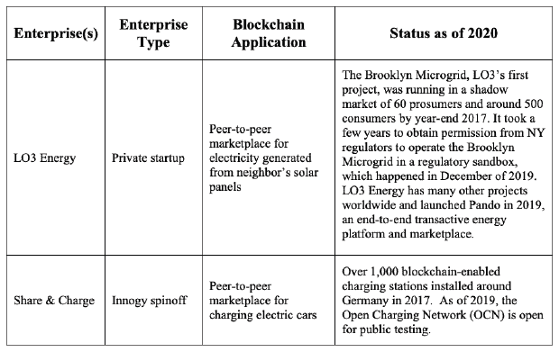

**表 6.1：能源区块链应用示例**

6.2. LO3 能源

“有了微网，就不需要电力公司作为中介，居民可以掌控自己的电力。”

**LO3 能源新闻报道**

“我们实际上是在提供选择。给社区更多的选择，更多的能源购买选择，他们可以从中购买，谁可以购买，以及他们可以用在能源上的钱做些什么。”

**劳伦斯·奥尔西尼，LO3 能源创始人兼首席执行官**

“未来的电网运行在数据上。”

**唐·塔普斯科特，区块链研究所创始人**

劳伦斯·奥尔西尼在成立 LO3 能源之前，曾在能源领域工作多年，这家公司成立于 2012 年，位于纽约布鲁克林。他曾在俄勒冈州波特兰市的一个非营利组织 PECI 工作，帮助公用事业、政府和其它客户提高能源效率。他还曾担任 CLEAResults 的董事，这是一家位于德克萨斯州奥斯汀的公司，帮助公用事业、企业和消费者提高能源效率。这家公司让他来到了纽约市。

奥尔西尼设想了一个可持续、本地化、可靠、高效且自我管理的能源生产和消费的未来。他想要建立一个平台，让光伏发电设备的过剩能源可以直接通过移动应用程序卖给邻居。他在飓风桑迪过后，这个想法变得更加相关。2012 年 10 月，飓风桑迪袭击了纽约市，是有记录以来最大的飓风，直径高达 1100 英里。随着飓风桑迪导致纽约市的街道被淹，超过 80 万户居民和企业停电，持续数日。即使拥有太阳能电池板的居民也无法使用自己的电力，因为连接到公用电网的太阳能电池板（PV）被关闭了。飓风桑迪的痛苦和后果唤醒了消费者，使他们接受 LO3 能源公司的价值观。

奥尔西尼经历了许多成功。到 2019 年，LO3 能源在两轮融资中筹集了超过 580 万美元。英国 Centrica、Braemar Energy Ventures、西门子、日本丸红株式会社以及壳牌风险投资公司是投资者。LO3 能源获得了许多奖项，如 2018 年彭博新能源金融（BNEF）先锋奖和 2019 年全球企业风险投资数字能源年度投资奖。2019 年，LO3 能源被 CNN、福布斯、路透社等众多媒体机构报道。然而，广泛商业化还需要更多监管机构和现有公用事业的接受和推动，而这进展缓慢。首先，我们来看一下 LO3 的技术，然后探讨其首个大型试点项目，即布鲁克林微网。

6.2.1 生态能——一个交易性能源平台

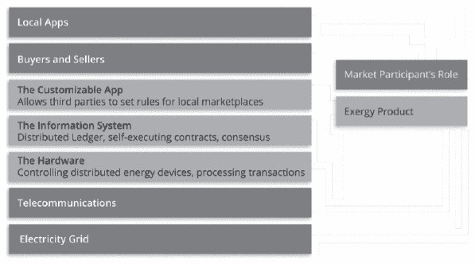

**图 6.1：Exergy 的交易性能源堆栈**

*来源：LO3 能源（2018）Exergy 业务白皮书*

为了实现奥尔西尼的愿景，LO3 能源与合作伙伴共同开发了硬件和软件，创建了一个所谓的“交易性能源平台”，他们将其品牌化为“Exergy”（参见图 6.1）。该平台包括智能电表、开关和控制器等硬件。软件基于一个专有的基于区块链的应用程序，具有可定制的移动用户界面。

物联网智能电表安装在生产者 properties 上，以测量电力的生产和消费（参见图 6.2 中的示例硬件）。硬件每秒向基于区块链的应用程序发送数据。只有生产者需要安装专用硬件；消费者通过移动或桌面应用程序与平台互动。LO3 正在与西门子合作，建设一个物理电网，该电网将脱离主公用事业电网，以便在需要时将本地产生的电力重新路由到关键位置。^(21)最重要的是，Exergy 的硬件是“设备不可知”的，因此其他供应商可以操作符合 Exergy 标准的硬件。^(22)

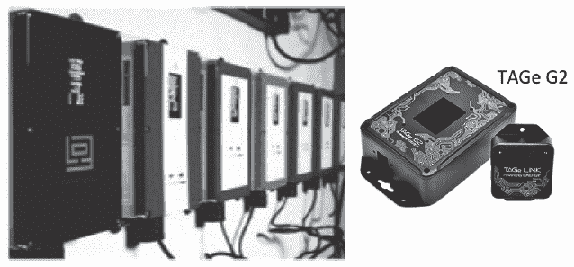

**图 6.2：LO3 硬件示例**

*来源：左图 - [`www.power-technology.com/wp-content/uploads/sites/7/2017/09/Transactive-Gridelement.jpg`](https://www.power-technology.com/wp-content/uploads/sites/7/2017/09/Transactive-Gridelement.jpg)。右图 - [`manda-borealis.com/work/`](http://manda-borealis.com/work/)*

LO3 在 2017 年通过私人销售推出了一种数字化能效币，面向认证的私人投资者。将来，Exergy 将推出一种公开的数字货币，并由 Exergy 基金会进行管理，这是一个 501(c)3 非营利组织。这种货币是用来捕获电网当前状态、生产的时间和地点以及多方消费需求的数据。奥尔西尼解释道：

“这不是 ICO，这是一场代币活动。代币实际上是网络的许可，所以没有代币，你就不能将数据纳入网络。没有网络中的数据，你对网络就没有价值，所以你参与网络就没有意义”。*（第 23 条 23）*

Exergy 的数字账本记录了智能电表收集的关于电网状态、生产的时间和地点、消费需求以及市场参与者的买入和卖出报价的信息。奥尔西尼如下解释了区块链平台适用性：

“这种架构非常符合我们的去中心化基础设施。因此，账本需要位于电网中；它需要在电网中进行分布式管理。如果你要运行一个物理微网，或者甚至是一个虚拟微网，并且你正在实施弹性计划，那么你不能使用云托管——因为当电网瘫痪时，你就没有通信手段。”*（第 24 条 24）*

消费者应用程序将邻居连接到区块链，以实现点对点交易；邻居使用该应用程序放置和执行购买和销售订单。本质上，产消者是将他们的过剩容量信用出售给邻居，而不是卖给公共事业公司。该消费者应用程序是一个空白标签产品，其他公司可以重新品牌。随着 LO3 继续构建和改进平台，它在全球范围内进行现场测试。在这里，我们重点介绍其第一个项目，称为布鲁克林微网项目。

6.2.2. 布鲁克林微网项目

“下次超级风暴来袭并摧毁所有电力时，布鲁克林微网将确保在关键地区保持电力供应，这样你就有安全的地方给手机充电、获取食物或发送电子邮件让人们知道你没事。”

**布鲁克林微网介绍中的邻居特写**^(25)

2016 年，LO3 在纽约布鲁克林总统街的一个住宅区测试了微网概念（见图 6.3）。它选择这条街进行概念验证（POC），因为它的一侧有大量采用太阳能的邻居，另一侧有大量对绿色能源感兴趣的邻居。奥尔西尼说：

“这是显而易见的选择。这些邻居彼此相隔一条街，他们关系良好。”*^(26)

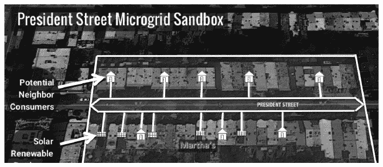

**图 6.3：纽约布鲁克林总统街概念验证测试地点**

来源：微网媒体*^(27)

概念验证证明智能电表可以成功计算来自太阳能电池板的电子，可以在最初基于以太坊构建的原型区块链上记录数据，并可以让产消者和消费者访问数据。*(28)* 这次测试还证明消费者愿意为邻居生产的电力支付更多费用。奥尔西尼解释说：

“我们正在做的是启用消费者选择。许多消费者不想要便宜的，他们想要自己的。就像许多消费者愿意为本地生产的食品支付更多一样，许多消费者也愿意为本地生产的电子支付更多——而我们让他们做到这一点。如果他们寻找便宜的，那么他们也可以访问便宜的。我们的模式与提供选择有很大关系。”*^(29)

概念验证成功后，LO3 准备寻找一个地点，以扩大布鲁克林微网项目，进行全面规模的现场测试，测试商业模式和平台。寻找的地点将跨越社会各阶层测试商业模式。经过六个月的寻找，LO3 决定在布鲁克林的 gowanus 和 Park Slope 社区（见图 6.4）。

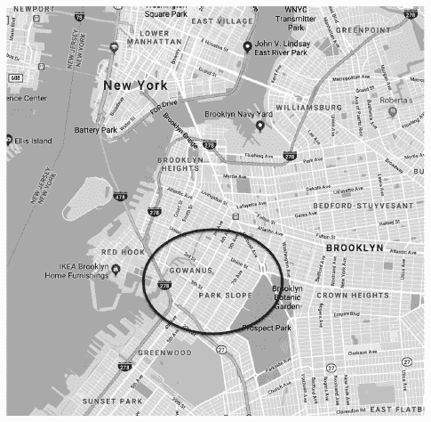

**图 6.4：纽约布鲁克林区 gowanus 和 Park Slope 邻里**

**来源：谷歌地图***（31）*

奥尔西尼解释说：

“这个社区是做这件事的合适地方。所以，从社会阶层的角度来看，我们在这里有纽约最贫穷的人，一直到现在城市中最昂贵的房产，就在公园旁边。纽约市市长白思豪（纽约市市长）和查克·舒默（纽约州参议员）住在 Park Slope。从商业角度来看，这个阶层涵盖了制造业、轻工业和当地零售业，一直发展到最高端的零售业务。所以，这就是我们选择这个位置的原因。”*（30）*

截至 2017 年 12 月，LO3 在邻里安装了 60 个智能电表，并有 500 名消费者下载了移动应用程序（见图 6.5）。

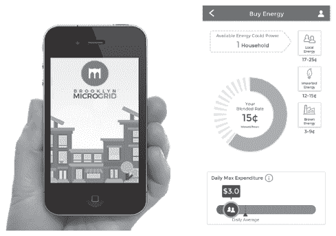

**图 6.5：布鲁克林微网项目的移动应用程序界面示例。消费者可以设定每日最高费用，并从邻居、清洁能源或棕色能源来源购买能源。**

来源：左图：[`www.sacramento.energy/video-gallery`](https://www.sacramento.energy/video-gallery) 右图：作者于 2018 年 2 月 24 日的移动应用程序屏幕截图*

电网在满足所有监管要求之前，在一个灰色市场上运营。自成立以来，LO3 能源一直与纽约的监管机构和政策制定者密切合作。LO3 还与美国联邦能源监管委员会会面。2017 年，奥尔西尼说：

我们与监管机构的关系非常好。纽约的监管机构对我们所做的工作非常兴奋并积极参与，特别是对于交易能源平台。*（32）*

尽管奥尔西尼持乐观态度，但纽约的公用事业法规却是一个顽固的障碍。为了取得动力，布鲁克林微网的执行董事阿德里安·史密斯在 2019 年发起了[Change.org](http://Change.org)上的运动，授权布鲁克林微网作为商业实体运营。*（33）*史密斯说：

理查德·科莫（纽约州州长）只需对我们就“纽约”运动请求说“是”，我们就可以启动网络并开始运营。*（34）*

2019 年 12 月 30 日，布鲁克林微网获准进行为期一年的监管沙盒试点计划。*（35）*

随着社区在美国其他司法管辖区以及其他国家采用 Exergy 平台，将需要重复相同的监管许可过程。奥尔西尼已经与澳大利亚和欧洲的监管机构会面，但作为一个业务模式，LO3 领导后续采用的努力是不可行的。^(36) 因此，在 Brooklyn Microgrid 项目之后，LO3 Energy 将直接向其他有兴趣采用的社区或机构出售其交易性能源平台 Exergy，但它将不拥有这些项目。当地采用者处于最佳位置，可以组织邻居，教育用户并获得当地监管许可。还有几个其他基于社区的项目正在进行中，包括在加利福尼亚州萨克拉门托、佛蒙特州、南澳大利亚州、德国、日本和整个欧洲的项目。^(42) 奥尔西尼说，有数百个感兴趣的社区已经联系 LO3 询问参与事宜。^(43)

最初，LO3 Energy 的业务模式旨在通过向消费者提供选择，以消除现有公用事业提供商的垄断权力，让他们可以决定在哪里购买和出售电力信用。业务模式演变为欢迎公用事业公司。奥尔西尼在 2019 年说，“LO3 的整个意图是启用消费者选择，这样人们可以用他们的美元决定未来是什么样子，他们从哪里购买能源，能源来自哪里以及如何生产。但这并不会边缘化公用事业——事实上，它们是这个体系中非常重要的一部分。”^(44)* 为此，LO3 Energy 在 2019 年推出了 Pando，这是一个将公用事业提供商带入社区的软件解决方案。Pando 将公用事业和零售商与他们的客户连接起来，反过来，客户又与他们的社区相连（见图 6.6）。

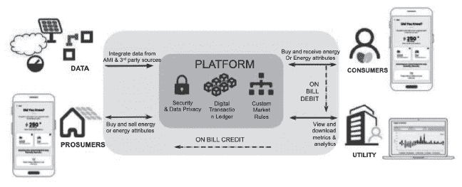

**图 6.6：Pando：将公用事业提供商带入解决方案**

来源：[`i2.wp.com/lo3energy.com/wp-content/uploads/2020/02/Pando1.jpg?w=1280&ssl=1`](https://i2.wp.com/lo3energy.com/wp-content/uploads/2020/02/Pando1.jpg?w=1280&ssl=1)

根据 LO3 Energy 的网站，Pando 为公用事业提供商提供了一个市场，提供：

• **灵活的交易：** Pando 允许公用事业公司配置市场以交易能源或能源属性，并使消费者能够从他们的当地社区获取可再生能源。

• **强大的指标：** Pando 通过客户和贸易分析、交易动态、订阅报价和其他消费者可配置的分析，在一个易于使用的门户网站上分析市场。

• **个人能源管理：** Pando 引导客户踏上一段新的能源之旅，首先在一个品牌化的移动应用程序上提供有价值的能源工具，让他们了解自己的能源概况和参与可再生能源的机会。

• **高度可扩展：**Pando 可以安全地集成到第三方软件（如计费系统和能源设备），以简化客户体验。

• **快速部署：**Pando 可以在 90 天内启动，由一个专家团队负责，与公用事业公司合作，完成从设计协作、测试和上线到持续支持的每个实施阶段。

• **安全且可扩展：**Pando 利用区块链技术确保个人和系统数据的安全性和可扩展性。^(45)

奥尔西尼正朝着实现其可持续、本地化、可靠、高效和自治的能源生产和消费愿景迈进。LO3 能源在其他领域参与者之上，因为奥尔西尼和他的团队知道，他们需要的不仅仅是建立一个伟大的平台——他们需要证明他们可以将平台合法地和社会性地嵌入到一个真实的社区中，他们已经在布鲁克林微网中做到了这一点。为了在全球范围内扩展，他们还需要展示其平台能够吸引其他合作伙伴，特别是主流电力公司，在之上建立新的商业模式。

竞争

其他基于区块链的能源解决方案已经公布，如 Co-Tricity；GridSingularity；Grid；PowerLedger；Daisee；OmegaGrid 等。^(46)其中一些项目仍在继续推进，如 PowerLedger，2020 年在八个国家有 23 个项目。^(47)然而，其他项目已经屈服于奥尔西尼所说的“死亡谷”。他认为，许多初创公司混淆了市场，采用了“区块链优先”的策略，最终失败了。相比之下，LO3 Energy 打算克服“死亡谷”，因为 Exergy 被开发成一个“能源优先”的解决方案。奥尔西尼说：

*“LO3 不是一个进入能源领域的区块链公司。我们是一个专门创建来将区块链带入该行业的能源公司。”*^(48)

下一个案例是关于电动汽车充电业务模式的创新。

6.3 Share&Charge

*“想法是通过整合私人充电站来解决德国公共充电基础设施的缺乏。我们通过应用程序使人们能够分享他们的充电站。”*

**迪特里希·苏默曼，Innogy 创新中心负责人及 Share&Charge 的联合创始人**^(49)

德国电力公司 RWE 的子公司 Innogy 于 2016 年成立，专注于可再生能源解决方案。Innogy 的创新中心旨在与初创公司合作或创建新的能源解决方案，基于“道德机器”将其推向市场。^(50)其一个项目是“Share&Charge”，一个创建电动汽车充电点对点市场的初创企业。Innogy 希望通过使 60,000 个私人充电站加入德国的 6,500 个公共充电站，扩大德国的基础设施。

充电站的运营商和电动汽车驾驶者使用 Share&Charge 钱包（见图 6.7）。充电站的运营商可以设定自己的 flat rate、time-based 或 kilowatt hour-based 费用。费用也可以为家庭、朋友或慈善机构提供折扣。通过移动应用程序，驾驶者可以搜索附近的充电站，在任何授权的站为电动汽车充电，并使用 Share&Charge 的原生数字货币，一种称为“Mobility Token”的 ERC20 代币支付充电费用。^(51)

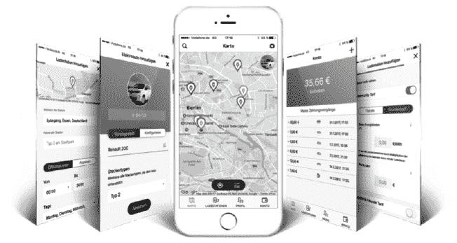

**图 6.7：Share&Charge 移动应用**

来源：[`shareandcharge.com/wp-content/uploads/2018/08/perspective-app-mockup-1200x788.png`](https://shareandcharge.com/wp-content/uploads/2018/08/perspective-app-mockup-1200x788.png)

与合作伙伴 TÜV Rheinland 和 MotionWerk 合作，Share&Charge 在 2017 年在德国安装了超过 1,000 个基于区块链的电动汽车充电站（见图 6.8）。^(52) 最初的应用程序建立在公共以太坊上，使用三个智能合约：MobilityToken^(53)、ChargingPoles^(54) 和 LibManager^(55)。MobilityToken 是持有余额并执行规则的代币合约；每个代币都由真实的欧元支持，并符合德国法规。ChargingPoles 注册了所有充电桩站，并在充电站执行操作，例如启动和停止仪表功能。LibManager 是一个合约库，允许 Share&Charge 更新智能合约或修复编程错误。^(56) 自这个初始应用程序以来，Share&Charge 推出了自己的区块链网络，称为开放充电网络（OCN）。基于以太坊的 Energy Web Chain (EWC) 使用权威证明共识协议。EWC 是开源的。^(57) 截至 2019 年，OCN 对公众测试开放。

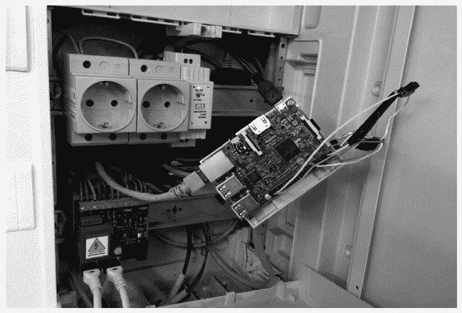

**图 6.8：第一代 Innogy 充电站带有内嵌的以太坊节点**

来源：[`cdn-images-1.medium.com/max/1600/1*aZuXOx0TiiXEry3QoZMDjw.jpeg`](https://cdn-images-1.medium.com/max/1600/1*aZuXOx0TiiXEry3QoZMDjw.jpeg)

至于建立合作伙伴网络，Share&Charge 在六个欧洲国家启动了“Oslo2Rome”试点项目，证明该解决方案可以跨越国界工作。^(58) 到 2018 年，Share&Charge 在法国、芬兰、德国、荷兰、瑞士和英国迎来了合作伙伴。^(59) 2018 年，Share&Charge 还成立了一个非盈利基金会，以帮助进一步开发开放的充电网络。Share&Charge 在 2019 年在丰田车内测试了一个车内钱包。^(60) 这个应用程序根据司机的偏好，如“靠近咖啡店”或“靠近游乐场”，引导司机到充电站，并可以预订充电时间以减少拥堵。^(61) Share&Charge 预计它将把测试转移到 2020 年第三季度的全面生产。

竞争

有许多传统企业和与 Share&Charge 有相似目标的平台，例如 P2P 电动汽车充电；eMotorWorks；Oxygen Initiative；Easy Park；Chargemap；Aerovironment；和 Charg，以及一些具有扩展功能的平台。例如，EY 的 OpsChain Tesseract 平台旨在实现共享车辆所有权，其中充电将是其中之一的功能。该平台可能使限制在拥堵城市中的车辆数量的新颖商业模式成为可能，通过让城市和公民共同拥有和共享车辆来实现。

6.4 结论

LO3 Energy 和 Share&Charge 是能源领域两个强大的“价值互联网”例子。它们各自提供了一个点对点平台，以赋能日常的生产者和消费者共享他们的能源资源。它们的采用过程相似，因为每个都在公共以太坊上启动了一个 POC，扩大了消费者的认知。它们的创始人同时通过跨越国界与合作伙伴联合，与监管机构合作，并建立了一个基于比以太坊的工作量证明更快且可扩展的共识机制的更健壮的平台。在下一章，我们探讨了证书认证的挑战以及一个名为 SmartResume 的应用解决方案。

引用：

^(1) 德勤 (2018)。*区块链：能源行业的真正颠覆者*，[`www2.deloitte.com/content/dam/Deloitte/us/Documents/energy-resources/us-blockchain-disruptor-for-energy-industry.pdf`](https://www2.deloitte.com/content/dam/Deloitte/us/Documents/energy-resources/us-blockchain-disruptor-for-energy-industry.pdf)

^(2) [`www.brainyquote.com/topics/renewable-energy-quotes`](https://www.brainyquote.com/topics/renewable-energy-quotes)

^(3) Investopedia，《全球经济中石油和天然气钻探部门的百分比》？[`www.investopedia.com/ask/answers/030915/what-percentage-global-economy-comprised-oil-gas-drilling-sector.asp`](https://www.investopedia.com/ask/answers/030915/what-percentage-global-economy-comprised-oil-gas-drilling-sector.asp)

[Investopedia，《公用事业部门：行业快照（NEE，GAS）》[链接](https://www.investopedia.com/articles/investing/031116/utilities-sector-industries-snapshot-nee-gas.asp) ](https://www.investopedia.com/articles/investing/031116/utilities-sector-industries-snapshot-nee-gas.asp)

[Allied Market Research，《2025 年可再生能源市场展望》[链接](https://www.alliedmarketresearch.com/renewable-energy-market) ](https://www.alliedmarketresearch.com/renewable-energy-market)

[世界经济论坛（2018 年），《构建更美好星球的区块链》（[链接](http://www3.weforum.org/docs/WEF_Building-Blockchains.pdf)）](http://www3.weforum.org/docs/WEF_Building-Blockchains.pdf)

[世界经济论坛（2018 年），《构建更美好星球的区块链》（[链接](http://www3.weforum.org/docs/WEF_Building-Blockchains.pdf)）](http://www3.weforum.org/docs/WEF_Building-Blockchains.pdf)

[斯塔克，A.（2015 年），《美国能源使用略有上升，碳排放几乎不变》，[链接](https://www

[能源转换废物发生在天然气、煤炭、核能、水能、地热和风能转换为电能时。运输废物发生在长距离输送电能时。大约有 5%的电能在线路上损失。消费废物发生在消费者电器将电能转化为热量时，例如。来源：Lempriere，M（2017 年 4 月 11 日），《布鲁克林微网：区块链赋能社区电力》，[链接](http://www.power-technology.com/features/featurethe-brooklyn-microgrid-blockchain-enabled-community-power-5783564/)](http://www.power-technology.com/features/featurethe-brooklyn-microgrid-blockchain-enabled-community-power-5783564/)

[费里斯，R.（2017 年 2 月 15 日），《2016 年美国太阳能安装几乎翻倍，并打破了一些记录》，CNBC，《[链接](https://www.cnbc.com/2017/02/14/us-solar-installations-nearly-doubled-in-2016-and-broke-some-records.html)》（[#note_8](https://www.cnbc.com/2017/02/14/us-solar-installations-nearly-doubled-in-2016-and-broke-some-records.html)）](https://www.cnbc.com/2017/02/14/us-solar-installations-nearly-doubled-in-2016-and-broke-some-records.html)

[太阳能工业协会新闻稿（2019 年 5 月 9 日），《美国太阳能安装超过 200 万次》[链接](https://www.seia.org/news/united-states-surpasses-2-million-solar-installations) ](https://www.seia.org/news/united-states-surpasses-2-million-solar-installations)

[Energysage（2017 年），《为什么要太阳能——太阳能的十大好处》[链接](https://www.energysage.com/solar/why-go-solar/) ](https://www.energysage.com/solar/why-go-solar/)

[安永（2019 年 5 月 10 日），《如何领导众筹电动汽车基础设施的充电》([链接](https://www.ey.com/en_kr/automotive-transportation/how-to-lead-the-charge-on-crowdfunded-ev-infrastructure))](https://www.ey.com/en_kr/automotive-transportation/how-to-lead-the-charge-on-crowdfunded-ev-infrastructure)

[Lempriere, M. (2017 年 4 月 11 日), *The Brooklyn microgrid: blockchain-enabled community power*](http://www.power-technology.com/features/featurethe-brooklyn-microgrid-blockchain-enabled-community-power-5783564/)

[Orsini, L. (2017 年 4 月 18 日), *Industry Impact: Peer-to-Peer Energy Transactions, presentation Principal and Founder*, LO3 Energy at the Business of Blockchain conference](http://events.technologyreview.com/video/watch/lawrence-orsini-lo3-industry-impact/)

[Don Tapscott (2018), *Why Data is the Key to Democratizing Energy*](https://www.youtube.com/watch?v=R53f9f8EsbQ)

[`www.peci.org/`](http://www.peci.org/)

[`www.clearesult.com/`](https://www.clearesult.com/)

[Spurlock, C. (2017 年 12 月 6 日), *Hurricane Sandy New York City Power Outage Map: Thousands Without Electricity In Metro Area*, Huffington Post](https://www.huffingtonpost.com/2012/10/31/hurricane-sandy-new-york-city-power-outage-map_n_2050380.html)

[`www.crunchbase.com/funding_round/lo3-energy-series-unknown--6ea0ed61#section-overview`](https://www.crunchbase.com/funding_round/lo3-energy-series-unknown--6ea0ed61#section-overview)

[`lo3energy.com/bnef-new-energy-pioneers-winner/`](https://lo3energy.com/bnef-new-energy-pioneers-winner/)

[`lo3energy.com/press/`](https://lo3energy.com/press/)

[Orsini, L. (2017 年 4 月 18 日), *Industry Impact: Peer-to-Peer Energy Transactions, presentation Principal and Founder*, LO3 Energy at the Business of Blockchain conference](http://events.technologyreview.com/video/watch/lawrence-orsini-lo3-industry-impact/)

[LO3 Energy (2018), Exergy Business White Paper](https://exergy.energy/wp-content/uploads/2018/04/Exergy-BIZWhitepaper-v10.pdf)

2017 年与 Mary Lacity 的个人访谈

2017 年与 Mary Lacity 的个人访谈

[`vimeo.com/195896508`](https://vimeo.com/195896508)

2018 年与 Mary Lacity 的个人访谈

[`microgridmedia.com/its-like-the-early-days-of-the-internet-blockchain-based-brooklyn-microgrid-tests-p2p-energy-trading/`](http://microgridmedia.com/its-like-the-early-days-of-the-internet-blockchain-based-brooklyn-microgrid-tests-p2p-energy-trading/)

28 [`microgridmedia.com/its-like-the-early-days-of-the-internet-blockchain-based-brooklyn-microgrid-tests-p2p-energy-trading/`](http://microgridmedia.com/its-like-the-early-days-of-the-internet-blockchain-based-brooklyn-microgrid-tests-p2p-energy-trading/)

29 与玛丽·拉 acity 的个人访谈

30 玛丽·拉 acity 的个人访谈

31 Googlemaps [`www.google.com/maps/@40.6844854,-73.98659,13z`](https://www.google.com/maps/@40.6844854,-73.98659,13z)

32 玛丽·拉 acity 的个人访谈。

33 《Local Renewable Energy Now》。[`www.change.org/p/john-b-rhodes-the-nys-public-service-commission-local-renewable-energy-now?signed=true`](https://www.change.org/p/john-b-rhodes-the-nys-public-service-commission-local-renewable-energy-now?signed=true)

34 马洛尼，P.（2019 年 10 月 18 日），《布鲁克林微网启动创建监管沙盒的运动》，[`microgridknowledge.com/brooklyn-microgrid-regulatory-sandbox/`](https://microgridknowledge.com/brooklyn-microgrid-regulatory-sandbox/)

35 马洛尼，P.（2019 年 12 月 30 日），《布鲁克林微网在程序中推进试点监管沙盒》，[`microgridknowledge.com/brooklyn-microgrid-regulatory-sandbox-approved/`](https://microgridknowledge.com/brooklyn-microgrid-regulatory-sandbox-approved/)

36 奥尔西尼，L.（2017 年 4 月 18 日），《行业影响：点对点能源交易》，LO3 Energy 在 Business of Blockchain 会议上的演讲，[`events.technologyreview.com/video/watch/lawrence-orsini-lo3-industry-impact/`](http://events.technologyreview.com/video/watch/lawrence-orsini-lo3-industry-impact/)

37 [`www.sacramento.energy/`](https://www.sacramento.energy/)

38 [`lo3energy.com/first-us-marketplace-for-locally-produced-clean-energy-launched-by-lo3-energy-and-green-mountain-power/`](https://lo3energy.com/first-us-marketplace-for-locally-produced-clean-energy-launched-by-lo3-energy-and-green-mountain-power/)

39 金融

40 LO3 Energy 新闻稿（2017 年 11 月 17 日），《美国初创公司 LO3 Energy 在德国启动两个项目》，[`lo3energy.com/us-start-lo3-energy-begins-two-german-projects/`](https://lo3energy.com/us-start-lo3-energy-begins-two-german-projects/)

41 [`lo3energy.com/eldesign-forest-energy-and-lo3-energy-launch-first-local-solar-energy-trading-market/`](https://lo3energy.com/eldesign-forest-energy-and-lo3-energy-launch-first-local-solar-energy-trading-market/)

^(42) De, N. (December 13th 2017), *LO3 区块链初创公司与国际电力交易所合作*, Coindesk, [文章链接](https://www.coindesk.com/blockchain-startup-lo3-partners-power-exchange/)

^(43) 与 Mary Lacity 的私人访谈

^(44) Orsini, L. (September 25, 2019), *为什么区块链能将分布式能源资源从威胁变为公用事业的大机会*, [Energy Central 官网](https://energycentral.com/c/pip/why-blockchain-can-turn-distributed-energy-resources-big-threat-massive?utm_medium=eNL&utm_campaign=pulse&utm_content=0&utm_source=2019_09_30)

^(45) [LO3 Energy 官网-Pando](https://lo3energy.com/pando/)

^(46) Falls, A. (Oct 18 2016), *State Change #31-Martin Lundfall*, Cotricity, [Consensys 媒体文章](https://media.consensys.net/state-change-31-martin-lundfall-co-tricity-cd08ae5a40de)

EWF (Oct 2018), *能源网络链*; [能源网络组织官网](https://www.energyweb.org/)

Reed, A. (Feb 2018), *区块链上的 P2P 能源交易* [Wolverine Blockchain 媒体文章](https://medium.com/wolverineblockchain/p2p-energy-trading-on-the-blockchain-db61fa2c8caf)

Daisee 项目详情 [Hackaday 项目页面](https://hackaday.io/project/10879-2016-internets-of-energy-call-me-daisee/details)

^(47) [Power Ledger 官网](https://www.powerledger.io/)

^(48) Orsini, L. (September 17, 2019), *如何摆脱死亡谷*, [LO3 Energy 官网](https://lo3energy.com/how-to-escape-the-valley-of-death/)

^(49) innogy 提供的视频, [YouTube 链接](https://youtu.be/uJx79G2Zmyo)

^(50) [innogy 创新中心](https://innovationhub.innogy.com/)

^(51) Jentzsch, S. (April 30, 2017), *Share&Charge 智能合约：技术角度*, [文章链接](https://blog.slock.it/share-charge-smart-contracts-the-technical-angle-58b93ce80f15)

^(52) [Share&Charge 官网](https://shareandcharge.com/en/)

^(53) [以太坊扫描器代币](https://etherscan.io/token/0x8262a2a5c61A45Aa074cbeeDE42c808D15ea3ceD)

^(54) [以太坊扫描器地址](https://etherscan.io/address/0x61c810e21659032084a4448d8d2f498789f81cb5)

^(55) [0xf4d9d65481352C3Afd0750B46FbE0462eb29206d](https://etherscan.io/address/0xf4d9d65481352C3Afd0750B46FbE0462eb29206d)（原网址保留）

^(56) Jentzsch, S. (2017 年 4 月 30 日), *Share&Charge 智能合约：技术角度*, [文章链接](https://blog.slock.it/share-charge-smart-contracts-the-technical-angle-58b93ce80f15)（翻译内容，网址保留）

^(57) [OCN 1.0 文档](https://shareandcharge.com/wp-content/uploads/2020/03/OCN-1.0-Documentation.pdf)（原网址保留）

^(58) Share&Charge Oslo2Rome Tour, 2017 年 11 月 27 日至 11 月 30 日 [活动链接](https://shareandcharge.com/oslo-2-rome/)（原网址保留）

^(59) [Share&Charge 基金会](https://shareandcharge.com/uk-pilot/) [合作伙伴计划](https://shareandcharge.com/wp-content/uploads/2019/12/ShareCharge-Partner-Program.pdf)（原网址保留）

^(60) [车辆钱包](https://shareandcharge.com/in-car-wallet/)（原网址保留）

^(61) [车辆钱包](https://shareandcharge.com/in-car-wallet/)（原网址保留）

^(62) Zaheer, H. (2018 年 4 月 25 日), *P2P 车辆充电：区块链是电动汽车采用的驱动力吗？* Power Technology Research. [链接](https://powertechresearch.com/p2p-vehicle-charging-is-blockchain-a-driver-of-ev-adoption/)（翻译内容，网址保留）

^(63) *EY, 如何领导众筹电动汽车基础设施的充电*, [文章链接](https://www.ey.com/en_kr/automotive-transportation/how-to-lead-the-charge-on-crowdfunded-ev-infrastructure)（翻译内容，网址保留）

## 第七章

## -   **身份证明的商业应用**

*“37%的‘不良招聘’是由于证书或技能的误报造成的。”*

**PwC 研究**^(1)

*“公众还没有准备好拥有完全在区块链上运行的自主权身份。目前，区块链的价值在于不将个人数据放在区块链上，同时仍然拥有可信任的机构已进行认证的好处。”*

**Dave Wengel，iDatafy 的创始人兼首席执行官**^(2)

7.1. 身份和证书概览

在这本书中，我们至今已经考察了众多正在走向“价值互联网”的区块链平台和应用。然而，截至 2020 年，区块链的当前状态仍然缺少实现全面愿景的普遍组件。我们仍然缺少对个人身份和资格证明的完全自我主权以及跨区块链平台真正用户友好的体验。许多组织、联军和标准化机构正在研究自我主权身份（SSI）和互操作性。将来，个人、组织或对象能够无缝地向任何需要验证的其他个人、组织或对象声明其身份和资格证明，跨越区块链解决方案。

在此之前，**发行方**拥有并控制着关于**主题**的声明，这些主题可能是个人、组织或对象（如车辆、零部件或产品）：

发行方控制着关于**个人**的资格证明的声明，包括**属性**如出生日期、性别、身高和发色；与**权利**如公民权、医疗福利和会员奖励；以及与**认证**如大学学位和技术培训的声明。

发行方控制着关于**组织**的声明，这些组织与**属性**如成立日期、成立司法管辖区、行业类型有关；与**权利**如税收状态和少数族裔拥有的企业；以及与**认证**如 LEED 认证级别的有关。

发行方控制着关于**对象**的声明，这些对象与**属性**如物理尺寸和组成有关；与**权利**如自动驾驶汽车和无人机的访问权；以及与**认证**如适合使用、有机、节能或可持续生产的有关。

当一个**验证方**（可能是个人、组织或对象）请求验证一个资格证明时，他们依赖发行方的证据作为证明。例如，当人力资源经理鲍勃（验证方）想要爱丽丝（主题方）证明她获得了大学学位时，爱丽丝必须联系她的母校（发行方）并请求一份正式的学业成绩单。对于个人来说，发行方拥有并控制其资格证明的后果包括隐私威胁；威胁到监控资本主义，其中发行方使用我们的数据获利；以及身份盗窃的威胁，因为发行方往往是黑客攻击的目标。^(3) 即使所有发行方都是道德的，即使他们的网络安全无懈可击，个人仍然最终要通过账户和密码与数百个发行方建立关系。

在“价值互联网”之后，访问和管理的重心将从发行方转移到主题方。发行方仍然提供（或撤销）资格证明，但这些证明将存储在一个共享注册表（即数字账本）上，主题方可以访问它们并决定是否向验证方授予或拒绝访问权限（参见图 7.1）。

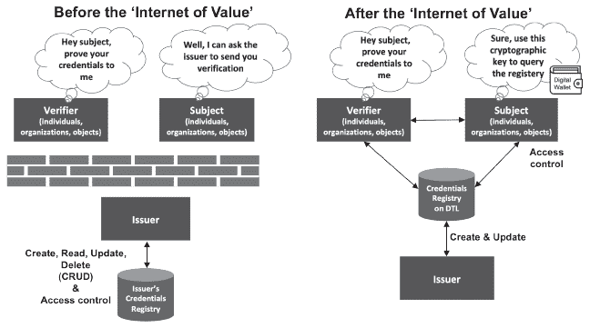

**Figure 7.1: 从集中式到分布式控制在“价值互联网”之前和之后**

根据 Alex Preukschat 和 Drummond Reed 在《去中心化数字身份和可验证凭证：自主身份》中的说法，截至 2020 年，SSI 有三个采用挑战：

**1.** 尚未建立一个可互操作的生态系统

**2.** 当人们没有互联网或手机接入时，他们仍然需要离线访问

**3.** 个人尚未准备好进行去中心化密钥管理

关于最后一点，全球人口中只有很小一部分具备技术和能力来保障和管理自己的私有加密密钥。因此，目前，许多个人仍然会依赖一个可信赖的第三方来为他们管理私有加密密钥。^(4) 例如，我们中的许多人允许交易所为我们管理加密货币密钥。

所以，如果 SSI 仍在未来，那么今天可以提供哪些基于区块链的解决方案，以使个人能够在不管理密钥风险的情况下访问和管理自己的凭证？在本章中，我们介绍了 iDatafy 的 SmartResume 案例研究，这是一个数字简历，发证者创建个人的凭证，但个人控制自己简历的访问权限；iDatafy 作为中立第三方，保护用户的加密密钥。SmartResume 平台不仅仅是一个认证的数字简历，它还是一个招聘平台，将合格的求职者与招聘组织相匹配（参见表 7.1）。

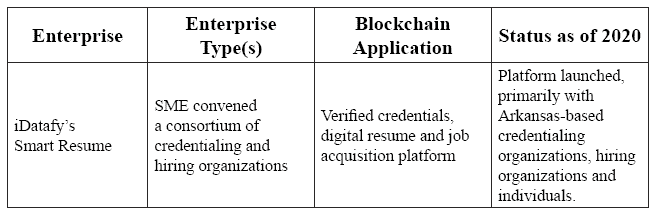

**Table 7.1: 区块链应用示例：凭证**

在介绍 SmartResume 解决方案之前，我们必须首先了解它旨在克服的人才获取挑战

7.2\. 人才获取挑战

尽管所有先进的人力资源（HR）实践、投资和技术创新，我们仍未能充分解决这一人才获取问题：***我们如何创建一个值得信赖的就业市场，高效地将合格的求职者与招聘组织相匹配？*** 沃顿商学院的乔治·W·泰勒管理教授和人力资源中心的负责人彼得·卡普 elli 在 2018 年的一篇《哈佛商业评论》文章中很好地总结了这一挑战：

*“企业从未像今天这样招聘过这么多员工。他们从未花过这么多钱来做这件事。而且他们做得前所未有的糟糕。”*^(5)

当今的人才获取解决方案包括数百个职场和社交媒体平台，如 CareerBuilder、Indeed、LinkedIn 和 Monster。根据一项研究，社交媒体现在是招聘努力中最常使用的渠道：2018 年有 77%的招聘人员使用了 LinkedIn，其次是 Facebook（63%）和 Instagram（35%）。^(6)尽管这些解决方案确实具有便利性和规模优势，但它们同样使求职者和招聘人员感到沮丧。市场两边的信任问题都存在。具体来说，招聘人员怀疑申请者自我报告的资历和技能，而求职者则怀疑招聘公司和平台是否保护他们的数据隐私并公正地选择申请者。所有这些担忧都是合理的。

许多申请者在简历上夸大自己的技能或做出虚假声明。

职场网站和社交媒体平台并不验证资历。随后，欺诈和夸大的简历仍然是一个问题。最近的一项调查发现，75%的雇主发现申请者在简历上撒谎。^(7)最常见的欺诈行为之一是声称获得了一所并未就读的大学的学位。一个知名度高的例子是：雅虎的 CEO 在有人发现他没有获得他所声称的计算机科学学位后被解职。^(8)美国的“文凭工厂”也是一个问题，因为它们授予很少或没有学术研究就能获得的学位。^(9)因此，招聘公司花费大量资源来调查求职者的声明。核实过程放慢了流程并增加了成本。平均而言，每名员工的招聘成本为 4,129 美元，但对于技术高超的工人，成本可能高达每个职位 40,000 美元。^(10)^,^(11)此外，诚实的求职者对这种默认的欺诈假设感到疲倦。

招聘组织和招聘人员在与选择偏见作斗争。

社交媒体和许多职场网站平台会暴露人们的种族、性别、年龄、宗教、所属团体以及生活方式选择。招聘人员可能会无意中根据这些数据而不是根据求职者的资格来排除候选人。一些大型公司已经转向人工智能（AI）来现代化招聘，但到目前为止，结果并没有减少偏见。例如，亚马逊的人工智能招聘工具旨在根据过去工程候选人的简历搜索关键词。由于过去的工程师大多数是男性，AI 工具学会了偏爱男性申请人。在性别偏见被揭露后，亚马逊放弃了这个工具。^(12)社交媒体、职场网站平台和 AI 工具不一定是选择偏见的唯一来源；依赖现有员工的推荐创建了同质化的申请人池，因为人们倾向于推荐与他们相似的人。^(13)

数据隐私保护是所有各方另一个担忧的问题。

招聘组织——尤其是那些外包招聘的 60%的公司——需要确保申请者的数据得到妥善处理。例如，在美国，家庭教育权利和隐私法案（FERPA）保护了学生教育记录的隐私。通常，学校在向他人透露有关学生教育记录的任何信息之前，必须得到家长或合格学生的书面同意。^(14) 随着数据隐私法规的发展，比如欧盟的通用数据保护条例（GDPR）和加利福尼亚州的消费者隐私法（CCPA），数据保护得到了更广泛的加强。^(15)^,^(16) 尽管有这些法规，但许多招聘网站和招聘人员还是常规性地收集申请者的信息，如电子邮件地址、电话号码、年龄、种族、照片和其他个人详细信息。^(17)

招聘挑战的规模非常大。根据美国劳工部的一份报告，2019 年美国共有 7000 万次招聘。^(18) 平均而言，每家企业职位空缺都有 250 名求职者申请，这表明招聘组织至少处理了 170 亿份求职申请。^(19) 此外，招聘过程并不总是成功结束；2019 年有 640 万个职位空缺未能填补。^(20) 难道不是该重新发明招聘方式的时候了吗？iDatafy 就是这样想的，因此开发了 SmartResume 解决方案，以恢复求职过程中的信任。

7.3\. SmartResume

iDatafy 是由大卫·温格尔在阿肯色州小石城于 2011 年创立的公司，该公司开发了 SmartResume 平台和职业网络，以增强人才招聘过程中的信任。该平台可以防止求职者提出虚假主张，消除选择偏见，并确保符合数据隐私规定。SmartResume 平台类似于领英（LinkedIn）或 Upwork，但具有通过区块链技术得到*验证*的资质。温格尔的愿景是将 SmartResume 平台打造成“*世界上最值得信赖的简历和认证职业网络。”*

为了启动职业网络，iDatafy 集中精力发展其在阿肯色州的本部。它组织了一个由认证组织、个人和招聘公司组成的联盟，以帮助开发该解决方案。试点项目于 2018 年与第一个认证组织——阿肯色大学沃尔顿商学院启动。在 18 个月内，联盟包括了阿肯色大学系统在费耶特维尔、小石城、福特史密斯、莫里尔维尔社区学院、*e*大学和普拉斯基技术学院。还有许多不属于 UA 系统的高等教育机构也已经签约，官方公告即将发布。

下面我们描述了联盟、平台、发展历程、竞赛和所学经验。

7.3.1\. SmartResume 联盟

iDatafy 召集了一个由认证组织、个人和招聘公司组成的联盟。

认证组织

认证机构是颁发证书的机构，如学院、大学、职业学校、专业协会、 licensing 局和政府部门。在 SmartResume 平台上，认证机构代表个人创建 SmartResume，通过认证教育程度；课程作业；荣誉；活动；奖项；经验；执照；隶属关系；研究；技能；推荐信或其他认证。这些认证以不可篡改的徽章的形式出现在个人的 SmartResume 上，该徽章通过区块链技术保证安全（见图 7.2）。

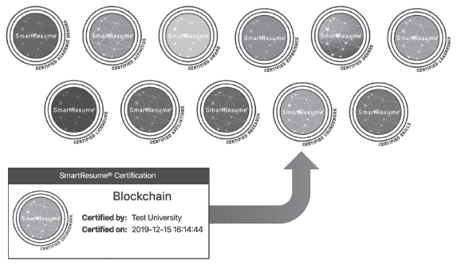

**图 7.2：SmartResume®认证徽章示例**

***每项认证都存储在区块链上的不可篡改的账本上***

作为一项关键的设计决策，认证机构选择了证书的名称和类型。这样，认证机构通过推广其品牌获得价值。例如，沃尔顿学院选择了“领导力沃尔顿”作为其证书之一。领导力沃尔顿是一个面向本科商业学生的专业发展项目，为他们提供了一个独特的学术、领导力和职业发展机会的混合体，旨在引导他们走向终身职业成功。^(21)

通过将认证机构置于控制地位，SmartResume 平台防止用户声称他们没有获得的证书，从而保护组织的品牌。他们还通过一次性认证一个人，而不是每次个人更换工作时重新确认证书，从而提高了效率。对于教育机构来说，加入 SmartResume 平台的额外好处是，它为与校友建立有意义联系提供了一种方式。对于劳动力技能认证机构——如培训和认证卡车司机；蒸汽管安装工、管道安装工、喷水系统安装工；以及供暖、通风和空调（HVAC）技术员——该平台为招聘公司提供了寻找合格人才的更好途径。

个人

学生、校友、现任职工和求职者等个人无法启动自己的 SmartResume。相反，必须由认证组织代表个人这样做。然而，个人必须选择加入 SmartResume 平台；如果个人没有激活他们的 SmartResume，任何第三方都无法访问。激活简历的个人可以补充个人 SmartResume 的额外信息，比如职业目标、爱好和兴趣。招聘组织可以通过区块链徽章确定哪些资质得到了认证组织的验证，以及哪些条目是由个人添加的。每个个人只有一个 SmartResume，可能包含来自许多不同组织的验证资质。个人控制着他们的职业匹配偏好，并可以授予或拒绝特定招聘组织的高度访问权限。个人无需支付即可参与平台。

招聘组织

招聘组织包括任何寻找合格员工的机构。招聘组织（或外包招聘人员）仅根据技能寻找合格候选人，因为所有像姓名和性别这样的人口统计和个人信息都被隐藏以防止搜索偏见。图 7.3 展示了一个样本简历在招聘组织眼中的样子。如果一个组织对与某个人建立联系感兴趣，平台会向该个人发送电子邮件请求。通过拥有一个合格的申请人池，招聘组织提高了效率，他们不再需要给候选人简历上的每个组织打电话以核实资质。招聘公司需要支付平台使用费。

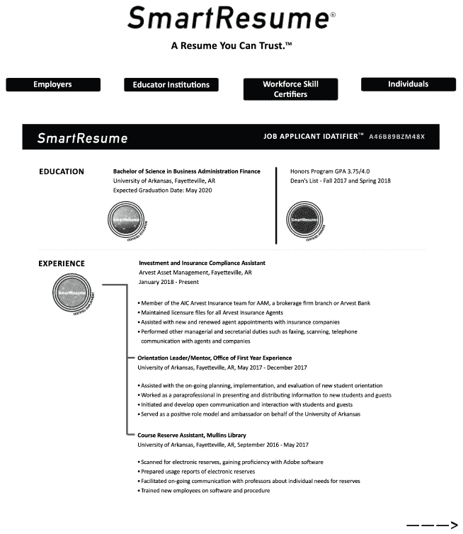

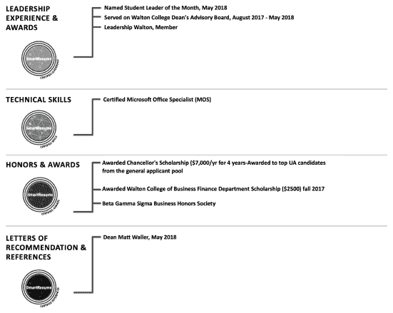

**图 7.3：相反和上面——招聘组织查看的 SmartResume®示例**

7.3.2. SmartResume 平台

SmartResume 平台是一个混合平台，包括基于 web 的界面、传统技术和受权限的区块链账本。首席技术官（CTO）Andy Griebel 解释说：

*“我们选择了混合解决方案。区块链技术为多个方提供了验证和信任资质真实性的能力。但将整个解决方案建立在区块链上将是错误的，因为它会运行缓慢。”*

从用户的角度来看，所有这些组件都是无缝的。人们根据他们的角色，比如雇主、教育机构、劳动力技能认证机构和个人，在平台上操作。用户界面不断演变和完善，但图 7.4 展示了 2020 年 3 月一个个人简历持有者的视图。

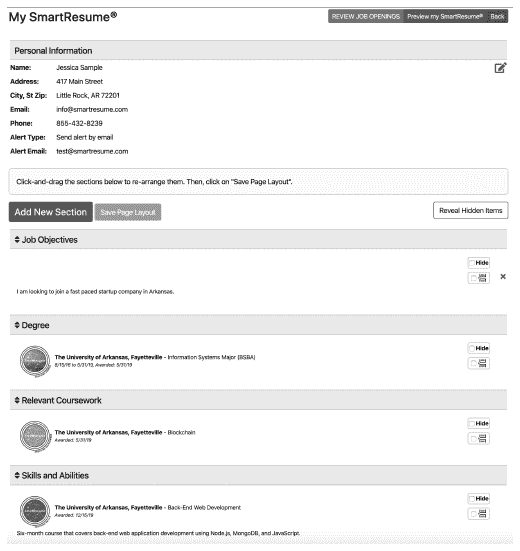

**图 7.4：截至 2020 年 3 月的 SmartResume®持有者的屏幕截图**

在用户界面背后，iDatafy 选择了一种混合解决方案，以利用区块链技术和传统技术最擅长的特性。区块链技术被选中以在多方环境中创建一个不可篡改的审计链，用于验证凭证。传统数据库被选中用于处理高性能和可扩展性流程，例如搜索工作和工作候选人、使用辅助信息增强 SmartResumes、将凭证映射到标准职业代码以及保护个人信息。

iDatafy 选择了一个授权区块链，网络加入仅限于邀请，只有授权成员验证交易。2018 年，iDatafy 考察了几种授权区块链，但最终选择了超级账本 Fabric。iDatafy 认为它是当时最成熟和最有活力的。然而，如果出现更优越的技术，iDatafy 可以切换平台。iDatafy 的 CTO 安迪·格里贝尔说：

*“我们的设计是灵活的；如果我们需要，我们可以转向另一个平台。”*

为了遵守隐私法规，没有任何个人信息存储在区块链账本上。相反，每个 SmartResume 与唯一的求职者 Idatafier(™) 相关联。iDatafy 只在与每个凭证相关联的区块链账本上存储最少的信息，包括唯一的求职者 Idatafier(TM)、认证组织、认证类型、日期和时间戳。

格里贝尔用一个关于区块链价值的类比来说明：

*“想象一下，区块链只不过是每个人都验证过的收据。”*

7.3.3 SmartResume 的发展历程

大卫·温格尔在 2017 年第一次搜索“认证数字简历”时，惊讶地发现没有结果。为什么没有人建立一个多凭证简历呢？温格尔认为原因在于*“如果没有联盟，就没有价值。”* 他开始设想解决方案，并根据他公司的经验，他知道建立一个联盟将是成功的关键。

iDatafy 的第一个产品是***LeadReview*®**，一个用于检测不良营销线索的专有数据联盟。该解决方案于 2011 年底推出，截至目前已处理超过 1 亿条查询。公司的第二个数据联盟，***StudentReview*®**，于 2012 年开发出来，用于检测美国的大学生金融援助欺诈。这个背景与获得工作的过程非常相似，因为金融援助市场受到欺骗和信任的困扰。许多没有上大学意图的人正在注册美国联邦政府的金融学生援助（称为“佩尔助学金”）并在收到钱后会立即退学，在其他地方注册，并重复这种欺诈行为。在某些情况下，罪犯组织成团伙，通过承诺给他们助学金的一部分来招募“稻草学生”。到 2011 年，罪犯每年从美国联邦政府那里诈骗数十亿美元。iDatafy 研究了这个问题，并发现这些人在收到支票时重复使用相同的联系信息（如家庭住址）。iDatafy 创建了一个由高等教育机构组成的联盟，建立并分享关于习惯性退学并尝试在多所学校注册的学生的 FERPA 合规目录数据。StudentReview 平台自动分析数据，并标记联系信息重复的实例。当一个新申请人在获得金融援助后从其他学校退学时，系统会警告学院和大学。^(22)

LeadReview，StudentReview 和 SmartResume 解决方案相似，它们都旨在恢复市场的信任。每个背景也需要一个联盟来建立生态解决方案。为了建立一个成功的联盟，iDatafy 开发了一个名为“**爬行，行走，奔跑**”的三阶段过程。我们用 SmartResume 联盟来阐述这个过程。

爬行阶段

每一个联盟都需要一个第一个组织采用者，最好是目标生态系统中的一个杰出成员，它将通过模仿影响帮助吸引额外的采用者。对于 SmartResume 项目，Wengel 联系了阿肯色大学沃尔顿商学院的院长 Matt Waller，希望他成为第一个联盟成员。Wengel 说：

*“我刚刚参加了 2018 年 4 月沃尔顿学院的第一次商业区块链会议，我立刻明白了这一点。”*

Wengel 个人并不认识 Waller，但在会议结束后，她给 Waller 发了一条关于项目的信息。沃尔顿学院正准备启动区块链卓越中心（BCoE），Waller 正在寻找一个学院可以帮助领导开发和实施实际解决方案的区块链项目。此外，SmartResume 的学历认证学生背景似乎是一个完美的契合：

*“如果你仔细想想，学院和大学已经颁发了数百年的毕业证书和成绩单，但它们实际上从未向学生发放过认证简历，尽管学院作为可信赖的权威机构，完全有资格这样做。”*

**马修·沃尔尔，阿肯色大学沃尔顿商学院院长，是 SmartResume 的第一位采用者**^(23)

沃尔尔召集了沃尔顿学院的领导和跨学院领导开会，以确定大学在该计划中的角色，包括校园首席信息官（CIO）；负责经济发展的副校长；贝海工程学院（BCoE）的创始主任；信息系统系（ISYS）的系主任；以及注册办公室的助理副校长。虽然大多数领导都支持这个想法，但鉴于校园正忙于企业资源计划（ERP）的更换，他们最初对再增加一个主要的 IT 项目表示担忧。他们不想为从即将被替换的系统中提取学生记录而构建一个接口。温格尔听取了反馈意见，并建议先进行一个小规模试点，涉及 20 名学生，这样就不会给大学的日常工作增加太多负担。iDatafy 将承担繁重的工作。

2018 年秋季，iDatafy 加入了贝海工程学院的咨询委员会；成为贝海工程学院区块链黑客马拉松的赞助商；并结识了许多研究区块链技术的学生。同年秋季，小规模的 SmartResume 试点项目也开始进行。沃尔顿学院招募了 10 名 ISYS 学生和 10 名 ISYS 校友作为志愿者，成为第一批获得智能简历的人。大学注册官通过验证资质，手动逐一验证学生，在平台上启动了志愿者的 SmartResume。然后，志愿者激活了他们的 SmartResume 并提供 iDatafy 反馈。iDatafy 发现除了学位项目之外，还有很多技能和活动也应该得到认证，包括前面提到的领导力沃尔顿。沃尔尔院长同意手动验证领导力沃尔顿的参与和其他非成绩成就，以出现在学生的智能简历上。

与其他早期采用者的试点项目在整个秋季继续进行。到 2018 年 11 月，四所合作伙伴学校共创置了 93 个 SmartResume。通过在试点项目中获得反馈，不断改进平台。例如，在许多校园招募的招聘组织想知道是否有更好的方法来寻找人才，因为大学授予类似的学位课程，但名称不同。例如，一所学校的信息系统学位可能被称为计算机信息系统；管理信息系统；信息技术；商业信息技术；商业计算；或者在其它学校被称为信息系统工程。iDatafy 通过创建一个认证者资格证明到美国劳工部创建的标准化职业代码（SOCs）的地图来回应。爬行阶段取得了成功。根据温格尔的说法：

**“所有最初的高等教育合作伙伴都同意，他们希望基于成功试点项目的反馈和雇主对新的人才寻找方式的需求，进一步扩大 SmartResume 的应用。”**^(24)

步行阶段

在步行阶段，我们增加了更多的高校联盟成员，优化了平台，并从手动数据收集和验证转变为自动化的流程。

在联盟拥有足够的基层成员之后，iDatafy 将目标对准了阿肯色大学系统。2019 年初，温格尔接触了阿肯色州教育部门的内阁秘书约翰尼·凯 ey，以及阿肯色大学系统的学术事务副校长和大学 of Arkansas System eVersity 的首席学术和运营官迈克尔·莫尔关于这项倡议。莫尔看到了这个价值：

**“从阿肯色大学系统和 eVersity 的角度来看，有些事情对我很有吸引力。这个平台为我们提供了一个机会，可以提升那些可能不会受到大型企业合作伙伴关注的学生的水平。另外，对于我们学生来说，使用这个平台是免费的。”**

莫尔邀请温格尔在 2019 年 7 月的会议 上，向来自阿肯色州各地 26 所大学的首席学术官员展示 SmartResume 项目。在后续的会议之后，iDatafy 为阿肯色大学系统所有公立高等教育机构签署了一份谅解备忘录（MoU）。招募阿肯色州人才的 公司也开始对联盟表现出兴趣。例如，一个非营利组织创建了第一个以工作技能为中心的 SmartResume。阿肯色州经济发展委员会同意在平台上认证其“未来适配”制造业就业技能认证。

步行阶段通过自动化大数据抽取并询问资历认证组织验证批次，从而改进了平台的入职流程。然后自动将批次上传到平台，为批次中的每个人创建一个可选的智能简历。截至 2019 年 12 月，为 5371 名沃尔顿学院 current 和 former 学生创建了智能简历。除了学位和主修外，还通过徽章验证了领导力沃尔顿、校长奖、Beta Gamma Sigma（一个 exclusive 商业荣誉协会）、供应链管理奖、财务管理/投资相关课程（基于辅修和 concentration 区域）以及校队越野队会员资格。这种细致程度允许招聘组织有针对性地进行招聘。到 2020 年 3 月，已创建了大约 25,000 个智能简历（但不一定激活）。Wengel 说：

*“对于我们来说，现在创建十万份智能简历比一年前创建五份智能简历要容易，”*

步行阶段将于 2020 年中期完成。

运行阶段

Wengel 解释说：

*“到这个阶段，我们希望扩大我们的计划并自动化所有数据认证过程、发行和就业匹配。我们预计将全国范围内扩大。”*

2020 年的计划包括：

• 建立一个长期治理计划，并邀请合作伙伴学校在网络中运营信任节点。

• 迅速在阿肯色州内外扩大雇主网络。

虽然 iDatafy 在阿肯色州显然处于领先地位，但我们接下来要探讨全球认证虚拟简历的竞争格局。

7.3.4 竞争

麻省理工学院（**MIT**）是首批在区块链上颁发文凭的大型大学之一。2017 年，111 名学生获得了带有访问经过验证的、防篡改的数字文凭的 Blockcerts 钱包应用，该数字文凭的散列存储在比特币区块链上。^(25) 实验的一个主要教训是，用户发现管理自己的私钥很困难。^(26) 为了将应用扩展到实际生产，MIT 与供应商 Learning Machine 合作。截至 2020 年，所有最近的 MIT 毕业生都获得了数字文凭和实体文凭。学生通过点击发送给所有最近毕业生的官方 MIT 邀请电子邮件来激活数字文凭。学生下载 Blockcerts 移动应用并将 MIT 设为发行者。该应用生成一个独特的公钥，用户可以与招聘组织分享。招聘组织使用公钥在 web 门户 [`credentials.mit.edu/`](https://credentials.mit.edu/) 上验证资历。该服务是免费的。^(27) 根据 MIT 的资深 associate dean 和 registrar Mary Callahan 的说法：

*“从一开始，我们的一个主要动机就是赋予学生掌握自己资历的权力。”*^(28)

麻省理工学院模型的一个缺点是，它只验证一个机构的资质，即麻省理工学院。如果大家都采用这个模型，用户将获得多个公钥，招聘组织需要访问多个门户来验证一个候选人。因此，**Blockcerts**继续建立一个开源社区（麻省理工学院不积极参与其中），用户可能有多个发行者。Blockcerts 社区已经开发了运行以太坊、Sovrin 和 Hyperledger 的版本。29 软件发布在 MIT 免费开源软件（FOSS）许可下。使用开源软件建立自己资质认证解决方案的机构包括加拿大的麦马斯特工程，美国乔治亚 Tech 以及马德里的 Universidad Carlos III。机构可以选择不构建解决方案，而是像 Learning Machine 这样的公司，后者继续帮助机构实施 Blockcerts。30 客户包括南新罕布什尔大学，马耳他共和国，州医学委员会（FSMB）和巴哈马国家培训局（NTA）的劳动力准备计划。Blockcerts 计划很快增加照片身份证和成绩单。31 其中大多数，正如 Wengel 所提到的，是在验证资质，而不是建立智能简历。

我们在 BCoE 的在线研究没有发现任何直接竞争对手，特别是在阿肯色州市场内。英国 based 的**APPII**是我们找到的提供与 SmartResume 类似服务的公司，但针对的是另一个市场，并且采用的方法是由个人而不是资质认证组织推动的。APPII 为区块链验证的 Curriculum Vitae（简历的英国术语）提供多资质认证服务。（32）与其像 iDatafy 那样建立职业网络联盟，APPII 选择了与职业配置平台 TechnoJobs 合作。33 我们还发现了其他将区块链资质存储在比特币网络上的公司，包括**Accredible**和**Credly**。34 加拿大 based 的 TerraHub Technologies 为高等教育资质创造了**Credential Wallet**，并与 PwC 加拿大合作中。35

大型招聘平台和大型软件公司是 iDatafy 最可能的潜在竞争对手（或许也是合作伙伴）。他们拥有全球招聘组织和个人的网络，但需要解决如何验证资质以及创建个人简历的问题。关于竞争，iDatafy 的创始人兼 CEO，Dave Wengel 说：

“显然，外面有人在做区块链文凭、区块链成绩单和区块链资质匹配。据我们所知，全世界还没有人建立一个认证简历。即使有人要复制我们在做的事情，我们也知道建立一个社区有多难”*

7.4 结论

第 II 部分中的区块链应用旨在捕捉广泛的区块链应用用例。但是即使有详细示例，我们仍然错过了其他行业的重要用例，如政府、保险、医疗保健、教育、零售、媒体和游戏。特别是，政府有很大的机会更好地管理身份、选举、注册和产权。

技术成熟度和商业成熟度是将从创新实验室向市场转移更多 POCs 所必需的。总的来说，在我们的区块链应用框架中，技术挑战是协议和代码库的领域，而商业挑战则是在用例领域（参见图 7.5）。在下一章，我们将探讨技术挑战和新兴解决方案。在第九章中，我们将通过指定思维转变、战略和行动原则来部署实际应用，从而解决商业领域的问题。

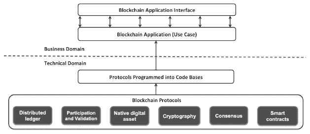

**图 7.5：区块链应用的业务和技术领域**

引用

^(1) Ledger Insights (2019). PwC launches blockchain credentialing solution, [`www.ledgerinsights.com/pwc-blockchain-smart-credentials/`](https://www.ledgerinsights.com/pwc-blockchain-smart-credentials/)

^(2) 引自 Lacity, M. (2020), *Re-inventing Talent Acquisition: The SmartResume® Solution*, Blockchain Center of Excellence Case Study Series, BCoE 2020-01, University of Arkansas.

^(3) Zuboff, S. (2019). *The Age of Surveillance Capitalism: The Fight for a Human Future at the New Frontier of Power*. New York: PublicAffairs.

^(4) Preukschat, A. and Reed, D. (2020) *Decentralized Digital Identity and Verifiable Credentials: Self-Sovereign Identity*, Manning Publications, Version 2.

^(5) Cappelli, P. (2019), ‘Your Approach to Hiring is All Wrong’, *Harvard Business Review*, [`hbr.org/2019/05/recruiting`](https://hbr.org/2019/05/recruiting)

^(6) Jobvite (2018), *Recruiter National Survey*, [`www.jobvite.com/wp-content/uploads/2018/11/2018-Recruiter-Nation-Study.pdf`](https://www.jobvite.com/wp-content/uploads/2018/11/2018-Recruiter-Nation-Study.pdf)

^(7) CareerBuilder (2017), *75 percent of HR Managers Have Caught a Lie on a Resume*, [`press.career-builder.com/2017-09-14-75-of-HR-Managers-Have-Caught-a-Lie-on-a-Resume-According-to-a-New-CareerBuilder-Survey`](http://press.career-builder.com/2017-09-14-75-of-HR-Managers-Have-Caught-a-Lie-on-a-Resume-According-to-a-New-CareerBuilder-Survey)

^(8) Pepitone, J. (May 14, 2012), ‘Yahoo confirms CEO is out after resume scandal’ *CNNMoney*. [`money.cnn.com/2012/05/13/technology/yahoo-ceo-out/`](https://money.cnn.com/2012/05/13/technology/yahoo-ceo-out/)

2005 年，美国教育部推出了“认证高等教育机构和项目数据库”，以遏制欺诈学位的传播。

塔钦斯基，B.（2020 年 1 月 9 日）的*2020 年人力资源统计：职位搜索、招聘、招聘和面试*，Zety。 [`zety.com/blog/hr-statistics#job-search-statistics`](https://zety.com/blog/hr-statistics#job-search-statistics)

国家学生清除所（2016 年）的*学术欺诈的真实成本*。 [`nscverifications.org/wp-content/uploads/2016/06/CostOfAcademicFraud.pdf`](https://nscverifications.org/wp-content/uploads/2016/06/CostOfAcademicFraud.pdf)

汉密尔顿，I.（2018 年 10 月 10 日）在《商业内幕》上发表的*亚马逊建立了一个 AI 工具来招聘人员，但由于它对女性有歧视，不得不将其关闭*。 [`www.businessinsider.com/amazon-built-ai-to-hire-people-discriminated-against-women-2018-10`](https://www.businessinsider.com/amazon-built-ai-to-hire-people-discriminated-against-women-2018-10)

法 emi，F.（2019 年 10 月 31 日）在《福布斯》上发表的*AI 如何颠覆招聘*。 [`www.forbes.com/sites/falonfatemi/2019/10/31/how-ai-is-uprooting-recruiting/#43c6540f46ce`](https://www.forbes.com/sites/falonfatemi/2019/10/31/how-ai-is-uprooting-recruiting/#43c6540f46ce)

家庭教育权利和隐私法（FERPA）。美国教育部。 [`www2.ed.gov/policy/gen/guid/fpco/ferpa/index.html`](https://www2.ed.gov/policy/gen/guid/fpco/

[欧盟](https://gdpr.eu/)的*全面指南：GDPR 合规性*。

*加州消费者隐私法（CCPA）*。 [`oag.ca.gov/privacy/ccpa`](https://oag.ca.gov/privacy/ccpa)

斯密茨，J.（2018 年）的*招聘中的隐私——保护您的候选人数据*。 [`cammio.com/blog/privacy-in-recruitment/`](https://cammio.com/blog/privacy-in-recruitment/)

美国劳工统计局（2020 年 2 月 11 日）的*职位空缺和劳动力流动总结*报告 USDL-20-0243。 [`www.bls.gov/news.release/jolts.nr0.htm`](https://www.bls.gov/news.release/jolts.nr0.htm)

塔钦斯基，B.（2020 年 1 月 9 日）的*2020 年人力资源统计：职位搜索、招聘、招聘和面试*，Zety。 [`zety.com/blog/hr-statistics#job-search-statistics`](https://zety.com/blog/hr-statistics#job-search-statistics)

美国劳工统计局（2020 年 2 月 11 日）的*职位空缺和劳动力流动总结*报告 USDL-20-0243。 [`www.bls.gov/news.release/jolts.nr0.htm`](https://www.bls.gov/news.release/jolts.nr0.htm)

领导沃尔顿。 [`walton.uark.edu/career/leadership-walton.php`](https://walton.uark.edu/career/leadership-walton.php)

温格尔，D.（2012 年）的*积极反对财政援助欺诈的立场*，iDatafy 白皮书。

^(23) Adkison, M. (2020 年 2 月 18 日)，《U of A 与区块链公司合作推出创新的简历构建计划》，[`walton.uark.edu/insights/smart-resume.php`](https://walton.uark.edu/insights/smart-resume.php)引言

^(24) Adkison, M. (2020 年 2 月 18 日)，《U of A 与区块链公司合作推出创新的简历构建计划》，[`walton.uark.edu/insights/smart-resume.php`](https://walton.uark.edu/insights/smart-resume.php)引言

^(25) Jones, B. (2017 年 10 月 19 日), *麻省理工学院已开始使用区块链技术发放文凭*, 未来主义, [`futurism.com/mit-has-started-issuing-diplomas-using-blockchain-technology`](https://futurism.com/mit-has-started-issuing-diplomas-using-blockchain-technology)

^(26) MIT 媒体实验室(2016 年 6 月 2 日), *我们在设计基于区块链的学术证书系统中学到了什么*, Medium, [`medium.com/mit-media-lab/what-we-learned-from-designing-an-academic-certificates-system-on-the-blockchain-34ba5874f196#.4m4bmwcm0`](https://medium.com/mit-media-lab/what-we-learned-from-designing-an-academic-certificates-system-on-the-blockchain-34ba5874f196#.4m4bmwcm0)

^(27) *数字文凭*，麻省理工学院注册办公室，[`registrar.mit.edu/transcripts-records/digital-diplomas`](https://registrar.mit.edu/transcripts-records/digital-diplomas)

^(28) Sundarar

Drawdy, R. (2019 年 1 月 21 日), *麻省理工学院在区块链上提供数字文凭*, Helix 教育, [`www.helixeducation.com/resources/uncategorized/mit-offers-digital-diplomas-blockchain/`](https://www.helixeducation.com/resources/uncategorized/mit-offers-digital-diplomas-blockchain/)

^(29) [`www.blockcerts.org/`](https://www.blockcerts.org/)

^(30) Smolenski, N. (2018 年 5 月 14 日), *使用 Blockcerts 的十大理由*, [`medium.com/learning-machine-blog/top-10-reasons-to-use-blockcerts-ec7d29f2712c`](https://medium.com/learning-machine-blog/top-10-reasons-to-use-blockcerts-ec7d29f2712c)

^(31) [`www.learningmachine.com/`](https://www.learningmachine.com/)

^(32) [`appii.io/`](https://appii.io/)

^(33) Chaudhary, M. (2017 年 11 月 29 日), *TechnoJobs 和 APPII 合作伙伴创建区块链验证的职业档案*, HR 技术学家, [`www.hrtechnologist.com/news/recruitment-onboarding/techno-jobs-and-apii-partners-to-create-blockchain-verified-career-profile/`](https://www.hrtechnologist.com/news/recruitment-onboarding/techno-jobs-and-apii-partners-to-create-blockchain-verified-career-profile/)

^(34) [区块链证书是什么](https://help.accredible.com/what-are-blockchain-credentials)

[区块链资源](https://resources.credly.com/blockchain)

^(35) [工业区块链证书钱包](https://www.terrahub.ca/news/2018/8/3/industrial-blockchain-credential-wallet)

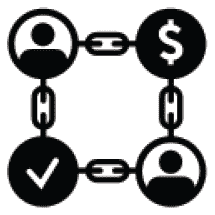
