## 第三部分

## 成熟之路

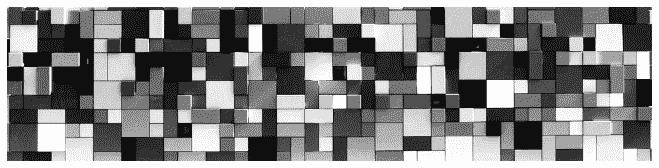

## 第八章

## 技术挑战与新兴解决方案

“技术挑战仍然存在，但这些问题可能是更快解决的挑战，而像监管挑战、协作挑战等其他问题可能需要更长时间才能实现采用。”*

**John Burnett, Omniex 联合创始人**^(1)*

“我更担心的是技术。虽然技术不成熟，但这不如标准和法规问题严重。”

**Nilesh Vaidya, 凯捷咨询公司银行及资本市场解决方案执行副总裁**^(2)

“我认为在解决这些问题和应对现有技术挑战方面取得了有效的进展。”

**Eamonn Maguire, 全球区块链服务负责人, KPMG**^(3)

^(4)

8.1 引言

区块链代码仍然被认为是初期的，或许除了自 2009 年以来一直部署的比特币。对于某些协议，存在显著的技术挑战，包括大量资源消耗；安全性；性能和可扩展性；公共区块链的匿名性；私有区块链的机密性；以及互操作性。本章探讨了所有这些挑战及其新兴解决方案。

在采用之前，企业需要确保技术“企业就绪”，即软件足够安全，能够处理企业应用的体积、速度和保密要求。幸运的是，来自世界各地的人们正在合作解决无权限和有权限的区块链的技术挑战。正如上面引用的言论所证明的，我们交谈过的几乎所有区块链专家都认为技术挑战是可以管理的；开源社区以及私营企业只需要更多时间来识别、辩论和发展技术解决方案。传统企业的管理者当然需要了解技术挑战，并应监控这些新兴解决方案，这些解决方案在无权限和有权限的区块链之间存在显著差异。技术问题还指出了企业今天需要开始构建的技能。

8.2 资源消耗

“这是值得的；一项安全漏洞的平均成本约为 380 万美元”

**唐和亚历克斯·塔普斯科特，著作《区块链革命》的作者**^(5)

运行区块链节点的计算机以电力的形式消耗资源。给定区块链的共识协议的计算强度是资源消耗的主要驱动力。回想一下，从第三章中，比特币和以太坊使用最安全，但计算上资源需求最高的协议，称为工作量证明（Proof-of-Work）。比特币在 2009 年的首批矿工，可以使用他们的台式计算机成功竞争一个区块奖励。随着比特币价格的飙升，矿工转向专用硬件，并通过挖矿池共享计算能力。具体来说，比特币需要一个应用特定集成电路（ASIC）。以太坊挖矿需要一个图形处理单元（GPU）。工作量证明对这两个公共网络来说确实是一个资源消耗者。为了竞争，已经建立了大型矿场中心（参见图 8.1 一个例子）。

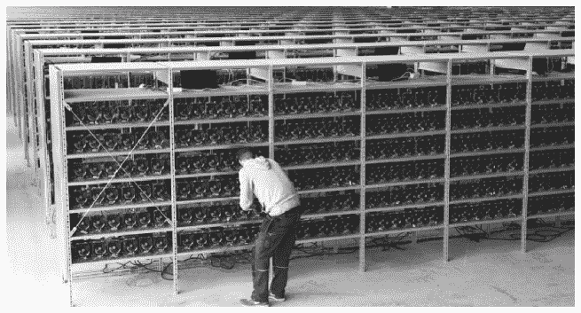

**图 8.1：位于瑞典 Bowden 的比特币挖矿场**

](https://coinscage.com/wp-content/uploads/2017/05/bitcoin-mining-farm-1.jpg)

追踪区块链能源消耗的 Digiconomist 网站计算，到 2020 年，每笔比特币交易需要 646 千瓦的电力；以太坊每笔交易使用 30 千瓦的电力。从年度来看，这些数字相当于为比特币提供动力所需的 710 万户美国家庭的电力，为以太坊提供动力所需的 70 万户美国家庭的电力。^(6) 如 Don 和 Alex Tapscott 的引用所示，许多人认为为了保护区块链，这笔费用是值得的。然而，人们正在寻找减少电力成本的方法。

挖矿池有动力在低成本电力源附近建立数据中心。因此，近年来在中国出现了大型挖矿池，控制了比特币超过 80％的挖矿力量。捷克共和国、冰岛和格鲁吉亚（国家）由于电力便宜，也是其他受欢迎的挖矿场所。^(7) 在美国，50 个州之间的电力价格差异很大。2018 年，路易斯安那州的比特币挖矿电力平均成本最低，为每比特币 3224 美元。夏威夷州和阿拉斯加州最贵，分别为每比特币 9483 美元和 7059 美元。^(8)

创新的解决方案旨在使挖矿更加负担得起。例如，**EZ Blockchain**开发了一个解决方案，将钻探和精炼过程中产生的天然气火炬废气转化为电力，以供加密货币挖矿使用。EZ Blockchain 使用便携式汽油发电机为移动数据中心供电（见图 8.2）。这种商业模式帮助钻探和精炼公司减少 CO[2]排放，同时通过加密货币挖矿获得收入。截至 2020 年，EZ Blockchain 已经交付了 13 个移动挖矿单元，主要在北达科他州。

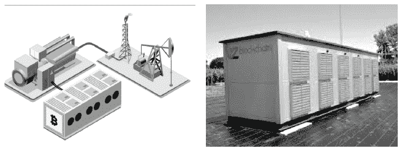

**图 8.2：EZ Blockchain 挖矿**

***来源：[`www.ezblockchain.net/`](https://www.ezblockchain.net/)*

***发电机将天然气火炬转化为电力，以供电加密货币挖矿的便携式数据中心。***

一些公共区块链依赖于与工作量证明相比计算强度较低的共识算法。例如，**Cardano**使用权益证明，**EOS**使用委托权益证明协议作为公共区块链，这些区块链的能耗要低得多。受许可的区块链依赖于某种拜占庭容错机制，这种机制所需的能量非常少——大约相当于运行一个电子邮件服务器的能量。

8.3 节：安全

*“集中的安全方式是不可行的。我们需要一种安全的去中心化消息传递方式，使得设备无法被黑客攻击。”*

**Andre de Castro，Blockchain of Things 的首席执行官和创始人**^(10)

*“区块链在隐私和安全方面呈现出一对矛盾的情况。区块链具有固有的安全性，具有不可篡改的交易和基于散列的数据完整性。但与我交谈的大部分企业都有关于谁看到什么的保密性问题的疑问和担忧。为了真正的企业采用区块链，我们需要考虑整体安全，这不仅仅是技术问题，也是商业挑战。在许多方面，它类似于私有云、公共云和混合云的争论。”*

**Saurabh Gupta，HfS Research 首席战略官**^(11)

区块链最大的卖点之一是相较于具有单一故障点的集中式系统，其安全性更高。在第三章中，我们了解到即使有很大比例的节点出现故障——甚至是恶意节点，区块链应用程序仍然可以正常运行，这保证了无与伦比的弹性以及 100%的可用性。如果区块链如此安全，那为什么我们还听到这么多盗窃和漏洞事件？当今区块链技术存在漏洞，尤其是在数字钱包、代码库、智能合约以及 51%攻击的可能性上。此外，量子计算构成了一个重大的未来安全威胁。

8.3.1 节：数字钱包安全

“传统公司不会仅仅为了利用区块链的其他特性而使用加密货币。你能想象信任你的 IT 部门管理一个充满私钥的区块链钱包吗？”*

**安德烈·德·卡斯特罗，区块链事物公司的首席执行官和创始人**^(12)

大多数区块链上的盗窃事件都发生在数字钱包的脆弱接入点，私钥就存储在这里。如第三章所述，一旦黑客窃取了一个私钥，他或她就能控制该资产，并轻松地将资金转移到另一个地址。虽然用户可能会将他们的数字钱包存储在自己的设备上，但大多数用户依赖中心化交易所。交易所是黑客的有利目标，因为一些交易所控制着数百万私钥。我们已经介绍了***Mt. Gox***的最大盗窃案之一。但那是 2014 年的事了。跳到 2019 年，有十二起重要的交易所被黑事件，加密货币被盗市值达到 2.92 亿美元，还有超过 50 万登录凭证。(13) 其中新加坡的***Bittrue***被窃取了价值 500 万美元的 Ripple 和 ADA (Cardano 的币)。英国的***Gatehub***失去了 100 万美元的 Ripple；而***Binance***失去了 400 万美元的比特币。经理们自然会担心这些事件的风险影响，但风险是可以减缓的。最大的加密货币交易所——Binance、***Coinbase***和***Gemini***——现在有外部或内部保险来赔偿用户。

**经理们的教训：企业将需要构建或获取新的信息技术、网络安全和密码学技能来保护数字资产，特别是保护私钥。**

8.3.2. 代码库安全

虽然私钥从数字钱包中被盗的情况远比代码库中的软件漏洞导致的区块链被盗要少见，但许多区块链都曾因代码库中的软件弱点而遭受盗窃。这些通常发生在代码库发布后的第一年，当时代码库还非常新。2010 年 8 月，比特币区块链遭到黑客攻击，有人利用软件漏洞创建了 1840 亿比特币，考虑到最大货币供应量只有 2100 万比特币，这一行为非常可疑。(14) 2014 年，一名黑客能够从只有 0.0001 比特币的地址转移 1000 比特币。(15) 随着软件更新的实施，可能会引入新的漏洞。例如，2018 年发现了一个比特币核心更新的严重漏洞，这可能会使网络在拒绝服务攻击中瘫痪，这是一种恶意攻击，通过向网络发送大量交易来 disrupt service for legitimate users。幸运的是，比特币核心开发者发现了这个漏洞并修复了它，黑客还没有机会利用它。(16) 尽管源代码被迅速修复，但这些事件提供了一个重要的警告。

**经理们的教训：企业将需要了解如何构建和测试分布式应用的软件开发者。**

由于区块链应用是分布式系统，企业将需要培养或吸引能够开发和测试去中心化应用（“DApps”）的人才。DApps 提供了灵活性、透明度和弹性等好处，但与传统的中心化软件相比，它们更难以测试。特别是，识别 DApps 中的计算机编程逻辑错误（称为“bug”）更加困难。企业需要软件开发人员能够发现诸如 mandelbug、schrödinbug 和 heisenbug 等奇怪的错误（参见词汇表）。

8.3.3 智能合约安全

正如第三章所定义的，去中心化自治组织（DAO）是一个完全由编码在智能合约中的计算机程序运行的组织或公司，这些智能合约在区块链上执行。我们这里关注的是一个特别命名的 DAO，名为***The DAO***（与“一个”DAO 相对）。DAO 或许是区块链中最令人担忧的被盗事件，因为其犯罪者并没有从存储在区块链之外的数字钱包中盗取私钥，也没有利用代码库中的漏洞。相反，犯罪者利用了部署在以太坊区块链上的智能合约中的一个漏洞。下面是这个故事……

**Stephan Tual, Christoph Jentzsch 和 Simon Jentzsch 提议在以太坊上启动一个名为“The” DAO 的智能合约。他们设计 DAO 作为一个投资机制，为以太坊相关的初创企业提供资金。任何向 DAO 投资的人——在筹款期间向其发送以太坊原生数字货币（以太币）——可以在 DAO 启动后投票表决投资建议。DAO 于 2016 年 5 月部署。尽管有些人提出了担忧——比如康奈尔大学的 Emin Gün Sirer 教授关于代码中的弱点——但资金还是源源不断地涌入。^(17)由于对未来项目的投票取决于投资的规模，想要有强大投票权的人投入了大量资金。^(18)DAO 在 28 天的筹款期内筹集了价值 1.5 亿美元的以太币，超过了任何人的预期，因为这代表了以太币货币供应量的 15%。2016 年 6 月，一名黑客（或黑客团体）利用智能合约代码中的一个漏洞，将 DAO 基金中的 5000 万美元以太币转移到他们控制的另一个账户。由于智能合约是自主运行的，以太坊社区无力阻止这一行为。以太坊的联合创始人 Vitalik Buterin 呼吁暂停所有交易，直到解决问题。以太币的价格立即从 20 美元跌至 13 美元。^(19)*

应该做什么？相反的观点蜂拥而至：Vitalik Buterin 想要“冻结账户”，这将需要至少 50%节点运行的新代码。Stephan Tual 认为应该撤销区块，并将所有被盗的以太币返还到投资者账户中。20 开源社区的一些成员坚持认为***什么***也不应该做。区块链没有被攻破；智能合约的程序员做得不好，所以他们应该承担损失。聊天室里充满了将美国联邦政府在 2008 年全球金融危机期间救助银行的行为与以太坊基金会进行类比的论调，并指责以太坊基金会像政府一样行事。决定让矿工投票，根据他们的哈希功率来衡量他们的投票。矿工投票支持硬分叉——以太坊区块链的永久分叉。区块被回滚，被盗的以太币被返还。那些拒绝跟随分叉的矿工继续使用原代码进行挖矿，留下了***以太坊***（跟随分叉）和***以太坊经典***（不跟随分叉），在那里窃贼仍然可以提现。

其他智能合约失窃和漏洞也浮出水面，例如运行 Parity、POWH Coin、LastWinner 和 Fomo3D 的智能合约：

• Parity 是由以太坊联合创始人 Gavin Wood 在 2017 年推出的。有人利用智能合约中的一个漏洞，窃取了价值 3000 万美元的以太币。21

• POWH Coin 被许多人认为是一个庞氏骗局，新投资者为早期投资者付款。22 但比商业模式更糟糕的是，***白帽黑客***（帮助识别安全缺陷的道德黑客）在运行 POWH Coin 的智能合约中发现了一个漏洞。2018 年，***黑帽黑客***（利用安全缺陷为自己谋取利益的罪犯）利用了一个未签名的整数下溢机会，从而使他们能够提取无限数量的 POWH 代币。23

• Last Winner 和 Fomo3D 是在以太坊上推出的共享超过 90%代码的博彩智能合约。2018 年 8 月，AnChain 识别出 Last Winner 上的五个以太坊地址利用智能合约代码中的一个漏洞窃取了 400 万美元。24

***给管理者的教训：企业将需要构建或获取新的法律技能，以评估风险并确定协议的法律性，以及构建和积极测试智能合约的新编程技能，然后再进行现场部署。***

8.3.4 五十一个百分比攻击

*“矿池是一群合作矿工的团体，他们同意按贡献的挖矿哈希功率比例分享区块奖励。尽管矿池对普通矿工有利，因为它们使奖励变得平稳和可预测，但不幸的是，它们将权力集中在矿池所有者手中。”*

**乔丹·特温纳，Buy Bitcoin Worldwide 的创始人**25

「我对中国的矿工们联合起来作为一个卡特尔并不特别担心。把他们都归为一类是个大错误，因为他们都是中国人。在过去的一年中，尤其是在过去的几个月里，我们看到所有的这些矿池和个人矿工彼此之间都相当独立地行动。」^

**康奈尔大学的 Emin Gün Sirer 教授，2017 年**^(26)

有人控制超过 50%的节点/哈希力的可能性有多大？最大的威胁又在哪里？对于大型公共区块链，威胁来自于矿池的权力集中。我们将特别查看比特币和以太坊的权力集中的威胁。对于较小规模的公共区块链，如果一个黑客的电力成本低于通过双重支付可以窃取的加密货币金额，那么这个黑客可能会发现接管网络是值得的。我们将研究在 Verge; ZenCash; Bitcoin Gold 和 Ethereum Classic 上发生的 51%攻击。私有区块链不需要担心 51%的接管；实际上，许多私有区块链是在下一章中讨论的“仁慈的独裁者”治理模型下运营的。

专注于比特币，51%攻击的主要威胁来自于中国矿池的权力集中，这些矿池在 2020 年控制了超过 80%的挖矿力量（见图 8.3）。***Poolin, F2Pool, [BTC.com](http://BTC.com)***, 和***Antpool*** 是最大的几个中国矿池之一。在理论上，矿工可能会勾结，或者中国政府可能会接管。^(27) 关于后者的威胁，中国政府完全接管将会导致价格崩溃，因此一个更可能的威胁是政府悄悄接管几个矿池的控制权。^(28)

总部位于中国的公司***Bitmain***构成了另一个有趣的威胁。Bitmain 既是世界上最大的比特币挖矿硬件制造商，拥有 70%的市场份额，也是 Antpool（最大的矿池之一）的所有者。截至本文撰写时，Antpool 挖出了大约 10%的所有区块（见图 8.3）。作为最大的比特币挖矿硬件提供商和消费者，存在严重的利益冲突。2017 年 4 月，发现 Bitmain 在其 Antminer 硬件中内置了一个「后门」程序，这样公司就可以轻松地接管并关闭与它的矿池竞争的其他矿工。以下是这种情况可能如何发生：

「固件会每隔一到十一分钟随机与中央服务进行一次检查。每次检查都会传输蚂蚁矿机的序列号、一个硬件识别号码以及 IP 地址。比特大陆可以利用这些检查数据与客户销售和交付记录进行交叉核对，从而使其个人可识别。远程服务随后可以返回“错误”，这将使矿工停止挖矿。」^(29)

被称为“Antscape”，Bitmain 道歉并发布了固件更新。^(30)

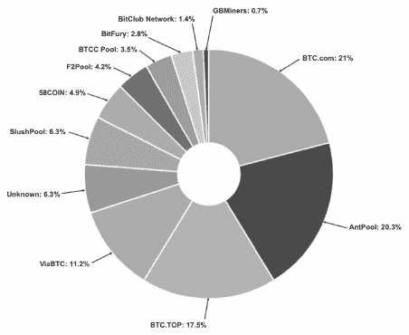

**图 8.3：2020 年 2 月 18 日比特币最大的赢利挖矿池**

*来源：[`blockchain.info/pools`](https://blockchain.info/pools)*

以太坊也跟踪其顶级矿工在[`www.etherchain.org/charts/miner`](https://www.etherchain.org/charts/miner)。2020 年 2 月，**Sparkpool, Ethermine, f2pool2** 和 **Nanopool** 是最大的矿池（见图 8.4）。Sparkpool 当天控制了以太坊网络超过 30 以上的份额。

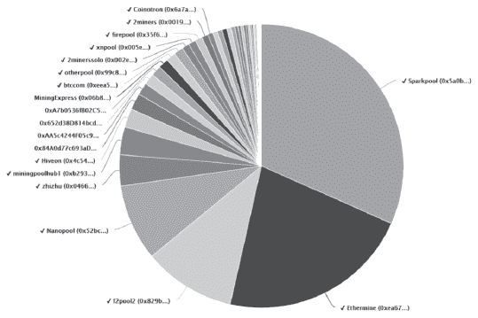

**图 8.4：2020 年 2 月 18 日以太坊最大的赢利挖矿池**

*来源：[`www.etherchain.org/charts/miner`](https://www.etherchain.org/charts/miner)*

考虑到区块链本应是完全分布式应用，几个关键挖矿池的主导地位确实构成了风险。上面 2017 年的引用，来自教授 Emin Gün Sirer 的观点，认为合谋担忧是错误的，因为没有证据表明中国挖矿池之间存在合谋。然而，Sirer 教授及其同事在 2018 年的一项研究中发现，*“比特币和以太坊的挖矿都非常集中，比特币的前四大矿工和以太坊的前三大矿工控制了超过 50 的哈希率。......这两个系统的整个区块链都由少于 20 个挖矿实体决定。”*^(31)*

尽管比特币和以太坊没有遭受 51 攻击，但其他区块链网络却遭受了，包括 Verge；ZenCash；Bitcoin Gold 和 Ethereum Classic。

• 在 **Verge** (XVG) 这个隐私币种，2018 年发生了三次 51 攻击。在第一次攻击中，黑客窃取了价值 100 万美元的加密货币。在第二次攻击中，他们窃取了 180 万美元，并阻止其他人处理交易。在第三次攻击中，超过 1.42 亿 XVG 被窃取。^(32) 每次，开发者都试图实施补丁，但黑客仍然能够伪造时间戳来双重支付 XVG。^(33)

• **ZenCash** (ZEN) 在 2018 年 6 月遭受了一次 51 攻击，一名拥有大量挖矿业务的私人矿工通过双重支付，黑客窃取了价值超过 55 万美元的加密货币。在此袭击中，开发者迅速回应，推出补丁。^(34)

• **Bitcoin Gold** (BTG) 在 2020 年 1 月遭受了一次 51 攻击。黑客重新组织了近 30 个区块，双重支付了价值 7 万美元的加密货币。^(35)

• 在所有 51%的攻击中，***以太坊经典***的攻击被认为是最令人担忧的。如上所述，以太坊经典是在 2016 年以太坊的 DAO 攻击之后出现的“非分叉”派系。早在 2018 年，白帽子就警告说，可以通过花费不超过 2216 美元的电力来对以太坊经典进行 51%的攻击。^(36) 2019 年 1 月，一名黑客控制了网络的 51%，并窃取了超过 100 万美元的加密货币。几天后，这名黑客主动将 10 万美元归还给了其中一个被抢劫的交易所 Gate.io。不清楚为什么黑客将钱退给了这个交易所，而不是其他被抢劫的交易所，比如 Coinbase。^(37)

从这些事件中可以得出的一个结论是，社区团结起来拯救网络。

8.3.5. 量子计算

区块链的加密技术被认为是安全的，因为今天的数字计算机没有足够的计算能力来实施基于仅知道公钥的私钥的暴力猜测。据一位消息来源称，今天的数字计算机需要数十亿年的时间来随机猜测与公钥相匹配的私钥。^(38) 展望未来，一些人担心我们今天认为安全的加密技术在未来可能变得脆弱。考虑到无权限的区块链记录是不可变的且*永远*公开，确实存在未来技术可能会破坏保护今天区块链的加密技术的风险。量子计算就是其中之一。

量子计算将以这样的方式加速计算机，使得在今天行不通的暴力搜索在未来可能变得可行。^(39) 如何实现？今天的数字计算机基于二进制数字，称为“位”，用“0”或“1”表示计算状态。今天，我们通过每秒处理更多的位来使数字计算机变得更快，但每个位仍然只能表示一个计算。量子计算机将改变这一点；它们将基于量子位，称为“量子位”或“qubits”，可以同时表示多个状态，因此可以同时进行多次计算。一个 30 个量子位的计算机可以同时进行 10 亿次计算。^(40)

根据瑞尔森大学网络安全研究实验室的负责人阿特菲·马沙塔恩博士（Atty）的说法，有两种选择：

要么用量子抗扰动替代现有平台中的脆弱组件，要么重新设计新的区块链，这些区块链不会受到量子攻击的威胁。后者比前者容易得多。*

为了修复现有的区块链，需要将加密密钥替换为更大的密钥尺寸，这将进一步阻碍可扩展性。所有旧地址的余额都需要转移到存储在新量子抵抗钱包中的新地址。然而，只有在公钥之前没有被广播的情况下，修补程序才能正常工作。Mashatan 博士解释说：

*“如果一个公钥被广播，而相关的钱包中仍然有一些资金，拥有攻击能力的量子计算机的对手可以找到相应的私钥，从而模仿钱包所有者并使用剩余的资金。”*^(41)

8.4. 性能和可扩展性

*“每个人都计算一切是不会可扩展的。根本不可能……以太坊比今天的数据库慢得多。”*

**Henning Diedrich，以太坊《区块链、数字资产、智能合约、DAOs》一书的作者**^(42)

*“当然，已经有一些发展，在大多数情况下，区块链可以满足可扩展性的要求。”*

**Eamonn Maguire，KPMG 数字账本服务全球负责人**^(43)

尽管性能和可扩展性相互影响，但它们在概念上是不同的。性能是指系统处理一笔交易所需的时间长度；可扩展性指的是*吞吐量*，即每秒可以处理多少笔交易。对于公共的、无需许可的区块链来说，性能和可扩展性问题比私有的、需许可的区块链要大得多。我们将分别考察它们。

8.4.1. 公共区块链的性能和可扩展性挑战

由于在公共区块链中，交易双方之间的*先验*信任为零，因此计算机网络需要大量的计算能力来验证交易，并不断监控记录的完整性。所有这些计算都会减慢性能和吞吐量。正如我们在 2017 年看到的大规模采用浪潮时，比特币和以太坊很难在目标时间内处理交易。

Bitcoin 设计用于每十分钟结算一次交易，实际上截至 2020 年 2 月，它的结算时间接近这个时间。比特币每秒处理大约 3.3 到 7 笔交易。以太坊设计用于七秒内结算交易，但平均来说，截至 2020 年 2 月，它的结算时间在 15 秒到 5 分钟之间。^(44) 结算时间对于需要几乎瞬间反应的交易来说还不够快，比如监控关键系统状态的物联网设备，或者零售应用中，顾客肯定不会等待交易结算。此外，像比特币和以太坊这样的公有区块链被认为规模太小，无法处理许多企业应用所需的交易量。例如，PayPal 在 2017 年每秒处理 193 笔交易，SWIFT——全球安全的金融消息服务提供商——每秒处理大约 329 条消息，^(45) 而 Visa 每秒处理 1667 笔交易（并声称它能容纳每秒 56000 笔交易）。^(46)

当 2017 年 11 月一款名为***CryptoKitties***的游戏中的一个智能合约开始使用以太坊网络 10%的容量时，以太坊的可扩展性问题得到了充分凸显。Cryptokitties 造成了数万笔交易的积压。^(47) 以太坊的工作量证明（PoW）共识算法要求每个节点处理智能合约的代码，这不仅慢，而且昂贵。^(48)

公有区块链缺乏可扩展性的一种后果是交易成本更高。在比特币的大部分历史中，交易费用确实非常小，2014 年 6 月，每笔交易的平均费用约为 11 美分，2016 年 12 月为 28 美分。^(49) 当网络不拥堵时，非常小的费用足以激励矿工。以一个具体的例子来说，我们在 2017 年 3 月 12 日找到了一个成功的交易，当时有人提供仅 45 美分的比特币来转移价值 8200 美元的比特币。^(50) 然而，当网络拥堵时，矿工无法在下一个区块中包含所有新验证的交易，所以矿工的算法会选取提供最高费用的交易。在 2017 年 12 月比特币交易量爆炸性增长时，费用飙升到每笔高达 55 美元。^(51) 在 2017 年的高峰时段，提供较小费用的发送方有时需要等待数天才能被添加到区块链中，或者更糟糕的是，他们孤立的交易最终丢失，需要重新发送。^(52)

公有区块链的性能和扩展解决方案

开源社区和私营企业已经实施了一些创新，并继续开发新的解决方案来改进公共区块链。使一个全球多样化的去中心化开发者和矿工群体同意升级是一项需要数年谈判和紧急会议的巨大努力。^(53) 当社区无法达成一致时，分裂团体启动“硬分叉”，这是从原始区块链分叉出的永久、分叉路径。这就是为什么我们不仅有原始的比特币，还有 Bitcoin XT、Bitcoin Classic、Bitcoin Gold 和 Bitcoin Cash 的原因。此外，在内部斗争持续时，还发生了分叉的分叉。例如，Bitcoin Cash 是 2017 年对比特币的一个硬分叉，旨在增加区块大小并降低交易费用。第二年，Bitcoin Cash 社区就两个拟议的升级发生了争执，这促使一个派系创建了一个名为 Bitcoin SV（SV 代表“Satoshi Vision”）的 Bitcoin Cash 硬分叉。因此，社区并不总是同意技术升级。在这里，我们突出了一些比特币的主要性能和扩展解决方案，包括隔离见证和闪电网络。我们还介绍了 Catenis——作为一个初创公司的创新示例——以及以太坊的创新，包括分片、权益证明**、**Raiden 网络和 Plasma（参见表 8.1）。

对于比特币来说，**隔离见证**（Segregated Witness，简称 SegWit）自比特币诞生以来就是最大的协议变更。^(54) 它从多方面改进了比特币。首先，隔离见证通过将数字签名（称为“见证”）从发送者的地址移动到比特币块的新部分，从而在一个块中挤压更多交易。通过隔离签名，区块大小从 1 兆字节增加到可能的 4 兆字节，从而提高吞吐量。这一创新还解决了**交易可塑性**问题——黑客在将数字签名添加到区块之前修改签名，从而改变交易 ID 的可能性。接收者仍然会收到比特币，但发送者无法通过搜索交易 ID 来找到它（参见词汇表）。

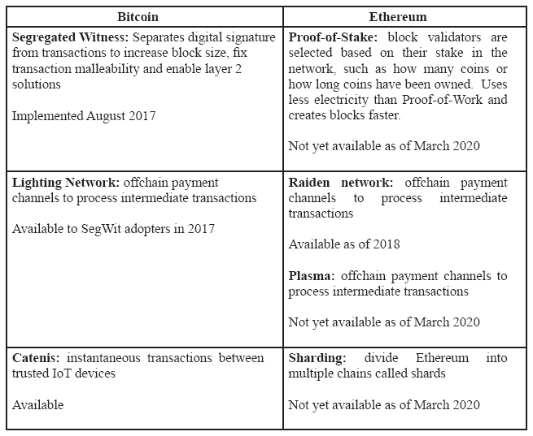

**表 8.1：性能和可扩展性解决方案的例子**

将数字签名移动的另一个后果是，隔离见证使**闪电网络**的使用成为可能。闪电网络追踪链下资金的中间转移，并只将初始信用和最终账户余额转移的价值发布到区块链上。这个解决方案有助于清除区块链上的中间交易。功能上，这就像开了一个酒吧账单。一个人用信用卡担保了一个酒吧账单，点了几杯酒（或者又退了几杯），然后用一次支付来结算最终账单。

并非所有的比特币矿工都欢迎 SegWit。一些矿工不喜欢这种设计，因为它将签名的锚点从嵌入在 Merkle 根部移到了区块中的第一个交易（称为 coinbase 交易），用于奖励获胜的矿工。另一个问题是部署策略：SegWit 作为一次“软分叉”发布，这意味着非 SegWit 采用者仍然可以挖掘比特币。一些矿工认为，作为一次“硬分叉”发布会更好（尽管更困难）（参见词汇表中的“*分叉*”）。在 SegWit 被讨论期间，比特币社区举行了多次紧急会议。SegWit 的采用过程颇为艰难，但最终作为一次软分叉在 2017 年 8 月激活了比特币核心。^(55),^(56) 两年后，大约不到一半的比特币交易使用了 SegWit，这可能是因为人们升级钱包的速度很慢。矿工社区的一个派系（代表约 2000 个节点）决定通过创建一个名为***比特币经典***的硬分叉彻底离开比特币。^(57)

许多其他的比特币创新也得到了发展。例如，安德烈·德·卡斯特罗，区块链物体的首席执行官和创始人，开发了***Catenis***，一个企业应用程序，它构建在比特币之上，允许组织之间的物联网设备进行几乎瞬间的交易。德·卡斯特罗在比特币等公共区块链的交易处理和结算速度之间做出了一个非常重要的区分。^(58) 他说：

*“大多数人并不理解交易处理速度和结算速度之间的区别。比特币在十分钟内结算，但交易速度在毫秒级。如果你拥有两端点，就没有对手方风险，在物联网的情况下可以立即执行。现在，审计师要查看存储在区块链上的信息，不需要立即发生。审计师会问六个月前发生了什么。”*^(59)

关键在于信任发送和接收设备。

将我们的注意力转向以太坊，为“以太坊 2.0”也称为“宁静”计划了许多性能和可扩展性解决方案。^(60) 很难预测具体时间，但以太坊路线图计划分阶段实施解决方案，始于 2020 年（而不是 2019 年，如之前计划的那样）。这些解决方案包括分片、权益证明和用于中间交易的层 2 处理（类似于闪电网络）。

***分片*** 将涉及分割验证过程，以便不是每个以太坊节点都验证每一个交易。如果被采纳，以太坊中的每个“分片”都将像自己的区块链一样行动，但分片将通过智能合约合并到主链上。^(61)

以太坊 2.0 将从工作量证明转移到一个名为 Beacon Chain 的权益证明共识协议。以太坊的联合创始人维塔利克·布特林是推动以太坊转向 PoS 的倡导者。他说：

“**以太坊 1.0 是几个人粗陋的尝试，试图构建一个世界计算机；以太坊 2.0 将真正成为世界计算机。**”^(62)

一种名为 ETH2 的新代币将用于 Beacon Chain，作为验证者的奖励。

***Raiden 网络***是另一种在以太坊之上运行的协议。德国 Brainbot 的首席执行官和创始人 Heiko Hees 推出了 Raiden 网络，作为一个用于以太坊上的微支付的高速网络。^(63) 被描述为与闪电网络类似，基本思想是从所有交易都击中区块链上的共享账本（这是瓶颈）的模式，转变为用户可以私下交换消息并签署价值转让的模式。Raiden 节点通过 API 与以太坊节点连接。因为它们不会添加到区块链上，所以每秒处理数百万个私密交易是可能的。此外，交易费用据说“非常低”。^(64)

**等离子体**是另一种 layer 2 选项。通过等离子体，每个区块中只有一次交易，该交易承诺到当前区块中所有资产的所有者的 Merkle 树的根。等离子体解决了吞吐量问题（每秒更多的交易），但并未解决结算时间。为了提高结算时间，可以在等离子体之上使用**支付通道**。在等离子体区块内，不仅仅列出某人的资产，它是一个由多签名智能合约控制的账本通道；人们可以在纳秒级别进行价值交换。然而，要通过支付通道发送支付，以太坊需要一个互操作性解决方案。^(65)

8.4.2 私有区块链的性能和可扩展性

私有-授权区块链通过限制验证交易所需的节点数量以及允许交易伙伴之间的私有消息和通道，解决了性能和可扩展性挑战。许多授权区块链协议通过分工来创建不同的节点，一些节点可能正在验证交易，而其他节点可能正在对它们的输出进行排序，还有一些节点可能正在将排序的区块添加到账本中。随后，像 Corda、Quorum 和 Hyperledger Fabric 的授权区块链协议可以在几秒钟内结算交易。

截至 2020 年，私有区块链的确切可扩展性是未知的，因为很少有区块链被采用以实现可扩展性。然而，大多数私有区块链声称它们具有高度可扩展性。例如，IBM 在其云数据中心内测试了 Hyperledger Fabric，并报告每秒处理 3,000 笔交易，延迟低于一秒。^(66)

新的创新继续提高性能。例如，***FastFabric*** 旨在将 Hyperledger Fabric 交易从每秒 3,000 提高到 20,000。由滑铁卢大学和马萨诸塞大学的教授开发的 FastFabric 通过将提交者和背书节点的硬件分离；将元数据与交易数据分离；引入并行性和缓存；并将世界状态键值存储移动到轻量级内存存储来提高吞吐量。^(67)

为了基准不同区块链的实际性能，Hyperledger 项目在 2017 年 6 月启动了性能和可扩展性工作组。^(68) 到 2019 年，该组发布了一份工作论文，定义了诸如读取延迟；读取吞吐量；交易延迟；以及交易吞吐量等性能指标。这个组将在变化的一致性协议；节点地理分布；硬件环境（芯片速度和内存）；网络模型（防火墙和瓶颈）；节点数量；软件组件依赖；数据存储类型；和工作负载的条件下测试不同的区块链。^(69)

8.5. 匿名性

在许多公共区块链中，每个交易的发送地址、接收地址和金额对任何可以访问互联网的人都透明。例如，图 8.5 说明了 2016 年 2 月 25 日上午 10:24:44 发生的实际比特币交易示例。公众没有简单的方法来识别交易伙伴，但全世界可以观察到交易发生的时间。^(70)

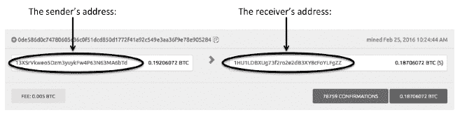

**图 8.5：2016 年 2 月 25 日区块 400000 中发生的比特币交易**

尽管公共区块链是匿名的——在账本上不会透露个人身份——但元模式可能会浮现，其中可能会揭示身份。例如，许多交易用多个地址资助，所以模式可以浮现，一方可以追踪另一方的交易。 图 8.6 说明了这种情况是如何发生的。如果甲方在某一天向乙方拥有的地址发送价值，甲方后来可以确定乙方拥有的额外地址，当乙方花费这些硬币时。因此，将比特币（和以太坊）描述为“伪匿名”更为贴切。中本聪在他的白皮书中有这个认识。中本聪建议为新交易生成新的地址：

*“作为一种额外的防火墙，每个交易应使用新的密钥对，以使它们与共同所有者保持分离。多输入交易不可避免地揭示其输入拥有相同所有者，因此仍然存在一些链接。风险是，如果一个密钥的所有者被揭示，链接可能会揭示属于同一所有者的其他交易。”*^(71)

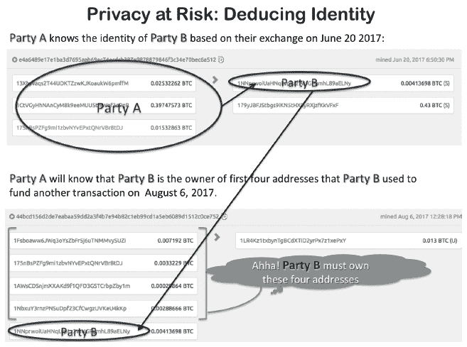

**图 8.6：区块链透明度可能产生的元模式**

开源社区正在努力解决这些问题。我们研究了两种这样的解决方案：零知识证明和 CryptoNotes。

8.5.1 零知识证明

零知识证明（ZKP）是由 Shafi Goldwasser、Charles Rackoff 和 Silvio Micali 在 1985 年开发的。^(72) 零知识证明是一种方法，允许一方在不向其他方透露信息的情况下，向其他方验证其拥有某项信息。通常，零知识证明有两种类型：挑战-响应式和非交互式。

作为一个简单的**挑战-响应式零知识证明**例子，假设 Alice 想向 Bob 证明她知道一个罐子正好装有多少果冻豆而不告诉 Bob 确切数字（见图 8.7）。Alice 可能会让 Bob 在她离开房间后从罐子里取出任意数量的果冻豆。Bob 做出选择后，Alice 重新进入房间，Bob 离开。Alice 重新数果冻豆，并将当前的数量与之前的数量进行比较，以计算 Bob 究竟取出了多少果冻豆（如果有的话）。当 Bob 回来时，Alice 告诉 Bob 他取走了多少果冻豆。如果 Bob 认为 Alice 只是猜对了，那么他们可以一遍又一遍地重复同样的选择。最终，Bob 会被说服，Alice 掌握了确切数量的果冻豆，而无需透露数字。挑战-响应式零知识证明有一些局限性：挑战-响应是对已知方协调的；迭代可能会降低性能；结果是概率性的而不是确定性的，因为 Alice 可能通过猜出正确数字而走运。

**图 8.7：挑战-响应式零知识证明的果冻豆示例**

大多数区块链应用使用了另一种零知识证明（ZNP），称为**非交互式零知识证明**。这种零知识证明（ZKP）无需迭代；某人可以向*公众*证明他们知道某些信息。

证明某人解决了数独谜题是非交互式零知识证明（ZNP）的一个常见例子。^(73) 数独谜题有九行和九列。在谜题中，有九个方格。谜题开始时，有些单元格是填好的（见图 8.8 的左侧）。要解决谜题，必须找到一个独特的解决方案，使得数字 1 至 9 在每个行、列和方格中恰好出现一次（图 8.8 的右侧显示了解决方案）。假设有一个比赛，看谁先解决谜题。假设爱丽丝赢了。爱丽丝可能通过构建一个算法来证明她先解决了谜题，而不必透露解决方案。这个算法从每一行*取数字*并随机打乱它们；从每一列*取数字*并随机打乱它们；以及从每一个方格*内的数字*并随机打乱它们。如果结果显示有 27 组数字，每组包含数字 1 至 9，那么爱丽丝可以证明她解决了谜题，而不必透露解决方案。

在区块链应用中，非交互式零知识证明（ZKP）用于保证交易有效，而不必透露关于发送者、接收者和/或交易的信息。Zcash、Quorum^(75)、EY 的 Nightfall、MediLedger 以及许多其他区块链都使用 ZKP。例如，Zcash 使用名为“zk-SNARK”的加密零知识证明，其代表“零知识简洁非交互式知识论证”。^(76)^,^(77)

**EY 的 Nightfall**是一种智能合约协议，它使用非交互式零知识证明（ZKP）。Nightfall 允许各方在公共区块链（以太坊）上以保护隐私的方式交换代币，通过隐藏发送者、接收者和交易金额来防止双重花费，同时仍能防止双重花费。本质上，Nightfall 是为 ERC-20（同质化）和 ERC 720（非同质化）代币提供的一种保密的托管服务。

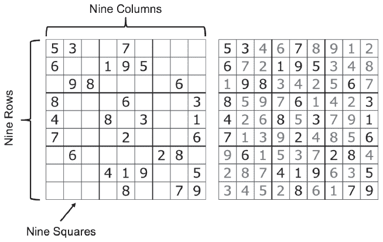

**图 8.8：数独谜题及其解决方案**

*来源：[数独维基百科](https://en.wikipedia.org/wiki/Sudoku)*^(74)

***图的左侧显示了一个填有数字的数独谜题。挑战在于找到一个解决方案，使得数字 1 至 9 在每个行、列和方格中恰好出现一次。图的右侧显示了解决方案。***

在此我们提供了一个高层次的概述，旨在传达原则。假设 Alice 想要将代币 T 发送给 Bob。在交易开始时，Alice 的钱包目前拥有控制区块链上记录的代币 T 的所有权的私钥。为了安全地将代币发送给 Bob，防止 Alice 双重花费，并确保只有 Bob 可以提取（或者如果协议破裂，她可以在 Bob 之前提取），将执行以下步骤：

**1.** Alice 的钱包通过使用她的私钥将代币 T 放入由智能合约（称为屏蔽合约）在区块链上控制的托管中。

**2.** 屏蔽合约控制了代币。

**3.** Alice 的软件使用 Bob 的公钥和只有 Alice 知道的密钥为 Bob 创建一个代币承诺。

**4.** Alice 将 Bob 的代币承诺发送到屏蔽合约。

**5.** Alice 的软件还创建了 Alice 对 Alice 的代币承诺的废除，这样如果 Bob 提取了它，她将不再控制代币。

**6.** Alice 的废除发送到屏蔽合约。

**7.** 离线时，Alice 将秘密密钥、Bob 的代币承诺和代币 ID 发送给 Bob。这个消息是*离链*发生的，因此确保这个消息安全很重要，以防止除 Bob 之外的人使用它。

**8.** Bob 现在可以通过向屏蔽合约证明他知道秘密密钥来获取代币 T。

**9.** 当 Bob 准备好时，他的软件会使用秘密密钥来废除他的代币承诺，并发出一个 PayToAddress 命令，将代币的控制权移交给 Bob 的钱包。

**10.** 当交易完成时，屏蔽合约中的余额为零，Bob 在他的钱包中有控制代币 T 的私钥。Alice 将无法再提取它。

这里似乎有很多步骤，但每个步骤都是必要的。为什么 Alice 不像比特币那样直接将钱发送到 Bob 的钱包中呢？比特币的方式是，接收者无法阻止人们向他们的地址发送价值。在比特币（以及许多公共区块链）中，任何人都可以未经许可向某人的钱包“空投”资金。许多个人希望——企业尤其需要——控制他们的应收账款。Nightfall 实现了这一点；接收者必须主动从屏蔽合约中提取代币。

根据 EY 合伙人/负责人和 US 区块链实践领袖 Chen Zur 的说法：

*“随着夜幕降临，没有人能够知道爱丽丝和鲍勃之间进行了交易。你所知道的是其中一个钱包向另一个钱包发送了一些代币，但无法知道他们之间发生了什么。这就是第一步。我们正在进一步开发这一功能，以包括购买协议的合同规则，例如条款和条件，但现在公开领域内所拥有的是能够在两个钱包之间转移代币而没有人知道发生了什么。”*

截至 2020 年，EY 已经表明，在公共以太坊上运行夜幕比使用传统的私有网络对高价值、低交易量的交易要便宜。一位加拿大客户正在使用它来追踪高价值医疗设备的原产地。^(78)

8.5.2\. 密码币和门罗币

***密码币*** 是另一种在提供比比特币和以太坊更多的隐私的区块链中使用的协议。密码币的交易不能以揭示谁发送或接收货币的方式在区块链上追踪。^(79) 门罗币是使用密码币协议的一个区块链示例。为了了解门罗币的公开区块链上揭示了多么少的信息，请参见 图 8.9。

门罗币使用“环签名”和“键像”来隐藏发送者的地址；使用“匿名地址”（也称为公钥）来隐藏接收者的地址（也称为公钥）；以及“环密文交易”来掩盖金额。这些创新创造了完全的匿名性，但以防止双重花费的方式这样做。

为了理解门罗币是如何工作的，我们将从钱包开始讲解。每个门罗币钱包都有两组私钥-公钥对——一组用于查看，一组用于花费：

• ***查看密钥对*** 包括一个私有的查看密钥和公有的查看密钥。账户所有者需要私有的查看密钥来在区块链上找到与他或她的钱包地址相关的交易。

• ***花费密钥对*** 包括一个私有的花费密钥和公有的花费密钥。私有的花费密钥只能使用一次，这意味着如果有人想要从一个地址花费货币，就必须花费所有的货币。正如我们将看到的，这种架构有助于防止双重花费。

门罗币地址是公有的花费密钥和公有的查看密钥的连接。

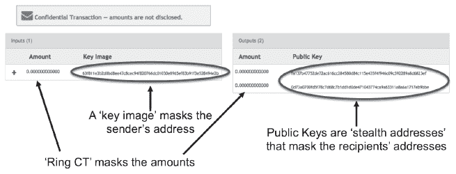

**图 8.9: 一个门罗币交易的示例**^(80)

让我们通过一个交易来看看这些算法是如何工作的。假设艾丽丝想向鲍勃发送四个门罗币。她的数字钱包将选择一个包含超过四个门罗币的地址，因为艾丽丝需要向门罗币矿工提供一个小额交易费。钱包选择了包含十个门罗币的地址。再次强调，协议要求这十个性罗币必须在交易中消耗。所以，对于这笔交易，钱包将把钱发送到两个地址：鲍勃的地址和艾丽丝 3.99 门罗币找零的新地址（所以矿工得到 0.01 门罗币）。

为了创建交易的输入端，艾丽丝的钱包使用了唯一存储在她钱包中的与公共支付密钥关联的私付密钥。为了为鲍勃创建交易的输出端，艾丽丝需要鲍勃的地址（由鲍勃的公共支付密钥和公共视图密钥组成）。这些将被用来为鲍勃创建一个新的“一次性支付”的公共密钥。这个公共密钥作为鲍勃的“隐形地址”，用来隐藏鲍勃的真实地址。艾丽丝也将为她的找零获得一个新的地址（见图 8.9 的右侧）

为了处理交易，门罗币通过创建一个由艾丽丝的签名和从区块链中存储的过去门罗币交易中选择的一组伪装组成的“环签名”，来隐藏艾丽丝的身份（或者更具体地说，隐藏她的公共支付密钥）。从艾丽丝发送的输出中派生出一个“键像”，但对于外部人来说，要确定哪个地址产生了键像是无法知道的（见图 8.9 的左侧）。对于外部人来说，任何一个伪装都可能使用它们的私钥签署交易并创建键像，但实际上只有艾丽丝做到了。 (注：伪装越多，消耗的资源越多，因此需要更高的费用来激励矿工包含这笔交易。)

为了防止双重花费，矿工只需要确保键像在区块链上 nowhere else 出现。因此，键像是门罗币确保私钥以前没有用来花费该金额的主要方式。

那么鲍勃的钱包是如何找到艾丽丝发送的钱，如果它不在区块链上可见呢？鲍勃的钱包使用他的私视图密钥扫描区块链以找到输出。由于新公共支付地址的一部分包含了鲍勃发送给艾丽丝的公共视图密钥，所以私视图密钥对可以找到交易并声称它。一旦找到输出，它被检索并放入鲍勃的钱包中。然后，他的钱包计算出一个与公共支付密钥对应的一次性私付密钥。只有他可以用他的钱包的私付密钥花费它。

最后，为了隐藏金额，门罗币使用“环密文交易”或“RingCT”。这个协议使用一个“范围证明”向矿工证明交易的输入等于输出，但矿工不知道两者 values 的值。

虽然零知识证明和 CryptoNotes 能够在一定程度上隐藏发送者、接收者和金额，但区块链协议并不是匿名性的唯一威胁。如果钱包通过互联网进行交易，消息将包含其他揭示性信息，比如 IP 地址。为了真正实现匿名，发送者和接收者需要使用一个能够隐藏 IP 地址的网络，比如 Tor 或 Invisible Internet (IP2)协议。例如，非法市场网站 Silk Road 选择了比特币作为其支付应用，并使用 Tor 作为其网络（参见词汇表中的“*Silk Road*”故事）。

8.6. 机密性

“*问题在于，一些公司担心收集用于区块链的信息会被用于其他目的。比如说我是一家药店。如果我验证了我手头所有的产品，我就在宣布我的库存。公司担心这种额外的智能可能会被用于其他目的，比如合同谈判等。*”

**鲍勃·塞莱斯特，供应链研究中心的首席执行官和创始人**^(81)

从公共的、无需权限的区块链转向私有的、需要权限的区块链，我们显然不能允许交易伙伴之间存在匿名性。规定要求企业了解其客户、员工和供应商的身份。然而，企业担心机密性。当大家共享一个区块链应用时，我们如何允许一些人查看交易，同时防止另一些人查看交易呢？第三章已经以***Quorum***为例介绍了解决方案。在 Quorum 中，参与者可以执行私人和公共智能合约，使得账本被分割成私有状态数据库和公共状态数据库。^(82) 在一个账本中，所有节点都可以查看 Quorum 的公共状态，但只有参与私有合约的节点才能查看私有状态。

***Hyperledger Fabric*** 使用了通道的概念。通道提供了一种数据分区能力，这样只有那些被授权使用通道的各方才能看到它。^(83) 机密交易使用只有其发起者、验证者和授权审计者才知道的秘密密钥进行加密。智能合约（在 Fabric 中称为 Chaincode）定义了通道的各方以及资产可以在通道账本上创建和修改的规则（参见图 8.10）。^(84)

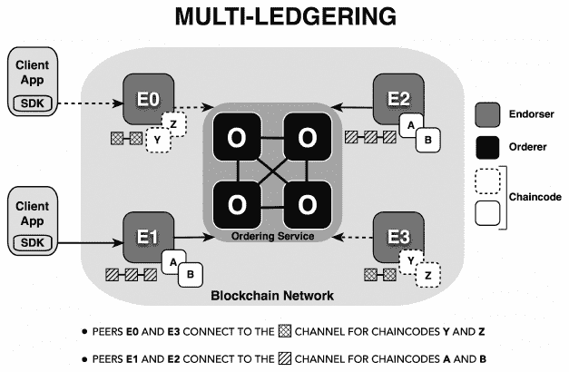

**图 8.10：Hyperledger Fabric 中的通道**

来源：[`www.altoros.com/blog/wp-content/uploads/2017/04/hyperledger-fabric-v1-general-availability-multi-ledgering-`](https://www.altoros.com/blog/wp-content/uploads/2017/04/hyperledger-fabric-v1-general-availability-multi-ledgering-)

***Fabric 允许各方使用软件开发工具包（SDK）来编码智能合约——称为链码——以创建不同协议的单独账本。***

8.7. 互操作性

“区块链需要与不同的 ERP 系统集成。如果你没有真正增加价值或者你无法做出业务决策，那么你拥有伟大的区块链用例实际上并不重要。”

**Rahul Shah，Axiom Technology Group 战略经理**^(85)

“构建一个作为所有其他链的桥梁的链链，并实现一个层，通过这个层，整个区块链空间可以将他们的流量路由，以实现更好的通信，这是痛苦地缓慢和复杂。”

**Lucasxhy, 区块链博主**^(86)

互操作性是一个系统使用另一个系统的能力。在所有技术挑战中，互操作性是最重要的问题，需要解决以真正实现“价值互联网”。^(87) 很明显，区块链互操作性需要无缝互联：

• 多个公有区块链（例如 Bitcoin 和 Ethereum）

• 多个私有区块链（例如 Hyperledger Fabric 和 R3）

• 公有和私有区块链（例如 Ethereum 和 Hyperledger Fabric）

• 与遗留系统相结合的区块链（例如 MediLeder 和 SAP；Ripple 和 SWIFT）

有许多区块链互操作性项目（参见图 8.11）。传统的公司如 Accenture 和 IBM；初创公司如 Aion、Cosmos 和 Polkadot；以及区块链财团如 Hyperledger 项目，都有在进行互操作性项目。

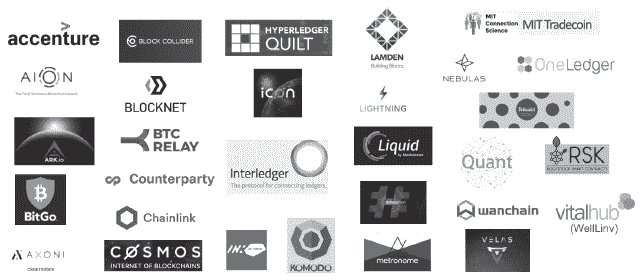

**图 8.11：区块链互操作性项目**

互操作性需求包括：^(88)

• **“全或无”原子性：** 一个互操作性解决方案应确保与跨链交易相关的*所有*操作执行，或者*所有*操作应失败；不应允许部分执行。例如，如果 Alice 在她的链 A 上记录她的资产，并且她想将一些价值发送给在链 B 上记录他资产的 Bob，一个互操作性解决方案应确保（a）Alice 的账户被扣减 AND Bob 的账户被增加，或者（b）两个动作都不发生。

• **普遍性：** 互操作性解决方案应具有普遍性，不要求为每个新链构建定制的程序。

• **无需可信第三方（TTPs）：** 互操作性解决方案不应依赖于中心化的可信第三方。如果需要这个标准，将消除依赖于公证人（下面解释）的互操作性解决方案。

• **源代码可用性：** 互操作性解决方案的源代码应可供审计，以便评估其他标准。

• **开发者和用户友好：** 互操作性解决方案应易于开发者使用，无缝对接最终用户。

所有互操作性方法都是通过应用程序编程接口（API）进入应用的（参见术语表）。

8.7.1. 连接区块链的三种方式

连接两个或多个区块链有三种常见方式：

**1. 一次性资产通道**，其中一个资产在链 A 上“销毁”后再在链 B 上“创建”。

**2. 跨链预言机**，其中一个链需要从另一个链读取数据。单向读取也被称为“单向挂钩”。

**3. 跨链交易处理**，当两个或多个区块链想要协调操作，使得单一资产可以被多个链使用时。这也被称作“双向挂钩”。

在这三种方式中，跨链交易处理是互操作性的圣杯；前两种相对容易实现。

一次性资产通道

企业希望有能力切换区块链解决方案。为了退出一个区块链应用，企业将希望将那些资产导出到新的解决方案中。由于数字账本是不可变的，技术上如何实现呢？一种方法是在一个区块链上“燃烧”资产，然后在不同区块链上重新创建它（参见图 8.15）。证明燃烧是一种算法，它将价值发送到一个可以验证为无法花费的地址，从而在链上永久锁定该价值。对于比特币，这是通过使用交易脚本语言确保价值永远无法赎回来实现的。例如，将“交易输出”设置为仅当 2=3 时执行。^(89) 这当然没有解决切换区块链解决方案的其他需求，例如获取所有创建最终状态值的先前交易。

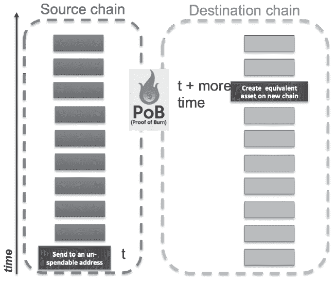

**图 8.12. 证明燃烧是“销毁”一个区块链上的资产并在另一个区块链上“重建”它们的一种方式**

跨链预言机

跨链预言机是一个从一条链向另一条链单向读取数据的机制。术语**预言机**指的是源链上需要的外部数据，以便在目标链上执行某些操作。**BTC Relay** 是第一个跨链预言机之一。BTC Relay 允许在以太坊平台上开发的应用程序的用户使用比特币支付。由约瑟夫·周开发，BTC Relay 是一个于 2016 年 5 月部署在以太坊区块链上的开源智能合约。^(90) 开源社区对此表现出极大的热情，并将其视为中本聪的**简单支付验证（SPV）**的一个重要应用。^(91)（SPV 证明如下并在术语表中解释。）

比特币中继（BTC Relay）在以太坊内部存储比特币区块链的头部，从而保持整个比特币区块链的迷你版本。以太坊内的应用程序开发者可以查询比特币中继以验证比特币网络上的交易。92 比特币中继无需信任第三方即可自动执行。比特币中继在如何激励人们不断向智能合约添加新的比特币区块方面非常有趣，平均每十分钟一次。提交新比特币区块头的“中继者”在其他开发者查询比特币中继以验证交易时会获得小额交易费。93 本质上，比特币中继是一个“程序”，从一个链中读取以“证明”存在，然后作为“真/假”或在以太坊平台上的一个值使用。

尽管比特币中继在 2016 年引起了轰动，但 2020 年没有最近的交易。94 这可能是由于竞争加剧（尤其是在开源市场）和提供替代预言机（例如*[`docs.oraclize.it/#home`](http://docs.oraclize.it/#home)*）的原因，这些预言机不仅仅是固定比特币，还提供其他经过“验证”的外部资源。随着内置底层基础的跨链 API（例如 Hyperledger 和以太坊的集成）的出现，这种中继可能在未来不再需要。

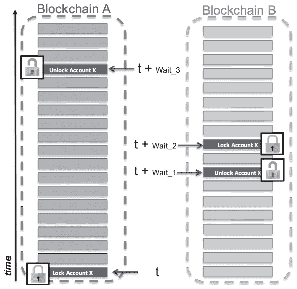

图 8.13：跨链交易中的区块链时延

在时间 t，链 A 锁定链 A 上的地址并指示链 B 上的一个地址。那笔交易需要链 A 节点达成共识的时间。等待之后，链 B 在链 B 上创建等量的资产。（资产不会跨链移动，而是用链 B 上的等值资产替换）。链 B 执行其交易，锁定地址，并指示链 A 上的地址。链 B 节点达成共识还需要一些时间。等待之后，链 A 解锁该地址，资产再次处于其控制之下。

跨链交易处理

对于跨链交易处理，需要双向挂钩。具有双向挂钩时，必须在源链上“锁定”资产，然后才能在目标链上采取行动。当目标链完成处理时，它在目标链上锁定资产，使源链可以再次控制资产（参见图 8.13）。

我们已经介绍了三种连接区块链的方法。接下来，我们将探讨三种区块链互操作性的技术策略。

8.7.2 节：互操作性的技术策略

2016 年，R3 区块链联盟委托以太坊的发明者 Vitalik Buterin 调查区块链互操作性的策略。95 他描述了三种区块链互操作性策略：

**1. 公证人：一个第三方或多个方协调跨链操作。**^(96)

**2. 侧链/中继**：一个区块链内的智能合约自动验证并在另一个区块链中读取事件。

**3. 哈希锁定**：两个或更多区块链使用相同的哈希触发协调操作。操作还可以通过在共享哈希功能中添加超时特性来协调，创建所谓的哈希时间锁定合约（**HTLCs**）。

公证人

公证人是连接两个或更多区块链的最简单方式。公证人控制两个链上的锁。公证人必须为其连接的所有链运行全节点（运行软件并存储整个账本）。这确保公证人尽可能快地获取交易并拥有整个交易集的可见性。公证人可能依赖单一的保管人或多保管人。***单一公证人***使用一个可信的第三方连接两个或更多区块链（见图 8.14）。

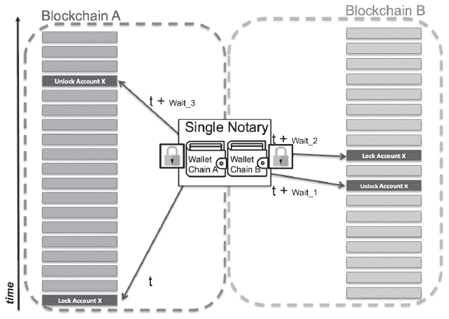

**图 8.14: 单一公证人**

*来源：图根据 Lerner (201)改编而成*^(97)

***在此图中，一个中心化交易所为两个链运行全节点。它控制存储在两个链上的地址的钱包和锁。这是最简单的互操作性解决方案，但依赖于信任一个中心化方。***

交易所是单一公证人的常见示例。交易所允许用户轻松买卖加密货币，以及交换加密货币和法定货币；但这种便利是以接受和信任中心化控制为代价的，并伴随着单点故障的风险。网络犯罪分子针对交易所，因为大量价值存储在一个地方，形成了一个大蜜罐。

Accenture 的互操作节点

在受许可的空间中，Accenture 的“互操作节点”充当一个可信的公证人。根据 Accenture 的一份白皮书，一个可信的互操作节点位于目标分布式账本系统之间（见图 8.15）。Accenture 首先在 R3 Corda、Digital Asset、Quorum 和 Hyperledger Fabric 之间创建互操作节点。创建节点的进程始于两个区块链应用的领导层。领导层定义可接受的业务规则、政策、标准和治理。这些理解被用作 Accenture 根据商定的业务逻辑创建集成协议的输入。Accenture 拿着集成协议配置一个处理资产锁定并防止双重消费的互操作节点。^(98)

服务在 2018 年 10 月进行了测试。具体来说，Accenture 展示了 R3 Corda 与 Digital Asset 之间以及 Hyperledger Fabric 与 Quorum 之间的信息共享。^(99)

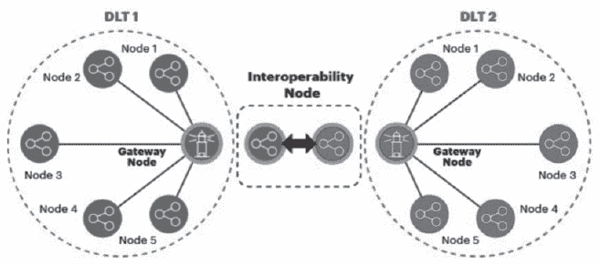

**图 8.15: Accenture 的互操作节点**

来源：Treat 等人（2018）^(100)*

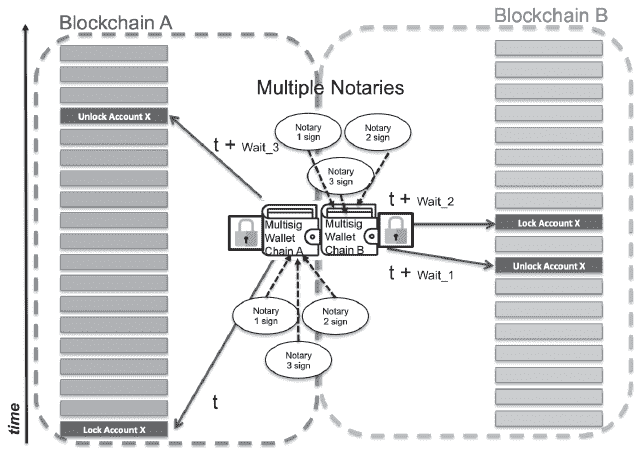

**图 8.16：多个证明人**

来源：图改编自 Lerner（2016）^(105)*

***在这张图中，一个交易所为两个区块链运行完整节点。它持有存储在两个链上的钱包和锁，但只有在联邦成员中的 n 个中的 m 个签名后，资金才会被释放。这是一个简单的互操作性解决方案，但依赖于对联邦的信任。***

**多签名证明人，** 或者联邦，依赖于多个独立托管人（参见图 8.16）。多签名地址需要多个用户签署交易，然后才能将其广播到区块链网络。^(101) 这种方法比单一证明人更安全，但信任仍然集中在少数实体手中。通常，算法要求多数证明人验证交易或事件。更具体地说，联邦要求“*n* 个中的*m* 个”成员签署交易。

***BitGo*** 是第一个多签名钱包，于 2013 年 8 月推出。BitGo 钱包需要三个签名中的两个，其中 BitGo 是其中一个签署人。2015 年，交易所 Bitfinex 采用了 BitGo，为其所有客户提供 BitGo 的多签名钱包。2016 年，Bitfinex 遭到黑客攻击，犯罪分子使用钥匙从交易所窃取了 6000 万美元。^(102) 自那不幸的事件以来，BitGo 恢复了过来，并达到了许多里程碑，包括为 100 种货币提供多签名钱包。^(103) 到 2020 年，BitGo 作为托管人管理着超过 20 亿美元的数字资产，这些资产由伦敦劳埃德保险公司的 1 亿美元保单保险。^(104)

侧链/中继

侧链和中继提供了证明人的功能，但依赖自动执行算法而非托管人。Back 等人（2014）首次构想出“挂钩侧链”作为一种方式，使比特币和其他账本资产能够在多个独立区块链之间转移。^(106)对这些作者来说，侧链是对父链（或主链）的双向挂钩，允许资产以预定的比率进行交换。但这个术语是相对于资产而非网络的。因此，Vitalik Buterin 在他的互操作性白皮书中对“侧链”这个术语表示遗憾。他认为使用“*“链 A 的传输在链 B 上存在”*”或“*D 是一个具有主账本 A 的跨链可移植数字资产，也可以在链 B 上使用。”*”这个表述更好。^(107)

根据 Back 等人（2014）的观点，侧链应当：

• 与主链并行运行

• 允许自由地在主链之间移动

• 设置防火墙，使一个链上的盗窃不能在另一个链上复制

• 允许不同的共识算法

• 与主链完全独立

• 快速且高效^(108)

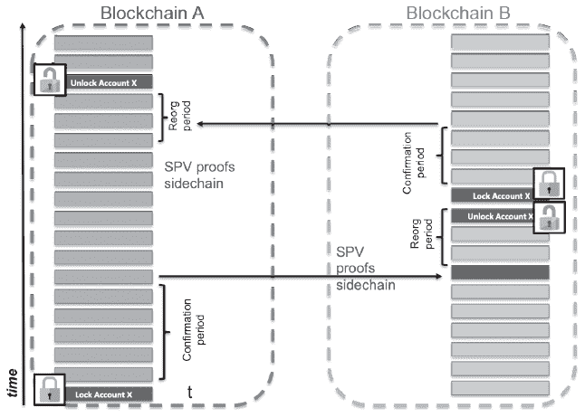

**图 8.17：使用简单支付验证（SPV）证明的跨链交易**

*来源：图改编自 Lerner (2016)*^(111)

***SPV 证明会自动运行，因此不依赖于第三方信任机构（TTPs）。链 A 锁定资产，然后必须等待交易结算，并在其上方创建更多有效的区块，这样各方才能确信他们正在处理最长的，也是因此最有效的链。确认期过后，可以向链 B 提交 SPV 证明。链 B 现在必须等待，这段时间称为“重组期”。可能会有另一方提交与先前 SPV 证明相矛盾的 SPV 证明。链 B 将选择最长的链的 SPV。一旦确信 SPV 证明是有效的，它将在链 B 上解锁资产，执行交易，锁定资产，并在发送 SPV 证明回链 A 之前等待交易结算。***

***Liquid*** 是比特币区块链的一个联邦侧链示例。由 Blockstream 开发，它允许成员在几秒钟内结算比特币交易。根据其网站，成员联邦包括来自四大洲九个国家的交易所、交易员和金融机构。^(109)

许多侧链/中继使用中本聪的***简单支付验证***（SPV）。这个想法是，有人可以证明他们的交易包含在一个有效的区块中，并且许多其他有效的区块建立在其之上。中本聪（2008）将 SPV 描述为一种无需运行完整网络节点即可验证比特币交易的方法。实际上，只需要维护一个区块头的副本，然后找到到交易的安全链接——称为***Merkle 树***分支（参见词汇表）——以证明它已被网络验证和接受。SPV 表明“代币已在一条链上锁定，验证者可以在另一条链上安全地解锁等值的价值。’^(110) 图 8.17（#f_8_17）说明 SPV 证明可以用来协调跨链交易，而不依赖于公证人，而是仅依赖于算法证明。

Hash-Time Locked Contracts (HTLC)

哈希时间锁定合约（HTLC）是协调两个区块链之间事务的一种巧妙方式，它依赖于相同的数据触发器，称为“秘密密钥”、“私钥”或“预图像”。图 8.188.18 展示了它是如何工作的。爱丽丝在一个区块链上启动一个智能合约，将价值锁定在带有秘密密钥哈希的地址上，以便有两种情况之一发生：接收者鲍勃要么使用秘密密钥（这是“哈希锁”）和他的数字签名从地址中提取价值，要么合约到期并将价值退还给爱丽丝（这是“时间锁”）。那么鲍勃如何安全地获取秘密密钥呢？鲍勃在他的链上创建一个智能合约，并使用相同的秘密密钥哈希锁定价值。爱丽丝必须透露秘密密钥（以及她的数字签名）以解锁鲍勃合约中的价值。发生这种情况时，鲍勃的智能合约学会了秘密密钥并使用它来解锁爱丽丝智能合约中的价值。这是一个简单而天才的解决方案，消除了对手方风险。

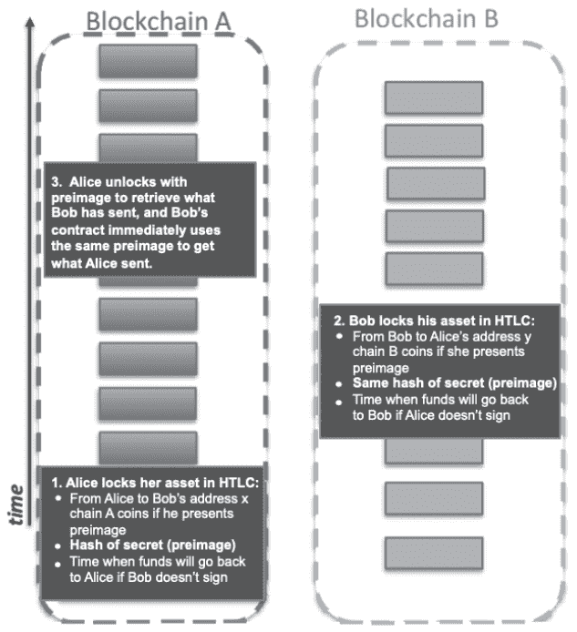

**图 8.18：哈希时间锁定合约（HTLC）的概念渲染**

跨链支付协议

跨链支付协议（ILP）支持哈希时间锁定合约（HTLC）。两名 Ripple 工程师在 2015 年发表了关于 ILP 的白皮书。对于每一次支付，ILP 协议通过在微支付之间发送带有确认的许多微支付，以最小化节点通过网络窃取或未能发送支付的风险（参见图 8.198.19）。ILP 使用“加密托管”来“在满足条件的情况下锁定资金，以允许通过不可信连接进行安全的支付”。112>对于每一次交易，ILP 识别三种参与者类型：发送者、路由器和接收者。路由器（也称为“连接器”）是寻找发送者和接收者之间的信任路径的节点。节点在路径之间使用相同的哈希锁进行 HTLC。</a>113”（想要了解 HTLC 如何通过端到端交易流动的详细示例，请参见<a href="https://interledger.org/rfcs/0022-hashed-timelock-agreements/">https://interledger.org/rfcs/0022-hashed-timelock-agreements/</a>。）

尽管使用了 HTLC，但仍然需要对每个与之交互的账本（区块链）更新和安装 Interledger 模块。这意味着随着新平台上线，如果它们没有遵循协议识别的标准，则需要添加一个。

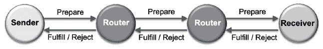

**图 8.19：跨链支付协议**

**来源：[`interledger.org/overview.html`](https://interledger.org/overview.html)**

**一个聚合支付被分成多个微支付。每个微支付通过网络路由，并且在发送下一个微支付之前必须收到履行确认。**

超级账本 Quilt

Quilt 是 Hyperledger Project 伞下的一个互操作性项目，旨在实施 ILP 协议。根据其网站：

*“Hyperledger Quilt 通过实施 Interledger 协议（也称为 ILP）提供了账本系统之间的互操作性。”*

成立于 2017 年的 Hyperledger Quilt v1.0 于 2019 年 10 月发布。^(114)

***给管理者的教训：企业将需要构建或获取能够理解如何连接区块链和企业系统的技术架构技能。**.*

一些区块链架构师的薪水在 20 万美元至 40 万美元之间，所以要做好支付的准备。

8.8. 结论

因此，我们概述了截至 2020 年的主要技术挑战和新兴解决方案。许多人正在努力使区块链更加安全、更加私密、速度更快、可扩展且互操作。管理者需要意识到技术风险，但他们的关注点应该放在我们最后一章中讨论的思维转变、战略和行动原则问题上。

引用

^(1) Castillo, M. (2017 年 1 月 3 日), *State Street 的区块链战略：2017 年大胆且宏伟*, [`www.coindesk.com/state-streets-blockchain-strategy-big-and-bold-for-2017/`](https://www.coindesk.com/state-streets-blockchain-strategy-big-and-bold-for-2017/)

^(2) 2017 年与 Mary Lacity 的个人访谈

^(3) 2017 年与 Mary Lacity 的个人访谈

^(4) 2017 年与 Mary Lacity 的个人访谈

^(5) Tapscott, D. 和 Tapscott, A (2016), *区块链革命*, 皮尔格出版社，纽约市

^(6) [以太坊能源消耗](https://digiconomist.net/bitcoin-energy-consumption)

[以太坊能源消耗](https://digiconomist.net/ethereum-energy-consumption)

^(7) Tuwiner, J. (2019 年 12 月 20 日), *比特币挖矿池*, [`www.buybitcoinworldwide.com/mining/pools/`](https://www.buybitcoinworldwide.com/mining/pools/)

^(8) Sedgwick, K. (2017 年 12 月 21 日), *这些是美国比特币挖矿成本最低的五个州*, [`news.bitcoin.com/these-are-the-five-cheapest-us-states-for-bitcoin-mining/`](https://news.bitcoin.com/these-are-the-five-cheapest-us-states-for-bitcoin-mining/)

Sharma, R. (2018 年 2 月 21 日). *比特币挖矿最佳五个州（以及最差的一个）*. [`www.investopedia.com/news/five-best-states-bitcoin-mining-and-worst/`](https://www.investopedia.com/news/five-best-states-bitcoin-mining-and-worst/)

^(9) [`www.ezblockchain.net/blog.html`](https://www.ezblockchain.net/blog.html)

^(10) 2017 年与 Mary Lacity 和 Kate Moloney 的个人访谈

^(11) 2018 年与 Mary Lacity 的电子邮件访谈

^(12) 2017 年与 Mary Lacity 和 Kate Moloney 的个人访谈

13 Thompson, P. (2020 年 1 月 5 日). [`cointelegraph.com/news/most-significant-hacks-of-2019-new-record-of-twelve-in-one-year`](https://cointelegraph.com/news/most-significant-hacks-of-2019-new-record-of-twelve-in-one-year), *CoinTelegraph*, [`cointelegraph.com/news/most-significant-hacks-of-2019-new-record-of-twelve-in-one-year`](https://cointelegraph.com/news/most-significant-hacks-of-2019-new-record-of-twelve-in-one-year)

14 Shrem, C. (2019

15 *恒星币和瑞波币被黑：Justcoin 施以援手*, 2014 年 10 月 14 日, [`cointelegraph.com/news/stellar-and-ripple-hacked-justcoin-to-the-rescue`](https://cointelegraph.com/news/stellar-and-ripple-hacked-justcoin-to-the-rescue)

16 Kaul, K. (2018 年 9 月 23 日). *比特币代码中“高严重性”漏洞能够导致加密货币崩溃—已被发现并修复*, LiveBitcoinNews, [`www.livebitcoinnews.com/high-severity-bug-in-bitcoin-code-capable-of-crashing-the-cryptocurrency-detected-and-fixed/`](https://www.livebitcoinnews.com/high-severity-bug-in-bitcoin-code-capable-of-crashing-the-cryptocurrency-detected-and-fixed/)

17 Segal, D. (2016 年 6 月 25 日), *理解 DAO 攻击*, [`www.coindesk.com/understanding-dao-hack-journalists/`](http://www.coindesk.com/understanding-dao-hack-journalists/)

18 Diedrich, H. (2016), *以太坊：区块链、数字资产、智能合约、去中心化自治组织*, Wildfire 出版社。

19 Segal, D. (2016 年 6 月 25 日), *理解 DAO 攻击*, [`www.coindesk.com/understanding-dao-hack-journalists/`](http://www.coindesk.com/understanding-dao-hack-journalists/)

20 Segal, D. (2016 年 6 月 25 日), *理解 DAO 攻击*, [`www.coindesk.com/understanding-dao-hack-journalists/`](http://www.coindesk.com/understanding-dao-hack-journalists/)

21 Morisander (2018 年 3 月 23 日). *历史上最大的智能合约攻击案，或如何危及高达 22 亿美元的资金*, Medium, [`medium.com/solidified/the-biggest-smart-contract-hacks-in-history-or-how-to-endanger-up-to-us-2-2-billion-d5a72961d15d`](https://medium.com/solidified/the-biggest-smart-contract-hacks-in-history-or-how-to-endanger-up-to-us-2-2-billion-d5a72961d15d)

22 Karol (2018 年 2 月 19 日). *PoWH Coin: What Happened To PoWHCoin Cryptocurrency?* [`bitcoinexchangeguide.com/powh-coin/`](https://bitcoinexchangeguide.com/powh-coin/)

^(23) Morisander (2018 年 3 月 23 日). 《历史上最大的智能合约攻击案，以及如何危及高达 22 亿美元的资金》[`medium.com/solidified/the-biggest-smart-contract-hacks-in-history-or-how-to-endanger-up-to-us-2-2-billion-d5a72961d15d`](https://medium.com/solidified/the-biggest-smart-contract-hacks-in-history-or-how-to-endanger-up-to-us-2-2-billion-d5a72961d15d)

^(24) AnChain.AI (2018 年 8 月 22 日). 《揭露一起 1800 万美元的智能合约漏洞》[`medium.com/@AnChain.AI/largest-smart-contract-attacks-in-blockchain-history-exposed-part-1-93b975a374d0`](https://medium.com/@AnChain.AI/largest-smart-contract-attacks-in-blockchain-history-exposed-part-1-93b975a374d0)

^(25) Tuwiner, J. (2017 年 7 月 13 日), 《比特币挖矿池》[`www.buybitcoinworldwide.com/mining/pools/`](https://www.buybitcoinworldwide.com/mining/pools/)

^(26) Emin Gün Sirer 的演讲，《什么可能会出错？当区块链失败时》，2017 年 4 月 18 日商业区块链会议, [`www.technologyreview.com/s/604219/blockchains-weak-spots-pose-a-hidden-danger-to-users/`](https://www.technologyreview.com/s/604219/blockchains-weak-spots-pose-a-hidden-danger-to-users/)

^(27) BitcoinChaser (2017 年 9 月 21 日), 《中国的比特币挖矿控制阴谋》[`bitcoinchaser.com/chinese-bitcoin-mining-takeover-conspiracy/`](http://bitcoinchaser.com/chinese-bitcoin-mining-takeover-conspiracy/)

^(28) BitcoinChaser (2017 年 9 月 21 日), 《中国的比特币挖矿控制阴谋》[`bitcoinchaser.com/chinese-bitcoin-mining-takeover-conspiracy/`](http://bitcoinchaser.com/chinese-bitcoin-mining-takeover-conspiracy/)

^(29) 加密货币挖矿博客（2017 年 4 月 27 日），《BitMain 因 Antbleed 后门再次陷入丑闻》[`cryptomining-blog.com/8634-bitmain-up-for-another-scandal-with-antbleed-backdoor/`](http://cryptomining-blog.com/8634-bitmain-up-for-another-scandal-with-antbleed-backdoor/)

^(30) Rowley, J. （2017 年 4 月 27 日），《交易员在很大程度上摆脱了“Antbleed”比特币后门丑闻的紧张局势》，[`news.crunchbase.com/news/tensions-persist-traders-largely-shake-off-antbleed-bitcoin-backdoor-scandal/`](https://news.crunchbase.com/news/tensions-persist-traders-largely-shake-off-antbleed-bitcoin-backdoor-scandal/)

^(31) Gencer, A.E.，Basu, S.，Eyal, I.，Renesse, R. cen 和 Sirer, E.G （2018 年 1 月 15 日），《比特币与以太坊的去中心化》，[`arxiv.org/pdf/1801.03998.pdf`](https://arxiv.org/pdf/1801.03998.pdf)

^(32) Avan-Nomayo, O. （2018 年 5 月 29 日）。《第三次打击？Verge 遭受第三次疑似 51%攻击》，比特币主义，[`bitcoinist.com/strike-three-verge-suffers-third-suspected-51-percent-attack/`](https://bitcoinist.com/strike-three-verge-suffers-third-suspected-51-percent-attack/)

^(33) Hertig, A. （2018 年 6 月 5 日）。《Verge 的区块链攻击值得再次关注》。Coindesk，[`www.coindesk.com/verges-blockchain-attacks-are-worth-a-sober-second-look`](https://www.coindesk.com/verges-blockchain-attacks-are-worth-a-sober-second-look)

^(34) Horizen（2018 年 6 月 8 日）。《ZenCash 关于双重花费交易的声明》。[`blog.horizen.global/zencash-statement-on-double-spend-attack/`](https://blog.horizen.global/zencash-statement-on-double-spend-attack/)

^(35) Martin, J. (January 27, 2020). *比特币黄金区块链遭遇 51%攻击，导致 70,000 美元的双重支出*, CoinTelegraph, [`cointelegraph.com/news/bitcoin-gold-blockchain-hit-by-51-attack-leading-to-70k-double-spend`](https://cointelegraph.com/news/bitcoin-gold-blockchain-hit-by-51-attack-leading-to-70k-double-spend)

^(36) Varsheney, N. (May 30, 2018). *PoW 加密货币的 51%攻击成本是多少*, [`thenextweb.com/hardfork/2018/05/30/heres-how-much-it-costs-to-launch-a-51-attack-on-pow-cryptocurrencies/`](https://thenextweb.com/hardfork/2018/05/30/heres-how-much-it-costs-to-launch-a-51-attack-on-pow-cryptocurrencies/)

^(37) Zmudzinski, A. (January 13, 2019). *以太坊经典 51%攻击者据称向加密货币交易所退还了 100,000 美元*, CoinTelegraph, [`cointelegraph.com/news/ethereum-classic-51-attackers-allegedly-returned-100-000-to-crypto-exchange`](https://cointelegraph.com/news/ethereum-classic-51-attackers-allegedly-returned-100-000-to-crypto-exchange)

^(38) Sharma, N. (November 5^(th) 2017), *量子计算对区块链技术构成生存威胁吗？* [`singularityhub.com/2017/11/05/is-quantum-computing-an-existential-threat-to-blockchain-technology/`](https://singularityhub.com/2017/11/05/is-quantum-computing-an-existential-threat-to-blockchain-technology/) - sm.00009y4jmx95sdww11rov5gdjdlzo

^(39) Schneier, B. (2015), *NSA 后量子世界的计划*, [`www.schneier.com/blog/archives/2015/08/nsa_plans_for_a.html`](https://www.schneier.com/blog/archives/2015/08/nsa_plans_for_a.html)

^(40) Sharma, N. (2017 年 11 月 5 日), *量子计算对区块链技术构成生存威胁吗？* [`singularityhub.com/2017/11/05/is-quantum-computing-an-existential-threat-to-blockchain-technology/`](https://singularityhub.com/2017/11/05/is-quantum-computing-an-existential-threat-to-blockchain-technology/) - sm.00009y4jmx95sdww11rov5gdjdlzo

^(41) 2020 年 2 月 20 日与 Mary Lacity 的电子邮件访谈。

^(42) Diedrich, H. (2016 年), *以太坊：区块链、数字资产、智能合约、去中心化自治组织*, Wildfire 出版社。

^(43) 2017 年与 Mary Lacity 的个人访谈

^(44) [`etherscan.io/chart/blocktime`](https://etherscan.io/chart/blocktime)

^(45) SWIFT 金融流量与数据，[`www.swift.com/about-us/swift-fin-traffic-figures`](https://www.swift.com/about-us/swift-fin-traffic-figures)

^(46) *比特币与以太坊对比特币和 PayPal - 每秒交易次数*，Altcoin Today，2017 年 4 月 22 日，[`www.altcointoday.com/bitcoin-ethereum-vs-visa-paypal-transactions-per-second/`](http://www.altcointoday.com/bitcoin-ethereum-vs-visa-paypal-transactions-per-second/)

^(47) BBC 新闻（2017 年 12 月 5 日），*CryptoKitties 热潮减缓了以太坊上的交易速度*，[`www.bbc.com/news/technology-42237162`](http://www.bbc.com/news/technology-42237162)

Wong（2017 年 12 月 4 日），*由于人们争相在以太坊区块链上购买卡通猫，以太坊网络变得拥堵*，`qz.com/1145833/cryptokitties-is-causing-ethereum-network-congestion/?utm_source=MIT

^([48`) Sfox（2019 年 5 月 24 日）。*以太坊 2.0：以太坊未来三年的样子*，[`blog.sfox.com/ethereum-2-0-what-the-next-three-years-of-ethereum-will-look-like-b366a46f9704`](https://blog.sfox.com/ethereum-2-0-what-the-next-three-years-of-ethereum-will-look-like-b366a46f9704)

^(49) 这个网站跟踪比特币交易的平均费用：[`bitinfocharts.com/comparison/bitcoin-transactionfees.html`](https://bitinfocharts.com/comparison/bitcoin-transactionfees.html) - 3m

^(50) 区块 456958 上的第二笔交易显示，矿工被发送者支付了 0.00036955 比特币，以将此交易添加到区块中。2019 年 3 月 12 日，一枚比特币价值 1232.99 美元，因此矿工那天收到了 45 美分，以包括这笔交易：[`blockexplorer.com/block/0000000000000000015c7bd17dc9a82f457a8aed35bc6606cca57cb5932deb7e`](https://blockexplorer.com/block/0000000000000000015c7bd17dc9a82f457a8aed35bc6606cca57cb5932deb7e)

^(51) 要跟踪比特币交易的平均费用，请参阅：[`bitinfocharts.com/comparison/bitcoin-transactionfees.html`](https://bitinfocharts.com/comparison/bitcoin-transactionfees.html) - 3m

^(52) *比特币交易积压达到历史新高，费用激增*，2017 年 5 月 11 日，[`www.trustnodes.com/2017/05/11/bitcoins-transaction-backlog-hits-all-time-high-fees-skyrocket`](http://www.trustnodes.com/2017/05/11/bitcoins-transaction-backlog-hits-all-time-high-fees-skyrocket)

范·威尔德姆（Van Wirdum, A.）：2017 年 8 月 23 日。《SegWit：比特币最大协议升级如何成为现实》.*比特币杂志*[`bitcoinmagazine.com/articles/long-road-segwit-how-bitcoins-biggest-protocol-upgrade-became-reality`](https://bitcoinmagazine.com/articles/long-road-segwit-how-bitcoins-biggest-protocol-upgrade-became-reality)。

有关隔离见证的技术解释，请参阅[`learnmeabitcoin.com/faq/segregated-witness`](http://learnmeabitcoin.com/faq/segregated-witness)。

范·威尔德姆（Van Wirdum, A.）：2017 年 8 月 23 日。《SegWit：比特币最大协议升级如何成为现实》.*比特币杂志*[`bitcoinmagazine.com/articles/long-road-segwit-how-bitcoins-biggest-protocol-upgrade-became-reality`](https://bitcoinmagazine.com/articles/long-road-segwit-how-bitcoins-biggest-protocol-upgrade-became-reality)。

《比特币杂志》：什么是隔离见证？[`bitcoinmagazine.com/guides/what-is-segwit`](https://bitcoinmagazine.com/guides/what-is-segwit)。

里夫（Reiff, N.）：2019 年 6 月 25 日.*比特币的分叉历史*，Investopedia[`www.investopedia.com/tech/history-bitcoin-hard-forks/`](https://www.investopedia.com/tech/history-bitcoin-hard-forks/)。

Catenis Enterprise[`blockchainofthings.com/catenis-enterprise`](https://blockchainofthings.com/catenis-enterprise)。

2017 年与玛丽·拉 acity（Mary Lacity）和凯特·莫尔 oney（Kate Moloney）的个人访谈。

以太坊 2.0 阶段[`docs.ethhub.io/ethereum-roadmap/ethereum-2.0/eth-2.0-phases/`](https://docs.ethhub.io/ethereum-roadmap/ethereum-2.0/eth-2.0-phases/)。

[district0x 介绍以太坊分片](https://wiki.example.org/feynmans_learning_method)的灵感源于诺贝尔物理奖获得者**理查德·费曼**。

艾德金顿（Edgington, B.）：2018 年 8 月 28 日.*以太坊协议#1 状态*，Consensys[`media.consensys.net/state-of-ethereum-protocol-1-d3211dd0f6`](https://media.consensys.net/state-of-ethereum-protocol-1-d3211dd0f6)。

赫特里奇（Hertig, A.）：2016 年 5 月 31 日.*以太坊能否在主流微交易中超越比特币？*[`www.coindesk.com/ethereum-bitcoin-mainstream-microtransactions/`](https://www.coindesk.com/ethereum-bitcoin-mainstream-microtransactions/)。

[Raiden Network：以太坊的高速度资产转移](http://raiden.network/)。

罗宾逊（Robinson, Dan）：2019 年.*可扩展性与互操作性*[`events.technologyreview.com/video/watch/dan-robinson-scaling-interoperability/`](https://events.technologyreview.com/video/watch/dan-robinson-scaling-interoperability/)。

^(66) IBM 研究（2018 年 2 月 2 日）。*Hyperledger Fabric：用于许可区块链的分布式操作系统*。[`www.ibm.com/blogs/research/2018/02/architecture-hyperledger-fabric/`](https://www.ibm.com/blogs/research/2018/02/architecture-hyperledger-fabric/)

^(67) *什么是 Hyperledger？Linux 基金会如何围绕英特尔和 IBM 的区块链项目构建开放

戈伦弗洛，C.，李，S. 和 Keshav，L. *FastFabric：将 Hyperledger Fabric 扩展到每秒 20,000 次交易*。[`arxiv.org/pdf/1901.00910.pdf`](https://arxiv.org/pdf/1901.00910.pdf)

^(68) 卡斯特罗，A.（2017 年 6 月 14 日）。*Hyperledger 通过新的工作组解决区块链扩展问题*。[`www.coindesk.com/hyperledger-takes-on-blockchain-scaling-with-new-working-group/`](https://www.coindesk.com/hyperledger-takes-on-blockchain-scaling-with-new-working-group/)

^(69) 超 ledger 区块链性能指标白皮书（2019）。[`www.hyperledger.org/resources/publications/blockchain-performance-metrics`](https://www.hyperledger.org/resources/publications/blockchain-performance-metrics)

^(70) 为了进一步保护隐私，建议用户在每次接收比特币时生成新地址，以防止以前的交易伙伴检测到使用模式。

^(71) 中本聪，S.（2008），*比特币：一种点对点电子现金系统*，第 6 页。[`bitcoin.org/bitcoin.pdf`](https://bitcoin.org/bitcoin.pdf)

^(72) [`blockonomi.com/zero-knowledge-proofs/`](https://blockonomi.com/zero-knowledge-proofs/)

^(73) Lexie（2017 年 12 月 7 日）。*零知识证明解释第二部分：非交互式零知识证明*。[`www.expressvpn.com/blog/zero-knowledge-proofs-explained-non-interactive-zero-knowledge-proofs/`](https://www.expressvpn.com/blog/zero-knowledge-proofs-explained-non-interactive-zero-knowledge-proofs/)

朱，N.（2019 年 4 月 8 日）。*通过示例理解零知识证明*，Medium，[`blog.goodaudience.com/understanding-zero-knowledge-proofs-through-simple-examples-df673f796d99`](https://blog.goodaudience.com/understanding-zero-knowledge-proofs-through-simple-examples-df673f796d99)

^(74) [`upload.wikimedia.org/wikipedia/commons/thumb/e/e0/Sudoku_Puzzle_by_L2G-20050714_standardized_layout.svg/500px-Sudoku_Puzzle_by_L2G-20050714_standardized_layout.svg.png`](https://upload.wikimedia.org/wikipedia/commons/thumb/e/e0/Sudoku_Puzzle_by_L2G-20050714_standardized_layout.svg/500px-Sudoku_Puzzle_by_L2G-20050714_standardized_layout.svg.png)

^(75) Allison, I. (2017 年 5 月 22 日), *JP Morgan 的 Quorum 增加了零知识证明*, [`www.ibtimes.co.uk/zero-knowledge-proofs-added-jp-morgans-quorum-blockchain-1622573`](http://www.ibtimes.co.uk/zero-knowledge-proofs-added-jp-morgans-quorum-blockchain-1622573)

^(76) *什么是 zk-SNARKs?*, [`z.cash/technology/zksnarks.html`](https://z.cash/technology/zksnarks.html)

^(77) *什么是 zk-SNARKs?*, [`z.cash/technology/zksnarks.html`](https://z.cash/technology/zksnarks.html)

^(78) EY (2019 年 10 月 23 日). *使用 Nightfall 转换业务生命周期*, [`www.youtube.com/watch?v=SUtTy9RoXb0`](https://www.youtube.com/watch?v=SUtTy9RoXb0)

^(79) [en.wikipedia.org](http://en.wikipedia.org)

^(80) [`moneroblocks.info/tx/898764c111ed490300fa58623c905ae335737a98ab28c49af34c8d9045915f82`](https://moneroblocks.info/tx/898764c111ed490300fa58623c905ae335737a98ab28c49af34c8d9045915f82)

^(81) 2018 年与 Mary Lacity 的个人访谈

^(82) Quorum 白皮书，可在 [`github.com/jpmorganchase/quorum-docs/blob/master/QuorumWhitepaper v0.1.pdf`](https://github.com/jpmorganchase/quorum-docs/blob/master/QuorumWhitepaperv0.1.pdf) 获取

^(83) Cocco, S. 和 Singh, G. (2017 年 3 月 20 日), *Hyperledger Fabric 为区块链网络的六大技术优势*, [`www.ibm.com/developerworks/cloud/library/cl-top-technical-advantages-of-hyperledger-fabric-for-blockchain-networks/index.html`](https://www.ibm.com/developerworks/cloud/library/cl-top-technical-advantages-of-hyperledger-fabric-for-blockchain-networks/index.html)

^(84) [`medium.com/chain-cloud-company-blog/hyperledger-vs-corda-pt-1-3723c4fa5028`](https://medium.com/chain-cloud-company-blog/hyperledger-vs-corda-pt-1-3723c4fa5028)

^(85) 2017 年与 Mary Lacity 和 Kate Moloney 的个人访谈

^(86) Lucasxhy (2018 年 9 月 11 日), *跨链互操作性*, [`medium.com/@lucx946/cross-chain-interoperability-3566695a1a72`](https://medium.com/@lucx946/cross-chain-interoperability-3566695a1a72)

^(87) Ross, C. (2016 年 12 月 5 日), *区块链引领我们进入未来，但只有在它拖起过去之后：互操作性再次成为一个实际问题*, [`www.horsesforsources.com/blog/christine-ferrusi-ross/the-interoperability-problems-blockchain-brings_120616`](http://www.horsesforsources.com/blog/christine-ferrusi-ross/the-interoperability-problems-blockchain-brings_120616)

Ross, C. (2017 年 4 月 18 日), *通过拒绝让互操作性问题拖慢你，简化区块链*, 发布在 [`www.horsesforsources.com/Simplify-Blockchain-Refusing-Interoperability-Issues_041817`](http://www.horsesforsources.com/Simplify-Blockchain-Refusing-Interoperability-Issues_041817)

^(88) 技术要求来自几个来源，特别是来自金, H., 戴, X., 肖, J. (2018), *迈向支持多个区块链之间互操作性的新型架构*, IEEE 第[38]届国际分布式计算机系统会议, 第 1203-1211 页。我们还依赖:

Treat, D., Giordano, G., Schiatti, L., Borne-Pons, H. (2018 年 10 月 22 日), *连接生态系统：区块链集成*, Accenture 白皮书, [`www.accenture.com/us-en/insights/blockchain/integration-ecosystems`](https://www.accenture.com/us-en/insights/blockchain/integration-ecosystems)

Hardjono, T., Lipton, A., and Pentland, A. (2018), *迈向可互操作区块链系统的设计哲学*, MIT 连接科学, [`arxiv.org/pdf/1805.05934.pdf`](https://arxiv.org/pdf/1805.05934.pdf)

^(89) [`en.bitcoin.it/wiki/Proof_of_burn`](https://en.bitcoin.it/wiki/Proof_of_burn)

^(90) Hallam, G. (2016 年 5 月 2 日). *BTC Relay 现已上线！比特币现在可以在以太坊区块链上存在*.

在 Reddit 上发帖：[`www.reddit.com/r/Bitcoin/comments/4hhtwh/george_hallam_the_btc_relay_is_live_bitcoin_can/`](https://www.reddit.com/r/Bitcoin/comments/4hhtwh/george_hallam_the_btc_relay_is_live_bitcoin_can/)

^(91) Nakamoto, S. (2008), Bitcoin: A Peer-to-Peer Electronic Cash System, [`bitcoin.org/bitcoin.pdf`](https://bitcoin.org/bitcoin.pdf)

^(92) [`btcrelay.org/`](http://btcrelay.org/)

^(93) 以太坊, *欢迎使用 BTC Relay 的文档！*, [`btc-relay.readthedocs.io/en/latest/index.htm`](https://btc-relay.readthedocs.io/en/latest/index.htm)

^(94) BTC Relay 的交易可以在[`etherscan.io/address/0x41f274c0023f83391de4e0733c609df5a124c3d4`](https://etherscan.io/address/0x41f274c0023f83391de4e0733c609df5a124c3d4)查看

^(95) Buterin, V. (2016 年 9 月 9 日). *链互操作性*, [`static1.squarespace.com/static/55f73743e4b051cfcc0b02cf/t/5886800ecd0f68de303349b1/1485209617040/Chain+Interoperability.pdf`](https://static1.squarespace.com/static/55f73743e4b051cfcc0b02cf/t/5886800ecd0f68de303349b1/1485209617040/Chain+Interoperability.pdf)

^(96) 在我们讨论互操作性时，公证人是指定的第三方信任机构。也有项目可以使用智能合约来充当公证人，例如 POEX.io，它被用来为文档提供“时间戳”服务。

^(97) Lerner, S. D. (2016 年 4 月). *Drivechains, sidechains, and hybrid 2-way peg designs*, [`uploads.strikinglycdn.com/files/27311e59-0832-49b5-ab0e-2b0a73899561/Drivechains_Sidechains_and_Hybrid_2-way_peg_Designs_R9.pdf`](https://uploads.strikinglycdn.com/files/27311e59-0832-49b5-ab0e-2b0a73899561/Drivechains_Sidechains_and_Hybrid_2-way_peg_Designs_R9.pdf)

特雷特等人（2018 年 10 月 22 日），《连接生态系统：区块链整合》。安永 white paper，[`www.accenture.com/us-en/insights/blockchain/integration-ecosystems`](https://www.accenture.com/us-en/insights/blockchain/integration-ecosystems)。

安永（2018 年 10 月 22 日），《安永实现主要区块链平台之间的互操作性》。新闻稿，[`newsroom.accenture.com/news/accenture-enables-interoperability-between-major-blockchain-platforms.htm`](https://newsroom.accenture.com/news/accenture-enables-interoperability-between-major-blockchain-platforms.htm)。

安永（2018 年 10 月 22 日）.《连接生态系统：区块链整合》。[`www.accenture.com/us-en/insights/blockchain/integration-ecosystems`](https://www.accenture.com/us-en/insights/blockchain/integration-ecosystems)。

特雷特等人（2018 年 10 月 22 日），《连接生态系统：区块链整合》。安永 white paper，[`www.accenture.com/us-en/insights/blockchain/integration-ecosystems`](https://www.accenture.com/us-en/insights/blockchain/integration-ecosystems)。

多签名（维基百科）。

希金斯等人（2016 年 8 月 3 日），《Bitfinex 比特币黑客事件：我们所知（以及未知）》。新闻文章，CoinDesk。

BitGo 公关稿（2018 年 11 月 15 日），《BitGo 成为首家为超过 100 种货币和代币提供多签名安全服务的公司》。

BitGo 官网。

奥列格·哈里夫（2019 年 2 月 19 日）.《加密货币初创公司提供针对 Quadriga 钱包困境的保险》。彭博社，[`www.bloomberg.com/news/articles/2019-02-19/crypto-startup-offers-insurance-against-quadriga-wallet-dilemma`](https://www.bloomberg.com/news/articles/2019-02-19/crypto-startup-offers-insurance-against-quadriga-wallet-dilemma)。

莱纳德（2016 年 4 月），《驱动链、侧链和混合双向 peg 设计》。

巴克等人（2014 年 10 月 22 日），《通过附加侧链实现区块链创新》。

^(107) 但特林，V.（2016 年 9 月 9 日），*链间互操作性*, [`static1.squarespace.com/static/55f73743e4b051cfcc0b02cf/t/5886800ecd0f68de303349b1/1485209617040/Chain+Interoperability.pdf`](https://static1.squarespace.com/static/55f73743e4b051cfcc0b02cf/t/5886800ecd0f68de303349b1/1485209617040/Chain+Interoperability.pdf)

^(108) “巴克，A.，弗里德纳奇，M.，米勒，A.，波尔斯特，A.，蒂蒙，J.，和武伊勒，P.（2014 年 10 月 22 日）

*通过附加侧链实现区块链创新*, [`blockstream.com/sidechain`](https://blockstream.com/sidechain)

^(109) [`blockstream.com/liquid-faq/`](https://blockstream.com/liquid-faq/)

^(110) *SPV，简化支付验证*, [Bitcoin.Org](http://Bitcoin

^(111) 莱纳，S. D.（2016 年 4 月），*驱动链、侧链和混合双向挂钩设计*, [`uploads.strikinglycdn.com/files/27311e59-0832-49b5-ab0e-2b0a73899561/Drivechains_Sidechains_and_Hybrid_2-way_peg_Designs_R9.pdf`](https://uploads.strikinglycdn.com/files/27311e59-0832-49b5-ab0e-2b0a73899561/Drivechains_Sidechains_and_Hybrid_2-way_peg_Designs_R9.pdf)

^(112) 托马斯，S.，和施瓦茨，E，（2015），*跨账本支付协议*, [`interledger.org/interledger.pdf`](https://interledger.org/interledger.pdf)

^(113) *哈希时间锁协议（HTLAs）*, [`interledger.org/rfcs/0022-hashed-timelock-agreements/`](https://interledger.org/rfcs/0022-hashed-timelock-agreements/)

^(114) [`www.hyperledger.org/projects/quilt`](https://www.hyperledger.org/projects/quilt)

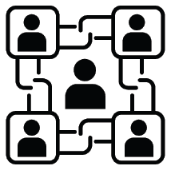

## Chapter 9

## 思维转变、策略及行动原则

*“区块链将为企业网络和商业生态系统的互联做与企业资源计划（ERP）对单一公司所做的一样的事情。”*

**保罗·布鲁迪，安永全球区块链负责人**

*“我们获取整个行业价值的唯一方式就是以不同的方式思考合作。几年前我就将区块链称为‘团队运动’。我们必须与我们的竞争对手合作，改善整个行业，如安全性、质量以及降低跨境贸易的壁垒。”*

**戴尔·克里斯蒂，联邦快递区块链策略师，BiTA 标准委员会负责人**

*“我们见证了诸多成功的区块链试点项目，但除非网络参与者感到舒适地使用它进行协作和共享数据，否则分布式账本的优势将无法实现。”*

**玛丽·维克，IBM 区块链总经理^(1)**

9.1. 使企业区块链成为现实

到目前为止，在我们的旅程中，我们已经探讨了区块链的现状、企业区块链承诺的好处、各行业中企业区块链的实际案例，以及主要的技术挑战和新兴的技术解决方案。现在，我们转向商业问题。在本书的这一章，我们将研究传统企业从企业区块链中获得价值所需具备的条件。这并不容易；企业面临一个艰巨的“技术嵌入性”挑战。所有技术都存在这个问题，活着的区块链应用必须被整合到复杂的制度、政治、监管、社会、经济和现有系统中。^(2) 但尽管大多数技术解决方案是在企业边界内采用的，区块链最适合于组织间的情境。这需要与竞争对手前所未有的合作，以及其他只有高管才能有效推动的心态转变。难怪 HfS 研究发现在 2020 年第一季度，只有 131 个（14%）的区块链项目达到了生产阶段。^(3) 但好消息是，我们可以从早期采用者那里学到重要的教训。

在本书的这一章，我们提出了**行动原则**，以使区块链赋能的解决方案成为现实（见图 9.1）。行动原则是我们通过研究确定的实践，这些实践在现实世界的实施中产生了理想的结果。因此，行动原则是有数据支持的，旨在帮助其他思考者在他们自己的实施旅程中。行动原则与最佳实践相似，因为两者都试图从前人的经验中分享知识。但与“最佳实践”不同的是，“最佳实践”暗示模仿总是推荐的，总会产生类似的结果，而行动原则认识到上下文的重要性。一个实践的有用性取决于组织试图实现的目标，组织是否有能力有效实施该实践；以及时机——在特定实践的应用上有比其他时候更好的时候。作为社会科学家，我们认为管理者是思考者，他们会仔细审查从别人的学习中获得的其他人的“最佳实践”，以决定何时以及是否需要在他们的组织内修改或可能放弃实践。^(4)

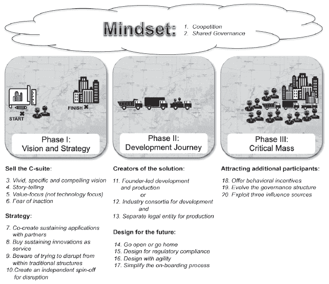

**图 9.1：使企业区块链解决方案成为现实的行动原则**

9.2. 区块链心态：合作竞争与共享治理

基于区块链的应用主要是生态系统解决方案。价值来自于提升整个生态系统，以消除摩擦和其他痛点。这需要与竞争对手、交易伙伴、开源社区和监管机构合作。传统企业需要对竞争优势和“胜利”的含义有不同思考。传统企业在从内部、命令和控制、集中式应用转移到共享、分布式应用时，也需要改变思维方式。具体来说，传统企业需要转向合作竞争和共享治理的思维方式。

9.2.1   合作竞争

“公司对于共同解决这些问题感兴趣。从原则上讲，我们正在处理对它们来说不是战略优势，但它们都共同面临的问题。”

**Susanne Somerville，Chronicled 的首席执行官和 MediLedger 的联合创始人**

“区块链让竞争对手聚集在平台上，这与他们以前的工作方式不同，甚至有些反直觉。但连接一对一的许多人，让每个人实时看到与他们参与的货物相关的信息，以及数字数据文件的可见性，这是一个游戏规则的改变。区块链支持这一点，并提供不可篡改的信任。”

**Mike White，Maersk GTD 的首席执行官**

**合作竞争**是“合作”和“竞争”两个词的合成。这个概念已经存在了 100 多年，当时房地产经纪人既合作又竞争，共同创建了第一个多重上市房地产服务。然而，合作竞争最近才在学术作品中得到正式化，最著名的是 Giovanni Battista Dagnino 和 Giovanna Padula。在他们的 2002 年论文中，他们概念化了一种“合作竞争策略”作为一种新的企业间价值创造动态。他们写道：

**合作竞争视角**源自于认识到，在企业间的相互依赖中，既存在价值创造的过程，也存在价值分享的过程，这催生了一个部分收敛的利益（和目标）结构，其中竞争和合作问题同时存在且紧密相连。它引发了一种我们称之为合作竞争系统的新企业战略相互依赖关系。

汽车制造商之间的合作竞争是一个典型的例子。像宝马、克莱斯勒、戴姆勒、菲亚特、福特、本田、通用汽车、保时捷、雷诺、铃木、丰田和大众这样的公司，在研发和汽车零部件上进行合作以降低成本，但基于自己的分销渠道和品牌进行竞争。有效的合作竞争既产生了经济价值（降低成本、增加收入和风险缓解），也产生了知识价值（最佳实践、标准和科技发展）。对于区块链环境来说，传统企业需要接受合作竞争的心态：

✓ ***行动原则 1：将思维方式从竞争转变为共竞合作。***

对于区块链背景来说，共竞合作涉及三个或更多可能在不同层面运营的组织之间的复杂关系（见图 9.2）：

• ***宏观层面的共竞合作*** 包括跨行业和同一行业内公司之间的关系。^(10) 宏观层面共竞合作的价值包括跨行业创建水平框架和标准，以便分享学习经验、降低投资成本和加速采用。Hyperledger 项目是一个跨多个行业和地理区域的宏观层面区块链倡议的例子。

• ***中等层面的共竞合作*** 包括同一行业内公司之间的关系。中等层面的共竞合作专注于构建提升行业内参与者解决方案。WeTrade、IBM 食品信任和 TradeLens 就是例子。

• ***微观层面的共竞合作*** 包括全球公司内组织/部门之间的关系。许多全球公司运营着独立的法律实体，它们之间需要正式的价值转移。携手合作，他们可以减少所有公司的行政成本，并为新产品和服务创造可能性。桑坦德银行在以太坊上发行的债券发行和结算就是一个例子。

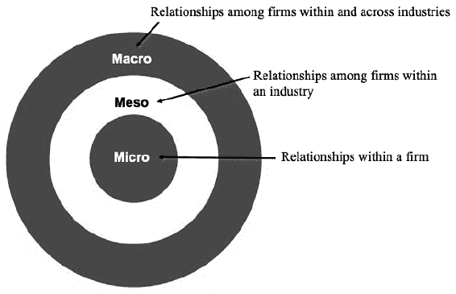

**图 9.2：共竞合作的三个层次**

在区块链领域，FedEx 的区块链策略师兼 BiTA 标准委员会主席 Dale Chrystie 是共竞合作最直言不讳的倡导者，尤其是在宏观层面。2020 年，Dale 说：

“*我已经围绕区块链谈论‘共竞合作’超过一年了，但‘共竞合作’的概念远比区块链本身要大。共竞合作不仅仅是来自一个行业的人一起工作在某个项目上——而是所有行业一起合作在某个项目上工作。”*

有效的共竞合作要求每个参与者承诺采取合作伙伴的行为（见图 9.3）。^(11) 每个参与者承诺**关注未来**，而不是他们可能在过去产生冲突的地方。每个参与者**承诺致力于更大的使命**，而不是仅仅为了自己的利益。此外，即使在一些问题上被少数派投票否决，每个参与者仍然坚持更大的使命。

在任何工作组或财团内——尤其是那些包括竞争对手的——都会有激烈的辩论。在审议过程中，参与者不会说“*这不是我的问题*”也不会寻求指责任何人或归咎。相反，参与者认为**对一个人来说是问题，对所有人来说都是问题**，并团结起来共同解决这些问题。无论审议过程中发生什么，参与者随后应该向组外的人**展示一个团结的前线**。有效的团队要团结一致，并不断向公众传达更大的使命。

**参与承诺**

1. 我将关注未来。

2. 我致力于我们的宏伟使命。

3. 我将把你的问题当作我的问题。

4. 我将展现一致立场。

5. 我的组织将投入时间和资源。

6. 我的组织将关于意图保持透明。

7. 我的组织已授权我做决策。

**图 9.3：参与者承诺示例**

每个参与组织**承诺投入时间和资源**。理想情况下，创始合作伙伴应平等投入资源以实现平等发言权。但在某些需要小型或边缘参与者完成端到端流程的情况下，资源承诺可以与能力、规模和解决方案实现的潜在收益相匹配。较弱的参与者希望知道这个问题答案：*在你在这里合作时，这个解决方案交付后，你将在哪里竞争？* 更有权力的合作伙伴需要极度**透明地展示其意图和行为**，以说服较弱的合作伙伴合作。普遍共识是，传统竞争对手需要合作建立标准、影响法规并创建平台。然后，竞争将基于建立在平台之上的产品和服务的质量。

最重要的是，**每个代表在其组织内部都有足够的信誉、影响力和权力**，能够代表企业做出决策。^(12) 在与生态系统合作伙伴达成一致后，发现自己公司内部没有支持，没有什么比这更快的阻碍努力了。

9.2.2. 共享治理

*“分布式账本对公司提出了双重挑战，一个是技术层面的，占 20%，另一个是治理层面的，占 80%。”*

**玛丽·维克，IBM 区块链总经理**^(13)

*如我在 2019 年 5 月离开 We.Trade 时所预期的，由银行和保险公司推动的企业区块链项目由于利益相关者和股东之间的治理问题以及缺乏投资回报文化，进展过于缓慢。*

**罗伯托·曼科内，WeTrade 的联合创始人兼前首席运营官**

治理定义了与区块链解决方案相关的决策权。企业需要更好地理解需要做出的决策范围、治理选项以及治理组合随时间如何演变。他们需要接受以下教训：

✓ **行动原则 2：将思维方式从命令控制转变为共享治理。**

对于整个区块链生态系统而言，决策权的范围是复杂的。参与者需要就以下所有内容达成治理机制的一致：

• **使命：** 基于区块链的解决方案的使命是什么？

- **数据政策：**收集哪些数据？在共享账本上谁拥有数据？其确切格式是什么？谁可以查看数据？谁决定如何使用数据？如何确保隐私？如何在不可变账本上修复错误数据？如何处理数据退役？

- **参与权利：**谁可以加入我们？谁可以提交交易？谁决定或处理将参与者逐出的事宜？

- **验证权利：**谁被允许在网络中操作验证节点？运行节点的个人或机构是否真正独立且不太可能串通？谁决定或处理将节点逐出的事宜？

- **覆盖权利：**在极端错误的情况下，谁有权回滚账本？（即谁有权力创建硬分叉？）

- **所有权权利：**谁拥有该软件？许可证是如何管理的？

- **合规性：**谁负责确保合规性？如果违反法律或未遵守规定，谁承担责任？

- **软件更新控制：**谁决定添加哪些补丁和功能以及何时添加？如何在分布式网络节点之间协调软件更改？

- **治理居住权：**在链上有什么治理，如果有，是怎样的，以便多数决策可以自动采用，还是在链下需要人工干预的治理？

- **资金模式：**谁支付什么？谁决定定价模型（包括交易费用）？^(14)

决策权可能由仁慈的独裁者、寡头政治、股权治理、联邦、代表英才治理、英才治理以及/或民主治理结构持有。这些治理结构具有不同程度的去中心化（参见图 9.4）并具有不同的优势。

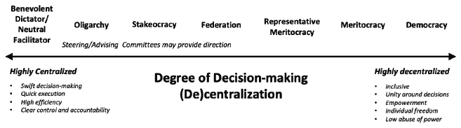

**图 9.4：区块链治理模型**

集中式决策的好处包括快速决策、快速执行、高效率以及明确的管理和责任制。

用户有一个可识别的个人、组织或团体来回答问题、关注事项或投诉。如发现软件漏洞或区块链网络遭受攻击等问题，可以迅速处理。然而，许多人认为集中式治理与区块链的目标和原则相悖，后者旨在将权力分散到参与者的网络中。

去中心化决策的好处包括包容性；赋权（每个声音都计数）；围绕决策的团结；自由加入和退出；以及权力滥用低。

集中式治理的主要论点是，通过一群热情的创始人核心集合，启动一个区块链生态系统。然而，创始人需要承诺一个计划，以更透明和包容的方式吸引更多采用者。即使是比特币，在决策权被分配之前，也采用了一种仁慈的独裁者模式。^(15) 每种治理模式下面都有描述。

**仁慈的独裁者**是一个人或单个组织，独自拥有决策权。社区信任这个人或组织根据社区的最好利益做出决策。最初，中本聪在比特币白皮书和比特币核心，以及 Vitalik Buterin 在以太坊的想法上，都是公共区块链上的仁慈独裁者。^(16) 这些项目之所以成功，是因为最早采用者——通常是其他志同道合的程序员——信任创始人的意图，甚至在比特币这种有趣的案例中，我们不知道中本聪的身份。纽约时报的记者 Nathanial Popper 写道：

“中本聪的匿名性，如果有什么的话，似乎增加了对系统的信任。这种匿名性表明，比特币并非由寻求个人名声或成功的人创建。”^(17)

传统企业可能更愿意称这种治理模式为**中立促成者**或**创始人领导**模式。例如，Chronicled 是 MediLedger 的中立促成者，iDatafy 是 SmartResume 的中立促成者。

如果由几个合作伙伴启动，区块链治理很可能开始是一个**寡头政治**，权力集中在少数人手中。大多数受许可的区块链正在由一个核心合作伙伴群体开发，有时被称为**最小可行性生态系统**（MVE）。这些合作伙伴——通常包括竞争对手以及交易伙伴——形成某种理事会或财团，负责制定和执行该计划的规则。WeTrade 就是一个例子。它开始是七家银行之间的协议，以建立一个**最小可行性产品**（MVP）。根据它们的性质，这些规则代表创始合作伙伴之间的谈判条约，最大化共享利益。在部署后，创始人可能需要更改规则以吸引更多合作伙伴。

‘Staked’ oligarchies, which we call ***‘stakeocracies’***, is a governance model where people pay to become part of the oligarchy. The Libra Association is an example. Council members (initially 28 firms) will need to buy *at least* $10 million in Libra Investment Tokens. The Libra Association refers to its decision-making process as ‘proportional power’, where voting powers of the council will be proportional to their stake, but with a cap to prevent an overtaking of the association.^(18) As of 2020, the Libra Association lost some of its founding members—including PayPal, Mastercard, eBay, and Vodafone—after regulators expressed deep concerns, particularly over Facebook’s influence as initiator of the project. Many people are concerned that Calibra (Facebook’s digital wallet for libra coins) will have an unfair competitive advantage.^(19) It is still early days, and the Libra Association’s proposed governance model likely will evolve.^(20)

**联邦制**允许去中心化的小组专注于项目的部分，同时与中心小组协调以整合解决方案。超级账本项目的总体结构是一系列专业项目。然而，超级账本项目的技术指导委员会由可以称为**代表英才制**治理，人们必须证明自己的能力才有资格根据其他有能力的成员的投票当选委员会。超级账本项目的工作组负责人提交活跃贡献者（在上一次选举时有 424 人）并由所有活跃参与者投票选出 11 名领导者。11 人的技术指导委员会有权决定新项目的加入、项目规则和项目状态（孵化/活跃）。^(21)

在**英才制**下，权力掌握在基于能力和善意的人手中。目标是吸引多个知情利益相关者的观点，在公开论坛上辩论观点，然后对想法进行压力测试以找到最佳解决方案。例如，任何人都可以向比特币改进提案（BIP）提出想法。整个比特币社区（矿工、开发者和投资者）可以根据其价值对提案进行投票。到 2019 年，已提交 322 个 BIP，其中 35 个已经完成。^(22)

一个**民主**是最去中心化的治理形式，在这种形式中，每个参与者获得一票。这就是为什么许多人喜欢比特币和以太坊矿工通过安装或不安装源代码更改来进行“投票”的事实。

除了上述提到的治理结构外，企业区块链通常还会设立一个**指导委员会**或一个**咨询委员会**。这些委员会可能有决策权，也可能没有，但它们在指导、推荐和提供区块链发展方面的专业知识方面仍然具有影响力。通常与集中的治理结构一同使用，指导/咨询委员会有助于确保决策是透明的（至少对成员来说是这样）。IBM Food Trust 和 MediLedger 就依靠这样的委员会来指明方向。

IBM Food Trust 设有一个咨询委员会，截至 2019 年 7 月，该委员会由九名成员组成：沃尔玛；都乐；雀巢；克罗格；家乐福；达能；邓洛普；金州食品（GFS）；以及 GS1。根据其网站信息：

_*“由各种行业代表组成的咨询委员会帮助设定区块链社区的参与规则，确保解决方案对所有人都有利。”*_^(23) _ 委员会成员“分享、学习、讨论、优先处理和解决与全球食品行业相关的机遇和挑战。他们积极地相互学习和市场学习，为 IBM Food Trust 提供有意义的方向。”*_^(24)

咨询委员会的主席由其他委员会成员选举产生，任期为两年。

由 Chronicled 创立的 MediLedger，正在与生命科学公司合作，为药品供应链构建一个开放和去中心化的网络。MediLedger 设有一个指导委员会，对于那些无法通过工作团队、项目经理或网络所有者解决的问题，该委员会具有最终决定权。因此，在这个例子中，指导委员会*确实*拥有决策权。^(25)

在基于区块链的解决方案中，一些决策可能采用一种模型进行治理，而其他决策则采用另一种模型，从而形成一个**治理组合**。例如，一个指导委员会可能负责监督数据政策，而一个中立的服务商则负责监督验证节点。此外，治理组合很可能会随着时间的推移而发展变化。大多数区块链应用程序/平台/项目都由一个实体或几个合作伙伴启动。最初，创始人或创始合作伙伴拥有对治理决策的完全控制权，这主要是因为目前还没有其他人可以委托权力。当网络启动并发展壮大时，区块链治理应当变得更加透明，如果不是更加去中心化的话。

总结来说，区块链应用是生态系统解决方案，需要企业以新的方式合作，并对软件治理有不同思考。传统企业可能对这些思维转变感到困难。企业如何建立业务案例，估算投资回报，或以其他方式证明向交易伙伴共享，很可能还包括竞争对手共享的应用程序是有价值的？企业内部的区块链信徒可能相信生态系统解决方案的力量，但他们需要高层管理的支持才能成功。

9.3. 向高层推销

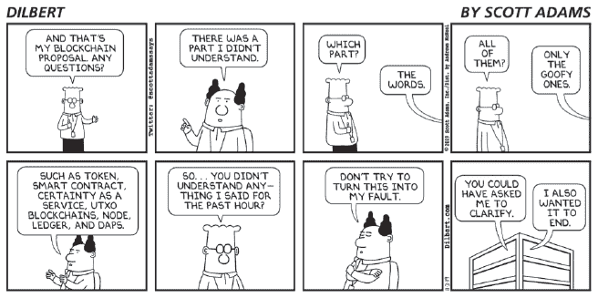

**图 9.5: 迪尔伯特的老板对区块链感到困惑**

正如图 9.5 中迪尔伯特漫画幽默地描绘的那样，企业高层并不关心技术。相反，高层想知道：合作竞争和共享治理最终将如何为我们带来任何价值？最大的商业价值机会在哪里？

到目前为止，这本书已经反复讨论了商业价值，包括降低交易成本和加快结算时间，因为各方直接相互交易；无需对账，因为共享账本上有可靠的审计线索，各方都同意*“这就是发生的事情”*；从委托到报废的资产更好追踪；由于智能合同按照交易伙伴预先同意的方式执行，因此减少了供应商机会主义的威胁；通过分布式冗余降低关键基础设施系统的网络安全风险；以及通过向现有客户扩展产品或通过接触新客户产生新的收入流。尽管这些价值机会很强大，但可能过于通用，无法说服高级执行官。为了说服高层，以下建议采取以下行动原则：

✓ ***行动原则 3：企业高层需要区块链信徒将通用的价值主张转化为对企业生动、具体且有力的愿景***。

美国空军退役上校詹姆斯·艾伦·雷根纳（Colonel James Allen Regenor）是 VeriTX 的创始人兼首席执行官，他提倡用基于场景的愿景来向高层推销。为了推销他的商业对商业平台愿景，该平台用于打印零件以及购买、销售和追踪数字和物理资产，请回忆第五章中的他的愿景：

“想象一个情景，生命取决于一架飞机从远海上的航空母舰甲板上起飞的任务。唯一可用的飞机刚刚因为一个关键部件故障而被停飞。航母上没有该部件的库存。但我们确实有一台 3D 打印机和一批粉末。该部件的技术数据包是可用的，并且很快就被打印出来。你是负责尽快将这个部件安装到飞机上并签署飞机安全准备好起飞的责任人。你怎么知道你手中拿着的新打印的增材制造部件是否可以使用？”*^(26)

作为另一个例子，桑坦德银行数字投资银行 Managing Director John Whelan 向高管层提出了这个简单而又有力的信息：

“在其核心，银行是一个账本，一种跟踪谁拥有什么的方式。在区块链出现之前，每家银行都有自己的账本，银行之间不信任彼此的账本。在区块链出现之后，银行不需要相互信任——他们信任共享的私有账本，从而将银行行业架构从‘许多银行，许多账本’转变为一个拥有‘许多银行，较少账本’的行业。”

很多时候，高级执行官们能够很好地理解一个非常尖锐、简单的信息。我们供应链案例中的有力例子包括食品的“从农场到餐桌”愿景；海鲜的“从鱼饵到餐盘”；优质葡萄酒的“从葡萄到酒杯”；以及钻石可追溯性的“从矿井到指尖”。

✓ **行动原则 4：使用早期采用者的成功故事作为强大价值的例子。**

可观测性，定义为“创新结果对他人可见的程度”，是一种来说服高管层强有力的方式。^(27) 例如，家乐福通过区块链追踪某些产品并可通过二维码向消费者展示，从而提高了这些产品的销售额。^(28) 虽然这本书强调了诸多这样的解决方案，但借此机会介绍另一个解决方案，称为 KoreConX。KoreConX 是一个利用区块链的解决方案，为私营公司提供接触全球资本市场的途径。KoreConX 平台自 2016 年 12 月起进入实时生产，KoreConX 的区块链（KoreChain）于 2019 年 10 月推出。

KoreConX

超过 8 万家上市公司能够轻松接触到全球投资者，他们可以用手机在几秒钟内发出交易。相比之下，4.5 亿家私营公司对投资者的接触非常有限。小型私营公司在筹集资本时依赖本地经销商和经纪人。每一笔交易都是独一无二的，通常一家私营公司要找到交易对手、谈判协议以及获得董事会的批准需要几周时间。而且，自动化程度很低；大多数私营公司依赖本地电子表格。KoreConX 的想法背后的平台是：

“为中小企业（SMEs）提供一个管理所有企业记录、资金、投资者和投资经纪人的单一地点，以便他们能高效地利用新的资本筹集机会。”*^(29)

Kiran Garimella，KoreConX 的首席科学家和 CTO，将平台描述为...

“一个欢迎所有受监管实体的信任基础设施。”*^(30)

除了运营平台，KoreConX 还是一个过户代理，也基于平台运营，但超过 600 个 KorePartners（包括经纪商、证券律师、二级市场运营商和其他服务提供商）提供了平台上的大部分业务运营。例如，提供商确保 KYC，如证明合格投资者净资产和收入水平的认证，以及为非合格投资者进行身份验证。

该平台提供了一种轻松的数字化数字证券的方式，包括股票；期权；认股权；债券；SAFE，可转换债券；借据；贷款；以及抵押权。KoreConX 还数字化知识产权，因为知识产权是公司估值的一部分。然而，发行数字资产是一次性事件，代表的交易活动比例较小。该平台为持续交易和公司行为提供服务，如股东大会；优先购买权；行使拒绝权的第一权利；随行权利；拖行权利；股息分配；退出；以及合并和收购。平台功能包括投资组合管理；CapTable 管理；会议记录；交易室；投资者关系；过户代理；资本市场；二级市场；以及合规。基本服务对所有人免费使用。Kore Plus+功能每月收费 150 美元，包括电话支持、投资者关系仪表板和股东报告等服务。对于 KoreConX 来说，它主要通过专业过户代理服务（价格不一）赚取收入。众多私人发行人已选择 KoreConX 平台。例子包括 BrewDog、LegionM、GoldenSeed、TastyEquity、Quadrant、Atomic Video 和 S2A Modular。

就业务价值交付而言，KoreConX 的首席执行官 Oscar A. Jofre 表示：

“在与公司（发行人）、投资者、经纪商、董事会成员和其他利益相关者的日常对话中，我们遇到了许多高效流程价值的例子。与孤立系统不同，当在这个平台上为一方交易提高效率时，好处很快传播到并惠及所有参与交易的各方。流程效率和降低成本是最明显的好处，但价值超越了这些，提高了用户体验，建立了更强大、持续的长期关系和信任。”*

表 9.1 突显了交易速度的提高。

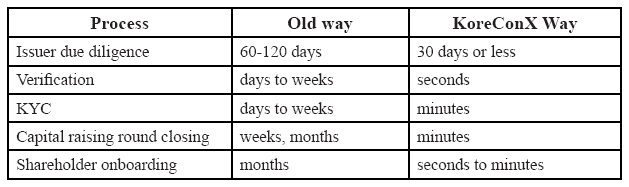

**表 9.1：KoreConX 交易速度改进**

*来源：KoreConX*

截至 2020 年第一季度，KoreConX 的区块链（KoreChain）在 23 个国家部署，在五个不同的云平台（IBM、AWS、Azure、Google、Digital Ocean）上，每年可处理 100 亿笔交易（约 318 笔交易/秒）。KoreConX 上有 75,000 家私营公司，12 亿股，3200 万股期权和 120 万股认股权证。作为 CTO，Garimella 对技术充满热情，但他表示，投资者和 C 级高管都不关心区块链，这引导我们进入下一课：

✓ **行动原则 5：将区块链置于次要位置，只关注解决方案的价值。**

C 级高管并不关心底层技术，他们关心的是技术能带来什么。Kiran Garimella 说：

“解决问题的关键不在于区块链本身。关键在于建立在区块链上的应用程序。”

对于 KoreConX 解决方案，该公司根据生态系统参与者的不同，向 C 级高管传达不同的信息。对于私营公司的 C 级高管，信息重点在于确保合规性、更好的发行（多司法管辖区）和流动性。对于私募股权投资者的 C 级高管，信息重点在于获取全球市场机会、安全性、保护和尽职调查。对于经纪商，信息重点在于改善交易流程、合规性和 syndication。对于证券律师，这是关于高效的合规性、更多的客户和业务、管理监管和合同风险。对于提供商（转让代理人、KYC/AML、保管人），主要优势是可扩展性。

在其他案例中，行动原则也很明显。例如，在沃尔玛，C 级高管非常关心食品安全、食品质量和食品浪费减少。这些是促使沃尔玛采用 IBM 食品信任和 VeChain 的原因。食品追溯解决方案碰巧基于区块链技术，这只是个背景故事。

✓ **行动原则 6：通过强调不采取行动的后果，也可以说服 C 级高管区块链的价值。**

区块链应用有潜力颠覆许多现有的商业模式。没有首席执行官希望被公司的“Uber”或“Blockbuster”时刻打个措手不及。很多时候，不采取行动的代价是灭绝。微软应用创新团队的高级导演 Mike Walker 对会计公司发出了这种挑衅性的警告：

“调解处在濒危物种名单上。”

难怪四大会计事务所——德勤、安永、毕马威和普华永道——都建立了区块链竞争力。银行是另一个例子；许多人可能发现，他们的未来竞争对手是提供更好金融服务、成本仅为一小部分的技术公司。还记得第四章中桑坦德数字投资银行董事 John Whelan 的话吗：第四章

*“如果我们不建设它，别人会的。所以，我认为银行已经意识到我们的竞争对手不仅仅是其他银行，还包括大的科技公司，无论是 Facebook、Google、阿里巴巴还是腾讯。在许多方面，金钱和价值只是机器中的一串零和一，这是一个工程问题，而不是金融问题。”* **^(31)**

9.4. 区块链战略：生态系统视角

*“大型银行显然对区块链很着迷。他们都有自己的创新实验室研究区块链，但我看不到变化来源于那里。从概念验证到实际生产是一条漫长而艰难的道路。基本上要吞噬自己的业务是很难的。放弃集中控制也很难。大型机构是固化的，他们从现状中受益。这就是为什么我们不过多关注大型银行。我们把大部分时间都花在这些小型、创新的金融机构上，因为它们能够更快地行动。”*

**杰德·麦卡勒布，恒星开发基金会联合创始人兼 CTO**^(32)

*“我认为在某些选择性的例子中，区块链可以是颠覆性的，但对于我们大多数客户来说，区块链是我们客户转型的前沿，将降低成本。”*

**伊蒙·马奎尔，KPMG 全球数字账本服务负责人**^(33)

在区块链开发的早期阶段，我们看到有多个平台是为基本上相同的用例而开发的，比如食品追溯性；海上追踪；贸易融资；以及证书。我们看到生态系统的大量涌现。

有些生态系统将会失败，有些生态系统将会合并（就像巴达维亚共和国解散并加入 WeTrade 一样），希望许多生态系统能够互操作。合作竞争心态的一个强大含义是，合作伙伴将需要在生态系统层面有一个商业战略。

从著名商业理论家克莱顿·克里斯滕森教授那里我们可以得到启示。从他 1997 年关于这一主题的第一本书《创新者的困境》开始，克里斯滕森将**颠覆式创新**定义为一个*过程*，通过这一过程，一种创新最终会颠覆一个现有市场，从而取代传统企业。^(34)^,^(35) 克里斯滕森观察到，传统企业很难通过颠覆性创新来破坏它们成功的商业模式，从而夺走现有产品的收入。但是不要完全排除传统企业，因为该理论认为传统企业可以通过一个独立的分支来实现颠覆，此外，还可以使用克里斯滕森所说的**维持性创新**——那些在现有市场中改进产品和服务 innovation. Sustaining innovations can deliver substantial business value to the entire ecosystem; disruption does not have to be the strategic choice. To apply the Theory of Disruptive Innovation to blockchain ecosystems, one just needs to elevate the unit of analysis from the firm-level to the ecosystem-level. Here are the lessons:

✓ **行动原则 7：追求由 mostly 传统企业组成的生态系统的维持性创新。**

我们交谈过的许多传统企业都错误地采用了“颠覆”的语言，而实际上他们正在构建的是“维持”创新。维持性创新通过改进今天产品和服务的表现，为最挑剔的客户提供价值。并非每一次创新都需要颠覆一个行业。

当生态系统伙伴成功联手时，他们并不会消除值得信赖的第三方或绕过中介（尽管他们的角色可能会改变）。相反，成功的努力发生在合作伙伴共同致力于减少彼此之间的摩擦，并最终使他们的客户受益的时候。简而言之，许多企业区块链解决方案体现了“同舟共济，共渡难关”的座右铭。KoreConX、桑坦德银行的债券发行、IBM 食品信托、MediLedger 和 WeTrade 都是传统企业共同努力提升所有各方，而不是消除任何一方的例子。没有哪个环节面临被去中介化的威胁。

与其帮助建立可持续性创新，传统企业还可以选择购买它们：

✓ **行动原则 8：购买可持续性创新作为服务。**

在位企业并不一定必须与生态系统伙伴一起建立维持性创新。他们可以让别人去建立，然后作为服务购买。虽然这种模式下跟随者承担的投资风险较小，但最终可能会得到次优选择。

从第四章我们知道，Ripple 的客户主要是像银行、公司、支付提供商和交易所这样的机构企业。他们通过参与 Ripple 获得好处，但不一定参与或投资其发展。对于银行客户，Ripple 承诺银行将通过预订新的企业和消费者客户、降低交易成本，并提供一个集成的点和一致的体验来处理规则、标准和治理。^(36)

美国全球金融服务公司 State Street 在多年的内部发展后得出了购买/合作伙伴与自行构建的结论。2016 年 9 月，State Street 聘请了一位新的首席技术架构师（CTA），部分原因是他与开源项目有着悠久的历史。在接下来的几年里，区块链团队增长到了 100 多人。他们使用 Hyperledger Fabric 构建了一个开源的受许可区块链解决方案，以创建一个单一的记录账本。这个想法是消除数百个数据库之间进行对账的需要。^(37) 2019 年 5 月，CTA 离开 State Street 共同创办了一家初创公司。2019 年 12 月，State Street 解雇了至少 100 名区块链开发者。State Street 替代融资解决方案负责人 Doug Brown 告诉 Coindesk：

“关于是否值得他们花时间建立那个基础设施，以及这样做所需的成本和人员，确实有一个真正的问题。”*^(38)

State Street 认为，与其内部建立一个分布式账本解决方案，不如更多地依赖外部供应商。根据 State Street 伦敦数字产品 Managing Director Ralph Achkar 的说法：

“我认为我们在处理那个空间的方式是，我们是否需要在内部拥有所有这些资源，或者我们实际上是否可以建立合作伙伴关系并与市场上的其他提供商合作？”*^(39)

✓ **行动原则 9：对于传统企业来说，要小心尝试颠覆性的创新。**

我们有几个传统企业参与联盟失败的例子，他们声称有颠覆行业的野心，但没有提供任何解决方案。我们突出一个失败尝试的例子。

医疗保健提供商联盟

一家大型医疗保健提供商的创新负责人正在与生态系统合作伙伴合作重新设计医疗保健。他们知道解决方案必须是颠覆性的，而不是维持性的。他说：

“你在放射学领域可以看到一些事情，特别是患者在医生办公室支付 800 美元进行 MRI 扫描，而我们的成本是 2400 美元。你觉得人们会去哪里做 MRI 呢？有一个点是你必须自我颠覆。”*^(40)

他尝试了几年向高级管理层传播这一信息。他继续说：

“我们需要设计一个以消费者为中心、透明的医疗保健系统。我想利用区块链来颠覆当前的系统，因为我们如果不这样做，它在十年内就会破产。”*

两年后，他离开了公司和联盟，得出结论，医疗支付方不想被颠覆——他们通过持有大量现金来赚钱。他说：

“支付方不希望索赔通过区块链进行简化。其中一个人告诉我，他把它带给高管审查，结果被告知，‘不要拿这个回来……这对你的职业生涯有限制。’这就是我们在对抗的。他们可以看到如果索赔立即得到裁决，他们会失去金钱。”

2018 年我们遇到的许多大型传统企业的区块链创新领导者离开了他们的组织，开始区块链创业公司或咨询公司。除了上面提到的医疗保健提供者的创新部门负责人和 State Street 的 CTA，CME 集团、摩根大通、莫格和伊利诺伊州的区块链领导者也离开了，开始了自己的公司。区块链领导者不能从传统企业内部推动颠覆性创新，因为业务赞助商阻碍或未能支持颠覆。一位离职的领导者说，在 2020 年：

“从内部颠覆一个组织是非常困难的。我们很高兴能在记录系统的上层建立一个数字账本，但业务赞助商只是想在新世界中重现旧模型，所以我们失去了支持。”

当成功地发生颠覆时，克莱顿·克里斯滕森教授观察到，初创公司和分拆公司是最有可能产生颠覆性变化的生产者。

✓ **行动原则 10：为具有灵活初创公司或分拆公司的生态系统追求颠覆性创新。**

我们的大部分实证证据与理论相符。尤其是，莫格和英诺吉——分别在第五章和第六章中介绍——正在创造低端市场的颠覆和新市场，这是按照克里斯滕森的预测进行的。在莫格飞机公司工作时，詹姆斯·艾伦·雷根上校开始研究一个基于区块链的面向企业的解决方案，用于印刷零件。这是一个完全颠覆性的创新，因为它将使莫格从传统的制造零件转向增材制造。最终，雷根决定在 2018 年离开莫格，以加速从概念验证到实际生产的转变。雷根作为顾问留在了莫格，同时推出了 VeriTX，莫格是其合作伙伴之一。如第六章所述，德国电力公司 RWE 的英诺吉分拆了一家名为 Share&Charge 的公司，从其企业创新中心出发，推出了一款基于区块链的应用程序，创建了一个市场，让人们可以购买和出售电动汽车充电站的容量。^(41)

超越战略，进入实施阶段，下一部分涵盖了从想法生成到部署的采用旅程的行动原则。

9.5. 从想法到开发

**从区块链的角度来看，我们不相信联盟的努力在全球商业空间会大规模扩展，这将需要一个庞大、开放的全球村庄来实现，这正是引导我走向“合作竞争”的原因。**

**Dale Chrystie，联邦快递区块链战略师，BiTA 标准委员会负责人**

基于区块链的解决方案可能由创始人、几个交易伙伴或联盟领导。创始人引领的解决方案是市场最快的治理模型，但可能导致没有人想加入的解决方案。^(42) 由联盟引领的解决方案通常是市场最快的治理模型，因为许多方需要达成一致，但可能导致考虑了所有生态系统伙伴需求的解决方案。联盟引领的解决方案还需要创建一个法律实体，将解决方案从沙盒推向生产。由几个交易伙伴引领的解决方案是中间模型。在这里，我们探讨极端模型的背后逻辑：创始人引领的模型用于开发和生产，与联盟引领的模型用于开发和一个新法律实体用于生产。

✓ **行动原则 11：只有在组织将被接受为仁慈的独裁者/中立促进者时，才选择创始人引领的方法。**

本书介绍的许多区块链应用都采用了创始人引领的模式，包括 KoreConX；LO3 Energy；MediLedger；Ripple；SmartResume；TradeLens；和 VeriTX。如前所述，创始人引领治理的优势包括快速决策、迅速执行、高效率以及明确的控制和问责。Arun 等人（2019）也强调了这一优势：创始人将自己确立为生态系统的领导者，并可能获得最大的益处，包括新的收入流和相邻的业务模式。^(43) 然而，创始人承担了融资倡议的风险和负担，吸引顶尖人才，并提供也将造福目标生态系统伙伴的解决方案。

创始人引领的模式在创始人作为中立的促进者时最有效，他们不与目标生态系统伙伴直接竞争。例如，Chronicled 是 MediLedger 的创始人。由于 Chronicled 不是药品供应链的一部分，所以它不会与包括药品制造商、批发商、分销商和零售药店在内的目标生态系统伙伴竞争。Chronicled 的首席执行官 Susanne Somerville 表示：

**一个中立促进者，能够建立各方之间的信任，可以充当仁慈的独裁者——至少最初——因为他们有激励去为所有人解决问题。**^(44)

iDatafy 也为其 SmartResume 平台选择了创始人引领的模式，iDatafy 充当仁慈的独裁者，负责取得成果。iDatafy 是一个中立的第三方，因为它不是一个资质认证或招聘组织，所以不会与 SmartResume 的任何合作伙伴竞争。Wengel 表示：

“iDatafy 充当了一种中间人，但我们也能保持高度专注，我认为很明显，我们需要一种专注的坚持，以推动新事物前进。”

文格尔自筹资金支持这个项目。

尽管 Chronicled 和 iDatafy 的创始人相同，但每个公司都紧密与生态系统参与者合作。公正地说，这些中立的促进者团结了合作伙伴，共同设计了解决方案。

与 MediLedger 和 SmartResume 相反，一些由创始人领导的财团是由关键行业合作伙伴（内部人士）运营的，这使得竞争者不愿加入。例如，马士基（与 IBM 合作）开发了 TradeLens，一个跟踪海运集装箱的平台，但竞争者最初对此犹豫不决。由于马士基采取了积极行动，如宣布成立一个包括竞争者在内的咨询委员会，因此竞争者后来加入了。

通用电气（GE）关于创始人领导的模式提供了一个独特的教训：即使没有其他竞争者加入，也要建立起来以获得投资回报。^(45) GE 建立了 TRUEngine，一个为 GE 的飞机零部件供应链提供支持的基于区块链的应用程序。GE 航空为 60%的航空业提供零部件，需要一种更好的方式来跟踪从制造到报废的 GE 零部件整个生命周期。微软是 GE 的技术合作伙伴。微软的高级主管迈克·沃克（Mike Walker），负责应用创新和数字化转型，表示 GE ．．．

“将整个供应链整合到一个视图中——这样你就能全面了解所有合作伙伴；你有一个单一的生态系统存储库，而不是数百个，甚至数千个。”^(46)

一旦进入实际生产阶段，创始人需要调整治理结构，以说服更多竞争者和生态系统中的小型参与者加入。行业巨头需要有意地放弃控制权，以证明他们是为了更大的利益而工作，而不是试图以牺牲网络内其他人的利益为代价建立自己的竞争优势。

✓ **行动原则 12：为标准和早期阶段开发选择由财团领导的途径。**

许多基于区块链的解决方案需要竞争者在平台上才能实现网络效应。行业专注的财团是聚集竞争者共同开展联合行动的常见方式。行业财团是学习合作与竞争心态掌握的的理想场所。本书中涵盖了 R3、BiTA 标准委员会和 WeTrade 等例子。在财团中，参与者保持自己的法律地位，通常签署非常轻量的法律承诺，如谅解备忘录。财团在定义标准和在沙盒中实验 POCs 方面非常有效。然而，越来越多的证据表明，财团不是将解决方案从沙盒带入生产准备系统的最佳模式。一位领导者告诉我们：

“联盟是行不通的；已经有 60 多个联盟了，它们什么也没能交付。如果没有立法来推动，什么事也不会发生。合作伙伴聚在一起，同意如何一起工作，然后律师介入，要达成一致意见需要很长时间；它不具备可扩展性；再增加一个人，就需要另一个修改后的协议。”

我们采访了需要成员签署保密协议的联盟的领导和成员，但他们并非都签订了知识产权协议。一位大型银行的受访者解释说：

“我们这个行业在共享知识产权的管理和协作合作能力方面落后于其他一些行业。我们都跳进去探索一个用例，和两三个传统竞争对手一起进行了一些联合设计思考，而没有考虑谁拥有那个研讨会结束时产生的知识产权。然后，如果你在那里强调需要某种协议，那么在达成关于协议应该是什么样子以及谁应该拥有知识产权的共同立场时，有时需要几周甚至几个月的领先时间。我们这个行业需要在那些可重复的过程中更快地工作。”

对于一个医疗保健联盟，该组织不想推迟项目，等待大型成员完成签署知识产权协议的繁琐过程。为了在没有正式知识产权协议的情况下保护该组织的知识产权，联盟负责人记录了所有会议，以便其成员无法随后提交专利。

Roberto Mancone 是 WeTrade 的联合创始人兼第一任首席运营官，他表示联盟中的银行事先同意共享所有知识产权。他还建议，如果联盟伙伴承诺根据多数票或超级多数票规则而不是一致性做出决策，那么联盟将更快地进展，正如 WeTrade 联盟伙伴所做的那样。Mancone 还断言，联盟最适合用于技术设计，但需要一个单独的法律实体来推出产品。WeTrade 利用了一个具有简单谅解备忘录（MoU）的联盟来构建应用程序，然后创建了合资企业作为法律实体来推出和许可解决方案。教训是：

✓ ***行动原则 13：对于由联盟领导的开发，创建一个新的实体将解决方案从沙盒推向生产。***

9.6. 设计原则

无论是创始人领导、合作伙伴领导还是联盟领导，目标解决方案应该设计得能够吸引最初的最低可行生态系统之外的参与者，以最大化网络效应。埃弗雷特·罗杰斯的创新扩散理论表明，创新的属性解释了采用率变异的 49%至 87%。对罗杰斯来说，促使人们采用创新的五个属性是相对优势；可试性；兼容性；（上面讨论过的）可观察性；以及复杂性（参见图 9.6）。^(47)

对于基于区块链的解决方案，我们的案例研究建议具有以下属性的解决方案可能增加采用率：开源软件；保证合规性；适应性；以及降低上船障碍。我们依次讨论每个问题。

✓ **行动原则 14：要么开源，要么回家。**

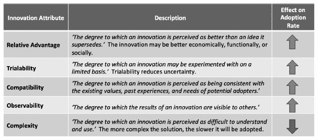

**图 9.6. 创新的五个属性**

**来源：罗杰斯（2006）**

**“开源意味着我们继承了成千上万名高素质开发者的贡献。”**

**Amber Baldet，J.P.摩根区块链卓越中心前项目负责人**(48)

**“你如何让公司从拒绝到接受开放创新？”**

**大型跨国企业集团总经理**(49)

我们给希望获得足够采纳者的大量创始人的信息是，开源解决方案将在具有专有代码库的竞争平台之间提供**相对优势**。潜在的采纳者担心如果解决方案基于专有代码，就会受到供应商锁定。这并不总是一个受欢迎的消息，因为许多创始人有理由期望他们的投资回报。也许是我们在组织内部看到的最大的一次—基于保护知识产权的竞争优势的老观念与基于开放知识产权的协作竞争的新观念之间的冲突。

开源软件有其利弊。积极方面，当一个开放社区开发的源代码成熟后，相较于专有软件，它可以更安全、更便宜，并提供更好的互操作性和可审计性—前提是有一个充满活力的核心开发者、共同开发者、错误报告者和用户社区。(50) 开源软件还意味着入门门槛低—任何人都可以下载软件开始实验，这使得**试用性**变得容易。另一方面，不成熟的开放源代码意味着漏洞是公开的。此外，开源社区并不总是同意代码库应该遵循的路径。

当然，许多企业会将开源代码转换成专有应用。这确实是我们的研究中几个企业正在考虑的路线。在一个医疗保健提供商，创新总监说：

**“在医疗保健领域，我们正在与一家私营公司合作开发专有源代码，因为它比开源软件更难被黑客攻击。它可以建立在开源之上，但将由专有代码保护。”**

在另一家组织，一家全球银行的副总裁说：

**“通过 Linux 基金会的开源，公司可以进行插件开发。所以，如果你在例如同意模型上有差异化，你可以开发自己的插件来支持差异化的商业模式。”**

✓ **行动原则 15：设计符合监管要求的解决方案。**

区块链的独特之处在于记录是不可变的；一旦交易被添加到数字账本中，它们将永远保存在那里，除非有紧急情况需要回滚和分叉账本。除了创始人之外的潜在采用者希望解决方案能**兼容**并符合所有赋予个人被遗忘权的法律和规定。为不可变性而设计还必须使用量子抵抗密码学，这样我们今天使用的密码学在未来将保持安全。这意味着与今天使用的密钥大小相比，需要使用更大尺寸的密钥，这将对存储和可扩展性产生影响。正在开发中的可编辑区块链将允许可靠地编辑，而不会产生硬分叉（参见词汇表）。^(52)

如何可能预见到所有的隐私规定、公司政策和网络安全实践，现在以及将来呢？iDatafy 的 CTO 给出了这样的建议：

“把区块链想象成仅仅是每个人都验证过的收据。”*

最安全的基于区块链的解决方案在账本上存储交易收据的哈希值，但它们从不存储敏感或个人数据（即使是对其进行加密的版本）。解释收据的私钥保存在离线环境中，并且可以根据规定或公司的数据退役政策进行删除。然而，这一简单措施将不足以完全符合隐私规定，比如欧盟的通用数据保护条例（GDPR）。

除了删除权和错误更正权，GDPR 还要求有一个**可识别的权威机构**负责合规，并负责个人数据的处理和法律依据。分布式区块链解决方案如何遵守一个似乎假设了对数据处理和合规的集中控制的规定呢？奥格斯堡大学、拜罗伊特大学和卢森堡大学的学者们确定了三种确保区块链解决方案数据隐私合规的方法。在中心权威方法中，区块链网络提名一个单一的中心权威作为网络的控制器和所有各方都与它签订合同。在共享权威方法中，区块链网络选择一些甚至所有参与者作为控制器和所有各方都签订协议。在去匿名化方法中，存储在链上的数据只有在结合了额外的链下数据时才被认定为个人数据。**^((i))**只有拥有用于归属的额外信息的所有者才作为控制器，并且这些链下数据可以被删除。^(53)

监管问题同样影响着平台的选择。许多企业区块链解决方案都是建立在受许可的区块链上，通常是 Corda、Fabric 或 Quorum。例如，IBM Food Trust、KoreConX、SmartResume、TradeLens 和 WeTrade 都是基于 Hyperledger Fabric 构建它们的解决方案的。Garimella 解释了为什么选择受许可的区块链协议：

*“今天，具有概率性最终性和结算的公共区块链在私人资本市场中是不会受欢迎的。私人区块链提供确定性的结算。”*

其他企业，尤其是 EY，坚信企业最终会迁移到像以太坊这样的公共解决方案。在传统企业准备好使用公共区块链之前，EY 经常在 Quorum 上构建客户解决方案，这是以太坊的受许可版本。这样，将私有应用程序过渡到公共平台的必要重编码最小化。

✓ ***行动原则 16：设计要灵活。***

当需求在开始时不确定时，敏捷的软件开发方法是合适的。参与者通过多次迭代进行测试并提供反馈，以快速产生最小可行产品。iDatafy 就是一个例子。

iDatafy 积极寻求 SmartResume 平台每个迭代的用户反馈。一开始就很明显，大多数人有多所大学的证书，但如果 SmartResume 用户有一个尚未加入联盟机构的学位怎么办？iDatafy 允许用户添加未经认证的学位，但指导他们使用联邦政府的标准命名约定。这样，尚未验证的证书积累起来，iDatafy 可以带着证据去接近那些机构以争取加入。SmartResume 平台可以抓取所有统一命名的机构进行审查。

用户反馈也促使进行了另一项更改，即在启用新证书时停止显示旧证书，例如从学生转为毕业生。最重要的是，早期的反馈使 iDatafy 采用了 opt-in 模型。这是为了保护用户隐私并获取更活跃的用户，尽管这减缓了推出速度。Wengel 说，其他在没有用户知识的情况下创建公共数据的竞争对手可能会迅速扩大规模，但当用户开始收到未经请求的联系时，它们最终可能会失败。他总结道：

*“倾听系统最重要用户的反馈是我们迅速取得成绩的核心原因之一。他们的反馈帮助我们使平台易于使用，并使它们容易参与进来。”*

同样重要的是要知道如何平衡利益相关者的反馈与范围蔓延，并有效地处理与平台哲学相悖的建议。例如，一个利益相关者希望 iDatafy 除了其他数据字段外，还能隐藏认证组织。尽管这个建议能帮助来自不太知名机构的求职者，但它与推广和保护认证组织品牌的价值主张相悖。

✓ **行动原则 17：简化会员入职流程。**

Rogers (2006) 认识到 **复杂** 的创新会阻碍采用。因此，使新成员容易入职并尝试创新，而无需财务或时间承诺的区块链解决方案是好的设计原则。KoreConX 作为一个模型；用户可以在 30 秒内免费注册入职流程（参见 图 9.7）。

标准许可协议是另一个设计原则。在 WeTrade，在财团设计解决方案后启动合资公司的原因之一是为了过渡到一份许可协议。Roberto Mancone 解释说：

“在财团中，我们有 12 家银行作为合作伙伴。我们不想有 12 份不同的协议，每次又有新的银行加入。”

在 iDatafy，首席执行官 Dave Wengel 为个人设计了一个简单的入职流程。一旦一个认证组织代表个人启动了他们的 SmartResume，该个人就会收到一封通知他们创建了 SmartResume 的电子邮件。个人只需点击电子邮件中的链接即可加入平台。如果个人没有激活他们的 SmartResume，任何第三方都无法访问它。

**图 9.7：KoreConX 的入职流程**

[`www.koreconx.com/`](https://www.koreconx.com/)

9.7. 从部署到关键量

无论是由创始人领导、合作伙伴领导还是财团领导，大多数区块链解决方案都会在启动后吸引关键量的采纳者，超出最小可行的生态系统。截至 2020 年，很少有基于区块链的解决方案达到了采纳者关键量的最终阶段。在这本书中讨论的所有挑战中，获得关键量是最伟大的。对于那些准备获得关键量的区块链平台但不知道如何操作的，理论再次指导这个过程。特别是，行为经济学和制度主义理论提供了指导。

✓ **行动原则 18：行为激励：为每种类型的参与者提供独特的价值主张。**

微软应用创新团队的高级总监迈克·沃克（Mike Walker）表示，财务激励是行为的最强大驱动力。生态系统解决方案的创始人需要为每个他们希望吸引到平台的新参与者提供一个引人注目的价值主张。从解决方案中获得最大商业价值的参与者愿意支付最多的费用。在某些区块链解决方案中，目标参与者可能认为价值不大，但他们对解决方案的成功至关重要，可能需要通过免费提供服务来激励他们加入。^(54)

对于 SmartResume 解决方案，iDatafy 考虑了三类参与者的独特价值主张：认证组织、个人智能简历持有者和招聘公司。认证组织通过保护其品牌获得价值——SmartResume 平台防止用户声称他们没有获得的资格。他们还通过一次性认证一个人，而不是每次人员更换工作时重新确认资格，从而提高效率。尽管有这些价值，iDatafy 决定不向认证组织收费；它需要他们创建资格证明。求职者通过接触到招聘公司获得价值，但 iDatafy 还是决定不向简历持有者收取任何费用。个人简历持有者往往是经济紧张的学生。Wengel 说*：*

*“有一个很好的商业理由……除了这只是正确的事情之外，这是快速扩展此类事物的关键。”*

一旦平台规模化，招聘组织通过访问一个经过认证的人才库来获得解决方案的最大价值，并且他们将为使用该平台支付费用。但 iDatafy 直到认证组织推出了足够多的 SmartResumes 之后，才向招聘组织收取费用。Wengel 继续说道：

“*我们不会收取你一分钱，除非我们帮助你招聘到人。我们很有动力确保我们把这件事做对。*”

✓ ***行动原则 19：在从开发到部署到关键量的过程中，演化和优化治理组合，使其更加透明和去中心化。***

治理组合通常是如何演化的呢？比特币和以太坊的仁慈独裁者迅速将权力分发给信仰相同的同伴。具体来说，中本聪赋予了 Martti Malmi 和 Gavin Andresen 更新比特币网站和源代码的访问权限；*^(55)* 但特林招募了 Mihai Alisie；Amir Chetrit；Charles Hoskinson；和 Anthony Di Iorio，并很快将约瑟夫·鲁宾（Joseph Lubin）；加文·伍德（Gavin Wood）；和杰弗里·威尔克（Jeffrey Wilke）作为以太坊的联合创始人引入。

同样，需要进化模式来治理受许可的区块链。由几个关键交易伙伴组成的 minimal viable ecosystem (MVE)，将可能作为寡头政治或股权政治进行管理。然而，为了在长期内实现网络效应，初始的 MVE 需要吸引更多参与者采用其软件。为此，创始人可能需要发展治理模式的一些方面，特别是资金模式，以说服潜在的采纳者。

例如，他们将权利让渡给了 Linux 基金会，以开源的形式管理 HyperLedger Fabric 的源代码。此外，IBM 在其云环境中托管的区块链平台上无法获取数据可见性。只有渠道内的交易伙伴才有访问权限，能够解读存储在受许可账本上的数据。IBM 还正在将其区块链解决方案开放给其他云服务提供商的平台运行。^(56)

TradeLens 提供了另一个 evolving governance structure 的例子。最初，马士基在全球金融危机之后自己内部改进集装箱运输。在马士基的另一部分，IBM 帮助马士基实现无纸化贸易（运输文件的数字化）。^(57) 在 2016 年，这些项目合并了，得益于 IBM 早期对区块链技术的涉足，IBM 向马士基展示了将项目转移到区块链平台的价值。^(58) 2018 年 1 月，TradeLens 作为马士基和 IBM 的 51/49%的合资企业推出。^(59) 最初，每家公司都打算使用自己的销售渠道，但 IBM 没有马士基那样的全球贸易权限，因此 TradeLens 的治理再次改变，这次是在 2018 年底，作为马士基的一个子公司，IBM 作为解决方案提供商。治理的下一阶段涉及更多的透明度，以及创建一个客户咨询委员会，以向更透明的治理模式过渡。^(60)

✓ ***行动原则 20：利用三种影响来源，获得关键量的采纳者。***

制度同形理论模型化了面临相似环境条件的组织之间的同质化过程。^(61) 该理论试图回答一个问题：为什么一个行业内的组织最终会（从拉丁语词根“morph”变化而来）变得更为相似（从拉丁语词根“iso”变化而来）？保罗·迪马吉奥和沃尔特·鲍威尔（1991）假设，组织最终会通过三种影响机制——强制性、规范性和模仿性——采纳类似的结构、过程、理念、实践和技术：（参见图 9.8）。*^(62)*

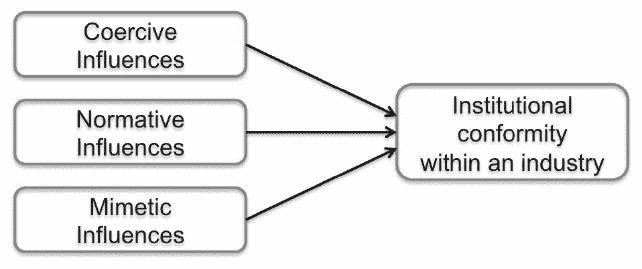

**图 9.8：三种压力机构 conform 的影响**

来源：根据 DiMaggio 和 Powell（1991 年）改编 63

强制性影响

强制性影响来自于一个组织受到的其他组织的政治压力。政府法规和强大贸易伙伴的命令是强制性影响的例子。尽管“强制性”有负面含义，但强制性影响可以有效地促进更大的善。例如，政府法规旨在保护消费者、投资者、公民、儿童和环境。

在区块链的背景下，几位接受采访的人认为政府法规将是大规模采用的最快途径。例如，一位受访者认为新的美国政府法规将是强制采用更好的医疗保健流程的途径，这些流程可以通过区块链实现。他说：

有时候政府可能需要介入。我们只需要几个用例，然后公开宣布这一点，说：“这是我们能做到的事情。我们为什么不能在医疗保健方面做到这一点呢？”我们让政府去问，“为什么你们不这么做？”然后，将有一大批支付者说，“哦，这对消费者来说是个坏消息。”他们在谈论什么？消费者现在被剥削到了极点。保险费率从来没有这么高过。”*

强大的贸易伙伴也可以影响采用：2018 年 9 月，沃尔玛和山姆会员店要求其新鲜叶菜的主要供应商加入 IBM 食品信任。直接供应商必须在 2019 年 1 月 31 日之前遵守一步回溯可追溯性，并通过垂直合作伙伴在 2019 年 9 月 30 日之前实现端到端的追溯性。其致供应商的信解释说，食品安全（更大的善）是一个通过与供应链伙伴合作才能实现的共享责任。认识到采用会给供应商带来负担，信中部分内容如下：

为了帮助您满足这一新的沃尔玛业务要求，我们已经与 IBM 和其他食品公司紧密合作，开发了一个用户友好、低成本、基于区块链的可追溯解决方案，它满足了我们的要求，并为整个叶菜从农场到餐桌的连续体创造了共享价值。*（来源：根据 DiMaggio 和 Powell（1991 年）改编 63）*

规范性影响

规范性影响源于职责、义务和专业规范，包括正规教育和寻求合法化其存在的专业和贸易协会。^(65)在区块链的背景下，像 GS1、IEEE 和 BiTA 这样的标准制定机构提供规范性影响。强大的区块链顾问，如凯捷、认知弹性、德勤、安永、毕马威、HfS、IBM、普华永道和 Wipro，影响其客户的区块链方向。塔普斯科特区块链研究所也是该领域的主要影响者，其节目中有早期企业采用者，并提供关于创建“价值互联网”的见解领导。

模仿性影响

模仿性影响源于这样的感知：同行组织更成功；通过模仿同行的行为，组织旨在实现类似的结果。当环境不确定性高、目标模糊，以及对技术理解不深时，模仿性影响尤其强烈。^(66)自 2011 年以来，iDatafy 建立了三个成功的联盟，其中 SmartResume 是最新的一个。首席执行官戴夫·温格尔说，每当他接近一个新的联盟成员时，通常问的第一个问题是：“*还有谁在使用这个？*”选择早期采用者，特别是那些在生态系统中有影响力和良好声誉的人，非常重要。对于 SmartResume 项目，温格尔知道他必须从一家大型、有影响力的学术认证机构开始建立联盟。（温格尔在职业网络足够大，值得他们关注之前，不会招募任何招聘组织。）2018 年夏天，温格尔邀请阿肯色大学沃尔顿商学院的院长马特·沃勒成为第一个成员。作为该州旗舰商学院，沃尔顿学院有影响力，足以影响其他采用者。

IBM 吸引“锚租户”如马士基和沃尔玛为其主要区块链应用的策略可以被认为是模仿性影响。^(67)一位受访者认为这是一种有效的策略：

*“也存在一点羊群心理。人们害怕被落下。”*

迪马吉奥和鲍威尔强调，这三个影响因素在分析上是独特的，但在实证上可能无法区分。

9.7. 结论

在本章中，我们提出了 20 **行动原则**，基于早期采用者，使基于区块链的解决方案成为现实。我们可以从早期采用者的实践中学习并改进。让这一切成为现实取决于我们所有人。随着更多基于区块链的解决方案上线，这些行动原则可能会得到进一步的证实、微调，甚至可能被反驳。会有长期的结果。区块链是一列缓慢的火车……但它肯定会到来！让我们感谢先驱们分享他们的采用之旅和教训。没有他们，进步会更加困难。

引用

^(1) Wieck, M. (December 11, 2019), ‘2019 年见证了区块链旅游的终结’，《Coindesk》，[`www.coindesk.com/2019-saw-the-end-of-blockchain-tourism`](https://www.coindesk.com/2019-saw-the-end-of-blockchain-tourism)

^(2) Lacity, M. and Willcocks, L. (2018), 《机器人流程与认知自动化：下一个阶段》，SB 出版社，英国斯托特福德-阿彭。

^(3) Gupta, S., Snowden, J., and Mondal, T. (2020), *忽视区块链将自食其果，但也不能盲目行动*，HfS Research。

^(4) Lacity, M. and Willcocks, L. (2018), 《机器人流程与认知自动化：下一个阶段》，SB 出版社，英国斯托特福德-阿彭。

^(5) Lacity, M., Zach, S., Paul, C. (2019), 《区块链治理模型：企业的洞察》，阿肯色大学区块链卓越中心白皮书，大学 of Arkansas。

^(6) *Bridget van Kralingen & Mike White 在 2019 年区块链革命全球大会上*。`youtu.be/7crOW

^([7`) LeRoy, F. and Benjamin, M. (2018), 《寻找合作竞争历史起源：回到古罗马商人》，第 27 届国际管理战略会议，[`www.strategie-aims.com/events/conferences/29-xxviieme-conference-de-l-aims/communications/5021-looking-for-the-historical-origins-of-coopetition-back-to-antique-romans-traders/download`](https://www.strategie-aims.com/events/conferences/29-xxviieme-conference-de-l-aims/communications/5021-looking-for-the-historical-origins-of-coopetition-back-to-antique-romans-traders/download)

^(8) Dagnino, G., ; Padula, G. (2002), 《合作竞争策略：向一种新的企业间动态转变，以创造价值》，瑞典斯德哥尔摩创业学校，欧洲管理学会第二届年会。

^(9) Volschenk, J., Ungerer, M., and Smit, E. (2016), ‘在合作竞争中创造和利用社会环境价值’，《工业市场营销管理》，57，第 109-118 页

^(10) Dagnino, G., ; Padula, G. (2002), 《合作竞争策略：向一种新的企业间动态转变，以创造价值》，瑞典斯德哥尔摩创业学校，欧洲管理学会第二届年会。

^(11) 在我们多年的研究中，发现有效区块链联盟所需的行为也存在于外包关系中。Lacity, M., and Willcocks, L. (2015), 《世界级的 BPO 的九把钥匙》，布卢姆斯伯里，伦敦。

^(12) Ibid.

^(13) Wieck, M. (December 11, 2019), ‘2019 年见证了区块链旅游的终结’，《Coindesk》，[`www.coindesk.com/2019-saw-the-end-of-blockchain-tourism`](https://www.coindesk.com/2019-saw-the-end-of-blockchain-tourism)

^(14) Lacity, M., Zach, S., Paul, C. (2019), 《区块链治理模型：企业的洞察》，阿肯色大学区块链卓越中心白皮书，BCoE-2019-02，大学 of Arkansas。

^(15) Lacity, M., Zach, S., Paul, C. (2019), *区块链治理模型：企业洞察*, 阿肯色大学区块链研究中心白皮书，BCoE-2019-02

^(16) Popper, N. (2015), *数字黄金*, HarperCollins, 纽约，第 82 页。

^(17) Popper, N. (2015), *数字黄金*, HarperCollins, 纽约，第 82 页。

^(18) Libra 协会 [Libra 协会治理原则](https://libra.org/en-US/association-council-principles/#overview)

^(19) Fisher, C. (2019 年 7 月 15 日), *美国财政部对 Libra 可能被用于恐怖主义表示严重担忧*, [Engadget](https://www.engadget.com/2019/07/15/facebook-libra-cryptocurrency-us-treasury-department-concerns/)

亚历山大,A. (2019 年 8 月 5 日), *英国数据保护监管机构对 Facebook 的 Libra 表示担忧*,

[CoinTelegragh](https://cointelegraph.com/news/uk-data-protection-watchdog-raises-concerns-over-facebooks-libra)官网，英国数据保护监管机构对 Facebook 的 Libra 表示担忧。

^(20) Lacity, M., Zach, S., Paul, C. (2019), *区块链治理模型：企业洞察*,

阿肯色大学区块链研究中心白皮书，BCoE-2019-02

^(21) Hyperledger (2017 年 9 月 6 日), *开放治理的 ABCs*, [Hyperledger 博客](https://www.hyperledger.org/blog/2017/09/06/abcs-of-open-governance)

^(22) [比特币 BIPS](https://github.com/bitcoin/bips/blob/master/README.mediawiki)

^(23) [IBM 食品信任解决方案](https://www.ibm.com/blockchain/solutions/food-trust/food-industry-technology)

^(24) *什么是咨询委员会？*, [IBM 食品信任解决方案](https://www.ibm.com/blockchain/solutions/food-trust/food-industry-technology#1797811)

^(25) Lacity, M., Zach, S., Paul, C. (2019), *区块链治理模型：企业洞察*, 阿肯色大学区块链研究中心白皮书，BCoE-2019-02

^(26) 小,G., *增材制造正在重塑物流*, [Moog 新闻博客](http://www.moog.com/news/blog-new/IntroducingVeripart_Issue3.html)

^(27) Rogers, E.M., *创新扩散*, 纽约，自由出版社，2006 年第五版。

^(28) Wieck, M. (2019 年 12 月 11 日), ‘2019 年见证了区块链旅游的终结’，*Coindesk*, [Coindesk](https://www.coindesk.com/2019-saw-the-end-of-blockchain-tourism)

^(29) [KoreConX 官网](https://www.koreconx.com/about/)

^(30) 基兰·加里梅拉，首席科学家和 CTO，在阿肯色大学区块链卓越中心的演讲，2019 年 12 月 3^(rd)。

^(31) 约翰·怀兰，数字投资银行经理，桑坦德银行，在阿肯色大学区块链卓越中心所做的演讲，2019 年 12 月 3^(rd)。

^(32) 引用于

^(33) 引用于拉 acity，M.（2018），*商业区块链指南*，SB 出版社，英国斯特拉特福德-阿波恩。

^(34) 颠覆性创新理论由克莱顿·克里斯滕森在 20 年的时间里发展起来，始于他 1997 年出版的第一本书《创新者的困境：当新技术导致伟大的公司失败时》，哈佛商学院出版社。关于这一理论的深思熟虑和当前概述，参见克里斯滕森，C.，雷诺尔，M.和麦克唐纳德，R. “什么是颠覆性创新？”，*哈佛商业评论*（93:12），2015 年 12 月，第 45-53 页。

^(35) [`www.christenseninstitute.org/disruptive-innovations/`](https://www.christenseninstitute.org/disruptive-innovations/)

^(36) [`ripple.com/use-cases/`](https://ripple.com/use-cases/)

^(37) 拉 acity，M.（2018），*商业区块链指南*，SB 出版社，英国斯特拉特福德-阿波恩。

^(38) 引用于艾莉森，I.（2018 年 8 月 8 日），‘State Street Bank 的区块链深思’**,** *Coindesk***,** [`www.coindesk.com/state-street-opens-up-about-its-internal-blockchain-debate`](https://www.coindesk.com/state-street-opens-up-about-its-internal-blockchain-debate)

^(39) 艾莉森，I.（2019 年 12 月 3 日），‘State Street 削减 DLT 开发者团队，银行重新思考区块链策略’，*Coindesk* [`www.coindesk.com/state-street-slashes-dlt-developer-team-as-bank-rethinks-blockchain-strategy`](https://www.coindesk.com/state-street-slashes-dlt-developer-team-as-bank-rethinks-blockchain-strategy)

^(40) 玛丽·拉 acity 的专访。

^(41) 参见[`shareandcharge.com/en/`](http://shareandcharge.com/en/)；Lielacher，A.（2017 年 5 月 5^(th)），*Innogy 利用以太坊区块链为电动汽车队充电*，[`www.nasdaq.com/article/innogy-charges-new-electric-car-fleet-using-ethereum-blockchain-cm785270`](https://www.nasdaq.com/article/innogy-charges-new-electric-car-fleet-using-ethereum-blockchain-cm785270)

^(42) 拉 acity，M.，扎克，S.，保罗，C.（2019），*区块链治理模型：企业洞察*（第 2 版，2019 年卷），阿肯色大学区块链卓越中心。

^(43) 阿伦，J.，库莫，J.和加尔，N.（2019），*商业区块链*，Addison-Wesley，波士顿。

^(44) 苏珊·塞缪尔，在阿肯色大学区块链卓越中心的演讲，2019 年。

^(45) 2019 年 10 月，GE 航空数字集团首席产品官 Sean Moser 在旧金山区块链周上的演讲。

^(46) Allison, I. (2019 年 5 月 12 日). 《代号“TRUEngine”：“通用电气航空”和微软公布飞机零部件区块链》，Coindesk, `www.coindesk.com/cod

^([47`) Rogers, E.M., 《创新扩散》，纽约，Free Press，2006 年，第五版。

^(48) 2017 年与 Mary Lacity 的个人访谈

^(49) 2017 年与 Jeanne Ross 和 Kate Moloney 的个人访谈

^(50) Bahamdain, S. (2015)，《开源软件质量保证：一篇调查论文》，《计算机科学进程》，第 56 卷，第 459-464 页。

Spinellis, D, Gousios, G. Karakoidas, V. 和 Louridas, P. (2009)，《评估开源软件的质量》

软件’，《理论计算机科学电子笔记》，第 233 期，第 5-28 页

Spinellis, D., 《代码质量：开源视角》，Addison-Wesley，波士顿，MA，2006 年

^(51) 2017 年与 Mary Lacity 和 Kate Moloney 的个人访谈

^(52) Ateniese, G., B. Magri, D. Venturi 和 E. Andrade (2017)，《可编辑区块链——或者——在比特币及其朋友们中重写历史》，2017 年 IEEE 欧洲安全与隐私研讨会（EuroS&P），巴黎，第 111-126 页。

^(53) Reiger, A., Guggenmos, F., Lockl, J., Fridgen, G. 和 Urbach, N. (2019)，《构建符合欧盟通用数据保护条例的区块链应用程序》，《MIS 季度执行》，18(4)，第 263-279 页。

^(54) 同上。

^(55) Popper, N. (2015)，《数字黄金》，HarperCollins，纽约，第 82 页。

^(56) IBM 新闻发布（2018 年 10 月 23 日），《IBM 和微软宣布云计算服务合作》，[`www.pbsnow.com/ibm-news/ibm-and-microsoft-announce-partnership-between-cloud-offerings/`](https://www.pbsnow.com/ibm-news/ibm-and-microsoft-announce-partnership-between-cloud-offerings/)

^(57) Jensen, T., Hedman, J., 和 Henningson, S. (2019)，《TradeLens 如何利用区块链技术实现商业价值》，《MIS 季度执行》，18(4)，第 221-243 页。

^(58) Jensen, T. (2018 年 12 月 12 日)，《区块链战略：数字基础设施规划——区块链技术连接文档平台，推动海上供应链真正实现商业价值》，旧金山 ICIS 研讨会。

^(59) IBM 新闻发布（2018 年 1 月 16 日），《马士基和 IBM 成立合资企业，应用区块链技术改进全球贸易和数字化供应链》，[`www-03.ibm.com/press/us/en/pressrelease/53602.wss`](https://www-03.ibm.com/press/us/en/pressrelease/53602.wss)

^(60) TradeLens 咨询委员会，[`www.tradelens.com/about/`](https://www.tradelens.com/about/)

^(61) Mizruchi, M., and Fein, L. (1999), ‘The Social Construction of Organizational Knowledge: A Study of the Uses of Coercive, Mimetic, and Normative Isomorphism’, *Administrative Science Quarterly,* Vol. 44, 4, 653-683

^(62) DiMaggio, P. and Powell, W. (1991), ‘The Iron Cage Revisited: Industrial Isomorphism and Collective Rationality in Organizational Fields’, *The New Institutionalism in Organizational Analysis*, (Powell, W. and DiMaggio, editors), University of Chicago Press, Chicago, 63-82.

^(63) DiMaggio, P. and Powell, W. (1991), ‘The Iron Cage Revisited: Industrial Isomorphism and Collective Rationality in Organizational Fields’, *The New Institutionalism in Organizational Analysis*, (Powell, W. and DiMaggio, editors), University of Chicago Press, Chicago, 63-82.

^(64) *沃尔玛食品安全追溯计划 鲜叶蔬菜* (2018 年 9 月 24 日)。[`corporate.walmart.com/media-library/document/blockchain-supplier-letter-september-2018/_proxyDocument?id=00000166-088d-dc77-a7ff-4dff689f0001`](https://corporate.walmart.com/media-library/document/blockchain-supplier-letter-september-2018/_proxyDocument?id=00000166-088d-dc77-a7ff-4dff689f0001)

^(65) DiMaggio, P. and Powell, W. (1991), ‘The Iron Cage Revisited: Industrial Isomorphism and Collective Rationality in Organizational Fields’, *The New Institutionalism in Organizational Analysis*, (Powell, W. and DiMaggio, editors), University of Chicago Press, Chicago, 63-82.

^(66) 同上，第 71 页。

Mizruchi, M., and Fein, L. (1999), ‘The Social Construction of Organizational Knowledge: A Study of the Uses of Coercive, Mimetic, and Normative Isomorphism’, *Administrative Science Quarterly,* Vol. 44, 4, 653-683.

^(67) IBM 区块链总经理玛丽·维克在 2017 年共识大会上发言：[`ibmgo.com/interconnect2017/search/?q=blockchain&tags=all&categoryType=video`](https://ibmgo.com/interconnect2017/search/?q=blockchain&tags=all&categoryType=video)

* * *

**^((i)) 匿名化**是一种数据管理和去标识化的程序，通过这种程序，数据记录中的个人可识别信息字段被一个人工标识符或假名所替代。

## 第十章

## 区块链的未来

*“区块链技术正在改变行业间信息交换的方式。很快，我们将开始看到大规模采用的企业区块链，这些区块链由可互操作的网络和数字身份支撑。”*

**阿卡纳·斯里斯蒂，沃尔玛全球技术高级总监**

*“我们正飞速迈向一个高度互联的经济。服务于特定客户需求的组织生态系统正在涌现。没有一个组织拥有整个客户体验，竞争者和同行需要弄清楚如何协作。区块链，结合其他新兴技术如物联网和人工智能（AI），将提供实现这一切的方式。”*

**萨乌巴赫·古普塔，HFS 首席研究官**

10.1. 引言

比特币在 2020 年 1 月 3 日庆祝了它的第十一个生日。它是我们最直观的“价值互联网”力量的例子。建立在区块链技术之上的比特币，其防篡改的分布式账本尽管价值连城，却依然毫发无损。**^(((i))**尽管比特币来源于密码朋克和自由主义者的社区，但传统企业很快就看到了它带来的威胁和机遇。在过去五年中，全球的的传统企业已经对区块链技术进行了数千个概念验证，但主要是为了私有区块链解决方案。由于生态系统伙伴必须就标准、知识产权、共同治理和商业模式达成一致，因此企业级的生产部署一直进展缓慢。早期采用企业向我们展示了通过共享应用创造商业和社会价值的可能性。

在这本书中，我们已经研究了众多正在引领我们走向“价值互联网”的区块链平台和应用。比特币；Ripple；恒星网络；WeTrade；桑坦德银行；以及 KoreConX 表明，金融服务的未来已经到来。IBM 食品信托；安永的 WineChain；Everledger；通用电气的 TRUEngine；MediLedger；TradeLens；VeChain；以及 VeriTX 展示了通过全球供应链验证资产真实性和追溯性的例子。LO3 能源和 Share&Charge 向我们展示了新的能源市场，在这里，个人可以与他人分享他们的过剩能源容量。SmartResume 向我们展示了如何将验证过的资格证明与数字简历结合使用，以改善就业市场。这些区块链应用的每一个都是创始人专注努力的结果，以及生态系统伙伴之间深入的合作。每一个都是旨在解决恰好适合区块链技术的具体商业和社会问题。这些情况中的共同点是：**基于区块链的解决方案独特地适用于验证、共享和保护涉及多个互不信任的交易方的数据。**缺乏信任并不意味着怀疑交易伙伴的善意；缺乏信任意味着一方不愿意让另一方执行协议，或者创建或修改与该协议有关的记录而不进行验证。一个设计良好的区块链应用允许多个方如约执行协议，并安全地记录、共享和更新与那些协议有关的交易。

然而，截至 2020 年，基于区块链的解决方案如同孤岛。当前的状态是，这些解决方案发生在应用层面，而不是基础设施层面。我们仍然缺少实现“价值互联网”完整愿景的通用组件。我们还没有实现个体的完全自我主权，资产/代币跨链转移，以及真正无缝和友好的用户体验的全部力量。但是今天我们可以更容易地看到这些可能性。

那么，区块链的未来将如何发展呢？正如在第二章中所论述的，我相信区块链的未来并非确定无疑；个人和组织并非只是坐等未来发生，而是积极地创造未来。由于区块链的未来是一系列设计选择，我在本章讨论了两个最终的处方（而不是预测）：

**1.** 使用基于区块链的解决方案来解决全球化引起的“蝴蝶缺陷”。

**2.** 除了遵守监管规定外，设计符合伦理的区块链解决方案。

在这最后一章关于区块链的未来中，我还寻求了企业解决方案一线人员的建议。他们的见解以他们自己的话插入到本章中。几位专家选择反思当前的全球 COVID-19 大流行，因为我在 2020 年 3 月底请求他们的想法时，我们所有人因 COVID-19 而处于隔离状态。当讨论更广泛的话题——超出大流行范围——专家们一致认为，区块链解决方案特别适合于组织间环境，但需要许多人共同推动标准和制定可行的治理框架。所有人都一致认为，我们需要区块链的力量比以往任何时候都更加迫切。

10.2. 蝴蝶缺陷

*“过去二十年中席卷全球的全球化浪潮带来了前所未有的机遇。但它也带来了新的风险，这些风险有可能压垮我们。系统风险不可能被消除，因为它是全球化的内在特质。它是一个需要管理的过程，而不是一个需要解决的问题。”*

**Ian Goldin 和 Mike Mariathasan^(1)**

从 2020 年 1 月开始撰写这本书，并在五个月后的 5 月完成最后一章，世界经历了由 COVID-19 引起的前所未有的破坏。大流行揭示了我们的供应链弱点，我们无法将资源部署到最需要的地方，以及捕捉和分享制定快速决策所需数据的困难。但根本问题远远超出这场单一大流行。COVID-19 只是全球化的系统风险的单一具体表现。全球变暖、收入不平等、排外主义的兴起、核武器装备以及自然资源的枯竭，都是其他表现。世界如此高度互联，当地发生的事情会迅速放大并传播到全球。这让我们感到不确定，有些无助。我们如何克服看似无法克服的困难？

牛津大学的伊恩·戈尔丁教授和鲁汶大学的爱德华·马利亚塔萨博士，在他们具有挑战性的 2014 年书籍《蝴蝶缺陷》中描述了全球化的系统风险。作者在 2008 年全球金融危机后撰写此书，这次大流行是金融方面的，起始于美国次贷抵押市场，并迅速蔓延到全球。他们的书名与混沌理论有关，该理论描述了初始条件的微小变化如何产生指数级后果。**蝴蝶效应**基于混沌理论的流行解释：一只蝴蝶拍打翅膀（对初始条件的微小扰动）几周后就会引发飓风。这个隐喻来自雷·布拉德伯里 1952 年写的中篇故事《雷声》。在布拉德伯里的故事中，来自 2055 年的时间旅行者回到 6600 万年前的恐龙狩猎时代，但一个猎人从防止时间扭曲的悬浮路径上跌落。他踩扁了一只粘在鞋上的蝴蝶，从而在时间中引发了一系列灾难性的波动，彻底改变了大气的演变、人类语言和政治结果。（2）

金和马里亚塔萨将流行的隐喻从**蝴蝶效应**转变为**蝴蝶缺陷**。作者描述了我们高度互联的供应链、金融体系和经济基础设施（交通、能源和互联网），以及如何通过互联互通放大全球变暖、经济和社会不平等以及大流行病等健康风险。在这个更广泛的框架内，COVID-19 只是众多即将到来的“蝴蝶缺陷”中的一个。

然而，并非一切都失去了。作者认为系统风险是可以管理的。作者呼吁跨多个边界的共享治理。他们写道：

“由于系统风险超越了国界，因此在国际层面上协调这些风险的管理至关重要。”

此外，他们认为全球治理必须是*透明的*。对于企业，作者认为关注季度收益会导致企业变得过于精简，从而导致企业弹性的重大损失。他们认为，企业的价值还应考虑对韧性的投资，包括现金储备、备件库存和基础设施的冗余。他们的巨著提出了许多其他应对系统性全球风险的建议，但在这里我们关注的是区块链解决方案如何已经帮助应对 COVID-19。

我的同事，来自沃尔顿商学院供应链系的教授雷姆科·范胡克（Remko Van Hoek）和我一直在研究区块链解决方案以应对大流行。已经开发多年的区块链解决方案被重新定位并释放，以应对大流行。有时危机可以加速技术采用的障碍。

考虑 VeriTX 的案例。正如我们在第五章中提到的，美国空军（退役）上校詹姆斯·艾伦·雷根纳（James Allen Regenor）自 2017 年起一直在构建一个基于区块链的平台，用于购买、销售和追踪 3D 打印零件（以及传统零件）。雷根纳和他的团队建立这个平台是为了实现一个完全去中心化的制造过程，顾客可以在此过程中下单并打印他们需要的、随时需要的零件。区块链确保了设计不可篡改且打印指令难以遗忘。当雷根纳意识到他的平台可以帮助制造用于抗击 COVID-19 的医疗设备时，他迅速行动起来。2020 年 3 月，他成立了一家新公司——Rapid Medical Parts。他召集了他的全球合作伙伴网络，仅用 12 天时间，五角大楼就授予他的公司一份合同，将大量睡眠呼吸暂停机改装成呼吸机。改装需要额外的零件，Rapid Medical Parts 将负责打印，成本仅是新呼吸机的一成。这些单位应该将在 5 月中旬到达医院。^(3)在向我们分享他的故事时，雷根纳说：

*“我们都响应号召。有些人奔向大炮，而其他人则挖掘工事。我总是奔向大炮。”*

不仅是灵活的初创公司正在利用区块链解决方案来抗击病毒。包括世界卫生组织、IBM、甲骨文、微软、其他科技公司、政府机构以及国际卫生组织在内的组织正在合作建设一个名为 MiPasa 的基于区块链的开源数据枢纽。由企业区块链公司 HACERA 创建的该平台旨在迅速、精确地检测全球范围内的 COVID-19 携带者和感染热点。MiPasa 将在个人、医院和当局之间安全地共享信息，这将有助于公共卫生分析，而不会泄露个人数据。^(4)

唐和亚历克斯·塔普斯科特在他们的 74 页创新和转型呼吁书中，强调了更多关于疫情期间的区块链解决方案。他们写道：

**“传统的系统已经失败，是时候迎来一个新的范式了。”**

作者详细阐述了一个框架，用于将区块链技术应用于改善公共卫生，包括对健康记录的自我主权；即时供应链解决方案、快速响应注册表和激励模型，以奖励负责任的行为。^(5)

我们的专家还就 COVID-19 提供了更多见解：

**IBM 区块链解决方案副总裁拉梅什·戈皮纳思的观点:**

**“供应链在危机中通常会承受压力，在当前的疫情中，我们看到了前线医护人员关键的个人防护装备短缺。为了解决这些短缺，跨行业的合作至关重要。例如，许多加利福尼亚公司在应对 2019 年野火季节时储备了大量 N-95 手术口罩，并已开始向附近的医院捐赠多余的口罩。然而，依靠零星的捐赠是不够的，区块链可以连接一个由不同公司和组织构成的‘网络的网络’，这些公司和组织都有捐赠或生产所需设备的能力。如果他们能够进行有效沟通并共享可信数据，他们可以更好地、更快地将资源分配到最需要的地方。”**

**联邦快递区块链战略师、BiTA 标准委员会负责人戴尔·克 rysie 的观点:**

**“我们讨论已久的这个概念——一个庞大的、开放的全球村庄共同合作，在这个时刻真的引起了共鸣，不仅在区块链领域，而且超越了区块链。在 9/11 事件后不久，美国经历了一个非常短暂的时期，我们不是竞争对手，也不是不同政治党派，我们只是美国公民。今天，我相信我们正处于另一个这样的时刻，许多我们认为的表面差异必须为了更大的利益而抛诸脑后。这个时刻就是‘合作竞争’的定义，我们需要根据技术需求和适用性，推动这项技术和这些努力前进。从联邦快递的角度来看，因为我们拥有 220 个国家和地区客户，我们的默认立场就是从国际空间站的角度来看待区块链及其他一切。这是一个清晰的时刻，今天，作为全球公民，我们必须迅速动员那些能够帮助那些由于各种原因无法自助的人，为了我们所有人。今天，我们面对的是一个共同的敌人。我们不应该关注我们传统上的竞争，而应该关注我们能达成共识的地方。我挑战这个小组中的伟大思想家们思考如何快速扩大这项技术，首先从关键领域开始，帮助我们的全球公民对抗这个共同的敌人。”**

要利用区块链——以及其他技术——帮助构建更好的未来，领导者必须保护数据隐私，并透明地使用数据。往往是危机可以引发个人自由的广泛侵蚀。***区块链的力量在于能够分享数据而不透露个人信息，如果它们是这样设计的***。我们敦促领导者设计出既能捕捉和保护决策者所需数据，又不会侵蚀我们的民主价值观的区块链解决方案。这是通过伦理设计实现的。

10.3\. 设计中的伦理区块链

在第九章中，我们讨论了行动原则，这些原则包含了吸引关键多数采纳者的设计特征。在最后一章中，我们将设计的概念从实践提升到了伦理层面。基于区块链的解决方案应当建立在伦理原则之上，而不仅仅是法律合规。拥有一个总体的伦理框架很有帮助，因此我们依赖哈佛大学的伯克曼 Klein 网络与社会中心的一项研究来确定伦理设计原则。该中心的研究者 Fjeld 等人（2020 年）发表了一篇关于人工智能（AI）伦理原则的研究论文。他们的 AI 伦理原则具有广泛的适用性，并适用于任何技术解决方案，似乎特别适用于基于区块链的解决方案。

基于对民间社会、政府、政府间组织和私营部门发布的 36 份伦理文件的分析，作者提炼出了八个伦理和基于权利的设计主题。这些主题包括：

**1.** 隐私

**2.** 责任感

**3.** 安全与保密

**4.** 透明性和可解释性

**5.** 公平和非歧视

**6.** 人类对技术的控制

**7.** 专业责任

**8.** 促进人类价值。^(6)

在这八个主题中，有近 50 个具体的伦理原则，其中一些在表 10.1 中突出显示，并在下面讨论。

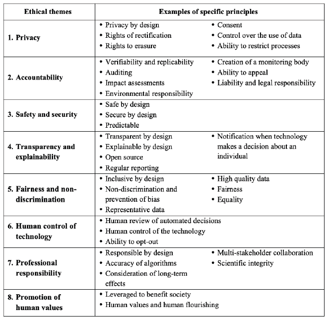

**表 10.1 伦理设计原则**

*来源：摘自 Fjeld 等人（2020 年）的研究*

1\. 隐私

作为一种伦理设计原则，隐私权被视为不可剥夺的人类权利。个人有权控制对自己收集的数据的访问和处理。他们有权在出现错误的情况下纠正这些数据，并有权进行删除。

像比特币、门罗币和 Zcash 这样的公共区块链将匿名性视为隐私权的最终权利。个人通过自己的数字钱包存储的私钥来控制对自己的数据的访问。然而，许多个人还没有足够的技术能力来保护自己的私钥——大多数人最终都依赖于像交易所这样的可信赖第三方来代表他们保护私钥。但个人有这个选择，并且通过持续的教育，将发展出实现自我主权所需的素质。

私有区块链重视保密性，其中需要知道身份，但数据只与授权方共享。如果这些数据涉及个人个人信息，道德隐私设计要求个人同意，并应给予个人访问收集关于他们的信息的权利。例如在我们的案例中，SmartResume 持有者被告知他们的简历是由认证机构创建的。一旦个人选择激活它们，他们就可以控制谁可以看到他们的简历。否则，个人的 SmartResume 是不可见的。至于删除权，第九章介绍了与***行动原则 15：设计符合监管要求***相关的选项。

2. 责任制

由技术做出的决策由谁负责？Fjeld 等人（2020）涵盖了责任制机制，包括结果的可验证性和可复制性；可靠的审计跟踪；包括环境影响在内的影响评估；创建一个中立监控机构；以及因技术造成的损害的法律责任。软件责任法特别复杂，但一般来说，很难让软件作者承担责任。法院通常裁定，黑客而不是软件提供商应对数据泄露负责。7

应用于基于区块链的解决方案时，区块链提供自动验证，因为它们是“发布前确认”而不是“事实发生后确认”。区块链本身具有可审计性。实际上，数字账本*就是*审计跟踪。

然而，需要治理来解决其他责任制原则，特别是与中立监控机构有关。虽然公共区块链依赖全球志愿者网络来监控网络活动，但私有区块链通常依赖更集中的治理结构。

3. 安全与安全

Fjeld 等人（2020）提出了系统安全、预期性能和抵御未授权方攻击的要求。应用于区块链时，许多基于区块链的解决方案的安全性和安全性通常通过在主网上线之前部署测试网来评估。白帽黑客被邀请发现安全漏洞，以便在实际部署之前修复。一旦部署，区块链的分布式设计通过冗余 inherent de-risks 关键基础设施系统。KoreConX 提供了个例子。

**Kiran Garimella 博士的见解，KoreConX 的首席科学家和 CTO:**

*“区块链本质上是坚韧的，因为它们是分布式的。当由于某种原因节点不可用，然后重新连接到网络时，节点会自动与网络中的其他节点重新同步。只要能够形成共识的最少节点数量可用，节点故障就不会影响网络。在我们的测试中，当我们下线我们全球网络的主要区域并重新连接它们时，它们会自动‘愈合’。这个过程完全是自动的。虽然这是区块链的一般优势，但我们通过将节点分布在多个国家、云提供商和部署技术，进一步增强了 KoreChain 的韧性。”*

4. 透明度和可解释性

这些道德原则关注了解技术如何处理信息的权利。在人工智能的情况下，Fjeld 等人（2020 年）认识到深度学习人工智能算法经常掩盖输入如何转化为输出的过程，即所谓的“黑箱”问题。在这里，基于区块链的解决方案具有固有的优势。区块链不仅发布审计跟踪，还发布智能合约的编码。公共区块链为所有人发布这些信息；私有区块链为授权方发布这些信息。简而言之，区块链解决方案本质上是确定性的，因此它们本质上是透明和可解释的。此外，区块链正在被用来为人工智能打开“黑箱”，下一个故事揭示了这一点。

在阿肯色大学，计算机科学系的數據科学教授 Justin Zhan 正在与阿肯色大学医学科学团队合作，预测新冠病毒基因组将如何变异，以便我们可以最大化疫苗的效果。该团队利用来自世界各地的多共享数据源，观察基因组随时间以及从地点到地点的变化。这个预测模型使用了深度学习算法，但这种技术的一个大缺点是它是黑箱——我们看到输入和输出，但我们无法很好地解释箱子内部发生了什么。Zhan 博士提出了基于区块链的可解释人工智能概念，它为每个输入和输出的每次迭代创建一个不可更改的日志，这样人们就可以理解为什么人工智能结果随时间变化的原因。

5. 公平性和非歧视性

Fjeld 等人（2020 年）的公平和非歧视原则要求系统在设计和使用过程中最大化公平性、促进包容性并避免偏见。作为一种道德设计原则，SmartResume 的设计是，招聘组织仅根据技能寻找合格候选人，因为所有人口统计和个人信息都被遮盖了。iDatafy 的创始人兼首席执行官 Dave Wengel 解释说：

*“当 XYZ 货运公司获得 SmartResume 时，他们不知道个人的性别、种族或民族。这是有益的。所以，我们可以帮助他们证明他们在候选人选择上没有表现出任何偏见。”*

6. 人类控制技术

Fjeld 等人（2020 年）认为，任何由技术做出的重要决策都应受到人类的审查。对于区块链环境来说，这一原则呼吁对区块链解决方案进行人类治理。正如我们在第九章中提到的，区块链治理包括一系列决策权，尽管一些权利可能会在链上自动化，但迄今为止，几乎所有公共和私有链都依赖于链下的人类治理。以太坊的发明者 Vitalik Buterin 赞成人类治理：

*“我主张‘紧密耦合’的链上投票被高估了，比特币、比特币现金、以太坊、门罗币和类似系统所实践的‘非正式治理’现状，比普遍认为的要好得多，那些认为区块链的目的是完全消除软绵绵的人类直觉和情感，而代之以完全算法治理（强调‘完全’）的人绝对是疯狂的。”^(8)*

“人类控制技术”原则在采用之前需要对链上治理进行深入考虑。链上治理在没有获得大多数参与者批准的显著软件分叉或干预的情况下是不可更改的。它的目的是提供一种保证——一种内置的承诺，确保区块链网络现在和将来的决策如何做出。^(9) EOS 是其最知名的例子。它推出了拥有保证的民主投票权的区块链网络。比特币和以太坊的矿工对变化进行投票，而 EOS 将决策权从开发者和矿工转移给了用户。截至 2020 年 5 月 5 日，130 万 EOS 账户持有者中有 77,000 人参与了自推出以来的 1,696 次投票，但链上投票仍然不到总参与者的 5%，这表明并非区块链中的所有参与者都可能是治理过程的积极参与者，而只是开发平台的用户。^(10)

具有链上治理的其他区块链网络包括 DFINITY（一个旨在降低云服务成本的基于区块链的云计算项目）；Tezos（一个旨在提高智能合约安全性的基于区块链的项目）；以及 Decred（一种类似于比特币的加密货币，但具有链上治理）。**支持链上治理的论点是保证包容性和去中心化。反对的观点是未预见到的不良后果；无法适应；选民信息不足；以及投票率低。**.^(11)

7. 专业责任

Fjeld 等人（2020 年）认识到人类设计技术，并呼吁他们的专业精神和诚信，确保合适的利益相关者得到咨询，并考虑长远效果。作为区块链开发者，我们有责任确保解决方案准确无误，邀请多方合作，并使用科学方法评估结果。关于最后一点，英国区块链协会联合创始人兼旗舰期刊《JBBA》的主编纳西姆·纳克维博士倡导基于证据的区块链研究。以下是他的见解：

**纳西姆·纳克维博士的见解，证据为基础的区块链中心主席，《JBBA》的主编:**

***“**基于证据的区块链，定义为‘基于专业知识和对组织、利益相关者和科学证据的深思熟虑、明确和审慎的决策’应该是应用区块链的基石。基于证据的决策可以降低失败率 50%，并将正确商业决策的数量增加六倍。在区块链中做出更好决策所需的证据可能并不总是可用，但这绝不是依赖随意基准、意识形态和直觉来指导机构实践的借口。在超竞争的世界里，基于证据的区块链可能是你最大的竞争优势。’*

8. 促进人类价值观

Fjeld 等人（2020 年）讨论了通过使用技术帮助人类繁荣；为许多人提供访问权；以及利用技术更好地社会的原则。根据区块链解决方案的设计方式，可以产生相当大的人类价值。在这本书中，我们突出了一些例子。例如，Stellar 通过使金融服务获取方便且便宜来重视金融包容性；像 IBM Food Trust 这样的食品和商品追溯解决方案，通过了解我们所消费物品的来源和旅程来提供对产品质量的信心；KoreConX 向小型私营公司开放资本市场，使它们能够蓬勃发展；LO3 Energy 和 Share&Charge 的使个人能够做出能源选择。每天都有新的例子出现。例如，安永（EY）最近帮助意大利报业巨头安莎通讯社（ANSA）防止假新闻，通过在公共以太坊上存储令牌来证明新闻来源的合法性。^(12)

如果我们实现区块链解决方案的承诺，我们也将看到人类通过对自己数据的自我主权而繁荣；通过使人们更容易参与和投票实现政治包容；通过将资源部署到最需要的地方实现更大的分配正义；以及通过改善医疗保健和结果实现更好的医疗保健。阿肯色大学（University of Arkansas）商学院高级副董事凯瑟琳·卡利斯勒（Kathryn Carlisle）是设计用于社会公益的区块链解决方案的坚定倡导者。以下是她的见解：

**阿肯色大学 Business Center of Excellence（BCoE）高级管理董事凯瑟琳·卡利斯勒的观点:**

*“我们的金融经济将迎来新人群、新的商业模式和新的标准。新人群指的是区块链为全球 17 亿无银行账户的人提供金融包容性的能力。这些好处不仅适用于发展中国家，也适用于发达国家。想象一下，每个公民在区块链上都有一个自我主权身份，并且能与政府发行的数字钱包互操作。18 岁以上的每个人每个月都可能通过加密货币获得普遍基本收入，或者每四年获得一定数量的‘民主美元’用于政治竞选。新的商业模式将源于智能合约驱动的自动化，新的金融资产类别也将产生。这将为创新打开大门，比如带有智能钱包的无人驾驶汽车；为单曲、新闻文章和捐赠等提供微小打赏和微交易的兴起。新的标准将在价格、速度和交易隐私方面形成。消费者将期望以低成本实现即时私人交易。”*

10.3. 区块链愿景家：他们自己的话

来自安永、阿肯色大学、WeTrade、微软和 IBM 的区块链领导者们为本书画上了圆满的句号，他们分享了关于区块链未来发展的洞见。保罗·布罗迪和丹·康威教授聚焦于跨组织区块链解决方案的价值，以及它们如何帮助小公司有效地与大公司竞争。罗伯托·曼科内预测亚洲在区块链投资领域的崛起，并预言由联盟开发的区块链应用将会减少。迈克·沃克关注新的商业模式和机遇。玛丽·维克呼吁在三个关键发展领域进行更开放的创新。他们的观点均以自己的语言呈现。

**宝洁公司区块链负责人保罗·布罗迪:**

*“区块链将为商业生态系统带来企业资源计划（ERP）对单一企业所带来的一切。过去几十年里，公司通过数字化整合进行了自我转型，其中很大一部分是通过 ERP 系统处理采购到支付或订单到收款等端到端流程的方式实现的。然而，尽管公司内部发生了转变，它们用于外部交易的工具却鲜有改变。借助区块链技术，企业之间将实现同样水平的数字化整合。”*

**对未来企业规模和形态的影响可能是深远的。目前大多数公司最复杂和最具挑战性的工作是管理外部合作伙伴，而事实是，今天大多数真正的大型公司与其说是独立的企业，不如说是庞大网络的 orchestrator。管理这些网络的挑战是巨大的，可以获得的效率同样巨大。从长远来看，区块链可能对大型企业本身的基本性质构成挑战。如果通过区块链技术连接的小公司网络能像一个整合的全球公司一样迅速行动，那么一些规模和规模的巨大优势可能会消失，从而带来一个充满活力的小型和中型企业的新世界。”*

**阿肯色大学 BCoE 教授兼 associate 主任丹·康威:**

**“数据库总是围绕一个单一的组织焦点构建，因此使用数据库的应用程序继承了这种有限的关注。打开和扩展这些系统已被证明是复杂且罕有能够实现超出交易自动化的价值。区块链颠覆了这一格局。现在关注的是组织间的实体本身。区块链创造了这一代人的机会——利用信任和透明度生态系统的巨大价值的机会。对组织间信任和透明度的需求前所未有的巨大。”*

**WeTrade 的联合创始人兼前 COO 罗伯托·曼科内:**

**“至于投资趋势，区块链投资已从西向东转移。2017 年，美国的交易占总投资的 51%，而中国只占 2%。2019 年，这一比例为 31%的美国和 22%的中国。与加密货币投资相比，企业区块链项目并没有吸引必要的资金。2018 年和 2019 年，企业区块链累计投资 7 亿美元，而非企业区块链的累计投资为 63 亿美元。我们肯定正在远离联盟，寻找可以增加与市场上其他玩家竞争优势的杀手级应用。2020 年，我看到了中央银行对 CBDC（中央银行数字货币）兴趣的增加，机构投资者将存款投入加密资产的增加，以及为保管提供宝贵区块链解决方案的公司，如 Anchorage、Ledgeer 和 Knox，提出无需创建联盟即可为保险提供解决方案。”*

**微软公司应用创新高级总监迈克·沃克:**

组织不断受到政府、股东和客户的要求，需要在两个主要方面数字化其业务。第一个方面是通过使用数字技术优化成本，实施实践和技术以避免数据安全漏洞，并伦理和负责任地使用客户数据。第二个方面是利用技术创新，创造新的商业模式和引人注目的客户体验，改善人们的生活和工作方式。在未来五年内，区块链将通过创建数字生态系统的形式，使人们、企业和事物之间产生新的协作方式，从而实现这一点。一个基于区块链的数字生态系统为价值交换网络提供了基础，该网络利用区块链的独特功能，例如：数据自主权、防篡改数据、点对点数据协作和分布式治理。

玛丽·维克，IBM 区块链总经理

“在过去的几年里，区块链已经从围绕比特币和加密货币的炒作和头条新闻演变为推动金融、全球贸易和医疗保健等领域实际利益的企业平台。虽然区块链的技术可行性现在已经很明确，但由于缺乏共同的标准和治理模式，跨行业的普遍采用仍然遥不可及。短期内，我们将看到努力集中在类似企业平台之间的互操作性上，但从长远来看，我认为我们需要在三个关键领域继续进行开源创新：*

身份验证标准，这将使企业用例中的快速上板和促进互操作性成为可能。一旦为区块链建立了数字身份，授予访问权限和验证上下文可以得到加速。这些努力还可能为企业用例打开去中心化公共区块链的业务模型经济学，这些公共区块链通常是匿名的，*

继续在共识方法上进行创新，以实现随着网络采用率的提高，性能和数据共享成本的分步改进。在当前用例中，交易速度从未成为一个问题，但如果我们例如，想要在供应链中提供来源，交易成本必须是微不足道的，并且*

区块链治理模型必须扩展到可以轻松指定数据使用权和生命周期管理，这些管理权需要跨越网络。区块链提供了可信访问，但证明供应商不能在共享平台上看到竞争对手的定价仍然在新网络形成中需要花费大量时间和精力。提供标准方法，按角色记录访问控制，并自动测试这些数据使用权的有效性，将加速行业采用.*

我们已经证明，随着采用率的提高，区块链的好处也在增加，因此解决这些问题将推动指数级价值创造，并标志着将区块链从企业引入大众的下一个前沿领域。

10.4. 结论

希望读者现在已经有足够的证据同意，确实有一件大事正在进行。区块链有潜力改变我们交换价值的方式，正如互联网改变了我们交换信息的方式。区块链向我们展示了新的方法来减轻交易对手风险，提供可靠的会计记录，并通过使用密码学、数字代币、共识算法、分布式账本和智能合约来保护网络。这不仅仅是幻想；公共区块链已经有超过十年的运营历史和不错的业绩记录。当出现像 DAO 或 51%攻击这样的失误时，我们从中学习。社区在每次软件开发和升级的迭代中改进技术。私有区块链的历史较短，但早期企业采用者正在证明该概念并实现与生态系统合作伙伴共享解决方案的价值。

公共和私有区块链是否会继续平行发展，融合，相交，或者以一种取代另一种的方式尚不确定。早期迹象表明，公共区块链上的保密（而不是匿名）交易可能成为主导模式。就我个人而言，我不认为公共与私有区块链是二选一的选择。正如系统理论所告知的，***等效性***是开放系统的固有属性，即通过许多路径可以达到一个最终状态。^(13)在我看来，“价值互联网”的最终状态可能将是公共*和*私有解决方案；*和*混合解决方案；*和*与现有记录系统接口的区块链解决方案。 anyway，这不仅仅是关于技术；更重要的是技术的设计伦理以及它能带来的价值，这让我——也希望读者——保持参与。

引用

^(1) Goldin, I., and Mariathasan, M. (2014), *The Butterfly Defect*, University of Princeton Press, Princeton New Jersey.

^(2) Bradbury, R. (June 28, 1952), ‘The Sound of Thunder’, *Collier’s Magazine*.

^(3) Van Hoek, R., and Lacity, M. (April 27, 2020), ‘How the Pandemic Is Pushing Blockchain Forward’, *Harvard Business Review*, [`hbr.org/2020/04/how-the-pandemic-is-pushing-blockchain-forward`](https://hbr.org/2020/04/how-the-pandemic-is-pushing-blockchain-forward)

^(4) Van Hoek, R., and Lacity, M. (April 27, 2020), ‘How the Pandemic Is Pushing Blockchain Forward’, *Harvard Business Review*, [`hbr.org/2020/04/how-the-pandemic-is-pushing-blockchain-forward`](https://hbr.org/2020/04/how-the-pandemic-is-pushing-blockchain-forward)

^(5) 塔普斯科特，D.，塔普斯科特，A. (2020), *区块链在大流行中的解决方案*, 区块链研究所特别报告, [`www.blockchainresearchinstitute.org/blockchain-and-pandemics/`](https://www.blockchainresearchinstitute.org/blockchain-and-pandemics/)

^(6) Fjeld, J., Achten, N., Hilligoss, H., Nagy, A., and Srikumar, M. (2020), *原则性人工智能：伦理和基于权利的方法原则的共识地图*, 研究出版物第 2020-1 号，伯克曼 Klein 网络与社会中心, [`cyber.harvard.edu/publication/2020/principled-ai`](https://cyber.harvard.edu/publication/2020/principled-ai)

^(7) Insureon (2016 年 1 月 28 日), *软件责任保险现状*, [`www.insureon.com/technology-business-insurance`](https://www.insureon.com/technology-business-insurance)

^(8) Buterin, V. (2017), *区块链治理笔记*, [`vitalik.ca/general/2017/12/17/voting.html`](https://vitalik.ca/general/2017/12/17/voting.html)

^(9) Frankenfield, J. (2018 年 4 月 4 日), *链上治理*, Investopedia. [`www.investopedia.com/terms/o/onchain-governance.asp`](https://www.investopedia.com/terms/o/onchain-governance.asp)

^(10) *EOS 区块生产者选举*, [`eosauthority.com/producers_schedules`](https://eosauthority.com/producers_schedules)

Lacity, M., Zach, S., Paul, C. (2019), *区块链治理模型：企业洞察*（第 2 版，第 2019 卷），区块链卓越中心。

^(11) Buterin, V. (2017), *区块链治理笔记*, [`vitalik.ca/general/2017/12/17/voting.html`](https://vitalik.ca/general/2017/12/17/voting.html)

^(12) EY 全球区块链会议：*走向公开*. 2020 年 4 月 20 日。

^(13) 贝塔兰菲，路德维希·冯 (1969), *一般系统理论：基础、发展、应用*, 纽约，布拉齐勒。

* * *

**^((i))** 回想一下 第三章 提到的，几乎所有听说的比特币盗窃案都是通过盗窃链下私钥发生的，而不是通过篡改分布式账本。

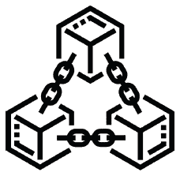
