## 词汇表

本词汇表涵盖了术语、主要事件和补充信息。

**行动原则：** 一种促进商业项目成功的管理实践。行动原则与“最佳实践”相似，因为两者都试图从前期的经验中分享知识。然而，与“最佳实践”不同的是，“最佳实践”暗示模仿总是推荐的，并且总能产生类似的结果，而行动原则则认识到情境的重要性。深思熟虑的实践者会根据组织试图实现的目标；组织是否有吸收行动原则有效实施的能力；以及时机——有些时候行动比其他时候更好来决定行动原则的有用性。

**替代币：** 替代币是比特币的替代加密货币。通常，替代币是通过下载比特币核心，修改编程代码，并启动一个新的网络来创建的。Namecoin 和 litecoin 是例子。随着时间的推移，这个术语已经过时了。

**匿名性：** 在区块链的背景下，交易发送者和接收者的身份是未知的。匿名性与保密性（见下文）是不同的。

**反洗钱（AML）：** 要求金融机构报告洗钱活动的法规，洗钱被定义为一种非法实践，即将犯罪所得转化为看似合法的现金来源。示例 AML 法规包括 1970 年的美国银行保密法；2018 年的英国制裁和反洗钱法；以及 2015 年和 2020 年欧盟的 AML 指导方针。^(1)

**应用程序编程接口（API）：** API 是连接两个软件应用程序的软件片段，这样其中一个应用程序就能向另一个应用程序发送消息并接收响应。例如，比特币有超过 100 个 API。比特币的示例 API 包括编程代码，用以指示最长链中的区块数（'GetBlockCount'）；创建一个新的比特币钱包（'CreateWallet'）；以及列出所有被禁节点的 IP 地址（'ListBanned'）。参见[`bitcoin.org/en/developer-reference`](https://bitcoin.org/en/developer-reference)。

**非对称密钥算法：** 一种使用一对数学上相关的数字“密钥”（一个公钥和一个私钥）的加密技术。用户可以通过使用私钥加密消息来数字签名消息。*“这是有效的，因为任何消息接收者都可以验证用户公钥能够解密消息，从而证明用户私钥用于加密消息。如果用户的私钥确实是秘密的，那么可以推断出是用户（而不是某个冒名者）真的发送了消息。”*^(2) RSA、DSA 和 ECC 是三种具体的非对称密钥算法示例（参见各条目的下文）。

**原子交换：** 确保与交易相关的*所有*动作执行，或者*所有*动作失败；不应允许部分执行。例如，如果爱丽丝想向鲍勃发送一些价值，原子交换将确保要么（a）从爱丽丝的账户中扣款并且向鲍勃的账户中充值，要么（b）两个动作都不发生。

**仁慈的独裁者：** 一种治理模式，其中一个人或单个组织拥有决策权，并根据社区的最好利益做出决策。

**比特币：** 这个术语比特币指的是整个比特币应用以及其原生数字货币，即比特币加密货币。

**比特币（应用）：** 比特币应用是一个点对支付应用。由中本聪在 2008 年通过结合许多现有的创新构思，比特币网络于 2009 年上线。^(3) 中本聪采用了公私钥加密来验证资产所有权，一个工作量证明（Proof-of-Work）共识协议来验证交易并将其添加到账本中，以及散列和默克尔树的使用，以在一个完全分布式、点对点、公共网络中保护交易。其创新之处在于，数字账本被结构化为一系列区块，并创建了一种名为比特币的原生数字货币。

**比特币（加密货币）：** 比特币是在比特币区块链内的原生数字货币。比特币被设计成一种稀缺资源，其最大货币供应量为 2100 万个比特币。2009 年首次释放了 50 个比特币，最后一批将在 2140 年释放。比特币大约每十分钟增加一次货币供应量，以此奖励矿工创建一个事务区块。每 210,000 个区块，矿工的奖励减半，这样比特币在其早期年份的释放量比后来年份要多。截至 2020 年初，大约 85%的货币供应量已经被释放。

**区块头：** 每个区块链中的区块都包含一个带有重要信息的头部，如区块的唯一 ID；区块中的交易数量；创建区块的时间；区块大小（以计算机存储为单位）；以及对前一个区块的指针。 图 G.1 提供了比特币区块头的示例。在这个示例中，我们正在查看比特币区块链中的第 507,980 个区块。头部的摘要数据表明区块有效载荷中有 1,838 笔交易；它的“高度”等于其在区块链中的序列（区块 507980）；“区块奖励”表明获胜矿工为其使用计算机资源验证交易和创建区块赚得了 12.5 比特币；“时间戳”指示区块是在 2018 年 2 月 6 日的确切秒创建的；“Merkle 根”显示了用于确保区块安全的 Merkle 哈希序列（见下面的**Merkle 根**条目）的结果；“前一个区块”是指向该区块前驱的指针。“位数”和“大小”指示存储该区块所需的计算机存储量。“版本”指示要遵循比特币区块链规则的集合。 “难度”和“nonce”与比特币的工作量证明（Proof-of-Work）共识算法相关。从功能上讲，难度表明矿工的计算机（们）必须找到多少个前导零（在万亿次的随机尝试之后），才能找到唯一的“区块哈希”。在这个区块中，注意区块哈希有 18 个前导零。难度是矿工的计算机进行了大量计算以赚取区块奖励（见**工作量证明**条目）的证明的一部分。

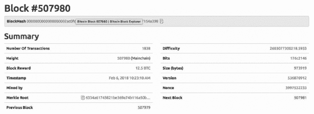

**图 G.1：比特币区块头的示例**

**区块链：** 这个词有多种用法。有时，这个词泛指我们所说的“区块链应用”。例如，人们把比特币和以太坊称为“区块链”。这个术语也可以用来描述数字账本结构。具有区块链结构的，新提交的交易会被序列化并收集到一个区块中（见图 G.2）。该区块包括一个头部和交易载荷。区块头部包括对前一个交易块的指针，形成了一个按顺序排列的区块链，一直回溯到第一个区块，称为“创世区块”。

**图 G.2：分布式账本结构为区块链**

**区块链应用（Blockchain application）**：区块链应用是一个点对点的系统，用于验证、时间戳和永久存储交易在共享的**分布式账本（distributed ledger）**上。**数字资产（Digital assets）**，是每个区块链应用的本地资产，只以数字形式存在，并带有使用权利。**密码学（Cryptography）**和**共识（consensus）**算法用于验证交易，更新账本，并保持账本和网络的安全。大多数区块链还使用**智能合约（smart contracts）**，根据预先同意的条件自动执行交易。

**系统的拜占庭容错（Byzantine Fault Tolerance of a system）**：分布式网络在一定数量的节点出现故障或甚至是恶意的情况下仍能正常运行的能力。一个普遍的规则是，像区块链这样的点对点分布式系统即使有三分之一的参与节点出现故障也能正常运行。

**拜占庭将军问题（Byzantine Generals’ Problem）**：这是一个由 Leslie Lamport, Robert Shostak, 和 Marshall Pease（1982）描述的概念性情境，用于探讨如何在一些未知数量的节点出现故障的情况下，去中心化的通信网络如何达成共识。在他们隐喻中，拜占庭将军代表一个计算机节点；一些将军忠诚（即无故障）而一些将军不忠诚（即故障）。Lamport 等人（1982）证明了，只要三分之二的节点正常工作，去中心化网络就能达成共识。^(4)

**集中式网络（Centralized network）**：参见**网络结构（Network structures）**条目。

**代码基础（Code base）**：基于公认规则（即协议）的编程指令集。

**强制性影响（Coercive influences）**：参见**制度同质性（Institutional Isomorphism）**条目。

**机密性（Confidentiality）**：在区块链的背景下，只有授权的各方才能知道参与方身份或交易详情。

**共识协议:** 共识协议是确保分布式账本副本一致的规则。共识协议用于对抗**公共悲剧**和**拜占庭将军问题**（请参见单独的条目）。尽管共识协议在验证程序上各不相同，但一般来说，所有的共识协议都旨在验证所有权，并确保在将交易添加到官方分布式账本之前交易已被资助（即没有双重支付）。验证过程始于当新交易被广播到网络时。计算机算法验证资产的所有权（基于所有者用其私钥签名的数字签名）并检查资产是否已被赠与，通过扫描账本来防止双重支付。哪个节点能够收集验证的交易并将它们添加到官方账本，取决于网络的共识协议。已经使用和提出了许多共识协议，包括工作量证明；权益证明；活动证明（结合了权益证明和工作量证明）；权威证明；烧毁证明；容量证明；已过时间证明；倾听证明；和运气证明。

**联合体引领创新:** 在区块链的背景下，联合体为竞争对手和生态系统合作伙伴提供了一种结构，使其能够合作推进共同的区块链项目。

**Coopetition:** 由“cooperation”（合作）和“competition”（竞争）两个词合成的词汇。Coopetition 认识到公司之间存在复杂的相互依赖关系。在某些领域，争夺市场份额的公司也会合作以实现共同利益，例如定义标准、构建零部件或降低共同的行政和基础设施成本。^(5)

**Corda:** 由 R3 Consortium 开发的开源分布式账本平台。Corda 旨在提高隐私性，减少数据冗余并提高可扩展性。Corda 使用公钥和私钥加密以及散列，并创建永久的、不可更改的记录，这些记录存在于交易伙伴之间。作为一个私有协议，参与者被分配一个加密身份，该身份与一个“现实世界”的身份（如法律实体标识符）相关联。^(6) 一方一旦加入，就可以将一份法律合同转换成智能合同代码，以与另一个 Corda 方或多方进行交易。不同于将整个账本分发给网络上的所有人，Corda 在智能合同中定义的参与交易的各方之间直接创建节点间交易。^(7) 每个 Corda 参与者只看到他们有权访问的数据子集。这一功能是通过使用多重组合密钥（参见下面的条目）实现的。^(8)

Corda 具有可配置的共识，这意味着合同各方可以选择他们喜欢的共识协议，这很可能是拜占庭容错（BFT）或 Raft。^(9) Corda 账本建立在关系数据库技术之上，因此不使用块结构。它选择这种结构，以便参与者可以轻松地使用 SQL 查询账本。如果系统中的至少两方同意交易的有效性，则数据被认为是“在账本上”；而只有一方持有的数据是“离线账本”。Corda 的设计是可扩展的，因为网络流量和数据存储较少，比大多数 DTL 协议更私有，并且一旦节点达成一致就结算交易。^(10)

随着时间的推移，Corda 的架构发展到了一些人不再认为它是一个区块链的地步；Corda 缺乏公共区块链的某些定义特征：它没有原生数字货币，它不广播交易，它不分发共享账本。事实上，Corda 的主要架构师称 Corda 为“受区块链启发的”。^(11) 第一个版本于 2016 年 11 月发布。^(12)

**对手方风险**：每个交易方承担的另一方将不履行合同义务的风险。

**跨链预言机**：一个区块链应用程序从另一个区块链应用程序中读取数据。单向读取也称为“单向 peg”。

**跨链交易处理**：两个或多个区块链协调操作，使单一资产可以被多个链使用。这也称为“双向 peg”。

**密码学**：在第三方敌对者存在的环境中使用数学和计算机算法确保数据安全的科学。

**CryptoNotes**：一个旨在提高区块链匿名性的协议。

**加密货币交易所**：一个可信赖的第三方，作为加密货币的货币传输者或市场制造商。Coinbase、Binance 和 Huobi 是例子。

**去中心化自治组织（DAO）**：一种特殊的智能合约，根据智能合约中的编码规则自动运行整个组织。DAO 的想法是创建一个完全独立的实体，它只由您编程的规则治理，并且“活在”链上。这不仅仅是用区块链来管理一家公司：相反，代码就是整个公司。而且它无法停止。^(13)

**去中心化网络**：参见**网络结构**条目

**委托权益证明（DPoS）：** 由 BitShares、Steemit 和 EOS 的创始人 Daniel Larimer 创建的共识协议。^(14) 使用这种方法，任何拥有加密货币的人都可以投票选举验证节点。得票最多的验证节点成为“代表”（参见图 G.3）。算法轮流从代表小组中选择一个领导者进行当前时间段。时间周期过后，进行另一轮投票以选择下一个代表小组。代表们会获得交易费用。DPoS 比工作量证明（Proof of Work, PoW）更快、资源更少地解决交易，并且比受权限的协议更具民主性。^(15) EOS 使用 DPoS。

**民主：** 一种任何参与者都有平等投票权的治理模式。

**拒绝服务（DoS）攻击：** 一种恶意攻击，通过发送如此多的交易来淹没网络，以至于合法用户的服务被中断。

**数字签名：** 一种使用计算机而不是手写签名来签署交易的方法，从而证明某人有权这样做（更多详情请参见第三章）。

**数字钱包：** 一种存储与持有数字资产的地址相关联的私钥的软件。数字钱包是进入许多区块链的入口点或界面。如果存储在区块链之外，私钥是证明分布式账本上拥有某资产的唯一方式。如果数字钱包被销毁或被黑客攻击，就无法将其找回。因此，数字钱包是区块链应用程序的主要安全漏洞。

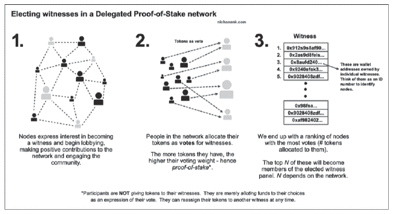

**图 G3：委托权益证明（DPoS）投票过程**

*来源：* [`en.bitcoinwiki.org/upload/en/images/8/8b/Consensus-algorithms-pos-dpos.png`](https://en.bitcoinwiki.org/upload/en/images/8/8b/Consensus-algorithms-pos-dpos.png)

**有向无环图（DAG）：** 一种只单向流动且没有反馈循环的图表。在区块链的背景下，单向图可以用来表示交易的时序。Iota 的“纠缠”根据 DAG 来结构其账本（参见图 G.4）。

**颠覆性创新：** 一种基于新商业模式的创新，针对服务不足的客户或创建可能最终威胁到传统竞争对手市场份额的新市场。这个术语来自克莱顿·克里斯滕森的颠覆性创新理论。^(16)

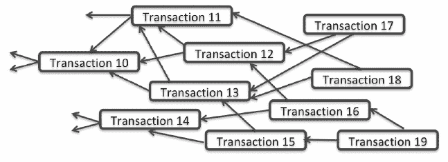

**图 G.4：结构为交易纠缠的分布式账本**

**分布式账本：** 作为区块链应用的一个组成部分，分布式账本是一个时间戳的、永久的、所有有效交易记录的集合，这些交易发生在给定的区块链应用中。区块链网络的每个节点都有一个相同的副本；没有节点是主导的。

**分布式网络:** 参见**网络结构**条目

**DSA (数字签名算法):** 一种生成私钥-公钥对的非对称密钥算法。由国家安全局（NSA）员工 David Kravitz 设计，美国国家标准与技术研究院在 1990 年代采用了它。^(17)

**椭圆曲线加密（ECC）:** ECC 是在区块链应用中生成私钥-公钥对的一种常见方法。基本原理是，ECC 算法通过在大的椭圆曲线上来回弹跳***n***次来将私钥转换为公钥，其中***n***等于私钥。如果仅拥有公钥，理论上不可能推算出私钥。比特币中使用的特定 EC 曲线是 y² = x³ + 7（见图 G.5）。这被称为 SECP256K1。如果我们给某人起始点 G 和终点公钥（x, y），即使拥有这个图的方程，某人也无法轻易确定 n（私钥）。

**图 G.5：比特币的椭圆曲线加密**

*来源：[`en.bitcoin.it/wiki/Secp256k1`](https://en.bitcoin.it/wiki/Secp256k1)*

算法从基点 G 开始，在图上移动***n***万亿次，等于私钥，最终落在最终的（x,y）坐标上，该坐标成为公钥。

**EOS:** EOS 由 Block.one 的首席技术官 Daniel Larimer 和首席执行官 Brendan Blumer 开发。他们想要一个像以太坊这样的公共区块链平台的优势——开放、安全、去中心化——来构建和运营去中心化应用，但不希望有延迟、有限的可扩展性和资源密集度。EOS 主网于 2018 年 6 月正式上线。任何人都可以查看区块链（[`bloks.io/`](https://bloks.io/)）并使用 EOS。只要符合最低标准，任何人都可以运营验证节点：个人或组织必须拥有公共网站 URL；至少一个社交媒体账户；在 Steemit 上的 ID；足够的硬件；扩展硬件的计划；造福社区的计划；电报和测试网络节点；一个路线图；以及一个股息位置。^(18)然而，只有 21 个“区块生产者”可以添加区块。这些区块生产者是通过一种委托权益证明机制（见词汇表条目）选出的，EOS 的所有者按照其持股比例投票选出区块生产者。^(19)区块生产者通过发行新的 EOS 代币来获得奖励。每隔大约 500 毫秒产生一个区块，每个 21 个生产者轮流拥有一个区块。在本文撰写当天，EOS 的交易价格为 2.35 美元，区块生产者分布在中国（八个节点）、新加坡（三个节点）、开曼群岛（两个节点）、美国（两个节点）以及英属维尔京群岛、加拿大、香港、日本、韩国和乌克兰（各自运营一个节点）。

**ERC-20 代币**：用于在以太坊上创建可交换的数字资产的标准，这些资产可以与其他可交换代币进行交换。每个代币都是等价的，并且具有相同的价值。代币必须满足定义总货币供应量、指定可以传输到用户账户的代币数量、提供提取账户余额的方法、允许将代币传输到其他账户，以及检查交易是否超过货币供应量以防止伪造的强制性要求。可选的，ERC-20 代币可以被赋予代币名称、符号和十进制值（最多 18 位小数）。例如，Aion (AION); Augur (REP); EOS (EOS); Golem (GNT); Maker (MKR); TRON (TRX); 和 VeChain(VET) 都是 ERC-20 代币的例子。

**ERC-721 代币**：用于在以太坊上创建非可兑换数字资产的标准，每个代币都是独一无二的，并且可能与其同类代币的价值不同。ERC-721 代币只能与相同类型的其他代币进行交换。ERC-721 代币必须满足包括地址余额；代币所有权；代币批准和转让在内的必要功能。CryptoKitties 是最早的 ERC-721 代币，在 2017 年获得了流行；每个 CryptoKitty 都是独一无二的。尽管 CryptoKitties 是只存在于以太坊内的原生数字货币，但 ERC-721 代币可以用来表示具有独特数字双胞胎的独特资产，该数字双胞胎存在于以太坊内。例如，安永的 WineChain 代币就是这样一个例子；安永用 ERC-721 代币将 1100 万独特的葡萄酒瓶进行了代币化。

**以太币**：以太坊的原生数字货币。以太币与其说是一种加密货币，不如说它是一种“加密燃料”，意味着它是一种主要用于支付以太坊平台费用的代币。像比特币一样，以太币是通过挖掘区块的过程释放的，矿工也会收到发送者添加到其交易中以支付验证和添加到账本的钱。以太坊的区块奖励最初是 5 个以太币，但在 2017 年减少到 3 个，在 2019 年又减少到 2 个。截至 2019 年 8 月 26 日，以太币的交易价格为 188.49 美元；网络上有 8977 个活跃节点，账本上已添加了 8426754 个区块。以太币的货币供应总量尚不清楚；每年最多可以挖掘 1800 万个以太币。例如，CryptoKitties 是最早的 ERC-721 代币，在 2017 年变得流行；每个 CryptoKitty 都是独一无二的。虽然 CryptoKitties 是只存在于以太坊内的原生数字货币，但 ERC-721 代币可以用来表示具有独特数字双胞胎的独特资产，该数字双胞胎存在于以太坊内。安永的 WineChain 代币就是这样一个例子；安永用 ERC-721 代币将 1100 万独特的葡萄酒瓶进行了代币化。

**以太坊**：维塔利克·布特林（Vitalik Buterin）在年仅 19 岁时撰写了 2013 年的以太坊白皮书，该白皮书最终成为了以太坊平台。维塔利克·布特林、加文·伍德和杰弗里·威尔克通过成立位于瑞士的以太坊基金会开始了以太坊的工作。根据以太坊基金会：*“以太坊是一个社区驱动的项目，旨在去中心化互联网并将其带回其民主根源。它是一个构建和部署应用的平台，这些应用不需要依赖信任，也不能受到任何中心权威的控制。”*²⁸以太坊的智能合约是其主要的创新之处，它将区块链从交易验证和结算协议扩展到了一个可以启动去中心化应用（DApps）的平台。只要它们符合**ERC-20**或**ERC-711**指南[（见上述单独条目）]，DApps 可以创建和交易新的原生数字货币，除了以太币。

**以太坊基金会**：维塔利克·布特林（Vitalik Buterin）、加文·伍德（Gavin Wood）和杰弗里·威尔克（Jeffrey Wilcke）在瑞士成立了一个非营利组织——以太坊基金会，并以此开始了以太坊的工作。该基金会最初在 2014 年 8 月通过对其原生数字货币“以太”的首次代币发行（ICO）获得资金。以太坊于 2015 年 7 月上线，初始发行了 6000 万个以太币，以太坊基金会保留了 2000 万个以太币。该基金会筹集了超过 1600 万美元。²⁹

**交易所**：见**加密货币交易所**条目。

**Fabric**：见**Hyperledger Fabric**条目。

**联邦**：一种治理模式，其中去中心化的小组专注于项目的部分内容，同时与一个中心小组协调。

**分叉**：区块链向两个或更多个独立路径的演变。软分叉是临时的，而硬分叉是永久的（见图 G.6）。

**硬分叉**：硬分叉是区块链的永久性、分叉路径。硬分叉通常发生在两种情况下。首先，有人可能会通过复制和修改源代码来创建他们自己的区块链或数字资产。其次，当开源社区对下一个协议版本的规则意见不一致时，也可能会发生硬分叉。例如，当矿工在 2017 年对提议的升级意见不一致时，比特币分叉为“比特币”和“比特币现金”。在另一个例子中，当社区对修复 DAO 攻击意见不一致时，以太坊分为“以太坊”和“以太坊经典”（见第八章中的故事）。

**分叉（软分叉）：**有时两个节点会同时创建下一个区块，导致出现两个版本，称为软分叉。在一段时间内，网络中的不同节点将会在账本的不同分支上工作，直到其中一个被确立为最长，因此是有效的分支。软分叉也发生在开源软件计划的升级过程中。当未升级的节点不遵循新的共识规则时，区块链暂时出现分叉。^(31)未升级的节点仍然可以在一个设定的时间内挖矿，因此，升级的节点需要挖得更快，成为最长，因此也是最有效的链。^(32)实际上，开源社区试图让大多数人提前同意软分叉。

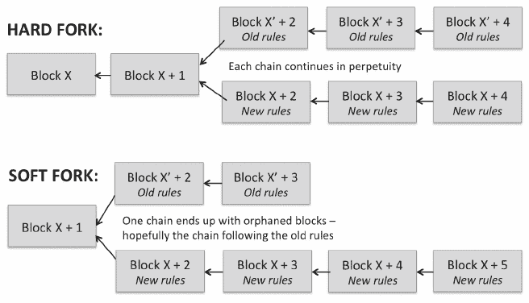

**图 G.6：硬分叉与软分叉**

***硬分叉是区块链中的永久分叉。软分叉是节点升级新规则时区块链中的临时分叉；按照旧规则挖矿将不会赢得区块，因此，如果一切按计划进行，节点最终会加入新链***。

**治理：**定义了区块链倡议的决策权。

**哈希：**一种将一个输入转换成不同输出的算法。给定一个特定的输入，相同的输出总会被生产出来。一个好的哈希算法使得根据输出值确定输入值在实际操作中变得几乎不可能，这就是为什么哈希函数被称为“单向”函数。SHA-256 在区块链中广泛使用。区块链在许多地方使用哈希来增加安全层次。公钥被哈希成地址；交易中的地址和金额被哈希以创建独特且安全的交易 ID；区块中的交易 ID 被多次哈希在一起以产生一个**默克尔根**（见下文）位于区块头部；所有区块头中的数据被哈希以创建独特且安全的区块 ID。

**哈希时间锁定合约（HTLC）：**一种智能合约，它将发送者的价值锁定在合约中，直到接收者使用秘密键和其数字签名在地址中提取价值（这就是“哈希锁”），或者合约到期并将价值返回到发送者（这就是“时间锁”）。

**海森堡缺陷：**一种在计算机编程中逻辑错误，其行为会不可预测地改变。^(33)这个错误以海森堡不确定性原理命名，该原理断言，对一个粒子的了解越精确——比如它的位置——对另一个粒子的了解就越不精确——比如它的动量。

**十六进制：**一种基数为 16 的数字系统，常用于区块链密码学中。这 16 个数字通常表示为 0,1,2,3,4,5,6,7,8,9,A,B,C,D,E 和 F。

**超级账本 Fabric:** 超级账本 Fabric 是 Linux Foundation 于 2015 年 12 月启动的超级账本项目旗下赞助的一个项目，该项目是一个非营利组织，旨在推动企业级区块链在各行业中的应用。^(34) 尽管超级账本项目还有其他主要的区块链框架，但 Fabric 因其被 IBM、沃尔玛和马士基等企业采用而受到了相当的媒体关注。^(35) Digital Asset Holdings 和 IBM 最初对 Hyperledger Fabric 的代码库做出了贡献。包括富士 itsu、通用电气、日立、道富银行和 SAP 在内的 26 家其他公司贡献了 2017 年发布的开源代码。^(36) Fabric 的账本结构为区块链，有两个子系统：“世界状态”和记录所有导致当前世界状态的交易的事务日志。参与者可以创建自己的通道，这是一个单独的事务账本。在通道内，每个节点都拥有相同账本的一份副本。^(37) Fabric 还具有智能合约功能，称为 Chaincode，用于将外部应用程序连接到世界状态账本。

**超级账本项目（HLP）：** 2015 年 12 月，Linux 基金会启动了这家非营利组织，旨在推动企业级区块链在各行业中的应用。^(38) Apache Web 服务器的开发者布莱恩·贝海恩德（Brian Behlendorf）担任执行总监。截至 2020 年 1 月，其网站上列出了 275 家企业成员。截至 2020 年，HLP 监督着六个主要分布式账本项目：Fabric（见上文条目）；Sawtooth；Iroha；Burrow；Indy；以及 BESU。HLP 还在开发四个工具（Avalon、Caliper、Cello 和 Explorer）并建立四个库（Quilt 用于区块链互操作性；Ursa 用于密码学；Transact 用于智能合约；以及 Aries 用于数字凭证）。^(39) Hyperledger GRID 由 Cargill 捐赠，作为供应链的参考实现，包括数据类型、数据模型和智能合约业务逻辑。^(40)

**不可变性：** 相对于区块链而言，不可变性意味着已添加到数字账本中的交易或智能合约永远无法更改。对于比特币和以太坊等公共区块链来说，不可变性意味着错误无法修复，除非 51%的节点同意通过回滚账本和创建硬分叉来修复错误。对于私有区块链，授权方可以提交反转先前错误的交易，但将保留导致当前账户余额的全部交易历史。不可变性的好处是，交易伙伴可以依赖一个历史记录来进行数据来源和可追溯性验证。不可变性可能与要求在一定时间后销毁数据的法规或企业政策相冲突，但有许多实践可以解决此问题，例如将私有数据离链保存。^(41)

**首次代币发行（ICO）：** 通过 ICO，初创公司宣布他们希望通过发行新币筹集资金，即新的加密货币。投资者购买代币，而不是公司的股份。尽管有许多合法的 ICO，但投资者被警告要彻底审查 ICO 项目，以避免被骗。

**首次交易所发行（IEO）：** 在加密货币交易所上进行的融资轮次。投资者用硬币为他们的交易所钱包注资，并使用这些资金购买筹资公司的代币。币安（Binance）、火币（Huobi）、OKEX、KuCoin 和 BitMax 是提供 IEO 服务的交易所的例子。^(42)

**制度同形性：** 一种描述行业内竞争对手在结构上越来越相似并随着时间的推移采用类似做法的过程的理论。保罗·迪马吉奥（Paul DiMaggio）和沃尔特·鲍威尔（Walter Powell）首次阐述了这一理论。^(43) 该理论确定了三种推动机构一致性的压力：模仿的、强制的和规范的。***模仿影响***源于这样一种观念：同行组织更为成功；通过模仿同行行为，该组织旨在取得类似的结果。***强制影响***来自于其他组织对一个他们所依赖的组织施加的正式和非正式的政治压力。政府法规、法律要求以及提高合法性的仪式实践等都是强制影响的例子。***规范影响***源于职责、义务和专业规范，包括正规教育以及寻求合法化其存在的专业和行业协会。迪马吉奥和鲍威尔写道：“许多职业道路在入门级和整个职业发展过程中都被如此严格地保护，以至于达到顶端的个人实际上是难以区分的”。^(44)

**接口（区块链）**：通过应用程序编程接口（API）访问区块链应用程序的接入点。对于最终用户来说，接口包括数字钱包；网关；锚点；交易所；网络门户；以及物联网设备。

**Interledger 协议（ILP）**：两名 Ripple 工程师在 2015 年发表了 ILP 的白皮书。对于给定的支付，ILP 协议通过在微支付之间发送许多带有确认的微支付，以最小化节点可能窃取或未能通过网络发送支付的风险。

**物联网（IoT）**：一个术语，指的是将具有唯一标识符的设备连接到互联网，以便从那些设备收集和发送数据。

**互联网协议（IP）地址**：分配给连接到互联网上的每个设备的唯一数字。这就好比每个设备都有一个街道、城市、州和邮编。一个示例 IP 地址（在版本 4 中）是‘172.16.254.1’。

**互操作性**：一个系统使用另一个系统的能力。^(45) 与区块链相关，互操作性意味着一个区块链可以连接到不同的区块链或不同的记录系统。

**了解你的客户（KYC）**：要求金融机构验证与客户保持业务关系时的身份、适用性和风险的法规。KYC 法规的例子包括 2001 年的美国爱国者法案和 2017 年的英国反洗钱法规。^(46)

**闪电网络**：一种跟踪资金在区块链之外的中间转移的协议，只将初始信用和最终账户余额转移的价值发布到区块链上。这个解决方案通过消除中间交易，帮助清理区块链网络。

**曼德尔 bug**：一个复杂且难以发现的计算机编程逻辑错误，因此难以检测。它以数学家本尼迪克特·曼德尔 brot 的名字命名，他表明复杂的现象可以由简单的规则产生。

**英才制**：一种治理模式，其中权力由基于其证明的能力的个人或组织持有。

**默克尔根**：这个名字来源于美国计算机科学家拉尔夫·默克尔，默克尔根是数字对之间的一系列散列的结果。在区块链应用中，这些数字是交易对的配对（参见图 G.7）。计算默克尔根的过程产生一个非常安全的区块，因为如果单个交易中的任何一个数字被更改，后续计算检查默克尔根将揭示一个更改。对于给定的区块，默克尔根被添加到区块的头部。

**图 G.7：默克尔树**

***在这个示例中，一个区块包含 8 笔交易。每笔交易都通过哈希进行加密。然后，交易的哈希再次通过哈希四个交易对。接下来，两个哈希对被哈希。然后，最后一个哈希对再次被哈希，生成根哈希，即默克尔根。***

**模仿性影响：** 见**制度同质性**条目

**最小可行性生态系统（MVE）：** 成功推出最小可行性产品所需的最少生态系统合作伙伴数量。参与者太多会减慢发展；太少则解决方案将不实用或不吸引人。在区块链的背景下，IBM 建议应该将竞争对手包括在 MVE 中以建立信任。^(48)

**最小可行性产品（MVP）：** 具有吸引早期采用者所需的基本功能的产品初步版本。早期采用者提供反馈以改进产品，例如提出新功能和功能。MVP 的目的是用尽可能少的资源测试产品；通过早期采用者的反馈加速学习；在竞争对手之前占据解决方案的位置；以及开始建立品牌。^(49)

**挖矿：** 见**工作量证明**条目

**挖矿池：** 矿工组成的群体，他们共同 pool 资源并同意根据他们贡献的挖矿哈希功率比例分享区块奖励。挖矿池对普通矿工有吸引力，因为它们使奖励变得平稳，并使其更具可预测性。^(50)

**使命：** 正式声明，表达一个组织或社区的抱负和价值观。

**利用加密货币进行洗钱：** 世界各地的犯罪分子使用加密货币进行洗钱，将犯罪的利润转化为看似合法的现金来源。例如，2016 年 1 月，荷兰有 10 人被逮捕，他们使用比特币洗大量现金。^(51) 在另一个例子中，一名俄罗斯男子在希腊因将 40 亿美元洗入虚拟货币而被逮捕。^(52) 美国药物管理局（DEA）对加密货币作为犯罪收益洗钱手段的日益增长的使用表示担忧，这种犯罪收益在美国每年大约价值 3000 亿美元。^(53) 在 2017 年的报告中，DEA 表示：“比特币和其他虚拟货币作为洗钱漏洞新兴，使跨国犯罪组织（TCO）能够轻松地将非法收益国际转移。”^(54) 目前，大多数交易所已遵守反洗钱（AML）要求。

**MultiChain：** MultiChain 是由 Coin Sciences Ltd. 开发的基础代码库。根据其白皮书，*“MultiChain 是一个现成的平台，用于创建和部署私有的区块链。它可以在组织内部或跨组织之间工作。其目的是通过提供一个易于使用的包来提供所需的隐私和控制，克服了区块链技术在机构金融部门部署的关键障碍。MultiChain 并非像比特币核心那样支持单一的区块链，而是易于配置，可以同时与不同的区块链协同工作。”*^(55) 其共识协议依赖于“挖矿多样性”；预授权节点的轮询计划被分配验证新交易并将它们添加到账本的任务。

**多重组合密钥：** 与单一私钥对相比，需要多个私钥来授权一个交易。这是多方共享资产的一种方式。

**网络结构：**

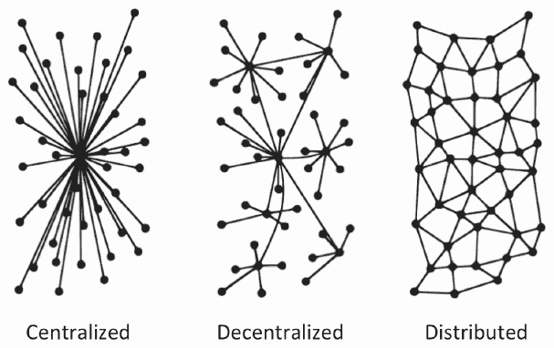

**图 G.8：三种网络结构**

来源：[`www.truthcoin.info/images/cent-dec-dist.jpg`](http://www.truthcoin.info/images/cent-dec-dist.jpg)

网络结构描述了网络中节点之间的关系（参见图 G.8）。在集中式结构中，有一个节点处于控制地位；中心节点（服务器）接收来自其他节点的所有传入数据，并相应地将数据转发给其他节点。在分布式网络中，所有节点都是对等体；没有哪个节点处于主导地位。数据传送到其最近的邻居，直到所有目标接收节点都收到数据。在计算机科学中，去中心化网络是集中式网络的分布式网络的混合体。^(56) 然而，许多人常用“去中心化”和“分布式”这两个词作为同义词。

**节点:** 根据 Hyperledger Blockchain Performance Metrics 白皮书（2019）*，“在区块链网络的背景下，节点是一个独立的计算实体，它与其他网络中的节点通信，共同完成交易。节点是一个虚拟实体，因为它可能运行在物理硬件上，或者作为虚拟机（VM）或容器化环境。在后者的情况下，一个节点可能与其他网络中相同的网络共享物理硬件。一组节点可能由同一组织管理。例如，想象一个由一家公司运营的挖矿池，其中一组机器作为独立的节点在网络上执行工作量证明（PoW）。在大多数区块链网络（比特币、以太坊、Hyperledger Burrow、Hyperledger Indy、Hyperledger Iroha、Hyperledger Sawtooth）中，每个节点在网络中扮演统一的类角色，如生成区块、传播区块等。在这些网络中，节点通常被称为对等体。这样的网络可能需要一个或多个节点承担临时领导角色。这种领导角色在某些明确确定的条件下可以传递给其他节点。然而，在一些区块链网络（如 Hyperledger Fabric）中，节点被分配一个或多个可能的角色，如背书对等体、排序服务或验证对等体。”^(57)*

**规范性影响:** 参见**制度同形**词条。

**公证人:** 与区块链相关，公证人是一个可信的第三方，负责协调跨链操作。加密货币交易所是常见的例子。交易所允许用户轻松买卖加密货币，或用加密货币兑换法定货币；但这种便利是以接受和信任中心化控制为代价的，同时存在单点故障的风险。

**寡头政治:** 一种治理模式，其中少数人或少数机构拥有决策权。

**Oracle:** 在区块链应用中，oracle 是一个代理，负责发现并验证现实世界的实例，然后将这一信息提交给区块链，供智能合约使用。^(58)

**性能:** 参见**系统性能**词条。

**许可协议:** 在区块链应用中，许可协议限制了访问权限，并限制了哪些节点被允许观察、交易、验证和将交易添加到永久记录（即分布式账本）。

**无许可协议:** 在区块链应用中，无许可协议不限制访问。任何人都可以运行一个完整节点，并竞争（或被半随机分配或投票产生）验证和将交易添加到永久记录（即分布式账本）。

**Plasma：** 由 Vitalik Buterin 和 Joseph Poon 为以太坊设计的，Plasma 是一个“层 2”区块链选项，旨在提高以太坊的吞吐量，允许更多的每秒交易。^(59) *截至 2020 年，它仍在以太坊社区中讨论中。*^(60)

**实用拜占庭容错（PBFT）：** 由 Miguel Castro 和 Barbara Liskov 于 1999 年创建的共识协议。^(61) 在 PBFT 中，节点需要获得许可才能作为验证节点，形成一个成员列表。每次轮询，从成员列表中选择一个节点作为领导者（参见图 G.9）。客户端节点向领导者节点发送验证交易请求。领导者节点将请求多播到所有其他授权节点。授权节点独立执行请求，然后相互发送确认信息给客户端。客户端等待一定比例的回复以确认验证，通常等待 2/3 的节点达成一致。下一轮的领导节点将发生变化。

作为一种*共识算法类别*，PBFT 有许多版本，包括 Hyperledger Indy 使用的冗余拜占庭容错（RBFT）^(62); Antshares 使用的委托拜占庭容错；^(63) JPMorgan 使用的 Quorum；^(64) 以及 Stellar 使用的联邦拜占庭协议^(65)——仅举几例。PBFT 的不同版本在于授权节点的选择方式以及节点角色的分配方式。例如，Ripple 和 Stellar 允许参与者选择他们想要的验证节点；^(66) Antshares 将记账节点与用户节点分开，前者由专业人士操作；Quorum 将节点委托给观察者、投票者和制造商角色；^(67) R3 Corda 授权证明节点和观察节点；Hyperledger Fabric 定义了背书节点、排序节点和提交节点。

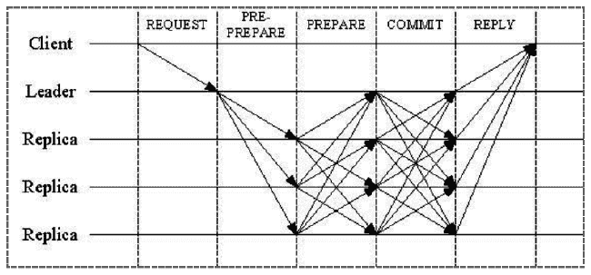

**图 G.9：实用拜占庭容错（PBFT）共识过程**

*来源：Castro & Liskov (1999) [`theintelligenceofinformation.files.wordpress.com/2017/02/hotdep_img_1.jpg`](https://theintelligenceofinformation.files.wordpress.com/2017/02/hotdep_img_1.jpg)*

**隐私币：** 一种旨在通过使用协议和密码学来隐藏发送者、接收者和/或金额以最大化匿名性的加密货币，同时仍能防止双重花费。门罗币和津巴布韦都是例子。

**私钥-公钥对：** 两个数学上相关联的数字，如果只拥有公钥，几乎无法推导出私钥。两者都用于证明数字资产的所有权。作为一个数字签名，这对密钥一起使用。实践中，数字资产的所有者将私钥保存在区块链之外，要么存储在所有者自己设备上的钱包中，要么存储在交易所或第三方提供商上的钱包中。公钥保存在区块链上。（在比特币中，公钥通过哈希函数转换为一个地址。）两者都需要“转动”来发送价值。图 G.10 是合法的私钥-公钥对的一个例子。（不要费心在区块链上搜索这个地址，程序创建私钥-公钥对只是为了说明目的。）^(68)

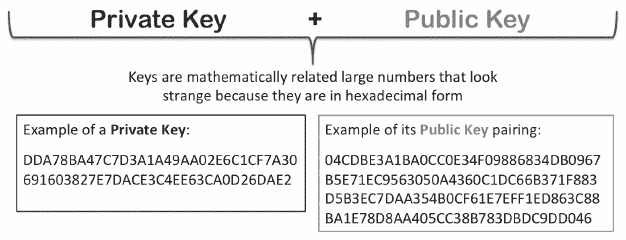

**图 G.10: 私钥-公钥对示例**

*来源：[`minetopics.blogspot.com/2013/01/hiding-bitcoins-in-your-brain.html`](http://minetopics.blogspot.com/2013/01/hiding-bitcoins-in-your-brain.html)*

注意十六进制公钥有多长：04CDBE3A1BA0CC0E34F09886834 DB0967B5E71EC9563050A4360C1DC66B371F883D5B3EC7DAA354B0CF61E7EF F1ED863C88BA1E78D8AA405CC38B783DBDC9DD046

为了在区块链上存储，公钥通过一系列哈希过程缩短，所以在区块链上会看起来像这样：

17A16QmavnUfCW11DAApiJxp7ARnxN5pGX

**权威证明（PoA）：**一种预先授权节点有权验证并将交易添加到分布式账本的共识机制。该算法轮流从授权节点列表中选择一个领导者（参见图 G.11）。领导者节点检查交易队列中的每个交易；将有效的交易组织成一个区块；用节点私钥签署区块；并将区块分发给其他节点。其他节点验证区块是否由当前领导者签署，并重新检查区块内的每个交易，结果是整个区块被接受或拒绝。作为一种受权限的共识算法，它比无权限算法更快地解决交易，并消耗更少的资源，但更加集中。^(69)

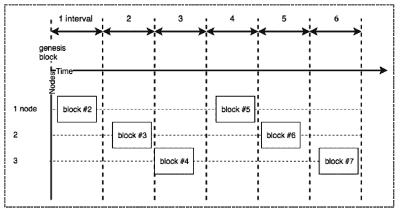

**图 G.11: 权威证明：授权节点轮流创建区块**

*来源：[`apla.readthedocs.io/en/latest/_images/block-generation.png`](https://apla.readthedocs.io/en/latest/_images/block-generation.png)*

**权益证明（Proof-of-Stake）**：Sunny King 和 Scott Nadal 在 2012 年的一篇白皮书提出了区块链的“权益证明”共识协议。70 该协议不是通过“挖矿”获取硬币，而是选择一个成员节点来“锻造”新货币，作为验证交易和创建下一个区块的奖励。本质上，被选中的成员节点获得了交易费。成员节点是以半随机方式选出的；之所以称之为“权益证明”，是因为在选择算法中，拥有最高“权益”（即账户余额最大）的成员会被优先考虑。区块链的参与者可以相当确定地预测下一个“锻造者”可能是哪个成员。与“工作量证明”过程相比，“权益证明”过程使用能量少得多。然而，批评者认为它的安全性不如工作量证明，因为小额权益的人投票支持多个区块链历史，从而导致共识无法解决。71 Peercoin 和 Nxt 使用权益证明。以太坊可能会迁移到 PoS。

**工作量证明（Proof-of-Work）**：Cynthia Dwork 和 Moni Naor 在 1993 年创造了“工作量证明”协议，以防止垃圾邮件。72 Satoshi Nakamoto 在 2008 年的白皮书中采用了比特币的“工作量证明”共识协议。73 以太坊目前也使用工作量证明。Nakamoto 需要一种方法来找到独立的验证者来验证交易并将区块添加到区块链中，而不依赖于可信赖的第三方。Nakamoto 提出，当其他网络节点验证所有最近提交的交易并创建下一个区块时，用新发行的比特币奖励他们。为了使验证节点认真对待这项任务，Nakamoto 提出在区块链网络中的计算机节点之间进行竞争，首先收集最近验证的交易到一个区块中，然后找到下一个区块的区块链中可接受的区块标识符（称为区块哈希）。找到一个可接受的数字并不容易……它需要大量的计算能力来进行暴力猜测，以找到小于当前挖矿“难度”的哈希数。难度是证明矿工计算机完成了大量工作以获得区块奖励的一部分。图 G.12 展示了它是如何工作的。

对于比特币区块链，一个区块的获胜矿工（或更可能的是，获胜的矿池）会获得一定数量的比特币，截至 2020 年 3 月，这个数量是 12.5 个比特币，再加上人们为了将交易包含在区块中而向矿工提供的小额费用。平均每十分钟挖掘一个新的区块。矿工的区块奖励每 210,000 个区块减半，因此随着时间的推移，矿工会获得更少的硬币，但这些硬币的价值可能会随着时间的推移大幅上升。

对于以太坊区块链，获胜的矿工每块获得两个以太币，大约每 15 秒创建一次。有时以太币会发送给找到解决方案但未被包含在区块中的矿工，这被称为叔叔（或阿姨）奖励。^(74)

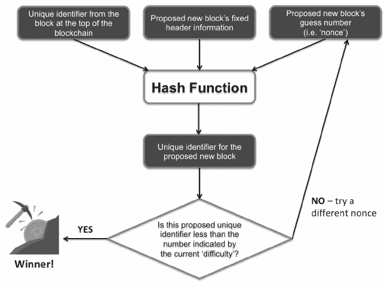

**图 G.12：工作量证明挖矿竞赛算法**

***矿工的计算机从链顶的区块中获取唯一标识符（即区块散列值），并将该数字与下一个区块的头部固定信息（协议版本号、Merkle 树的根散列、当前时间和难度）以及一个随机选择的数字（称为“nonce”）进行散列。然后检查散列值是否小于当前的挖矿难度。如果散列值大于目标难度，算法尝试另一个猜测。如果它小于目标难度，矿工赢得了竞赛，并获得新创建的货币。***

工作量证明协议创建了一个高度安全的账本，因为攻击者需要控制网络超过 50%的算力，重写历史并在其他节点注意到之前找到所有符合协议的新散列值。该协议的缺点包括交易结算时间更慢、每秒处理的交易更少，以及与其他协议相比电力消耗更高。

**协议：**是一组共同的规则，使计算机网络中的不同节点能够进行通信。例如，互联网使用传输控制协议/互联网协议（TCP/IP），这是一组协议，规定了数据应该如何结构化、地址化、传输、路由和被互联网上的节点接收。区块链协议规定了交易应该如何结构化、地址化、传输、路由、验证、排序、加密，以及如何被区块链网络中的节点添加到永久的记录（即分布式账本）中。

**伪匿名性：**旨在隐藏交易各方身份的区块链应用程序，但其身份可能通过元数据被揭示。例如，IP 地址可能揭示交易发送者的身份。更常见的是，当甲方在一天内向乙方拥有的地址发送价值时，甲方稍后可以确定乙方拥有的其他地址，当乙方花费这些硬币时。

**量子计算：**一种基于量子位的计算架构，称为“量子位”（qubits），可以同时表示多种状态，因此可以同时进行多次计算。量子计算将以这样的方式加速计算机，使得今天不切实际的私人加密密钥的暴力猜测在未来可能变得可行。

-   **快速响应(QR)码:** QR 码是一种二维代码，可被机器读取。QR 码通常用于追踪商品，可能包含制造商、批号和商品号等信息。任何数字或文本都可以转换成 QR 码。例如，图 G.13 是“阿肯色大学”的 QR 码。如果你用手机相机扫描 QR 码，你会发现 QR 码被正确解读。

-   **G.13. 用于‘阿肯色大学’的机器可读 QR 码**

-   **Quorum:** Quorum 是基于以太坊的企业级分布式账本和智能合约平台。^(75) 企业以太坊联盟正式支持 Quorum。^(76) Quorum 是由资产超过 2.5 万亿美元的全球第三大金融服务公司 J.P.摩根开发的，作为一个开源的企业级以太坊版本。^(77) Quorum 是一个私有/受许可的区块链，要求机构申请许可才能运行节点。^(78) 它的一个关键优势是设计用于处理和结算每秒数百笔交易。J.P.摩根以通用目的许可（GPL）许可 Quorum，使该平台免费使用。它计划与以太坊共同进化。^(79) Quorum 的架构建立在公共以太坊区块链之上。QuorumChain 是原始的共识协议，后来添加了其他 Raft 和 Istanbul BFT 协议。^(80) ^(81) 作为一个开源项目，任何个人或企业都可以下载 Quorum 进行实验。知名采用者包括路透社；^;^(82) 微软；^(83) Synechron；^(84) BlockApps；^(85) AMIS Technologies；^(86) 和 Chronicled。微软将 Quorum 添加到 Azure 云市场，为可信执行环境提供额外的安全层。^(87)

-   **QuorumChain:** Quorum 中使用的主要共识协议。QuorumChain 是一种基于时间的、多数投票算法，它使用智能合约来确定哪些节点参与共识。QuorumChain 有三种类型的节点：投票节点、制作节点和观察节点。投票节点对应该添加到区块链的区块进行投票。制作节点在收到足够多的投票后有权添加区块。观察节点接收和验证区块，但不投票或制作区块。^(88) 账本被分割成私有状态数据库和公共状态数据库。参与者可以执行私人和公共智能合约。虽然所有节点都验证公共交易，但只有作为私有智能合约方的节点才能验证私有交易。^(89)

**R3:** 2014 年由 David Rutter 创立的区块链联盟，旨在开发全球金融机构可用的区块链平台。更多信息请参见第二章。

**Raft:** 一种在包括 Quorum 在内的多个区块链中使用的共识协议。根据 Quorum 的白皮书，*“Raft 将共识的关键元素，如领导者选举、日志复制和安全性分离，并强制实施更高程度的一致性，以减少必须考虑的状态数量。”*^(90) 当选的领导者节点接受来自客户端节点的请求，将它们复制到网络，并在达到多数（>50%）时回应客户端。Raft 可以确保结算最终性，并且每秒处理交易量超过一千。

**Raiden 网络:** 在区块链之上构建的另一层协议。它最初是为了允许在以太坊上进行微支付而推出的。^(91) 被描述为与闪电网络相似，基本思想是从所有交易都击中区块链上的共享账本（这是瓶颈）的模式，转变为用户可以私下交换信息，这些信息签署价值的转移的模式。Raiden 节点通过 API 连接到以太坊节点，并声称可以实现一百万次每秒的私密交易（因为它们不会添加到区块链中）。^(92)

**可编辑区块链:** 一种技术创新，它允许区块链可靠地编辑，而不创建硬分叉，通过使用秘密陷阱门密钥。这些密钥只能被授权方使用。密钥用于找到哈希冲突，即两个不同的输入可以产生相同的哈希输出。根据 Ateniese 等人（2017）的经典论文，*“要理解可编辑区块链的概念，最好的方法是想象给哈希链的每个环节添加一把锁：没有锁钥匙，很难找到冲突，链保持不可变，但给定锁钥匙，可以高效地找到冲突，从而替换链中的任何区块的内容。在知道钥匙的情况下，任何编辑都是可能的：删除、修改和插入任意数量的区块。请注意，如果锁钥匙丢失或被销毁，那么可编辑区块链将退化为一个不可变的链。”*^(93) 这些秘密密钥应该很少被调用，比如在修复严重错误或攻击（如 DAO）的情况下。

**代表精英治理:** 一个治理模型，在这个模型中，那些已经证明自己能力的人或机构有资格被选入基于其他有能力的成员投票的理事会。

**RSA:** RSA 是一种由 MIT 的三位教授——Rivest、Shamir 和 Adleman——于 1977 年设计的非对称密钥算法，基于将两个非常大的质数相乘。

**沙盒环境：**一个用于隔离软件代码与实际生产环境的测试环境，让人们可以测试和实验软件。

**可扩展性：**参见**系统可扩展性**词条。

**薛定谔 bug：**计算机编程逻辑中的一个错误，只有在调试它的人发现它根本不应该工作的时候才会表现出来。^(94)这个名字来源于薛定谔的猫思想实验，该实验基本上描述了这样一种情况：我们只有在观察它之前，无法知道某件事是真的还是假的。 (实际的思维实验是这样的：*如果把一只猫和会杀死猫的东西放在一个密封的盒子里，那么在打开盒子之前，我们无法确定猫是死是活。在打开盒子之前，认为猫既死又活的观点同样有效*。）

**安全代币发行（STO）：**STO 是一种合法合规、获得许可的初始币发行，仅向认证投资者开放。

**隔离见证（SegWit）：**一个增加比特币区块中可包含交易数量的协议。该协议不是在每个交易地址中附加数字签名，而是在区块头级别调用一个单一的数字签名，从而减少交易大小，使每个区块能包含更多的交易。^(95)

**自主主权身份：**个人和组织拥有并控制其个人数据。

**SHA-256：**一种安全的单向散列函数，常用于区块链中。它是由美国国家安全局设计的。它接受任意大小的输入值，并产生一个 32 字节的输出值，使用十六进制表示法。相同的输入总会产生完全相同的输出。

**分片：**一个将区块链中新交易的验证过程分段的协议，这样不是每个节点都会验证每一个交易。其目的是提高系统性能。

**侧链/中继：**侧链和中继提供了公证人的功能，但依靠的是自动执行算法，而不是保管人。Back 等人（2014 年）首次提出了“附加侧链”的概念，作为一种方式，使比特币和其他账本资产能够在多个独立区块链之间进行转移。^(96)对这些作者来说，侧链是双向钩子，连接母链（或主链），允许资产以预定的比率进行交换。但这个术语是相对于资产而言，而不是相对于网络。因此，Vitalik Buterin 在他的互操作性白皮书中对“侧链”一词表示遗憾。他认为，使用“链 A 上的链 B 中继”或“跨链可移植数字资产 D，主账本 A，也可用于链 B”的表述更好。^(97)

**丝绸之路：** 丝绸之路是一个匿名市场，也是比特币最明显的恶用案例。罗斯·威廉·乌尔布里希特在 2011 年创建了丝绸之路，当时他只有 27 岁^.^(98) 该市场将比特币的匿名性与 Tor 网络协议的隐蔽性相结合，Tor 是一种可以隐藏服务器身份的网络协议。（人们可以通过网站地址后缀".onion"识别 Tor 网站）。很难相信丝绸之路的开放程度（见图 G.14，该图显示了可售的非法毒品）。经过一系列包括网络和行为调查方法的搜查——比如假装成毒品买家——美国联邦调查局（FBI）于 2013 年逮捕了乌尔布里希特。他被判处无期徒刑，没有假释的可能。^(99) 这个故事在这里不会详细讲述，但由导演 Alex Winter 制作的纪录片《深网》全面讲述了丝绸之路的兴衰。

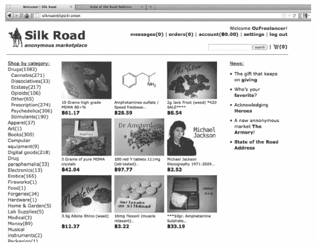

**图 G.14：丝绸之路网站截图**

来源：Techrepublic^(100)*

**简单支付验证（SPV）：** 中本聪（2008）将 SPV 描述为一种无需运行完整网络节点即可验证比特币交易的方法。相反，只需维护区块头的副本，然后找到到交易的安全链接（称为**默克尔树**分支）以证明该交易已被网络验证和接受。SPV 表明 *“代币已在一条链上锁定，验证者可以在另一条链上安全地解锁等值代币。”*^(101)

**智能合约**–**确定性：** 一旦部署在区块链上，确定性的智能合约可以自主执行，无需任何外部信息。更多信息请参见第三章。

**智能合约**–**非确定性：** 一旦部署在区块链上，非确定性的智能合约需要外部信息来执行协议条款。外部信息被称为“预言机”。更多信息请参见第三章。

**智能合约：** 智能合约——由尼克·萨博（Nick Szabo）于 1994 年提出——是存储谈判合同条款规则的软件，自动验证合同，然后执行条款。^(102) 更多信息请参见第三章。

**稳定币：** 一种通过将数字代币与网络之外的稳定资产挂钩以创建稳定价值储存的加密货币，例如将数字代币与法定货币或黄金或一桶石油等商品挂钩。泰达币；USD Coin；Gemini；JPM Coin；以及 Libra 都是例子。

**股权统治：** 一种“付费参与”的治理模式，其中个体的或机构的投票权由其投资规模决定。

**持续创新**：一种改进企业现有产品或服务性能以满足最苛刻客户需求的创新。这个术语来自克莱顿·克里斯滕森的颠覆性创新理论。^(103)

**Sybil 攻击**：网络中一个恶意节点自我复制多次，接管网络。比特币，以太坊和恒星等区块链使用加密货币来防止 Sybil 攻击，因为 Sybil 攻击者会耗尽资金。

**系统性能**：用于衡量网络处理交易所需时间的术语。区块链应用程序通常在性能上有所差异，从几分钟到几秒钟不等。

**系统可扩展性**：系统处理工作量增加的能力，例如当新用户被添加到系统时。^(104) 可扩展性指的是吞吐量，即每秒可以处理多少笔交易。

**公共悲剧**：这个概念定义为在一个共享资源系统中，个体用户根据自身利益独立行动，通过集体行动耗尽或破坏该资源，从而与所有用户共同的利益相悖的情况。^(105)

**交易成本**：在搜索，创建，谈判，监控和管理交易双方之间的交易时所付出的努力，时间和成本。

**传输控制协议/互联网协议（TCP/IP）**：作为互联网的主要协议，它将消息分成数据包，并按照称为“IP 地址”的独特地址将它们路由到目的地。连接到互联网的每个设备都有一个独特的 IP 地址，包括计算机；手机；笔记本电脑；打印机；物联网设备；服务器；路由器等。

**交易可塑性**：当用户创建一个交易时，数字钱包会签名并发送交易到网络，以获取验证并添加到数字账本。交易会自动根据其内容分配一个唯一的交易 ID。然而，在交易还在网络中传播的时候，有一种方法可以稍微改变交易，使其仍然是一个正确的移动资金的有效交易。这个小变化，基于略有修订的内容，将生成一个不同的唯一交易 ID。结果是，发送交易的发件人不能确定交易从创建时刻到最终在一个区块中被挖掘时，交易 ID 是否会保持不变。^(106)

**信任**：通常，信任是对另一方善意的信心。提到区块链时，信任通常指的是对分布式账本上记录的一致性的信心。

**信任协议：**在区块链应用的背景下，“信任协议”被定义为依赖于计算机算法，而不是可信赖的第三方机构，来验证交易并确保数字账本的所有副本在节点之间达成一致。

**可信赖的第三方：**像银行、证书权威和信用卡公司这样的可信赖的第三方存在，是为了减轻对手方风险，即每个当事人承担对方不履行合同义务的风险。可信赖的第三方执行许多关键功能，例如验证资产所有权和确保账户资金充足以防止双重消费。

**图灵完备：**一个术语，指的是一个计算机编程语言，它有一个完整的命令集，可以执行另一个图灵完备编程语言可以执行的所有算法。例如，一个带有基本算术功能的简单计算器不是图灵完备的，因为它不能执行 if-then-else 或循环逻辑。就区块链代码库而言，图灵完备的智能合约功能提供了编码多种协议的能力；但随着更多编码能力的增加，软件漏洞的风险也会增加。例如，以太坊和 Hyperledger Fabric 确实拥有图灵完备的编程语言来编写智能合约；以太坊的智能合约语言叫做 Solidity；Hyperledger Fabric 的叫做 Chaincode。比特币和恒星没有图灵完备的智能合约。

**零知识证明：**沙菲·戈德瓦瑟、查尔斯·拉科夫和西尔维奥·米卡利在 1985 年提出了这个概念。^(107)零知识证明是一种方法，让一方（或节点）在不向其他方（或节点）透露信息的情况下，验证自己拥有某项信息。通常，零知识证明分为两种类型：*挑战-响应*类型，用于已知参与方的交互，以及*非交互式*类型，无需迭代。在区块链应用中，零知识证明用于确保交易有效，同时不透露发送者、接收者和/或交易的信息。Zcash、EY 的 Nightfall、MediLedger 以及许多其他区块链都使用零知识证明。

**zk-SNARK（零知识简洁非交互式知识证明）：**在一些区块链协议中使用的零知识证明。以下是 zk-SNARK 的解释：

*“假设鲍勃被给定了一个值***s***的哈希**H***，他希望得到一个证明，爱丽丝知道值为***s***的哈希结果为***H***。通常，爱丽丝会通过给鲍勃*s***来证明这一点，之后鲍勃会计算哈希并检查它是否等于***H***。然而，假设爱丽丝不想向鲍勃透露值**s***，而只是想证明她知道这个值。*她可以使用零知识简洁非交互式知识证明（zk-SNARK）来实现这一点。我们可以用以下程序来描述爱丽丝的场景，这里写成一个 JavaScript 函数：*

function C(x, w) {

return ( sha256(w) == x );

}

*换句话说：该程序接收一个公共哈希**x**和一个秘密值**w**，如果**w**的**SHA-256 哈希**等于**x**，则返回真。使用函数 C(x,w)翻译爱丽丝的问题，我们发现爱丽丝需要创建一个证明，证明她拥有**s**，使得**C(H, s) == true**，而不必透露**s**。这就是 zk-SNARKs 解决的一般问题。*^(108)

引用

^(1) [反洗钱](https://en.wikipedia.org/wiki/Money_laundering#Anti-money_laundering)

^(2) [非对称加密的定义](http://hitachi-id.com/resource/itsec-concepts/asymmetric_encryption.html)

[Mapt 课程，非对称加密学](https://www.packtpub.com/mapt/book/big_data_and_business_intelligence/9781787125445/3/ch03lvl1sec28/asymmetric-cryptography)

___________________

^(3) 中本聪，S.（2008 年），《比特币：一种点对点电子现金系统》，[`bitcoin.org/bitcoin.pdf`](https://bitcoin.org/bitcoin.pdf)

^(4) 拉波特，L.；肖斯塔克，R.；皮斯，M.（1982 年），《拜占庭将军问题》，*ACM transactions on programming languages and systems*. 4 (3): 387–389.

^(5) 达尼诺，G.；帕杜拉，G.（2002 年），《合作竞争策略：朝向一种新的企业间动态价值创造》，瑞典斯德哥尔摩创业学校，EURAM 第二届年会

^(6) [如何在 Corda 中实现共识？](https://discourse.corda.net/t/how-is-consensus-achieved-on-corda/1148)

^(7) [欢迎来到 Corda](https://docs.corda.net/)

^(8) 根据 Seibold，S.和 Samman，G.（2016 年）的《共识：价值互联网的不变协议》KPMG 白皮书报告的 Corda 调查回应

^(9) 布朗，R.，卡利尔，J.，格里格，I. 和 赫恩，M.（2016 年），《Corda：简介》，Corda 白皮书，[`docs.corda.net/_static/corda-introductory-whitepaper.pdf`](https://docs.corda.net/_static/corda-introductory-whitepaper.pdf)

^(10) 根据 Seibold，S.和 Samman，G.（2016 年）的《共识：价值互联网的不变协议》KPMG 白皮书报告的 Corda 调查回应

^(11) [欢迎来到 Corda](https://docs.corda.net/)

^(12) 李，P.（2017 年 11 月 30 日），《R3 发布 Corda，区块链压力开始显现》，[`www.euromoney.com/article/b12kqb9hqwgp2d/r3-releases-corda-as-blockchain-strains-start-to-show`](https://www.euromoney.com/article/b12kqb9hqwgp2d/r3-releases-corda-as-blockchain-strains-start-to-show)

^(13) Diedrich，H.（2016），《以太坊：区块链、数字资产、智能合约、去中心化自治组织》，Wildfire Publishing。

^(14) [`en.bitcoinwiki.org/wiki/DPoS`](https://en.bitcoinwiki.org/wiki/DPoS)

^(15) 委托权益证明，[`lisk.io/academy/blockchain-basics/how-does-blockchain-work/delegated-proof-of-stake`](https://lisk.io/academy/blockchain-basics/how-does-blockchain-work/delegated-proof-of-stake)

^(16) 克莱顿·克里斯滕森在 20 年的时间里发展了颠覆式创新理论，始于 1997 年出版的这本书，《创新者的困境：当新技术导致伟大的公司失败时》（马萨诸塞州，波士顿，哈佛商学院出版社）。对于这个理论的深思熟虑和当前概述，请参见克里斯滕森，C.，雷诺尔，M. 和麦克唐纳，R.（2015），《颠覆式创新》，《哈佛商业评论》，93（12）：45-53

^(17) [`en.wikipedia.org/wiki/Digital_Signature_Algorithm`](https://en.wikipedia.org/wiki/Digital_Signature_Algorithm)

^(18) 本·西格曼（2018 年 5 月 8 日），*EOS 区块生产商常见问题解答* [`medium.com/@bensig/eos-block-producer-faq-8ba0299c2896`](https://medium.com/@bensig/eos-block-producer-faq-8ba0299c2896)

^(19) 要查看 21 个 EOS 验证节点和区块生产商，请参见 [`bloks.io/vote`](https://bloks.io/vote)

^(20) 威廉姆斯，M.（2018 年 5 月 12 日），*ERC-20 代币，解读*， Cointelegraph， [`cointelegraph.com/explained/erc-20-tokens-explained`](https://cointelegraph.com/explained/erc-20-tokens-explained)

^(21) [`erc721.org/`](http://erc721.org/)

^(22) 沙尔玛，T.（2019 年 7 月 16 日），*了解你的葡萄酒的真实性*， [`www.blockchain-council.org/blockchain/know-the-authenticity-of-your-wines-eys-blockchain-platform-for-wine-traceability/`](https://www.blockchain-council.org/blockchain/know-the-authenticity-of-your-wines-eys-blockchain-platform-for-wine-traceability/)

^(23) 贝格尔，O.（2017 年 3 月 3 日），*什么是以太坊？* [`99bitcoins.com/guide-buy-ether-ethereum/`](https://99bitcoins.com/guide-buy-ether-ethereum/)

^(24) ConsenSys（2019 年 1 月 10 日），*第三次方：你需要知道的内容*， [`media.consensys.net/the-thirdening-what-you-need-to-know-df96599ad857`](https://media.consensys.net/the-thirdening-what-you-need-to-know-df96599ad857)

^(25) [`www.ethernodes.org/network/1`](https://www.ethernodes.org/network/1)

^(26) 依据开源社区内的讨论，以太币的总供应量尚未确定，[`ethereum.stackexchange.com/questions/443/what-is-the-total-supply-of-ether`](https://ethereum.stackexchange.com/questions/443/what-is-the-total-supply-of-ether)

^(27) *以太币的供应量是否无限？* [`www.ethereum.org/ether`](https://www.ethereum.org/ether)

在[Ethereum](http://wiki.p2pfoundation.net/Ethereum)上发布的*下一代智能合约和去中心化应用平台*，原始文档发布在[GitHub](https://github.com/ethereum/wiki/wiki/White-Paper)。

*以太坊的供应是否无限？* [链接](https://www.ethereum.org/ether)。

Levi, A. (2017 年 5 月 21 日)，*区块链企业趋势*，CB Insights 网络研讨会演讲。

*硬分叉与软分叉的区别*，We Use Coins，2016 年 8 月 23 日，[链接](https://www.weusecoins.com/hard-fork-soft-fork-differences/)。

*硬分叉与软分叉解释*，由 Loshil 和[@MLPFrank](https://twitter.com/MLPFrank)撰写，[视频链接](https://www.youtube.com/watch?v=pdaXY1OOiWQ)。

Martin, L. (2016) *开发者区块链：它适合你的应用吗？* Techbeacon，[链接](https://techbeacon.com/blockchain-it-right-your-app)。

The Linux Foundation (2016 年 1 月 22 日)，*Hyperledger 项目章程*，[链接](https://www.hyperledger.org/about/charter)。

Connell, J. (2017 年 6 月)，*区块链系统中的拜占庭容错*，[链接](https://cryptoinsider.com/byzantine-fault-tolerance-blockchain-systems/)。

Groenfeldt, T. (2017 年 7 月 13 日)，‘Linux Foundation 的 Hyperledger Fabric 1.0 生产就绪’，*福布斯杂志*，[链接](https://www.forbes.com/sites/tomgroenfeldt/2017/07/13/linux-foundats-hyperledger-fabric-1-0-ready-for-production/)。

[Hyperledger 基金会](https://www.hyperledger.org/wp-content/uploads/2017/08/HyperLedger_Arch_WG_Paper_1_Consensus.pdf)的*Hyperledger 架构第一卷*，[链接](https://www.hyperledger.org/wp-content/uploads/2017/08/HyperLedger_Arch_WG_Paper_1_Consensus.pdf)。

The Linux Foundation (2016 年 1 月 22 日)，*Hyperledger 项目章程*，[链接](https://www.hyperledger.org/about/charter)。

[Hyperledger 项目](https://www.hyperledger.org/projects)页面。

[Hyperledger 项目](https://www.hyperledger.org/projects)页面。

Reiger, A.; Guggenmos, F., Locki, J., Fridgen, G., 和 Urbach, N. (2019)，‘符合欧盟通用数据保护条例的区块链应用建设’，*MIS Quarterly Executive*，18(4)，第 263-279 页。

^(42) 温斯莱特，T（2019），《加密市场值得关注的三大初始交易所发行（IEO）》*每日霍德*，[`dailyhodl.com/2019/04/11/top-3-initial-exchange-offerings-ieos-to-watch-in-the-crypto-market/`](https://dailyhodl.com/2019/04/11/top-3-initial-exchange-offerings-ieos-to-watch-in-the-crypto-market/)

^(43) DiMaggio，P.，和 Powell，W.（1991），《铁笼子重申：组织领域中的制度同质性和集体理性》，*组织分析中的新制度主义*（Powell & DiMaggio 编辑），芝加哥大学出版社，63-82

^(44) DiMaggio，P.，和 Powell，W.（1991），《铁笼子重申：组织领域中的制度同质性和集体理性》，*组织分析中的新制度主义*（Powell & DiMaggio 编辑），芝加哥大学出版社，63-82

^(45) 罗斯，C.（2016 年 12 月 5 日），*区块链带我们进入未来，但只有在它拖着过去上升之后：互操作性成为一个实际问题*，[`www.horsesforsources.com/blog/christine-ferrusi-ross/the-interoperability-problems-blockchain-brings_120616`](http://www.horsesforsources.com/blog/christine-ferrusi-ross/the-interoperability-problems-blockchain-brings_120616)

罗斯，C.（2017 年 4 月 18 日），*通过拒绝让互操作性问题拖累你，简化区块链*，[`www.horsesforsources.com/Simplify-Blockchain-Refusing-Interoperability-Issues_041817`](http://www.horsesforsources.com/Simplify-Blockchain-Refusing-Interoperability-Issues_041817)

^(46) [`en.wikipedia.org/wiki/Know_your_customer`](https://en.wikipedia.org/wiki/Know_your_customer)

^(47) 马丁，L.（2016 年）*区块链开发者指南：它适合你的应用程序吗？* Techbeacon，`techbeacon.com/blockchain-it-right-your

^([48`) Arun，J.，Cuomo，J.，和 Gaur，N.（2019）。*区块链与企业*，Addison-Wesley，波士顿。

^(49) Lenarduzzi，V.，Taibi，D.（2016 年 8 月），*MVP 解释：对最小可行性产品定义的系统映射研究*，2016 年第 42 届欧洲微会议软件工程和先进应用（SEAA）。塞浦路斯。第 112-119 页。

^(50) Tuwiner，J.（2017 年 7 月 13 日），*比特币挖矿池*，[`www.buybitcoinworldwide.com/mining/pools/`](https://www.buybitcoinworldwide.com/mining/pools/)

^(51) 卫报（2016 年 1 月 20 日），*荷兰十人因比特币洗钱指控被捕*，[`www.theguardian.com/technology/2016/jan/20/bitcoin-netherlands-arrests-cars-cash-ecstasy`](https://www.theguardian.com/technology/2016/jan/20/bitcoin-netherlands-arrests-cars-cash-ecstasy)

[官员逮捕了 40 亿美元的比特币洗钱计划的嫌疑人](https://arstechnica.com/tech-policy/2017/07/officials-arrest-suspect-in-4-billion-bitcoin-money-laundering-scheme/)（Lee, T. 2017 年 7 月 26 日），*Officials arrest suspect in $4 billion Bitcoin money laundering scheme*

[美国司法部药物管理局（DEA）报告：比特币用于基于贸易的资金洗钱](https://www.coindesk.com/dea-report-bitcoin-used-trade-based-money-laundering/)（De, N. 2017 年 10 月 25 日），*DEA Report: Bitcoin Used for Trade-Based Money Laundering*

[美国司法部药物管理局（DEA）报告：2017 年全国毒品威胁评估](https://www.dea.gov/docs/DIR-040-17_2017-NDTA.pdf)（2017 年 10 月），*2017 National Drug Threat Assessment*

[MultiChain 白皮书](https://www.MultiChain.com/download/MultiChain-White-Paper.pdf)（2015 年），*MultiChain White Paper*

[超越分布式和去中心化：联邦网络是什么？](http://networkcultures.org/unlikeus/resources/articles/what-is-a-federated-network/)（Institute of Network Cultures），*Beyond distributed and decentralized: what is a federated network?*

[Hyperledger 区块链性能指标白皮书](https://www.hyperledger.org/resources/publications/blockchain-performance-metrics)（2019 年），*Hyperledger Blockchain Performance Metrics White Paper*

[区块链预言机](https://blockchainhub.net/blockchain-oracles/)

丹·罗宾逊（2019 年）。[链接](https://events.technologyreview.com/video/watch/dan-robinson-scaling-interoperability/)

[Plasma 变成了 Optimism，它可能会拯救以太坊](https://www.coindesk.com/plasma-became-optimism-and-it-might-just-save-ethereum/)（Cuen, L. 2020 年 2 月 11 日），*Plasma Became Optimism and It Might Just Save Ethereum*

[实用拜占庭容错](http://pmg.csail.mit.edu/papers/osdi99.pdf)（1999 年 2 月），*Practical Byzantine Fault Tolerance*

[Hyperledger 基金会：Hyperledger 架构，第 1 卷](https://www.hyperledger.org/wp-content/uploads/2017/08/HyperLedger_Arch_WG_Paper_1_Consensus.pdf)（Hyperledger Foundation），*Hyperledger Architecture, Volume 1*

[区块链系统中的拜占庭容错](https://cryptoinsider.com/byzantine-fault-tolerance-blockchain-systems/)（Connell, J. 2017 年 6 月），*On Byzantine Fault Tolerance in Blockchain Systems*

64 Quorum 白皮书, [`github.com/jpmorganchase/quorum-docs/blob/master/Quorum Whitepaper v0.1.pdf`](https://github.com/jpmorganchase/quorum-docs/blob/master/QuorumWhitepaperv0.1.pdf)

65 Maziières, D. (2016), *星际共识协议：互联网级共识的联邦模型*, 白皮书, [`www.stellar.org/papers/stellar-consensus-protocol.pdf`](https://www.stellar.org/papers/stellar-consensus-protocol.pdf)

6

[67 Maziières, D. (2016), *星际共识协议：互联网级共识的联邦模型*, 白皮书, [`www.stellar.org/papers/stellar-consensus-protocol.pdf`](https://www.stellar.org/papers/stellar-consensus-protocol.pdf)

68 [`minetopics.blogspot.com/2013/01/hiding-bitcoins-in-your-brain.html`](http://minetopics.blogspot.com/2013/01/hiding-bitcoins-in-your-brain.html)

69 权威证明共识 [`apla.readthedocs.io/en/latest/concepts/consensus.html#advantages-of-poa-consensus`](https://apla.readthedocs.io/en/latest/concepts/consensus.html#advantages-of-poa-consensus)

70 King, S., 和 Nadal, S. (2012), *PPCoin：基于权益证明的点对点加密货币*, [`peercoin.net/assets/paper/peercoin-paper.pdf`](https://peercoin.net/assets/paper/peercoin-paper.pdf)

71 *从权益证明中分布式共识是不可能的，Andrew Poelstra*, [`www.smithandcrown.com/open-research/distributed-consensus-from-proof-of-stake-is-impossible/`](https://www.smithandcrown.com/open-research/distributed-consensus-from-proof-of-stake-is-impossible/)

72 Dwork, C., 和 Naor, M. (1993), *通过处理定价：抗击垃圾邮件*, [`www.hashcash.org/papers/pvp.pdf`](http://www.hashcash.org/papers/pvp.pdf)

73 Nakamoto, S. (2008), *比特币：一种点对点的电子现金系统*, [`bitcoin.org/bitcoin.pdf`](https://bitcoin.org/bitcoin.pdf)

74 Beigel, O. (2017 年 3 月 3 日), *以太坊是什么？*, [`99bitcoins.com/guide-buy-ether-ethereum/`](https://99bitcoins.com/guide-buy-ether-ethereum/)

75 J.P. Morgan, Quorum, [`www.jpmorgan.com/country/US/EN/Quorum`](https://www.jpmorgan.com/country/US/EN/Quorum)

76 企业以太坊联盟（2017 年 7 月 7 日）, *企业以太坊联盟宣布支持区块链共识算法集成*, [`entethalliance.org/enterprise-ethereum-alliance-announces-support-blockchain-consensus-algorithm-integration/`](https://entethalliance.org/enterprise-ethereum-alliance-announces-support-blockchain-consensus-algorithm-integration/)

[Quorum 白皮书](https://github.com/jpmorganchase/quorum-docs/blob/master/QuorumWhitepaperv0.1.pdf)

^(78) Hackett, R. (2016 年 10 月 4 日)，《为什么摩根大通银行要在以太坊上构建区块链》，*《财富》杂志*，[`fortune.com/2016/10/04/jp-morgan-chase-blockchain-ethereum-quorum/`](http://fortune.com/2016/10/04/jp-morgan-chase-blockchain-ethereum-quorum/)

[摩根大通，Quorum](https://www.jpmorgan.com/country/US/EN/Quorum)

^(80) [`www.ethnews.com/amis-technologies-new-algorithm-handles-more-transactions-per-second`](https://www.ethnews.com/amis-technologies-new-algorithm-handles-more-transactions-per-second)

[`github.com/ethereum/EIPs/issues/650`](https://github.com/ethereum/EIPs/issues/650)

[`ethereumfoundation.org/devcon3/sessions/bft-for-geth/`](https://ethereumfoundation.org/devcon3/sessions/bft-for-geth/)

[Quorum 白皮书](https://github.com/jpmorganchase/quorum-docs/blob/master/QuorumWhitepaperv0.1.pdf)

^(82) [`www.ibtimes.co.uk/how-ihs-markits-syndicated-loans-blockchain-arrived-cash-1622304`](http://www.ibtimes.co.uk/how-ihs-markits-syndicated-loans-blockchain-arrived-cash-1622304)

^(83) Castillo, M (2017 年 2 月 28 日)，*微软将摩根大通的“Quorum”区块链添加到 Azure 平台*，[`www.coindesk.com/microsoft-azure-jpmorgans-quorum-blockchain/`](https://www.coindesk.com/microsoft-azure-jpmorgans-quorum-blockchain/)

^(84) [`www.financemagnates.com/cryptocurrency/innovation/synechron-releases-quorum-maker-enterprise-ethereum-alliance/`](http://

^(85) [`blockapps.net/`](http://blockapps.net/)

^(86) Nation, J. (2017 年 7 月 5 日)，*AMIS 技术公司的新算法可处理更多每秒交易*，[`www.ethnews.com/amis-technologies-new-algorithm-handles-more-transactions-per-second`](https://www.ethnews.com/amis-technologies-new-algorithm-handles-more-transactions-per-second)

^(87) Castillo, M (2017 年 2 月 28 日)，*微软将摩根大通的“Quorum”区块链添加到 Azure 平台*，[`www.coindesk.com/microsoft-azure-jpmorgans-quorum-blockchain/`](https://www.coindesk.com/microsoft-azure-jpmorgans-quorum-blockchain/)

[QuorumChain 共识机制](https://github.com/jpmorganchase/quorum/wiki/QuorumChain-Consensus)，[`github.com/jpmorganchase/quorum/wiki/QuorumChain-Consensus`](https://github.com/jpmorganchase/quorum/wiki/QuorumChain-Consensus)

89 陪审团白皮书，[`github.com/jpmorganchase/quorum-docs/blob/master/Quorum%20Whitepaper%20v0.1.pdf`](https://github.com/jpmorganchase/quorum-docs/blob/master/QuorumWhitepaperv0.1.pdf)

90 Raft 白皮书，Ongaro, D. 和 Ousterhout, J. (2014)，*寻找一个可理解的共识算法*, [`raft.github.io/raft.pdf`](https://raft.github.io/raft.pdf)

91 Hertig, A. (2016 年 5 月 31 日)，*以太坊能抢在比特币之前实现主流微交易吗？*, [`www.coindesk.com/ethereum-bitcoin-mainstream-microtransactions/`](https://www.coindesk.com/ethereum-bitcoin-mainstream-microtransactions/)

92 *Raiden 网络：以太坊的高速度资产转移*, [`raiden.network/`](http://raiden.network/)

93 Ateniese, G., B. Magri, D. Venturi 和 E. Andrade (2017)，*Redactable Blockchain – or – Rewriting History in Bitcoin and Friends*, 2017 IEEE 欧洲安全与隐私会议（EuroS&P），巴黎，第 111-126 页。

94 [`en.wiktionary.org/wiki/schroedinbug`](https://en.wiktionary.org/wiki/schroedinbug)

95 关于隔离见证的技术解释，请参见 [`learnmeabitcoin.com/faq/segregated-witness`](http://learnmeabitcoin.com/faq/segregated-witness)

96 Back, A., Corallo, M., Dashjr, L., Friedenbach, M., Maxwell, G., Miller, A., Poelstra, A., Timón, J. 和 Wuille, P. (2014 年 10 月 22 日)，*通过附加侧链实现区块链创新*, [`blockstream.com/sidechains.pdf`](https://blockstream.com/sidechains.pdf)

97 Buterin, V. (2016 年 9 月 9 日)，*链互操作性*, [`static1.squarespace.com/static/55f73743e4b051cfcc0b02cf/t/5886800ecd0f68de303349b1/1485209617040/Chain+Interoperability.pdf`](https://static1.squarespace.com/static/55f73743e4b051cfcc0b02cf/t/5886800ecd0f68de303349b1/1485209617040/Chain+Interoperability.pdf)

98 Popper, N. (2015)，*数字黄金：比特币及其试图重塑货币的边缘人物和百万富翁的历史*, Harper，纽约。

99 Weiser, B. (2015 年 5 月 29 日

100 Reese, H. (2017 年 5 月 10 日)，*丝绸之路创始人在暗网上的非法创业中如何赚取数百万美元*, [`www.techrepublic.com/article/how-online-marketplace-silk-road-became-the-craigslist-for-illegal-drugs/`](https://www.techrepublic.com/article/how-online-marketplace-silk-road-became-the-craigslist-for-illegal-drugs/)

[`tr2.cbsistatic.com/hub/i/r/2017/05/10/709e488c-6c51-407f-ae13-5115b14d86c4/resize/770x/ac1af617d15f84b986b574770d9a67de/screen-shot-2012-04-24-at-2-02-25-am.png`](https://tr2.cbsistatic.com/hub/i/r/2017/05/10/709e488c-6c51-407f-ae13-5115b14d86c4/resize/770x/ac1af617d15f84b986b574770d9a67de/screen-shot-2012-04-24-at-2-02-25-am.png)

^(101) *SPV, 简化支付验证*, [Bitcoin.Org](http://Bitcoin.Org) 术语表。

^(102) *区块链的未来：智能合约*, Technode, [`technode.com/2016/11/14/the-future-of-blockchain-technology-smart-contracts/`](http://technode.com/2016/11/14/the-future-of-blockchain-technology-smart-contracts/)

^(103) 克莱顿·克里斯滕森在过去的二十年里发展了颠覆式创新理论，始于 1997 年出版的这本第一本书《创新者的困境：当新技术导致伟大的公司失败时》（马萨诸塞州波士顿，哈佛商学院出版社）。对于这个理论的一个深思熟虑和当前的概述，参见克里斯滕森，C.，雷诺尔，M.，麦克唐纳，R.（2015 年），*颠覆式创新*, *哈佛商业评论*, 93(12): 45-53

^(104) Castor, A. (2017 年 6 月 14 日), *Hyperledger 通过新的工作组推进区块链扩容*, [`www.coindesk.com/hyperledger-takes-on-blockchain-scaling-with-new-working-group/`](https://www.coindesk.com/hyperledger-takes-on-blockchain-scaling-with-new-working-group/)

^(105) “公共悲剧”被定义为“一个共享资源系统中的经济理论，在这种情况下，个体用户根据他们自己的自我利益独立行动，却通过集体行动耗尽或破坏该资源，这与所有用户共同的利益相悖。” [`en.wikipedia.org/wiki/Tragedy_of_the_commons`](https://en.wikipedia.org/wiki/Tragedy_of_the_commons)

^(106) *交易可塑性*, [`en.bitcoinwiki.org/wiki/Transaction_Malleability`](https://en.bitcoinwiki.org/wiki/Transaction_Malleability)

^(107) [`blockonomi.com/zero-knowledge-proofs/`](https://blockonomi.com/zero-knowledge-proofs/)

^(108) Lundkvist, C. (2017), *带示例的 zk-SNARKs 介绍*, [`media.consensys.net/introduction-to-zksnarks-with-examples-3283b554fc3b`](https://media.consensys.net/introduction-to-zksnarks-with-examples-3283b554fc3b)

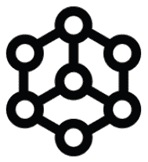
