## 第二部分

## 商业应用示例

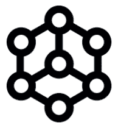

## 第五章

## 金融服务商业应用——第一部分

****内容简介：**** 比特币是第一种区块链技术的金融应用，即点对点支付。在本章中，我们将探讨三种其他的区块链金融应用。Ripple 和 Stellar 是全球支付和货币交换的平台，通过使用加密货币作为桥梁，帮助将法定货币转移到世界各地。Aave 允许个人借贷加密货币。我们讲述了这些应用的创立故事以及它们今天的状况。深入探讨这三个应用使读者能够将第五章中关于治理和区块链工作原理的课程应用到实践中。与任何软件应用一样，Ripple、Stellar 和 Aave 都有治理流程来改进它们的代码库。我们将它们的服务的服务、分布式账本、数字资产、共识机制、智能合约、代码库和接口映射到区块链应用框架。

学习目标：

- 对比区块链前后全球支付和货币兑换交易。

- 对比去中心化金融（DeFi）前后的借贷。

将 Ripple、Stellar 和 Aave 映射到区块链应用框架。

- 描述改进 Ripple、Stellar 和 Aave 的治理过程。

5.1. 案例概述

尽管区块链技术被应用于所有行业，但金融服务是最早的区块链应用。我们已经了解了金融服务中许多区块链创新。我们庆祝比特币作为第一个区块链应用——它是一个点对点支付的金融服务应用。它将比特币从发送者的地址转移到接收者的地址。在第四章中，我们介绍了中心化的加密货币交易所，这些交易所促进加密货币的买卖，但也引入了可信赖的第三方。

在第二章中，我们探讨了新的融资模式，包括首次代币发行（ICOs）、证券代币发行（STOs）、首次交易所发行（IEOs）和首次去中心化交易所发行（IDOs）。我们无法过分强调这些为新企业筹集资金的新方式的影响。这些方式不仅为初创企业提供了新的融资渠道，而且还提供了更多的包容性。在这些模式之前，普通投资者只能在首次公开募股时购买股票，而此时，合格投资者已经抓住了大部分机会。

在第五章和下一章中，我们探讨其他重要的区块链金融服务应用示例。在本章中，我们探讨全球支付/汇款、由加密货币桥接促进的法币兑换以及借贷。Ripple、Stellar 和 Aave 是详细讨论的具体区块链应用（参见表 5.1）。

Ripple 和 Stellar 是全球支付和货币兑换的金融服务应用示例，它们在自己的网络上运行。两者都是美国初创公司。Ripple 和 Stellar 各自作为公共授权区块链网络运行，这意味着任何人都可以在网络中交易，但采用者可以选择他们接受哪些验证节点来进行验证。Ripple 和 Stellar 都有原生数字货币，这吸引了大量关注，因为这两种加密货币通常市值前三十的加密货币之一，但我们的关注点是他们的服务。

| **企业** | **企业类型** | **区块链应用** | **2022 年状态** |
| --- | --- | --- | --- |
| Ripple | 私人初创公司 | 全球支付和货币兑换；针对机构 | Ripple 提供一个开源网络，企业通过网关访问该网络。该网络自 2014 年以来一直在运行。 |
| Stellar | 非营利组织 | 全球支付和货币兑换；针对未服务市场 | Stellar 提供一个开源网络，企业采用者在此基础上构建应用程序。该网络自 2015 年以来一直在运行。 |
| Aave | 私人初创公司 | DeFi 借贷 | Aave 自 2017 年以来一直在以太坊上运行，2021 年以来一直在 Polygon 和 Avalanche 上运行。截至 2022 年 2 月，Aave 在五个市场中的智能合约管理了一个价值 186 亿美元的流动性池。 |

**表 5.1：金融服务区块链应用示例**

尽管 Ripple 和 Stellar 交易可以发送/接收加密货币，但主要价值在于使用加密货币桥简化法定货币全球支付和法定货币交易所。

Aave 是纯 DeFi 的一个例子——它是一套完全去中心化的智能合约，只涉及加密货币。dApps 允许放贷者对其加密货币存款赚取利息，并允许借款人提取加密货币贷款。Aave 最初名为 ETHLend，于 2017 年推出。Aave 公司位于英国伦敦。

在探索案例研究之前，我们需要更好地了解当今金融服务中的痛点，以欣赏这些区块链应用的目标。

5.2 全球支付、货币兑换和借贷之前的区块链

全球金融包括每年价值数百万亿美元的市场。在这里，我们重点关注全球金融的三个方面：全球支付、货币兑换和借贷（见表 5.2）。全球支付，也称为汇款，是指从一个国家的发送者向另一个国家的接收者进行的支付。它们通常需要将发送者的法定货币兑换为接收者的法定货币。人们还因投资原因而兑换法定货币。贷款行业向借款人提供贷款。

| **全球市场** | **定义** | **全球市场规模** |
| --- | --- | --- |
| 全球支付 | 全球支付是指从一个国家的发送者向另一个国家的接收者进行的支付。 | 每年 1350 亿美元 |
| 货币兑换 | 货币兑换是一种货币兑换另一种货币的行为。 | 每年 2.409 万亿美元 |
| 贷款/借款 | 贷款人在一定期限内向借款人提供贷款。借款人需要支付给贷款人比贷款金额更多的钱。 | 每年 226 万亿美元 |

**表 5.2: 金融服务全球市场**

5.2.1. 全球支付/汇款

根据麦肯锡公司的数据，全球每年在外汇市场上发送超过 135 万亿美元的资金。^(1) 中间商收集了大约 2.2 万亿美元的收入来促进这些交易。资金可以通过多种服务以多种方式在全球范围内流动，但我们重点关注这个过程的简化版本。在当今的全球金融体系中，每个国家都有自己的国家支付系统并使用自己的主权货币。^(2) 银行必须获得许可才能使用其国家的国家支付系统。国际交易通常依赖于不同国家银行之间的合作，创建了一个混乱的代理银行关系网（见图 5.1 的简化描述）。^(3) 在当今全球金融体系中的跨境支付，发送方和接收方的金融机构、国家支付系统和代理银行处理交易。交易所的各方无法访问交易的进度，甚至不知道哪个机构控制着交易在其系统中流转。每完成一个步骤都会产生费用。交易伙伴并不总是能提前知道费用，这可能会变得相当可观。发送汇款平均需要支付发送金额的 6.8%，并且需要数个工作日才能结算。^(4),^(5) 将资金发送到撒哈拉以南非洲地区的成本更高，汇款平均成本为 9%。^(6) 全球支付通常涉及货币兑换。

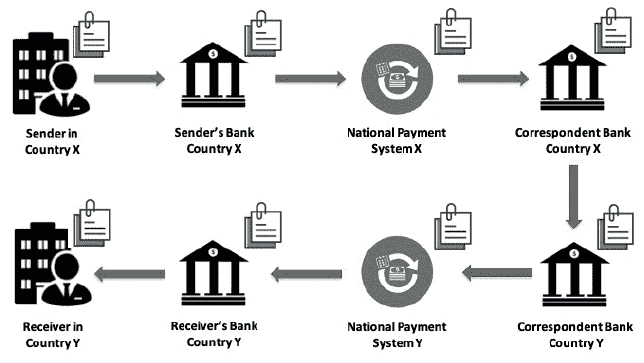

**图 5.1: 区块链之前的跨境支付简化示例**

5.2.2. 货币兑换

货币兑换是一种一种货币兑换另一种货币的行为。在法定货币的世界中，平均每天在外汇市场上交换 6.6 万亿美元的货币。^(7) 每年，这就是每年交换 2.409 万亿美元的货币！大多数外汇交易商是大银行、中央银行、对冲基金经理和投资管理公司。法定货币的汇率是由开放的外汇市场决定的，汇率由供求关系决定。汇率每天波动。

汇率总是以一对货币的形式列出：基础货币和报价货币。基础货币是你想买入或卖出的货币，随后是报价货币，即你愿意接受或支付的基础货币一个单位的 price。 图 5.2 提供了 2022 年 2 月 22 日美国联邦储备系统董事会发布的汇率示例。^(8)

买方和卖方通过电子订单簿进行匹配。订单簿发布买入订单（包括买家信息、体积和价格）、卖出订单（包括卖家信息、体积和价格）和订单历史。除非接受出价，否则订单制定者可以取消或更新出价。尽管有开放的国外交易所，但也有“暗池”场所，在私人交易所上匿名接受订单，以保护各方身份。 “鲸鱼”投资者—有足够资金影响市场但在订单执行前不想让公众知道他们在做什么的人—经常使用暗池。在大多数国家，暗池是合法的。美国证券交易委员会（SEC）监管美国的暗池。^(9)

那么，货币兑换的主要问题是什么呢？货币兑换费用昂贵、速度慢，对普通人来说不透明。也许你出国旅行时用信用卡支付了费用。也许你从国外商家在亚马逊上买东西。当你这样做时，你的信用卡账单将显示通过国外银行或需要货币兑换的交易的交易价值的 1% 至 3% 的费用。你在这些问题上没有选择，也不知道你的交易中涉及到哪些机构。

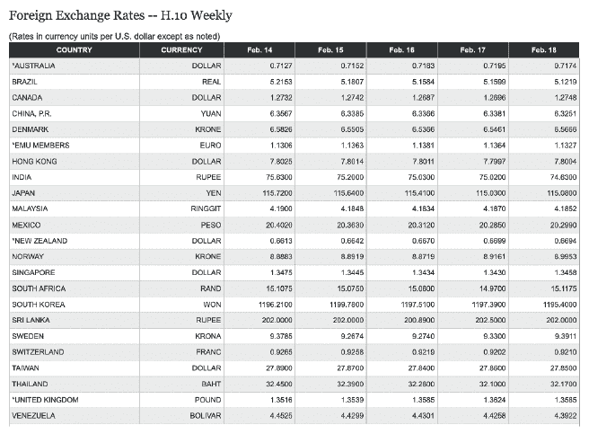

**图 5.2: 2022 年 2 月美国联邦储备系统董事会发布的汇率**

来源：[`www.federalreserve.gov/releases/h10/current/default.htm`](https://www.federalreserve.gov/releases/h10/current/default.htm)

除了交易成本，货币兑换还存在其他痛点。有时两种货币之间没有直接市场。如果泰国有人想向巴西某人发送泰铢（THB），需要兑换成巴西雷亚尔（BRL）。可能没有直接市场，所以需要多次兑换，从而增加了费用。

接下来，我们看看借贷。

5.2.3. 借贷

贷款涉及将钱借给某人，预期借款人会以利息的形式偿还比原金额更多的钱。借贷市场正在积累前所未有的全球债务水平。根据国际货币基金组织（IMF）——一个由 190 个国家组成的组织——2020 年全球债务达到了 226 万亿美元。^(10) 这包括政府借款（公共债务）、机构借款和消费者借款。过去五十年里，世界上的借款金额超过了其通过国内生产总值（GDP）衡量的价值增长。（参见图 5.3）尽管整个全球金融系统可以承受一些损失，但如果大部分借款人违约，我们最终会遭遇像 2008 年全球金融危机那样的崩溃。

金钱的借出涉及相当大的对手方风险。贷款人如何确信借款人会如约偿还他们呢？贷款通常需要抵押品，这意味着借款人必须拿出一些有价值的东西作为抵押，以防借款人违约时偿还给贷款人。银行和其他金融机构的介入减轻了对手方风险。此外，政府和监管机构提供存款保险，并执行规则以减少存款人的损失风险，以及根据借款人偿还贷款的能力减少个人借款金额。

以下是使用银行进行借贷的概览：贷款人将钱存入银行以赚取利息，但他们在存款上赚取的利息微薄。2022 年 2 月，美国全国银行平均的储蓄账户利息支付仅为 0.06%。如果你在储蓄账户中存入 1000 美元，一年后你只能获得 60 美分的利息！^(i) 那为什么还要这么做呢？一些存款人喜欢在手头保留现金以备不时之需，而银行是一个相对安全的选择。在美国，为了获得银行特许证，银行必须得到联邦存款保险公司（FDIC）的保险。 (尽管在上一个章节中，我们了解到 SPDI 银行认为他们不应该被要求获得 FDIC 保险，因为他们将所有存款都保留在储备中。) FDIC 为每个受保银行的所有账户持有人提供高达 25 万美元的保险。

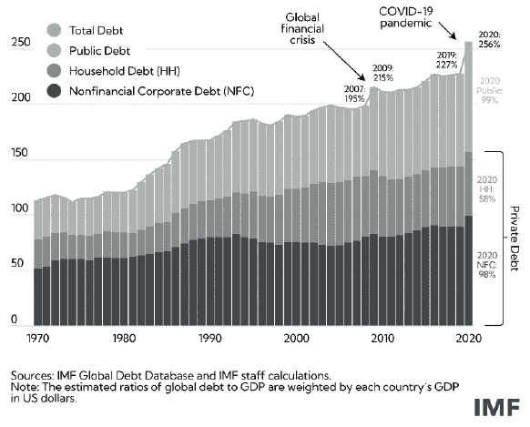

**图 5.3：1970 至 2020 年全球债务占 GDP 的百分比**

*来源：[`blogs.imf.org/wp-content/uploads/2021/12/FINAL-eng-global-debt-blog-dec-8-chart-127.jpg`](https://blogs.imf.org/wp-content/uploads/2021/12/FINAL-eng-global-debt-blog-dec-8-chart-127.jpg)*

所以，从贷款者的角度来看，传统银行服务提供了一个相对安全的地方来存放资金，但金融回报很小。他们的存款被用来向借款人放贷。另一方面，借款人向银行支付相对较高的利率。2022 年 2 月 27 日，平均固定抵押贷款利率为 4.25%。如果借款人借 1000 美元一年，借款人将向银行支付 23.17 美元的利息。银行向存款者支付的金额与从借款人那里收到的金额之间的差异称为利差。在我们这个存贷款 1000 美元的小场景中，利差巨大；对于借款人来说，它是存款者的 70 倍！

银行向借款人借出的钱比他们保留的存款多。这称为部分准备金银行，由于它有助于扩大经济，因此被允许。但存在风险！如果大部分存款者突然要求提取现金，银行可能会破产。这称为银行挤兑，银行的历史充满了这样的例子。因此，美国银行需要联邦存款保险公司（FDIC）的保险来帮助保护存款者。此外，借款人可能会违约，这在 2008 年全球金融危机期间大量发生。回想一下中本聪（Satoshi Nakamoto）的引用，*“银行必须被信任来持有我们的钱并将其电子转账，但它们以信贷泡沫的形式大量放贷，而仅保留一小部分储备。”*^(11)

到目前为止，我们提供了全球支付、货币兑换和贷款市场的概述。这些市场的缺陷导致了金融排斥、高交易成本和缓慢的结算时间。

5.2.4. 金融排斥、高交易成本、缓慢的结算时间

到现在为止，你可以看到普通个人的痛点。金融服务——如果你足够幸运能够获得它们——是昂贵、缓慢且不透明的。许多人并不这么幸运。根据世界银行行长的说法，“大约有 20 亿人不使用正规的金融服务，最贫穷的家庭中超过 50%的成年人没有银行账户。金融包容性是减少贫困和提高繁荣的关键因素。”^(12) 为什么这么多人都被排斥在外呢？

由于交易成本高昂，金融机构无法为低收入人群提供合理价格的服务。平均而言，美国银行每个支票账户一年的开支为 349 美元，而仅通过交易手续费回收 268 美元。^(13) 简而言之，银行在支票账户上亏损，因此他们几乎没有为低收入人群提供金融服务的动力。另一个问题是，10 亿人口无法建立自己的国家身份，这也使他们无法获得金融服务。^(14) 没有访问传统金融服务的途径，人们无法借款建立信用。因此，全球四分之一的 population doesn’t have access to financial services—they rely solely on cash.

根据麦肯锡的研究，每个人都会从更大的金融包容性中受益。^(15) 如果再纳入 16 亿人，麦肯锡估计他们将会产生：

• 2025 年 GDP 增长 3.7 万亿美元

• 新信贷 2.1 万亿美元

• 新存款 4.2 万亿美元

• 9500 万新增就业岗位

专家们普遍认为，银行和政府需要成为解决方案的一部分。^(16) 个人不能仅仅通过采用加密货币来解决所有的金融需求。他们需要使用法定货币进行信贷和支付。由比尔及梅琳达·盖茨基金会资助的贫困人群金融服务计划，为全球包容性的移动支付平台设定了最低要求：该平台必须在低成本手机上运行；^(17) 它必须支持国家货币；政府必须设定法规以防止欺诈、洗钱和网络恐怖主义；小商家的交易必须快速结算，并且必须与其他系统互操作。^(18) 到目前为止，大约有 150 个移动支付平台，如苹果支付、谷歌支付、贝宝、Venmo、支付宝、微信支付和 Wise，但它们在孤岛上运营，由企业控制。那么区块链如何提供帮助呢？

麻省理工学院数字货币倡议成员阿林·德罗戈斯认为，如果银行采用区块链技术大幅降低后台成本，就能增加金融包容性。他估计，银行可以将每个账户的平均成本降至每年 100 美元。更有雄心的银行可能会建立一个以区块链为核心的银行，将成本降至每年 50 美元。^(19) 此外，用于身份验证的区块链可以帮助全球超过 2.3 亿无证件移民获得金融服务和就业机会。^(20)

因此，全球支付、货币兑换和借贷/借款市场有很多问题需要解决。许多人认识到，区块链应用可以缓解许多痛点。^(21) 我们将研究三个具体应用。瑞波和恒星（Stellar）都建立了具有透明订单簿、快速结算时间和低交易成本的全球支付和货币兑换应用。恒星在 2021 年增加了自动市场制造商（AMM）功能。瑞波和恒星还通过使用其本土数字货币作为桥货币，解决了在没有直接市场的情况下进行货币兑换的问题（如我们的泰铢对巴西雷亚尔的例子）。例如，在瑞波中，发送者的法定货币可以兑换成瑞波的 XRP，XRP 的接收者可以将它兑换成发送者的法定货币之外的另一种法定货币。瑞波和恒星是非常相似的应用程序；这两个应用程序都由杰德·麦卡勒布（Jed McCaleb）共同创立，并且有类似的协议。他们的目标市场不同。瑞波主要针对机构客户；恒星旨在扩大今天被排除在外的金融服务的接入。Aave 是一个去中心化的借贷应用，其交易费用更低、结算时间更快、利差更小，比传统金融机构更具优势。这个应用允许人们在没有任何金融中介的情况下，借贷加密货币。

5.3. 瑞波

*“数字货币应运而生，因为人们需要一种不由中央银行控制、不受政治操纵的货币形式。瑞波是第一个允许用所有货币交易或任何有价值的单位（如积分里程、虚拟货币和手机话费）进行兑换的货币交易所。”*

**埃利奥特·布兰森（Elliott Branson），《瑞波：终极指南，理解瑞波币》**^(22)的作者。

瑞波是由克里斯·拉森（Chris Larsen）和杰布·麦卡勒布（Jeb McCaleb）于 2012 年创立的，旨在基于瑞恩·弗格 ger（Ryan Fugger）的去中心化实时结算系统的想法。总部位于旧金山，布拉德·加林豪斯（Brad Garlinghouse）是现任首席执行官。^(23) 瑞波在 2013 年获得了天使投资，2015 年进行了 A 轮融资，2016 年进行了 B 轮融资，2019 年进行了 C 轮融资。投资者包括 Azure Ventures Group、Accenture、Andreessen Horowitz、CME Ventures、Google Ventures、SBI Group、桑坦德创新 Ventures、Route 66 Ventures、标准渣打银行以及 Tetagon。^(24) 到 2022 年，瑞波雇佣了超过 500 人，超过 300 家金融机构加入了瑞波 Net，但 95%的客户位于美国之外。正如我们将要解释的，美国的采用率之所以低，是因为美国证券交易委员会（SEC）对瑞波的本土数字货币 XRP 持续存在问题。^(25)

Ripple 旨在克服比特币相对较慢的结算时间、无法交易其他货币以及巨大的电力消耗，同时仍保持成本低廉、透明、私密和安全的特点。根据 Ripple 网站的信息，其网络每秒处理 1500 笔交易（TPS），在四秒内结算支付，24 小时不间断运行，并可扩展到每秒 50000 TPS。平均交易费用不到一分钱。它还声称其分布式账本有七年的安全记录，没有发生任何事故。^(26)（账本于 2021 年 11 月 3 日在几个验证者遇到问题后暂停了 15 分钟，但它自动恢复了，没有人工干预。^(27))

Ripple 的目标客户主要是银行、企业、支付提供商和交易所等机构企业。对于银行客户，Ripple 设想银行将通过对新的企业和消费者客户进行预订来捕捉新的收入，降低其交易成本，并为规则、标准和治理提供单一的集成点和一致的体验。^(28)对于企业客户，Ripple 承诺提供按需支付，带有追踪和交货确认，以及更丰富的数据传输，例如将发票附加到支付转移上。^(29)

到 2018 年，Ripple 提供了三项集成服务：xCurrent 用于处理支付，xRapid 用于获取流动性，xVia 用于发送支付。2019 年，Ripple 取消了服务的单独命名，现在只称服务为“RippleNet”。2021 年 11 月，Ripple 宣布将推出一个名为“流动性中心”的新产品。流动性中心将允许传统金融服务公司为其客户提供购买和出售加密货币的能力。^(30)Ripple X，Ripple 的开放开发者平台，也在 2021 年 11 月宣布推出非同质化代币（NFT）功能。^(31)

机构客户使用 API 通过瑞波网关连接到瑞波网络（参见图 5.4）。网关可以与其他网关建立一定金额的信任线。相互信任的两个网关可以直接交易。然而，如果发送网关没有与接收网关的直接信任线，网络协议将找到一条信任路径，从而使交易在网络中‘扩散’。人们可能会认为这条路径是利用其他人的信任。如果莎莉想在没有真正信任山姆的情况下向山姆发送资金，莎莉可以向她信任的人发送资金，比如说约翰；约翰然后将资金发送给他信任的人，比如说苏；苏将资金发送给信任的山姆。如果找不到信任路径，价值可以使用瑞波的本地数字货币“瑞波” (代号 XRP) 进行转移。这样，如果没有交易伙伴之间的信任路径，XRP 可以用作桥接货币。协议寻找最佳的兑换率，并在几秒钟内完成货币兑换，只需支付几美分价值的费用。^(32)

以下是瑞波交易的工作方式：

“*当客户将资金转入 XRP 账本时，一个网关会在 XRP 账本之外保管这些资产，并向客户地址发送 XRP 账本的发行。当客户将资金从 XRP 账本转出时，她会向网关支付 XRP 账本，而网关会在自己的记录系统或另一个账户中为客户记账。与发行一样，XRP 可以在 XRP 账本地址之间自由发送和交换。然而，与发行不同，XRP 不绑定在会计关系上——XRP 可以直接从任何 XRP 账本地址发送到任何其他地址，无需通过网关或流动性提供者。*”^(33)

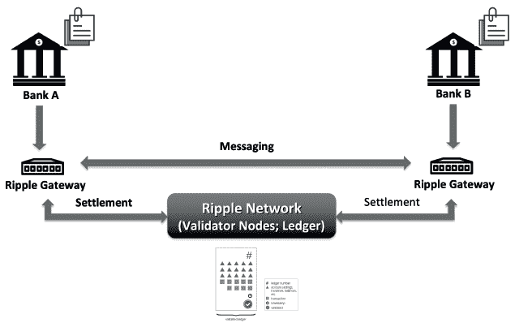

**图 5.4：两家银行使用瑞波的高级描绘**

与只有两种交易类型（Pay-to-PubkeyHash 和 Pay-to-Script-Hash）的比特币相比，截至 2022 年，瑞波有 24 种交易类型。它们与设置账户和信任线、支付（例如，支付、创建支付通道、支付通道资金；支付通道索赔）、报价（例如，创建报价、取消报价）、托管（创建托管、完成托管、取消托管）以及 NFT（创建 NFT、创建 NFT 报价、接受 NFT 报价、销毁 NFT）相关。^(35)

截至 2022 年，Ripple 的客户包括美国运通、MoneyGram、桑坦德和 SBI 等巨头。^(36)通常，Ripple 的客户在他们自己的品牌下推广 Ripple 应用。例如，桑坦德在 2018 年推出了一种名为 One Pay FX 的服务。该应用程序基于 Ripple 的一个版本，在六个国家为客户服务：巴西、智利、波兰、葡萄牙、西班牙和英国。^(37)有了这个应用程序，客户只需点击四到五次即可发送全球汇款。^(38)到 2022 年，One Pay FX 处理了桑坦德在这些国家国际支付的 50%。^(39)

另一家企业客户 SBI Remit，让在日本的泰国国民可以直接将钱发送到他们在泰国的暹罗商业银行(SCB)账户。在这项服务推出之前，日本居住的泰国国民必须雇佣代理并使用现金进行转账。推出这项服务仅用了三个月，转账即可在三秒内结算。^(40)到 2022 年，SCB 平均每月处理 80,000 笔交易，每月个人汇款额达 4 亿美元。^(41)

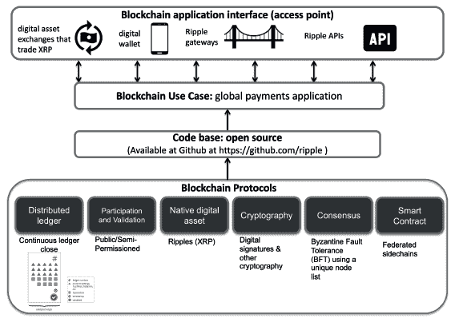

**图 5.5：Ripple 映射到区块链应用框架**

图 5.5 将 Ripple 映射到了在第三章开发的区块链应用框架上。从协议开始，Ripple 定义了一种新的分布式账本协议，称为 Ripple 交易协议(RTXP)。^(42)这个协议有时被称为“半许可”的，因为 XRPs 可以发送给任何人（无需许可），但也具有信任线，其中交易只能通过网络上的批准路径传播。

**分布式账本**。Ripple 不像比特币那样将交易结构化为区块链。它将账本结构化为一系列按顺序排列的交易和账户设置/余额的长期列表，每几秒钟关闭一次。^(43)这个被称为 XRPL 的账本存储了所有如报价、支付和取消订单的交易。账本还存储了授权的信任线，允许钱包持有者指定他们将接受哪种类型的加密货币以及最高金额。这防止了人们向钱包空投不需要的资产。账本的每个版本都有唯一的 ID 和时间戳。与比特币一样，Ripple 交易永久存储在 Ripple 的分布式账本上，且不可撤销。到 2022 年 2 月 23 日，Ripple 处于账本的第 69,885,079 个版本(图 5.6)。

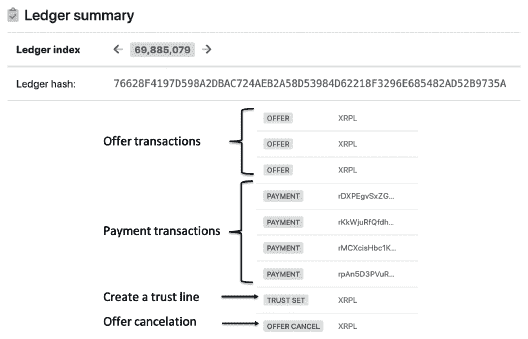

**图 5.6：2022 年 2 月 23 日下午 3 点 21 分 UTC 时 Ripple 账本的小快照**

来源：[`xrpscan.com/ledger/69885079`](https://xrpscan.com/ledger/69885079)

**原生加密货币**。Ripple 的原生加密货币，称为“ripples”（XRP），有几个用途。如上所述，如果找不到交易伙伴之间的信任路径，XRP 可以用作桥接货币。XRP 也是支付网关的方式，因为每个网关都可以设定以 XRP 形式使用的费用。如果交易伙伴直接交易而不使用网关，ripple 交易的发送者支付少量 ripples，以便攻击者不会用数百万交易淹没系统，因为攻击者会耗尽 XRP。^(44) 设计成稀缺资产，XRP 的货币供应量恰好是 1000 亿 ripples，并在协议启动时发行，而不是像比特币那样通过挖矿过程释放。^(45) Ripple 是一种通货紧缩货币——一旦 ripples 被用来支付交易，它们就会被销毁。参与者不必使用 ripples；他们可以直接使用其他货币进行交易。^(46)

**共识协议**。Ripple 采用了一种拜占庭容错（BFT）共识协议。在这种共识系统中，网络上的大多数节点同意的交易将被记录在账本上。^(47)（有关更详细的解释，请参见第三章）。Ripple 交易在得到 80%的节点验证后被认为是“安全”的。^(48)

当机构加入 Ripple 网络时，它们可以选择从注册的 147 个主网络节点（截至 2022 年 3 月）中选择进行验证检查的节点，或者接受 Ripple 维护的约 33 个节点的默认列表，这个列表被称为唯一节点列表（UNL）（有关注册节点的列表，请参见[`xrpscan.com/validators`](https://xrpscan.com/validators)）。Ripple 建议用户选择跨大陆和跨行业的验证节点，以减少共谋的可能性，例如选择来自北美、欧洲、亚洲和澳大利亚的商人；金融机构；非营利组织；政党；以及宗教团体（参见图 5.7）。^(49) 实际上，网络参与者通常接受 Ripple 的默认节点列表，而不是选择自己的节点。Stellar 基金会的大卫·马齐埃 res 写道，这种行为会集中权力：

*“通常，拜占庭共识系统的成员资格由中央权威机构或封闭的谈判设定。之前尝试去中心化加入过程已经放弃了一些好处。一种方法，由 Ripple 采取，是发布一个‘入门’成员列表，参与者可以自行编辑，希望人们的编辑要么无关紧要，要么被绝大多数参与者复制。不幸的是，因为不同的列表会无效化安全保证，用户实际上不愿意编辑列表，最终大量权力集中在起步列表的维护者手中。”*^(50)

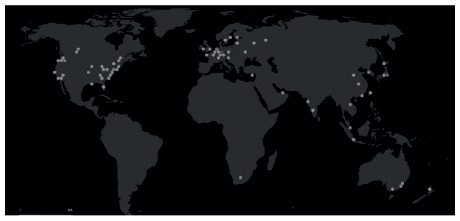

**图 5.7：2022 年 2 月 23 日的实时 Ripple 网络拓扑**

**源地址：** Ripple 节点的位置可以在[`livenet.xrpl.org/network/nodes`](https://livenet.xrpl.org/network/nodes)上查看。

在没有挖矿激励的情况下，Ripple 要求加入系统的机构运行一个验证节点来帮助保护网络。执行验证角色所需的成本接近零美元。^(51) 交易结算只需几秒钟，并且比比特币消耗的电力少得多——大约和运行一个电子邮件服务器的电力成本一样。^(52)

**智能合约：** Ripple 最初没有智能合约功能。2014 年 7 月，Ripple Labs 提出一个项目，旨在为 Ripple 添加智能合约。仅仅一年后，Ripple 放弃了这个项目，称它是不必要的。^(53) 然后，在 2021 年，RippleX 宣布将引入“联邦侧链”以满足用户对智能合约的需求，同时保持账本简洁。每个侧链都将作为自己的区块链运行，拥有自己的账本，但允许 XRP 和发行的代币在不同链之间迁移。^(54) 到 2022 年 3 月，联邦侧链已向公众开放用于测试。^(55)

**代码库：** Ripple 的代码库是开源的，可以从 Github 下载，地址为[`github.com/ripple`](https://github.com/ripple)。^(56)

**应用接口：** 用户可以使用 Ripple 钱包直接与 Ripple 网络交易，但这需要至少 20 XRP 的最低余额。^(57) 大多数客户使用由加密货币交易所或金融机构运营的 Ripple 网关。^(58) Ripple 有桥接协议，允许与外部网络之间的支付。例如，Ripple 有一个比特币桥接协议，允许用户将 ripples 发送到比特币地址。^(59)

**治理：** 由于 Ripple Labs 持有大量 XRP（600 亿 XRP），因此它在 Ripple 中有很大的影响力。^(60) Xrlp.org 通过使用“修正案”流程管理对 XRP 账本提出的更改。^(61) 任何拟议的更改都需要 80%的注册节点在两周内表示支持。^(62) 自 2014 年 Ripple 启动以来，已有 32 项修正案得到启用，其中大部分由 Ripple Labs 提出。（提议的作者在网站上不可见，无法证实这一说法）。投票可以在[`xrpscan.com/amendments`](https://xrpscan.com/amendments)上查看。

**与 Ripple 的法律问题**。2015 年，Ripple 因违反 1970 年的银行保密法被美国财政部罚款 70 万美元，具体指控 Ripple 故意没有实施反洗钱（AML）程序，也没有报告可疑活动。^(63) Ripple 同意改进其协议以满足当前的银行法规。^(64) 2018 年，投资者对 Ripple 提起了集体诉讼，声称 Ripple 非法向他们出售了未注册的证券。2020 年，美国证券交易委员会（SEC）对布拉德·加林豪斯（CEO）和克里斯·拉尔森（联合创始人）出售未注册证券提起法律诉讼。具体来说，SEC 发现 XRP 在豪伊测试下是一种证券，因为 Ripple 实验室以一种集中方式分配 XRP。在审前发现听证会上，法院支持加林豪斯和拉尔森。他们要求法院要求 SEC 公布 2012 年关于 XRP 的文件，这些文件据称显示 SEC 没有将 XRP 视为一种证券。截至 2022 年撰写本文时，该案件仍在法院中。^(65)

总之，Ripple 是一个重要的区块链应用——它在运行，它在工作，至少在美国之外的机构客户的采用率在增加。

5.4. 恒星

*“恒星开发基金会和恒星致力于通过使货币更加流动、市场更加开放和人们更加赋权来解锁世界的经济潜力。”*

**恒星开发基金会^(66)**

*“我们的目标是使全球支付像互联网一样开放，这样任何人都可以轻松地跨越世界发送资金，无论他们使用的是哪家金融机构。支付应该像电子邮件一样运作，并且应该全部都是可互操作的。”*

**杰德·麦卡勒布，恒星开发基金会联合创始人兼 CTO^(67)**

杰德·麦卡勒布于 2012 年共同创立了 Ripple，但他很快因与其它创始人意见分歧而离开了 Ripple。^(68) 之后，他启动了一个类似的项目，但针对的是不同的目标受众。杰德·麦卡勒布与乔伊斯·金共同创立了恒星开发基金会（SDF）——一个位于美国的非营利组织——于 2014 年。恒星的使命是扩大全球的金融接入和金融知识。^(69) 恒星协议的白皮书于 2015 年 4 月发布，该网络于同年 11 月上线。^(70),^(71) 到 2017 年底，SDF 从 Stripe 那里获得了 300 万美元的资助。^(72) 截至 2022 年 3 月，SDF 在全球八个国家拥有大约 50 名员工。^(73)

Stellar 使所有形式的数字资产的创建和交易成为可能，包括货币、加密货币、商品、股票和债券。^(74) Stellar 的全球支付网络在三到五秒内解决交易，每笔交易费用非常低，只需 100,000 次交易的一个 lumen（Stellar 的原生数字货币）。2022 年 2 月 23 日，一个 lumen 只需 $.18（十八美分）！Stellar 每秒可以处理超过 1,000 次操作。

SDF 没有直接与用户接触。相反，SDF 旨在让其他机构开发商业模式，并使用 Stellar 代码库为汇款、小额支付、移动分行、移动货币等服务和未银行人群的其他服务开发应用程序。Stellar 不向机构或个人收取使用 Stellar 网络的费用，除了每笔交易费之外。其网络基于由基金会支持的开源代码，但采用者可以自由开发商业应用程序、修改或分发源代码。

**Stellar 用例。** 作为锚点的连接到 Stellar 网络的机构用户，负责获得许可并遵守规定。^(75) Jed McCaleb 解释说，*“Stellar 基金会永远不会处于资金流中；我们没有客户。我们提供软件，金融机构部署它。合规负担落在锚点*—*金融机构*—*上，因为它们仍然与发送者和接收者有关系。”*^(76)

它的第一个采用者是 Parkway 项目。Oradian，一家关注非洲的 FinTech，领导了该项目。该项目旨在为尼日利亚农村地区的 30 万未银行人群提供金融服务，其中 90% 是女性。^(77) 当尼日利亚中央银行停止所有汇款公司在国内运营，只允许 Western Union 和 MoneyGram 运营时，该项目暂时停止。最终，专注于泛非洲跨境支付的 FinTech Cowrie 在尼日利亚成功开发了基于 Stellar 网络的服务。**Cowrie 交易所**与尼日利亚银行间结算系统有限公司（NIBSS）挂钩。Cowrie 作为稳定币 NGNT 的发行者，该稳定币与尼日利亚法定货币尼日利亚奈拉挂钩，允许人们向尼日利亚和欧盟发送和接收支付。^(78) 其客户包括 Tempo、SatoshiPay 和 Coinqvest，它们也自己在 Stellar 网络上构建了服务。^(79)

**Tempo** 采用 Stellar 进行跨境支付，以便客户支付公用事业账单。^(80) 截至 2018 年，Tempo 已经帮助来自欧洲的客户——大部分位于法国和德国——将支付转账到 Coins.ph，他们在菲律宾的公司。^(81) Jed McCaleb 说：*“Tempo 非常棒；真正的资金正在活跃的网络中流动。”*^(82)

**SatoshiPay** 允许网络出版商向观众收取非常小的加密货币。出版商在其网站上作为支付选项发布 Stellar 钱包小部件，用户只需点击它，微支付就会在 Stellar 账本上处理和结算。^(83) 它的其他服务包括用于跨境支付的 Dtransfer、连接法定货币与 DeFi 生态系统的 Pendulum 以及用于购买、出售和提取数字资产的 Solar Wallet。^(84)

**Coinqvest** 为客户提供使用数字货币（欧元、奈拉和美国美元）或加密货币（ Lumens、比特币、以太坊、莱特币或瑞波币）支付商家的应用程序。^(85)

**Saldo** 是另一个采用者。它使用 Stellar 网络帮助美国移民工人为其在墨西哥的家庭支付公用事业账单。这个应用程序解决了一个关键需求，因为公用事业提供商要求每月支付，但典型的公用事业账单的钱比跨边界发送支付的交易费还要少。^(86)

**Litemint** 允许用户在其市场上以非常低的成本铸造、购买和出售 NFT。根据其网站，*“通过在 Stellar 上建立我们的市场，我们将 NFT 的世界开放给了每个人。低廉的、固定的费用使得任何人都能高效地铸造 NFT 和收藏品* *并以任何适合你业务需求的价格和任何货币列出它们，即使是低于美元的物品也可以高效地铸造！”^(87)*

**IBM.** 2017 年 10 月，IBM 和基于波利尼西亚的低价值电子外汇支付系统 KlickEx 宣布将使用 Stellar 进行跨境支付。Jed McCaleb 说：*“IBM 在项目的某些部分中使用 Hyperledger Fabric，他们使用 Stellar 进行跨境支付。”*^(88) 这个产品被称为 **IBM World Wire，** 它允许现有的金融机构使用 World Wire API 连接到网络，通过 Stellar 锚点发送支付，并在 Stellar 网络上结算交易。^(89) 根据当时 IBM 副总裁 Jesse Lund 的说法，“Stellar 为我们从这些纯粹的私有网络和完全开放的荒野网络之间提供了一座桥梁。”^(90)* IBM 基本上建立了一个子网络来执行规则，但使用 Stellar 网络提供一个开放的审计线索。2021 年 10 月，IBM 决定将重点从运营 IBM World Wire 网络转向，并将代码库捐赠给开源社区。^(91)

就网络统计而言，星链网络有 660 万个账户；超过 4 万个账户每天活跃，账本在 2022 年 2 月 27 日每 6.2 秒关闭一次。^(92)

星链交易是如何工作的：用户通过指定源账户、操作列表和其他参数来创建交易。星链交易最多可能包含 23 个操作：创建账户；支付；路径支付严格发送；路径支付严格接收；管理买入报价；管理卖出报价；创建被动卖出报价；设置选项；更改信任；允许信任；账户合并；管理数据；序列号提升；创建可领取余额；领取可领取余额；开始赞助未来储备；结束赞助未来储备；撤销赞助；回溯；回溯可领取余额；设置信任线标志；流动性池存款；和流动性池提款。^(93) 交易由发送者数字签名，提交给星链网络，并由星链核心验证。验证的交易传播到整个星链网络。验证节点收集最近批准的交易到一个拟议的交易集，并与网络分享。星链共识协议选择一个拟议的交易集，创建账本的新版本，并传播到网络。^(94)

图 5.8 将星链映射到在第三章开发的区块链应用框架中。如上所述，麦克卡雷布也是 Ripple 的联合创始人，他离开 Ripple 创办了星链。^(95) 由于有共同的历史，星链的协议基于 Ripple 的协议，所以在分布式账本过程方面它们是相似的。两个网络还都使用 API 将组织连接到网络，但星链使用“锚点”这个术语，而 Ripple 称它们为“网关”之间的信任线。正如我们将看到的，星链使用不同于 Ripple 的共识算法，并旨在实现更高的去中心化。

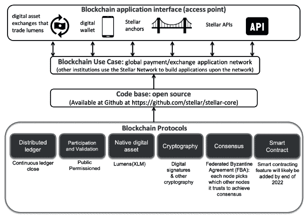

**图 5.8：星链映射到区块链应用框架**

**分布式账本**。与 Ripple 一样，星链将账本结构化为一个长序列的交易和账户余额列表，每几秒钟关闭一次。账本还存储当前的订单簿，记录不同货币的买入和卖出报价。星链交易永久存储在分布式账本上，且不可撤销。2022 年 2 月 27 日，星链处于第 39,812,979 个账本版本（参见图 5.9）。

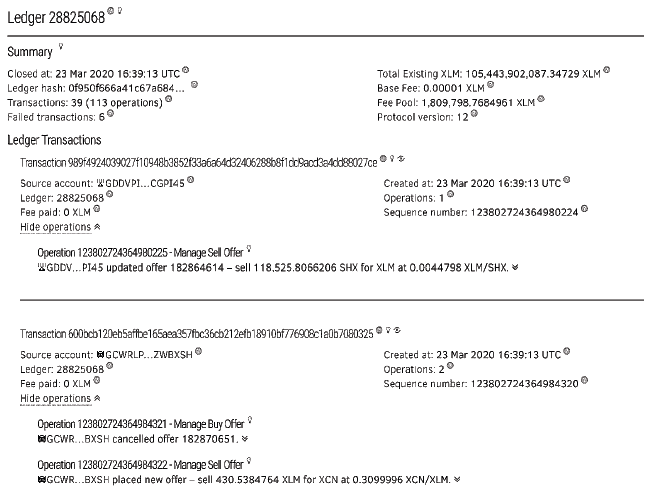

**图 5.9：星链账本的一个快照，显示标题和前两个交易**

来源：^(93) [`stellar.expert/explorer/public/ledger/28825068`](https://stellar.expert/explorer/public/ledger/28825068)

**原生加密货币**。恒星网络的原生数字资产，恒星币（XLM），有多个用途。首先，恒星币用于资助恒星发展基金会（SDF）的运营。恒星在 2014 年发行了 1000 亿恒星币，其中保留 5%给基金会运营，其余的放入储备金。XLM 是一种通货膨胀货币——每年会有新恒星币加入到网络中，数量为货币供应量的 1%。（96）基金会旨在将恒星币分发给广泛的个人和组织，包括 50%给个人，25%给旨在服务未被服务群体的非盈利组织，以及 20%给比特币持有者。（97）为了触及个人，基金会将恒星币在 Kraken 等交易所进行拍卖。个人和机构也可以向 SDF 申请恒星币来资助项目。为了给系统提供额外的稳定性，基金会的员工不允许在拍卖会上购买恒星币，恒星的拥有者也同意至少五年内不卖出任何恒星币。（98),(99）2019 年 11 月，SDF 决定销毁 500 亿储备中的恒星币，因为它们很难将其分发到市场中去。（100）截至 2022 年 3 月，总货币供应量为 500 亿恒星币，其中超过 250 亿恒星币已被分发，SDF 保留 250 亿恒星币。（101）

其次，如果交易伙伴之间不存在直接市场，恒星币可以在恒星网络内作为桥接货币使用。杰德·麦卡勒布举了这样一个例子：

“如果你想象有人想从泰国把钱寄到巴西，这两个货币之间可能没有好的流动市场。所以你会选择中间的某种桥接货币。也许你会选择泰铢换成美元，美元换成巴西雷亚尔。但你也可以直接通过恒星币或比特币中间跳转，或者多次跳转以获取最好的汇率。” （102）

最后，恒星币用于防止服务拒绝（DoS）攻击。每个恒星网络的交易都需要支付微小的费用，即 0.00001 恒星币。 “这个费用防止了有恶意意图的用户淹没网络（这被称为 DoS 攻击）。恒星币作为安全令牌，减轻了试图产生大量交易或消耗账本大量空间的各种 DoS 攻击。” （103）

**共识协议**。Stellar 的协议被称为 Stellar 共识协议（SCP）。^(104) 它与 Ripple 最主要的区别在于一种新的共识模型——联邦拜占庭协议（FBA）。FBA 区分了网络级别的***quorum***节点需要达成一致，以及***quorum slice***特定节点选择依赖其验证交易的节点切片。 图 5.10 展示了 SDF 1 在其 quorum slice 中包含哪些节点。该协议确保 Stellar 网络在任何人都可以加入的同时，赋予每个运行节点的参与者决定信任哪些其他节点来验证交易的权力。^(105)

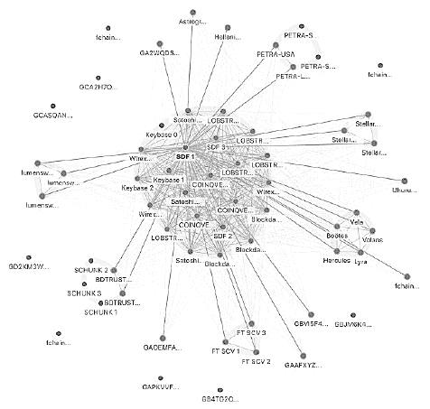

**图 5.10：SDF 1 节点的 quorum 切片**

来源：[`stellarbeat.io/nodes/GCGB2S2KGYARPVIA37HYZXVRM2YZUEXA6S33ZU5BUDC6THSB62LZSTYH?center=0&no-scroll=1`](https://stellarbeat.io/nodes/GCGB2S2KGYARPVIA37HYZXVRM2YZUEXA6S33ZU5BUDC6THSB62LZSTYH?center=0&no-scroll=1)

截至 2022 年 2 月，Stellar 网络共有 36 个完整的验证节点，由 SDF、Franklin Templeton（美国的一家全球基金管理公司）、Coinqvest（位于爱沙尼亚）、Lobstr（位于白俄罗斯的钱包公司）以及其他许多公司运营。^(106),^(107) 这些节点分布在全球各地，包括美国、英国、德国和新加坡。^(108) 当被问及实际中 quorum 切片选择是如何运作的，Jed McCaleb 解释说人们会选择一组多样化的节点，在这些节点背后串通的可能性非常低。他表示：“节点会在每家公司的网站上宣传。公司和大学背后串通的可能性非常低，所以虽然没有灵丹妙药，但人们可以做出合理的判断。”*

**智能合约**。Stellar 没有在推出时包含图灵完备的智能合约功能。^(109) 然而，在 2022 年 1 月 25 日，Stellar 发展基金会技术战略副总裁 Tomer Weller 在 Twitter 上宣布，Stellar 将整合智能合约，并预计在 2022 年底部署。^(110)

**代码库**。Stellar 的代码库是开源的，可以从 Github 下载，([`github.com/stellar/stellar-core`](https://github.com/stellar/stellar-core))。

**应用界面**。用户可以使用数字钱包直接与 Stellar 网络交易，但需要确保账户真实，需要保持 20 XLM 的最小余额。^(111) Stellar 不拥有或运营任何数字钱包，但维护着一个列有组织数字钱包列表的页面（参见[`www.stellar.org/lumens/wallets/`](https://www.stellar.org/lumens/wallets/)）。用户还可以通过建立于网络之上的服务机构的锚点机构访问 Stellar 网络。锚点机构从其客户那里接受存款，并向存储在分布式账本上的地址发放信贷。

**治理。** SDF 是 Stellar 代码库和生态系统的首要变革来源，但作为一个开源社区，任何人都可以提交改进提案。^(112) Stellar 有两种提案：核心 advancement 提案（CAPs）和 Stellar 生态系统提案（SEPs）。两者都在 Github 上管理。CAPs 是针对 Stellar 代码库的变革提案，需要大多数节点验证者实施变革才能被认为是最终的。截至 2022 年 3 月，已有 22 项 CAPs 得以实施。其中 22 项，SDF 的软件工程师 Jonathan Jove 撰写了 8 项；SDF 的 CTO Nicolas Barry 撰写了 3 项，Jed McCaleb 撰写了 1 项。^(113) SEPs 是关于与 Stellar 接口的变革提案，通常以新的 API 的形式出现。到目前为止，已有 6 项 SEPs 得以实施，都是由 SDF 或 Inter/stellar 公司提出的，该公司由 Mike Kennedy 和 Jed McCaleb 共同创立。

根据 McCaleb 的说法，SDF 在 2020 年的目标是：“我们仍然非常专注于让这个网络对人们有用。我们不仅仅是为了技术而建造这个；我们想要 Stellar 实质性改善人们的生活。我们今年春天将发布一个面向拉丁美洲的消费者钱包，我们将做很多事情来增加其采用率和实用性。”^(114)

总之，Stellar 是一个重要的区块链网络——它在运行，它在工作，它的采用率在增加。下一个案例提供了 DeFi 借贷的一个例子。

5.5. Aave

拥有金融科技和法律背景的芬兰企业家 Stanti Kulechov 对使用智能合约进行自动执行很感兴趣。他认为 DeFi 是一种让每个人都能够借贷资金的更包容的方式。2017 年，他创立了 ETHLend，并通过 ICO 筹集了 1.62 亿美元。2018 年，他将这个名字改为“Aave”，在芬兰语中是“幽灵”的意思。

Aave 是一个非托管的流动性应用，允许参与者获得存款利息（贷款人）、借用加密货币资产，或者作为清算人。^(115) “非托管”意味着只有用户可以移动资金，即没有中心公司或政府可以排除用户或拒绝他们访问自己的资产。加密货币持有者将加密货币资产存入流动性池以获得 Aave 原生代币 aToken 的利息。之所以叫“流动性”池，是因为存款人可以轻松、快速地取回其加密货币存款，而不影响其价格。截至 2022 年 2 月 28 日，Aave 运行着五个市场：Aave V1、Aave V2、AMM 市场、Aave 市场 Polygon 和 Aave 市场 Avalanche。这一天这些五个市场的总流动性池，即总存款，达到了 183 亿美元(表 5.3)。

| **市场** | **启动日期** | **智能合约部署平台** | **流动性池** |
| --- | --- | --- | --- |
| **Aave V1** | **2017 年 11 月** | **以太坊** | **1.28 亿美元** |
| **Aave V2** | **2020 年 12 月** | **以太坊** | **110 亿美元** |
| **AMM 市场** | 2021 年 3 月 | 以太坊 | 1200 万美元 |
| **Aave 市场 Polygon** | 2021 年 4 月 | Polygon | 17 亿美元 |
| **Aave 市场雪崩** | 2021 年 10 月 | 雪崩 | 59 亿美元 |

**表 5.3：2022 年 2 月 28 日 Aave 的五个市场**

Aave V1 和 Aave V2 是 Aave 的第一个和第二个版本，两个版本都在以太坊上运行，因此产生了相对较高的交易费用。Aave V1 正在逐渐被淘汰，这从其相比 Aave V2 价值较低的流动性池中可以看出。2022 年 2 月这一天，V1 的总市值仅为 1.28 亿美元，而 V2 的总市值约为 110 亿美元。AMM 市场于 2021 年 3 月启动。它是一个自动市场制造商（AMM），与 Uniswap 相连，后者也运行在以太坊上。AMM 市场允许用户在 Uniswap 中存入代币，并使用这些代币作为 Aave 市场的抵押品。它主要用于闪贷。^(ii) 这一天它的市值为 1200 万美元。为了降低交易费用，用户可以使用在 Polygon 上运行的市场，Polygon 是一个第 2 层解决方案，位于以太坊之上。Aave 市场 Polygon 在这一天拥有 17 亿美元的流动性。Aave 于 2021 年 10 月在另一条区块链网络上启动，即 Avalanche。在几小时的启动时间内，借贷池的加密货币价值超过了 10 亿美元！^(116) 几个月后，Aave 市场雪崩的流动性池价值接近 60 亿美元。

专注于 Aave V2 市场，图 5.11 展示了 2022 年 2 月 28 日的六个最大的流动性池（总共有 32 个池）。以太坊的流动性池显示了 40.8 亿美元的 ETH 存款和 1720 万美元的 ETH 贷款给借款人。引用了三个利率：将 ETH 存入流动性池的年化收益率（APY）以及两个 ETH 借款的 APY 率。用户可以选择按变量利率或稳定利率借款。变量利率随市场因素波动；稳定利率在贷款期间保持不变。稳定利率通常高于变量利率，但一些借款人更喜欢确切地知道他们的开支。一些利率还提供了额外的激励措施，使用 Aave 市场 Polygon，表明如果用户选择使用 Polygon 市场而不是 Aave V2 市场，存款者将获得 Polygon 的原生数字货币 MATIC 的奖励。与传统金融服务一样，利息收入和利息支付之间存在利差，但在 DeFi 中，利差要窄得多。

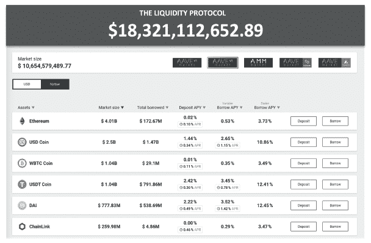

**图 5.11：2022 年 2 月 28 日 Aave 首页**

*来源：[`aave.com/`](https://aave.com/)*

图 5.12 将 Aave V2 映射到第三章开发的区块链应用框架。

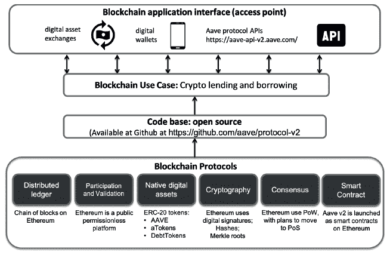

**图 5.12：Aave V2 映射到区块链应用框架**

**分布式账本**。Aave V2 在以太坊上运行，因此其智能合约和交易存储在以太坊账本上，以区块链的形式组织。

**参与和验证**。以太坊和 Aave 对所有人开放。以太坊是一个公共的无需许可的区块链平台。

**原生数字资产**。Aave V1 拥有几种原生数字资产，包括 AAVE 治理代币、aToken（给贷款人）和 DebtToken（给借款人）。这些都是 ERC-20 代币（参见第四章）。

AAVE 代币是其治理代币，总供应量为 1600 万 AAVE。AAVE 治理代币用于管理生态系统储备、Aave 市场和安全模块（参见图 5.13）。AAVE 持有者可以对 Aave 改进协议（AIPs）进行投票。AIP 过程始于 Aave 请求评论（ARC）。在提供开放反馈后，ARC 进入“快照池”投票，以衡量其可行性。如果 ARC 被认为可行，它就成为了一个正式的 AIP，使用 AAVE 代币进行投票。AIPs 发布在 GitHub 上（[`github.com/aave/aip`](https://github.com/aave/aip)）。AAVE 代币还可以投入到安全模块中，提供一种类型的存款保险。AAVE 质押者为他们质押的代币赚取奖励和费用。

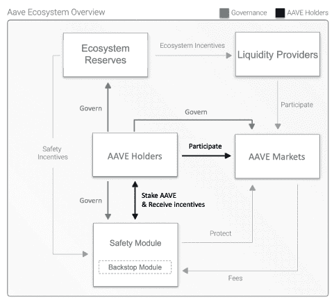

**图 5.13：Aave 治理代币管理生态系统储备、Aave 市场和安全模块**

*来源：[`docs.aave.com/aavenomics/ecosystem-overview`](https://docs.aave.com/aavenomics/ecosystem-overview)*

aToken 是 Aave 的计息代币。aToken 是稳定币，与存入的加密资产的比例为 1:1。当向流动性池存款时创建 aToken，即“铸造”，当它们被提取时销毁，即“燃烧”。例如，如果一个人将五枚比特币存入 Aave 流动性池，Aave dApp 铸造 5 aBitcoins。该人的数字钱包将显示 aBitcoin 的余额。钱包将在 aBitcoin 中累积利息。当这个人想要从流动性池中提取时，Aave dApp 燃烧 aBitcoin 并将比特币发送到该人的钱包。

一种特殊的 aToken 类型用于将投票权委托给他人。AAVE 持有者可以通过向代表发送一种特殊代币（称为 DelegationAwareAToken）来委托他们的投票给代表。这是与 AAVE 治理代币 1:1 挂钩的，并且可以随时撤销。

Aave 的 DebtToken 用于借款。与 aToken 一样，DebtToken 与借款资产的比例为 1:1，但与 aToken 不同，DebtToken 是不可转让的，这意味着借款人不能将自己的债务卖给其他人。DebtToken 有两种类型，一种用于固定利率贷款，另一种用于浮动利率贷款。

**智能合约**。Aave 是基于以太坊部署的一系列智能合约，包括代币化、借贷池、闪贷和费用算法的智能合约。117 它们发表在 Github 上。根据 Stanti Kulechov 的说法，Aave 在部署任何智能合约之前都进行了五轮独立审计。

**代码库**。Aave V2 的代码库可以在 [`github.com/aave/protocol-v2`](https://github.com/aave/protocol-v2) 找到。

**应用界面**。用户可以通过 MetaMask 等以太坊钱包访问 Aave V2。开发者可以通过其 API 访问 Aave V2，[`aave-api-v2.aave.com/`](https://aave-api-v2.aave.com/)

**治理**。Aave 通过上面讨论的 AAVE 治理代币在链上进行治理。在 1600 万 AAVE 治理代币中，只有 300 万由 Aave 的创始人拥有。与 Ripple Labs、Stellar 发展基金会储备和其他 DeFi 应用相比，这种所有权比例要小得多。例如，DeFi 应用 Compound 的创始人拥有 Compound 治理代币的百分之五十。118

Aave 是众多 DeFi 应用之一。读者也鼓励调查 Uniswap、Chainlink、Wrapped Bitcoin、Terra、Pancake Swap 和 Maker。截至这一天，2022 年 3 月 14 日，DeFi 市场的总价值达到了 1260 亿美元！119

5.6  结论

瑞波、恒星和 Aave 的创始人都创建了“原生区块链”业务。深入研究每一个，我们可以欣赏到第二章中讨论的治理的重要性，以及如何将区块链映射到第三章的区块链应用框架中。在治理方面，由于 Ripple Labs 持有大量 XRP，因此 Ripple 是最受中央控制的，但任何人都可以提出修正案。恒星改进主要受 SDF 影响，但任何人都可以提出建议。Aave 是链上治理的一个例子，使用治理代币来决定 Aave 网络的事项——这种新的链上治理模式对于组织人类活动令人兴奋。在区块链应用框架上，瑞波、恒星和 Aave 都公开了他们的代码库供所有人查看。这种透明度使公众对应用程序如声称的那样运行更有信心。

在下一章中，我们将探讨非区块链原生公司金融服务的区块链应用。这些传统企业决定采用一些区块链启用的解决方案来增强其金融服务产品。

引用

^(1) 麦肯锡（2016 年），《2016 年全球支付：尽管局势不确定，但基础强劲》，[`www.mckinsey.com/~/media/McKinsey/Industries/Financial`](https://www.mckinsey.com/~/media/McKinsey/Industries/Financial) 服务/我们的见解/2015 年全球支付[行业/Global-Payments-2016.ashx](http://industry/Global-Payments-2016.ashx)

^(2) 再次说明，实际过程取决于使用哪些服务。许多银行使用 SWIFT（环球银行间金融电信协会），一个国际支付网络；欧盟成员国可能会使用 SEPA（单一欧元支付区）来管理银行间的货币转账。SEPA “使客户能够无需现金地在区域内向任何人支付，使用单一银行账户和单一套支付工具；SEPA 保证欧元支付在保证时间内收到，并且银行不得扣除转账的金额。” SEPA 也由冰岛、列支敦士登、挪威、瑞士、摩纳哥和圣马力诺使用。[`en.wikipedia.org/wiki/Single_Euro_Payments_Area`](https://en.wikipedia.org/wiki/Single_Euro_Payments_Area)

^(3) [`paymentsviews.com/2014/05/15/there-is-no-such-thing-as-an-international-wire/`](http://paymentsviews.com/2014/05/15/there-is-no-such-thing-as-an-international-wire/)

^(4) *穿越跨境支付的世界*, [`www.iqpc.com/media/1003982/57107.pdf`](http://www.iqpc.com/media/1003982/57107.pdf)

^(5) 麦肯锡（2015），《2015 年全球支付：一个健康的行业面临颠覆》，[`www.mckinsey.com/~/media/mckinsey/dotcom/client_service/financialservices/latestthinking/payments/global_payments_2015_a_healthy_industry_confronts_disruption.ashx`](http://www.mckinsey.com/~/media/mckinsey/dotcom/client_service/financialservices/latestthinking/payments/global_payments_2015_a_healthy_industry_confronts_disruption.ashx)

^(6) 国际货币基金组织（2021）。没有简单的解决方案：多种因素推动汇款成本。Retrieved February 22, 2022, from [`www.elibrary.imf.org/downloadpdf/journals/001/2021/199/001.2021.issue-199-en.xml`](https://www.elibrary.imf.org/downloadpdf/journals/001/2021/199/001.2021.issue-199-en.xml)

^(7) Segal, T. (August 18, 2021). 外汇市场：谁交易货币以及为什么。Retrieved February 25, 2022, from [`www.investopedia.com/articles/forex/11/who-trades-forex-and-why.asp#:~:text=The%20foreign%20exchange%20or%20forex,FX%20and%20OTC%20derivatives%20markets`](https://www.investopedia.com/articles/forex/11/who-trades-forex-and-why.asp#:~:text=The%20foreign%20exchange%20or%20forex,FX%20and%20OTC%20derivatives%20markets).

^(8) [`www.federalreserve.gov/releases/h10/current/`](https://www.federalreserve.gov/releases/h10/current/)

9 Ponciano, J. (2021 年 8 月 4 日)。SEC“密切关注”暗池——它们是什么以及为什么 Reddit 交易员在团结。从[`www.forbes.com/sites/jonathanponciano/2021/08/04/sec-looking-closely-at-dark-pools-heres-what-they-are-and-why-reddit-traders-are-rallying/?sh=25bcce802e42`](https://www.forbes.com/sites/jonathanponciano/2021/08/04/sec-looking-closely-at-dark-pools-heres-what-they-are-and-why-reddit-traders-are-rallying/?sh=25bcce802e42)

10 Gaspar, V., Medas, P., and Perrelli, R. (2021 年 12 月 15 日)。全球债务达到创

11 Nakamoto, S. (2009 年 2 月 9 日)。比特币是对等货币的开源实现。从[`p2pfoundation.ning.com/forum/topics/bitcoin-open-source?id=2003008%3ATopic%3A9402&page=1`](http://p2pfoundation.ning.com/forum/topics/bitcoin-open-source?id=2003008%3ATopic%3A9402&page=1)

12 世界银行，《金融包容性》，发布在[`www.worldbank.org/en/topic/financialinclusion/overview`](http://www.worldbank.org/en/topic/financialinclusion/overview)

13 美国银行协会（2016 年），《银行产品费用和定价》，[`www.texasbankers.com/docs/FeesandPricingofBankingProducts.pdf`](http://www.texasbankers.com/docs/FeesandPricingofBankingProducts.pdf)

14 世界经济论坛（2020 年 11 月 20 日）。十亿人没有合法身份——但一款新应用程序计划改变这一切。从[`www.weforum.org/agenda/2020/11/legal-identity-id-app-aid-tech/#:~:text=The%20latest%20data%20from%20the,men%20lack%20a%20legal%20ID`](https://www.weforum.org/agenda/2020/11/legal-identity-id-app-aid-tech/#:~:text=The%20latest%20data%20from%20the,men%20lack%20a%20legal%20ID).

15 麦肯锡（2016 年），《数字金融普及》，[`www.mckinsey.com/~/media/McKinsey/Global`](http://www.mckinsey.com/~/media/McKinsey/Global) Themes/Employment and Growth/How digital finance could boost growth in emerging [economies/MG-Digital-Finance-For-All-Full-report-September-2016.ashx](http://economies/MG-Digital-Finance-For-All-Full-report-September-2016.ashx)

16 Peric, K. (2017 年 4 月 18 日)，《用数字支付抗击贫困》，在 MIT 区块链商业会议上发表。 [`events.technologyreview.com/video/watch/kosta-peric-bill-and-melinda-gates-foundation-fighting-poverty/`](http://events.technologyreview.com/video/watch/kosta-peric-bill-and-melinda-gates-foundation-fighting-poverty/)

^(17) 非洲和亚洲的大多数 150 个人对个人的移动支付平台可以在 5 美元的手机上运行，只需要基本的 2G 通话和短信。来源：Peric, K. (2017 年 4 月 18 日), *用数字支付抗击贫困*, 在 MIT 区块链商业会议上发表。 [`events.technologyreview.com/video/watch/kosta-peric-bill-and-melinda-gates-foundation-fighting-poverty/`](http://events.technologyreview.com/video/watch/kosta-peric-bill-and-melinda-gates-foundation-fighting-poverty/)

^(18) Peric, K. (2017 年 4 月 18 日), *用数字支付抗击贫困*, 在 MIT 区块链商业会议上发表。 [`events.technologyreview.com/video/watch/kosta-peric-bill-and-melinda-gates-foundation-fighting-poverty/`](http://events.technologyreview.com/video/watch/kosta-peric-bill-and-melinda-gates-foundation-fighting-poverty/)

^(19) Dragos, A. (2017 年 6 月 27 日), *区块链技术承诺大大降低提供支票账户的成本*, `medium.com/mit-media-lab-digital-currency-initiative/blockchains-and-financial-inclusion-f767a2347e3d`) *区块链与金融包容性对贫困公民的影响*, 2016 年 7 月 11 日, [`letstalkpayments.com/blockchain-and-financial-inclusion-for-citizens-in-poverty/`](https://letstalkpayments.com/blockchain-and-financial-inclusion-for-citizens-in-poverty/)

^(21) Arshadi, N. (2017), *支付系统的区块链应用：一种更低成本和更安全的 ACH 替代方案*, 工作论文。

^(22) Branson, R. (2015), *Ripple: The Ultimate Guide to Understanding Ripple Currency*, Elliot Branson Publications.

^(23) [`ripple.com/`](https://ripple.com/)

^(24) [`ripple.com/`](https://ripple.com/)

^(25) Partz, H. (2020 年 12 月 3 日)。Ripple 首席执行官 Garlinghouse 表示，公司 95%的客户不是来自美国。Cointelegraph。从 [`cointelegraph.com/news/95-of-ripple-s-customers-are-not-from-the-us-ceo-garglinghouse-says`](https://cointelegraph.com/news/95-of-ripple-s-customers-are-not-from-the-us-ceo-garglinghouse-says) 检索于 2022 年 2 月 22 日。

^(26) [`ripple.com/xrp/`](https://ripple.com/xrp/)

^(27) Ripple (2022 年 1 月 28 日)。2021 年第四季度 XRP 市场报告。从 [`ripple.com/insights/q4-2021-xrp-markets-report/`](https://ripple.com/insights/q4-2021-xrp-markets-report/) 检索于 2022 年 3 月 3 日。

^(28) [`ripple.com/use-cases/`](https://ripple.com/use-cases/)

^(29) [`ripple.com/use-cases/corporates/`](https://ripple.com/use-cases/corporates/)

布劳恩，R.（2022 年 11 月 9 日）。在 SEC 的诉讼战中，Ripple 为金融机构推出加密服务。检索自 2022 年 2 月 27 日的[`www.cnbc.com/2021/11/09/ripple-launches-enterprise-crypto-feature-amid-legal-battle-with-sec.html`](https://www.cnbc.com/2021/11/09/ripple-launches-enterprise-crypto-feature-amid-legal-battle-with-sec.html)（^(38)）

2021 年 11 月 21 日，Mouyya，E.，XRP 账本透露计划支持 NFT 的发展。检索自 2022 年 2 月 27 日的[`www.fxstreet.com/cryptocurrencies/news/xrp-ledger-reveals-plan-to-power-the-development-of-nfts-202111211311`](https://www.fxstreet.com/cryptocurrencies/news/xrp-ledger-reveals-plan-to-power-the-development-of-nfts-202111211311)（^(31)）

布兰森，R.（2015），《Ripple：终极指南，理解 Ripple 货币》（^(32)）

30 日，2020 年 3 月，从[`ripple.com/build/gateway-guide/`](https://ripple.com/build/gateway-guide/)检索（^(33)）

[比特币交易](https://en.bitcoin.it/wiki/Transaction)（^(34)）

比特币的两种交易类型在这里描述：[`en.bitcoin.it/wiki/Transaction`](https://en.bitcoin.it/wiki/Transaction); Ripple 交易的列表，请参阅：[`xrpl.org/transaction-types.html`](https://xrpl.org/transaction-types.html)（^(35)）

[Ripple 网络上的金融机构](https://ripple.com/network/financial-institutions/)（^(36)）

桑坦德银行网站，One Pay FX：简化国际转账的区块链（^(37)）

2018 年 10 月 1 日，Ripple 案例研究：Swell 2018：桑坦德银行如何为数百万人推出支付应用程序？（^(30)）

[桑坦德银行的客户案例研究](https://ripple.com/customer-case-study/santander/)（^(39)）

[Ripple 案例研究：SBI Remit](https://ripple.com/customer-case-study/sbi-remit/)（^(40)）

[SCB 的客户案例研究](https://ripple.com/customer-case-study/scb/)（^(41)）

施 wartz，D.，杨斯，N.，和布里托，A.（2014），《Ripple 协议共识算法》（^(42)）

[Ripple 账本格式构建](https://ripple.com/build/ledger-format/)（^(43)）

布兰森，R.（2015），《Ripple：终极指南，理解 Ripple 货币》（^(44)）

^(45) Branson，R.（2015 年），*Ripple：了解 Ripple 货币的终极指南*，Elliot Branson 出版社。

^(46) *技术常见问题：Ripple 共识分类账*，[`ripple.com/technical-faq-ripple-consensus-ledger/`](https://ripple.com/technical-faq-ripple-consensus-ledger/)

^(47) *Ripple 评论*，[`www.toptenreviews.com/money/investing/best-cryptocurrencies/ripple-review/`](http://www.toptenreviews.com/money/investing/best-cryptocurrencies/ripple-review/)

^(48) Bob Way 在[Ripple.com](http://Ripple.com)上，据 Seibold，S.和 Samman，G.（2016 年）在*共识：价值互联网的不变协议*中报道，KPMG 白皮书。

^(49) *选择验证者*，[`wiki.ripple.com/Consensus`](https://wiki.ripple.com/Consensus)

^(50) 马齐ères，D.（2016 年），*Stellar 共识协议：一种适用于互联网级共识的联邦模型*，白皮书，[`www.stellar.org/papers/stellar-consensus-protocol.pdf`](https://www.stellar.org/papers/stellar-consensus-protocol.pdf)

^(51) *技术常见问题：Ripple 共识分类账*，[`ripple.com/technical-faq-ripple-consensus-ledger/`](https://ripple.com/technical-faq-ripple-consensus-ledger/)

^(52) *技术常见问题：Ripple 共识分类账*，[`ripple.com/technical-faq-ripple-consensus-ledger/`](https://ripple.com/technical-faq-ripple-consensus-ledger/)

^(53) 麦克斯 im，J.（2015 年 6 月 24 日），*Ripple 停止 Smart Contract Platform Codius，称市场规模小*，[`bitcoinmagazine.com/articles/ripple-discontinues-smart-contract-platform-codius-citing-small-market-1435182153/`](https://bitcoinmagazine.com/articles/ripple-discontinues-smart-contract-platform-codius-citing-small-market-1435182153/)

^(54) PYMNTS（2021 年 6 月 8 日）。Ripple 提议新的 XRP 分类账工具用于智能合约。从[`www.pymnts.com/blockchain/2021/ripple-proposes-new-xrp-ledger-tools-for-smart-contracts/`](https://www.pymnts.com/blockchain/2021/ripple-proposes-new-xrp-ledger-tools-for-smart-contracts/)检索 2022 年 2 月 24 日。

^(55) [`xrpl.org/federated-sidechains.html`](https://xrpl.org/federated-sidechains.html)

^(56) [`github.com/ripple`](https://github.com/ripple)

^(5

^([58) [`ripple.com/build/gateway-guide/`](https://ripple.com/build/gateway-guide/)

^(59) Branson，R.（2015 年），*Ripple：了解 Ripple 货币的终极指南*，Elliot Branson 出版社。

（60）Mapperson, J.（2020 年 12 月 4 日）。Ripple CTO 表示社区可能迫使公司燃烧 480 亿 XRP，CoinTelegraph，于 2022 年 3 月 14 日从[`cointelegraph.com/news/ripple-cto-says-community-could-force-the-company-to-burn-48-billion-xrp`](https://cointelegraph.com/news/ripple-cto-says-community-could-force-the-company-to-burn-48-billion-xrp)检索

（61）[`xrpl.org/known-amendments.html`](https://xrpl.org/known-amendments.html)

（62）[`xrpl.org/amendments.html`](https://xrpl.org/amendments.html)

（63）美国财政部 2016 年 5 月 5 日的新闻稿：[`www.fincen.gov/sites/default/files/shared/20150505.pdf`](https://www.fincen.gov/sites/default/files/shared/20150505.pdf)

（64）Todd, S. and McKendry, I.（2015），Ripple 的 Fincen 罚款

（65）Jain, A.（2022 年 2 月 23 日）。RIPPLE XRP 诉讼：“SEC 输掉所有诉因”的机会很大。于 2022 年 2 月 22 日从[`ambcrypto.com/xrp-lawsuit-theres-a-pretty-good-chance-sec-will-lose-all-merits/`](https://ambcrypto.com/xrp-lawsuit-theres-a-pretty-good-chance-sec-will-lose-all-merits/)检索

（66）[`www.stellar.org/foundation`](https://www.stellar.org/foundation)

（67）2017 年与 Mary Lacity 的个人访谈

（68）从 Forbes 获得的 Jed McCaleb 个人资料，日期为 2022 年 2 月 27 日，来源于：[`www.forbes.com/profile/jed-mccaleb/?sh=356083a876bf`](https://www.forbes.com/profile/jed-mccaleb/?sh=356083a876bf)

（69）[`www.stellar.org/about/mandate/`](https://www.stellar.org/about/mandate/)

（70）Maziières, D.（2016），《Stellar 共识协议：互联网级共识的联邦模型》，白皮书，[`www.stellar.org/papers/stellar-consensus-protocol.pdf`](https://www.stellar.org/papers/stellar-consensus-protocol.pdf)

（71）[`en.wikipedia.org/wiki/Stellar_(payment_network)`](https://en.wikipedia.org/wiki/Stellar_(payment_network))

（72）Stellar Funding，[`www.crunchbase.com/organization/stellar`](https://www.crunchbase.com/organization/stellar)

（73）与 Jed McCaleb 的电子邮件交换，日期为 2020 年 3 月 25 日。

（74）Stellar Develop Foundation（2020），Cowrie 的尼日利亚跨境支付服务，由 Stellar 提供动力，视频链接：[`www.youtube.com/watch?v=sDj8THW1UWg&feature=youtu.be`](https://www.youtube.com/watch?v=sDj8THW1UWg&feature=youtu.be)

（75）[`www.stellar.org/how-it-works/stellar-basics/`](https://www.stellar.org/how-it-works/stellar-basics/)

（76）与 Mary Lacity 的个人访谈

^(77) ShapShak, T. (2016), 即时货币转账服务 Stellar 在尼日利亚农村妇女中启动，《福布斯杂志》[`www.forbes.com/sites/tobyshapshak/2016/02/02/stellar-launches-mobile-money-service-for-nigerias-rural-woman/`](https://www.forbes.com/sites/tobyshapshak/2016/02/02/stellar-launches-mobile-money-service-for-nigerias-rural-woman/) - 5240e9c97183

^(78) Stellar Develop Foundation (2020), 尼日利亚的 Cowrie 跨境支付服务由 Stellar 提供，[`www.youtube.com/watch?v=sDj8THW1UWg&feature=youtu.be`](https://www.youtube.com/watch?v=sDj8THW1UWg&feature=youtu.be)

牛顿交易所案例研究：[`stellar.org/case-studies/how-tempo-and-cowrie-are-building-on-stellar`](https://stellar.org/case-studies/how-tempo-and-cowrie-are-building-on-stellar)

^(80) *由 Stellar 提供动力的商业解决方案*：[`www.stellar.org/how-it-works/powered-by-stellar`](https://www.stellar.org/how-it-works/powered-by-stellar)

^(81) [`coins.ph/blog/conveniently-send-money-from-europe-to-the-philippines-with-tempo/`](https://coins.ph/blog/conveniently-send-money-from-europe-to-the-philippines-with-tempo/)

^(82) 与 Mary Lacity 的个人访谈

^(83) SatoshiPay 案例研究：[`www.stellar.org/case-studies/satoshipay`](https://www.stellar.org/case-studies/satoshipay)

^(84) [`satoshipay.io/`](https://satoshipay.io/)

^(85) [`www.coinqvest.com/en/integrations`](https://www.coinqvest.com/en/integrations)

^(86) Stellar 案例研究。Saldo。[`www.stellar.org/case-studies/saldo`](https://www.stellar.org/case-studies/saldo) Saldo 的主页：[`saldo.mx/index.html`](https://saldo.mx/index.html)

^(87) [`litemint.com/about`](https://litemint.com/about)

^(88) 与 Mary Lacity 的个人访谈

^(89) [`www.ibm.com/downloads/cas/YW3W2JPZ`](https://www.ibm.com/downloads/cas/YW3W2JPZ)

^(90) Stellar 案例研究。IBM 世界电线，[`youtu.be/GtQY8Jfa4NA`](https://youtu.be/GtQY8Jfa4NA)

^(91) 罗格，R. 和 高尔，N.（2021 年 10 月 21 日）。用开源跨境支付为金融行业加油，IBM 博客，摘自 2022 年 2 月 27 日自[`www.ibm.com/blogs/blockchain/2021/10/fueling-the-financial-industry-with-open-source-cross-border-payments/`](https://www.ibm.com/blogs/blockchain/2021/10/fueling-the-financial-industry-with-open-source-cross-border-payments/)

^(92) [`stellar.expert/explorer/public/network-activity`](https://stellar.expert/explorer/public/network-activity)

[`stellar.expert/explorer/public/ledger/28825068`](https://stellar.expert/explorer/public/ledger/28825068)

^(93) Stellar 操作列表：[`developers.stellar.org/docs/start/list-of-operations/`](https://developers.stellar.org/docs/start/list-of-operations/)

For more details on Stellar transactions, see [`developers.stellar.org/docs/glossary/transactions/`](https://developers.stellar.org/docs/glossary/transactions/)

Bello, K. (May 2016), *Ripple vs Stellar Lumens*, [`www.youtube.com/watch?v=aeONeHlF9y4`](https://www.youtube.com/watch?v=aeONeHlF9y4)

[`galactictalk.org/d/242-difference-between-ripple-and-stellar`](https://galactictalk.org/d/242-difference-between-ripple-and-stellar)

[`www.stellar.org/lumens/`](https://www.stellar.org/lumens/)

[`www.stellar.org/about/mandate/`](https://www.stellar.org/about/mandate/)

[`www.stellar.org/lumens/`](https://www.stellar.org/lumens/)

Dale, B. (November 5^(th), 2019). Stellar’s Foundation Just Destroyed Half the Supply of Its Lumens Cryptocurrency, Coindesk, [`www.coindesk.com/stellars-foundation-just-destroyed-half-the-supply-of-its-lumens-cryptocurrency`](https://www.coindesk.com/stellars-foundation-just-destroyed-half-the-supply-of-its-lumens-cryptocurrency)

See [`dashboard.stellar.org/`](https://dashboard.stellar.org/) for current distribution numbers

Personal interview with Mary Lacity

[`www.stellar.org/lumens/`](https://www.stellar.org/lumens/)

Maziières, D. (2016), *The Stellar Consensus Protocol: A Federated Model for Internet-level Consensus*, White Paper, [`www.stellar.org/papers/stellar-consensus-protocol.pdf`](https://www.stellar.org/papers/stellar-consensus-protocol.pdf)

[`medium.com/a-stellar-journey/on-worldwide-consensus-359e9eb3e949`](https://medium.com/a-stellar-journey/on-worldwide-consensus-359e9eb3e949)

[`stellarbeat.io/nodes`](https://stellarbeat.io/nodes)

To view organizations operating nodes, see [`stellarbeat.io/organizations`](https://stellarbeat.io/organizations)

To view live nodes, see [`dashboard.stellar.org/`](https://dashboard.stellar.org/)

[`hackernoon.com/why-stellar-could-be-the-next-big-ico-platform-f48fc3cb9a6c`](https://hackernoon.com/why-stellar-could-be-the-next-big-ico-platform-f48fc3cb9a6c)

[`twitter.com/tomerweller/status/1486127042089283585?ref_src=twsrc%5Etfw`](https://twitter.com/tomerweller/status/1486127042089283585?ref_src=twsrc%5Etfw)

[`www.stellar.org/lumens/`](https://www.stellar.org/lumens/)

^(112) Kolton (2019). Stellar 网络是如何进行更改的。检索自 2022 年 3 月 14 日自[`medium.com/stellar-community/how-changes-are-made-to-the-stellar-network-760abbb8d127`](https://medium.com/stellar-community/how-changes-are-made-to-the-stellar-network-760abbb8d127)。

^(113) 星际核心升级提案：[`github.com/stellar/stellar-protocol/blob/master/core/README.md`](https://github.com/stellar/stellar-protocol/blob/master/core/README.md)。

^(114) 与 Jed McCaleb 的电子邮件交换，2020 年 3 月 25 日。

^(115) Rosenblatt Securities. Stani Kulechov，Aave 首席执行官。检索自 2022 年 2 月 24 日自`www.

^([116`) Grabundzija, A. (2021 年 10 月 6 日). Aave 在 Avalanche (AVAX) 上刚刚触及 10 亿美元。这是为什么。检索自 2022 年 2 月 28 日自[`cryptoslate.com/aave-on-avalanche-avax-just-touched-1-billion-heres-why/`](https://cryptoslate.com/aave-on-avalanche-avax-just-touched-1-billion-heres-why/)。

^(117) Aave 的智能合约可以在 Github 上查看： [`github.com/aave/aave-protocol/tree/master/contracts`](https://github.com/aave/aave-protocol/tree/master/contracts)。

^(118) Clear Chain Capital. (2021 年 4 月 18 日). $AAVE 平台和代币的详细研究，检索自 2022 年 3 月 14 日自[`medium.com/coinmonks/a-detailed-study-of-the-aave-platform-and-token-1310908b8a08#:~:text=There%20are%20a%20total%20of,the%20founding%20team%20and%20investo-rs`](https://medium.com/coinmonks/a-detailed-study-of-the-aave-platform-and-token-1310908b8a08#:~:text=There%20are%20a%20total%20of,the%20founding%20team%20and%20investo-rs)。

^(119) 在此处跟踪 DeFi 市场：[`www.tradingview.com/chart/?symbol=CRYPTOCAP%3ATOTALDEFI`](https://www.tradingview.com/chart/?symbol=CRYPTOCAP%3ATOTALDEFI)。

* * *

^(i) 此计算假定了一个固定的期限，以及年化的固定利率。要计算利率，请参阅：[`www.calculator.net/interest-calculator.html`](https://www.calculator.net/interest-calculator.html)? 要计算贷款还款额，请参阅：[`www.calculator.net/payment-calculator.html`](https://www.calculator.net/payment-calculator.html)。

^(ii) 闪电贷款允许 DeFi 借款人在不需要抵押品的情况下借用加密货币。临时贷款由智能合约管理，该合约调用其他智能合约，主要目的是利用不同 DeFi 市场之间的价格套利。贷款在交易开始时借出，在交易结束时偿还。．．这一切都发生在“一瞬间”。

## 第六章

## 金融服务业务应用–第二部分

***内容摘要：*** 本章提供了三家非区块链原生公司选择区块链解决方案的例子。桑坦德是一家大型全球银行，在探索区块链相关创新方面一直处于领先地位。在这里，我们重点关注桑坦德在以太坊上的数字债券发行，因为它证明了公共区块链可以符合现有的监管框架。we.trade 是由 12 家欧洲银行组成的合资企业，旨在为其银行客户提供贸易金融服务。KoreConX 是一家提供一站式融资和合规服务的私营公司。KoreConX 和 we.trade 都基于 Hyperledger Fabric 构建，这是一个私有的受许可的区块链代码库。

学习目标：

• 将桑坦德的债券发行映射到区块链应用框架。

• 解释财团和合资企业的区别。

• 解释为什么 KoreConX 和 we.trade 选择私有的受许可的区块链。

6.1. 案例概述

在本章中，我们通过桑坦德、we.trade 和 KoreConX 这些非区块链原生公司的视角，探讨区块链在金融服务中的应用（参见表 6.1）。这些传统企业决定采用区块链解决方案来提升其金融服务产品。

| **企业** | **企业类型** | **区块链应用** | **状态** |
| --- | --- | --- | --- |
| 桑坦德 | 上市公司 | 桑坦德参与了众多区块链支持的金融服务，但我们将重点关注其债券发行和结算 | 桑坦德于 2019 年在以太坊上发行了一年期、2000 万美元的债券，并于 2021 年发行了 1 亿欧元债券。 |
| we.trade | 起初是一个财团，然后是一家合资企业 | 贸易金融 | we.trade 于 2017 年启动，到 2018 年 7 月全面运营；到 2020 年，已有 17 家欧洲银行使用它；到 2022 年 6 月，其未来尚不确定。^(i) |
| KoreConX | 私营公司 | 一站式融资和合规平台。 | KoreConX 上有 75,000 家私营公司，12 亿股，3200 万股期权和 120 万股认股权证。KoreChain 于 2019 年 10 月推出。 |

**表 6.1：金融服务区块链应用示例**

全球银行桑坦德参与了众多区块链支持的金融服务，但本章重点关注其在公共区块链上的债券发行和结算。we.trade 是由银行财团成立的，这些银行筹集资金开发了一个区块链平台，用于自动化贸易金融服务，主要针对中小型客户，然后成立了一家合资企业，于 2018 年将服务投入生产。KoreConX 是由 Oscar Jofre 和 Jason Futko 于 2016 年成立的，旨在用更好的工具 empower private markets，管理合规业务，获得融资，并为投资者提供流动性。桑坦德、we.trade 和 KoreConX 是传统企业共同努力提升各方利益，而不是消除任何一方的例子。没有一方面临去中介化的威胁。

6.2. 桑坦德

*“桑坦德银行是首批真正想要了解区块链技术对金融行业影响的全球金融机构之一。我们是首批认真对待这一概念并为其分配资源的银行之一。”*

**约翰·怀兰，桑坦德银行数字投资银行 Managing Director，桑坦德^(1)**

桑坦德银行是西班牙企业集团桑坦德集团的全资子公司。桑坦德银行的历史可以追溯到 1857 年，当时它在西班牙成立。^(2) 像许多全球银行一样，桑坦德银行积极探索新兴技术，以帮助实现其使命 *“提供易于使用的银行产品和服务”*。^(3) 桑坦德银行是首批认识到比特币对金融服务行业潜在影响的大型银行之一。自 2014 年以来，它在这一领域一直很活跃。到目前为止，桑坦德银行主要的区块链探索包括：

• **影响研究。** 2014 年，桑坦德银行是首批委托研究比特币及其在金融行业潜在用途的银行之一。^(4)

• **区块链实验室。** 2016 年，桑坦德银行也是首批创建区块链实验室的银行之一，以实验区块链技术。桑坦德银行基于三个问题探索用例：当前流程是否缓慢？成本高吗？容易出错吗？在区块链领域，该银行主要探索由一个组织或财团运营的私有网络，但也已经实验过公共区块链。^(5)

• **风险投资。** 桑坦德银行位于英国的风险投资部门，最初称为桑坦德创新投资，为 Ripple 提供了资金。它还为数字资产控股提供了资金，后者是由信用违约掉期（credit default swap）的发明者 Blythe Masters 创立的私有区块链平台；为致力于建立区块链监控全球标准的初创公司 Elliptic 提供资金；以及为证券代币发行和生命周期管理提供资金的平台 Securitize。^(6) 2020 年，创新投资更名为穆罗资本。^(7)

• **Santander One Pay FX。** 2018 年，桑坦德银行使用基于 Ripple 技术的移动应用程序，为零售客户提供西班牙、英国、巴西和波兰之间的跨境支付服务。^(8) One Pay FX 没有使用公共 Ripple 网络或 XRP，而是使用了一个新的企业平台，该平台应用了 Ripple 的技术。

• **we.trade。** 2018 年，桑坦德银行（如下所述）成为 we.trade 的创始成员。^(9)

• **企业以太坊联盟** (EEA)。桑坦德银行是 EEA 的成员。2018 年，EEA 的主席，来自桑坦德银行的创始成员 Julio Faura 表示，“联盟自成立以来一直致力于构建一个可以满足所有成员需求的框架。企业以太坊架构堆栈的公开发布使企业成员能够协作共同贡献给，并从全球以太坊努力和 EEA 即将发布的规范中受益。”^(10)*

• **Hyperledger 基金会**。桑坦德银行参与了 Hyperledger Avalon 的开发，这是一个旨在通过使用零知识证明，多方计算和可信执行环境来确保计算正确和秘密的信任计算服务框架。^(11)Avalon 目前已经达到生命周期结束，意味着它不再积极开发或维护。^(12)

• **智能支付**。2019 年，桑坦德银行与其他西班牙银行（Bankia，BBVA 和 CaixaBank）以及管理西班牙国家支付系统的 Iberpay 开始了一个为期六个月的 POC，以测试私有区块链上的智能支付。Grant Thornton 的区块链实验室担任技术合作伙伴。每个合作伙伴都运行一个节点。^(13)

• **Fnality 国际**。桑坦德银行与其他 13 家主要银行（纽约梅隆银行；巴克莱银行；加拿大帝国商业银行；德意志银行；瑞士信贷；荷兰国际集团；KBC 银行；劳埃德银行集团；三菱日联金融集团；纳斯达克；三井住友银行集团；美国银行和瑞银）一直在悄悄地从事商业和中央银行领域内基于区块链的货币发行工作好几年。2019 年 6 月 3 日，这些银行公开宣布了一个新公司，名为 Fnality 国际。Fnality 总部位于伦敦；从参与银行筹集了 6320 万美元的资金。它的目标是创建由中央银行的国家级法定货币完全支持并始终得到保证的代币。^(14)Fnality 计划从欧元，美元，英镑，加拿大元和日元开始发行代币化。^(15)在每个司法管辖区内，结算将遵守当地结算最终性法律法规。^(16)**Clearmatics**，Fnality 的技术合作伙伴，正在基于名为 Autonity 的私有以太坊版本上构建解决方案。^(17)该项目已经建成并测试，但实施仍需监管机构的批准。^(18)

• **数字债券发行**。2019 年，桑坦德银行在公共以太坊区块链网络上完成了完整的端到端债券发行。^(19)我们将深入研究这个独特且重要的应用。

**背景。** 桑坦德希望了解在公共区块链上推出真实金融工具需要什么。对于桑坦德来说，试点是一个重要的任务，因为它涉及到真实资金，这意味着解决方案必须符合所有内部安全要求以及所有法规，并且必须得到新产品委员会的批准。它选择了债券发行，因为这是一种低交易量的金融工具，有明确的规则。桑坦德还可以使用其单独的法律实体作为债券发行和结算中通常涉及的独立各方。**^(20)**

**解决方案。** 桑坦德数字债券发行是一种标准的一年期 2000 万美元债券，支付 1.98%的固定利率，分四个季度支付。2019 年 9 月，该债券在以太坊，即公共区块链上推出，作为注册和清算所使用。^(21) 桑坦德银行 SA 作为债券的***发行人***；桑坦德证券服务司库作为***投资者***；桑坦德企业投资银行作为***交易商***，连接发行人与投资者；桑坦德证券作为***保管行***。^(22) 基于全球律师事务所艾伦与奥弗利提供的法律建议，桑坦德在英美法下发行数字债券，因为英美法要求有记录的注册表，但未指定注册表的类型。^(23) 在英美法下，记录的注册表可能是一张纸，一个电子表格，一个中心证券存托，甚至是区块链。（桑坦德不能使用西班牙法，因为其要求记录的注册表是一个中心证券存托。）

为了执行数字债券，发行人和投资者必须被纳入区块链发行平台，以遵守 KYC 和 AML。该区块链发行平台维护一个可信参与者的白名单，同时也控制着所有权限制。债券代币以每单元 20 万美元的 100 个单元的形式创建。^(24) 图 6.1 展示了工作流程，该流程可以在 etherscan.io 上遵循。

• 在第一步中，**投资者**从他们的现金账户向***保管人***银行的保管账户发送了 2000 万美元的真实现金。

• 在第二步中，***保管人***验证了确实收到了真实现金，并创建了数字现金代币，然后将其发送回***投资者***。（这是代币化步骤。）之后，***投资者***准备好用他们的数字现金代币投资债券。

•第 3 和 4 步同时发生：***投资者***承诺将 2000 万美元数字现金代币投资于 2000 万美元债券；***发行方***授权交易继续进行。进行了原子交换，债券交付给***投资者***，而***发行方***收到了 2000 万美元数字现金代币。债券和承诺都由在以太坊上运行的智能合约控制。本质上，智能合约充当了托管账户。将来，***发行方***可能有许多数字代币的投资选项，但在当今世界，***发行方***对这些代币无能为力。因此，在区块链成熟度的这一阶段，***发行方***将代币换回美元。

•在第 5 步，***发行方***将数字现金代币发送至***保管人***银行。

•在第 6 步，***保管人***销毁代币（称为去代币化）并将 2000 万美元真实现金转账至***发行方***账户。

就发行方向投资者支付季度款项而言，第 7 至 11 步由智能合约控制：

•在第 7 步，***发行方***从其现金账户向***保管人***的保管账户发送真实现金季度付款。

•在第 8 步，***保管人***验证实际收到的现金，创建数字现金代币，并将代币发送回***发行方***。

•在第 9 步，***发行方***将数字现金代币发送至智能合约，智能合约将代币分配给***投资者***。

•在第 10 步，***投资者***将代币发送至***保管人***银行。

•在第 11 步，***保管人***银行销毁代币并将真实现金转账至***投资者***账户。**^(25)**

**图 6.1：数字区块链发行和结算工作流程**

***现金流是步骤 1、6、7 和 11；代币流是步骤 2、3、5、8、9 和 10；债券是步骤 4***

来源：桑坦德，已获许可*

交易证明可以在以太坊上查看（见图 6.2）。^(26)债券发行映射到区块链应用框架中，如图 6.3 所示。

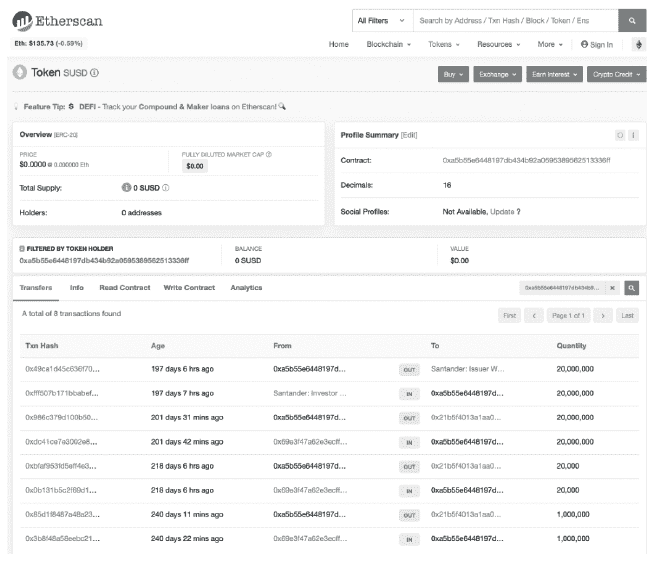

**图 6.2：截至 2022 年 3 月 30 日桑坦德 ERC-20 代币（SUSD）的以太坊记录**

来源：[`etherscan.io/token/0xa5b55e6448197db434b92a0595389562513336ff?a=0xa5b55e6448197db434b92a0595389562513336ff`](https://etherscan.io/token/0xa5b55e6448197db434b92a0595389562513336ff?a=0xa5b55e6448197db434b92a0595389562513336ff)*

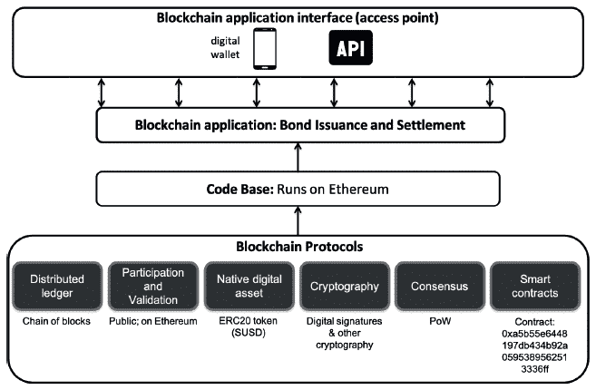

**图 6.3：桑坦德债券映射到区块链应用框架**

桑坦德银行在 2019 年的债券发行证明了债券可以在公共区块链上完全合规。泰国和中国其他银行也效仿了它的做法。2021 年 4 月，桑坦德银行与高盛、桑坦德银行 SA 和法国兴业银行 AG 共同担任欧盟在以太坊上发行的 1 亿欧元（1.21 亿美元）、两年期债券的联合经理人。^(27)

在反思桑坦德所有区块链举措时，数字投资银行董事约翰·惠兰表示，“我个人感觉我们别无选择。这项技术允许这样做。如果我们不做，别人会做。所以，我认为银行*意识到我们的竞争对手不仅仅是其他银行，还包括大型科技公司，无论是 Facebook、谷歌、阿里巴巴还是腾讯。在许多方面，金钱和价值不过是机器中的 ones 和 zeros，这是一个工程问题，而不是金融问题。”*^(28)

6.3 we.trade

*“区块链并不容易。你需要许多参与者以相同的速度前进，这不仅仅是关于技术。业务方面、销售和营销、法律、合规和运营都非常重要。关键目标之一是让所有参与者都在网络上以相同的速度行动。”*

**Ciaran McGowen，we.trade 前首席执行官^(29)**

we.trade 是一个贸易金融平台，于 2017 年开始开发，到 2018 年 7 月达到全面运营。we.trade 平台最初由一个欧洲银行联盟开发，然后成为一家位于都柏林的 CaixaBank、德意志银行、Erste Group、汇丰银行、KBC、Natixis、北欧银行、拉博银行、桑坦德银行、法国兴业银行、瑞银和 UniCredit 之间的合资企业（JV）。^(30) IBM 区块链服务是技术提供商；IBM 在 2020 年也成为股东。根据 Crunchbase 的数据，we.trade 从桑坦德银行、CRiF、汇丰银行、IBM 和 Rabo Frontier Ventures 那里筹集了 660 万美元的总资金。最大的一轮为 550 万欧元的是 2021 年 2 月的债务融资。^(31) （债务融资通过向投资者出售债务来筹集资金；其主要优点是 we.trade 没有放弃业务的控制权，如果追求股权融资就会发生这种情况。）到 2021 年第二季度，we.trade 已经处理了超过 1200 万欧元的 1500 笔交易，共有 400 家中小型企业和企业客户。^(32)截至 2022 年 3 月，该平台已在 17 家银行的交易伙伴之间使用。^(33)

在讨论贸易融资的痛点之前，我们先来了解一下贸易融资的过程。贸易融资是一种帮助减少买方和卖方之间贸易融资的对手方风险的过程，这种情况经常发生在国际贸易中。出口商/卖家需要减轻支付风险，并希望尽可能早地从进口商/买家那里获得付款。进口商/买家希望确保货物已经发出，并且通常希望延长他们的付款信用期。像银行这样的可信第三方介入，以减少出口商和进口商的财务风险。出口商的银行可能会根据合同向出口商提供贷款。如果出口商想要进一步减轻他们的风险，他们甚至可能会以折扣价出售他们的应收账款。进口商的银行可能会提供信用证，以确保在提供货物已经发出的证明（如提单）的情况下，出口商能够收到付款。开设公开账户和信贷额度通常需要七天（见图 6.4）。此外，许多银行在建立贸易融资服务方面存在困难，尤其是在扩大规模方面。根据 we.trade 的联合创始人兼第一任 COO 罗伯托·曼科内（Roberto Mancone）的说法，“由银行运营的传统贸易融资模型数十年来没有发生变化。银行和公司都受到了限制。银行无法扩大其平台规模，使其对所有客户可用。”^(34)*

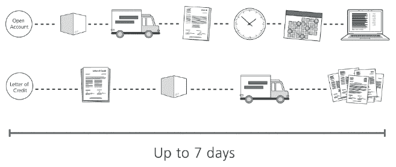

**图 6.4：we.trade 之前的贸易融资流程**

来源：we.trade 说明视频^(35)*

**we.trade 的发展**。we.trade 是由七家欧洲银行于 2017 年 3 月创立的，他们联合起来减少许多银行共有的痛点。最初，这七家银行成立了一个财团，每家银行投入约 20 万美元，这个数额低于不需要多层批准的资本投资水平。这些银行不仅仅想要做一个 POC——他们致力于在 12 个月内开发一个实时平台。为了推动事情进展，他们不需要一致性决策，而是根据决策的复杂性要求 51%或 67%的多数通过。为了防止反垄断违规，银行被禁止讨论市场进入策略。尽管财团专注于技术实施，但合作伙伴们也在并行开发一个法律实体。当所有财团的知识产权于 2018 年 2 月转让给这个合资企业时，这个合资企业应运而生。此时，银行已发展到 12 个成员，成为合资企业的股东，但每家银行仍然需要一个运营软件的许可证。银行也可以不成为投资者而授权使用该软件。罗伯托·曼科内成为了合资企业的 COO。他说，“我们在平台上线之前需要一个法律实体，一个有合适董事会、明确战略和标准治理规则的实体。”^(36)*

在仍是一个财团的情况下，we.trade 引入了 IBM，因为它希望建立一个不仅适用于最初参与的银行，而且适用于数百银行的平台。^(37)we.trade 建立在 IBM 区块链平台之上，使用 HyperLedger Fabric，这是一个受许可的区块链。每家银行运行一个节点。功能上，we.trade 帮助客户寻找可信赖的交易伙伴，请求融资，自动化并确保支付，并跟踪交易旅程的端到端。参与银行验证买家和卖家。

一个典型的流程如下进行：卖家 Alice 想向买家 Bob 出售商品。假设 Alice 和 Bob 的银行都有权使用 we.trade，他们可以使用该平台促进交易。Alice 通过她银行的门户登录 we.trade，为 Bob 创建一个贸易提案，指定条款和条件，如支付计划。Bob 收到通知以审查提案。如果 Bob 同意，Bob 的银行然后审查提案。如果 Bob 的银行同意，启动智能合约。整个过程可以在一个小时内完成（见图 6.5）。一旦 Bob 表示收到货物，Bob 的银行就会自动支付 Alice。

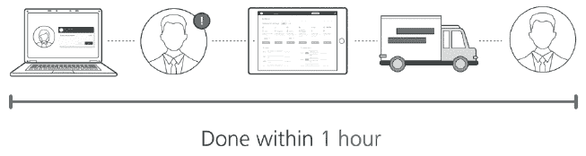

**图 6.5：we.trade 将贸易融资协议过程从几天缩短到几小时**

来源：we.trade 说明视频^(38)*

图 6.6 提供了 we.trade 金融产品的概述，即自动结算、银行支付保证（BPU）、BPU 融资和发票融资。到 2020 年，55%的交易是自动支付，27%的是银行支付保证（BPU），18%的是 BPU 融资。we.trade 增加了保险、物流和信用报告的附加产品。^(39)we.trade 还专注于绿色贸易金融。^(40)

根据 Mancone 的说法，实现 we.trade 最困难的挑战是让传统竞争对手同意商业规则和治理。合资企业使竞争对手能够分享风险和收益，并建立一套规则，仿佛它们是一家公司。到 2019 年，交易量每月增长 38%。^(41)Mancone 于 2019 年 4 月离开了 we.trade，部分原因是该平台并没有重新发明贸易融资；它主要自动化并改善了传统流程。他说，“我们正在构建解决方案，这些解决方案被解决方案的提供者视为有价值，而不是用户。”^(42)他认为 we.trade 是一个重要且勇敢的第一步，但最终得出结论，“我可以看到这项技术如何改变商业模式，但要做到这一点，你需要来自不同行业的利益相关者，而不是同一个行业的。这样最终的消费者（公司或企业）才能获得收益，而不是一群既得利益者。”*^(43)

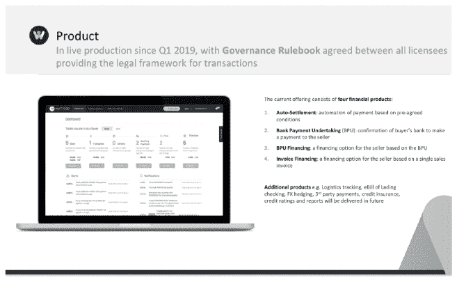

**图 6.6：we.trade 产品概述**

来源：经 we.trade 授权

we.trade 下一任 CEO Ciaran McGowan 表示，他正专注于提升客户价值：*“客户的反馈非常积极，他们认为这是一个创新且直观的解决方案。但还有改进空间：我们的客户希望能有更多。例如，在提高终端用户的效率方面，他们希望与他们的 ERP 系统集成，而不是重复输入。他们还非常希望物流服务能成为服务的一部分。我们收到的另一项反馈是公司配对搜索功能——他们希望有更多客户在平台上，以增加* *机会。因此，我们的首要任务是扩大 we.trade 网络并走向全球。”*^(44),^(45)

截至 2020 年 3 月，已有来自奥地利、比利时、捷克共和国、丹麦、芬兰、德国、希腊、爱尔兰、意大利、列支敦士登、卢森堡、荷兰、挪威、西班牙、瑞典、瑞士和英国的银行客户参与。^(46) 银行使用该平台的基础费用为 55,000 美元，主要用于覆盖应用程序的云托管成本。^(47)

客户主要是小型和中型 businesses (SMEs)，在全球范围内承受着延迟支付的主要压力。^(48) 尽管平台在外部投资者的采用速度较慢，但使用 we.trade 的银行客户报告了业务效益。例如，一位客户表示，端到端的贸易流程从 7 到 10 天减少到了只需几小时。^(49) 另一位客户——一家软饮料供应商——使用 we.trade 的自动结算，使海外供应商按时支付他们的发票。在 we.trade 之前，70%的发票都是延迟支付的。^(50)

在扩展网络规模方面，we.trade 面临的主要挑战是出口商和买家都需要与获得许可的采用者之一进行银行交易。^(51)这本质上是一个“四方角模型”，其中卖家、卖家的银行、买家和买家的银行都需要在平台上。在 McGowan 离职后，Mark Cudden—we.trade 的首席技术官—成为 we.trade 中级别最高的领导者。Cudden 解释了 we.trade 为了推动采用率所做的努力以及未来的战略。2021 年，该公司致力于降低运营成本。we.trade 还引入了增值服务，如 CRIF SkyMinder，该服务允许客户评估一家公司、潜在的交易对手和供应商；避免网络风险并获取市场上最佳的定价。^(52)为了吸引更多客户加入网络，we.trade 正在开发一个“三方角模型”，该模型要求卖家、卖家的银行和买家参与平台，但不一定需要买家的银行。它还在实施许多扩展策略。当被问及 we.trade 的竞争对手时，Cudden 表示：“we.trade 是唯一一个端到端数字化开放账户交易的平台。其他平台数字化流程的一部分，例如信用证。”*尽管做出了这些努力，we.trade 还是无法实现足够的快速扩展，正向清算靠拢。

6.4 KoreConX

KoreConX 是一个平台，为私人公司提供进入全球资本市场的机会。KoreConX 自 2016 年 12 月起进入实时生产，KoreConX 的区块链（KoreChain）于 2019 年 10 月推出。

让我们先来理解 KoreConX 旨在解决的问题。超过 8 万家上市公司可以轻松接触到全球投资者，他们可以用手机在几秒钟内发出交易。相比之下，4.5 亿家私营公司对投资者的接触非常有限。小型私营公司筹集资本时依赖本地经销商和经纪人。每一笔交易都是独特的，通常私营公司要花几周时间才能找到交易对手、谈判协议并获得董事会的批准。而且，自动化程度很低；大多数私营公司依赖本地电子表格。KoreConX 背后的想法是一个平台*“为中小企业（SME）提供一个管理所有公司记录、资金、投资者和投资经纪人的单一地点，以便他们能高效地利用新的资本筹集机会。”^(53)* KoreConX 的首席科学家和 CTO Kiran Garimella 将平台描述为*“欢迎所有受监管实体的信任基础设施”*。^(54)* 除了运营平台外，KoreConX 还是一个过户代理，也基于平台运营，但包括经纪商、证券律师、二级市场运营商和其他服务提供商在内的 600 多家 KorePartners 提供了平台上的大部分业务运营。例如，提供商确保了解您的客户（KYC），例如证明合格投资者的净资产和收入水平的认证，以及为非合格投资者提供身份验证。

平台为数字化证券（包括股票、期权、认股权、债券、认股协议、可转换债券、本票、贷款或抵押权）提供了一种简便的方法。KoreConX 还数字化知识产权，因为知识产权是公司估值的一部分。然而，发行数字资产是一次性的事件，且只代表了交易活动的很小一部分。该平台为持续交易和公司行为（如股东大会、优先购买权、行使拒绝权、随行权、拖行权、股息分配、退出以及并购）提供服务。该平台的特色功能包括投资组合管理、CapTable 管理、登记簿、交易室、投资者关系、过户代理、资本市场、二级市场和合规（见图 6.7）。

基础服务对所有人免费使用。Kore Plus+功能每月收费 150 美元，包括电话支持、投资者关系仪表板和股东报告等服务。对于 KoreConX 来说，它主要通过其专业的过户代理服务（价格不一）赚取收入。众多私营发行人已经选择了 KoreConX 平台。例子包括 BrewDog、LegionM、GoldenSeed、TastyEquity、Quadrant、Atomic Video 和 S2A Modular。

KoreConX 的 KoreChain 是基于 Hyperledger Fabric 构建的，这是一个私有的权限型区块链（关于 Fabric 的更多信息，请参见第四章）。KoreConX 选择区块链，因为它是一个安全的多方交易处理解决方案，具有防篡改和始终可用的特点。它选择了一个***私有的***区块链解决方案，因为金融交易需要保密，对谁有权访问数据有严格的规定。此外，大多数国家要求投资数据存储在本国司法管辖区内，这只能通过私有的区块链来保证。KoreConX 选择 Fabric，因为它是截至 2018 年评估时最成熟的代码库。到 2020 年第一季度，KoreConX 的区块链（KoreChain）在 23 个国家部署，部署在五个不同的云平台（IBM、AWS、Azure、Google、Digital Ocean）上，具备每年处理 100 亿笔交易的能力（大约每秒 318 笔交易）。

该平台已被证明具有弹性。Garimella 说，“区块链本身具有弹性，因为它们是分布式的。当由于某种原因节点不可用，然后重新连接到网络时，节点会自动与网络中的其他节点同步。只要能够形成共识的最少节点数量可用，节点失败就不会影响网络。在我们的测试中，当我们下线我们全球网络的主要部分并重新连接它们时，它们会自动‘愈合’。整个过程完全是自动的。”

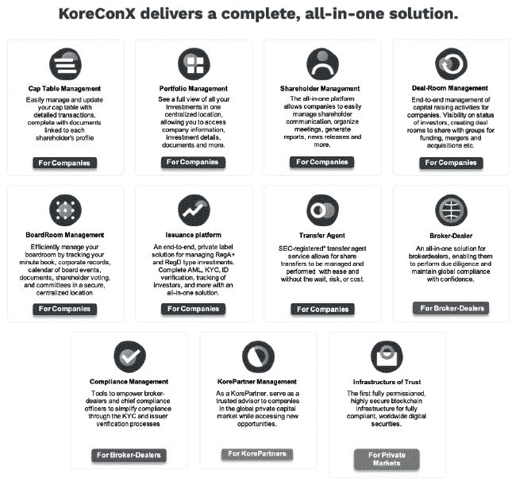

**图 6.7：KoreConX 的服务**

来源：[`www.koreconx.com`](https://www.koreconx.com)

KoreConX 平台上拥有 75,000 家私营公司，12 亿股股份，3200 万股期权和 120 万股认股权。作为 CTO，Garimella 对技术充满热情，但他表示投资者和高层并不关心区块链。Kiran Garimella 说，“解决问题的不仅仅是区块链，解决问题的在于建立在区块链之上的应用。”

KoreChain 旨在为生态系统中的所有参与者提供价值。对于私营公司的 C 层高管，KoreConX 提供保证合规、更好的发行（多司法管辖区）和流动性。对于私募股权投资者的 C 层高管，它提供接触全球市场机会、安全和尽职调查的机会。对于证券经纪人，它改善了交易流程、合规性和 syndication。对于证券律师，它关乎高效的合规性、更多的客户和业务、管理法规和合同风险。对于提供商（转让代理人、KYC/AML、保管人），主要优势是可扩展性。

KoreConX 首席执行官 Oscar A. Jofre 表示：“在与公司（发行人）、投资者、证券交易商、董事会成员及其他利益相关者的日常对话中，我们发现了许多效率流程的价值例子。与孤立系统不同，当在这个平台上对一方进行交易效率化时，好处很快就会传播到并惠及所有参与交易的各方。流程效率和成本降低是最明显的好处，但价值远不止于此，还包括了用户体验的改善和更强大、持续的长期关系和信任。”表 6.2 突出了交易速度的提升。

| **流程** | **旧方式** | **KoreConX 方式** |
| --- | --- | --- |
| 发行人尽职调查 | 60-120 天 | 30 天或更少 |
| 验证 | 几天至几周 | 秒 |
| KYC | 几天至几周 | 分钟 |
| 资本筹集轮次关闭 | 几周、几个月 | 分钟 |
| 股东入职 | 几个月 | 几秒至几分钟 |

**表 6.2：KoreConX 交易速度提升**

*来源：KoreConX*

6.5. 结论

Santander、we.trade 和 KoreConX 代表了非区块链原生组织，它们正在探索区块链应用以解决当今金融系统中的问题。它们是企业使用的生产系统的关键例子。Santander 在公共区块链上的债券发行尤为前瞻。公共区块链具有开放网络和低 IT 基础设施投资的优点。HfS 研究在 2022 年的一项针对 1200 个企业用例的研究中发现，企业越来越频繁地转向公共区块链，特别是由于零知识证明（在第十章中讨论）的出现，它允许在公共网络上进行私人交易。^(55) 在下一章中，我们将探讨区块链在供应链中的应用。

引用

^(1) John Whelan，数字投资银行 Managing Director，Santander，在阿肯色州大学区块链卓越中心所做的演讲，2019 年 12 月 3 日。

^(2) [`en.wikipedia.org/wiki/Santander_Bank`](https://en.wikipedia.org/wiki/Santander_Bank)

^(3) Santander 网站 [`www.santanderbank.com/us/about/about-us/leadership`](https://www.santanderbank.com/us/about/about-us/leadership)

^(4) John Whelan，数字投资银行 Managing Director，Santander，在阿肯色州大学区块链卓越中心所做的演讲，2019 年 12 月 3 日。

^(5) John Whelan，数字投资银行 Managing Director，Santander，在阿肯色州大学区块链卓越中心所做的演讲，2019 年 12 月 3 日。

^(6) [`santanderinnoventures.com/portfolio-companies/`](https://santanderinnoventures.com/portfolio-companies/)

奥黑尔，S.（2020 年 9 月 11 日）。桑坦德银行将其 4 亿美元的金融科技风险投资部门独立出来，现名为 Mouro Capital。[`techcrunch.com/2020/09/11/mouro-capital/`](https://techcrunch.com/2020/09/11/mouro-capital/)

德尔文 thal，S.（2018 年 4 月 13 日）。桑坦德银行推出区块链支付服务，Investopedia。[`www.investopedia.com/news/santander-launches-blockchain-payments-service/`](https://www.investopedia.com/news/santander-launches-blockchain-payments-service/)

【https://we-trade.com/banking-partners](https://we-trade.com/banking-partners)

企业以太坊联盟新闻稿（2018 年 5 月 2 日）。企业以太坊联盟通过公开发布企业以太坊架构栈推进 Web 3.0 时代。[`entethalliance.org/enterprise-ethereum-alliance-advances-web-3-0-era-public-release-enterprise-ethereum-architecture-stack/`](https://entethalliance.org/enterprise-ethereum-alliance-advances-web-3-0-era-public-release-enterprise-ethereum-architecture-stack/)

[超级账本阿瓦隆](https://www.hyperledger.org/blog/2019/10/03/introducing-hyperledger-avalon)（2019 年 10 月 3 日发布）。介绍超级账本阿瓦隆，[`www.hyperledger.org/blog/2019/10/03/introducing-hyperledger-avalon`](https://www.hyperledger.org/blog/2019/10/03/introducing-hyperledger-avalon)

[`wiki.hyperledger.org/display/avalon#`](https://wiki.hyperledger.org/display/avalon#)

账本见解（2019 年 12 月 23 日）。桑坦德银行、BBVA 在西班牙进行区块链智能支付试点。[`www.ledgerinsights.com/enterprise-blockchain-news-roundup-23dec/`](https://www.ledgerinsights.com/enterprise-blockchain-news-roundup-23dec/)

胡耶特，M.（2019 年 6 月 3 日）。主要公用事业结算币项目筹集 6300 万美元用于商业化实现，CoinTelegraph。[`cointelegraph.com/news/major-utility-settlement-coin-project-raises-63-mln-for-commercial-realization`](https://cointelegraph.com/news/major-utility-settlement-coin-project-raises-63-mln-for-commercial-realization)

艾莉森，I.（2019 年 6 月 13 日）。14 家银行，5 种代币：深入了解 Fnality 对银行间区块链的广泛愿景，Coindesk。[`www.coindesk.com/fnality-utility-settlement-coin-central-bank-token-blockchain`](https://www.coindesk.com/fnality-utility-settlement-coin-central-bank-token-blockchain)

胡耶特，M.（2019 年 6 月 3 日）。主要公用事业结算币项目筹集 6300 万美元用于商业化实现，CoinTelegraph。[`cointelegraph.com/news/major-utility-settlement-coin-project-raises-63-mln-for-commercial-realization`](https://cointelegraph.com/news/major-utility-settlement-coin-project-raises-63-mln-for-commercial-realization)

^(17) Allison, I. (2019 年 6 月 13 日). 14 家银行，5 种代币：深入了解 Fnality 的银行间区块链愿景，Coindesk, [`www.coindesk.com/fnality-utility-settlement-coin-central-bank-token-blockchain`](https://www.coindesk.com/fnality-utility-settlement-coin-central-bank-token-blockchain)

^(18) Molchan, Y/(2020 年 9 月 9 日). 由全球 13 家顶级银行支持的“实用结算币”今年不太可能推出，原因如下。 [`u.today/utility-settlement-coin-backed-by-top-13-banks-unlikely-to-launch-this-year-heres-why`](https://u.today/utility-settlement-coin-backed-by-top-13-banks-unlikely-to-launch-this-year-heres-why)

孙，Z. （2022 年 3 月 21 日）。Euroclear 投资 Fnality 以推进数字账本技术策略。2022 年 4 月 4 日取自 [`cointelegraph.com/news/euroclear-invests-in-fnality-to-advance-digital-ledger-technology-strategy`](https://cointelegraph.com/news/euroclear-invests-in-fnality-to-advance-digital-ledger-technology-strategy)

Palmer, D. （2019 年 12 月 10 日）。桑坦德银行高管称区块链取得成功，因为银行赎回了以太坊发行的债券，Coindesk, [`www.coindesk.com/santander-exec-claims-blockchain-success-as-bank-redeems-ethereum-issued-bond`](https://www.coindesk.com/santander-exec-claims

^(20) John Whelan 在阿肯色州大学区块链卓越中心的演讲，数字投资银行 Managing Director, Santander，2019 年 12 月 3 日。

Palmer, D. （2019 年 12 月 10 日）。桑坦德银行高管称区块链取得成功，因为银行赎回了以太坊发行的债券，Coindesk, [`www.coindesk.com/santander-exec-claims-blockchain-success-as-bank-redeems-ethereum-issued-bond`](https://www.coindesk.com/santander-exec-claims-blockchain-success-as-bank-redeems-ethereum-issued-bond)（21#note_21）。

[桑坦德银行发布首笔端到端区块链债券](https://www.santander.com/en/press-room/press-releases/santander-launches-the-first-end-to-end-blockchain-bond%C2%A0)（2019 年 9 月 12 日）。（22#note_22）

^(23) Huillet, M. （2019 年 9 月 12 日）。[`cointelegraph.com/news/santander-issues-20-million-end-to-end-blockchain-bond-on-ethereum`](https://cointelegraph.com/news/santander-issues-20-million-end-to-end-blockchain-bond-on-ethereum), CoinTelegraph, [`cointelegraph.com/news/santander-issues-20-million-end-to-end-blockchain-bond-on-ethereum`](https://cointelegraph.com/news/santander-issues-20-million-end-to-end-blockchain-bond-on-ethereum)

[在以太坊上可查看智能合约](https://etherscan.io/address/0xa5b55e6448197db434b92a0595389562513336ff)（24#note_24）。

^(25) John Whelan（数字投资银行经理，桑坦德银行）在阿肯色州大学区块链卓越中心的演讲，2019 年 12 月 3 日。

^(26) 与数字债券相关的以太坊交易可见：[链接](https://etherscan.io/token/0xa5b55e6448197db434b92a0595389562513336ff?a=0xa5b55e6448197db434b92a0595389562513336ff)。

Santander 发行人墙纸：[链接](https://etherscan.io/address/0x12959b84d507df134ec59c1fc4044b03f33a9947#tokentxns)。

Santander 投资钱包：[链接](https://etherscan.io/address/0xe08193b5afcfea60fceb22f065e88e76718c6ee3)。

ERC20 代币（SUSD）：[链接](https://etherscan.io/token/0xa5b55e6448197db434b92a0595389562513336ff?a=0xa5b55e6448197db434b92a0595389562513336ff)。

^(27) Akhtar, T. (2021 年 4 月 28 日)。欧洲投资银行利用以太坊发行 1.21 亿美元数字票据，取自 2022 年 4 月 4 日：[链接](https://www.coindesk.com/markets/2021/04/28/european-investment-bank-issues-121m-digital-notes-using-ethereum/)。

^(28) John Whelan（数字投资银行经理，桑坦德银行）在阿肯色州大学区块链卓越中心的演讲，2019 年 12 月 3 日。

^(29) 与 Mary Lacity 的电子邮件交流。

^(30) IBM。用 IBM 区块链帮助公司无缝交易。

^(31) we.trade 的财务信息。[链接](https://www.crunchbase.com/organization/we-trade/company_financials)。

^(32) [链接](https://we-trade.com/commercialisation)。

^(33) [链接](https://we-trade.com/banks)。

^(34) IBM。用 IBM 区块链帮助公司无缝交易。[链接](https://www.ibm.com/blockchain/use-cases/success-stories/#section-7)。

^(35) we.trade 上的视频：[链接](https://vimeo.com/430330202)。

^(36) 与 Mary Lacity 的访谈。

^(37) IBM 区块链视频。珍贵的前瞻性：Roberto Mancone，查看源代码：[链接](https://www.ibm.com/blockchain/use-cases/success-stories/#section-7)。

^(38) We.trade 上的视频：[链接](https://vimeo.com/430330202)。

^(39) 区块链爱尔兰周（2021 年 5 月 26 日）。we.trade 虚拟圆桌讨论，视频可在[链接](https://we-trade.com/resources/videos)查看。

^(40) we.trade 新闻稿（2021 年 11 月 25 日）。we.trade 与 EBRD 合作伙伴 QNB ALAHLI，Banca Comercială Română和 UniCredit 加速数字绿色贸易金融的可能性。[`we-trade.com/resources/we-trade-accelerates-digital-green-trade-finance-possibilities-with-ebrd-partners`](https://we-trade.com/resources/we-trade-accelerates-digital-green-trade-finance-possibilities-with-ebrd-partners)

^(41) we.trade 新闻稿（2020 年 8 月 8 日）。we.trade 在 2019 年的交易每月增长 38%。[`cms.we-trade.com/app/uploads/we.trade_press_release_38percentgrowth_2019.08.08.pdf`](https://cms.we-trade.com/app/uploads/we.trade_press_release_38percentgrowth_2019.08.08.pdf)

^(42) PYMNTS 引述（2019 年 4 月 30 日）。B2B PAYMENTSwe.trade 联合创始人辞职，透露对区块链的疑虑。[`www.pymnts.com/news/b2b-payments/2019/wetrade-cofounder-quits-blockchain-doubt/`](https://www.pymnts.com/news/b2b-payments/2019/wetrade-cofounder-quits-blockchain-doubt/)

^(43) PYMNTS 引述（2019 年 4 月 30 日）。B2B PAYMENTSwe.trade 联合创始人辞职，透露对区块链的疑虑。[`www.pymnts.com/news/b2b-payments/2019/wetrade-cofounder-quits-blockchain-doubt/`](https://www.pymnts.com/news/b2b-payments/2019/wetrade-cofounder-quits-blockchain-doubt/)

^(44) 万茨，M.（2019 年 12 月 17 日）。五家西班牙银行将测试与私有区块链支付，*Criptonoticias*，[`www.criptonoticias.com/negocios/servicios-financieros/cinco-bancos-espanoles-probaran-pagos-blockchain-privada/`](https://www.criptonoticias.com/negocios/servicios-financieros/cinco-bancos-espanoles-probaran-pagos-blockchain-privada/)

^(45) Was，S.（2019 年 9 月）。独家采访：新 we.trade 经理谈论扩张计划、TradeL

^(46) we.trade 网站。国家下拉菜单，[`we-trade.com/request-access`](https://we-trade.com/request-access)

^(47) 莫里斯，N.（2020 年）。自动化贸易支付证明在 we.trade 区块链上很受欢迎。Ledger Insights，[`www.ledgerinsights.com/wetrade-blockchain-trade-finance-automated-payments/`](https://www.ledgerinsights.com/wetrade-blockchain-trade-finance-automated-payments/)

^(48) 莫里斯，N.（2020 年）。自动化贸易支付证明在 we.trade 区块链上很受欢迎。Ledger Insights，[`www.ledgerinsights.com/wetrade-blockchain-trade-finance-automated-payments/`](https://www.ledgerinsights.com/wetrade-blockchain-trade-finance-automated-payments/)

（49）区块链爱尔兰周（Blockchain Ireland Week，2021 年 5 月 26 日）。we.trade 虚拟圆桌讨论，视频可在[`we-trade.com/resources/videos`](https://we-trade.com/resources/videos)找到

（50）we.trade 客户案例研究。需要注册以获取访问权限：[`we-trade.com/resources/case-studies`](https://we-trade.com/resources/case-studies)

（51）莫里斯（Morris），N.（2018）。贸易金融区块链竞赛即将开始。取自[`www.ledgerinsights.com/wetrade-trade-finance-blockchain-race/`](https://www.ledgerinsights.com/wetrade-trade-finance-blockchain-race/)

（52）[`we-trade.com/services/skyminder`](https://we-trade.com/services/skyminder)

（53）[`www.koreconx.com/about/`](https://www.koreconx.com/about/)

（54）基兰·加里梅拉（Kiran Garimella）首席科学家兼 CTO 的演讲，Blockchain Center of Excellence，阿肯色大学，2019 年 12 月 3 日。

（55）萨乌巴赫·古普塔（Saurabh Gupta）的演讲，《企业区块链在驱动新价值来源中的作用》。2022 年 5 月 24 日向卓越区块链中心展示。

* * *

（i）账本洞察（Ledger Insights，2022 年 6 月 6 日）。汇丰银行、 SocGen、IBM 支持的区块链公司 we.trade 开始破产程序。2022 年 6 月 6 日取自[`www.ledgerinsights.com/hsbc-socgen-ibm-backed-blockchain-company-we-trade-starts-insolvency-procedure/`](https://www.ledgerinsights.com/hsbc-socgen-ibm-backed-blockchain-company-we-trade-starts-insolvency-procedure/)

## 第七章

## 供应链的业务应用

**内容简介：**本章将探讨区块链赋能的应用程序，帮助供应链合作伙伴（有时甚至是最终消费者）在整个从源头到最终目的地的过程中，验证实体资产的真实性和来源。具体探讨的解决方案包括 IBM Food Trust 用于追踪从农场到餐桌的食物和从诱饵到餐盘的追踪；BeefChain 用于追踪牛肉和其他肉类；VeChain、Everledger 和 EY OpsChain Traceability 提供的供应链平台，用于追踪食品、钻石、优质葡萄酒、优质啤酒、奢侈品和其他高价值商品；以及 DL Freight 用于处理货运发票和支付。最后，我们将研究 VeriTX，它为供应链创造了全新的模式，例如利用 3D 打印、AI 和区块链从集中式向分散式零部件制造转变。这些解决方案的好处包括更高效的供应链、道德采购的展示、更少的假冒产品、更少的丢失产品、交易伙伴间更少的争议、更少的浪费和更好的任务准备率。

学习目标：

- 描述全球供应链的痛点以及区块链如何解决这些问题。

- 识别区块链赋能的供应链平台上的资产表示方式。

- 辩论私有、公有和混合型区块链供应链平台的优缺点。

7.1 全球供应链概览

在过去的两章中，我们探讨了区块链技术在金融服务领域的应用。全球金融市场本质上是***数字***的。在全球范围内移动资金是关于改变***数字***账本中的条目。考虑到金融资产本质上是数字的，我们不必担心本章我们将要担心的问题。全球供应链本质上是关于在全球范围内移动***物理***商品，并试图跟踪商品的位置、保管权（即目前负责商品的组织）、状态和真实性。日益增加的是，全球供应链还预计要捕捉数据，以确保商品是按照公平劳动实践和环境可持续实践生产的。

考虑一下应该伴随实体商品移动而产生的数据量。当制造商、出口商、快递公司、货运代理人、海关、检查员、出口商、货运商和进口商正在移动实体商品时，他们还创造了与这些移动相关的数据，包括提单、证书、委托书、海关表格、检查数据、保险单、发票、信贷额度、采购订单、运输清单和收货文件（见图 7.1）。图 7.1 只展示了商品跨海洋的移动，但还有复杂的国内供应链与出口/进口相连接。出口国拥有从原材料供应商、农场、牧场、渔业、制造商、仓库、分销商和运输商到出口港口的供应链；进口国则有从进口港口到分销商、仓库、运输商、批发商和零售店的供应链。还需要包括“最后一英里”的运输，比如家庭送货服务。由于这么多参与者产生了这么多数据，资产丢失或被盗，由于缺少文件，货物集装箱在港口被延误，交易伙伴之间记录不一致引发争端，假冒产品渗入供应链，这些都是挑战的例子。

**图 7.1：全球供应链**

在制造商、出口商、快递公司、货运代理人、海关、检查员、出口商、货运商和进口商通过全球供应链移动实体商品的同时，他们还创造了与这些移动相关的数据，包括提单、证书、委托书、海关表格、检查数据、保险单、发票、信贷额度、采购订单、运输清单和收货文件。

让我们更仔细地看看全球食品供应链中的具体挑战。食品供应链由于其规模和易腐性而特别难以协调。全球食品和杂货零售市场是一个价值 12 万亿美元的市场。^(1) 尽管世界上大部分的食品供应是安全的，但仍有很大的改进空间。世界卫生组织报告称，每年有 6 亿人口因食用受污染的食品而食物中毒，有 42 万人死亡。^(2) 除了食品污染，全球食品供应还遭受大量的食品浪费、食品标签错误和食品欺诈，例如将马肉标为羊肉，将非有机蔬菜标为有机蔬菜。^(3) 有关人权和环境问题，例如奴隶劳动和未经授权使用农药，仍然是非常严重的担忧。例如，国际劳工组织估计，有 350 万人被迫在农业、渔业和林业工作。^(4) 每个国家都有自己的食品安全挑战，但接下来我们将重点关注美国，因为它是最大的食品生产国。

美国的食品产业是一个价值 6 万亿美元的行业。^(5) 美国疾病控制与预防中心（CDC）估计，有 4800 万美国人因食物而生病；12.8 万名美国人因此住院；每年有 3000 人死于食物传播的疾病。^(6) 美国食品药品监督管理局（FDA）在 2022 年 1 月 1 日至 3 月 22 日期间共有 69 起有效的食品召回，主要因为污染的蔬菜、乳制品和肉类产品。^(7) 其他召回事件是由于标签错误，部分是因为绕过进口检查，部分是因为误导性标签，还有一些是因为未声明的过敏原。^(8) 食品浪费也是一个大问题；美国每年浪费 1620 亿美元的食品，主要原因是无法估算需求和追踪供应。^(9)

一些供应链问题是因为供应链中的每个组织都在自己的集中系统中创建和存储自己的数据。他们将与供应链中的下一个合作伙伴共享数据。这被称为“进一步，退一步”的可见性。例如，当零售商必须响应食品召回时，它可能需要数天甚至数周的时间来追踪其货架上的产品追溯到种植它们的农民。基于区块链的供应链解决了众多数据挑战。

7.2. 案例概述

在第二章中，我们介绍了三种已经投入使用的供应链解决方案：IBM Food Trust 是一个跟踪食品位置和条件的解决方案；TradeLens 跟踪货运集装箱；MediLedger 追踪和验证某些药品类别。详细的案例研究已经发布给了 TradeLens 和 MediLedger（见末尾注脚）。^(10) 在本章中，我们将更深入地研究 IBM Food Trust，并探索其他用于食品、奢侈品、货物和零部件的区块链解决方案（见表 7.1）。

一些在本章中提到的供应链案例，在我们开始开发时，像以太坊这样的公共区块链才刚刚满一年——比如 IBM Food Trust 和 Everledger——所以公共区块链并不是一个可行的选项。这些第一个区块链解决方案部署在私人授权网络上。此外，生态系统合作伙伴选择私人授权区块链，因为他们担心如果采用公共区块链解决方案，竞争对手可能会了解到他们运营的有价值信息。DL Freight 选择了一个私人授权区块链，以确保交易是保密的，并且只与授权方共享。

一些基于区块链的供应链解决方案是混合型的，有一个私人授权区块链来处理交易伙伴之间的交易，有一个公共区块链来允许消费者通过扫描二维码来验证产品。例子包括沃尔玛中国使用的 VeChain 和安永的 WineChain，后者已经演变为 OpsChain 可追溯性服务。

本章中的三个解决方案，即 VeChain、BeefChain 和 VeriTX，使用公共区块链。VeChain 是一个像 Ripple 和 Stellar 这样的公共授权区块链；这意味着任何人都可以阅读账本，但只有授权节点才能验证交易。BeefChain 使用比特币、以太坊和 Cardano。VeriTX 使用 Algorand。Cardano 和 Algorand 是使用权益证明共识的公共非授权区块链。

在每一个案例中，注意解决方案是如何使用快速响应（QR）码、机器视觉、射频识别（RFID）标签、近场通信（NFC）芯片和物联网（IoT）设备等技术将物理世界和数字世界联系起来的。

| **企业（们）** | **区块链应用** | **最初开发者（们）** | **状态** |
| --- | --- | --- | --- |
| IBM Food Trust | 从农场到餐桌，从鱼饵到餐盘的食物追踪 | 沃尔玛和 IBM | 到 2022 年，IBM Food Trust 与 520 家合作伙伴处理了 2700 万笔交易 |
| VeChain | 供应链可追溯性、真实性、状态跟踪 | VeChain 于 2015 年由路易威登中国前首席信息官创立 | VeChain Thor 的主网于 2018 年上线；现在被沃尔玛中国、拜耳中国、宝马中国、LVMH Moët Hennessy Louis Vuitton 等公司使用 |
| BeefChain | 肉类品质和追溯性。 | 成立于 2018 年怀俄明州。 | 牛只被标记，数据在比特币、以太坊和 Cardano 上被捕获。BeefChain 及其合作伙伴，尤其是与 IOHK 的合作，继续探索用例和新的商业模式。 |
| Everledger | 钻石、稀有商品和奢侈品追踪。 | Everledger 和 IBM。 | Everledger 自 2017 年起追踪钻石，现在正在提供艺术品、电池、关键矿产、时尚、宝石、保险、奢侈品和葡萄酒及烈酒的解决方案。 |
| OpsChain Traceability | 验证和追踪消费品。 | EY | 在 100 个葡萄酒庄中追踪了 1500 万瓶葡萄酒；该解决方案还用于啤酒和农产品。 |
| DL Freight | 货运发票和支付。 | 沃尔玛加拿大和 DLT Labs。 | 2020 年启动；截至 2021 年夏季，DL Freight 已处理了 340,000 份发票，价值 4.5 亿美元。争议从 70%降低到不到 2%的发票。 |
| VeriTX | 3D 打印和传统制造零件的交易平台。 | Moog | 与合作伙伴积极合作，将平台推向市场，预计 2022 年上市。 |

**表 7.1：供应链中的区块链应用示例**

7.3 IBM Food Trust

IBM Food Trust 旨在为客户提高供应链效率、品牌信任、食品安全、可持续性、食品新鲜度以及减少食品欺诈和浪费。^(11)我们在第二章中从高层次上介绍了 IBM Food Trust，现在我们更深入地看看这个解决方案。IBM 和沃尔玛，世界上最大的零售商，年收入达 5730 亿美元，从 2016 年开始进行芒果和猪肉的食品追溯性试点项目。该解决方案基于 HyperLedger Fabric，将芒果的追溯性从 7 天缩短到 3 秒以下。^(12)2017 年，其他供应链合作伙伴加入了网络，包括 Dole、McCormack、McLane、Driscoll’s、Unilever、Golden State Foods、Nestle 和 Kroger。到 2022 年，已有 520 个成员加入。

要使用该平台，首先必须使用唯一的产品标识符注册产品，这通常是一个 GS1 标识符，如 GS1 全球贸易项目编号（GTIN）。GTIN 编号出现在许多产品的标签上，作为可机器读取的条形码。GTIN 包括公司前缀和项目参考代码。例如，GTIN 编号 038900006198 对应于*“Dole Crushed Pineapple in Its Own Juice, 8 oz”*（参见图 7.2）。^(13)您可以在[`gepir.gs1.org/index.php/search-by-gtin`](https://gepir.gs1.org/index.php/search-by-gtin)查找 GTIN 编号。

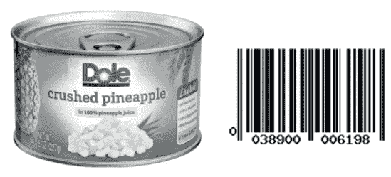

**图 7.2：Dole Crushed Pineapple in Its Own Juice, 8 盎司的 GS1 GTIN 编号**

*来源：[`www.upcitemdb.com/upc/38900006198`](https://www.upcitemdb.com/upc/38900006198)*

如果一个产品没有注册的 GS1 标识符，公司可以创建一个唯一的 IBM 食品信任标识符——IBM 已经创建了 17 种不同类型（见图 7.3）。

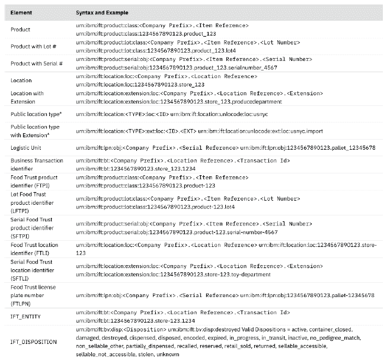

**图 7.3：IBM 食品信任标识符**

来源：[`www.ibm.com/docs/en/food-trust?topic=reference-food-trust-identifiers`](https://www.ibm.com/docs/en/food-trust?topic=reference-food-trust-identifiers)

GS1 或 IBM 食品信任标识符以条形码、二维码、RFID 标签或其他机器可读标签的形式成为产品标签的一部分。一旦物品在平台上注册，IBM 提供三项服务：追踪、文档和新鲜洞察。**追踪**帮助参与者通过跟踪位置和状态，沿着供应链追踪食品产品。追踪还可以用来跟踪原料是如何从原材料转化为成品的过程（见图 7.4）。**文档**监控当前、到期和过期的真实性、质量和其他文档证书。**洞察**通过跟踪事件，如收获后的时间和供应链中每个位置的停留时间，监控风险库存（见图 7.5）。IBM 有一个基于企业规模的分层定价模型，从每月 100 美元起。

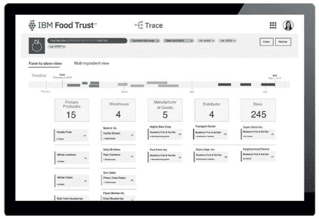

**图 7.4：IBM 食品信任追踪解决方案截图**

来源：[`1.cms.s81c.com/sites/default/files/2021-03-02/band_2cropped.jpg`](https://1.cms.s81c.com/sites/default/files/2021-03-02/band_2cropped.jpg)

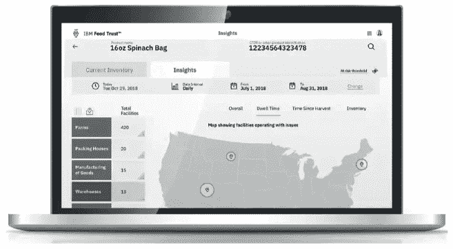

**图 7.5：IBM 食品信任洞察解决方案截图**

来源：[`1.cms.s81c.com/sites/default/files/2021-03-10/Customize_IBM_Food_Trust_insights.jpg`](https://1.cms.s81c.com/sites/default/files/2021-03-10/Customize_IBM_Food_Trust_insights.jpg)

IBM 在其云中运行该平台，但它无法解释任何数据。IBM 食品信任平台依赖于“信任锚点”进行验证，使用实用拜占庭容错（PBFT）共识机制（见第三章）。信任锚点收到加密账本的一个完整副本，但只有在数据所有者授予访问权限时才能查看交易散列。信任锚点负责以下事项：^(14)

• **“资源所有权**：在防篡改的 Z 安全服务容器中运行账户，确保数据在传输中和静止时都进行加密.*

• **验证**：提供事件是由个人提交的验证，以及相应的散列值.*

• **背书**：信任锚点可以作为背书者添加到传入交易中，为提交公司提供了一个额外的信任级别，例如私人标签品牌.*

• **数据提取**：在调查事件中，IBM 食品信托的一名成员可以使用他们的解密密钥并请求信任锚点从共享账本中提取相关数据，并对其真实性背书。”^(15)*

随着网络的增长，将有更多参与者运行信任节点，可能会在其他云环境中运行。^(16)截至 2021 年第三季度，该平台已处理超过 2700 万笔交易。IBM 食品信托继续扩大其网络和服务，特别是在冷链和消费者应用方面。

我们注意到，在美国，沃尔玛是 IBM 食品信托的锚定原则，但它为其中国业务选择了不同的合作伙伴。2019 年，沃尔玛中国推出了沃尔玛中国区块链追溯平台，在 PwC 和 VeChain 的帮助下。到年底，它计划有超过 100 种产品，涵盖肉类、大米和新鲜农产品等 10 个类别进行追溯。2020 年，沃尔玛中国将在平台上增加中国山姆会员店。^(17)让我们了解更多关于 VeChain 的信息。

7.4 VeChain

VeChain，总部位于新加坡，由前路易威登中国首席信息官孙世宁于 2017 年创立。最初在以太坊上推出，但到 2018 年其独立主网 VeChainThor 上线。^(18)VeChainThor 是其公共区块链，受以太坊“启发”，但它使用中心化治理，使更新更加容易。它采用了一种名为 Proof-of-Authority 的共识机制，其中 101 个权威主节点运营商由 VeChain 基金会知晓并验证。节点运营商包括学术机构、企业用户以及商业和技术合作伙伴。^(19)

VeChain 的产品标识称为 VeChainID。对于高价值产品，客户使用嵌入在智能标签（NFC/RFID/QR 码）中的标识符来注册 VeChainID。供应链沿线的物联网设备上传有关产品移动/保管的交易信息到 VeChain。图 7.6 显示了一个示例流程。最终消费者可以使用 VeChain Pro 移动应用程序或通过使用 API 的客户端界面来检查和验证产品的信息。^(20)

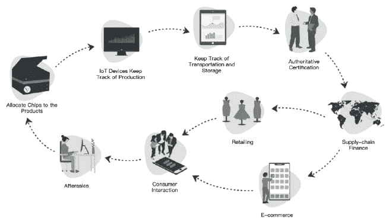

**图 7.6：VeChain 上的追溯**

来源：[`www.vechain.com/product/toolchain`](https://www.vechain.com/product/toolchain)*

VeChain 使用两种原生代币数字资产，VET 和 VTHO。VET 作为业务活动的价值转移媒介，而 VTHO 用于支付交易处理费用。后者与以太坊收取交易费用的“燃气费”类似。在 VeChain 中，交易燃气费（VTHO）的 30% 奖励给权威节点运营商，70% 被销毁。该设计旨在防止交易费（VTHO）直接受到 VET 价格波动的影响。根据 VeChain 白皮书，*“VTHO 通过持有 VET 自动产生。换句话说，持有 VET 的人将获得 VTHO，只要执行的操作消耗的 VTHO 少于产生的 VTHO，就可以免费使用 VeChainThor 区块链。VTHO 可以转让和交易，使用户能够为了执行更大规模操作（如运行一个区块链应用）而获得额外的 VTHO。”^(21)* 可以在 [`explore.vechain.org/`](https://explore.vechain.org/) 上探索 VeChain。 图 7.7 显示了创建于 2022 年 3 月 22 日的区块 #11,744,722。

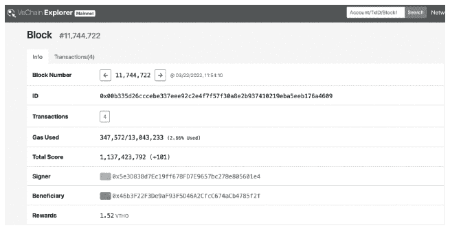

**图 7.7：VeChain 记账屏幕截图**

来源：[`explore.vechain.org/blocks/`](https://explore.vechain.org/blocks/)

沃尔玛中国的解决方案在 VeChain 上追踪一些产品，这样消费者可以在网站上了解产品，包括来源、路线和从农场到零售店的检查。^(22) 除了沃尔玛中国，VeChain 的客户还包括奢侈品零售商、汽车制造商和能源公司，包括 H&M; LVMH (LVMH Moët Hennessy Louis Vuitton); 宝马、拜耳中国；ENN、比亚迪汽车；人保财险；ENN；和上海燃气。^(23)

7.5. BeefChain

BeefChain 是由美国认证品牌公司拥有的一家位于怀俄明州，基于区块链的解决方案，旨在恢复美国牛肉供应链的公平性。美国的牛肉供应链包括饲养和繁育牛的牧场主、牧场主出售牛的销售场、育肥牛的育肥场以及加工和包装牛肉以供批发商和零售商销售的肉类加工厂。在美国，牛肉供应链呈沙漏状，顶部有许多牧场主，中间有少数育肥场和肉类加工厂，底部有许多批发商/零售商。在怀俄明州，11,400 个牧场大多是小型家族牧场。^(24) 只有四家肉类加工厂控制着美国 85% 的市场。^(25) 一方面，肉类加工的集中降低了加工成本。另一方面，集中使供应链变得脆弱，这一点在 COVID-19 人员短缺和勒索软件攻击导致的肉类加工厂关闭所造成的短缺中得到了证明。^(26)

至于供应链中的公平性，合并的育牛场和肉类加工厂拥有设定价格的权力。自 2015 年以来，牧场主出售的牛的价格下降了 35%，而零售价格增加了 8%。^(27)此外，牧场主通常无法分享养育更高品质牛肉的价值。当牧场主出售牛时，除非牧场主能够通过美国农业部（USDA）的过程验证计划（PVP）证明牛是如何养育的，否则牛的价格主要取决于牛的重量。没有能够证明牛是在草地上、开阔地带养育，没有抗生素或激素的 PVP 认证，牛肉的质量在牧场主已经出售牛之后才被考虑。USDA 质量分级发生在肉类加工厂，基于肉体的纹理。肉类加工厂可以为批发商/零售商提供 USDA 优选、选择和精选切割的高价。

引入 BeefChain。BeefChain 是由怀俄明州的一群牧场主和了解牛肉供应链及区块链技术的人士于 2018 年共同创立的。美国认证品牌公司，由史蒂夫·卢皮恩等人创立，是控股公司。BeefChain 的使命是通过验证牛是草食喂养、自由放养且得到公平对待，恢复牛肉供应链的公平性，这样牧场主就可以为他们的牛收取更多的钱。^(28)该公司使用 RFID 标签和区块链技术来证明对牛的护理和来源。

为了在区块链上追踪牛，BeefChain 首先必须招募牧场主为每头动物创建唯一标识符。牧场主通常在 1 到 2 岁时出售小牛，因此早期的标记是实现可追溯性的关键步骤。牧场主需要用机器可读的标签标记小牛的耳朵，这些标签可以捕获关于动物出生和血统的时间戳信息。每个 RFID 标签的成本约为 5.00 美元。为了帮助牧场主意识到这个机会，知名怀俄明州牧场主和政治家奥格登·德里斯基宣布他在 2018 年为他牧场的小牛贴上了 323 个标签。此后不久，另外两名牧场主为他们的人群贴上了标签。^(29)

最初，BeefChain 在比特币和以太坊上发布了标签数据的散列。这将提供一个不可篡改的记录，记录供应链的第一个步骤。^(30)下一步涉及构建应用程序和进行概念验证（POC）。BeefChain、怀俄明大学和艾弗里·丹尼森（一家 RFID 公司）在 2018 年完成了一个 POC，该解决方案追踪了怀俄明州穆雷 mere 农场的牛肉，直至台湾的一家高端餐厅。该解决方案使用 RFID 标签和标签跟踪牛肉从农场、加工厂、出口、进口到餐厅的运输情况。^(31)POC 表明，该解决方案在技术上是可行的。

下一个阶段涉及证明怀俄明州牛只的价值更高。2019 年，BeefChain 成为首家获得美国农业部（USDA）认证的区块链公司，作为过程验证计划（PVP）的一员。这使得 BeefChain 能够审计育牛场和牧场，以核实动物的来源和年龄；牛只是否使用了激素；或者是否遵循了在草地上不使用抗生素或激素的自然饲养方式。^(32)BeefChain 审计员现在有了授权，可以帮助更多的牧场主争取更高的价格。到 2020 年，BeefChain 的联合创始人之一泰勒·林德霍尔姆（Tyler Lindholm）表示，采用该解决方案的牧场主通过 PVP 认证获得了投资回报。他说，“大多数牧场主都知道我们使用了区块链技术，但他们最关心的是他们每磅牛粪获得了 5 到 50 美分的额外回报——这对于每个牧场主来说，大约是每年额外的 3 万美元。”^(33)*BeefChain 向牧场主收取每头牛的跟踪费用，以换取使用技术和 PVP 认证。由于现在可以获得更高的价格，因此成本得到了弥补。

BeefChain 最初在比特币和以太坊上发布数据，但现在将其大部分开发工作基于 Cardano。^(34)2020 年，它与总部位于香港的 Cardano 区块链背后的公司 IOHK 合作。Cardano 是一个基于权益证明（Proof-of-Stake）的公共非授权区块链。在 2020 年 Cardano 会议的一个演讲中，Beefchain 的总裁说，“我们选择 Cardano，是因为它安全、透明且可扩展。他们也是帮助我们扩大业务的出色合作伙伴。”*^(35)BeefChain 和 IOHK 合作开发了四个用例：草食保证、认证、端到端可追溯性和消费者参与。BeefChain 部署审计员，而 IOHK 和 Atala Trace 是技术合作伙伴。IOHK 正在自动化更多的流程，以便牧场主可以完成更少的文书工作，向系统添加数据，例如疫苗接种状况。

展望未来，BeefChain 设想牛的代币化可以扩大牧场主的融资选择。牧场主只有在出售群牛时才能得到一次付款。牧场主通常会贷款融资运营。如果牧场主出售他们的代币来促进新的投资模式，比如对一头牛、公牛或整个群牛的分数所有权呢？例如，育种公牛可能价值 100 万美元，而 NFT 可以轻松追踪数百个小额投资者。代币化还可以改善合规性。不是对整个群牛进行统一的检查以证明其可以出售，而是 NFT 将群牛中的每头牛与检查证明关联，并保持通过检查的记录，即使它在供应链中与群牛分离。此外，跨州动物检查可以自动化，通过读取 RFID 标签并从系统中提取相关检查数据。

BeefChain 接下来正在构建终端消费者应用程序，这样消费者就可以了解谁饲养了肉类以及动物是如何被对待的（见图 7.8）。BeefChain 的联合创始人之一 Tyler Lindholm 表示，目标是让终端消费者了解他们的牧场主。“我们有进入许多方向的机会。即使你远在世界各地，你也有机会了解你的牧场主以及他们是如何饲养动物的。你可以用区块链技术的不变记录来证明这一点。”^(36)*

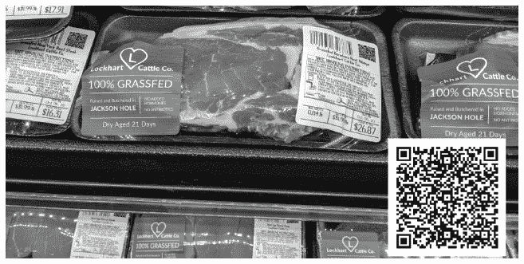

**图 7.8：消费者将能够扫描肉类上的二维码以找到谁饲养了这些牛**

7.6. Everledger

总部位于伦敦的 Everledger 于 2015 年由 Leanne Kemp 创立，最初的目标是追踪从矿山到零售店的钻石。Kemp 希望通过对联合国建立的公平贸易实践的更好追踪来阻止“血钻”——在塞拉利昂、利比里亚、安哥拉和科特迪瓦等地开采以资助冲突的钻石。联合国创造了世界钻石大会来定义标准，该标准随后在 2003 年通过。这被称为“ Kimberley Process Certification”程序要求钻石毛坯和抛光钻石的卖家在发票上插入一个保修声明，内容如下：

*“本发票上的钻石已从未涉及资助冲突的合法来源购买，并符合联合国决议。卖家特此保证，根据个人知识和对钻石供应商提供的书面保证，这些钻石是冲突自由的。”*^(37)

埃弗雷德格公司首先利用机器视觉创建了物理钻石的唯一数字孪生版本来追踪钻石。（参见图 7.9）利用高分辨率照片定义了 40 个元数据点。埃弗雷德格公司与 IBM 合作，在 Hyperledger Fabric 上构建了区块链应用程序。该区块链记录了每颗钻石完整的来源历史，包括原产地、分配、毛坯状态、设计、切割、抛光和认证。^(38) 根据首席执行官的说法，到 2017 年 3 月，有超过 100 万颗钻石被记录在账本上。^(39) 根据 Coindesk 的说法，到 2020 年，埃弗雷德格公司与其合作伙伴网络覆盖了流通中 40%的钻石。^(40)

Everledger 自此扩展了其业务模式，用于验证和追踪其他有价值的资产，如艺术品、电池、锂和钴等重要矿产、时尚品、宝石、保险、奢侈品以及葡萄酒和烈酒。Everledger 平台提供各种产品。^(41) "Capture"是一个主要产品，用于追踪零部件的起源。"Amplify"是电子商务零售商的 API 插件，允许他们将 Everledger 上跟踪的产品的起源插入到他们的网站上。^(42) 截至 2022 年初，Everledger 已从投资者那里筹集了近 4000 万美元，年收入约为 3100 万美元，员工人数为 224 人。^(43)

尽管 Everledger 是第一个在市场上追踪钻石的公司，但其他公司已经进入了这个市场。2018 年 5 月，De Beers 使用区块链追踪了 100 颗高价值的钻石，从矿场到零售商，最终导致了一个名为**Tracr**的分支。加拿大的 Lucara Diamond 使用另一种基于区块链的追踪器**Clara**。^(44)

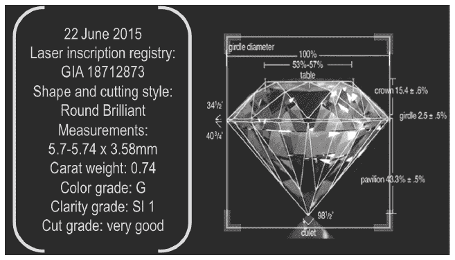

**图 7.9：Everledger 公平贸易钻石的数字标识符**

*来源：[`www.youtube.com/watch?v=GAdjL-nultI`](https://www.youtube.com/watch?v=GAdjL-nultI)*

它的解决方案追踪钻石从"矿场到指尖"。^(45) 2019 年 1 月，俄罗斯教育和科学部推出了自己的区块链解决方案，用于负责任的钻石贸易，该解决方案由俄罗斯初创企业**[Bitcarat.com](http://Bitcarat.com)**开发。^(46) 在编写本文时，2022 年俄罗斯入侵乌克兰期间，很难评估此举措的进展；该网站的路线图自 2020 年以来尚未更新。

7.7\. OpsChain 可追溯性

安永（EY）是一家位于伦敦的全球专业服务网络，拥有超过 30 万名员工。安永的区块链战略因其早期承诺使用公共区块链进行企业交易而在企业领导者中独树一帜。安永认为，由于供应商锁定、可扩展性不足和互操作性差，私有许可区块链并非最终目标。安永看好公共区块链（如以太坊）的好处，包括：（a）无需投资 significant technology 和 hosting a node 即可参与；（b）所有相关信息都保留在公共区块链上，并可供所有参与者查看，即使项目失败或各种个人离开项目；（c）通过社区开发增加利用即将到来的区块链方法和升级的能力，使得使用特定用例网络的参与者可以专注于业务规则、交易和治理，而不是区块链平台的底层开发。为了帮助企业采用公共区块链，安永为开源代码库做出了贡献——最值得注意的是 Nightfall 和 Baseline Protocol，它们使用零知识证明（ZKP）在公共区块链上执行机密交易。（ZKP 在第十章中有解释 Chapter 10）。

在此，我们重点介绍安永的 OpsChain 追踪解决方案，该解决方案用于供应链追踪。其历史始于 WineChain。安永于 2018 年开发了 WineChain，以验证葡萄酒的真实性，并恢复一个充斥着假货的市场——假冒葡萄酒是一个价值数十亿美元的业务。^(47) 该解决方案是一个混合方案，包括一个用于验证葡萄酒真实性的公共区块链和一个用于价值转移的私有区块链。对于葡萄酒真实性，每瓶葡萄酒都被标记为一个 ERC-721 代币并发布到以太坊；该代币被转换为一个 QR 码，附着在葡萄酒瓶的标签上。到 2020 年，安永已经用 ERC-721 代币标记了 1100 万瓶独特的葡萄酒。^(48) 客户可以用他们的智能手机扫描代码，并获得葡萄酒真实的验证（见图 7.10）。消费者可以了解葡萄的收获时间和地点、灌装日期、批次号、二氧化硫含量等数据。对于价值转移，葡萄园、葡萄酒生产商、经纪人、进口商、批发商、分销商和零售商都依赖 Quorum——以太坊的私有网络版本——进行价值交换和跟踪供应链中的瓶子。^(49) 安永选择 Quorum 以期待从私有网络向公共网络的转变；考虑到未来可能会转向以太坊，在 Quorum 上构建公共区块链可以最小化所需的重新编码。

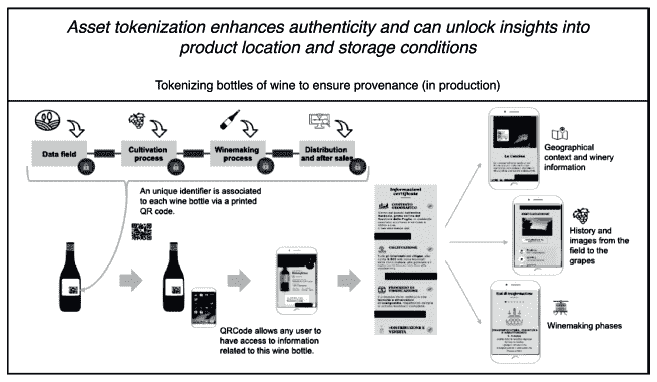

**图 7.10：安永的 WineChain 解决方案**

来源：安永，已获许可

虽然可能会发生小规模的假冒行为——比如喝掉一瓶好酒，重新使用酒瓶，然后转售假酒——但如果尝试扩大解决方案规模，犯罪者将被捕；酒庄仍然拥有 custody 可见性，能够准确地找到反复出现质量投诉的常见来源，并识别流程中的这个离散故障点。

2019 年，安永与包括 Blockchain Wine Pte. Ltd 在内的合作伙伴部署了 TATTOO 葡萄酒市场，服务于亚太市场。"TATTOO"代表追踪性、真实性、透明度、贸易、原产地和观点。它有一个 SAP 的接口；SAP 是一个被许多供应链公司使用的企业应用程序。因此，使用 TATTOO 的大多数客户都是使用混合解决方案，将他们的私有内部系统连接到安永的公共 OpsChain 追踪解决方案。^(50)

当以太坊的交易费用激增时，安永将 OpsChain 追踪解决方案从以太坊演变为 Polygon。我们在第五章的 Aave 案例研究中介绍了 Polygon。Chapter 5 Polygon 是为以太坊处理交易的二层解决方案，在 Polygon 网络上处理交易并将它们打包发布到以太坊。由于 Polygon 使用权益证明，并且交易成本低于以太坊，因此 Polygon 比以太坊更快。

除了葡萄酒，OpsChain 追踪解决方案还被 Birra Peroni （旭日集团）用于啤酒，被 Spinosa 用于马苏里拉奶酪，被默克动物健康用于动物疫苗，还被其他客户用于鸡肉、鸡蛋和新鲜农产品。^(51)

7.8. DL 货运

DL 货运是沃尔玛加拿大公司和 DLT 实验室开发的一种基于区块链的货运发票和支付处理解决方案。案例研究始于 2018 年夏天，在沃尔玛加拿大的供应链和物流组织中。领导们希望解决货运发票的问题。尽管沃尔玛加拿大拥有自己的 2000 辆拖车车队用于将货物运往商店，但它还依赖 70 家第三方货运公司——有的规模大，有的规模小——每年运输超过 50 万个载重单位。单个货运发票可能包含来自供应链各合作伙伴的多达 200 个数据元素。由于每个合作伙伴都维护自己的记录系统，沃尔玛加拿大的信息经常与合作伙伴的信息发生冲突。沃尔玛加拿大对验证运货商的变动收费（称为附加费）感到沮丧，这些收费出现在发票上需要花费时间和资源。在 DL 货运之前，沃尔玛加拿大和其货运公司对 70%的发票进行了争议。解决这些争议需要数天、数周甚至数月的时间，导致行政费用上升到运输成本的约 20%。^(52) 货运公司没有及时得到付款，双方在调解上花费了太多的钱。

沃尔玛加拿大将 DLT Labs 作为其技术合作伙伴。DLT Labs 是一家位于多伦多的技术平台开发商，其基于 Hyperledger Fabric 构建了一个 *可配置* 的平台。配置现有平台比编写和测试定制应用程序要快得多，成本也低得多。一旦配置完成，解决方案便得到了沃尔玛加拿大及其母公司沃尔玛 Inc. 的审计。从概念到现场部署的生产试点的配置、测试和合规周期仅用了八个月。

除了技术之外，该解决方案还涉及重大的业务流程重新设计。在 DL Freight 实施之前，货运承运人在最终交付货物后生成发票，这时沃尔玛加拿大第一次看到发票。沃尔玛必须调查发票上出现的所有意外附加费用。如图 7.11 所示，在采用 DL Freight 之前，货运发票流程需要 11 个步骤。增值步骤是处理有关运输的数据的步骤，包括确认运输详情（第 1 步），调度（第 2 步），接受或拒绝交货（第 3 步），生成正确的发票（第 7 步），以及支付发票（第 11 步）。所有其他步骤都涉及审查数据并在货运承运人的数据中协调任何差异。

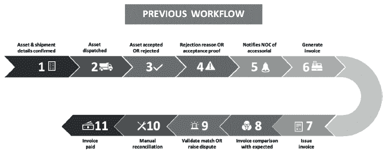

**图 7.11：实施 DL Freight 解决方案前的货运发票流程**

*来源：得到沃尔玛加拿大和 DLT Labs 的授权复制*

在实施 DL Freight 后，发票与来自沃尔玛加拿大和货运承运人的数据共同近乎实时地构建。改进的货运发票流程的“快乐路径”仅需要五个步骤——即没有异常或错误条件的流程（见图 7.12）。

在修订流程的第 1 步中，沃尔玛加拿大的运输管理系统（TMS）成为招标和合同数据的真相来源。TMS 使用 EDI 204 数据标准将运输招标上传到 DL Freight 平台，最初用运输详情、装载详情和交货说明填充发票。已知的费用被添加到发票中，包括燃料费、计划停留费和危险材料处理费。承运人通过 API 或门户直接与 DL Freight 交互以获取招标批准。DL Freight 使用 EDI 990 数据标准向 TMS 发送招标接受通知。货运承运人系统与 DL Freight 之间的连接在图 7.13 中所示。

**图 7.12：实施 DL Freight 解决方案后的货运发票流程**

*来源：得到沃尔玛加拿大和 DLT Labs 的授权*

在第二步中，追踪温度、GPS 位置和时间的物联网设备在读取后近实时地传输到 DL Freight，随着货物沿着运输路线移动。自动上传是通过 FourKites 系统完成的，该系统收集并整合来自物联网设备的数据显示。一些小型运营商没有复杂的物联网设备系统，他们需要手动输入数据。物联网数据触发了添加到发票中的变动附加费用，例如等待时间和停留时间的费用。大多数交易批准使用智能合约自动完成。

在第三步中，沃尔玛加拿大的配送中心通过交货证明连接到 DL Freight 以核实货物接收。GPS 读数确认将货物运送到最终目的地。

在第四步中，货运运营商同意运输细节和交货证明，并通过添加任何最终的附加费用来完成发票。在付款预先批准的情况下，发票将发送给沃尔玛加拿大，并根据智能合约中记录的付款条款进行支付。"*“在净 35 天内支付发票”*"的付款条款倒计时钟在各方同意最终发票后才开始。借助 DL Freight，发票在最终交付后不久就会达成一致，确保承运人在预定的时间内得到正确的付款金额。简而言之，承运人对自己将得到的付款金额有确定性，并且能更快地收到付款。^(54)

在 2020 年 3 月沃尔玛加拿大及其货运运营商采用基于区块链的解决方案后，发票纠纷从 70%下降到不到 2%，发票在 24 小时内完成——而不是几天、几周或更长时间，成本得到降低，客户关系得到改善。截至 2021 年夏季，DL Freight 已经处理了 34 万份价值 4.5 亿美元的发票。准备这些发票涉及 5710 万物联网消息和 260 万次温度更新。

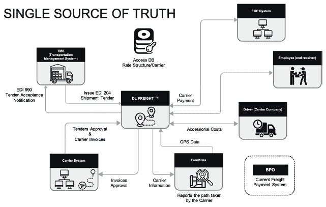

**图 7.13：连接货运运营商系统与 DL Freight**

来源：经 DLT Labs 授权复制

7.9. VeriTX

美国空军退役上校 James Allen Regenor 于 2019 年创立了 VeriTX。VeriTX 在特拉华州注册，总部位于纽约州 East Aurora。VeriTX 的使命是基于三个支柱创建可信赖的数字供应链解决方案：数据完整性、过程完整性和性能完整性。VeriTX 位于工业 4.0 和 Web 3.0 的交汇处。这种交汇的结果是一种新的物流模式，Regenor 将其称为数字模式，继陆地、海洋和空中三种模式之后。VeriTX 解决方案组合的核心是一个市场，一个企业对企业平台，用于购买和销售数字和物理资产，同时也记录由区块链技术支持的信任维护和租赁信息。*(55) VeriTX 在 2022 年 3 月几乎完成了其 A 轮融资，筹集了 500 万美元。

该平台已经与许多全球战略伙伴进行了建设和测试。最近，美国空军在 2021 年 9 月向 VeriTX 授予了价值 200 万美元的合同。VeriTX 作为主要承包商，采用分层方法保护数据安全，保护关键供应链并提高空军的战备状态。*(56)

尽管 VeriTX 是在 2019 年成立的，但它有着更长的历史，追溯到 Regenor 在 2013 年从美国空军退役后加入 Moog 公司。Regenor 的部分原因是因他的情景规划技能而被雇佣，帮助 Moog 预想未来的业务方向。在 Moog 工作时，Regenor 设想了一个完全去中心化的制造过程，在该过程中，军事和商业客户可以在需要的时候打印他们需要的部件。情景如下：

想象一个情景：生命安全取决于一架远程海上航空母舰甲板上起飞的任务。唯一可用的飞机刚刚因为关键部件故障而被停飞。航空母舰上没有该部件的库存。但我们有一台 3D 打印机和一批粉末。有一个关于该部件的技术数据包，一个替换部件很快就被打印出来。你是负责的人，需要迅速将这个部件安装到飞机上，并签署飞机安全准备好起飞。你怎么知道你手中拿着的新打印的增材制造部件是否可以使用？*(57)

实现如此分散式制造过程的挑战——特别是在如此高度受监管的背景下——是巨大的。如果 3D 打印说明被网络恐怖分子篡改了呢？或者如果这些说明是伪造的呢？军事和商业用户需要确保从打印机上出来的零件是真实的，并且该零件已准备好使用。此外，新打印的零件需要在其整个生命周期内被追踪，因此它需要在离开打印机时嵌入唯一的 ID。军事和商业用户需要一个具有最高安全性的分散式网络。技术上，Regenor 和他的团队很快意识到区块链技术可能是理想的技术解决方案：一个用于分散式增材制造的分散式区块链应用程序。^(58)潜在市场的规模很大。美国军队正在向数字化供应链转变，预计到 2025 年，数字化飞机零件的市场规模将达到 31 亿美元。

在像 Moog 这样的传统企业内尝试启动新业务是一个缓慢的过程。在第十一章中讨论的克莱顿·克里斯滕森的颠覆性创新理论发现，传统企业很难自我颠覆，而分拆或投资初创企业是更好的途径。最终，Regenor 在 2018 年 5 月决定离开 Moog，以加速发展并使解决方案独立。他说，“*为了成功，我们需要 VeriTX 成为一个中立的第三方平台。*”Regenor 在推出 VeriTX 时继续担任 Moog 的顾问。虽然 Regenor 和其他 Moog 员工一起在专利上署名，但 Moog 拥有这些专利，因此 VeriTX 从 Moog 那里获得专利许可。2019 年底，Moog 成为 VeriTX 的战略合作伙伴，这与克里斯滕森的理论相一致。

在本书讨论的所有供应链案例中，VeriTX 解决方案对传统供应链生态系统的冲击最大。图 7.14 比较了集中式与分散式制造的过程。

这是一个完全新型的供应链。其潜在的商业价值巨大，例如显著减少停机时间、降低库存成本、减少关税费用以及降低运输成本。^(59)主要军事效益是提高任务准备率，商业效益是提高资产运行时间。该平台生成的元数据和零件数据可用于通知预测性和规定性维护解决方案。如今，大多数零件是飞行至故障的，这极其低效且成本高昂。通过实施规定性模型，可以获得大量效率，并降低成本。

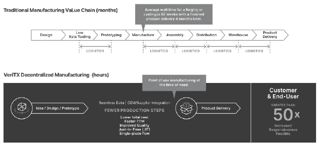

**图 7.14：集中式*对*分散式制造**

来源：经 VeriTX 许可

从流程角度来看，VeriTX 通过将其分解为四个步骤，使零部件的制造过程数字化并去中心化：

**1.** *“卖家们设计零部件的方式是数字化的。这包括从传统的锻造金属发动机零部件到用于飞机客舱的聚合物压制内饰零部件的创意、原型和最终设计.*

**2.** *卖家们在 VeriTX 平台上上传零部件。包括定价、规格和来源等所有必要的信息.*

**3.** *买家购买数字零部件。该平台使数字资产的交换成为可能，最终将在最后一步变为有形资产.*

**4.** *送到使用地点，然后进行 3D 打印。对于那些没有 3D 打印机的人来说，VeriTX 有机器合作伙伴，可以打印零部件，并准备好供取货或送货。“*^(60)

对于步骤 2，卖家们在 VeriTX 平台上分配并上传唯一的标识符。零部件识别方法根据应用场景和材料类型而有所不同。对于 3D 打印的零部件，每个零部件可以打印有一个嵌入的独特散列“水印”，可以通过智能手机应用的摄像头查看。该散列值在原始时刻永久存储在区块链上。

对于金属零部件，穆格与阿尔泰浓公司进行了一次概念验证，后者使用简单的手机摄像头和专有软件，将单个对象的 54000 个独特表面特征转化为唯一的数字 ID——没有附加标签，物体本身就是其自己的标识符！(参见图 7.15.)

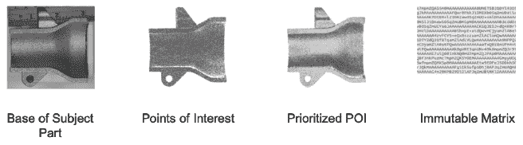

**图 7.15：为金属零部件创建唯一的 ID**

来源：[`www.moog.com/news/blog-new/VeriPart-linking-digital-to-physical.html`](https://www.moog.com/news/blog-new/VeriPart-linking-digital-to-physical.html)

阿尔泰浓（Alitheon）的软件可以随时用手机扫描物体，如果该物体之前已在区块链上记录，软件会验证该物体并提供一个匹配置信度分数。^(61) 在概念验证（POC）中，穆格（Moog）向阿尔泰浓发送了 20 个金属零部件进行扫描，然后阿尔泰浓将它们归还给穆格。穆格在收到零部件后进行了扫描，与穆格的 ID 进行匹配，然后通过将它们从混凝土地板上掉落、用便携式电机磨削以及用砂粒喷砂等方式对这些零部件进行了破坏性测试。穆格将这些磨损的零部件退还给阿尔泰浓，而阿尔泰浓仍能够识别出这些独特的零部件，即使原始零部件上只剩下 3700 个独特的表面特征。^(62)

区块链应用程序利用智能合约跟踪零部件的每一次移动和每一次所有权的转让（参见图 7.16）。模块还分析数据（如预测零部件故障）并将零部件信息汇总到仪表板（参见图 7.17）。

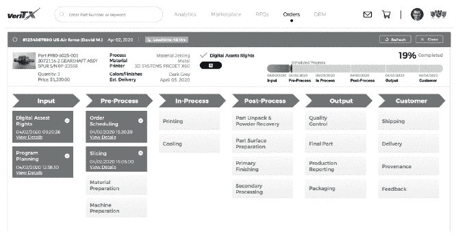

**图 7.16：VeriTX 跟踪从零件设计打印到交付的过程**

来源：经 VeriTX 许可

接下来，我们介绍一些 VeriTX 的试点项目。

如上所述，美国空军在 2021 年向 VeriTX 颁发了一份价值 200 万美元的合同。Regenor 解释说，“VeriTX 总是谈论物流的第四种模式，即基于数据、流程和性能诚信。对于美国空军来说，VeriTX 负责数据诚信。我们建立了一个名为 Fortis 的解决方案来跟踪任何零件的数据来源。除此之外，我们还可以确定文档是否被更改，这对于需要假设‘物流受攻击’的环境来说至关重要。”对于 Fortis 应用程序，解决方案演示建立在以太坊的私人授权版本上。VeriTx 与合作伙伴合作，潜在地开发适用于该解决方案的量子密钥对，预计量子计算的进步将打破当今区块链中使用的私钥和公钥对（有关量子方面的更多信息，请参见第十章）。

随着测试版的推进，该解决方案可能会变成混合型。记录交易哈希的部分解决方案可能会移至 Algorand。负责法医分析和确定谁或什么执行交易的部分解决方案将在私有网络上运行。Regenor 解释说，“这是一个在零信任环境中高度安全的设计，启用了根据国家安全备忘录-8 的量子抵抗协议。”^(64)*

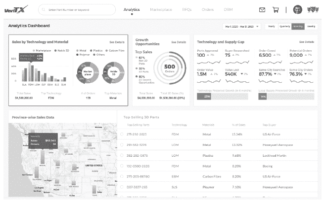

**图 7.17：VeriTX 的仪表板**

来源：经 VeriTX 许可

Regenor 在考察了几家技术提供商后选择了 Algorand。Algorand 是一个公共无权限区块链，依赖于权益证明，快速、低成本且安全。他说，“Algorand 是将我们的生态系统合作伙伴带入网络的理想解决方案，因为它具有灵活的架构、低交易费用和交易吞吐量可扩展性。”^(65)* 此外，Algorand 也是碳中性的；链上的可持续性预言者分析每个节点的能源使用，并通过植树、泥炭管理和由 ClimateTrade 管理的风力能源项目来补偿使用抵消资金。^(66) Algorand 还具有一个抓回功能，允许授权地址如果他们违反了某些合同义务，从账户中撤销资产。

在另一个军事应用的 POC 中，VeriTX 证明了向去中心化制造的转变有了巨大的改进。在 VeriTX 这样的解决方案出现之前，F15-Eagle 战斗机飞机的替换零件的订购和交付需要长达 265 天。在 VeriTX 市场平台上，国防部可以下达一个购买订单，要求 3D 打印一个金属飞机零件，并在仅 6 小时内交付。^(67)

在商业航空公司领域，Regener 和他的团队在 2019 年进行了一次备受关注的现场测试，为 incoming 飞机的一个商务舱座位生产了一个 3D 替换零件。波音 777-300 飞机从新西兰奥克兰出发，在飞行过程中，它向位于奥克兰的新西兰航空公司维护设施发报，报告零件损坏。尽管这个零件不是关键的，但它会使座位变得无法出售。维护设施从其供应商、新加坡的 ST Engineering (STE)订购了数字零件。STE 将订单推给 Moog，在洛杉矶打印零件。Regener 使用移动打印机打印了零件，并在波音 777-300 飞机降落在洛杉矶后 30 分钟内，维护人员将其更换。^(68) Regenor 解释说，“我们证明了可以将 43 天的交货期缩短到一个小时。数字物流从根本上改变了供应链。”^(69)*

VeriTX 接下来的商业应用重点是“可旋转部件”。可旋转部件是可以修理和重复使用的飞机零件。商业航空公司可以创造可持续发展的机会，重新利用、重建和翻新那些本会被丢弃的零件。

VeriTX 还涉足了医疗零件业务。当 Regener 意识到他的平台可以帮助制造抗击 COVID-19 所需的医疗设备时，他立即行动起来。他在 2020 年 3 月成立了一家新公司，Rapid Medical Parts。他召集了他的全球合作伙伴网络，仅用 12 天时间，五角大楼就授予了他的公司一份合同，将大量睡眠呼吸暂停机转换为呼吸机。转换需要额外的零件，Rapid Medical Parts 进行了打印，成本仅是新呼吸机的一十分之一。合同完成后，由于工业呼吸机制造商能够满足需求，睡眠呼吸暂停机的转换需求减弱了。在向我们分享他的故事时，Regener 说，“我们都响应号召。有些人奔向大炮，有些人挖掘战壕。我一直奔向大炮。”

7.10. 结论

IBM Food Trust，VeChain，BeefChain，Everledger，OpsChain Traceability，DL Freight 和 VeriTX 展示了生态系统平台如何帮助改善供应链。他们提高了供应链的可见性，验证了产品，消除了贸易中的摩擦点，降低了行政成本，并减少了在文件工作上浪费的时间。我们的案例样本展示了识别产品的多种方式以及区块链的多种用途，包括私人授权、私人无需授权和公共无需授权的解决方案。我们还看到了几种混合解决方案。

除了我们的案例，还有许多其他基于区块链的供应链。例如：

OpenSC，由世界自然基金会和波士顿咨询集团共同创立，帮助澳大利亚渔业追踪从“诱饵到餐桌”的鱼类。^(70)

• Provenance 是一家位于英国的公司，为许多客户提供了供应链真实性和追踪服务，包括位于阿肯色州小石城的 Grass Roots Farmer’ Cooperative。

• 明尼苏达州 based Cargill 从 70 个农场追踪到零售店的 20 万只火鸡。^(71)

法国的 Carrefour 追踪了牛奶和其他产品。Carrefour 报告称，基于区块链的应用程序提高了追踪产品的销售额，并可通过二维码供消费者访问。^(72)

• 美国 based Bumble Bee Foods 追踪鱼类（使用 SAP）。^(73)

CONA 为可口可乐装瓶商建立了一个基于区块链的解决方案。最初它建立在私人授权网络上，但可能会转移到一个公开无需授权的解决方案。^(74)

有趣的是，思考更多的供应链应用是否会根据第十章中讨论的创新，从私人到公共区块链转变，例如零知识证明和第二层解决方案。

对于那些希望更深入研究供应链中区块链的人来说，Remko Van Hoek, Brian Fugate, Marat Davletshin 和 Matthew Waller 所著的《将区块链整合到供应链管理中》是推荐读物。在下一章，我们探讨了区块链解决方案用于证书的使用。

引用

^(1) ReportBuyer 新闻稿（2018 年 8 月 27 日）。预计到 2020 年，全球食品和杂货零售市场规模将达到 12.24 万亿美元，[`www.prnewswire.com/news-releases/the-global-food-and-grocery-retail-market-size-is-expected-to-reach-usd-12-24-trillion-by-2020--300702659.html`](https://www.prnewswire.com/news-releases/the-global-food-and-grocery-retail-market-size-is-expected-to-reach-usd-12-24-trillion-by-2020--300702659.html)

^(2) 世界卫生组织（2020 年）。食品安全，[`www.who.int/news-room/fact-sheets/detail/food-safety`](https://www.who.int/news-room/fact-sheets/detail/food-safety)

^(3) Spink, J., Embark, P., Savelli, C., 和 Bradshaw, A.（2019）。全球食品安全欺诈视角：世界卫生组织对国际食品安全当局网络（INFOSAN）成员的调查。[`www.nature.com/articles/s41538-019-0044-x`](https://www.nature.com/articles/s41538-019-0044-x)

^(4) Grossman, E.（2016 年 10 月 25 日）。你的食物是由奴隶生产的吗？[`civileats.com/2016/10/25/did-slaves-produce-your-food-forced-labor/`](https://civileats.com/2016/10/25/did-slaves-produce-your-food-forced-labor/)

^(5) Statista（2020 年）。1992 年至 2018 年美国零售和餐饮服务总销售额；[`www.statista.com/statistics/197569/annual-retail-and-food-services-sales/`](https://www.statista.com/statistics/197569/annual-retail-and-food-services-sales/)

^(6) 美国疾病控制与预防中心（2020 年）。食物中毒负担：发现，[`www.cdc.gov/foodborneburden/2011-foodborne-estimates.html`](https://www.cdc.gov/foodborneburden/2011-foodborne-estimates.html)

^(7) 食品药品监督管理局召回清单：[`www.fda.gov/safety/recalls-market-withdrawals-safety-alerts`](https://www.fda.gov/safety/recalls-market-withdrawals-safety-alerts)

^(8) [`www.fsis.usda.gov/recalls`](https://www.fsis.usda.gov/recalls)

^(9) 食物浪费：拯救美国美食。 [`www.rescuingleftovercuisine.org/e?gclid=Cj0KCQiA4NTxBRDxARIsAHyp6gBqhPgXvYsvwoDJHRewOeXi5nv1sK8f1oMw5BP0AtNnseRDNRYkvqgaAgu5EALw_wcB`](https://www.rescuingleftovercuisine.org/e?gclid=Cj0KCQiA4NTxBRDxARIsAHyp6gBqhPgXvYsvwoDJHRewOeXi5nv1sK8f1oMw5BP0AtNnseRDNRYkvqgaAgu5EALw_wcB)

^(10) 关于 Mediledger 案例研究，请参见：

Mattke, Jens; Maier, Christian; Hund, Axel; 和 Weitzel, Tim（2019），“美国药品供应链中企业区块链应用程序如何拯救生命，” *MIS Quarterly Executive*：第 18 卷：第 4 期，文章 6。

关于 TradeLens 案例研究，请参见：

Jensen, Thomas; Hedman, Jonas; 和 Henningsson, Stefan (2019) “贸易视界如何通过区块链技术实现商业价值，”《MIS Quarterly Executive》： Vol. 18: Iss. 4, Article 5. -   

Sarker, S., Henningsson, S., Jensen, T., 和 Hedman, J. (2021). 区块链在打击全球航运腐败中的作用：一个解释性案例研究，《管理信息系统杂志》，38(2)，338-373。 -   

11 [IBM 食品信任链资源](https://www.ibm.com/blockchain/resources/7-benefits-ibm-food-trust/) -   

12 Kamath, R. (2018). 食品追溯性在区块链上的应用：IBM 与沃尔玛的猪肉和芒果试点项目，《英国区块链协会杂志》，1(1)，1-12。 -   

13 UPC 038900006198 与 Dole Crushed Pineapple In Its Own Juice, 8 oz 相关联 [UPC 信息查询](https://www.upcitemdb.com/upc/38900006198)

^(14) 信任锚的主要职责是什么？[信任锚的主要职责](https://www.ibm.com/blockchain/solutions/food-trust/food-industry-technology#1797811)

^(15) [IBM 食品信任解决方案](https://www.ibm.com/blockchain/solutions/food-trust/food-industry-technology#1797811)

^(16) IBM 新闻发布（2018 年 10 月 23 日），《IBM 和微软宣布云服务之间的合作伙伴关系》，[IBM 和微软宣布云服务之间的合作伙伴关系](https://www.pbsnow.com/ibm-news/ibm-and-microsoft-announce-partnership-between-cloud-offerings/)

^(17) Cream and Partners (2020 年 6 月 1 日) 沃尔玛中国携手山姆会员店和 VeChain 在食品安全追溯平台方面迈出一步，2022 年 3 月 22 日取自：[沃尔玛中国携手山姆会员店和 VeChain 在食品安全追溯平台方面迈出一步](https://creamandpartners.com/walmart-china-brings-together-sams-club-and-vechain-to-take-one-step-further-towards-blockchainization-with-safe-food-traceability-platform/)

^(18) [VeChain](https://www.investopedia.com/terms/v/vechain.asp#)

^(19) VeChain 的权威证明。2022 年 3 月 23 日取自：[VeChain 的权威证明](https://docs.vechain.org/thor/learn/proof-of-authority.html)

^(20) [VeChain ToolChain](https://www.vechain.com/product/toolchain)

^(21) VeChain 白皮书：[VeChain 白皮书](https://www.vechain.org/whitepaper/)

^(22) Palmer, D. (2019 年 6 月 25 日) 沃尔玛中国携手 VeChain、PwC 推出区块链食品安全平台。Coindesk. [沃尔玛中国携手 VeChain 推出区块链食品安全平台](https://www.coindesk.com/walmart-china-teams-with-vechain-on-blockchain-food-safety-platform)

Mitra, R. (2019 年 8 月 28 日). VeChain 与沃尔玛、比亚迪、DNG VL 和宝马合作。FXStreet. [VeChain 与沃尔玛、比亚迪、DNG VL 和宝马合作](https://www.fxstreet.com/cryptocurrencies/news/vechain-partners-with-walmart-byd-dng-vl-and-bmw-201908280048)

消费者视角：[沃尔玛溯源链接](https://traceability.walmartmobile.cn/walmart/p/10000919067888862973)

^(23) [VeChain 竞争对手及合作伙伴](https://www.cbinsights.com/company/vechain/competitors-partners)

^(24) 食品追溯性：Beefchain 解决方案，Cardano 2020 年会，[视频链接](https://youtu.be/9zukeh-iqC4)

^(25) Reuters (June 17, 2021). 四家大型企业如何控制美国牛肉产业. Retrieved March 24, 2022 from [`www.reuters.com/business/how-four-big-companies-control-us-beef-industry-2021-06-17/`](https://www.reuters.com/business/how-four-big-companies-control-us-beef-industry-2021-06-17/)

^(26) Reuters (June 17, 2021). 四家大型企业如何控制美国牛肉产业. Retrieved March 24, 2022 from [`www.reuters.com/business/how-four-big-companies-control-us-beef-industry-2021-06-17/`](https://www.reuters.com/business/how-four-big-companies-control-us-beef-industry-2021-06-17/)

^(27) Pollard, A. (June 9, 2021). “四大”肉类包装商正在压垮小型牧场主. Retrieved March 24, 2022 from [`prospect.org/power/big-four-meatpackers-crushing-small-ranchers/`](https://prospect.org/power/big-four-meatpackers-crushing-small-ranchers/)

^(28) Ledger Insights (July 24, 2020). “Proof of Steak”: 使用区块链改造牛肉食品追溯. Retrieved March 24, 2022 from [`www.ledgerinsights.com/proof-of-steak-blockchain-food-beef-traceability/`](https://www.ledgerinsights.com/proof-of-steak-blockchain-food-beef-traceability/)

^(29) Del Castillo, M. (May 17, 2018). 使用区块链约束的放牧牛肉, retrieved March 24, 2022 from `www.for

^([30`) 区块链在食品行业中的应用：牛肉链案例 (May 10, 2021). [`www.youtube.com/watch?v=ZHrUhJNc1H0`](https://www.youtube.com/watch?v=ZHrUhJNc1H0)

^(31) University of Wyoming Press Release (February 12, 2019). 首次利用区块链将怀俄明牛肉运至台湾. Retrieved March 24, 2022 from [`northernag.net/first-ever-blockchain-beef-shipment-traced-from-wyoming-to-taiwan/`](https://northernag.net/first-ever-blockchain-beef-shipment-traced-from-wyoming-to-taiwan/)

^(32) Pirus, B. (April 25, 2019). BeefChain 获得首家 USDA 认证的区块链公司. Retrieved March 24, 2022 from [`www.forbes.com/sites/benjaminpirus/2019/04/25/beefchain-receives-first-usda-certification-for-a-blockchain-company/?sh=3b9146447607`](https://www.forbes.com/sites/benjaminpirus/2019/04/25/beefchain-receives-first-usda-certification-for-a-blockchain-company/?sh=3b9146447607)

^(33) 食品追溯：牛肉链解决方案，Cardano 2020 会议, [`youtu.be/9zukeh-iqC4`](https://youtu.be/9zukeh-iqC4)

34 Pirus, B. (2019 年 4 月 25 日). BeefChain 成为首家获得美国农业部认证的区块链公司。2022 年 3 月 24 日取自[福布斯网站](https://www.forbes.com/sites/benjaminpirus/2019/04/25/beefchain-receives-first-usda-certification-for-a-blockchain-company/?sh=3b9146447607) -   

35 食品追溯性：Beefchain 解决方案，Cardano 2020 会议，[视频链接](https://youtu.be/9zukeh-iqC4) -   

36 食品追溯性：Beefchain 解决方案，Cardano 2020 会议，[视频链接](https://youtu.be/9zukeh-iqC4) -   

37 [金伯利进程认证计划](https://en.wikipedia.org/wiki/Kimberley_Process_Certification_Scheme) -   

38 [Everledger.io - 钻石行业解决方案](https://everledger.io/industry-solutions/diamonds/) -   

^(39) Everledger 首席执行官在 IBM Interconnect 的演讲：[`ibmgo.com/interconnect2017/?cm_mc_uid=19734726856314943335282&cm_mc_sid_50200000=1494367094&cm_mc_sid_52640000=1494367094`](https://ibmgo.com/interconnect2017/?cm_mc_uid=19734726856314943335282&cm_mc_sid_50200000=1494367094&cm_mc_sid_52640000=1494367094)（视频中大约一个小时十五分钟处）。

^(40) Allison, I. (2020 年 3 月 24 日)。Everledger 通过 ESG 供应链合作，超越血钻，Coindesk，2022 年 3 月 21 日取自[`www.coindesk.com/business/2020/03/25/everledger-looks-beyond-blood-diamonds-with-esg-supply-chain-collaboration/`](https://www.coindesk.com/business/2020/03/25/everledger-looks-beyond-blood-diamonds-with-esg-supply-chain-collaboration/)

^(41) Everledger 概述：[`youtu.be/SY2VsIL9DKY`](https://youtu.be/SY2VsIL9DKY)

‘Capture’产品：[`youtu.be/bhqYgqhnnKc`](https://youtu.be/bhqYgqhnnKc)

Everledger 葡萄酒供应链：[`youtu.be/GKBxZVEzMNU`](https://youtu.be/GKBxZVEzMNU)

^(42) Everledger 的收入和竞争对手。2022 年 3 月 21 日取自[`www.everledger.io/industry-solutions/`](https://www.everledger.io/industry-solutions/)

^(43) [`growjo.com/company/Everledger`](https://growjo.com/company/Everledger)

^(44) O’Neal, S. (2019 年 2 月 6 日)。钻石是区块链最好的朋友，CoinTelegraph，[`cointelegraph.com/news/diamonds-are-blockchains-best-friend-how-dlt-helps-tracking-gems-and-prevents-fraud`](https://cointelegraph.com/news/diamonds-are-blockchains-best-friend-how-dlt-helps-tracking-gems-and-prevents-fraud)

^(45) [`www.lucaradiamond.com/clara/`](https://www.lucaradiamond.com/clara/)

^(46) [`bitcarat.com/`](https://bitcarat.com/)

47 米卡尔，J.（2018 年 12 月 1 日）。你的酒窖里有什么？假葡萄酒是一个价值数十亿美元的问题，《福布斯》，[`www.forbes.com/sites/joemicallef/2018/12/01/whats-in-your-cellar-counterfeit-wines-are-a-multi-billion-dollar-problem/#70f541ad1c83`](https://www.forbes.com/sites/joemicallef/2018/12/01/whats-in-your-cellar-counterfeit-wines-are-a-multi-billion-dollar-problem/#70f541ad1c83)。

48 沙玛，T.（2019 年 7 月 16 日）。了解您葡萄酒的真实性，《https://www.blockchain-council.org/blockchain/know-the-authenticity-of-your-wines-eys-blockchain-platform-for-wine-traceability/](https://www.blockchain-council.org/blockchain/know-the-authenticity-of-your-wines-eys-blockchain-platform-for-wine-traceability/)。

49 *恢复葡萄酒行业从葡萄到杯子的信任*，EY [`www.ey.com/en_us/global-review/2018/restoring-trust-in-the-wine-industry`](https://www.ey.com/en_us/global-review/2018/restoring-trust-in-the-wine-industry)

50 EY 新闻稿（2019 年 11 月 13 日）。EY 区块链平台支持区块链葡萄酒私人有限公司在亚太地区推出 TATTOO 葡萄酒市场。2022 年 3 月 23 日从[`www.ey.com/en_gl/news/2019/11/ey-blockchain-platform-supports-blockchain-wine-pte-ltd-to-launch-tattoo-wine-marketplace-across-asia-pacific`](https://www.ey.com/en_gl/news/2019/11/ey-blockchain-platform-supports-blockchain-wine-pte-ltd-to-launch-tattoo-wine-marketplace-across-asia-pacific)检索。

51 EY 新闻稿（2019 年 4 月 16 日）。EY Ops Chain 使企业能够大规模工业化区块链。2022 年 3 月 23 日从[`www.ey.com/en_gl/news/2019/04/ey-ops-chain-industrializes-the-blockchain-at-scale-for-enterprises`](https://www.ey.com/en_gl/news/2019/04/ey-ops-chain-industrializes-the-blockchain-at-scale-for-enterprises)检索。

52 *沃尔玛使用区块链修复“破碎”的货运审计和支付流程*，《供应链大脑》，2020 年 11 月 1 日，可在`www.supplychainbrain.com/articles/32

[53` 同上。

54 汉密尔顿，S. *MOBI 社区创新讲座：DLT 实验室与加拿大沃尔玛的合作伙伴关系*，MOBI，2020 年 9 月 24 日，可在[`dlt.mobi/mobi-community-innovation-lecture-the-partnership-between-dlt-labs-and-walmart-canada/`](https://dlt.mobi/mobi-community-innovation-lecture-the-partnership-between-dlt-labs-and-walmart-canada/)查阅。

55 [`veritx.co/`](https://veritx.co/)

^(56) VeriTX 新闻稿（2021 年 9 月 22 日）。VeriTX 获得美国空军合同，创建安全的数字织物，retrieved March 21, 2022 from [`potomacofficersclub.com/news/veritx-awarded-us-air-force-contract-to-create-secure-digital-fabric/`](https://potomacofficersclub.com/news/veritx-awarded-us-air-force-contract-to-create-secure-digital-fabric/)

^(57) 小，G.，*Additive Manufacturing Reshaping Logistics*，检索于 2020 年 3 月 10 日，来自[`www.moog.com/news/blog-new/IntroducingVeripart_Issue3.html`](http://www.moog.com/news/blog-new/IntroducingVeripart_Issue3.html)

^(58) Regenor，J.（2017 年 4 月 18 日），*Industry Impact: Aerospace Supply Chain*，在马萨诸塞州剑桥市的 Blockchain for Business Conference 上的演讲

^(59) 小，G.，*Additive Manufacturing Reshaping Logistics*，检索于 2020 年 3 月 10 日，来自[`www.moog.com/news/blog-new/IntroducingVeripart_Issue3.html`](http://www.moog.com/news/blog-new/IntroducingVeripart_Issue3.html)

^(60) VeriTX 用例，于 2022 年 3 月 20 日从[`www.algorand.com/ecosystem/use-cases/veritx`](https://www.algorand.com/ecosystem/use-cases/veritx)检索

^(61) Alitheon 网站。 [`www.alitheon.com`](https://www.alitheon.com)

^(62) Moog 新闻稿（2019）。VeriPart™ – 将数字与物理链接起来，[`www.moog.com/news/blog-new/VeriPart-linking-digital-to-physical.html`](https://www.moog.com/news/blog-new/VeriPart-linking-digital-to-physical.html)。

^(63) Regenor，J.，同上，2017 年 4 月 18 日。

^(64)

^(65) VeriTX 新闻稿（2020 年 10 月 22 日）。VeriTX 与 Algorand 合作，为航空航天制造提供领先的数字市场，retieved March 21, 2022 from [`www.algorand.com/resources/ecosystem-announcements/veritx-algorand-deliver-digital-marketplace-for-aerospace-manufacturing`](https://www.algorand.com/resources/ecosystem-announcements/veritx-algorand-deliver-digital-marketplace-for-aerospace-manufacturing)

^(66) Algorand 新闻稿（2021 年）。Algorand 承诺将区块链网络建设成为碳负网络，现在和未来，retrieved March 24, 2022 from [`www.algorand.com/resources/algorand-announcements/carbon_negative_announcement`](https://www.algorand.com/resources/algorand-announcements/carbon_negative_announcement)

^(67) VeriTX 用例，于 2022 年 3 月 20 日从[`www.algorand.com/ecosystem/use-cases/veritx`](https://www.algorand.com/ecosystem/use-cases/veritx)检索

^(68) 戴维斯，S.（2019 年 7 月 17 日）。穆格公司的连接飞行与分布式制造，TCT 杂志，[`www.tctmagazine.com/3d-printing-news/moogs-connecting-flight-to-distributed-manufacturing/`](https://www.tctmagazine.com/3d-printing-news/moogs-connecting-flight-to-distributed-manufacturing/)

^(69) 詹姆斯·雷根纳，2019 年 12 月 3 日在区块链卓越中心所做的演讲。

^(70) [`opensc.org/case-studies.html`](https://opensc.org/case-studies.html)

^(71) 草根农民合作社（2019 年 2 月 10 日）。从牧场到餐桌——追踪你的食物之旅。[`www.grassrootscoop.com/blog/from-pasture-to-plate-trace-the-journey-of-your-food/`](https://www.grassrootscoop.com/blog/from-pasture-to-plate-trace-the-journey-of-your-food/)

布洛赫，S.，和法斯勒，J.（2018 年 11 月 23 日）为什么汽车“基于区块链”的火鸡比它们揭示的更多。The Counter，[`thecounter.org/cargill-blockchain-traceable-turkey-contract-farming-reality-thanksgiving/`](https://thecounter.org/cargill-blockchain-traceable-turkey-contract-farming-reality-thanksgiving/)

^(72) 魏克，M.（2019 年 12 月 11 日）。2019 年见证了区块链旅游的终结，《Coindesk》，[`www.coindesk.com/2019-saw-the-end-of-blockchain-tourism`](https://www.coindesk.com/2019-saw-the-end-of-blockchain-tourism)

^(73) 奥尼尔，S.（2019 年 7 月 7 日）。食品行业的区块链应用，以及该行业如何利用这项技术。《CoinTelegraph》，[`cointelegraph.com/news/blockchain-for-the-food-how-industry-makes-use-of-the-technology`](https://cointelegraph.com/news/blockchain-for-the-food-how-industry-makes-use-of-the-technology)

^(74) 账本洞察（2020 年 8 月）。可口可乐装瓶商将试用公共以太坊以提高供应链透明度。2022 年 3 月 24 日检索自[`www.ledgerinsights.com/coca-cola-bottlers-coke-blockchain-ethereum-baseline/`](https://www.ledgerinsights.com/coca-cola-bottlers-coke-blockchain-ethereum-baseline/)

^(75) 范胡克，R.，弗盖特，B.，达夫莱辛，M.，和沃勒，M.（2019）。《将区块链整合到供应链管理中》，科根页面，伦敦。

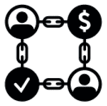

## 第八章

## 商业应用凭证

***内容概览：*** 自我主权身份（SSI）是一种去中心化和自动化的发行、持有和验证凭证的方法。SSI 在第一章中被介绍为引导我们走向去中心化 Web 3.0 的几个主要趋势之一。在本章中，我们进一步探讨了凭证的中心化方法的痛点以及 SSI 如何解决这些问题。我们探讨了两个案例研究。英国国家卫生服务（NHS）开发了一个数字员工通行证，以验证卫生专业人员的资格和凭证，以便在 COVID-19 期间加快员工转移。iDatafy 开发了 SmartResume 和一个就业市场平台，在该平台上，个人的教育和技能由授权发行者进行验证，以便招聘公司能够找到合格的人才。

学习目标：

• 解释 SSI 的原则和架构特点。

• 对比在实施 SSI 解决方案前后招聘员工的情况。

• 对比在实施 SSI 解决方案前后招聘过程的情况。

• 将 NHS 的数字员工通行证和 iDatafy 的 SmartResume 映射到区块链应用框架。

• 描述数字员工通行证和 SmartResume 应用的治理过程。

8.1. 自我主权身份和凭证概览

自我主权身份（SSI）是由全球社区发起的一场运动，旨在去中心化和自动化关于主题的凭证的发行、持有和验证。它是将万维网从机构的中心化控制转变为个人的去中心化控制这一必然趋势的一部分。SSI 赋予个人拥有和控制由授权发行者对他们所做的证明——比如驾驶执照或大学文凭——以及提供更加安全和私密的互联网版本的能力。

让我们先从理解术语开始。SSI 是一个不幸的标签，因为我们——就像许多学者一样——认为身份是一种由自我定义的心理构造，或是一种由一个人的社会群体定义的社会构造。从我们的角度来看，政府和组织并不赋予个人“身份”。相反，政府和组织向个人提供的是“凭证”，这是由授权发行者对主题所做的证明。SSI 是关于自动化凭证生态系统的，该生态系统包括发行者、持有者、验证者和监管当局。让我们首先看看持有者，因为所有读者都持有凭证。

您有哪些资质证明？为了回答这个问题，请查看您的实体钱包。也许您有一张由您的州或政府发行的驾驶执照；一张由您的大学发行的学生身份证；一张由您的银行发行的信用卡；一张由一家道路救援公司发行的会员卡；一张由您的健康保险公司发行的健康保险卡；一张由您最喜欢的餐厅发行的奖励卡，或一张由您当地医疗服务提供者发行的 COVID-19 疫苗接种卡。您的实体钱包里装有由授权发行机构提供的您的资质证明的实体副本。您向验证者出示这些卡片作为您资质的证明，比如当您租车、从大学图书馆借书、支付学费、当您的车坏了需要拖车时请求道路救援，或者在出国旅行时证明您的接种状态。

SSI（去中心化身份识别）旨在创建您会保存在数字 SSI 钱包中的资质证明的数字版本。您将所有东西都放在一个方便的地方。您可以控制谁可以看到它们——这就是“自我主权”这个术语的由来。这些证明是关于您，资质证明持有者的，您应该有权决定与谁分享它们。当验证者请求查看它们时，您将决定提供哪些作为证明。

学生读者可能会联想到 SSI 的经典例子。当酒吧服务员需要证明您已达到法定饮酒年龄时，他们会要求查看您的驾驶执照。服务员只需要看到您的出生日期，但他们也会看到您的姓名和地址。有了 SSI 数字钱包，您只需分享您已达到法定饮酒年龄的证明，但您可以保持姓名和地址的秘密。这称为 SSI**数据最小化**原则，它增加了您的**隐私**。此外，服务员会信任您的证明，因为数字凭证将由机器验证。服务员的应用程序将查找您所在州或发行机构的公钥在公共注册表（很可能是区块链注册表）上，以确保只有它才能创建您的数字驾驶执照。发行者对您的证明的数字签名将在几秒钟内得到验证。现在您可以理解为什么我们认为 SSI 运动的更好命名是“自我主权验证资质”——但遗憾的是，SSI 是一个根深蒂固的术语，我们将使用这个术语进行。

回到你的实体钱包。现在让我们思考一下你与所有这些发卡机构在线的关系。虽然你的凭证以数字形式存在于某个地方，但你对它们没有控制权或直接访问权限。你与一些发卡机构（如你的大学、银行、保险公司等）有在线关系，但它们通过账户和密码控制着在线关系。即使你决定通过“删除”账户来结束一段关系，你所真正实现的只是拒绝了自己访问账户的权限。这些组织控制着账户并决定它们的命运。所以从你作为这些凭证持有者的角度来看，你拥有的自主权非常有限。这是 SSI 旨在为凭证持有者解决的问题之一。通过点对点连接，你将拥有在线关系中的平等权力，而不是账户和密码。

如果 SSI 只对凭证持有者有益，其他生态系统参与者将没有动机采用该解决方案。SSI 还设计用于解决他们的痛点。包括发卡机构和验证机构在内的机构在管理账户和密码时也遭受高成本和高网络安全威胁。每次密码重置平均成本为 70 美元。^(1)集中式身份模型是吸引网络小偷的蜜罐。SSI 的点对点连接为他们提供了一种更好的方式来管理与我们之间的在线关系。

发卡机构和验证机构也面临着 SSI 解决的另一问题。许多凭证是伪造的。最常见的欺诈之一是声称获得了一个并未取得的大学学位。据《纽约时报》报道，每年有超过 50,000 个博士学位从文凭工厂购买——这超过了合法授予的数量。^(2)你能想象信任一个从未上过医学院的医生吗？或者一个从未上过法学院的法律顾问？合法的发卡机构和验证机构也要承受欺诈声明的后果。想象一下，你是雇佣了假医生的一家医院，或者是雇佣了假律师的一家律师事务所。SSI 确保只有授权的发卡机构才能创建数字凭证。

现在我们准备将这些想法结合起来，来研究信用证的*生态系统*。所谓的“信任钻石” visually 代表了信用证生态系统中的角色。我们以大学文凭为例。在图 8.1 中，**监管机构**通过指定生态系统中允许/需要的文凭类型，并指定谁被允许发行、持有和验证文凭，来为生态系统设定规则。对于阿肯色大学生态系统，阿肯色大学董事会是监管机构。对于怀俄明大学生态系统，怀俄明大学董事会是监管机构。董事会就学位项目、最低学分小时、员工资质以及哪些校园被授权发行哪些文凭等决策有最终决定权。监管机构会在其网站上发布他们的治理框架。^(i)满足所有文凭要求的学生是*文凭持有者*。**验证者**是那些需要文凭证明的个人和机构，例如想要雇佣他们的公司。通常，招聘公司要求成绩单直接从大学发出。这个过程既费时又费钱，推迟了新员工的入职。SSI 也解决了这个问题。

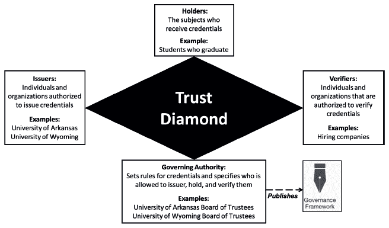

**图 8.1：信用证生态系统中的角色**

许多标准化机构、开源工作组和组织多年来一直在致力于 SSI 和可验证文凭。Trust over IP (ToIP)基金会是一个突出的组织。2020 年 5 月，由 27 个组织（包括阿肯色大学的区块链卓越中心）成立，ToIP 的使命是提供一个强大、共同的互联网规模数字信任标准和完善架构。ToIP 作为开源社区由 Linux 基金会管理。ToIP 确定了 11 个 SSI 原则，其中许多我们已经在讨论中——去中心化、用户控制和代理、可验证性和真实性、隐私和最小披露（参见图 8.2）。SSI 模型的力量在于，任何需要文凭的东西都是 SSI 的一个用例，包括一个人、一个群体、一个组织、一个动物、一个物理物品、一个数字物品或一个逻辑物品。这就是 SSI 的第一个原则，代表原则。所以 SSI 模型不仅仅是关于人，尽管我们的两个用例确实集中在人类持有者上。

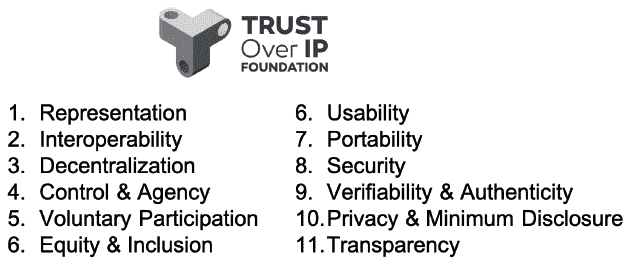

**图 8.2：SSI 原则**

*来源：[`trustoverip.org/wp-content/uploads/2021/10/ToIP-Principles-of-SSI.pdf`](https://trustoverip.org/wp-content/uploads/2021/10/ToIP-Principles-of-SSI.pdf)*

到目前为止，我们已经对 SSI 做出了很多承诺。实际上，SSI 仍然是一个成熟的技术，但本章中的两个案例已经设法满足了 SSI 的许多愿望（参见表 8.1）。

国民健康服务（NHS）是英国（UK）的公共资金国家卫生保健系统。NHS 开发了一个数字员工护照，以验证卫生专业人员的资格和资历，以便在 COVID-19 危机期间卫生工作人员可以迅速在医院之间移动。此应用程序利用了 SSI 的两个架构特性：

**1.** 在线关系是点对点的——无需账户和密码

**2.** 公钥基础设施是去中心化的——无需依赖可信任的第三方

该应用程序于 2020 年夏季上线，正是在那时疫情正在压力医院资源到极限。NHS 的解决方案将医生的平均入职时间从两天减少到几分钟。如果一个像 NHS 这样规模的组织——拥有超过 110 万员工，并在最高度监管的行业之一运营——能从 SSI 中获得价值，这表明许多其他组织也能获得价值。

| **企业** | **企业类型** | **应用** | **2022 年的状态** |
| --- | --- | --- | --- |
| 国民健康服务（NHS） | 公共部门 | 数字员工护照 | 2020 年夏季上线的试点项目已上线。102 家医院注册。NHS 计划扩大生态系统的范围和资格类型。 |
| iDatafy 的智能简历 | 私人公司 | 数字简历和求职平台 | 平台处于测试版，有 25 个发证机构，70 个验证机构和 17.5 万份智能简历创建（但不一定激活）。 |

**表 8.1：凭证的区块链应用示例**

iDatafy 的智能简历是一个数字简历，发证机构创建个人的资格，但个人控制自己简历的访问权限。智能简历平台不仅仅是一个经过认证的数字简历，它还是一个匹配合格求职者与招聘组织的求职平台。尽管这个案例研究没有使用点对点连接或去中心化 PKI，但它仍然满足了 SSI 的许多愿望，包括由区块链技术保障的可验证资格，个人控制谁看到他们的资格，最小化数据曝光，自愿参与和数据隐私。这个案例研究之所以引人入胜，是因为生态系统的规模。虽然 NHS 解决方案是在一个生态系统内采用，即 NHS 医院的系统，但智能简历正在将数百个发证机构和验证机构带到平台上。建立这个庞大的生态系统消耗了 iDatafy 的大部分精力，这将是竞争对手难以复制的。

8.2. 国民健康服务^(ii)

故事开始于 2019 年。NHS 正在与几个利益相关者合作，解决员工调动的问题。超过 1200 家 NHS 医院雇佣了超过 110 万人。每次员工从一个医院调到另一个医院，他们所有的凭证都必须重新验证，因为 NHS 医院系统独立运作，自行管理人力资源(HR)。员工必须填写多个表格来证明他们的身份、凭证和先前的就业情况，而且几乎一半的人需要亲自前往完成入职流程。此外，员工经常因为无法证明现有凭证而不得不重新参加培训。^(3)

考虑到 NHS 经常位列全球五大雇主之一，问题的规模非常大。NHS 每年入职或调动员工超过 100 万人次。例如，实习医生在培训期间平均调动 10 次。每年有超过 10 万个工作日花在验证实习医生的凭证上。损失的小时数价值约 2200 万英镑；更重要的是，医生在等待凭证验证期间没有照顾患者。^(4)

在 2019 年，NHS 制定了一个愿景，即*“使员工能够更容易地从一个 NHS 雇主跳槽到另一个”*。^(5)这个解决方案将依赖于一个数字员工护照来共享人力资源记录，以及法定和强制性记录。员工可以将他们的凭证保存在智能手机上，并控制谁可能会看到它们。该愿景是：

• 所有员工都将有权访问数字员工护照。

• 所有劳动力（HR）系统都将具有互操作性。

• 所有员工都将经历更高效、更集中的入职培训，认可之前的培训和经验。^(6)

NHS 设想，从长远来看，员工的数字钱包将汇总并持有多个凭证。它预见了一个基于开放标准和开源软件的可互操作性解决方案，从而避免了供应商锁定。例如，NHS 试图避免要求员工购买特定手机或依赖单一供应商的数字钱包。出于这些原因，NHS 对 SSI 产生了兴趣，并采用了 WC3 的可验证凭证标准，用于凭证的数字表示，以及 OpenID Connect 标准用于在线身份验证。^(7) 图 8.3 展示了这个应用的信任钻石。

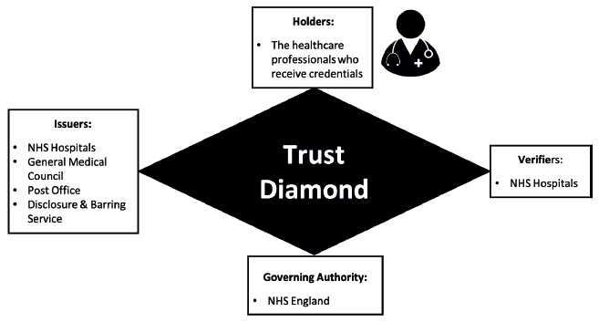

**图 8.3：数字员工护照申请的信任钻石**

英格兰国民医疗服务体系（NHS England）是主要的**监管机构**。NHS England 要求医生在它的医院工作需具备各种资格证明，比如国家认可的身份证明（如护照）、英国医学总会（GMC）的职业注册执照、具体的医学证书（如高级生命支持、传染病学）、以及犯罪记录查询服务（DBS）的背景调查，还有之前的就业证明。医生（及其他医疗专业人员）是这些资格证明的**持有者**。医院、GMC、邮局和 DBS 作为**发证机构**，但在医疗专业人员开始在医院工作后，医院就变成了**验证机构**。另外，每家医院在雇佣任何新员工之前都需要验证其资格证明，即便是那些已经在其他 NHS 医院工作过的员工。

国民医疗服务体系（NHS）组建了一个最小可行性生态系统（MVE）来构建试点解决方案。MVE 包括了 NHS England、NHSX^(iii)、英国医学总会（GMC）、国民医疗服务信托（NHS trusts，如布莱克浦教学医院、国民医疗服务基金会信托）以及技术提供商 Accenture、IBM、Oracle、微软、Evernym（后被 Avast 收购）和 Truu。技术提供商负责试点解决方案的不同部分。例如，Evernym 和 Truu 构建了 SSI 数字钱包，而微软提供基于 Azure 的云服务。MVE 花了九个月时间记录变革前后的流程。2019 年的 NHSX 试点在 COVID-19 爆发前刚刚准备好，但疫情的爆发加剧了员工入职的紧迫性，从而加速了推广。NHS 预期由于 COVID-19，员工流动性需求将加剧，并且将会建设许多带有重症监护床和呼吸机的新设施。^(8)

正式版本，即所谓的“COVID-19 数字员工通行证”，于 2020 年夏季初期开始推广。COVID-19 数字员工通行证之所以这样命名，是因为它部署的目的是在疫情期间快速验证技能和资格，它并没有捕捉或追踪 COVID-19 的免疫状态。该解决方案包括许多组成部分，如与人力资源系统接口等，但在这章节，我们重点关注边缘技术如何自动化信任钻石。具体来说，我们涵盖了 SSI 数字钱包以及使用区块链技术的公钥基础设施（PKI），用于机器验证资格。

对于生产试点项目，NHS 采用了 Evernym 公司的 SSI 钱包，名为 Connect.me。图 8.4 展示了部分用户界面。当然，图中显示的是虚构数据，因为分享真实数据会违反 SSI 的隐私原则。第一张屏幕显示了点对点连接，它取代了账户和密码。第二张屏幕显示了持有者的凭证。这些凭证是由授权的发行者创建的，他们邀请持有者将这些凭证上传到持有者的钱包中。第三张屏幕截图显示了持有者如何与验证者分享凭证。我们将在一分钟内解释这一切是如何从流程角度工作的。

SSI 解决方案依赖于一个数字信任注册表，这几乎总是一个公共区块链支持的注册表。它的主要用途是作为去中心化公共密钥基础设施（PKI）。在 SSI 之前，发行者和验证者依赖于称为证书权威（CAs）的可信第三方来认证数字签名。正如我们在第三章中学到的，数字签名使用公钥来验证，只有拥有私钥的发件人才能发送该消息。PKI 也用于确保用户正在连接到正确的网站。CA 在他们的中心化注册表上存储组织的公钥。正如大多数持有者不喜欢他们的账户和密码由组织控制一样，大多数发行者和验证者也不喜欢证书权威控制他们的公钥。SSI 允许发行者和验证者控制自己的公钥，这些公钥由一个去中心化的 PKI 管理。^(9)

对于 NHS 的数字员工通行证，只需要在去中心化注册表中存储两件事：管理机构和发行者的公钥以及凭证的数据格式（称为架构）。NHS 选择使用 Sovrin 网络进行去中心化 PKI。Sovrin 基金会是一个非营利组织，负责管理 Sovrin 网络并提供支持，包括网络的开源治理、运营和社区参与。它使用分布式账本技术。PKI 分布在六大洲的 80 多个授权节点网络中。Sovrin 网络是一个公共授权的区块链，意味着任何人都可以使用它，但你需要获得许可才能运行验证节点。^(10)

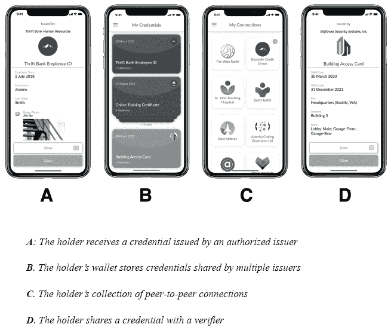

**图 8.4：SSI 钱包示例**

来源：[`www.evernym.com/wp-content/uploads/2020/10/connectme-ui-1024x476.jpg`](https://www.evernym.com/wp-content/uploads/2020/10/connectme-ui-1024x476.jpg)

为了设置应用程序，作为监管机构的 NHS 英格兰在 Sovrin 网络上进行了第一次 entries，以公布其公钥和数据模式。接下来，每家加入的医院都在 Sovrin 网络上创建并发布其公钥到信任注册表。当一家医院扮演凭证的**发行者**时，该医院的应用程序使用 NHS 英格兰的数据模式来格式化凭证，并用医院的私钥签署数字凭证。当一家医院扮演凭证的**验证者**时，其应用程序在 Sovrin 网络上查找公钥，以确保凭证是由授权的发行者签署的。私钥和凭证都存储在 SSI 数字钱包的本地。要明确的是：凭证 NOT 存储在公共注册表上，持有者不需要发布公钥。这是对区块链的一种非常轻量级的使用。在幕后，有一些新的使能技术，其中最值得注意的是一个新的标识符类型，称为去中心化身份（DID）。请参阅词汇表以了解关于 DID 的更多信息。

我们用一个虚构的场景来了解在应用程序中如何发放、持有和验证凭证。朱莉娅·马登博士将从牛津的一家医院调至伦敦的一家医院。在图 8.5 中，马登博士的第一站是牛津的人力资源部门。人力资源工作人员感谢她的服务并问道：“在您搬到伦敦之前，您想尝试一个只需几分钟的新数字入职流程，还是您更喜欢需要几天的人工流程？”人力资源工作人员还解释了额外的优势，比如能在手机上方便地携带所有必需的凭证，在手机丢失或损坏的情况下备份和恢复凭证，以及控制谁可以看到她的凭证。马登博士同意尝试新的应用程序。人力资源工作人员指导马登博士从苹果或谷歌下载 Evernym 的 Connect.Me SSI 数字钱包应用。下一个关键步骤是**身份绑定**，以确保为马登博士创建凭证。人力资源工作人员从员工数据库中检索信息，包括与医院数据库中的马登博士照片进行验证。

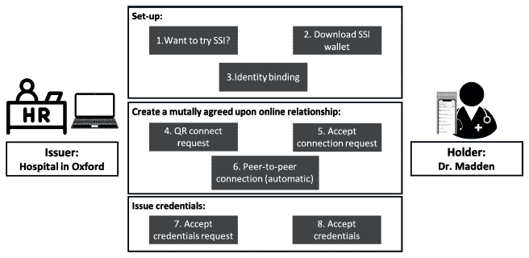

**图 8.5：离职员工人力资源转移流程**

一旦确认了个人的身份，下一步就是建立牛津医院和马登博士之间的关系。人力资源部门向马登博士发送了一个二维码，以请求点对点连接。二维码包括医院的公钥和连接邀请。可以把二维码看作是这家医院的某种公共电子邮件地址和电子邮件邀请。她接受邀请后，马登博士在 SSI 钱包上扫描二维码，在每个钱包内部建立一个独特且私有的点对点连接。这一切都是自动的，无需账户或密码。钱包跟踪这些关系，双方都有相同的力量，当他们想要时可以删除这些关系。

然后，人力资源人员向马登博士的 SSI 钱包发送了一个上传她的验证资质的请求。这些资质是从人力资源系统中提取的，并格式化为 SSI 应用程序所需的格式。在马登博士接受邀请之前，她的资质不会添加到她的 SSI 钱包中。与加密货币钱包不同，在加密货币钱包中，发送者可以在不经持有者同意的情况下将加密货币空投到持有者的数字钱包中，持有者完全控制他们连接的人和他们 SSI 数字钱包中的数据。她接受了邀请，*voilà*，她现在有一个方便的地方，可以控制自己的公民身份证明、医疗执照、专业执照和犯罪背景调查。

马登博士抵达伦敦的新工作岗位，并与人力资源部门会面。人力资源工作人员很高兴马登博士选择使用 SSI 应用程序进行入职，因为她的资质可以在几分钟内得到验证（见图 8.6）。首先，人力资源部门向她发送了一个连接请求。马登博士在手机上接受邀请后，她的 SSI 钱包现在跟踪着与牛津的前医院和伦敦的新工作地点之间的两种点对点关系。接下来，人力资源部门要求马登博士证明她的资质。她打开应用程序，将她的验证资质发送给人力资源部门。验证器的应用程序不仅仅是接受马登博士的资质，首先向 Sovrin 网络发送请求，以从牛津的医院获取公钥，以验证只有它才能创建马登博士的资质。现在马登博士准备开始工作了。

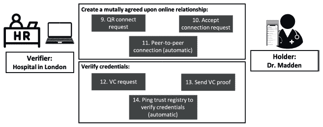

**图 8.6：新来的人力资源工作人员转移过程**

NHS 成立了一个支持中心，通过其商业服务组织协助护照采用者解答任何问题、关注或问题。该中心提供三个级别的支持。最常见的问题是一些医院区域内缺乏手机服务覆盖等小的连接问题。

截至 2022 年 3 月，已有 102 家 NHS 医院注册使用该系统。^(11) NHS 没有透露采用该系统的员工人数。

NHS 概述了迄今为止的积极体验，包括：

• **员工控制:** 员工可以控制自己的数字身份、雇佣检查、凭证和核心技能培训。

• **员工赋权:** 在每一步员工都可以被授权接受、拒绝和分享信息。

• **透明度:** 员工知道谁查看了他们的信息以及出于什么目的，确保他们的隐私和安全。

• **单一真相源:** 发放一份可验证的凭证，并且具有互操作性，减少了重复劳动。

• **节省时间：** 不是花费几天时间进行登机，整个过程只需要几分钟。

• **有效数据:** 验证者现在有一种机器可读的方式来自动验证持有者的声明。

• **更好的医疗服务:** 医疗提供者能更快地专注于病人的护理业务。^(12)

在应用程序的第一个阶段，NHS 医院运行在**传递性信任**的属性上。如果医院 A（如我们情景中的牛津医院）验证了一位医生拥有 GMC 专业注册许可证，它就会发出该许可证的可验证凭证。网络中的其他医院可以使用这个验证作为医生有许可证的证明。在未来的版本中，生态圈将扩大到包括 GMC、邮局、DBS、免疫接种提供者和其他发证机构。NHS 还计划采用多个钱包以防止供应商锁定，并将身份绑定扩展到包括生物特征。

图**8.7** 将数字员工通行证映射到第三章开发的区块链应用框架。此图只捕获了端到端解决方案中与 Sovrin 网络验证数字签名接触的部分。

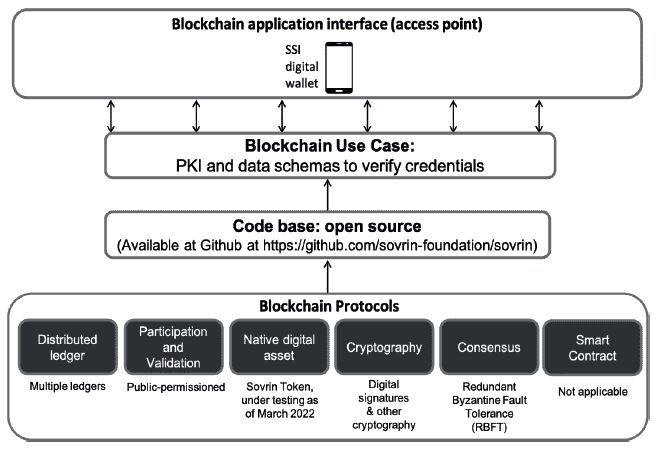

**图 8.7：Sovrin 网络映射到区块链应用框架**

**分布式账本。** 根据 Sovrin 基金会技术白皮书，Sovrin 网络维护四个分布式账本，每个账本都结构化为一系列序列化的交易：

**1.** *“**身份账本** 是主账本——记录 Sovrin 身份所有者写入的所有身份记录的系统。*

**2.** ***池账本** 是记录在任何给定时间点被允许作为验证者或观察者节点的 Sovrin 节点的系统。池账本存储了节点在投票账本上的投票结果。这个账本在验证节点发现中扮演着关键角色。*

**3.** ***投票账本** 是受托人和守护者之间举行投票以提出、确认或撤销不同权限的地方，例如，是否允许一个节点作为验证者或观察者节点。*

**4。** **配置账本** 保存由 Sovrin 基金会技术治理委员会设置并由理事会批准的网络级配置数据。例如：需要多少受托人投票才能批准新受托人。需要多少监护人投票才能批准新监护人。节点发布吞吐量指标时应使用的时间间隔。^(13)

Sovrin 网络的身份账本存储公钥、格式化凭证的数据架构、发行者轻松撤销持有者凭证的撤销注册表，以及持有者轻松撤销访问权限的政策，例如在智能手机丢失的情况下。账本对公众开放，可在[`indyscan.io/txs/SOVRIN_MAINNET/domain`](https://indyscan.io/txs/SOVRIN_MAINNET/domain)或[`sovrin-mainnet-browser.vonx.io/`](https://sovrin-mainnet-browser.vonx.io/)查看。要查找 NHS 的交易，请搜索 NHS-X COVID-19 EO。^(14)

**原生数字资产。** Sovrin 的原生数字资产称为 Sovrin 代币。截至 2022 年初，它仍处于测试阶段。将来，它可能用于为 Sovrin 网络提供独立的支付选项。^(15)

**共识机制。** Sovrin 网络是一个公共受许可网络，这意味着任何人都可以提交交易，但只有授权的监护人才能运行验证节点。Sovrin 基金会与验证节点有法律协议。其共识机制是 RBFT（冗余拜占庭容错）协议的增强版。^(16) 观察节点被授权读取账本（参见图 8.8）。

**智能合约。** Sovrin 的技术文件没有提到智能合约。

**代码库。** 代码案例可在[`github.com/sovrin-foundation/sovrin`](https://github.com/sovrin-foundation/sovrin)找到。

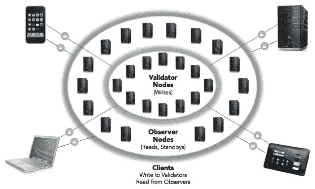

**图 8.8： incoming HR staff transfer process**

来源：Sovrin Foundation^([17)]

**应用接口。** Sovrin 网络通过一个 SSI 数字钱包进行访问。截至 2020 年 8 月，有三个 SSI 钱包与 Sovrin 网络兼容：Trinsic、Lissi 和 Connect.me。^(18)

无需 API。根据技术论文所述，“许多系统通过 API 交换验证声明中相同类型的信息。使用验证声明，数据是由呈现声明的个人或组织传达，而不是通过预编程的 API 集成。您的企业可以使用验证声明中的信息，而无需任何 API 集成，无需合同，甚至无需预先存在的业务关系。”^(19)]

**治理。**Sovrin 基金会董事会是关于 Sovrin 基金会决策的审批机构。*“成员们被选中代表来自多个行业和地理区域的多样化的专业知识，确保特定利益——无论是商业、政府或其他方面——不会过度影响决策。”^(20)*Sovrin 基金会发布了其 Sovrin 治理框架（SGF），这成为 Sovrin 网络的法律基础。^(21)SGF 工作组（SGFWG）开发了该框架，并由董事会批准。至于代码库的更改，Hyperledger Indy 负责管理账本代码库，Hyperledger Aries 负责管理钱包标准。更改必须得到 Hyperledger 技术指导委员会（TSC）的批准（参见第四章）。

8.3 iDatafy SmartResume

*“37%的‘糟糕的招聘’是由于资历或技能的误报造成的。”*

**PwC 研究^(22)**

在介绍 SmartResume 解决方案之前，我们必须首先更好地了解它旨在克服的招聘挑战。尽管所有先进的人力资源（HR）实践、投资和技术创新，我们仍未能充分解决这个招聘问题：***我们如何创建一个值得信赖的职场，高效地将合格的求职者与招聘组织匹配起来？***

沃顿商学院的乔治·W·泰勒管理教授和人力资源中心的负责人彼得·卡普 elli 在*《哈佛商业评论》文章*中很好地总结了这一挑战：“企业从未像今天这样进行过如此多的招聘。他们从未花过这么多钱来做这件事。而且他们做得比以往任何时候都差。”^(23)*

今天的招聘解决方案包括了诸如 CareerBuilder、Indeed、LinkedIn 和 Monster 等数百个职场和社会媒体平台。根据一项研究，社交媒体现在是招聘中使用最多的渠道：77%的招聘人员使用了 LinkedIn，其次是 Facebook（63%）和 Instagram（35%）。^(24)尽管这些解决方案具有方便和规模的优势，但它们同样让求职者和招聘人员感到沮丧。市场的双方都存在不信任现象。具体来说，招聘人员怀疑求职者报告的资历和技能，而求职者则怀疑招聘公司和平台是否能保护他们的数据隐私并公正地选择求职者。这些担忧是有道理的。

许多求职者在其简历上夸大自己的技能或做出虚假声明。*25* 招聘网站和社会媒体平台并不验证资质。因此，欺诈和夸大的简历仍然是个问题。最近的一项调查发现，75%的雇主抓到求职者在简历上撒谎。*26* 结果，招聘公司要投入大量资源来调查求职者的声明。验证过程拖延了招聘流程，增加了成本。平均下来，每雇佣一人公司要花费 4129 美元，*27* 而对于技术高超的工人，每个职位的成本可能高达 40000 美元。*28* 此外，诚实的求职者对这种默认的欺诈行为感到厌烦。

招聘组织和招聘人员在与选拔偏见作斗争。社交媒体和许多招聘网站平台暴露了人们的种族、性别、年龄、宗教、派别和生活方式选择，招聘人员可能会无意中根据这些数据而不是根据求职者的资格来排除候选人。一些大型公司已经转向人工智能（AI）来现代化招聘，但到目前为止，结果并没有减少偏见。例如，亚马逊的人工智能招聘工具旨在根据过去工程候选人简历中的关键词进行搜索。由于过去的工程师大多数是男性，AI 工具学会了偏好男性求职者。在性别偏见被揭露后，亚马逊放弃了这个工具。*29*

数据隐私保护对所有各方来说都是另一个担忧。招聘组织——尤其是那些 60%将招聘外包的公司——需要确保求职者的数据得到妥善处理。例如，在美国，家庭教育权利和隐私法（FERPA）保护学生教育记录的隐私。通常，学校在公开有关学生教育记录的任何信息之前，必须获得家长或合格学生的书面同意。越来越多地，像欧盟的通用数据保护条例（GDPR）和加利福尼亚消费者隐私法（CCPA）这样的数据隐私法规扩大了数据保护。尽管有这些法规，但许多招聘网站和招聘人员还是习惯性地收集求职者的信息，如电子邮件地址、电话号码、年龄、种族、照片和其他个人信息。*30*

就业获取挑战的规模是巨大的。根据美国劳工部数据，2021 年美国有 7560 万次就业招聘。^(31)平均而言，每个公司职位空缺都有 250 份申请，^(32)这表明招聘组织处理了大约 190 亿份申请。此外，这个过程并不总是成功结束；2021 年有数百万个职位空缺未能填补。^(33) 难道不是时候重新发明就业获取了吗？iDatafy 认为是时候了，因此开发了 SmartResume 解决方案，以恢复就业搜索过程中的信任。

2011 年在阿肯色州小石城成立的 iDatafy 公司，创建了 SmartResume 平台和职业网络，以增强人才招聘过程的信任。该平台通过防止申请人欺诈性声明、消除选择偏见并确保数据隐私合规性，来防止欺诈性声明。SmartResume 平台类似于 LinkedIn 或 Upwork，但具有由区块链技术保证的*验证*证书。文格尔的愿景是让 SmartResume 平台成为“*世界上最值得信赖的简历和认证职业网络。*”

为了启动职业网络，iDatafy 需要在招聘组织认为平台有价值之前吸引足够的发卡机构和持卡人。在 Beta 版本期间，平台对发卡机构和持卡人免费。在 Beta 版本期间，验证者也免费，但招聘公司最终将为在平台上连接、招聘和雇佣认证职业人才支付费用。

第一个认证组织是阿肯色大学的萨姆·沃尔顿商学院。2018 年，沃尔顿商学院即将启动区块链卓越中心（BCoE），学院院长马特·沃勒在寻找一个学院可以协助领导和开发实际解决方案的区块链项目。他在 2018 年 4 月沃尔顿学院首次**商业区块链大会**后不久遇到了文格尔。沃勒认为，SmartResume 认证学生的背景似乎是一个完美的契合：

*“如果你仔细想想，大学和学院已经颁发了数百年的文凭和成绩单，但他们实际上从未向学生发放过认证简历，尽管学院处于一个可以这样做值得信赖的权威地位。”*

**马修·沃勒**，阿肯色大学萨姆·沃尔顿商学院院长，**SmartResume**的首位采用者^(34)

沃尔 er 与沃尔顿学院的领导以及校园内外的领导召开会议，确定大学在该计划中的角色，包括校园首席信息官、经济发展副校长、BCoE 的创始主任、信息系统系（ISYS）的系主任以及注册处的助理副校长。虽然大多数领导都支持这个想法，但他们最初担心，鉴于校园正忙于企业资源计划（ERP）的更换，再增加一个 IT 项目。他们不想为从即将被更换的系统中提取学生记录而建立一个接口。旺格尔倾听了。iDatafy 为发行者创建了一个简单的数据提取和验证流程，最初使用电子表格，同时 iDatafy 为可验证的资格证进行清理和格式化。

iDatafy 意识到，与其一次卖给一个校园，不如与阿肯色大学系统达成协议，从而更快地建立生态系统——阿肯色大学系统是该州公立高等教育机构的中央化管理。阿肯色大学系统的学术事务副校长迈克尔·穆尔看到了这个价值。*“从阿肯色大学系统和 eVersity 的角度来看，有些事情对我有吸引力，”*他说。*“这个平台为提升一些可能不会受到大公司伙伴关注的学生提供了机会。另外，我们的学生使用这个平台是免费的。”* iDatafy 于 2019 年与阿肯色大学系统签署了一份谅解备忘录（MoU）。到 2020 年 3 月，阿肯色大学系统的六个校园正在发行 SmartResume。^(35)

除了公立教育发行者外，其他发行者也加入了该平台。例如，位于阿肯色州的 Forge Institute 提供网络安全培训，并现在可以将成功完成其项目的人员的网络安全资格证发行到 SmartResume 平台上。iDatafy 也参与了美国教育部提供的 1350 万美元的赠款，该赠款由阿肯色大学和美国缩短大学共同参与，用于发行 SmartResume 给完成阿肯色州基地项目的培训参与者。^(36) 到 2022 年初，已有 25 个发行者创建了 17.5 万个认证的 SmartResume，并有 70 个雇主签约加入。

下一阶段将扩大 SmartResume 在全国的规模。2022 年 2 月，iDatafy 与全国学生清账所合作，将清账所的 Myhub 数字钱包中的综合学习记录加载到 SmartResume 平台。数百万学生将能够通过 Myhub 按需激活 SmartResume。

图 8.9 将 SmartResume 平台映射到信任钻石上。iDatafy 作为 **治理机构** 管理该平台。在 第二章 中，我们称这为中立促成者或创始人领导模式。为确保信任，SmartResume 已经获得了 IMS 全球学习联盟的全面学习记录（CLR）和数据隐私认证。IMS 全球学习联盟是一个非营利组织，致力于通过扩大规模和提高教育参与度与成就的实惠性来推进技术。^(37) iDatafy 的解决方案也符合 FERPA 规定。

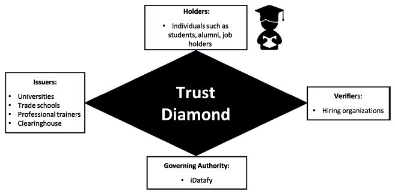

**图 8.9：SmartResume 平台的信任钻石**

**发证机构** 是颁发证书的机构，如学院、大学、职业学校、专业协会、 licensing 局和政府部门。在 SmartResume 平台上，发证机构代表个人创建 SmartResume，通过认证教育学位、课程作业、荣誉、活动、奖项、经验、执照、隶属关系、研究、技能、推荐信或其他认证。这些认证作为通过区块链技术保障的安全不可篡改徽章出现在个人的 SmartResume 上（参见 图 8.10）。

作为一个关键的设计决策，认证机构选择了证书的名称和类型。这样，认证机构通过推广他们的品牌来获得价值。例如，沃尔顿学院选择了“领导力沃尔顿”作为其之一的证书。领导力沃尔顿是一个面向本科商业学生的专业发展项目，为他们提供独特的学术、领导力和职业发展机会，专门设计来引导他们走向终生的职业成功。^(38)

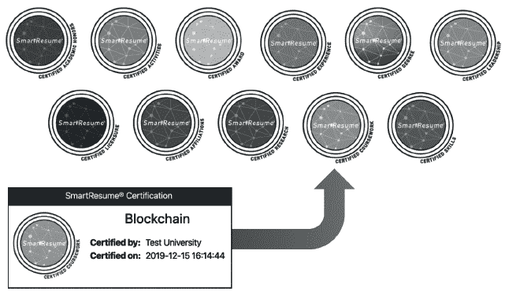

**图 8.10：SmartResume®的认证徽章示例**

***每个认证都是存储在区块链上的不可篡改账本上的安全记录***

通过将认证机构置于控制地位，SmartResume 平台防止用户声称他们未获得的证书，从而保护组织的品牌。他们还通过一次性认证一个人，而不是每次人们更换工作时重新确认证书，从而提高了效率。对于教育机构来说，加入 SmartResume 平台的额外好处是，它为与校友建立联系提供了一种有意义的途径。对于劳动力技能认证机构——比如培训和认证卡车司机、蒸汽管安装工、管道安装工、自动喷水系统安装工以及供暖、通风和空调（HVAC）技术人员的组织——该平台将为招聘公司提供更好的途径，以找到合格的人才。

**持有者**，如学生、校友、在职人员和求职者，无法自行创建 SmartResume。相反，必须由认证组织代表个人创建。然而，个人必须选择加入 SmartResume 平台；如果个人没有激活他们的 SmartResume，任何第三方都无法访问。激活简历的个人可以补充他们的个人 SmartResume，如职业目标、爱好和兴趣。招聘组织可以通过区块链徽章确定哪些资格经过了认证组织的验证，以及哪些条目是由持有者添加的。每个个人只有一个 SmartResume，可能包含来自许多不同组织的验证资格。个人控制着他们的职业匹配偏好，并可以授予或拒绝招聘组织完整的访问权限。

招聘组织是**验证者**，包括任何寻找合格员工的机构。招聘组织（或外包招聘人员）仅根据应聘者的技能寻找合格人选，因为所有如姓名和性别的人口统计和个人信息都被隐藏起来，以防搜索偏见。图 8.11 展示了招聘组织看到的简历样本。如果某个组织对与某个人建立联系感兴趣，平台会向该个人发送电子邮件请求。招聘组织通过拥有合格的应聘者池来提高效率，而且他们不再需要给应聘者简历上的每个组织打电话来核实资格。

现在让我们揭开面纱看看内部情况。SmartResume 平台是一个混合平台，包括基于网页的界面、传统技术和受权限的区块链账本。iDatafy 选择混合解决方案是为了利用区块链技术和传统技术最擅长的特性。选择区块链技术是为了在多方环境中创建一个防篡改的审计跟踪，以验证经过验证的资格。传统数据库则被选用于高绩效和可扩展性过程，例如寻找工作和求职者、用辅助信息增强 SmartResume、将资格映射到标准职业代码以及保护个人信息。首席技术官（CTO）安迪·格里贝尔解释说，“我们选择了混合解决方案。区块链技术为多方提供了验证和信任资格真实性的能力。但将整个解决方案建立在区块链上会是个错误，因为它会运行缓慢。”*从用户的角度来看，所有组件都能无缝运行。人们根据他们的角色，如雇主、教育机构、劳动力技能认证机构和个人，在平台上操作。*

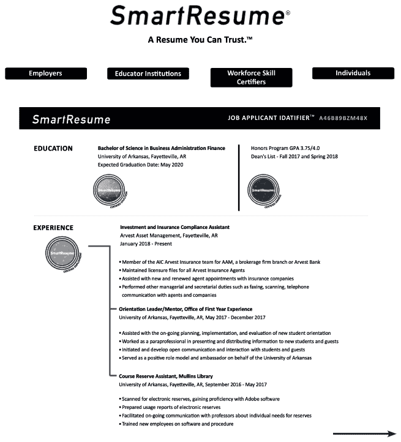

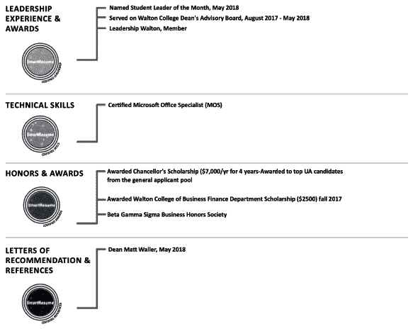

**图 8.11：招聘组织查看的 SmartResume®示例**

*来源：经 iDatafy 许可使用*

**图 8.12](#f_8_12) 将 SmartResume 平台的区块链部分映射到区块链应用框架。iDatafy 选择了一个私有-授权的区块链，网络加入仅限于邀请，只有授权成员验证交易。2018 年，iDatafy 考察了几种授权的区块链，但最终选择了 Hyperledger Fabric。iDatafy 认为当时它最具成熟度和动力。然而，如果出现更先进的技术，iDatafy 可以切换平台。iDatafy 的 CTO Andy Griebel 说，“我们的设计是灵活的；如果需要，我们可以转向另一个平台。”*

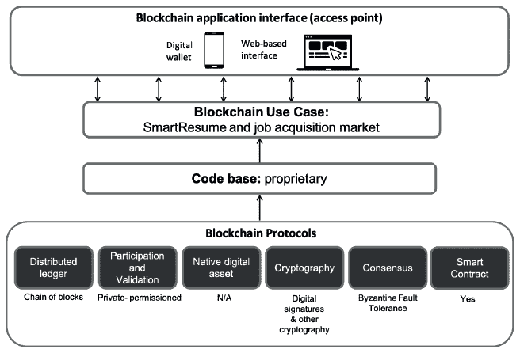

**图 8.12：SmartResume 映射到区块链应用框架**

**分布式账本。**Hyperledger Fabric 将账本结构化为区块链。为遵守隐私法规，个人信息不会存储在区块链账本上。相反，每个 SmartResume 与唯一的求职者 Idatafier^(TM) 相关联。iDatafy 只在与每个凭证相关的区块链账本上存储最少的信息，包括唯一的求职者 Idatafier^(TM)、认证组织、认证类型、日期和时间戳。

**共识：**Hyperledger Fabric 使用拜占庭容错（参见第三章）。Hyperledger Fabric 中的共识分为三个阶段：背书、排序和验证：

*1. “背书由策略驱动（需要 m 个中的 n 个签名），参与者对交易进行背书.*

*2. 排序阶段接受背书的交易，并同意按顺序提交到账本.*

*3. 验证阶段对一系列排序的交易进行验证，包括检查背书策略和双重支付。“^(39)*

**原生数字资产：**Hyperledger Fabric 不使用原生数字货币。

**智能合约：**Hyperledger Fabric 具备智能合约功能。

**治理：**iDatafy 作为平台的治理机构，最好被描述为中立 facilitator 或创始人领导模式。iDatafy 还为其 SmartResume 平台选择了创始人领导模式，iDatafy 作为仁慈的独裁者，负责推动成果。iDatafy 是一个中立方，不对 SmartResume 的任何合作伙伴构成竞争，因为它不是一个认证或招聘组织。Wengel 说，“iDatafy 是一种中介，但我们也能保持高度专注，我认为这种专注已经非常明确，推动新事物需要持久性。”*

**用户界面。** 用户界面不断演变和完善，但图 8.13 提供了 2022 年 3 月个别简历持有者的视图示例。学生也将能够通过 Myhub 数字钱包访问该平台。

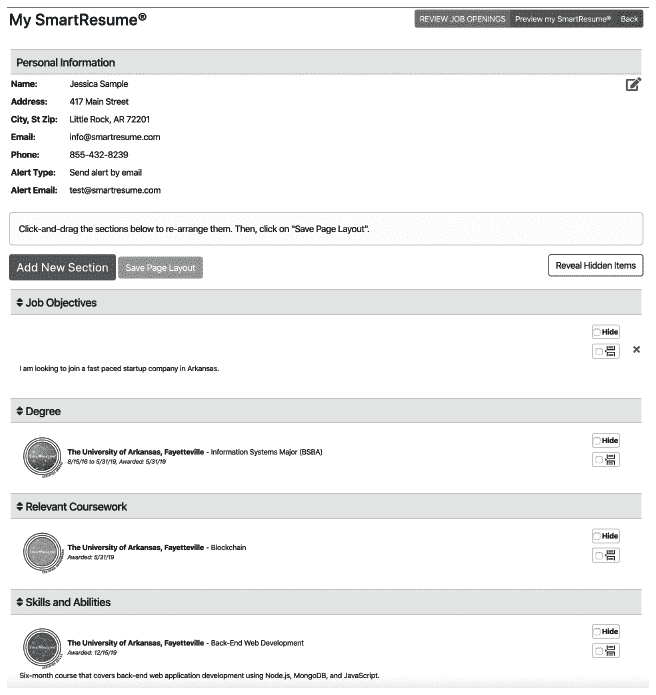

**图 8.13：SmartResume®持有者的屏幕截图**

8.4. 结论

在本章中，我们讨论了 SSI 作为一种模型，用于去中心化和自动化关于主题的凭证的发行、持有和验证。我们展示了两个早期采用者的案例。两个案例都确保凭证由授权的发行者创建，与持有者分享，并向验证者证明（可验证的凭证）。两个解决方案都将持有者置于与谁分享其凭证的控制之下。两个解决方案都将分布式账本与传统的记录系统相结合；NHS 将数字员工护照与其人力资源系统集成，iDatafy 将区块链应用程序与更传统的技术集成。与 SmartResume 平台相比，NHS 案例更接近 SSI 的完整愿景——点对点连接和去中心化的 PKI。

截至 2022 年，更多的 SSI 应用程序已投入生产，包括由世界粮食计划署为叙利亚难民设立的 app；创建 COVID-19 状态凭证（疫苗接种、检测和批准恢复）的数字健康通行证；以及加拿大政府发放的商业许可证。^(40) 但 SSI 仍然是一项年轻的 technology。在 2021 年，Gartner 将“SSI 去中心化身份”置于其著名的炒作周期顶峰的过高期望中。^(41) 这似乎是一个正确的判断。毕竟，SSI 是一个生态系统玩法。而生态系统是难以建立且进展缓慢的。SmartResume 案例的主要教训是，建立生态系统消耗了 iDatafy 的大部分时间和资源，但这为进入设置了障碍，因为竞争对手将无法轻易复制它。iDatafy 的创始人兼首席执行官 Dave Wengel 说：

*“显然，有人在做区块链文凭、区块链成绩单和区块链资格匹配。据我们所知，全世界范围内，还没有人建立一个经过认证的简历。即使有人复制我们所做的一切，我们也知道建立一个社区有多么困难。”*

随着时间的推移，更多的组织将建立 SSI 能力。技术的升级版本将被发布，今天处于临时状态的标准将得到最终确定。Gartner 预测，SSI 将在 2023 年至 2026 年之间走出“失望之谷”。但正如我们在第四章中提到的，不同行业及其内部公司采用技术的方式各不相同。

引用

^(1) Douglas, A. (2020). Are Password Resets Costing Your Company? Retrieved November 3, 2021 from [`www.bioconnect.com/are-password-resets-costing-your-company/`](https://www.bioconnect.com/are-password-resets-costing-your-company/)

^(2) National Student ClearingHouse. Your Organization’s Reputation on the Line: The Real Cost of Academic Fraud. Retrieved March 15, 2022 from [`nscverifications.org/wp-content/uploads/2016/06/CostOfAcademicFraud.pdf`](https://nscverifications.org/wp-content/uploads/2016/06/CostOfAcademicFraud.pdf)

^(3) The NHS (2020/2021). We are the NHS: People Plan for 2020/2021\. Retrieved December 2, 2021, from

^(4) *The Independent* (August 4, 2021). NHS entrepreneurs are revolutionising staffing checks. Retrieved October 31, 2021, from [`www.independent.co.uk/news/business/business-reporter/nhs-entrepreneurs-revolutionise-staffing-checks-b1883780.html`](https://www.independent.co.uk/news/business/business-reporter/nhs-entrepreneurs-revolutionise-staffing-checks-b1883780.html)

^(5) Graham, P. (2021). Enabling Staff Movement & Digital Staff Passports, NYHDIF Conference presentation, November 11/12, 2021.

^(6) Graham, P. (2021). Enabling Staff Movement & Digital Staff Passports, NYHDIF Conference presentation, November 11/12, 2021.

^(7) The W3C was founded in 1994 by Tim Berners-Lee, inventor of the World Wide Web. W3C oversees W3C/IETF standards for the Internet protocol suite; communities include the Decentralized Identifier Working Group and the Verifiable Credentials Working Group. The Verifiable Credentials Data Model is available at: [`www.w3.org/TR/vc-data-model/`](https://www.w3.org/TR/vc-data-model/) OpenID Connect allows verification of user identity based on the authentication performed by an Authorization Server, as well as to obtain the user’s basic profile information in an interoperable. See: [`openid.net/connect/`](https://openid.net/connect/)

^(8) Microsoft (March 15, 2021). The NHS rapidly meets clinical demands using verified credentials. Retrieved January 19, 2022, from [`customers.microsoft.com/en-us/story/1348169400682329017-nhs-foundation-trust-health-provider-m365`](https://customers.microsoft.com/en-us/story/1348169400682329017-nhs-foundation-trust-health-provider-m365)

^(9) Allen, C., Brock, A., Buterin, V., Callas, J., Dorje, D., Lundkvist, C., Kravchenko, P., Nelson, J., Reed, D., Sabadello, M., Slepak, G., Thorp, N., and Wood, H. (2015). Decentralized Public Key Infrastructure. [`github.com/WebOfTrustInfo/rwot1-sf/blob/master/final-documents/dpki.pdf`](https://github.com/WebOfTrustInfo/rwot1-sf/blob/master/final-documents/dpki.pdf)

^(10) [`sovrin.org/`](https://sovrin.org/)

^(11) 参与医院的列表，请参见[`beta.staffpassports.nhs.uk/registered-organisations`](https://beta.staffpassports.nhs.uk/registered-organisations)

^(12) 格雷厄姆，P.（2021）。《促进员工流动及数字员工通行证》，NYHDIF 会议演讲，2021 年 11 月 11/12 日。

^(13) Sovrin 基金会（2016）。《Sovrin 的技术基础》。2022 年 3 月 17 日取自[`www.evernym.com/wp-content/uploads/2017/07/The-Technical-Foundations-of-Sovrin.pdf`](https://www.evernym.com/wp-content/uploads/2017/07/The-Technical-Foundations-of-Sovrin.pdf)

^(14) [https://indyscan.io/txs/SOVRIN_MAINNET/domain?page=1&pageSize=50&filterTxNames=[]&sortFromRecent=true&search=C19EOJobRole](https://indyscan.io/txs/SOVRIN_MAINNET/domain?page=1&pageSize=50&filterTxNames=[]&sortFromRecent=true&search=C19EOJobRole)

^(15) Sovrin 基金会（2020 年 2 月 25 日）。[`sovrin.org/sovrin-foundation-launches-test-token-for-decentralized-identity-network/`](https://sovrin.org/sovrin-foundation-launches-test-token-for-decentralized-identity-network/)

^(16) [`www.evernym.com/wp-content/uploads/2017/07/The-Technical-Foundations-of-Sovrin.pdf`](https://www.evernym.com/wp-content/uploads/2017/07/The-Technical-Foundations-of-Sovrin.pdf)

^(17) Sovrin 基金会（2016）。《Sovrin 的技术基础》。2022 年 3 月 17 日取自[`www.evernym.com/wp-content/uploads/2017/07/The-Technical-Foundations-of-Sovrin.pdf`](https://www.evernym.com/wp-content/uploads/2017/07/The-Technical-Foundations-of-Sovrin.pdf)

^(18) Sovrin 基金会（2020 年 8 月 27 日）。《互操作性系列：Sovrin 守护者在钱包可移植性方面取得突破》。2022 年 3 月 17 日取自[`sovrin.org/sovrin-stewards-wallet-portability/`](https://sovrin.org/sovrin-stewards-wallet-portability/)

[Sovrin Foundation (2018). Sovrin™: A Protocol and Token for Self-Sovereign Identity and Decentralized Trust](https://sovrin.org/wp-content/uploads/Sovrin-Protocol-and-Token-White-Paper.pdf)（^(19)）：Sovrin Foundation（2018 年）：Sovrin™：用于自主身份和去中心化信任的协议和代币。

[Sovrin Foundation Board of Trustees](https://sovrin.org/team/)（^(20)）：Sovrin Foundation 董事会。

[Sovrin Foundation Governance Framework](https://sovrin.org/library/sovrin-governance-framework/)（^(21)）：Sovrin Foundation 治理框架。

[Ledger Insights (2019). PwC launches blockchain credentialing solution](https://www.ledgerinsights.com/pwc-blockchain-smart-credentials/)（^(22)）：PwC 推出基于区块链的凭证解决方案。

[Cappelli, P. (2019). Your Approach to Hiring is All Wrong, Harvard Business Review](https://hbr.org/2019/05/recruiting)（^(23)）：你的招聘方法全错了，哈佛商业评论。

[Jobvite (2018). Recruiter National Survey](https://www.jobvite.com/wp-content/uploads/2018/11/2018-Recruiter-Nation-Study.pdf)（^(24)）：Jobvite（2018 年）全国招聘人员调查。

[CareerBuilder (2017). 75% of HR Managers Have Caught a Lie on a Resume](http://press.careerbuilder.com/2017-09-14-75-of-HR-Managers-Have-Caught-a-Lie-on-a-Resume-According-to-a-New-CareerBuilder-Survey)（^(25)）：根据 CareerBuilder 的新调查，75%的人力资源经理在简历上发现过谎言。

[Turczynski, B. (January 9, 2020), 2020 HR Statistics: Job Search, Hiring, Recruiting & Interviews, Zety](https://zety.com/blog/hr-statistics#job-search-statistics)（^(26)）：Zety 发布的 2020 年人力资源统计：求职、招聘、招聘与面试。

27 全国学生证明中心 (2016 年). 学术欺诈的真实成本. [`nscverifications.org/wp-content/uploads/2016/06/CostOfAcademicFraud.pdf`](https://nscverifications.org/wp-content/uploads/2016/06/CostOfAcademicFraud.pdf)

28 Hamilton, I. (2018 年 10 月 10 日). 亚马逊建立了一个 AI 工具来招聘人员，但由于它对女性有歧视，不得不将其关闭, Business Insider, [`www.businessinsider.com/amazon-built-ai-to-hire-people-discriminated-against-women-2018-10`](https://www.businessinsider.com/amazon-built-ai-to-hire-people-discriminated-against-women-2018-10)

29 Fatemi, F. (2019 年 10 月 31 日). AI 如何颠覆招聘, *福布斯*, [`www.forbes.com/sites/falonfatemi/2019/10/31/how-ai-is-uprooting-recruiting/#43c6540f46ce`](https://www.forbes.com/sites/falonfatemi/2019/10/31/how-ai-is-uprooting-recruiting/#43c6540f46ce)

30 Smits, J. (2018 年). 招聘中的隐私——保护你的候选人数据, [`cammio.com/blog/privacy-in-recruitment/`](https://cammio.com/blog/privacy-in-recruitment/)

31 美国劳工统计局 (2022 年 3 月 9 日). 职位空缺和劳动力流动总结. 报告 USDL-20-0243. [`www.bls.gov/news.release/jolts.nr0.htm`](https://www.bls.gov/news.release/jolts.nr0.htm)

32 Turczynski, B. (2020 年 1 月 9 日), 2020 年人力资源统计: 求职、招聘、招聘与面试, Zety, [`zety.com/blog/hr-statistics#job-search-statistics`](https://zety.com/blog/hr-statistics#job-search-statistics)

33 美国劳工统计局 (2020 年 2 月 11 日). 职位空缺和劳动力流动总结. 报告 USDL-20-0243. [`www.bls.gov/news.release/jolts.nr0.htm`](https://www.bls.gov/news.release/jolts.nr0.htm)

^(34) 引用自 Adkison, M. (2020 年 2 月 18 日). U of A 与区块链公司合作推出创新的简历构建项目[`walton.uark.edu/insights/smart-resume.php`](https://walton.uark.edu/insights/smart-resume.php)。

^(35) Idatafy 新闻稿（2020 年 3 月 19 日）。UA 系统机构发布世界上第一个认证智能简历，2022 年 3 月 18 日从[`www.uasys.edu/news/ua-system-institutions-issue-worlds-first-certified-smartresumes/`](https://www.uasys.edu/news/ua-system-institutions-issue-worlds-first-certified-smartresumes/)检索

^(36) 阿肯色大学新闻稿（2021 年 2 月 15 日），U of A 与 Arkansans 合作进行培训项目，帮助受 COVID 影响的人，2022 年 3 月 18 日从[`news.uark.edu/articles/55950/u-of-a-partners-in-state-training-project-for-arkansans-hit-financially-by-covid`](https://news.uark.edu/articles/55950/u-of-a-partners-in-state-training-project-for-arkansans-hit-financially-by-covid)检索

^(37) IMS 全球学习联盟新闻稿（2021 年 5 月 17 日）。IMS 全球学习联盟成员实施以学习者为中心的标准，以展示教育成就的证据，2022 年 3 月 18 日从[`www.imsglobal.org/article/ims-global-learning-consortium-members-implement-learner-centered-standard-demonstrating`](https://www.imsglobal.org/article/ims-global-learning-consortium-members-implement-learner-centered-standard-demonstrating)检索

^(38) 沃尔顿领导力。 [`walton.uark.edu/career/leadership-walton.php`](https://walton.uark.edu/career/leadership-walton.php)

^(39) 超级账本基金会（2017）。超级账本架构，2022 年 3 月 18 日从`www.hyperledger.org/wp-content/uploads/2017/08/Hyperledger_Arch_WG_Paper_1_Consensus.pdf`) Russ Juskalian，《Jordan 难民营内的区块链运行内幕》（2018），技术评论，2018 年 4 月 12 日；Lacity，M.，和 Carmel，E.（2022）。“Token 经济中的可验证凭证，”在 Lacity，M.和 Treiblmaier，H.（编辑）的《区块链与 Token 经济：理论与实践》，Palgrave，伦敦。

^(41) 2021 年 8 月分布式身份成熟度。图片：[`emtemp.gcom.cloud/ngw/globalassets/en/newsroom/images/graphs/v2-hc-emerging-tech-2021.png`](https://emtemp.gcom.cloud/ngw/globalassets/en/newsroom/images/graphs/v2-hc-emerging-tech-2021.png)

* * *

^(i) 阿肯色大学治理网站：[`www.uasys.edu/leadership/`](https://www.uasys.edu/leadership/)

怀俄明大学治理网站：[`www.uwyo.edu/regs-policies/section-1-governance-and-structure/`](https://www.uwyo.edu/regs-policies/section-1-governance-and-structure/)

^(ii) NHS 案例由 Erran Carmel 共同撰写（请参阅贡献者）

^(iii) NHSX 是英国卫生与社会关怀部，NHS 英格兰和 NHS 改进之间的联合单位。

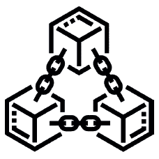

## 第九章

## 媒体商业应用

***内容简介：*** 像社交媒体这样的数字平台放大了假新闻的产生和传播。假新闻不仅威胁到我们对媒体的信任，而且对政治、商业、健康和社会产生了广泛的负面影响。我们举了一个例子，用一个叫做 ANSAcheck 的解决方案来验证真实新闻，这个解决方案是由意大利最大的新闻通讯社——AGenzia Nazionale Stampa Associata（ANSA）和世界最大的专业服务机构之一——Ernst & Young（EY）共同开发的。ANSAcheck 背后的区块链技术为合法新闻故事的来源、更新和转发提供了可验证的身份验证。该解决方案使用了以太坊和 Polygon。

学习目标：

定义假新闻。

• 描述人类偏见如何使人们容易受到假新闻的影响。

批评打击假新闻的解决方案，包括使用区块链技术。

• 描述 ANSAcheck 如何使用区块链防止假冒新闻。

• 提出防止假新闻的其他方法。

9.1. 假新闻问题

假新闻是指故意传播经核实为虚假的信息，伪装成真实的新闻故事。假新闻有很多种，包括旨在娱乐的新闻讽刺和讽刺。例如，奥森·威尔斯 1938 年对 H.G.威尔斯的《世界大战》的广播改编就是以严肃的广播格式作为娱乐。广播公司（CBS）、作家和演员惊讶地得知，超过一百万的听众认为它是一个实际的新闻简报。^(1)

除了娱乐之外，本章重点关注假新闻的制造，其中作者和观众之间没有隐含的理解，这个故事是编造的。我们研究了故意误导的假新闻。最常见的假新闻制造是**政治**的，旨在传播关于政治家和公共政策的虚假信息；**反科学**的，旨在传播关于外星人、疫苗、疾病、疗法和营养等方面的虚假信息；以及**经济**的，旨在操纵市场、股价，并销售欺诈性产品。^(2)

为了个人利益而创建和传播假新闻的做法并不新鲜。考虑一下过去这三个故事：

追溯到第一个世纪，屋大维成为罗马帝国的皇帝，部分原因是他制造了关于对手的假新闻。屋大维将马克·安东尼描绘成克娄巴特拉的傀儡，并发布了一份伪造的文件，声称安东尼的遗嘱要求他与托勒密王朝的法老们一起埋葬。^(3) 在古罗马，传播假新闻需要手工复制文件，并使用“praecones”（市宣读员），如图 9.1 所示。读者可能熟悉 praeco，这是 HBO 电视剧《罗马》中的一个角色。罗马市民面临着我们今天相同的挑战：他们如何知道新闻是否合法？

**图 9.1: 古罗马时期的报童传播新闻**

]

作为科学虚假新闻的一个例子，1835 年《纽约太阳报》的一名记者发表了多篇报道，称天文学家在月球上发现了一个文明，包括有蝙蝠翅膀的人类。许多人相信了这些故事，报纸的销量增加了 50%，这被认为是故事的真正目的。^(4)

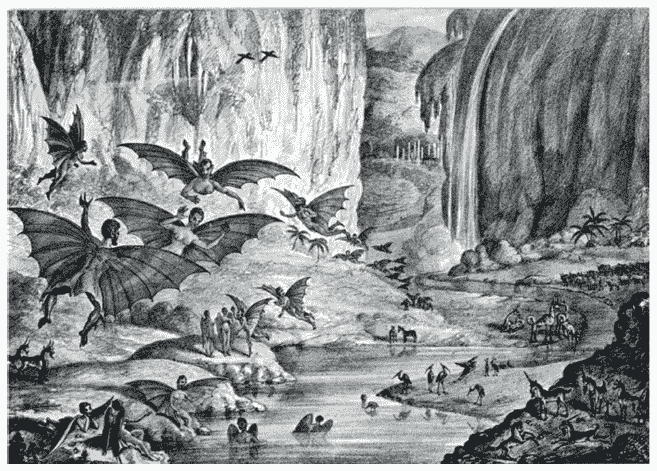

**图 9.2: 1835 年的人类蝙蝠翼生物骗局**

]

让我们来看一个操纵股票价值的虚假新闻的例子，在 1814 年，英国下议院的激进派成员、海军军官科奇兰勋爵与其他同谋者购买了 110 万英镑的英国政府债券。科奇兰随后散布拿破仑已死的虚假新闻，试图提高股价。（拿破仑一直活到 1821 年。）这条假新闻通过电报和许多英格兰酒馆的口头传播传给了英国海军部。这一策略成功了。股价飙升，直到骗局被揭露。科奇兰勋爵被监禁、罚款，并被剥夺了海军军衔。^(5)

快进到 21 世纪，数字技术的放大效应使得虚假新闻的产生和传播变得更加严重。如今，人类通过互联网搜索、对发布内容的评论，以及点击“喜欢”和/或“分享”迅速传播错误信息。

考虑一下 2016 年美国总统选举期间大量传播的假新闻故事。这些虚假故事绝大多数是支持唐纳德·特朗普和反对希拉里·克林顿的。^(6) 纽约大学和斯坦福大学经济学教授的一项研究发现，115 篇支持特朗普的虚假故事在 Facebook 上被分享了 3000 万次，41 篇支持克林顿的虚假故事被分享了 760 万次。^(7) 在顶级虚假故事中，有声称教皇方济各支持特朗普的故事，被分享或评论了 96 万次；以及维基解密确认希拉里·克林顿向 ISIS 出售武器的故事，有 78.9 万次分享。^(8) 这两个故事现在已经删除。根据 BuzzFeed 新闻，在 2016 年美国大选前几个月，Facebook 上关于假新闻故事的参与度（870 万）超过了真实新闻故事的参与度（730 万）。^(9) 另一项学术研究发现，在 2016 年选举前五个月，Twitter 上的 1.71 亿条推文中，有 25%是假的或严重错误的消息。^(10) 虽然大部分错误信息被归咎于英国政治咨询公司剑桥分析，^(11) 但根据美国参议院司法委员会听证会上提供的证词，俄罗斯在大选期间成功地在 Facebook 和 Twitter 上插入了假新闻。^(12) 学术学者进行了选举后的调查，以确定选民是否被假新闻影响，但假新闻曝光与投票行为之间的直接因果关系很难确定。

当然，假新闻并不仅限于美国，它是一个全球现象。在英国（UK），《独立报》在 2020 年报道，剑桥分析公司前商业发展总监布里特妮·凯瑟声称，至少有 68 个国家的选举中包含了与美国总统选举和 2016 年英国脱欧公投中相同的误导性策略。^(13)

假新闻故事对社会有严重的后果。假新闻削弱了公众对自由媒体的信心，而且，当被相信时，会导致公民被错误地告知。^(14) 2019 年一项超过 25,000 名互联网用户的全球调查发现，44%的人表示，由于假新闻，他们对媒体的信任下降了。^(15) 受到威胁的不仅是公众对媒体的信任；假新闻激化了社会冲突；导致了不良的健康后果（如为了预防 COVID-19 而吞下漂白剂）；助长了激进主义和恐怖主义；破坏了选举的完整性；操纵了市场；还有更多。^(16) 总之，假新闻威胁着我们对我们机构和彼此的社会信任。

9.2 为什么人们会相信假新闻？

学术研究努力揭示问题的范围和人们为何相信假新闻是真的原因。斯坦福大学的研究人员对 7,804 名来自中学、高中和大学的美国学生进行了实地实验和调查。研究发现，在各个年级，大多数学生都无法区分假新闻和真新闻。例如，大多数高中生只是简单地接受了图 9.3 中的图片作为事实。超过 80%的中学生相信广告内容是一篇真实的新闻故事。^(17) 根据 2019 年对超过 25,000 名互联网用户的全球调查，86%的人承认至少相信了一个假新闻故事。^(18)

为什么这么多人相信他们看到和读到的内容？虽然我们对这里的研究覆盖远非详尽，但它强调了人类通常在识别虚假信息方面表现不佳，并且某些人格特质和人口统计因素会影响这种倾向。

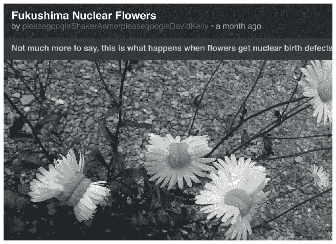

**图 9.3：你能找出假新闻吗？**

来源：Wineburg, McGrew 等（2016）。^(19) 来自[`imgur.com/gallery/BZWWx`](https://imgur.com/gallery/BZWWx)。

来源：Twitter 上的[@san_kaido](https://twitter.com/san_kaido)*

**人类认知偏差。** 对人类决策研究超过 50 年的研究表明，人类行为系统地偏离了理性选择模型预测的结果。^(20) 相反，人类高度受众多认知偏差的影响。根据《科学》杂志的一篇文章，“研究表明，人们更喜欢确认他们先有态度的信息（选择性暴露），认为与他们的先有信念一致的信息比不一致的信息更有说服力（确认偏差），并且倾向于接受让他们感到愉悦的信息（愉悦偏差）。”^(21)

已经确定了超过 200 个人类认知偏差。^(22) 其他偏差包括同情消退偏差、创新支持偏差和框架偏差。同情消退偏差是人类倾向于对少数已知的受害者表现出更多的同情，而对许多匿名的受害者表现出较少同情。创新支持偏差被定义为“对一个发明或创新在社会中的有用性过于乐观的倾向，而往往未能识别其局限性和弱点。”^(23) 框架偏差是“根据信息呈现方式的不同，从相同的信息中得出不同的结论的倾向。”^(24)

关于人类偏见的一个有趣转折是，许多人认识到这些偏见的存在，却低估了它们对自己影响的大小。这被称为“偏见盲点”。一项针对美国 1299 人的学术调查探讨了人们对假新闻对他人影响的看法。正如所预测的那样，这项研究中的个人认为假新闻对外群成员（来自不同政治党派的成员）的影响比内群成员要大。^(25)

由于人类存在许多偏见，人们倾向于选择支持他们意识形态的新闻来源，这被称为“回声室”。

**重复**。另一项学术研究表明，个体更有可能接受熟悉的信息为真，这表明一个人暴露于假新闻故事的次数越多，他或她越相信其内容。^(26) 这使得假新闻的传播更加令人担忧。

**性格特征**。虽然日常用语会让人觉得有些人比其他人更容易受骗，但一些学者称这种特征为“反射性开放性”。反射性开放性被定义为“倾向于不假思索地接受传入信息作为有效和真实的。”^(27) 在三项共涉及 1606 名参与者的研究中，来自里贾纳大学和麻省理工学院的教授们研究了个人的心理特征与他们对于假新闻准确性的看法之间的关联。在各项研究中，具有反射性开放性的一般倾向的人倾向于相信假新闻，不论新闻来源是否熟悉，或标题来源的存在与否。^(28)

**人口统计因素**。这些研究阐明了在识别假新闻方面表现更好或更差的人口统计因素。例如，纽约大学和斯坦福大学的教授们在 2016 年美国总统选举之后向人们展示了关于这次选举的真实和假新闻故事。调查对象被要求判断这些故事是真是假。花更多时间消费新闻的人、受教育程度更高的人和年纪较大的人辨别真实和假新闻的能力更强。^(29)

因此，我们已经确定假新闻是一个问题，人类的偏见、特征和人口统计因素导致了人们对假新闻的信仰。接下来，我们研究对抗假新闻的手段。

9.3 对抗假新闻的手段

目前用于对抗假新闻的常用解决方案是在事实发生后部署——它们旨在检测或惩罚假新闻在故事已经传播之后。这些包括：

• **事实核查网站**。根据杜克大学的数据，全球有超过 100 个非党派组织提供事实核查服务。^(30) 这些包括专业网站如[FactCheck.org](http://FactCheck.org)、[Snopes.com](http://Snopes.com)和 BBC 的现实检查。

• **法律责任。**1948 年联合国《世界人权宣言》将新闻自由视为一项人权：*“人人有权自由表达意见和发表言论；这项权利包括持有意见不受干扰，以及通过任何媒体 regardless of frontiers 寻求、接受和传播信息和想法。”*^(31)许多国家在宪法中保护新闻自由。例如，美国宪法的第一修正案保证了美国的新闻自由。^(32)由于新闻自由是任何民主的标志，政府 regulations 防止虚假新闻的解决方案通常不受欢迎。如今，针对故事中受到伤害的人提起的诽谤诉讼是对抗虚假新闻的主要法律途径。诽谤责任也延伸到重新发布它的人。^(33)然而，很清楚，诉讼的威胁是一个不充分的威慑手段。

• **教育。**正如导致一个人倾向于相信虚假信息的 demographic factors 所建议的，一个受过教育的公民群体是抗击虚假新闻的强大工具。网上有大量针对所有年龄段的人的教学计划示例。读者可以通过自己的事实核查来采取行动，取消订阅特定来源的新闻，改变他们使用社交媒体的方式，以及标记他们怀疑是编造的故事。

• **AI 解决方案。**社交媒体平台提供商依赖 AI 工具来识别和防止虚假新闻的传播。AI 解决方案被设计用来摄入和分类大量数据，这项任务对于在每天有数百万条帖子的社交媒体平台上由人类来完成来说成本过高。许多 AI 解决方案被设计用来通过搜索耸人听闻的词汇、检查来源的地理位置以及根据事实的准确性为特定网站分配声誉分数来检测和标记虚假新闻。^(34)

例如，Facebook 的创始人兼 CEO 马克·扎克伯格在 2016 年总统选举后向国会作证时，提到了 AI 作为解决虚假新闻的方案超过 30 次。^(35)跳到 2020 年，Facebook 开始使用 AI 来阻止关于 COVID-19 的虚假新闻。到 2020 年 4 月，Facebook 已经删除了五千万条关于冠状病毒的虚假信息帖子。^(36)

2019 年，Twitter 报告称，使用 AI 已经能够识别并移除 50%的虐待性推文。^(37)然而，Twitter 并不总是删除虚假新闻帖子，而有时只是标记它们。例如，在 2020 年总统选举之后，Twitter 将数百条唐纳德·特朗普的推文标记为“有争议的”。

在 2020 年 1 月 6 日美国国会大厦骚乱后，特朗普的支持者限制了特朗普的社交媒体账户，如 Twitter、Facebook、Snapchat、Instagram、YouTube 和 Shopify。社交媒体平台采取此类行动引发了对言论自由与防止由假新闻引发的非法行为之间更深层次的辩论。³⁸应该在哪里划线？

我们还注意到，AI 加剧了假新闻的问题：深度伪造是通过人工智能生成的内容，比如一个视频被修改，让发言者似乎说了她没有说过的话。微软于 2020 年 9 月推出了用于视频和图像的深度伪造检测器。³⁹这个视频验证器利用 AI 分析一张静态图片或视频，以提供媒体被人工操纵的可能性百分比，或信心评分。它通过检测人类无法察觉的元素来工作。深度信任联盟（一个 501(c)组织）也在处理深度伪造。IBM 区块链平台前全球产品管理总监凯瑟琳·哈里森创立了深度信任，因为她相信需要一个行业、公民社会和服务组成的联盟来*“创建验证内容来源的标准，以打击数字假货。”*。⁴⁰所以，这里我们看到了 AI 对抗 AI 的例子。

但是，战斗才刚刚开始。到目前为止，像 Facebook 的 Deeptext 和 Google 的 Perspective 这样的基于 AI 的解决方案，在标记仇恨言论方面比检测假新闻要好。⁴¹最近，一些新闻媒体机构开始转向区块链技术。

**区块链解决方案。** Gartner 是一家全球信息技术研究和咨询公司，预计到 2023 年，世界新闻（包括视频）将有三成依赖于区块链技术进行验证。⁴²很可能会有多种基于区块链的解决方案提供诸如建立内容真实性、随着时间的推移追踪内容来源、黑名单伪造者和发现深度伪造内容等服务，并将数字内容与物理世界联系起来——例如，通过标记照片的 GPS 位置。⁴³

许多解决方案旨在防止**伪造者**，这是一种看似来自合法新闻机构的假新闻故事。⁴⁴据《科学》杂志的一篇文章报道，伪造者*“尤其有害，因为它寄生在标准的新闻机构上，同时从它们那里获得利益并破坏它们的信誉。”*。⁴⁵

ANSAcheck 就是利用区块链技术防止伪造者的一个例子。

9.4. ANSAcheck

*“当假新闻被标记为 ANSA 新闻时，我们过去曾受到攻击。我们加剧了问题，因为我们不知道是谁创造了和发布了假新闻。有了 ANSAcheck，伪造者不能再这么做了，因为没有 ANSAcheck 标签，我们就没有发布过它。”*

**Stefano De Alessandri，ANSA 首席执行官兼 Managing Director**

安莎核查（ANSAcheck）是由意大利最大的新闻电线服务——安莎通讯社（Agenzia Nazionale Stampa Associata，ANSA）和世界上最大的专业服务公司之一——安永会计师事务所（Ernst & Young，EY）共同开发的。 Associata（ANSA）成立于 1945 年二战后，作为一个非营利的新闻合作社。ANSA 的创建目的是作为一个独立的新闻机构，不受意大利政府和私人团体的控制。总部位于罗马，今天它在 cooperative 中有 36 个基于意大利的新闻组织，全球有 78 个办公室。*（注：46）根据 2020 年路透社研究所数字新闻报告，安莎通讯社是意大利最值得信赖的新闻来源。*（注：47）

平均而言，安莎通讯社每天向数字平台（包括互联网、电视广播和移动网络）传输 3700 条新闻报道、1700 张照片和 60 个视频。*（注：48）安莎通讯社的 90％活动是面向企业（B2B），向媒体行业提供原创的专业信息。其余 10％的活动是在其网站上进行的面向消费者（B2C）活动 ([`www.ansa.it/`](https://www.ansa.it/)），展示了它创建的新闻的一个子集。

像大多数合法新闻机构一样，安莎通讯社也遭受了几篇伪造故事的影响。例如，2020 年 3 月，至少有三个与 COVID-19 有关伪造故事。其中一个错误地报道意大利的第一例死亡是一位 24 岁的女性。另一个宣布了错误的家制 COVID-19 治疗方法。*（注：49）第三篇错误地报道了意大利政府的 COVID-19 政策。这些伪造故事使用了安莎品牌、格式和签名进行传播。*（注：50）

Stefano De Alessandri，安莎通讯社的首席执行官和 managing director，表示：“虚假新闻是传统媒体组织和社交媒体平台面临的最大挑战之一，因为它破坏了它们与公众和广告商建立起来的信任，削弱了它们的战略资产——声誉。如果我们失去了信任，我们就失去了一切。”*（注：51）

这样的实例促使安莎通讯社启动了 ANSA 核查项目。目标是创建一个创新解决方案，为安莎创建的故事的来源提供保证，并能够追踪该故事的整个更新和重发历史。安永知道，区块链技术可以提供故事的防篡改真实性，故事随时间可追溯性，并允许读者或出版商在任何时间点验证故事。

在 2020 年 3 月完成的第一阶段，ANSACheck 被部署在 ANSAs 的网站上。该系统通过为 ANSAs 创建的新闻故事分配一个独特的哈希 ID 来工作。^(52) 如果故事中即使只改变了一个字母，系统也会检测到它与原始故事不相同。故事 ID 批量发布，每隔 15 分钟至半小时发布一次到以太坊，这是一个公共区块链网络，从而在公共区块链上为故事创建一个永久的记录。区块链创建了一个防篡改的记录，包括故事 ID、交易 ID、时间戳以及存储交易在以太坊账本上的区块号码。

EY 选择以太坊，因为他们认为它是目前最安全、最成熟的平台。

每个被区块链保障的 ANSAs 故事都附带一个 ANSACheck 贴纸（见图 9.4 和 9.5)，向读者示意其真实性。 （ANSACheck 对语言敏感，所以将网站从意大利语翻译成其他语言的观众将看不到贴在每条新闻故事上的具体贴纸；英语翻译用户将只看到如图 9.5 所示的 ANSACheck 解决方案的解释。）

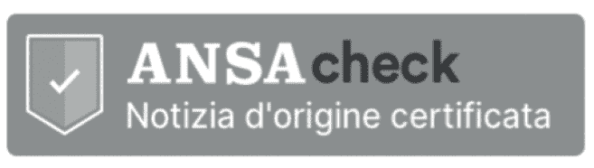

**图 9.4：ANSACheck 贴纸**

***此贴纸出现在 ANSAs 网站上发布的所有 ANSAs 故事上***

*来源：[www.ansa.it](http://www.ansa.it)*

用户可以点击 ANSACheck 贴纸查询以太坊关于故事来源的信息（见图 9.6 和 9.7）。如果 ANSAs 更新了故事，Ethereum 上会记录另一个条目，并链接回原始条目，形成一个来源链。该解决方案每天注册约 3000 条新闻故事。

ANSAcheck 解决方案由三个组件组成：一个 JavaScript 库，证明系统以及用户界面（见图 9.8）。

平台上的每个出版商维护一个私有的 JavaScript 库，包含其原始新闻故事。使用 EY 的 OpsChain 可追溯性解决方案，JavaScript 库与证明系统相连接。证明系统负责将条目发布到公共以太坊区块链，并有一个后端系统，为出版商提供加入区块链解决方案的能力。

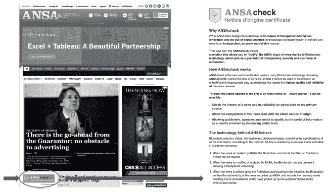

**图 9.5：ANSACheck 主页带有指向描述的指针（2020 年 8 月 11 日）**

*来源：[www.ansa.it](http://www.ansa.it)（谷歌翻译成英文）*

每个注册的出版商获得一个数字钱包，用于存储写入以太坊区块链的私钥。用户界面提供了一个前端仪表板，用于监控新闻分发。该系统允许像 ANSAs 这样的新闻线服务跟踪被重新发布的新闻，包括第三方重新发布。

EY 通过智能合约管理将交易发布到以太坊的过程。感兴趣的读者可以查看原始智能合约：[`etherscan.io/address/0xdc6b769db419e69c5f163048e880a02986d30376`](https://etherscan.io/address/0xdc6b769db419e69c5f163048e880a02986d30376)

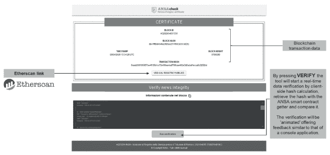

**图 9.6：区块链上的故事验证**

当用户点击 ANScheck 贴纸时，控制台查看器显示存储在区块链上的交易细节。每个故事都使用 MD5 加密技术获得唯一 ID。在这个例子中，故事标题是“Johnson, I still have a fever, I am staying isolated”，唯一的故事 ID 是 5b456347bf699bb9807b742e132c9120。这个故事是在 2020 年 4 月 3 日创建的，区块 ID 是 AC202004031330。

来源：经 EY 许可

智能合约通过在当前以太币成本过高时推迟新故事的处理，减轻了以太币价格波动的风险。EY 还通过在一个单一交易中批量发布多个新闻故事来保持交易成本低。最初，EY 每 15 分钟发布一批故事，每个故事的平均成本为 6 美分。然后，EY 大约每六小时批量发布 500-600 个新故事，因此每个故事的交易成本降至大约 0.006 美元。为了进一步降低交易成本，EY 在 2021 年从以太坊转移到 Polygon。Polygon 是以太坊的第二层，因此它保持了公共区块链标准，但 token 化的成本较低。新合同在此处：

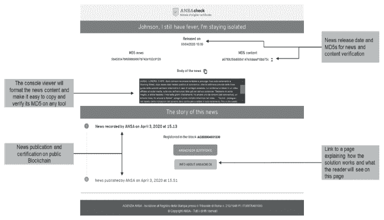

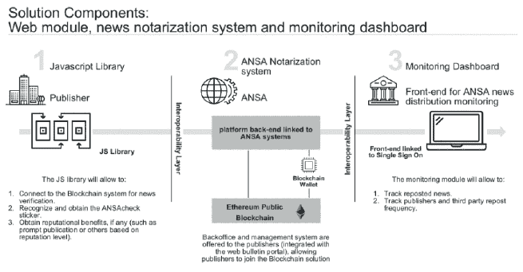

**图 9.7：通过控制台在以太坊上查询故事**

在这张图片中，用户可以看到故事存储在以太坊区块链上的位置。这个故事是在 2020 年 4 月 3 日 01:34:26 协调世界时（UTC）被添加到以太坊区块 9799299 的。独特的交易哈希是 0xadc600195857be4f138b1a15b400ee4adf799cae462e3d6abaf1ecca8c52928d。通过在控制台按下验证按钮，应用程序可以实时验证这个故事。

来源：经 EY 许可

到 2021 年 12 月，已有超过 250 万篇 ANSA 新闻故事被发布在区块链上。大约 72%的读者点击了 ANSAcheck 解释标签以了解更多；大约 38%查看文章的人实际上点击了贴纸以执行验证。

**图 9.8：解决方案组件**

来源：经 EY 许可

德阿莱桑德里先生谈到第一阶段时说：“这不是关于假新闻的最终解决方案，而是第一印象。安莎是一家认真的公司，它雇佣了专业记者并检查我们所发布的一切。这种第一印象不能保证内容的完全准确性；相反，它保证这条新闻来自安莎，而不是其他人。”53 随着新功能的增加，该解决方案将在学习第一阶段的教训后推出一个平台上。

安永计划向 ANSAcheck 解决方案添加其他服务。安永的区块链 HUB MED 领导者 Giuseppe Perrone 表示：“该解决方案在功能和组件方面将变得更加复杂，例如事实核查功能、语义语言分析和图片数据保护。”在第一代解决方案中，一个故事必须是原始的完全相同副本，因为即使改变一个字母也会表明来源不是原始的。在下一代解决方案中，该解决方案将提供重叠度量的衡量，类似于许多学生熟悉的抄袭软件。这样，重新发布故事的出版商可以添加他们自己的评论，同时仍然验证原始新闻来源。

9.5 结论

人类偏见研究的一个重要发现是，我们认为其他人比我们自己更容易受假新闻的影响。实际上，我们中的大多数人曾经相信过后来证实为确凿虚假的假新闻故事。虽然我们鼓励使用区块链来验证新闻来源，但没有任何单一的解决方案能根除假新闻。生态系统中的所有各方，包括政府、记者、出版商、社交媒体平台和公民，都有角色要扮演。您有什么想法，无论是技术性的还是非技术性的，可以防止假新闻的产生和传播吗？

引用

1 Hadley, C., Gaudet, H. and Herzog, H. (1940) *The Invasion from Mars: A Study in the Psychology of Panic with the Complete Script of the Famous Orson Welles Broadcast*. Princeton: Princeton University Press.

2 Lazer, D., Baum M., Benkler Y. et al. (2018) *Science* 359 (6380): 1094–1096.

3 MacDonald, E. (2017) The fake news that sealed the fate of Antony and Cleopatra. *The Conversation*, 13 January.

4 原始故事可在互联网档案馆找到。网址：[www.archive.org/stream/moonhoax00Lock/moonhoax00Lock_djvu.txt](http://www.archive.org/stream/moonhoax00Lock/moonhoax00Lock_djvu.txt)（访问日期：2021 年 4 月 6 日）。

5 Johnson, P. (2002) Civilising Mammon: Fraud and Profit in Nineteenth-Century London. 文章，伦敦政治经济学院。网址：[www.web.archive.org/web/20110223134926/http://www.fathom.com/feature/121984/](http://www.web.archive.org/web/20110223134926/http://www.fathom.com/feature/121984/)（访问日期：2021 年 4 月 6 日）。

6 Silverman, C. (2016) 这份分析显示，假选举新闻在 Facebook 上的表现优于真实新闻。BuzzFeed 新闻，16 November。

7 Allcott, H. and Gentzkow, M. (2017) 2016 年选举中的社交媒体和假新闻。经济透视》31(2): 211-236。

8 Silverman, C. (2016) 这份分析显示，假选举新闻在 Facebook 上的表现优于真实新闻。BuzzFeed 新闻，16 November。

9 Silverman, C. (2016) 这份分析显示，假选举新闻在 Facebook 上的表现优于真实新闻。BuzzFeed 新闻，16 November。

10 Bovet, A. and Makse, H. (2019) 2016 年美国总统选举期间 Twitter 上假新闻的影响。《自然通讯》10: Article 7. 可在：[www.nature.com/articles/s41467-018-07761-2](http://www.nature.com/articles/s41467-018-07761-2)查阅（截至 2021 年 4 月 6 日）。

11 Zuboff, S. (2019) 《监控资本主义时代》。纽约：公共事务出版社。

12 参议院司法委员会 (2017) 极端内容与在线俄罗斯的虚假信息：与科技公司合作寻找解决方案。可在：[www.judiciary.senate.gov/meetings/extremist-content-and-russian-disinformation-online-working-with-tech-to-find-solutions](http://www.judiciary.senate.gov/me

13 Wood, V. (2020) 选举期间假新闻比脱欧公投期间更严重，吹哨人表示。《独立报》，27 January. 可在：[www.independent.co.uk/news/uk/politics/brexit-fake-news-2019-election-facebook-cambridge-analytica-brittany-kaisar-eu-referendum-a9304821.html](http://www.independent.co.uk/news/uk/politics/brexit-fake-news-2019-election-facebook-cambridge-analytica-brittany-kaisar-eu-referendum-a9304821.html)查阅（截至 2021 年 4 月 6 日）。

14 Jang, S. and Kim, J. (2018) 假新闻的第三人称效应：假新闻监管和媒体素养干预。《计算机在人类行为中的应用》80(1): 295-302。

15 Ipsos Public Affairs and the Centre for International Governance Innovation (2019) CIGI-Ipsos 全球调查：网络安全与信任。可在：[www.cigionline.org/internet-survey-2019](http://www.cigionline.org/internet-survey-2019)查阅（截至 2021 年 4 月 6 日）。

16 (2020) 假社交媒体账户是暴乱的根源；最高法院寻求清除它们。亚洲新闻国际，4 March. 可在：[`search.proquest.com/docview/2370335878?accountid=8361`](https://search.proquest.com/docview/2370335878?accountid=8361)查阅（截至 2021 年 4 月 6 日）。

Margetts, H. (2019) 用社交媒体重新思考民主。《政治季刊》，90(1): 107-123。Muqsith, M. (2019) 假新闻对民主的影响。《Jurnal cita hukum》，7(3): 307-318。

^(17) Wineburg, S., McGrew, S. 等（2016）评估信息：公民在线推理的基石。斯坦福数字 Repository。可在：[`purl.stanford.edu/fv751yt5934`](http://purl.stanford.edu/fv751yt5934) 查阅（2021 年 4 月 6 日访问）。

^(18) Ipsos Public Affairs 和国际治理创新中心（2019）全球调查：互联网安全与信任。可在：[www.cigionline.org/internet-survey-2019](http://www.cigionline.org/internet-survey-2019) 查阅（2021 年 4 月 6 日访问）。

^(19) Wineburg, S., McGrew, S.（2016）评估信息：公民在线推理的基石。斯坦福数字 Repository。可在：[`purl.stanford.edu/fv751yt5934`](http://purl.stanford.edu/fv751yt5934) 查阅（2021 年 4 月 6 日访问）。

^(20) Santos, L. 和 Rosati, A.（2015）人类决策制定的进化陷阱。《心理学年度评论》66：321-347。

^(21) Lazer, D., Baum, M., Benkler, Y. 等（2018）《科学》359（6380）：1094-1096。

^(22) 人认知偏差列表：[`en.wikipedia.org/wiki/List_of_cognitive_biases`](https://en.wikipedia.org/wiki/List_of_cognitive_biases)

^(23) [`en.wikipedia.org/wiki/List_of_cognitive_biases`](https://en.wikipedia.org/wiki/List_of_cognitive_biases).

^(24) [`en.wikipedia.org/wiki/List_of_cognitive_biases`](https://en.wikipedia.org/wiki/List_of_cognitive_biases).

^(25) Jang, S. 和 Kim, J.（2018）假新闻的第三方效应：假新闻监管和媒体素养干预。《计算机在人类行为中的应用》80（1）：295-302。

^(26) Swire, B., Ecker, U.K.H. 和 Lewandowsky, S.（2017）熟悉性在纠正不准确信息中的作用。《实验心理学：学习、记忆与认知》43（12），1948-1961。

^(27) Pennycook, G. 和 Rand, D.（2020）谁会相信假新闻？假新闻接受度、过度断言、熟悉度和分析性思维的作用。《人格》88：185-200。

^(29) Allcott, H. 和 Gentzkow, M.（2017）2016 年选举中的社交媒体和假新闻。《经济学观点》31（2）：211-236。

^(30) 杜克记者实验室。可在：[www.reporterslab.org/fact-checking/](http://www.reporterslab.org/fact-checking/) 查阅（2021 年 4 月 6 日访问）。

^(31) 联合国（1948）《世界人权宣言》。可在：[www.un.org/en/about-us/universal-declaration-of-human-rights](http://www.un.org/en/about-us/universal-declaration-of-human-rights) 查阅（2021 年 4 月 6 日访问）。

在美国，宪法第一修正案保证了新闻自由。“国会不得制定关于建立宗教或禁止宗教自由行使的法律；不得剥夺言论自由或新闻自由；不得剥夺人民和平集会及向政府请愿的权利。”

^(33) Haskins, J. (2019) 假新闻：哪些法律旨在提供保护？详情请见：[www.legalzoom.com/articles/fake-news-what-laws-are-designed-to-protect](http://www.legalzoom.com/articles/fake-news-what-laws-are-designed-to-protect)（截至 2021 年 4 月 6 日）。

^(34) Maruti Techlabs (2020) 人工智能是抗击假新闻的关键吗？详情请见：[www.marutitech.com/artificial-intelligence-fake-news/](http://www.marutitech.com/artificial-intelligence-fake-news/)（截至 2021 年 4 月 6 日）。

Woolley, S. (2020) 我们通过使用更多人工智能来对抗假新闻机器人，这是一个错误。*MIT 技术评论*。详情请见：[www.technologyreview.com/2020/01/08/130983/were-fighting-fake-news-ai-bots-by-using-more-ai-thats-a-mistake/](http://www.technologyreview.com/2020/01/08/130983/were-fighting-fake-news-ai-bots-by-using-more-ai-thats-a-mistake/)（截至 2021 年 4 月 6 日）。

Facebook 利用人工智能对抗冠状病毒假新闻和假消息。Some, K. (2020)。详情请见：[www.analyticsinsight.net/facebook-uses-ai-fight-coronavirus-misinformation-fake-news/](http://www.analyticsinsight.net/facebook-uses-ai-fight-coronavirus-misinformation-fake-news/)（截至 2021 年 4 月 6 日）。

新科布，A. (2019)。Twitter 表示，现在人工智能已经移除了超过一半的被标记为虐待性推文。财富杂志，2019 年 10 月 24 日。详情请见：[www.fortune.com/2019/10/24/twitter-abuse-tweets/](http://www.fortune.com/2019/

唐纳德·特朗普在国会暴乱后被各大社交媒体平台封禁。Hutchinson A (2021)。7 月 1 日。详情请见：[www.socialmediatoday.com/news/president-trump-banned-from-various-socialnetworks-after-us-capitol-riots/593007/](http://www.socialmediatoday.com/news/president-trump-banned-from-various-socialnetworks-after-us-capitol-riots/593007/)（截至 2021 年 4 月 6 日）。

微软发布新闻稿，宣布采取新措施打击虚假信息。Burt T 和 Horvitz E (2020)。2020 年 9 月 1 日。详情请见：[`blogs.microsoft.com/on-the-issues/2020/09/01/disinformation-deepfakes-newsguard-video-authenticator/`](https://blogs.microsoft.com/on-the-issues/2020/09/01/disinformation-deepfakes-newsguard-video-authenticator/)（截至 2021 年 4 月 6 日）。

DeepTrust Alliance 的详情请见：[www.deeptrustalliance.org/about](http://www.deeptrustalliance.org/about)（截至 2021 年 4 月 6 日）。

^(41) Woolley S（2020）我们通过使用更多 AI 来对抗假新闻 AI 机器人，这是一个错误。见于：[www.technologyreview.com/2020/01/08/130983/were-fighting-fake-news-ai-bots-by-using-more-ai-thats-a-mistake/](http://www.technologyreview.com/2020/

^(42) Gartner（2019）Gartner 2020 年及以后的战略预测。可在：[www.gartner.com/smarterwithgartner/gartner-top-strategic-predictions-for-2020-and-beyond/](http://www.gartner.com/smarterwithgartner/gartner-top-strategic-predictions-for-2020-and-beyond/)查阅（2021 年 4 月 6 日访问）。

^(43) Mearian L（2020）区块链如何帮助阻止假新闻。《计算机世界》，2 月 17 日。可在：[www.computerworld.com/article/3526427/how-blockchain-could-help-block-fake-news.html](http://www.computerworld.com/article/3526427/how-blockchain-could-help-block-fake-news.html)查阅（2021 年 4 月 6 日访问）。

^(44) Wardle Claire（2017）假新闻。情况复杂。《第一草稿》，2 月 16 日。可在：[www.firstdraftnews.org/latest/fake-news-complicated/](http://www.firstdraftnews.org/latest/fake-news-complicated/)查阅（2021 年 4 月 6 日访问）。

^(45) Lazer D，Baum M，Benkler Y 等（2018）《科学》359（6380）：1094-1096。

^(46) [`en.wikipedia.org/wiki/Agenzia_Nazionale_Stampa_Associata`](https://en.wikipedia.org/wiki/Agenzia_Nazionale_Stampa_Associata)

^(47) Newman N，Fletcher R，Schulz A，Andi S 和 Nielsen R（2020）。Reuters Institute Digital News Report。可在：[`reutersinstitute.politics.ox.ac.uk/sites/default/files/2020-06/DNR_2020_FINAL.pdf`](https://reutersinstitute.politics.ox.ac.uk/sites/default/files/2020-06/DNR_2020_FINAL.pdf)

^(48) De Alessandri，S. 和 Perrone，G.（2020）。公开亮相：EY 全球区块链峰会 2020。

^(49) Sephton C（2020）ANSA 将每天 1000 条新闻故事的信息和来源放在一个公开的区块链上，但更大的挑战正等着我们。《现代共识》，4 月 8 日。可在：[www.modernconsensus.com/people/media/its-brand-used-to-spread-fake-news-italian-media-outlet-turns-to-blockchain/](http://www.modernconsensus.com/people/media/its-brand-used-to-spread-fake-news-italian-media-outlet-turns-to-blockchain/)查阅（2021 年 4 月 6 日访问）。

^(50) De Alessandri S 和 Perrone G（2020）公开亮相：EY 全球区块链峰会 2020。

^(51) De Alessandri S 和 Perrone G（2020）公开亮相：EY 全球区块链峰会 2020。

^(52) 散列是一种将一个输入转换成不同输出的算法。给定一个特定的输入，相同的输出将总是被复现。一个好的散列算法使得基于输出值确定输入值在实际操作中变得几乎不可能，这就是为什么散列被称为单向函数。ANSAcheck 采用 MD5 散列算法，该算法总是产生 128 位的输出。

^(53) De Alessandri S 和 Perrone G（2020）.《走向公开：EY 全球区块链峰会 2020》。
