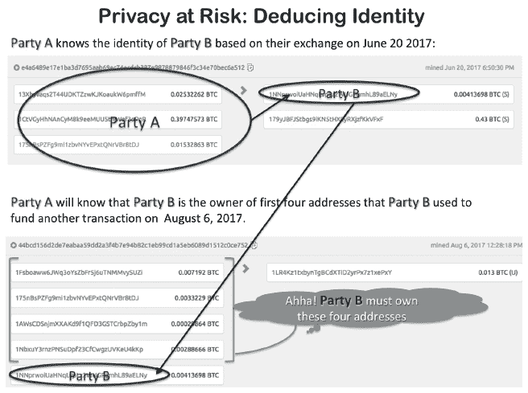
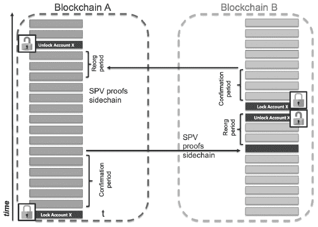

## 第三部分

## 成熟之路

## 第十章

## 技术挑战与新兴解决方案

***内容概览：*** 区块链正在成长！自 2009 年比特币诞生以来，在 13 年的时间里，全球经济达到了 2 万亿美元。技术创新仍在继续。在本章中，我们探讨了提高资源消耗、安全性、性能、可扩展性、匿名性、机密性和互操作性的新兴技术创新。我们解释了这些技术创新在较高层次上是如何工作的，通常使用图像和类比，以便非技术读者能够理解其目的。

学习目标：

- 评估解决方案的高效资源消耗。

- 评估解决方案的安全威胁。

- 评估解决方案的性能和可扩展性。

- 评估解决方案的匿名性和机密性。

- 描述三种跨链交易处理方法。

10.1. 引言

到目前为止，在我们的学习旅程中，我们已经涵盖了 Web 3.0 的区块链基础，并突出了许多跨越多个行业的实际应用。这是本书“成熟之路”部分的第一章。本章关注旨在改进区块链技术的发展。我们特别讨论了针对某些协议的大规模资源消耗；安全性；性能和可扩展性；公共区块链的匿名性；私有区块链的机密性；以及互操作性。我们还包含了一些读者可以采取的行为实践，以降低使用这些技术时的风险。每个读者都必须做三件事：第一，保护你的私钥；第二，保护你的私钥；第三，保护你的私钥！在本章结束时，读者将能够充分理解围绕这些技术的争论和讨论。读者将能够解释一些相当复杂的技术概念，例如量子计算的威胁、零知识证明（交互式和非交互式）以及跨链交易处理的方法（证明人、侧链和哈希时间锁定合约（HTLCs））。这听起来令人畏惧，但我们的讲解将简化学习过程。

10.2. 资源消耗

“这是值得的；单一的安全漏洞平均成本约为 380 万美元。”

**唐和亚历克斯·塔普斯科特，著作《区块链革命》**^(1)

运行区块链节点的计算机消耗资源，形式为电力。给定区块链的共识协议的计算强度是资源消耗的主要驱动力。回想起来，从第三章中，比特币和以太坊使用最安全，但计算上最消耗资源的协议，称为工作量证明。2009 年，比特币的首批矿工使用他们的台式计算机成功竞争区块奖励。随着比特币价格的飙升，矿工转向专用硬件，并通过挖矿池共享计算能力。具体来说，比特币需要一个应用特定的集成电路(ASIC)。以太坊挖矿需要一个图形处理单元(GPU)。工作量证明无疑是对这两个公共网络的资源消耗者。为了竞争，已经建立了大型矿工中心（见图 10.1 为例）。

**图 10.1：瑞典鲍登的比特币矿场**

图片来源：[`coinscage.com/wp-content/uploads/2017/05/bitcoin-mining-farm-1.jpg`](https://coinscage.com/wp-content/uploads/2017/05/bitcoin-mining-farm-1.jpg)

数字经济学家是一个追踪区块链能源消耗的网站，计算出到 2022 年，每笔比特币交易需要 2140 千瓦的电力；以太坊每笔交易使用 264 千瓦的电力。一笔交易的电力消耗足以让一个美国家庭平均使用 73 天对比特币和 9 天对以太坊。^(2)正如唐和亚历克斯·塔普斯科特的话所建议的，许多人认为这笔费用是为了确保区块链的安全而值得的。

由于电力成本较低，挖矿池有动力在电力成本低廉的地方建立数据中心。因此，由于电力便宜，中国出现了大型挖矿池。直到 2021 年比特币被宣布为非法，中国控制了比特币超过 80%的挖矿力量。^(3)截至 2022 年 4 月，美国填补了空缺，现在成为最大的比特币矿工，拥有 35%的挖矿力量。^(4)在美国，电价因 50 个州而异（见图 10.2）。路易斯安那州的平均电力成本最低，为每个比特币 3224 美元。夏威夷州和阿拉斯加州最贵，分别为每个比特币 9483 美元和 7059 美元。^(5)

**图 10.2：美国每千瓦时的电力成本**

图片来源：[`image.cnbcfm.com/api/v1/image/106950410-1633024899325-023955_GEI_ElectricityPriceMap_Handout_2020_1_Page_1.jpg?v=1633025034&w=1910&ffmt=webp`](https://image.cnbcfm.com/api/v1/image/106950410-1633024899325-023955_GEI_ElectricityPriceMap_Handout_2020_1_Page_1.jpg?v=1633025034&w=1910&ffmt=webp)

人们正在寻找降低电力成本的方法。例如，**EZ Blockchain** 开发了一个解决方案，将钻探和精炼过程中的天然气燃烧废物转化为电力，以供加密货币采矿使用。EZ Blockchain 使用便携式汽油发电机为移动数据中心供电（参见 图 10.3）。这种商业模式帮助钻探和精炼公司减少 CO2 排放，同时通过加密货币采矿赚钱。截至 2022 年，EZ Blockchain 已经交付了 13 个移动采矿单元，主要在北达科他州。^(6)

**液体浸没冷却** 是另一种降低矿机电力消耗的创新方法。这种液体——称为介电冷却剂——设计为零电导率但良好的热导率，从而降低矿机的热、电力消耗和噪音。一家美国公司 Engineered Fluids 声称其浸没解决方案能节省 35% 的电力成本。^(7)

**图 10.3：EZ Blockchain 采矿**

***发电机将天然气燃烧转化为电力，为采矿加密货币的便携式数据中心供电。***

来源：**[`www.ezblockchain.net/`](https://www.ezblockchain.net/)**

一些公有区块链依赖于与工作量证明相比计算强度较低的共识算法。例如，Cardano 使用权益证明，EOS 使用委托权益证明共识协议，这些公有区块链的能耗大大减少。受许可的区块链依赖于某种拜占庭容错机制，这种机制的能耗极低——大约和运行一个电子邮件服务器的能耗一样。

10.3. 安全性

区块链最大的卖点之一是其相较于具有单一故障点的集中式系统更高的安全性。在第三章中，我们了解到即使大部分节点出现故障——或者是恶意节点——区块链应用仍然能正常运行，这保证了无与伦比的弹性以及 100%的可用性。如果区块链如此安全，那为什么我们还会听到这么多盗窃和泄露事件？当前的区块链技术存在漏洞，尤其是数字钱包、年轻的代码库、编写粗糙的智能合约以及 51%攻击的可能性。此外，量子计算也构成了未来的安全威胁。

10.3.1. 数字钱包安全性

大多数区块链上的盗窃事件发生在数字钱包的脆弱接入点，私钥即在此存储。正如在第三章中提到的，一旦黑客窃取了私钥，他们就能控制资产并轻松地将资金转移到另一个地址。尽管用户可能会在自己的设备上存储他们的数字钱包，但大多数用户还是依赖中心化的交易所。交易所是黑客眼中的肥肉，因为有些交易所控制着数百万个私钥。我们已经介绍了***Mt. Gox***最大的盗窃案之一。但那是 2014 年的事了。向前跳转，单一攻击已经窃取了价值数亿美元加密货币。^(8)其中***Ronin Network***在 2022 年被盗 6.5 亿美元，这是一个为以太坊提供第二层解决方案的网络。攻击者窃取私钥，最终控制了九个验证节点中的五个，因此这也是一次 51%攻击。2021 年，Poly Network 有 6.1 亿美元被盗，但最终与黑客合作，归还了大部分资金。^(9)我们自然会担心这些事件的风险含义，但风险是可以缓解的。此外，读者可以实施选择交易所和管理钱包的做法：

-   选择提供投资保险的交易所。最大的加密货币交易所——币安、Coinbase 和 Gemini——现在已有保险来赔偿用户。

-   在使用交易所时，选择需要多因素认证的服务；除了私钥外，该服务可能还需要生物识别标识、密码短语、照片或其他标识。

-   为每个交易所或区块链使用不同的钱包。

-   在连接到交易所或互联网的‘热钱包’中保留少量资金。

-   将大多数加密货币保留在‘冷钱包’中；在多个设备上备份冷钱包。

-   将私钥打印在纸上，并储存在保险库中。或者更好的做法是，将私钥分散在多张纸上，并将部分存储在不同的安全地点。

-   监控钱包的批准操作，并删除不再需要的一些操作，例如如果你从质押池中提取。^(10)

-   保持钱包软件更新。

10.3.2 代码基础安全

尽管不如数字钱包私钥被盗事件频繁，但许多区块链都曾因代码库中的软件漏洞而被盗。这些通常发生在代码库发布后的第一年，此时代码库还非常新颖。2010 年 8 月，比特币区块链遭到黑客攻击，有人利用软件漏洞创建了 184*亿*个比特币，考虑到最大货币供应量只有 21*百万*个比特币，这一行为非常可疑。^(11) 2014 年，一名黑客能够从只有.0001 个比特币的地址转移 1000 个比特币。^(12) 随着软件更新的实施，可能会引入新的漏洞。例如，2018 年发现了一个比特币核心更新的严重漏洞，这可能会使网络在拒绝服务攻击下崩溃，这是一种恶意攻击，通过发送大量交易使网络对合法用户的服务中断。幸运的是，比特币核心开发者发现了这个漏洞并修复了它，黑客还没有利用它。^(13) 尽管源代码被迅速修复，但这些事件提出了一个重要的警告。

如第三章所讨论，**多版本**是一种帮助保护代码库的做法。多版本中，独立的软件团队用不同的编程语言编写详细功能，以提高容错性和冗余性。

10.3.3 智能合约安全

如第三章所定义，去中心化自治组织（DAO）是一个完全由作为智能合约中计算机程序的规则运行的组织或公司，这些智能合约在区块链上执行。为了说明智能合约的安全问题，我们分享了名为***The DAO***（区别于“一个”DAO）的特定 DAO 的故事，在第二章中。作为提醒：黑客利用了部署在以太坊区块链上的智能合约中的漏洞。以太坊社区讨论是否回滚账本并归还资金，还是让盗窃发生以保持账本的不可篡改性。决定让矿工投票，根据他们的哈希力来衡量他们的投票。矿工投票支持硬分叉——以太坊区块链的永久分叉。回滚区块，归还被盗的以太币。那些拒绝跟随分叉的矿工继续使用原代码进行挖掘，留下了以太坊（跟随分叉）和***以太坊经典***（不跟随分叉），在那里黑客仍然可以将资金提取出来。

其他智能合约被盗和漏洞也得到了曝光，例如运行 Parity、POWH Coin、LastWinner 和 Fomo3D 的智能合约：

• ***Parity*** 是由以太坊联合创始人 Gavin Wood 在 2017 年推出的。有人利用智能合约中的漏洞窃取了价值 3000 万美元的以太币。^(14)

• ***POWH Coin*** 被许多人认为是一个庞氏骗局，新投资者为早期投资者付款。^(i) 但比商业模式更糟糕的是，***白帽黑客***—道德黑客，他们帮助识别安全缺陷—在运行***POWH Coin***的智能合同中发现了一个漏洞。2018 年，***黑帽黑客(s)***—为了自己的利益而利用安全缺陷的罪犯—利用了一个未签名的整数下溢机会，从而使他们能够提取无限数量的 POWH 代币。^(15)

• ***Last Winner*** 和 ***Fomo3D*** 是建立在以太坊上的共享超过 90%代码的赌博智能合约。2018 年 8 月，AnChain 在 Last Winner 上识别了五个以太坊地址，这些地址利用智能合约代码中的一个漏洞窃取了 400 万美元。^(16)

**审计**智能合约在部署之前是一种提高智能合约安全性的做法。在第五章中，我们了解到 Aave 在部署任何智能合约之前聘请了五名独立审计员。现在许多专业服务公司提供这些服务。例如，EY 为区块链客户提供智能合约和代币审查服务。根据 EY 的说法，“智能合约和代币审查解决方案允许用户定制测试和报告，识别漏洞，并在代币部署过程和智能合约背后的代码中减轻风险。”^(17)*

10.3.4 节 51%攻击

有人控制超过 50%的算力可能性有多大？最大的威胁又来自哪里？对于大型公共区块链，威胁来自于矿池的权力集中。我们将特别查看比特币和以太坊的权力集中的威胁。对于小型公共区块链，如果攻击者的电力成本低于通过双重支付可以窃取的加密货币金额，单个黑客可能会发现接管网络是值得的。我们将研究 Verge；ZenCash；比特币黄金和以太坊经典发生的 51%攻击。私有区块链不需要担心 51%的接管；实际上，许多私有区块链是在第二章讨论的“仁慈独裁者”治理模型下运营的。

专注于比特币，51%接管的主要威胁来自于矿池的权力集中（见图 10.3）。***Poolin, F2Pool, SlushPool***, 和 ***Antpool*** 是最大的矿池之一。从理论上讲，矿工可能会勾结。还要注意，超过 50%的获胜矿工无法被识别。根据[Blockchain.com](http://Blockchain.com)，“矿池可能会突然决定更改它们的标签或输入地址，导致它们的标记贡献减少，而未知标签增加。”^(18)*

总部位于中国的公司**Bitmain**提出了另一个有趣的威胁。Bitmain 既是世界上最大的比特币挖矿硬件制造商，拥有 70％的市场份额，也是 Antpool（最大的矿池之一）的所有者。截至本文撰写时，Antpool 挖出了大约 10％的所有区块（见图 10.4）。作为最大的比特币挖矿硬件提供商和消费者，存在严重的利益冲突。2017 年 4 月，发现 Bitmain 在其 Antminer 硬件中内置了一个“后门”程序，这样公司就可以轻松地控制并关闭与其挖矿池竞争的其他矿工。以下是这种情况可能如何发生：

“固件会以每 1 到 11 分钟一次的随机频率向中心服务进行签到。每次签到都会传输 Antminer 序列号、硬件识别号和 IP 地址。Bitmain 可以利用这些签到数据与客户销售和交付记录进行交叉核对，从而使其具有个人可识别性。远程服务可以随后返回‘false’，这将使矿工停止挖矿。”^(19)

被称为“Antscape”的 Bitmain 道歉并发布了固件更新。^(20)

**图 10.4：2022 年 4 月 4 日比特币最大的赢利挖矿池**

*来源：[`blockchain.info/pools`](https://blockchain.info/pools)*

以太坊还在[`etherchain.org/miner`](https://etherchain.org/miner)上追踪其顶级矿工。2022 年 4 月 4 日，**Ethermine, f2pool2**，和**Hiveon Pool**是最大的矿池（见图 10.5）。仅 Ethermine 就在这一天控制了以太坊网络超过 25％的份额，但以太坊比比特币更加去中心化。

**图 10.5：2022 年 4 月 4 日以太坊最大的赢利挖矿池**

*来源：[`www.etherchain.org/charts/miner`](https://www.etherchain.org/charts/miner)*

考虑到区块链应该是完全分布式应用，几个关键挖矿池的主导确实存在风险。伊利诺伊大学香槟分校教授 Sirer 及其同事在 2018 年的一项研究发现，“比特币和以太坊的挖矿都非常集中，比特币的前四大矿工和以太坊的前三大矿工控制了超过 50％的哈希率．．．两个系统的整个区块链都由少于 20 个挖矿实体决定。”^(21)

尽管比特币和以太坊尚未遭受 51％的接管，但包括上面讨论的 Ronin Network 在内的其他区块链网络却遭受了，Verge；ZenCash；Bitcoin Gold 和 Ethereum Classic 也遭受了 51％的攻击：

• 在**Verge** (XVG)这种隐私币中，2018 年发生了三次 51%的接管。在第一次接管中，黑客窃取了价值 100 万美元的加密货币。在第二次接管中，他们窃取了 180 万美元，并阻止其他人处理交易。在第三次接管中，超过 1.42 亿 XVG 被窃取。^(22) 每次，开发者都试图实施补丁，但黑客仍然能够伪造时间戳，双重支付 XVG。^(23)

• **ZenCash** (ZEN) 在 2018 年 6 月遭受了一次 51%攻击，攻击者是一位拥有大量矿场的私人矿工。通过双重支付，黑客窃取了价值超过 55 万美元的加密货币。在此黑客攻击中，开发者迅速回应，发布了一个补丁。^(24)

• **Bitcoin Gold** (BTG) 在 2020 年 1 月遭受了一次 51%的黑客攻击；攻击者重新组织了近 30 个区块，双重支付了价值 7 万美元的加密货币。^(25)

• 在所有 51%的攻击中，**Ethereum Classic**的攻击被认为是最令人担忧的。如上所述，Ethereum Classic 是 2016 年 Ethereum DAO 攻击后的“非分叉”追随者。早在 2018 年，白帽子就警告说，通过花费尽可能少的电力，可能会对 Ethereum Classic 发起 51%的接管。^(26) 2019 年 1 月，一名黑客控制了网络的 51%，并窃取了价值 100 万美元的加密货币。几天后，黑客主动将 10 万美元归还给了它洗劫的一个交易所，Gate.io。不清楚为什么黑客将钱退给这个交易所，而不是其他它洗劫的交易所，比如 Coinbase。^(27)

防止 51%攻击的一种方法是启动延迟。这是由 ZenCash 团队（现更名为 Horizen）提出的。Horizen 是 Zcash 的分叉，而 Zcash 又是比特币的分叉。该团队提议更新他们的工作量证明共识算法，加入一个延迟功能，对准备进行此类攻击的矿工进行惩罚。“因为 51%攻击需要矿工在将区块发布到区块链之前秘密地产生区块，所以延迟功能可以让对这种攻击的惩罚变得异常昂贵。”^(28) 延迟功能可以将 51%攻击的成本增加十倍。

10.3.5 量子计算

区块链的加密技术被认为安全是因为今天的数字计算机没有足够的计算能力来实现仅通过公钥来猜测私钥的暴力破解。据一个来源称，今天的数字计算机需要花费数十亿年的时间来随机猜测与公钥相匹配的私钥。^(29) 从长远来看，一些人担心我们今天认为安全的加密技术在未来可能变得脆弱。考虑到无权限的区块链记录是不可变的且*永远*公开，确实存在未来技术可能会破坏保护今天区块链的加密技术的风险。量子计算就是其中的一个风险。

量子计算将以这样的方式加速计算机，使得今天的不可行暴力搜索在未来变得可行。^(30) 怎样实现呢？今天的数字计算机基于二进制数字，称为“位”，用“0”或“1”表示计算状态。今天，我们通过每秒处理更多位来使数字计算机变快，但每位仍然只能表示一个计算。量子计算机改变了这一点；它们基于量子位，称为“量子位”或“qubits”，可以同时表示多个状态，因此可以同时进行多个计算。一个 30 个量子位的计算机可以同时进行 10 亿次计算。^(31) 一些人估计，要在一小时内破解比特币，可能需要一个 3170 万个量子位的计算机。^(32) 目前，IBM 的 127 个量子位的 Eagle 是最快的量子计算机，所以我们还有时间找到解决方案。^(33)

根据瑞尔森大学网络安全研究实验室主任阿特菲·马沙塔恩博士的说法，有两个选择：*“要么用量子抵抗性替代现有平台的脆弱组件，要么重新设计新的区块链，使其不具有量子漏洞。后者比前者容易得多。”* 为了给现有区块链打量子补丁，需要用更大的密钥大小替换加密密钥，这将进一步阻碍可扩展性。所有旧地址的余额需要转移到存储在新量子抵抗钱包中的新地址。然而，补丁只有在公钥之前没有被广播的情况下才能工作。马沙塔恩博士解释说，*“如果一个公钥被广播，而与之关联的钱包仍然包含一些资金，拥有攻击性量子计算机的对手可以找到相应的私钥，进而模仿钱包所有者并使用剩余的资金。”^(34)*

2022 年，摩根大通宣布，它已经与东芝和 Ciena 合作开发并测试了一个量子防御的区块链网络。这个网络叫做“QKD”，代表量子密钥分发。据 CoinTelegraph 报道，“QKD 利用量子力学和密码学，使两个方能够安全地交换数据，并检测和防御第三方试图监听交换的行为。该技术被视为抵御未来量子计算机可能对区块链进行的攻击的有效防御手段。”^(35)*

10.4. 性能和可扩展性

虽然性能和可扩展性相互影响，但它们在概念上是不同的。性能是指交易在一个系统中处理所需的时间长度；可扩展性指的是*吞吐量*，即每秒可以处理多少笔交易。性能和可扩展性问题对于公有、无需许可的区块链来说比对于私有、需许可的区块链要大得多。我们将分别考察它们。

10.4.1. 公有区块链的性能和可扩展性挑战

因为在公有区块链中，交易伙伴之间的*先验*信任为零，计算机网络需要大量的计算能力来验证交易并不断监控记录的完整性。所有这些计算都会减慢性能和吞吐量。正如我们在 2017 年和 2021 年大量采用激增时所见，比特币和以太坊很难在目标时间内处理交易。而且，结算时间对于需要几乎瞬间反应的交易来说还不够快，比如监控关键系统状态的物联网设备，或者对于零售应用来说，顾客肯定不会等待交易结算。此外，像比特币和以太坊这样的公有区块链被认为规模太小，无法处理许多企业应用所需的交易量。例如，PayPal 每秒处理大约 193 笔交易，SWIFT——全球安全的金融消息服务提供商——每秒处理大约 329 条消息，^(36)而 Visa 每秒处理 1,667 笔交易（并声称其可以容纳每秒 56,000 笔交易）。^(37)

2017 年 11 月，以太坊的一个游戏**CryptoKitties**的智能合约开始使用以太坊网络 10%的容量，这真正突出显示了以太坊的可扩展性问题。Cryptokitties 造成了数万笔交易的积压。^(38)以太坊的工作量证明（PoW）共识算法要求每个节点处理智能合约的代码，这不仅慢，而且昂贵。^(39)

公共区块链缺乏可扩展性的一种后果就是更高的交易费用。比特币的早期年份，交易费用确实非常小，2014 年 6 月平均每笔交易约为 11 美分（以美元计），2016 年 12 月为 28 美分。^(40) 当网络不拥堵时，非常小的费用就足以激励矿工。作为一个具体的例子，我们在 2017 年 3 月 12 日找到了一个成功的交易，一个人提供了价值 45 美分的比特币来转移价值 8200 美元的比特币。^(41) 然而，当网络拥堵时，矿工无法在下一个区块中包含所有新验证的交易，所以矿工的算法会选择提供最高费用的交易。随着 2017 年 12 月比特币流量的激增，交易费用飙升，最高达到每笔 55 美元。^(42) 在 2017 年的高峰时段，提供较小费用的发送者有时需要等待数天才能被添加到区块链中，或者更糟糕的是，他们的孤儿交易最终被放弃并需要重新发送。^(43) 前进到 2021/2022 年，图 10.6 和 10.7 显示了比特币和以太坊的每笔交易的平均交易费用（以美元计）。请注意，这些都是*平均值*——希望确保他们的交易包含在下一个区块中的发送者提供了高达数百美元的比特币或以太坊的费用。

**图 10.6：2021-2022 年比特币网络平均交易费用（美元）**

*来源：[`bitinfocharts.com/comparison/bitcoin-transactionfees.html#1y`](https://bitinfocharts.com/comparison/bitcoin-transactionfees.html#1y)*

**图 10.7：2021-2022 年以太坊网络平均交易费用（美元）**

*来源：[`bitinfocharts.com/comparison/ethereum-transactionfees.html#1y`](https://bitinfocharts.com/comparison/ethereum-transactionfees.html#1y)*

**公共区块链的性能和可扩展性解决方案。**开源社区和私营企业已经实施了一些创新，并继续开发新的解决方案以改善公共区块链。使全球多样化的去中心化开发者和矿工同意升级是一项需要数年谈判和紧急会议的巨大努力。^(44)当社区无法达成一致时，分裂团体启动“硬分叉”，这是从原始区块链分离出的永久、分叉的路径。这就是为什么我们不仅有原始的比特币，还有 Bitcoin XT；Bitcoin Classic；Bitcoin Gold；和 Bitcoin Cash 的原因。此外，在内部斗争持续时发生了分叉的分叉。例如，Bitcoin Cash 是 2017 年对比特币的一次硬分叉，旨在增加区块大小和降低交易费用。第二年，Bitcoin Cash 社区就两项拟议的升级发生了争执，这促使一个派系创建了一个名为 Bitcoin SV（SV 代表“Satoshi Vision”）的 Bitcoin Cash 硬分叉。因此，社区并不总是同意技术升级。在这里，我们突出介绍了两种比特币的性能和可扩展性解决方案，分别是 Segregated Witness 和 Lightning Network。我们还介绍了以太坊的创新，包括 Proof-of-Stake，分片和第二层解决方案（参见表 10.1）。

| **Bitcoin** | **Ethereum** |
| --- | --- |

| **Segregated Witness：**将数字签名与交易分离，以增加区块大小，修复交易可塑性并启用第二层解决方案；2017 年 8 月实施。 | **Proof-of-Stake：**区块验证者根据他们在网络中的股份选择，例如拥有多少硬币或硬币已拥有多长时间。比 Proof-of-Work 使用更少的电力，并且创建区块更快。

截至 2022 年 4 月，信标链处于测试模式。|

| **第二层 - Lightning Network：**处理中间交易的离链支付通道；浏览器：[`explorer.acinq.co/`](https://explorer.acinq.co/)

2017 年面向 SegWit 采用者开放。| 尽管有许多第二层解决方案，但我们重点关注 Polygon。Polygon 成立于 2017 年；Polygon PoS 浏览器：[`polygonscan.com/`](https://polygonscan.com/) |

| **分片：**将以太坊分成多个称为分片的链；计划在 2023 年实施。 |
| --- |

**表 10.1：性能和可扩展性解决方案的例子**

对于比特币来说，***分离见证（Segregated Witness）***，被称为‘SegWit’^(45)，自比特币诞生以来就是最大的协议更改。它以多种方式改进了比特币。首先，SegWit 通过将数字签名（称为“见证”）从发送者的地址移动到比特币块的新部分来压缩区块中的交易。通过分离签名，区块大小从 1 兆字节增加到了可能的最大 4 兆字节，从而提高了吞吐量。这一创新还解决了***交易可塑性***问题，即黑客在交易加入区块之前修改数字签名，这将改变交易 ID。接收者仍然会收到比特币，但发送者将无法通过搜索交易 ID 来找到它（更多信息请参见词汇表）。

并非所有的比特币矿工都欢迎 SegWit。一些矿工不喜欢这种设计，因为它将签名的锚点从嵌入在 Merkle 根中移动到了区块中的第一个交易（称为 coinbase 交易），该交易用于奖励获胜的矿工。^(46)另一个问题是部署策略：SegWit 作为一次“软分叉”发布，这意味着非 SegWit 采用者仍然可以挖掘比特币。一些矿工认为作为硬分叉发布会更干净（然而更困难）。在 SegWit 被争论的过程中，比特币社区举行了多次紧急会议。SegWit 的采用过程^(47)颇为艰难，但最终作为软分叉在 2017 年 8 月激活了比特币核心。^(48)两年后，大约不到一半的比特币交易使用了 SegWit，这可能是因为人们升级钱包的速度慢。矿工社区的一派——代表约 2000 个节点——决定通过在 2016 年 5 月创建一个名为***Bitcoin Classic***的硬分叉彻底离开比特币。^(49)

SegWit 使得***Lightning Network***的使用成为可能。闪电网络是第二层解决方案，它跟踪链下资金的中间转移，并只将初始信用值和最终账户余额转移发布到区块链上。该解决方案有助于清除区块链中的中间交易。功能上，这就像开了一个酒吧账户。一个人用信用卡担保了一个酒吧账户，点了几杯酒（或者退了几杯酒），然后用一次支付来结算最终账单。要明确的是：交易不是公开广播的，但它们是加密的，并通过中间节点从支付者路由到支付者。^(50)在 2022 年 4 月的这一天，有 18,410 个闪电网络节点在运行，它们正在处理 82,128 个支付通道。^(51)

将注意力转向以太坊，许多针对性能和可扩展性的解决方案已经在“以太坊 2.0”计划之中。^(52) 该愿景旨在使以太坊更具可扩展性，支持每秒数千笔交易，更加安全，更具可持续性。以太坊路线图呼吁分阶段实施解决方案，包括：

**1.** 信标链与以太坊主网的工作量证明并行引入权益证明。

**2.** 从工作量证明到权益证明的合并，以使以太坊主网转向信标链。

**3.** 分片链用于分片。

***分片*** 将涉及分割验证过程，以便不是每个以太坊节点都验证每笔交易。如果采用，以太坊中的每个分片都将像自己的区块链一样行动，但分片将通过分片管理智能合约合并到主链上。^(53)至于状态，信标链测试网于 2020 年上线。一种新代币 ETH2 用于信标链作为验证者奖励，但所有提及 ETH2 代币或称升级为“以太坊 2.0”的引用都在逐步淘汰。^(54) 预计合并将在 2022 年底发生，分片链将在 2023 年。以太坊联合创始人 Vitalik Buterin 表示：“以太坊 1.0 是几个人粗略尝试建立一个世界计算机；以太坊 2.0 将真正成为世界计算机。”^(55)*

一些层 2 解决方案在以太坊主网上运行。在这里我们介绍 Raiden 网络、Plasma 和 Polygon。

***Raiden 网络*** 是在以太坊之上的网络。德国 Brainbot 的 CEO 和创始人 Heiko Hees 推出了 Raiden 网络，作为一个在以太坊上的高速微支付网络。^(56) 它被描述为类似于闪电网络，基本思想是从所有交易都击中区块链上的共享账本（这是瓶颈）的模式，转变为用户可以私下交换消息，这些消息签署价值的转让的模式。Raiden 节点使用 API 连接到以太坊节点。因为它们不会添加到区块链上，所以每秒处理数百万个机密交易是可能的。此外，交易费用据说“非常低”。^(57)

截至 2022 年，基于***Plasma***的层 2 解决方案已经变得流行。Plasma 是由 Vitalik Buterin 和 Joseph Poon 设计的。Polygon、OMG Network、Gazelle、LeapDAO 和 Gluon 是基于 Plasma 框架的定制版本。^(58) 正如我们在前几章所了解的，Aave、EY OpsChain Traceability 和 ANSAcheck 使用 Polygon 降低交易成本，同时在使用以太坊区块链进行结算时加速交易。

***多边形网络***（原名 Matic Network）是由 Jaynti Kanani、Sandeep Nailwal 和 Anurag Arjun 于 2017 年创立的。多边形网络的使命是将世界带入以太坊。*“多边形相信 Web3 属于所有人。多边形是一个去中心化的以太坊扩容平台，它使开发者能够在不牺牲安全性的情况下，构建具有低交易费用的可扩展且用户友好的 dApp。”*多边形是一套已经投入生产的解决方案，包括基于权益证明（‘多边形 PoS’）的以太坊侧链；零知识证明扩容，以实现低成本和可扩展的代币转移（‘多边形 Hermez’）；一个用于构建与以太坊兼容的公共或私有区块链的模块化框架（‘多边形边缘’）。多边形夜幕降临（Polygon Nightfall）截至 2022 年 4 月在测试网上运行。^(59)多边形 PoS 截至 2022 年 4 月拥有 1.4 亿个独特地址，每天处理超过 300 万个交易。^(60)已有超过 10,000 个 dApp 在多边形 PoS 上部署，用于 NFT、去中心化交易所、去中心化金融、游戏、元宇宙和 DAOs。

10.4.2. 私有区块链的性能和可扩展性

私有许可区块链通过限制验证交易所需的节点数量以及允许交易伙伴之间进行私有消息传递和通道来解决性能和扩容挑战。许多许可区块链协议通过分工来创建不同的节点，一些节点可能正在验证交易，而其他节点可能正在对它们的输出进行排序，还有一些节点可能正在将排序的区块添加到账本中。因此，像 Corda、Quorum 和超级账本 Fabric 这样的许可区块链协议可以在几秒钟内结算交易。

截至 2022 年，私有区块链的确切可扩展性是一个未知数，因为很少有区块链被采用以实现扩容。然而，大多数私有区块链声称它们具有高度可扩展性。例如，IBM 在其云数据中心内测试了超级账本 Fabric，并报告每秒处理 3,000 个事务，延迟不到一秒。^(61)***快速账本***旨在将超级账本 Fabric 的交易从每秒 3,000 个增加到 20,000 个。由滑铁卢大学和马萨诸塞大学的教授开发的快速账本通过将提交节点和背书节点的硬件分离；将元数据与交易数据分离；引入并行性和缓存；并将世界状态键值存储移动到轻量级内存存储，提高了吞吐量。^(62)

10.5. 匿名性

在许多公共区块链中，每个交易的发送地址、接收地址和金额对任何能够访问互联网的人都可见。例如，图 10.8 说明了 2016 年 2 月 25 日 10 点 24 分 44 秒实际发生的一个比特币交易示例。公众没有简单的方法来识别交易伙伴，但全世界都可以观察到交易的发生。^(63)

**图 10.8：2016 年 2 月 25 日在区块 400000 中发生的比特币交易**

**图 10.9：区块链透明度可能产生的元模式**

尽管公共区块链在账本上不透露个人身份，但可能会出现元模式，其中身份可能会被揭露。例如，许多交易使用多个地址进行资金，因此一方可以追踪另一方的交易模式。图 10.9 说明了这种情况是如何发生的。如果甲方在某一天向乙方拥有的地址发送价值，那么甲方后来可以确定乙方拥有的其他地址，当乙方花费这些硬币时。因此，更准确地描述比特币（和以太坊）为“伪匿名”。中本聪在他的白皮书中有这个认识。中本聪建议为新交易生成新地址*：“作为一个额外的防火墙，每个交易应使用新的密钥对，以防止它们与共同所有者关联。多输入交易中仍然不可避免地存在一些链接，这必然揭示同一所有者拥有它们的输入。风险是，如果密钥的所有者被揭露，链接可能会揭示属于同一所有者的其他交易。”^(64)*

开源社区正在努力解决这些问题。我们研究了两种这样的解决方案：零知识证明和 CryptoNotes。

10.5.1. 零知识证明

零知识证明（ZKP）是由 Shafi Goldwasser、Charles Rackoff 和 Silvio Micali 在 1985 年开发的。^(65)零知识证明是一种方法，允许一方在不向其他方透露信息的情况下，向其他方验证自己拥有某项信息。通常，零知识证明有两种类型：挑战-响应和非交互式。

作为一个简单的**挑战-响应零知识证明**的例子，假设爱丽丝想向鲍勃证明她知道填满一个大罐子的糖果豆的确切数量，而不告诉鲍勃这个确切数量（见图 10.10）。爱丽丝可能会让鲍勃在她离开房间后从罐子里取出任意数量的糖果豆。鲍勃做出选择后，爱丽丝重新进入房间，鲍勃离开。爱丽丝重新数一下豆子，并将当前的数量与之前的数量进行比较，以计算出鲍勃实际上取出了多少糖果豆（如果有的话）。当鲍勃回来时，爱丽丝告诉鲍勃他取走了多少糖果豆。如果鲍勃认为爱丽丝只是猜对了，那么可以一遍又一遍地重复同样的选择。最终，鲍勃会确信爱丽丝拥有知道确切糖果豆数量的知识，而爱丽丝从未透露过这个数字。挑战-响应零知识证明有一些局限性：挑战-响应是为已知方协调的；迭代可能会降低性能；结果是概率性的，而不是确定性的，因为爱丽丝可能通过猜测正确数字而走运。

**图 10.10：挑战-响应零知识证明的糖果豆示例**

大多数区块链应用使用了另一种零知识证明（ZNP），称为**非交互式零知识证明**。这种零知识证明（ZKP）不需要迭代；某人可以向*公众*证明他们知道某些信息。

证明某人解出了一个数独谜题是说明非交互式 ZNP 的一个常见例子。^(66) 数独谜题有九行九列。在谜题中，有九个方格。谜题开始时，有些格子是填好的（见图 10.11 左边的部分）。要解开这个谜题，必须找到一个唯一的解决方案，使得数字 1 到 9 在每个行、列和方格中恰好出现一次（图 10.11 右边的部分是解答）。假设有一个比赛，看谁先解出这个谜题。假设爱丽丝赢了。爱丽丝可能怎样向所有人证明她是最先解出谜题的，而不透露解答呢？爱丽丝可以构建一个算法，该算法从每一*行*中取数字并进行随机排序；从每一*列*中取数字并进行随机排序；以及从每一个*方格*中取数字并进行随机排序。如果结果显示有 27 组数字，每组九个数字，且每个集合都包含数字 1 到 9，爱丽丝就可以证明她解出了这个谜题，而不透露解答。

**图 10.11：数独谜题及其解答**

在图的左侧，一个数独谜题有一些单元格已经填上数字。挑战在于找到解决方案，使得数字 1 至 9 恰好出现在每一行、每一列和每个方格中一次。图的右侧显示了解决方案。^(67)*

来源：*[数独 - 维基百科](https://en.wikipedia.org/wiki/Sudoku)^(67)*

在区块链应用中，非交互式零知识证明（ZKP）用于确保交易有效而不透露发送者、接收者和/或交易的信息。Zcash、Quorum、安永的 Nightfall、MediLedger 以及许多其他区块链都使用 ZKP。例如，Zcash 使用一种名为‘zk-SNARK’的加密零知识证明，^(68)代表“零知识简洁非交互知识论证”。^(69)

**安永的 Nightfall** 是一个使用非交互式 ZKP 的智能合约协议。Nightfall 允许各方在公共区块链（以太坊）上交换代币，通过隐藏发送者、接收者和交易金额来保护隐私，同时仍能防止双重花费。本质上，Nightfall 是一个为 ERC-20（可替换）和 ERC 721（不可替换）代币提供保密托管服务的协议。

在这里我们提供了一个高层次的概览，旨在传达其原则。假设爱丽丝想要将代币 T 发送给鲍勃。在交易开始时，爱丽丝的钱包目前拥有控制区块链上记录的代币 T 的所有权的私钥。为了安全地将代币发送给鲍勃，防止爱丽丝双重花费它，并确保只有鲍勃能够提取它（或者如果协议破裂，她可以在鲍勃之前提取它），需要执行以下步骤。首先，爱丽丝的钱包使用她的私钥将代币 T 放入由智能合约（称为保护合约）控制的托管中。保护合约控制着代币。爱丽丝的软件使用鲍勃的公钥和一个只有爱丽丝知道的密钥为鲍勃创建一个代币承诺。爱丽丝将鲍勃的代币承诺发送给保护合约。爱丽丝的软件还创建了爱丽丝对爱丽丝的代币承诺的废除，这样如果鲍勃提取了它，她将不再控制代币*如果*。爱丽丝的废除被发送到保护合约。离线情况下，爱丽丝将秘密密钥、鲍勃的代币承诺和代币 ID 发送给鲍勃。这条信息是*离链*的，因此确保这条信息的安全很重要，以防止除鲍勃之外的人使用它。鲍勃现在可以通过向保护合约证明他知道秘密密钥来获取代币 T。当鲍勃准备好的时候，他的软件使用秘密密钥废除他的代币承诺，并发出支付到地址命令，将代币控制权移至鲍勃的钱包。当交易完成时，保护合约中的余额为零，鲍勃在他的钱包里拥有控制代币 T 的私钥。爱丽丝将无法再提取它。

这里似乎有很多步骤，但每个步骤都是必要的。爱丽丝为什么不像比特币那样直接将钱发送到鲍勃的钱包里呢？比特币的工作方式是，接收者无法阻止人们向他们的地址发送价值。在比特币（以及许多公共区块链）中，任何人都可以未经许可向某人的钱包“空投”资金。许多人希望（企业尤其需要）控制他们的应收账款。Nightfall 实现了这一点；接收者必须主动从保护合约中提取代币。

根据 EY 合伙人/负责人和 US 区块链实践领导者陈 Zur 的说法，“有了 Nightfall，任何人都无法知道爱丽丝和鲍勃之间进行了交易。你所知道的是其中一个钱包向另一个钱包发送了一些代币，但无法知道他们之间发生了什么。这就是第一步。我们正在进一步发展这一进程，包括购买协议的合同规则，例如条款和条件，但我们现在拥有并且公开领域内的是能够在两个钱包之间移动代币而不被人知道发生了什么的能力。”

到 2020 年，EY 已经表明，在公共以太坊上运行 Nightfall 比使用传统的私有网络进行高价值、低体积交易要便宜。一个加拿大客户正在使用它来追踪高价值医疗设备的原产地。^(70) 2021 年，EY 发布了 Nightfall 3 作为开源项目，它结合了零知识证明与一种新的验证交易更有效的模型，称为“乐观 Rollup”。EY 全球区块链负责人保罗·布罗迪说，“根据 EY 的经验，ZK-乐观 Rollup 目前在平衡运行在公共以太坊网络上的私有交易的网络安全激励和数学效率方面是最有效的。像过去一样，我们再次将这段代码贡献到公共领域，以加快企业采用这项技术。”^(71)*

10.5.2\. 密码货币和门罗币

***CryptoNote*** 是另一种在区块链中使用的协议，它比比特币和以太坊中使用的那些协议提供更多的隐私。CryptoNote 的交易不能以揭示谁发送或接收货币的方式在区块链上追踪。^(72) 门罗币是使用 CryptoNote 协议的区块链的一个例子。要了解在门罗币的公共区块链上揭示了多么少的信息，请参阅图 10.12。

**图 10.12：门罗币交易的一个示例^(73)**

门罗币使用“环签名”和“键图像”来隐藏发送者的地址；一个“匿名地址”（也称为公共密钥）来隐藏接收者的地址（们）；以及“环密文交易”来掩盖金额。这些创新创造了完全的匿名性，但以防止重复花费的方式做到这一点。

要了解门罗币是如何工作的，我们将从钱包开始。每个门罗币钱包都有两组私钥-公钥对——一组用于查看，一组用于花费：

***查看密钥对*** 由一个私有的查看密钥和一个公共查看密钥组成。账户所有者需要私有的查看密钥来在区块链上找到与他或她钱包地址相关的交易。

***花费密钥对*** 由一个私有的花费密钥和公共花费密钥组成。私有的花费密钥只能使用一次，这意味着如果有人想要从一个地址花费货币，就必须花费所有的货币。正如我们将看到的，这种架构有助于防止重复花费。

门罗币地址是公共花费密钥和公共查看密钥的串联。

让我们通过一个交易来看看这些算法是如何工作的。假设爱丽丝想向鲍勃发送四个以太坊。她的数字钱包将选择一个包含超过四个以太坊的地址，因为爱丽丝需要向以太坊矿工提供一个小额交易费。钱包选择了包含十个以太坊的地址。再次，协议要求全部十个以太坊在交易中消耗。所以，对于这个交易，钱包将向两个地址发送资金：鲍勃的地址和为爱丽丝的找零创建的新地址（3.99 个以太坊，所以矿工得到 0.01 个以太坊）。

为了创建交易的输入端，爱丽丝的钱包使用了仅存储在她钱包中的唯一私钥，与公共花费密钥相关联。为了为鲍勃创建交易的输出端，爱丽丝需要鲍勃的地址（包括鲍勃的公共花费密钥和一个公共视图密钥）。这些将用于为鲍勃创建一个新的“一次性使用”的公共密钥。这个公共密钥作为“隐蔽地址”来掩盖鲍勃的真实地址。爱丽丝也将为她的找零获得一个新地址（参见图 10.12 的右侧）。

为了处理交易，以太坊通过创建一个由爱丽丝的签名和从区块链中存储的过去以太坊交易中选择的一组伪装组成的“环形签名”，来隐藏爱丽丝的身份（或者更具体地说，隐藏她的公共花费密钥）。从爱丽丝发送的输出中派生出一个“密钥图像”，但对于外部人来说，无法知道哪个地址生成了密钥图像（参见图 10.12 的左侧）。对于外部人来说，任何伪装都可能使用他们的私钥签署交易并创建密钥图像，但实际上只有爱丽丝这么做了。（注意：要求的伪装越多，消耗的资源越多，因此需要更高的费用来激励矿工包含这笔交易。）

为了防止双重花费，矿工只需确保关键图像在区块链中没有其他地方出现。因此，关键图像是以太坊确保私钥之前未用于花费该金额的主要方式。

那么，如果交易记录在区块链上不可见，鲍勃的钱包是如何找到爱丽丝发送的钱呢？鲍勃的钱包使用他的私有视图密钥扫描区块链以找到输出。由于新公共花费地址的一部分包含他发送给爱丽丝的公共视图密钥，因此私钥对可以找到交易并声称它。一旦检测到输出，它就会被检索并放入鲍勃的钱包中。然后，他的钱包计算一个一次性私钥，与公共花费密钥相对应。只有使用他的钱包私钥，他才能花费这笔钱。

最后，为了隐藏金额，以太坊使用“环状私密交易”或“RingCT”。这个协议使用一个“范围证明”向矿工证明交易的输入等于输出，但矿工不知道这两个值的具体数值。

尽管零知识证明和 CryptoNotes 在隐藏发送者、接收者和金额方面很有效，但区块链协议并不是匿名性的唯一威胁。如果钱包通过互联网进行交易，消息将包含其他揭示性信息，如 IP 地址。为了实现真正的匿名性，发送者和接收者需要使用一个隐藏 IP 地址的网络，如 Tor 或不可见互联网（IP2）协议。例如，非法市场网站 Silk Road 选择了 Bitcoin 作为其支付应用和 Tor 作为其网络（有关 Silk Road 的故事，请参见词汇表）。

10.6．保密性

“问题在于，一些公司担心收集用于区块链的信息会被用于其他目的。比如说我是一家药店。如果我验证了我手头所有的产品，我就在宣布我的库存。公司担心这种额外的智能可能会被用于其他目的，比如合同谈判等。”

**Bob Celeste，Center for Supply Chain Studies 的首席执行官和创始人^(74)**

**图 10.13：Hyperledger Fabric 中的通道**

**Fabric 允许各方使用软件开发工具包（SDK）来编码智能合约（称为链码），以创建不同协议的独立账本**

来源：[`www.altoros.com/blog/wp-content/uploads/2017/04/hyperledger-fabric-v1-general-availability-multi-ledgering-`](https://www.altoros.com/blog/wp-content/uploads/2017/04/hyperledger-fabric-v1-general-availability-multi-ledgering-)*

从公共的、无需许可的区块链转向私有的、需许可的区块链，我们显然不能允许交易伙伴之间的匿名性。规定要求企业知道其客户、员工和供应商的身份。然而，企业担心保密问题。当大家共享一个区块链应用时，我们如何允许一些人查看交易，同时防止另一些人查看交易呢？第三章已经以 Quorum 为例介绍了解决方案。通过 Quorum，参与者可以执行私人和公共智能合约，使账本分为私有状态数据库和公共状态数据库。^(75) 在一个账本内，所有节点都可以查看 Quorum 的公共状态，但只有参与私有合同的节点才能查看私有状态。

***Hyperledger Fabric*** 使用通道的概念。通道提供数据分区功能，因此只有获得使用通道权限的各方才能看到该通道。^(76) 机密交易使用只有其发起者、验证者和授权审计者知道的密钥进行加密。智能合约（在 Fabric 中称为 Chaincode）指定通道的各方以及可以在通道账本上创建和修改资产的规则（参见图 10.13）。^(77)

10.7. 互操作性

互操作性是一个系统使用另一个系统的能力。在所有技术挑战中，互操作性是最重要的问题，需要解决以真正实现“价值互联网”。^(78) 像 Accenture 和 IBM 这样的传统公司；像 Aion、Cosmos 和 Polkadot 这样的初创公司；以及像 Hyperledger Foundation 这样的区块链联盟，都在进行互操作性项目。很明显，区块链互操作性需要无缝互联：

• 多个公有区块链（例如比特币和以太坊）

• 多个私有区块链（例如 Hyperledger Fabric 和 R3）

• 公有和私有区块链（例如以太坊和 Hyperledger Fabric）

• 与遗留系统相连的区块链（例如 MediLeder 和 SAP；Ripple 和 SWIFT）

互操作性需求包括：^(79)

**“全或无”原子性：** 互操作性解决方案应确保与跨链交易相关的*所有*操作执行，或者*所有*操作应失败；不应允许部分执行。例如，如果 Alice 在她的链 A 上记录她的资产，并且她想向记录在链 B 上的 Bob 发送一些价值，互操作性解决方案应确保（a）Alice 的账户被扣减 AND Bob 的账户被增加，或者（b）两个动作都不发生。

**普遍性：** 互操作性解决方案应具有普遍性，无需为每个新链构建自定义程序。

**无需信任的第三方（TTPs）：** 互操作性解决方案不应依赖中心化的可信第三方。如果需要此标准，将排除依赖于公证人（下面解释）的互操作性解决方案。

**源代码可用性：** 互操作性解决方案的源代码应可供审计，以便评估其他标准。

**开发者和用户友好：** 互操作性解决方案应易于开发者使用，无缝对接最终用户。

所有互操作性方法都是通过应用程序编程接口（API）进入应用程序的（参见词汇表）。

10.7.1. 连接区块链的三种方式

连接两个或更多区块链的常见方法有三种：

**1. 一次性资产转移**，即在一个链（链 A）上“销毁”资产，然后在其另一个链（链 B）上“创建”该资产。

**2. 跨链预言机**，其中一个链需要从另一个链读取数据。单向读取也称为“单向 peg”。

**3. 跨链交易处理** 是指两个或多个区块链想要协调操作，以便单一资产可以被多个链使用。这也被称为“双向挂钩”。

在这三者之中，跨链交易处理是互操作性的圣杯；前两者相对容易实现。

**1. 一次性资产传递。** 企业和个人希望有能力切换区块链解决方案。由于数字账本是不可变的，技术上如何实现这一点？一种方法是在一个区块链上“销毁”资产，然后在不同区块链上重新创建它（见图 10.14）。**证明销毁** 是一种算法，它将价值发送到一个可以验证为无法花费的地址，从而在链上永久锁定该价值。对于比特币，这可以通过使用交易脚本语言以确保价值永远无法赎回的方式实现。例如，将“txout”设置为仅当 2 等于 3 时执行。^(80) 对于以太坊，有一些已知的销毁地址，例如地址 0x0000000000000 00000000000000000000000dEaD，其中可以学分证但永远无法提现。^(81)

**2. 跨链预言机。** 跨链预言机是一种从一个链向另一个链单向读取数据的方式。术语**预言机**指的是从源链获取的外部数据，用于在目标链上执行某些操作。**BTC Relay** 是第一个跨链预言机之一。BTC Relay 允许在以太坊平台上开发的应用程序用户使用比特币进行支付。由约瑟夫·周（Joseph Chow）开发，BTC Relay 是一个开源智能合约，于 2016 年 5 月部署在以太坊区块链上。^(82) 开源社区对此表现出极大的热情，并被视为中本聪的***简单支付验证（SPV）**的一个重要应用。^(83)* （SPV 证明将在下文及词汇表中解释。）

比特币中继在以太坊内部存储比特币区块链的头部，从而维护整个比特币区块链的迷你版本。以太坊内的应用程序开发者可以查询比特币中继以验证比特币网络上的交易。^(84) 比特币中继在没有可信第三方的情况下自动执行。比特币中继在激励人们向智能合约添加新比特币区块方面非常有趣，平均每十分钟一次。提交新比特币区块头的“中继者”在开发者在查询比特币中继以验证交易时获得小额交易费。^(85) 本质上，比特币中继是一个“程序”，从一个链上读取以“证明”存在，然后作为“真/假”或在以太坊平台上的值使用。尽管比特币中继在 2016 年令人兴奋，但最后的交易是在 2018 年 10 月。^(86) 竞争加剧和替代预言机不仅提供了比特币挂钩，还提供了其他通过证明“验证”的外部资源。

**图 10.14：销毁证明是一种在一条区块链上“销毁”资产，在另一条上“重建”的方法之一。**

**3. 跨链交易处理。**对于跨链交易处理，需要双向挂钩。有了双向挂钩，在目标链上采取行动之前，必须在源链上“锁定”资产。当目标链完成处理后，它在目标链上锁定资产，以便源链可以再次掌控（参见图 10.15）。

我们已经介绍了连接区块链的三种方法。接下来，我们将探讨三种区块链互操作性的技术策略实例。

10.7.2. 互操作性的技术策略

2016 年，R3 区块链联盟委托以太坊的发明者 Vitalik Buterin 调查区块链互操作性的策略。^(87) 他描述了三种区块链互操作性策略：

**1. 公证人：单一第三方或多方协调跨链操作。**^(88)

**2. 侧链/中继链：**一个区块链内的智能合约自动验证并在另一个区块链中读取事件。

**3. 哈希锁定：**两个或多个区块链使用相同的哈希触发器协调操作。通过在共享哈希功能中添加超时功能，还可以创建所谓的哈希时间锁定合约（**HTLCs**）。

**证明者。** 证明者是将两个或更多区块链连接起来的最简单方法。证明者控制着两条链上的锁定。证明者必须为它连接的所有链运行全节点（运行软件并存储整个账本），以确保证明者能尽可能快地获取交易并拥有整个交易集的可见性。证明者可能只依赖一个单一的保管人，或者依赖多个保管人。***一个证明者*** 使用一个可信的第三方（见图 10.16）连接两个或更多区块链。

**图 10.15: 跨链交易中的区块链时间延迟**

***在时间 t，链 A 锁定链 A 上的地址并指示一个链 B 上的地址。那笔交易需要一些时间让链 A 的节点达成共识。等待之后，链 B 在链 B 上创建等值的资产。（资产并没有跨链移动，而是用链 B 上的等值资产替换）。链 B 执行其交易，锁定地址并指示一个链 A 上的地址。链 B 的节点达成共识还需要一些时间。等待之后，链 A 解锁地址，它又回到了资产的控制之下。***

**图 10.16: 单一证明者**

***在这张图中，一个中心化交易所运行着两条链的全节点。它控制着存储在这两条链上的地址的钱包和锁定。这是最简单的互操作性解决方案，但依赖于信任一个中心化的一方。***

*来源：图改编自 Lerner (2016)^(89)*

交易所是单一证明者的常见例子。交易所允许用户轻松地购买和出售加密货币，以及用加密货币兑换法定货币；但这种便利是以接受和信任中心化控制为代价的，并伴随着单点故障的风险。网络盗贼针对交易所，因为大量价值存储在同一个地方，形成了一个巨大的蜜罐。

**图 10.17: 多个证明者**

***在这张图中，一个交易所运行着两条区块链的全节点。它持有存储在这两条链上的地址的钱包和锁定，但只有在联邦成员中的 n 个签名中的 m 个签名签署后才会释放资金。这是一个简单的互操作性解决方案，但依赖于信任联邦。***

*来源：图改编自 Lerner (2016)^(90)*

**多签名公证人，** 或联邦，依赖于多个独立的保管人（参见图 10.17）。多签名地址要求多个用户签署交易，然后才能将其广播到区块链网络。^(91) 这种方法比单一公证人更安全，但信任仍然集中在少数实体手中。通常，算法要求多数公证人验证交易或事件。更具体地说，联邦要求“*n* 个中的 *m* 个”成员签署交易。

***BitGo*** 是第一个多签名钱包，于 2013 年 8 月推出。BitGo 钱包需要三个签名中的两个，其中 BitGo 是其中之一。2015 年，交易所 Bitfinex 采用了 BitGo，为其所有客户提供 BitGo 的多签名钱包。2016 年，Bitfinex 遭到黑客攻击，犯罪分子使用钥匙从交易所窃取了 6000 万美元。^(92) 自那不幸的事件以来，BitGo 恢复过来，并达到了许多里程碑，包括为 100 种货币提供多签名钱包。^(93)

到 2022 年，BitGo 作为保管人管理着超过 640 亿美元的数字资产，这些资产由劳埃德保险公司的政策保险。^(94) 除了 BitGo 之外，其他流行的多签名钱包还包括 Armory、Coinbase、CoPay 和 Electrum。^(95)

**侧链/中继器。** 侧链和中继器提供了公证人的功能，但依靠的是自动执行算法，而不是保管人。Back 等人（2014 年）首次提出了“固定侧链”的概念，作为一种方式，使比特币和其他账本资产能够在多个独立的区块链之间进行转移。^(96) 对于这些作者来说，侧链是对父链（或主链）的双向 peg，允许资产以预定的比率进行交换。但这个术语是相对于资产，而不是相对于网络。因此，Vitalik Buterin 在他的关于互操作性的白皮书中对“侧链”这个术语表示遗憾。他认为，使用“*链 A 的传输在中链 B 上*”或“*D 是一个跨链可移植数字资产，主账本 A 在家链上，也可以在链 B 上使用。^(97)* 根据 Back 等人（2014 年）的说法，侧链应该：

• 并行运行于主链

• 允许自由地在主链之间移动

• 设置防火墙，这样在一个链上的盗窃事件不能在另一个链上复制

• 允许不同的共识算法

• 从主链完全独立

• 快速高效^(98)

***Liquid*** 是比特币区块链的联邦侧链的一个例子。由 Blockstream 开发，它允许成员在几秒钟内结算比特币交易。根据其网站，成员联邦包括来自四个大陆九个国家的交易所、交易员和金融机构。^(99) 读者可以在[`blockstream.info/liquid/`](https://blockstream.info/liquid/)上查看 Liquid 交易。

许多侧链/中继使用了中本聪的**简单支付验证**（SPV）。这个想法是某人可以证明他们的交易包含在一个有效的区块中，并且许多其他有效的区块建立在了它的上面。中本聪（2008）将 SPV 描述为一种无需运行完整网络节点即可验证比特币交易的方法。相反，一个人只需要维护一个区块头的副本，然后找到到交易的**默克尔树**分支（参见第三章或词汇表）以证明它已被网络验证和接受。SPV 表明*“在一个链上锁定了代币，验证者可以在另一个链上安全地解锁等值的代币。”^(100)* 图 10.18 说明 SPV 证明可以用来协调跨链交易，而不依赖公证人，而是仅依赖算法证明。

**哈希时间锁定的合约（HTLC）。** HTLC 是一种通过依赖相同的触发数据，称为“秘密密钥”、“私钥”或“预图像”来协调两个区块链上交易的聪明方法。 图 10.19 展示了它是如何工作的。爱丽丝在一个区块链上启动一个智能合约，用秘密密钥的哈希值锁定一个地址的价值，以便发生两件事之一：接收者，鲍勃，使用秘密密钥（这是“哈希锁”）和他的数字签名从地址中提取价值，或者合约到期并将价值返回给爱丽丝（这是“时间锁”）。那么鲍勃如何安全地获取秘密密钥呢？鲍勃在他的链上创建一个智能合约，并使用相同的秘密密钥哈希值锁定价值。爱丽丝必须透露秘密密钥（及其数字签名）以解锁鲍勃合约中的价值。发生这种情况时，鲍勃的智能合约学到秘密密钥并使用它来解锁爱丽丝的智能合约上的价值。这是一个简单而天才的解决方案，消除了对手方的风险。

**图 10.18：使用简单支付验证（SPV）证明的跨链交易**

**SPV 证明自动运行，因此不依赖第三方可信方（TTPs）。链 A 锁定资产，然后必须等待交易结算，并在其上面创建更多有效的区块，以便各方确信他们正在处理最长的，因此最有效的链。确认期结束后，可以向链 B 提交 SPV 证明。链 B 现在必须等待，这段时间称为“重组期”。可能会有另一方提交与先前 SPV 证明相矛盾的 SPV 证明。链 B 将选择最长的链的 SPV。一旦确信 SPV 证明是有效的，它将在链 B 上解锁资产，执行交易，锁定资产，并在发送 SPV 证明回链 A 之前等待交易结算。**

*来源：图改编自 Lerner (2016)^(101)*

**图 10.19：哈希时间锁定合约（HTLC）的概念性渲染**

Interledger, Hyperledger Cactus, Cosmos, Polkadot, Harmony, WanChain, Chainlink, Hybrix 和 Loom 是重要的跨链解决方案。^(102)为了了解它们是如何工作的，我们这里将介绍 Interledger 和 Cactus。

**Interledger 协议。** Interledger 协议（ILP）支持 HTLCs。两名 Ripple 工程师在 2015 年发表了 ILP 的白皮书。2021 年，Interledger 基金会成立。其使命是*“一个非营利性倡导者，致力于通过推进开放支付标准和无缝连接全球社会的技术，促进网络创新、创造力和包容性。”^(103)*

对于给定的支付，ILP 协议通过在微支付之间发送许多带有确认的微支付来最小化节点在网络中窃取或未能发送支付的风险（参见图 10.20）。ILP 使用“加密托管”来*“条件性地锁定资金，以允许通过不可信连接器进行安全的支付。”^(104)* 对于给定的交易，ILP 识别出三种参与者类型：发送者、路由器和接收者。路由器（也称为“连接器”）是寻找发送者和接收者之间的信任路径的节点。节点在路径上使用相同的哈希锁进行 HTLCs。^(105)（有关 HTCLs 通过端到端交易流动的详细示例，请参见[`interledger.org/rfcs/0022-hashed-timelock-agreements/`](https://interledger.org/rfcs/0022-hashed-timelock-agreements/)。）在使用 HTLCs 的同时，它们仍然要求每个参与交互的账本（区块链）都更新并安装 Interledger 模块。这意味着随着新平台的上线，如果它们没有遵循协议认可的标准，就需要添加一个新的。

**Hyperledger Cactus.** 成立于 2020 年，Cactus 是 Hyperledger 基金会管理的项目之一。Accenture 和 Fujitsu 捐赠了源代码。Cactus 是一个可插拔的、企业级框架，用于在多个区块链之间进行交易。第一个版本于 2022 年 3 月发布，并等待社区审查。它具有与 Hyperledger Besu、Hyperledger Fabric、Hyperledger Indy、Hyperledger Iroha、Hyperledger Sawtooth、Corda、Go-Ethereum、Quorum 和 Xdai 的账本连接器。^(106)

**图 10.20：Interledger 协议**

**聚合支付被分成多个微支付。每个微支付通过网络路由，并且在发送下一个微支付之前必须收到履行确认。**

*来源：[`interledger.org/overview.html`](https://interledger.org/overview.html)*

10.8. 结论

我们已经概述了 2022 年以来的主要技术挑战和新兴解决方案。为了测试你对本章和前几章的理解，假设你参加了一个晚宴派对。当你家人和朋友说类似下面的话时，你是否足够自信地参与对话：

• “我关心环境，所以我不想和加密货币有任何关系。”

• “我担心我的比特币会被量子计算机盗走，但我不知道量子计算机是什么，也不知道它们可能会怎样盗走我的比特币，但我很担心。”

• “零知识证明毫无意义——别人怎么声称他们知道某事而不说出来？我们难道只是应该相信他们？”

• “比特币是一百 percent 匿名的。这就是为什么它主要用于犯罪活动。”

• “加密货币是庞氏骗局。”或者“数字资产不过是空气。”

• “加密货币完全不受监管，主要吸引流氓政府。”

• “你说区块链是安全的是什么意思？你每周都听到数百万美元的盗窃事件！”

引用

^(1) Tapscott, D. 和 Tapscott, A (2016), *区块链革命*, 皮尔格出版社，纽约市

^(2) [`digiconomist.net/bitcoin-energy-consumption`](https://digiconomist.net/bitcoin-energy-consumption)

[`digiconomist.net/ethereum-energy-consumption`](https://digiconomist.net/ethereum-energy-consumption)

^(3) Tuwiner, J. (December 20, 2019), *比特币挖矿池*, [`www.buybitcoinworldwide.com/mining/pools/`](https://www.buybitcoinworldwide.com/mining/pools/)

^(4) NBC Meet the Press (March 31, 2022). Cryptocurrency: The Wild West, Viewed April 4, 2022 on [`www.nbcnews.com/meet-the-press/video/cryptocurrency-the-wild-west-136697925853`](https://www.nbcnews.com/meet-the-press/video/cryptocurrency-the-wild-west-136697925853)

^(5) Sedgwick, K. (December 21, 2017), *这些是美国比特币挖矿成本最低的五个州*, [`news.bitcoin.com/these-are-the-five-cheapest-us-states-for-bitcoin-mining/`](https://news.bitcoin.com/these-are-the-five-cheapest-us-states-for-bitcoin-mining/)

Sharma, R. (February 21, 2018). 5 Best States for Bitcoin Mining (And the Worst). [`www.investopedia.com/news/five-best-states-bitcoin-mining-and-worst/`](https://www.investopedia.com/news/five-best-states-bitcoin-mining-and-worst/)

^(6) [`www.ezblockchain.net/blog.html`](https://www.ezblockchain.net/blog.html)

^(7) [`www.engineeredfluids.com/for-crypto-currency`](https://www.engineeredfluids.com/for-crypto-currency)

^(8) Thompson, P. (2020 年 1 月 5 日) 在*CoinTelegraph*上发表的文章《2019 年最重大的黑客攻击事件：一年内记录在案的十二起》。

^(9) Tsihitas, T. (2022 年 4 月 4 日) 创作了全球加密货币盗窃事件追踪器（每日更新），数据来源于*Comparitech*。

^(10) Nahar, P. (2021 年 8 月 31 日) 在*The Economic Times*上发表了关于加密货币中的 51%攻击的文章。

[比特币历史上最大的黑客攻击](https://hackernoon.com/bitcoins-biggest-hack-in-history-184-4-ded46310d4ef)（^(11)），作者 Shrem, C. (2019)，来源于*Hackernoon*。

^(12) “Stellar 和 Ripple 被黑：Justcoin 伸出援手”（2014 年 10 月 14 日），新闻来源为*Cointelegraph*。

^(13) Kaul, K. (2018 年 9 月 23 日) 在比特币代码中发现并修复了“高严重性”的漏洞，该漏洞可能导致加密货币崩溃，新闻来源为*LiveBitcoinNews*。

^(14) Morisander (2018 年 3 月 23 日) 在*Medium*上发表的文章《历史上最大的智能合约攻击事件及其如何危及高达 220 亿美元的资金》。

^(15) Morisander (2018 年 3 月 23 日) 在*Medium*上发表的文章《历史上最大的智能合约攻击事件及其如何危及高达 220 亿美元的资金》（与 14 重复，请注意不要重复翻译）。

16 AnChain.AI (2018 年 8 月 22 日). 揭露 An 价值 1800 万美元的智能合约漏洞, Medium, [`medium.com/@AnChain.AI/largest-smart-contract-attacks-in-blockchain-history-exposed-part-1-93b975a374d0`](https://medium.com/@AnChain.AI/largest-smart-contract-attacks-in-blockchain-history-exposed-part-1-93b975a374d0)

17 [`www.ey.com/en_gl/blockchain-platforms/smart-contract-token-review`](https://www.ey.com/en_gl/blockchain-platforms/smart-contract-token-review)

18 [`blockchain.info/pools`](https://blockchain.info/pools)

19 Crypto Mining Blog (2017 年 4 月 27 日), *BitMain 再次因 Antbleed 后门陷入丑闻*, [`cryptomining-blog.com/8634-bitmain-up-for-another-scandal-with-antbleed-backdoor/`](http://cryptomining-blog.com/8634-bitmain-up-for-another-scandal-with-antbleed-backdoor/)

20 Rowley, J. (2017 年 4 月 27 日), *交易员基本摆脱了“Antbleed”比特币后门丑闻的紧张局势*, [`news.crunchbase.com/news/tensions-persist-traders-largely-shake-off-antbleed-bitcoin-backdoor-scandal/`](https://news.crunchbase.com/news/tensions-persist-traders-largely-shake-off-antbleed-bitcoin-backdoor-scandal/)

21 Gencer, A.E., Basu, S., Eyal, I., cen Renesse, R., 和 Sirer, E.G, (2018 年 1 月 15 日), *比特币与以太坊的去中心化*, [`arxiv.org/pdf/1801.03998.pdf`](https://arxiv.org/pdf/1801.03998.pdf)

22 Avan-Nomayo, O. (2018 年 5 月 29 日). 三振出局？Verge 遭受第三次疑似 51%攻击, Bitcoinist, [`bitcoinist.com/strike-three-verge-suffers-third-suspected-51-percent-attack/`](https://bitcoinist.com/strike-three-verge-suffers-third-suspected-51-percent-attack/)

23 Hertig, A. (June 5, 2018). Verge’s Blockchain Attacks are Worth a Second Look. *Coindesk*, [`www.coindesk.com/verges-blockchain-attacks-are-worth-a-sober-second-look`](https://www.coindesk.com/verges-blockchain-attacks-are-worth-a-sober-second-look)

24 Horizen (June 8, 2018). ZenCash’s Statement on Double Spend transaction. [`blog.horizen.global/zencash-statement-on-double-spend-attack/`](https://blog.horizen.global/zencash-statement-on-double-spend-attack/)

25 Martin, J. (January 27, 2020). Bitcoin Gold Blockchain Hit by 51 percent attack leading to $70K double spend, *CoinTelegraph*, [`cointelegraph.com/news/bitcoin-gold-blockchain-hit-by-51-attack-leading-to-70k-double-spend`](https://cointelegraph.com/news/bitcoin-gold-blockchain-hit-by-51-attack-leading-to-70k-double-spend)

26 Varsheney, N. (May 30, 2018). Here’s how much it costs to launch a 51% attack on PoW cryptocurrencies, [`thenextweb.com/hardfork/2018/05/30/heres-how-much-it-costs-to-launch-a-51-attack-on-pow-cryptocurrencies/`](https://thenextweb.com/hardfork/2018/05/30/heres-how-much-it-costs-to-launch-a-51-attack-on-pow-cryptocurrencies/)

27 Zmudzinski, A. (January 13, 2019). Ethereum Classic 51% hackers allegedly returned $100,000 to crypto exchange, *CoinTelegraph*, [`cointelegraph.com/news/ethereum-classic-51-attackers-allegedly-returned-100-000-to-crypto-exchange`](https://cointelegraph.com/news/ethereum-classic-51-attackers-allegedly-returned-100-000-to-crypto-exchange)

28 O’Leary, R. (September 13, 2021). A Solution to Crypto’s 51% Attack? Fine Miners Before It Happens. Retrieved April 5, 2022 from [`www.coindesk.com/tech/2018/10/10/a-solution-to-cryptos-51-attack-fine-miners-before-it-happens/`](https://www.coindesk.com/tech/2018/10/10/a-solution-to-cryptos-51-attack-fine-miners-before-it-happens/)

（29）Sharma, N. (2017 年 11 月 5 日), *量子计算对区块链技术构成生存威胁吗？* [`singularityhub.com/2017/11/05/is-quantum-computing-an-existential-threat-to-blockchain-technology/ - sm.00009y4jmx95sdww11rov5gdjdlzo`](https://singularityhub.com/2017/11/05/is-quantum-computing-an-existential-threat-to-blockchain-technology/-sm.00009y4jmx95sdww11rov5gdjdlzo)

（30） Schneier, B. (2015), *NSA 后量子时代计划*, [`www.schneier.com/blog/archives/2015/08/nsa_plans_for_a.html`](https://www.schneier.com/blog/archives/2015/08/nsa_plans_for_a.html)

（31）Sharma, N. (2017 年 11 月 5 日), *量子计算对区块链技术构成生存威胁吗？* [`singularityhub.com/2017/11/05/is-quantum-computing-an-existential-threat-to-blockchain-technology/ - sm.00009y4jmx95sdww11rov5gdjdlzo`](https://singularityhub.com/2017/11/05/is-quantum-computing-an-existential-threat-to-blockchain-technology/-sm.00009y4jmx95sdww11rov5gdjdlzo)

（32）Ravisetti, M. (2022 年 2 月 8 日). 量子黑客可能在几分钟内破坏比特币，但别急着恐慌. 来自[`www.cnet.com/science/quantum-hackers-could-break-bitcoin-in-minutes-but-dont-panic-just-yet/#:~:text=Bingo%2C%20it’d%20take%20about,larger%20number%2C%22%20he%20said`](https://www.cnet.com/science/quantum-hackers-could-break-bitcoin-in-minutes-but-dont-panic-just-yet/#:~:text=Bingo%2C%20it’d%20take%20about,larger%20number%2C%22%20he%20said).

（33）Gent, E. (2021 年 11 月 22 日). IBM 的 127 量子位 Eagle 是迄今为止最大的量子计算机. 来自[`singularityhub.com/2021/11/22/ibms-127-qubit-eagle-is-the-biggest-quantum-computer-yet/`](https://singularityhub.com/2021/11/22/ibms-127-qubit-eagle-is-the-biggest-quantum-computer-yet/)

（34）通过电子邮件与 Mary Lacity 的访谈，2020 年 2 月 20 日。

^(35) Quarmby, B. (2022 年 2 月 18 日)。摩根大通揭示了关于量子抵抗区块链网络的研究，于 2022 年 4 月 5 日从[链接](https://cointelegraph.com/news/jpmorgan-unveils-research-on-quantum-resistant-blockchain-network)获取。

^(36) SWIFT 金融流量与数据，[链接](https://www.swift.com/about-us/swift-fin-traffic-figures)。

^(37) *比特币与以太坊对比特币和 PayPal - 每秒交易次数*，Altcoin Today，2017 年 4 月 22 日，[链接](http://www.altcointoday.com/bitcoin-ethereum-vs-visa-paypal-transactions-per-second/)。

^(38) BBC 新闻（2017 年 12 月 5 日），*CryptoKitties 狂潮减缓了以太坊上的交易速度*，[链接](http://www.bbc.com/news/technology-42237162)。

Wong (2017 年 12 月 4 日)*，由于人们纷纷在以太坊区块链上购买卡通猫，以太坊网络变得拥堵*，[链接](https://qz.com/1145833/cryptokitties-is-causing-ethereum-network-congestion/?utm_source=MIT+Technology+Review&utm_campaign=d6185c2892-EMAIL_CAMPAIGN_2017_11_02&utm_medium=email&utm_term=0_997ed6f472-d6185c2892-156469793)。

^(39) Sfox（2019 年 5 月 24 日）。以太坊 2.0：以太坊未来三年的样子，[链接](https://blog.sfox.com/ethereum-2-0-what-the-next-three-years-of-ethereum-will-look-like-b366a46f9704)。

^(40) 本网站跟踪比特币交易费用平均值：[链接](https://bitinfocharts.com/comparison/bitcoin-transactionfees.html)。

^(41) 在区块 456958 上的第二次交易显示，矿工收到了发送者支付的 0.00036955 比特币，以将此交易添加到区块中。2019 年 3 月 12 日，一枚比特币价值 1232.99 美元，因此矿工那天收到了 45 美分，以包含这笔交易[链接](https://blockexplorer.com/block/0000000000000000015c7bd17dc9a82f457a8aed35bc6606cca57cb5932deb7e)。

^(42) 跟踪比特币交易费用的平均值，请参见：[链接](https://bitinfocharts.com/comparison/bitcoin-transactionfees.html)。

^(43) *比特币交易积压创新高，手续费飙升*, 2017 年 5 月 11 日，[`www.trustnodes.com/2017/05/11/bitcoins-transaction-backlog-hits-all-time-high-fees-skyrocket`](http://www.trustnodes.com/2017/05/11/bitcoins-transaction-backlog-hits-all-time-high-fees-skyrocket)

^(44) Van Wirdum, A. (2017 年 8 月 23 日). 比特币最大协议升级之路：SegWit 如何成为现实，比特币杂志，[`bitcoinmagazine.com/articles/long-road-segwit-how-bitcoins-biggest-protocol-upgrade-became-reality`](https://bitcoinmagazine.com/articles/long-road-segwit-how-bitcoins-biggest-protocol-upgrade-became-reality)

^(45) 对于隔离见证的技术解释，请参见[`learnmeabitcoin.com/faq/segregated-witness`](http://learnmeabitcoin.com/faq/segregated-witness)

^(46) 如果你查看一个比特币区块，第一个交易是矿工的奖励，称为 Coinbase。通过“coinbase”交易获得的奖励不能在收到区块链中的 100 次确认之前花费。

^(47) Van Wirdum, A. (2017 年 8 月 23 日). 比特币最大协议升级之路：SegWit 如何成为现实，比特币杂志，[`bitcoinmagazine.com/articles/long-road-segwit-how-bitcoins-biggest-protocol-upgrade-became-reality`](https://bitcoinmagazine.com/articles/long-road-segwit-how-bitcoins-biggest-protocol-upgrade-became-reality)

^(48) 比特币杂志. SegWit 是什么？[`bitcoinmagazine.com/guides/what-is-segwit`](https://bitcoinmagazine.com/guides/what-is-segwit)

^(49) Reiff, N. (2019 年 6 月 25 日). 比特币硬分叉的历史，Investopedia，[`www.investopedia.com/tech/history-bitcoin-hard-forks/`](https://www.investopedia.com/tech/history-bitcoin-hard-forks/)

^(50) [`explorer.acinq.co/faq`](https://explorer.acinq.co/faq)

^(51) [`explorer.acinq.co/`](https://explorer.acinq.co/)

^(52) Ethereum 2.0 Phases [`docs.ethhub.io/ethereum-roadmap/ethereum-2.0/eth-2.0-phases/`](https://docs.ethhub.io/ethereum-roadmap/ethereum-2.0/eth-2.0-phases/)

^(53) DistrictOx, Ethereum Sharding Explained, [`education.district0x.io/general-topics/understanding-ethereum/ethereum-sharding-explained/`](https://education.district0x.io/general-topics/understanding-ethereum/ethereum-sharding-explained/)

^(54) [`ethereum.org/en/upgrades/`](https://ethereum.org/en/upgrades/)

“以太坊 Eth2 品牌的一个主要问题是，它为以太坊的新用户创造了一个不完整的心理模型。他们直观地认为 Eth1 首先出现，然后是 Eth2。或者 Eth1 在 Eth

^(55) Edgington, B. (2018 年 8 月 28 日). Ethereum 协议状态#1，Consensys, [`media.consensys.net/state-of-ethereum-protocol-1-d3211dd0f6`](https://media.consensys.net/state-of-ethereum-protocol-1-d3211dd0f6)

^(56) Hertig, A. (2016 年 5 月 31 日), *Ethereum 将会在比特币之前实现主流微交易吗？*, [`www.coindesk.com/ethereum-bitcoin-mainstream-microtransactions/`](https://www.coindesk.com/ethereum-bitcoin-mainstream-microtransactions/)

^(57) *Raiden 网络：以太坊的高速度资产转移*，[`raiden.network/`](http://raiden.network/)

^(58) [`www.blockchain-council.org/ethereum/best-ethereum-layer-2/`](https://www.blockchain-council.org/ethereum/best-ethereum-layer-2/)

^(59) [`polygon.technology/`](https://polygon.technology/)

^(60) 正如我们在之前的章节中学到的，Aave, EY OpsChain Traceability 和 ANSAcheck 使用 Polygon 来降低交易成本并加速交易，同时使用以太坊区块链进行结算。

^(61) IBM Research (2018 年 2 月 2 日). Hyperledger Fabric：用于许可区块链的分布式操作系统. `www.ibm.com/blogs/research/2018/02/architecture

^([62`) *Hyperledger 是什么？Linux 基金会如何围绕 Intel 和 IBM 的区块链项目构建开放平台*, [`blockgeeks.com/guides/what-is-hyperledger/`](https://blockgeeks.com/guides/what-is-hyperledger/)

Gorenflo, C., Lee, S. 和 Keshav, L. FastFabric：将 Hyperledger Fabric 扩展到每秒 20,000 笔交易. [`arxiv.org/pdf/1901.00910.pdf`](https://arxiv.org/pdf/1901.00910.pdf)

^(63) 为了进一步保护隐私，建议用户在每次接收比特币时生成新的地址，以防止之前的交易伙伴检测到使用模式。

^(64) Nakamoto, S. (2008), *比特币：一种点对点电子现金系统*, 第 6 页, [`bitcoin.org/bitcoin.pdf`](https://bitcoin.org/bitcoin.pdf)

^(65) [`blockonomi.com/零知识证明/`](https://blockonomi.com/零知识证明/)

^(66) Lexie (2017 年 12 月 7 日). 零知识证明解释第二部分：非交互式零知识证明. [`www.expressvpn.com/blog/zero-knowledge-proofs-explained-non-interactive-zero-knowledge-proofs/`](https://www.expressvpn.com/blog/zero-knowledge-proofs-explained-non-interactive-zero-knowledge-proofs/)

Zhu, N. (2019 年 4 月 8 日). 通过示例理解零知识证明，Medium, [`blog.goodaudience.com/understanding-zero-knowledge-proofs-through-simple-examples-df673f796d99`](https://blog.goodaudience.com/understanding-zero-knowledge-proofs-through-simple-examples-df673f796d99)

^(67) [`upload.wikimedia.org/wikipedia/commons/thumb/e/e0/Sudoku_Puzzle_by_L2G-20050714_standardized_layout.svg/500px-Sudoku_Puzzle_by_L2G-20050714_standardized_layout.svg.png`](https://upload.wikimedia.org/wikipedia/commons/thumb/e/e0/Sudoku_Puzzle_by_L2G-20050714_standardized_layout.svg/500px-Sudoku_Puzzle_by_L2G-20050714_standardized_layout.svg.png)

^(68) *什么是 zk-SNARKs?*, [`z.cash/technology/zksnarks.html`](https://z.cash/technology/zksnarks.html)

^(69) *什么是 zk-SNARKs?*, [`z.cash/technology/zksnarks.html`](https://z.cash/technology/zksnarks.html)

^(70) EY (2019 年 10 月 23 日). Nightfall 助力企业生命周期变革, [`www.youtube.com/watch?v=SUtTy9RoXb0`](https://www.youtube.com/watch?v=SUtTy9RoXb0)

^(71) EY 新闻稿 (2021 年 7 月 1 日). EY 将零知识证明层 2 协议贡献

^(72) van Saberhagen, N. (2013 年 10 月 17 日). CryptoNote v 2.0 [`bytecoin.org/old/whitepaper.pdf`](https://bytecoin.org/old/whitepaper.pdf)

^(73) [`moneroblocks.info/tx/898764c111ed490300fa58623c905ae335737a98ab28c49af34c8d9045915f82`](https://moneroblocks.info/tx/898764c111ed490300fa58623c905ae335737a98ab28c49af34c8d9045915f82)

^(74) 与 Mary Lacity 的个人访谈

^(75) 陪审团白皮书，可在[`github.com/jpmorganchase/quorum-docs/blob/master/Quorum%20Whitepaperv0.1.pdf`](https://github.com/jpmorganchase/quorum-docs/blob/master/QuorumWhitepaperv0.1.pdf)获取。

^(76) Cocco, S. 和 Singh, G. (2017 年 3 月 20 日), *Hyperledger Fabric 的六大技术优势*, [`www.ibm.com/developerworks/cloud/library/cl-top-technical-advantages-of-hyperledger-fabric-for-blockchain-networks/index.html`](https://www.ibm.com/developerworks/cloud/library/cl-top-technical-advantages-of-hyperledger-fabric-for-blockchain-networks/index.html)

^(77) [`medium.com/chain-cloud-company-blog/hyperledger-vs-corda-pt-1-3723c4fa5028`](https://medium.com/chain-cloud-company-blog/hyperledger-vs-corda-pt-1-3723c4fa5028)

^([7

罗丝, C. (2017 年 4 月 18 日)*通过拒绝让互操作性问题拖累你，简化区块链*, 发表于 [`www.horsesforsources.com/Simplify-Blockchain-Refusing-Interoperability-Issues_041817`](http://www.horsesforsources.com/Simplify-Blockchain-Refusing-Interoperability-Issues_041817)

^(79) 技术要求来自几个来源，特别是金, H., 戴, X., 肖, J. (2018 年), 面向多区块链之间互操作性的新型架构，*第 38 届国际分布式计算机系统会议*, 第 1203-1211 页。我们还参考了：

特里·D·戈尔丹尼, G·伊奥兰蒂, L·斯查蒂, H·博内-蓬松（2018 年 10 月 22 日）*,连接生态系统：区块链整合*, 埃森哲白皮书, [`www.accenture.com/us-en/insights/blockchain/integration-ecosystems`](https://www.accenture.com/us-en/insights/blockchain/integration-ecosystems)

哈杰诺, T., 利普顿, A., 彭特兰, A. (2018 年), *面向可互操作区块链系统的设计哲学*, MIT 连接科学，[`arxiv.org/pdf/1805.05934.pdf`](https://arxiv.org/pdf/1805.05934.pdf)

^(80) [`en.bitcoin.it/wiki/Proof_of_burn`](https://en.bitcoin.it/wiki/Proof_of_burn)

^(81) 在以太坊上查看烧毁地址： [`etherscan.io/address/0x000000000000000000000000000000000000dead`](https://etherscan.io/address/0x000000000000000000000000000000000000dead)

^(82) 哈尔兰姆, G. (2016 年 5 月 2 日)。*BTC Relay 已经上线！比特币现在可以在以太坊区块链上存在*。帖子发布在 Reddit 上：[`www.reddit.com/r/Bitcoin/comments/4hhtwh/george_hallam_the_btc_relay_is_live_bitcoin_can/`](https://www.reddit.com/r/Bitcoin/comments/4hhtwh/george_hallam_the_btc_relay_is_live_bitcoin_can/)

^(83) 中本, S. (2008 年), *比特币：一种点对点的电子现金系统*, [`bitcoin.org/bitcoin.pdf`](https://bitcoin.org/bitcoin.pdf)

^(84) [`btcrelay.org/`](http://btcrelay.org/)

^(85) 以太坊, *欢迎使用 BTC Relay 文档！*, [`btc-relay.readthedocs.io/en/latest/index.htm`](https://btc-relay.readthedocs.io/en/latest/index.htm)

^(86) BTC Relay 的交易可以在 [`etherscan.io/address/0x41f274c0023f83391de4e0733c609df5a124c3d4`](https://etherscan.io/address/0x41f274c0023f83391de4e0733c609df5a124c3d4) 查看。

^(87) 但特林，V.（2016 年 9 月 9 日）。*链间互操作性*，[`static1.squarespace.com/static/55f73743e4b051cfcc0b02cf/t/5886800ecd0f68de303349b1/1485209617040/Chain+Interoperability.pdf`](https://static1.squarespace.com/static/55f73743e4b051cfcc0b02cf/t/5886800ecd0f68de303349b1/1485209617040/Chain+Interoperability.pdf)

^(88) 在我们的互操作性讨论中，公证人是可以信赖的第三方。还有项目可以使用智能合约作为公证人，例如 POEX.io，用于“时间戳”文档。

^(89) 莱纳，S. D.（2016 年 4 月）。*驱动链、侧链和混合双向 peg 设计*，[`uploads.strikinglycdn.com/files/27311e59-0832-49b5-ab0e-2b0a73899561/Drivechains_Sidechains_and_Hybrid_2-way_peg_Designs_R9.pdf`](https://uploads.strikinglycdn.com/files/27311e59-0832-49b5-ab0e-2b0a73899561/Drivechains_Sidechains_and_Hybrid_2-way_peg_Designs_R9.pdf)

^(90) 莱纳，S. D.（2016 年 4 月），*驱动链、侧链和混合双向 peg 设计*，[`uploads.strikinglycdn.com/files/27311e59-0832-49b5-ab0e-2b0a73899561/Drivechains_Sidechains_and_Hybrid_2-way_peg_Designs_R9.pdf`](https://uploads.strikinglycdn.com/files/27311e59-0832-49b5-ab0e-2b0a73899561/Drivechains_Sidechains_and_Hybrid_2-way_peg_Designs_R9.pdf)

^(91) [`en.wikipedia.org/wiki/Multisignature`](https://en.wikipedia.org/wiki/Multisignature)

^(92)  Higgins，S.（2016 年 8 月 3 日），*Bitfinex 比特币黑客事件：我们了解什么（以及不了解什么）。* 新闻文章，CoinDesk

^(93) 新闻稿（2018 年 11 月 15 日）。*BitGo 首次为超过 100 种货币和代币提供多签名安全*，[`www.businesswire.com/news/home/20181115005640/en/BitGo-Deliver-Multi-Signature-Security-100-Coins-Tokens`](https://www.businesswire.com/news/home/20181115005640/en/BitGo-Deliver-Multi-Signature-Security-100-Coins-Tokens)

^(94) 参见: [`www.bitgo.com/newsroom/press-releases/bitgo-announces-over-64-billion-in-auc-and-appoints-cassandra-lentchner-president-for-the-bitgo-trust-companies`](https://www.bitgo.com/newsroom/press-releases/bitgo-announces-over-64-billion-in-auc-and-appoints-cassandra-lentchner-president-for-the-bitgo-trust-companies);

关于保险，请参阅：

Kharif, O. (2019 年 2 月 19 日). *加密初创公司提供针对 Quadriga 钱包困境的保险*,彭博社, [`www.bloomberg.com/news/articles/2019-02-19/crypto-startup-offers-insurance-against-quadriga-wallet-dilemma`](https://www.bloomberg.com/news/articles/2019-02-19/crypto-startup-offers-insurance-against-quadriga-wallet-dilemma)

^(95) Gaurav (2021 年 12 月 2 日). 什么是多签名钱包？5 个最佳多签名钱包. [`coincodecap.com/multi-signature-wallet`](https://coincodecap.com/multi-signature-wallet)

^(96) Back, A., Corallo, M., Dashjr, L., Friedenbach, M., Maxwell, G., Miller, A., Poelstra, A., Timón, J., and Wuille, P. (Oct 22 2014), Enabling Blockchain Innovations with Pegged Sidechains, [`blockstream.com/sidechains.pdf`](https://blockstream.com/sidechains.pdf)

^(97) Buterin, V. (September 9, 2016), *链互操作性*, [`static1.squarespace.com/static/55f73743e4b051cfcc0b02cf/t/5886800ecd0f68de303349b1/1485209617040/Chain+Interoperability.pdf`](https://static1.squarespace.com/static/55f73743e4b051cfcc0b02cf/t/5886800ecd0f68de303349b1/1485209617040/Chain+Interoperability.pdf)

^(98) Back, A., Friedenbach, M., Miller, A., Poelstra, A., Timon, J., and Wuille, P. (Oct 22, 2014). *Enabling Blockchain Innovations with Pegged Sidechains*, [`blockstream.com/sidechains.pdf`](https://blockstream.com/sidechains.pdf)

^(99) [`blockstream.com/liquid-faq/`](https://blockstream.com/liquid-faq/)

^(100) *SPV, 简化支付验证*, [Bitcoin.Org](http://Bitcoin.Org) 术语表。

^(101) Lerner, S. D. (

^(102) Soni, P. (October 10, 2021). All about Blockchain Interoperability in 2022\. [`www.analyticssteps.com/blogs/all-about-blockchain-interoperability-2022`](https://www.analyticssteps.com/blogs/all-about-blockchain-interoperability-2022)

^(103) [`interledger.org/about-us/`](https://interledger.org/about-us/)

^(104) Thomas, S., and Schwatz, E, (2015), *A Protocol for Interledger Payments*, [`interledger.org/interledger.pdf`](https://interledger.org/interledger.pdf)

^(105) 哈希时间锁协议（HTLAs）[`interledger.org/rfcs/0022-hashed-timelock-agreements/`](https://interledger.org/rfcs/0022-hashed-timelock-agreements/)

^(106) Somogyvari, P. and Takeuchi, T. (March 17, 2022)

* * *

^(i) 庞氏骗局是一种欺诈形式，早期投资者从后来投资者那里获得支付；投资没有从合法的回报中产生收入。

## 第十一章

## Innovation: If You Build It, Will They Come?

***内容概要：*** 截至目前，读者已经获得了大量证据表明 Web 3.0 已经到来。到目前为止，我们已经涵盖了今天运行的超过三十个基于区块链的应用程序。我们知道，许多读者可能对区块链创新感到兴奋，并且可能有自己的关于新的基于区块链应用程序的想法。在本章中，我们分析了第一代应用程序，目标是帮助读者评估他们未来创新的创意。如果你建立了它，个人或组织会采用它吗？

学习目标：

• 运用创新扩散理论、制度同形理论和颠覆性创新理论的洞察力，分析现有区块链应用的创建、采用和传播。

• 用这些理论的洞察力来分析您自己关于创新的想法。

• 论证在给定创新中使用区块链技术的适用性。

• 运用伦理设计原则来分析创新。

11.1. 引言

在这一章中，我们回顾了区块链解决方案的前 13 年我们所学到的一切以及它对评估新创新潜力的启示。

让我们先来列出本书中我们考察过的应用。图 11.1（#f_11_1）根据两个治理决策，即参与权和验证权，对应用进行了分类。我们可以把这些看作是截至本书写作时的胜者名单——它们从想法、概念验证、生产试点到推出的艰苦旅程中存活下来。大多数创新做不到这一点。在任何时刻，都有数百万创新处于不同的发展阶段，大多数创新在推出之前或推出后不久就失败了。根据一项研究，不到 10%的创新想法最终得到实施。^(1) 一旦实施，另一项研究发现，只有 40%的创新产生了积极回报。^(2) 在加密/区块链领域，中国信息通信技术研究院（CAICT）发现，已有 92%的超过 80,000 个区块链项目失败；平均寿命为 1.22 年。^(3)

部署后，只有少数应用部署成功，这意味着它们被目标生态系统广泛采用。如果它们继续适应，它们可以存活很长时间，否则它们将被新一代的创新所取代。区块链创新的周期遵循经过时间考验的创新理论描述的已知模式。

在这一章中，我们介绍了三种创新理论，即创新扩散理论、制度同形理论和颠覆性创新理论（参见图 11.2（#f_11_2））。这些理论不仅帮助我们评估图 11.1（#f_11_1）中我们学到的区块链应用，而且帮助读者分析他们自己关于创新的想法。

我们为什么写这一章呢？作为区块链中心的负责人，我们每年都会接触到数百个关于基于区块链的应用的想法。从我们的经验来看，太多的人在充分评估创新是否值得追求之前，就急于选择区块链技术。在问一个拟议的创新是否应该用区块链技术来构建之前，创新者应该问一个不同的问题，例如：这个创新是否产生足够价值，以至于它很可能会被采用？

**图 11.1：本书涵盖的基于区块链的应用**

仅仅因为一项创新是“新的”，并不意味着它具有价值。提出的创新必须为目标市场创造比投入的成本和承担的风险更多的价值。创新者面临着一个艰巨的“创新内嵌度”挑战；创新必须被整合进复杂的制度、政治、监管、社会、经济和现有技术系统中。^(4)

**图 11.2：一项创新值得追求吗？

它需要区块链技术吗？**

创新对目标市场的潜在价值必须足够大，以克服所有障碍。为了帮助回答关于创新价值的问题，我们的第一项分析借鉴了埃弗雷特·罗杰斯（Everett Rogers）的创新扩散理论。这一理论区分了针对个人和组织的创新。罗杰斯的理论描述了影响这两个市场采纳率的不同的因素。

如果目标市场是组织机构，我们的第二项分析借鉴了保罗·迪马吉奥（Paul DiMaggio）和沃尔特·鲍威尔（Walter Powell）的制度同质性理论。这一理论对于试图为组织采用者构建最小可行性生态系统的创新者特别有用。它回答了这样一个问题：如何让首批组织采用者影响其他生态系统合作伙伴采纳解决方案以实现网络效应？这一理论对于更好地理解私人许可应用在图 11.1 的第三象限的采纳特别有用。

我们的第三项分析借鉴了克莱顿·克里斯滕森（Clayton Christensen）的颠覆式创新理论。它有助于回答这个问题：谁是这类创新的最佳创新者？这一理论区分了两类创新者，即新进入者和现有企业，以及两类创新——颠覆性和维持性。通常，新进入者是灵活的初创企业，而现有企业通常是占据当前市场主导地位的大型组织。这一理论提供了新进入者为何在公共非许可象限占据主导地位，以及为何现有企业会在私人许可象限占据主导地位的见解。图 11.1。

在评估一个创新想法的价值之后，创新者准备好将重点放在创新的设计上。在这里，我们覆盖了两种分析：应该使用区块链来构建创新吗？创新是基于道德设计原则的吗？再次强调，我们的主要观点是，实现创新想法所选的技术应该在确立创新想法有价值之后确定。让我们开始吧。

11.2. 创新 likely to be adopted?

创新需要产生的净价值必须超过开发、测试、推出、教育市场、维护和支持创新的成本。成本包括时间、金钱和资源的投资。创新需要值得风险，例如低采纳率的风险、未预见的负面后果的风险以及无意违反法律或规定的风险。幸运的是，数十年的研究揭示了创新和采纳者的特征，帮助我们回答这个问题：创新是否有可能被采纳？

根据埃弗雷特·罗杰斯的创新扩散理论，创新是一个被个人或组织视为新颖的思想、实践或物体。罗杰斯研究了创新被社会系统成员采纳的速度。目标社会系统可能包括个人、组织或两者兼有。例如，比特币可以被个人采纳，因为一个人可以决定拥有或挖掘比特币。比特币也可以被组织采纳。例如，[Overstock.com](http://Overstock.com) 是首批接受比特币支付的零售商之一；尼科西亚大学是第一所接受比特币作为学费支付的大学。罗杰斯教导我们，个人和组织做出决策的过程是不同的。我们稍后会了解到这个见解，但首先我们需要理解时间在创新扩散中的角色。

**图 11.3: 罗杰斯的创新采用曲线**

来源: [`upload.wikimedia.org/wikipedia/commons/thumb/1/11/Diffusion_of_ideas.svg/800px-Diffusion_of_ideas.svg.png`](https://upload.wikimedia.org/wikipedia/commons/thumb/1/11/Diffusion_of_ideas.svg/800px-Diffusion_of_ideas.svg.png)

罗杰斯认为，许多创新都呈现出 s 曲线形状，这种曲线根据时间绘制采纳者的累积频率（参见图 11.3）。他将第一组采纳者称为“创新者”，将最后一组采纳者称为“落后者”。当然，有些个人和组织可能永远不会意识到一项创新，或者选择永远不采纳创新；这些被称为“非采纳者”。

**图 11.4: 2021 年比特币与罗杰斯采用曲线的对照**

来源: [`ospreyfunds.io/wp-content/uploads/scurve.png`](https://ospreyfunds.io/wp-content/uploads/scurve.png)

让我们将罗杰斯的 S 曲线应用于比特币分析。截至 2022 年，约 22%的美国人拥有比特币，这使得比特币处于传播的“早期多数”阶段。^(5)这种分析与其他人试图将比特币映射到罗杰斯采用曲线（参见图 11.4）的努力一致。尽管比特币是我们最成熟的区块链应用，但根据这一理论，它仍处于扩散的早期阶段——至少。如果比特币最终被大多数商家广泛接受，或者如果许多国家将其作为债务支付的法定货币（如萨尔瓦多在 2021 年所宣布的），比特币可能会更广泛地传播。让我们了解更多关于目标市场的内容。

11.2.1. 影响个人采用的因素

对于个人，罗杰斯的理论认为，个人的属性、创新的属性、沟通渠道和社会系统决定了采用或不采用的速度（参见图 11.5）。

**个人属性。** 对于个人而言，早期采用者比晚期采用者更有可能拥有这些特征：

• 更正式的教育

• 更有可能是受过教育的

• 更高的社会地位

• 更大的社会上升流动性

• 属于更大的社交网络

• 更大的同理心

• 更少教条主义

• 更强的处理抽象概念的能力

• 更高的理性

• 更高的智力

• 应对不确定性的更高能力

• 更高的抱负

• 较少宿命论，态度更好

• 与变革代理人有更多的接触

• 更广泛的媒体暴露

• 寻求关于创新的信息

• 更高的意见领导力

读者可能会惊讶地发现年龄不在列表上。根据罗杰斯的说法，年龄是一个谜——一些研究发现它很重要，其他研究则没有。

**图 11.5：个人采用的决定因素**

*来源：改编自罗杰斯（2006）；卡莱纳（2004）*

**创新属性。** 在图 11.5 中显示的因素中，创新的属性最有影响力；它们解释了采用速度变异性的 49%至 87%。促使人们采用创新的五个属性是相对优势、可试性、兼容性、可观察性和复杂性（参见图 11.6）。^(6)

**图 11.6：创新的五个属性**

*来源：改编自罗杰斯（2006）*

在五个因素中，**相对优势**——创新被认为比它所取代的想法更好程度的程度——是最重要的。相对优势与“感知有用性”密切相关，即个人认为创新会增加他们的表现/效用/生产率程度的程度。^(7) 谁有能力和信誉，以及领域专业知识来设计比人们目前使用的更好的创新？答案是：具有深厚专业知识的研究者。让我们以 VeriTX 为例，这是一个来自第七章的案例研究。空军上校詹姆斯·艾伦·雷根纳拥有多年的空军专业知识，深入理解了航母和前方作战基地的零部件库存问题。他亲身体验了由于缺失或损坏的零部件而导致的任务延误。他的创新是在关键位置放置 3D 打印机，在需要的时候打印所需的零部件。他想出了 VeriTX 的主意。潜在优势是显而易见的：提高了关键任务率。当他向投资者推销时，他确立了 VeriTX 相对于竞争解决方案的相对优势，包括基于 3D 打印的其他解决方案（参见图 11.7）。其他创新者被鼓励效仿他的模式，展示相对优势。

**图 11.7：VeriTX 的相对优势**

来源：经 VeriTX 许可使用

让我们用罗杰斯的理论来评估比特币。比特币的相对优势是什么？从中本聪的白皮书来看，比特币相对于其他支付系统的相对优势在于，通过密码学和激励矿工社区来减轻对手风险，而不是依赖可信赖的第三方；它增强了与传统支付系统相比的隐私；它降低了与传统支付系统相比的交易成本；并且它绕过了政府法定货币。

**可试验性**是指一个创新可以在有限的基础上进行实验的程度。你会如何评价比特币的可试验性？比特币可以通过成为矿工，下载一个数字钱包并找到一个人向钱包发送比特币，或者通过在交易所购买比特币来第一次尝试。尝试比特币最简单的方式是使用一个交易所，这也是大多数人选择的方式。通过使用交易所，采用者就消除了比特币相对于没有可信赖的第三方、增强隐私和没有政府监督的优势。我们如何调和相对优势和可试验性之间的冲突呢？对于许多个人来说，比特币是一种投资，所以对他们来说，比特币的相对优势在于它提供的潜在回报高于其他投资选项，或者它增加了他们投资组合的多样性。通过对比特币的分析，我们可以立即理解评估创新属性的主观性质。

让我们来看看**兼容性**。比特币与现有价值观、过去经验和需求的一致性程度如何？在比特币的早期，第一批采用者主要是密码朋克、自由主义者以及具有深厚技术专业知识的人士。比特币与这些价值观高度兼容。比特币的兼容性是如何随时间演化的？

比特币的**可见性**如何？最初，只有密码朋克、自由主义者以及邮件列表上的人观察到比特币。 [Blockchain.com](http://Blockchain.com) 是第一家在 2011 年建立基于网页的比特币浏览器的企业，这样任何能访问互联网的人都可以查看比特币的分布式账本。当然，个人必须主动选择观察比特币；他们必须搜索并找到一个浏览器。由于比特币的新闻被主流媒体推送给被动的观察者，因此比特币的可见性今天甚至更强。

**复杂性**是指一项创新被认为难以理解和使用的程度。解决方案越复杂，它被采纳的速度就越慢。复杂性是“易用性”的反义，后者是指一个人相信使用某个特定系统会毫无努力的程度。与许多创新相比，比特币难以理解。不是每个人都会理解我们在第三章中学到的关于分布式账本、共识机制、智能合约、密码学和数字资产的内容！尽管不是每个比特币用户都需要理解技术是如何工作的，但他们确实需要了解如何获取和使用它。

**沟通渠道**是另一个重要因素；如果人们是从他们认识和信任的人那里了解到一项创新，而不是从大众媒体那里，他们更有可能采纳这项创新。你能记得你是如何第一次了解到比特币的吗？是从个人沟通还是大众媒体沟通渠道？

**社会系统**也会影响采纳率。社会系统包括推动采纳的变革代理人和以其专业能力和专长而闻名的意见领袖。意见领袖可能会鼓励或阻碍采纳。就激励措施而言，强制采纳会增加采纳率，但强制性采纳的质量——如满意度和使用频率的衡量——通常低于自愿采纳。创新者可以通过提供行为激励来鼓励自愿采纳。Demos 智库和 Inside Philanthropy 的联合创始人 David Callahan 确定了三种类型的激励措施：报酬性、道德性和强制性。**报酬性激励**提供物质奖励，如为采纳目标行为提供金钱。**道德性激励**将行为决策视为“正确的事情”，并提供内在奖励，如积极的自我认同或外在奖励，如他人的赞扬和钦佩。**强制性激励**不为采纳目标行为提供不安、不快，甚至惩罚。^(9)

让我们将这些关于激励的概念应用到比特币上。图 11.8 是来自中本聪白皮书的一段摘录。中本聪使用了三种激励类型中的哪一种？

**图 11.8：比特币白皮书中的激励作用**

来源：中本聪（2008）^(10). 比特币：一种点对点的电子现金系统* [`bitcoin.org/bitcoin.pdf`](https://bitcoin.org/bitcoin.pdf)

中本聪通过财务区块奖励和交易费用向矿工提供报酬性激励，以支持网络。中本聪设计了强制性影响，以惩罚攻击网络的矿工；矿工会遭受净财务损失。现在想想权益证明和实用拜占庭容错区块链网络的激励措施。它们使用了哪种类型的激励？

让我们将目标市场从个人采纳改为组织采纳。

11.2.2．决定组织采纳的因素

罗杰斯理论认为，导致组织采纳创新的三个因素包括：高层管理需要；组织的内在特性；以及高层管理与外部创新冠军/采纳者（如顾问和同行或 aspirational 组织的领导者）相联系（参见图 11.9）。

**领导支持。** 对组织来说，很多权力掌握在高级管理层手中。组织不能追求每一个新想法。相反，创新项目是根据与组织战略的一致性和其潜在价值来优先考虑的，通常这被视为预期的投资回报率。在大多数组织中，新的创新必须与现有的创新相结合。高级管理层有权力将顶尖人才和财务资源分配给重要的创新项目；吸引有影响力的利益相关者，如业务赞助商、IT、法律和人力资源；雇佣顾问帮助建立能力；为创新引起的变化做好准备，例如培训现有员工或授权新职位。

**图 11.9：组织采纳的决定因素**

*来源：改编自罗杰斯（2006）*

应用罗杰斯的理论，我们可以看到 NHS、DL 货运、IBM 食品信任和 TradeLens 中高级领导者在采纳中的作用。NHS 英格兰的高级领导希望找到一种更好的方式来让员工入职，导致了数字员工护照的采纳。沃尔玛加拿大领导的希望减少发票纠纷，导致了 DL 货运的采纳。沃尔玛的领导者希望减少食品浪费和提高食品安全，导致了 IBM 食品信任的采纳。马士基的高级领导希望更好地追踪货运集装箱和降低行政成本，导致了 TradeLens 的发展。相反，高级领导也可能扼杀一个采纳。下面我们介绍了一个失败的医疗保健联盟的故事。正如您将学到的，高管层不想让任何会破坏他们当前业务模型的创新，并终止了联盟。

创新者在试图让一个组织采纳一个创新时，需要了解该组织的权力结构。创新者必须确保他们在影响/说服一个有足够权力授权和支持采纳的领导者。这些领导者必须确信创新的价值。如果领导者难以接近，创新者也可以转向影响领导者的意见领袖。

**组织特征。** 对组织来说，早期采纳者比晚期采纳者更有可能具备这些组织特征：

• 结构更加分散

• 拥有更广泛的职业专业范围

• 拥有较少的正式规则（官僚主义较少）

• 与其它组织高度互联

• 拥有更多的冗余资源；即未承诺的资源

• 拥有更多的员工

你可能会感到惊讶，罗杰斯声称大型组织比小型组织更具创新性。对采纳研究的元分析支持了这一说法：大型组织比小型组织更有可能采纳信息技术创新。^(11) 一个额外的洞见是：组织规模与其他变量（如松弛资源和更广泛的职业专业化）混淆在一起。下面讨论的颠覆式创新理论将进一步阐明这一发现，区分现有组织（通常是大型组织）追求的创新类型与新进入者追求的创新类型。

**生态系统。** 在基于区块链的创新案例中，这些是生态系统解决方案，我们需要将罗杰斯的理论从关注单一组织的采纳扩展到关注生态系统内多个组织的采纳。区块链是多方系统——只有当目标生态系统中的关键多数合作伙伴采纳该解决方案时，它们才能发挥作用。再次回顾我们的案例，英国国民健康服务（NHS）英格兰必须说服独立的 NHS 医院采纳数字健康护照。沃尔玛必须说服货运公司采用 DL 货运。沃尔玛必须说服食品供应链合作伙伴使用 IBM 食品信任。马士基必须说服港口、终端甚至竞争对手采用贸易视图。生态系统合作伙伴如何说服那些犹豫不决的人呢？我们可以用另一个理论来回答：制度同质化理论。

11.3\. 生态系统合作伙伴如何被影响采纳创新？

由保罗·迪马吉奥和沃尔特·鲍威尔开发，这一理论模拟了面临相似环境条件的组织同质化的过程。^(12) 本质上，该理论试图回答这样一个问题：为什么一个行业内的组织最终会（从拉丁语词根‘morph’）改变，变得更为相似（从拉丁语词根‘iso’）？这个问题另一个版本是：我们如何让组织遵守规范？迪马吉奥和鲍威尔假设，组织通过三种影响机制采纳相似的结构、过程、理念、实践和技术，这些机制分别是强制性、规范性和模仿性（参见图 11.10）：*^(13)*

**图 11.10：三种压力迫使机构遵守规范**

*来源：改编自迪马吉奥和鲍威尔（1991 年）^(14)*

**强迫性影响**来自于一个组织所依赖的其他组织施加的政治压力。政府规定和强大贸易伙伴的指令是强迫性影响的例子。尽管“强迫性”带有负面含义，但强迫性影响在促进更大利益方面可以有效。例如，政府规定旨在保护消费者、投资者、公民、儿童和环境。

在区块链的背景下，一些受访者认为政府规定是实现大规模采用的最快途径。例如，一位受访者认为新的美国政府规定将是强制采用能够通过区块链实现的更好医疗流程的方式。他说：*“政府在某个时候可能需要介入。我们只需要几个用例，然后我们公开讨论它，说，‘这是我们能做到的事情。我们为什么不能在医疗方面做到这一点？’我们让政府提问，‘你们为什么不这样做？’然后，将有一大批支付者说，‘哦，这对消费者来说将是坏事。’他们在谈论什么？消费者现在被剥削到了极点。保险费率从未如此之高。”*

除了政府，强大的贸易伙伴也能影响采用。例如，2018 年 9 月，沃尔玛和山姆会员店要求其新鲜叶菜的主要供应商加入 IBM 食品信任。直接供应商被要求在 2019 年 1 月 31 日之前实现一步回溯追踪，并通过 2019 年 9 月 30 日的垂直合作伙伴实现端到端追踪。其致供应商的信解释说，食品安全（更大的利益）是一个通过与供应链伙伴合作才能实现的共同责任。认识到采用会给供应商带来负担，信中部分内容写道，“为了帮助您满足这项新的沃尔玛业务要求，我们与 IBM 和其他食品公司紧密合作，创建了一个用户友好、低成本、基于区块链的追踪解决方案，满足我们的要求并为整个叶菜从农场到餐桌的连续体创造共享价值。”^(15)*

**规范影响**源于专业规范。^(16)在区块链的背景下，第四章中讨论的标准制定机构和工作组/财团——如 GS1、IEEE、ISO、Hyperledger Foundation、企业以太坊联盟、全球区块链商业委员会和 BiTA——提供了规范影响。强大的区块链顾问，如 Accenture、ConsenSys、德勤、安永、毕马威、HfS、IBM、普华永道和 Wipro，影响其客户的区块链方向。Tapscott 的区块链研究所也是该领域的主要影响者，在其项目中突出早期企业采用者，并提供关于创建“价值互联网”的思想领导。回到我们的案例，NHS、沃尔玛和马士基与技术合作伙伴合作，不仅建立能力，还使解决方案的接受常态化。

**模仿影响**源于这样的感知：同行组织更加成功；通过模仿同行的行为，组织旨在取得类似的结果。模仿影响在环境不确定性高、目标模糊，以及对技术理解不深的情况下尤为强烈。^(17)iDatafy 自 2011 年以来建立了三个成功的财团，其中 SmartResume 是最新的一个。首席执行官 Dave Wengel 说，每当他接触一个新的财团成员时，通常会被问到第一个问题，“还有谁在使用这个？”*选择早期采用者，他们在这个生态系统中有影响力且受到尊敬非常重要。对于 SmartResume 项目，Wengel 知道他必须从一家有影响力的学术认证机构开始建立财团。（Wengel 在职业网络足够大以吸引他们的注意之前，不会招募任何招聘组织。）Wengel 邀请阿肯色大学沃尔顿商学院的院长 Matt Waller 于 2018 年夏季成为第一个成员。作为该州旗舰商学院，沃尔顿学院有影响力，足以影响其他采用者。还记得 IBM 吸引像马士基和沃尔玛这样的“锚租户”为其主要区块链应用的策略，这可以被认为是模仿影响。^(18)一位面试官认为这是一种有效的策略：“还有一点羊群心理。人们害怕被落下。”*

作为告诫，DiMaggio 和 Powell 强调这三种影响在分析上是独特的，但可能在实证上无法区分；这些影响可能会同时发挥作用。

11.4. 谁是这类创新的最佳创新者？

为了回答这个问题，我们求助于伟大的商业理论家克莱顿·克里斯滕森教授，他为我们提供了更丰富的词汇和理论框架。克里斯滕森教授直到 2020 年去世一直是哈佛商学院的管理学教授。他花了几十年的时间研究和理论化技术与商业模式创新。从他关于这一主题的第一本书《创新者的困境》，发表于 1997 年，^(19) 克里斯滕森研究了市场领导者如何基于利用创新的能力兴衰。这一理论描述了两种类型的创新——颠覆性和维持性。他将**颠覆性创新**定义为一种*过程*，通过这种过程，创新创造了一个新市场，最终颠覆了现有市场，从而取代了目前主导一个市场的现有企业。^(20)

颠覆性创新的经典例子是亨利·福特在 1908 年生产的 T 型汽车的生产流水线。虽然汽车是在 1886 年发明的，但早期的模型成本如此之高，以至于它们并没有颠覆传统的交通方式——马车。福特发明的流水线大幅降低了生产汽车的成本。正是这条流水线的发明产生了价格低廉的 T 型汽车，颠覆了马车市场。

在区块链讨论中最相关的是克里斯滕森关于谁创造了颠覆性创新的理论。克里斯滕森考虑了两种类型的企业——新进入者和现有企业。新进入者更有可能创造真正颠覆性的创新。新进入者，如发明家和初创公司，几乎没有什么可失去的，不太害怕风险，且不受现有投资和官僚主义的限制。现有企业是市场领导者——那些主导一个市场的传统企业。克里斯滕森观察到，现有企业很难打破它们成功的商业模式；它们认为，用风险大的颠覆性创新取代现有产品的收入是不理智的。相反，现有企业专注于**维持性创新**，即那些在现有市场内改进产品和服务的新创新。你可以把维持性创新看作是渐进式创新，比如 iPhone 的新型号或软件升级。图 11.11 捕捉了克里斯滕森理论的精髓。

读者可能会想知道：为什么在位者没有看到即将到来的颠覆？记住，成千上万的创新失败了；在位者无法监控每一个可能的颠覆来源。很多时候，当真正的威胁出现时，转向已经太晚了。以 Blockbuster 为例，这家公司成立于 1985 年，位于德克萨斯州的达拉斯。它的商业模式是基于零售实体店出租视频给顾客。那时的视频存储在物理设备上（如 DVD、VHS、蓝光光盘）。在 2004 年达到顶峰时，它有 9000 家门店。Netflix 成立于 1997 年，那一年 Blockbuster 的收入为 35.4 亿美元。第二年，Netflix 亏损了 1100 万美元，而 Blockbuster 继续增长——小小的 Netflix 似乎对 Blockbuster 构不成威胁。可以想象 Blockbuster 的董事会成员在想到这家小公司预言了它的最终消亡时，会嘲笑不已。最初，Netflix 通过邮寄存储在物理设备上的视频给顾客。当互联网发展到足够传输大型数字文件时，Netflix 很容易从邮寄交付转向数字流媒体服务，而 Blockbuster 却不能。Blockbuster 被其零售模式所拖累，2010 年申请破产。（21）

**图 11.11：破坏性创新理论**

来源：Christensen, C., Raynor, M., and McDonald, R. (2015), 'Disruptive Innovations', Harvard Business Review, 93(12): 45-53. [`hbr.org/resources/images/article_assets/2015/11/R1512B_BIG_MODEL_360.png`](https://hbr.org/resources/images/article_assets/2015/11/R1512B_BIG_MODEL_360.png)

然而，在位者并不一定注定要失败。记住人类的学习能力。几乎每个商业硕士（MBA）学生都读过 Christensen 的作品。董事会对来自新进入者的潜在威胁的认识比二十年前要清醒得多。但是，意识到威胁并不会减少在位者必须克服的实际障碍，如传统投资、产生积极季度收益报告的压力以及可能阻碍追求颠覆的官僚结构。根据 Christensen 的理论，在位者追求破坏性创新的最佳机会是，一旦创新看起来有希望，就成立一个独立的企业单位，或者简单地收购一个有希望的新进入者。

装备上 Christensen 的理论，让我们回到区块链分析。让我们从观察公共-无需许可的四象限图 11.1 的应用开始。考虑一下你有多同意或不同意以下猜想。

猜想 1：新进入者主要在无需许可的公共区块链上开发和推出破坏性创新。

作为一种普遍发现，似乎图 11.1 公共无授权象限的新进入者正在基于全新的模式创造颠覆性创新。中本聪发明了比特币，一个点对点的支付应用，消除了信任第三方的需要——或者用克里斯滕森的术语来说，绕过了“在位企业”。维塔利克·布特林发明了以太坊，并与共同创始人米哈伊·alisie；阿米尔·切特 rit；查尔斯· Hoskinson；安东尼·迪·iorio；约瑟夫· Lubin；加文·伍德；以及杰弗里· Wilke 一起推出。以太坊是一个部署去中心化应用（dApps）的平台——任何人都可以在其上构建；这是一种完全新的部署软件应用的方式。在第五章中，我们研究了一个叫做 Aave 的以太坊 dApp；它管理着一个完全去中心化的借贷市场——无需使用传统银行。虽然公共无授权象限的应用并没有破坏政府法定货币或传统银行的市场，我们很可能正在目睹一个颠覆性创新过程正在进行。一个价值 2 万亿美元的加密/区块链市场是不能被忽视的。

让我们将注意力转向图 11.1 第三象限的私人授权区块链。我们的第二个猜想是：

猜想 2：在位企业主要开发维持性创新，并且主要在私人授权的区块链上推出这些创新。

迄今为止，私人授权的区块链应用主要是由在位企业，即占据其市场的那些大型企业创建的；他们的创新最好被描述为维持性创新。这些第一代应用正在产生商业价值，但大多数解决方案并不会颠覆、改变或消除现有的市场结构。在位企业联合起来是为了提升生态系统的所有各方，而不是消除其中的任何一个。作为一种普遍观察，没有哪个参与方面临被去中介化的威胁。他们可以被描述为不是一场颠覆性的浪潮，而是一股正在上升的潮水，能让所有的船都受益。DL Freight 就是一个例子。沃尔玛加拿大和它的货运承运人都从共享的发票中受益；这是一种维持性创新，它改进并支持了现有的货运承运人关系。

总的来说，这些第一代私人许可应用并没有消除可信的第三方，反而经常引入新的第三方。这些 TTPs 扮演不同的角色；他们不再坐在交易的中间，而是管理网络级服务，如操作网络节点、代表客户保护数字钱包、执行成员设定的访问规则和管理软件更新。例如，IBM 是 Everledger、we.trade、TradeLens 和 Food Trust 的解决方案提供商。IBM 在调解交易伙伴之间的点对点交易中没有作用——IBM 甚至无法解释私有通道上的数据。然而，IBM 为验证节点提供云服务，保护网络，管理软件（包括升级）和执行参与者设定的访问规则。在我们研究的应用样本之外，2020 年 HfS 研究对 318 名来自全球 2000 公司的受访者进行的一项调查发现，只有 6%的企业区块链应用打算消除中介。^(22)* 再次强调，我们的观点是，私人许可区块链主要是现有企业为了寻求维持性创新而开发的，正如克莱顿·克里斯滕森所描述的。

让我们基于克里斯滕森关于现有企业追求颠覆性创新困难的另一个洞察提出另一个猜想：

猜想 3：现有企业无法轻易地从内部追求颠覆性的区块链创新。

在这里，我们介绍了一个失败的、总部位于美国的医疗保健提供商联盟。该联盟由希望重新设计医疗索赔处理的生态系统合作伙伴组成。联盟成员知道解决方案必须是颠覆性的，而不是维持性的，但他们很难说服各自组织的高级领导人。联盟的一名代表是一家大型医疗支付公司的创新负责人。他说，“你看，特别是在放射学领域，病人在医生的办公室里做一个 MRI 要花 800 美元，而我们的是 2400 美元。你觉得人们会去哪儿做 MRI 呢？有一个点，你必须自我颠覆。”^(23)* 他花了几年时间试图向高级管理层传播这一信息。他继续说：“我们需要设计一个以消费者为中心、透明的医疗保健系统。我想利用区块链来颠覆当前的系统，因为如果我们不这么做，十年后它将资不抵债。”*两年后，他得出结论，医疗支付者不想被颠覆——他们通过持有大量现金来赚钱，于是他离开了公司和联盟。他说：“支付者不想用区块链简化索赔。其中一个人告诉我，他把它带给高管审查，被告知，‘不要拿这个回来……这对你的职业生涯有限制。’这就是我们在对抗的。他们能看出如果索赔立即得到裁决，他们会损失金钱。”* 该联盟最终解散了。

2018 年至 2020 年间，我们遇到了许多来自大型传统企业的区块链创新领导者，他们离开了他们的组织开始区块链创业或咨询公司。除了上面提到的医疗保健提供商的创新发展负责人外，CME 集团、摩根大通、莫格和伊利诺伊州的区块链领导者也离职开始了他们自己的公司。区块链领导者不能从内部推动颠覆性创新，因为传统企业中的业务赞助商阻碍或未能支持颠覆。一位离职的领导者说：“从内部颠覆一个组织是非常困难的。我们很高兴在记录系统之上构建数字账本，但业务赞助商只是想在新的世界中重新创造旧模型，所以我们失去了支持。”*所以，如果从内部进行颠覆性创新对在位企业来说太难，他们可以追求替代途径：*

猜想 4：在位企业可以通过外部投资/分拆来追求具有颠覆性的区块链创新。

克里斯滕森理论认为，在位企业可以通过投资或收购新进入者，或通过成立独立的业务单元来追求颠覆性创新。回想一下第七章的 VeriTX 案例。在莫格飞机公司工作时，詹姆斯·艾伦·雷根上校开始研究一个面向企业的基于区块链的打印零件解决方案。这是一个完全颠覆性的创新，因为它将使莫格从传统的、集中的零件制造转向分散的、3D 打印零件。最终，雷根决定在 2018 年离开莫格以加速从概念验证到实际生产的转变。雷根以顾问的身份留在莫格，同时推出了 VeriTX，莫格是其合作伙伴之一。

猜想 5：在位企业可以购买创新作为服务。

在位企业并不一定必须与生态系统合作伙伴一起构建创新。他们可以让别人来构建，然后作为服务购买。我们在图 11.1 的象限 2 中看到了一些例子。例如，我们了解到 Ripple 的客户主要是像银行、企业、支付提供商和交易所这样的机构企业。他们通过参与 Ripple 获得了好处，但并非都参与了其开发或投资。对于银行客户，Ripple 承诺银行将通过预订新的企业和消费者客户来捕捉新的收入，降低他们的交易成本，并为规则、标准和治理提供单一的集成点和一致的体验。^(24)

在多年的内部开发之后，美国全球金融服务公司 State Street 得出了买/合作伙伴与自行构建的结论。2016 年 9 月，State Street 聘请了一位新的首席技术架构师（CTA），部分原因是他与开源项目有着悠久的历史。在接下来的几年里，内部的区块链团队增长到了 100 多人。该团队正在使用 Hyperledger Fabric 构建一个开源的受许可区块链解决方案，以创建一个单一的记录本。这个想法是为了消除数百个数据库之间进行对账的需要。^(25)2019 年 5 月，那位 CTA 离开了 State Street，共同创办了一家初创公司。2019 年 12 月，State Street 解雇了至少 100 名区块链开发者。State Street 替代融资解决方案负责人 Doug Brown 告诉 Coindesk，“真正的问题在于，花费时间构建那个基础设施，以及这样做所需的成本和人员配备是否值得。”^(26)State Street 认为，与其内部构建分布式账本技术（DLT）解决方案，不如更多地依赖外部供应商。据 State Street 伦敦数字产品管理总监 Ralph Achkar 称，“我认为选择的方式是，我们是否需要在内部拥有所有这些资源，或者我们实际上是否可以建立合作伙伴关系并与市场上的其他供应商合作？”^(27)*

总之，克里斯滕森的颠覆性创新理论揭示了后来者如何通过颠覆性创新超越现有企业的过程。

假设前三个分析表明创新很可能被采用，并且正确的创新者正在领导这项工作，我们最终可以询问创新是否应该使用区块链技术来构建。

11.5. 创新应该使用区块链技术来构建吗？

我们在第三章中已经了解到一些关于区块链适宜性的知识，当时我们讨论了信任边界。我们将传统的分布式数据库与区块链的分布式账本进行了比较。我们注意到，传统的分布式数据库是集中控制的，因此一个单一的组织可以决定修改记录或访问规则；而区块链是分布式的——没有任何实体有权回滚或修改历史。传统分布式数据库环境中的所有节点都相互信任，因此需要的验证更少。^(28)在区块链分布式账本中的节点之间并不假设信任，所以每一个事件都必须经过检查和再次检查，这也是传统分布式数据库比区块链快数个数量级的原因之一。^(29)

根据多个来源，以下四个提示帮助创新者决定创新是否可以从区块链技术中受益：^(30)

**1.** 如果拟议的创新影响到**多方**，那么它就是一个潜在的区块链用例。如果它只是为一方解决问题，那么区块链可能并不有用。我们所见到的唯一例外是，有时一个单一的组织拥有独立运作的业务单元，这些单元作为多个独立的一方存在。英格兰国民健康服务（NHS England）的 1200 家独立医院就是一个例子。

**2.** 如果交易需要**多方书写**，那么它就是一个潜在的区块链用例。如果一个方书写交易，而其他方只需要阅读数据，那么这不是一个强大的区块链用例——使用传统数据库并授予读取权限。

**3.** 如果存在一个强烈的理由，使得交易方更倾向于**通过自动化和有激励的社区来减轻对手方风险，而不是依赖可信的第三方**，这加强了区块链的使用。但正如我们在图 11.1 的私有许可区块链象限中所看到的，可信的第三方并没有被消除，而是扮演了不同的角色。

**4.** 如果交易方**需要一个不可变的事件记录**，那么它就是一个潜在的区块链用例。不可变性保证一旦数据被添加到账本中，就不会被篡改。不可变性是区块链与传统分布式账本之间的关键区别。另一方面，有些交易不需要永久记录；也许，例如，我们不需要拥有每一个社交媒体帖子的完整记录。

让我们再考虑一下不可变性。把区块链视为基于所有先前交易的状态机是合适的。区块链的力量在于，人们可以从所有先前的交易中重新创建当前状态（如当前账户余额），因为交易永远不会改变。不可变性并不意味着各方永远受制于错误。可以通过发行反向交易来纠正错误。在各方彼此认识的私有网络中，实现反向交易比在各方伪匿名的公共网络中更容易。在公共网络中，我们看到了以太经典黑客自愿将 10 万美元退还给 Gate.ui 的例子。大多数黑客不会自愿提交反向交易。在这种情况下，控制网络 51%计算能力的社区有权回滚账本，正如我们在 2016 年以太坊的 DAO 攻击中所看到的那样。回滚公共区块链账本是一个极其有争议的事件，因为它破坏了不可变性财产。

除了四个常见的提示，我们提出了第五个提示：

**5.** 如果应用涉及**难以货币化的数字资产**，那么它就是一个潜在的区块链用例。

随着加密货币交易所、区块链平台和 DeFi 的普及，区块链正在成为数字化、货币化和交换资产的最简单方式。然而几年前，传统的数据库具有默认优势，创新者需要为使用区块链进行辩护，现在对于某些用例来说，情况正好相反。例如，美国全国大学体育协会（NCAA）在 2021 年规定，学生运动员可以货币化他们的姓名、形象和肖像（NIL），第一次让他们可以从代言、商品和社交媒体账户的使用中寻求资金。许多学生运动员正在创建视频片段的 NFT，并在区块链平台上出售，因为现在这是最容易、最快、最便宜的方式，以进入全球市场。^(31)

有时我们会陷入 20 世纪的思维方式，来思考 21 世纪的技术。20 世纪很大程度上是关于使用数字技术来表示物理世界中的事物和事件。例如，用应用程序进行数字转账来替代物理支票簿，或者用可验证的数字凭证来替代物理凭证。21 世纪正在变成一个原生数字时代，我们在那里工作、学习、旅行、社交和娱乐的完全虚拟世界被称为“元宇宙”。虚拟数字世界需要数字资产和数字货币。很难想象没有区块链的元宇宙，我们在最后一章中捍卫了这个观点。

一旦读者确信一个创新是区块链用例，那么他们必须决定哪种网络最合适。

**公共网络应当是默认选择**，因为它们防止了供应商锁定，不需要对基础设施进行投资，并且容易吸引新用户。私有网络仍然是有必要的——截至 2022 年——当特殊情况出现时，例如当国家要求数据必须存储在本国境内，或者需要指数级投资于私有网络 cybersecurity 的军事应用时。

公共区块链和私有区块链是否会继续并行发展，融合，相交，或者以一种取代另一种的方式发展，仍然是不确定的。但我们已经确定了颠覆性创新主要发生在公共网络上的位置。对于组织来说，初步迹象表明，公共区块链上的机密（而不是匿名）交易可能成为主导模式（即图 11.1 中的第 4 象限的私人-无需许可的网络）。这个象限的交易使用零知识证明，仅仅验证交易伙伴的记录系统是否匹配——没有数据存储在账本上，只是在各方同意事件上，数学证明各方达成协议。

至此，如果一个创新想法已经通过了本章进行的分析，我们就准备进行最后的评估：这个创新是否基于伦理设计原则？

11.6. 设计中的伦理

创新者应基于伦理原则而非仅仅基于法律合规、利润最大化或排他性地为某一群体利益来设计创新。拥有一个总体的伦理框架是有帮助的，因此我们从几个来源提取共同的伦理原则。我们审查了哈佛大学伯克曼 Klein 网络与社会中心、Trust Over IP（ToIP）基金会（在第八章中讨论）、Ada Lovelace 研究所、世界经济论坛、Christopher Allen 的《通往自我主权身份之路》、Kim Cameron 的《身份法则》以及 Kaliya Young 的《身份领域》的伦理原则。^(32) 最常见的伦理设计原则在表 11.1 中。我们的建议是：创新者应明确他们的伦理设计原则，并提供证据证明创新符合或超过这些原则。|

| **伦理设计原则** | **描述** |
| --- | --- |
| **促进人类价值观和环境可持续性** | 创新应该通过帮助人类繁荣、改善社会以及保护和发展我们的自然世界来促进价值观。越来越多的投资者正在使用 ESG（环境、社会和治理）标准来评估创新。例如，许多投资者正在选择使用替代共识机制的区块链项目，如 Proof-of-Work，以应对环境问题。 |

| **隐私和最小披露** | 创新应该保护隐私。隐私权被视为一项不可剥夺的人类权利。在数据出现错误的情况下，人类有权进行更正。人类有权要求数据被擦除，这意味着不应在不可变的账本上存储可识别的个人数据。|

人类有权仅揭示完成任务所需的最少数据。例如，SmartResume 的设计使得招聘组织仅根据技能来搜索合格候选人，因为所有人口统计和个人信息都被遮蔽。|

| **用户控制和能动性** | 创新应该保护个人对其影响事项的目的是行动的权利。个人有权控制关于他们的数据的访问和处理。个人应该能够货币化自己的数据。例如，NHS 工作人员拥有和控制对其可验证身份证明的访问。 |
| --- | --- |
| **自愿参与** | 创新应该是自愿使用的；应提供完成相同任务的替代解决方案。例如，NHS 工作人员可以选择使用数字员工护照；采用不是强制性的。 |
| **公平性、包容性、非歧视** | 在创新的构思、设计、测试和实施中应包含多样的观点。创新应该广泛可用。 |
| **安全性和安全性** | 创新在使用过程中应该是安全的；应解释潜在的负面后果，并减轻风险。创新应具有端到端的安全性，按预期工作，并抵抗未经授权的方的妥协。 |
| **透明度和可解释性** | 创新应透明地展示数据是如何创建、处理、更新和删除的；创新应提供解释，说明创新是如何做出决策的。开源软件有助于满足这一伦理原则，因为代码可以被查看和审核。 |
| **可移植性和互操作性** | 创新不应锁定用户。创新应保护个人更换平台和携带数据的权利，而不应产生过高的成本、不便或其他障碍。互操作性有助于防止锁定并促进可移植性。 |
| **职业责任** | 人类设计创新。创新者应发挥专业精神和诚信，确保与适当的利益相关者进行咨询，并考虑长期影响。作为创新者，我们有责任确保解决方案是准确的，有多方受邀参与合作，并使用科学方法评估结果。 |

**表 11.1：伦理设计原则**

11.7. 结论

本章的目的是向读者提供分析针对个人、组织或二者的创新所需的工具。读者应对图 11.1 中存活下来的那三十六个区块链创新有更深的敬意，这些创新经历了从构想到实施的危险旅程。读者还应获得新的词汇和理论框架，以评估自己创新想法。希望我们传达的是，并非每个应用都会从区块链技术中受益，但每个应用都应建立在伦理设计原则之上！读者产生的想法越多，批判性评估越多，他们就越有可能发明有价值的东西。我们用一些鼓舞人心的引用来结束本章：^(33)

*“拥有好想法的最佳方式是拥有很多想法。”*

**林纳斯·鲍林，诺贝尔化学奖得主**

*“困难不在于开发新想法，而在于摆脱旧想法。”*

**约翰·梅纳德·凯恩斯，经济学家**

*“不要担心别人偷走你的想法。如果你的想法足够好，你得把它们硬塞给别人。”*

**霍华德·艾肯，计算机先驱**

引用

^(1) Day, J. (2022). 创新指标：构想率与实施率. [`ideascale.com/inno-vation-metrics-ideation-rate-vs-implementation-rate/`](https://ideascale.com/inno-vation-metrics-ideation-rate-vs-implementation-rate/)

^(2) Jovana (2020)。2020 年我们可以从创新相关的统计数据中学到的内容。 [`innovationcloud.com/blog/20-innovationrelated-statistics-that-we-can-learn-from-in-2020.html`](https://innovationcloud.com/blog/20-innovationrelated-statistics-that-we-can-learn-from-in-2020.html)

^(3) 詹姆斯（

^(4) Lacity, M. 和 Willcocks, L. (2018)。《机器人流程与认知自动化：下一个阶段》。SB 出版社，英国斯特拉特福德-阿波恩。

^(5) [`explodingtopics.com/blog/blockchain-stats`](https://explodingtopics.com/blog/blockchain-stats)

^(6) 罗杰斯（Rogers, E.M.），《创新扩散》（《Diffusion of Innovations》），纽约，自由出版社，2006 年，第五版。

^(7) 道格拉斯·范杰（Davis, F.D.）(1989)。感知有用性、感知易用性与信息技术接受度。《管理信息系统季刊》13(3): 319–340。

^(8) Jeyaraj, A., Rottman, J., 和 Lacity, M. (2006)。 “IT 创新采用研究的预测因子、联系和偏见：综述”，《信息技术杂志》，21(1)，第 1-23 页。

^(9) 戴维·卡尔 ahan（David Callahan）(2004)。《欺诈文化：为什么越来越多的美国人在往上爬的过程中做错事》。哈考特出版社。

^(10) 中本聪（Nakamoto）(2008)。比特币：一个点对点的电子现金系统。[`bitcoin.org/bitcoin.pdf`](https://bitcoin.org/bitcoin.pdf)

^(11) 参见上文 11 注脚所引用的文献。Jeyeraj et al. 2006。

^(12) 米兹里奇（Mizruchi），费因（Fein）(1999)。《组织知识的社交构建：对强制性、模仿性和规范性同质性的研究》。《行政科学季刊》，第 44 卷，第 4 期，653-683 页。

^(13) 参见上文 13 注脚所引用的文献。DiMaggio, P. 和 Powell, W. (1991)。

^(14) 参见上文 14 注脚所引用的文献。DiMaggio, P. 和 Powell, W. (1991)。

^(15) 沃尔玛食品追溯倡议（Walmart Food Traceability Initiative Fresh Leafy Greens）(2018 年 9 月 24 日)。[`corporate.walmart.com/media-library/document/blockchain-supplier-letter-september-2018/_proxyDocument?id=00000166-088d-dc77-a7ff-4dff689f0001`](https://corporate.walmart.com/media-library/document/blockchain-supplier-letter-september-2018/_proxyDocument?id=00000166-088d-dc77-a7ff-4dff689f0001)

^(16) 参见上文 16 注脚所引用的文献。DiMaggio, P. 和 Powell, W. (1991)。

^(17) 同上，第 71 页。

Mizruchi, M., 和 Fein, L. (1999) 组织知识的社交构建：对强制性、模仿性和规范性同质性的使用研究，*行政科学季刊*，第 44 卷，第 4 期，653-683。

^(18) IBM 区块链总经理 Marie Wieck 在 2017 年共识大会上的发言：[`ibmgo.com/interconnect2017/search/?q=blockchain&tags=all&categoryType=video`](https://ibmgo.com/interconnect2017/search/?q=blockchain&tags=all&categoryType=video)

^(19) 颠覆性创新的理论由克莱顿·克里斯滕森在二十年中发展起来，起始于他 1997 年出版的第一本书《创新者的困境：当新技术导致伟大的公司失败时》，哈佛商学院出版社。对于这一理论的

^(20) [`www.christenseninstitute.org/disruptive-innovations/`](https://www.christenseninstitute.org/disruptive-innovations/)

^(21) [`www.drift.com/blog/netflix-vs-blockbuster/`](https://www.drift.com/blog/netflix-vs-blockbuster/)

^(22) Gupta, S., Duncan, S., Mondal, T., 和 Madhur, M. (2020). *HfS 顶级企业区块链服务*, HFS Research.

^(23) 与 Mary Lacity 的个人访谈

^(24) [`ripple.com/use-cases/`](https://ripple.com/use-cases/)

^(25) Lacity, M. (2018), *业务经理的区块链指南*, SB Publishing, Stratford-Upon-Avon, UK.

^(26) 引用于 Allison, I. (2018 年 8 月 8 日). *State Street Bank 内部区块链辩论的细节，Coindesk* [`www.coindesk.com/state-street-opens-up-about-its-internal-blockchain-debate`](https://www.coindesk.com/state-street-opens-up-about-its-internal-blockchain-debate)

^(27) Allison, I. (2019 年 12 月 3 日). State Street 缩减 DLT 开发者团队，因为银行重新考虑区块链策略，*Coindesk* [`www.coindesk.com/state-street-slashes-dlt-developer-team-as-bank-rethinks-blockchain-strategy`](https://www.coindesk.com/state-street-slashes-dlt-developer-team-as-bank-rethinks-blockchain-strategy)

^(28) Brown, R. (2016 年 11 月 8 日) “关于分布式数据库和分布式账本”，发布在 [`gendal.me/2016/11/08/on-distributed-databases-and-distributed-ledgers/`](https://gendal.me/2016/11/08/on-distributed-databases-and-distributed-ledgers/)

^(29) Diedrich, H. (2016). *以太坊：区块链、数字资产、智能合约、去中心化自治组织*，Wildfire publishing.

^(30) Pedersen, Asger B.; Risius, Marten; 和 Beck, Roman (2019) “决定何时使用区块链技术的十步决策路径，” *MIS Quarterly Executive*: 第 18 卷：第 2 期，文章 3。可在以下网址找到：[`aisel.aisnet.org/misqe/vol18/iss2/3`](https://aisel.aisnet.org/misqe/vol18/iss2/3)

**Büyüközkan, G.**, 和 **Tüfekçi, G.** (2021). 使用多种偏好格式和 VIKOR 评估合适的商业区块链平台的一个决策框架。信息科学，第 571 卷，第 337-357 页。

**Farshidi, Siamak**, **Jansen, Slinger**, **España, Sergio**, 和 **Verkleij, Jacco** (2020)。区块链平台选择决策支持：三个行业案例研究。IEEE 交易工程管理。10.1109/TEM.2019.2956897。

^(31) **Dolan, J.** (2021)。NCAA 裁决：这对获得报酬的大学运动员意味着什么？于 2022 年 4 月 20 日从[`wavve.co/ncaa-ruling-meaning-for-college-athletes-getting-paid/#:~:text=What%20is%20the%20NCAA%20Ruling,receive%20for%20playing%20college%20sports`](https://wavve.co/ncaa-ruling-meaning-for-college-athletes-getting-paid/#:~:text=What%20is%20the%20NCAA%20Ruling,receive%20for%20playing%20college%20sports)检索。

^(32) 伦理原则示例：

**Allen, C.** (2016). 走向自我主权身份之路。于 2021 年 7 月 12 日从[`www.lifewithalacrity.com/2016/04/the-path-to-self-sovereign-identity.html`](http://www.lifewithalacrity.com/2016/04/the-path-to-self-sovereign-identity.html)检索。

信任 over IP 基金会（2020）。治理栈设计原则。于 2021 年 7 月 13 日从[`wiki.trustoverip.org/pages/viewpage.action?pageId=71755&preview=%2F71755%2F71758%2FGS+Design+Principles.docx`](https://wiki.trustoverip.org/pages/viewpage.action?pageId=71755&preview=%2F71755%2F71758%2FGS+Design+Principles.docx)检索。

**Fjeld, J.**, **Achten, N.**, **Hilligoss, H.**, **Nagy, A.**, 和 **Srikumar, M.** (2020)。有原则的人工智能：将伦理和基于权利的原则应用于人工智能原则的共识映射，研究出版物第 2020-1 号，伯克曼· Klein 网络与 Society 中心，[`cyber.harvard.edu/publication/2020/principled-ai`](https://cyber.harvard.edu/publication/2020/principled-ai)

世界经济论坛（2020）普雷西迪奥原则——为去中心化未来奠定基础价值观。于 2021 年 7 月 13 日从[`www3.weforum.org/docs/WEF_Presidio_Principles_2020.pdf`](http://www3.weforum.org/docs/WEF_Presidio_Principles_2020.pdf)检索。

**Young, K.** (2020)。身份的领域：理解当代社会中身份系统的一个框架。Anthem 出版社，伦敦。

^(33) [`www.brainyquote.com/topics/ideas-quotes`](https://www.brainyquote.com/topics/ideas-quotes)

## 第十二章

## 区块链与 Web 3.0 的未来

***内容概要：*** 读者被邀请思考区块链和 Web 3.0 的未来。为了引导讨论，我们首先回顾过去，说明许多 Web 3.0 创新都是先前创新的组合和扩展。我们用比特币、以太坊和元宇宙来阐述组合创新的概念。争夺去中心化互联网的胜利还远未到来，因为强大的经济力量往往支持中心化的所有权和控制。我们习惯于在网上获得免费服务，以允许第三方对我们的数据进行货币化。如果继续发展经济资助模式和行为激励，并且广泛教育人们使用旨在增强隐私、自主权和包容性的 Web 3.0 技术，那么 Web 3.0 可以取得成功。

学习目标：

• 将组合创新的概念应用于分析比特币、以太坊、元宇宙以及更广泛的内容。

• 辩论 Web 3.0 对去中心化和包容性的追求：这些都是空想还是必然趋势？

• 确定实现 Web 3.0 的主要挑战。

• 讨论企业是否为 Web 3.0 的颠覆做好了准备。

12.1. 引言

我们已经近乎完成了我们共同的学习旅程。我们已经涵盖了包括 Web 3.0 的目标和抱负在内的许多内容。我们论述了经济和社会活动的去中心化是一种恢复全球信任的方式，并且区块链作为去中心化的数字基础设施。到现在，所有读者都知道区块链技术是去中心化的，因为网络中的每个计算机节点都是对等体，没有单一的计算机掌权。我们区分了技术去中心化和治理去中心化的关键区别；区块链决策可能由去中心化或中心化的治理结构作出。回想起来第二章中的内容，治理决策包括关于使命/愿景、资助模式、参与权、验证权、覆盖权以及治理居住权的一系列决策权。

截至 2022 年，我们仍然缺少实现 Web 3.0 完整愿景的通用组件。我们还没有完全实现个体自我主权、跨链资产/代币转移以及真正无缝和友好的用户体验的全部力量。但是今天我们可以更容易地看到这些可能性。

如果我们想要在没有机构依赖的情况下交换价值，我们需要很大一部分人口理解并使用基于区块链的应用程序。加密货币承诺成为“人民的人、人民的人、人民的人”的钱，但截至 2022 年，用户多样性不足未能达到我们 Web 3.0 对包容性的期望。据 CNBC 报道，62%的加密货币投资者是白人；67%是男性；66%年龄在 45 岁以下。^(1)

作为一名大学教师，我们希望能架起教育的桥梁，但我们很难吸引多元背景的学生参加我们的区块链课程。我们如何才能做得更好？怀俄明大学正在实施全州范围内的高中、社区大学和大学教育。阿肯色大学启动了一个支持女性参与区块链的倡议。^(2) 我们欢迎您为增加区块链领域的多样性提出建议。

那么，区块链和 Web 3.0 的未来会怎样呢？正如本书所论述的，我们认为未来并非确定无疑；个人和组织不仅仅坐等未来发生，而是积极地创造未来。下一个创新将带来什么？如果我们足够智慧，就能看到下一个“大事件”的种子已经存在，因为许多创新都是“组合的”，意味着新的创新来自于现有创新的组合和扩展。^(3) 在关于区块链未来的最后一章中，我们猜测元宇宙可能是下一个组合的“大事件”，但读者可能会有其他想法。

在本章的最后，我们寻求了 Web 3.0 创新前沿人士的见解。他们回答了一些重大问题：

• Web 3.0 对去中心化和包容性的追求是一个幻想还是必然趋势？

•  Web 3.0 面临的最大挑战是什么？

• 企业为 Web 3.0 对其业务模型的颠覆做好了准备吗？

他们自己的见解贯穿于本章之中。

12.2. 组合创新、元宇宙以及更远的前景

德勤的一位未来学家曾经说过，所有的未来学其实都是历史学。要思考 Web 3.0 的未来，我们首先要回顾过去，说明许多新的创新都是先前创新的组合和扩展。比特币就是一种组合创新的例子（参见图 12.1）。

Bitcoin 的实现离不开许多先前的创新，包括互联网本身的发展，这在第一章中有详细介绍。在比特币出现之前，尼克·萨博在 1998 年提出了去中心化的**数字货币**概念，即 Bit Gold，但并未得到实施。^(4) 戴维·查姆在 1990 年推出了 DigiCash——第一个有重大意义的活期加密货币。^(5) 虽然是一个重要的突破，但 DigiCash 是中心控制的，因为公司的系统执行验证。中本聪在比特币白皮书中结合了许多想法，比如韦德在 1998 年提出的 b-money——一个具有**公共账本**的分布式加密货币概念；来自 1999 年一篇多作者论文的**时间戳**；默克尔在 1980 年论文中提出的用于安全的**加密 Merkle 树**；2002 年发布的用于拒绝服务对策的 Hashcash；以及来自 Dwork 和 Naor 在 1993 年论文中的**工作量证明**。^(6) 中本聪将这些先前的发明集合在一起，创建了一个点对点的支付应用程序，于 2009 年推出。

现在让我们看看导致以太坊的一些关键创新。2014 年，Vitalik Buterin 的以太坊白皮书基于比特币——提到了 77 次。虽然显然是比特币的粉丝，但 Buterin 指出比特币的脚本语言缺乏图灵完备性（以及其他限制）。通过包含一个图灵完备的编程语言，以太坊可以作为一个平台来编码和部署新的 dApps。Buterin 还引用了 Nick Szabo 的观点；除了发明 Bit Gold，Szabo 还在 1998 年提出了**智能合约**的想法，在 2005 年提出了安全的财产所有权。结合这些先前的创新来创造新事物，Buterin 预见到三种类型的去中心化应用程序将在以太坊上运行：财务应用程序；半财务应用程序；以及在线投票等治理应用程序。他的白皮书特别提到了**去中心化自治组织（DAOs）**七次，稳定币值货币一次，非可替换资产一次。^(7) 从 2015 年以太坊的推出开始，我们看到了 Buterin 许多想法的种子开始萌芽。

第四章讨论了以太坊代币标准的重要性，包括最初由 Fabian Vogelsteller 和 Vitalik Buterin 于 2015 年提出的**ERC-20**代币标准，用于可替换代币。^(8) 2018 年，William Entriken、Dieter Shirley、Jacob Evans 和 Nastassia Sachs 提出了用于非可替换代币的**ERC-721**代币标准。^(9) 以太坊、代币标准和 DAO 的结合，导致了**数字资产、DeFi**和**NFT 市场**的爆炸性增长，这一点我们已经在多个场合讨论过了。

跳转到图 12.1 的顶部，跟随创新之路带我们来到**元宇宙**，这是一个用户在计算机生成的环境中与其他用户互动的虚拟现实。术语“元宇宙”首次出现在 1992 年的一部科幻小说《**雪崩**》中，作者是尼尔·斯蒂芬森。有些人称其为“**the** metaverse（元宇宙）”，而有些人则称之为 metaverses（元宇宙们）。当元宇宙以单数形式使用时，它指的是一个未来主义、普遍且可互操作的虚拟世界，就像我们有一个物理世界一样。元宇宙（复数）是我们现在所在的地方，有多个尚不能相互交互的虚拟世界，更不用说交换价值，或将在元宇宙之间传输你的虚拟形象、虚拟商品和虚拟货币。但我们跑题了。让我们回到导致 Web 3.0 版本元宇宙的基础创新。

**图 12.1：Web 3.0 景观中的组合创新，带我们进入元宇宙及更远**

林登实验室于 2003 年推出了 Second Life，这是首批值得关注的**虚拟世界**之一。Second Life 具有集中式治理（由林登实验室拥有和运营）和集中式架构。它与多人在线游戏不同，因为没有组织化的游戏。Second Life 最好被看作是一个“**地点的互联网**”。用户创建称为“avatars”的数字代表，登录后，访问虚拟地点并在那些相同的虚拟地点与其他 avatars 互动（见图 12.2 的第一张图片）。在平台上创建 avatars 是不收费的，但林登实验室对其土地收费。Second Life 拥有数字资产的概念。Second Life 拥有自己的数字货币，称为“林登美元”，用户可以用它来购买、出售或租赁土地和商品。林登实验室作为仁慈的独裁者，有权禁止用户和删除地点。例如，林登实验室在用户在 Second Life 中的土地上表现出种族主义和骚扰行为后，删除了伍德伯里大学的土地。^(10) 用户使用键盘和鼠标与 Second Life 互动。总的来说，Second Life 是 metaverse 的 Web 2.0 版本。

**图 12.2：Mary Lacity 在 Second Life、Spatial 和 Horizon Workroom 中的虚拟形象**

**图 12.3：增强现实：Pokémon Go（左）和维护说明（右）**

来源：[`9to5mac.com/2017/12/20/ar-pokemon-go-arkit/pokemon-go-arkit-5/`](https://9to5mac.com/2017/12/20/ar-pokemon-go-arkit/pokemon-go-arkit-5/)

来源：[`www.i-scoop.eu/wp-content/uploads/2017/08/Augmented-reality-Industry-4.0-concept.jpg`](https://www.i-scoop.eu/wp-content/uploads/2017/08/Augmented-reality-Industry-4.0-concept.jpg)*

除了虚拟现实创新外，**增强现实**技术将数字内容覆盖在物理环境中，使用户能够同时处于虚拟和物理世界。Pokémon Go 是一款于 2016 年发布的游戏，就是这样一个例子（见图 12.3 的左侧面）。在这个游戏中，用户下载移动应用，创建虚拟形象（avatars），并使用手机相机将虚拟世界叠加在用户的物理环境中。当应用将一个精灵宝可梦角色叠加到景观中时，用户会尝试通过向其投掷虚拟球来捕捉这些宝可梦生物。这款游戏由 Niantic 公司控制和管理，该公司通过销售广告来获得收入。^(11) 因此，Pokémon Go 是另一个 Web 2.0 应用程序的例子。

除了游戏，增强现实还用于商业领域，例如将说明叠加在物理机器上以帮助工人（见图 12.3 的右侧面）。增强现实预计将影响制造业、设计、建筑、零售、运输、政府和专业服务。^(12)

**物联网可穿戴设备**的创新使虚拟世界更加沉浸。用户不再在平面屏幕上与二维虚拟世界互动，而是戴上眼罩体验三维虚拟现实。首款物联网虚拟现实头盔是 Oculus Rift，帕尔默·卢基在 2012 年通过 Kickstarter 筹集了 1.25 亿美元来制造。2014 年，Facebook 以 20 亿美元收购了 Oculus。2021 年，Facebook 背弃了帕尔默·卢基的承诺，在 Oculus 头盔上引入了广告。^(13)现在名为 Meta 的 Facebook 拥有并控制着如 Horizon Workrooms 这样的元宇宙。Meta 的元宇宙具有集中式治理和架构。使用 Oculus 头盔的用户必须有一个 Facebook 登录 ID 和密码。用户在元宇宙互动时，头盔会收集各种数据发送给 Meta。到目前为止，Meta 的元宇宙是一个 Web 2.0 应用。

建立在区块链上的 Web 3.0 版本的元宇宙包括 Decentraland、Somnium 和 Cryptovoxels（参见表 12.1）。还有专门为游戏建立的 Web 3.0 元宇宙平台，包括 The Sandbox、Axie Infinity、Enjin 和 Gala。^(14)这些元宇宙利用代币作为元宇宙的“货币”；非同质化代币代表虚拟土地、虚拟产品、虚拟服务（如活动通行证）；用 DAO 治理元宇宙；区块链平台验证并在分布式账本上永久存储元宇宙交易；以及 NFT 市场方便地在元宇宙内买卖数字资产。它们在架构上去中心化，一些元宇宙——如 Decentraland——完全由 DAO 管理的去中心化治理。

| **元宇宙** | **平台** | **支持 VR 头盔** | **描述** | **2022 年 5 月 10 日代币市值** |
| --- | --- | --- | --- | --- |
| **Decentraland** 2017 年推出 | 以太坊 | 否 | Decentraland 设定了 90,000 块虚拟土地的最大限额，由 ERC-721 NFT 表示，并用代币 MANA（总供应量为 2.2 百万，由 DAO 管理）购买。NFT 可在 OpenSea 购买。 | 21 亿美元 |
| **Somnium** 2018 年推出 | 以太坊；Polygon；OpenSea | 是 | Somnium 没有虚拟土地的最大地块数；土地由 ERC-721 NFT 表示，可用代币 CUBE（总供应量为 1 亿）或 OpenSea 市场上的其他加密货币购买。Somnium 使用 Polygon 降低交易成本。^(16) | 3.3 亿美元 |
| **Voxels** 2018 年推出 | 以太坊；OpenSea | 是 | 2022 年这一天，Voxels 有 7694 块虚拟土地；由 ERC-721 NFT 表示，并用代币 VOXEL（总供应量为 3 亿）购买。 | 5200 万美元 |

**表 12.1：Web 3.0 元宇宙**

我们预计，元宇宙将不可逆转地改变我们世界的商业、社会、教育、政治和经济格局。CB Insights 预测，元宇宙将在八年内成为一个 1 万亿美元的市场。^(18) 可以很容易地想象，在十年内（或更早），许多年轻人将在元宇宙中赚取大部分收入，花掉大部分钱。将创造新的工作，比如虚拟房地产经纪人、虚拟时尚设计师、虚拟保镖和虚拟保姆。大学将开发新的课程，并在元宇宙中提供远程学习。例如，VictoryRX 为阿肯色州大学的教职工举办了一个 Metaversity 之旅，我们在那里参观了校园，进行了一次化学实验，参加了一堂艺术课，还穿着太空服解剖了一只来自外太空的大猪（见 图 12.4）。

**图 12.4：VictoryRX 为阿肯色州大学教职工举办了 Metaversity 之旅**

元宇宙中的活动将提供新的体验；球迷们不再是观众，而是可以选择自己的视角，比如从球员的视角、裁判的视角，甚至是足球、冰球或棒球等物体的视角观看比赛！元宇宙的可扩展性使得数百万人而不是数千人能够参加现场活动。随着触觉技术——提供触觉感——的进步，我们可以想象出更多的应用场景，比如体验球员的感受。有没有想过在职业足球比赛中 tackling 是什么感觉？或者奥林匹克滑雪运动员的经历？或者脑外科医生呢？

很容易想象出乌托邦和反乌托邦的结果。在乌托邦方面，数百万人可能以低廉的成本获得工作、教育、地点、活动和思想，从而实现更多的包容。在元宇宙中，残疾人可能获得行动能力。^(19) 也许触觉和元宇宙的结合将使我们真正感受到——从而真正共情——与我们互动的人。在反乌托邦方面，二维社交媒体/数字游戏的成瘾、欺凌和对我们人性的威胁可能会在三维元宇宙中加剧。^(20) 监控资本主义可能会变得更糟——不仅仅是跟踪我们与网站的互动和广告点击，科技巨头可以听到我们说的每一句话，看到我们做的每一件事。除了货币化这些个人数据， metaverse 中操纵我们行为的能力令人恐惧。

回到第一章和第二章的思想，我们应将元宇宙的运营交给谁？我们是信任中心化的架构，其中一两个组织控制网络中的节点，从而控制数据和交易，还是信任独立节点运营商的分布式群体？至于治理，我们是否更倾向于中心化治理的速度、效率和清晰的问责制，还是分布式治理的权力滥用低、包容性、自由和隐私？在你回答之前，考虑一下经济因素。大多数用户习惯了技术提供商提供的免费服务，以换取技术提供商拥有和货币化我们的数据。Web 3.0 去中心化治理的主要障碍之一是缺乏经济模型——很难与免费竞争。福布斯撰稿人艾莉森·麦考利写道，*“Web3 社区仍在寻找降低去中心化成本的商业模型，这本质上会将网络费用转嫁给使用它的人。”^(21)* 另一个经济挑战是软件开发资金。2021 年，Meta 在元宇宙开发上投资了 100 亿美元，与 Decentraland 等 Web 3.0 元宇宙相比，用户体验要丰富得多。

接下来，我们请来了两位专家进一步讨论元宇宙。凯瑟琳·卡利斯勒，阿肯色大学 BCoE 的高级管理总监，鼓励个人和公司要看到*“更大的图景”。*艾森克咨询公司的技术孵化集团和区块链实践的董事总经理梅兰妮·卡特兰，呼吁企业要负责任地发展元宇宙。

凯瑟琳·卡利斯勒，阿肯色大学 BCoE 的高级管理总监

要警惕只看到树木而看不到森林——元宇宙不仅仅是虚拟现实或游戏。那些迅速跳到谈论如何在元宇宙战略中在虚拟现实中占有一席之地的公司，理解上是错误的。元宇宙的概念要广泛得多。元宇宙是连接我们物理世界和数字世界的中间层。其本质在于我们的自我主权身份和我们所拥有的数据，我们可以将其带入元宇宙。在这里，你可以登录并体验一个数字世界，然后通过虚拟现实或增强现实轻松地转移到另一个世界。元宇宙将无缝地贯穿你生活的方方面面，无论是在现实世界还是在虚拟空间，你都拥有那个代表连接性的身份。实际上，我们可以使用 VR 头盔或智能手机作为增强现实显示，然后以描述的元层之上来上下文化我们生活的世界。通过那个数据层，你可以更丰富地看到 Web 3.0 的上下文，而不是沉浸式的市中心或购物中心。

梅兰妮·卡特兰，安永科技公司孵化器和区块链业务的 Managing Director

**在过去的十年里，我们在区块链、分布式账本和代币化领域看到了惊人的发展。你也是如此，鉴于你决定更深入地探索它们。但是，任何革命性的创新，即使你密切注意，也容易忽略其背后的技术变革更广泛的含义.*

***整体大于部分之和：**要理解这些技术对企业和社会真正的 impact，你必须考虑它们的组合效应。区块链将与其他新兴技术相交，创造一组全新的体验，连接物理世界和虚拟世界.*

**这一点在元宇宙中表现得尤为明显。**

**在安永，我们将元宇宙视为**跨越数字化增强世界、现实和商业模式的连续体。它适用于我们生活的各个方面，从消费者到工人，以及整个企业；从 2D 到 3D；并由云、区块链、数字孪生、边缘技术等实现。作为互联网的下一进化阶段，元宇宙将成为一系列快速涌现的能力、用例、技术和体验的连续体.*

**与此同时，Web3 将通过一项重要的创新——所有权互联网，使元宇宙成为可能。尽管许多元宇宙解决方案试图在我们新的平台上统一我们的体验，但 Web3 正在改变数据在我们系统中的流动方式。这种新的数据处理方式建立了一个**信任基础，为现实世界的价值打下新空间。正是这一创新最终支撑起了所有权互联网，并使我们的传统经济体和机构与在元宇宙中形成的那些经济体和机构之间建立了联系.*

**身份、受众、资产等的所有权代表了向个体获得更多发言权和价值的转变，这在今天的网上体验中尤为明显。这是由于区块链和其他技术为人和物品创建了独特的可验证**数字身份，并使从数字货币到新产品、智能合约等一切成为可能。这些技术将重新构建互动、应用、商业及其背后的商业模式.*

**负责任地构建现实：随着元宇宙连续体的演进，我们必须抓住机会确保它以负责任为核心发展。从数据所有权、包容性和多样性、可持续性，到安全和个人信息安全，这项工作必须从现在开始.*

我们正站在一个新十年数字转型的门槛上，这是一个塑造未来的关键时刻。元宇亩连续体将不仅改变消费者之间的互动方式，还将改变企业与客户之间的互动方式，改变工作方式，改变公司和它们提供的产品与服务，改变它们如何制造和分销产品，以及它们如何根本地运营自己的组织。

*当你寻求应用你的新区块链知识时，你在这个背景下重新想象机会的能力将使你脱颖而出。数据的所有权和虚拟体验的设计与可持续性有何关联？产品开发？客户参与？*

*这些问题是我们现在正在探讨的，未来领导者们可能有一天会回答这些问题，让我们一起设计新的世界。*

12.3．Web 3.0 对去中心化和包容性的追求：空中楼阁还是必然趋势？

这本书对区块链和 Web 3.0 充满热情，但重要的是要理解，有一些有说服力的批评者认为 Web 3.0 是空中楼阁。一些对互联网运作有深入了解的批评者撰写了诸如*《Web 3.0 是胡说》**（22）*和*《区块链煤气灯效应》*的文章。（煤气灯效应是指用虚假叙事操纵他人，使他们怀疑自己的感知和信仰。）他们指出：（1）区块链的计算、带宽和存储能力的 technical limitations；（2）比特币和以太坊中心化的统计数据，例如*“仅 0.01%的比特币持有者控制着 27%的流通货币”*；（3）拆解大科技将使我们变得更糟。在这个最后一点上，*《区块链煤气灯效应》*的作者大卫·罗森塔尔写道：“*如果一个系统是要去中心化的，它必须有一个低门槛。如果它有一个低门槛，竞争将确保它有低利润率。低利润率的企业不吸引风险投资。风险投资正在涌入加密货币和‘Web 3.0’公司。这笔钱不会用来建立低门槛和低利润率的系统。因此，无论销售说辞如何，这笔钱将不会导致去中心化的系统。*”*（24）

为了丰富讨论，我们邀请了更多专家贡献他们的观点。全球区块链商业理事会（GBBC）首席执行官 Sandra Ro 谈到了 Web 3.0 的巨大责任以及合作和以人为中心设计的重要性。阿肯色大学教授丹·康威（Dan Conway）将他的贡献标题为*《枪支、病菌、钢铁与代币》*，以说明到目前为止，Web 3.0 在其架构中建立更多的围栏而不是社区驱动因素。微软区块链转型总监约克· Rhodes 提供了对去中心化的更细致的分析。

全球区块链商业理事会（GBBC）首席执行官 Sandra Ro

Web 3.0、去中心化、数字资产和区块链技术的承诺意味着权力的民主化、访问的民主化和包容性的民主化，从而创造一个更好、更信任驱动的、更功能性的世界。然而，如果我们不小心，如果我们不在技术革新中同时注意伦理，我们可能会导致更糟糕的结果：一个完全数字化的监控社会，对个人的隐私、安全和权利毫不在意，同时加剧了数字鸿沟，由少数数字主人控制。

我想起了一个在梵蒂冈举行的技术人员、学术界、神职人员和非营利组织聚会，时间为 2019 年 9 月 26 日至 28 日，主题为“数字时代的共同利益”，由促进完整人类发展部（Dicastery for Promoting Integral Human Development）和教宗文化委员会（Pontifical Council for Culture）赞助。在那次聚会上，教宗方济各鼓励我们每个人都思考技术解决方案对整个社会，特别是最脆弱、最被排斥的人的影响。

在过去的三天里，我们作为来自不同背景和各行各业的领导者，共同合作。我们如何利用数字工具和技术对社会产生积极影响？单打独斗，我们只能实现有限的变革。在一起，通过跨领域的合作，与学术界、私营部门、政府以及是的，甚至是宗教和/或其他机构，我们可以确保我们相互制衡：提醒自己要不断打破壁垒和回声室，优先考虑我们的教育方式，使许多人的数字机会和财富创造得以实现，而不仅仅是少数人。

作为 Web 3.0 的变革者、企业家和领导者，我们肩负着构建我们想要的世界的重要责任，并确保下一代公司、组织和网络在“一切数字化”的过程中不要抛下那些最常输掉的人。我本人致力于推动以人为中心、负责任的科技，与其他有共同观点和共同利益的人合作，解决现实世界的问题。

丹·康威，阿肯色州大学教授

“谁将提供这个宏伟设计：什么是你的，什么是我的？”

**唐·亨利，《最后的避风港，加州酒店》**

在 1999 年出版的《枪炮、病菌与钢铁：人类社会的命运》一书中，贾雷德·戴蒙德提出了一种引人入胜的人类历史总结，指出国家权力和控制通常源于更优越的武器、疾病的破坏以及技术上的相对优势。这是进化生物学家的观点，它记录了今天的不平等是如何形成的。

但还有一个新的前沿——一个基于数字令牌建立的新虚拟世界。尽管监管不确定性使得这个新世界（以及所有权的幻觉）变得模糊，但这个新世界对人类社会以及由此产生的不平等的影响仍然是一个问题。在这个新世界中，谁将提供宏大的设计呢？看来我们需要第四个元素，这与迪蒙博士提出的三个元素相辅相成。我提出数字访问令牌供大家考虑：枪支、病菌、钢铁和令牌。

有人说，好的围墙能造就好的邻居。但好的围墙是什么呢？是不是那种拒绝访问却又让人足够好奇邻居的绿草的围墙？是不是那种只有门卫严格控制访问的不可逾越的围墙？是不是那种只有拥有更优越枪支、病菌和钢铁的坏邻居才能逾越的围墙？

元宇宙是一个充满围墙的土地。拥有合适访问令牌的有钱人可以自由地穿过大门，进入不平等的高地。没有访问令牌的人则被无情地拒绝，并被留在不值得的低谷里。

区块链的未来是什么呢？Web 2.0，或者说社交媒体，当用来分割和助长对他人的怀疑时，是反社会和反人类的。Web 3.0 在架构上似乎比社区的驱动力有更多的围墙。具有包容性和共同增长作为其模型战略组件的 DAO 在哪里呢？如果包容性像围墙一样普遍，并且区块链行业中运用的聪明才智旨在利用这个机会增进人类团结，我将受到鼓舞。

约克· Rhodes，微软区块链转型总监

我们正处在由不断的技术改进和创新引发的数字转型的激动人心时刻。Web 3.0 是全球范围内最新的一次转型巨浪。它带来了一种新的设计范式，以及机遇与威胁，还有许多细微的定义。与之前的每一次转型一样，创新者到落后者的采用曲线正如钟形曲线。在许多方面，Web 3.0 已经越过了鸿沟，而我们对于其理解和采用仍然处于非常早期的阶段。从系统设计的角度看，这个开放、包容的底层架构的未来无疑是非常光明的。但是我们必须要有目的地进行设计。

例如，去中心化到底是什么呢？它是一个非此即彼的属性，还是存在于一个连续谱系之中？在谱系之中，我倾向于使用“充分去中心化”这一术语，它可以通过勤奋和对这一术语原则的实践遵守来实现。去中心化的目标是尽量减少对可能掌控系统的中心角色的依赖。因此，关注规模可能带来的集中倾向是非常重要的。这意味着要监控显示集中化发生的的关键指标，并设立激励机制以防止这些指标固化。

以以太坊的客户端多样性为例，这是去中心化的关键点之一，旨在对抗单一党派的控制。这并非一个静态的一次性问题。通过使用多个杠杆来激励参与者充分去中心化客户端使用，它可以随着时间的推移而被塑造。如果需要关注客户端代码库，那又是另一种行动杠杆。

在充分去中心化的情况下，一个在公开维护的分布式系统实用工具中可以实现信任的根。这意味着公共实用工具成为了信任的来源，没有单一实体、党派或主权国家能够控制这个根。充分的去中心化意味着主导行为者无法仲裁谁可以使用和从分布式系统的实用工具中受益。

在这些轴线上，包容性也可以定义为多种属性的光谱，从而得以实现。

一些人认为成本在这些系统中构成了进入壁垒，并且经常以以太坊第一层燃料费用为例来指出问题。现实情况是，燃料是一种对稀缺资源进行仲裁的机制，并且是分布式系统激励设计的一部分。燃料的作用是将供求货币化，这在一定资源集合上是一种较为民主的方法。话说回来，成本优化的方法总是更好的，因此使用低燃料费的第二层解决方案的论点成立。像我们在电子商务中所看到的扩展消费者体验是建立在分层方法上的，因此采用第二层方法来解决扩展问题是有意义的。

在第二层系统中要留意的一个挑战是在系统上线时在安全性和去中心化方面所做的选择和妥协。这些通常是为了加快上市时间，计划稍后解决妥协问题，但结果是它们变成了攻击向量。Ronin 第二层黑客攻击是一个例子，一系列启动妥协最终变成了攻击面。从长远角度思考也是有价值的，预测可能导致第二层燃料费随高采用率而增加的条件。

全球领域内包容性的一个例子是全球艺术家社区。只有那些网络良好、被发现的艺术家的工作才能以高价值出售。通常这些艺术家只有在第一次售出时才能看到好处，而高价值出现在二级销售上。这使得当地艺术家的社区处于信息和对市场不对称的模型中，这种模型经常损害新兴市场。将地理位置多样的艺术家和其他人引入一个不依赖于本地买家和卖家供需的全球经济中，为这些创作者在全球舞台上开辟了全新的市场。这推动了全球创作者在新兴市场中的包容性。同样的方法正在被用于农业商品，通过为小规模农民提供可验证的经济历史和更好的渠道，以克服由中介驱动的信息不对称。这提供了透明市场动态的透明度以及经济增长的路径。

Web 3.0 分布式系统技术方法默认为开放系统，透明的代币转移，以及跨越企业边界的协调系统。Web 2.0 企业通过封闭的围墙花园系统方法和信息不对称积累价值。在全球领域内运行，将可验证性编码到系统中，包括业务逻辑、代码和交易关系执行，以亚秒级交易的速度是复杂且全新的范式。大多数企业还远未意识到其现有业务模型面临的竞争风险，他们也不准备接受这种方法来创造新的收入和参与机会。

一个典型的例子是在供应链和金融中，人们在整合孤立的企业系统 reconciliation 上的工作量。这是因为系统设计假设源数据和真相没有共同的参考。过去几十年的系统设计一直是以内部为导向，试图将旧的基于纸张的流程数字化。

Web 3.0 提供了一个重新设计系统的机遇，使多方受益更加开放和协作。价值链需要跨企业边界的协调。我们的系统设计方法应拥抱这一点，以解决使用 Web 3.0 分布式系统可用的数字转型机遇。

当我们假设在全球范围内采用分布式系统设计范式时，它改变了方法的 fundamental assumptions。这带来了新的挑战，更好的价值链设计，以及解决联合系统、蜜罐、调解、延迟和消费者身份、同意和数据隐私等多个长期问题的机会。

像互联网一样，私人交易和信息仍有一席之地，透明度之地，以及完全公开透明的交易之地。在任何时候，100%的私人商业交易、实践和商业协议都不会是完全公开的交易。重要的是不要陷入假设一切都必须完全透明的设计陷阱。了解到 Web 3.0 提供了一种混合系统设计方法，考虑到了私人数据、定义的多方矩阵隐私以及完全透明的数据和逻辑，这是一个重要的细微差别。确实存在保护隐私、私人交易，以及在 Web 3.0 中在公共区块链基础上提供完全私人交易的保护解决方案。在这一领域，一些不同的模型正在成熟，利用一些常见的方法。第二层系统可以有授权访问作为一种非常粗略的方法。使用零知识证明的第二层方法正在成熟。这些方法可以证明一组条件存在，而无需访问底层的私人商业数据或关系。

Web 3.0 系统设计的机遇就在我们面前，那些利用这一范式转型的创新者将会在他们的劳动成果中看到长远的成果。

12.4 Web 3.0 的最大挑战

到目前为止，我们已经讨论了 Web 3.0 最大的挑战是缺乏经济激励和教育。两位专家将缺乏监管和缺乏互操作性也列入了名单。阿肯色州大学法学院教授 Carol Goforth 认为监管是实现 Web 3.0 全部潜力的更大障碍。Lispers 的创始人、发明家 Dino Farinacci 认为缺乏互操作性是最大的挑战。

Carol GoForth，阿肯色州大学

关于区块链和加密货币面临的最大挑战，有无数观点。一些观察者认为加密货币资产定价的波动是广泛接受和采用的最大障碍；一些人抱怨政府监管以及传统金融机构作为中介的日益参与威胁了保护隐私和提供点对点、民主控制的原始目标；其他人指出犯罪分子在该领域的不可否认且广为人知的存在；还有一些人抱怨量子计算的潜在到来威胁到了目前保护区块链上数据安全的加密协议。虽然这些观点中有一些真实，但我认为实现区块链技术全部潜力的更大障碍是监管机构倾向于黑白分明地看待事物，基于“加密货币是为犯罪分子而设”的错误叙述，或者同样有问题的观点，即最佳方法是对监管实行多年的禁售期。

*大多数有声望的加密企业家似乎都同意，合理的监管和一条清晰的合规路径将是理想的，而大多数监管机构似乎更关心通过对加密资产声称权威并通过* *现行的法律结构来实施控制，这些结构并不容易与这项新技术和新不断发展的技术相适应。拜登总统在 2022 年的行政命令中错失了呼吁国会干预以平衡有效监管与企业家能够开发和实施这项激动人心技术的机会。*

*加密/区块链生态中有必要也有责任进行监管。然而，这种角色不应该抑制创新，或者将其推向其他领域。*

恐龙法里纳齐，Lispers 的发明者和创始人

*互联网是建立在一套共同的低层之上的，以便许多类型的应用程序可以在一个网络基础设施上运行。一种类型的‘网络之网’，可以支持各种类型的数据包，从电子邮件到文件传输，从网页到流视频，到高带宽会议。*

*一套新的应用程序，运行在互联网基础设施之上，采用区块链数据结构。设计用于创建一个‘单一真相来源’，类似于典型的物理账本的使用方式。这种互联网区块链数据结构是必需的，这样我们才能引入一个新概念，即‘价值互联网’。价值可以通过使用最新尖端加密学的认证交易进行传输。这些都是好事，但我们正在经历一个演变问题。有数百个区块链，每个区块链都有不同的协议设计、不同的目标以及不同的扩展和安全需求。这个问题之所以出现，是因为这个领域在过去 10 年中一直在发展，在最初的比特币和以太坊设计上增加改进，并与新兴的区块链应用程序相结合。*

*真正发生的大问题是，每个应用程序都部署了一个区块链。即使区块链使用加密货币传输价值，交易、代币和安全也不兼容。因此，没有概念或工作模型可以将价值从比特币钱包传输到以太坊钱包。这是一个没有动机去修复的巨大问题。由于每个区块链项目都希望专注于他们自己的增值和应用程序，他们不关注全球的‘公共利益’。我们有一个公共悲剧。标准化社区正在介入这些架构问题，但问题太复杂，难以提出令人满意的解决方案。*

*一个互联网可以运行数十个应用程序，但数十个区块链应用程序却不能在同一个区块链网络上运行。我们呼吁引起关注。*

12.5. 企业为 Web 3.0 的颠覆做好准备了吗？

世界上一些最大公司的三位领导者就此问题进行了探讨。他们都认为颠覆是不可避免的，并提供了关于颠覆对现有企业将如何呈现的见解。这些见解与我们在上一章中讨论的克莱顿·克里斯滕森的颠覆创新理论相呼应。

联邦快递的区块链战略师兼 BiTA 标准委员会董事长戴尔·克里斯蒂警告现有组织的高管要颠覆或被颠覆。EY 美国区块链业务的负责人陈 Zur 指出，随着 DeFi 的出现，金融服务的颠覆已经在我们身边，但 Web 3.0 将在未来八年内改变许多行业。IBM 全球区块链服务的负责人 Anouk Brumfield 敦促现有企业考虑公共和混合区块链。

戴尔·克里斯蒂，联邦快递的区块链战略师

我们生活在一个 Web 2.0 的世界中。拥抱 Web 3.0 世界不仅仅是流程改进（演变），它将是一场突破（革命）。大多数人企业和企业还没有意识到这两个之间的巨大差异。Web 3.0 对区块链、点对点技术、智能合约、自主身份、数字货币等领域带来了根本性的转变。从 2.0 到 3.0 并没有任何直接的线性路径。

即使我们是从理智上接受这些事情的不可避免性，也很难把握住 Web 2.0 的*强大引力*，在每一步都在努力阻止人们和组织跳转到 Web 3.0。大多数企业系统都是建立在 2.0 之上的。企业已经花费了多年时间改进那些 2.0 流程，他们可能有报告、目标和激励措施与所有这些紧密相关。许多员工可能想要为大型公司工作，正是因为他们对 Web 2.0 产生了什么影响以及如何产生影响。甚至可以认为在许多方面，Web 3.0 与当前的 Web 2.0 流程存在“利益冲突”。*

对于许多公司甚至行业来说，这是一个“颠覆或被颠覆”的时刻，特别是那些扮演“中间人”角色的公司。汽车行业可以作为这些竞争哲学的类比。让我们来看一下供需曲线上的两个数据点：1）电动汽车（EV）的需求轨迹以及它们何时达到临界质量（在不久的将来），2）内燃机（ICE）车辆的需求。这两个数据点相交的点是电动汽车需求迅速超过另一条线的时刻，也就是内燃机车辆需求迅速下降的时刻。在这一切发生之前，汽车制造商必须已经加大了电动汽车的生产，因为一旦内燃机需求开始下降，如果他们没有做好准备，他们可能会发现自己要破产。这与 Web 2.0 和 Web 3.0 之间可能发生的情况类似。

所以，尽管区块链/Web 3.0 还不是非常快、成熟或可扩展，但企业应在何时增加资源分配以探索如何利用这一点？组织将需要在这些仍对许多人来说没有意义的技术上进行投资，以防止被寻求颠覆其商业模式的早期采用者落下或颠覆。这是技术将决定企业至今所取得的成功因素将不再使它们在未来取得成功的一个独特时刻。他们必须继续适应并投资于这些新兴技术，以确保未来的成功。

陈 Zur，EY 美国区块链实践负责人/主管合伙人

作为简短介绍，我领导着 EY 美国区的区块链实践，致力于公共区块链和数字资产技术的发展和应用。我想在接下来的几行中讨论的问题是：企业为 Web 3.0 对其商业模式的颠覆做好了准备吗？或者：我们（作为 EY）看到企业为迎接 Web 3.0 的颠覆在做些什么？

我想以查尔斯·达尔文的引用开始，“生存下来的，不是最强壮的物种，也不是最聪明的，而是最能适应变化的物种。”（而变化确实即将到来！）

我重点关注金融服务组织，因为它们目前比这个领域中的任何其他行业都更加紧迫地感受到这种感觉。之前的互联网版本关注的是我们消费数字内容的方式（Web 1.0）以及我们以分布式方式创建数字内容的方式（Web 2.0）。本质上，Web 3.0 增加了一个关注我们如何数字方式拥有和交换价值的“价值互联网”层。Web 3.0 还将“数字身份、所有权和价值交换”添加到了互联网的核心能力中。自然而然，金融服务是我们看到这种能力首次颠覆我们当前世界的行业，以 DeFi 的出现为例。然而，金融服务是这种颠覆开始的地方，而不是结束的地方。我真心相信，到 2030 年，Web 3.0 技术将改变我们生活的许多方面。数字身份、元宇宙、供应链溯源和游戏只是另外几个例子。

安诺克·布 rumfield，IBM 副总裁、高级合伙人、全球区块链服务负责人

很明显，技术推动业务发展，但很难预见到哪些技术将引领潮流。我们到达了一个地步，新兴技术正在戏剧性地改变我们今天做生意的方式，具有重塑整个世纪的潜力。Web 3.0 是网络的未来。

网络是企业运营的核心。Web 1.0 通过允许个人和企业通过电子邮件发送和接收信息以及在线研究信息，改变了沟通方式。Web 2.0 使网络变得互动，并通过与社交媒体的互动推动了商业成功。

现在，Web 3.0 正由用户数据的拥有和货币化驱动。我们随处可见，各企业正在收集、分析和/或销售数据。新技术使得这些努力变得更容易、更安全、更高效，无论好坏。

想了解在 Web 3.0 中数据的所有权和货币化如何运作，可以看看元宇宙，这是一个数字现实，用户可以创建环境相互互动，拥有超越他们日常生活经验的经历。这些多样的虚拟体验为各企业提供了利用用户活动货币化的又一个机会。

区块链将继续支撑起新兴技术。虽然对于元宇宙的命运尚无定论，但区块链对于商业发展的至关重要，因为它既极其高效又几乎对普通技术用户不可见。它使得公司能够管理高度安全的交易，这对于内部业务实践和客户面向应用都非常有用。

区块链之所以得到广泛采用，是因为它是比特币和其他加密货币的基础技术。最近，我们看到了企业和个体，特别是以新的方式使用区块链技术。以 NFT 为例。NFT，即非同质化代币，是一种其价值来源于它是唯一副本自身的物品。由于它是一种高度安全的真实性票据，因此 NFT 主要被用于数字艺术。艺术家通过使用区块链为他们的创作创建代币，能够以数万美元的价格出售他们的 NFT。

时间会告诉我们答案。企业可能会继续利用区块链进行安全交易和通信的趋势，即使这项技术在艺术界创造了新的机遇，如 NFT。然而，企业在区块链方面还有更多的事情可以做。至少，它很可能会在许多商业运营的背景中继续运作。只有时间——以及新技术的发展——才会揭示区块链的限制和可能性，以及它将如何影响商业本身的发展和适应。

*总结，市场上对 Web 3.0 的关注度非常高，因此企业需要为这种市场转变做好准备。从今年开始，区块链将看到实际应用。它将出现在公共区块链和混合（私有和公共）区块链上。传统银行将认真考虑去中心化金融（DeFi）领域，并将出现中心化与去中心化金融（CeDeFi）场景。Web 2.0 公司将将自己转变为专注于 Web 3.0 和/或元宇宙的公司。Web 3.0 是各种技术结合在一起：区块链、AI、AR（增强现实）/VR（虚拟现实）/XR（扩展现实）、数据、物联网、数字双生等。区块链将成为粘合“Web3.0”构架的常见层。Web 3.0 不仅是阅读、写作，更是数据的所有权——去中心化。因此，钱包、代币等将是关键——这将是一种新的生活方式。Web 3.0 将颠覆企业，而那些不转向混合区块链的企业将被抛在后面。^(28)*

12.6 结论

技术最大效应认为我们在短期内高估了技术的影响，在长期内低估了其影响。这个效应可能适用于我们在 Web 3.0 领域研究的创新。

希望到了现在，读者们已经足够了解证据，同意确实有一件大事正在发生。区块链有潜力改变我们在线连接（SSI）、交换价值、以及货币化我们自身数据的方式——正如互联网改变了我们交换信息的方式。区块链向我们展示了新的方法来减轻对手方风险、提供可靠的会计记录，以及通过使用密码学、数字代币、共识算法、分布式账本和智能合约来保护网络。在我看来，这不仅仅是梦想；它已经是一个价值 1 万到 2 万亿美元的产业。像比特币这样的公共区块链已经运营了十多年，而其账本从未被黑客攻击过——考虑到它存储了价值近万亿美元的数据（取决于比特币的价格），并且对公众是开放的，这确实非常引人注目。当发生像 2016 年以太坊 DAO 攻击这样的失误时，我们从中学习。社区在每次软件开发和升级的迭代中改进技术。

引用

^(1) Cohen, J., and Wronski, L. (August 30, 2021). Cryptocurrency investing has a big gender problem. Retrieved February 3, 2022 from [`www.cnbc.com/2021/08/30/cryptocurrency-has-a-big-gender-problem.html`](https://www.cnbc.com/2021/08/30/cryptocurrency-has-a-big-gender-problem.html)

^(2) [`blockchain.uark.edu/women-in-blockchain/`](https://blockchain.uark.edu/women-in-blockchain/)

^(3) Yoo, Y., Boland, R. J., Lyytinen, K., & Majchrzak, A. (2012). Organizing for Innovation in the Digitized World. *Organization Science*, *23*(5), 1398–1408. [`www.jstor.org/stable/23252314`](http://www.jstor.org/stable/23252314)

^(4) Szabo, N. (1998). 带有所有者权限的安全地产权, 2021 年 8 月 14 日从 [`nakamotoinstitute.org/secure-property-titles/`](https://nakamotoinstitute.org/secure-property-titles/) 检索。

^(5) Chaum, D. (1982). 由相互猜疑的群体建立、维护和信任的计算机系统, 加州大学伯克利分校。

^(6) Nakamoto 在比特币白皮书中共引用了 8 篇论文：

W. Dai, *b-money*, [`www.weidai.com/bmoney.txt`](http://www.weidai.com/bmoney.txt), 1998 年。

H. Massias, X.S. Avila, 和 J.-J. Quisquater, *设计一个具有最小信任要求的安全时间戳服务*, 在第 20 届 Benelux 信息理论研讨会, 1999 年 5 月。

S. Haber, W.S. Stornetta, *如何给数字文档打时间戳*, 在《密码学杂志》第 3 卷第 2 期中的 99-111 页, 1991 年。

D. Bayer, S. Haber, W.S. Stornetta, *提高数字时间戳的效率和可靠性*, 在《序列 II：通信、安全和计算机科学的方法》一书中的 329-334 页, 1993 年。

斯蒂芬·哈伯，W.S. 斯特恩纳塔，《比特串的安全名称》，收录于第四界计算机和通信安全 ACM 会议，第 28-35 页，1997 年 4 月。

安迪·巴克，《Hashcash -一种拒绝服务攻击的防范措施》，[`www.hashcash.org/papers/hashcash.pdf`](http://www.hashcash.org/papers/hashcash.pdf)，2002 年。

罗伯特·C·默克尔，《公共密钥密码系统协议》，收录于 1980 年安全与隐私研讨会，IEEE 计算机学会，第 122-133 页，1980 年 4 月。

威廉·费勒，《概率论及其应用导论》，1957 年。

^(7) 但瑟林，V. （2014）。以太坊白皮书。 [`ethereum.org/en/whitepaper/`](https://ethereum.org/en/whitepaper/)

[EIP-20](https://eips.ethereum.org/EIPS/eip-20) （^(8)）

[EIP-721](https://eips.ethereum.org/EIPS/eip-721) （^(9)）

Foster, Andrea L. （2007 年 7 月 13 日）。“虚拟校园的消亡”（PDF）。《高等教育纪事报》。2016 年 5 月 4 日原始资料被存档。2016 年 5 月 4 日检索。

[宝可梦 GO](https://en.wikipedia.org/wiki/Pok%C3%A9mon_Go) （^(11)）

增强现实和虚拟现实在工业 4.0 中的趋势和用例，I-scoop，2021 年。检索 2022 年 5 月 11 日，来自[`www.i-scoop.eu/industry-40-virtual-reality-vr-augmented-reality-ar-trends/`](https://www.i-scoop.eu/industry-40-virtual-reality-vr-augmented-reality-ar-trends/)

O’Flaherty, K. （2021）。Facebook 刚刚给 100 万 Oculus 用户一个离开的理由，福布斯。[`www.forbes.com/sites/kateoflahertyuk/2021/07/04/facebook-just-gave-1-million-oculus-users-a-reason-to-leave/?sh=417e22bf76f5`](https://www.forbes.com/sites/kateoflahertyuk/2021/07/04/facebook-just-gave-1-million-oculus-users-a-reason-to-leave/?sh=417e22bf76f5)

^(14) Sensorium (2022 年 3 月 16 日). 2022 年值得关注的十大元宇宙加密项目，取自 [`sensoriumxr.com/articles/top-metaverse-crypto-projects`](https://sensoriumxr.com/articles/top-metaverse-crypto-projects)

Christodoulou, K., Katelaris, L., Themistocleous, M., Christodoulou, P. 和 Iosif, E. (2022). NFTs 和元宇宙革命：研究视角和开放挑战，载于 Horst Treiblmaier 和 Mary Lacity 编辑的《区块链与代币经济》，Palgrave MacMillan, Houndmills，即将出版。

^(15) 您可以在以太坊上跟踪 Decentraland 交易：

[`etherscan.io/token/0x0f5d2fb29fb7d3cfee444a200298f468908cc942`](https://etherscan.io/token/0x0f5d2fb29fb7d3cfee444a200298f468908cc942)

^(16) 您可以在以下网址跟踪 Somnium Space Cubes：

[`etherscan.io/token/0xdf801468a808a32656d2ed2d2d80b72a129739f4`](https://etherscan.io/token/0xdf801468a808a32656d2ed2d2d80b72a129739f4)

^(17) 您可以在以太坊上跟踪 Cryptovoxels：

[`etherscan.io/token/0x79986af15539de2db9a5086382daeda917a9cf0c`](https://etherscan.io/token/0x79986af15539de2db9a5086382daeda917a9cf0c)

^(18) CB Insights 研究 (2022). 元宇宙可能是科技领域的下一个万亿美元机遇：这些公司正在使之成为现实，2022 年 5 月 11 日取自 [`www.cbinsights.com/research/metaverse-market-map/`](https://www.cbinsights.com/research/metaverse-market-map/)

^(19) Olenick, M., Kim, W.C., 和 Mauborgne, R. (2022). Meta: Facebook 的元宇宙转向. 是反乌托邦还是蓝海乌托邦？2022 年 5 月 11 日取自 [`www.blueoceanstrategy.com/teaching-materials/meta-facebook-pivot-to-metaverse/`](https://www.blueoceanstrategy.com/teaching-materials/meta-facebook-pivot-to-metaverse/)

^(20) Porra, J., Lacity, M., Parks, M. (2019). 计算机生成的人类相似性是否会危害人性? - 对数字助手表达它们无法拥有的情感的哲学和伦理视角. *信息系统前沿*, (22), 533-547 页.

^(21) McCauley, A. (2022 年 3 月 22 日). 元宇宙控制权的争夺: 开放创新能超越企业主导吗? 福布斯, 2022 年 5 月 11 日检索.

^(22) Diehl, S. (2021). Web3 是胡说. 2022 年 5 月 11 日检索自 [`www.stephendiehl.com/blog/web3-bullshit.html`](https://www.stephendiehl.com/blog/web3-bullshit.html)

^(23) Rosenthal, D. (2022). 区块链煤气灯效应. 2022 年 5 月 11 日检索自 [`blog.dshr.org/2022/01/blockchain-gaslighting.html`](https://blog.dshr.org/2022/01/blockchain-gaslighting.html)

^(24) Rosenthal, D. (2022). 区块链煤气灯效应. 2022 年 5 月 11 日检索自 [`blog.dshr.org/2022/01/blockchain-gaslighting.html`](https://blog.dshr.org/2022/01/blockchain-gaslighting.html)

^(25) 梵蒂冈 COVID-19 委员会 [`www.humandevelopment.va/en.html`](https://www.humandevelopment.va/en.html)

^(26) 教宗文化委员会，[`www.cultura.va/content/cultura/en.html`](http://www.cultura.va/content/cultura/en.html)

^(27) *“在我关于我们共同家园的通喻信函中，我指出了一个基本的相似性。人类从技术进步中无可争议地获得的益处（参见《 Laudato Si’，102》 ）取决于我们手中新的可能性以伦理方式运用的程度（参见同上，105）。这种相关性要求在正在进行的大量技术进步的同时，责任和价值观得到充分的发育。”* 圣座教宗方济各。 [`www.vatican.va/content/francesco/en/speeches/2019/september/documents/papa-francesco_20190927_eradigitale.html`](https://www.vatican.va/content/francesco/en/speeches/2019/september/documents/papa-francesco_20190927_eradigitale.html)

[`www.digitalage19.org/Home`](https://www.digitalage19.org/Home)

^(28) Selig, J. (2022). Web 3.0 的 8 个定义特征.*Expert.ai*. [`www.expert.ai/blog/web-3-0/`](https://www.expert.ai/blog/web-3-0/)

Hayes, A. (2022). 什么是区块链？ *Investopedia.* [`www.investopedia.com/terms/b/blockchain.asp`](https://www.investopedia.com/terms/b/blockchain.asp)

