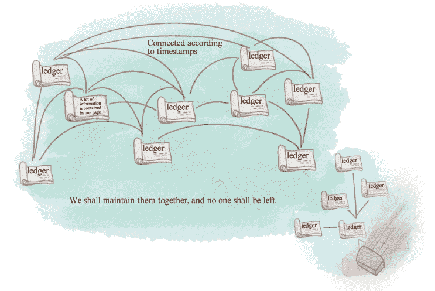
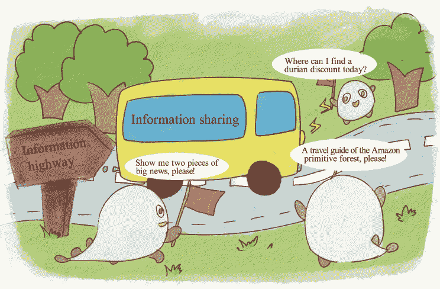
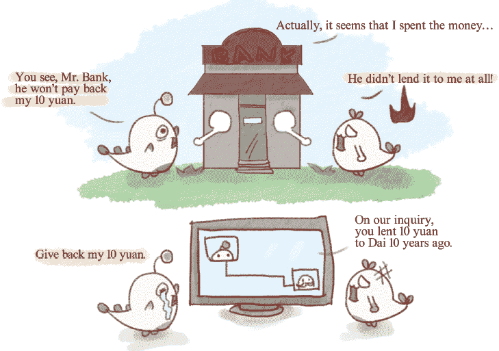
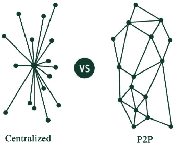
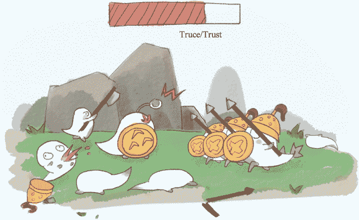
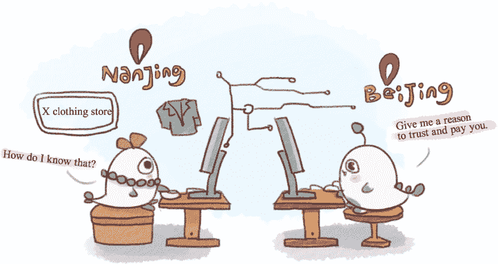
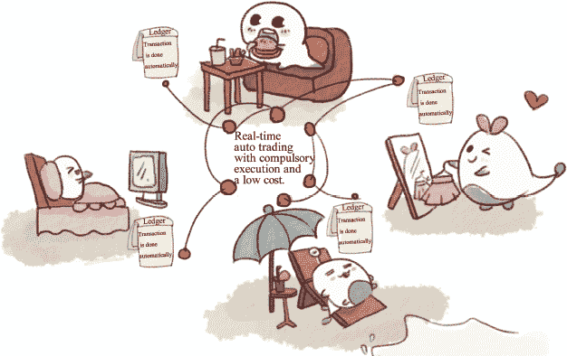
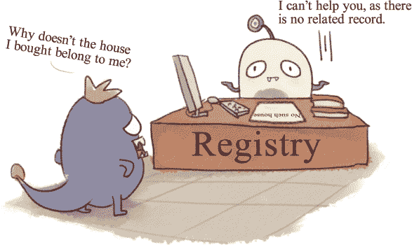
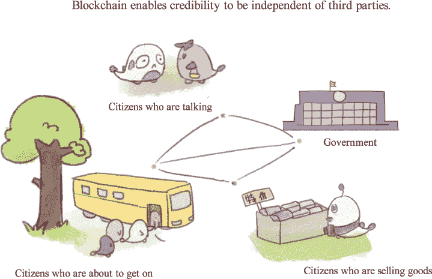
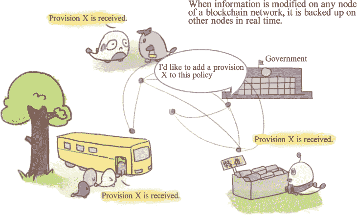

1.

区块链的起源

定义与偶然性背后的必然性

金融科技是一个现象级概念。随着互联网和技术行业的快速增长，金融科技行业的创新程序也经历了显著的发展，其中区块链技术无疑是最耀眼的。在未来五年内，区块链是最有前景的行业之一，也是许多金融机构和领先银行全球竞争和投资的新兴领域。

提到区块链，我们首先想要讨论的问题涉及一些为什么：为什么它如此受欢迎？为什么人们认为它能够改变世界？在开始这一章节之前，我已经阅读了许多关于这项技术的书籍，如《区块链革命》、《区块链金融》、《商业区块链》、《区块链社会》和《区块链重塑经济与世界》，在这些优秀的作品中，许多专家阐述了区块链能够繁荣的原因。他们从不同的角度出发，包括经济学、商业发展、人类历史和技术变革。阅读这些佳作之后，我甚至被区块链的魅力所吸引。因此，我将从以下四个角度解释区块链的起源和用途：账本的发展、价值转移、信用成本和技术创新。

图 1-1：旧石器时代的簿记。

账本的发展：账本的出现与衰落

“分布式账本”是定义区块链，这个 21 世纪最前沿的现象级概念的最代表词汇。首先，从账本的发展角度来看，让我们探讨以下两个问题：为什么发明了区块链？分布式账本技术如何具有改变我们经济和社会的力量？

图 1-2：胚胎期的簿记：描绘和草图。

在旧石器时代，人们在大脑中记录（他们每天猎杀或食用的动物数量）长达数万年。然而，随着部落人数的增长，他们的生产力变得更高，导致了生产过剩。与此同时，人们的需求变得非常复杂，大脑中记录已不再足够，需要改进的簿记方法。

因此，人们发明了两种方法：简单描述和图像绘制，分别意味着用各种符号记录和描绘已经发生的事情。这就是簿记的开始。

图 1-3：簿记的起源：通过打结记录。

然而，符号和图表，由于其繁琐和占空间的特征，也未能跟上簿记需求的日益增长。在这种情况下，通过打结来保持记录的方法被发明出来。这种著名的方法记载在历史文献和中学历史教科书上，定义了记录对象、数量度和最终结果的形式。此外，还可以找到几种记账原则，这种方法也使用过。因此，它几乎被公认为账本的开端。

在原始社会的晚期，生产力达到了新的高度，剩余产品增加，农业、畜牧业和手工业的分工扩大，这促成了文字的发明。字符和其他叙述形式被采用为记录计数的方式，其中收入和支出按时间顺序记录。

图 1-4：原始社会的结束：现金账户。

到了公元前 5 世纪早期，古希腊和罗马的奴隶社会的经济繁荣使得日记账和现金账簿成为可能。有了时间的分类、产品和人员的名称以及货币资本，这些账簿与账本非常相似。这个阶段被称为“单式记账时期”。

图 1-5：单式记账。

现在，让我们来看看广泛认可的复式记账。复式记账在中国得到了广泛采用，起源于明末清初的龙门账，后来发展成四柱账。西方最早的复式记账可以追溯到 12 世纪和 13 世纪，并广泛被银行家和商人使用。复式系统不仅能计算运营成本，还能产生资本和利润，确保公司的持续运营。

图 1-6：复式记账时期。

19 世纪见证了信息技术的爆炸式发展。当时，由于个人不再作为公司的所有者和经营者，需要处理的工作变得更加复杂，所有官员都有检查账本的需求。例如，如果我是一家公司的最大股东，但不愿意经营它，那么我可以雇佣一个职业经理人来做这项工作。

在一年结束时，当财务报告显示出我的奖金份额达到了一千万人民币，我会说我想查一下账本。然而，账本记录用于广告的费用达到了三千万人民币，远超过我的年薪，这让我对这本账的准确性产生了怀疑。

为了谨慎起见，我聘请了一位第三方认证的会计师，并请他负责记账。正是公司所有者与运营之间对会计需求的激增和互不信任，导致了会计师的出现。自那时起，计算机技术的迅速普及将会计带入了一个新阶段——计算机化会计。

图 1-7：19 世纪：会计师的出现。

在一个信息化、数字化和智能化的世界里，尽管记账方法不断改进和创新，我们仍然面临着信息不对称和信任危机等问题。简单地说，你怎么能信任会计师或审计提供的信息是正确的？你是否曾想过你的公司可能会与会计公司串通篡改账目？现在，区块链为我们提供了解决这些问题的方法——比特币的底层应用，可以被看作是一个共享的分布式账本。

图 1-8：分布式账本。

作为一种分布式账本，区块链具有以下特点：

首先，区块链是一个巨大的账本，每个区块都可以被看作是一页，每个新区块都会有一个新的页面，包括一个或多个条目。

其次，它是一个加密且有序的账本。所有记录信息都会被打包进加密且带有时戳的区块中，这些区块按时间顺序形成一个总账。

第三，它是一个由网络用户共同维护的去中心化账本。

历史见证了记账方式的巨大变化。现在，得益于技术，区块链已经成为了最新的、最值得信赖的记账方式。

价值传输：互联网之后会发生什么

互联网，这个大家再熟悉不过的概念，已经渗透到我们生活的方方面面。它充当着信息高速公路的角色，可以以高速低成本地传输除货币外的所有信息。然而，区块链技术却能解决这一问题，作为一个价值传输网络。

图 1-9：互联网的黎明。

你还记得互联网的故事吗？1993 年，美国宣布建立国家信息基础设施，这是一个新项目，旨在建设信息高速公路，使所有美国人都能共享和利用信息资源。这就是当今互联网世界的雏形。

如今，每个人都可以生产信息，并轻松迅速地传播。所有信息的快速传输将我们带入了一个信息爆炸的时代。为了满足人们对于多样化信息的需求，信息传输技术不断创新，正如云驱动和自动网络补充所证明的那样。

人们开始意识到，尽管大多数信息如视频、照片和音频可以通过复制和粘贴来使用，但对于某些信息，复制是没有意义且不可能的。

图 1-10：如何转移价值。

例如，通过复制货币来完成支付是不可能的。相反，这个过程涉及将从支付账户向收集账户转移货币。视频可以发布在不同的网站上并共享，而可以转移但不可共享的有价值资产通常需要信用背书。互联网是一个分享信息的很好工具，但它对处理价值转移无能为力。

让我们用更简单的方式来解释这个概念。价值转移意味着从地点 A 到地点 B 的价值或价值集合的转移，其中地点 A 减少的价值与地点 B 增加的价值相等。由于价值转移涉及两个独立方，A 和 B，这个过程将被双方认可，且无法被操纵。然而，当前的价值转移通常由一个集中的第三方背书，而不是直接传输，因为这个过程无法由当前的互联网协议完成。

图 1-11：集中的第三方。

通过政府或公司的背书，当前的集中式机构经常在中心服务器上处理价值转移的计算，这个过程不可避免地涉及到人类的“无限理论”和“机会主义行为”，从而将整个系统的信誉置于风险之中。这里产生了最基本的问题：如何就信用达成共识？

然后，随着时代的需要，区块链技术应运而生。区块链遍布全球，使得在远距离的开放平台上进行安全支付成为可能，一旦完成，交易将进入区块链作为永久的数据库。

图 1-12：区块链上的信用共识。

此外，网络中所有授权方都可以共享同一个账本。一旦账本被更改，所有副本数据的修改将在几分钟甚至几秒钟内完成。分布式账本中的每一笔交易都有一个唯一的时间戳，以避免重复支付。

区块链建立了一个纯粹的点对点价值转移系统。即使节点之间没有相互信任，它也能确保系统记录数据的完整性和安全性，并消除第三方的背书，有效降低交易的复杂性和风险。

最后，我必须提到区块链的另一个特点——可编程性，一种开放的技术。互联网的开放性已经迎来了新时代，我们可以假设区块链技术也将帮助我们探索一个新世界吗？

图 1-13：集中化与点对点结构的对比。

信用成本：你能记住多少张脸？

你是否思考过这个问题——你能记住多少张面孔？你是否听说过“E 租宝跑路”的事件？所有这些都导致了“信用共识”的概念。相信一个人要付出什么代价？一旦公众信任的机构出现问题，我们还能相信什么？

在研究部落时，人类学家发现每个部落的人口总是控制在约 150 人左右。原因是人数多了，他们几乎不可能记住每位族人的面孔，因此他们不会觉得彼此亲近。没有亲密感，信任就不会产生，部落间无尽的争斗和纷争便会出现。

Fig. 1-14：部落时代的信任危机。

在部落时代，可能只需一瞥就能让你挨上一拳。但如今，在互联网时代，人们为何趋向于信任遥远且陌生的商家，甚至将钱转给他们呢？原因在于，在交易过程中，我们的信任已经让渡给国家和大型企业这些机构。

尽管我们仍然不完全信任卖家，但愿意相信我国和大公司这些有背书的第三方。这成为了一种共同增进信任的方式。

Fig. 1-15：互联网时代的信任集中。

在诸多增进信任的方法中，最有效应对信任危机的就是区块链。作为支撑比特币金融系统的核心技术，区块链的本质是一个不断增长的分布式账本数据库，能充分解决信息系统中的信任问题。这一问题源于以下疑问：为何你应该相信一个陌生人？

他人为何应相信你？区块链通过算法证明机制来确保信任的安全。在区块链的帮助下，系统中的每个节点都能在可信环境中自动、安全地交换数据。与可能代价高昂且耗时的其他技术相比，区块链具有实时匹配、自动操作、强制执行和低成本的优势。

相较于人，技术更加值得信赖。区块链技术为我们带来了智能信任。举例来说：洪都拉斯长期受国内动荡和政府行政松散的困扰。因此，登记信息常常不完整甚至丢失。洪都拉斯政府通过将区块链应用于房地产合同登记和交易配置系统来解决这一问题。

Fig. 1-16：区块链带来的智能信任。

借助区块链的安全加密技术，我们不再需要担心由于政府潜在的腐败而使我们的产权受到侵害。

Fig. 1-17：政府腐败导致的产权篡改。

将来，所有类型的数字信息都可以添加到区块链中。只要它能进入区块链，财产权就可以得到明确，保护条件可以设定，交易合同可以自动形成并强制执行。你无需担心信任验证和执行问题，因为区块链会为你完成这些工作。接下来，我们将回顾 E 租宝事件，讨论信誉问题。

图 1-18：E 租宝事件。E 租宝事件背后的互联网金融悲剧[EB/OL]. [2017–05–18]. [`weixin.niurenqushi.com/article/2016–03–07/4176154.html`](http://weixin.niurenqushi.com/article/2016–03–07/4176154.html).

2015 年，E 租宝这家 P2P（点对点借贷）公司是个违规者。该公司在混乱时期崛起，并因其疯狂的扩张行为（使用惊人的犯罪手段）而被摧毁。这一事件震惊了中国。在被调查之前，E 租宝在中国的各大卫星电视频道的黄金时段进行了广泛广告宣传，利用国家电视台的信誉为其高风险的互联网金融产品背书。当一群缺乏专业知识的投资者遇到一群热衷于冒险的创业者时，悲剧发生了。

在现实社会中，人与人公司之间的交易需要得到信誉的支持。这里，信誉指的是社会世界中公共权力处理时间差异、沟通和利益交换时所表现出的公平、正义、透明、人道和民主的信任。在我们当前的社会中，信誉通常由政府、国家机关和政府授权的第三方组织提供。

图 1-19：区块链创造的信誉。

区块链技术可以更好地满足信誉的需求，并将信誉抽象为独立实体，而不是受政府或第三方组织的控制。因此，它可以形成一种“新的信誉模式”，实现政府、公众、区块链和信誉之间的相互监督。信任建立在区块链之上，而不是由单一组织控制，所以多方可以交叉验证和交叉监督信誉。

区块链信誉的特点有哪些？

1.   由于区块链是分布式的，分布带来的信誉具有网络上的各种独立节点，每个节点都包含备份信息的副本。每个授权人都可以从任何节点下载所有数据。同时，由区块链创造的信誉网络具有防篡改性。试图改变任何节点的信息都会被其他节点发现。如果更改的节点没有被确认，它将立即失去信誉。

2.   在区块链带来的信誉模式中，区块链不制定任何政策；它仅仅充当公证人和政府工具，来建立并实施政策。区块链帮助政府政策更快更准确地被公众接受和认可。同时，由于区块链指的是一个可复制的固定数据库，这些政策变得开放和透明。

从信任的角度来看，区块链使用共识数学方法在设备之间建立信任并完成信用创造。基于这一特性，区块链也显示了促进信誉方面的开创性意义。在《经济学人》杂志中，约翰·史密斯写道，“区块链是一个创建信任的设备，其核心是解决信用共识问题，可以说就是如此。”

Fig. 1-20: 区块链提供信誉的一个场景。

TECHNICAL INNOVATION: FROM BITCOIN TO BLOCKCHAIN

我们都知道，区块链是比特币的基础技术。它也是一种分布式数据存储模式或公共账本，记录加密货币（如比特币）的交易。

交易记录被加密并由运行此软件的所有设备持有。当我们讨论区块链时，自然会谈及数字货币，因为区块链是为了满足比特币的独特需求而创建的。比特币的概念来自一个神秘的人物——中本聪（Satoshi Nakamoto）。2008 年，他发表了文章《比特币：一种点对点电子现金系统》，该文章成为区块链技术和数字货币的基础。

Fig. 1-21: 比特币的出现。

这篇文章提出了比特币的几个基本原则：

1.   一个纯粹的点对点电子现金系统使得一方可以直接发起在线支付，无需涉及任何中介金融机构即可向另一方支付。

2.   无需信誉良好的第三方即可防止双重支付问题。点对点网络环境是解决双重支付的一个解决方案。

3.   所有交易都将被时间戳标记并合并到基于哈希算法的扩展工作量证明链作为交易记录。除非所有的工作量证明被完整复制，否则建立记录是不可更改的。

4.   最长的链将被认为是不仅证明了观察到的事件序列，还是基于 CPU 的最大计算能力的最大池。只要大部分 CPU 计算能力不被合作攻击节点控制，长度超过攻击者的最长链就可以生成。

5.   这个系统所需的基础设施数量相当少。它只需要节点尽最大努力在整个网络内传播信息。节点可以随时离开或重新加入网络。最长的 work 链将成为这个节点在离线期间产生的交易证明。

当考虑到上述所有观点和逻辑时，理论的可行性——点对点交易仅通过网络作为信用中介来实现，无需集中干预或参与，是令人信服的。

基于这样的理论，第一个比特币交易系统、第一个区块（“创世区块”）以及首个比特币支付案例相继出现。比特币至今已顺利运行八年，未出现任何严重技术错误。

图 1-22：比特币八年来的顺利运行。

实际上，作为比特币的基础技术，区块链与比特币之间的关系并非仅仅是“父子”关系。此外，区块链并非比特币的意外产物，而是与比特币同步诞生的。区块链反映了比特币的可行性，并提供了更广阔的交互可能性。
