2.

理论

共识创造编码信任

当我去年春节假期回家时，作为“节日惯例”，我被好奇的亲戚们问了各种问题。例如，你在做什么工作？你什么时候结婚？你每个月能赚多少钱？通常，我可以给他们满意的答案，但这次有点不同。当我告诉他们我在一家区块链技术公司工作时，80%的人继续问：“区块链是什么？”

我试图引用百度或谷歌上的区块链定义，并试图向他们解释我们用区块链做的酷事。然而，他们回应的是更加好奇和困惑的表情。“你为什么不能更简单地说？”

然后我意识到普通人无法理解百度或学术期刊中的专业严谨定义。我转向博客和知乎（中国的 Quora）试图找到一个简化的解释。关于这个话题的许多文章中，有两篇吸引了我的注意：一篇是在热门话题“如何向你的笨室友解释区块链”下最受欢迎的回答；另一篇是张同写在新浪博客频道的“区块链共识”。在这本书的以下部分，我引用了他们的观点，并尝试采用他们解释的方式——通过讲故事——来阐述区块链的定义。

什么是区块链？

区块链与骑手

2006 年，金融巨头如摩根大通、花旗集团、高盛和纳斯达克都对区块链技术表现出了浓厚的兴趣。什么是区块链技术（又名分布式账本）？我们从另一个故事开始。

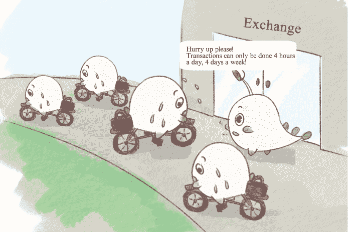

图 2-1：华尔街骑手。

在纳斯达克成立之前，人们骑着装满债券的自行车在华尔街进行债券清算和结算。随着商业的发展，自行车无法处理日益增长的交易量。在 20 世纪 60 年代，华尔街的交易只在工作日的四天内进行，每天四小时，以帮助结算跟上交易量。

这种做法无法继续。自行车永远无法超越计算机。1971 年，人们聚集在一起寻找解决方案。当时提出了 DTC 清算系统。在这个解决方案下，所有交易都应该包括在这个系统中的经纪人进行，纳斯达克仍然采用这种方式。显然，这个解决方案只是用“汽车”取代了自行车。在许多电视剧中，国家或家庭经常因为皇帝或家族头的死亡而陷入混乱。上述剧情的原因是集中化是不可持续的。当交易量和经纪人达到一定水平时，系统可能会瘫痪甚至崩溃。

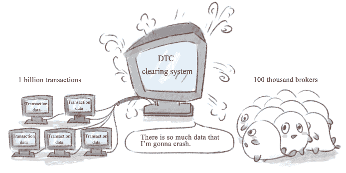

图 2-2：集中式 DTC 清算系统。

区块链是一个不信任的账本，每个节点展示和维护着中心账本。除非有人控制了超过一半的节点，否则账本无法被篡改。举个简单的例子：你保管家庭账本，管理父母的工资。如果你想买一些零食，账本的漏洞是几十元。如果你想买一个手机，账本的漏洞就是上千元。这只是个例子；我相信我们很多人小时候都渴望过父母给的零花钱。

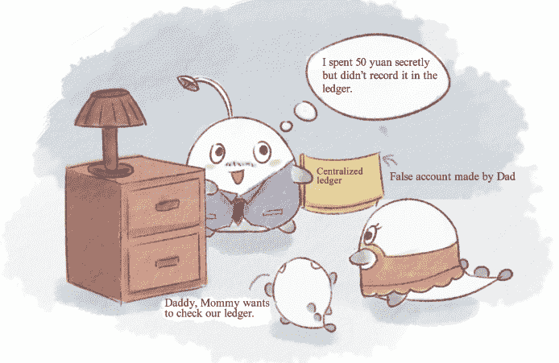

图 2-3：中心化的家庭账本。

在分布式账本技术下，上述场景永远不会发生。家庭成员人人参与记账，人人可以查阅中心账本。没有人能篡改账本。所以你爸爸的烟钱和你的零食钱是足够的。

本质上，区块链是一个去中心化和分布式的账本。它涉及一套基于密码学的数据块。每个数据块包含许多由比特币交易网络确认的信息片段。

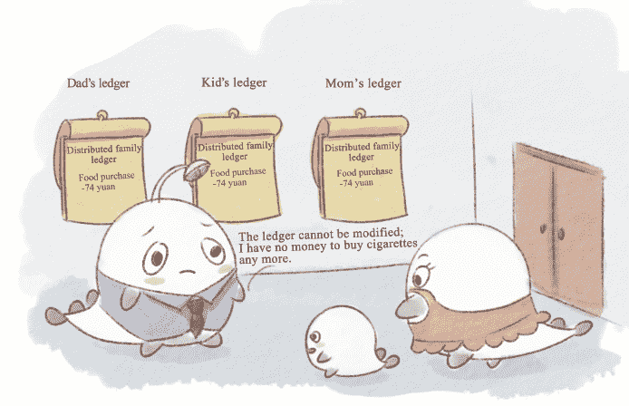

图 2-4：分布式家庭账本。

集中化和去中心化

如我们上面提到的，区块链是一个去中心化的分布式账本。“去中心化”是什么意思？首先，让我们想象一下这种情况：如果你在网上买书，你会做什么？

步骤 1：下单并把钱转到支付宝。

步骤 2：支付宝确认收到钱后，通知卖家发货你订购的书。

步骤 3：卖家收到支付宝的通知后开始发货流程。

步骤 4：你收到书并确认收货。

步骤 5：支付宝收到你的确认后，会将你支付买书的款项转给卖家。

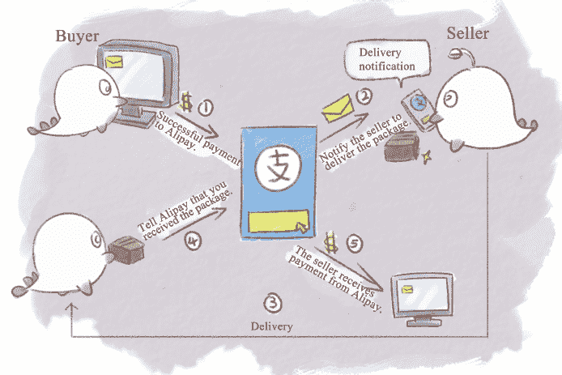

图 2-5：去中心化交易流程。

在上面的说明中，我们可以看出，尽管交易是发生在你和卖家之间，但支付宝才是真正的中心。因此，如果支付宝出问题，比如支付宝的服务器被流星撞击，或者阿里巴巴集团因全球经济危机而破产，整个交易过程都可能失败。你和卖家都无法证明交易，这将导致死路一条。

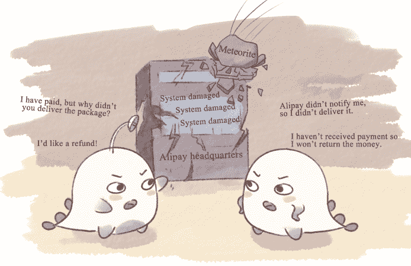

图 2-6：中心节点损坏导致整个交易失败。

一个基于区块链运行的虚拟城市

为了清晰说明区块链如何工作，我们不妨提出一个基于去中心化和分布式结构的简化情况。假设我们有一个有五个居民的去中心化城市——我们称他们为 A、B、C、D 和 E。当他们想要向别人借钱时，他们会这样做：

图 2-7：去中心化城市的账本。

假设居民 B 从居民 A 那里借了一元钱，A 通过大喊：“我是 A，我刚刚借给 B 一元钱。”来告知其他居民。随后，B 会大声说：“我是 B，我刚刚从 A 那里借了一元钱。”当其他居民——C、D 和 E——听到他们的话时，他们会在自己的账本上写下：“dd/mm/yy，A 借给 B 一元钱。”

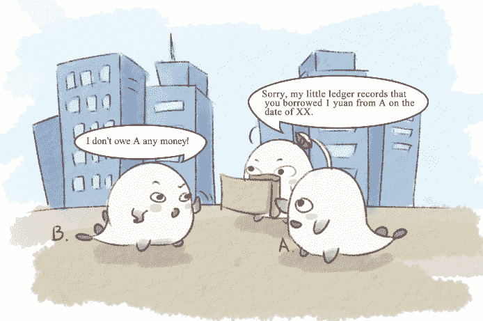

图 2-8：篡改分布式账本的不可能性。

在这个极其简化的、仅有五名居民的微型城市模型中，实际上建立了一个分布式系统，该系统中无需银行或支付宝，这意味着它可以在没有信任关系或可靠组织的情况下运行。当这个分布式系统中的每个人都保持自己的账本时，篡改记录将是不可能的。假设 B 改变主意，否认他向 A 借了一元钱？那么 C、D 和 E 将会在他们的账本上使用相同的记录为 A 作证——“dd/mm/yy，A 借给 B 一元钱。”

无论你是否注意到，在这种情况下，从 A 转移到 B 的钱并不重要，因为它可以被社区内所有人认可的任何其他价值概念所取代。例如，居民 A 说：“我创造了巴啦啦能量，”当其他人听到这个消息时，他们会记录下 A 拥有巴啦啦能量，尽管他们甚至不知道巴啦啦能量究竟是什么。接下来怎么办？居民 A 可以然后说：“我把一块巴啦啦能量转移给了 B。”当城市中的所有居民，包括 B、C、D 和 E 验证这笔交易时，这笔交易将正式有效。

图 2-9：巴啦啦能量的流通。

小城市中的几个问题

当然，区块链世界并不会那么简单。它还有其他规则和限制。我们先来解决以下问题：

问题一：为什么还要记录？

你向天空呼喊，别人就有义务帮你记录吗？他们的时间不花钱？他们的笔记本不花钱？所以，为了公平地请求别人帮我记账，我增加了一条新规定。我决定奖励第一个听到我呼喊并在他的笔记本上记录的人。奖励机制也很简单：第一个听到我呼喊并记录下来的人可以获得巴啦啦能量奖励。巴啦啦能量不是给你的；而是你劳动的报酬，就像工作赚钱一样。你帮我记账，整个系统会奖励你。要求如下：首先，你必须在我其他人之前听到我的呼喊并记录下来；记录后，你必须立即通知整个城市你已经完成了记录这句话，而且你和他们都没有重新记录的用处。这样，其他人就不会试图通过自己记录来获利。与此同时，你必须再做一件事，即在呼喊时加上一个唯一编号，这样下一个人可以继续这个记录和唯一编号。

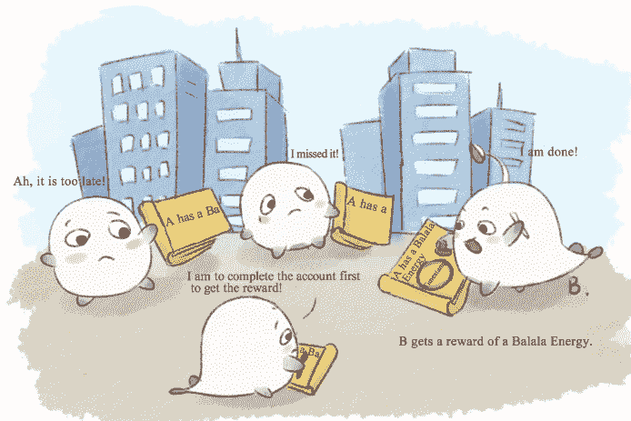

图 2-10：记账的奖励。

当这个新规则开始实施时，肯定会有为了获得巴啦啦能量而开始屏住呼吸，倾听周围呼喊的人，只为了能第一个记录新记录的人。了解一点区块链知识的读者可能会联想到“比特币挖矿”这个术语。没错。这就是比特币挖矿的简单解释。关于比特币挖矿，知乎上有一个用户名叫“凌龙睡醒”曾在一篇文章中提到一个更生动的例子。这个例子的大意是：当单身汉寻找女朋友时，“国母”会说这样的话，“我有很多美丽可爱的女儿，皮肤都很漂亮。如果你能解决我们这个麻烦的问题，我会把其中一个的微信号给你。”

图 2-11：“国母”的“麻烦问题”普遍存在。

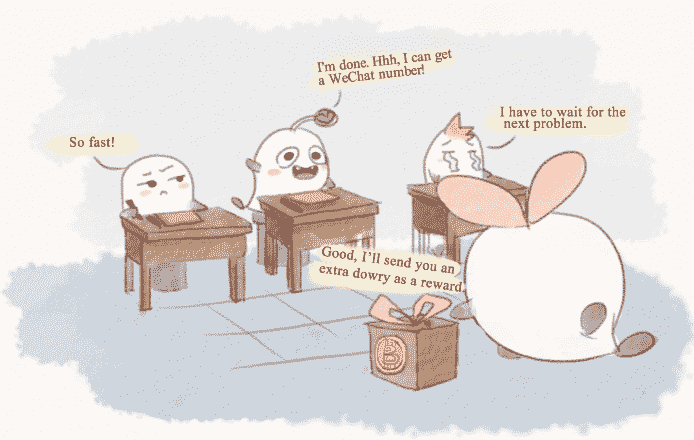

图 2-12：解决问题的奖励。

因此，单身汉们争相竞争，急于解决问题。只要他们中的一个人解决问题，他就会立刻向世界骄傲地宣称，并向所有人展示女孩的微信号是他的，说服其他人放弃。尽管其他单身汉已经出发，但他们不够快，因此不得不立刻解决下一个问题。1

同时，那个成功解决问题的单身幸运儿无需支付一两万元人民币的彩礼；相反，被他才华征服的“国母”，会给他一大笔财富作为嫁妆，即比特币挖矿的比特币奖励。

问题二：如何处理分叉？

在本节中，我们引用知乎（Quora 的中国版本）用户“Wangle-LaiW3n”发布的描述。在一个大城市中，B 和 C 完成记录并同时向天空大喊，“编号为 89757 的 Balala 能量属于我。”然而，城市如此之大，有些人声称编号为 89757 的 Balala 能量属于 B，而其他人则认为它属于 C。然而，唯一的编号为 89757 的 Balala 能量只能被一个人获得。那么，我们如何解决这个问题呢？每个人能拥有 Balala 能量的一半吗？显然，这是不可接受的。在这种情况下，我们将以一种非常原始和简单的方式解决这个问题，让长的信息链做出决定。

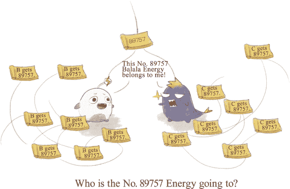

图 2-13：我们如何处理分叉？

如果没有限制，事件将会这样发展：一些人认为能量属于 B，在听到这个主张后开始记录。因此，他们所有后续的工作都是基于 B 拥有编号为 89757 的 Balala 能量这一事实。随着信息的传递，信息链会变得越来越长。而对于那些最初认为 C 主张拥有能量的人，结果也是类似的。

当 B 和 C 大喊他们对于编号为 89757 的 Balala 能量的主张后，整个单一的、精心编号的信息链会分成两个分支。如果问题不能立即解决，每个人都会拥有自己信息版本，没有人能弄清楚哪个是正确的。

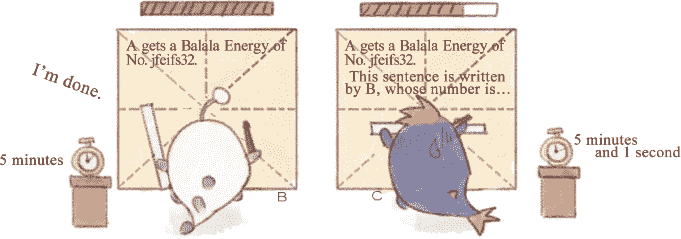

图 2-14：每次记录规则都极其复杂。

为了解决这个问题，城市在区块链上增加了新规则。记录必须写在最顶部的网格中，并且记录中心与 matts 上缘之间的距离必须保证为 0.89757 毫米。因此，每个人在用尺子确定好位置后都必须写下内容，这非常困难。每个人完成记录需要五分钟，而写下索赔句子所需的时间各不相同。因此，当别人大喊“我完成了。这句话是 XYZ 写的。”时，正在写下句子的人会停下来，开始另一行内容：“XYZ 写了这句话，编号是 XXX。”

问题三：双重花费

双重花费是指同一数字现金在同一交易中被使用两次的现象。

如果我同时对 B 和 C 大喊，“我给你一个 Balala 能量，”我能用这个 Balala 能量做什么呢？Balala 能量只有一个，我怎么确保这个唯一的 Balala 能量只在一次真实交易中使用？

以比特币为例。中本聪在比特币白皮书第五节中明确指出比特币网络运行如下：

1.   新交易被广播到网络上。

2.   每个节点将接收到的交易信息纳入区块。

3.   只有当区块中的所有交易都是有效的并且是第一次出现时，其他节点才会认为区块是有效的。

4.   其他节点争辩说，他们通过跟随区块的末尾并创建一个新的区块来延伸信息链，将区块的随机哈希视为新区块的随机哈希。

换句话说，自从比特币交易开始以来，交易数据中就已经加入了时间戳，交易数据被包装进区块时完成确认。连续确认六次后，交易变得不可逆转。对于比特币来说，每个确认都需要“解决一个复杂问题”。也就是说，每个确认需要一定的时间。

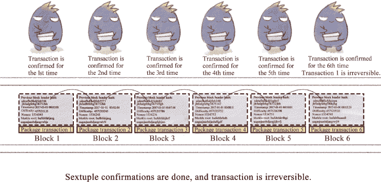

图 2-15：六次确认后的不可逆转。

在这种情况下，当我尝试重新使用资金来支付交易时，由于确认所需时间较长，几乎不可能同时实现两笔交易的确认。一旦第一笔交易被确认有效，第二笔交易就无法得到确认。在达成全网络共识的前提下，区块链网络全程记录是可以实现的，这样就不会出现双重花费的问题。

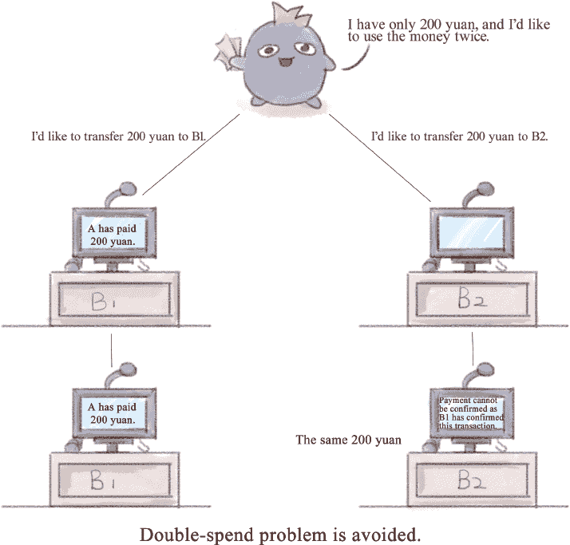

图 2-16：双重花费不会发生。

区块链是如何工作的？

区块链的核心概念

在解释区块链的工作原理之前，我们先简要介绍区块链中涉及的一些核心概念。

A. 区块

区块作为区块链的基本结构单元，由包含元数据的区块头和包含交易数据区块体组成。

区块头包含三组元数据：

1.   用于连接前区块和从父区块中索引哈希值数据；

2.   挖矿难度，Nonce（随机数，用于工作量证明算法的计数器），时间戳；

3.   能够总结并快速计算出所有交易数据的 Merkle 根数据。

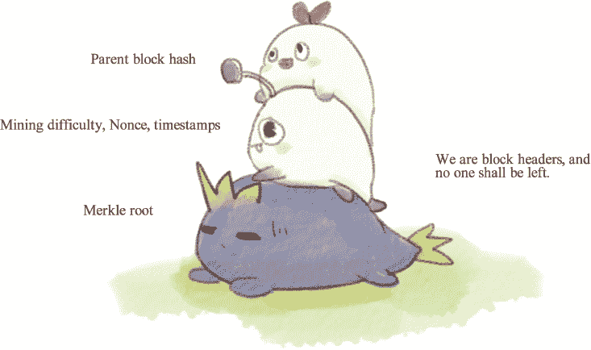

图 2-17：区块头的结构。

每隔十分钟，区块链系统可以创建一个区块，其中包括了该时间段内网络上的所有交易信息。每个区块还包含前一个区块的 ID（识别码），这使得每个区块能够找到其前一个节点，从而形成一个完整的交易链。自诞生以来，整个网络只形成了一个主区块链。2

B. 哈希算法

哈希算法是区块链中的一种单向密码机制，用以确保交易信息不会被泄露。在接收到明文后，哈希算法将其转换成固定长度且更短的哈希数据，这个过程是不可逆的。

它有两个特点：

1.   加密过程是不可逆的，这意味着我们不能通过输出哈希数据来反推出原始明文。

2.   输入明文和输出哈希数据相对应，这意味着输入信息的任何变化都将不可避免地导致哈希数据最终输出的变化。

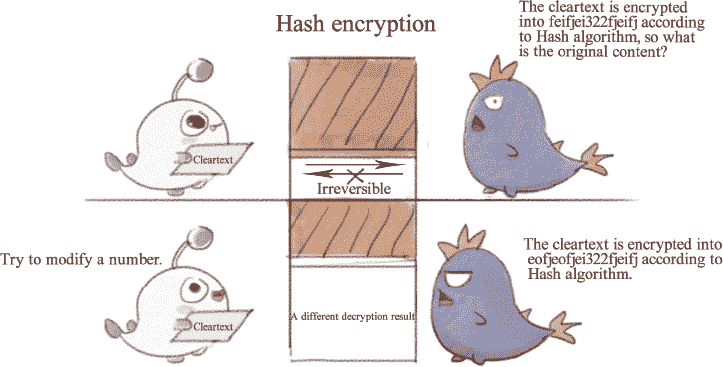

图 2-18：哈希算法图的两个特点。

在区块链中，通常使用 SHA-256（安全哈希算法）进行块加密，该算法的输入长度为 256 位，输出 32 字节的随机哈希数据字符串。3

区块链在交易块中使用哈希算法加密交易信息，并将消息压缩成一个由数字和字母组成的哈希字符串。区块链的哈希值可以唯一且准确地标识一个区块。区块链中的任何节点通过简单的哈希计算都可以获得该块的哈希值，计算出的哈希值不会改变，这意味着区块中的信息保持未泄露。

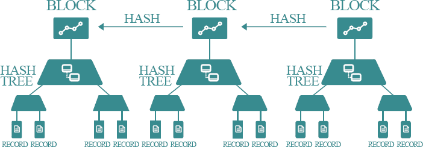

图 2-19：区块链中的哈希算法。

第三章 公钥与私钥

关于区块链，我们经常听到公钥和私钥这些术语。它们通常被称为非对称加密，这是一种改进于之前的对称加密（如使用用户名和密码）。我们用电子邮件加密模型简要介绍公钥，它是供所有人使用的。你可以通过电子邮件发布，并通过网站让其他人下载。实际上，公钥用于加密/验证印章。私钥只属于你一个人，你必须非常小心地保管它，最好设置一个密码。私钥用于解密/签名，由个人拥有。4

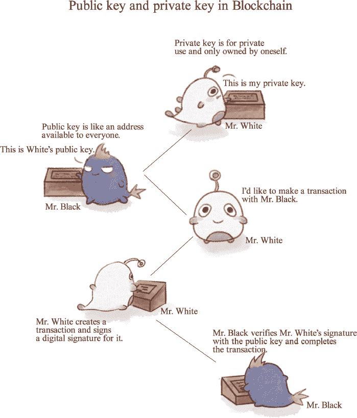

图 2-20：区块链中的公钥和私钥。

在比特币系统中，私钥本质上是一个 32 字节的数组。公钥和地址都基于私钥生成。有了私钥，就可以生成公钥和地址，进而可以花费相应地址上的比特币。使用私钥花费比特币就是签署对应的未花费交易。

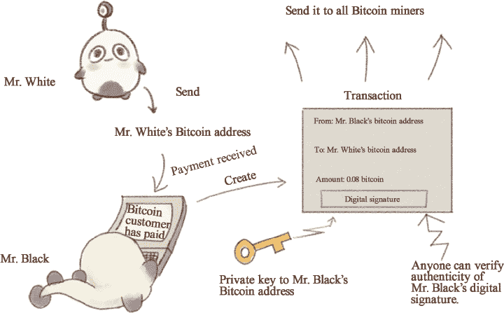

图 2-21：使用公钥和私钥完成交易。

在区块链中，公钥和私钥用于身份验证。假设区块链中有两个人，汤姆和杰瑞。如果汤姆想要证明他真的是自己，他只需要使用私钥签名文件并发送给杰瑞。然后杰瑞使用公钥来验证文件的签名。如果验证成功，这就证明了这个文件一定是汤姆用私钥加密的。因为汤姆的私钥只能由汤姆持有，所以可以验证汤姆确实是汤姆。在区块链系统中，公钥和私钥也可以确保分布式网络中点对点信息传递的安全。在区块链信息传输中，信息传递的公钥和私钥的加密和解密通常是未配对的。

对于发送方，私钥用于签名信息，而信息接收方的公钥用于加密信息。对于信息接收方，发送方的公钥用于验证发送方的身份，私钥用于解密加密的信息。

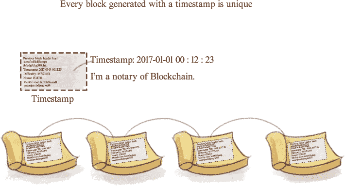

图 2-22：区块链中的时间戳。

D. 时间戳

区块链中的时间戳从区块生成的那一刻就存在于区块中。它对应于每个交易的验证，证明其真实性。时间戳直接写入区块链，而区块链中已生成的区块无法被篡改，因为一旦被篡改，生成的哈希值会发生变化，成为无效的数据。每个时间戳还会在其随机哈希中包括前一个时间戳。这个过程会重复，依次链接，最终形成一个完整的链。

E. 默克尔树结构

区块链使用默克尔树的数据结构来存储所有叶子节点的值，并以此为基础生成统一的哈希值。默克尔树叶子节点存储数据信息的哈希值，而非叶子节点存储下面所有叶子节点组合的哈希值。5

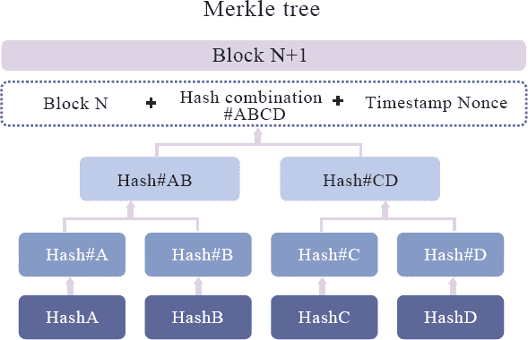

图 2-23：区块链中的默克尔树结构。

同样，区块中任何一项数据的改变都会导致默克尔树结构的改变。默克尔树结构可以显著减少交易信息验证比较中的数据计算量，我们只需要验证默克尔树结构生成的统一哈希值即可。

当我们谈论比特币病毒时，我们已经讨论了区块链的一些核心概念和定义，但是它是如何工作的呢？为了解决这个问题，我们必须开始谈论比特币，这时很多人的第一反应就是提起比特币病毒。要接近比特币病毒事件的话题，我们必须首先谈论比特币究竟是什么以及它的特点，描述全世界都知道的东西。还记得被比特币支配的恐惧吗？

那天早上，你醒来发现屏幕上弹出一个难看的红色框架。你很兴奋，因为终于不需要写论文了。

图 2-24: 比特币病毒入侵。

2017 年 5 月 12 日，网络上发生了一件小事。许多学校和医院的文档被一种名为“永恒之蓝”（也称为 WannaCry）的勒索软件蠕虫锁定。它声称如果你想看到信息，你需要支付。并不多，300 个比特币。乍一看，有人可能认为只有 300 个，这么少。实际上，在中国，一个比特币的价格几乎等于 10000 元人民币，因为中国的比特币平台受到监管，因此无法提现。在其他国家的价格更高。当然，对于个人用户来说，没有必要给这么多钱；毕竟，不是每个人都有 300 亿元人民币。

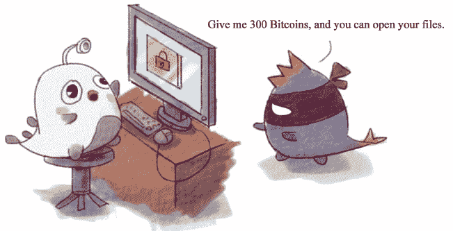

图 2-25: 需要比特币解锁。

黑客希望每个人都能用比特币支付，但比特币的问题并不在于此。比特币是一种硬币，静静地躺在一边，早上醒来发现自己在头条。直到 2017 年 5 月 16 日，超过 30 万用户在 150 多个国家受到了“迫害”。此外，据说“永恒之蓝”病毒已经升级到 2.0 版本，不再受域名限制，传播性更高。

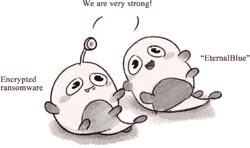

图 2-26: “永恒之蓝。”

那么，比特币病毒是什么呢？它可以被认为是一种神奇的病毒，是两者的混合体——加密算法勒索病毒和“永恒之蓝”黑客工具。 “永恒之蓝”黑客工具负责不点击就进入人们的电脑，然后加密算法勒索病毒在勒索之前加密你的文件。比特币病毒从何而来？加密算法勒索病毒其实是一个“老朋友”。Cryptolocker，世界上第一个记录的勒索软件，于 1989 年作为一个使用加密算法进行勒索钱的程序诞生。病毒制造者在几天内被抓获。

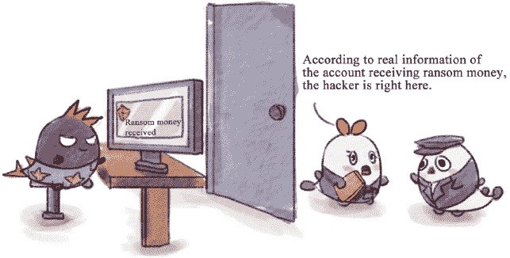

图 2-27: 加密锁病毒制造者被捕。

实际上，Cryptolocker 在最初是很简单解决的，因为它使用的是对称加密算法，很容易被逆向工程破解。然而，像 Wallet 和 Onion 这样的勒索软件病毒目前使用的是非对称加密算法。非对称加密算法的加密和解密过程使用两个不同的密钥，因此简单地逆向工程程序是不可行的，我们将在后面详细解释。然而，这次黑客不仅改进了勒索软件蠕虫，还为其配备了一个“好伙伴”——“永恒蓝”黑客工具——可以在你点击任何链接的情况下直接占领你的电脑。还有“永恒蓝”病毒的美丽传说，据说曾被国家安全局用于窃取其他国家的情报，并列入“美国武器库”。

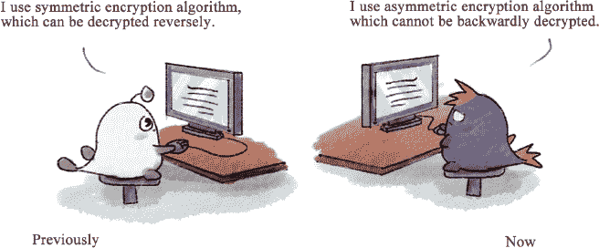

图 2-28：非对称加密算法的不可逆特性。

美国国家安全局有一个名为“方程式组织”的黑客组织，负责美国政府无法被逆向工程破解的机密工作。

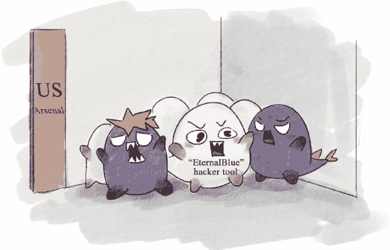

图 2-29：“美国武器库”的传说。

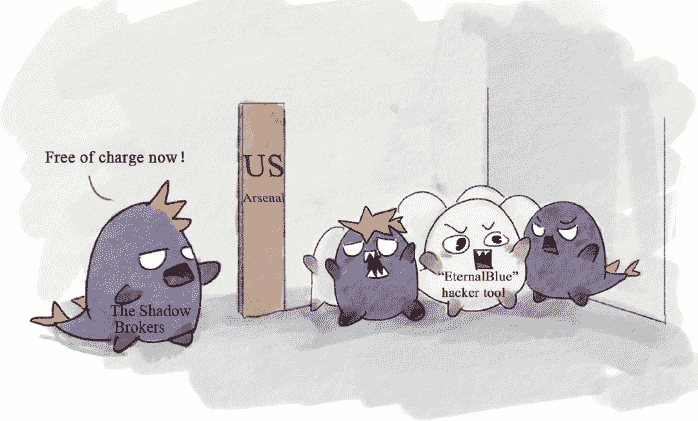

图 2-30：“影子经纪人”的传说。

后来，该组织因伊朗核试验的著名“震网”事件和“棱镜”事件而闻名。随后，一个名为“影子经纪人”的黑客组织破解了“美国武器库”。他们在网上举行拍卖，用钱出售这些“武器”，但没有人感兴趣。然后，他们发起众筹，想从这些“武器”中获利，但仍然无人关注。随后，在 2017 年 4 月 14 日，他们直接发布了这些“武器”。从那时起，“永恒蓝”黑客工具和加密算法勒索病毒成为了“致命武器”。

实际上，这只是一个美丽的传说，国家安全局并没有承认。因此，关于“永恒蓝”来自何处存在不同看法，并且没有实际证据。病毒何时能被破解？首先，我们需要了解“永恒蓝”黑客工具攻击的是 Windows（微软的操作系统）漏洞，这意味着只要你用 Windows 补丁更新并开启防火墙的主动防御，这个工具就没有生存的土壤。

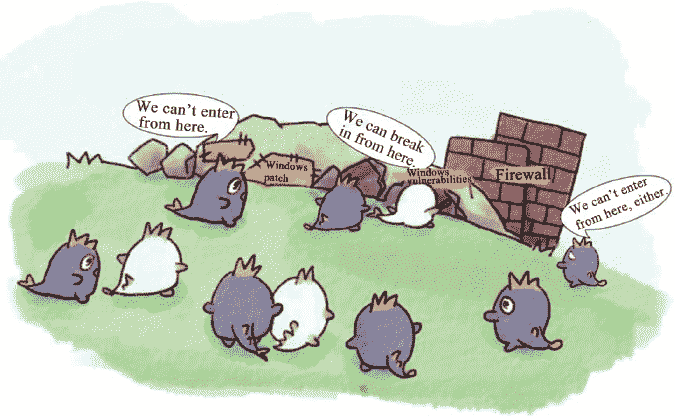

图 2-31：升级防火墙。

然而，Windows 总是有新的漏洞。也许黑客会为病毒配备一个工具来攻击新的漏洞，从而产生各种病毒，比如“永恒红”、“永恒黄”等。众所周知，勒索软件病毒使用非对称加密算法进行加密。其最显著的特点是无法被篡改或逆转。加密和解密过程使用两个不同的密钥。

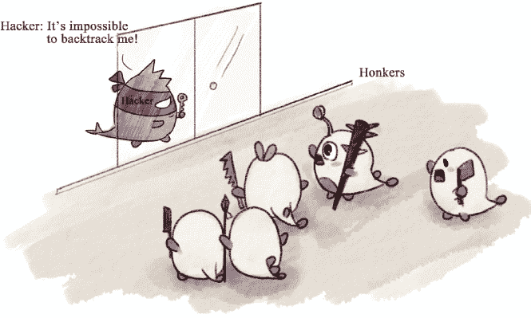

Fig. 2-32: 破解非对称加密算法很难。

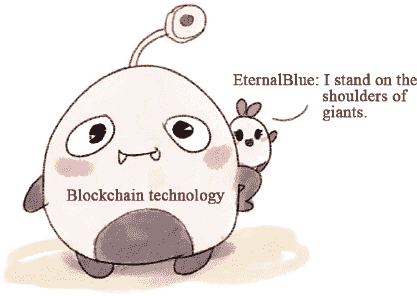

Fig. 2-33: 站在巨人的肩膀上。

现在，计算机无法完成所需的逆向计算量，因为成本太高。因此，全球最热门的区块链技术正在使用非对称加密算法。也就是说，黑客基于当时最先进的技术设计密码。我们很难破解它们。

回想一下著名的中毒“熊猫烧香”病毒是如何被最终破解的。黑客被捕，被迫编写一个程序来破解它。这种情况仍然是常态。最可能的解决方案是抓到黑客并迫使他交出钥匙。我们输入钥匙后，就可以解锁它。

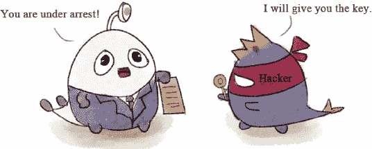

Fig. 2-34: 黑客交出了钥匙。

比特币黑客何时何会被抓到？这些问题涉及到第三个问题，即黑客为什么需要用比特币支付？答案是因为比特币的匿名性，使得很容易逃脱。比特币是一种可以在匿名状态下在线流通的虚拟货币，这使得黑客更容易隐藏他们的身份。你不需要知道对方是谁；一个比特币地址就可以实现点对点转账。黑客选择比特币的另一个原因是，比特币在全球范围内被认可并可以全球流通。比特币在数字货币中占据最大份额。在全球有许多“粉丝”。许多国家承认比特币的法律地位，一些大型公司甚至接受比特币支付。

Fig. 2-35: 比特币的国际化。

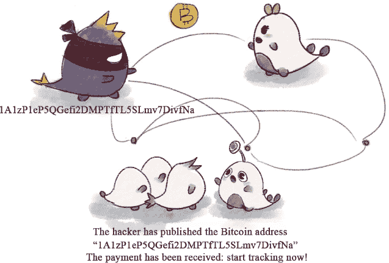

Fig. 2-36: 比特币交易记录是公开的。

然而，由于比特币的一个特性是不可妥协，黑客并不容易逃脱法律的制裁。所有记录都无法被篡改且是公开的。一旦黑客发布的地址收到比特币，就会在账本上添加一条记录，并且所有人的账本同时更新。每个人都可以找到这个记录。这个地址的转账和提现记录也是可验证的。只要黑客进行提现等需要与现实互动的操作，无疑会透露线索。

实际上，在大多数情况下，比特币业务并非百分之百匿名。转移比特币类似于作者以笔名发表作品。如果一个作者的笔名与他/她的身份关联，那么他/她所写的一切也会关联起来。对于个人来说，比特币的匿名性与接收比特币的钱包有关。涉及这个地址的每一笔交易都会永久存储在这个区块链中。如果你的地址与你的真实身份相关，那么每一笔交易都会与你相关。现在许多国家都在监控比特币交易平台，交易需要多重实名认证。

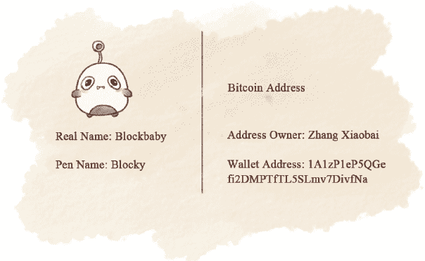

图 2-37：比特币并非百分之百匿名。

因此，只要找到关于黑客真实信息和身份的任何线索，那么他/她很可能会被抓住。

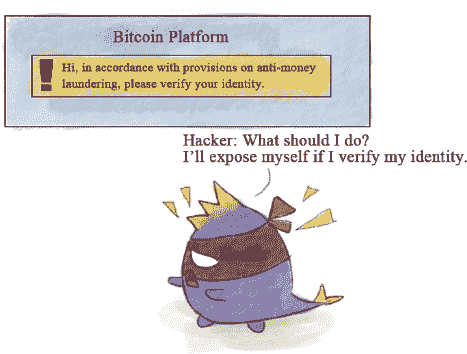

图 2-38：多重实名认证。

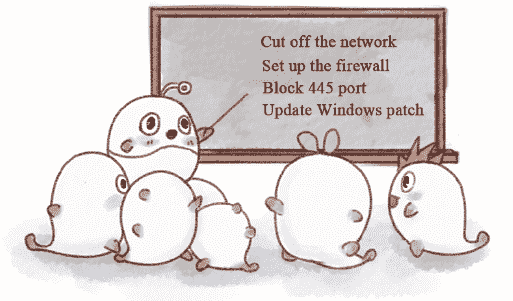

图 2-39：解决方案一：搜索。

如何防止“永恒之蓝”病毒

解决方案一：搜索

现在，打开你任何一个浏览器，在输入框里输入“如何防止比特币病毒”，你会看到大量的解决方案涌现出来。你可以点击任何一个查看，它们都一样。你只需要断开互联网，设置一个防火墙，封锁端口 445，并更新 Windows 补丁。我建议你长期养成打开防火墙的习惯，尽管 Windows 防火墙时不时会弹出。安全至关重要。

解决方案二：以火攻火

如果再次发生这种情况，我们应该怎么办呢？你可以尝试这个方法：黑客试图加密的是我们的重要文件，它们的扩展名是 doc（文档）、xls（电子表格）、ppt（演示文稿）、psd（图片文件）等。黑客不会加密一些不流行格式中的视频和种子文件。因此，除了再备份重要文件几次，我们还可以将它们制成压缩包，并改为像.modv 这样的不流行格式。当然，这并不能使重要文件完全免疫于破坏。

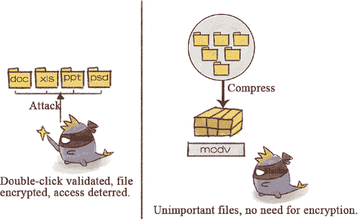

图 2-40：解决方案二：以火攻火。

解决方案三：抢他的工作

这一招最妙的地方在于，你可以把黑客赶走。这也适用于那些会编写带有非对称加密的“病毒程序”来加密个人电脑上所有文件的程序员。因为他们自己知道密码，所以每次查看文件前都需要输入密码。虽然有点乱，但确实有效：“这是我的，你找不到任何获取它的方法。”

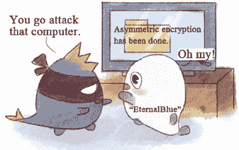

图 2-41：解决方案三：抢他的工作。

需要提醒你的最后一点是，在中国，比特币不能提现。因此，你在支付赎金时应该谨慎考虑。毕竟，我们无法确保付款后不会有第二次入侵。面对病毒，我们应该保持冷静。

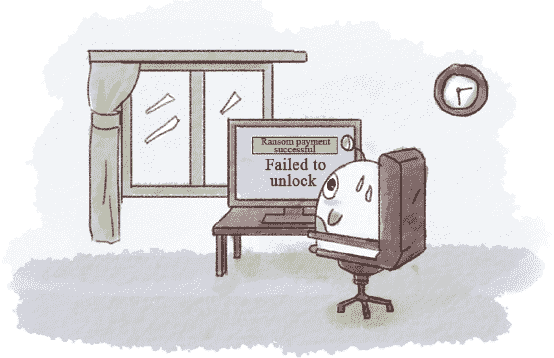

图 2-42：支付赎金后未能解锁。

由于我从事区块链和比特币行业，自从病毒爆发以来，我接到了很多亲戚的电话，问的问题比如“我听说你研究病毒，你在逃跑吗？”工作日的时候，我总是被问到，“请分享你的看法，操纵者什么时候能被抓住？”

黑客之所以用比特币进行勒索，是因为它具有匿名性和去中心化等特性，可以帮助他们隐藏身份。但我一直认为，技术本身是无辜的，比特币和区块链也不应该承担责任。

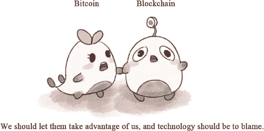

图 2-43：技术本身是无辜的。

比特币的工作流程

如图 2-44 所示，在区块链中，所有的节点都会回溯到源头，这也是区块链的第一个区块——“创世区块”。

在创世区块（Genesis block）创建之后，比特币的用户们一直在“解决问题”。他们通过计算，试图找到符合特定 SHA-256 散列值的数值解。

这个过程被称为“比特币挖矿”。

无论哪个用户先得到符合要求的数值解，它都会通过网络广播出去。然后，其他节点会接收到这个信息并验证它。一旦验证通过，其他节点就会停止计算，并在前一个区块之后添加新的区块。

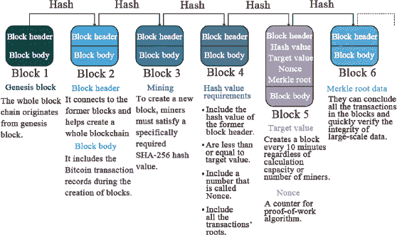

图 2-44：比特币的工作流程。

越来越多的用户加入比特币的区块链系统，越来越多的数值解被发现。在重复的过程中，新的区块不断被生成和验证。最后，形成了一条主链。与此同时，散列算法的难度被调整，以控制用户获得解决方案的时间。

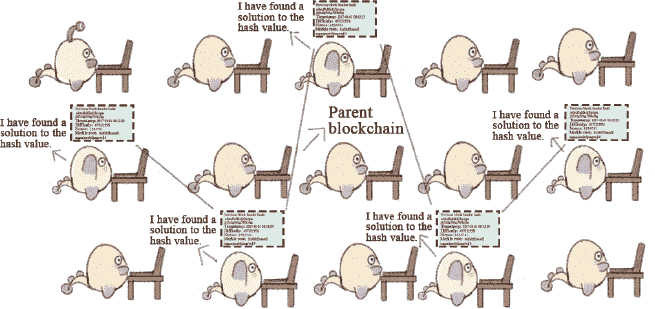

图 2-45：找出符合散列值的数值解。

在比特币的实际交易过程中，假设用户 A 和用户 B 要进行一笔交易，那个区块会广播给所有区块链的用户，让他们去验证。一旦交易被验证，这个区块就会有时间戳，并被添加到区块链的主链中。

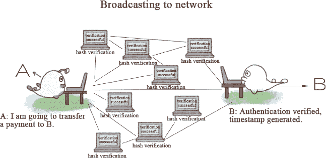

图 2-46：使用时间戳。

区块链的本质是一个公共的相互验证会计系统，它记录了所有账户的交易。任何账户的每一次变化都会记录在总账中。所有用户都有一份完整的账本，他们可以独立地计算出所有账户以及每个人的当前余额。

由于所有的统计数据都是透明的，每个人都可以检查源代码。这样，人们会信任去中心化系统，而不担心任何隐藏的阴谋。

BITCOIN HARD FORK

自 2009 年诞生以来，比特币市值攀升至数十亿美元，许多人对此都疯狂痴迷（请注意，根据中国的政策，比特币不是货币）。最近，一些人预测，当分叉不可避免时，比特币甚至可能暴跌。

图 2-47：比特币分叉不可避免吗？

中本聪的决定

回到 2009 年，当中本聪在设计比特币时，手头的数据有限，因此他决定一个区块的容量为 1M（兆字节）。然而，一笔交易占用 250 字节甚至更多。有些交易甚至需要 500 字节。显然，这个容量远远不够。

让我们一起做数学题：

一个区块的大小是 1M，1M=1,024KB=1,048,576B。

那么一个区块可以容纳的交易数量是 1,048,576÷250 ≈ 4,194.3。

验证一个区块的时间是 10 分钟，10 分钟=600 秒。

因此，每秒可以验证的交易数量是 4,194.3÷600 ≈ 7。

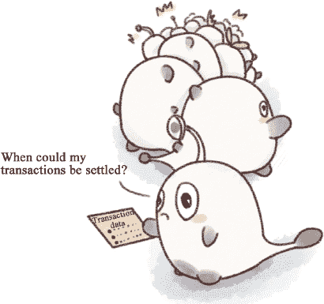

图 2-48：1M 的容量显然不够。

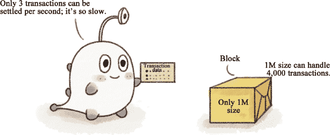

图 2-49：区块需要扩容。

每个区块只能验证每秒七笔或更少的交易，这无疑会导致交易拥堵，从而降低验证速度。一旦一笔交易完成，它必须等待在长长的队列中才能被验证。总有一天，拥堵将达到极限，导致整个系统崩溃。

不同的扩容计划

我们应该如何处理这个问题？开始改变！

如何改变？我们找不到中本聪！那么我们应该转向谁？中本聪将比特币系统的维护托付给了五个极客！

再说一次，如何改变？

听我说：我们应该把区块大小扩展到 2M。

不，它应该是 20M。

许多人代表他们的利益集团提出了自己的扩容计划。

1.   Bitcoin Classic：这个字段的最大值应该扩展到 2M，未来计划取前 2,016 个区块的中位数，并乘以一个预定的倍数来确定下一个区块大小的上限。

2.   Bitcoin XT：最大值应该是 20M，并且每两年翻倍，直到上限达到 8.3G（Gbyte）。

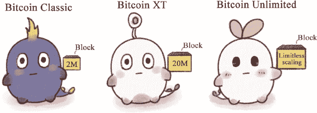

图 2-50：不同的扩容计划。

3.   Bitcoin Unlimited：最大值可以是任何数字——甚至是无限大——矿池应该决定其大小。

由于每个群体都认为他们的计划是最好的，因此还没有达成任何协议。我们现在应该做什么？如果我们能创建一个比特币的升级版本，并且每个人都同意加入新系统，那么就不需要分叉。然而，我们应该如何让大家都同意升级？

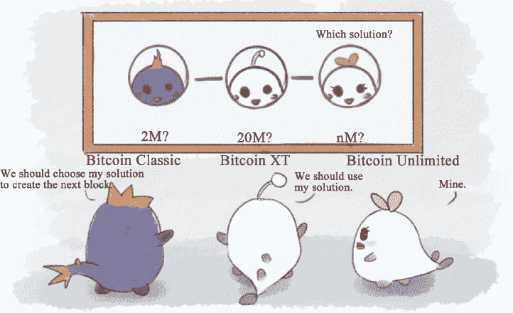

图 2-51：扩容计划的分歧将导致分叉。

不同的意见和想法导致了各种扩容计划的产生，这些计划无法统一。因此，比特币分叉变得不可避免。实际上，将来提出的规模可能会更大。

硬分叉与软分叉

硬分叉与软分叉的区别是什么？简单来说，就是兼容性的差异。软分叉是临时的，而硬分叉是永久的。当新的共识发布后，区块链上的永久分歧发生时，一些未升级的节点无法验证升级区块——那么就发生了硬分叉。

图 2-52：硬分叉的结构图。

以下是硬分叉的定义：在比特币的区块格式或交易格式发生变化后，在旧链上添加一条平行链，未升级的节点拒绝验证由升级节点创建和验证的区块。7

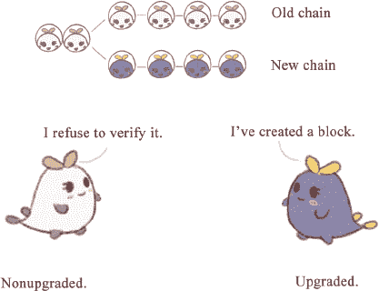

图 2-53：硬分叉是什么？

以下是硬分叉的特点：

1.   没有向前兼容性，之前的版本将被强制升级。

2.   将会有两条平行的链：旧链和新链。

3.   节点需要在某个时间点达成分叉共识，那些不同意的人将留在旧链上。8

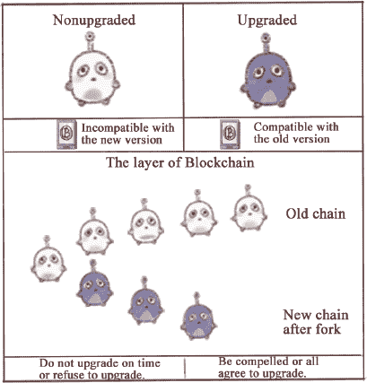

图 2-54：硬分叉的特点。

当一个新的共识被推出时，可能会暂时出现分叉，因为未升级的节点会创建非法区块，因为它们没有完全理解新的共识。因此，软分叉的定义是：当比特币交易的数据结构发生变化时，未升级的节点可以验证升级节点生成的区块，升级节点也可以验证未升级节点的区块。9

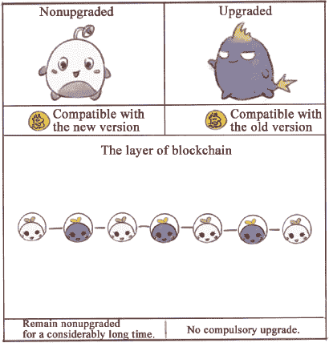

图 2-57：软分叉的特点。

有趣的例子

让我们以修复宫殿为例。假设有一个比特币王国位于一个孤岛上，这个王国的宫殿已经承受了多年的侵蚀并开始出现破败。宫廷中的一些大臣建议国王拆除宫殿并重建，而一些人则认为修复和 restoration 可以让宫殿看起来焕然一新。两组人相互争吵，都无法说服对方，这导致了分叉。

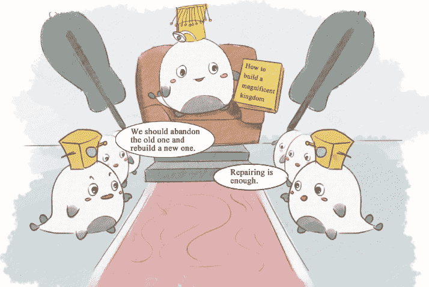

图 2-58：比特币王国的例子。

图 2-59：说明硬分叉的例子。

硬分叉何时会发生？因为两个团体无法达成协议，他们决定分别实施他们的计划。那些提议重建宫殿的人雇佣工人重新建造，那些坚持修复的人保持宫殿的旧部分。这种情况可以与比特币世界中的硬分叉相比较，当新链在某个时间点从旧链中分离时，这两条链彼此不兼容。

当发生软分叉时会发生什么？让我们回到比特币王国。为了防止两个团体之间的争论陷入僵局，他们同意妥协。双方都可以对宫殿做他们想做的事情，并承认彼此实践的合法性。同样，在比特币的世界里，当发生软分叉时，未升级的节点可以坚持旧规则，而升级的节点将开始采用新的规则。例如，在比特币核心提出的 Segwit 之后，没有产生新币。

图 2-60：软分叉的说明。

分叉的影响是什么？

首先，让我们看看一个最近的、成功的分叉。2016 年 7 月，以太坊开发团队通过修改以太坊软件的代码，将 DAO（分布式自治组织）及其子 DAO 的所有资金强制转移到区块 192,000 的特定退款合约中。因此，该地址“夺回”了由黑客控制的 DAO 合约的以太币。之后，形成了两条链，一条是原始链的 ETC，另一条是新链的 ETH。然后就发生了硬分叉！

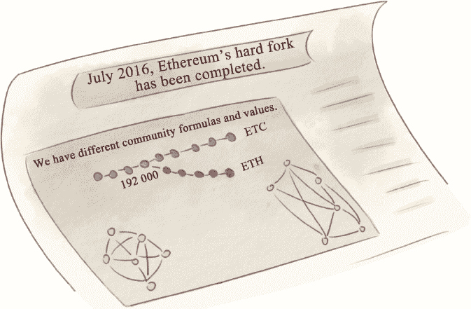

图 2-61：以太坊的硬分叉。

它对矿工产生了巨大影响：分叉后矿工的挖矿可能会变得更容易，但由于市场的不确定性，硬币的价格将更加不可预测。

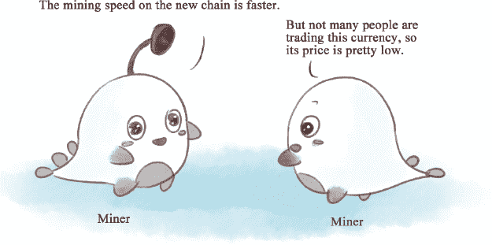

图 2-62：对矿工的影响。

硬分叉对比特币产业链的影响

从技术角度来看，硬分叉的主要问题是它需要所有用户都转移到具有不同规则的新区块链。为了维护比特币的品牌价值和人们对比特币的信仰，比特币的支持者反对硬分叉。如果真的发生硬分叉，它可能会引发网络战争和共识战争。

硬分叉对比特币价格的影响

市场决定比特币的价格波动和前景。从理论上讲，比特币价格在硬分叉后会首先经历一段低迷期。

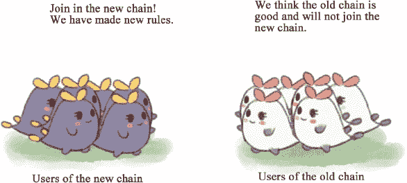

图 2-63：工业链的影响。

比特币及其分叉后的新币都将回归正常水平。比特币分叉的讨论没有结束的迹象。也许这就是去中心化比特币的魅力——多样性。

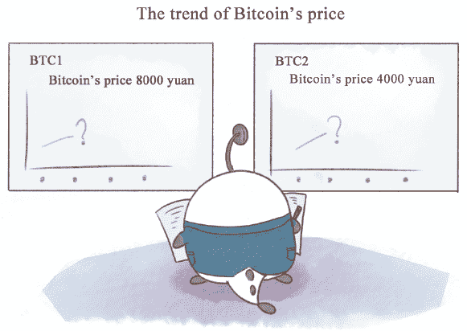

图 2-64：对比特币价格的影响。

区块链的工作流程

区块链是如何工作的？

如图 2-65 所示，假设 A 和 B 将要进行一笔交易。A 发起一个建立新块的请求，该块将广播给网络中的所有用户。在所有用户验证后，它将被添加到主链中，保存可以被每个用户检查的永久且透明的交易记录。实际上，区块链技术是一个分布式数据库，其中会计由所有节点完成和维护，而不是由个人或集中主体控制。没有一个节点可以篡改账本。

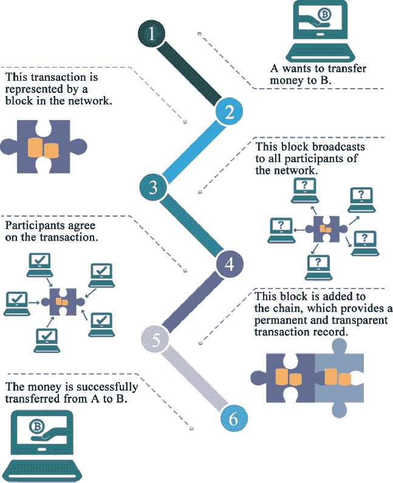

图 2-65：区块链工作过程。

如果你想要篡改一条记录，你需要同时控制超过 51%的节点或整个网络的计算能力。这在几乎是不可能的，因为区块链中的节点数量是无限的，而且随时都有新的节点加入。此外，篡改的成本如此之高，几乎没有人能承担得起。

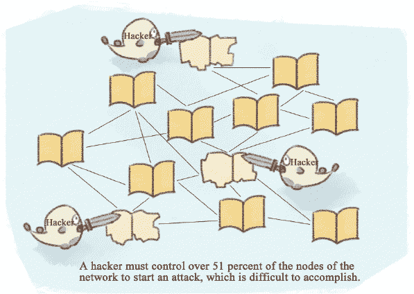

图 2-66：账本无法被破坏。

区块链四大特点

经过多次核算，区块链变成了一个可靠的大型公共账本，具有以下特点：

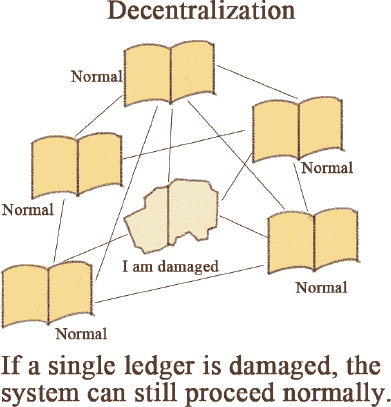

图 2-67：区块链特点：去中心化。

1.   去中心化：在一个去中心化的金融系统中，没有中介，所有节点权利和义务平等，因此系统的整体运作不会受到任何单一节点关闭的影响。

2.   去信任：由于数据库和系统的透明操作，所有节点都可以无需信任问题地进行交易。在系统的规则和时间限制内，节点之间无法互相欺骗。

3.   集体维护：所有节点都有维护功能，这意味着所有用户都参与系统的维护。

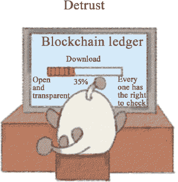

图 2-68：区块链特性：去信任。

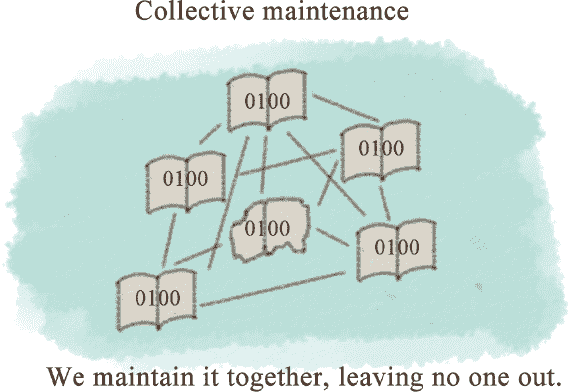

图 2-69：区块链特性：集体维护。

4.   可靠数据库：系统中的每个节点都有最新完整数据库的副本。单个节点修改数据库是无效的，因为系统会自动进行比较，并取最常出现的数据作为真实数据。

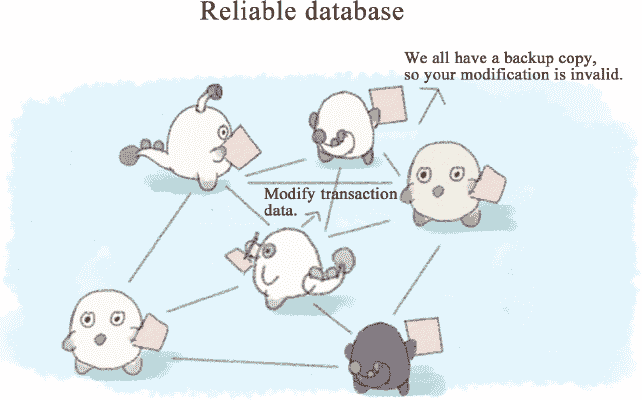

图 2-70：区块链特点：可靠数据库。

区块链底层结构

区块链模型框架

区块链的模型框架反复被讨论，新手入行时常对其构成有疑问。我们将通过大量材料中最全面、最容易的解释来展示这个框架。区块链有六个层次的模型框架：“数据层、网络层、共识层、神经元层、合约层和应用层。每一层执行一个核心功能，通过相互合作，这些层实现了一个去中心化的信任机制。

A. 数据层

数据层主要表示区块链技术的物理属性。设计区块链系统的技术员创建的第一个节点是创世区块，然后在相同规则下相同形式的区块连接在一起，形成一个链式的父区块链。随着运行时间的增加，新区块在验证后添加到父区块链中，父区块链继续变长。

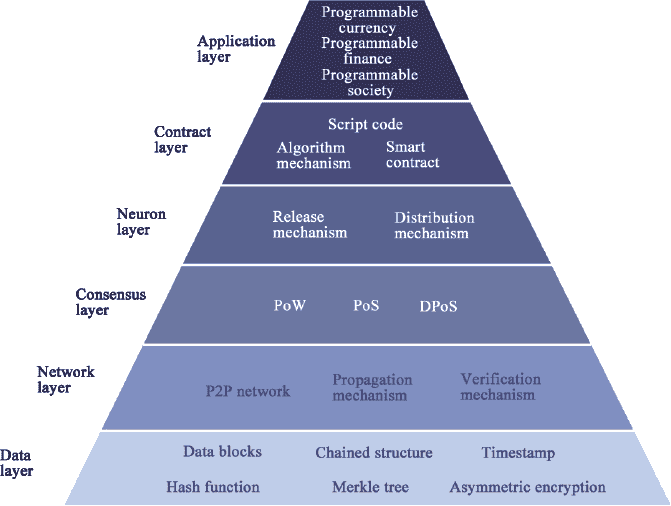

图 2-71：区块链的模型框架。

每个区块都得到了诸如时间戳技术等多项技术支持，这可以确保它按时间顺序与其他区块连接，并使用哈希函数确保交易记录不被篡改。

B. 网络层

网络层的主要功能是在区块链网络中的节点之间实现信息通信。本质上，区块链是一个 P2P（点对点）网络。每个节点既可以接收也可以产生信息。节点通过共同维护一个公共区块链来实现通信。在区块链网络中，每个节点都可以创建一个新块，创建后，它会广播给其他节点，其他节点将验证这个新块。在整条区块链网络中有超过 51%的用户成功验证后，这个新块可以添加到父区块链中。

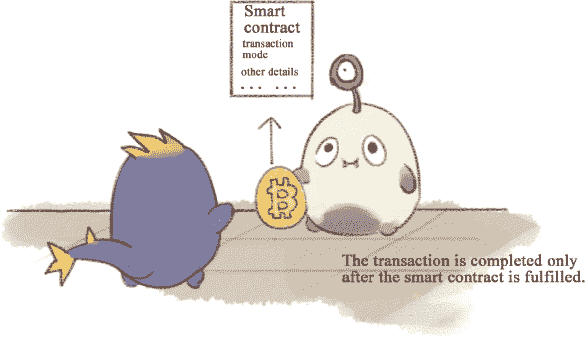

图 2-72：区块链的网络层。

C. 共识层

共识层可以帮助一个去中心化系统内高度分散的节点高效地达成关于区块链数据的共识。区块链中常见的共识机制包括工作量证明算法、权益证明算法和委托权益证明共识，这些将是接下来章节的重点。

D. 神经元层

神经元层的主要功能是提供激活度量，鼓励节点参与区块链的安全验证。让我们以比特币为例；它有两种奖励机制。当比特币达到 2100 万时，新区块将不再产生比特币，此时奖励机制将主要涉及从每笔交易中扣除的手续费。

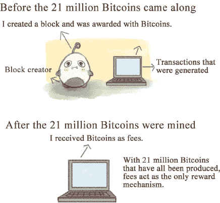

图 2-73：区块链的神经元层。

E. 合约层

合约层主要包括各种脚本代码、算法机制和智能合约。让我们以比特币为例：它们是可编程货币，合约层中封装的脚本代码规定了交易方式和交易过程中的各种细节。

F. 应用层

应用层封装了各种区块链应用场景，例如；OKLink，一个基于区块链的跨境支付平台，以及其他我们将在应用章节中讨论的各种应用。

区块链的基本类型

公有区块链

公有区块链允许全球所有人阅读、创建、获取交易验证以及参与共识过程，决定可以添加到区块链的确切区块，并使当前状态清晰。10

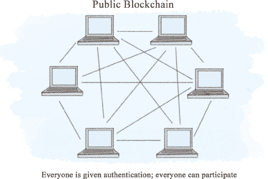

Fig. 2-74: 公有区块链。

公有区块链的特点：

1.   保护用户不受开发者影响。

在公有区块链中，应用开发者无权干涉用户活动，以便区块链保护其用户。

2.   低访问门槛。

只要有电脑连接互联网，任何人都可以访问。

3.   所有数据默认公开。

公有区块链的每一个参与者都可以访问分布式账本中的所有交易记录。

私有区块链

私有区块链指的是其写入权限属于只有一个组织的区块链，旨在限制读取权限和开放权限。

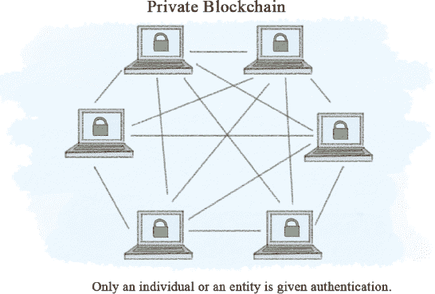

Fig. 2-75: 私有区块链。

私有区块链的特点：

1.   高交易速度。

私有区块链中的节点较少，且信任度较高，不需要每个节点验证交易。因此，私有区块链的交易速度远高于公有区块链。

2.   更好地保护隐私。

私有区块链中的数据不会公开，也不会被任何接入网络的个人获取。

3.   交易成本可以大幅降低，甚至降至零。

在私有区块链中，交易可以免费实现，或至少成本非常低。如果一个物理组织控制并处理所有交易，那么它将不再需要为其运营收费。

4.   保护基本产品不受损害。

通过使用私有区块链，银行和传统金融机构可以确保其既得利益并保护其原始生态系统。

联盟区块链

联盟区块链指的是其共识过程由预选节点控制的区块链。例如，由十五家金融机构组成的联盟区块链，每家机构运行一个节点，为了使每个区块得到验证，需要超过半数联盟的验证，即八家。这种类型的区块链可能允许每个人阅读，或者可以受到参与者混合路线的约束。11

联盟区块链被认为是部分去中心化的，而区块链项目 R3 CEV 可以看作是联盟区块链的一种形式。

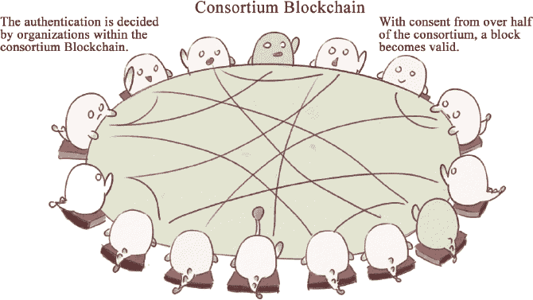

图 2-76：联盟区块链。

其他分类

让我们回到区块链的其他分类：权限链、混合链和复杂链。权限链指的是需要每个节点进行验证的区块链系统。私有区块链和公共区块链都属于权限链。随着区块链技术的发展，其技术框架不会仅仅由私有和公共区块链组成，两者之间的区别将不那么明显。因此，逐渐地，复杂链和混合链的概念被讨论。

区块链的发展

根据区块链研究所创始人梅兰妮·斯旺的观点，区块链技术的发展有三个阶段和领域：区块链 1.0、区块链 2.0 和区块链 3.0。12

区块链 1.0：以比特币为代表的可编程货币。它更像是对数字货币领域的创新，比如货币转账、兑现和支付的系统。

区块链 2.0：基于区块链的可编程金融。它更多的是关于合同（尤其是商业合同）和交易的创新，包括股票、证券、期货、贷款、清算和结算，以及所谓的智能合同。

区块链 3.0：区块链在其他行业的应用。它指的是人类组织形式的变化，包括健康、科学、文化，以及基于区块链的司法和投票。

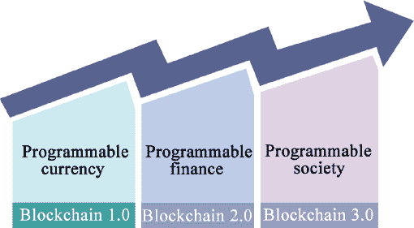

图 2-77：区块链的发展。

区块链的共识机制

在共识机制之前，让我们来看两个其他介绍性问题：两军问题和拜占庭故障。

问题一：两军问题

说到这个，网络上有一个流行的解释如下：

遥远的两支军队需要互相传递信息。蓝色军队派一名信使告诉红色军队：“如果你敢，就拿出意大利大炮！”收到这条信息后，红色军队派一名信使告诉蓝色军队：“收到。”然后蓝色军队再次派信使给红色军队：“我们知道你已经收到了。”红色军队再次派信使：“我们知道你知道我们收到了信息。”蓝色军队再次派信使：“我们知道你知道我们知道你有信息。”然后……就没有然后了。

图 2-78：两军问题。

问题二：拜占庭失败

这是一个古老的问题，细节如下：

在军事行动中，拜占庭罗马帝国根据将军们的投票来决定是否进攻或撤退。也就是说，如果大多数将军决定进攻，军队就会冲上去。然而，如果间谍隐藏在军队中（叛变的将军可能故意投票相反，或者信使未经授权改变命令），那么如何确保结果能真实反映忠诚将军的意愿？13

让我们进一步用细节来解释。

图 2-79：拜占庭失败。

很久很久以前，有一个名叫拜占庭的强大帝国，拥有极其强大的军队。同时发起十次小规模的进攻，这样他们就有机会获胜，否则就会失败。问题来了：在古代，军队之间的通信完全依靠人。一旦国家军队中有间谍，无论是将军还是发令员给出命令；其他九个国家可能会收到错误的信息，导致失败。如果你是那些小国之一的国王，你如何确保有超过五个国家会与你并肩作战？毕竟，如果你不够小心，你可能会失去国家。

这些问题是我们需要达成共识的原因。区块链中有各种共识机制。没有一个是完美的，所以没有一个可以适用于所有场景。下面，我们将回顾张先生在文章“区块链上的共识机制”中讨论的不同共识机制。我们选择了具有相对特定特征的九种共识机制进行简要介绍。常见的共识机制包括九种，最重要的是工作量证明、状态证明和委托证明股份。

A: 工作量证明

工作量证明（PoW）通常只能从结果来证明，因为监控工作过程既繁琐又低效。

当比特币生成区块时，采用工作量证明。匹配块的散列值由 N 个前导零组成。零的数量取决于网络的难度。要获得合理的区块散列值需要大量的测试和计算，计算时间取决于机器的散列运算速度。当一个节点提供一个合理的区块散列值时，表明该节点确实进行了大量的计算；当然，这并不给出绝对的计算次数，因为找到一个合理的散列值是一个概率事件。当一个节点拥有整个网络计算能力的 n%时，那么该节点就有 n%的概率找到区块散列值。

工作量证明（PoW）依赖于机器进行数学运算，然后获得记录的权利。这些运算消耗了大量的资源，并且具有高共识机制和弱的监管。同时，每一次共识都需要整个网络参与计算，并且相对效率和性能比较低，以及容错性允许整个互联网 50%的节点出错。

工作量证明的优点：完全去中心化；节点免费加入。

工作量证明的缺点：目前，比特币已经吸引了全球大部分的计算能力；采用 PoW 共识的其他区块链应用几乎很难获得相同的计算能力来保护自身的安全。另外，挖矿导致大量资源浪费，达成共识的时间相对较长。

使用 PoW 的项目：比特币，以太坊的前三个阶段——前沿、家园和 Metropolis。以太坊的第四个阶段，宁静，将采用 PoS。

证明股份（PoS）

证明股份（PoS）最初是由 2011 年比特币论坛上的“量子物理学家”提出的，后来由 Peercoin（DOT）和 NXT（Futures）以不同的想法实施。

PoS 的主要思想是，节点获取记录权的难度与节点拥有的权利和利益成反比。与 PoW 相比，它减少了由于数学运算造成的一些资源消耗。性能相应地得到提高。但是基于散列，对争夺记录权的竞争的调节仍然很弱。PoS 的容错性与 PoW 相同。它是 PoW 的升级，通过时间和每个节点占有的代币成比例地降低挖矿难度，从而加快寻找随机数的进程。

在 PoW 中，一个用户可能用 1000 美元买一台电脑，加入网络进行挖矿，创建一个新的区块，然后获得奖励。在 PoS 中，用户可以用 1000 美元购买等值的代币，并将这些代币作为存款投入到 PoS 机制中。用户因此有机会创建新的区块并获得奖励。

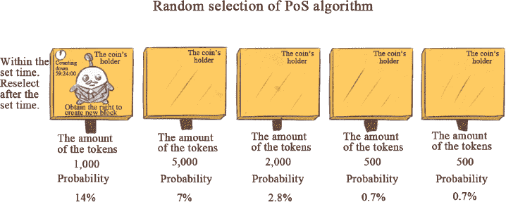

图 2-80：PoS 随机选择算法。

总的来说，在这个系统中有一群币持有者。持有者将代币投入到 PoS 机制中，然后他们成为验证者。对于区块链的第一个区块，PoS 算法随机选择一位验证者（验证者的权重基于他们投资的代币数量）。例如，投资 10,000 个代币的验证者的机会是投资 1,000 个代币的验证者的 10 倍，这给了他创建下一个区块的权利。在一定时间内，如果验证者还没有生成区块，则会选择第二个验证者来生成新区块。与 PoW 一样，PoS 选择最长的链。

随着规模经济（指由于生产规模扩大而导致的经济效益提高的现象）的消失，中心化的风险降低了。价值 1000 万美元的代币带来的回报正好是价值 100 万美元代币的 10 倍，没有人会因为承担大规模生产工具的能力而获得不成比例的额外奖励。

PoS 的优点：它以某种方式缩短了达成共识的时间，并且不再需要消耗巨大的能量进行挖矿。

PoS 的缺点：在没有消除商业应用中的致命缺陷的情况下仍需要挖矿，任何确认都是概率性的而不是确定性的。从理论上讲，可能还有其他攻击，例如以太坊的 DAO 攻击导致以太坊分叉出 ETC，这实际上证明了这次硬分叉的失败。

C. 委托证明状态

BitShares 社区首先提出了 DPoS 机制的想法。DPoS 与 PoS 的主要区别在于，节点选举几个 delegate，他们验证并记录交易，但它的合规性和监督、性能、资源消耗和容错能力与 PoS 类似。类似于董事会投票，代币持有者选举并委托一定数量的节点来验证和记录交易。

DPoS 的工作原理如下：每位股东对应的影响力与他持股百分比成正比，股东投票 51% 的结果是不可逆转且具有约束力的。挑战在于及时高效地实现“51% 的批准”。为了实现这个目标，每位股东可以将他的投票权委托给一个 delegate。根据既定计划，得票数最多的前 100 名 delegate 生成区块。每个 delegate 被分配在某个时间生成一个区块。

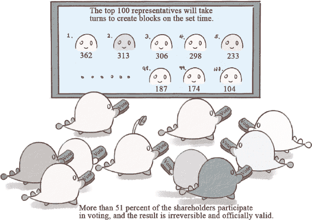

图 2-81：DPoS 的工作原理。

所有 delegate 都将获得相当于平均区块的 10% 交易费。如果一个平均区块的交易费是 100 个份额，那么一个 delegate 就能获得一个份额作为奖励。

一些代表可能由于网络延迟而未能及时传播他们的区块，这将导致区块链分叉。然而，这种情况不太可能发生，因为生成区块的代表可以与前后区块的代表直接建立连接。与在你之后（可能还有之后的一个）的代表建立这种直接连接将确保你得到报酬。

在 DPoS 的投票模式下，每三十秒可以生成一个新块。在正常网络条件下，区块链分叉的可能性极其微小，即使发生了，也能在几分钟内解决。

执行此模式的基本步骤如下：

1. 成为代表。要成为代表，你必须在互联网上注册你的公钥并获得一个 32 位唯一标识符。这个标识符被每个交易数据的“头部”引用。

2. 保持节点诚实。系统中会有一个监控服务，该服务会实时计算每个节点的表现，这相当于一个自动的错误修正机制。让我举一个例子。如果一个节点没有如预期产生新块，那么认为这个节点自动放弃了产生块的权利，所以下一个节点生成一个新块。

3. 代表诚信。每个钱包都会显示一个状态指示器，让用户知道他们的代表表现如何。如果他们错过太多区块，系统将建议用户用新的代表替换他们。如果发现任何代表发布了无效区块，那么所有标准钱包在每次钱包进行进一步交易前都会要求选择一个新的代表。

4. 抗攻击能力。对于抗攻击能力，前 100 位代表的权力是相同的，即每个代表拥有相等的投票权。因此，不可能获得超过 1%的票数并将权力集中在单一代表手中。由于只有 100 位代表，不难想象一个攻击者对轮到生成块的代表执行“服务拒绝”攻击。幸运的是，因为每个代表的身份是公钥而不是 IP 地址，这种特定攻击的威胁可以很容易地减轻。这使得难以确定 DDoS（分布式服务拒绝）攻击的目标。代表之间的潜在联系使得更难以阻碍区块生成过程。

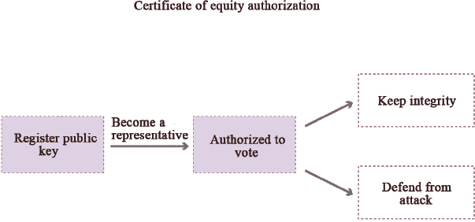

图 2-82：DPoS 的投票模式。

DPoS 的优势：参与验证和记录的节点数量显著减少，实现了二级共识验证。

DPoS 的缺点：整个共识机制依赖于代币，但许多商业应用并不需要代币。

D. 投注共识

投注共识是下一代以太坊 Casper 共识机制引入的一个全新的概念，属于 PoS。Casper 的共识是基于区块而不是链的 PoS。

为了防止验证者在不同的领域提供不同的投注，我们制定了另一个简单但严格的规则：如果你两次投注相同的数字，或者你提交的投注 Casper 根据协议无法处理，你会失去所有的存款。这就是 Casper 与传统 PoS 惩罚系统的不同之处。这样，恶意攻击的非法节点无法获得交易费用，并且有风险丧失他们的存款。

Casper 协议的验证者应完成两项活动：区块生成和投注：

区块生成是一个与其他事件无关的过程。验证者收集交易，当他们轮到生成区块时，他们生成区块、签名，并发送到网络。投注更为复杂。目前，Casper 的默认验证者策略是设计来模仿拜占庭容错，观察其他验证者的投注，取 33%点的值，再进一步移动到 0 或 1。

客户端通过以下过程验证当前情况：首先，他们下载所有的区块和投注，然后使用上面提到但未发布的算法形成观点；他们仅仅观察序列中的不同高度。如果一个区块的机会超过 0.5，他们处理它。否则，他们跳过它。所有区块处理后的情况被显示为“当前情况”。客户端还可以对“最终验证”给出一些客观意见。如果高度 k 之前的所有区块的意见超过 99.999%或低于 0.0001%，客户端可以看到前 k 个客户端最终被验证。

E. RIPPLE CONSENSUS

Ripple 共识算法使得一组节点能够基于一组特殊的初始节点达成共识。这个特殊的初始节点列表就像一个俱乐部。要接受一个新成员，俱乐部 51%的成员必须通过它。共识遵循这些核心成员的“51%的权力”，外部人士无法产生影响。由于俱乐部从集中化开始，它总是会是集中化的，如果它开始腐败，股东们无能为力。像比特币和 Peercoin 一样，Ripple 系统将股东与他们的投票权分离，因此它比其他系统更加集中化。

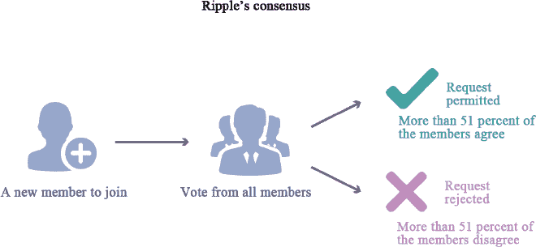

图 2-83：Ripple 共识。

F. 池

基于传统的分布式一致性技术和数据验证机制，池是当今比特币行业广泛使用的共识机制。它的优缺点如下：

优点：它可以在没有代币的情况下工作。基于复杂的分布式一致性算法（Pasox、Raft 等），它可以实现第二级共识验证。

缺点：去中心化的程度不如比特币，更适合具有多种参与者的集中式业务模式。

G. 实用拜占庭容错

对于分布式计算，不同的计算机通过交换信息来达成共识。有时，协调者或系统中的某些成员可能由于系统错误而交换错误的信息。对于拜占庭将军问题，根据出错的计算机数量，可能不会有一个明确的解决方案，但会有验证机制效率的方法。

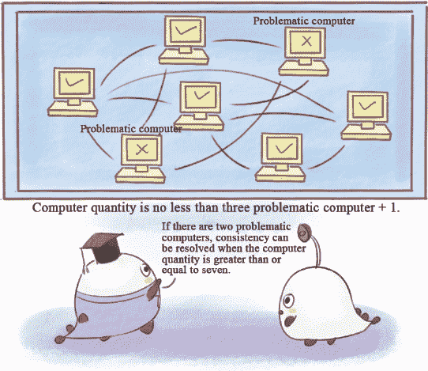

Fig. 2-84: 拜占庭容错。

可能的解决方案：在 N ≥ 3F + 1 的条件下，可以实现一致性（N 是计算机的总数；F 是故障计算机的总数）。在计算机之间进行信息交换后，每台计算机列出它获得的所有信息，然后取大多数计算机得到的结果作为解决方案。

实用拜占庭容错算法（PBFT）是由 Castro 和 Liskov 在 1999 年创建的，是第一个被广泛应用的拜占庭容错算法。如果系统中至少有 2/3 的节点正常运行，就可以保证一致性。

整体实用拜占庭容错算法的流程如下：客户端向主节点发送请求以调用服务操作，例如“<REQUEST, o, t, c>”，其中客户端 c 请求执行操作 o，时间戳 t 用于确保客户端的请求只被执行一次。从副本节点发送给客户端的每条消息都包含当前视图编号，以便客户端进行追踪，从而进一步推断出当前的主节点数量。客户端通过 P2P 消息向自己的主节点发送请求，然后主节点自动将请求广播给所有备份节点。

视图编号是连续编号的整数。主节点由公式 p = v mod | R|计算得出，其中 v 是视图编号，p 是副本号，|R|是副本集的数量。

副本向客户端的响应是“<REPLY,v,t,c,i,r>”，其中 v 是视图编号，t 是时间戳，i 是副本号，r 是请求执行的结果。

主节点将请求广播给其他副本，然后开始分三个阶段执行任务：

1.   预备阶段。主节点为接收到的请求分配一个序列号 n，然后向所有备份节点发送预备消息。预备消息的格式为“<<PRE-PREPARE,v,n,d>,m>”，其中 v 是视图编号，m 是客户端发送的请求消息，d 是请求消息 m 的摘要。

2. 准备阶段。如果备份节点 i 接受预准备消息，它将进入准备阶段。在准备过程中，节点向所有副本节点发送一个准备消息“<PREPARE,v,n,d,i>”，并在自己的日志中记录预准备消息和准备消息。

3. 确认阶段。当“(m, v, n, i)”条件为真时，副本 i 将“<COM-MIT, v, n, D(m), i>”广播给其他副本节点，然后进入确认阶段。所有副本执行请求并将结果返回给客户端。客户端需要等待不同的副本返回相同的最终结果作为整个操作的结果。

如果客户端在一定时间内没有收到回复，请求将被广播给所有副本节点；如果在副本节点已经处理了请求，副本将重新将执行结果发送给客户端。如果请求在副本节点没有处理，副本节点将请求转发给主节点；如果主节点不广播请求，则认为它无效。如果有足够认为主节点失败的副本节点，将触发视图更改。

图 2-85（Figure 2-85）显示了一个无效主节点不存在的算法的正常执行过程。在图中，0 是主节点，副本 3 是无效节点，c 是客户端：

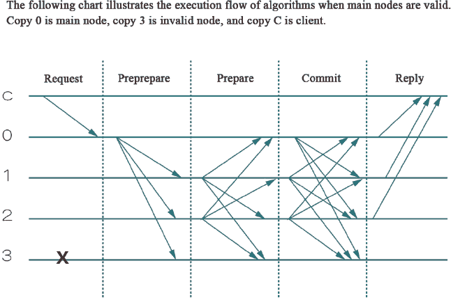

图 2-85：当一个主节点有效的算法。

实用的拜占庭容错是一种采用“许可投票和少数服从”来选举领导和保持账本的共识机制。该共识机制允许拜占庭容错和强大监督节点的参与，并具有权威评级能力、更高的性能和更低的能耗。在每一轮投票中，整个网络的节点选举领导者，允许 33%的节点做坏事，即 33%的容错。因为它适合于联盟区块链的应用场景，实用拜占庭容错机制及其改进算法目前是联盟区块链最广泛使用的共识算法。改进算法在以下方面进行了优化：它修改了底层网络拓扑的要求，并使用 P2P 网络，它可以调整节点数量，减少协议中使用的消息数量。

H. 委托拜占庭容错

2016 年 4 月，Antshares 发布了一份共识算法白皮书，描述了一种通用共识机制——委托拜占庭容错，并提出了一个可以应用于区块链系统的改进拜占庭容错算法。基于实用拜占庭容错算法，委托拜占庭容错算法提供了以下改进：

1.       改进了 C/S（客户端/服务器）的请求响应模式，使之适合 P2P 网络的对等节点模式。

2.       将静态节点参与共识改进为可以动态访问和退出的共识参与节点。

3.       设计并生成一个基于股权比例的节点参与共识投票系统，并通过投票决定参与共识的节点。

4.       引入区块链中的数字证书，解决了在投票过程中验证会计节点真实身份的问题。

DBFT 的优点：有专业的记账员，对任何类型的错误都有容忍性，多人合作记账，每个区块的最终性，没有分叉，并且有严格的数学证明的可靠算法。

DBFT 的缺点：当 1/3 或更多的记账员停止工作时，系统将无法提供服务。当 1/3 或更多的记账员犯罪，并且其他记账员被分割成两个互联网岛屿时，犯罪记账员可以利用系统中的分叉，但留下加密证据。

总之，DBFT 的核心最大限度地确保系统的最终性，并使区块链适用于现实世界的金融应用。

I. Paxos 算法

Paxos 算法是一种传统的分布式一致性算法。它是一种基于领导者选举的共识机制：它有具有绝对权威的领导者节点，有强大的监管节点参与，具有高性能和低资源消耗。所有节点通常都有离线访问机制，但在选举过程中恶意节点是不允许的，所以没有容错性。

_________________

1       “如何向你的笨室友解释区块链？”[EB/OL]。(2016-08-08)[2017-05-18]。 [`mt.sohu.com/20160808/n463044051.shtml`](http://mt.sohu.com/20160808/n463044051.shtml)。

2       杨晓晨，张明，“比特币：理论、特性与愿景”[J]，金融评论，2014(2)。

3       唐文剑，吕文，“区块链如何重新定义世界，”[EB/OL]。(2017-02-24)[2017-05-18]。 [`www.jianshu.com/p/89275ffca97b`](http://www.jianshu.com/p/89275ffca97b)。

4       蚊子吃青蛙（昵称），“公钥与私钥”[EB/OL]。(2013-01-09)[2017-05-18]。 [`www.cnblogs.com/wenzichiqingwa/archive/2013/01/09/2853188.html`](http://www.cnblogs.com/wenzichiqingwa/archive/2013/01/09/2853188.html)。

5       蚊子吃青蛙（昵称），“公钥与私钥”[EB/OL]。(2013-01-09)[2017-05-18]。 [`www.cnblogs.com/wenzichiqingwa/archive/2013/01/09/2853188.html`](http://www.cnblogs.com/wenzichiqingwa/archive/2013/01/09/2853188.html)。

6       BTSX 投资白皮书 V1.1[EB/OL]。(2014-09-16)[2017-05-18]。 [`www.docin.com/p–924681871.html`](http://www.docin.com/p–924681871.html)。

7     “比特币技术笔记：什么是共识、分叉和兼容性？” [EB/OL]. (2016–10–11) [2017–05–18]. [`business.sohu.com/20161011/n469963760.shtml`](http://business.sohu.com/20161011/n469963760.shtml).

8     “硬分叉扩容存在分裂风险而软分叉则没有” [EB/OL]. (2016–10–09) [2017–05–18]. [`8btc.com/thread-40509-1-1.html`](http://8btc.com/thread-40509-1-1.html).

9     “比特币的成长之痛：拥堵问题的解决方案还是彻底分裂？” [EB/OL]. (2017–03–21) [2017–05–18]. [`forex.cngold.org/c/2017–03–21/c4886602_2.html`](http://forex.cngold.org/c/2017–03–21/c4886602_2.html).

10   “区块链全面介绍：公共区块链与私人区块链” [EB/OL]. (2016–08–09) [2017–05–18]. [`www.weiyangx.com/199778.html`](http://www.weiyangx.com/199778.html).

11   黄 buttian. “区块链的形式.” [EB/OL]. [2017–05–18]. [`wenku.baidu.com/view/43d83e1b9ec3d5bbfc0a74be.html`](https://wenku.baidu.com/view/43d83e1b9ec3d5bbfc0a74be.html).

12   “区块链来了，注定要颠覆我们的未来生活” [EB/OL]. (2016–04–20) [2017–05–18]. [`mt.sohu.com/20160420/n445253975.shtml`](http://mt.sohu.com/20160420/n445253975.shtml).

13   Data Sunshine, “从技术角度谈区块链” [EB/OL]. (2016–10–17) [2017–05–18]. [`sanwen.net/a/unmoipo.html`](http://sanwen.net/a/unmoipo.html).
