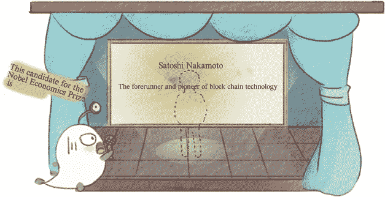

3.

人民

他们创造了历史。

在 21 世纪有着光明前景的区块链行业，其人才接连出现，各自扮演着长期领导角色。在本章中，我选择了一些角色和代表人物来讲述这个行业人物的故事。

当然，我们中有很多人对这些选择进行了广泛的辩论。从最初的二十人到最后确定的五人，我们进行了无数次的讨论。最后，我选择去探索那些可能不是最出名但相对独特的人物。

一个是我们不能忽视的传奇人物：中本聪。他是区块链技术领域的先驱和先锋，尼克·萨博，他提出了智能合约。然后我们有两位独特的意见领袖：马克·安德烈森，《纽约时报》的比特币专栏作家；以及来自华尔街的非凡女性布莱特·马斯特斯。最后，还有投资区块链行业的巨头巴里·西尔伯特。

永恒的传奇：关于中本聪的 99 种猜测

考虑到区块链行业的传奇人物，我们总是会从设计比特币甚至区块链核心理论的中本聪开始。让我们做一个稍微夸张的比喻：当上帝创造世界时，他说，“要有光，”就有了光；而当中本聪在电脑前打字时，他大喊，“来吧，我的比特币，”于是比特币以及背后的区块链技术就诞生了。

图 3-1：中本聪。

这个传奇人物不仅非常有才华，而且非常有趣。显然，中本昭能够凭借他的才华获得名声和财富，但他故意避免了这些，变得相当有个性，也成了一个谜一般的人物。比特币最初开发时，中本参与了一个匿名指导的角色，随着比特币和区块链越来越受欢迎，他却彻底消失了。他从未使用过价值数亿美元的所有比特币，也未申请任何专利，并且从未露面——即使被提名为经济学诺贝尔奖。

图 3-2：经济学诺贝尔奖候选人。

无论他是谁，何时出现，是否会在有生之年露面，毫无疑问，他已经实现了许多人从小拥有的梦想——“我想改变世界，”和“我想成为世界的神秘之谜。”在这里，我们将详细探讨这位人才的传奇经历。

中本聪在人们心中被描绘成一个经济学家、数学家、密码学家和顶级黑客。他的传奇历史始于 2008 年 11 月 1 日，当他发表了一篇名为“比特币：一个点对点的电子现金系统”的论文。随后他将理论付诸实践，在 2009 年 1 月 4 日创建了比特币世界的第一个区块，我们称之为创世区块。同年 1 月 11 日，他发布了一个非常简单命名的客户端——比特币 0.1 版本，召集每一位志同道合的人。

故事发展缓慢：比特币的第一笔交易完成，比特币汇率首次被计算，聊天室为比特币技术爱好者准备就绪，比特币挖矿难度得到调整。首次有诸如德国和马耳他等几个国家开始实施承认比特币的法律，其市值达到近 400 亿美元（根据 2017 年 5 月的数据估算）。当然，比特币的成长也伴随着一些“负面能量”，比如其价格的大起大落和其卷入盗窃或诉讼。总之，比特币有着丰富多采的历史，我们稍后会详细阐述。

图 3-3：比特币丰富多采的历史。

中本聪在这些事件中扮演了什么角色？他是一个创造者。美国联邦调查局（FBI）和全世界的媒体都在寻找他，但一无所获。每个人都可以在 2008 年比特币初创时期的论坛、电子邮件和他网站主页上找到他的话，但所有对这些明显线索的调查都走到了死胡同。

图 3-4：全世界都在寻找中本聪（Satoshi Nakamoto）。

图 3-5：中本聪身份的谜团。

比特币历史上的一些重要事件都是由“中本聪”这个名字引起的。例如，一名日本男子被认作是中本聪后，一些人决定他是澳大利亚人，然后《纽约时报》声称找到了真正的中本聪。最近的一次轰动是由澳大利亚企业家克雷格·史蒂芬·赖特引起的，他宣称自己是真正的中本聪。在 BBC，以及《经济学人》和《GQ》杂志上，他展示了一份中本聪在 2009 年 1 月向帮助构建比特币协议的程序员哈里·芬尼转移 10 个比特币的交易，这是比特币系统内的第一笔转账交易。同时，他还向英国提交了超过五十项涉及比特币及其底层区块链技术的专利申请。

大家都认为中本聪被找到了，所以一个接一个地，他们纷纷涌向他，寻找独家新闻。杂志《Wired》在 48 小时后火上浇油，发表了关于情况的文章。最后，这场风波被中本聪的电子邮件平息，他在邮件中冷漠地说：“我不是克雷格·赖特。我们都是中本聪。”

实际上，证明中本聪的身份是简单的，因为比特币本质上是一个分布式账本。也就是说，这是一个不能被修改、破坏或中断的账本，每个人都可以访问它。因此，基于分布式账本，一个人如何证明他的身份呢？首先，他可以发布一个比特币公钥来宣布他拥有与这个公钥对应的私钥；然后，如果他可以用这个私钥签署一条消息，他的话就得到了证明。

那么，一个人如何证明自己是中本聪呢？只需使用创世区块的私钥签署一条消息，无论这条消息是什么，如果该签名能通过相应的公钥认证，他就是中本聪——因为创世区块的私钥必定属于比特币的创造者。14

如今，比特币的市场价值在许多国家已经远远超过了法定货币。相当多的政府已经认可了它的法定地位或放宽了对它的限制，作为金融科技领域热门的“新兴势力”，区块链应用无处不在。估计中本聪持有大约 100 万比特币以及无数的专利。他是终极的成功传奇。历史上不乏想创造自己货币的人，但只有中本聪做到了。

正如中本聪本人所说，“每个人都可以是中本聪”，因为我们都可以成为区块链技术的实践者。我们也都期待着拥抱由区块链革命化的新世界。

中本聪在插图中经常神秘地出现，我们看到的只是他模糊的轮廓。然而，“每个人都可以是中本聪”，我们准备见证每个中本聪创造的新传奇。

当尼克·萨博被自动售货机“击中”时

就像牛顿被从树上掉落的“上帝的苹果”砸中头部，然后提出了运动定律一样，区块链领域也有一个被自动售货机“击中”的人，使他提出了“智能合约”的概念。自动售货机对我们来说很熟悉，这些笨拙的机器非常“智能”，因为产品一旦投入机器中就会释放出来。虽然我们对其内部工作机制一无所知，但常识告诉我们，投入钱后自动售货机可以提供各种物品。受到自动售货机启发的首位提出智能合约概念的人是尼克·萨博，一位计算机科学家、密码学家、法学家和发明家。有些人甚至认为尼克·萨博可能是中本聪。他现在正在筹集资金以启动一家区块链技术公司。

图 3-6：尼克·萨博。

介绍科学家最好的方式是讲述他的发明。在尼克·萨博眼中，自动售货机有着独特的魅力，因为当消费者向其投入货币并选择他们想购买的商品时，消费者和自动售货机之间将启动一个可执行的合同。买方向机器投入货币并选择商品，而卖方则通过自动售货机的内部逻辑负责提供产品和零钱。

图 3-7：自动售货机的逻辑。

图 3-8：简单的智能合约。

如果自动售货机在付款后未能提供商品，人们认为机器没有遵守约定合同，有些人甚至生气，踢机器。然而，机器实际上非常无辜。它可能因为之前顾客投入了假币而无法识别硬币，因此机器有理由拒绝发放产品。这是一种简化的智能合约。

《古怪学》中的一个问题是个例子：如果你在线购买的商品已经付款，但卖家撒谎声称他已经发货了他没有发货的商品怎么办？这两方如何解决他们的案件？支付宝作为第三方，可以在交易中避免此类问题，因为买方为商品付款首先会发送到支付宝，只有当卖家将商品交给买方后，支付宝才会向他发送付款。这样，交易中两方的利益得到了保护。这被称为安全交易模型。支付宝虽然是一种支付工具，但其工作机制几乎与智能合约完全相同——基于信任。然而，支付宝也面临潜在威胁。如果未知物体入侵其服务器，可能导致整个系统崩溃并消除所有交易记录。买方和卖方随后将无法解决他们的交易。

图 3-9：支付宝的逻辑。

智能合约的定义是一个计算机程序和一个去中心化系统，可供所有用户使用，无需中介。它有以下前提条件：

1. 货币是必须的，无论是法定货币还是加密数字货币，因为没有所谓的没有货币的交易。

2. 资产必须数字化。然而，汽车如何数字化呢？答案是给它装上加密锁。由于汽车仍然装有物理锁，所以交付汽车实际上是向车主交付车钥匙。想象一下，将来，加密的公钥可以用作钥匙，只有拥有私钥的人才能访问汽车。这不是很神奇吗？但这种幻想可以变成现实。

3. 资产必须连接到互联网，并且必须完全信任某个特定的数据库。

图 3-10：智能合约的特点。

本质上，智能合约在原理和工作方式上与其他计算机程序中的“如果…那么”语句非常相似，在现实世界中与资产互动。当触发一个预设条件时，智能合约将实施合同中相应的条款。15 目前，瑞士联合银行、英格兰的巴克莱银行、美国的摩根大通等金融机构正在研究如何将智能合约应用于自动化清算系统中，这有可能大幅降低成本。

图 3-11：智能合约的结构模型。

一旦上述三个条件得到满足，智能合约将像今天的支付宝一样运行，客户可以信任并使用它完成交易，而无需了解其背后的技术。智能合约将在区块链世界中无处不在。

华尔街背景的女性领导者在区块链社区

由于比特币和区块链技术常常笼罩在一层神秘色彩，而且那些对其了解不多的人常常感到困惑，区块链社区中的权威和意见领袖大多是低调的人，他们很少发表意见。然而，有一些杰出的女性意见领袖吸引了我们的注意，比如 BlockCypher 这家区块链初创公司的首席执行官 Catherine Nicholson，该公司筹集了 350 万美元；以及数字资产控股公司的首席执行官 Blythe Masters。

图 3-12：Catherine Nicholson。

Blythe Masters 是摩根大通的前高级执行官，她在那里工作了将近三十年。现在她是数字资产控股公司的创始人和首席执行官，该公司是一家旨在将区块链技术推广到华尔街的初创公司。

目前，数字资产控股公司正在与马斯 ters 女士的前雇主，摩根大通（也是其第一个大客户）合作，通过测试区块链技术来加速结算。正如巴比特所写，“区块链技术将以各种形式部署在商业环境中。然而，这并不意味着它将成为主流。我认为区块链还需要五到十年才能成为主流。”16 数字资产控股公司获得了 6000 万美元的融资。马斯 ters 在华尔街享有极高的声望，这可能使区块链技术对传统金融行业产生积极影响。

图 3-13：区块链社区的的女性意见领袖。

《纽约时报》专栏作家

在 1971 年，一个年轻男孩在爱荷华州出生，当时没有人看到他在长大后会改变世界的通信模式。他在九岁时学会了使用电脑，并开始自学 BASIC 编程语言（初学者通用符号指令代码）来自图书馆的一本书。被誉为互联网的先驱，他也敢于挑战沃伦·巴菲特，声称，“比特币就像来自火星的技术。”他是我们本章将提到的第四位人物——Marc Andreessen，为《纽约时报》撰写有关比特币的文章的专栏作家。

图 3-14：Marc Andreessen。

图 3-15：当他还是个孩子时自学 BASIC 语言。

对这位成就显赫的传奇人物的一个简要介绍可能有助于您了解他。Marc Andreessen 虽然没有比尔·盖茨和史蒂夫·乔布斯那么出名，但他的成仍以他在互联网发展中的重要影响。现在，让我们从他的创业经历开始。

在他职业生涯的第一个十年里，Andreessen 创立了网景，这是第一个网络浏览器。1992 年，Andreessen 与他的合作伙伴共同开发了第一个图形网络浏览器 Mosaic，并在第二年与合作伙伴一起推出了网景。1995 年，网景在纽约上市，市值达 29 亿美元，使这位 24 岁的企业家一夜之间成为亿万富翁。然而，他的第一次创业经历在 1999 年随着微软的 IE 浏览器的兴起而结束，这迫使网景被美国在线收购。

Andreessen 的第二次创业经历也涉及互联网。他与合作伙伴一起创立了一家名为 Loudcloud 的云计算公司。然而，在 2002 年至 2006 年间破裂的互联网泡沫剥夺了风险投资公司投资互联网公司的意愿，导致这家公司于 2007 年被惠普以 16 亿美元收购。

后来，Andreessen 加入了 Facebook 的董事会，并担任当时 Twitter 首席执行官 Evan Williams 的顾问。2009 年，Andreessen 与 Ben Horowitz 共同创立了 Andreessen Horowitz。

Andreessen Horowitz 形成了 Marc Andreessen 与比特币不可分割的联系，因为他们投资了比特币交易系统 Coinbase、比特币创业公司 21Inc 和区块链数据提供商 TradeBlock。当然，仅凭这些成就并不能证明他被选为区块链领域有影响力的人物。

图 3-16：Andreessen Horowitz。

图 3-17：纽约时报专栏作家。

在区块链行业中，Marc Andreessen 以其独到的见解和尖锐的言论而闻名，这些常常吸引媒体转载。2014 年，他开始为《纽约时报》撰写专栏，他的第一篇文章用了一个大胆的标题——“为什么比特币很重要”。除此之外，他还在推特上热情地与粉丝分享关于比特币和区块链的新闻。

2014 年，投资大师沃伦·巴菲特警告说，比特币基本上是一种幻象，投资者应该远离它。Marc Andreessen 回应说：“老白人不懂装懂地批评新技术。”国际媒体报道了这场争论。在接受采访时，安德烈森说：“比特币就像是来自火星的技术。”同时，在许多接受采访时，他也积极分享了自己对比特币和区块链技术的看法。

图 3-18：“反对”的巴菲特。

可以说，Marc Andreessen 是一个大胆而有勇气的意见领袖，并为比特币和区块链技术的国际普及做出了贡献。

一个想要投资所有数字货币的大鱼

让我们转向下一个关于一个“奇怪”的人物的故事，他以其独特的方式——“买、买、买”开始了商业世界的冒险之旅。时不时地，我们会在网上了解到 xx 区块链公司被收购，xx 比特币公司被并购，或者 xx 金融科技公司的投资。然而，我们不知道的是，这些新闻背后的同一个人，那就是数字集团首席执行官 Barry Silbert。

图 3-19：Barry Silbert。

Silbert 的“收购名单”涉及全球大约二十个国家，他最多投资了六十家公司。数字集团是由 Barry Silbert 创立的，它是一个投资公司，而不是投资基金。

图 3-20：全球投资概况。

“数字集团（DCG）提供了投资公司、购买公司和持有永久资本的灵活性。所以我们筹集的资金留在公司内部；而不是像基金那样必须向有限合伙人回报资本，我们可以在公司内部部署资本……我们的使命是加速更好金融体系的建立，”他说。17

DCG 对区块链情有独钟，它主要投资于基于比特币的初创公司。它的早期投资包括 Ripple，世界上第一个允许所有客户进行交易的网络；Coinbase；以及 BitPay，一家比特币支付服务提供商。同时，DCG 还投资了包括印度的 Unocoin、韩国的 Korbit、日本的 BitFlyer、肯尼亚的 BitPesa 和马来西亚的 BitXin 在内的全球十五家交易所，支持多达四十个不同的货币对。最近，它还投资了 Skuchain 这家利用区块链技术优化供应链的区块链公司。除了“买买买”的策略外，巴里·西尔伯特是少数对比特币作为货币感到兴奋的投资者之一。他曾评论说，“英国脱欧显示了比特币作为避险资产的亮点。”

关于传统金融大亨对区块链技术的热情，他表示：“我们对区块链技术在金融机构中的应用感到兴奋，无论是比特币的区块链还是其他区块链。但我们仍然专注于将比特币打造成为全球货币，这是我们的事业愿景。”

上述例子表明，巴里·西尔伯特是比特币和区块链技术的“虔诚信仰者”，他一直用他独特的策略——持续买入——来实践他的坚定信仰。

图 3-21：比特币信徒。

_____________

14   “到底谁是中本聪，比特币的私钥技术是什么？”[EB/OL]。(2016–07–15) [2017–05–18]。 [`zhuanlan.zhihu.com/p/21722963`](http://zhuanlan.zhihu.com/p/21722963)。

15   “智能合约将使我们未来摆脱银行和律师。”[EB/OL]。(2016–06–21) [2017–05–18]。 [`it.sohu.com/20160621/n455402402.shtml`](http://it.sohu.com/20160621/n455402402.shtml)。

16   巴比特。“数字资产控股公司首席执行官：区块链技术将在两年内应用于银行，但这项技术成为主流还需要五年到十年。”[EB/OL]。(2016–04–07) [2017–05–18]。 [`www.8btc.com/Blockchain-in-banks-a-reality`](http://www.8btc.com/Blockchain-in-banks-a-reality)。

17   “巴里·西尔伯特谈论了 DCG 在数字货币领域的投资策略。”(2016–02–01) [2017–05–18]。 [`www.okcoin.cn/t-1010622.html`](http://www.okcoin.cn/t-1010622.html)。
