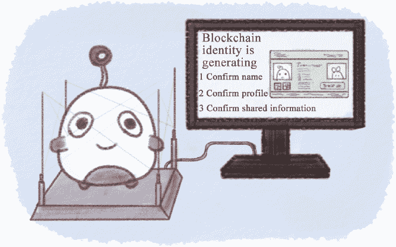
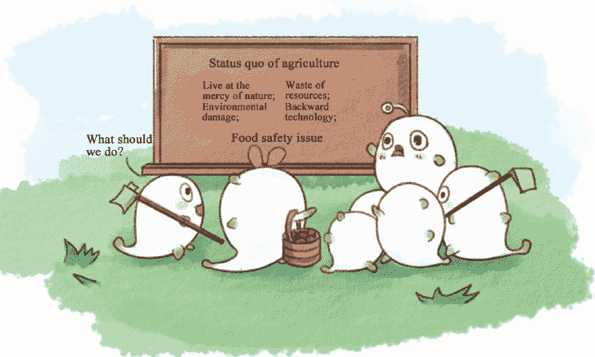
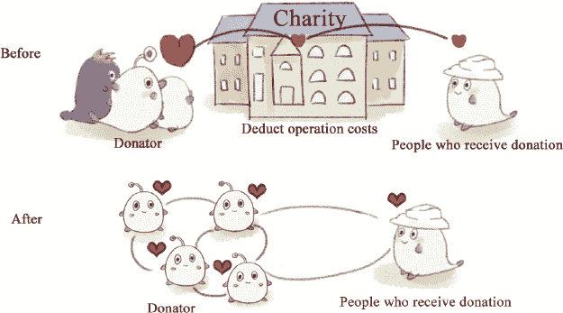

4.

应用

十年后，让我们享受区块链的繁荣。

或许你是通过比特币或一次金融科技峰会首次听说区块链的。但如今，几乎所有行业都声称他们与区块链有某种联系。

我们正在积极研究区块链技术；我们正在建立区块链实验室，我们夸耀拥有的一位专家以及在区块链行业中一条“大鱼”，他们将带领我们利用区块链技术探索公司的全新转型路径：这样的言论几乎无处不在。似乎世界上的一切都可以与区块链相连。然而，这是事实还是只是一个热门话题？

在本章中，我们将与您分享“区块链+”的概念，通过选择几个热门领域和相关案例来展示这项技术如何影响不同领域。随后，我将引用国内外许多真实案例以及专家的观点。相关的参考资料和出处将在本书的最后部分注明。

金融

如今，作为一种现象级概念，区块链已经得到了政府、公司和机构的支持，但你知道哪个行业首先见证了它的繁荣吗？是的，是金融行业。尽管区块链在金融领域的应用还不够成熟，也没有能与百度、阿里巴巴和腾讯比肩的金融大亨，但我们可以肯定的是，随着越来越多的金融机构开始进行区块链实验并逐步取得成果，区块链无疑将对传统金融行业产生颠覆性的影响。甚至有预期认为，区块链将与大数据和人工智能一样，成为打开互联网金融新时代大门的关键。

过去两年中，包括摩根大通、高盛集团和花旗银行在内的二十多家全球顶级金融机构投资了超过 10 亿美元的区块链项目。预计 2017 年，对区块链的投资只会更多，可能在一年内就超过 10 亿美元。

银行

在大多数国家当前的银行系统中，所有银行都是通过电子账本检查其账户，这是一个随着机构接近这个结构的核心部分而具有更多权限和更大数据量存储的集中式结构。同时，他们还需要在合作成本上投入巨资以维持这个去中心化系统的数据准确性。由于区块链技术是去中心化的，它可以为银行创造一个分布式和开放的网络，其中所有交易数据都是透明并由大家共享的。基于区块链技术的分布式会计有能力消除无效的银行中介并显著降低运营成本。

图 4-1：区块链加银行。

目前，许多已经建立区块链实验室的银行已经认可了区块链技术，他们致力于开发工具以改造整个银行系统。根据西班牙的一份报告，如果将区块链技术应用于银行，到 2022 年前，预计每年可以节省 15 亿美元至 22 亿美元的运营成本。

主流和传统的跨境汇款方式是电汇，其中资金可能需要三到五工作日从汇款人的账户转移到收款人的账户。此外，银行中介和社会世界银行金融电信协会（SWIFT）会针对通过他们系统进行的消息交换收取通信费。例如，在中国，当进行跨境转账时，中国银行会收取 150 元人民币的通信费。

图 4-2：区块链+跨境支付。

区块链技术可以实现发送方和接收方之间的支付和结算，减少所有中间商的收费，并通过点对点方式快速完成跨境支付和结算。更重要的是，这种技术不仅能减少清算时间，还能实现全天候支付和实时交易，使得提款变得容易且无隐性成本。根据麦肯锡的计算，仅仅将区块链技术应用于企业间跨境支付和结算，每笔交易成本可能从约 26 美元降至 15 美元。

供应链

供应链金融，简单来说，是一种通过结合核心企业与上下游企业来提供金融产品和服务的一种融资模式。这里的资金作为供应链的溶剂，旨在提高企业的流动性。

在当前的供应链金融体系中，某一商品的供应链包括采购原材料、生产中间产品和最终产品，并通过销售网络将产品销售给消费者。这一过程将供应商、制造商、分销商、零售商和客户团结在一起。18

图 4-3：区块链+供应链。

凭借其开放和可追溯的特点，区块链技术可以编程和数字化任何基于纸张的过程，使其更加节省劳动力。在基于区块链的系统中，所有参与方可以使用分布式账本共享文件。智能合约使得在满足时间和结果要求时可以进行支付，这不仅最大化效率，还大大减少人工错误。根据麦肯锡的计算，区块链技术有望帮助全球银行节省由运营风险带来的 1 亿美元至 16 亿美元的资金。

图 4-4：区块链+信息。

信息

一旦具有不可篡改特征的区块链技术应用于银行系统，一旦交易确认，客户信息和交易记录将变得难以篡改，并免受任何人为发明的影响，这有助于银行识别异常交易并防止欺诈。此外，银行可以基于区块链技术开发一个具有共享账本的信息系统，以检测和分析任何节点上的用户交易。一旦出现异常情况，系统可以立即报告给上层，从而有效地防止诈骗和洗钱等非法活动。

证券

在证券业务中，首次公开募股（IPO）和证券交易通常需要第三方的长期参与，导致股票发行和交易的处理减弱和成本增加。然而，借助区块链技术，投资者和机构能够在全天候运行的去中心化交易平台上完成 IPO 和自由交易，而不需要第三方的参与和干预。

图 4-5：区块链+安全。

对于证券交易员和投资银行的从业者来说，区块链帮助转变业务方向，其中承销和资源获取将减弱，而为投资和金融客户提供专业证券咨询服务的能力将得到加强。

图 4-7：区块链+保险。

保险

传统保险业务的核心在于保险机构负责资本聚合、投资和理赔，这导致了高昂的运营和管理成本。然而，区块链技术有望将相互保险模式变为现实。这种模式使得参与者可以直接向患者支付费用，而无需第三方的干预。因此，资本聚合和分配将变得透明，并降低运营成本。同时，保险机构可以选择转型为保险咨询公司，这有助于它们最小化风险。

案例一：OKLink

随着区块链技术越来越受到重视，世界各地的政府、大型金融机构和企业已经开始大力投资于这项技术的研究。OKLink 是 OKCoin 旗下的全球比特币交易所的领先全球金融网络，也是中国第一个商业化的区块链应用，致力于提高全球价值传输效率。同时，OKLink 还改进了全球发件人的体验。该应用程序在包括中国、日本、韩国和东南亚国家在内的二十多个国家和地区可用。OKCoin 的主要客户大多是小型和中型金融参与者，包括银行、汇款公司和互联网上的金融平台。其交易额每月达数千万美元。

此前，我们已经提到了传统跨境汇款的弱点，例如漫长的周期和高昂的成本。然而，基于区块链技术，OKLink 在去中心化系统下运作，使用户能够以更低的成本和更高的速度进行跨境转账。这样，发件人和收件人之间可以直接完成支付和结算，中介通常收取的所有费用也可以节省。整个网络的费用仅基于平均费率的 0.5%，不收取任何隐藏费用，并且收款速度快。

合作伙伴可使用 OKLink 检查他们的交易，因为所有交易都是可追踪的。区块链技术能确保交易具有抗篡改性且不可伪造，基于区块链的全球金融汇款网络承诺实现实时结算，这意味着支付等同于结算，使得小额跨境汇款变得简单方便。

案例二：自动化对冲基金借贷机器人系列

位于西雅图的点对点借贷平台 LendingRobot 推出了自动化对冲基金 LendingRobot 系列，该系列根据算法提出了各种投资偏好，包括短期激进、长期激进、短期保守和长期保守。

自动化管理是该基金的主要特点，其涉及财务问题，需要让客户放心，因此区块链技术变得不可或缺。这个对冲基金每周都会发布账本，其中每一笔交易的金额都会被详细记录。

账本每周会以哈希码发布，并在以太坊上进行验证以确保数据的不可变性。

LendingRobot 的首席执行官 Emmanuel Marot 表示：“所有投资者都知道‘不要把所有的鸡蛋放在一个篮子里’。但在实践中，这只是知道比做到要容易得多，因为投资者考虑投资项目的过程很复杂，而且期望他们在某些领域是专家。因此，我们推出了 LendingRobot 系列，利用智能控制技术和区块链技术，使投资者能够理解贷款的投资价值，从而鼓励他们更舒适地在我们的平台上进行投资。”

一般的对冲基金通常收取 2%的管理费和 20%的业绩费，而 LendingRobot 仅收取 1%的管理费，将基金费用上限设定为 0.59%，并且不收取业绩分成。

互联网管理

区块链技术在互联网安全管理以及认证领域也具有巨大优势。它被应用于社交网络、身份证以及学历证明认证等多个场景。在本章中，我将重点介绍基于区块链的身份证。

当区块链遇到身份证时会发生什么？如果身份证存在于区块链世界会怎样？让我们来探索一个神奇的概念，“分布式智能身份识别系统”，即区块链中的“身份证”。

图 4-10：身份证问题。

身份证是一件美妙的事物，尽管它不显眼，但我们似乎没有它就无法做任何事情、去任何地方。它用来证明一个人的身份；我们需要用它来办理登机手续和购买火车票。一旦丢失或被他人占用，或者忘记携带，持卡人将面临灾难。

如果你仍然对身份证相关的各种问题感到担忧，那么基于区块链技术的智能身份识别系统可能会消除你的顾虑，因为你的护照照片、在线资料以及不可逆转的密钥创建数据和密钥标识都会呈现在你的区块链身份证上。同时，这个身份证还包含签名栏、专属的二维码、交易编号和散列算法证明。

图 4-11：基于区块链的身份证。

创建和使用身份证的三个步骤如下：

第一，取一个独特的名字。

然后其他人就可以搜索到你的区块链身份证。只要你自己小心保管好密码，别人就无法占据你的名字。

第二，创建并确认你的个人档案。

将你的区块链身份证与你的社交媒体资料连接起来，以证明这张卡属于你并确认你的个人信息。

第三，开始使用你的区块链身份证。

在你的网站上、社交媒体资料上以及名片上分享你的区块链身份证，这样别人就可以轻松地在互联网上找到你。

图 4-12：创建基于区块链的身份证。

基于区块链的身份证具有以下优势：首先，它能安全、便捷地解决信息丢失的问题。其次，它具有防篡改性，并且不会永远丢失。

如果每个人都有一张基于区块链的身份证，这意味着一个人有一个完整、独特且永久的条目，记录了一个人一生的所有交易。将来，区块链身份证可能需要一段时间才能将所有个人信息连接起来，但它承诺能立即取代身份证、指纹、护照和其他识别工具。

当然，如果你有一天确实获得了基于区块链的身份证，请小心保管密钥，因为进行任何操作都需要使用该密钥来打开你的个人账户。同时，请备份这个独特的密钥，因为只有你有访问它的权限。

图 4-13：基于区块链身份证的优势。

一旦发放了基于区块链的身份证，虹膜识别和其他生物识别技术可能就会过时。毕竟，如果黑客想要攻击一个系统，他需要首先入侵系统然后再进行篡改。然而，在区块链系统中，登录被视为一种“交易行为”。

如果某人想要通过冒充他人身份登录已应用区块链技术的系统，这意味着他需要登录数亿台计算机的数据链，这几乎是不可能的。如果那一天到来，像指纹或虹膜扫描这样的技术将变得不再必要。

图 4-14：可记录你整个一生的区块链身份证。

案例一：霍尔伯特软件工程学校

2015 年 10 月，位于旧金山的霍尔伯特软件工程学校宣布，他们将通过区块链来记录学生的学术表现，成为世界上首个利用区块链技术验证其学术证书的学校。

学校的联合创始人 Sylvain Kalache 表示，他的学校理解公司在招聘时验证学术证书是困难的，所以他们采用了区块链技术来验证学生的学术证书。

Kalache 说：“对于雇主来说，通过调用大学或支付第三方来完成这项工作，避免他们花费宝贵的时间来核实候选人的教育背景。”同时，通过使用区块链，学校可以节省建立和运营自己记录数据库的费用。他还说：“我们的学生非常高兴他们的学术资格将通过区块链得到验证。他们也看到了这项技术的潜力，因为许多公司已经大量投资于区块链，他们为自己成为首批使用该技术的学校而感到自豪。”19

案例二：加拿大的身份验证公司 SecureKey

-   SecureKey 是一家位于加拿大的认证和验证服务公司，加拿大数字身份和认证委员会（DIACC）已经从美国国土安全部的附属研究机构获得了资金，两家公司将合作建立一个基于区块链的数字身份网络。现在 SecureKey 正在开发一个保密计划，被称为“三重盲”。一旦安装了这个程序，例如，当消费者输入他的账户和密码登录银行系统时，银行无法看到数据去向，收件人无法看到使用哪家银行或任何银行账户信息。作为中间人，SecureKey 同样“盲目”并且无法看到谁在使用服务。这就是“三重盲”的意思。

-   SecureKey 的首席身份官 Andre Boysen 在一次采访中说道：“在今天的世界里，每个组织都各自行动。数字身份比任何一个组织都大……要使数字身份工作，需要一个村庄。”20

-   在见证技术飞速发展的时代，人类在验证个人身份时必须找到可信的技术以避免身份盗窃。SecureKey 和 DIACC 目前正在研究这项技术。

-   能源

-   每当提到能源领域的商业模式时，区块链这个词就会被提及。随着这项技术的日益凸显，其在能源领域的应用充满了幻想，引领着“互联网+”智能能源资源的潮流。在本章中，我们将分享一些来自前景的关于区块链在能源互联网上应用的观点，并简要解释它们。总的来说，区块链主要应用于能源领域的三个方面：电力、生态系统和能源的智能调节。

-   电力

-   区块链的一个重要特征是数据不可篡改，这与该技术在电力行业的应用紧密相关。借助区块链技术，“每单位电的过去和现在”将在区块链网络上被记录下来。例如，某一天核电站产生的一单位电通过电线传输到我家，几个小时后我开灯使用。

-   Fig. 4-15: 区块链加电力。

-   未来，区块链加电力可能会有以下发展方向：

-   1.   每单位电都可以被追踪，以避免电力盗窃和电力泄漏。所有行为记录在一个不可篡改的账本中，那些突然出现又突然消失的情况将被视为异常情况处理。

2. 您将能够向邻居出售多余的电力。我们目前的电力系统与智能有一定关系，因为电力的购买和停电都是通过智能电表完成的。然而，去中心化的区块链技术甚至可以让你向邻居出售多余的电力。将来，我们可以建立一个关于每一度电的地图。例如，假设你家里的太阳能发电机每天可以产生一度电，但你每天只用一半。多余的电能将被存储在网络中。因此，当你的邻居需要电力时，他们可以直接向你购买电力。这样，区块链使分布式能源资源共享成为可能。

图 4-16：互动可靠生态系统。

生态系统

区块链、物联网和大数据的结合有潜力构建一个“乌托邦”式的能源生态系统。简单举个例子，假设有一天这三种技术特征的能源生态系统形成了，然后设备供应商、专业运营商、使用设备的业主以及负责货币流通和价格报价的金融系统需要在系统中进行测试。这个系统中的每一个参与者都会收到一个密码查询，通过它，他或她可以检查系统中任何人所做的任何操作。这样，所有相关方可以形成一个具有互动监督和信任关系的体系。系统可以根据大数据分析计算出对业主最优的计划，并通过智能合约，自动通过金融机构进行购买或进行维护。

图 4-17：智能能源控制。

智能能源管理

将来，借助区块链技术，智能能源管理可以通过将智能设备连接到互联网信息来实现。想象一下，当城市地区的网络摄像头捕捉到输电设施突然停电的情况，并与其他相关信息相匹配——比如某个区域的警报或灯光突然熄灭——然后确认情况。上述信息将被传达给维护部门，然后根据智能合约发送相关维护设备进行现场修复。因此，智能管理的时代将为我们的日常生活带来更多便利和舒适。

案例一：TransActive Grid，能源传输项目

LO3 Energy 这家位于纽约的区块链初创公司，与技术巨头西门子合作开发了基于以太坊的能源传输项目 TransActive Grid，该项目允许客户将未使用的电力重新销售给需要的人。LO3 Energy 获得了美国专利商标局颁发的分布式能源传输的专利。

西门子能源管理分部首席执行官 Ralf Christian 表示：“我们确信，我们的微网控制和自动化解决方案，结合我们的合作伙伴 LO3 Energy 的区块链技术，将为我们的公用事业客户带来额外的价值。”

两家公司都说他们将测试在纽约和其他地方由区块链技术供电的微网，希望将这些基于区块链的微网推广到全球。

案例二：能源比特币实验室

2016 年 5 月 15 日，世界上第一个能源区块链实验室正式推出，由四人创立。这个实验室主要专注于开发区块链平台，从这些平台中，合作工具将被用于金融产品的开发、审计、注册和交易。在接受 TMTPost 采访时，中国信达证券的创始人兼首席分析师曹寅说：“未来，能源储存更有可能建立在共享经济的基础上。单个公司购买的储能利用率非常低，因为不可能在一天 24 小时内完全利用这些能源资源。”然而，借助区块链技术，能源储存将具有滴滴和 Uber 出租车相同的特性。邻居们可以通过使用权的共享来利用他们的储能设施，并根据储能产生的收益获得报酬。21

图 4-18：能源区块链实验室的目标。

政府

拥有去中心化、不可篡改、值得信赖和可追溯等特点，区块链加上政府也有潜力改变社会。

基本信息保护

政府信息系统是如何保护我们的数据的？下属部门的信息将汇集到政府当局，后者有权使用这些信息。在这种模式下，黑客在攻击政府信息系统时只需攻破一个集中路由器。一旦成功，存储在这个路由器中的信息可能会被泄露、损坏、丢失和被犯罪利用。

图 4-19：区块链加基本信息保护。

然而，预计区块链技术的应用将显著提高信息系统的安全性。在这种情况下，政府信息将在每个节点进行分布式存储，每个部门都将拥有一个通用账本，该账本经过哈希加密，不可篡改，并且不易泄露。如果黑客成功攻击了一个节点，政府信息不会被盗，系统也不会受到影响，因为其他节点也存储了完整的账本。此外，修改节点中的数据是没有用的，因为这种行为无法被整个网络认可。

公民身份识别

您想证明自己已经结婚了吗？请前往民政部门领取结婚证书。您想证明母亲是您的吗？抱歉，没有这样的政府部门能颁发这种文档。但另一个部门声称，没有这个证书我就无法完成某些手续。嗯……请去其他相关部门咨询。

图 4-20：区块链加身份认证。

公民身份被认为是政府事务中不可或缺的一部分，但这也是耗时且劳动密集型的。然而，区块链技术使得一个人的所有信息都可以存储在其“地址”中，需要时随时可以使用。这项技术的不变特性也消除了人们对于他们的证书是否有效的担忧。基于区块链的公民身份识别系统不仅可以有效减少社会资源的浪费，还可以确保最高的真实性，因此得到了所有人的认可。

政府事务信息透明度

目前，世界各地的政府信息几乎不透明，因为我们只知道制定的法律，但不知道它们是如何执行的。因此，通常会出现一个替罪羊站出来，对法律的错误负责，导致缺乏监管的混乱局面。

图 4-21：区块链加政府事务透明度。

区块链技术有潜力增加政府事务的透明度，使政策实施不受外部因素的干扰。同时，政策的可追溯性也有助于我们做出更为谨慎的决策。

税收监管

图 4-22：区块链加税收监管。

逃税和税务欺诈是全球范围内的严重问题。一些公司和个体通过做假账来逃税。然而，有了区块链技术，一家公司在其成立时就可以建立一个分布式账本，这是一个记录所有运营过程中每一笔交易的数据库。它还可以通过智能合约与其他公司的分布式账本进行相互认证。

由于每个账户都是不可更改且可追溯的，因此可以有效消除逃税和税务欺诈。更重要的是，一旦这些非法行为被揭露，它们将被记录在区块链上，成为永久的记录。

项目公开招标。

在政府项目的招标中，一直存在着一种现象，即“与政府关系良好的人获胜”。当预算要求得到满足时，项目招标的赢家在某种程度上取决于投标人与政府的关系。许多公司在投标后只能坐等结果，在大多数情况下，他们不知道为什么自己没有赢得投标。有时，即使他们没有赢得项目，他们的投标计划可能会用于后续的建设。公司能做的就是安慰自己，发生的事情只是巧合。然而，有了区块链技术，所有招标信息都可以透明化，只有特定的人才可以访问相关记录，这在某种程度上可以遏制腐败。想象一下，当腐败记录存储在一个你的老板总是可以访问的账本中时，腐败可能不再那么明目张胆和普遍。

图 4-23：区块链加项目公开招标。

监管救助资金。

许多人愿意参加慈善活动，但随着诸如腐败、挪用公款和公关事件等爆炸性丑闻削弱了他们的合法性，我们越来越难以信任这些慈善机构。更重要的是，有时我们的不当捐赠可能成为社会的负担。例如，我们可能会把我们的旧衣服送到一个我们在网上搜索到的救济服务站，但这个服务站可能已经堆满了对另一个服务站来说无法使用的旧衣服。

图 4-24：区块链加监管救助资金。

现在，区块链技术使我们能够监控个人捐赠如何使用。例如，假设你去年儿童节向一家慈善机构捐赠了一元钱，区块链上的记录显示，这笔钱已经变成了留在中心的一群孩子果盘里的葡萄。透明和可追溯的慈善机构不会浪费我们的金钱和善心。

在线发行彩票。

在线彩票销售在短暂流行后暂停，欺骗消费者的卖家是罪魁祸首。欺骗过程是这样的：当一个人购买彩票时，卖家并没有在彩票中心购买真正的彩票，而是把他的店铺变成了一个小型的赌场。如果一个人赢得了 100 元，卖家会直接将这笔钱转入他的账户；如果你没有赢得奖金，你花在彩票上的两元钱就会落入卖家之手。卖家就是这样赚钱的。然而，当你赢得 2 亿元，这对于卖家来说是无法承受的，后者只能逃跑。

图 4-25：区块链加上在线发行彩票。

区块链技术结合智能合约，可以防止在线彩票中心欺骗消费者。每一笔交易都将变得透明且可追溯，买家在赢得奖金后将从智能合约中收到钱。

案例一：“爱沙尼亚电子居民”

爱沙尼亚政府计划向全世界人民发放数字 ID，从而鼓励在爱沙尼亚境内的在线交易。尽管获得“数字公民身份”的外国人没有得到居住权，但他们可以与爱沙尼亚人在互联网上进行交易。电子居民可以设置数字签名，以及验证和加密证书、合同和其他文件。一旦开设银行账户，爱沙尼亚的电子居民可以通过控制通过电子银行到世界各地的账户进行转账。22

案例二：投票系统——Follow My Vote

Follow My Vote 致力于开发一个安全、高效且完全开源的端到端投票系统，通过采用区块链技术进行审计，从而避免投票过程中的安全漏洞。

选民无需在投票站前排长队等待，而是可以在家中使用网络摄像头和政府颁发的身份证进行投票。由于区块链审计功能，虚拟选民理论上可以实时观察选举；区块链上的分布式账本还确保了选票的匿名性和不可更改性。此外，每位选民还可以在选举期间随时使用私钥和唯一选民 ID 更改其选票。

纳森·奥尔特是 Follow My Vote 的联合创始人兼 CTO。他认为基于纸张的投票系统是不切实际的。除了明显的规模问题，他们还依赖于官员正确和诚实地执行工作的程序安全性，奥尔特认为。23

医疗保健

区块链技术使人口统计数据库和健康数据交易变得过时。区块链技术可以提高数据安全性并节省显性和隐性成本。如果新的医疗记录成为现实，2016 年初发生的低质量儿童疫苗接种的悲剧将永远不再发生。

在中国投资顾问公司的“2016–2020 区块链技术深入调查及投资前景报告”中，将区块链技术在医疗领域的应用分为以下几个方面：数字临床记录、“DNA 钱包”、药品防伪和蛋白质折叠。24

数字临床记录

在中国传统上，不同医院的临床记录是孤立的。如果患者拒绝或忘记向医生提供他们的临床记录，医院就无法获取到，这阻碍了诊断和治疗过程。相反，区块链技术可以应用于为每个人创建数字记录，以存储他们的临床病史和医疗数据。

图 4-26：区块链加临床记录。

图 4-27：区块链加 DNA 钱包。

DNA 钱包

DNA 钱包是一个基于区块链的系统，用户可以在其中存储他们的遗传和临床数据，并使用私钥访问这些数据。这将促进药品发展，因为企业、研究机构和其他组织可以申请授权使用这些数据进行医疗研究。

药品防伪

区块链技术可以用来防止药品造假。其理论基础与身份验证相似，利用区块链的可追溯性来标记原药材和药品产品。因此，造假者生产的欺诈药品将找不到市场，因为消费者可以通过检查药品编号来验证其真伪。

图 4-28：区块链加药品防伪。

蛋白质折叠

蛋白质折叠的过程非常难以建模。斯坦福大学之前曾依赖非常昂贵的超级计算机来模拟蛋白质折叠的过程。然而，这种方法的缺点是显而易见的：巨大的成本和可能的单点故障。使用区块链技术可以创建一个分布式网络来协助折叠蛋白质。网络中的每个节点在执行操作时都可以调用整个网络的计算能力。当 10,000 台计算机共同为您计算数据时，无需购买昂贵的超级计算机。

图 4-29：区块链加蛋白质折叠。

案例一： Guardtime 和爱沙尼亚电子健康基金会

数据安全初创公司 Guardtime 宣布与爱沙尼亚电子健康基金会达成合作，将部署一个基于区块链的系统，以保护超过 100 万份患者医疗记录。

在该协议下，基金会将整合 Guardtime 的无密钥签名基础设施（KSI）区块链到基金会的 Oracle 数据库引擎中，以提供“实时可见性”来了解患者记录的状态。

公司的一位发言人表示：

“在保护敏感记录时，危险在于它们可能会被篡改、删除、不恰当地更改或更新，可能会受到黑客、恶意软件、系统问题等的影响。在这种情况下，区块链可以证明记录的完整性，以及它所经历的一切。”

Margus Auväärt，eHealth Foundation 的负责人，表示 Guardtime 将使其能够实时了解健康记录。

“它让我们能够立即对任何事件做出反应，以防止可能发生更大规模的损害，”Auväärt 说。25

案例二：Brontech 健康护理服务平台

位于澳大利亚悉尼的初创公司 Brontech 正在利用区块链在医疗系统中创建一个建立信任和安全性的平台。Brontech 描述了去中心化：

在过去的二十年里，互联网像没有什么东西一样重塑了我们的生活，然而，今天我们的大多数在线互动都需要某种中立第三方调解。最近，这些调解人倾向于建立围绕使用和/或误用调解过程中收集的数据的业务模式。而且，为建立一定过程的各方之间的信任而需要的活动给时间和金钱带来了巨大的开销。区块链提供了一种通过使信任过时并使这些互动更加安全、便宜和快速来解决围绕传统交易系统的问题的方法。

Brontech 的联合创始人 Emma Poposka 解释了他们是如何试图通过他们的平台和身份模块 Cyph MD 实现这一目标的：“我们试图建立一个像防弹衣一样的数字身份，可以被每个人使用，甚至包括那些在他们国家不一定有合法身份的人。”26

版权

版权现在是热门话题，而区块链更是吸引了更多的关注。普通人通过一系列根据流行小说改编的电影了解到了版权的概念，比如《小时代》、《致我们终将逝去的青春》和《寻龙诀》。我们都知道，版权就等于金钱。换句话说，手中掌握更多版权的人就有更大的话语权。

高额利润激发了版权的许多争夺战。例子有很多。媒体曝光《夏洛特烦恼》完全抄袭了一部老美国电影。 《芈月传》的作者和编剧都坚称他们对版权拥有所有权。这种现象在《盗墓笔记》中尤为常见，它启发了这么多衍生作品。

图 4-30：区块链加版权保护。

这些问题的原因是版权的所有权和保护。这是一个紧迫的问题，但由于保护原作者权益的成本高昂，加之原作者在精神和体力上常常感到筋疲力尽，因此很难解决。但现在，区块链可以为作家提供支持，让他们能够立即自卫。

让我们看看如何通过区块链技术解决版权问题。

首先，宣称你的所有权并对其进行时间戳标记。

创作者可以将他们的原创作品和相关协议上传到区块链。随后，这些文件相应的哈希值将被生成。这些文件的加密哈希值可以在交易后插入。当那个交易被挖入区块时，区块的时间戳成为这些文件的一部分。由哈希值和时间戳组成的数字证书在一定程度上解决了“存在证明”和作品创作的时间顺序问题。

其次，追踪版权及其整个过程。

区块链技术能够追踪与版权使用和交易相关的所有环节，实现全过程的不可逆转和防篡改追踪。此外，区块链技术的应用在一定程度上也能解决无形资产验证和价值评估的问题。

图 4-31：保护版权的难度。

中国的社交出版平台“鉴赏”版权，甚至提出“作品版权应在创作过程中得到验证”的观点。换句话说，记录整个过程，从最初创意的火花到创作出的作品，从而使它从一开始就能以验证过的权利进入交易。

“鉴赏”功能希望通过智能合约标准化作品权利的行使和追踪。同时，在项目仍在创作过程中时，它将版权服务引入交易。

这可以被视为在区块链上的一种版权服务包，通过这种服务，版权在未经修改的情况下从最初的想法到最终产品都能得到验证。想象一下，如果区块链版权证书能够大规模扩展，那些山寨行为现在可能就不会如此疯狂。

似乎谨慎地使用区块链技术来解决版权保护问题是有道理的。然而，实际上它面临着三大挑战：

1.   区块链技术的商业化和普及仍处于发展阶段。尽管大多数人知道区块链的概念，但其渗透率仍然很低，就像 VR 一样。

2. 需要付出更多努力来提出、颁布和修订与区块链技术相关的法律。普及区块链概念是困难的。因此，目前还没有通过使用区块链技术成功解决的重大版权问题。缺乏法律基础，区块链证书仍然只是一个概念。

3. 生成哈希值的成本非常高。哈希值是基于文件大小、创建时间、类型、创建者等信息生成的，任何信息的微小变化都会引起巨大的变化。没有人能够预测下一个哈希值，也没有软件可以修改它。因此，随着流程成本的增加，如果没有巨头愿意带头开发这样的软件，那么区块链何时能用于保护版权就无从得知了。

图 4-32：区块链在版权保护应用中的三大挑战。

案例一：Babyghost & BitSE

在 2016 年上海时装周上，时尚品牌 Babyghost 与上海本土的区块链即服务（BaaS）公司 BitSE 合作，推出了二十款新产品。参加活动的嘉宾有机会体验到每件产品中都嵌入了 VeChain 芯片的独特之处。只需扫描每件衣物，就能看到一段关于该衣物及其历程的互动记忆。之后，如果顾客想要二手出售这些衣物，关于他们的购买和穿着的信息将被记录在芯片上，根据 BitSE 的说法，这段互动记忆将被提供给下一个买家。27

案例二：区块链与音乐

Imogen Heap 在 2015 年 10 月通过以太坊区块链发布了她的最新单曲《Tiny Human》。用户在向账户转入 ETH 后，即可获得使用这首 MP3 文件的权限。这一交易使得 Heap 及其团队能够直接和迅速地获得收入，同时用户也能访问这些内容。28

IOT

如果我们将互联网的发展比作高速列车的速度，那么区块链与物联网的结合就像是乘坐火箭。万物互联将是一种不可阻挡的未来趋势。例如，有了智能家居系统，我们只需使用智能手机就可以远程控制所有家用电器。近年来，我们见证了技术的巨大步伐，包括物联网的快速发展。根据国际数据公司（International Data Corporation）最新发布的统计报告，到 2020 年，全球物联网市场规模将达到 3 万亿美元，而全球物联网设备将达到 300 亿部。

图 4-33：简化物联网示意图。

区块链技术可以以低成本创建物联网应用程序之间的可靠连接，并且其去中心化共识可以帮助加强系统的安全和隐私。此外，区块链技术与智能合约的结合可以将每个智能设备转变为可以自我维护和自我调整的网络节点。这些节点可以在预定义的基础上交换信息、验证身份并与陌生人进行交易。

以电缆网络为例。现有的电缆网络存在广泛的安全风险和浪费现象。想象一下智能电缆托盘将会多么安全、方便和实惠。一旦智能电缆托盘遭遇雷击，它就能立即生成一份事故报告，并通知维护团队带上什么工具以及去哪里进行维修。同时，智能电缆托盘还可以暂时将信号传输任务分配给附近的电缆杆，因为它们属于同一个网络。结果是，电信公司不必在现场维修上投入大量资金，通信可以尽快恢复。

在区块链加物联网的世界里，每个电缆托盘都是可识别的，没有身份就不能参与操作。用于身份验证的区块链是智能电缆网络的核心。工程师将为每个设备（电缆桥）建立一条独特的线路，然后将这条线路连同身份信息存储在分布式账本中。

图 4-34：区块链加物联网。

分布式账本可以确保这些设备只有在收到费用后才能继续运行。在损坏的情况下，智能电缆网络会迅速做出反应，并自动寻找新的线路，以防止大面积的通信被中断。

这些只是关于智能电缆托盘的一些想法。如果你扩大你的想象力，你会发现从最小的传感器到巨大的机械设备，所有东西都可以连接到广阔的物联网。

图 4-35：区块链连接一切。

物联网有广泛的应用，包括智能交通、环境保护、政府工作、公共安全、智能城市、智能家居、环境监测、工业监控和食品追溯。物联网发展面临的最大挑战不仅仅是建立一个去中心化的物联网，而是建立一个普遍的物联网，在确保隐私和安全的同时能够持续扩展，使当前的参与者能够进行交易而不失去信任。然而，并非物联网的所有参与者都值得信赖。毕竟，可能会有数百亿个参与者，其中一些人甚至可能是腐败的。因此，建立一个验证和共识机制是迫在眉睫的。

可以预见，在未来，数十亿人以及地球上数百亿台机器都将连接到区块链网络，人们将与机器互动，机器之间也将互动以进行有效的通信、贸易和支付。人类正加快步伐，迈向一个商品和服务几乎免费的时代的到来，而区块链加物联网的世界，一个去中心化和协作共享的世界，将是我们的目的地。29

案例一： Filament

Filament 已经筹集了 500 万美元的 A 轮融资，由 Bullpen Capital 领投，包括来自 Verizon Ventures 和 Samsung Ventures 的贡献。

三星风险投资公司，这家消费电子巨头三星的资本部门，此举标志着其首次公开投资区块链行业公司，值得注意的是，这紧随其参与 IBM 的 ADEPT 区块链概念验证之后。

2015 年 1 月宣布的 ADEPT 利用比特币和以太坊网络实现设备间的通信，作为向连接消费设备的物联网（IoT）广泛过渡的一部分。

联合创始人和首席执行官 Eric Jennings 将 Filament 视为一种使用比特币区块链使设备在公共账本上拥有唯一身份的去中心化物联网软件堆栈。他提到，通过创建一个智能设备目录，Filament 的物联网设备将能够进行通信，执行智能合约，并安全地发送微交易。

基于这一愿景，Jennings 认为他的项目在精神上与 ADEPT 相似，尽管它将针对工业市场，使石油、天然气、制造和农业等大型企业能够解锁新的效率。

Jennings 告诉 CoinDesk：

“几乎所有这些公司都有同样的担忧——‘我的物联网策略是什么？’许多公司擅长建造他们所擅长的东西，但在网格网络或区块链方面却并没有太多的专业知识，但他们知道他们需要连接这些网络以获得效率，否则就有倒闭的风险。”

案例二：IBM &三星

IBM 已经推出了 ADEPT 的概念验证，这是一个与三星合作开发的系统，它使用比特币底层设计构建分布式设备网络——一个去中心化的物联网。

ADEPT 概念，即自主去中心化点对点遥测技术，利用区块链作为系统的骨干，采用工作量证明和权益证明的混合方式来保障交易安全。

IBM 和三星选择了三个协议——BitTorrent（文件共享）、以太坊（智能合约）和 TeleHash（点对点消息）——来支撑 ADEPT 概念。ADEPT 于 2015 年在拉斯维加斯的 CES 上正式推出。

根据草案论文，ADEPT 系统内的区块链将作为数十亿设备的存在的账本，这些设备将在三层对等设备和架构系统中自主广播交易。通过使用比特币协议的实现，ADEPT 可以以低成本成为许多设备之间的桥梁。

文章补充道：

“将区块链概念应用于[物联网]的世界提出了迷人的可能性。从产品完成最终组装的那一刻起，制造商就可以将其注册到代表其生命起点的全球区块链中。一旦售出，经销商或最终客户可以将它注册到区域区块链（一个社区、城市或州）中。”30

草案论文概述了几个用例，其中包括几个基于家庭环境的用例。当 CoinDesk 在 10 月与首席架构师 Paul Brody 交谈时，他指出 IBM 正在研究理论上比特币协议的实现如何改变人们的生活，无论是在大方面还是小方面。

农业

人与人之间的联系创造了相互信任，然后联系和交流提出了共同运营。最后，所有人类可以享受共同发展。区块链操作完美地解释了那个过程。作为比特币的基础技术，区块链使会计对网络中的所有人可用。换句话说，所有人都维护自己的账本副本，但没有人可以删除或修改它，无论机构还是个人。由于区块链非常透明且具有很大的实用价值，区块链和农业通过在中国的联系中相互结合能互相受益吗？中国是一个广阔的农业国家。

中国农业现状

1.   关于农业生产和经营，仍然使用相对传统和广泛的流程。此外，在气候依赖的情况下没有采取根本性的变化。

2.   关于资源的可持续发展，中国的农业生产消耗了大量资源和能源，严重破坏了生态环境，直接影响了环境安全和人们的健康。

3.   中国的农业社会信息化交换和现代化仍然处于起步阶段。参与者需要引入更多先进技术以提高智能农业的水平。

4.   在食品安全方面，由于法律约束和监督不力，以及一些企业和个体盲目追求最大利润，中国的问题持续出现。因此，人们对食品安全系统缺乏足够的信任。31

Fig. 4-36: 中国农业今天面临的问题。

基于当前情况，中国的农业可以以两种方式与区块链技术结合——商业化和农业保险。

1. 商业化与区块链：消费过程完全透明。

生产者可以利用互联网身份技术将产品所有信息记录到区块链上，并通过这种方式在区块链上为每个产品形成完整的轨迹。

例如，如果王先生生产了 5 公斤的非转基因小麦，他会首次将这一生产记录添加到区块链中。然后，王先生将这 5 公斤小麦卖给刘先生，所以区块链中会新增一条购买记录。后来，刘先生将小麦卖给镇上的面包店，区块链中的记录会更新，注明面包店从刘先生那里购买了 5 公斤小麦。接着，面包店将小麦制成面包。最后，当消费者购买面包时，他们可以通过搜索相关信息并进行身份验证后查到所有的生产过程记录。

图 4-37：透明的消费过程。

2. 农业保险与区块链：推动智能农业的发展。

区块链技术与农业保险的结合不仅能有效减少保险欺诈行为，还能简化理赔程序，提高保险赔偿的智能化水平。例如，一旦区块链检测到农业灾害，它就会自动启动赔偿流程。这样，赔偿工作将变得更加高效，保险欺诈问题也能轻松解决。

图 4-38：智能农业的升级。

案例一：沃尔玛的全球供应链

沃尔玛已经开发了一个专注于中国庞大猪肉产业供应链的区块链试点项目。该项目是与 IBM 和北京清华大学合作开发的，是沃尔玛和中国政府分别推动供应链数据更加准确、从而更加安全两项平行举措的一部分。预计通过将全球供应链转移到区块链上能节省约 1 万亿美元，沃尔玛不仅将帮助中国使食品安全得到提升，同时还能削减成本。IBM 全球供应链解决方案的负责人解释说，“如果实施，这个试点项目还可能让沃尔玛在中国利润丰厚的猪肉产业中获得更大的份额。”

最初，试点将在三个节点上运行，其中一个由 IBM 管理，一个由沃尔玛管理，另一个由希望保持匿名的未知名供应商管理。负责人表示，当项目扩展到十个节点时，行业可以节省“数十亿美元”，这是因为当食品在沃尔玛商店销售时，每个商品都将通过区块链系统进行认证，以创建一个透明、安全的记录。根据一份声明，分布式账本上创建的记录还可以帮助零售商更好地管理个别商店产品的货架寿命。32

案例二：Filament 的智能农场

根据 AgFunderNews 的报道，许多潜在的分布式账本农业解决方案正在涌现。这包括像 Filament 这样的初创公司，他们提出了智能农场的概念。通过 Filament 的平台，用户将物理对象和现有网络连接到“更广泛的网络和应用”，将智能农场技术转变为可靠的基础设施。智能农场是一种旨在提高我们的环境质量、将技术与自然生物周期控制相结合、并在农场运营中创造经济可行性的可持续农业形式。利用区块链技术的智能农场可以广播防篡改的天气数据、短信警报、机械协议和 GPS 定位，并能连接更多精确的农业相关平台。

业内人士解释了区块链技术在农业经济中的增长潜力，并表示：“消费者对‘干净’食品的需求，包括有机食品，正在飞速增长，但生产商和制造商往往很难验证从农场到餐桌数据的准确性。区块链可以帮助。区块链技术在农业领域的实际应用还包括最小化不公平定价、揭示产品来源和减少跨国农业影响，以支持更本地化的经济。将来，这些平台还可以帮助农村地区的汇款以及其他农村农业金融解决方案。

“区块链技术正在不断证明它能够改变社会中的许多市场和经济，农业将是其中之一。”33

慈善

慈善捐赠越来越受欢迎，但这个行业仍然存在多年的问题。在某些情况下，这些问题甚至阻止了人们进行捐赠。

慈善援助基金会最近发布了一份二十页的报告，“无链给予——慈善与区块链”，探讨了区块链技术将如何影响慈善机构筹集资金和运作的方式。报告称，区块链技术可能会改变人们为慈善机构捐款的方式以及资金解决社会问题的方法。

根据这份二十页的报告，美国慈善机构去年带来了超过 2 万亿美元的收入，其中 3730 亿美元来自慈善捐赠。这份报告还分析了区块链技术在慈善事业中的好处：

1. 降低交易成本

区块链交易不需要中介（银行或其他机构），而是直接捐赠给指定的个人或机构，这将有效降低交易成本。

图 4-39：降低交易成本。

2. 提高透明度

区块链技术可以使捐赠过程更加透明。每一笔捐赠都将直接记录在分布式账本数据库中，透明的记录对所有人开放且不可篡改。个人捐赠者实际上能够通过账本跟踪他们的捐赠。

图 4-40：提高透明度。

3. 增强信任

区块链技术为建立信任提供了真正的机会。第三方的消除意味着新的 2.0 慈善机构和非营利组织不再需要像银行、律师和政府机构这样的其他机构。

图 4-41：加强信任。

案例：BitGive 基金会

BitGive 基金会将自己描述为世界上第一个比特币非营利组织，与 Save The Children 和 The Water Project 等非营利组织建立合作。

2016 年 3 月，BitGive 在西部肯尼亚的一所女子学校揭幕了一口完全由比特币社区成员捐赠的 11000 美元资助的水井。“这口水井为 500 名否则无法获得水的人服务，”BitGive 的经理说。“它产生了巨大的影响。”34

图 4-42：区块链+慈善机构。

区块链+其他

实际上，区块链技术的应用范围非常广泛。它可以与任何与互联网相关的行业结合，包括一些超出人们想象力的领域。

有许多其他独特的领域成功地与区块链整合：

区块链+社交网络

塔林加——拉丁美洲最大的内容平台——推出了一项收入分享计划，塔林加创作者。它允许用户为他们页面上发布的热门内容获得比特币奖励。

[Steemit.com](http://Steemit.com)，基于区块链的社交网络，推出了一个测试版本。它使用自己的区块链和加密货币来奖励发布者和策展人（那些点赞和讨论内容的人）。

Yours 是另一个基于比特币区块链的分布式社交网络。它的启动计划于 2016 年底进行。35

图 4-43：区块链+社交媒体。

区块链+游戏

塔卡拉是一款基于位置的游戏。它允许用户通过智能手机上的地图寻找比特币和其他代币——优惠券、门票、积分、公司股票以及任何有价值的东西。为了捡起宝藏，用户必须前往确切的位置并使用 GPS。所有代币都注册在比特币区块链上，一旦找到就可以用于现实生活中的交易。36

区块链+火车票

当我们通过手机应用购买火车票时，信用卡公司处理支付并收取服务费。然而，如果铁路公司应用区块链技术，支付信用卡公司的成本将会降低。他们甚至可以在区块链上建立整个票务服务，实现购票的透明度。

图 4-44：区块链+视频游戏。

图 4-45：区块链+铁路票。

区块链+电子邮件

如果区块链能用于发送电子邮件，电子邮件的传输将更加安全。它甚至可以解决垃圾邮件泛滥的问题，因为对于垃圾邮件发送者来说，恐怕向这样一个安全系统发送数百万封垃圾邮件并不划算。原因是，在区块链系统中，用于交换的信息将会被验证、编码、执行，并最终记录存储在一个不属于任何人的去中心化网络中。另外，如果发送邮件的成本极低，也许人们愿意为更高的安全性、隐私性和及时性支付一些服务费用。

图 4-46：区块链加电子邮件。

总之，我们可以很容易地看到，区块链技术几乎可以渗透到生活的每一个角落。或许二十年后，十年后，甚至是五年后或一年后，区块链将以惊人的速度融入人们的生活。也许您不知道将会在哪里使用区块链技术，但它将无处不在，融入你的生活。

-

【18】 “供应链金融” [EB/OL]. [2017–05–18].[`www.tceic.com/169959736i85ki3g86i2i522.html`](http://www.tceic.com/169959736i85ki3g86i2i522.html).

【19】 “霍尔伯特学校开始在比特币区块链上追踪学生学术 credentials” [EB/OL]. (2016–05–18) [2017–05–18].[`Bitcoinmagazine.com/articles/holberton-school-begins-tracking-student-academic-credentials-on-theBitcoin-Blockchain-1463605176/`](https://Bitcoinmagazine.com/articles/holberton-school-begins-tracking-student-academic-credentials-on-theBitcoin-Blockchain-1463605176/).

【20】 “加拿大 SecureKey 获得美国资助建设区块链数字身份网络” [EB/OL]. (2017–02–15) [2017–05–18].[`www.cryptocoinsnews.com/canadas-securekey-to-build-Blockchain-digital-identity-network-with-us-grant/`](https://www.cryptocoinsnews.com/canadas-securekey-to-build-Blockchain-digital-identity-network-with-us-grant/).

【21】 “世界首个能源区块链实验室启动” [EB/OL]. (2016–05–18) [2017–05–18]. [`news.bjx.com.cn/html/20160518/734100.shtml`](http://news.bjx.com.cn/html/20160518/734100.shtml).

【22】 “爱沙尼亚政府与 Bitnation 合作向电子居民提供区块链公证服务” [EB/OL]. (2015–11–30) [2017–05–18].[`Bitcoinmagazine.com/articles/estonian-government-partners-with-bitnation-to-offerBlockchain-notarization-services-to-e-residents-1448915243/`](https://Bitcoinmagazine.com/articles/estonian-government-partners-with-bitnation-to-offerBlockchain-notarization-services-to-e-residents-1448915243/).

【23】 “Block The Vote: 区块链技术能够保障网络安全选举吗？” [EB/OL]. (2016–08–30) [2017–05–18]. [链接](https://www.forbes.com/sites/realspin/2016/08/30/block-the-vote-could-Blockchain-technology-cybersecure-elections/#1097f71b2ab).

【24】 “区块链在医疗领域应用的分析” [EB/OL]. [2017–05–18]. [链接](https://wenku.baidu.com/view/d551f47a6529647d2628524f.html).

【25】 “区块链初创公司计划在爱沙尼亚保障 100 万份电子健康记录” [EB/OL]. (2016–03–03) [2017–05–18]. [链接](http://www.coindesk.com/Blockchain-startupaims-to-secure-1-million-estonian-health-records/).

【26】 “澳大利亚初创公司 Cyph MD 使用区块链技术进行医疗数据共享” [EB/OL]. (2016–08–09) [2017–05–18]. [链接](http://www.the-Blockchain.com/2016/08/09/australian-startup-cyph-md-uses-Blockchain-technology-datasharing-healthcare/).

【27】 “Babyghost 与 VeChain：区块链上的时尚” [EB/OL]. (2016–10–18) [2017–05–18]. [链接](https://Bitcoinmagazine.com/articles/babyghost-and-vechain-fashionon-the-Blockchain-1476807653/).

【28】 “区块链唱歌：新技术调整音乐产业” [EB/OL]. (2016–05–22) [2017–05–18]. [链接](https://cointelegraph.com/news/Blockchain-going-for-asong-new-tech-tunes-up-music-industry).

【29】 “Filament 筹集 500 万美元用于基于区块链的物联网硬件” [EB/OL]. (2015–08–18) [2017–05–18]. [链接](http://www.coindesk.com/filamentnets-5-million-for-Blockchain-based-internet-of-things-hardware/).

【30】 “IBM 揭示了基于区块链的物联网的概念验证” [EB/OL]. (2015–01–17) [2017–05–18]. [链接](http://www.coindesk.com/ibm-revealsproof-concept-Blockchain-powered-internet-things/).

【31】 “区块链加农业已经实现” [EB/OL]. (2016–10–28) [2017–05–18]. [链接](http://www.hooshong.com/news/133309.html).

【32】 “沃尔玛与 IBM 和清华大学合作启动区块链试点计划” [EB/OL]. (2016–10–20) [2017–05–18]. [链接](http://www.sohu.com/a/116621490_448077).

33   “区块链将改变农业行业” [EB/OL]. (2016–09–06) [2017–05–18]. [`news.Bitcoin.com/Blockchain-agriculture-industry/`](https://news.Bitcoin.com/Blockchain-agriculture-industry/).

34   “再见，腐败的慈善机构：你好，区块链” [EB/OL]. (2016–11–28) [2017–05–18]. [`www.8btc.com/goodbye-corrupt-charities`](http://www.8btc.com/goodbye-corrupt-charities).

35   “2016 年最具潜力的区块链应用” [EB/OL]. (2016–08–20) [2017–05–18]. [`www.8btc.com/five-ways-Blockchain-2016`](http://www.8btc.com/five-ways-Blockchain-2016).

36   “2016 年最具潜力的区块链应用” [EB/OL]. (2016–08–20) [2017–05–18]. [`www.8btc.com/five-ways-Blockchain-2016`](http://www.8btc.com/five-ways-Blockchain-2016).
