5.

装备

接受装备：从无知到健谈

区块链是一个相对较新的行业。坦白说，我都不敢称自己是前辈。在我决定深入研究区块链之前，我对它的了解仅限于这是一个新词，一个流行语，以及金融科技的一种显著技术。

我通过完成两项任务开始了我的研究。首先，为了收集商业计划书所需的材料，我搜索了区块链历史上所有重大事件，并在我的日历上标记它们。然而，在比特币的生日那天，我直到午夜才意识到这个日期。于是我跳出床，打开电脑，制作了一张美丽的海报来庆祝它的生日。就在那一刻，我日历上收集的所有信息突然变得有用。因此，本书的第一章致力于介绍关于区块链的历史事实。本书还包括了来自[8btc.com](http://8btc.com)和其他比特币在线论坛的引用和参考资料。

其次，我研究了百度和知乎上经常提到的术语。当我第一次参加 OKLink 团队的讨论时，每个人都使用我陌生的术语，我完全困惑了。对于初学者来说，在参与讨论之前学习这些术语至关重要。因此，在本书的第二章中，我列出了我听到的最频繁的术语，希望这个列表能在一定程度上帮助到你。

比特币的简短历史：起源与未来

1975 年 4 月 5 日——中本聪的生日。

中本聪（Satoshi Nakamoto）发布比特币白皮书网站是“P2P 基金会。”在这个网站上注册需要提供出生日期。据说中本聪写的日期是 1995 年 4 月 4 日。当然，没有人知道这是否是真的。

图 5-1：最简单的共识算法：拜占庭将军问题。

1982 年——拜占庭将军问题。

莱斯利·拉波特提出了拜占庭将军问题。这个问题对于 P2P 通信至关重要。本质上是尝试在数据丢失的不可靠信道上传递信息时出现不一致。因此，一致性研究通常假设信道是可靠的或运行良好。诞生于 2008 年的比特币区块链解决了这一历史问题。37

1982 年——密码学在线支付系统。

大卫·蔡姆（David Chaum）创造了密码学在线支付系统，重点关注私人安全。该系统无法追踪，被视为比特币私人安全的原型。

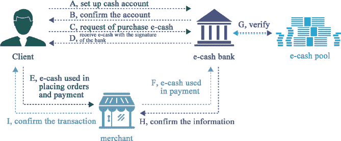

图 5-2：密码学在线支付系统。

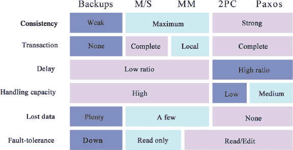

图 5-3：将 Paxos 与其他算法进行比较。

1990 年——Paxos 算法被提出。

莱斯利·拉波特（Leslie Lamport）还创造了 Paxos 算法，这是一种基于信息传递的一致性算法。它解决了分布式系统如何就某一特定点达成共识或协议的问题。38

1991—时间戳确保了数字文件的安全。

斯图亚特·哈伯（Stuart Haber）和 W. 斯科特·斯托梅塔（W. Scott Stometta）发明了一种使用时间戳确保数字文件安全的协议。该概念后来被应用于比特币区块链系统。

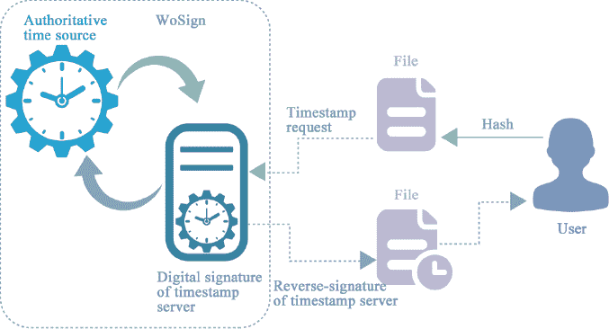

Fig. 5-4：时间戳如何工作。

1997 年——哈希现金被发明。

由亚当·巴克发明的哈希现金是一种工作量证明（PoW）算法，它依赖于成本函数的不可逆转性，以便于验证但难以破解。它最初被用来阻止垃圾邮件。此后，哈希现金成为了区块链中使用的关键技术之一。39

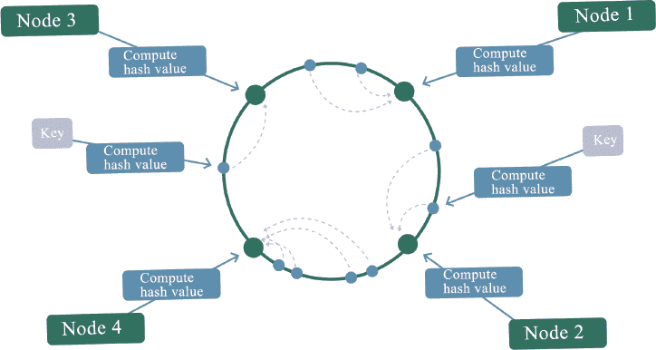

Fig. 5-5：哈希现金（Hashcash）。

1998 年——b-money 的分布式电子货币系统。

韦迪在 1998 年提出了一个匿名、去中心化的电子货币系统，即 b-money。该系统引入了工作量证明（PoW）机制，并强调了点对点交易和非破坏性特征。同年，尼克·萨博发布了比特金（Bit Gold），一个去中心化的数字货币系统。参与者可以贡献计算能力来解决加密谜题。后来，哈尔·芬尼提出了 RPoW（可重用工作量证明机制），它结合了 b-money 和亚当·巴克（Adam Back）的哈希现金，从而创造了一种加密货币。

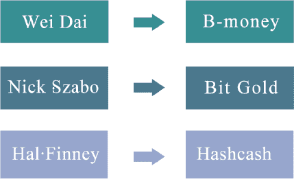

Fig. 5-6：电子货币。

2008 年 11 月 11 日——《比特币白皮书》发布。

点对点电子现金系统（A Peer-to-Peer Electronic Cash System）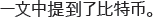

中本聪在《比特币：一种点对点电子现金系统》中首次提到了“比特币”。

2009 年 1 月 4 日——创世区块的创建。

北京时间 2009 年 1 月 4 日，02:15:05，中本聪在比特币世界里创造了第一个区块——创世区块。在新的区块链系统中，它被设定为区块 0，而在旧的系统中，它被设定为区块 1。

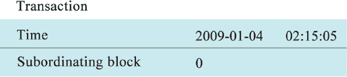

Fig. 5-7：创世区块的创建。

2009 年 1 月 11 日——比特币客户端 0.1 发布。

2009 年 1 月 11 日，中本聪发布了比特币客户端 0.1。这是比特币历史上的第一个客户端，意味着更多的人可以挖矿和使用比特币。

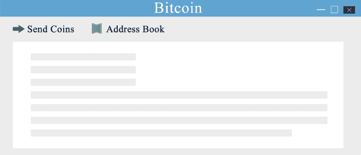

Fig. 5-8：比特币客户端 0.1 的发布。

2009 年 1 月 12 日——第一笔比特币交易。

2009 年 1 月 12 日，中本聪向开发者兼密码活动家哈尔·芬尼发送了 10 比特币。这是比特币历史上的第一笔交易。

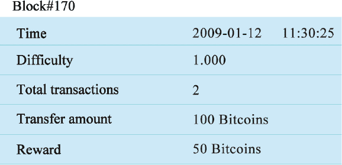

Fig. 5-9：第一笔比特币交易。

2009 年 10 月 5 日——1 美元 = 1109.03 比特币

比特币和美国美元最早的汇率为 1 美元 = 309.03 比特币，这是由一个名为“New Liberty Standard”的用户发行的。比特币的价值如下计算：

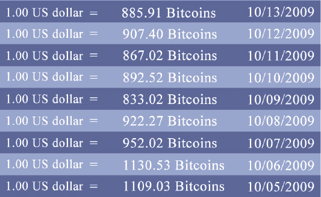

Fig. 5-10：比特币汇率。

具有高性能 CPU（中央处理单元）的计算机一年的平均耗电量为 1331.5 千瓦时，乘以去年美国居民的平均电力成本 0.113 美元，除以 12 个月，然后除以过去 30 天产生的比特币数量，最后除以 1 美元。

2009 年 12 月 30 日——比特币挖矿难度首次增加。

为了保持每十分钟一个块的挖矿速度，比特币网络自我调整，挖矿难度首次增加。

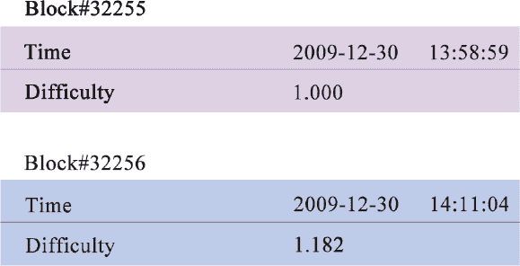

图 5-11：比特币挖矿难度首次增加。

2010 年 7 月 12 日——首次价格波动。

2010 年 7 月 12 日至 7 月 16 日，比特币汇率经历了五天的剧烈波动，从每比特币 0.008 美元激增至 0.080 美元，这是比特币汇率首次剧烈波动。

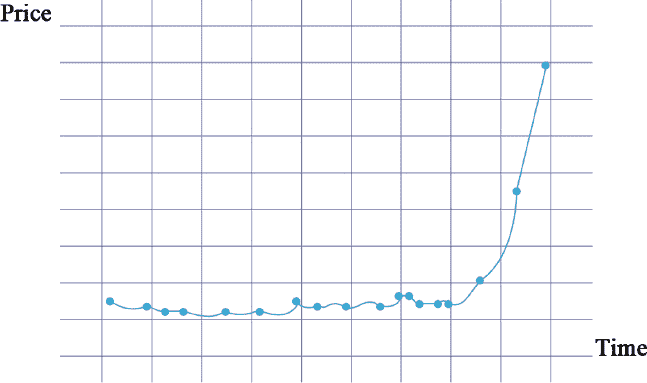

图 5-12：首次价格波动。

2010 年 7 月 12 日——GPU 挖矿开始。

随着比特币汇率的持续上涨，活跃矿工正在寻找提高计算能力的方法。专业图形卡比传统 CPU 拥有更强的计算能力。据说，矿工 ArtForz 是第一个成功使用单个 OpenCL（开放计算语言）GPU（图形处理器）进行比特币挖矿的人。

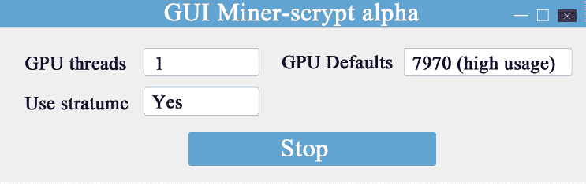

图 5-13：GPU 挖矿。

2010 年 8 月 6 日——比特币网络协议升级。

2010 年 8 月 6 日，比特币协议中的一个重大漏洞被发现。交易信息被包含在交易日志或区块链中，而没有经过适当验证。这一漏洞被犯罪分子利用，生成了 1840 亿比特币，并发送到两个比特币地址。非法交易很快被发现，漏洞在几小时内得到修复。非法交易被从交易日志中删除，比特币网络协议升级到了新版本。

2010 年 10 月 16 日——首次托管交易。

2010 年 10 月 16 日，比特币论坛成员 Diablo–D3 和 Nanotube 进行了首次记录的托管交易。托管人是 theymos。2010 年 12 月 5 日，比特币在维基解密披露美国外交电报时首次与真实金融界互动。比特币社区呼吁维基解密接受比特币捐款以打破金融封锁。中本聪坚决反对，他认为比特币尚处于婴儿期，无法承受冲突和争议。

2010 年 12 月 16 日——比特币挖矿池出现。

当一群矿工在 2010 年 12 月 16 日在 Slushpool 共同挖掘第一个区块时，挖矿变成了团队合作。每个矿工按其工作量比例获得报酬。在接下来的两个月里，Slushpool 的计算能力从 1400 Mhash/s 增加到 60 Ghash/s。42

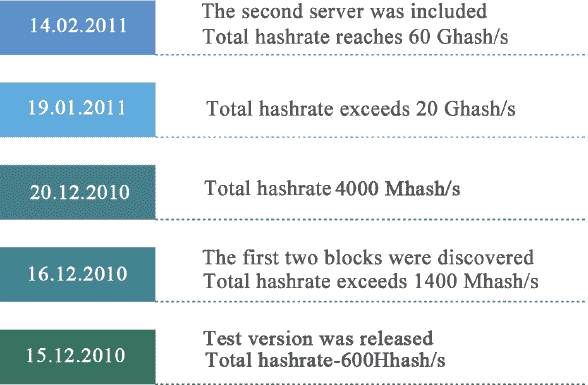

图 5-14：比特币挖矿池的诞生。

2011 年 6 月 20 日——Mt. Gox 出现交易漏洞。

世界上最大的比特币交易网站 Mt.Gox（也称为 MtGox）在 2011 年 6 月 20 日凌晨在比特币市场上展示了令人震惊的现象。一个比特币仅值一美分，而此前的正常价格约为十五美元。Mt.Gox 呼吁用户尽快更改密码，同时宣布在此异常期间所有大量交易均无效。

2011 年 6 月 29 日——比特币电子钱包。

比特币支付处理商 BitPay 于 2011 年 6 月 29 日推出了其首个适用于智能手机的比特币电子钱包。7 月 6 日，一款免费的比特币电子钱包应用出现在安卓应用商店，这是首款适用于智能手机和平板电脑的比特币相关应用。该应用由 Brandon Iles 开发。43

2011 年 7 月——一起未解决的比特币案件。

2011 年 7 月，世界上第三大比特币交易所 Bitomat 宣布他们失去了对文件 wallet.dat 的访问权限，这意味着他们失去了为客户保存的 17,000 个比特币。

2011 年 11 月 10 日——比特币 POS（销售终端）成功开发。

POS 与互联网相连，包括一个 128×64 像素的单色显示屏、一个收据打印机、一个 24 键键盘和一个 USB（通用串行总线）接口，可以连接一个二维码（快速响应）条码扫描器。44

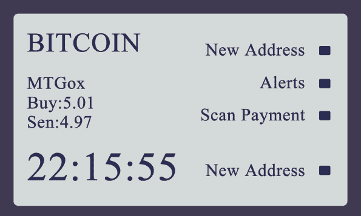

图 5-15：比特币 POS 界面。

2012 年 8 月 14 日——芬兰中央银行认可比特币的合法性。

2012 年 8 月 14 日，当芬兰广播公司的记者询问比特币的法律地位时，芬兰中央银行的代表回答：“我们并没有承诺比特币与官方货币之间的兑换。对于不受（政府）管理的类似比特币的虚拟货币，没有这样的保证。”

记者随后问道：“比特币是非法的吗？”代表回答：“这不一样。人们可以用任何他们喜欢的货币进行投资。毕竟，芬兰是一个自由之国。”

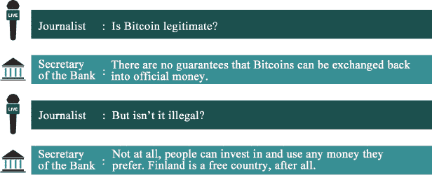

图 5-16：芬兰中央银行认可比特币的合法性。

2012 年 9 月 27 日——比特币基金会成立。

为了实现标准化、保护并促进比特币的发展，成立了比特币基金会。该基金会对于媒体和商业发起的查询具有重要意义，并符合相关法律法规。

2012 年 11 月 28 日——首次减半区块奖励。

比特币挖矿奖励从每 10 分钟的 50 个比特币减少到 25 个比特币。区块#210000 是第一个减半的区块。

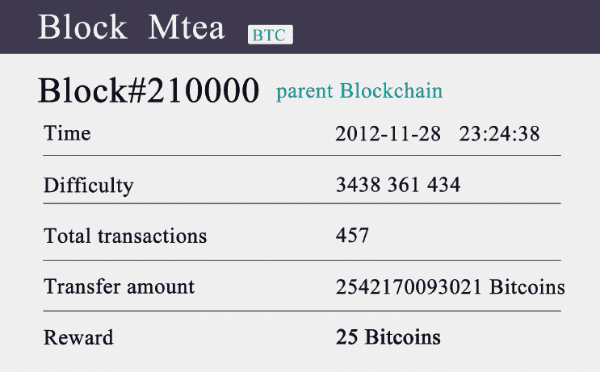

图 5-17：区块奖励减半。

2013 年 10 月 25 日—FBI 成为比特币的新贵。

海盗罗伯茨的传奇生涯走到了尽头。美国联邦调查局（FBI）接管了他的账户上的 144,000 个比特币，并将它们转移到了 FBI 控制的比特币账户。45

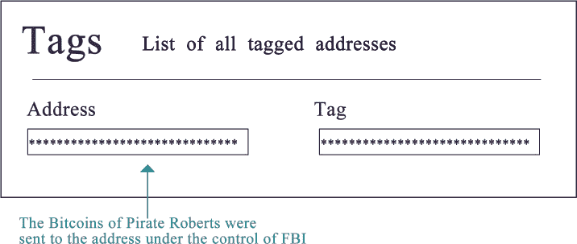

图 5-18：FBI 成为比特币的新贵。

2013 年 11 月 29 日—比特币价格首次超过黄金。

2013 年 11 月 29 日，比特币在 Mt.Gox 的交易价格为 1,242 美元/BTC，与此同时，黄金价格为 1,241.98 美元/盎司。比特币价格首次超过黄金。

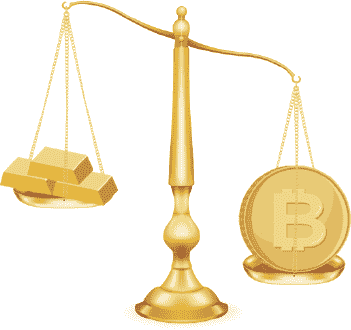

图 5-19：比特币价格首次超过黄金。

2013 年 12 月 5 日—五部委发布通知。

2013 年 12 月 5 日，中国人民银行等五部委发布《关于防范比特币风险的通知》，明确指出比特币不具有法定货币地位，因此不能且不应该作为市场上流通的货币使用。通知发布当天，比特币的平均价格暴跌。

2013 年 12 月 18 日—比特币价格暴跌。

2013 年 12 月 18 日，中国两大比特币交易所 BTCC 和 OKCoin 发布声明，宣布暂停人民币充值服务。随后，比特币的价格跌至 2011 年的人民币价格。46

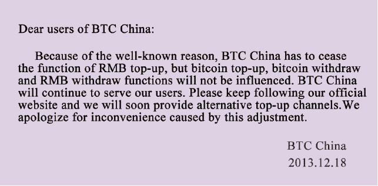

图 5-20：比特币价格暴跌。

2014 年 7 月 9 日—波兰财政部确认比特币为金融工具。

2014 年 7 月 9 日，波兰财政部副部长沃伊切赫·科瓦尔茨克发布文件确认，根据当前的波兰金融法规，比特币可以作为金融工具使用。

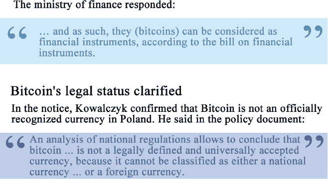

图 5-21：波兰财政部声明。

2014 年 7 月 12 日—法国发布新的比特币法规。

2014 年 7 月 12 日，法国经济与财政部长表示，将在年底前对使用比特币和其他数字货币的金融机构和个人用户实施监管措施：“尽管目前虚拟货币的规模可能对经济系统产生影响，但这些非官方货币正在发展，存在非法性或欺诈的风险。”

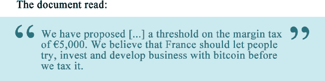

图 5-22：法国发布新的比特币法规

2014 年 12 月 11 日—微软开始接受比特币支付。

全球计算机巨头微软于 2014 年 12 月 11 日宣布，它接受比特币作为支付选项，允许消费者使用比特币在其在线商店购买各种数字内容。根据微软官方商店的支付信息页面，美国消费者可以用比特币充值他们的微软账户。47

2015 年 10 月 22 日——欧盟免征比特币增值税。

2015 年 10 月 22 日，欧洲法院作出裁决，对于比特币和其他虚拟货币的交易将免征增值税。这一决定对于比特币社区来说是一个重大胜利，因为它意味着他们在下一次虚拟货币交易中无需纳税。48

2015 年 12 月 16 日——比特币证券发行。

2015 年 12 月 16 日，美国证券交易委员会批准在线零售商 Overstock 通过区块链发行其股票。根据 Overstock 向美国证券交易委员会提交的 S-3 申请，该公司希望通过区块链发行 5 亿美元的新证券，包括普通股、优先股、存托凭证、认股权证和债券。49

2016 年 4 月 5 日——OpenBazaar 上线。

去中心化电子商务协议 OpenBazaar 的开发者于 2016 年 4 月 5 日发布了该软件的第一个官方版本。OpenBazaar 使 P2P 数字商业成为可能，并将比特币作为支付方式，这与一个去中心化的“淘宝”类似。50

2016 年 5 月 25 日——日本认定比特币为财产。

日本参议院于 2016 年 5 月 25 日通过了国内数字货币交易监管法案，将比特币归类为资产或财产。

2016 年 6 月——《民法总则》限定虚拟资产的保护。

2016 年 6 月，第十二届全国人民代表大会常务委员会举行第二十一届会议，会议首次审议了全国人民代表大会常务委员会提交的《中华人民共和国民法总则（草案）》，该草案为新型的民事权利，如网络虚拟财产和数据信息等对象，正式确立了权利客体。比特币和其他虚拟货币受到了法律的官方保护。51

2016 年 7 月 20 日——比特币奖励第二次减半。

2016 年 7 月 20 日，挖出了第 42 万个区块，区块奖励迎来了第二次减半，成功降至 12.5 个比特币。由于上一次减半是在第二个 1 万个区块，当时的货币通胀率从 12.5%降至 8.3%，而此次减半是在第 42 万个区块，通胀率降至 4.17%。随后的奖励减半将在大约四年后的第 63 万个区块进行。52

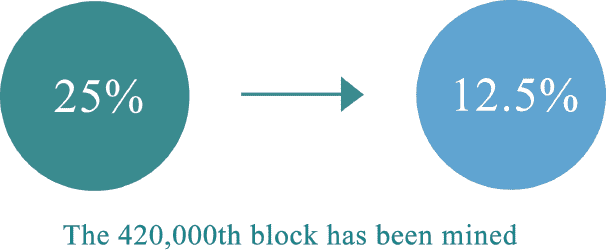

图 5-23：比特币奖励第二次减半。

2017 年 2 月——中国中央银行数字货币的测试运行。

中国人民银行可能会成为世界上第一个发行数字货币并将其投入实际应用的中央银行。据报道，央行推动的基于区块链的电子发票交易平台已经成功测试。央行发行的法定数字货币在这个平台上经历了一次测试运行。53

区块链术语：每个人都必备的手册

[区块链](https://wiki.example.org/blockchain)

这个术语是每个人都应该熟悉的，因为许多人更喜欢用英文名称来称呼区块链。最近的一次投票将其改为“公共信用链”，但“区块链”仍然是最常见的名称。作为比特币的底层技术，区块链是一个去中心化的分布式账本系统。它也被并与人工智能和大数据称为金融技术的三大巨头。

区块链

这个术语可能是区块链领域中最常被提及的一个。比特币是基于区块链技术的第一个实现应用。它最初是建立在点对点网络之上的虚拟货币，但在许多国家，它已经可以用来购买现实生活中的物品。今天，比特币已经演变成一个基于中本聪想法设计和开发的开源软件，以及建立在此软件之上的点对点网络。

中本聪

这是在探索区块链时不可避免会遇到的一个名字。这是比特币的开发者兼创始人。2008 年，在讨论信息加密的一个邮件组中，中本聪发表了一篇文章，概述了比特币系统的基本框架。2009 年，他为系统建立了一个开源项目，正式宣布比特币的诞生。然而，随着比特币逐渐发展成为一种现象，中本聪从互联网上消失了。比特币的许多“纪念日”都与中本聪有关。

数字货币

数字货币是区块链的最初应用形式。它是一种以数字形式指定的替代货币，数字黄金货币和加密货币都属于数字货币。它并不完全等同于虚拟世界中的虚拟货币，因为它通常用于交易真实商品和服务，而不仅仅局限于在线游戏等虚拟空间。现在世界上有数千种数字货币。

工作量证明（PoW）

如果你热爱学习，想进一步了解区块链的原理，那么你无疑会遇到这个术语，它的意思是“工作量证明”。比特币在区块生成过程中采用 PoW 机制。一个合格的区块哈希值由许多前导零组成，其数量取决于网络的难度。获得一个区块的合理哈希值需要大量的尝试和计算，计算时间取决于机器的哈希运算速度。54

公钥与私钥

当我们讨论与区块链相关的话题时，我们经常看到这两个术语：公钥和私钥。它们通常被称为非对称加密，这是一种比之前的对称加密（使用用户名和密码）的改进。

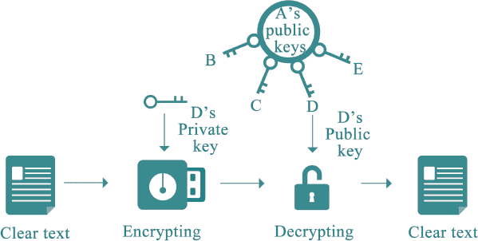

图 5-24：非对称加密。

在比特币系统中，私钥本质上是一个包含 32 字节的数组。公钥及地址的生成都依赖于私钥。有了私钥，就可以生成公钥和地址，并且可以访问和使用相应地址的比特币。

Hash 值

Hash 值在比特币世界中是一个无处不在的术语。哈希算法将任意长度的二进制值映射到一个固定长度更小的二进制值，称为哈希值，它是数据的一种独特且极其紧凑的数值表示。即使在一个明文文本中只改变一个字母，随后产生的哈希值也会有很大的不同。从计算角度来看，找到两个不同的输入产生相同的哈希值基本上是不可能的。55

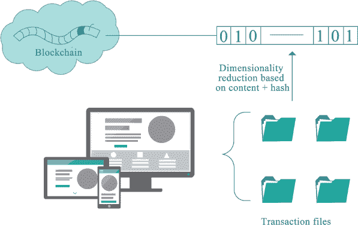

图 5-25：区块链降维 + 哈希。

公链与私链

行业中的人经常被问到，“我听说你对区块链有一些了解，来来来，帮我分类一下，这个应用是公链还是私链？”

公链指的是任何人都可以读取的区块链，任何人都可以发送交易信息，交易可以被有效确认，任何人都可以参与共识过程。共识过程决定了哪个区块可以添加到区块链，它也允许参与者了解当前状态。公链通常被认为是完全去中心化的，而私链指的是只有单一组织拥有写入权限的区块链。

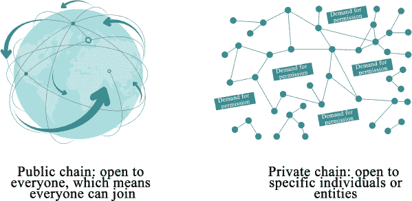

图 5-26：公链与私链。

简言之，公链对所有人开放，任何人都可以参与，而私链只对一个人或实体开放。56

区块与链

区块指的是信息区块。每个区块包含三个元素，即区块的 ID、几个交易订单和前一个区块的 ID。

比特币系统大约每十分钟创建一个区块，该区块包含在这段时间内整个网络中发生的所有交易。每个区块还包含前一个区块的 ID，这使得每个区块能够找到其前一个节点，通过这种逆向方式，形成了一个完整的交易链。自诞生至今，整个网络中只有一个独特的主区块链。

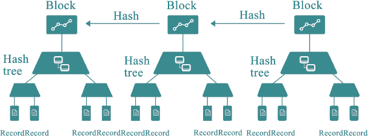

图 5-27：区块与链。

智能合约

智能合约也是一个熟悉的概念，它看起来既简单又复杂。从字面上讲，它意味着一个自动执行且有些巧妙的合约。

智能合约的发明者尼克·萨博（Nick Szabo）将其定义为：“智能合约是一系列以数字形式指定的承诺，包括各方在这些承诺下执行的协议。”57

信用共识证明

这个术语经常出现在关于区块链的报道和会议上。"信用共识证明"总是伴随着关于区块链功能和区块链为何能改变世界的问题。

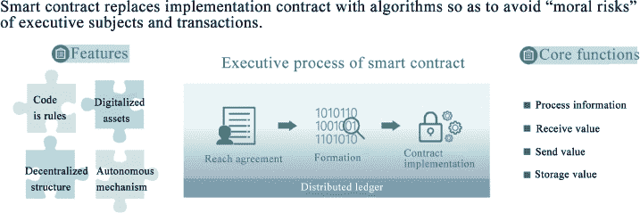

图 5-28：智能合约。

区块链的分布式结构及其基于数学算法的低成本信任机制为解决和优化金融领域相关问题提供了新的视角。目前，经济社会的信用环境相对较弱，而信用成本相对较高。区块链技术提出了一套低成本的解决方案，这对信用经济的发展具有重大意义。

图 5-29：区块链的信用共识证明。

R3

R3 区块链联盟包括世界上七十多家顶级金融机构，其中包括中国的四家传统金融机构，即平安保险（集团）股份有限公司、招商银行、中国外汇交易中心和中国民生银行。目标是为金融机构创建一个私有的区块链系统。

2016 年 5 月，R3 开始为其分布式账本联盟寻求 2 亿美元的 A 轮融资，其自身持股比例为 10%。随后，R3 将其融资目标金额降至 1.5 亿美元，其自身持股比例提高到 40%，其余 60%的股份计划主要从联盟的 42 家初始成员银行中筹集。然后，七家银行退出了融资。在 R3 宣布将其区块链平台 Corda 开源后，一些成员，包括高盛（Goldman Sachs），退出了 R3 联盟。58

_____________

区块链的演变 [链接](http://tech.hexun.com/2016–04–25/183507891.html)（2016-04-25）[2017-05-18]。

分布式一致性算法 Paxos [链接](http://www.cnblogs.com/cchust/p/5617989.html)（2016-06-27）[2017-05-18]。

比特币背后的技术 [链接](http://it.dataguru.cn/article-3986-1.html)（2013-12-20）[2017-05-18]。

比特币五年历史（全文更新） [链接](http://8btc.com/thread-2603-1-1.html)（2016-08-13）[2014-01-08]。

协议漏洞生成 1840 亿比特币 [链接](http://www.8btc.com/184-billion-Bitcoins)（2010-08-15）[2017-05-18]。

比特币：数字时代的“挖矿” [链接](http://www.fx361.com/page/2017/0303/922619.shtml)（2017-03-03）[2017-05-18]。

BitPay 发布比特币电子钱包 [链接](http://www.8btc.com/bitpay-launches-e-wallet)（2011-06-29）[2017-05-18]。

Bitcoin POS 成功开发 [链接](http://www.8btc.com/Bitcoin-pos)（2011-11-10）[2017-05-18]。

联邦调查局从丝绸之路获取比特币并成为新的顶级富豪 [链接](http://www.8btc.com/fbi-ross-ulbricht-2)（2013-10-25）[2017-05-18]。

比特币从中国撤出？交易平台暂停人民币充值 [链接](http://www.kejixun.com/article/201312/27153.html)（2013-12-19）[2017-05-18]。

微软将比特币列为支付选项 [链接](http://www.8btc.com/microsoft-adds-Bitcoin-payments-xbox-games-mobile-content)（2014-12-11）[2017-05-18]。

欧盟法院决定数字货币交易将免征增值税 [链接](http://www.8btc.com/Bitcoin-is-exempt-from-vat)（2015-10-22）[2017-05-18]。

美国证券交易委员会批准 Overstock 通过区块链发行 5000 万美元股票的计划 [链接](http://www.btc38.com/btc/altgeneral/8982.html)（2015-12-16）[2017-05-18]。

4 月 10 日至 16 日比特币社区发生了什么 [链接](http://mt.sohu.com/20160410/n443807602.shtml)（2016-04-10）[2017-05-18]。

虚拟资产正式受到法律保护 [链接](http://www.cnfla.com/gonggao/50131.html)（2016-06-29）[2017-05-18]。

52   “比特币价格在第二次减半后大幅波动” [EB/OL]. (2016–07–10)[2017–05–18].[`www.8btc.com/halving_megathread_block`](http://www.8btc.com/halving_megathread_block).

53   “央行数字货币确实到来，业界给予好评但问题仍需解决” [EB/OL]. (2017–02–09)[2017–05–18]. [`www.cs.com.cn/xwzx/jr/201702/t20170209_5172817.html`](http://www.cs.com.cn/xwzx/jr/201702/t20170209_5172817.html).

54   “比特币原则” [EB/OL]. (2014–01–26) [2017–05–18]. [`blog.csdn.net/autumn84/article/details/18782533`](http://blog.csdn.net/autumn84/article/details/18782533)

55   “什么是哈希值？” [EB/OL]. [2017–05–18].[`product.pconline.com.cn/itbk/software/dnwt/1504/6325876.html`](http://product.pconline.com.cn/itbk/software/dnwt/1504/6325876.html).

56   “区块链全面介绍：公有区块链与私有区块链” [EB/OL]. (2016–08–09) [2017–05–18]. [`www.weiyangx.com/199778.html`](http://www.weiyangx.com/199778.html).

57   什么是智能合约？ [EB/OL]. (2014–12–14) [2017–05–18].[`www.8btc.com/what-are-smart-contracts-in-search-of-a-consensus`](http://www.8btc.com/what-are-smart-contracts-in-search-of-a-consensus).

58   “融资加剧 R3 区块链联盟内部分歧：包括高盛、摩根士丹利和摩根大通在内的 7 家银行退出” [EB/OL]. (2016–11–29) [2017–05–18].[`www.sohu.com/a/120161115_115035`](http://www.sohu.com/a/120161115_115035).
