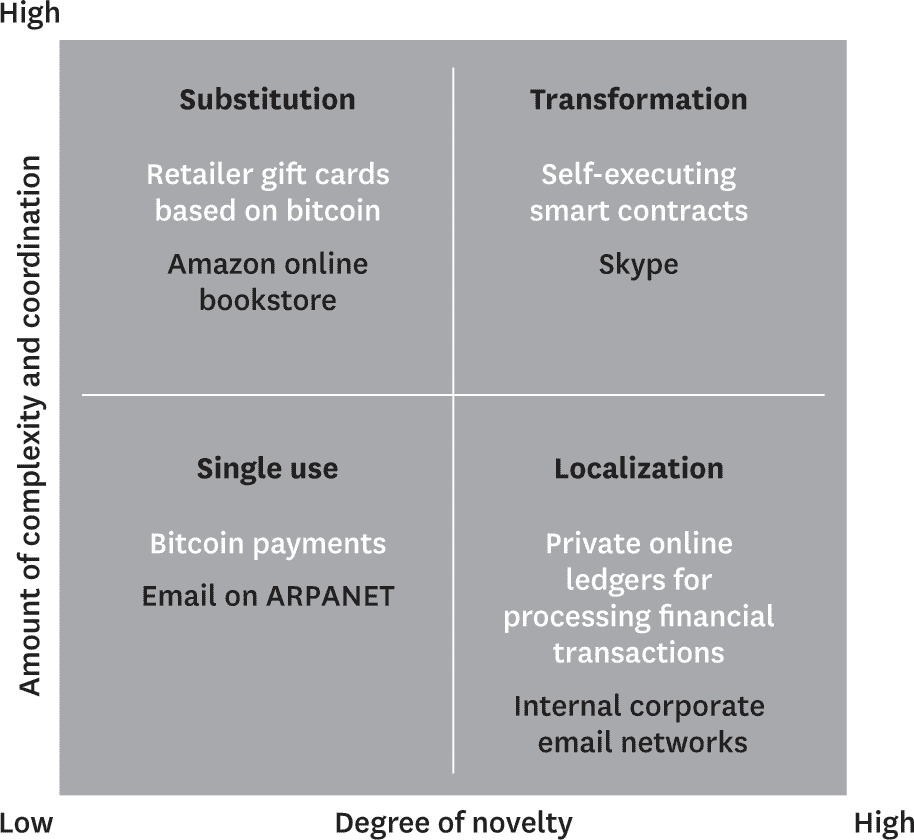

</hgroup>

# 第一节

# 理解区块链

</hgroup>

</hgroup>

# 1

# 区块链的真相

</hgroup>

作者：Marco Iansiti 和 Karim R. Lakhani

合同、交易及其记录是我们经济、法律和政治体系中定义性的结构。它们保护资产并设定组织边界。它们建立并验证身份，并记录事件。它们管理国家、组织、社区和个人之间的互动。它们指导管理和社会行动。然而，这些关键工具及其形成的官僚机构并没有跟上经济数字化转型的步伐。它们就像高峰时段的拥堵，困住了一辆一级方程式赛车。在数字世界中，我们规范和管理行政控制的方式必须改变。

区块链承诺解决这一问题。作为比特币和其他虚拟货币的核心技术，区块链是一种开放、分布式的账本，能够高效、可验证且永久地记录两个实体之间的交易。账本本身也可以被编程来自动触发交易。（参见边栏 “区块链如何工作.” ）

区块链如何工作

以下是支撑这项技术的五个基本原则。

1.  分布式数据库。区块链上的每个方都能访问整个数据库及其完整历史。没有一方控制数据或信息。每个方都可以直接验证其交易伙伴的记录，无需中介。

1.  点对点传输。通信直接在 peers 之间进行，而不是通过中心节点。每个节点存储并将其信息转发给所有其他节点。

1.  透明性与匿名性。任何能访问系统的人都能看到每笔交易及其关联的价值。区块链上的每个节点，或用户，都有一个由 30 多个字符组成的独特字母数字地址来标识它。用户可以选择保持匿名或向他人提供身份证明。交易发生在区块链地址之间。

1.  记录的不可逆性。一旦交易被输入数据库，并且账户被更新，记录就不能被更改，因为它们与之前的每个交易记录都有关联（因此称为“链”）。部署了各种计算算法和方法，以确保数据库上的记录是永久的、按时间顺序排列的，并可供网络上的所有人查看。

1.  计算逻辑。账本数字化意味着区块链交易可以与计算逻辑绑定，本质上可以编程。因此，用户可以设置算法和规则，这些规则可以自动触发节点之间的交易。

利用区块链，我们可以想象一个世界，在这个世界里，合同被嵌入数字代码并存储在透明、共享的数据库中，从而保护它们免受删除、篡改和修订。在这个世界里，每一个协议、每一个流程、每一个任务和每一个支付都会有数字记录和签名，这些记录和签名可以被识别、验证、存储和共享。像律师、经纪人、银行家这样的中介可能不再需要。个人、组织、机器和算法可以自由地进行交易和互动，几乎不产生摩擦。这就是区块链的巨大潜力。

实际上，几乎每个人都听说过区块链将革命化商业、重新定义公司和经济的说法。虽然我们对其潜力表示赞同，但我们对炒作感到担忧。我们担心的不仅仅是安全问题（比如 2014 年一个比特币交易所的崩溃和最近其他交易所的黑客攻击）。我们研究技术创新的经验告诉我们，如果要有区块链革命，许多障碍——技术、治理、组织甚至社会层面的障碍——都必须消除。没有理解它如何可能获得立足点就匆忙进行区块链创新，那将是一个错误。

我们相信，真正的区块链引领的商业和政府变革还有许多年才能实现。这是因为区块链不是一种“颠覆性”技术，它可以通过低成本解决方案迅速攻击传统商业模式并超越现有公司。区块链是一种*基础性*技术：它有潜力为我们的经济和社会系统创造新的基础。但尽管影响巨大，区块链要想渗透到我们的经济和社会基础设施中还需要几十年。采用的过程将是逐步和稳定的，而不是突然的，正如技术变革和制度变革的浪潮一样。我们将在本文中探讨这一洞察及其战略含义。

# 技术采用的模式

在一头扎进区块链战略和投资之前，让我们思考一下我们所了解的技术采用，特别是其他基础性技术典型的转型过程。最相关的例子是分布式计算机网络技术，体现在 TCP/IP（传输控制协议/互联网协议）的采用上，它为互联网的发展奠定了基础。

**TCP/IP** 协议于 1972 年推出，最初在一个*单用途*的案例中获得了关注：作为美国国防部前身 ARPANET 上研究人员之间电子邮件的基础。在 TCP/IP 之前，电信架构是基于“电路交换”的，这种交换方式要求两个当事人或机器之间的连接必须预先建立并维持在整个交换过程中。为了确保任意两个节点之间能够进行通信，电信服务提供商和设备制造商投入数十亿美元建设专用线路。

TCP/IP 颠覆了这一模式。这个新协议通过数字化信息并将其分解成非常小的数据包，每个数据包都包含地址信息。一旦这些数据包被释放到网络中，它们可以沿着任何路径到达收件人。网络边缘的智能发送和接收节点可以分解和重新组装这些数据包，并解释编码数据。无需专用私有线路或大规模基础设施。TCP/IP 创建了一个没有中央权威或负责维护和改进的开放、共享的公共网络。

传统的电信和计算行业对 TCP/IP 持怀疑态度。很少有人想象到在新的架构上可以建立健壮的数据、消息、语音和视频连接，或者相关的系统可以安全且可扩展。但在 20 世纪 80 年代和 90 年代后期，越来越多的公司，如 Sun、NeXT、Hewlett-Packard 和 Silicon Graphics 等，采用了 TCP/IP，部分是为了在组织内部创建*本地化*的私有网络。为此，他们开发了构建块和工具，使 TCP/IP 的使用超越了电子邮件，逐渐取代了更传统的局域网技术和标准。随着组织采用这些构建块和工具，他们看到了生产力的显著提高。

随着 1990 年代中期万维网的出现，TCP/IP 广泛进入公众使用。新技术公司迅速涌现，提供连接到现在公开的网络并交换信息所需的“基础设施”——硬件、软件和服务。Netscape 将浏览器、网络服务器和其他工具和组件商业化，促进了互联网服务和应用程序的开发和采用。Sun 推动了 Java（应用程序编程语言）的发展。随着网上信息的指数级增长，Infoseek、Excite、AltaVista 和 Yahoo 等搜索引擎应运而生，引导用户在网上浏览。

一旦这种基本基础设施获得了临界质量，新一代的公司利用低成本的连接通过创建对现有业务具有*substitutes*（替代品）吸引力的互联网服务来占据优势。CNET 将新闻搬到线上。亚马逊出售的书籍比任何书店都多。Priceline 和 Expedia 使购买机票变得更容易，并将前所未有的透明度带入整个过程。这些新来者以相对较低的成本获得广泛覆盖的能力对传统业务如报纸和实体零售商造成了巨大压力。

依赖广泛的互联网连接，下一波公司创造了 novel, *transformative*（创新的，变革性的）应用程序，从根本上改变了企业创造和捕获价值的方式。这些公司建立在新型的点对点架构之上，通过协调分布式用户网络来创造价值。想想 eBay 是如何通过拍卖改变在线零售的，Napster 是如何改变音乐行业的，Skype 是如何改变电信的，以及 Google，利用用户生成的链接提供更相关的搜索结果，是如何改变网络搜索的。

最终，TCP/IP 花了 30 多年时间才完成所有阶段——单一使用、局部使用、替代和转变——并重塑经济。今天，世界上超过一半最有价值上市公司是基于互联网的平台型商业模式。我们经济的基础已经发生了变化。物理规模和独特的知识产权不再赋予不可战胜的优势；越来越多地，经济领导者是那些作为“关键石”的企业，它们主动组织、影响和协调广泛的社区、用户和组织网络。

# 新架构

区块链——一种位于互联网之上的点对点网络——于 2008 年 10 月作为比特币的一部分提出，比特币是一个虚拟货币系统，它放弃了中央权威机构发行货币、转移所有权和确认交易。比特币是区块链技术的第一个应用。

区块链和 TCP/IP 之间的相似之处显而易见。正如电子邮件实现了双边消息传递，比特币实现了双边金融交易。区块链的发展和维护是开放的、分布式的和共享的，就像 TCP/IP 一样。一个全球志愿者团队维护核心软件。就像电子邮件一样，比特币首先被一个热情但相对较小的社区所接受。

TCP/IP 通过大幅降低连接成本解锁了新的经济价值。同样，区块链可能会通过大幅降低交易成本来改变一切。它有潜力成为所有交易的记录系统。如果真的发生了这种情况，经济将再次经历一场根本性的转变，因为新的基于区块链的影响力和控制来源将出现。

考虑一下现在的商业运作方式。持续记录交易是任何企业的核心功能。这些记录追踪过去的行动和表现，并指导未来的规划。它们不仅展示了组织内部的运作方式，还展示了组织外部的关系。每个组织都有自己的记录，并且这些记录是私密的。许多组织没有所有活动的总账；相反，记录分散在内部单位和功能之间。问题是，要在各个私有账本之间调和交易需要花费大量时间，并且容易出错。

例如，一个典型的股票交易可以在微秒级别完成，通常不需要人工干预。然而，结算——股票所有权的转移——可能需要长达一周的时间。那是因为各方无法访问彼此的账本，并且不能自动验证资产实际上是可以转让的。相反，一系列中介机构作为资产保证人，当交易记录穿越组织时，账本分别更新。

在区块链系统中，账本在大量 identical 的数据库中复制，每个数据库都由一个感兴趣的方托管和维护。当更改输入到一个副本中时，所有其他副本都会同时更新。因此，随着交易的发生，价值交换的所有账本上都会永久记录。无需第三方中介来验证或转移所有权。如果在一个基于区块链的系统中进行股票交易，它将在几秒钟内得到解决，既安全又可验证。（比特币交易所遭遇臭名昭著的黑客攻击，暴露了与使用区块链的各方相连的独立系统的弱点，而不是区块链本身的弱点。）

# 区块链采用的框架

如果比特币就像早期的电子邮件，区块链是否还需要几十年才能发挥其全部潜力？我们认为答案是有条件的肯定。我们无法准确预测转型需要多少年，但我们可以猜测哪些应用将首先获得动力，以及区块链广泛接受将如何最终实现。

在我们的分析中，历史表明两个维度会影响基础技术与其商业用例的发展。第一个是新颖性——应用对世界来说是新到何种程度。它越新颖，就越需要付出努力确保用户理解它解决了什么问题。第二个维度是复杂性，由涉及的生态系统协调水平来表示——需要共同努力以利用技术产生价值的各方数量和多样性。例如，只有一个成员的社交网络作用不大；只有当您很多联系人都已加入该社交网络时，它才值得使用。应用程序的其他用户必须被吸引加入，以使所有参与方都能产生价值。对于许多区块链应用来说，情况也是如此。而且，随着这些应用的规模和影响力增加，它们的采用将需要重大的制度变革。

我们建立了一个框架，将创新与这两个上下文维度相对比，将它们划分为四个象限。（参见图 1-1。）每个象限代表技术发展的一个阶段。确定区块链创新属于哪一个阶段将帮助高管理解它所提出的挑战类型、所需的协作和共识水平以及它将需要的立法和监管努力。该图还建议必须建立什么类型的流程和基础设施以促进创新的采用。管理者可以利用它来评估任何行业的区块链发展状况，以及评估在自身区块链能力方面的战略投资。

图 1-1

基础技术如何获得普及

基础技术的采用通常经历四个阶段。每个阶段都是由应用的新颖性和使它们可行所需的协调努力的复杂性来定义的。新颖性低、复杂性低的应用首先获得接受。新颖性高、复杂性高的应用需要数十年才能发展，但可以改变经济形态。1972 年在 ARPANET 上引入的 TCP/IP 技术已经进入变革阶段，但区块链应用（如图中的白色部分）还处于起步阶段。

## 单次使用

第一象限中那些低创新性和低协调要求的应用创造了更好、成本更低、高度专注的解决方案。电子邮件是一种廉价的电话、传真和邮寄的替代品，它是 TCP/IP 的单用途应用（尽管随着用户数量的增加其价值也在增加）。比特币也是如此。即使在它的早期阶段，比特币也为那些仅仅将其作为支付手段使用的少数人提供了即时价值。（你可以把它看作是一个复杂的电子邮件，它传输的不仅仅是信息，还有实际的价值。）2016 年底，比特币交易的预计价值将达到 920 亿美元。与全球总支付的 411 万亿美元相比，这仍然是一个小数目，但比特币正在快速增长，在即时支付和外汇及资产交易等场合中，比特币正变得越来越重要，而现行的金融体系在这些方面存在局限。

## 本地化

第二象限包括那些相对具有创新性，但只需要有限数量的用户就能产生即时价值的技术创新，因此它们的推广相对容易。如果区块链遵循商业中网络技术的发展路径，我们可以预期区块链的创新将建立在单一用途的应用之上，创建本地私有网络，多个组织通过分布式账本连接起来。

许多初步的基于私有的区块链开发正在金融服务行业进行，通常是在小型的公司网络之中，因此所需的协调工作相对较少。纳斯达克正在与区块链基础设施提供商 Chain.com 合作，提供处理和验证金融交易的技术。美国银行、摩根大通、纽约证券交易所、富达投资和渣打银行正在测试区块链技术，以替代贸易金融、外汇、跨境结算和证券结算等领域的基于纸张和手工的交易处理。加拿大银行正在测试一种名为 CAD-coin 的数字货币，用于银行间转账。我们预期将出现大量为各种行业特定目的服务的私有区块链。

## 替代

第三象限包含的应用程序相对缺乏新颖性，因为它们建立在现有的单用途和本地化应用之上，但它们在协调需求方面很高，因为它们涉及更广泛且日益公开的使用。这些创新旨在取代整个商业运作方式。然而，它们面临的采用壁垒很高；它们不仅需要更多的协调，而且它们希望取代的过程可能在组织和社会机构中根深蒂固。加密货币是替代品的例子，这是全新的、完全形成的货币系统，它们源自简单的比特币支付技术。关键的区别在于，加密货币需要所有进行货币交易的一方都采用它，这挑战了长期以来处理和监督这些交易政府和机构。消费者还需要改变他们的行为，并了解如何实施加密货币的这项新功能。

麻省理工学院最近的一项实验凸显了数字货币系统面临的挑战。2014 年，麻省理工学院比特币俱乐部为该校 4,494 名本科生每人提供了 100 美元的比特币。有趣的是，30% 的学生甚至没有注册领取这笔免费的钱，20% 的注册学生在几周内将比特币兑换成了现金。即使技术娴熟的学生也难以理解如何或在哪里使用比特币。

**Stellar**是众多雄心勃勃的区块链替代应用之一，它是一个非营利组织，旨在为那些从未接触过金融服务的人们带来负担得起的金融服务，包括银行、小额支付和汇款等。Stellar 推出自己的虚拟货币——恒星币（lumens），并允许用户在其系统上保留各种资产，包括其他货币、电话分钟和数据信用。Stellar 最初专注于非洲地区，特别是尼日利亚，这是该地区最大的经济体。在目标人群中，它的采用率显著，并已经证明了其成本效益。但是，其未来绝非确定无疑，因为生态系统的协调挑战难度很高。尽管基层采用已经证明了 Stellar 的可行性，但要成为银行标准，它还需要影响政府政策并说服中央银行和大组织使用它。这可能需要多年的共同努力。

## 转型

最后，完全新颖的应用程序落入第四象限，如果成功，它们可能会改变经济、社会和政治系统的本质。它们需要协调许多参与者的活动，并获得机构对标准和流程的同意。它们的采用将需要重大的社会、法律和政治变革。

“智能合同”可能是目前最具颠覆性的区块链应用。这些应用在满足协商条件时自动执行支付和货币或其他资产的转让。例如，一个智能合同可能在货物交付后立即向供应商发送支付。公司可以通过区块链表示已经收到特定的商品——或者产品可以具备 GPS 功能，这将自动记录位置更新，进而触发支付。我们已经在风险投资、银行和数字版权管理等领域看到了一些早期使用此类自执行合同的实验。

影响是深远的。公司建立在合同之上，从成立到买方供应商关系，再到员工关系。如果合同自动化了，那么传统的公司结构、流程以及像律师和会计师这样的中介会发生什么变化呢？那管理者又如何呢？他们的角色将发生根本性的变化。不过，在我们过于激动之前，让我们记住，我们距离智能合同的广泛采用还有几十年的时间。例如，没有机构的认可，它们是无法有效的。需要极大的协调和清晰地了解智能合同是如何设计、验证、实施和执行的。我们认为负责这些艰巨任务的机构需要很长时间才能演变。而技术挑战——尤其是安全性——是令人畏惧的。

# 指导您对区块链投资的策略

高管应该如何考虑将其应用于自己的组织？我们的框架可以帮助公司识别正确的机遇。

对大多数人来说，最容易开始的地方是单次使用的应用程序，因为它们不是新的，且不需要与第三方进行太多协调，从而最小化了风险。一种策略是增加比特币作为支付机制。比特币的基础设施和市场已经非常成熟，采用这种虚拟货币将迫使包括 IT、财务、会计、销售和营销在内的多种功能构建区块链能力。另一种低风险的方法是内部使用区块链作为数据库，用于管理实体和数字资产、记录内部交易和验证身份。这对于那些难以调和多个内部数据库的公司来说可能是一个特别有用的解决方案。测试单次使用的应用程序将帮助组织发展他们需要的更高级应用程序的技能。多亏了亚马逊和微软等大型平台以及初创企业提供的基于云的区块链服务，实验变得越来越容易。

本地化应用对公司来说是下一个自然步骤。我们现在看到很多对私有区块链网络的投资，涉及的项目似乎正处于真正的短期影响的边缘。例如，金融服务公司发现，他们与有限数量的受信任对手方建立的私有区块链网络可以显著降低交易成本。

组织还可以通过本地化应用跨越边界解决具体的交易问题。例如，公司已经在使用区块链跟踪复杂的供应链中的物品。这发生在钻石行业，宝石正在从矿山追踪到消费者手中。进行此类实验的技术现在已经可以现成购买。

开发替代应用需要周密的计划，因为现有解决方案可能难以取代。一种方法可能是专注于不需要终端用户改变太多行为的替代方案，但提供对昂贵或不吸引人的解决方案的替代。为了获得牵引力，替代品必须提供与传统解决方案相当的功能，并且必须易于生态系统吸收和采用。First Data 涉足基于区块链的礼品卡就是一个很好的周到替代品的例子。向消费者提供这些礼品卡的零售商可以通过使用区块链跟踪账户内货币流动来显著降低每笔交易的成本并提高安全性，而不依赖外部支付处理器。这些新礼品卡甚至允许商家之间通过公共账本转移余额和交易能力。

变革性应用还远未到来。但现在评估它们的可能性并投资于可以实现它们的技术是有意义的。当它们与一种新的商业模式结合时，将会最具影响力，这种商业模式的价值创造和捕获逻辑与现有方法不同。这些商业模式难以采用，但可以为公司解锁未来的增长。

考虑律师事务所必须做出哪些改变才能使智能合同变得可行。他们将需要在新软件和区块链编程方面发展新的专业知识。他们可能还需要重新思考按小时计费的模式，并考虑对合同收取交易或托管费用等方法。无论他们采取何种方法，高管在做出任何转变之前都必须确保他们理解并测试了业务模型的影响。

变革性场景可能会最后起飞，但它们也将带来巨大的价值。两个可能产生深远影响的领域：大规模的公共身份识别系统，如护照控制，以及算法驱动的反洗钱和涉及多方复杂金融交易中的决策制定。我们预计这些应用至少还需要十年甚至更长时间才能达到广泛采用和临界质量。

变革性的应用也将催生新的平台级参与者，他们将协调和管理新的生态系统。这些将是下一代谷歌和脸书。实现这样的机会需要耐心。虽然现在开始对其进行重大投资可能为时尚早，但为它们建立所需的基石—工具和标准—仍然是值得的。

# 结论

除了为区块链的采用提供一个好的模板外，TCP/IP 很可能还为其铺平了道路。TCP/IP 已经无处不在，而区块链应用程序正在建立在数字数据、通信和计算基础设施之上，这降低了实验成本，并将允许新的用例迅速出现。

利用我们的框架，高管们可以弄清楚从哪里开始建立今天的区块链组织能力。他们需要确保员工了解区块链，开发公司特定的应用程序，我们确定的四个象限中，并投资于区块链基础设施。

但是考虑到时间跨度、采用障碍以及涉及到达到 TCP/IP 级别的接受度的巨大复杂性，高管应该仔细考虑实验区块链的风险。显然，从小处着手是培养更大思维能力的好方法。但是，投资水平应取决于公司和行业的背景。金融服务公司已经在区块链采用的道路上走得相当远。制造业则不然。

无论在什么背景下，区块链有很大可能性会影响你的业务。一个非常大的问题是何时会受到影响。

TAKEAWAYS

区块链将革命化商业，但它需要几十年才能做到。这是因为它是一种基础技术，需要广泛的技术、监管和社会协调才能实施。

+   区块链，比特币和其他虚拟货币的核心技术，是一个开放、分布式的账本，能够高效、可验证且永久地记录两方之间的交易。

+   TCP/IP 的采用表明区块链将遵循一种相当可预测的发展模式，所以企业现在开始规划并不算太早。

+   通过一个 2×2 的框架，该框架映射了区块链应用的新颖性和复杂性，管理者可以评估任何行业内区块链发展的状态，并评价自身区块链能力的战略投资。

+   组织可以通过从单一用途的应用程序开始，然后随着时间的推移，逐步过渡到更复杂、新颖，最终具有变革性的应用。

*改编自*哈佛商业评论*2017 年 1 月-2 月文章（产品编号 R1701J）。*

<hgroup>

# 2

# 区块链简史

</hgroup>

文 ay Gupta

我们现在认为是理所当然的许多技术，在其出现之时都是悄无声息的革命。想想智能手机是如何改变我们的生活和工作的方式的。过去，当人们不在办公室时，他们就是*消失了*，因为电话是绑定在某个地方，而不是绑定在个人。现在，我们有全球游牧民族直接从手机构建新业务。而且，想想看，智能手机仅仅出现了十年。

我们现在正处于另一场悄无声息的革命之中：区块链，一个分布式数据库，维护着一个持续增长的、有序记录的列表，称为“区块”。想想在过去十年中都发生了什么：

+   第一大区块链创新是比特币，一个数字货币实验。比特币被数百万人用于支付，包括一个庞大且不断增长的汇款市场。

+   第二大创新被称为区块链，其本质上是意识到运行比特币的底层技术可以与货币分离，用于各种组织间的其他合作。目前，世界上几乎每一个大型金融机构都在使用区块链或进行区块链研究。

+   第三大创新被称为“智能合约”，体现在一个第二代区块链系统以太坊中，它将小型计算机程序直接嵌入区块链中，使得金融工具，如贷款或债券，可以表示，而不仅仅是比特币那样的现金代币。以太坊的智能合约平台现在市值已达到数十亿美元，有数百个项目即将上市。

+   第四大创新，也是当前区块链思维的前沿，被称为“权益证明”（proof of stake）。当前一代的区块链通过“工作量证明”（proof of work）来确保安全，即拥有最大总计算能力的群体做出决策。这些群体被称为“矿工”，他们运营着庞大的数据中心来提供这种安全，以此换取加密货币的支付。新系统摒弃了这些数据中心，用复杂的金融工具取而代之，实现了与数据中心相当甚至更高的安全性。

+   即将到来的第五大创新被称为区块链扩容。目前，在区块链世界中，网络中的每一台计算机都处理每一笔交易。这样做很慢。扩容后的区块链通过计算出验证每笔交易所需的计算机数量，并有效地分配工作，从而加速流程，而不会牺牲安全性。在不损害区块链传奇的安全性和健壮性的情况下管理这一切是一个难题，但并非无解。扩容后的区块链有望足够快，能够推动物联网的发展，并与银行界的主要支付中介（维萨和 SWIFT）一较高下。

这一创新格局代表了精英计算机科学家、密码学家和数学家群体 10 年的工作。随着这些突破的全部潜力触及社会，事情肯定会变得有点奇怪。自动驾驶汽车和无人机将使用区块链支付服务，如充电站和着陆垫的费用。国际货币转账将从几天缩短到一个小时，然后再到几分钟，并且比当前系统能够管理的可靠性更高。

这些变化以及其他变化代表了交易成本的普遍降低。当交易成本降低到不可见的阈值以下时，将会出现突然的、戏剧性的、难以预测的现有商业模式的聚合和分解。例如，拍卖曾经是狭窄和本地的，而不是像 eBay 等网站上的普遍和全球性的。随着接触人们的成本降低，系统突然发生了变化。有理由预计，区块链将触发与电子商务自 1990 年代末发明以来所引发的一样多的级联反应。

预测这一切将走向何方是困难的。有谁预见到社交媒体的到来吗？谁会预测到点击朋友的脸庞会取代我们花在电视前的时光？预测者通常高估了事情发生的速度，低估了长期影响。但在区块链行业内，人们普遍认为即将到来的变化将“与互联网的原始发明一样巨大”，这可能并不过分。我们可以预测的是，随着区块链的成熟和更多人意识到这种新的协作方式，它将从供应链延伸到可证明公平的互联网约会（消除虚假资料和其他不正当手段的可能性）。考虑到区块链在 10 年内取得的成就，未来的到来可能确实比我们任何人想象的都要快。

直到 20 世纪 90 年代末，互联网上安全处理信用卡还是不可能的——电子商务甚至还不存在。区块链能带来多快的革命性变革？考虑到迪拜的区块链战略（披露：我参与了设计）是在 2020 年之前在区块链上发行所有政府文件，并且初步项目在三年前就已经启动。在 世界政府峰会上提出的“协议物联网”概念基于这一战略，设想通过区块链平滑全球贸易中由英国脱欧和美国退出跨太平洋伙伴关系协议所引起的一些颠簸。这些雄心勃勃的议程必须在实践中得到证明，但迪拜的期望是，成本节约和创新效益将充分证明实验成本的合理性。正如玛丽安娜·马祖卡托在《企业家型国家》中所写，创新的尖端，特别是在基础设施方面，往往掌握在政府手中，这似乎注定在区块链领域也会如此。

要点

区块链的发展从比特币到智能合约，再到权益证明系统，仅用了 10 年。所有这些发展都指向未来交易成本的普遍降低。

+   当交易成本降低到一定阈值以下时，现有商业模式将突然出现难以预测的聚合和分解。

+   预测者通常高估技术被采用的速度，低估其长期影响。即便如此，区块链行业认为即将到来的变化可能与互联网的最初发明一样巨大。

+   政府和非政府组织已经是区块链创新的推动力。

（改编自 hbr.org 上发布的内容，最初发表于 2017 年 2 月 28 日（产品编号 H03HW6）。）

<hgroup>

# 3

# 区块链将给金融系统带来与互联网给媒体带来同样的变革

</hgroup>

作者： Joichi Ito，Neha Narula，和 Robleh Ali

即使在互联网部署多年之后，许多人仍然认为它只是一个时髦事物。当然，自那以后，互联网已经对我们的生活产生了重大影响，从我们如何购买商品和服务，到与朋友社交的方式，到阿拉伯之春，到 2016 年美国总统选举。然而，在 1990 年代，主流媒体嘲笑尼古拉斯·内格罗蓬特预测，我们大多数人很快会在网上而不是在报纸上阅读新闻。

快进二十年：我们很快会看到加密货币和区块链带来类似的影响吗？确实存在许多相似之处。就像互联网一样，比特币等加密货币也是伴随着核心技术的进步以及一种新的开放架构——比特币区块链而兴起的。就像互联网一样，这种技术旨在去中心化，具有“层级”结构，每个层级都是由一个可互操作的开源协议定义的，公司和个人可以在其上构建产品和服务的平台。就像互联网一样，在发展的早期阶段有许多竞争性的技术，因此明确*哪个*区块链你是在谈论的是非常重要的。而且，就像互联网一样，当每个人都使用同一个网络时，区块链技术是最强大的，所以将来我们都可能谈论“那个”区块链。

互联网及其层级结构花费了数十年时间发展起来，每一层技术都解锁了创意和创业活动的爆炸式增长。早期，以太网标准化了计算机通过电缆传输位的方式，3Com 等公司能够在其网络交换产品上建立起帝国。TCP/IP 协议用于地址和控制数据包在计算机之间的路由。思科（Cisco）开发了网络路由器等产品，利用该协议，到 2000 年 3 月，思科成为世界上最有价值的公司。1989 年，蒂姆·伯纳斯-李（Tim Berners-Lee）开发了 HTTP，另一个开放、无需许可的协议，网络使 eBay、Google 和 Amazon 等企业得以运营。

# 区块链的杀手级应用

但这里有一个重大区别：早期的互联网是非商业性的，最初是通过国防资金开发的，主要用于连接研究机构和大专院校。它并不是为了赚钱，而是为了开发构建网络的最强大、最有效的方法。这种最初缺乏商业玩家和利益是至关重要的——它允许形成一种网络架构，以一种在市场驱动的系统中不会出现的方式共享资源。

早期互联网的杀手级应用是电子邮件；它推动了采用并加强了网络。比特币是区块链的杀手级应用。比特币推动了其底层区块链的采用，其强大的技术社区和健全的代码审查流程使它成为各种区块链中最安全、最可靠的。就像电子邮件一样，某种形式的比特币可能会持续存在。但区块链也将支持各种其他应用程序，包括智能合约、资产登记册以及许多超出金融和法律用途的新类型交易。

我们或许可以将比特币视为一个微缩版，了解一个全新、去中心化且自动化的金融系统是如何运作的。尽管它目前的功能仍有限（例如，与传统支付系统相比，交易量较低），但它描绘了一个可能的未来景象非常吸引人，因为代码既描述了监管体系，也描述了经济体系。例如，交易必须在满足某些规则后才能被纳入比特币区块链。不同于当前金融系统通过制定规则并指定监管机构来监控违规行为，比特币的代码设定了规则，网络则负责检查合规性。如果一笔交易违反了规则（例如，数字签名不匹配），它将被网络拒绝。甚至比特币的“货币政策”也写入了其代码：每 10 分钟发行一次新货币，且货币供应有限，因此比特币总量将限制在 2100 万个，这是一种类似金本位制的硬货币规则（即货币供应固定在一个商品上，不由政府决定）。

这并不是说比特币目前提供的选择都是完美的。实际上，许多经济学家不同意比特币的硬货币规则，律师们认为仅通过代码进行监管是僵硬的，不允许有任何有用酌情权。然而，不可争议的是比特币是真实存在的，并且它有效。人们赋予比特币真正的经济价值。“矿工”维护比特币区块链，“钱包提供商”为人们交易比特币编写软件，他们都无一例外地遵守规则。它的区块链经受住了攻击，并且支持一个健壮的，尽管基础的，支付系统。将区块链扩展到重塑金融系统的这个机会既让人感到不安，又让人着迷。

# 是不是太急了？

不幸的是，金融科技投资者的狂热远远超过了技术的发展。我们经常看到所谓的区块链，它们并不是真正的创新，而只是存在了几十年数据库，仅仅是通过加入热门词汇来炒作自己。

在互联网之前就有很多参与者，例如电信运营商和有线电视公司，它们试图在其网络上提供交互式多媒体服务，但它们都没有产生足够的吸引力，以让你记住它们的名字。我们可能正看到区块链技术出现类似的趋势。这个领域是由现有金融机构进行渐进式改进和新的初创公司建立在新快速变化的基础设施之上组成的，希望泥潭在他们用完跑道之前会变硬。

在加密货币的情况下，我们看到的风险投资比互联网在类似早期发展阶段要激进得多。投资者和商家这种过度兴趣使加密货币与互联网有根本的不同，因为它们没有经过几十年的相对默默无闻，在那段时间里，非商业研究人员可以摆弄、实验、迭代并重新思考架构。

现有的金融系统目前非常复杂，这种复杂性创造了风险。一种新的、由加密货币可能实现的去中心化金融系统通过移除中介层可能会简单得多。它可以帮助保险风险，并通过不同的货币转移方式可能开辟不同类型的金融产品。加密货币可以将金融系统开放给目前被排除在外的人，降低进入门槛，并促进更大竞争。监管机构可以通过重新思考实现政策目标的最佳方式来重塑金融系统，而不降低标准。我们也许还有机会降低系统风险：与用户一样，监管机构也受到不透明之苦。研究表明，使系统更加透明可以减少中介链和金融系统用户的成本。

# 结论

随着技术成熟，新技术和新基础设施的主要用途甚至使用这些技术的人的价值观往往会发生巨大变化。这肯定也适用于区块链技术。

比特币最初是在 2008 年金融危机作为回应而被创造出来的。创始社区有很强的自由主义和反体制倾向，这在很多方面与自由软件文化相似，后者有着强烈的反商业价值观。然而，正如 Linux 现在几乎嵌入到每种类型的商业应用程序或服务中一样，区块链的最终用例可能会成为大型公司、政府和中央银行等现有参与者的标准配置。

同样地，许多人认为区块链技术和金融科技仅仅是交付的新技术——或许与 CD-ROM 相似。实际上，它更有可能对金融体系和监管产生互联网对媒体公司和广告公司所产生的影响。经济的核心部分进行如此根本性的重构对依靠它为生的现有公司是一个巨大的挑战。为这些变化做准备意味着投资于研究和实验。这样做的人将处于在新兴金融系统中蓬勃发展的好位置。

要点

人们常常参考互联网的兴起和普及来预测区块链的未来。但是早期的互联网是非商业化的，它在几十年的相对默默无闻中，研究人员可以进行实验，迭代并重新思考其架构。然而，区块链在发明后的短短几年就开始吸引投资者的兴趣。

+   金融科技投资者对区块链的热情超过了这项技术的开发水平。许多企业家纷纷加入这一热潮，将“区块链”这一热门词汇应用于实际上并非基于区块链的数据库。

+   现有的世界金融系统非常复杂，这种复杂性创造了风险。一个新的去中心化、基于加密货币的金融系统可能有助于减少风险，将金融系统开放给目前被排除在外的人，并促进更大的竞争。

本文改编自 hbr.org 上发布的内容，原文发表于 2017 年 3 月 8 日（产品编号 H03I8K）。

<hgroup>

# 4

# 谁控制着区块链？

</hgroup>

作者：Patrick Murck

区块链网络通常支持一些原则，如开放访问和无需许可的使用，这些原则对早期互联网的拥护者来说应该很熟悉。为了保护这一愿景不受政治压力和监管干预，区块链网络依赖于一个去中心化的基础设施，任何个人或团体都无法控制。与政治监管不同，区块链治理并非源自社区的自发形成。相反，它是预先设定的，作为原始网络架构的一个组成部分，编码在协议和过程中。成为支持区块链的社区的一员，就是接受网络最初设立时的规则。

在区块链交易中，你无需信任对方履行其义务或正确记录交易数据，因为这些过程是标准化和自动化的，但你必须信任代码和网络会按照你的预期运行。那么，如果网络变得政治化，区块链账本条目究竟有多不可更改呢？结果证明，并没有那么不可更改。

以 The DAO 为例。DAO 是“去中心化自治组织”的缩写，是一种无需人类参与即可管理持有和分配区块链资产的软件。为（令人困惑地命名为）The DAO 应用程序开发的代码被称为“智能合约”，作为 DAO 应用程序在以太坊区块链之上运行。The DAO 通过其智能合约发行代币，并用它们交换以太坊区块链代币，这种代币被称为以太。这次代币销售是通过广泛宣传的众筹活动进行的，筹集了超过 1.5 亿美元的以太币价值。

以太坊创造者的原始愿景是，计算机代码应该被字面上地视为他们在社区中的法律，并作为法律协议和规定的替代品。DAO 创造者接受了这一愿景，并指出参与者应该只看应用程序的代码，作为所有问题的决定性因素。代码是 DAO 的合同和法律。不幸的是，DAO 的智能合约存在缺陷：它允许一个 DAO 代币持有者利用代码中的漏洞，将应用程序中持有的价值的三分之一（约 5000 万美元）转移到他们自己的账户中。尽管这次资金提取是意外的，但并没有违反以太坊或 DAO 的规则，尽管这些规则可能很天真。而且，似乎也没有违反任何法律。

但最终，太多的以太坊社区成员，包括其中一些最杰出的领导者，在交易他们的以太币以换取 DAO 代币后遭受了损失。他们觉得必须采取行动来挽回损失。以太坊领导层能够与网络利益相关者协调，创建了一个所谓的“硬分叉”，即以太坊区块链的永久分裂，以便将被窃取的资金控制权转交给一群值得信赖的领导者。

这个硬分叉创建了一个新的以太坊区块链，并遭到了批评者的称为救助。新的以太坊区块链只针对那些不明智地将代币换取 DAO 应用程序代币的以太坊区块链代币持有者，有选择地回滚了损失。如果你恰好以任何其他方式失去了你的以太币代币，无论是通过市场操纵还是通过其他黑客攻击，僵化的“代码即法律”教条仍然适用——而且你运气不佳。

对于社区中的一些成员来说，硬分叉的决定是对社区核心原则的肆意违反，类似于为了烤猪而烧毁房子。为了抗议，他们决定继续运行未经修改的原始以太坊区块链，因此现在有了两个以太坊网络。有些令人困惑的是，旧的以太坊网络被重新命名为“以太坊经典”；新的网络保留了原始名称，即以太坊。

区块链幻想家可能会声称，像 DAO 这样的智能合约应用将取代律师并扰乱法律服务行业。但正如这一事件充分证明的，现实是智能合约已经被证明既不智能，也不是可执行的协议。区块链确实是一种创新的方法，用于治理网络和机器。但我们必须抵制将代码拟人化并将机器治理错误地应用于社会系统的诱惑。对于机器来说，代码就是法律；对于人来说，法律就是代码。如果我们混淆这些概念，我们最终会陷入像 DAO 这样的局面。

考虑一下围绕比特币的一些争议。首先，要明白在比特币区块链上，权力是旨在分配给社区所有利益相关者的。这些利益相关者中没有任何一个应该比其他人有更大的影响力或权力来改变比特币协议的条款。他们是相互依存的，有激励机制促使他们合作，维护现有的网络规则。任何对网络规则的更改都需要所有利益相关者之间的协调和共识。所以当比特币软件开发者开始辩论如何提高网络容量时，讨论演变成了一场多方利益相关者的混战，被主流媒体称为“治理危机”。一些开发者希望合并对比特币代码库的更改，这些更改将不兼容旧版本，从而将网络分成多个区块链——硬分叉。

比特币的大部分开发者反对硬分叉扩容提案，而支持一种更为保守的方法，以确保单一比特币区块链的连续性。其他利益相关者开始将这一过程视为阻碍，民粹主义运动也应运而生，试图绕过这一过程。但尽管有许多风暴和动荡，这些试图改变比特币权力结构、绕过比特币开发者共识的努力至今未能成功。对社区中的许多人来说，比特币能够抵制这样的民粹运动，显示了区块链治理结构的成功，也表明“治理危机”是一个虚假的叙事。

随着区块链社区的成长，让利益相关者就改变网络规则达成一致变得越来越难。这是设计的一部分，它强化了区块链创造者最初的原理。改变规则就是分裂网络，创建一个新的区块链和一个新的社区。区块链网络之所以抵制政治治理，是因为它们是由所有参与其中的人共同治理的，而不是由某个特定的人或群体单独治理的。

区块链技术的强大之处在于，它可以通过算法在全球范围内强制执行私人协议和社区原则，通过将信任和协调的成本转嫁给网络。这正是区块链能够创建在此之前因政治或经济原因无法存在的新市场的关键。要做到这一点，我们必须能够信任区块链，并信任没有人控制它。

总结

区块链网络往往支持理想主义原则，如开放访问和无需许可的使用。为了保护这一愿景不受政治压力和监管干预，区块链网络依赖于一个去中心化的基础设施，该基础设施无法被任何一个人或群体控制。

+   在区块链交易中，你不必信任你的对手会履行他们的义务——但你必须信任代码和网络会如你所期望的那样运行。

+   在实际操作中，如果足够多的网络参与者希望更改区块链账本记录，这些记录并非不可更改。以 The DAO 为例，由于代码中的一个漏洞允许用户将价值 5000 万美元的资金转入自己的账户，这表明“代码即法律”在现实世界中并不容易应用。

+   随着区块链社区的壮大，让各方参与者达成关于更改网络规则的共识变得越来越困难。区块链网络之所以抵制政治治理，是因为它们是由所有参与其中的人共同治理，而非由某个特定的人或团体治理。

*改编自发表在 hbr.org 上的内容，原文发表于 2017 年 4 月 19 日（产品编号 H03LUX）。*

<hgroup>

# 5

# 区块链有多安全？视情况而定

</hgroup>

作者：艾莉森·伯克

支撑比特币的分布式账本技术——区块链，可能证明其价值远超所支持的货币。但其价值仅限于其安全性。当我们开始将分布式账本技术付诸实践时，确保我们最初设定的条件不会导致将来出现安全问题至关重要。

为了理解区块链技术固有的安全风险，了解公有链与私有链的区别至关重要。

比特币依赖于公有区块链，这是一个记录交易的系统，允许任何人阅读或编写交易。任何人都可以聚合并发布这些交易，前提是他们能证明为此投入了足够多的努力，而这可以通过解决一个困难的密码学难题来证明。网络节点确认先前验证的交易记录的过程，以及验证新交易的过程，被称为共识协议。在比特币系统中，由于没有用户被默认为验证交易，所有用户都遵循一个算法，通过承诺软件和硬件资源来解决问题（即通过解决密码学难题）来验证交易。首先解决问题的用户会得到奖励，每个新解决方案以及用于验证它的交易，都构成了解决下一个问题的基础。

这种去中心化和相对自由访问性带来了一些意想不到的后果：由于任何人都可以阅读和编写交易，比特币交易助长了黑市交易。由于共识协议耗能，大多数用户运营在电力便宜的国家，导致网络集中化和可能出现勾结，使网络容易受到电力补贴政策变动的影响。这两种趋势都增加了对私有链的兴趣，这最终可能赋予企业更大的控制权。

主要应用于金融领域，私有区块链赋予其运营者控制权，决定谁可以读取经过验证的交易账本，谁可以提交交易，以及谁可以验证交易。私有区块链的应用涵盖了各种市场，在这些市场中，多方希望同时参与，但彼此之间并不完全信任。例如，支持土地和实物资产注册、商品交易以及私募股权分配的私有区块链系统都在测试中。随着这些系统的开发和演变，它们也可能遇到意想不到的后果，其中一些后果会对系统的安全性和管理的或存储的资产产生影响。与软件和产品开发类似，在早期考虑安全性可以减轻后来为了解决安全漏洞而对产品进行根本性修改的难度。

# 安全性始于网络架构

在建立私有区块链时，首先要决定的是系统的网络架构。区块链通过通信在其账本上达成共识，即经过验证的交易列表，而通信是编写和批准新交易所必需的。这种通信发生在节点之间，每个节点都维护着账本的一个副本，并通知其他节点新信息：新提交的或新验证的交易。私有区块链运营者可以控制谁被允许运行节点，以及这些节点是如何连接的；连接更多的节点会更快地接收信息。同样，节点可能需要维护一定数量的连接才能被认为是活跃的。一个限制信息传播或传播错误信息的节点必须是可识别和可规避的，以维护系统的完整性。在商品交易背后的私有区块链可能赋予成熟的交易伙伴在网络中更中心的位置，并可能要求新节点与这些中心节点之一保持连接，作为一种安全措施，以确保其按预期行为行事。

在建立网络架构时的另一个安全问题是如何处理不沟通或间歇性活跃的节点。节点可能因为无害的原因而离线，但网络必须能够在没有离线节点的条件下运行（对之前验证的交易达成共识，并正确验证新交易），并且能够快速让这些节点跟上进度，如果它们回归的话。

# 公有与私有区块链中的共识协议和访问权限

用于获取共识的过程（通过解决问题验证交易）故意设计为需要时间，目前大约为 10 分钟。交易在大约一到两小时内不被视为完全验证，此后它们在账本中的“深度”足够，以至于引入账本的竞争版本，即分叉，将具有计算成本。这种延迟既是系统的脆弱性，因为一个最初看似验证的交易可能会后来失去这种状态，也是比特币系统快速交易（如金融交易）使用的重大障碍。

相比之下，在私有区块链中，运营商可以选择只允许某些节点执行验证过程，这些可信方负责将新验证的交易传达给网络的其他部分。确保对这些节点的访问安全，以及确定何时以及为谁扩大可信方集合的责任，将是区块链系统运营商作出的安全决策。

# 公共区块链与私有区块链中的交易可逆性和资产安全

虽然区块链交易可以用来存储数据，但比特币交易的主要动机是比特币本身的交换。每笔比特币交易都包括与被交换的比特币相关联的独特文本字符串。同样，其他区块链系统记录涉及交易的所有权或股份。在比特币系统中，通过使用私钥（由算法生成的长数字，旨在提供随机且唯一的输出）来展示所有权，与支付相关联，尽管这些密钥的价值很高，但与任何数据一样，它们也可能被盗窃或丢失，就像现金一样。这些盗窃并非比特币安全的失败，而是个人安全的失败；这些盗窃是由于不安全地存储私钥造成的。一些估计称丢失的比特币价值达数十亿美元。

因此，私有区块链运营商必须决定如何解决丢失身份凭证的问题，特别是对于管理物理资产的系统。即使没有人能证明一桶石油的所有权，桶子也需要放在某个地方。比特币目前没有为那些丢失私钥的人提供补救措施；同样，被盗的比特币几乎无法恢复，因为使用被盗密钥提交的交易在验证节点看来与合法交易无法区分。

私有区块链所有者将不得不决定是否，以及在什么情况下，撤销一个已验证的交易，特别是如果该交易可以被证明是一种盗窃。交易撤销可能会削弱对系统公平性和中立性的信心，但一个因利用漏洞导致重大损失而允许的系统将失去用户。这一点在基于以太坊的、基于公有区块链平台的 The DAO 的案例中得到了说明。The DAO 的代码运营中存在的安全漏洞导致了需要以太坊开发者更改以太坊协议本身的财务损失，尽管 The DAO 的漏洞并非以太坊协议的责任。做出这些更改的决定是有争议的，这突显了公有和私有区块链开发者都应该考虑他们可能面临类似决定的情况。

# 权衡奖励

私有区块链所提供的优势——更快的交易验证和网络通信、修复错误和撤销交易的能力、以及限制访问和降低外部攻击可能性的能力——可能会让潜在用户对系统持谨慎态度。区块链系统存在的必要性预设了一定的不信任程度，或者至少承认所有用户的激励可能并不总是一致的。开发维护比特币等公有区块链系统的开发者仍然依赖于个体用户采纳他们提出的任何更改，这也确保了只有当更改符合整个系统利益时，更改才会被采纳。另一方面，私有区块链的运营者可能会选择单方面部署一些用户持不同意见的更改。为了确保私有区块链系统的安全性和实用性，运营者必须考虑对于那些不同意系统规则更改或缓慢采纳新规则的用户可采取的补救措施。目前运行而未安装最新补丁的操作系统数量充分表明，即使是不具争议性的更改也不会被迅速采纳。

虽然构建在公有区块链上的金融市场或其他基础设施的风险可能会让新进入者犹豫不决，但私有区块链提供了对参与者行为和交易验证过程的一定控制。使用基于区块链的系统是该系统透明度和可用性的信号，而这正是通过早期考虑系统的安全性来加强的。正如企业会决定其哪些系统更适合托管在更安全的私有内联网或互联网上，但可能会同时使用两者一样，需要快速交易、交易可逆性以及交易验证集中的系统更适合私有区块链，而那些从广泛参与、透明度和第三方验证中受益的系统则会在公有区块链上蓬勃发展。

要点

区块链的价值取决于其安全性。在建立区块链网络时，确保初始条件设置正确，以免以后引起安全问题，这一点非常重要。

+   正如企业会决定其哪些系统更适合托管在互联网或更安全的私有内联网上，它们将面临选择，决定其哪些应用更适合公有或私有区块链。

+   由于与公有区块链（如比特币）相关的商业风险（从黑市交易到关于勾结的担忧），对私有区块链的兴趣日益增长。

+   私有区块链的应用包括多个方不完全信任彼此的市场，包括实体资产登记册、商品交易和私募股权分配。

+   公有区块链对于处理丢失或被盗私钥没有任何补救措施。私有区块链的所有者将不得不决定是否，以及在什么情况下，撤销一笔交易，特别是如果该交易可以被证明是盗窃的话。

**改编自发表在 hbr.org 上的内容，原文发表于 2017 年 3 月 7 日（产品编号 H03IAZ）。**

<hgroup>

# 6

# 区块链做不到的事情

</hgroup>

作者：Catherine Tucker 和 Christian Catalani

区块链技术有潜力实现惊人的事物。它可以提供不可篡改的、数字化的交易审计跟踪，并且可以用来廉价地验证数据的完整性。它可以帮助企业和个体在全球范围内就市场内的真实状况达成一致，而不依赖于成本高昂的中介。

这是通过巧妙结合经济激励和密码学来实现的，确保在任何时间点，数字记录都反映了关键利益相关者之间的真实共识。因此在分享数字记录和资产时，它可以取代玩家之间的信任需求，或取代需要中央权威机构来验证和维护交易记录的需求。

然而，在评估区块链商业模式时，了解区块链做不到什么是有用的。

想想在医院病房内及之外跟踪婴儿的问题。这是一个非常严重的问题。婴儿被误认为另一个婴儿的后果可能是可怕的。因此，以一种使这些数据点不可变且可验证的方式存储包含婴儿当前位置的记录，似乎是区块链技术的一个很好的应用。

但是使用区块链来解决这个问题有一个很大的问题。数字记录可能是不可变且可验证的，但人们如何知道哪个数字记录附属于哪个婴儿呢？为了将区块链上的条目与一个真实生活中的婴儿联系起来，我们需要通过一个物理标签给婴儿一个物理标识，或者在一个更未来的世界里，一个小芯片或数字基因组记录，将婴儿与其数字记录联系起来。而这也是区块链的不足之处。它不能帮助这个过程，也不能验证或许最重要的验证步骤是否正确进行。

在现实世界与其数字表示之间的接口，这项技术的实用性仍然严重依赖于可信赖的中介，以有效地弥合数字记录与物理个体、企业、设备或事件之间的最后一段距离。在我们的例子中，技术必须依赖于人类正确且诚实地实施婴儿与数字记录之间的匹配。如果人类在这方面出错或输入数据时操纵数据，在一个被认为事后的记录具有完整性信念的系统中，这可能会产生严重的负面影响。

另一方面，如果成功建立了个体与他们的医疗记录之间的联系并解决了最后一段距离的问题，那么区块链不仅可以确保数据完整性，还可以赋予个体对自己医疗数据使用方式（例如用于学术研究、健身应用或商业药物开发）的控制权。

还有其他的平行例子。在市场营销中，经常出现的一个问题是，广告商支付的眼球可能实际上并不属于他们应该属于的人。广告商可能认为他们支付的是向一个 30 多岁的想要购买兰博基尼的男士展示广告，但广告实际上可能展示给一个开着面包车的学者，这位学者没有购买另一辆车的打算，只是喜欢幻想。或者，更糟糕的是，一个机器人可能在观看广告。区块链技术可以追踪与广告观看相关的数字标识，但它无法帮助验证人性或买家的诚实意图。验证数字标识背后实际上是哪个人需要离线验证。验证购买意图的诚实性或许超出了我们今天所拥有的任何技术。

从积极方面来看，区块链技术可以改变数字内容创作者、广告商和消费者之间的关系。广告商可以通过向用户提供访问他们本需付费的独家在线内容的机会来奖励他们的注意力。内容创作者可以探索新的盈利模式，这些模式利用了区块链在廉价和高效地解决交易方面的能力。虽然消费者讨厌微支付，因为微支付涉及的心理成本很高——在消费者看来，微支付就像一个令人讨厌的“出租车计价器”——这可能会改变付费墙和订阅背后的运作方式，这种方式横跨不同的数字属性。此外，如果我们不再担心验证一对眼睛的人类属性，而是想确保对诸如浏览数据之类的数字记录的所有权，那么区块链可以完美地发挥作用。我们在建立隐私经济的经济学时不断面临的一个问题就是数据产权问题。而区块链恰好可以定义这些问题。

随着区块链技术生态系统的发展，新的中介类型将出现，它们将最后一段问题——保持数字记录与线下实体同步——转化为实际的商业机会。虽然这项技术还处于初级阶段，但当这些关键补充措施成熟时，区块链有潜力从根本上重塑数字数据的所有权，以及我们每天使用的数字平台。

总结

在评估区块链商业模式时，了解区块链*不能*做什么是非常重要的。对于许多商业环境来说，区块链的实用性仍然取决于可信赖的中介机构，这些中介机构能够有效地在数字记录和物理个体、企业、设备或事件之间搭建最后一段桥梁。

+   例如，区块链技术可以用来防止在医院病房里一个新生婴儿被误认为另一个新生婴儿。但区块链技术在验证是否正确地将标识符（例如，手环标签）应用于正确的婴儿方面提供不了帮助。

+   随着区块链技术生态系统的发展，将数字记录与线下实体保持同步的新商业机会将围绕着保持数字记录与线下实体同步的中介机构出现。

本文改编自 hbr.org 上发布的内容，最初发表于 2018 年 6 月 28 日（产品编号 H04F3C）。
