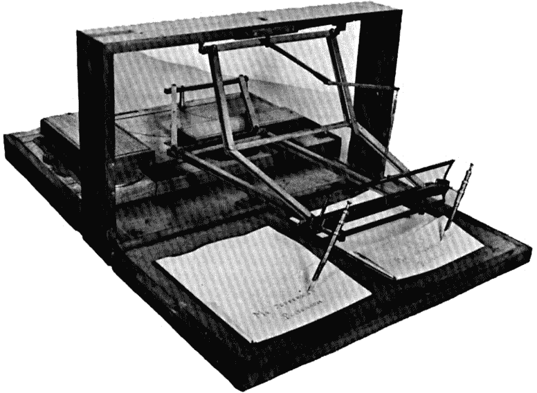
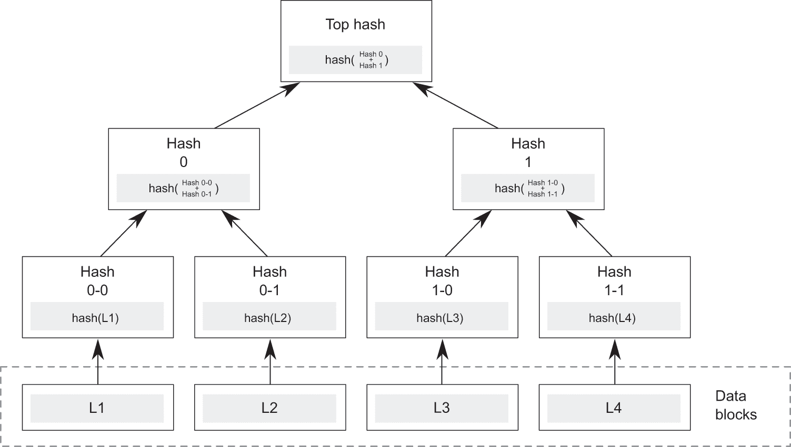

<hgroup>

# <samp class="SANS_ITC_Stone_Sans_Std_Semibold_11">引言：树的寓言</samp>

</hgroup>

# <samp class="SANS_ITC_Stone_Sans_Std_Semibold_11">从梧桐树到区块链</samp>

1792 年 5 月 17 日，二十四位男士站在一棵梧桐树下，他们在一份改变了世界的文件上签上了自己的名字。^(1) 他们都是住在曼哈顿几条街之内的熟人；后来他们选择在当地的一家咖啡馆做生意。这些交易者每天都会在华尔街聚集，买卖政府债券和公司股票。他们协议的宏伟目标是赶走那些通常操纵价格的当地拍卖师。他们知道得太少。

将时间快进两个半世纪，但在空间上仅相隔三个街区。保管信托与清算公司（DTCC）是梧桐树协议的后代公司，如今它每年处理 1.5 万亿美元的交易。^(2) 那是每分钟 30 亿美元，或每月整个世界经济的产出。^(3) 它及其姊妹实体跟踪的金融流动是我们文明的命脉。

我们如何从纽约证券交易所（NYSE）的十八世纪基础发展到当代全球金融系统的故事可以有多种讲述方式。我在此处用它来阐述一个更大的故事。早期股票经纪人之所以走到一起，正是同样的力量导致了 DTCC 几乎拥有美国所有交易的股票。^(4)（如果你觉得最后那部分难以置信，请继续阅读。）这是一个在国家命运和人际关系中常常被低估的关键因素。它是法律系统的目标，也是法律终止后接管的地方。它是信任。

信任就像是社会的梧桐树：它的根扎得很深，它的枝叶无处不在。它是看不见的，也很难固定。然而，信任的动态——它的架构——影响着我们周围世界的几乎每一个方面。梧桐树下的交易者和现代华尔街交易者的区别不仅仅是规模和速度的问题；它们根植于信任机制。

<hgroup>

<samp class="SANS_ITC_Stone_Sans_Std_Semibold_11">图 0.1</samp>

当一种新的信任形式出现时，它有点像一个新的物理学理论。革命永远不会完全取代之前的东西。阿尔伯特·爱因斯坦的相对论改变了一切。然而，一百年的学生仍然要学习十七世纪艾萨克·牛顿的力学，这些力学更舒适地捕捉我们的日常生活世界。而经典的相对论本身现在也以令人不安的紧张与量子力学并存。两个理论似乎都是正确的，尽管它们不一致。专家的任务是调和这些模型以及它们与现实世界的经验。信任模型的任务也是如此。

2009 年 1 月 3 日，随着比特币的推出，一种新的信任架构进入了世界。其宣言以一个笔名发布在马丁·路德贴上他的论文的现代等价物——一个互联网讨论列表上。其作者故意站在巨人的肩膀上，然后迅速消失。然而，已经播下了一颗种子。自那以来，其他人将想法远远超越了原始论文。已经创造了财富；数十亿美元已经投资；已经成立了数千家公司；新的产业已经出现；世界上最有影响力的公司和政府已经注意到了这一点。还发生了盗窃、争议、诈骗、分裂、终身监禁和投机泡沫。但这只是开始。

这项伟大的创新通常被称为“区块链”。即使是经验丰富的技术专家也常常发现它难以理解。它可以以多种方式在各种不同的环境中实现。然而，它的核心代表了一个简单的想法：相信一个系统，而不必信任它的任何组件。更具体地说，区块链网络允许参与者相信共享账本上记录的信息，而不必信任任何人来验证它。而且没有人——不是所有者、不是交易所，甚至不是政府——拥有无限制的权力来阻止或更改网络上的交易。

对一些人来说，区块链代表了摆脱企业权力、政府权力和强化两者的法律体系的自由。对其他人来说，它是一种赋予犯罪分子和一群可疑内部人士权力的新方法。另外，也许所有组织最终都会更有效率地做他们所做的事情。这是关于金钱，或者一切都是关于金钱，但它根本不是关于金钱。它是纯粹的数学、经济、心理学或治理的产物。它引起了无边的热情，其中大部分是极度无知的。围绕它的社区和系统正在以惊人的速度发展。它可能会改变世界……但关键的是，如何和何时仍然是不确定的。

有一点已经很清楚：区块链并没有消除信任的需求。它代表了一种信任的新形式的出现。早期的股票经纪人聚集在按钮木树下，基于他们的人际关系，并授予了一个中介机构——交易所——权力。区块链网络参与者信任，尽管缺乏任何中央权威或人际联系。这种新方法有大量有价值的现实世界应用，但也面临重大挑战。其潜力及其局限性，都沿着它所启用的信任的轮廓跟踪。

许多人持怀疑态度。传奇投资者沃伦·巴菲特称比特币为“幻象”。^(6) 诺贝尔经济学奖得主、评论家保罗·克鲁格曼称其为“邪恶”。^(7) 摩根大通首席执行官杰米·戴蒙（Jamie Dimon），世界上最受尊敬的银行家之一，将比特币称为“骗局”，后来又称“它创造出毫无价值的东西，对我来说一文不值。”^(8) 然而，就在戴蒙发表这些言论的同时，他的公司正在投资基于区块链的技术，并举办关于其促成的“加密货币”的会议。

戴蒙可能确实有理由认为，越来越多的投机的加密货币投资者将“以糟糕的方式结束”。这本书不会提供关于比特币或其他加密货币代币是否值得购买的建议，正如现代投资组合理论的作品不会告诉你应该选择哪些股票一样。今天的短期波动使加密货币投资成为一个交易者的游戏，而不是长期价值的反映。而加密货币的投资潜力只是冰山一角。从长远来看，重要的是比特币网络引入的信任方法是否根本正确，如果是这样，采用该方法的系统成功或失败的因素可能是什么。

加密货币表面上呈现的是一种东西（无中生有的货币），而其背后则是更深层次的（建立信任的新模式）。这有助于解释为什么它们今天既被过度炒作又被低估。风险投资家纳瓦尔·拉维坎特（Naval Ravikant）的话来说，“比特币是解放人类免受寡头和暴君控制的工具，伪装成一种快速致富的方案。”^(9)

创新之所以具有颠覆性，并不仅仅是因为技术本身。最先进的进步可能并不解决现实世界的问题。而获胜的解决方案需要发展人才、企业家愿景、经济实力以及一定的运气。创新得以普及的过程，被称为“扩散”，取决于市场参与者之间的沟通模式以及与现有消费模式的兼容性，随着创新从早期采用者迁移到越来越风险厌恶的用户类别。^(10) 同样的因素也将塑造区块链的采用。其成功在很大程度上取决于环境，以及其技术精湛。

区块链扎根的土壤是 2008 年金融危机期间政府和企业信任的崩溃。尽管全球经济从那次冲击中大部分恢复，但信任的侵蚀仍在持续。在美国和其他许多国家，人际信任和制度信任的指标一直在下降几十年。政府和企业媒体的信誉度从未如此之低。我们的新闻和信息生态系统是碎片化的和不稳定的。人们对隐私、安全和监控的担忧主导了关于技术的流行和学术讨论。随着互联网的出现而崛起的大型信息平台越来越多地被视为新的垄断企业，通过控制数据行使任意权力。

区块链为解决这些挑战提供了一种新的方法，这种方法在建立集体信任的基础上， paradoxically（悖论地），似乎是基于相互不信任的基础之上的。它建立在开源软件和去中心化的基础上，使任何人都可以参与。它提供的信任具有异常广泛的适用性。最初被激进的技术自由主义者推崇，现在区块链相关技术得到了许多大型公司、许多领域的企业家甚至政府的支持。

对区块链的热情对于这样一种新颖的技术来说是非常突出的。风险投资家在 2013 年至 2016 年期间向基于区块链的初创公司投资了超过 10 亿美元。11 2017 年，加密货币的总市值激增至数千亿美元。IBM，微软和英特尔等科技巨头正在加大对区块链的投入。世界各地的投资者，他们以前从未投资过比共同基金更奇特的东西，现在正争先恐后地购买加密货币，或者早期阶段初创公司发行的应用代币。甚至像高盛这样的知名观察家也看到仅从“低垂果实”的机会中就能实现数十亿美元的年度收益。12 根据英国 Juniper Research 在 2017 年 7 月进行的调查，多数大型公司（即员工人数超过 20,000 人的公司）正在考虑或部署分布式账本技术。13

潜力是巨大的。区块链可以帮助金融机构清算股票交易，全球供应链确保食品安全；各地可以跟踪谁拥有房地产权利，出版商可以将在线广告传递给用户，公用事业可以跟踪分散的能量传感器并从微网运营商那里购买电力，移民可以将其钱汇回发展中国家的亲属，医疗保健提供者可以访问医疗记录，援助组织可以跟踪分发情况。本书将讨论这些以及其他许多例子。区块链潜在应用的多样性及其规模都是令人惊叹的。

所有这些都是真的。然而，这只是故事的一半。围绕加密货币的投资活动中有很大一部分是纯粹的投机，有些甚至涉及欺诈或价格操纵。从任何角度来看，区块链的采用水平仍然相当低。原型数量远多于生产系统。可持续的商业模式大体上仍未经证实。而且，一家公司能够使用分布式账本方法，并不意味着它应该这样做。实际中的优势并不总是像承诺的那样大，而且实施挑战往往与技术本身无关。

因此，基于区块链的系统的用例是不确定的，大多数可能需要比预期更长的时间。比特币，第一个也是最重要的区块链实现，可能永远看不到其在零售支付领域的广泛采用，这是其最初的预期用途。在接近十年的时间里，一些基本的技术问题仍未解决。甚至区块链将促进去中心化而不是权力集中的前提也是值得商榷的。与此同时，政府在面对对消费者造成重大伤害或非法活动的局面时，将不会无知或无能为力。自该领域成立以来，一直困扰着该领域的两个批评意见仍然没有得到充分的反驳：区块链对犯罪分子来说是一个比合法用户更好的工具，而在信任任何人的情况下投入资源是一个危险的提议。

这些问题并不令人惊讶。正如经济历史学家卡洛塔·佩雷斯在她的书《技术革命与金融资本》中所记录的，投机性泡沫是回顾起来由技术驱动的重大商业革命中的一个常见特征。过度的热情既吸引了欺诈和快速致富计划，也吸引了认真的投资。此外，无论技术进步有多快，人们和系统都需要时间来适应变化。坚固的基础设施和标准不会一夜之间出现。互联网，区块链常常被与之相比较的技术浪潮，花了二十年作为一个研究网络；即使一旦商业采用开始起飞，成熟度还需要十年或更长时间。最关键的是，如果建立在区块链和相关分布式账本上的解决方案要想被信任且值得信赖，它们必须面对治理的难题。

即使数学完美无缺，区块链也是由人类设计、实现和使用的系统。即使通过客观的代码表达，主观意图仍然相关。围绕区块链建立的企业和服务容易受到自私行为、攻击和操纵的影响，即使网络本身是安全的。不同参与社区的激励并不总是能够对齐。当出现问题时——它会的——受损者不会甘心默默接受命运。

如果信任意味着的不过是对于结果的信心，那么人们可以不处理人类的复杂性就拥有它。但这不是信任的含义。研究过信任的哲学家、心理学家、社会学家和管理学者可能不会对一个定义达成一致，但他们通常得出信任意味着某种程度的不确定性或脆弱性的结论。这就是为什么前总统罗纳德·里根最喜欢的俄罗斯谚语“信任，但要核实”常常被批评为没有意义的。华盛顿邮报》专栏作家巴顿·斯威姆（Barton Swaim）的话说，“如果你信任，你就不会坚持去核实，而如果你坚持去核实，显然你并不信任。”^(16) 区块链是一个用于核实的巧妙解决方案，但仅凭这一点是不够的。要通过基于区块链的系统促进坚不可摧的信任，本书将探讨这个问题。

# 逻辑上集中，组织上分散。

区块链的基本功能是可靠地在可能互不信任的各方之间共享信息。换句话说，每个人都可以拥有自己账本的一份副本，并信任所有这些副本即使没有中央管理员或主版本也能保持一致。这个过程的技术术语是“共识”。风险投资家阿尔伯特·温格（Albert Wenger）将区块链描述为逻辑上集中（只有一个账本），但组织上分散（许多无关的实体可以维护该账本的副本）。^(17)

在区块链系统中，将交易提交到账本的一个位置就到处完成了这个动作。想象一下托马斯·杰斐逊使用的一种双笔工具，叫做“多笔迹复制机”（与测谎仪无关），如图 0.2 所示。使用多笔迹复制机时，副本与原稿是同时创作的。不需要第三方来转录作者的文字。区块链及其相关方法将这种模型扩展到许多物理上和操作上分布的副本。

【图 0.2](introduction.xhtml#rfig0-2)

托马斯·杰斐逊的多笔迹复制机。

区块链网络中的节点为了保持同步而不断进行通信。在没有信任主副本的情况下维持这种共识是困难的部分。如果成功，这种方法解决了集中式账本的重大局限性。如果一个节点保持一个主记录，它就成为系统的一个单点故障。用户不能确定他们看到的信息是准确的，因为它在他们控制之外。中心控制点或中介可以变得极其强大——并且可能滥用这种权力。另一方面，如果每个组织都有自己的账本（就像大多数公司财务记录一样），每个交易至少独立记录两次。例如，当一家公司支付给供应商或一家银行兑换另一家银行客户的支票时，他们的账本在事后必须同步。这引入了复杂性、延迟和错误的可能性。

从跟踪方法的看似平凡的改变中，涌现出了丰富的机会。例如，货币的价值依赖于人们对其硬币有效、伪造品有限、银行余额准确性的信任。根据经济人类学家大卫·格雷伯的说法，“货币单位的价值不是物体价值的衡量，而是对其他人的信任的衡量。”在现代世界中，这种信任意味着相信金融机构、中央银行、执法部门和计算机化流程，但随着更多的当事方和跨境交易的增加，这变得越来越困难。第一个区块链应用试图用一种私有的分布式货币来取代所有这些：比特币。

比特币系统最不寻常的事实是，在其推出十年后，除了在有很大风险之前修复的几个早期漏洞外，它一直保持完好。比特币账本是一个透明的银行金库，包含价值数十亿美元的货币。尽管这项技术的新颖性、社区的无政府状态以及犯罪分子攻击一个 literally 印钞的系统的巨大诱惑，比特币共识网络的完整性从未被侵犯。这并不意味着没有人被骗过。^(18) 窃贼通过利用用户或服务提供商手中的代币的弱点，已经带着价值数亿美元的比特币和其他加密货币逃之夭夭。加密货币的成功创造了新的问题，需要新的解决方案。

数字货币是一种持有工具，意味着，像普通现金一样，它本身就有价值。同样的方法可以应用于任何有价值的权利，比如对稀缺商品的所有权、在网络上的存储或计算能力，或使用某个应用程序的权限。即使不通过这样的数字代币进行价值交换，拥有一个共享账本也可以增加多组织记录活动宇宙的价值。

潜在影响十分惊人。区块链的分布式模型有朝一日可能会驱动一个全新的去中心化应用和服务经济。其中一些可能会与如社交网络和电子商务市场等现有平台竞争；其他的则涉及如预测市场等创新解决方案。

风险投资家克里斯·迪克森（Chris Dixon）表示：“货币在组织现实世界的机构和人员方面很有用，”他来自有影响力的风险投资公司安德森·霍洛维茨（Andreessen Horowitz）。“现在我们在互联网上有了本地的货币来源。我们刚刚开始发现它可能所有的用途。”19)

任何伟大技术革新的整体轨迹只能事后观察到。当时看似决定性的市场波动可能最终证明是微不足道或具有误导性的。从长远来看，技术之所以成功，是因为它们解决了现实问题并创造了真实价值。迟早，它们会找到肥沃的环境。区块链对商业和社会的最终影响将取决于它作为信任新架构的有效性。

# 量子思维与法律<samp class="SANS_ITC_Stone_Sans_Std_Semibold_11">和法律</samp>

商业 Accounts of technological innovation 中经常缺失的另一个因素是：法律。法律与区块链的关系被双方误解。区块链不是极端的无法律技术，也不是极端的不信任技术。它也不代表一个全面成熟的替代品，将决定性地减少法律在世界的应用。弄清楚区块链系统是否以及如何受到监管是一个重要的挑战，但更重要的是，区块链是如何进行规范的。这些系统作为法律和治理机制运作，将与既有的机制互动。不会有普遍的答案。在大多数情况下，区块链技术可能会补充或完善传统法律制度，而不是取代它们。

“量子思维”是尼克·萨博用来同时考虑两个相互矛盾的思想的术语，这与量子力学中光同时作为粒子和波的奇异发现类似。20 萨博是一位计算机科学家，他构想了智能合约，这是区块链相关系统的一个重要元素。他认为，这种思维方式在现有领域的边缘创造新概念时非常重要。21) 区块链技术汲取了密码学、计算机科学、经济学和政治理论等多方面的知识。那些专注于一个维度的人，无论是作为倡导者还是批评者，往往都会忽略其他至关重要的因素。

律师也非常熟悉选择性论证：“尊敬的法官，我的客户距离犯罪现场有数英里之远。但他如果在那里，他并未开枪。即便他开了枪，那也是出于自卫。”这种广受嘲笑的推理方式在面对不确定性时是一种宝贵的智力立场。法官或陪审团将决定最终结果，但在那之前，未能全面评估任何可能性是一种错误。有时会发生意料之外的事情。有时这些事情是基于其他假设作出的决策的*后果*。技术专家生活在确定性逻辑和可计算概率的世界中，但律师却熟悉于不确定性、不合规甚至灾难的可能性。

法律对区块链社区有很多贡献。即使加密技术如预期般运作，关于洗钱、消费者保护和金融稳定的担忧也不会消失。当有了秘密转移资金的新机制时，税收并不会变得 unnecessary。即使计算机可以无需人工干预执行交易，争议也不会消失。不良行为者仍将行恶。所有这些情景都将引发对法律或监管行动的呼吁。其中一些将是合理的。如果社区彻底拒绝确保遵守法律义务的所有努力，区块链将成为一个违法技术，在网络的黑暗空间中活跃，但对主流经济 largely irrelevant。那将是潜力巨大的悲剧性浪费。

同时，区块链为法律界提供了重要的教训。比特币证明了一个没有主管的分布式网络能够足够自治以避免崩溃，并在一段时间内扩大价值。信任，此前需要权力的委托或紧密的关系，可以从一个运行开源软件的独立行为者群体中产生。法律在此最重要的贡献不是任何具体的规则，而是法理学上的规则制定和执行纪律，或通常所说的“治理”。构建区块链技术和系统社区在许多方面可以自我管理，但前提是他们必须认真对待这个挑战。监管机构也可以通过利用这项技术来提高其有效性。否则，考虑不周的监管行动可能会将区块链活动推向其他国家，将其转入地下，并停止有价值的创新。

在快速变化的环境中，过早或过晚进行监管都存在风险。最佳的方法是运用量子思维来评估每一种风险。法律与区块链之间的互动必将经历不断变化的舞蹈。这引出了一个问题：什么价值观应该塑造它们的关系？世界上实施的技术从未是中立的。根据其技术架构以及运行的法律制度不同，革命性的创新可以产生各种影响。早期的决策会产生巨大的影响。一旦架构和法律环境建立起来，它们往往会变得越来越难以改变。

# <samp class="SANS_ITC_Stone_Sans_Std_Semibold_11">前进之路</samp>

这本书分为三部分。第一部分解释了区块链的来源、工作原理以及它所可能实现的一切。故事的一个维度是技术性的。通过中本聪巧妙的设计，区块链实现了长期以来人们追求的数字货币梦想，而像许可账本和智能合约这样的扩展使其功能更上一层楼。第二个维度是谈论区块链作为信任新架构的意义。信任是一种极其强大的现象。尽管人们针对这一概念进行了几个世纪的智力探讨，但其微妙之处常常被忽视。区块链声称在没有信任的情况下创造信任。事实要更为复杂（但同样有趣）。故事的第三个维度关乎区块链现象的商业影响。尽管对分布式账本技术的炒作和投机狂热有过之而无不及，但它确实为分布式账本技术提供了重要的、真实的有价值提议。然而，区块链机会的范围显示了技术本身无法克服的局限。已经有几起事件，分布式信任的承诺在这些事件中破灭。

第二部分认为，区块链技术所要解决的挑战，实际上正是它被设计出来要绕过的东西：治理、法律和规定。在这里，看似反映区块链技术异域特性的一些新问题，实际上重复了历史上的模式。在互联网在 1990 年代成为大众媒体的时候，它曾提出与今天区块链辩论中参与者所面临的法律关系相似的问题。法律学者对当时互联网的回应，与今天对区块链的讨论有着惊人的相似。那时与现在一样，最好的答案既不是对技术至高无上的庆祝，也不是对其力量的漠视。分布式账本技术，从根本上说，是一种法律技术：它们是协调和执行行为规则的机制。它们的优缺点应该与其他实现相同目标的机制进行比较评估。

第三部分展望未来。它确定了具体的步骤，从两个方向桥接法律和分布式账本之间的差距。其中一些已经在开发中；其他需要集体行动，在它们成为流行病之前解决潜在问题。本书的最后一章考虑了，如果区块链作为新信任架构的基础成功，它可能会重新激发互联网本身。互联网的发展成为了社会信任危机传播的一部分问题，而不是解决方案。虽然它本身不会关闭巨大的信任鸿沟，但区块链提供了一种新的希望。实现这一希望需要技术创新者和政府做出正确的决策。这只有在深入了解区块链与法律以及信任的关系如何，才能实现，这本书试图提供这种了解。

这个故事将带我们环游世界，从三个大陆上对一场灾难性的网络盗窃做出疯狂应对，到为中国 farms 供应跨国零售商，到在谷歌苏黎世办公室工作的一个才华横溢但内心矛盾的英国工程师，以及许多介于两者之间的地方。发展是如此迅速，以至于一些例子可能在你读这本书的时候就已经过时了。今天突出的初创公司可能不会是长期的幸存者。然而，也有永恒的主题在起作用。将区块链故事视为一个关于信任，而非技术的传说，有助于将持久性方面与短暂性方面分开。

区块链可能看起来像一种外星技术，或来自未来的 artifact，无缘无故地出现在现在。将它视为法律和信任的引擎有助于固定这一现象。基于区块链技术的系统实现其巨大潜力取决于它们解决深层次、熟悉挑战的程度。

内战结束两周后，标志着最后南方军队投降，华尔街的梧桐树在一场暴风雨中倒下。那时，它已经成为一个众所周知的地标和美国作为全球金融大国崛起的象征。从那些股票经纪人签署他们的协议至今的四分之三个世纪里，发生了许多变化。一个离其建立不久的国家现在正从最令人不安的冲突中走出来。接下来的一个半世纪里将有更多的变化。当整个华尔街社区都适合一个咖啡店时，这种信任是有用的，而今天需要的则大不相同。

梧桐树自 1865 年以来已经不存在，但它的回声在定义最新信任架构的代码中幸存。区块链是使用分支节点的数学结构组织的。它被称为“哈希树”或“默克尔树”，如图 0.3 所示。

<samp class="SANS_ITC_Stone_Sans_Std_Semibold_11">Figure 0.3</samp>

区块链的默克尔树结构。

默克尔树允许高效地验证大型数据结构的完整性。密码学家拉尔夫·默克尔在 1979 年提交了这一概念的专利。2002 年专利的到期使得开发者可以自由地将这一概念纳入开源软件中。六年后，这成为了中本聪在创建比特币时所集成的现有技术之一。原树用于标记一个方便的聚会地点，而此树则将独立的众多声音编织成一份可靠的数字记录。其重要性是否与它的前身相匹配还有待观察。

区块链、法律和信任的故事仍在展开。这可能是我们这个时代最重要的故事之一。

术语评论

区块链技术是一个快速发展的领域。词语经常被不一致地使用。^(22)我尝试使用技术准确的术语，同时保持叙述对非专业观众的可理解性。

“区块链”（有时被写作“区块链”）是一种使用链接的序列信息的数据存储系统。它字面上是由区块组成的链条，旨在创建一个不可篡改的交易账本。我所说的“区块链网络”或“区块链系统”是由运行维护区块链一致状态软件的计算机集合。“分布式账本”是对区块链及其类似共识系统的更一般术语。“区块链”这个词有点误导。然而，它像“互联网”一样，被广泛用来描述分布式账本网络的宇宙。

“加密货币”是一种基于密码学而不是中央银行对货币供应控制的货币。一些监管机构更喜欢将比特币这样的系统称为“虚拟货币”，他们认为“数字货币”必须是传统政府发行的“法定”货币。^(23)然而，虚拟货币包括许多与货币联系有限的比特币之前的系统，如常旅客里程和视频游戏的奖励点数。加密货币具有法定货币的基本特征，但运作不涉及政府。因此，我更喜欢国际清算银行的做法，它将“数字货币”视为通用的术语。^(24)最后，在描述网络时“比特币”大写，但在提到货币单位时，如美元或人民币，则小写。

# 笔记
