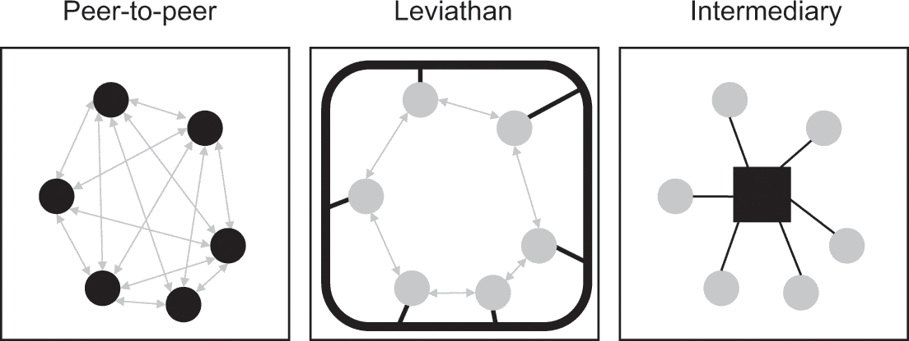
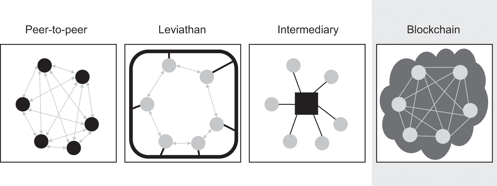
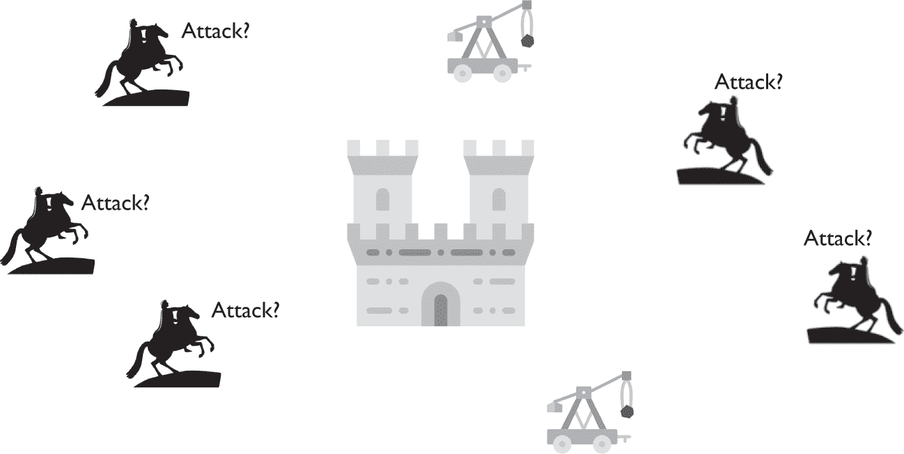
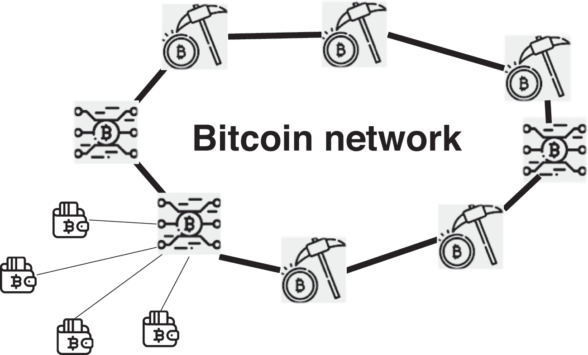
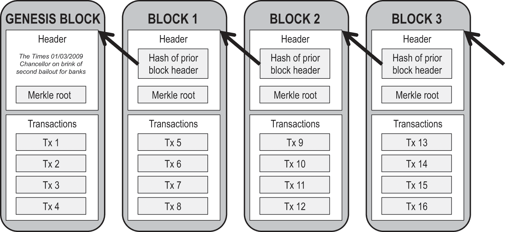
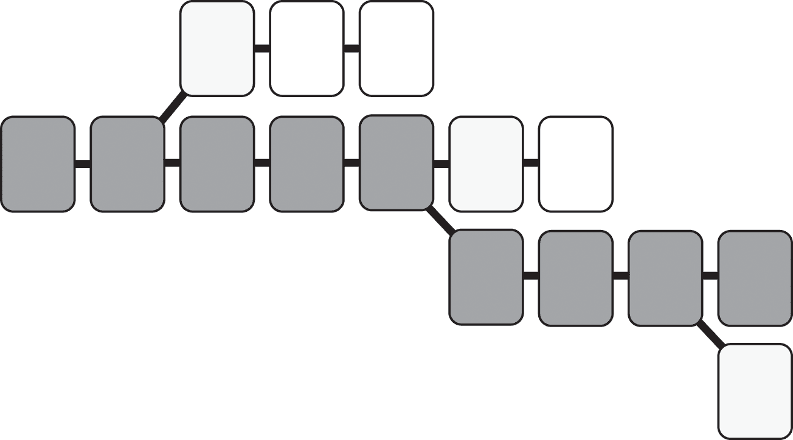

<hgroup>

# <samp class="SANS_ITC_Stone_Sans_Std_Semibold_11">I   九页的革命</samp>

</hgroup>

<hgroup>

# <samp class="SANS_ITC_Stone_Sans_Std_Semibold_11">1   信任挑战</samp>

</hgroup>

# <samp class="SANS_ITC_Stone_Sans_Std_Semibold_11">无需信任的电子交易系统</samp>

“我们提出了一种无需信任的电子交易系统。” thus 开始了九页文件的结尾部分，于 2008 年万圣节在 Cryptography 在线邮件列表上发布。题为“比特币：一种点对点的电子现金系统”的论文将中本聪（一个化名）列为作者。^(1) 尽管付出了巨大努力，但比特币的创造者的身份从未被确定性地确定过。^(2) 他最后一次被听到是在 2011 年。对于一个去中心化的先驱来说，姓“中本”在日语中的意思是“中心的起源”是一个讽刺。

无论中本聪是谁，有一点是明确的：他、她或他们，都是大错特错了。^(3) 信任对于比特币至关重要，同样对于跟随其方法的一系列区块链和分布式账本解决方案也是如此——这不仅仅是因为“信任”或“可信”这样的词在短文中出现了十三次。如果没有信任，比特币将毫无用处。自比特币以来，加密货币价值的惊人上涨完全基于人们愿意相信私有运营的分布式数字账本上的条目与货币一样真实。数百个非金融的基于区块链的初创企业和企业区块链项目都建立在这样的信念之上。分布式账本网络将原本不足以相互信任的社区聚集在一起。根据《经济学人》杂志的一篇封面故事标题，它们是“信任机器”。^(4) 比特币的区块链机制可能已经启动了一场信任革命——而且时机恰到好处。

# <samp class="SANS_ITC_Stone_Sans_Std_Semibold_11">信任危机</samp>

十五年来，公关公司爱德曼一直在进行关于对政府、企业和媒体的全球信任调查。在其年度报告中，爱德曼在达沃斯世界经济论坛年会发布了一份详细的社会信任模式快照。形势并不令人鼓舞。大多数信任指数已持续下降。最近，信任的侵蚀加速了。2017 年爱德曼信任晴雨表报告的标题是《信任的崩溃》。^(5) 只有 15%的普通民众认为“这个系统”正在运行。调查中揭示的“深刻的信任危机”既深又广。它跨越了所有机构类别——包括政府、媒体、企业和非政府组织（NGOs）——并且被知情的公众和大众所共享。

其他最近的调查也显示了类似的结果，特别是在美国。^(6) 在 2015 年的一项皮尤研究中心的民意调查中，只有五分之一的美国人说他们信任政府，这是在一场带来新的高度怀疑主义的痛苦总统选举前一年。^(7) 看起来，美国人彼此之间的信任度也不高。早在 2013 年，在一项美联社的民意调查中，只有三分之一的美国人表示大多数人是可以信赖的，而 1972 年，当社会调查首次提出这个问题时，这个比例是五分之二。^(8) 近三分之二的人——这是有记录以来的最高比例——表示在与人交往时，“你必须非常小心”。关注时事的人对这些统计数据不会感到惊讶。

当代的信任危机是多年来发展模式的顶峰。在千禧年之交出版的两本有影响力的畅销书，罗伯特·普特南的《独自打保龄球》和弗朗西斯·福山的《信任》，预警了社会信任的破裂。普特南利用大量的调查和其他研究，突出了美国地方信任网络的侵蚀，这在美国保龄球联赛相对于个人保龄球的衰落中得到体现。^(9) 他将这视为解释社会病理学增长的恶劣发展。五年前，福山同样对全球，特别是当代美国的信任危机发出了警报。^(10) 尽管美国以其坚韧的个体主义而闻名，福山指出，美国实际上受益于高度的相互依赖。但这种情况似乎正在改变。福山和普特南两年前警告的信任危机现在已经成为了现实。后果可能是灾难性的。

我们每天都基于信任做出决策。我应该坐进这辆车的后座吗？我想要购买的这包金枪鱼是否藏有致命病毒？我和这个人约会吗？我应该在这台电脑屏幕上的盒子里输入我的信用卡号码吗？很少有人际互动，更少的商业交易，不很大程度上依赖于涉及的信任品质。^(11) 根据社会学家尼克拉斯·卢曼的观点，信任使人和社会本身成为可能。^(12) 没有信任，我们将需要验证和确保我们遇到的每个人的可靠性。这将是一个不可能完成的任务。信任是润滑社会和商业互动的油，是使现代世界的无边复杂性变得可管理的因素。

然而，信任不仅仅是门槛。它有后果。信任塑造互动，潜在地以非常显著的方式。被信任的人是有力的。不被信任的人在每个转折点都必须更加努力地赢得他人的信任，这使他们处于巨大的劣势。改变信任范围系统因此改变社会。信任塑造了国家经济表现宏观结构和个体与企业互动的微观结构。在全球范围内，高信任社会优于低信任社会。^(13) 商业学者同样通过实证发现，信任度高的公司表现更好。^(14)

信任作为社会资本发挥作用。它创造了促进社会互动和商业交易的良好意愿储备。社会财富因此而增加。^(15)

信任最初源于家庭和小社区的狭隘范围。然而在现代世界中，将互动限制在这些圈子里是完全不可能的。高信任社会已经发展出了文化、社会规范和法律体系，这些体系让他们的公民有信心将信任扩展到陌生人。在高信任的环境中，由于人们愿意在没有这些规定的情况下行动，因此不需要侵入性的监管和强制执行。大部分时间，大多数人都是值得信赖的。当他们不是的时候，法律制裁和社会压力可以纠正不当行为。

从经济角度看，信任减少交易成本。它使各方免于承担获取信息和监测与他们交易行为的费用。^(16)信任关系往往比不信任关系更具灵活性，因为各方无需详细指定什么行为是允许的。这进而改善了表现。

诺贝尔经济学奖得主罗纳德·科斯的“企业理论”可以被理解为对信任局限性的回应。^(17) 企业实施等级管理控制结构，因为否则他们无法信任员工或合作伙伴的可靠行为。如果有更多的信任，将有助于新的商业安排蓬勃发展。共享经济理论家雷切尔·布斯曼认为，今天正在发生这种情况：“我们正在发明一种可以在分布式网络和协作市场 places 中润滑商业齿轮和促进人与人之间关系的信任类型。”^(18)

信任看起来像是一种无条件的善。那么，为什么奥利弗· Williamson，与科斯一同获得经济学诺贝尔奖的学者，称其为“扩散且令人失望”的概念，没有“明显增加的价值”呢？^(19) 为什么区块链方法的始祖在他伟大发明推出后不久写道，“传统货币的根本问题是需要所有信任才能使其运作？”^(20) 以及为什么比特币原始软件代码的加密专家雷·迪林杰称信任为“几乎是一种恶行”呢？^(21)

信任比它看起来更复杂。如果我们希望理解区块链的潜力和危险，我们必须首先审视信任这个概念及其在当代世界的表现。

信任是那些“我见到它时就能认识它”的概念之一，但仔细审视后，却变得令人痛苦地难以捉摸。正如商业伦理学者拉鲁·托恩·霍斯默尖锐地观察到的，“人类行为中信任的重要性似乎得到了广泛认同，但……对于这个概念的适当定义也同样广泛地缺乏共识。”^(22) 在过去的几十年里，管理、心理学、哲学和其他领域的学者们对信任的含义发展了大量的文献。^(23) 这些学术成果阐明了信任的重要性及其基本要素。

信任不是二元的。信任完全缺失的情况极为罕见。如果我们不能在不验证的情况下假设任何事，我们将很难度过一天。相反，信任有不同的程度。普特南区分了“浓厚”的信任，这种信任源自紧密的社会关系，以及“淡薄”的信任，这种信任存在于一般社会中。^(24) 福山区分了高信任度和低信任度的社会。^(25) 管理学者杰伊·巴林和马克·汉森区分了“强”信任（没有绩效保证）、"半强"信任（各方创造执行机制，但可能存在失败的风险）和“弱”信任（法律或其他机制保证绩效）。^(26) 费尔南多·弗洛雷斯和罗伯特·所罗门区分了基于纯粹信仰的“天真”信任和建立在关系上的“真诚”信任。^(27) 信任可以从多个维度的光谱上进行观察。

# <samp class="SANS_ITC_Stone_Sans_Std_Semibold_11">定义信任</samp>

信任的简化定义是认知风险评估：我有理由依赖这个人或组织吗？^(28)我相信飞行员能安全地将我的飞机驾驶到目的地，因为我知道事故相当罕见。我把信用卡给餐厅的服务员，因为我认为她不会用它来未经授权收费（如果她这样做了，我的信用卡公司会取消这些费用）。经济学家 Oliver Williamson 将这种现象称为“计算性”，因为它受到理性计算的约束。^(29)如果我把车钥匙给泊车员，他或她偷走我的车的潜在损失可能很大，但概率很低，监控很容易，而且通过执法或保险进行补偿——很可能会使我完全复原。另一方面，如果我被要求将我的全部积蓄通过电子邮件汇给一个尼日利亚王子，我最好对即将到来的奖励有足够的信心。

尽管认知维度很重要，但它并不能代表信任的全部。^(30)否则，信任就仅仅是理性的依赖。这是信任与验证之间的界限。如果贷款人坚持要求借款人提供详细、经过审计的财务报表和大量抵押品，他可能会对还款有信心，但没有人会称这是一种信任关系。如果贷款人未经文档批准向长期客户发放贷款，这可能是因为她关于客户的信息和先前的互动经验使这成为一个理性的、符合自身利益的决定，而不是真正基于信任的决定。这是 Williamson 区分信任和计算性的原因。

然而，有时我们的行为是认知风险评估无法解释的。有些人确实会对尼日利亚电子邮件诈骗做出反应，或者向他们知道不太可能还款的朋友借钱。正如福山所强调的，信任率在不同的社会之间是不同的，这表明存在更深层次的文化和其他因素在起作用。在某些国家，有轨电车和公共汽车是靠信誉系统运行的。乘客被期望投入钱或刷卡支付，但没有人检查他们是否这样做。几乎每个人都照样付款。在其他一些国家，这样的系统会导致广泛的不付款现象。仅仅执行力度本身并不能解释这种差异。

通过各种“囚徒困境”实验，行为经济学家已经表明，即使这样做并不是理性的策略，人们往往还是倾向于彼此信任。^(31) 实地研究也强调了众多现实世界中的例子，在这些例子中，信任克服了从理性行为者角度看似乎难以解决的冲突。^(32) 我们有一种天生的信任偏见，因为文明社会可能无法以其他方式运行。福库亚玛认为，有 20% 的经济活动无法用理性术语解释，它根植于诸如互惠、道德义务和对社区的职责等事物，即使在现代社会也是如此。^(33)

此外，将信任的概念局限于理性计算是有失偏颇的。正如博茨曼所写，“它让信任听起来合理且可预测，但它并没有真正触及信任所赋予我们的能力和如何让我们与他人建立联系的人类本质。”^(34) 当然，Uber、Lyft 和 Airbnb 提供信誉评分的事实确实鼓励了人们乘坐陌生人的车辆或进入他们的公寓。但即使风险不确定——或甚至没有合理的理由——这种愿意信任他人行为依然产生了信任的强大溢出效应。如果你在我进行理性风险评估之外给予信任，我更有可能也对你这么做。^(35) 如果我们能摒弃监控或执行机制，成本就会降低，交易量就会上升。

哲学家将这一非理性成分称为信任的“情感维度”。^(36) 这是对他人持有一种乐观的态度，这种态度超越了战略动机。它是对代理方善意的期望。^(37) 与认知信任相比，这种信任形式，正如三位管理学者所言，是一种“更复杂的心理状态”^(38)，它包含了社会和情感因素。这一信任维度关注的是动机，而不仅仅是行为。^(39) 当各方无法精确估计成本和收益时，这种信任维度就变得重要了。正如大卫·刘易斯和安德鲁·魏格特所说，“信任从预测的终点开始。”^(40)

情感信任还有道德层面的含义。^(41) 它是善意的表达，不仅仅是自私的体现。潘特南认为，信任他人的人是“全面的好公民”。^(42) 弗库亚玛将信任描述为“社区成员内化的伦理习惯和相互道德义务的一组”。^(43) 愿意在理性计算之外信任他人表明，原则对你来说比底线更重要。即便在商业环境中，我们认为给一个逾期但值得同情的借款人第二次机会的银行很好，而不是在有权这么做时将其房产收回。

这一切都有个前提。赫尔曼·梅尔维尔的一个角色通过批评认知风险评估的替代方案，捕捉到了情感信任的吸引力：“[怀疑、猜疑、证明——不断地做这些令人疲惫的工作……这是邪恶！]”^(44) 说话者是梅尔维尔最后一部小说《自信人》的主角。通过在密西西比河上的蒸汽船上的各种骗局，他展示了信任如何被不可信的人利用。信任并非对表现的铁证如山保证。信任就是让自己面临被信任者的脆弱性。^(45)

对工程师来说，漏洞是亟需防范的安全缺陷。在此，我使用这个术语时取其更精确的含义，即可能遭受伤害的风险。脆弱性之于伤害，正如比较优势之于成功：两者相关，但并非等同。而结果仅代表了账目的一方面。开车让你面临遭遇事故的风险，但大多数人认为这种风险是值得的。将车钥匙交给十六岁的孩子可能不是明智的决定——大多数租车公司拒绝给二十岁以下的人租车——但父母通常有足够的信心接受这种脆弱性。信任关系的外部性超越了保险成本的保险学考量。从博弈论的角度看，你的脆弱性向对方发出了可能成功采用类似的信任策略的信号，在囚徒困境中产生最佳可能的结果。

即使决定信任是理性的，也存在一些风险，即它可能被证明是一个糟糕的赌注。根据伦理学家安妮特·贝海德的观点，信任是“让其他人（自然的或人为的，如公司、国家等）照顾信任者关心的事物，而这样的‘照顾’涉及一些自由裁量权的行使。”^(46)而这种自由裁量意味着受托人可能最终被证明是不可信的，尽管进行了验证努力。正如商业学者杰里米·叶和莫里斯·施维茨所观察到的，“一些最恶劣的不道德行为是因为个人利用信任。”^(47)信任不同于可信度。^(48)然而，我们还是选择信任。如 18 世纪的评论家和词典编纂者塞缪尔·约翰逊所观察到的，“有时候被骗比不信任更快乐。”^(49)

信任可能会以三种方式失败：直接违反、机会主义行为和系统崩溃。这些都会在区块链背景下出现。

违反信任是最明显的例子。收取不必要工作的修理费的 Mechanic，你请来帮忙保管糖果却偷吃的朋友，性侵学生的老师——每个人都利用了信任者的脆弱性来造成伤害。一些信任违反行为有严重的法律和道德后果，但在其他情况下，信任的丧失本身是主要后果。根据莫里斯·施维茨和两位沃顿商学院同事的实验研究，如果那些从事不可信行为的人道歉，并在今后表现出值得信任的行为，信任是可以修复的。^(50)然而，他们发现，当不可信行为涉及欺骗时，信任很难恢复。^(51)这是信任破裂的第二种原因：机会主义。

“机会主义”是指利用不对称信息违反协议的精神，但不一定违反其字面意义。^(52)机会主义者之所以不可信，是因为他们利用信任者，而不是表现出必要的仁慈。法院已经使用了几项法律教义来解决合同交易中的机会主义问题，但成功与否参差不齐。^(53)而在当代主流的企业理论下，监管机会主义行为是公司法的核心目标。根据这一理论，公司治理是对股东与管理层之间的代理关系中潜在的机会主义进行回应。^(54)反过来，这些经理必须监督员工，施加交易成本。^(55)

最后，信任有时会失败，不是因为参与安排的各方必然不可信，而是因为环境对信任有害。存在系统性的失败，使得任何人都不明智地去信任。Tom Tyler 详细阐述了刑事司法系统的不公正管理如何破坏信任，从而破坏守法性。56 在没有健全法治或产权的国家，问题更严重。根据秘鲁经济学家 Hernando de Soto 的说法，穷人的产权无法得到执行，这在发展中国家阻碍了功能市场经济的建立。57

系统性信任崩溃也可能发生在关系跨越太多边界时，无论是组织还是政治边界。如果没有共同的法治环境或商业结构，建立信任基准的交易成本可能过高。当信任平台本身受到破坏时，信任也会崩溃。例如，2017 年 9 月，信用评级机构 Equifax 承认超过 1.4 亿美国人的个人信息被从其服务器上访问，这降低了信贷和身份服务的普遍信任水平。58 在那之前，美国商务部 2016 年的一项研究发现，由于安全或隐私问题，几乎一半的美国人被阻止使用电子商务服务。59

因此，信任是一枚双面硬币。一面是基于一些理性与情感因素组合的信仰；另一面是接受不受控制的风险。组织行为学学者 Roger Mayer 及其合著者在一篇广为引用的文章中，对几个学科中的信任概念进行了调查，并提出了一个综合性的定义：“[信任是]一方基于预期另一方将执行对信任方重要特定行为的愿望，无论是否能够监控或控制另一方。”60

总之，信任是自信的脆弱。 61 信任的好处在于其能够激发 Botsman 所说的“对未知的自信关系”。62 这也产生了成本。信任的双面性——既是力量也是危险的来源——解释了为什么比特币白皮书作者对其感到如此厌恶。没有脆弱性就没有信任。而脆弱性传统上意味着将权力交给他人。你通过给银行权力控制你的钱来信任银行。你对骗子做同样的事情。

# 信任架构：点对点，利维坦，中介。

决定系统形态的设计决策被称为其“架构”。架构是权力的象征，因为它定义了人类互动的界限。正如社区的自然建筑决定了社区的特性一样，通信网络和信息系统的精神架构塑造了在线创新、创造和自由表达的机会。^(63)对于技术来说，架构描述系统组件之间相互交互的方式。^(64)

信任同样有它的架构。正如人们以不同的方式倾向于信任一样，信任的形成也有多种方式。这些架构描述了展现信任的制度结构。^(65)正如纽约大学数字经济专家 Arun Sundarajaran 所观察到的，“如果你回顾历史，每一次世界经济活动的大扩张，通常都是由一种新形式的信任的创造所引发的。”^(66)

如图 1.1 所示，随着时间的推移，三种主要的信任架构已经发展起来：点对点（P2P）、利维坦和中介架构。^(67)

<samp class="SANS_ITC_Stone_Sans_Std_Semibold_11">图 1.1</samp>

三种 established 信任架构的符号表示。每个的黑色元素都是可信组件。

第一种架构，点对点信任，基于人际关系和共享伦理规范：我信任你，是因为我信任*你*。这是最早出现的人类信任结构。家族和宗族之间的人际信任在国家的崛起之前就已经长期存在。然而，点对点信任架构至今仍然存在。只要他们采用有效的治理机制，这种架构可以在具有共同社会规范的社区中发展。这是诺贝尔奖得主 Elinor Ostrom 和其他人探索的“共有资源管理”领域，在这个领域中，即使没有正式的法律规则，也可以实现秩序。^(68)遵守一套自我治理的原则，以及个人和社区灵活调整以解决问题的能力，可能就足够了。

点对点信任往往较为紧密，因为它建立在相互承诺和个人关系之上，而不是一时的方便。然而，它的范围相对较小。你可能信任一个陌生人进行点对点交易，但只限于一次不重要的交易（比如在便利店的购物）。例如，根据 Ostrom 的说法，设计“共有资源”管理规则需要明确的群体边界，以及受规则影响的人有机会参与修改规则。

最近，互联网法学者，如雅各布·本克勒（Yochai Benkler）和布雷特·弗里施曼（Brett Frischmann），展示了共同管理如何在线上为诸如维基百科、开源软件社区、用户自我调节的内容网站如 Reddit，以及 WiFi 未授权的无线技术等系统运作。这些模型扩大了点对点信任的范围。然而，它们仍然依赖于在复杂、非个人的市场中很少存在的正式规则和社区标准。

第二种主要的信任架构借用了 17 世纪哲学家托马斯·霍布斯（Thomas Hobbes）的名字，“利维坦”。他认为信任是文明建立的基础力量，尽管他很少明确使用这个术语。他著名地提出，在自然状态下，生活是“孤独、贫穷、丑陋、野蛮且短暂的”。在自然状态下，他提出，没有人能从交易或个人投资努力中受益，因为所有人都必须担心其他人会欺骗他们或从他们那里偷窃。

为了避免这种“所有人反对所有人的战争”，霍布斯想象出文明社会达成一次性交易：他们授予国家对合法使用暴力的垄断权。一旦这种情况发生，这个国家——霍布斯所说的神话般的、全权在握的利维坦——就能强制执行私人合同和财产权。意识到违约会受到基于自身力量的自助之外的惩罚，个人和组织感到在信任关系中承担风险是舒适的。

在利维坦信任下，国家或其他强大的中央权威主要在幕后运作，防止他人通过武力或诡计强加自己的意志。它直接行使权力的情况极为罕见，而且当它这样做时，主要是通过执法或军事活动，以维护社会稳定基础水平的信任。

人们看到的利维坦信任架构的主要元素是参与和解决争端的官僚规则。法律体系，凭借其复杂的教义，定义了对任意国家权力的限制。当这失败时，信任也失败了。社会心理学家汤姆·泰勒（Tom Tyler）调查了不同种族群体成员与刑事司法系统的互动。他发现，人们只有在认为法律基于程序公正运作时，才会倾向于遵守法律。

传统上，信任结构的最后一种主要方式是通过中介。在这种安排中，当地的规则和中介的声誉取代了社会规范和政府颁布的法律来结构交易。^(72)中介提供了有价值的服务，促使个人交出权力或控制。例如，Experian 和 Equifax 这样的信用局拥有巨大的权力，因为它们使得贷款等交易成为可能。至少从历史上看，个人贷款方积累评估个人信用价值所需的数据要困难得多。

在这种安排中使活动发生的是中介聚集双方活动的能力。金融服务关系是中介信任的一个很好的例子。^(73)商业银行位于存款人和借款人之间的交易流中，在此过程中产生并支付利息。投资银行在资本市场中结构和中介金融交易。金融服务现在约占美国所有公司利润的 30%，所有这些都基于这种中介权力。^(74)

在线领域中介信任尤其重要。^(75)广告商信任谷歌，因为它向他们展示了广告的透明定价和性能指标，而用户信任它，因为它返回高质量且与广告相关的搜索结果。亚马逊和 eBay 为交易创造了信任的环境。优步（Uber）和爱彼迎（Airbnb）围绕交通和住宿创造了市场，用户通过这些市场以他们 otherwise 绝不会与陌生人互动的方式。它们通常被描述为点对点，但实际上用户是信任平台，而不是个人关系或由社区定义的治理体制。

所有这些架构都引发了一个信任权衡，用户为了获得信任的好处而放弃了一些自由。在点对点信任中，他们必须遵守社区的规范；在利维坦信任中，他们服从于国家；而在中介信任中，他们将个人数据的控制权让渡出去，从而将自己锁在了围墙花园里。关于谷歌和 Facebook 等在线平台的权力最近的辩论反映了这种担忧。^(76)这些平台通过塑造用户的信息饮食来控制用户看待世界的方式，并通过中介权力控制市场。网络效应使得竞争对手难以颠覆他们的主导地位。第十一章将更深入地探讨这一挑战。

# <samp class="SANS_ITC_Stone_Sans_Std_Semibold_11">无信任信任</samp>

区块链创造了一种新的信任形式，现有模型都无法涵盖。著名风险投资家和领英（LinkedIn）创始人雷德·霍夫曼（Reid Hoffman）将其称为“无需信任的信任”。^(77)这个词汇已经被广泛接受。^(78)尽管这听起来有些自相矛盾，但双方都至关重要。如果加密货币和分布式账本未能激发信任，它们将失败。然而，如果它们通过政府或强大的中介代理获得了信任，那么它们与现状就没有显著区别。

<samp class="SANS_ITC_Stone_Sans_Std_Semibold_11">图 1.2</samp>

区块链的“无需信任”的信任架构，通过信任网络而不信任任何个体行为者，与替代方案相比。

在区块链网络中，被假定为可信的唯有网络自身的输出。这种独特的安排定义了区块链与法律、法规及治理之间互动的格局。

在任何交易中，可能有三个可以信任的元素：交易对手、中介和争端解决机制。^(79)区块链试图用软件代码替换所有这三个元素。人们通过任意的数字密钥表示，消除了人类用来评估可信度的上下文因素。交易平台是一个由未知参与者操作的分布式机器，他们纯粹为了金钱。争端解决通过“智能合约”执行预定义算法。使交易有效的是加密证明，另一方可以数学地验证它。因此，比特币爱好者中有这样一个共同的看法，“我们信任证明”，这与美国银行钞票上印有的“我们信任上帝”的传说形成对比。

在线交易已经依赖于加密和算法信誉系统。每次你在亚马逊（Amazon.com）购买东西或使用脸书（Facebook）与朋友保持联系时，你都在信任一个主要自动化的基于软件的系统。即使你将借记卡插入自动取款机（ATM）并从插槽中取出现金，你也在信任机器完成本质上属于人类的工作。

重要的是我们要明白我们信任机器是为了什么。我们有信心计算机不会像人类记录者那样愚蠢、缓慢、健忘或有偏见。这就是计算机的优势：它们可以快速且一致地执行程序。但是，传统上机器不做或不能做的事情有很多。区块链不仅仅是为了激发对其账本条目的信任。它产生了一种特定的信任，应该以其自身的条件进行审查。

区块链信任是无形资产。你看不到比特币；它只是在分布式账本上的一组交易记录。然而，在今天的世界里，这几乎是独一无二的。我们接受我们的银行账户代表实际货币，我们的股票购买代表真实股权，尽管我们通过电子方式查看它们。知识产权权利，如版权、商标和专利，是竞争优势的重要来源和可转让资产本身。此外，无形性是所有在线互动的标准问题。^(80)

区块链信任的更重要方面是，它切断了机构行为者与可信系统之间的联系。接受加密货币交易为有效，就是信任其基于的网络，而不必信任任何个人参与者或更高权威。^(81) 人们可以接受分布式独立计算机集合的共识作为账本的真实状态。在其最简单形式，这是区块链和分布式账本技术的信任革命。它赋予机器集体以信任，同时剥夺这些机器的人类主人的信任。

一直有人渴望一个不受企业和政府控制的世界。个人电脑革命中的领军人物受到了 20 世纪 60 年代反文化价值观的影响。一代人之后，许多推动互联网兴起的人将其视为一种直接将世界各地人民连接起来的方式，而不受国家干预。这个小但复杂的密码朋克运动寻求技术解决方案来实现这一愿景。^(82) 它认为互联网的存在证明了即使国家重拳也必须屈服于密码学背后的数学定律和分组交换数据网络背后的软件工程。早期太阳微系统公司的工程师约翰·吉尔莫尔曾著名地宣布：“网络将审查视为损害，并绕过它。”^(83)

当前时代是一个信任危机的时代，企业和政府的信任深陷危机，而对技术作为变革力量的信仰依然完好。这是一个完美的环境，让一种看似使用后者使前者过时的方法出现。正如超级账本开源分布式账本联盟的执行总监布莱恩·贝海恩德所说，“区块链技术可以让我们在一个信任度下降的环境中进行商业活动。”^(84) 它是当前历史时刻合适的信任架构。

然而，与雷德·霍夫曼优雅的措辞相反，区块链并非完全不可信。它可能促进正当的信任，但并非没有漏洞。中本聪及其追随者所创造实际上是一种新的可信度，强大但又不完美。

区块链信任并不是一个矛盾的说法。它是一种独特现象，值得以其自身条件进行考察。这样做是理解区块链技术如何运作，以及它将成功和失败的关键。

# <samp class="SANS_ITC_Stone_Sans_Std_Semibold_11">注解</samp>

<hgroup>

# <samp class="SANS_ITC_Stone_Sans_Std_Semibold_11">2   中本聪的解决方案</samp>

</hgroup>

# <samp class="SANS_ITC_Stone_Sans_Std_Semibold_11">过于信任而不会失败？</samp>

有一个著名的逻辑谜题涉及两个卫兵，他们每个人站在一个门口前。一扇门通向财富，另一扇门通向死亡。你必须询问卫兵来选择正确的门。一个卫兵总是说实话；另一个总是撒谎。陷阱是：你不知道哪个是哪个。这个谜题一开始看起来不可能。你永远不知道你收到的答案是否真实。然而有一个优雅的解决方案：问一个卫兵另一个会推荐哪扇门——无论你得到什么答案，都走相反的门。说实话的卫兵会指向通向死亡的门，因为撒谎者会这么做。撒谎者知道说实话的卫兵会指向通向财富的门，所以他也指向通向死亡的门。选择另一个。

中本聪解决了数字现金的难题——在这个过程中，他发展了一种新的信任架构——使用了一种类似的方法：反向思考问题。人们有信心用去中心化的数字货币进行支付的机制就是用它来支付。比特币把货币当作输入而不是纯粹系统的输出。

当中本聪在 2008 年把他的想法发到网上时，只有少数最初的评论者表示立即的兴奋。比特币白皮书清楚地表明，它在很多方面都是基于早期的工作，其目标——一种不需要政府监督的数字货币——在社区中是一个熟悉的目标。今天，白皮书被视为全球技术革命的基石。随后的区块链、加密货币、智能合约和受许可的账本开发浪潮。要理解这个新兴运动的潜力和挑战，首先必须理解比特币及其是如何产生的。

区块链技术远不止应用于金融领域。然而，它的起源正是金融领域。从实际应用的角度来看，金融领域的革命性创新最终会在其他每个领域引发变革。金钱，作为量化价值交换的基础，推动着世界的发展。历史学家尤瓦尔·诺亚·哈拉里的话来说，“金钱是迄今为止最普遍、最高效的相互信任体系。”^(1) 这是因为，正如德国经济学家乔治·弗里德里希·克纳普在一个世纪前在《货币国家理论》中解释的那样，货币的价值并不在于其内在的物理资产价值，比如硬币中的贵金属。^(2) 货币的价值在于他人接受它的意愿。金钱，从根本上说，是对纯粹信任的一种形式化表达。

那些声称加密货币（如比特币）必然毫无价值，因为其建立于空无之上的人，是将货币与其所代表的资产混淆了。世界上没有任何一种主要货币是基于有形资产的。确实，美国在诺克斯堡储备了大量黄金。但如果像詹姆斯·邦德电影中的奥里克·金手指一样的人物真的将其全部偷走，自动取款机和杂货店收银员还是会继续接受美元钞票。如果世界上大部分人都愿意信任纸币及其更加抽象的数字代表作为货币，那么它们没有理由不能以同样的方式信任诸如比特币之类的加密数字货币。关键在于相关的货币体系是否能激发所需的信任。任何特定的加密货币价格可能会暴跌甚至归零，但这与说加密货币本身毫无价值是两回事。

金钱作为价值抽象表达的属性，为比特币和区块链的出现铺平了第二条道路。现代金融可以将最稳定的资产——比如一座房子——转化为在全球衍生品交易员的屏幕上飞驰的复杂抵押贷款债务，它们伴随着算法交易引擎。随着这些安排变得越来越复杂，实物资产与金融工具之间的关系变得越来越弱。这是金融人士所说的“证券化”所承诺的巨大潜力。

2008 年的金融危机揭示了这一切。世界上最聪明的投资者、银行家和监管者认为万无一失的方案几乎一夜之间就崩溃了。确实存在滥用行为，有些公司本应因其在这场滥用中的角色而受到更严厉的惩罚。然而，归根结底，贪婪在金融领域绝非不寻常，而是常态。系统性风险正是使危机如此可怕的原因。那些看似分散且无关的金融工具，比如成千上万份个人按揭贷款的打包，突然之间证明它们高度相关。问题不只是某些银行和银行家不可信——这并不令人惊讶——而是现代金融的本质已不再可信。金融世界并没有它看起来那么去中心化。如果金钱都不能被信任，还有什么可以被信任的呢？

2008 年的系统之所以如此脆弱，是因为交易活动与那些交易背后的真实资产脱节。衍生金融工具，如期货和期权，有着悠久的历史，但近几十年来，交易量和复杂性都爆炸式增长。这在很大程度上是早期金融领域危机解决方式的结果。那场危机引起的风波较小，似乎有一个干净利落的解决方案。然而，它为后来的灾难埋下了伏笔。而信任再次成为中心主题。

1792 年的梧桐树协议是点对点（P2P）信任的体现。股票经纪人之所以聚集在梧桐树下，并不是因为它有任何特殊的地位，而是因为它对现代博弈论者来说是一个“谢林点”：一个他们中的任何一个人都会期望其他人选择开会的地方。^(3) 他们同意不与其他任何交易员做生意，并对自己收取统一的佣金，因为他们并不是陌生人。他们彼此都认识，并对社区的凝聚力充满信心。他们中的任何一个人都可能会在短期内因背弃协议而受益，通过独立的拍卖师进行交易。但从长远来看，他们知道他们最好还是共同控制交易条件。他们信任对手会遵守协议，因为他们也是他们的朋友和邻居。

基于梧桐树协议建立的机构——纽约证券交易所（NYSE）——最终成长为世界上最有力的金融市场。如今，看到一家公司 listed on the NYSE 就足以证明其合法性。你无需了解交易所的会员组织或其治理机制，就能对在其上市的公司股票充满信心。如今的 NYSE 是中介信任的强大体现。

从表面上看，华尔街是世界上最具扩展性的交易市场之一。股票交易的成交量增长到了几十年前难以想象的水平。处理交易的交易所和进入交易的交易公司早已实现计算机化，这些计算机网络也经常通过增加更多容量和新技术来更新。然而，深入挖掘，这个系统看起来先进得多。

华尔街的核心过程之一就是公司股票的发行和跟踪。一家公司发行了多少股票，以及在任何给定时刻谁拥有它们？直到 1970 年代，股票所有权是通过纸质证书来追踪的。这是 P2P 信任的物理等价。每一次交易都必须基于证书转移中体现的直接关系。

随着交易量的增加，这种结构变得越来越难以维持。在某一点上，信使们会推着装满股票证书的手推车穿越曼哈顿下城，将它们在经纪公司之间移动以结算交易。^(4) 交易可以通过电话或计算机系统在瞬间完成，但实际上承载价值的东西——股票证书——的移动方式与 Buttonwood 协议的时代一样。延迟和错误变得如此严重，以至于纽约证券交易所实际上陷入了停滞。

所谓的“文书危机”的解决办法是允许经纪公司进行“净额”交易。^(5) 如果摩根士丹利客户的客户在一天内从美林证券客户的客户那里购买了 1,000 股某股票，而美林证券客户的客户又从摩根士丹利客户的客户那里购买了 1,000 股同样的股票，那么两家公司之间就不需要发送 2,000 股。交易 simply offset。每家公司都保留其客户持股的自己的记录，但该系统需要一个中央存档机构来保存所有股票证书。这个组织就是存托信托与清算公司（DTCC），本书开头提到了这家公司。DTCC 及其子公司 Cede & Company 在技术上是美国几乎所有交易的股票的所有者。当投资者购买股票时，他们实际上是在购买存储在 DTCC 的股票的权益。其他主要金融中心也有类似的中央证券存档机构（CSD）。

向中央证券存管机构（CSDs）的转变是金融去物质化的关键一步。美国 1971 年决定脱离金本位制意味着美元的购买力正式没有任何支持，除了政府的充分信任和信用。尽管在实际意义上，美元已经不再是贵金属的代币有一段时间了，但这一步骤正式确立了美元只不过是代表抽象价值的代币。美国存托凭证结算公司（DTCC）对股票也做了同样的事情，将股东的抽象权利与证书的物理体现分离。从那时起，资产证券化的想法逐渐形成：作为一种可以交易和以越来越复杂的方式重新安排的金融权利和义务的集合。

证券化的高峰是在 21 世纪初出现了诸如信用违约互换和抵押贷款支持证券等工具。这些复杂的安排通过切割、拼接和重组关于支付的投注，创建了名义价值数万亿美元的市场，这些市场涉及的是诸如家庭等普通资产。^(6)金融巫师们推动这些创新，创造了巨大的纸面财富——直到音乐停止，金融系统几乎崩溃。

2008 年全球金融危机既是突发又是破坏性的。美国和其他主要发达国家的繁荣经济几乎一夜之间变成了深刻而痛苦的衰退。抵押贷款违约率飙升，金融系统的流动性停滞。全球股市暴跌。华尔街的柱石如雷曼兄弟和贝尔斯登崩溃，其他公司仅通过政府的异常干预才得以挽救。这场危机蔓延至经济中看似最值得信赖的机构，包括世界上最大的保险公司 AIG 和美国政府支持的家庭贷款购买者房利美。复苏过程持续了多年。

危机的直接原因包括房价不可持续的上涨、金融机构过度杠杆和投机以及将抵押贷款证券化为复杂工具，其系统风险被低估等。然而，这些解释未能充分解释损失的程度。经济学家 Paola Sapienza 和 Luigi Zingales 在试图解释危机的速度和深度时，提出了以下惊人的论点：

> 2008 年下半年摧毁了一些重要的事物。这是一种对生产至关重要的资产，即使它不是由砖和灰泥建成的。虽然这种资产不会进入标准的国家账户统计或标准的经济模型，但它对发展如此关键，以至于它的缺失——根据诺贝尔奖得主肯尼斯·阿罗的说法——是世界经济大部分落后的原因。这个资产就是信任。7

基于调研研究，萨皮恩扎和津加莱斯发现，随着危机的蔓延，投资者对股市的信心显著下降。更值得注意的是，在雷曼兄弟破产引发金融系统潜在的连锁反应后，投资者并没有完全信任政府的应对措施。大规模政府救助拯救了被认为“太大而不能倒”的银行及相关企业，而那些违约的房主，他们本不该承担的抵押贷款，只得到了有限的支持。当时的美国财政部长汉克·保尔森，曾是投资银行高盛的负责人。在萨皮恩扎和津加莱斯的研究中，调查对象批评保尔森及其政府同事服务于他们之前的华尔街同事的利益，而不是公众的利益。

在这段时间内，金融部门信任的丧失是普遍的，但政府在危机前和危机期间表现出的失败尤其具有破坏性。失败本身并不一定会削弱信任。没有人会惊讶于股市有涨有跌。资本主义的本质是，为了盈利而承担风险的公司在某些情况下可能会发现自己资不抵债。然而，在某个时刻，当市场的无形之手严重失灵时，政府的有形之手必须介入。20 世纪 30 年代大萧条后出现的中央银行和监管机构就是为这个备用角色而设计的。然而，在 2008 年，它们未能防止危机，而且在某些方面甚至使其变得更糟。

在支撑导致危机的银行的同时，而不是支撑受到危机后果影响的房主和其他人，监管机构创造了一种道德风险的局面：银行家享受了风险行为的全部收益，却只经历了部分损失。这增加了他们再次采取相同行动的可能性。从经济角度来看，这是机制设计失败的例子，这是博弈论的一个分支，它以某些属性（如金融稳定）为出发点，构建激励结构，使其成为主导策略。

危机痛苦经历的一个教训是，系统已经破裂，必须加以修复。这通常是投资和政治社区的普遍结论。美国实施了《多德-弗兰克法案》等改革，建立了新的系统风险控制措施，以防止 2008 年连锁失败的重演。8

然而，还有一种更消极的解释也是可能的。或许这个系统是无法修复的。或许在短期内追求最大化回报的银行家们无法被信任会为了社会的长期利益而行事。或许，由于金融服务对经济的重要性，一定程度的风险总是会社会化给全体公民，而冒险所得的利益却只归金融家所有。或许政府在某种程度上既无法也不愿意充当真正的诚实经纪人。如果是这样，这意味着系统本身是不可信的。它最终依赖于人类。产生信任的决策者是易犯错的、效率低下的，并且可能有偏见。唯一的替代方案是去掉他们。

因此，金融危机揭示了所有既定信任架构的限制。点对点的关系无法扩大以满足现代需求。中介允许去物质化，但最终创造了规模太大而不能失败并且有动机承担他们不完全理解的金融服务业组织。而在私人互动背后的利维坦证明是无力解决问题的一部分。为一种新的方法设定了舞台。

# <samp class="SANS_ITC_Stone_Sans_Std_Semibold_11">起初，比特币出现</samp>

即使是一项有价值的创新，也需要在有接受能力的环境中才能得到推广。必须有人的网络和财政支持，将基本的洞察力培养壮大。还必须有潜在的需求，创新才能解锁这些需求。时机至关重要，在很大程度上取决于运气。2001 年互联网泡沫破裂时，许多有远大梦想想要改变商业和媒体业态的初创公司被淘汰，但今天许多同样的概念构成了价值数十亿美元公司的基础。

2008 年秋季，在雷曼兄弟破产六周后，比特币白皮书的出现时机恰到好处。当然，中本聪在那时之前已经开发了这个概念一段时间了。论文的引言没有提到宏观经济风险。相反，它从电子支付中的微观信任问题开始讲述：

> 互联网上的商业活动已经几乎完全依赖于金融机构作为可信第三方来处理电子支付。虽然这个系统对于大多数交易来说已经足够好，但它仍然受到基于信任的模型的固有弱点的影响。^(9)

这听起来有点枯燥和抽象，因为这是如此强大的一种创新理由。但实际上，正是这个问题在 2008 年导致了全球经济的崩溃。进行交易的各方必然受到中介机构的束缚。如果对那些中介机构的信任被证明是错误的，各方本身几乎没有或没有其他途径。法律和规定旨在确保私人中介是值得信赖的。这同样适用于政府，政府只是另一种机构，受到同样的基本限制。这个系统大多数时候运行良好——直到它不起作用，在审查、腐败、垄断或欺诈的情况下。

因此，比特币背后的动机是一种货币，它允许在没有金融中介或政府参与的情况下进行可信的电子支付。无论中本聪在开发比特币时心中所想是什么，读者肯定是通过当前事件的镜头来体验他的论文的。一个不断增长的社区看到了这种操作系统的潜力。它似乎是信任在不可信的金融世界中最后的、最好的希望。

比特币解决的技术挑战在学术计算机科学研究中是熟悉的。中本聪解决方案的每一个组件几乎都是从先前的作品中改编的。正如计算机科学家 Arvind Narayanan 和 Jeremy Clark 所解释的，“中本聪的 genius， then， wasn't any of the individual components of bitcoin， but rather the intricate way in which they fit together to breathe life into the system.”^(10) 在一个一般的层面上，比特币建立在三个已经确立的基础上：密码学、数字货币和分布式系统。

密码学是安全通信的科学。^(11) 它的历史有几千年，但在计算机时代得到了发展。密码学的力量在于它是一种应用数学。它的主张可以通过正式证明，它的算法可以通过每年计算能力不断提高的计算机实现。在线购买的每一笔交易都依赖于密码学数字签名来保证安全，验证信用卡信息被安全地传输给商家。密码学的一个方面是加密，它使攻击者没有密钥就难以获取秘密信息。比特币实际上不使用任何加密来保持信息秘密。它被设计为不是隐藏交易，而是使它们变得安全和值得信赖。为此，它系统地使用密码学。

比特币持有者通过加密私钥来识别，这些私钥是只有持有者才能访问的秘密字符串。^(12)因此，该系统在某种程度上是半匿名的。^(13)每一笔比特币交易都使用私钥进行数字签名，所以任何人都可以验证该交易是由有权进行交易的一方发起的。比特币账本上并没有实际的硬币。我们所说的“币”正式来说是一系列代表已验证交易的数字签名链。一个人的比特币库存是之前交易未花费的输出。

价值或货币的安全交换是密码学的熟悉应用。密码学家大卫· Chaum 在 1982 年发表的一篇论文中描述了第一个安全的数字货币系统，对此他应得的荣誉。^(14)那是在比特币之前的 25 年，在互联网广泛用于商业活动之前的 10 年。在这几年间，提出了许多其他系统，许多人尝试实施其中的一些。Chaum 在 1990 年代末成立了一家名为 Digicash 的公司来实施他的想法，还有其他各种方案采用了不同的方法，包括 E-Gold 和 Liberty Reserve。^(15)但没有一个是成功的。在 2001 年 9 月 11 日恐怖袭击之后，监管机构对可能用于资助恐怖主义等非法活动的私人匿名货币持怀疑态度。

尽管如此，一个活跃的全球社区继续致力于解决这个问题。国际金融密码学协会从 1997 年开始在加勒比税收天堂地点举办金融密码学会议。^(16)在那里和其他地方，密码学家与有共鸣的银行家和企业家聚集在一起，设计可以取代对机构或政府的中心化信任的技术机制，采用去中心化、密码学的方法。这些先驱开发的许多技术都被整合到了比特币中。

比特币以一种早期的数字现金系统没有的方式去中心化。它们依赖于中心服务器来管理货币流动。即使这些服务器是安全且值得信赖的，它们也为希望关闭系统的监管机构和希望利用它的盗贼提供了攻击面。比特币 instead used a P2P network of validation nodes, which communicate on a decentralized basis.

一个没有主控制器而能稳定运行的计算机网络的反直觉想法在 1982 年可能听起来令人怀疑。然而，到了 2008 年，互联网不仅已经牢固地建立起来，分布式系统的概念也同样如此。在 20 世纪 90 年代末，Napster 和其他类似的 P2P 文件共享服务曾短暂威胁到音乐产业，但在被控参与版权侵权并遭起诉后消失。(*17)*) 其他人将同样的技术应用于文件存储、实时通信和其他多种场合。区块链方法中的许多关键要素，比如共享交易账本和用于验证的安全集体投票系统，都是基于早期的分布式系统研究。(*18)*)

在中本聪的比特币白皮书里，他将加密安全的数字货币与 P2P 验证网络结合在一起，用于共享账本，并在此过程中增加了一些优雅的调整。随后的几个月里，他与数字货币爱好者进行了在线对话。他们很快生产出了能够实现论文中描述概念的软件代码。2009 年 1 月 3 日，第一个比特币记录区块得到了验证。（第一个实际交易在九天后发生。）中本聪在所谓的“创世区块”中嵌入了“The Times 03/Jan/2009 Chancellor on brink of second bailout for banks”的字样，这是对当时正在努力遏制当前金融危机的新闻报道的引用。含义很明确：比特币将是新的、健全的货币形式。世界的银行和政府已经失败了，但计算机科学可以做得更好。

比特币使数字货币成为现实。它的支持者开始运行挖矿节点来验证交易。数十人、然后数百人、接着成千上万的开发者开始围绕中本聪描述的核心平台开发软件、服务，甚至专门的硬件。软件代码被扩展和优化，消除了错误并提高了性能。一些公司开始接受比特币作为传统货币的替代品。其他人创建了交易所来进行买卖。

比特币的价格由市场决定。它的价值取决于买家愿意用其他货币为其支付的价格。比特币的价值波动过，甚至有时暴跌。然而，随着时间的推移，人们一直证明他们愿意购买它。这个事实比 2013 年和 2017 年投机期间的快速价格上涨更有意义。确实，即使在高峰时，比特币的资产价值(*19)也远远不及 3 万亿美元的美国货币供应量，其轨迹仍然不确定。但迄今为止的成功是一个了不起的成就。在此之前有很多私人发行的货币——从 S&H 绿色邮票到囚犯之间交易的香烟都属于那一类——但从未有过像比特币这样广泛采用、完全去中心化并通过密码学保障安全的货币。

# <samp class="SANS_ITC_Stone_Sans_Std_Semibold_11"> Nakamoto 共识</samp>

对密码学家来说，中本聪提供了一种解决“拜占庭将军问题”的新方案。^(20) 这个隐喻（如图 2.1 所示）是，一群将军需要协调对一个城市的攻击。然而，他们不能确定其中一人或更多人是否是叛徒，或者他们交换的信息是否忠实传递。将军们可以忍受的最高百分比的虚假信息是多少，仍然能准确地计划他们的攻击？如果网络的大部分是不可信的，情况就是绝望的。将军们需要一种方式来确定反映大多数观点的策略。但他们只能依赖他们看到的信息，而不是任何可信赖的中心权威。

<samp class="SANS_ITC_Stone_Sans_Std_Semibold_11">图 2.1</samp>

拜占庭将军问题，将军们必须在没有可信通信手段的情况下协调攻击。

拜占庭将军的困境与比特币网络参与者寻求信心相类似，即他们所看到的交易账本代表了网络的多数观点。这个挑战的解决方案被称为“拜占庭容错（BFT）算法”，因为它们允许拜占庭将军即使收到的一些信息可能有误，也信任他们共识的观点。在比特币之前，研究文献中开发了许多 BFT 算法。这些通常涉及网络参与者之间某种安全的投票机制。然而，学术兴趣已经减弱，这些想法的商业应用很少。

比特币的解决方案是 Nakamoto 共识。^(21) 例如，如果没有确保共识的强有力手段，任何比特币参与者都可能多次花费相同的比特币（这被称为“双重花费问题”），或者声称它拥有的货币比实际要多。大多数数字系统共识方法的问题在于，很容易创建大量虚假的网络节点。如果每个节点有一票，不诚实的参与者会多次投票，因为没有中心注册表来验证他们的身份。这被称为“Sybil 攻击”，源自 1970 年代的一本书和一部电影，讲述了一个拥有多重人格障碍的妇女，她采用了令人眼花缭乱的多种身份。^(22) 即使大多数真实用户是诚实的，攻击者也可以创建足够的节点来主导网络，并将自己的虚假共识强加给系统。

中本聪的解决方案将加密技术和对博弈论的洞察相结合。^(23)与其他 BFT 协议一样，比特币的共识由一个由参与者组成的网络（如图 2.2 所示），通过投票更新账本来表达自己。^(24)在中本聪的版本中，这些参与者进行一种被称为“挖矿”的过程，在这个过程中，他们竞争验证比特币交易片段的权利。^(25)挖矿是一种重复的彩票，每次彩票的赢家有权验证下一个区块。每次的赢家是随机的，所以不良行为者无法保证它将定义共识。所有其他完整节点独立检查账本，以验证新块的有效性。

<samp class="SANS_ITC_Stone_Sans_Std_Semibold_11">图 2.2</samp>

比特币网络上的完整节点维护区块链的完整副本。其中一些是矿工，他们每十分钟竞争验证新区块。大多数最终用户使用由完整节点维护的钱包（通常由交易所提供）。

此类协议的主要局限性是可能遭受 Sybil 攻击：如果撒谎既容易又有回报，那么肯定有人会这么做。作弊者将创建数百万个虚假节点，大大增加他们赢得彩票的机会。因此，比特币接下来的核心技术——工作量证明随之而来。^(26)工作量证明使得投票变得昂贵。比特币的工作量证明系统要求矿工解决涉及单向函数（即“散列”）的任意加密难题。^(27)将文件转换为散列是容易的，但几乎不可能通过大量的试错从散列恢复原始文件。中本聪从几年前提出的解决邮件垃圾邮件问题的 HashCash 方案中借用了散列难题的想法。^(28)

在工作量证明系统中，每个矿工赢得彩票的机会与其为问题付出的处理能力成比例。考虑到竞争程度，每一票都需要巨大的计算能力，这足以阻止 Sybil 攻击。^(29)这是提高赢得下一个区块验证权的唯一途径。作弊的好处小于成本。系统定期调整散列难题的难度，所以大约每十分钟生成一个有效的解决方案。^(30)因此，计算技术的改进或采矿硬件投资的显著增加都不会破坏系统。

<samp class="SANS_ITC_Stone_Sans_Std_Semibold_11">图 2.3</samp>

比特币区块链的简化结构。

Nakamoto 共识确认了每个单独交易和整个账本的完整性。它通过将交易聚集到区块中来实现这一点，这些区块利用 Merkle 树结构组织，如本书引言中图 0.3 所示。31 每个验证过的区块都使用前一个区块的哈希进行加密签名，从而创建了一个安全的顺序区块链，每当添加一个新的区块时，每个节点都会独立检查。

有时两个节点会提出不同的链，要么是因为它们几乎同时解决散列问题，要么是因为有人试图作弊。在这种情况下，最长的链代表了系统的共识状态。32 假设一切按设计进行，只有拥有整个网络总计算能力大多数的攻击者（被称为“51-percent attack”）才能用欺诈区块“分叉”最长链（见图 2.4）。33 因为节点每次都会重新验证区块链，所以在它之后添加的新块使得改变先前块变得越来越困难。

<samp class="SANS_ITC_Stone_Sans_Std_Semibold_11">图 2.4</samp>

区块链分叉的样式说明。暗色块代表共识区块链；浅色块是被共识拒绝的可能分叉。

像比特币这样的公有区块链会广播所有交易，整个网络都是透明的。34 网络上的每个完整节点都维护着从创世区块开始的整个交易历史，现在的体积已经超过 100GB。35 如今，个人用户通常不充当矿工，因为需要强大的工业级处理能力。个人用户通常通过钱包服务或轻客户端连接，而不是运行一个完整节点，这需要一定的技术水平。36

不仅比特币区块链的内容对所有人开放，涉及的软件也是开源且免费提供的。37 比特币被设计成既抗审查又抗篡改。没有中央控制点可以被政府操纵或封锁，一旦交易记录下来，就无法轻易更改。用户 A 可以向用户 B 发送一些比特币，然后用户 B 可以发送一些或全部回给用户 A，但用户 A、矿工或其他任何人都没有简单的方法来撤销最初的转账。38 试图篡改账本很容易通过查看公有区块链记录来识别。

Nakamoto 共识的最后一个关键部分是博弈论或心理层面的维度：矿工为何要劳神？工作量证明是昂贵的，字面上说：它需要昂贵的计算硬件，以及更昂贵的规模化电力。利他主义不足以激励矿工进行区块验证。

以下是中本聪的巧妙反转。成功验证一个区块的矿工会获得一种有价值的货币作为奖励：比特币。实际上，这就是比特币增发的唯一方式。这解决了几方面的问题，包括如何让货币在没有中央银行的情况下进入货币供应。新的比特币通过区块奖励机制进入世界，其速度随着时间的推移而下降。^(39) 自 2016 年中以来，奖励一直是 12.5 比特币；到 2020 年左右，它将再次自动减半。矿工因此纯粹出于自我利益行事，但这样做的同时，他们履行了一个对社会有益的角色。在中本聪的设计中，随着时间自动减少的区块奖励，发送交易的人自愿支付的费用逐渐取代了它。

因为比特币是系统的输出和输入，所以我们同样可以把比特币网络描述为一个旨在支持数字货币的信任基础设施，或者一个旨在支持信任基础设施的数字货币。挖矿确保了网络的安全。矿工为赢得区块奖励和交易费用而花费的钱越多，恶意实体就越难以压倒他们并破坏网络。术语“加密经济学”描述了这种新颖的执行机制，它结合了加密安全和经济激励。^(40)

# 加密货币的重要性

我们所认为的货币在很大程度上反映了我们社会的构建。正如英国经济学家赫伯特·弗兰克尔在他所著的《货币的两种哲学》中写道：

> 对货币的信任——即对定义者的信任——因此意味着对货币秩序维护的信任。这不仅仅是关于如何处理特定个人权利、债务或义务的问题。这里涉及的是一个更基本的问题：一个可靠、性格稳定的社会如何得以维持并继续依赖？^(41)

最初对比特币的关注集中在它作为全球、私人、数字货币的地位上。货币交易受到严格的监管。^(42)比特币提出了一个诱人的前景（对一些人来说），即货币既不由任何政府发行，也不受其控制。它可能允许更有效的跨境支付和腐败政府无法没收的金融资产。它甚至可能是民主化和提高全球金融系统效率的手段。从理论上讲，在比特币交易中，没有必要依赖繁杂的金融中介。所有交易都反映在系统的共识状态中。

另一方面，不受政府发行或监管的货币可能会成为违法行为、消费者滥用和金融投机的天堂。^(43)在一定程度上，比特币曾有过不太光彩的名声。如本章前面所提到的，一个明显的用途就是，不受政府和银行系统控制的全球货币可以用于非法活动。此外，由于比特币网络是基于不需要任何现实世界身份证明的私人加密密钥，因此它可以规避反洗钱（AML）控制和了解你的客户（KYC）规定，这些规定旨在防止恐怖主义融资和执行制裁。

基于比特币的市场“丝绸之路”，主要用于毒品和其他违禁品的交易，是最引人注目的例子。^(44)它最终被联邦调查局（FBI）关闭，其创建者罗思·乌尔布里希特被判处终身监禁（他目前被关押在科罗拉多州的联邦监狱）。然而，在其三年的运营期间，丝绸之路处理了价值 950 万比特币的销售。^(45)为了了解这个数字有多大，当时流通的比特币总数还不到 1200 万。另一项服务“ Satoshi Dice”在 2012 年为许多司法管辖区非法的在线赌博游戏处理了 180 万比特币。^(46)因此，在最初的几年里，围绕比特币的非法性污点并不是毫无根据的。

然而，仅仅因为去中心化货币可能会赋予不良分子权力，并不意味着它一定会这样做。尽管比特币的价格波动显著，用户们仍然对比特币作为货币表示信任，并且它被像 Overstock.com 和 Expedia 这样的合法商业场所接受。围绕比特币及其衍生品的交易活动甚至更加活跃。监管机构正在制定规则，以确保比特币服务提供商对其用户负责。开发者正在创建身份识别层，这些层可以建立在比特币和其他基于区块链的系统之上，以符合监管要求。实际上，这些身份识别层可能被证明是打击洗钱的重要机制。2016 年 5 月的一份高盛报告指出，将账户和支付信息存储在区块链上可能会提高数据质量并降低合规成本，每年在反洗钱上的开支可节省 30 亿至 50 亿美元。

加密货币爱好者们想象数字代币会被全世界的人们广泛接受，用于各种各样的金融支付，就像信用卡一样。其他人则预见比特币会取代黄金，成为对抗政府货币不确定性的首选避险资产。上述情况之一或两者都可能发生，但这些可能性尚需数年才能实现。任何加密货币要想达到传统货币或贵金属的地位，都面临着非常重大的技术、操作和监管障碍。尽管各种商业场所接受比特币，但它并没有显示出成为许多爱好者预测的那样，成为流行的消费者支付货币的迹象。

一些人认为，不受任何政府审查或篡改的货币本身就是一项改变世界的创新。在讨论板上，支持者们谈论“超级比特币化”，即当一个国家货币失败时，全球经济迅速转向比特币作为主要交换媒介的情况。可以说，大多数人对此类情景持怀疑态度。在可预见的未来，加密货币的价值将会与法定货币挂钩。

现在有一些边缘情况，在这种情况下，加密货币似乎比政府发行的货币更有吸引力。例如，津巴布韦在 2008 年货币 hyperinflation 之后转向了美元，但随着美元的稀缺，越来越多的公民和企业开始转向比特币。^(51) 面临 hyperinflation 的拉丁美洲国家，如阿根廷和委内瑞拉，已经看到了比特币支付最为活跃的采用。^(52) 在 2015 年面临采取严厉紧缩措施压力的希腊左翼联盟“齐普拉斯”，认真考虑过放弃欧元作为其货币，转而使用比特币。^(53) 在这样的国家，尽管混乱和腐败破坏了传统货币，但协调广泛的公众采用去中心化加密货币替代品仍然困难。

具有良好运行中央银行的国家正在考虑对其货币进行代币化，以提高流动性和可见性。^(54) 新加坡已经尝试了对新加坡元的一个阴影版本进行实验，创建了一个原型，用于在分布式账本上记录银行之间的支付交易。^(55) 国际货币基金组织（IMF）总裁克里斯蒂娜·拉加德承认：

> 公民可能会有一天偏好虚拟货币，因为它们有潜力提供与现金相同的成本和便利性——无需结算风险、无需清算延迟、无需中心注册、无需中介来检查账户和身份。如果私人发行的虚拟货币仍然具有风险并且不稳定，公民甚至可能会呼吁中央银行提供法定数字货币的数字形式。^(56)

代币化可能是一个重要的发展，某种程度上类似于上世纪从金本位制的大转变。这将产生深远的影响，既有积极的也有消极的。例如，英格兰银行已经表示担忧，中央银行数字货币会迅速将存款从商业银行转移出去，使它们失去资本，并可能使金融系统瘫痪。^(57)

这些努力主要涉及政府发行自己的加密货币，并具备身份验证的机制，而不是使用去中心化、私有的、半匿名的系统，如比特币。具有讽刺意味的是，最快采取行动发展中央银行数字货币的国家更具独裁性质，它们认为在共同的账本上有普遍监控的好处。^(58) 可追踪的加密货币取代现金实际上在金融交易的匿名性方面是倒退的一步。

无论人们将比特币视为消除法币的不可逆转的一步，还是替代私人全球金融系统的早期阶段，或是认为它是一种有趣但本质上失败的数字货币努力，是一种危险威胁，是一种骗局，或是其他什么，这在很大程度上取决于先入之见。比特币是真实的，但最终影响仍然相当不确定。然而，货币领域的广阔意味着比特币不必占据该领域的大部分，就可能对全球产生重大影响。与中本聪论文引发的大革命相比，比特币的影响相形见绌。如果由去中心化网络发行的货币可以值得信赖，那么这样的网络可能管理的任何其他事物也同样可以。下一章探讨这种潜力。

# <samp class="SANS_ITC_Stone_Sans_Std_Semibold_11">注</samp>

<hgroup>

# <samp class="SANS_ITC_Stone_Sans_Std_Semibold_11">3   超越金钱</samp>

</hgroup>

# <samp class="SANS_ITC_Stone_Sans_Std_Semibold_11">一切始于他们削弱了生命吸吮咒语</samp>

魔兽世界是史上最成功的视频游戏之一，巅峰时期拥有超过 1200 万付费玩家。2010 年，作为其对游戏常规的精细调整的一部分，开发商削弱了术士职业中一种流行的攻击。这一决定证明是命运攸关的。才华横溢的加拿大高中生维塔利克·布特林是那些对这一举措感到厌恶的核心玩家之一。他将这视为“集中式服务可能带来的恐怖”^(1)的一个例证，于是他退出了游戏，开始寻找其他事情来消磨时间。他发现了比特币。尽管他很快就被吸引，但布特林认为数字货币太过受限。正如他所回忆的，“我环游世界，探索了许多加密项目，最后意识到它们都过于关注特定应用，而不够通用。”^(2) 所以在 19 岁时，他决心完成中本聪开始的革命。

布特林可能已经成功了。他发起的项目以太坊，成为区块链第二幕的最显著表现。这个新阶段将把这种奇怪的局外人技术推上主要报纸的头版，并成为业界领袖、金融巨头和政府领导人的突出话题。这将在积极和消极方面大大提高赌注。一种可以用来买披萨的加密货币，就像 2010 年的比特币那样，是一项令人印象深刻的成就，但支持数十亿美元（或许有一天是数万亿美元）全球商业生态系统的分布式账本则是完全不同的东西。

比特币作为历史事件开启了区块链时代。然而，它只是相关概念空间的一个角落。涵盖更大家族方法的常见术语是“分布式账本。”^(3)

比特币可以被理解为第一个广泛采用的分布式账本系统。你可能会认为你已经把五个比特币中的五个发送给我，但你如何跟踪呢？我如何知道那真的是比特币，以及你真的是从合法交易中得到它的？转让有价值的资产需要一个公认的记录机制。用这种方式看待比特币及其后代有助于澄清它们为什么比数字货币的潜力大得多。

账本是一种账户记录。或许最熟悉的账本就是用于复式簿记的，这是会计的基础。然而，账本并不仅限于记录公司资产负债表的借方和贷方。如果没有土地所有权登记簿，房地产市场将无法存在。民主政治需要账本来统计选票。版权依赖于公共和私人记录来跟踪注册和权利转让。现代公司不仅依赖账本进行财务管理，还依赖于账本来管理内部代理和外部合作伙伴之间的关系，以及供应链、后台和客户面临的活动。影响力巨大的社会学家如马克斯·韦伯和维尔纳·松巴特认为，复式簿记是现代资本主义的基础。在韦伯的话中，“现代资本主义存在的最一般前提是理性资本会计的存在……”。^(4)

账本构成了跟踪事物的基石。通过建立一个可靠的记录所有权和资产流动的记录，它们加强了产权。它们还允许这样的权利被细分并在越来越复杂的合同协议中进行交易。像普遍公认的会计原则（GAAP）这样的标准可以在账本之上采用，然后是审计/报告要求、内部控制等，还可以进一步叠加。随着记录从纸质记录转移到独立计算机再到数字网络，账本的范围不断扩大。在现代世界，大量的金融交易和同样大量的其他资产在全球范围内流动，账本比以往任何时候都更重要。

区块链系统是账本网络。初创公司 Ripple 显然是第一个将“价值互联网”用于这一更大现象的人。^(5) 它捕捉到了这样一个想法：正如互联网连接了用于交换信息的网络，区块链将交换有价值的资产。货币只是这样的第一种资产。一条钻石项链、股票、商标和音乐会门票都是有价值的资产。在今天的世界里，数据也具有价值。谷歌凭借其收集、分析和将数据转化为有价值服务的能力，建立了一个世界上最盈利的公司之一。分布式账本提供了同样强大的数据聚合的可能性，但不会有集中控制的缺点。

比特币，至少最初，只限于一个单一功能：加密货币支付交易。以太坊则代表了一个飞跃，动态账本理论上可以支持任何可以编入软件的应用。在这种环境中，平台可以与应用程序分离。电子表格既是账本，也是实现该账本的软件应用程序。然而，像亚马逊网络服务这样的云计算平台与在其上运行的应用程序和服务是分开的。同样地，比特币网络平台最初与比特币支付货币是无法区分的，但公共区块链网络是各种去中心化应用（Dapps）的基础。

早在 2010 年，中本聪和其他比特币开发者就在线讨论了将区块链技术应用于数字现金之外的领域。^(6) Namecoin，基于这些讨论的初始系统，使得互联网域名注册具有与比特币支付一样抗审查的特性。它于 2011 年作为比特币代码库的第一个分叉推出。^(7) 还有其他方法可以在继续在比特币账本上记录信息的同时，创建新的加密货币或更动态的功能。比特币允许细分到一亿分之一币（称为“ Satoshi”）。毫无价值的硬币碎片可以被标记或“着色”，以代表其他资产，甚至是完整的替代币。^(8) 还有称为“合并挖矿”和“附加侧链”的过程，在这些过程中，加密货币网络可以利用比特币的工作量证明来验证其交易。^(9) 所有这些方法，实际上，都是借用比特币共识网络所建立的信任用于新的目的。

随着一些团队试图在比特币账本之上进行构建，其他人则构想出了从零开始创建的新的加密货币系统。这些所谓的“比特币 2.0”网络通常与比特币的两个设计目标相偏离：它们关注的是除支付以外的其他事物，它们放宽了对不可信第三方的不信任要求，或者两者兼具。Ripple 于 2012 年推出。它保持了比特币对支付的关注，但它融入了少量可信的验证节点，以服务于有兴趣更高效地跨国界移动资金的受监管银行。通用以太坊网络于 2015 年投入使用。^(10) 其他加密货币平台则在不同的维度上推进。例如，Monero、Dash 和 ZCash 提供的加密货币比比特币具有更强的匿名保护。NEO 和 Qtum 都在将自己定位为“亚洲的区块链”，利用该地区对加密货币的浓厚兴趣。

如今，还有几十个其他的公共区块链网络正在运行。这只是冰山一角。截至 2017 年底，开源软件仓库 Github 上已经有超过 80,000 个区块链相关的项目。^(11) 一个网站上列出了超过 1,500 种加密货币代币，截至 2018 年 4 月，大多数都是在以太坊或其他基础共识平台之上运行的。^(12) 这些代币具有各种各样的功能。例如，初创公司 Brave 发行的 Basic Attention Token (BAT) 用于补偿用户观看定向广告。与星际文件系统（IPFS）相关的 Filecoin 代币补偿那些为分布式云存储分享硬盘空间的人。Numerai 补偿提出成功算法的数据科学家，它可以通过对冲基金将这些算法投入工作。Earn.com 是一个社交网络，用代币支付用户完成诸如回复电子邮件或填写调查问卷等任务。^(13)

所谓的比特币极端主义者认为，由于比特币有着悠久的历史和用于挖矿的强大处理能力，其强大的安全性将使其成为所有基于加密货币的活动的最佳平台。他们认为投资其他平台是一种分散注意力。相反的派别将比特币视为加密货币或分布式账本技术的概念验证，随着其他平台功能的超越，它很快就会被抛在后面。

关键问题之一是可扩展性。随着活动的增加，比特币网络的吞吐量已经减慢。希望处理交易的人不得不附加高额费用以激励矿工快速处理。在中本聪原始设计中，交易费用只有在比特币区块奖励减少时才会增加，然而在 2017 年，它们经常激增至每笔交易 10 美元或更多。这使得小额支付变得不经济，扼杀了货币的原始核心用途。对于比特币有多种扩展方案，包括解决方案，可以在不依赖区块链的情况下处理大多数交易，同时继续依赖共识过程提供安全性。尚未解决的问题是，是对比特币进行改造，还是转向一开始就设计有更好可扩展性的网络。

比特币的证明工作系统也是一个问题。所有的处理能力都是昂贵且故意浪费的。随着比特币价格的上涨，矿工愿意花费越来越多的资金来追求区块奖励。巨大的能源需求使得比特币成为能源需求和碳排放增长的重要贡献者。正如 2017 年比特币价格飙升时，有估计称每笔交易消耗的能源足以支持一个美国家庭一周的电力需求。^(14) 一位分析师建议，到 2020 年，比特币网络可能消耗的电力将与丹麦这个国家相当。^(15) 在气候变化的时代，这是一个严重的问题。正如第六章将要讨论的，采矿已经主要集中在少数几个强大的池中，这引发了一系列担忧。

作为公共区块链网络的替代共识机制，最有望的竞争者是权益证明（POS）。与挖矿不同，POS 加密货币的持有者通过质押他们的一部分资产来竞争验证交易。如果网络大多数拒绝他们的区块，质押的货币将被“削减”并销毁。如果区块验证成功，验证者将获得奖励。POS 模仿了挖矿的成本/效益权衡，而无需所有处理过程。那些希望验证区块的人不是通过投入昂贵的计算能力来证明他们的承诺，而是将资源置于被削减的风险之中。因此，POS 依赖于博弈论激励来促进合规行为。

一些区块链网络已经运行在 POS 上。最值得注意的是，以太坊已经承诺逐步转向一种名为 Casper 的 POS 解决方案。其他区块链系统，如 Steem.it 和 EOS，使用一种称为委托权益证明的变体，其中代币持有者投票选举代表验证区块。POS 还没有挖矿的安全大规模运行记录。人们担心它将有利于加密货币的大量持有者，进一步巩固权力，并引发系统可能被操纵的担忧。就像任何经济系统一样，在许多参与者和大量资金的实际世界中，行为可能与纸上所述的不同。

随着对区块链技术和加密货币兴趣的兴起，开发者正在探索其他多种共识方法。例如，Dfinity 和 Algorand 使用新颖的加密技术随机为每个区块选择验证者，而无需比特币的复杂挖矿过程或风险质押。Hashgraph 基于“八卦”协议，其中交易信息以及关于其准确性的投票在网络节点之间传播。Chia 用可证明的磁盘空间取代了证明工作昂贵的计算。IOTA，一个用于控制网络连接设备的分布式物联网（IoT）系统，完全摒弃了区块链数据结构，转而使用它所说的“纠缠”，这在大量节点和有限的计算能力方面可能效果更好。(16)

这些以及其他技术承诺比更成熟的解决方案有大幅改进的性能和安全性。其中一些有着令人印象深刻的技术支持，比如 Algorand 的 Silvio Micali，一位著名的麻省理工学院密码学家，以及 Chia 的 Bram Cohen，他创造了广泛使用的 BitTorrent 文件共享协议。尽管这些方法各不相同，但它们都是比特币可识别的后代。它们在一个没有中心控制或中介的网络中产生一个可信的共同真相。

目前，没有任何新系统拥有比特币和以太坊的真实世界验证和开发者支持。然而，现在下结论说哪种方法将胜出还为时尚早。密集实验的时期不可避免地会产生错误的转折和死胡同，但也会带来突破性的创新。最值得注意的是，围绕区块链相关共识技术的创新变得日益复杂和多样化。更令人印象深刻的是，这种活动的爆发并不仅限于初创公司，它已经增长到包括世界上一些最强大的公司。

# **授权账本**

从理论上讲，任何人都可以在比特币网络上运行完整节点，挖取加密货币，并验证交易。网络本身无法判断参与者是《财富》500 强公司还是被通缉的国际罪犯。(17) 没有政府可以审查比特币区块链的内容，因为它分布在全球运行开源软件的许多计算机上。即使大多数计算机被关闭，它仍然会继续运行。没有私人行为者可以强迫网络朝某个方向发展，除非它控制了大多数挖矿力量，这可能性极小。每个人都拥有相同的网络访问权限和对先前交易的全局可见性。

这种去中心化是有代价的。一种代价与性能有关。将所有交易广播到所有网络节点相比传统数据库会产生大量的开销。另一种与使用有关。对于某些应用和参与者来说，完全开放的访问和完全可见性是行不通的。例如，在受监管的行业，可能存在法律要求了解交易对手的身份。也可能存在监管或合同要求，要求保密某些交易的细节。在欧洲，通用数据保护条例（GDPR）规定了个人数据的被遗忘权，这要求数据处理者在请求时删除某些信息。^(18)这与公共区块链网络不可逆转的交易账本很难相容，^(19)整个 GDPR 框架的信息权利也将难以与之协调。

这些成本可能是值得的，以获得强大的审查抵抗和加密经济安全，至少对于某些用例来说是这样。随着新出现的技术提高区块链网络的性能，这些成本很可能会降低。然而，对于分布式账本的大多数潜在用户来说，他们愿意以一定程度的去中心化为代价换取效率。

比特币重新点燃了对拜占庭容错（BFT）算法（除了工作量证明）的兴趣。这导致了新一代分布式账本的发展。这些账本仍然是去中心化的，即没有实体控制网络。然而，只有那些得到协调实体授权的验证节点才能验证交易、提出新交易，在某些情况下甚至查看账本。超级账本执行总监布莱恩·贝海恩德福特将这一概念称为“最小可行中心化”。^(20)采用这种区块链方法的主要是全球的大型企业。这些企业的主要软件和服务公司，如 IBM、微软、普华永道、甲骨文和 HPE，也已经加入了这一趋势。

企业希望与分布式账本系统一起做的事情，往往涉及到相对较小的、已知的参与者网络。例如，一群寻求减少在线广告欺诈的广告商和出版商，可能不需要完全匿名方参与的方式。在这种联盟设置中，许多基于区块链系统的优势可以通过允许只有授权访问网络的其他分布式账本结构来实现。^(21)这些被称为“授权的”、“私有的”或“联盟”账本。

推动许可网络发展领先的两个组织是 Hyperledger 和 R3。^(22) Hyperledger 管理着一套提供不同功能的分布式账本软件包，最值得注意的是基于 IBM 初始工作的 Hyperledger Fabric。其解决方案被设计为模块化的。一个许可网络可以插入 Hyperledger Burrow 的智能合约执行引擎或 Hyperledger Indy 的用户控制身份模块，或者使用其他解决方案。它们还可以根据需要更换不同的共识机制。

Hyperledger 是一个非盈利组织 Linux 基金会的项目，该组织致力于标准化开源技术，并在企业与开发者之间建立联系。Behlendorf，其领导者，是一位知名的互联网和开源技术人员，在为奥巴马白宫、世界经济论坛以及 PayPal 创始人彼得·蒂尔的风险投资公司工作之前，他创建了 Apache，这是领先的网络服务器软件。

R3 是一家盈利公司，运营着一个由八十多家大型企业组成的联盟，其中包括许多著名的金融服务公司。^(23) R3 的 Corda 平台利用分布式账本技术来管理金融机构之间的协议，涉及现金、证券或衍生品。正如 R3 的理查德·甘达尔·布朗在博客文章中解释的那样：

> 金融行业基本上是由其公司之间的协议所定义，这些公司共享一个共同问题：协议通常由双方在不同的系统中记录，当这些不同的系统最终相信不同的事情时，会带来非常大量的成本用于解决问题。^(24)

Corda 采用分布式账本技术来维护银行间金融协议网络的共享记录。由于它旨在补充现行的法律体系，只有经过识别的机构才能加入该网络。记录交易的数据结构是一种标准的关联式数据库，而不是区块链，共识机制是基于一种更传统的 BFT 算法。该系统可以明确邀请监管机构参与，这些监管机构可以操作 Corda 所称的“监管观察节点”，并获取关于交易的实时信息。

像 Corda 和 Hyperledger Fabric 这样的许可网络通常不需要工作量证明，因为它们在网络参与者的身份上保持一定的信任。这使它们能够避免昂贵且容量受限的挖矿过程。这种优势的程度取决于许可账本是否能维持足够的安全性和抗审查性，以及工作量证明相关困难是否随着时间的推移通过技术进步得到缓解。这些项目也不需要专门的加密货币代币，因为它们的目的只是为了支持分布式账本应用。Ripple 将许可网络与货币 XRP 结合在一起，XRP 可以交易，但不是通过公共挖矿产生的。

公共账本和许可账本的拥护者之间存在某种宗教战争。比特币和以太坊等公共网络的拥护者认为，许可网络本质上就是数据库。Union Square Ventures 合伙人阿尔伯特·温格认为，只要必须信任某人，你基本上就是现状的一部分。^(25) 分布式账本可能会带来一些渐进的性能改进，但它不会改变行业结构或为剧变式创新打开大门。事实上，论点是，由于联盟控制了访问权限，许可账本实际上可能会加强现有企业的权力。一些支持公共网络的人认为，许可网络甚至不应该参与同样的讨论。至少，它们不应该像 R3 那样被懒惰地贴上区块链的标签，因为它们甚至不将数据存储在连续的区块链中。

在另一边，许可网络的拥护者表示，传统数据库技术与分布式账本之间存在天壤之别。数据库通常假设所有节点将由一个可信任的参与者运行——通常是在同一家公司内。普通数据库可以跨多台机器分布式和同步运行。然而，这些同步算法是为了防止机器崩溃而设计的，而不是防止机器叛变并试图破坏网络。^(26)

与分布式账本相比，分布式账本假设节点由独立方运营，这些方彼此不信任，可能是敌对对手。R3 新加坡研究总监安东尼·刘易斯将其称为共享数据与共享控制之间的区别。^(27) 传统数据库共享数据。然而一旦发生这种情况，共享数据的一方就会将控制权让渡给运营数据库的组织。运营者总是有能力访问或更改信息。另一方面，分布式账本共享控制。每个参与方都维持对自己数据的控制，即使其他人可以在特定条件下看到和使用这些数据。没有其他实体可以推翻这种控制。

并不是理论上，没有传统数据库能存储授权账本上的信息。实际上，任何数据库都做不到。区块链导向型数据库初创公司 BigChainDB 的首席执行官布鲁斯·潘举了一个汽车行业的应用例子。^(28)像博世这样的主要供应商有一个它所提供所有部件的数据库。它不会放弃对该数据控制。如果汽车制造商、分销商和其他人要访问这些数据，他们必须构建与博世应用程序编程接口相适配，并将数据拉入他们自己的数据库中。他们每个人都必须为每个供应商重复此过程。如果系统间数据不一致，他们必须解决。

另一方面，分布式账本使得网络中的每个人都共享一个不可变的记录集。更改会在各处同时体现。然而，参与者仍然控制着自己的数据。所以，如果博世希望在其分布式账本上更新一些部件的信息，它可以直接这样做。它不需要依赖第三方运营商的性能，或者接受制造商的库存记录为正确。

授权账本解决方案，如 R3 和 Hyperledger Fabric，旨在支持组织间的共享账本，即使这些组织之间是竞争关系。它们通常提供关于谁可以看到和管理账本上信息的精细控制，这侧面提高了性能，通过消除了向所有节点广播一切的需要。而且，在大多数情况下，它们是基于经过多年学术研究的一致性算法构建的。授权账本社区认为，其解决方案与公共工作证明网络提供的解决方案一样安全，如果不是更安全。

公共账本与授权账本之间的选择在很大程度上取决于试图解决的问题以及解决方案的约束。为金融服务提供商提供区块链技术解决方案的 Chain 公司的首席执行官亚当·卢德温表示，完全分布式解决方案（通常意味着公共网络）的价值取决于“给定用户群体在给定市场中需要多大的审查阻力”。^(29)比特币需要它，因为没有政府对货币的限制是其存在的理由。在其他背景下，可能有不同的原因使得分布式方法是必需的或令人向往的。

授权网络在 2016 年和 2017 年企业与政府对分布式账本技术的参与中起到了重要作用。这有助于验证区块链概念的合法性，无疑在公众加密货币价格的大幅上涨中发挥了作用。这两种方法可能正在趋同。例如，摩根大通的 Quorum 系统是基于以太坊软件的一个分支，增加了隐私和授权访问功能。30Bitfury 的 Exonum 是一个授权区块链，它定期将交易锚定到公共比特币账本上。企业以太坊联盟正在努力使以太坊适用于企业用例。从另一个方向来看，超级账本 Fabric 可以插入不同的共识机制，因此它将来可能在上一个公共区块链网络上运行。

“随着时间的推移，公共网络会胜出。云计算就是证明，”预测连续技术企业家和 Circle Internet Financial CEO Jeremy Allaire 说。31Allaire 的第一家公司在创建 Cold Fusion 应用服务器技术，该技术为网络上的原始动态应用浪潮提供了动力。他认为分布式账本技术将遵循与互联网相似的进化路径。大型公司和政府最初坚持使用私人内部网络和本地数据存储，直到公共网络的安全性得到足够提升。他继续说：“公共区块链的好处是安全性，因为有一个基础的激励系统。受托信任应用将倾向于最安全的架构。最安全的架构将是公共区块链。”

许多深思熟虑的观察者看到了类似的趋同。当比特币的价格在 2014-2016 年下跌时，兴趣从加密货币转向了授权网络。随后加密货币价格的飙升和基于加密货币代币的创新、高调的网络中心应用使摆钟又摆向了另一边。这不会是最后一次转变。随着各自社区的成熟，他们将从彼此那里学习，用户将推动他们寻找最好的两个世界。然而，这种过渡需要时间。第七章中讨论的治理系统的发展将是一个重要因素。

# <samp class="SANS_ITC_Stone_Sans_Std_Semibold_11">智能合约</samp>

接下来故事的章节，我们回到了本章开头提到的前魔兽世界玩家。2013 年，Vitalik Buterin 从大学退学，拿着 10 万美元的 Thiel 奖学金，开始创建后来成为以太坊项目的东西。以太坊和其他类似系统，通过进一步发展一种被称为“智能合约”的机制，为区块链机会开辟了广阔的前景。

分布式账本是有活力的，而不是被动的。换句话说，账本不仅仅记录传递给它们的信息。它们是共识系统的一部分，因此必须确保记录的交易实际上与共识相匹配。\^(32) 对于比特币来说，这意味着系统自我执行金融转账。\^(33) 我不能发起一个承诺向你发送比特币的交易然后又反悔；协调和完成转账的同步是过程的一部分。这是智能合约的功能。权利和义务的规格以及合同协议的执行都通过平台完成。这与传统的金融交易有很大不同，在传统的金融交易中，结算和清算与协议本身是不同的过程，争议通过法院系统解决。

智能合约将分布式账本变成了分布式计算机。理解中本聪（Satoshi Nakamoto）的创新的另一种方式是，他解决了去中心化时间戳的问题。要相信一个币没有被花两次，必须有一种可靠的方式来精确跟踪每个交易发生的确切时间。然而，在一个去中心化网络中，没有可以向其同步的每个机器的主时钟。这将是一个可信的第三方！\^(34) 即使没有它，节点也需要信任其他节点报告的时间戳。

工作量证明系统对交易的准确顺序施加了共识。节点不仅同意发生了什么，还同意事情发生的顺序。因此，相同的共识算法不仅使每个节点拥有账本的同一份副本，还使节点能够执行相同的计算，且顺序相同。这为计算机科学家提供了所谓的“共享状态”：系统在任何时刻状态的图片。

根据智能合约初创公司 Symbiont 和 Counterparty 的联合创始人 Adam Krellenstein 的说法，区块链网络是第一个在没有可信中央权威的情况下实现共享状态的现实世界系统。\^(35) 这开辟了一个充满可能性的世界。现在，分布式账本是一种以去中心化方式执行计算机可以做的几乎任何事情的方法。智能合约作为在区块链上执行的软件程序。\^(36)

尼克·萨博（Nick Szabo）在比特币出现之前的 1990 年代提出了智能合约的概念。\^(37) 他的例子是普通的自动售货机。自动售货机通过接收货币并分发产品来完全执行合同协议。它还提供了足够的安全性，使违反合同——闯入机器——无利可图。从实际意义上说，机器就是合同环境的全部。它不需要人类的干预，无论是执行合同还是上法庭解决争端。

在比特币出现之前，这些想法的应用很少。自动售货机作为原型的智能合约，因为它们出售价值低廉的商品，面对面操作，并接受现金（一种持有工具）。分布式账本使得在没有可信赖的参与者的情况下，以数字方式，通过网络，为任何类型的资产或协议实现类似的安排成为可能。例如，保险协议、按揭、遗嘱和软件许可都是今天需要人类中介的交易，但理论上可以通过智能合约自动化。尽管比特币得到了加强，但此后还需要几年时间才能推出健壮的智能合约平台。

比特币协议被设计用于货币，因此它只需要支持金融交易所需的功能。为区块链交易添加更丰富的编程能力会带来安全风险和其他各种复杂性。一个基于软件的系统能做的事情越多，出现漏洞、被利用和遭受黑客攻击的机会就越多。比特币还缺乏以账户形式表示的共享状态，账户可以指定在任何时刻的加密货币持有量。相反，它使用一种名为“未花费交易输出（UTXO）”的格式。与私钥关联的比特币需要从之前的发送和接收交易中累计。UTXO 对数字现金在技术上更简单，但它使得操作通用智能合约变得更加困难。

克服这些局限是 Ethereum 这个最著名的智能合约平台的目标。Ethereum 提供了一个图灵完备的编程语言，这意味着理论上，任何在传统计算机上运行的应用程序都可以通过其共识网络在分布式账本上执行。Ethereum 被设计成一个完整的智能合约平台，包括开发工具。它使得在上面编码新类型的应用程序相对简单，正如万维网和各种软件工具（如应用服务器）为谷歌、亚马逊和易贝等公司奠定了基础。

智能合约技术将如何被采用的确切方式是一个开放的问题。例如，Szabo 在 1997 年的论文中设想了一项智能汽车租赁。如果司机未能按时支付月供，汽车将自动变得无法操作，钥匙的控制权将转回给银行。租赁期结束时也会发生同样的事情，除非租赁协议是购买租赁，在这种情况下，在全额支付后，银行的访问权限将关闭。这样的系统旨在简化执行一类熟悉的协议的流程。然而，正如第六章将要讨论的，当自动执行过度时，它也可能引起新的问题。

智能合约还可以 enable 完全 new 种类型的安排。也许以太坊上建立的最成功的早期应用程序之一是 CryptoKitties，一个在 2017 年底推出的游戏，迅速成为网络上最大的流量来源之一。^(41) 这个应用程序以卡通小猫的独特数字收藏品形式生成。这些小猫实际上是以太坊代币，执行智能合约，可以相互交配，随机产生新颖的后代。其中一些非常稀有。至少有一只卖给收藏家，用加密货币支付了超过 10 万美元。尽管 CryptoKitties 可能是一个短暂的风潮，但它暗示了智能合约的多样性用途。不能复制但可以买卖和转化的数字资产在金融和其他商业领域可能有严重的应用。

但特林（Buterin）关于构建一个与比特币相同基础上的通用计算平台的构想，在以太坊白皮书于 2013 年底发布后几乎立即引起了极大的兴奋。开发工作于 2014 年开始，并最终在瑞士基金会下正式化。以太坊使用了当时 novel 的方法——现在被称为首次代币发行（ICO）——通过出售预运行代币来筹集资金。

如今，世界各地都有以太坊开发者网络。Consensys 是一家位于纽约布鲁克林的软件开发工作室，由以太坊联合创始人乔·卢宾（Joe Lubin）领导，正在孵化数十个基于以太坊的项目，其中几个已经独立成公司。超过两百家组织，包括微软、摩根大通、印度政府、英特尔、思科和万事达卡，都是企业以太坊联盟的成员，该联盟 formed 旨在推动以太坊在成熟企业中的采用。^(42)

以太坊拥有自己的原生加密货币，称为“以太币”（ether）。现在它已经成为比特币之后市值第二高的加密货币。然而，以太币的主要目的并不是作为投资工具或支付手段。它是购买以太坊系统内部一种不可交易的资源——“燃料”（gas）的唯一方式。燃料可以在以太坊网络上购买处理周期。更复杂的智能合约，需要更多的计算，会消耗更多的燃料。任何以太坊智能合约能消耗的燃料量都有一个硬性限制。

以太坊采用这种方法有两个原因。首先，计算是昂贵的。在以太坊网络中，作为一个公共区块链系统，每个验证节点都要处理每个智能合约。^(43) 该系统难以扩展，特别是如果智能合约开发者对他们使用的计算不节俭的话。如果任何人都可以无成本地启动数千个智能合约，系统很快就会堵塞。其次，智能合约是程序。它们可能会有缺陷或低效，这会比预期更多地消耗计算资源。程序员可以很容易地创建无限循环。图灵完备系统，如以太坊的基本限制，被称为“停机问题”：正式地，无法事先确定一个任意程序是否会完成还是无限运行。没有燃料费和燃料限制，像以太坊这样的智能合约系统很快就会不堪重负。

其他智能合约系统也有类似的机制来防止程序失控，即使它们不为原生代币出售燃料。尽管智能合约最著名的是与以太坊相关，但它们是大多数主要区块链网络（包括受许可的账本系统）开发中的一个特性。还有一个名为 Rootstock 的项目，试图将完整的智能合约功能拼接到比特币网络上。^(44)

智能合约是让基于区块链的系统支持不仅仅是数字货币的引擎。它们也揭示了区块链作为信任架构的全部意义，无论好坏。如果这在此之前还不明显，那么在一个账户描述为“你我的生命中可能发生的最哲学性的事件”中变得清晰了。^(45)

# <samp class="SANS_ITC_Stone_Sans_Std_Semibold_11">DAO 事件</samp>

在 2016 年中旬的几周内，大约有 11000 人全球范围内将价值约 1.5 亿美元的加密货币投入到一个没有员工、没有管理层、没有法律存在的虚拟公司中。它被誉为“[一种新的经济合作范式……数字商业的民主化]”。^(46) 运行在区块链平台上的智能合约，取代了法律、中介和个人关系，成为信任的基础。

随后，一切变得混乱不堪。

当这个惊心动魄的故事到达尾声时，以太坊网络不得不打破不可篡改性——区块链信任的核心要素之一——以从一个小偷手中追回数百万美元，并可能挽救它自己的声誉。这一影响仍在被热烈讨论中。

一切始于一群来自德国初创公司 Slock.it 的以太坊开发者创建了一个名为 The DAO 的分布式众筹系统。^(47)它旨在实现去中心化自治组织（DAO 这个缩写的含义）的概念，即公司的治理和运营通过智能合约自动进行。用户承诺以太币，以获得代币，这些代币赋予他们在投票决定资助项目的会议上发言权。寻求资金的组织通过另一个界面注册，并在获得足够票数时收到以太币。尽管这个安排很新颖，但用户很快承诺将大约 15％的总以太币供应量投入到这个项目中。^(48)

在兴奋之中，事情突然出了巨大的差错。在启动的几周内，一名黑客利用了 The DAO 代码中的一个漏洞，窃取了超过以太币总量的三分之一。^(49)虽然这明显是一次盗窃尝试，但黑客是依据一系列在系统规则内正式有效的智能合约来执行的。从智能合约系统的角度看，这些交易是完全合法的。因此，尽管被盗资金暂时被隔离在一个账户中，并没有立即分发，但没有法律或技术手段可以不破坏整个系统的情况下追回它们。即使法院下令返回资金，也没有人能执行这一命令。

以太坊社区在寻求应对之策时经历了一段混乱时期，有过几次不成功的尝试。最终，Buterin 和以太坊项目的领导者们不得不说服大多数节点实施硬分叉，这导致了整个以太坊区块链的分裂。只有通过这一戏剧性的步骤，实际上摧毁了 The DAO 并削弱了对以太坊平台的信心，被盗资金才能被返回。^(50)

硬分叉创建了两个不兼容的链。^(51)以太坊基金会维护平台的开源代码，为矿工提供了软件更新。对于运行新软件的人来说，DAO 攻击从未发生过；他们的区块链不认可货币转移。然而，在分叉时，除了涉及的以太币外，两个区块链在所有其他方面都是相同的。两个区块链显示相同的用户，相同的账户。

尽管大多数矿工在新软件的采用过程中没有遇到任何问题，但这一举动并非没有争议。^(52) 这意味着以太坊交易并非真正免疫于集中干扰。这也引发了人们对政府或其他中央当局对分布式账本上存储的记录产生担忧。^(53) 虽然比特币区块链过去执行过硬分叉，但那些都是对破坏分布式账本完整性的双重花费漏洞的技术修复。以太坊的硬分叉追溯性地使其他有效交易无效。

人们的假设是，预分叉的区块链会随着矿工的放弃而逐渐消亡，不再进行工作量证明。事情并没有这样发展。一群矿工继续运行旧软件，显然对以太坊基金会愿意打破账本的做法感到不满。一群开发者宣布了未来将负责管理软件的意图，并将其命名为“以太坊经典（ETC）”。^(54) 并且，加密货币交易所开始接受 ETC 与新的 DAO 后以太币（ETH）。

这种奇怪的情况创造了新的安全和双重花费风险。这也引发了人们对以太坊作为主导的基于区块链的应用平台的潜力的重新评估。并且，它让以太坊社区开始思考，当未来的小故障威胁到大量加密货币时，硬分叉是否会成为一种反复出现的事件。以太坊核心开发者 Peter Szilagyi 用深度的谦抑总结了这个经验：“智能合约让我们意识到，编写智能合约比我们最初预期的要付出更多的努力...”^(55)

这显示的还不止这些。**智能合约**事件清楚地表明，区块链并不能消除对信任的需求。它可以减少与类似系统相关的信任依赖，但在困难时期，必须有其他东西取而代之。如第一章所解释，信任是自信的脆弱。对网络完整性的理性信念只是这种自信的一部分。

以太坊社区能够通过**智能合约**（The DAO）克服危机，是因为 Buterin 和以太坊基金会能够动员足够的支持进行硬分叉。大多数开发者和矿工，在经过一段时间的辩论后，同意了这一决定。社区的其他成员进行了“白帽”操作（友好黑客行为），以保护更多资金不受攻击者的侵害。以太坊网络的软件代码，以及矿工自身利益的理性计算，都无法解释以太坊是如何幸存下来的。它需要信任。

分布式账本的好处是真实的。然而，危险也同样真实。更重要的是，没有任何捷径可以让人避免这些危险。值得信赖和可靠的区块链依赖于人类社区的混乱努力，就像社会中任何其他同样重要的事情一样。一个人所能犯的最大错误，不是把区块链技术视为幻想或骗局，而是一味地轻信它。区块链的胜利将需要与潜力相匹配的艰苦工作。

# <samp class="SANS_ITC_Stone_Sans_Std_Semibold_11">注释</samp>

<hgroup>

# <samp class="SANS_ITC_Stone_Sans_Std_Semibold_11">4   为什么是区块链？</samp>

</hgroup>

# <samp class="SANS_ITC_Stone_Sans_Std_Semibold_11">超越 Whoppercoin</samp>

快餐连锁店可能是最后一个会被想象成新兴区块链经济的领导者。当中本聪创建比特币时，这肯定不是他的想法。然而，到了 2017 年的夏天，汉堡王却宣布将在俄罗斯门店推出一种加密货币。BBC、*Fortune*和 CNBC 等主要媒体纷纷急切地报道了这一消息。^(1)顾客现在可以用每买一个汉堡就能获得虚拟代币，这些代币可以用来兑换食物。汉堡王俄罗斯的外部沟通负责人伊万·谢斯托夫对这种所谓的 Whoppercoin 大加赞赏：“现在，Whopper 不仅是在 90 个不同国家人们喜爱的汉堡——它也是一种投资工具。根据预测，加密货币的价值将呈指数级增长。现在吃 Whoppers 是明天金融繁荣的策略。”^(2)

现实情况并没有那么激动人心。Whoppercoin 不会把快餐消费变成世界上最大的投资机会，也不会把餐厅变成虚拟资产工厂。Whoppercoin 只是一个忠诚度计划，这种计划与汉堡王这样的公司一直在运行的计划没有什么不同。Whoppercoin 与麦当劳每年提供的 Monopoly 游戏卡，或者航空公司提供的常旅客里程没有太大区别。加密货币的角度只是用来吸引注意力的装饰。

虽然 Whoppercoins 的价值呈指数级增长的形象可能很有趣且无害，但它所象征的区块链炒作并非如此。如果 Whoppercoins（与传统的忠诚度积分相比，对顾客或汉堡王没有提供真正的差异化价值）实际上确实大幅升值，这将是一个危险的信号，表明存在投机泡沫。^(3)市场可能会暂时与经济现实脱节，但它们总会回归现实。如果帮助人们通过吃汉堡致富是区块链的一个好应用，那么它真的是许多人预测的那样一场世界变革性的创新吗？

人们很容易被区块链可能“改变商业、政府和全社会”^(4) 并“引领我们进入一个开放、去中心化、全球包容性新时代”^(5) 的兴奋情绪所吸引。有如此多的用例正在开发中，来自众多初创企业和大型现有企业的创新项目也层出不穷。区块链呈现出的机遇看似强大——且具有颠覆性。大量流行媒体文章、白皮书和行业声明宣称，区块链正处在改变公司运营方式和全球经济运作方式的前夜。

或许区块链就是这样。分布式账本技术的潜力几乎无法想象。区块链似乎是创新学者所说的通用技术（GPT），能够同时影响经济的许多部门。^(6) 与早期的 GPT 如蒸汽机、电力、铁路和互联网一样，它可能在其直接应用之外产生许多溢出效应。

然而，仅仅因为某项技术可能具有革命性并且有强大的支持，并不意味着它会按照预期发展。早期采用者看似触手可及的事物实际上可能还需要十年或二十年才能成熟。著名未来学家保罗·萨菲奥（Paul Saffo）曾言：“永远不要将清晰的视野误认为是短距离。”^(7) 历史上充满了从未达到预期采用水平或仅实现适度进化改进的炒作技术趋势。例如，还记得 3D 电视吗？20 世纪 60 年代的计算机科学家们坚信通用人工智能（AGI）仅需十年时间就会实现，而大卫·丘姆（David Chaum）的数字货币（Digicash）在 20 世纪 90 年代初承诺实现无处不在的数字微支付。近期，这两个领域都取得了快速发展，但比预期晚了很久，且发展方式也不同。

每当技术前沿出现一项热门的新趋势——这是一个令人惊讶的频繁现象时——公司们都会纷纷涌向它，享受着这种趋势反射出的光芒。它们发布新闻稿和微软 PowerPoint 演示文稿，使自己与当天的热门概念联系在一起。这是吸引注意、显得聪明并获得资金的好方法。有时新的发展确实具有颠覆性。有时，它只是一个时髦词汇。而通常情况下，趋势是有意义的，但公司与趋势之间的联系并不像看起来那么紧密。已经有一个术语——“链洗”（chainwashing），指的是公司人为地与区块链联系在一起。^(8)

有了像以太坊的 ERC20 标准和 Waves 这样的代币创建平台，以及汉堡王在 Whoppercoin 冒险中的合作伙伴，任何公司发行加密货币相对都很简单。创建一个联盟、启动一个概念验证项目或宣布一个初创公司更容易，这些都不需要编写软件或 significant financial commitments。只有少数这样的举措会真正发展成为成功的商业冒险。涉及的企业越大，它可以在没有真正承诺成功的情况下启动的实验就越多。区分区块链新闻稿和区块链成功故事至关重要。

本书突出展示的例子也不例外。五年后，其中大多数可能已经结束或失败了。对于企业家或投资者来说，当然，挑选赢家非常重要。然而，对于那些寻求理解将影响他们自己组织或影响公共政策的市场动态的人来说，重要的是大局。AltaVista、Friendster 和 Pets.com 失败了，但搜索、社交网络和电子商务在互联网经济中提供了巨大的机会。

创新不仅仅是新科技的代名词。正如沃顿商学院的教授 Christian Terwiesch 和 Karl Ulrich 所解释的，一项创新是需求与解决方案之间新颖的匹配。^(9)它既需要新能力的推动，也需要市场需求的吸引；单一因素是不够的。至今为止的讨论主要集中在区块链能做什么。本章集中讨论的是区块链解决了什么问题。如果分布式账本能够以优越的方式解决现实和重大的需求，那么它们最终将会被广泛采用。如果不是这样，无论炒作多么热烈，都不能掩盖这种方法的本质上空洞。

区块链在重要方面其实就是一个信息存储机制。关系型数据库技术，作为计算机基于信息存储和访问的主要形式，自 20 世纪 70 年代起就已经存在。将数据库分布于多台计算机的技术同样有数十年的历史，数字现金的实际应用也是如此。

那么，区块链解决了哪些需求，是第一次解决还是在新的方式下解决？任何寻求采用或投资基于分布式账本解决方案的人都必须问自己这个问题。这些系统的优点伴随着显著的成本，其中最显著的是它们的新颖性和不成熟性。如果现有技术可以做到同样的事情，那么它很可能是更好的方法。中本聪没有克服计算机科学的根本限制，也没有克服人性。在短期内，好奇心和热情可能足够，但长远来看，独特的优势才是关键。

# `<samp class="SANS_ITC_Stone_Sans_Std_Semibold_11">中介持久价值</samp>`

中本聪白皮书发布后的十年里，区块链活动的爆发性增长使得区分炒作和持续的价值创造变得困难。特别是，就像互联网一样，区块链被错误地认为是对中介问题的最终答案。在线服务确实削弱了旅行代理人、报纸和其他传统信息中介的地位，但它们也改造了它们，并引入了如谷歌、脸书和亚马逊等新的平台。区块链与中介的关系比表面看起来要复杂得多。

许多基于区块链的应用的商业计划都吹嘘消除中介是其核心优势。就像保险公司 Geico 意识到，通过消除独立代理人的佣金并直接销售保单，可以降低 15%的价格一样，基于区块链的公司承诺消除中介和它们增加的额外成本。它们展示了图表，用区块链账本直接当事人之间的交易替代多层次的遗留中介。

虽然消除不必要的中介是区块链架构的一个显著好处，但这种情况并不总是发生。一些中介执行的功能是新的基于区块链的平台无法完成的，比如与关键的遗留系统连接。对于初创企业来说，从一张白纸开始的世界可能很熟悉，但任何现有公司需要成为网络的一部分时，都需要进行一些集成。而每当一个加密货币应用依赖于必须在其终点之间转换为法定货币的本币时，该应用本身就会增加一层中介。如果用户愿意使用比特币、以太坊或其他加密货币端到端，那可能是不必要的，但今天，这种情况很少见。如果人们不在乎法定货币，他们就不会对以美元计价的比特币价格升值如此兴奋。

汇款市场展示了区块链的去中介化和成本降低可能并不像一些人猜测的那么戏剧化或快速。发达国家的水果移民和临时工每年将近 5000 亿美元汇回发展中国家给亲属，产生的手续费大约为 300 亿美元。^(10)这一情形经常被引用作为区块链潜在颠覆的绝佳例子，因为汇款涉及中介收取大量佣金进行货币兑换，而加密货币则使之变得不必要。^(11)但如果你实际观察这些市场，优势并不那么明显。当美国某人通过基于区块链的汇款服务使用比特币向菲律宾的亲属汇款时，中间仍然存在系统进出手续费。由于比特币的波动性，费用可能高于传统运营商如西联采用的直接货币兑换。^(12)

SaveOnSend，一家汇款服务比较购物引擎表示，“通过区块链服务将钱存入银行账户与通过西联从现金代理那里提取几乎没有任何优势——在大多数情况下，提供商的利润无论采用哪种方式都相同。”^(13)发展中国家许多汇款接收者即使有更便宜的选择也会选择支付高额手续费给当地代理，最有可能是为了规避支付税款。^(14)而国际汇款的大部分成本最终涉及到接收端的物理安排，而不是资金的国际转换。^(15)基于区块链的汇款公司可能会非常成功，但假设它们的成功是由市场结构保证的是一种危险。大多数公司已经在转向关注除了汇款之外的支付服务。

正如汇款例子所说明的，创新可以有几种形式。系统或流程的某一组件的渐进式改进将提高性能，但不太可能创造新的商业机会。另一方面，技术战略学者雷贝卡·亨德森和金·克拉克所称的建筑式创新——“重新配置现有系统以以新方式连接现有组件”具有显著潜力颠覆行业结构。^(16)

区块链技术构成了具有巨大潜力的建筑式创新，因为它是一种新的信任架构。它解决了由于传统信任结构的崩溃而产生的需求。具体来说，区块链提供了四个核心价值主张：

+   去中心化控制

+   对真相的共享看法

+   跨组织边界的合作

+   通过代币的直接价值交换

# <samp class="SANS_ITC_Stone_Sans_Std_Semibold_11">去中心化</samp>

去中心化允许区块链网络提供许多中心化信任的好处——规模、透明度和支持复杂交易——而无需将权力让渡给政府当局或中介。然而，去中心化（就像共识）很难定义。它是指多于一个中心，还是没有中心的纯粹网格？^(17) 去中心化到什么程度是足够的？在去中心化系统中实际去中心化的是什么？^(18)

有许多方法可以实现去中心化，但它们都有一个共同的特点：没有哪个单一实体对系统的运行是必不可少的。通常，去中心化的原因与其说是防止政府审查，不如说是因为现有系统的实际局限性。^(19) 克里斯·巴林杰是丰田研究院（TRI）洛杉矶分院的移动服务总监，这是汽车制造商的内部智库。他有着财务总监的背景，似乎并不是去中心化区块链技术的坚定支持者。^(20) 然而，正是在金融服务领域——围绕汽车的复杂且分散的贷款流程——他首次认识到了共享分布式账本的潜力。现在，在 TRI，他正在研究如何利用它来解决构建安全自主（无人驾驶）车辆的一些挑战。

自动驾驶汽车使用机器学习技术来识别道路上的障碍物并确定如何响应。系统从各种驾驶情况中获取的数据越多，机器学习的成果就越准确。获取这些数据的方法是将带有人类备用操作员的测试汽车派到野外。专家估计，监管机构将在道路上接受的可靠自动驾驶汽车将需要 1 万亿英里的驾驶数据来训练机器学习引擎。这大约是 2016 年美国所有行驶里程的三分之一。^(21)

收集这么多数据的问题在于缺乏一个中心角色。想要数据的人——自动驾驶汽车制造商——并不是拥有数据的人。拥有数据的人——个人司机和车队运营商——非常分散。对于后者来说，没有一个市场可以使用来出售他们的匿名驾驶数据，如果他们想这样做的话。没有人在一个可以创建这样的市场的位置，因为司机和制造商都不会信任任何单一实体来处理他们的数据。

区块链的去中心化结构提供了一个解决方案。Ballinger 认为，一个去中心化的市场可以围绕用户驱动的数据建立财产权，通过加密货币代币来保障。驾驶员将因与市场分享他们的匿名驾驶数据而获得补偿，而汽车制造商将支付费用以访问市场相同交易所的数据。(22) 净结果将取代当前系统，其中像谷歌这样的中心实体将一群研究车辆开上街头，或从车队购买数据，而采用去中心化市场安排。对于丰田和其他汽车制造商来说，这不需要很大的概念性信念飞跃。这正是他们购买车辆其他投入的方式，比如钢铁。从经济角度来看，分布式账本使驾驶数据的昔日买家和卖家之间的激励措施保持一致。丰田最近成立了一个联盟来推进这个想法。(23)

一般而言，区块链类型系统解决的中央控制问题与信任有关。信任涉及风险。始终存在一种危险，即你信任的人最终被证明是不可信的。例如，投资于伯纳德·麦道夫（Bernie Madoff）庞氏骗局的投资者失去了他们的钱，因为他们信任了错误的投资经理。(24) 法律、法规和保险都是限制此类风险的机制。

伯纳德·麦道夫（Bernie Madoff）骗局是个例外，而非规则，至少在美国是这样。然而，对于那些受高利贷、 payday lenders 或勒索性货币转移代理摆布的人来说，区块链提供了一个有吸引力的替代方案。在没有强烈遵守法治的国家，政府本身可能并不可信。在这种情况下，拥有一个根底不依赖于主权权威的金融基础设施是一个强大的机会。而无银行账户的人可能根本无法接触到可信赖的金融机构。作为信任平台的区块链只需要有互联网连接和电脑，因此它能够去现行金融体系无法到达的各种地方。

集中的信任也会产生脆弱性。控制点集中的地方也是失败点集中的地方。这是恶意行为者会集中精力的地方。近年来，涉及雅虎!、美国人事管理局（U.S. Office of Personnel Management）和 Equifax 等大型中央数据仓库的安全漏洞屡见不鲜。组织应该采用更好的信息安全实践，但这永远不够。只要存在集中的控制点，脆弱性将是连接世界的“新常态”的一部分。

荷兰 DigiNotar 公司的案例非常突出。访问网站是通过加密证书来验证用户是否与正确的网站相连，中间没有干扰。每次您访问一个安全网站，如进行电子商务交易时，您的浏览器都会交换加密密钥。网站通过从中央证书机构获得安全证书来获取安全证书，该系统被称为“公钥基础设施（PKI）”。

2011 年，荷兰证书机构 DigiNotar 遭到黑客攻击。26 颁发了欺诈性证书，这使得攻击者能够拦截和重定向用户与谷歌 Gmail 服务之间的流量。（这次黑客攻击似乎涉及到伊朗政府或其代理人试图访问伊朗互联网用户的电子邮件。）由于谷歌和浏览器供应商迅速采取行动使欺诈性证书作废，因此损失得到了限制。在此事件之前被认为是高质量证书机构的 DigiNotar 因事件被迫破产，其他机构也加强了其安全程序。27 然而，只要浏览器必须信任证书机构，中心控制的某些危险就仍然存在。

最后，即使中心节点仍然值得信赖，集中的信任也会产生负外部效应。这就是中介信任的风险。中介通过整合网络创造价值。证券交易所就是最好的例子。少数交易员可以直接相互谈判以完成交易，但随着市场的扩大，纯粹的人对人方法就会失效。交易所作为交易的集中聚合点出现，大大提高了市场的流动性。通常，市场具有多层中介，新的活动创造了新的服务机会。在线广告生态系统就是个好例子。这里有一个复杂的广告网络、跟踪系统、再定位服务、聚合商、分析提供商和其他服务的组合。其中的每一个都针对一个机会或痛点，通常这种机会或痛点仅因前一轮中介的出现而产生。

中间商扮演着许多有价值的角色。28 他们能够为买家和卖家搭建桥梁，通过聚合需求产生规模经济，减少议价不对称，防范其他市场参与者的机会主义行为，并通过促进和标准化信息流动来降低交易成本。当中间商本身在两个或更多社区之间创造了一个基础性的商业机会时，它就变成了一个平台，如 Facebook 或 Uber。

问题是中介也施加了成本。当一个中介是一个私人公司时，它期望通过提供价值来产生收入。谷歌向广告商收取费用，以将其暴露给大量用户，并精确地定位广告。谷歌的广告收入现在每年数十亿美元，代表了中介成本。好处是，在谷歌出现之前，市场两端的有效结合没有任何途径。但如果搜索引擎广告市场可以在没有谷歌的情况下存在，它就不必承担这些成本。随着中介数量的增加，开销也在增加。例如，搜索引擎优化公司是依赖谷歌的中介。这些提供商收费提供服务，谷歌必须投入资源以防止对其搜索结果的过度操纵。

一旦中介市场建立起来，要推翻它们就会变得相当困难。网络效应创造了强大的进入壁垒。备受吹捧的对等社交网络服务 Diaspora 从未真正作为 Facebook 的竞争对手起飞。即使谷歌在其 Google+替代品上投入了数亿美元，也很难对 Facebook 的主导地位造成实质性的损害。

基于区块链的网络与围绕传统中介建立的网络有不同的价值主张。中介性存在于账本中，而不是账本创建者。可能仍然有一个组织通过建立网络产生收入，或者操作硬件节点以验证交易。然而，这并不赋予它在涉及数据方面特殊的力量。网络的参与者自己保留控制权。

# <samp class="SANS_ITC_Stone_Sans_Std_Semibold_11">共享真理</samp>

区块链信任模型的下一个吸引人的方面是其速度和效率的潜力。乍一看，这听起来有些奇怪。比特币大约每十分钟验证一个区块，目前的名义限制是每秒七笔交易。这是一个相当小的数字：维萨信用卡网络在同一时期可以处理多达 10,000 笔交易。^(29) 同步分布式账本的开销如此之大，据尼克·萨博估计，这个过程的操作速度比传统计算机慢 10,000 倍。^(30) 其他分布式账本系统通过牺牲一定程度的去中心化或安全性来获得更好的性能，但即使它们也无法与最新、高度优化的企业数据库保持同步。

消除对与你互动的各方需要信任的隐性优势。信任并不是可传递的。我可能信任你，你也许信任你的银行。但这并不意味着我信任你的银行。要让我兑换你的支票，我们的银行必须建立他们自己的信任关系。鉴于成千上万的金融机构在数百个司法管辖区处理数以亿计的交易，这种成对结构很快就会陷入困境——或者更准确地说，它只能在巨大的低效和交易成本下运作。

分布式账本用每个人都信任的单一记录取代了这些重复过程。“实时共同看到事物是非常有力的，”摩根大通的区块链项目负责人 Amber Baldet 说。^(31)“我们在各方之间协调信息上花费数百万美元，因为它们彼此不信任。”在中介信任网络中，同样的协调成本为中介创造了锁定和价值提取的机会。

共享真理似乎与去中心化相反。唯一的权威账本看起来像是一种新的中心权威。实际上，这两个概念是互补的。“去中心化”意味着各方无需将权力让渡给第三方。“共享真理”意味着各方本身无法行使独家权威。每个人都可以拥有主账本的副本，但没有参与者可以声称自己的账本是最终权威。权威存在于共识中。然而，这种共识并不存在于任何单一实体中。它是整个网络的涌现属性。

许多互联的信任方之间协调交易复杂性会增加流程的延迟。例如，股票交易通常在两天后结算（一种被称为“T+2”的标准）。^(32)更快的结算释放了交易员和国际公司可以用作其他用途的资本。数字可以降低的数量有限。延迟结算给公司提供了时间来筹集抵押品以结算交易，这在衍生品和其他市场中非常重要。向分布式账本过渡将使实际结算率与市场参与者的最大效率趋于一致。

本质上，传统金融系统的信任模型和区块链模型都创造了去中心化账本。在传统系统中，每个节点都单独负责将其账本与虚拟共识保持同步，但它只能看到（并且有限地）其直接合作伙伴的账本。而使用区块链，每个添加的区块都在整个系统中对交易进行协调。它有效地将否则是一系列串联过程的集合并行化。单个交易记录所需时间更长，但系统的全局状态更新得更快。由于这是通过一个同步过程完成的，而不是通过可能大量的单独交易，因此成本可能显著降低。高盛公司估计，区块链可能每年为证券交易的结算和协调节省 110 亿至 120 亿美元。(*33(#chapter4-33))*)

在金融服务之外，每当多方记录相同的交易时，他们的记录可能不会对齐。可能有一个值得信赖的中介创建市场，但每个人仍然必须连接到它建立的通用接口。每家公司可能都有自己的数据格式，它需要将其转换为通用标准。如果数据存在不一致性，这就创建了一个需要人工干预和异常处理以决定哪个版本应占主导地位的需求。

机会与错误并存，争议频发。全球公司每年在协调供应链中独立供应商的网络方面要花费数百亿美元。根据 IBM 的数据，仅在航运领域，总成本中的 5％—约 100 亿美元—就涉及争议解决，这是因为实际到达的货物并非预期中的货物。(*34(#chapter4-34))*) 区块链账本的一致真相可以减少这些损失，根据 IBM 的估计，通过在共同账本上更好地追踪，可以减少 20％。

除了在争议发生前避免争议外，普遍的真相观点还促进了事后的可审计性。如果所有信息都记录在单一的分布式账本上，并且账本上的任何更改都会自动且不可变地记录下来，审计交易将变得容易得多。它不再需要对活动进行法医重建。在争议的情况下，审计员可能是市场参与者；进行定期审查的审计公司；或监管机构。

交易通常包含多个与不同提供商相关的组件。一次房地产或汽车交易可能涉及银行、保险公司和政府部门，每个机构都需要跟踪关于交易的一些信息。在土地登记处正确记录不动产转让手续并不能保证抵押银行、产权保险公司或地方税务机关也会这样做。这些机构各自使用自己的系统、数据格式和员工。在同步和协调所有这些记录的过程中，有许多机会出现问题。每当这种情况发生时，都会产生额外的成本和延误。

合规功能也出现了同样的问题。银行法规要求将某些交易信息发送给监管机构，以便他们可以审查所有方面以评估系统风险。例如，交易双方都必须将场外掉期交易报告给商品期货交易委员会（CFTC）。然而，根据 R3 的合规官 Neepa Patel 和前货币监理官办公室银行检查员的说法，对于同一交易，交易双方发送给监管机构的信息有 40%的时间是不匹配的。^(35)这些通常是行政错误或系统之间的不兼容性，例如实体名称或时间戳不一致。这些问题必须手动协调以产生准确的数据。

不同记录系统之间存在的缝隙也为欺诈行为敞开了大门。BigChainDB 首席执行官 Bruce Pon 在他的职业生涯中，曾为汽车行业提供信息技术服务，他讲述了一个故事。^(36)汽车通常被用作贷款的抵押品。如果经销商卖了一辆车，但没有通知发放贷款的银行，然后经销商破产了，银行就无法收回资金。俄罗斯的不道德汽车经销商曾将价值数千万美元的库存同时用作银行贷款的抵押品。同样的问题也出现在未经认证的零部件上。即使授权经销商在修理汽车时试图只使用授权零部件，他们也无法控制供应链中的其他环节，在那里可能会进入假冒零部件。

需要的是一种可以跟踪汽车在整个链条中的方式，从制造到销售，再到售后维修。制造商、金融服务公司和汽车行业的分销商可以携手创建一个统一的视角，围绕汽车来整合供应链和金融链。**波恩**说，在区块链模型中，“有一个共享的、不可更改的真理，每个人都立即看到。如果发生变更，它也会立即传播。”^(37) 这将允许在共同的数据集上应用额外的服务，如保险和预测性定价算法。区块链本身不会保证记录信息的准确性，也不会强制所有公司参与。然而，通过创建一个共同的平台，它将使解决这些挑战变得更加容易。丰田加入了企业以太坊联盟，以帮助开发这样一个行业范围的 platform。

**理查德·费曼**是诺贝尔物理学奖得主，**沃尔玛**的食品安全试点项目与其合作，这是授权分布式账本技术较为突出的试点项目之一。沃尔玛是世界上最大的零售商之一，也是供应链管理最为先进的商家之一。然而，即使是沃尔玛，也很难轻松追踪到全球成千上万的供应商，这些供应商的产品最终都会出现在沃尔玛的店铺里。食品安全是提高供应链透明度可以拯救生命的关键领域。根据沃尔玛食品安全高管**弗兰克·扬纳斯**的说法，即使食品传播疾病的比例有所下降，也能为经济节省数十亿美元。^(38)

当发生食品传播疾病时，最大的挑战是确定源头，以便能够迅速将原始农场的产品从货架上移除。沃尔玛的试点项目最初针对的是在美国种植的芒果和从中国采购的猪肉，每次产品从一个地方转移到另一个地方时，都会使用条形码在分布式账本上记录信息。尽管如此，沃尔玛也无法让中国所有的养猪场都加入到一个集中的账本里。除了物流挑战外，许多供应商还与沃尔玛的竞争对手合作，因此他们会对沃尔玛开放所有运营持谨慎态度。分布式账本让沃尔玛与供应商之间可以共享信息，而不必放弃控制权。

为了测试系统，**扬纳斯**挑战他的团队使用传统的供应链机制，识别出在沃尔玛的一家商店出售的一包芒果的来源农场。这花了整整一周的时间。使用基于区块链的系统，他能够在短短两秒多一点就得到答案。在食品传播疾病的爆发中，这可能是生死攸关的。

基于初期试验的成功，沃尔玛已经将试点计划扩展到其他合作伙伴，包括联合利华、雀巢、泰森和都乐食品。^(39) 系统的分布式特性意味着，更多的公司，甚至是沃尔玛的竞争对手，可以以在传统数据库中无法实现的方式，参与到同一个平台上。

Walmart 的食品安全倡议不会扰乱零售业。它不代表一种新奇的全新商业模式，也不是一种从国家发行的货币转变的经济 shift。然而，如果没有与区块链相关的技术，这种创新可能很难发生。它通过消除重复的记录和对账，承诺带来真正的经济和社会效益。

# <samp class="SANS_ITC_Stone_Sans_Std_Semibold_11">半透明合作</samp>

如果没有信任，加密可以允许匿名交换，但这种安排缺乏网络规模经济。如果信任充足，就不需要繁重的检查和平衡。然而，在大多数时候，尤其是在商业环境中，社区在信任有限的情况下互动。他们希望分享数据，但仍然保持控制。我称这为“半透明合作”。

2017 年 IBM 对全球三千名高级执行官进行的一项调查发现，正在探索区块链采用的公司将这项技术视为一种“信任加速器”，增强合作倡议。^(40) 这种模式正在各种案例中得到采用。例如，宽带和媒体公司康卡斯特目前正在开发一种新的广告平台，采用这种方法，与美国的其他主要媒体公司和欧洲的公司合作。^(41) 康卡斯特的系统将允许营销人员通过将他们的受众细分数据与电视网络的数据连接起来，更好地定位广告。目前，由于双方都不想放弃对各自信息控制，这种数据共享是有限的。分布式账本提供了一个安全的平台，让所有人都能从共同的信息池中受益，而不用担心潜在竞争对手或中介如何处理专有数据。

同样，在金融服务中，有许多场合需要各方与潜在竞争对手分享信息。在 syndicated loans（一个年市场规模达 4 万亿美元的领域）中，多家贷款机构联合起来分享贷款安排。这样做有助于分散风险，并使小型贷款机构能够支持他们单独无法支持的交易。 syndicated loans 的困难在于，鉴于涉及的资金量，各方之间权利和义务的分配必须明确规定。根据成为分布式账本创业公司 Symbiont 董事长和主席的前摩根士丹利高管 Caitlin Long 的说法，直到利率崩溃， syndicated loans 被认为是边缘领域，突然间它们成为了渴望收益的投资者热衷的热点领域。支持它们的后办公室基础设施并未为此级别的活动而设计。^(42)

涉及单一贷款人的贷款可以在该贷款人的系统上处理。 syndicated loan 必须在每位贷款人的系统上跟踪，而这些系统之间并不互联。因此，使用手动流程来共享信息。这些通常涉及纸质传真；在 2008 年，仅管理 syndicated loans 就发送了 2500 万份传真。^(43) 大型投资银行实际上雇佣了数百人（通常在印度等低工资国家）来收集传入的传真，并将数据输入到他们的系统中。即使贷款通常为 syndicate 的所有成员指定相同的利率，每位都独立计算。他们都不会信任其他贷款人，或第三方来执行这一基本功能。

syndicated loan 过程的碎片化性质带来了重大的成本，并创造了许多错误和不一致的机会。每次都必须进行对账，这进一步增加了成本和延迟。将贷款放在分布式账本上，并通过智能合约执行其条款，可以绕过所有这些步骤。每位贷款人以及借款人始终可以看到完全相同的信息。然而，没有人需要放弃控制权。

共生科技正在开发一种 syndicated loan 解决方案，与包括 Credit Suisse、Barclays、State Street、美国银行、富国银行、KKR 和 AllianceBernstein 在内的多家大型金融服务公司合作。^(44) 随着这些公司对基于区块链的方法积累更多经验，他们将发现还有许多其他机会可以应用这些方法。现代金融的几乎每个方面都涉及多方参与的数字交易，其中分布式信任模型可以提高效率并创造新的机会。

作为一种受许可的系统，联合贷款网络仍然需要贷款提供者之间有一个基本的身份认同。在公共区块链上的类似应用可能会允许任何能够通过智能合约证明有足够资本储备的实体参与贷款联盟。传统的金融服务提供商可能会抵制这种方式开放市场。因此，同样的应用在分布式账本平台的结构上可能会有两个非常不同的价值主张。公共区块链可以利用半透明的合作来创造全新的金融市场。许可网络有助于现有玩家群体更加高效地运作。理论上两者可以共存，尽管法律和监管考虑因素很大，这在本书第二部分将会讨论。

# **价值代币**

区块链系统的最后机会是通过虚拟经济进行直接的价值交换。使某物有价值的传统方式是使其稀缺。黄金和钻石比铜和花岗岩更有价值，因为世界上黄金和钻石的供应量少，需求量大。相比之下，互联网经济受制于丰饶经济学。**Wired** 杂志编辑克里斯·安德森（Chris Anderson）在 2004 年的一篇文章中首次提出的“长尾”概念，捕捉到了数字商品存储和交易成本大幅降低如何改变市场结构。^(45) 在实体书店中，书架空间是稀缺的。生产和分销的成本使得销量为 500 本的图书比销量为 500,000 本的图书少盈利很多。因此，实体商品市场集中在少数热销产品上。数字市场可以利用长尾需求，这些产品单独销量小，但总体销量大。对亚马逊来说，列出另一个商品几乎不产生成本。除了直接带来收入外，亚马逊通过大量库存积累的数据反馈回来，从而改善其服务。

互联网的丰富经济学与物理世界的稀缺经济学之间的紧张关系催生了许多互联网法律领域的伟大争议。当几乎不需要成本就能制作内容的完美数字副本并将其分布到世界各地时，创意产业担心他们的商业模式会崩溃。这导致了一系列版权法战，至今仍在激烈进行。当用户开始利用“无限量”的宽带定价时，网络运营商的反应引发了一场关于防止不合理歧视的网络中立性规则的巨大争论。当像谷歌和 Facebook 这样的公司找出如何针对广告使免费服务变得非常盈利时，这导致他们走上了密集收集个人数据的路径，引发了持续的隐私争议。2018 年春季，政治咨询公司剑桥分析公司（Cambridge Analytica）秘密获取了数百万 Facebook 用户资料并将其用于针对美国总统选举的选民，导致 Facebook 市值蒸发 1000 亿美元并引发了对更严格监管的呼声。^(46)

区块链是一种人工稀缺技术。它将数字交易的好处与保证数字资源不能被复制的保证结合起来。内容所有者使用数字版权管理形式的加密技术来防止未经授权复制音频和视频文件。加密货币代币在去中心化网络上达到同样的效果。^(47)为了建立一种可行的货币，比特币必须使其无法双重支付或通过 Sybil 攻击压倒验证网络。然而，一旦代币代表稀缺价值，它就可以用作比货币更多的事物。它变成了一个通过加密技术保障的数字资产，或者“加密货币”。^(48)

加密货币可以代表实物商品，就像本章开头提到的汽车贷款例子。它们可以代表稀缺的数字实体，比如第二章中提到的 CryptoKitties 收藏品。另外，它们也可以代表网络本身的使用价值。对于比特币来说，货币是其核心应用，所以网络价值就是所有可获得比特币的价格。对于以太坊来说，其价值在于能够使用以太币创建去中心化应用（Dapps）并支付执行计算所需的必要燃料费。由于以太币代币的供应有限，对以太坊智能合约的需求增加应该会提高代币价格。Dapps 本身也是如此。

例如，Civic 提供基于区块链的身份验证服务。^(49) 用户提供个人信息，验证者验证这些信息，大型服务提供商将他们的用户资料连接到该系统，都会以 Civic 的 CVC 代币的形式获得补偿。这些代币可以用来支付验证信息（例如雇主检查大学成绩单或银行进行反洗钱检查）和其他 Civic 服务。网络上的活动越多，代币的价值就越高。当代币可以在独立交易所上交易时，它们的价值将根据交易者的预期波动，但随着时间的推移，代币的总价值应趋于 Dapp 的价值。^(50)

因此，一个 Dapp 与一家公司类似。它是一个产生价值的 Activity 平台。正如一家公司可以向公众出售股票来资助其运营，一个 Dapp 可以出售代币。对于一个网络来说，这些可以通过“预挖”一定数量的币来创建，通过工作量证明或类似的过程创建额外的币。围绕代币可以建立任何想要的一套规则，比如通过智能合约建立私人公司股票期权中常见的四年 vesting schedule。通过类比首次公开募股（IPO）的股票，代币销售通常被称为“首次币发行（ICOs）”。

第一个进行 ICO 的项目是 Mastercoin，这是一个在比特币网络上创建新的应用币—或称 appcoin—的系统。^(51) 它在 2013 年筹集了 500 万美元的比特币。以太坊于 2014 年中旬跟进，在挖出第一个以太坊区块之前就筹集了大约 1800 万美元。接下来的两年里，看到了逐渐增加的 ICO 项目，筹集的金额大致相同。

随着比特币的价格从 2016 年中期的 400 美元涨到 2017 年底的近 20,000 美元，ICO 活动激增，筹集的金额也越来越多。以太坊创建了一个叫做 ERC20 的标准，如前所述，这简化了基于以太坊智能合约创建代币的过程。同时，出现了一大批服务提供商、对冲基金、法律专家等，帮助项目结构和执行代币销售。2017 年，通过数百个 ICO 筹集了价值 40 亿美元的加密货币。^(52) 媒体的兴趣也相应地增加了。

在 2017 年的某个时刻，每周似乎都会创下新的 ICO 高潮。在第三章中提到的网页浏览器开发商 Brave 推出了 Basic Attention Tokens (BATs)，这些代币可以用作广告费，支付给出版商。代币销售在几分钟内售罄，筹集了当时价值 3500 万美元的以太币。几天后，使加密货币代币相互交换变得更加容易的 Bancor 筹集了超过 1.5 亿美元的资金。开发了基于灵活治理的新区块链网络的 Tezos，其 ICO 在当时筹集了超过 2.3 亿美元。而正在建立分布式云存储网络的 Filecoin，通过向公众销售的代币和以折扣价预先出售给合作伙伴的代币，筹集了超过 2.5 亿美元。总计，2017 年有超过 50 个 ICO 项目筹集了至少 3 亿美元。^(53)

ICO 的狂热如此强烈，以至于投资者开始期待任何与区块链相关的公司都能推出代币。知名的去中心化市场 OpenBazaar 甚至感到有义务发布一篇博客文章，解释为什么它不进行 ICO。^(54)给出的理由包括该概念的经济和法律不确定性，以及公司业务模式中无需代币。六个月后，其首席执行官在 Token Summit 会议上宣布了 OpenBazaar Token 的计划。^(55)

尽管 ICO 市场在其高峰期时的规模远小于 1990 年代末互联网初创企业过热的首发市场（IPO），但两者之间有显著的相似之处。一些几乎没写或没写任何代码的项目突然间获得了百亿美元的估值，为其辩护往往很难找到理由。前以太坊首席执行官 Charles Hoskinson 认为：“当同样的任务可以用现有的区块链完成时，公司却在发行代币。” “人们被快速和容易的钱蒙蔽了双眼。”^(56)

在一个加密货币极度兴奋、公众可用的投资库存有限、未来充满不确定性的热门市场中，代币的市场价格（即有人愿意为其支付的价格）很容易与其实际价值的理性评估（即网络未来活动的折现值）脱节。这种差距是金融市场的普遍现象。市场制造商和套利者利用交易与实际价值之间的差距作为赚钱的机会，并通过这种方式将市场推向“正确”的价格，这一过程被称为“价格发现”。这是理论上是如何运作的。但实际上，有很多机会滥用投资者，从而产生大量的金融法规。代币销售的法定和监管地位将在第九章中讨论。

代币销售可能为资助创新技术提供了一种绕过传统风险资本模型局限的新方法。协议需要一定数量的用户来产生正面的网络效应。对于一个新的协议来说，与现有企业竞争或甚至起步可能都是困难的。风险资本家正在寻找能够快速扩展并产生“全垒打”回报的企业，但这并不总是初创企业的正确模式。“建立网络业务最大的挑战是启动问题，”风险资本家 Chris Dixon 说。^(57)Brave 和 Civic 都接受了传统风险资本的融资，但它们也发行了代币以利用其他好处。

当传统结构化的企业成功时，其价值通常不是归于用户，而是归于运营者。大约 20 亿人将自己的注意力和内容贡献给 Facebook，但他们在 Facebook 产生的经济利益中分不到一杯羹。如果 Facebook 能围绕一个 appcoin 进行组织，用户或许能随着代币价格的上涨而分享收益——至少在理论上是这样。代币的潜在价值也能为用户参与下一个 Facebook 式的平台提供激励。早期采用者和坚定相信新平台的人会被鼓励在代币价格低时尽早加入。与传统风险资本融资不同，后者在公司被出售或上市前不会提供一个“流动性事件”，而代币销售模式允许投资者立即将投资转化为货币。

在加密货币市场发展的早期阶段，除了比特币本身，很少有平台能在足够大的规模上驱动其代币的实际效用价值。迄今为止启动的多数 ICO 都是为尚未运营的服务筹资。有些可能永远无法成功启动生产网络。即使是达到那个阶段的，也可能不会吸引大量用户。仅仅因为某物*可以*被代币化，并不意味着它*应该*被代币化。然而，在模型合理的情况下，它有潜力改变初创企业融资和成长的方式。

代币化的企业实际上是由两个经济系统连接在一起：一个内部的加密资产市场与外部的加密经济安全系统（区块链网络）。大多数 Dapps 通过在像以太坊这样的基础设施平台上运营来外包加密经济的验证。这仍然留下了许多挑战。在 OpenBazaar 的案例中，放弃 ICO 的最大原因是它不需要内部代币来激励行为。作为一个类似 eBay 的市场，它已经有了自己的经济：用金钱交换商品。

作为通证经济运行的企业，可以从专业知识中受益。^(59) 在 ICO 之前，由用户拥有私人货币驱动的服务的主要例子是在线游戏，玩家可以用虚拟货币购买商品或获得能力。^(60) 虚拟商品模式推动了 Zynga 和 Supercell 等游戏公司的快速增长。但它也造成了一些问题，比如过度依赖高消费的“鲸鱼”用户，以及用户喜好的多变，正如 Zynga 的业绩（以及随后股价）的崩溃所显示的那样。受到你无法控制的 market price 市场的控制，运行公司并非易事。通证发行者通常有一定的权力调整通证在平台上的服务汇率，但如果他们过度贬值通证，用户将会反抗。

毕竟，如果通证经济模型如此优秀，那么 Facebook 为什么没有采用它呢？Facebook 可以发行虚拟信用点，用户可以用它来替代观看广告。实际上，Facebook 确实尝试过这样做。2009 年，Facebook Credits 作为 Facebook 上运行的游戏的虚拟商品的通证系统被创建出来。2012 年，Facebook 关闭了它，因为 Facebook 没有看到运营自己的内部货币的优势。^(61) 用户还发现，在每个游戏中使用本地虚拟货币购买虚拟商品要更简单，而 Facebook 仍然可以对其征税。

最终，像 Facebook 这样的中心化公司是通过从其网络中提取价值来赚钱的。它的商业模式与完全通证化的结构相冲突，后者中价值存在于网络中。这为围绕通证经济构建的竞争对手创造了机会。然而，这些竞争对手面临着同样的权衡。尽管 Facebook 可能需要改变其商业模式，但已经为服务收费的成熟平台，如亚马逊网络服务（Amazon Web Services），如果竞争对手展示了通证模型的价值，可能会更容易采用通证模型。

通证模型的风险也是存在的。ICO 的洪水，其中许多价值值得怀疑，正在推动法律和监管辩论，这些将在第九章中讨论。非营利实体监督的基于通证的协议与开发者或用户的金融利益之间的平衡是具有挑战性的。通证化网络容易受到攻击、软件漏洞和关于未来发展意见不一致的困扰。需要治理机制，这将在第七章中探讨。

尽管有风险，但与另外三个区块链价值主张的潜力一样，通证化的潜力是非常令人激动的。即使你认为超级比特币化很快就会推翻法定货币和中央银行，也不必认为区块链是自互联网以来最重要的技术趋势。在信任似乎在前方每个战场上都在撤退的情况下，区块链的潜力是非常诱人的。

如果比特币所做的只是建立一个可行的、去中心化的隐私货币，那么它在金融史上的发展历程中构成了一个重要的、可能是划时代的进展。但比特币取得的成就远不止于此。比特币引发了一波类似的系统和支持性工作的浪潮，现在已蔓延到世界的每一个角落和几乎每一个经济部门。在其核心，货币是一种可信的信息形式，它传达了价值。因此，去中心化、网络化的数字货币代表了一种新的通信形式。这使得其影响几乎无法想象地广泛。

随着时间的推移，基于区块链技术的基石性创新系统可能会影响商业、政府和人类社区的各个方面。将区块链称为一场与印刷术、电话或互联网具有相似影响的革命还为时尚早，但它确实属于相同的概念类别。

# <samp class="SANS_ITC_Stone_Sans_Std_Semibold_11">笔记</samp>
