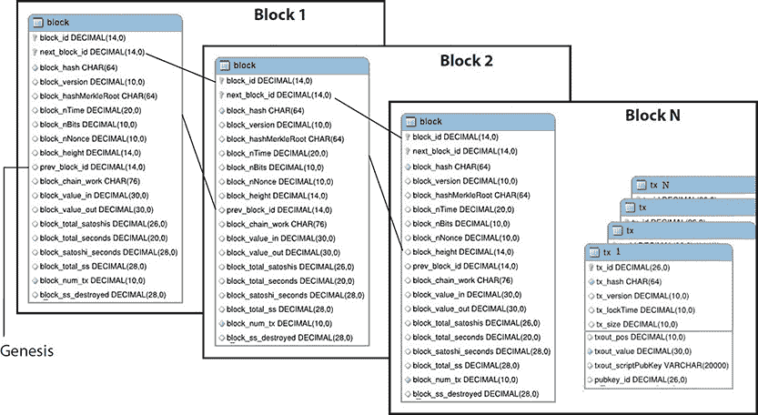

## 1   区块链简介

对于技术用户的世界来说，区块链代表了信息收集、分发和治理景观的巨大改进。这一点在过去几年的书籍和演讲中被提倡，这些书籍和演讲炒作并想象这个新世界。这本书是第一本讨论区块链应用开发的书籍。因此，我们将呈现一个发展路线图，介绍新兴的选项和趋势。话说回来，这是将跟随区块链发展演变的一系列书籍的第一版。这本书面向所有级别的开发人员、软件工程师以及任何对区块链技术基础和构建去中心化应用所需的编程语言和工具感兴趣的人。我们将介绍理解技术、编写“智能合约”、构建与它们交互的应用程序以及在这些新兴平台上部署和维护这些应用程序所需的一切。

那么，让我们开始吧。简单来说，区块链是一个包含固定长度块的物理链数据库，这些块包括 1 到 N 笔交易，每笔添加到新块中的交易都被验证，然后插入到块中。当块完成后，它被添加到现有块链的末尾。此外，与经典的 CRUD 相比，只有两个操作——添加交易和查看交易。因此，基本的区块链处理包括以下步骤，这在图 1-1 中编号为 3、4 和 5：图 1-1）：

**图 1-1   公共区块链交易流程**

1.   添加新的不可删除的交易并将它们组织成块。

2.   对块中的每笔交易进行加密验证。

3.   将新块附加到现有不可变的区块链的末尾。

更全面地说，区块链也是一个分布式数据库，它维护着一个有序的块的双向链表。每个块平均包含约 1 兆字节（参见[`blockchain.info/charts/avg-block-size`](https://blockchain.info/charts/avg-block-size)），并包含大约 200 字节的控制数据，例如时间戳、前一个块的链接、一些其他字段（如图 1-2 所示，将在后面讨论），以及 1 到 N 笔交易，这些交易可以填满剩余的空间。

**图 1-2   区块链数据布局**

一旦记录，区块被设计为难以修改；块中的数据不能被追溯性地更改。通过使用点对点网络和分布式时间戳服务器，公共区块链数据库被自主管理。区块链是一种开放、分布式的账本，可以高效、可验证且永久地记录两个交易方之间的交易，如图 1-1 所示：图 1-1。

账本本身也可以被编程来触发自动交易。区块链因其设计而安全，并且是一个具有高拜占庭容错性的分布式计算系统的例子。因此，可以通过公有区块链实现去中心化共识。正如我们稍后详细讨论的，这些特性使区块链成为记录事件、医疗记录和其他记录管理活动、身份管理、交易处理以及一系列新兴应用的理想选择。此外，区块链技术使我们能够以完全分布式和去中心化的方式实现大规模和系统的合作。这可以被考虑并实施为一个全球治理工具，能够管理大规模的社会互动并摒弃传统的中心权威。例如，2015 年，自由主义政治活动家 Vit Jedlička 宣布克罗地亚和塞尔维亚之间一片 7 平方公里的无人口森林地区为“自由共和国利伯兰”。他使用比特币区块链作为临时政府，并发布了一份宪法文件，概述了这个新国家将如何治理：自愿征税、几乎不存在的政府，对言论和信息没有任何限制。

让我们看看一些说明公有区块链不同之处的类比。它既是一个数据库，也包含了 enveloping 它的软件。作为软件，它类似于 BitTorrent，一个允许你直接与其他运行 BitTorrent 软件的人上传和下载文件的程序。所以，不是把文件上传到像 Dropbox 这样的文件共享服务，然后把下载文件的链接发送给你的朋友，你只需直接把文件上传到你的朋友的电脑上。这就是我们所说的点对点（p2p）程序（见图 1-3）。

**图 1-3   去中心化与中心化数据存储**

公有区块链也是一个点对点的程序，但有一个非常重要的区别：它不仅将文件（数据）从点对点移动，还确保所有节点都有完全相同的数据。它会强制执行这一点。如果一台机器上的数据发生变化，所有机器上的数据都会发生变化。有明确的规则说明如何进行更改，如果有人不遵守这些规则而非法修改他们的副本，那么他们的修改将被忽略。这和试图发送电子邮件而不包含正确的 SMTP 头的电子邮件程序没有区别——其他电子邮件程序将不会认可它。同样地，如果你的版本被删除或损坏，这不是问题，只需与你的同伴重新同步，你就可以获得一份全新的有效副本。

正如前面提到的，当前像比特币和以太坊这样的公有区块链的工作方式是，不是在数据集中更改数据，而是将新数据直接附加到旧数据上。换句话说，数据只是被写入，从未被删除。这就是它被称为*区块链*的原因，因为新数据以批量形式，或称区块，被添加到现有区块之后，形成一个区块链。不仅每个人拥有相同的数据库（区块链），而且每个人在区块链中都有一个只有他们能访问的保险箱。通常，对某物的独占访问是通过用户名和密码来管理的。公有区块链没有中央权威机构来管理用户名和密码，因此它使用密码学。每个用户都能够生成一个保险箱地址和私钥代码，允许他们打开保险箱。当然，保险箱只是一个比喻。实际上它只是一个 ID 号（称为地址），附着在用户数据上。私钥是一种代码，允许用户证明他们是那个*地址*的创建者（或所有者）。只有生成地址的人才有私钥，而且从地址本身无法确定私钥是什么。

所以，虽然每个人都可以看到区块链中与你地址相关的数据，但没有人被允许修改它。它只能由能够通过私钥证明自己是所有者的人来修改。例如，如果比特币附带了你的地址，除非使用私钥，否则它们不能被移动（即附带另一个地址）。

这个系统的美妙之处在于，任何人都可以独立地、不担心与其他地址冲突地生成一个地址。这是因为可能的地址数量如此之多，实际上基本上不可能与其他地址冲突，即使你尝试也不行。

还有更好的。不仅静态数据存储在数据集中，你也可以在其中存储可执行代码。假设你有一段用类似 JavaScript 的语言编写的代码，比如以太坊的 Solidity，它就在每个人的机器上等着被执行。记住数据只被写入区块链，从未被删除，所以你现在有一段没有人能更改的代码。每个人都可以确信它写成的样子就是它将一直运行的样子。

这段代码也附带了某个人的地址。该地址的所有者有权决定哪些操作对公众开放，哪些只有他们能执行。他们只能在编写代码时做出这个决定。一旦编写完成，就无法更改。每个人仍然能够看到代码以及它正在做什么，但只能以所有者指定的方式与之互动。

让我们从创建区块链的原始动机开始：货币。我们目前的货币系统基于记录市场上有多少货币以及谁拥有多少货币。我们依赖我们的政府和银行来维护这些记录。但是，区块链允许我们自己维护这些记录，因为它保证记录对每个人来说都是一样的。我们每个人都保存这个数据集——即包含特定货币系统中发生的每一笔交易记录的区块链。由于每个人的副本都与别人的副本同步，所以没有人需要担心欺诈或冲突的条目。现在不再需要银行管理我们的记录。区块链取而代之。至于货币是如何最初产生和分配的，那是另一个故事，但是比特币网络以及其他加密货币也处理这方面的事务。

这只是关于数据或账本方面的事情。当计算机代码也以这种方式管理时，它会变得更加有趣。让我们想象一个法律合同：在某些条件下采取某些行动。即使在各方签署之后，他们仍然必须依赖对方的善意或我们的司法系统来执行他们的协议。让我们举一个例子。唐纳德讨厌航班延误。AIGore 保险公司告诉他，如果他支付给他们 5 美元，并且他的航班延误超过一个小时，AIGore 将退还他 5 美元，并额外支付给他 20 美元。一个简单的保险计划，或者也许是一场赌注。无论如何，当唐纳德给 AIGore 支付 5 美元时，他必须相信他们会履行他们的交易。然而，通过使用区块链，他可以消除这种风险。他们共同将协议的条件写入计算机代码，并注入足够的资金以履行双方的协议：唐纳德发送 5 美元的加密货币，AIGore 保险公司发送 20 美元。然后，在唐纳德的航班预定到达时间一个小时后，计算机代码合同将执行以下操作：

1.   在[www.flightstats.com](http://www.flightstats.com)上查找唐纳德的航班。

2.   如果延误超过一个小时，发送给唐纳德 25 美元。

3.   否则，发送给 AIGore 保险公司 25 美元。

一旦代码被写入区块链，就无法删除或更改。双方都无法单方面移除资金。唐纳德和 AIGore 可以确保合同条款得到执行。在以太坊区块链中，这被称为*智能合约*；关于那方面的内容我们后面会详细介绍。我们将检查一个应用程序的代码，该程序正是如此操作的。详情请参阅[`fdd.etherisc.com/`](http://fdd.etherisc.com/)，了解如何通过区块链实现这种保险。

### [区块链：一种信息技术](http://fdd.etherisc.com/)

如前所述，区块链是一个分布式交易账本，作为数据批量打包成区块，使用加密验证将区块链接在一起。每个区块通过哈希函数引用和标识前一个区块，形成一个不断链（即区块链）。

公有区块链并不存储在单一的中心计算机中。它也不由任何中央实体管理。相反，它由多台计算机或节点分布式维护，这些节点相互竞争，在其它节点之前验证最新的区块条目以获得奖励。

区块验证系统被设计为不可变。也就是说，所有新旧交易都被永久保存，没有任何能力被删除。网络上的任何一个人都可以通过指定的网站浏览并查看账本。这为所有参与者提供了一种方式，以反映最新的交易或变更的实时账本。正是这样，区块链建立了信任，如我们将看到的，这促进了交易并为各种交易互动带来了许多节省成本的效率。

#### 分布式可信信息技术

从技术角度来看，区块链是一个分布式、透明、不可变、验证、安全和伪匿名的数据库，存在于多个节点中，如果 51%的节点达成共识，那么链的信任就得到保证。区块链是分布式的，因为完整的副本存储在系统中的尽可能多的节点上。区块链是不可变的，因为没有任何交易可以被更改。区块链是验证的（例如，在比特币领域），由矿工验证，他们因构建下一个安全区块而获得补偿。区块链是伪匿名的，因为参与交易的各方身份由一个随机字符串形式的地址密钥表示。

话说回来，这是一个不断发展变化的领域，和云计算一样，存在着公有、私有，甚至混合型区块链，我们将在本章后面详细探讨这些区块链的变体。这些基于基本主题的区块链变体，是企业架构师试图实施区块链应用以节省时间和费用的结果。企业关于扩展性、性能、需要知道交易参与者的身份，以及其他方面的需求，为其新兴变体提供了驱动力。区块链的忠实拥护者认为，分布式账本技术有潜力颠覆机构金融中的集中数据库做法，以及大多数其他基于交易的科技。2017 年，这项技术从炒作转向了商业现实。为了使区块链成功，支持大型网络应用的软件开发生命周期，它使用 HTML、CSS、JavaScript、REST web 服务、Java、SQL 和 NoSQL 数据存储等工具，将不得不修改以整合区块链。我们将需要集成开发环境（IDEs）和持续集成与测试流程，以便将应用程序及其相关代码从开发转移到 QA，并最终实现可靠的生产实施。此外，因为区块链无法自行访问其网络外的数据，所以还需要整合第三方服务（称为预言机、代理或数据馈送）。这些预言机或代理通常访问并验证真实世界的事件，并将这些信息提交给区块链，供智能合约使用。当需要外部数据时，它们将其推送到区块链上。这种情况可能是任何事物，比如我们在保险示例中看到的航班延误信息。区块链必须高效运行、良好扩展、处理了解你的客户（KYC）过程、创建前述预言机或 API，以产生和消费链下服务来验证事件和数据，以及处理/转换现实世界货币与加密货币之间的转换，并且与不同的链良好整合。这一切都正在进行中，我们将详细探讨一些 IDE 和开发过程。

#### 实施趋势

自区块链最初作为加密货币比特币背后的技术出现以来，已经发生了许多变化。它是一种分布式账本，记录交易和资产所有权，由互联网上的一组计算机维护。过去一年里，关于其降低成本和加快交易后流程的能力，又有更多的证据出现。我们将详细探讨这一点。

其快速增长的关键因素是它所推出的背景。金融机构和基础设施正面临既要遵守监管又要降低成本的双重压力。这种压力与这项技术的出现恰好相吻合。正是需求与机会的交汇点导致了快速增长。技术将从“概念验证”进入生产，特别是在跨境支付和贸易金融方面。在这本书中，我们将探讨与区块链一起出现的开发生命周期。作为一名超过 30 年的开发者，我们见证了从 IBM 汇编器/COBOL 时代开始的技术的许多变化。我们喜欢跟同事们开玩笑，说我们可能参与过第一个区块链。

在 1974 年，华尔街没有一家公司有自己的计算机。所有的处理工作都由位于华尔街心脏地带几街之外的著名工资单公司自动数据处理（ADP）完成。持有经营许可证的证券交易公司会把包含交易记录的穿孔卡片堆放在一个指定的投放箱中。他们还会放下一条包含其“区块链”的磁带——即按顺序存储在 IBM 的 QSAM 格式中的该组织迄今为止的所有交易。用 Fortran、COBOL 或 IBM 汇编器编写的程序只能按顺序从前向后读取数据。代表交易的卡片会被添加到 QSAM 记录链的末尾，创建/编写新的磁带文件，从而产生数据库或简单区块链的新状态。接着，早期数据库技术如 IBM IMS、IDMS 和 ADABAS 问世，随后是 1980 年代中期 SQL 的诞生。开源革命催生了 Linux/Python/Java/SQL/NoSQL/HTML/JavaScript 技术栈，其中网络开发和数据库开发已经成熟，共同创造了我们现在所生活的大数据/网络驱动的世界。区块链将进一步颠覆这一演变，将信任重新带回到图中。话说回来，它必须整合到这个现有的发展范式中。这些变化正在出现。区块链的早期采用者使用第一代集成开发环境（IDE）来开发应用程序，正如我们将在后面章节中讨论的那样，使用 JavaScript 类型的语言来编写智能合约等。此外，将区块链与现有应用程序集成也将带来挑战，我们将进行探讨。

随着区块链的兴起，我们预计 2018 年将充斥着为即将到来的修订版欧盟支付服务指令（PSD2）做最后时刻的准备，该指令将于同年 5 月生效。随着 PSD2 的实施，银行对其客户账户信息和支付服务的垄断将消失。PSD2 允许银行客户——无论是消费者还是企业——使用第三方提供商管理他们的财务。这意味着你可能使用谷歌来支付账单、进行转账和分析你的支出。银行将通过开放 API（应用程序编程接口）向这些第三方提供访问其客户账户的方式。欧盟指令为任何有兴趣的公司打开大门，其条款将使初创公司更容易从银行获取数据。这将允许初创公司使用区块链更好地渗透银行目前执行的一些功能。随着开放银行平台的创建，将有机会让金融科技（fintech）公司与银行合作，创造新的客户体验并提供性能和费用结构方面的更大透明度。我们相信 2018 年是金融科技赶上炒作的时候：验证具有前景、规模、客户和采用的基于区块链的技术。我们都在看到与一项技术在未来五年内走向主流并改变许多后续交易格局一致的迹象。

### 信任：拜占庭将军问题

在商业计算机的早期，大约 1980 年左右，计算机科学家开始研究计算机的可靠性。人们认为一个可靠的计算机系统必须能够应对其一个或多个组件的故障。一个失败的组件可能会表现出一种被忽视且具有问题的行为，即向系统的不同部分发送冲突信息。应对这种故障的问题被抽象地表述为*拜占庭将军问题*，来自 1982 年 Leslie Lamport，Robert Shostak 和 Marshall Pease 的学术论文 ([www-inst.eecs.berkeley.edu/~cs162/fa12/hand-outs/Original_Byzantine.pdf](http://www-inst.eecs.berkeley.edu/~cs162/fa12/hand-outs/Original_Byzantine.pdf))。这个抽象问题及其解决方案被用于开发高可靠性和值得信赖的区块链实现。

#### 拜占庭将军问题解释：为什么信任如此重要

拜占庭将军问题（BGP）是众多一致性协议问题中的一个。Lamport 在他的论文中围绕一个故事问题进行了阐述。这是当时的一种风格，正如由另一位计算机科学家 Edsger Dijkstra 提出的哲学家就餐问题所引起的关注，该问题基于一个经典的操作系统同步问题。

为了阐述这个问题，以及因为这本书出版后，音乐剧《汉密尔顿》将在百老汇长期上演，我们看到 BGP 问题在美国独立战争时期是相关的。冲突开始时，大陆会议命令对所有军队军官进行忠诚誓言。乔治·华盛顿，总司令，给将军们举行了誓言仪式。当华盛顿开始向查尔斯·李将军读誓言时，李将军把手从圣经上缩了回去。当华盛顿要求李解释这种奇怪的行为时，据《乔治·华盛顿的著作》记载，李回答说：“至于乔治国王，我完全准备免除我对他的所有忠诚；但对于威尔士亲王，我有些犹豫。”这个奇怪的回答引起了很多笑声。李当时正在玩一场危险的叛国游戏，而且可能对自己的良心有些问题，因为他（和后来的大卫·伯纳德将军）将违反这种誓言。

BGP 围绕一个类似的情节构建：做出决定进攻或撤退的指挥将军，必须将决定传达给他的副将军们。有一定数量的角色是叛徒（可能包括将军）。叛徒不能保证正确地传达命令；更糟糕的是，他们可能会试图颠覆过程 actively alter messages。

在这个类比中，将军们统称为进程，发起命令的将军是源进程，发送给其他进程的命令是消息。叛徒将军和副将军是故障进程，忠诚的将军和副将军是正确进程。撤退或进攻的命令是一条带有单一信息位的消息：一或零。

解决一个协议问题的方案必须通过三项测试：终止性、一致性和有效性。应用于拜占庭将军问题时，这三项测试是：

1.   解决方案必须保证所有正确的进程最终就所给命令的值达成决定。

2.   所有正确的进程必须对所给命令的同一值做出决定。

3.   如果源进程是正确的进程，所有进程必须就源进程最初给出的值达成决定。

我们所知的最可靠的可信计算机系统（例如，区块链）实现方法是使用许多不同的处理器计算相同的结果，然后对他们输出的结果进行多数投票以获得一个值。参见图 1-4，该图从并列的角度看待 BGP 和区块链问题。

**图 1-4   BGP 与区块链比较**

无论是在实现使用分布式节点来防止达成下一个区块共识失败的区块链，还是使用冗余计算站点来防止个别站点因核攻击而遭到破坏的导弹防御系统，这一点都是正确的。唯一不同的是复制品的大小。使用多数投票来实现可靠性的基础假设是所有非故障处理器将产生相同的输出。只要它们都使用相同的输入，这就是正确的。然而，任何单一的输入消息都来自一个物理组件，一个故障组件可以给不同的处理器不同的值。此外，不同的处理器即使从一个非故障输入单元读取值，也可能得到不同的值，如果他们在值变化时读取的话。解决方案是一个信任机制，对每个处理器记录的输入/交易进行值验证和接受，并在分布式处理器之间同步输入交易。信任的质量是商业的基础元素。特别是在全球经济中，每一笔交易都需要单独的账本，信任是昂贵、耗时且低效的。随着区块链的成熟应用，将提供一个可行的替代当前所需的程序、组织和技术基础设施，以创建制度化的信任。

#### 当今使用的拜占庭容错：为什么飞机是安全的

拜占庭容错（BFT）是指前面提到的 BGP。拜占庭容错的一个应用实例是比特币。比特币网络并行工作，生成一个哈希现金风格的证明工作链。工作量证明链是克服拜占庭失败和达到系统状态一致的全球视图的关键。

一些飞机系统，如波音 777 飞机信息管理系统（通过其 ARINC 659 SAFEbus®网络）、波音 777 飞行控制系统以及波音 787 飞行控制系统，使用了拜占庭容错（见图 1-5）。因为这些是实时系统，它们的拜占庭容错解决方案必须具有非常低的延迟。例如，SAFEbus 可以在增加微秒级的延迟的情况下实现拜占庭容错。

**图 1-5   BFT 与飞机安全 ARINC 659 SAFEbus**

一些航天器，如 SpaceX 的龙飞船系统，在其设计中考虑了拜占庭容错性。拜占庭容错机制使用重复传入消息（或仅是其签名）到该传入消息的其他接收者的组件。所有这些机制都假设重复消息的行为阻止了拜占庭症状的传播。对于那些安全或安全关键性程度高的系统，这些假设必须被证明为真，以达到可以接受的故障覆盖水平。在通过测试提供证明时，一个困难是创建具有拜占庭症状的足够广泛的信号。这样的测试可能需要专门的故障注入器。

### 中本聪的区块链突破

中本聪是设计比特币并创建其原始参考实现比特币核心的未知个人或个人的名字。作为实现的一部分，他们还设计了第一个区块链数据库，并解决了数字货币的双重支付问题。他们一直活跃在比特币的开发中，直到 2010 年 12 月。

#### 中本聪：这个人，神话，谜团

如果这个谜团引起了你的兴趣，我们建议你观看电影《Banking on Bitcoin》。该电影回顾了加密货币崛起周围的生活故事和公众误解。这部电影节奏紧凑且富有信息量，使用了《华尔街日报》和《纽约时报》的金融专栏作家、早期采用比特币的企业家如 Charlie Shrem 和 Erik Voorhees，以及 Winklevoss 兄弟和前纽约州金融服务 Superintendent Benjamin Lawsky 等 Establishment figures。它是密码技术历史的很好的游览。像许多新技术一样，区块链和比特币是被称为密码朋克的一小群程序员的工作。他们对成为比特币建筑块的想法做出了贡献。在 1990 年代中期，只有少数人具备开发区块链货币所需的必要知识。电影探讨了理论，即比特币的未知创造者中本聪可能是最初的密码朋克之一，因为据传闻他住在其他密码朋克，如密码学家 Hal Finney 的几条街之遥。

该叙述对比了集中银行系统和比特币核心的公共账本之间的区别，后者消除了对中央权威的需求。它突显了比特币减少汇款费用、为地球上剩下的 25 亿未银行人口提供服务，以及将财务控制权交还给个人的力量。

ShapeShift 的创始人 Erik Voorhees 在电影中的第一次采访中表达了这种情绪：“当我明白比特币不受任何中央公司或中央个人的控制时，我发现了比特币的力量。我知道这意味着它不能被关闭。如果它不能被关闭，它只需要做一些有用的事情，它就会越来越多地被采用。”

中本聪自称是一个住在日本的 1975 年出生的人。然而，关于中本聪真实身份的猜测主要集中在一些非日本血统的密码学和计算机科学专家身上，这些人居住在美国和欧洲。这成为了一种“我是斯巴达人”的现象，因为澳大利亚程序员 Craig Steven Wright 声称自己是中本聪，尽管他还没有提供证明。截至 2017 年 2 月，中本聪被认为拥有大约 100 万个比特币（价值约 40 亿美元），但从未花费过一个 BTC。

#### 中本聪：时机至关重要

有趣的是，比特币的出现恰逢 2008 年的金融危机。根据[`bitcoin.org`](https://bitcoin.org)的说法，一种纯粹的点对点电子现金版本允许在线支付直接从一方发送到另一方，而无需通过中央金融机构。数字签名提供了部分解决方案，但如果仍然需要一个可信赖的第三方来防止双重支付，那么主要的好处就会丧失。比特币通过点对点网络解决了双重支付问题。网络通过将交易哈希到一个基于工作量证明的持续哈希链中来时间戳交易，形成一条不能在不重新执行工作量证明的情况下更改的记录。最长的链不仅作为见证事件序列的证明，也是来自最大 CPU 能力池的证明。只要大多数 CPU 能力由不合作攻击网络的节点控制，它们就会生成最长的链并超越攻击者。网络本身要求的最小结构。消息是以最佳努力的方式广播的，节点可以随时离开和重新加入网络，接受最长的工作量证明链作为他们离开时发生的事情的证明。如果人们失去对一种货币的信任，典型的反应是开始使用另一种货币。

传统上，货币流向最稳定的货币，这通常是美元。但比特币有两个优势。第一个优势是它不受任何中央权威的控制。在一些人们对中央银行和政府如何管理经济持怀疑态度的国家，比特币可能看起来像是一个更合理的替代品。

第二个原因是，获取比特币可能比其他法定货币更容易。它可以通过在线比特币交易所买卖，也可以通过网站进行直接交易。迹象表明，在危机时刻，人们正在寻求比特币作为他们问题缠身的货币的替代品。随着希腊债务危机的爆发，比特币交易所报告的交易量有所增加，人们在全球范围内交易这种加密货币。比特币的价格也在希腊危机加深时显著上涨，进一步证实了比特币作为“恐慌”货币的观点。

#### 区块链：加密货币的基础

正如我们所知，区块链为比特币提供了技术基础，比特币在技术、商业和法律执行社区中引起了极大的兴趣和猜测。当比特币成为暗网网站如丝绸之路的交换货币时，它饱受诟病。根据 Coinmap 网站（[`coinmap.org`](http://coinmap.org)）的数据，这是一个追踪接受比特币作为支付手段的企业的众包网站，这类企业的数量正在不断增长。虽然比特币带来的收入仍然只是总收入的一小部分，但比特币及其他加密货币的更广泛采用几乎是必然的，特别是在金融领域，全球交易中节省时间和金钱的效益日益显现。例如，rand Merchant Bank 的研究（[`news.bitcoin.com/south-africa-bank-blockchain-40-revenue/`](https://news.bitcoin.com/south-africa-bank-blockchain-40-revenue/)）发现，如果比特币成为全球标准，加密货币可能会占到银行收入的 40%。IBM 和微软都提供自己的区块链即服务（BaaS）版本，作为其云平台的一部分，唐纳德·塔普斯科特在其著作《区块链革命》中称：“加密货币的底层技术——区块链，有潜力改变世界经济。”

### 区块链的类型

当人们开始了解区块链如何工作，他们开始用它来服务于其他目的：作为有价值事物的数据存储、身份、协议、产权以及许多其他事物。以太坊，将是本书的主要关注点之一，迄今为止，在比特币之后，是以太坊带来了最具 comprehensive 的区块链创新。与云计算实现类似，不同的区块链类型或类别已经出现。与云计算类似，您有公有链，所有人都可以访问和更新，您有私链，只有组织内有限的一组人可以访问和更新，还有第三种，即联盟链，是与他人合作使用的。在华尔街工作时，我们看到五家较大的投资银行之间的这种联盟类型的安排非常普遍。这个联盟为成员之间的机构级交易提供了便利，因此，区块链作为一种金融技术工具以这种方式出现是有意义的。接下来的部分将是对每种区块链类型的一次快速探索。

#### 公有链

公有区块链是初始创造者设想的一种区块链：所有人都可以访问和进行交易；只有当交易有效时，交易才会被包含在内；每个人都可以参与到共识过程中。如前所述，共识过程决定了哪些区块将被添加到链上以及当前状态是什么。在公有区块链上，区块链的安全性是由矿工支持的对加密验证的激励机制来保证的，而不是使用中心服务器。任何人都可以成为矿工，聚集并发布这些交易。在公有区块链中，由于没有用户被默认为验证交易，所有用户都遵循一种算法，通过提交软件和硬件资源来解决一个通过暴力方法（即解决加密谜题）的问题。首先达到解决方案的矿工将得到奖励，每个新的解决方案以及用于验证它的交易，都构成了下一个要解决问题的基础。验证概念包括工作量证明或权益证明。

#### 联盟链

像 R3 这样的联盟区块链是一个分布式账本，其共识过程由一组预先选定的节点控制——例如，一个由九家金融机构组成的联盟，每家机构都运行一个节点，其中五家（类似于美国最高法院）必须签署每个区块，才能使区块有效。读取区块链的权利可能是公开的或限制在参与者之间，还有一些混合模式，如块的根哈希是公开的，同时还有一个 API，允许公众进行有限次数的查询并获得区块链状态某些部分的加密证明。这类区块链是分布式账本，可以被认为是“部分去中心化”。

#### 私有区块链

完全私有的区块链是一个区块链，其写入权限保持集中在一个组织手中。读取权限可能是公开的或限制在任意程度。可能的应用包括单一公司内部的数据库管理和审计，所以在许多情况下，公开可读性根本不是必要的，尽管在其他情况下，公开可审计性是所需的。私有区块链可以为包括健康保险便携性和责任法（HIPAA）、反洗钱（AML）和了解你的客户（KYC）法规在内的金融企业问题提供解决方案。Linux 基金会旗下的 Hyperledger 项目和 Gem Health 网络是正在开发的私有区块链项目。请参阅第八章以详细了解 Hyperledger 和其他私有及联盟区块链技术。

#### 比较区块链

公共、联盟和私有区块链之间的区别是重要的。即使对于偏好传统集中式系统的“老派”分布式账本采用者来说，他们仍然获得了附加的加密可审计性。与公共区块链相比，私有区块链具有一系列优势。私有区块链的运营者可以更改区块链的规则。如果它是在金融机构之间的区块链，那么在发现错误时，它们将能够更改交易。同样，它们将能够修改余额，通常可以撤销任何操作。话说回来，这里有痕迹。在某些情况下，这种功能是必要的，比如在财产登记处，如果发出了错误的交易，或者某些邪恶的人获得了访问权限并成为新的所有者。如果政府像克林顿时代那样拥有后门访问密钥，这同样适用于公共区块链。在私有区块链上，交易成本较低，因为它们只需要由几个可以信任具有非常高的处理能力的节点进行验证。公共区块链的交易费用通常更高，但随着扩展技术的出现，并将公共区块链成本降低，以创建有效的区块链系统，这将发生变化。

节点可以被信任，连接得非常好，而且通过手动干预可以迅速修复故障，这使得可以使用在更短区块时间后提供最终性的共识算法。公共区块链技术的改进，比如以太坊的权益证明（proof-of-stake），可以让公共区块链更接近“即时确认”的理想状态，但私有区块链始终会更快，不幸的是，光速不会像摩尔定律预测的那样每两年增加一倍，延迟差异也不会消失。如果阅读权限受到限制，私有区块链可以提供更高水平的隐私。

考虑到所有这些因素，私有区块链似乎无疑是机构更好的选择。然而，即使在机构背景下，公共区块链仍然具有很大的价值。实际上，这种价值在很大程度上在于支持公共区块链的哲学美德，其中最重要的是自由、中立和开放。公共区块链的优势通常可以分为两大类：

公共区块链提供了一种保护应用程序用户免受开发者侵害的方法，确立了某些即使是应用程序的开发者也无权做的事情。

•   公共区块链是开放的，因此被许多实体使用，这带来了一些网络效应。如果在区块链上建立资产持有系统，并在同一区块链上设立货币，那么我们可以通过智能合约将成本降至近乎零：甲方可以将资产发送到一个程序，该程序立即将其发送给乙方，乙方再将资金发送给该程序，由于该程序运行在公共区块链上，因此是被信任的。请注意，为了高效地实现这一点，两个完全异质的资产类别，来自完全不同的行业，必须存储在同一个数据库中。这也可以被其他资产持有者使用，比如土地登记处和产权保险。

### Blockchain Implementations

去中心化数字货币的概念，以及像财产登记册这样的替代应用，已经存在了几十年，但直到现在，没有一种产生了可行的生产实施。20 世纪 80 年代和 90 年代的匿名电子现金协议主要依赖于一种被称为 Chaumian blinding（以其开发者 David Chaum 命名）的密码学原语。Chaumian blinding 为这些新货币提供了高度的隐私性，但它们的底层协议由于依赖于中心化的中介而未能获得牵引力。1998 年，Wei Dai 的 b-money 成为第一个引入通过解决计算难题以及去中心化共识来创建货币的想法的提案，但该提案在去中心化共识的实际实施细节上缺乏足够的信息。2005 年，Hal Finney 提出了一种“可重用的工作量证明”的概念，该系统使用了 b-money 的想法以及 Adam Back 的计算上困难的 Hashcash（[`hashcash.org`](http://hashcash.org)）难题，创造了一个加密货币的概念，但这又再次因为依赖于可信计算作为后端而未能达到理想的效果。正如我们所知，区块链概念作为数字货币 Bitcoin 的核心组件得到实现。这种关键的，或许是第一个区块链生产实施，使它成为第一个解决双重支付问题的数字货币，而无需可信权威或中心服务器。我们在下一节简要检查的 Bitcoin 设计，为我们将要探索的其他实施提供了灵感。

#### Bitcoin

如我们所提及的，当 2008 年的金融危机达到高潮时，比特币（BTC），一种去中心化的货币，第一次在实践中由中本聪（Satoshi Nakamoto）实施。比特币结合了通过公钥加密管理所有权的成熟原语和一个用于跟踪谁拥有硬币的共识算法，称为工作量证明（proof-of-work）。工作量证明背后的机制同时解决了两个问题。首先，它提供了一个有效的一致性算法，允许网络中的节点集体同意比特币账本状态的一组更新。其次，它提供了一种允许自由进入共识过程的机制，解决了决定谁可以影响共识的政治问题，同时防止 Sybil 攻击——即在点对点网络中通过伪造身份来破坏声誉系统的攻击。它的名称来源于一个被诊断为解离性身份障碍的女性的案例研究。它通过用一种经济障碍替代正式的参与障碍，例如要求在特定列表上注册为唯一实体，来起作用——在共识投票过程中，单个节点的影响力与节点带来的计算能力成正比。最近，一种名为权益证明（proof-of-stake）的替代方法已经被提出，计算节点的权重与其货币持有量成比例，而不是其计算资源。关于这两种方法的相对优点的讨论将在讨论基于以太坊的区块链及其衍生品的章节中进行。到了 2018 年的这个节点，所有的区块链平台仍在不断发展，并将在可预见的未来继续发展。由于比特币使用最广泛，我们将在接下来的部分详细探讨它。对于开发者的详细信息，请参阅[`bitcoin.org/en/developer-documentation`](https://bitcoin.org/en/developer-documentation)。

##### 比特币状态转换

从技术角度来看，像比特币这样的加密货币的账本可以被看作是一个状态转换系统，其中有一个状态 S，它包括所有现有比特币（或任何资产）的所有权状态和一个状态转换函数——即 API：`EXECTX`，它接受一个状态 `S` 和一个交易 `TX`，输出一个新的状态 `S’`，即结果。在一个标准的银行系统中，例如，状态是一个资产负债表，一个交易是一份将现金从 A 转移到 B 的请求，状态转换函数通过减少 A’ 账户中 X 金额的现金并增加 B’ 账户中 X 金额的现金来减少 A 账户的值。如果 A 的账户原本就少于 X 金额的现金，状态转换函数将返回一个错误。我们定义了一个 API：

`EXECTX(S,TX) 结果为 S’（新状态）或 ERROR 和 S（状态不变）`

如果 A 有足够的现金：

`EXECTX({ A:$1000, B:$500},“send $500 :A to B”) results in { A:$500, B:$1000 }`

但是，如果 A 没有足够的现金：

`EXECTX({ A:$1000, B:$500 },“send $1001 from A to B”) results in ERROR`

区块链中的状态是所有交易在给定时刻的“共识视图”，由现有身份验证的分布式账本 among 所有节点承载。在比特币的世界里，这是一系列尚未花费的、已被铸造的交易输出（UTXO）的集合，每个 UTXO 都有一个面值和一个所有者（由一个 20 字节地址定义，该地址本质上是一个加密公钥）。关于 UTXO，因为每个特定交易的输出只能花费一次，区块链中的所有交易的输出可以归类为未花费交易输出（请参阅[`bitcoin.org/en/glossary/unspent-transaction-output`](https://bitcoin.org/en/glossary/unspent-transaction-output)）或已花费交易输出。为了使付款有效，它只能使用 UTXO 作为输入。

如果交易的输出的价值超过其输入的价值，则交易将被拒绝。但是，如果输入的价值超过输出的价值，任何价值上的差异都可以由创建包含该交易的区块的比特币矿工作为交易费用声称。

交易包含一个或多个输入，每个输入包含对现有 UTXO 的引用和一个由与所有者地址相关联的私钥生成的加密签名，以及一个或多个输出，每个输出包含一个添加到状态的新 UTXO。

状态转换函数`EXECTX(S,TX) -> S’`可以定义如下：

对于`TX`中的每个输入：

1.   如果引用的 UTXO 不在 S 中，返回错误；这可以防止交易发送者花费不存在的币。

2.   如果提供的签名与 UTXO 的所有者不匹配，返回错误；这可以防止交易发送者花费别人的币。

3.   如果所有输入 UTXO 的面值之和小于所有输出 UTXO 的面值之和，返回错误。

4.   返回`S’`，其中移除了所有输入 UTXO，并添加了所有输出 UTXO。

这就是比特币交易流程的简单视图。

##### 比特币挖矿

比特币将状态转换系统与共识系统相结合，以确保所有人对交易的顺序达成一致。比特币的去中心化共识过程要求网络中的节点不断尝试生产区块，即 1 到 N 笔交易。比特币网络旨在大约每 10 分钟创建一个区块，每个区块包含一个时间戳、一个 nonce、对前一个区块的引用（即前一个区块的哈希）以及自上一个区块以来发生的所有交易列表。比特币网络中的每个区块的结构与图 1-6 中的结构完全相同。

**图 1-6   比特币区块链架构**

每个新创建的区块都被“链接”到区块链的最后添加的区块，并存储其数字指纹。让我们检查一个区块的字段，字节大小可能会有所变化：

•   区块标识符（4 字节）：这是区块链网络的标识符。它有一个常数魔法数字值为 0xD9B4BEF9。魔法数字不是比特币特有的东西。它用于标识你正在消费的文件或数据结构类型。消费者可以检查魔法数字，并立即知道该文件或数据结构的可能类型。在这种情况下，它表示区块的开始，数据来自生产网络。

•   下一个区块标识符（4 字节）。

•   区块大小（4 字节）：表示区块有多大。从开始以来，每个区块都被固定为 1 MB。这将被增加到 2 MB。最大容量为 2 GB，因此已经考虑了可扩展性因素。

•   区块版本（4 字节）：每个运行比特币协议的节点必须实现相同的版本，并且在此字段中提及。

•   前一个区块哈希（32 字节）：这是区块链上最后一个（最后添加的）区块的区块头的一个数字指纹（哈希）。它通过取所有头字段（版本、Nonce 等）在一起，并应用加密函数（SHA-256）两次，重新排列各个字段的字节（小端格式）来计算的。

•   区块 Merkle 根（64 字节）。

•   区块时间戳（8 字节）。

•   Nonce（4 字节）。

区块头由版本到 Nonce 的字段组成。

•   交易计数器（变量：4 字节）：这是包含在区块中的交易的数量。

•   交易列表（变量：总区块大小为 1 MB）：存储该区块中所有交易的数字指纹。每个单独的交易都有自己的结构。

您还可以查看自第一个区块创建以来的区块高度（也称为区块计数）和创世区块，即第一个被挖出的区块。

##### 比特币区块大小和隔离见证

所以一个区块的最大文件大小为 1 MB。当这个区块的空间容量满时，将创建另一个区块并添加到区块链中。随着比特币交易的增加，将创建更多的区块。这正在压力区块链网络，并导致交易确认延迟。另外，更多的挖矿意味着更高的交易。为了解决这个问题，提出了隔离见证（“SegWit”）方案。所以让我们回顾一下——每个比特币交易包含三个元素：

1.   输入（发送者详情）

2.   输出（接收者详情）

3.   数字签名：这个签名被称为见证，验证发送者是否有足够的余额进行交易的见证人。

所有这些元素都是将交易添加到区块所必需的。在这三个元素中，数字签名的文件大小最大，使得交易在大小上显得很重。由于目前每个区块的最大容量是 1MB，因此更多的重交易等于更少的交易被添加到区块以供确认。SegWit 提议将数字签名元素从交易中移除，并将其添加到另一个名为扩展区块的新区块中。这意味着任何被添加到区块以供确认的交易只包含输入和输出，而不包含数字签名。这将使交易变得更轻。因此，区块中可用的空间更多，这意味着可以添加到区块中的交易更多。由于在相同的时间内验证更多的交易，比特币网络将变得更快。因此，我们移除了证明——数字签名——将其隔离到另一个区块中（因此得名“隔离见证”）。

所以，SegWit 的优势是：

-   它将减少交易的大小，

-   交易的确认将更快，并且

-   交易费用将更低。

因此，SegWit 将提高比特币网络的可扩展性。此外，使 SegWit 工作并不需要达成共识。SegWit 甚至在用户没有将软件版本升级到最新版本时也能工作。话说回来，随着它在应用开发世界的普及，我们将对区块链软件进行许多改进。

##### 比特币和 Merkle 根

每个区块包含所有交易的列表。一旦区块成为区块链的一部分，它就是一个不可变的记录，即其中的交易条目是永久的。这也意味着如果一个交易在一个区块中存在，它将不会存在于区块链的任何其他区块中。交易被列为 Merkle 树或二进制哈希树。这是在编程语言中使用的一种非常流行的数据结构。

树的*根*是顶节点。底部的节点被称为*叶子*节点。每个节点只是一个交易的加密哈希。Merkle 树不包含所有交易的列表，而是一个作为树结构的所有交易的哈希（数字指纹）（参见图 1-7）。

**图 1-7   Merkle 树**

交易哈希 0 = Hash[Tx(0)] = SHA256 (SHA 256 (Transaction A))

每个哈希都是通过应用两次 SHA-256 算法计算得到的。

同样，要构建父节点 Hash(01)，将 32 字节的 Hash[Tx(0)]和 32 字节的 Hash[Tx(1)]连接成一个 64 字节的哈希字符串，然后应用两次 SHA-256，得到一个 32 字节的 Hash(01)。

这个概念可以进一步扩展到任何大小。最大的优点是，它非常容易且高度有效地确定一个特定的交易是否被包含在一个区块中（因为区块包含 Merkle 根——它是包含在其中的所有交易的数字指纹）。

##### 比特币与安全哈希算法

安全哈希算法（SHA）用于证明数据完整性。相同的输入总会产生完全相同的输出。无论输入长度如何（即使输入是数百万字节），这个输出总是 256 位或 32 字节长。输入的任何变化都会导致输出的变化。相同的输出永远不可能从不同的输入中得到。然而，从输出我们永远无法确定输入，这就是它高度安全的原因。您可以在一些在线 SHA-256 工具（如[www.xorbin.com/tools/sha256-hash-calculator](http://www.xorbin.com/tools/sha256-hash-calculator)）上自行测试。输入可以是任何字符串，甚至是连接多个字符串。无论输入如何，输出始终是 256 位。

随着时间的推移，这创建了一个持续增长、不断更新的区块链，用以代表比特币账本最新的状态。

检查一个区块是否有效的算法，按照这个范式表达如下：

1.   检查区块引用的前一个区块是否存在且有效。

2.   检查区块的时间戳是否大于前一个区块的时间戳。

3.   检查区块的工作量证明是有效的。

让 S[0]是前一个区块结束时的状态。

假设 TX 是区块的交易列表，包含 n 笔交易。

对于所有 i 在 0...n-1，设置 S[i+1] = EXECTX({ (S[i],TX[i]) }。

如果任何应用程序返回错误，退出并返回假。

返回真，并注册 S[n]为这个区块结束时的状态。

本质上，区块中的每一笔交易必须提供从交易执行前的一致状态到某种新状态的有效状态转换。请注意，状态在区块中以任何方式编码；它只是一种由验证节点记忆的抽象，并且只能通过对每个区块中的每一笔交易依次应用从创世区块开始计算。另外，请注意矿工将交易包含在区块中的顺序很重要；如果在区块中有两笔交易 A 和 B，且 B 花费了由 A 创建的未花费交易输出（UTXO），那么如果 A 在 B 之前，区块将是有效的，否则不是。

存在的有效性条件是工作量证明的要求。精确条件是，每个区块的双重 SHA-256 哈希，作为 256 位数字，必须小于动态调整的目标。这样做是为了使区块创建具有计算难度，从而防止 Sybil 攻击者将整个区块链重制以利于自己。由于 SHA-256 被设计成一个完全不可预测的伪随机函数，创建有效区块的唯一方法就是简单地尝试和错误，反复增加 nonce，看看新的哈希是否匹配。

为了更好地理解挖矿的目的，让我们来看看恶意攻击事件中会发生什么。由于比特币的基础加密学是被公认安全的，攻击者将会针对比特币系统不受直接加密保护的那部分：交易的顺序。攻击者的策略是一个简单的双重花费：

1.   发送 1,000 BTC 给商家，以换取某些产品（最好是快速交付的数字商品）。

2.   等待产品的交付。

3.   创建另一笔交易，将同样的 1,000 BTC 发送给自己。

4.   让网络相信他发送给自己的那笔交易是最先发生的。

当第一步完成之后，几分钟内，某个矿工将会把这笔交易包含在一个区块里。大约一个小时后，会有五个更多的区块被添加到那个区块之后的链上，每个区块都间接地指向那笔交易，从而“确认”它。此时，商家会接受这笔支付为最终完成，并交付产品；由于我们假设这是一个数字商品，所以交付是即时的。现在，攻击者创建另一笔将 1,000 BTC 发送给自己的交易。如果攻击者只是将其释放到网络中，这笔交易将不会被处理；矿工会尝试运行`EXECTX({ (S, TX) })`并注意到 TX 消耗了一个不再处于状态中的 UTXO。因此，攻击者创建了一个区块链的“分叉”，起始于挖出另一个版本区块，该区块将相同的旧区块作为父区块，但用新交易替代了旧交易。因为区块数据不同，这需要重新进行工作量证明。此外，攻击者新版本的区块具有不同的散列值，所以原始区块不会指向它；因此，原始链和攻击者的新链完全分离。规则是，在分叉中，最长的区块链被认为是真实的。为了使攻击者的区块链最长，他需要比网络剩余部分的总计算能力还要强，以追赶上并实现所谓的“51%攻击”。

##### Merkle Trees（默克尔树）

Bitcoin 的一个重要可扩展性特点是区块存储在多级数据结构中。一个区块的“哈希”实际上只是该区块头的哈希，这是一个大约 200 字节的数据，包含了时间戳、随机数（nonce）、前一个区块的哈希以及一个名为 Merkle 树的哈希结构，该树存储了区块中的所有交易。Merkle 树是一种二叉树，由大量位于树底部的叶节点组成，包含底层数据的一组节点、一组中间节点，其中每个节点的值是它的两个子节点的哈希，最后是一个单一的根节点，也是由其两个子节点的哈希形成的，代表树的“顶部”。Merkle 树的目的是允许区块中的数据分块传递：一个节点可以从一来源下载区块的头部，与他们相关的树的小部分从另一个来源下载，仍然可以确保所有的数据都是正确的。之所以这样做是因为哈希值向上传播。如果恶意用户试图在 Merkle 树的底部交换一个假交易，这种变化将导致上面的节点发生变化，然后是上面节点的变化，最终改变树的根和块的哈希，导致协议将其注册为完全不同的块，几乎可以肯定的是，它具有无效的工作量证明（proof-of-work）。Merkle 树协议可以说对长期可持续性至关重要。

##### Bitcoin Scripting

即使没有任何扩展，比特币协议也提供了一个智能合约概念的不太健壮的版本。在比特币中，UTXO（未使用的交易输出）不仅可以由公钥拥有，也可以由更复杂的脚本拥有，这些脚本用一种简单的基于栈的编程语言表达。在这种范式中，花费该 UTXO 的交易必须提供满足脚本的数据。实际上，即使是基本的公钥所有权机制也是通过脚本实现的：脚本接受一个椭圆曲线签名作为输入，将其与交易和拥有 UTXO 的地址进行验证，如果验证成功则返回 1，否则返回 0。还存在其他更复杂的脚本，用于各种其他用例。例如，可以构建一个脚本，要求来自给定三个私钥中的两个的签名来验证（多签名），这种设置适用于企业账户、安全储蓄账户以及某些商户托管情况。脚本还可以用于为计算问题的解决方案支付赏金，甚至可以构建一个脚本，其内容类似于“这个比特币 UTXO 是你的，如果你能提供一个 SPV 证明，证明你向我发送了这笔特定面额的 Dogecoin 交易，”这实际上允许去中心化的跨加密货币交换。

#### Namecoin

创建于 2010 年的 Namecoin([`namecoin.org`](http://namecoin.org))是一个去中心化的名称注册数据库。在像 Tor、比特币和 Bitmessage 这样的去中心化协议中，需要有一种方式来识别账户，以便其他人可以与它们互动。Namecoin 是使用这种想法实现名称注册系统的最古老和最成功的实现。它是一种开源技术，可以提高互联网基础设施某些组件（如 DNS 和身份）的去中心化、安全性、抗审查、隐私和速度。Namecoin 是基于比特币技术的键/值对注册和传输系统。

#### Ripple

Ripple([www.ripple.com](https://www.ripple.com))被认为是行业内最先进的分布式账本技术（DLT）公司之一。它专注于利用区块链类似技术进行支付。Ripple 协议已经被越来越多的金融机构采纳，为消费者提供替代的汇款选项。Ripple 甚至从纽约州金融服务部门获得了虚拟货币牌照，使其成为拥有 BitLicense 的少数公司之一。截至 2017 年，Ripple 按市值计算是第三大加密货币，仅次于比特币和以太坊。Ripple 是一个使用分布式账本技术的金融实时全额结算解决方案、货币兑换和汇款网络。Ripple 建立在分布式开源互联网协议、共识账本和本地货币 XRP（ripples）之上，可实现零售客户、公司和其它银行的跨境支付。Ripple 协议被描述为“银行间交易的基本（结算）基础设施技术”，可实现不同账本和支付网络的互操作性，并将现代支付解决方案的三个方面结合在一起：消息传递、结算和外汇管理。它允许银行和非银行金融服务公司将其 Ripple 协议纳入自己的系统，从而允许他们的客户使用该服务。

该协议实现了双方之间货币的即时直接转移。因此，该协议可以绕过传统代理银行系统的费用和等待时间。任何类型的货币都可以进行交换，包括美元、欧元、人民币、日元、黄金、航空里程和卢比。Ripple 拥有自己的数字货币形式（称为 XRP），与比特币类似，使用该货币使金融机构能够以微不足道的费用和等待时间转移资金。XRP 的一个特定功能是作为桥梁货币，当两种货币之间没有直接交换时可能需要这种货币，例如，当交易两种很少交易的货币对时。在网络的货币交易所中，XRP 可以自由与其他货币交换，并且它们的市场价格会相对于美元、欧元、日元、比特币等波动。

许多金融公司随后宣布正在试验与 Ripple 的集成。许多大型银行采用了 Ripple 来改进他们的跨境支付，许多已经完成了试点区块链项目。这些银行机构——包括桑坦德、意大利联合信贷银行、瑞士银行、加拿大皇家银行、西太平洋银行、加拿大帝国商业银行和阿布扎比国家银行等——认为 Ripple 的支付协议和交易所网络是提供实时低成本资金转移的有效机制。

#### 以太坊

以太坊（[`ethereum.org`](https://ethereum.org)）是一个去中心化的平台，运行智能合约：按编程精确运行的应用程序，没有任何可能的中断、审查、欺诈或第三方干预。如果比特币是区块链 1.0，那么以太坊就是区块链 2.0 和更先进。参见图 1-8。

**图 1-8   以太坊区块链平台**

以太坊应用运行在自建的区块链上，这是一个共享的全球基础设施，可以移动价值，代表财产所有权。这使得开发者能够创建市场、存储债务或承诺的注册表，并根据很久以前给出的（如遗嘱）或没有中间人或对手风险的期货合约来转移资金。该项目于 2014 年 8 月通过以太币预售由世界各地的粉丝启动。它是由一个瑞士非营利组织以太坊基金会开发的，全球各地的伟大思想为其做出了贡献。我们将详细探讨以太坊，因为它将是大多数我们将展示的开发代码的焦点和实现。从开发者的角度来看，以太坊是最有可能成功的平台。2017 年 3 月，成立了以太坊企业联盟。参与组织的名单包括微软、英特尔、摩根大通、纽约梅隆银行等。一些初创公司使用以太坊平台的后代产生了协作和私有的区块链，甚至不关心加密货币。他们交易的资产将是证券、保险、产权登记等。

### 区块链协作实施

随着大型企业开始关注区块链技术如何为他们节省时间和金钱，他们对创建企业版本的区块链产生了兴趣，这导致了某些协作实现的创建。这些协作实施正在增加。我们将检查一些当前的实施情况。我们认为这些合作，虽然受到了一些广泛的批评，将导致成熟的区块链技术的出现，这种技术配备了交互式开发环境（IDE）、调试技术、部署技术以及企业实施所需的所有设施。

#### 超级账本

超级账本（[`www.hyperledger.org`](https://www.hyperledger.org)）是一个旨在推进跨行业区块链技术的开源协作努力。它是一个由多家公司组成的联盟，共同开发标准化区块链协议。该项目旨在通过提供一个支持不同组件的模块化框架，为不同用途开发开放协议和标准。这包括具有自己的共识和存储模型的各种区块链，以及用于身份验证、访问控制和合同的服务。这是一个由 Linux 基金会主办的全球合作（参见图 1-9）。

**图 1-9   Hyperledger 项目分支**

超级账本 Fabric 是 IBM 的贡献，是一个企业分布式账本技术（DLT）实现，具有网络安全、可扩展性、机密性和性能的模块化区块链架构。

超级账本 Burrow 代码库由 Monax 贡献，是一个与以太坊虚拟机兼容的区块链。超级账本 Sawtooth Lake 代码库由英特尔贡献。他们针对一些集成物联网（IoT）传感器的应用，在区块链上追踪数据，包括所有权、位置、位置、温度、湿度、运动、冲击和倾斜。我们将在随后的“用例”章节中检查这些分支中的每一个。

超级账本的参考架构如图 1-10 所示（图 1-10）。这些类别是一种逻辑结构，而不是物理描绘组件分区到不同进程、地址空间或（虚拟）机器中。其中一些组件将从零开始构建，一些将使用现有的开源代码，一些将与现有服务接口以实现所需功能。

**图 1-10   超级账本的参考架构**

#### 科达拉

科达拉（[www.corda.net](https://www.corda.net)）是一个分布式账本平台，旨在记录、管理和自动化企业合作伙伴之间的法律协议。这是由 R3 发起的，R3 是一个由 100 多家金融机构组成的小组。开发团队由金融行业资深人士、技术专家、新技术企业家和行业专家组成，共同重新塑造金融市场生态系统。科达拉是由相互不信任的节点组成的分布式账本，将允许记录单个全球数据库中机构和个人之间的交易和义务状态。这将消除目前需要将不同账本同步的大部分耗时手动工作。它还将允许在金融行业中比目前更高的代码共享水平，从而降低所有人的金融服务成本。

从技术角度来看，Corda 是一个具有以下创新特性的分布式数据库平台：可以使用 JVM 字节码定义新的交易类型。交易可以在不同的节点上并行执行，而无需任一节点了解另一节点的交易。节点布置在一个经过身份验证的对等网络中。所有的通信都是直接的。没有区块链。更确切地说，Corda 可以被准确描述为一个消息协议。使用可插拔的公证人（notaries）来解决交易冲突。一个单一的 Corda 网络可能包含多个提供不同算法保证的公证人。因此，Corda 并不绑定到任何特定的共识算法。

数据是基于需要知道的原则进行共享。节点在发送交易给其他节点时，会提供该交易的依赖图，但并不是所有交易的全局广播。通过字节码到字节码的转换，允许复杂的多步骤交易构建协议（称为流，flows），以阻塞代码的形式进行建模。代码被转换成一个异步状态机，当发送和接收消息时，将检查点写入节点的后端数据库。一个节点可能同时有数百万个流在活跃，它们可能持续数天，跨越节点重启甚至升级。流向节点管理员和用户提供进度信息，并且可以与人和其他节点进行交互。提供了一个流库，以使开发者能够重用常见的流类型，如公证、成员广播等。

数据模型允许任意对象图存储在账本中。这些图被称为状态（states），是数据的原子单位。节点由关系数据库支持。放置在账本中的数据可以使用 SQL 进行查询，并且还可以与私有表进行连接，多亏了在状态定义中保留给连接键的槽位。平台为日期、货币、法律实体以及金融实体（如现金、发行、交易等）提供了丰富的类型系统。状态可以声明一个关系映射，并且可以使用 SQL 进行查询。从一开始就考虑与现有系统的集成。网络可以支持从其他数据库系统快速导入大量数据，而不会对网络造成负担。账本上的事件通过一个内嵌的与 JMS 兼容的消息代理暴露出来。状态可以声明计划事件。例如，如果债券状态在规定时间内未偿还，它可能会声明自动过渡到“违约”状态。Corda 遵循一个普遍的哲学，即尽可能重用现有的经过验证的软件系统和基础设施。

### 区块链在实际应用中的现状

区块链技术有潜力长期改变企业的运营模式。区块链分布式账本技术是基础。区块链的使用将在全球供应链、金融交易、资产账本和去中心化社交网络中带来显著的效率。正如本节将看到的，一些区块链应用是一种颠覆性创新；它们使得可以创建成本大幅降低的解决方案，从而颠覆现有的商业模式。

#### 区块链在金融科技领域的应用

在“金融科技”（“fintech”）这个词被广泛知晓之前，我就一直在金融科技领域。全球交易的增长需要越来越多的先进技术应用来加速和降低股票等证券的交易成本。在资产管理中的传统交易流程可能会很慢、手工操作繁琐，充满风险，在协调和对账时尤其如此——而且它们随着跨境交易和对非标准化投资产品（如贷款）的处理变得更加复杂。在交易生命周期中的每一方（例如，经纪商、中介、保管人、清算和结算团队）目前都保留着交易记录的自己的副本，这造成了重大的低效和错误空间。

不幸的是，相当多的交易存在错误，需要人工干预，从而延长了结算时间。由于区块链不需要交易所来验证、清算和结算证券交易（如股票、回购和杠杆贷款），因此通过缩短结算周期并可能定制化，区块链将在全球范围内节省大量的费用和资本费用。区块链将消除外汇、商品和场外衍生品等领域的重大费用。区块链技术可以简化并优化整个流程，提供一个自动化的交易生命周期，使交易中的所有各方都能访问关于交易的确切数据。这将导致基础设施成本大幅降低，有效的数据管理和透明度，更快的处理周期，最小的对账，以及潜在地完全消除经纪人和中介。

金融衍生品是智能合约最常见的应用之一，而且在代码中实现起来相对简单。实施金融合约的主要挑战在于，大多数合约都需要引用一个外部价格行情。例如，一个非常有吸引力的应用是一个对以太币（或其他加密货币）相对于美元的波动性进行对冲的智能合约，但实现这一功能需要合约知道任意时刻 ETH/USD 或 BTC/USD 的价值。他们必须离开信任区域。在实际操作中，信息发布者并不总是值得信赖的，在某些情况下银行基础设施太弱，或者太敌对，以至于无法存在这样的服务。这种方法并不是完全去中心化的，因为仍然需要一个可信来源来提供价格行情，尽管从减少基础设施要求的角度来看（与成为发布者不同，发布价格行情不需要许可证，并且很可能会被归类为言论自由），这仍然是一个巨大的改进，并且减少了欺诈的可能性。当前行业先驱们正在通过数字化世界的资产来推动一个更加智能和互联的金融系统，这些先驱包括 Digital Asset Holdings([www.digitalasset.com](https://www.digitalasset.com))，Chain.com，以及前面提到的 Ripple。

#### 共享经济中的区块链

One thing we have noticed is that large organizations rely on information provided by users to generate value within their own platform. The problem with this platform is that the value produced by the crowd is not equally distributed among those who have contributed. Most of the profits are captured by the large intermediaries who operate the block. Uber and Airbnb could be obviated in a world where we store people’s online identities on the blockchain. Uber has disrupted the entire transportation industry. Some governments, however, have been quick to limit its reach in order to protect existing taxi companies. La`Zooz ([`lazooz.org`](http://lazooz.org)) is an open-source and decentralized collaborative transportation system. More importantly, La`Zooz is a blockchain-based ride-sharing solution that rewards its users, developers, and drivers with tokens called zooz. Unlike Uber, La`Zooz has no central authority and cannot be blocked or shut down by governments. Your identity (as anonymous as you want it to be) could be linked to reviews in the “sharing economy” on the marketplace. People can check out your review as a trusted individual by checking your ID number. It would actually promote good behavior because if you get a bad reputation you cannot delete accounts and re-register. As we have mentioned, the blockchain can’t be tampered with or duplicated. Your identity and what you choose to expose can be valuable. Onename is a New York–based startup that has created an ID system using the Bitcoin blockchain. Its first service allows users to create blockchain IDs, which will soon be used to log in to websites without the need for a password.

P2P lodging sites have already begun to transform the lodging industry by making a public market in private housing. The blockchain would enable a secure, tamper-proof system for managing digital credentials and reputation; it could accelerate the adoption of P2P lodging.

Instead of central power providers, a distributed network built on blockchain technology lets people generate their own electricity to sell on the network, using their blockchain’s identity to perform the transaction. With solar and high-capacity battery technology, individuals can potentially act as distributed power providers. Blockchain could be used to facilitate secure transactions of power between individuals on a distributed network who do not have an existing relationship. The fact that all transactions are verified by a consensus network means you are protected from customers who claim the transaction did not happen. The blockchain records are a more reliable truth than the central database of the existing providers. The current applications are Sun Exchange, TransActive Grid, and Grid Singularity.

#### Blockchain and Real Estate

房地产市场肯定会发生变化。购买或重新贷款房产的房主需要承担重大的交易成本，包括产权保险，其中产权搜索过程可能是劳动密集型的。个人可以将房产置于区块链上，这样潜在买家可以查看和验证房产的所有者。目前，这种产权搜索过程是手工完成的，代价昂贵。在美国，这种具体用途的案例可能导致快速获得且成本较低的产权保险。这种保险通常是贷款发放者为了保护自身利益而要求的。由于中介的存在，房地产交易是一个模糊且昂贵的过程。目前完成一笔交易需要经纪人、政府物业数据库、产权公司、保险和物业数据库、托管公司、检查员和评估师以及公证人。我们等待并依赖他们。他们存在是因为他们掌握着我们无法获取或没有技能在现有房地产交易生态系统中操作的信息。公共区块链将消除大多数甚至所有这些障碍，并促进快速且成本较低的交易费用。当前的应用提供商包括 Bitfury（[www.bitfury.com](https://www.bitfury.com)），它通过私有区块链注册土地产权，以及 Factom/Epigraph（[www.factom.com](https://www.factom.com)）。

#### 区块链与身份验证

银行监管要求银行了解其客户（KYC）。存储在区块链上的身份数据有助于银行验证新客户的身份。在区块链上存储账户和支付信息可以标准化账户所需的数据，从而提高数据质量并减少错误识别的“可疑”交易数量。一个不可篡改的记录还可以简化了解客户并证明符合反洗钱（AML）法规的过程。当前用户包括全球金融信使，即国际银行金融电信协会（SWIFT）。

区块链可以用来追踪数字资产。今天当我们购买一辆二手车时，卖家必须将车辆、车辆证明和钥匙实体交付给我们。将来，车辆证明可能会在区块链上公开，钥匙可能是数字的。所有数据都可以通过区块链进行验证。要出售一辆车，卖家只需将数字钥匙发送给新主人，新主人可以使用它来启动和启动车辆。像 ShapeShift.io 这样的交易所已经展示了如果区块链技术得到普及，股票、债券和其他数字资产的交换将变得多么简单。那么利用区块链的“存在证明”（POE）和透明度概念又如何呢？Provenance（[`www.provenance.org`](https://www.provenance.org)）是一个实时数据平台，它授权品牌采取措施实现更大透明度，通过追踪产品的起源和历史。利用他们的技术，奢侈品牌可以减轻并有可能消除假冒商品的销售。除了这个领域，人们只能想象他们的技术对艺术界可能意味着什么。

#### 区块链与法律实践

作为一名律师，智能合约的概念立即吸引了我，约瑟夫，让我对区块链产生了现在的痴迷。有人说区块链将取代律师；我不这么认为。律师们将必须能够编写代码，或者至少能够写出描述合同意图的辩证性规格说明。在区块链世界中，律师必须也是技术专家。创建智能合约需要一个新的团队，由以下人员组成：

•   能够编写代码且具备合同结构和执行法律知识的律师

•   提供软件工程技术的科技人员，将法律概念实现在利用区块链的智能自动执行交易结构中

法律和智能合约不仅代表了一种新的实践模式，也代表了全球商业模式的变化。智能合约可能始于根据传统合同教义起草的一系列条款，但随着这些条款移至区块链平台并自动执行，教义变得模糊。唐·塔普斯科特（Don Tapscott），《区块链革命》的共同作者，提出了“智能合约调解者”（SCM）这个术语。由于智能合约的自动执行性质，交易中争端的发生地可能会转移到动态执行阶段。具有区块链知识的律师将在这一过程中充当调解者，帮助各方导航智能合约过程。

智能合约与静态合约在形式和行为上有很大不同。理解区块链和分布式账本技术对于管理这一过程对客户至关重要。迄今为止讨论的许多行业和实践领域主要适用于那些与大型企业合作并代表企业工作的律师。对于从业者来说，区块链只是提供了另一种技术，使敏捷的个体律师和小事务所能够竞争业务的新机会。智能合约可以实现无需信任的金融服务，如贷款、贸易协议的自动执行、微支付等。区块链上的智能合约还可以建立在数字资产和股票之上。律师事务所 Steptoe and Johnson ([www.steptoe.com](https://www.steptoe.com)) 为区块链联盟([www.blockchainalliance.org](https://www.blockchainalliance.org))提供法律顾问，该联盟由全球 25 家公司和 25 个执法及监管机构组成。

#### 区块链去中心化文件存储

在过去的几年里，出现了一批在线文件存储初创公司，其中最著名的是 Dropbox，它们试图允许用户上传硬盘的备份，并让服务存储备份，用户可以支付月费访问这些备份。然而，目前文件存储市场有时相对低效；粗略查看各种现有解决方案可以看出，尤其是在 20 到 200GB 的“令人毛骨悚然的山谷”水平，既不触发免费配额，也不触发企业级折扣，主流文件存储的月度价格如此之高，以至于你会在一个月内支付超过整个硬盘成本的费用。

IPFS 是星际文件系统的简称，它的作用正如其名。可以把它看作是重新布线和重新路由整个互联网，以便火车能够按时到站并到达需要去的地方，同时大大减少冗余。由技术专家 Juan Benet 设计，IPFS 是一个点对点的分布式文件系统，旨在用相同的文件系统连接所有计算设备。在某些方面，IPFS 与互联网相似，但 IPFS 可以被看作是一个单一的 BitTorrent 种子，在一个 Git 仓库内交换对象。换句话说，IPFS 提供了一个高吞吐量、内容地址化的块存储模型，具有内容地址化的超链接。像 Storj 这样的项目打算利用区块链技术在去中心化网络上共享文件。拥有多余磁盘空间的用户将能够自动出租未使用的存储空间。需要云存储空间的用户可以支付费用，将文件存储在网络中的计算机上。Storj 估计，这一系统将把数据存储成本降低约 80%。

#### 去中心化自治组织

去中心化自治组织（DAO）的一般概念是这样一个虚拟实体：它有一组特定的成员或股东，也许通过 67%的多数，有权使用实体的资金并修改其代码。成员们会集体决定组织应该如何分配其资金。分配 DAO 资金的方法可以从赏金和薪水范围到更奇异的机制，如内部货币奖励工作。这本质上复制了传统公司或非营利组织的法律框架，但只依靠加密区块链技术进行执行。到目前为止，围绕 DAO 的讨论很大程度上是关于“资本主义”模式的去中心化自治公司（DAC），其拥有获得股息的股东和可交易的股份。另一种模式，或许可以称为“去中心化自治社区”，将使所有成员在决策中拥有平等的股份，并需要 67%的现有成员同意增加或删除一个成员。一个人只能有一个会员资格的要求然后需要由小组集体执行。Backfeed（backfeed.cc）开发了坚韧的技术和新的经济模型，以支持免费、大规模、系统的协作。基于分布式治理模型，Backfeed 协议使人们能够轻松部署和维护依赖于数百、数千或数百万人自发和自愿贡献的去中心化应用和 DAO。

#### 区块链与云计算

Enigma 是一个去中心化的云平台，它保证隐私（[`www.media.mit.edu/projects/enigma/overview/`](https://www.media.mit.edu/projects/enigma/overview/)）。私有数据在不被任何一方完全揭示的情况下存储、共享和分析。Enigma 通过区块链提供安全的多方计算。这是区块链最未来化和激进的方面，并将是一项重要的创新，因为它解决了一些今天技术上最困难的问题：隐私和安全。这些核心功能，建立在分布式云技术之上，是一种动态的组合，改变了数据的存储和检索方式，为金融、医疗和公共服务等行业提供底层信任和安全，真正解锁下一代移动应用程序的潜力。

#### 区块链赌博与投注

赌博是一个价值数十亿美元的行业，互联网对其进行了革命。在线赌博占据了所有投注的很大比例。大多数情况下，互联网只是看到同样的大的游戏玩家将他们的基础设施搬到线上。然而，区块链技术改变了这一切。它是保护成熟赌博行业的缺失的一环。现在有一系列令人兴奋的新创业公司在重新构想赌博行业。他们正在去中心化整个结构，正在构建真正新的事物。VDice (vdice.io) 是这样一个创业公司的例子。它被誉为世界上第一个完全去中心化的赌博平台，在区块链极客中非常受欢迎。利用以太坊区块链，他们利用智能合约技术，创造了没有服务器的游戏代码。这些游戏存在于以太坊 P2P 网络上。我们将在后面的章节中详细检查以太坊和投注，其中一个作者开发了一个名为 PeerBet 的示例应用程序。这将提供一个“从开始到结束”的以太坊区块链开发生命周期的检查。

### 总结

总之，区块链——这种具备执行智能合约能力的分布式数据库技术——不仅仅是密码学的平台。"用例"的宇宙，我们简要讨论过的，正在呈指数级扩张。区块链技术，特别是金融界采用的私有区块链，提供的效率和成本节约将导致广泛采用。这将使技术以快速的速度成熟。与此同时，使用区块链影响全球交易也将推动它向成熟迈进。区块链及其时机对于维护全球交易和提供交易完整性信任至关重要。出于这些原因以及更多原因，区块链将会持续存在。我们将为您提供一次全面的旅程，了解作为开发者您需要什么以成功进行旅行。
