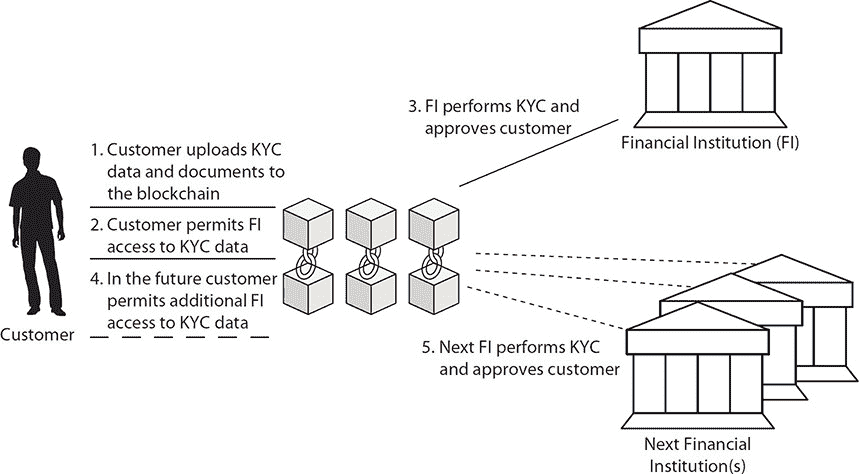
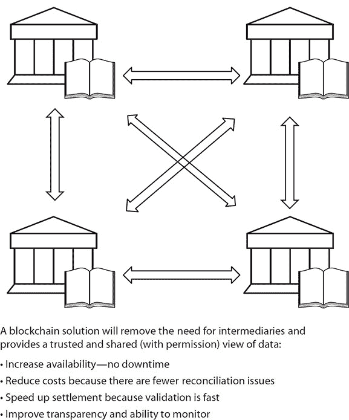
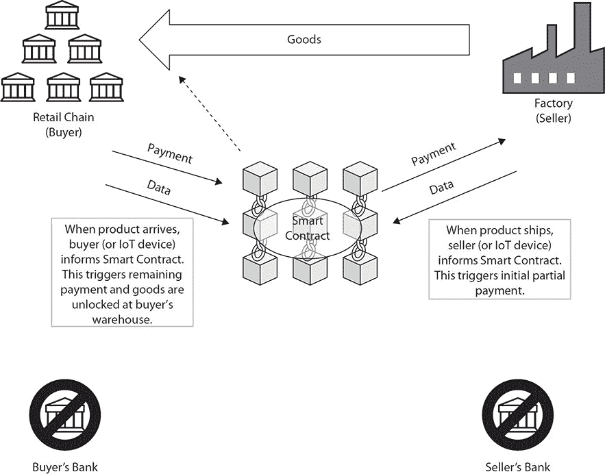
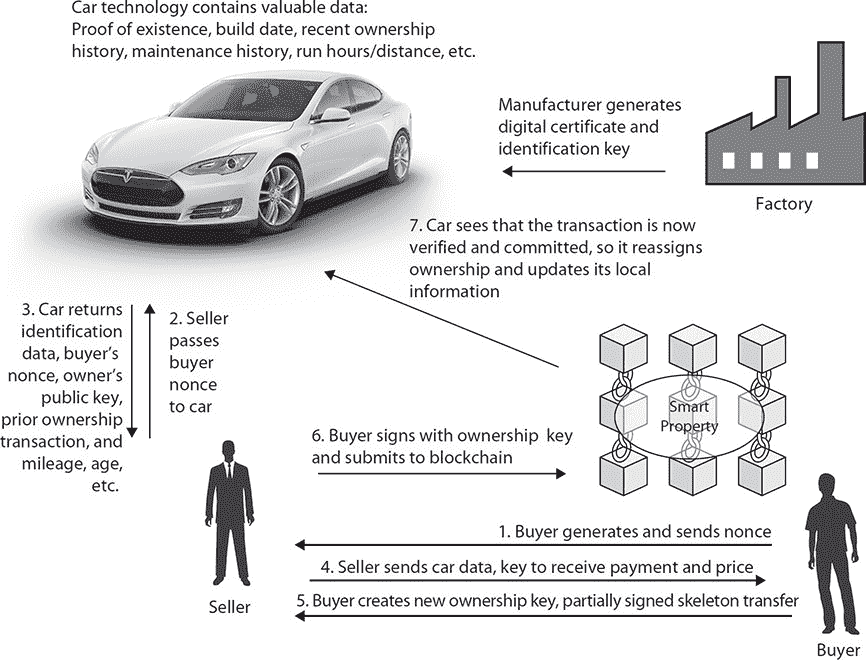
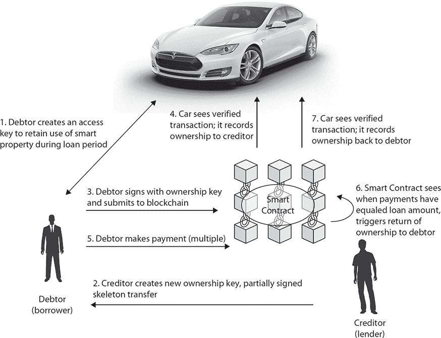
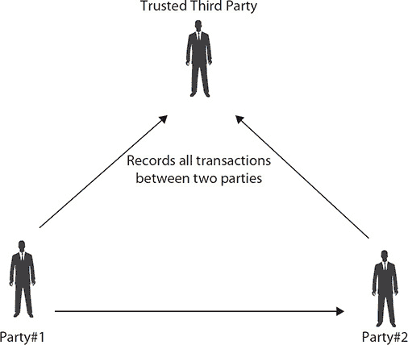
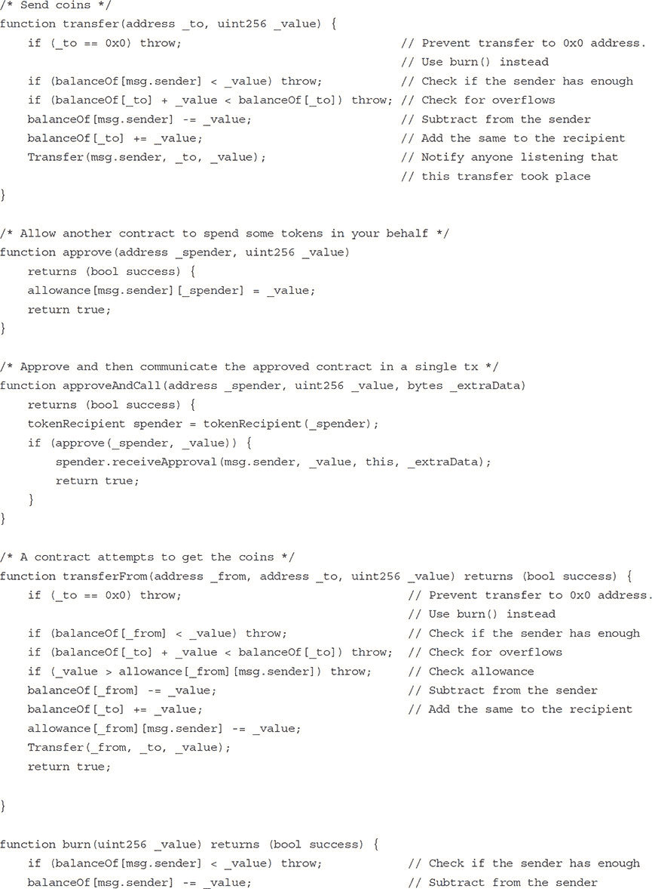
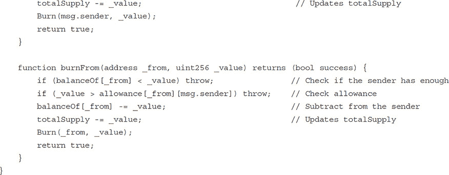
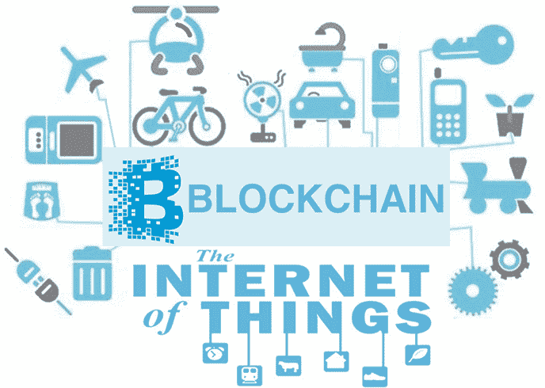

## 2  商业应用案例

### 货币和代币

当一个关于区块链的对话开始时，它不可避免地转向加密货币这个主题，而且很快就会谈到第一个也是最为广泛知名的一个，比特币。让我们更深入地了解一下加密货币以及它们与区块链的关系。但是首先，让我们回顾一下区块链的本质以及为什么它适用于加密货币和代币：

• 它包含网络上所有交易的证明。

• 事实/真相是永久的；一旦提交，它们无法更改。

• 它可以比作链表；这有助于证明完整性，因为每个被验证的区块都指向之前的区块。

• 挖矿过程（针对 Bitcoin）验证、核实并提交区块。

• 自动复制因此具有高可用性和弹性，有助于克服任何参与节点的故障。

• 如果它变得损坏或丢失，重建本地副本非常简单。

#### 加密货币

加密货币是什么？一个浏览器搜索将提供类似以下内容的成果：

“一种数字资产，其中使用加密技术来规范货币单位的生成和验证资金的转移，独立于中央银行运行。”

“一种通过加密的点对点传输，并通过称为挖矿的过程在公共账本上确认的分布式数字货币。”

那么这意味着什么呢？本质上，加密货币是一种数字（电子）货币，记录在账户和交易（转账）之间的 peers 的账本中，使用一种加密和验证方法。与由发行它的政府支持其价值的法定货币不同，没有中央管理机构。当比特币—第一个和最知名的数字货币—被创建时，它的供应量被限制在 2100 万个硬币。然而，并非所有这些都在第一天就投入流通；它们通过一个复杂的挖矿过程逐渐进入流通。挖矿本质上是一个验证、核实和提交的过程。一旦所有的比特币都被挖出，就不再有硬币加入流通。预计到 2018 年初，将有 80%（或 1680 万）被挖出并进入流通。

##### 加密货币的爆发

对 Bitcoin 的搜索将揭示它在 2009 年成为了第一个去中心化的加密货币。自那时以来，已经创建了无数的加密货币。实际上，在撰写本文时，有超过 700 种加密货币可供使用，其中几十种甚至达到了超过 1 亿美元的市值（参见表 2-1）。尽管与法定货币相比，这些加密货币的市场份额仍然很小，但它们继续发展并变得越来越普及。

**表 2-1** **市值前 10 的加密货币**

##### “真实”现金的未来

在我们心中几乎没有疑问，我们所知道的现金最终将不再存在，在消亡的过程中，其使用将受到越来越多的限制，最终实际上不再被使用。时间框架可能超过十年，但也可能更早。想想看：你今天用现金做什么？借助我们的智能手机，我们可以使用应用程序支付曾经只用现金购买的日常物品，比如上班途中买的早餐或咖啡。我现在（保罗）用现金最常见的是小费和从报摊（对我来说，写报摊真有趣，因为我已经好几年没买过真正的报纸了，但每次我去那里时，它们仍然在那里）买口香糖或清新呼吸的薄荷糖。

现在想想这个：与我们所熟悉的现金相比，我们已经开始接受各种越来越便利的支付方式，这些都是数字时代的产物。如前所述，我们可以使用信用卡或移动应用。所有这些非现金支付方式都有各种各样的激励计划（奖励、折扣和现金返还）。这很容易理解，而且似乎是个好主意，因为我们大家都喜欢感觉到我们用辛苦赚来的钱得到了回报。如果你回溯几年前，用信用卡购买总金额低于 20 美元的商品是不常见的。现在，我们几乎所有时候都不用现金支付。当然，还有一些地方会贴出半成品的道歉声明，声称信用卡或借记卡的最低消费额为 10 美元（见图 2-1 中这些通知的几个例子），但现在使用非现金支付方式的障碍要少得多。我们想退后一步，指出一个对许多人来说非常明显的事实：当现金最终消失时，我们将通过第三方支付一切费用。无论是银行（及其信用卡和借记卡）还是移动应用（苹果、谷歌、三星、Venmo 等），这些第三方和政府仍然可以控制、监管并最终查看这些支付。

**图 2-1   信用卡/借记卡最低消费**

让我们来看看加密货币与第三方模式相比如何。首先，它们是公共网络，对所有人开放。你无需获得加入网络的许可。创建这些加密货币应用的参与者无需获得创新许可；他们可以自由创建新应用，并且这些应用会立即运行。没有中央控制。这并不意味着用户无能为力，而是所有参与者共享权力。我们认为加密货币在替代真实现金方面发挥着重要作用。你想要用一个由政府和企业组合运行、控制和监督的数字等价物来替代现金吗？还是想要一个任何中央实体都独立的数字等价物？毕竟，银行是一个应用；它真的需要一个机构吗？

### 数字代币

在围绕区块链的讨论中，常见的讨论点之一是代币，更具体地说是数字代币。数字代币可以是任何种类的数字资产，或任何物理资产的数字表示。在以太坊中，数字代币可以代表任何可替代、可交易商品，如货币、奖励积分、礼品券等。所有基于以太坊的代币都以一种标准方式实现基本功能，称为 ERC20 代币标准。这些代币与任何依赖和使用相同标准的客户端或合约保持兼容。

数字代币的重要性在于，近年来是风险投资公司和机构投资者投资于数字货币初创公司，总额约为 10 亿美元。这是初创公司筹集资金的典型方式之一。传统上，公司通过三种方式筹集资金：

•  **股权**  公司出售股份（所有权）以换取资金。

•  **债券**  公司借款，并承诺支付本金和利息。

•  **预售产品或服务**  公司接受一个不存在、未完成或尚不可用的产品或服务的订单和付款，如活动门票、移动或控制台游戏，或 Kickstarter 项目。

采用这些传统方法，政府实施了更严格的监管，以防止投资者被骗子和小偷诈骗。

这些数字货币初创公司在资金方面发生了什么？一种新方法，称为首次币发行（简称 ICO，从 IPO，首次公开募股而来），为一家公司或项目提供了另一种筹集资本的方式。这些新项目通过在区块链上进行众筹创建并出售自己的数字货币来筹集资金。这种方法的一个有趣方面是，这些代币是正在创建或开发的公司/应用程序中使用的货币。应用程序的开发者（或贡献者）用这些代币支付。需要时，这些代币可以按现行市场汇率兑换成任何货币。这确实提供了使用去中心化商业模式（DBM）创建和启动项目的能力。在筹集资金的去中心化方法与传统的中心化方法之间存在显著差异和分歧。实际上，这些 ICO/DBM 项目创建自己的金融生态系统，以推动项目的发展、创新和交付。

这种模型在多个方面都是去中心化的。没有中心控制结构来限制或阻止参与；它由所有参与者共同贡献和拥有。这种商业模型由已经建立的平台促成——互联网和加密货币。这真的是第一次尝试，看起来是区块链及其将在其上运行的应用程序的未来模型。然而，非常重要的一点是，这些代币的结构要以防止它们受到监管审查的方式进行。当监管机构审查这些安排时所应用的主要测试来自美国最高法院的*证券和交易委员会（SEC）诉 W. J. Howey 公司*案。这个 1946 年的案例确立了判断一个安排是否涉及“投资合同”的测试。这个案例涉及一份土地销售和服务合同，法院维持这是一份投资合同（换句话说，一份证券）符合 1933 年证券法的规定。就区块链上的代币而言，要让数字代币被视为投资合同（证券），以下三点必须是真的：

1.   资金投资

2.   在共同的企业或商业活动中

3.   主要期望利润来自于他人的工作

一份完整详细的文件可在[`www.coinbase.com/legal/securities-law-framework.pdf`](https://www.coinbase.com/legal/securities-law-framework.pdf)找到，该文件试图制定一个过程和最佳实践，以帮助应用程序构建者——即那些希望向公众创建和销售代币的人——避免这些代币被归类为金融证券。

### 金融服务应用案例

区块链将继续变革金融服务行业，因为它可以提供一些优势和特性，如更快的吞吐量、降低成本、减少错误、透明度以及许多“性”——质量、可靠性、简单性和可追溯性。那些找到采用和应用区块链技术的方法的金融机构将获得更快上市时间和降低成本的竞争优势。现在，我们将研究用例，向您展示区块链如何应用于金融服务行业的现实挑战。

#### 了解你的客户（KYC）用例

问题：了解你的客户（KYC）是金融机构收集有关客户信息的过程。该过程的主要目的是确保机构的服务不被误用，且当客户开户时进行此过程。由于每个金融机构都负责遵守当地监管机构制定的具体要求，因此该过程会有所不同。该过程通常需要客户和金融机构之间反复交换文件。几乎没有任何自动化；金融机构投入大量资源用于该过程，但仍然非常耗时。这些延迟对希望立即使用机构服务的客户来说非常令人沮丧。那么区块链技术如何提供帮助？请参阅图 2-2 的区块链解决方案。

解决方案：客户的个人信息、KYC 文件和数据被加密并添加到区块链的一个区块中。该区块通过在网络上运行的共识模型进行验证。当客户第一次想要在银行或金融机构（FI）开户时，该金融机构会引导他们到他们的区块并授权他们访问。金融机构可以访问所有经过验证的 KYC 信息并推动客户完成开户流程。易于在金融机构之间和外部机构之间共享的单一来源 KYC（身份识别）数据最终将导致开户速度大大加快、资源减少，从而降低成本。在整个过程中，由于数据的所有者（客户）严格控制其访问权限，因此可以保持数据的隐私。最初，仍需要第三方角色（例如，初始银行），他们可能会因进行将信息添加到区块链的初步物理工作而得到奖励。这至少会在创建去中心化证明系统的过程中发生。

**图 2-2   了解你的客户（KYC）用例解决方案**

#### 资产管理结算用例

问题：典型的后台交易处理和结算方法可能显得笨拙、有风险且耗时。尤其是在涉及手工步骤时，比如在匹配和对账任务期间。价值链中的每个实体都保留其自己的交易副本或视图。随着新工具的开发和交易，这些流程正变得越来越复杂。简而言之，随着任务复杂性的增加和资源的投入，错误和相关的成本也在增加。请参阅图 2-3 以获取资产管理结算的解决方案。

**图 2-3   资产管理结算用例解决方案**

解决方案：交易可以存储在区块链上，并可供所有各方使用。这将大大简化并优化所有各方整个过程。这将导致交易生命周期的自动化，使数据管理更加容易，并提供透明度以及基础设施和资源的大幅减少。这些改进将导致最小的对账，并最终加快处理时间。尽管所有交易对每个人都是可见的，但可以安排和设置，使只有某些方知道这些信息。

#### 保险索赔处理用例

问题：你是否曾经需要对一份保险单提出索赔？如果你有过这样的经历，那你就能理解这个问题。索赔过程复杂且常常耗时较长。保险合同通常难以理解，因为随着时间的推移，它们已经演变成一个复杂的法律语言网络，以应对之前不利的结局。所以当你需要提出索赔时，完成整个过程需要一段时间。保险公司由许多独立的部门组成，如承保、政策发行和管理、索赔、精算和统计、会计、投资、法律和审计。当你加上手工流程、遗留模型和数据元素不连贯时，再加上每天大量的欺诈性索赔，合理推断与客户结果关联的通常不是“快速”这个词。请参阅图 2-4 以了解保险索赔处理的解决方案。

**图 2-4   保险索赔处理用例解决方案**

解决方案：在区块链上使用智能合约创建保险政策。智能合约（控制、透明度和可追溯性）的特性将实现更多自动化。智能合约将为客户和保险公司提供一种开放、快速且无争议的管理索赔方式。合同（政策）上传到区块链并由网络验证。同样，索赔随后上传到区块链并应用于智能合约。也就是说，区块链无法访问其网络外的数据。这些数据可以表示外部条件，如温度、付款、价格变动或 RFID 存在触发。预言者（或数据提供商）是为智能合约设计的三方服务。预言者提供必要的外部数据并将其推送到区块链。然后，合同和网络将能够验证并执行索赔，并自动拒绝或接受它。当满足正确的条件时，将自动触发支付。

#### 贸易金融（供应链）用例

问题：*贸易金融*是指与贸易应收账款融资和全球贸易相关的国内外金融交易。贸易金融是所有全球银行的核心业务职能，尤其是第一级银行。鉴于其重要性，它仍在其技术应用上落后，并且仍然依赖于非常手动的过程来处理其基于文档的流程。这导致了商业周期的中断，缺乏透明度使金融犯罪有机可乘。许多方之间的供应链复杂、分散且缺乏信任，因此它们非常缓慢，需要许多第三方（如银行和清算所）来促进信任方面，并允许商业供应链流动。请参阅图 2-5 以获取供应链金融的解决方案。

**图 2-5   贸易金融（供应链）用例解决方案**

解决方案：区块链将在智能合约中保存所有必要信息，信息即时更新，网络上的所有成员均可查看。智能合约可用于自动化商品和货币的所有权转让。这种自动化和网络验证消除了需要第三方设施，如信用证（LCs），并将有助于简化整个流程，通过消除第三方及其相关费用来明显降低成本。应用智能合约将导致：

缩短循环时间。减少和消除人工干预使流程更加高效，从而大大缩短循环周期。

减少了欺诈行为。分布式账本中开放且可审计的交易能减少或消除供应商欺诈。

•   降低成本和费用。共享账本可供所有银行、评级机构和供应链中的供应商参与，降低处理和存储成本及费用。网络中机构之间的支付可以通过加密货币进行。这将消除需要高成本的第三方支付网络的需求。

#### 全球支付用例

问题：将钱从一国的一方转移到另一国的另一方可能需要数天时间。全球支付业务是一个庞大、缓慢、成本高昂且容易出错的行业。它还吸引那些希望参与洗钱的人，因为它并不完全可追溯。参见图 2-6 以获取跨境支付的解决方案。

**图 2-6   全球支付用例解决方案**

解决方案：区块链支付技术可以在以下方面为该领域增加巨大价值：（a）将多日的支付周期缩短到实时，（b）提高货币兑换效率，（c）提供透明度以提高反洗钱能力。除了比特币，还有其他几种加密货币解决方案在支付领域越来越受欢迎，尤其是 Ripple 网络和 Ripple XRP。桑坦德银行成为首批将区块链应用于支付的银行之一，通过他们的应用程序，客户可以进行 24 小时内到账的国际支付。区块链最终将实现实时支付，同时降低运营成本、人为错误和欺诈行为。

#### 智能财产

智能财产确实是智能合约扩展到包括物联网在内的实际互动世界的延伸。我们将在本章后面介绍智能合约，但你可以自由地跳到前面去阅读有关内容，然后再回到这一节。

我们都曾看到（或者，如果没有，肯定也读过关于）实际物体与互联网相连的情况。例如，在家庭自动化中，智能家居有智能灯泡、智能锁和智能冰箱以及智能烤箱。所有这些物品之所以被称为智能，是因为它们内部嵌入了计算机技术，以某种方式可编程，并且与互联网相连。所以，在灯泡的情况下，它可以被定制、安排，并远程控制。参见图 2-7 以获取智能财产的其他示例。

**图 2-7   智能财产**

智能财产都是关于使用区块链网络来拥有、访问和控制事物的。智能财产可以存在于物理世界中，如车辆、平板电脑，甚至是房地产。在虚拟（非物理）世界中，智能财产可以是一种金融工具、商标、版权或专利。使财产智能化的真正优势在于，它可以通过近乎无信任的方式进行交易、访问和控制，从而降低成本和欺诈行为。这将打开并扩大商业范围，使一切变得更加竞争激烈，同时成本更低。想想这个：智能财产可以用作借款人在从贷款人那里借款时使用的抵押品，借款人使用智能合约从贷款人那里借款。我们设想区块链将成为未来库存、跟踪和交换资产的工具。

#### 智能财产所有权的转移

虽然存在简单的智能财产形式，比如汽车点火器和汽车钥匙的组合，但未来需要更先进的形式，以允许所有权的转移。我们现在将精炼一种智能财产方法，用于汽车的所有权。当制造商建造汽车时，汽车会被赋予一个由制造商签名的数字证书和一个包含证书公共部分的识别密钥。汽车内置了足够的技术，使其能够提供有效的存在证明，以及其他像所有权、建造日期、维护历史和行驶距离或使用时间等有价值的数据。汽车还将包含一小笔加密货币(*C*)，存放在所有权密钥上，以方便未来的转移。参见图 2-8 一个关于智能财产所有权转移的示例流程。

**图 2-8   转移所有权**

现在让我们看看汽车出售时涉及的步骤：

1.   买家生成一个随机数（nonce）并将其传递给卖家，以换取汽车数据。

2.   卖家取买家的随机数并将其传递给汽车（可能通过触摸屏或卖家手机上已与汽车配对的应用程序实现）。

3.   汽车返回一个包含买家随机数、汽车公钥、任何相关数据（里程、年龄等）、当前所有者公钥以及先前所有权交易详情 signed（通过识别密钥）的数据结构。这个数据结构为买家提供了足够的信息，让他们知道他们购买了什么以及卖家的身份。

4.   卖家确定接收付款的密钥(*SellerKey*)和所需的价格(*P*)。

5.   买家生成一个新的所有权密钥(*BuyerKey*)，并创建一个包含一对输入和一对输出的骨架转移交易。注意，由于只有输入#1 被签名，这个交易是完全有效的，也无法完全执行：

•   输入#1 是 P 个加密货币的签名条目。

  • Input#2 识别所有权密钥（持有 C 加密货币）。

  • Output#1 是一个发送 P 加密货币到 SellerKey 的指令。

  • Output#2 是一个发送 C 加密货币到 BuyerKey 的指令。

6.   买家将这个部分签名的交易回传给卖家。卖家用汽车当前所有权密钥签署 Input#2，将交易提交给区块链，并等待它被验证。

7.   买家带着经过区块链验证的交易 presenting 汽车。这是交易区块头的一个 Merkle 分支散列以及足够的附加区块头，以填补从汽车当前所有权交易到汽车的 gap。汽车看到新交易重新分配了所有权并更新了其所有权信息。

8.   现在买家拥有这辆汽车。

如我们之前提到的，很可能会有一个触摸屏在智能汽车里，以及买家和卖家手机上的一个应用，以促进身份验证和转移。高度可能的是，我们的智能手机与我们的生活变得更加密不可分，甚至成为我们智能财产的钥匙的一部分，还有一些生物识别或其他认证/授权方法。

#### 使用智能财产作为抵押品

在转移智能财产所有权是一个明显的必需时，以其他方式使用它也将是可能的。例如，如果你能利用你的智能财产并将其用作另一份合同中的抵押品怎么办？这并不是转移所有权，尽管未能履行合同的处罚可能导致智能财产所有权的转移，但在它被用作抵押品时，你很可能会想继续使用智能财产。将其象征性地放在一个抽屉里，它在合同期间什么用也没有，这有什么意义呢？所以，让我们用一个例子来稍微具体化一下这个问题。你想借钱。作为交换，借钱给你的人希望你有东西作为偿还贷款的担保，在违约事件中会被没收。你拿你的智能财产作为抵押品，但麻烦的是，在贷款期间你仍然想使用智能财产。参见图 2-9 一个关于使用智能财产作为贷款抵押品的示例流程。

**图 2-9   使用智能财产作为抵押品**

那么我们实际上会怎么做呢？如我们之前所说，智能财产可以管理所有权、访问和控制。这些都是基本功能。在这个场景中，我们将使用在贷款期间为贷款合同编程的所有权和访问状态的能力。以下是使用智能财产作为抵押品的贷款合同可能设置的高级概要：

1.   债务人创建一个智能财产的访问密钥，以便他们在贷款期间保持支付的情况下继续使用它。

2.  债权人生成一个接收还款的密钥(*CKey*) (*LAmt*为贷款金额)。

3.  债权人生成一个新的所有权密钥(*OKey*)，并创建一个包含三个输入和两个输入/输出的骨架转移交易(*Tran*)。债权人将这个交易传给债务人。注意这个交易并不完全有效，不能完全执行，因为只有两个输入被签名：

•   Input#1 是 LAmt（贷款金额）的签名条目。

•   Input#2 标识还款金额（最初为零）。

•   Input#3 标识当前所有权密钥（智能财产）。

•   Input/Output#1 标识 DKey 以及将 LAmt 发送到 DKey 并分配智能财产所有权的指令。

•   Input/Output#2 用 OKey 签名，并指令在还款时将所有权分配给 DKey。

4.  债务人用所有权密钥签名 Input#3，用 DKey 签名 Input/Output#1。

5.  债务人通过向 Input#2 添加金额来偿还贷款。

6.  当交易 Input#2 的值达到 Input#1 的值时，执行收回智能财产所有权的指令。

此合同会附加一些额外条件，即时间限制。如果贷款在一定时间内未偿还，债权人可以撤销访问令牌，因为他们拥有所有权密钥。然后智能财产可以被债权人使用或出售以偿还贷款金额。现在让我们来看看智能合约本身。

### 区块链上的智能合约

区块链技术处理本章及整本书中提到的加密货币和代币；它是组织和管理关系的新方式的基础平台。这些包括法律关系和合同。为了最能解释智能合约是什么，我们首先必须深入了解信任问题。

#### 信任问题

信任问题自时间的起点就存在。为了进步，一个社会或一群人必须彼此合作。当人们合作时，他们集体能做的事情比单独行动时要多。然而，在这样做的同时，他们也把自己置于被欺骗、被误导和随后失望的风险中。为了试图解决这个问题，社会已经建立了仪式，通过了法律，甚至安装了治理流程。所有这些复杂的技巧都是为了应对信任问题。为了更好地解释信任问题，让我们用一个例子来说明。一个人经常使用他的信用卡支付商品和服务。他可以走进一家商店，挑选一件商品，走到收银台，用信用卡付款。商店允许这次购买，因为当信用卡被刷卡或插入芯片读卡器时，它会与银行核对，看看消费者是否对他们来说是一个好的风险，授权购买并确认他是持卡人。银行会在后来向消费者账单时实际收取付款。所以，你看，到处都是信任。商店信任银行和消费者，银行信任商店和消费者，消费者信任商店和银行。消费者可以携带一小块塑料而不是一叠现金。如果他丢失了卡片，他可以在几天内更换它。如果他必须携带等值的现金，他可能会丢失或被抢劫，而且永远也拿不回来。有了信任元素，购买商品变得更简单，这对商人也有好处，因为他们总是希望并需要卖出更多的商品。随着支付障碍的降低，商业活动大大增加。这使我们回到原来的观点，即信任是合作的基础，进而导致进步。

##### 可信第三方

解决信任问题的一种方法是使用可信的第三方。上面提到的银行和信用卡的例子就是这样。客户、商人和消费者之间的交易是通过一家银行（信用卡发行商）传递和记录的。银行促进交易；参见图 2-10，这是一个显示可信第三方的图表。如果客户在每月的对账单上发现他们没有进行的交易，银行还可以介入并解决争议。

**图 2-10   ** 可信第三方

#### 分布式账本和共识

我们刚刚描述的解决信任问题的方法仍然是一种集中式的方式。还有一种方法是使用分布式账本（或共享账本）并结合共识机制来解决问题。图 2-11 展示了账本在多方之间分布式的情况。因此，你不是将交易记录在一个单一的第三方，而是将每个交易的单份副本发送给网络中的所有方。网络中的所有方都需要保持一个持续更新的交易账本。因此，网络中的每个方都会有完全相同的交易集合。在某个时间点，每个人都清楚消费者欠商家多少钱。如果发生争议，账本维护者网络的共识多数（51%）将决定他欠多少钱。

**图 2-11   分布式账本和共识**

区块链技术遵循这种分布式账本和共识方法。它是一个通过分布式（去中心化）和公开可验证（开放）账本来解决信任问题的网络。

#### 区块链详解

区块链利用和结合了计算机的网络能力与加密技术来存储和处理数据。网络上的任何计算机（称为节点）都可以位于任何有互联网连接的地方。这实际上是智能计算资源向云的外包。这些资源为开发者提供了一个构建应用程序的平台。这可以与其他现有的平台即服务（PaaS）相媲美。区块链平台记录、处理、保存和验证交易。因为它基于共享账本的概念，网络上的每一个节点都存储着账本的相同副本，因此平台上的所有交易都会被记录。正是账本这种去中心化（共享）的特点使得区块链成为管理存储交易记录的公共、全面、持久和可验证的权威。让我们来看一个共享账本如何工作的例子。

在这个场景中，有两个想要交换货币的双方，甲方想要给乙方 100 个加密货币。就像在现实世界中一样，每个参与者都需要一个地方来存放他们的加密货币——一个数字钱包。如果甲方知道乙方的地址，他们就能创建一个交易，将 100 个加密货币转给乙方。这笔交易被添加到一个临时数据块中，然后存储在网络上。这个数据块包含了网络上一段时间内发生的所有交易，例如，过去几分钟内的。虽然它被记录在网络上，但这个数据块还没有被验证。一旦过了一段时间，临时数据块中收集的所有数据将被汇总，网络上的参与者将进行一次竞赛。竞赛的胜者负责处理和验证数据块中的交易，并将其添加到区块链的永久记录中。一旦他们这样做，胜者将工作证明广播给整个网络；每个节点然后检查工作证明是否正确。如果 51%的节点同意证明是正确的，这个数据块将被作为永久的数据块添加到区块链中。

尽管区块链经常被称为一个无需信任的系统，但这真正意味着的是，由于一切均由平台技术处理，所以无需对任何人类互动产生信任。这里唯一有趣的是，网络上的参与者将自己的计算资源投入到这个过程。他们这么做的动机是什么？获胜的参与者将得到底层平台的原生数字代币——也就是说，胜者会得到一枚新铸造的加密货币。那么，你准备好将你的家用电脑投入到区块链网络，成为一名矿工了吗？再想一想：想要赢得竞赛，需要大量的计算资源。其中一些参与的最大公司或实体位于中国，那里的电力是政府补贴的。这种胜者通吃的做法本可以以更加平等的方式进行，所有参与者本可以共享奖励，但或许正是这种竞争使得该平台取得了成功。或许未来的平台会重新审视奖励机制，看看是否有其他方式可行。

##### 智能合约

在现实世界中，合同是双方之间的协议，旨在通过法律强制执行。在这些合同中，有协议规定了各方应如何履行合同。在两方合同中，这可以比作亚里士多德的三段论，也就是说“如果这是真的，那么接下来会发生什么，否则会发生什么。”如果一方未能履行其义务，他们可以被诉诸法庭，并被命令履行义务或向另一方提供经济补偿。在计算机编程术语中，这些亚里士多德三段论是通过“如果…那么…否则…”结构实现的。智能合约是将这些条件之一或多个与自动执行义务的能力相结合的。分布式账本系统包含所有数据和理论上智能合约自主执行所需的必要能力。所需条件编码在智能合约中，一旦满足这些条件，合同义务将自动执行。在这种情况下，尽管没有法庭或调解的必要——事实对合同是可见的，所以它不可能做出错误的决策。

##### 智能合约示例

以下是在以太坊生态系统中代表数字代币的示例代码。代币可以代表任何可替代和可交易的产品。这可以是货币、客户忠诚度奖励、证书等等。由于数字代币以标准方式实现一些基本数据和功能，它们将以一致的方式运行。如果您使用此代码，代币（因为符合 ERC20 标准）将立即与以太坊钱包和其他使用相同标准的客户端或合约兼容。

**清单 2-1   Ethereum 智能合约代币（ERC20）示例**

### 区块链物联网协议项目

物联网（IoT）是一个热门词汇，毫无疑问，它是一个未来增长潜力巨大的行业。根据 Gartner 的数据，到 2020 年，连接的设备数量将超过 200 亿，市场规模将达到 3 万亿美元。一个连接的设备可能只是一个简单的传感器（比如运动探测器）或者复杂的家电（比如房子、汽车、船只、飞机），如图 2-12 所示。图 2-12 物联网设备最大的担忧之一是安全性，这可以分为两个方面。第一个方面是防止未经授权访问设备本身，第二个方面是防止未经授权访问与设备交换的数据。

**图 2-12   物联网示例的图形描述**

此外，就像所有其他数据处理任务一样，采用集中式方法最终会遇到可扩展性问题，尤其是考虑到这些设备上预计会有数十亿笔交易。集中式服务器也可能容易受到单点故障的影响，使得这些设备容易受到拒绝服务攻击，攻击者会从世界各地的被攻陷设备向服务器发送大量流量。如果从一开始没有为处理敏感任务的物联网系统构建弹性架构，这些系统就会受到此类攻击的影响。正是在这种背景下，区块链技术被提出作为物联网挑战的解决方案。每个设备都将继续管理和监督其自身行为、安全角色以及与其他设备互动的规则。区块链将成为促进这些设备之间交易和协调的平台。区块链技术将使安全的网状网络得以建立。网络上的设备可以以可靠的方式互联，并防止使用伪装和/或仿冒等技术的威胁。如果每个有效点都注册在区块链上，这将为去中心化的身份验证和认证提供便利，并且网络可扩展以支持数十亿个预期的设备。

在 2017 年初，一群行业领先的初创公司和企业在一次峰会上齐聚一堂，讨论区块链和物联网创新所面临的挑战，以及是否有共同的集体努力来解决这些挑战。这次峰会是探索和建立基于区块链的物联网协议的第一步。会上有演讲交流了行业内的适用用例、研究成果和反馈，并认识到了共同的需求。该组织同意，安全性、互操作性和集成对于推广至关重要。展望未来，会议成员组成的财团将定义跨多个主要区块链系统的智能合约协议层的作用范围和实施细节。

想象一个世界，在这个世界里，你的洗衣机能够检测到你快要用完洗衣粉，然后自动与市场互动，协商最佳价格，并重新订购所需的产品。同样的情况也适用于你冰箱里的物品——牛奶、鸡蛋等等。这些智能设备会知道你的日程安排，如果你度假或离家一段时间，它们会推迟重新订购。我们相信，这些设备及其相关的智能合约在最初版本中可能会有一些初期困扰。作为这项技术的早期采用者，我们可以想象回到家时，会有一大堆大箱子的柔顺剂，足够用一辈子。但这些设备及其相关智能将迭代并针对大众市场做出改进。

### 总结

虽然区块链技术是比特币和以太坊等加密货币的核心，以及它们作为去中心化、无国界的货币和支付平台所能做到的事情，但它显然是一种在许多商业领域都有广泛应用潜力的技术。本章为金融服务行业的实际应用案例提供了一些深度。这些案例最终导致了更高的吞吐量、降低成本、提高准确性、更大的透明度以及质量、可靠性、简便性和可追溯性。本章还讨论了智能财产和智能合约，并展示了它们如何在区块链技术的不久将来中共同使用。本章以区块链和物联网（IoT）将如何有一个初创企业和公司的联盟来帮助定义和精炼连接设备之间的安全性、互操作性、管理和协调的方式结束。虽然物联网仍处于进化的早期阶段，目前主要由收集数据或允许远程监控和控制的技术组成，但随着设备变得更加智能并加入人工智能，这将发生变化。这个物联网将过渡成为一种自主设备相互交谈的网络，并且—希望—能够在不需要人类干预或解释的情况下做出明智的决定。简而言之，我们生活在一个区块链技术令人兴奋的时代。
