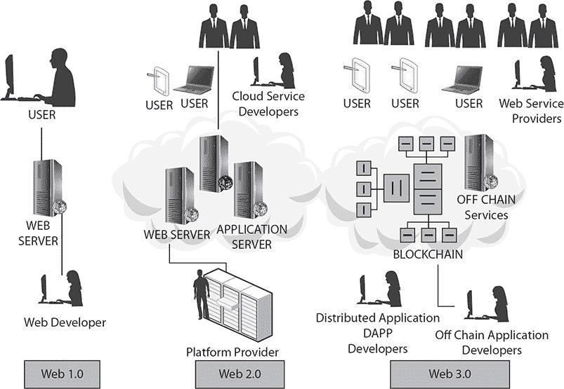
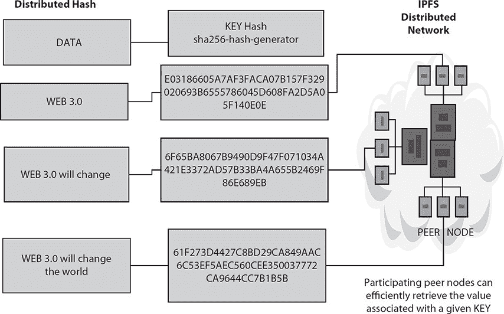
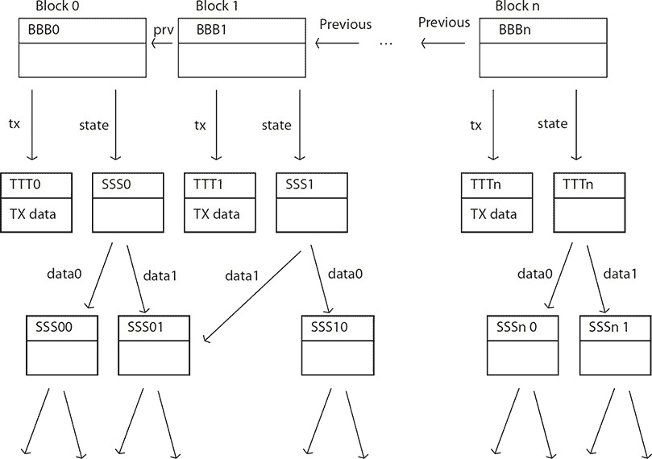
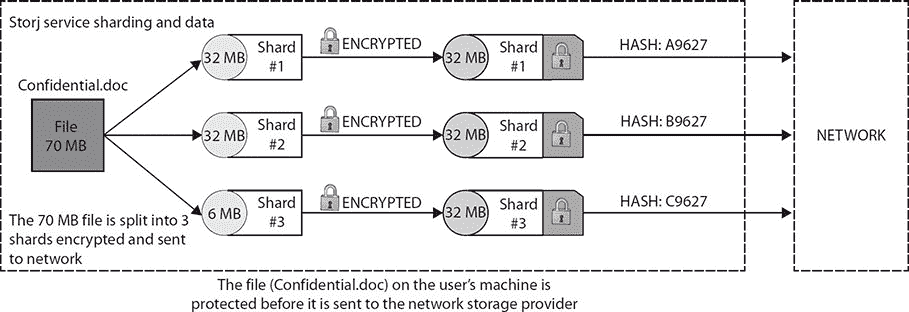
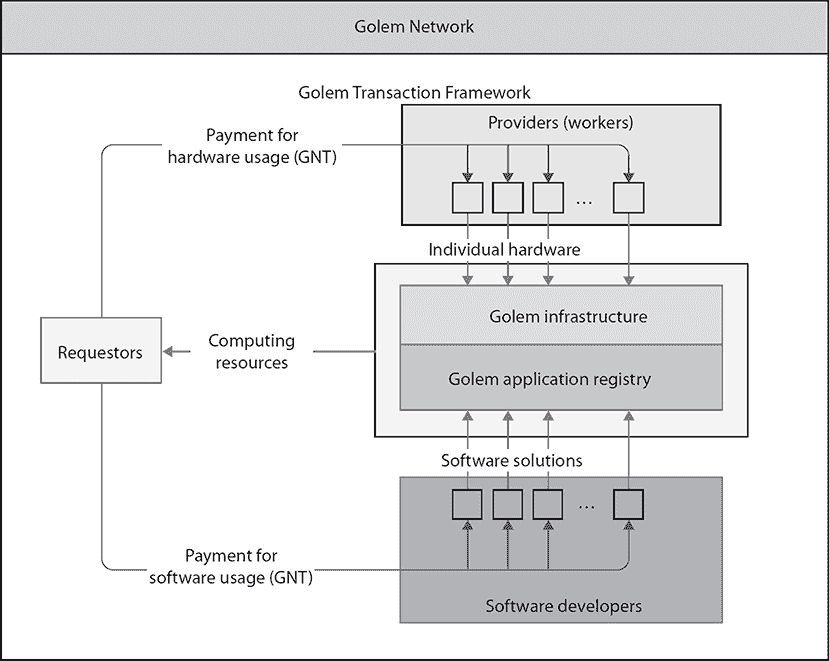
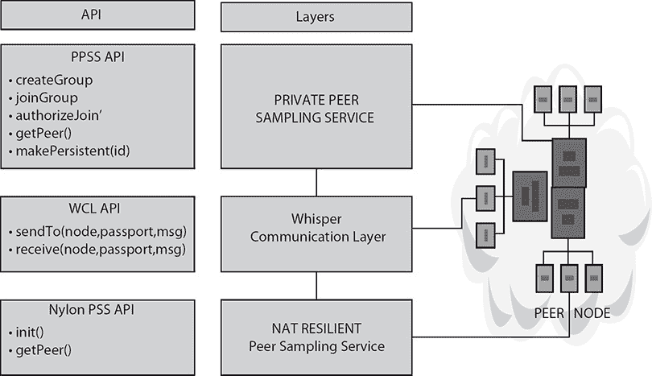
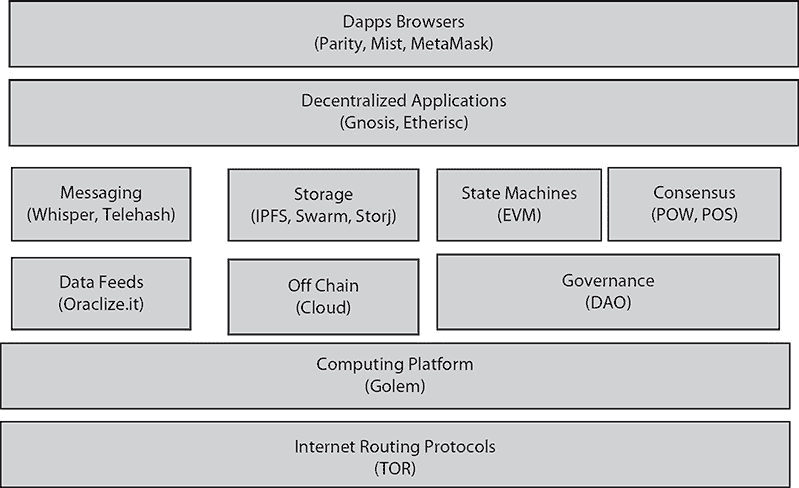

## 3   技术使用案例

在 20 世纪 70 年代，互联网是由 DARPA 计算机组成的小型、去中心化的集体，称为 ARPANET。随后兴起的个人电脑革命正是建立在此基础之上，激发了约翰·佩里·巴洛（John Perry Barlow）在 1996 年发表的《网络空间独立宣言》所蕴含的乐观情绪（[www.eff.org/cyberspace-independence](https://www.eff.org/cyberspace-independence)）。巴洛描绘了一个混乱的数字乌托邦，在那里“网民”自我治理，旧有的机构不再具有影响力。他写道：“代表未来，我要求过去的你们不要打扰我们。你们在我们聚集的地方不受欢迎。你们没有主权。”

这并不是我们今天所熟知的互联网。二十年后，大部分的通信都通过一组由少数几家大公司运营的中央服务器进行，这些公司受到该公司的影响以及其他机构的影响。例如，Netflix 现在占据了北美互联网流量的 40%。工程师们预见到了这种融合。在 20 世纪 60 年代末，为交换数据包而设计的系统的关键架构师们预测了中心化的“计算机公用事业”的出现，它将提供计算机服务，就像电力公司提供电力一样。今天，这一模式主要体现在亚马逊、谷歌、Azure 和其他云计算公司身上。他们以牺牲隐私为代价提供便利。互联网用户现在通常会接受服务条款，这些条款授权公司将用户的个人信息与其他机构分享，从广告商到政府。在美国，1986 年的电子通信隐私法（ECPA）允许执法机构在无需搜查令的情况下获取公民托付给第三方的私人数据，包括通过手机被动收集的位置数据和 180 天内已打开或无人看管的电子邮件内容。请注意，根据 ECPA，只需传票或 18 U.S.C. §2703(d)命令，就可以允许访问上述私人数据，而无需太多司法审查。正如爱德华·斯诺登泄露的信息所显示的那样，庞大的信息集合使得情报机构可以集中精力对少数关键目标进行监控，从而监控到世界大部分人口。美国国家安全局（NSA）监听谷歌和雅虎数据中心之间的连接，使该机构能够在公司网络中收集用户数据。美国云计算行业缺乏信任。NSA 通过与科技公司正式合作收集数据，在数据进入和离开美国时获取网络流量，并故意削弱加密标准。正如我们在这本书中主张的那样，解决办法是使互联网和云计算更加去中心化和分布式。对于隐私倡导者来说，如访问现在（accessnow.org），目标是让监控变得更加困难。当你将一个安全的、自托管的平台与正确实现的公钥密码学结合在一起时，就可以使 NSA 式的监听和网络入侵变得困难且昂贵。

虽然比特币和以太坊所使用的点对点技术并非新颖，但其实现却是一项突破性的技术成就。该系统的优雅性使得一些人产生这样的疑问：如果金钱可以去中心化并且某种程度上可以匿名化，我们是否可以使用相同的模型来应用于其他如存储、通信和计算等应用程序？随着章节的展开，我们将探讨这个问题，但请记住这将需要时间和努力，以及对现有基础设施进行大量的改变。自 1994 年万维网走向主流以来，我们见证了网络扩展到几乎涵盖了人类生活的每一个方面。互联网的基础设施以及建立在之上的服务是相互依赖的，一方通知另一方，随着新的服务使用案例和技术的出现。到目前为止，基于网络的服务和 Web 结构已经经历了两个清晰的代，但现在我们正在进入第三个代。

我们将探讨可能构成其基础的存储技术：去中心化存储网络 IPFS——星际文件系统——及其激励平台 Filecoin，以及使用 IPFS 的以太坊导向存储平台 Swarm。我们还将探讨去中心化超级计算机如 Golem，它们正在创建一个全球计算能力市场，以及如 Whisper 的消息系统，它促进安全和去中心化通信。这些技术和其他技术将成为新互联网的基础。

### Web 1.0 和 Web 2.0

Web 1.0 是 DARPA 的 ARPANET 的延伸，是新的想法的第一次迭代——在分布式客户端服务器想法失败后回归中心化。就在 Web 开始在华尔街商业中心使用之前，企业使用的个人电脑采用了“胖客户端”分布式设置，其中每个用户都在他们自己的机器上拥有所有应用程序代码和数据。“胖客户端”变得昂贵并且同步这些机器和数据是不切实际的。因此，企业内部网络开始出现，HTML 和 Java servlet 引领 Web 1.0 思想的实现：如果我们能通过全球网络——互联网——连接世界上所有的计算机，那么我们就可以进行交易和交换资产，为了人类的利益，使集体知识普遍可访问。为了使这批数据变得可使用，它需要被索引和浏览。这种必要性是导致第一代人世大战 Wide Web 创新的原因。Netscape 浏览器是用来搜索、查找和渲染响应数据的工具。

Web 2.0 进一步扩大了这种全球资源的运用。知识和内容的池子开始以极快的速度增长。表层网络数据自 2012 年以来增长了四倍。程序可以连接并使用网络来存储信息和彼此通信。中心化的中介机构，如谷歌，创建了大型数据库和消息系统，提供可扩展的资源和路由流量。尽管这些新的信息处理组织通过便利服务改变了我们的生活，但它们也利用其中心化地位谋求利润和权力。

这些中心化的中介机构（如谷歌）为了巨大的利润出售上下文相关的定向广告，给用户——内容生产者带来的仅仅是方便的消息接口。在他们的论文《Swap, Swear and Swindle: Incentive System for Swarm》中，Viktor Trón、Aron Fischer、Dániel A. Nagy、Zsolt Felföldi 和 Nick Johnson 将这种做法描述为：“我们给你可扩展的托管服务，它能应对你受众的任何流量，但你需要将对你内容的实质性控制权交给我们；我们将跟踪你受众的每一个成员，并尽可能多地收集他们的个人数据，我们将决定谁可以看到这些数据，谁不能，我们将主动进行审查，甚至可能因为同样的原因对你进行举报。”

所以归根结底，新媒体组织和内容生产者为他们的组织创造了巨大价值，而我们用户得到的回报却远不成比例。

为了进一步加剧问题，随着 Web 的增长，它受到了可扩展性限制的阻碍。中心节点或服务器需要增加带宽来处理不断增长的数据流。此外，使用 Web 2.0 技术提供的安全措施从未达到 Web 提供的新通信和商业服务所需的水平。我们看到数据泄露事件中，恶意的集团使用 SQL 注入和代码注入窃取我们的财务访问数据，并通过拒绝服务攻击使金融、零售和政府网站及其服务瘫痪，这些中心化的服务器几乎每周都会被攻陷。根据 Juniper Research 的数据，“消费者的数字生活和企业记录的快速数字化将在 2019 年将数据泄露的成本增加到 2.1 万亿美元，几乎是 2015 年泄露成本的近四倍。”（[`www.juniperresearch.com/press/press-releases/cybercrime-cost-businesses-over-2trillion`](https://www.juniperresearch.com/press/press-releases/cybercrime-cost-businesses-over-2trillion)）随着一系列新技术的出现，一个范式转变的舞台已经搭好。

### Web 3.0

遵循早期版本的趋势，并且为了解决我们描述的一些问题，Web 3.0 提出了内容与程序互动方式的变化。如果像谷歌这样的中央中介被移除，我们今天面临的许多问题也将随之消失。像比特币和以太坊这样的区块链技术使用公钥加密来保护程序和数据之间的连接和通信。这是对当今使用的中心发行的 SSL 证书的一种替代。没有中心中介路由流量，因此连接可以动态地找到通过互联网最有效的路径，并绕过拥堵或损坏。此外，关于未来 Web 3.0 的特征，有一个关于其特征的适当定义的争论。请参阅图 3-1，该图描绘了 Web 的演变、其参与者及其组成部分。

**图 3-1       Web 的演变**

对某些人来说，Web 3.0 是由语义网驱动的，人们可以快速轻松地访问链接信息。根据蒂姆·伯纳斯-李的解释，Web 3.0 将是一个“只读-写入-执行”的网络。让我们来看看将构成 Web 3.0 基础的两件事：语义标记和网络服务。语义标记指的是人类网络用户与计算机应用程序之间的通信鸿沟。在网络上呈现信息的一个最大的组织挑战是网络应用程序不能为数据提供上下文，因此实际上并不真正理解什么是相关的内容，什么是不相关的内容。虽然这仍在不断发展中，但这种将数据格式化为软件代理可以理解的形式导致了我们对“执行”部分的定义，并提供了一种讨论网络服务的方式。网络服务是一个旨在支持通过互联网进行的计算机对计算机交互的软件系统。网络服务是不针对特定供应商的。它们基于行业标准，并且可以使用标准 API（如 SOAP 或 REST）或任何其他新兴标准与所有设备进行交互。随着网络服务的使用和数量呈上升趋势，它们成为 Web 3.0 的一个关键组成部分。

通过结合语义标记和网络服务，Web 3.0 为可以直接相互通信的应用程序以及通过更简单界面进行更广泛信息搜索提供了潜力。但现在，随着基于区块链技术的去中心化网络的出现，并且由于它支持无中介交易，人们开始关注基于区块链信任特性的 Web 3.0。"读-写-拥有"的网络。在这里，用户拥有并参与拥有协议。它既点对点又机器对机器。并且适用于个人、公司和自主实体。例如，以太坊在不同的上下文中使用 Web 3.0 这个术语，与伯纳斯-李所暗示的上下文不同。它被提出为通过消除所有服务器需求来将内容与呈现分离。以太坊前 CCO 斯蒂芬·图尔定义了使以太坊与 Web 2.0 不同的原因是：“没有网页服务器，因此没有中间商收取佣金，窃取您的数据或将其提供给 NSA，当然也没有东西可以进行 DDoS 攻击。”向区块链分布式应用（dapp）的转变将在数年内发生。目前的技术无法处理高速交易，原因在后面的章节中讨论。

### 分布式存储系统

Web 3.0 面临的根本性开放挑战之一是有效的数据存储。社会经济价值和信息规模日益增长，Web 3.0 开发者一直在努力寻找确保数字存储数据持久且易于获取、可靠、安全、一致的方法。近年来，大量数据的生成与频繁的存储故障增加了分布式存储系统的普及，这种系统允许数据在不同地理位置的存储设备上进行复制。由于数据在多个宿主中分散，分布式存储系统面临的一个主要问题是当它们被多个操作同时访问时如何保持数据的一致性。

#### 星际文件系统

星际文件系统（IPFS）是一个分布式文件系统，它是由早期的点对点系统演变而来，包括 DHTs、BitTorrent、Git 和 SFS。IPFS 的贡献在于简化、演变和连接已验证的技术，形成一个单一的、大于其各部分之和的系统（参见[`ipfs.io/`](https://ipfs.io/)）。IPFS 为编写和部署应用程序提供了一个新的平台，为分发和版本化大型数据提供了一个新的系统。IPFS 甚至可能发展 Webb 本身。IPFS 是点对点的；没有节点是特权的。IPFS 节点在本地存储中存储 IPFS 对象。Viktor Tron 将其描述为“第三互联网的乐高积木套件”，IPFS 是为大量计算机存储数据的新系统。它是传输层不可知的，这意味着它可以通过 TCP、μTP、UDT、QUIC、TOR 甚至蓝牙进行通信。代替中心服务器，使用点对点网络来建立连接。IPFS 实现了一个分布式哈希表（DHT），提供类似于哈希表的服务：键值对存储在 DHT 中，任何参与节点都可以高效地检索给定键关联的值。维护键值映射的责任分散在节点之间，以使参与集合的变化造成最小的干扰。这使得 DHT 能够扩展到大量节点，并处理持续的节点到达、离开和失败。

##### IPFS 节点

节点之间相互连接并传输对象。这些对象代表文件和其他数据结构。IPFS 协议分为一系列子协议栈，负责不同的功能：

-   身份：管理节点身份生成和验证。

-   网络：管理与其他对等体的连接，使用各种底层网络协议。

-   路由：维护定位特定对等体和对象的信息。既响应本地查询也响应远程查询。默认使用 DHT，但可替换。

-   交换：一个新颖的块交换协议（BitSwap），负责高效块分布。建模为市场，弱激励数据复制。

-   对象：具有链接的内容寻址不可变对象的 Merkle DAG。用于表示任意数据结构，如文件层次结构和通信系统。

-   文件：受 Git 启发的版本化文件系统层次结构。

-   命名：一个自认证的可变命名系统。

-   应用可以运行在互联网上，利用 IPFS 的原则和特性，为商业应用创建一个 Merkle 链接的数据（对象和区块）网。

这些子系统并非独立存在；它们是集成在一起的，并利用混合属性。然而，分别描述它们是有用的，从底层向上构建协议栈。

公钥加密内置在节点寻址系统中，内容寻址用于索引内容。节点和内容地址都存储在一个名为 IPNS 的去中心化命名系统中。点对点网络中的节点持有私钥并发布公钥，与比特币或以太坊中的情况一样。节点地址是通过哈希它们的公钥得到的。这允许通过消息签名进行连接验证。它们的公钥可以用来在数据传输前加密数据，防止拦截和盗窃。今天的安全问题的解决方案内置在这个寻址系统中。不需要一个可信的中央证书发行商来提供连接验证工具，所有连接都可以默认轻松地加密。

##### IPFS 内容寻址

内容地址是通过哈希一片内容得到的。这个内容地址再次被哈希以得到一个键名（参见图 3-2）。键名与 IPNS（IPFS 地址注册表）中的人类可读名称相关联。今天，如果一个文件被移动，所有指向该文件的链接需要更新，如果它们想要解析的话。因为 IPFS 地址是从它们引用的内容派生出来的，如果内容在网络上任何地方仍然存在，链接将始终解析。这消除了任何内容重复的需要，除非是为了更大的持久性安全或为了扩展服务能力。那么我们如何增长一个去中心化的存储系统来替代当前模型呢？我们需要一种激励存储和提供内容的方式。Filecoin 是 Protocol Labs 正在开发的一个潜在解决方案。Swarm 是另一个由以太坊基金会正在开发的解决方案。这两个项目都利用了 IPFS 技术，但在如何激励参与方面有不同的哲学。

**图 3-2  通过哈希内容得到的内容地址的分布式哈希表**

所以，像提到的，IPFS 创建了一个 P2P 蜂群，允许交换 IPFS 对象。IPFS 对象的总和形成了一个通过哈希内容得到的内容地址的加密验证数据结构，称为 Merkle DAG，这个数据结构可以用来模拟许多其他数据结构。我们将介绍 IPFS 对象和 Merkle DAG，并给出使用 IPFS 建模的结构示例。

##### IPFS 对象

一个 IPFS 对象是有两个字段的数据结构：

•   Data: 大小不超过 256 kB 的无结构二进制数据块。

•   Links: 链接结构的数组。这些是链接到其他 IPFS 对象的链接。

链接结构有三个数据字段：

•   Name: 链接的名称

•   Hash: 链接的 IPFS 对象的哈希

•   Size: 链接的 IPFS 对象的总大小，包括跟随其链接

大小字段主要用于优化 P2P 网络，在这里我们将会忽略它，因为从概念上讲，它在逻辑结构中是不需要的。

IPFS 对象通常通过其 Base58 编码的哈希来引用。所有的哈希都以“Qm”开头。这是因为哈希是一个多哈希，意味着哈希本身指定了哈希函数和哈希长度在多哈希的前两个字节中。数据和命名链接赋予了 IPFS 对象默克尔有向无环图（DAG）的结构，以表示这是一个通过上述提到的使用密码学哈希来寻址内容的密码学验证数据结构。可以想象一个 IPFS 对象是一个节点包含数据，链接是有向图边到其他 IPFS 对象的图，其中链接的名称是图边的标签。各种数据结构可以由 IPFS 对象表示，例如，一个文件系统。IPFS 可以轻松表示由文件和目录组成的文件系统。

##### IPFS 小文件

小文件——其长度小于或等于 256 kB 的文件——由一个包含文件内容（加上一个小头和脚部）的 IPFS 对象表示，没有链接（即，链接数组为空）。请注意文件名不是 IPFS 对象的一部分，因此具有不同名称和相同内容的两个文件将具有相同的 IPFS 对象表示，因此具有相同的哈希。

• 使用 `ipfs add` 命令将小文件添加到 IPFS；有关所有命令，请参见[`ipfs.io/docs/commands/`](https://ipfs.io/docs/commands/)。

• 使用 `ipfs cat` 查看上述 IPFS 对象的内容。

##### IPFS 大文件

一个大型文件——其长度大于 256 kB 的文件——由一系列指向小于或等于 256 kB 的文件块的链接表示，并且只有少量数据指定该对象代表一个大型文件。指向文件块的链接名称是空字符串。

`ipfs add ucny_dir/bigfile.js`

##### IPFS 目录结构

目录由指向表示文件或其他目录的 IPFS 对象的链接列表表示。链接的名称是文件和目录的名称。

##### IPFS 版本化文件系统

IPFS 可以表示 Git 使用的数据结构，以允许版本化文件系统。Git 提交对象在 Git 书籍中有描述。提交对象的主要特性是它有一个或多个指向先前提交的名称 parent0、parent1 等链接，以及一个名称对象（在 Git 中称为树）的链接，该链接指向该提交引用的文件系统结构。

##### IPFS 区块链

现在让我们来看 IPFS 最重要的用例。区块链具有自然 DAG 结构，因为过去的区块总是通过它们的哈希从后来的区块链接起来。像以太坊区块链这样的更先进的区块链还有一个关联的状态数据库，该数据库具有树结构，也可以使用 IPFS 对象模拟。

正如我们在第一章中看到的，在一个简化模型的区块链中，每个区块包含以下数据：

• 交易对象列表

•   与前一个区块的链接

•   状态树/数据库的哈希

这个区块链然后可以在 IPFS 中如图 3-3 所示进行建模。

**图 3-3   区块链模型**

#### Swarm

Swarm 是一个分布式存储平台和内容分发服务，是以太坊 web3 堆栈的本地基础层服务。Swarm 的主要目标是提供一个去中心化和冗余的以太坊公共记录存储，特别是存储和分发分布式应用程序代码（dapp）和数据以及区块链数据。Swarm 和 IPFS 都为下一代互联网提供了高效的去中心化存储层的全面解决方案。它们的目标和技术使用都非常相似。因此，它们都适用于替换当前 Web 2.0 的数据层。它们都为 Web 3.0 愿景提供存储层，具有分布式文档存储所需的所有属性：

•   低延迟检索

•   高效自动扩展（内容缓存）

•   可靠、容错性运行，节点断开、间歇性可用性抵抗

•   零停机时间

•   抗审查

•   潜在的永久版本化内容存档

Swarm 的核心存储组件是一个不可变的基于内容的分片存储，而不是通用的分布式哈希，即 DHT。正如之前在图 3-2 所示，IPFS 使用 DHT。IPFS 和 Swarm 使用不同的网络通信层和节点管理协议。Swarm 与以太坊区块链深度集成，激励系统得益于智能合约和半稳定的节点池，而 Filecoin 则使用可检索性证明作为采矿的一部分。这些选择的影响深远。所以接下来，从终端用户的角度来看，Swarm 与 Web 2.0 并没有太大区别，只不过上传不是到特定的服务器。目标是创建一个具有上述属性（如抗 DDoS、零停机时间、容错、抗审查）以及对等网络存储和服务的解决方案，同时由于内置的激励系统使用对等网络会计并允许用资源交换支付。Swarm 旨在与以太坊的 devp2p 多协议网络层以及以太坊区块链深度集成，用于域名解析、服务支付和内容可用性保障。

Swarm 的两个主要特性使其与其他去中心化分布式存储解决方案（如 IPFS）区分开来，即“上传后消失”和激励系统。前者指的是 Swarm 不仅提供内容服务，还提供云存储服务。与相关系统不同，你不仅发布你托管内容的事实，而且有一种真正的感觉，你可以立即将东西上传到 Swarm 并可能消失（节点掉线、断开连接，或不存储内容而完全运营）。Swarm 旨在成为通用存储和交付服务，满足各种用例，从提供低延迟实时交互式网络应用程序，到为很少使用的内容提供保证的持久存储。激励系统确保遵循其理性自我利益的参与节点仍然趋向于一种有益于整个系统和经济自给自足的 Swarm 行为。特别是，它允许网络中的节点以最有效的方式汇集他们的带宽和存储资源，共同提供服务。

Swarm 的计划功能包括完整性保护、随机访问（范围查询）、基于 URL 的寻址、在虚拟主机上基于清单的路由、通过以太坊名称服务进行域名解析、加密支持、可能的否认性、带宽和存储激励措施、相关元数据、按需下载以太坊区块链状态/收据/合约存储、通过流行度自动扩展（弹性云）、自动同步、客户端可配置的冗余/可用性。基于 Swarm 的互联网需要为具有去中心化基础设施的 web3 用例提供解决方案，因此，广义上讲，它是一个旨在构建以太层第三个网络的有雄心壮志的项目。

Swarm 最初被构想为一个与以太坊智能合约生态系统互操作的存储协议。与 Filecoin 一样，它将利用以太坊的共识过程，以提供一个去中心化的现有客户端/服务器基础设施的替代方案。然而，激励持久存储是一个挑战。节点删除数据并失去一些收入的下限可能远远小于用户丢失其宝贵数据的上限。Swarm 采取的策略是奖励节点提供内容。由于更常请求的内容比很少请求的内容更有利可图，因此仅对回叫进行激励会促使节点丢弃很少访问的数据。未能存储大数据集中的每一个数据片段可能会使整个数据集变得无用，因此在这些情况下必须存在一种解决方案，以平衡这种不对称的下限。

使用内容回叫作为基本激励机制，并随机将内容分布到节点上，根据位置加权，使 Swarm 处于开始解决持久性问题的良好位置：

•   提供“承诺”存储或具有持久性承诺的节点必须首先提交一笔涵盖其提供存储时间的押金。

•  如果在期间数据丢失，押金将被没收。

•   Ethereum 的智能合约基础设施自动化了整个过程，使得“上传后忘记”的体验无缝衔接。

#### Storj

Storj 是一个协议，它创建了一个分布式网络，用于在节点之间形成和执行存储合约。Storj 协议使得网络上的节点能够协商合约、传输数据、验证远程数据的完整性和可用性、检索数据以及支付其他节点。每个节点都是一个自主代理，能够在不涉及大量人工交互的情况下执行这些操作。在 Storj 中，文件以加密的分片形式存储。分片是一种数据库分区技术，它将非常大的数据库分离成更小、速度更快、更容易管理的部分，这些部分被称为数据分片。单词“shard”意味着整体的一部分。因此，分片是存储在网络上加密文件的一个部分。分片在安全性、隐私、性能和可用性方面有诸多优势。在分片之前，文件应该在客户端进行加密。参考实现使用了 AES256-CTR，但可以使用收敛加密或其他任何期望的系统。这保护了数据内容，使其不被存储提供商或宿主数据的数据 farmer 所知。数据所有者保留完全控制加密密钥的权利，从而控制对数据的访问。数据所有者可以另外确保文件如何分片以及分片在网络中的位置的知识是安全的。随着网络上分片集合的增长，没有先验知识就定位到任何给定分片集合的难度呈指数级增加。这意味着文件的安全性与网络大小的平方成正比。分片大小是一个可协商的合同参数。为了保护隐私，建议将分片大小标准化为字节倍数，如 8 或 32 MB。较小的文件可以填充零或随机数据。

Storj 使用哈希链或有时被称为 Merkle 树的技术，来在文件被分解成块或“叶子”后验证其内容（参见图 3-4）。

**图 3-4   Storj 服务分片和数据传输**

标准化的尺寸阻止了侧信道尝试确定给定分片的内容，并且可以掩盖分片通过网络的流动。将大文件如视频内容进行分片，并将分片分布到节点上，可以减少内容交付对任何给定节点的影响。带宽需求在网络上更加均匀地分布。此外，终端用户可以利用类似于 BitTorrent 或其他点对点网络的并行传输。因为同伴通常依赖独立的硬件和基础设施，数据故障不是相关的。这暗示了创建分片的冗余镜像，或在对分片集合应用奇偶校验方案，是一种极其有效的保证可用性的方法。可用性与存储数据的节点数量成比例。所以，概括地说 Storj：

文件已被加密。

加密文件被分割成分片，或者多个文件被合并成一个分片。

对每个分片执行审计预处理。

分片可能被传输到网络上。

像 Storj 这样的去中心化存储服务肯定会发展。他们提供了一个点对点的网络，可以“租用”计算机硬盘驱动器上的未使用容量，作为云服务的一部分，存储其他用户的文件。他们将迎接 Web 3.0 挑战，提供有效、可用、可靠、安全和一致的数据存储。

### 分布式计算

分布式计算是研究并力求发展分布式系统模型的科学。在这个不断发展的范例中，位于网络计算机/节点上的组件进行通信并协调它们的行为。这些组件相互交互以实现共同的目标。早在 1977 年，像 Gérard Le Lann 这样的计算机科学家就描述了网络化分布式计算组件如何能够“比集中式服务器更令人满意地解决用户问题”。（[`www.rocq.inria.fr/novaltis/publications/IFIP%20Congress%201977.pdf`](https://www.rocq.inria.fr/novaltis/publications/IFIP%20Congress%201977.pdf)）

如今，我们正处在超级计算机革命的另一个范式转变的门槛上。正如我们看到的，区块链技术让开发者再次考虑降低高性能计算服务的价格，使超级计算机——即联网计算机——更加普及。去中心化云的新模型是共享经济的经典例子：这个想法是关于将用户聚集在全球点对点网络中，每台机器都通过提供其闲置容量的一部分作为计算服务提供商。这种分布式系统模型承诺将为行业带来突破，同时为每个用户带来利润。我们大多数人甚至没有使用我们电脑一半的容量。通过将这些闲置容量连接到网络，用户将能够利用他们未使用的计算资源赚钱。那些租赁计算资源的人也将会在去中心化服务中获得优势。首先，服务将更便宜。去中心化云平台是自由市场，需求和供应形成竞争价格。这样的服务能够与微软、谷歌、IBM 或亚马逊等大型公司竞争，这些公司反过来也可能使相关服务变得更加便宜。此外，去中心化结构没有单一中心可以被攻击，因此它们默认更加可靠。其他优势包括更有可能找到一个地理位置接近最终用户的节点，这也将加速大数据处理工作。它还可能确保节省电力，因为分布式云使用订阅用户的闲置容量。所以，分布式系统的重要特征是：

- 资源共享

- 开放性

- 并发性

- 可扩展性

- 容错性

- 透明性

### Golem

正如我们之前讨论的，超级计算机是一种能达到或接近目前计算机最高运算速度的计算机。首批非联网的超级计算机出现在 20 世纪 60 年代。它们是当时极为强大的独特单体设备，同样昂贵。这些超级计算机用于处理大型数据库或进行大量计算的科学和工程应用。超级计算机中流行的是传统处理器，通过互联安装在特定地点，解决特定的数据问题。全球顶级超级计算机的例子包括：

- 位于田纳西州能源部橡树岭领导计算设施的 Jaguar ([`www.olcf.ornl.gov/`](https://www.olcf.ornl.gov/)).

- 位于中国深圳国家超级计算中心的 Nebulae。

- 位于田纳西大学和国家橡树岭实验室合作伙伴关系的国家级计算科学中心的 Kraken。

（[www.datacenterknowledge.com/the-top-five-supercomputers-illustrated/](https://www.datacenterknowledge.com/the-top-five-supercomputers-illustrated/)）

随着去中心化技术的出现，超级计算机的设计和安装似乎已经发生了转变。一些工程师将去中心化超级计算机描述为“雾计算”，其中雾存在于单一实体中。雾计算通过将个人计算机、笔记本电脑甚至智能手机的力量结合起来，可以解决人类面临的一些最艰巨的任务。由于雾计算提供的机遇，任何难度的科学计算都可以很快完成。去中心化超级计算机提供的解决方案包括计算能力的慷慨提供、无间断的运行时间和经济激励。

Golem 被誉为第一个真正去中心化的超级计算机，它创建了一个全球计算能力的市场。结合灵活的工具帮助开发者安全地分发和货币化他们的软件，Golem 希望改变计算机任务的组织和执行方式。通过为去中心化微服务和异步任务执行提供动力，Golem 将成为未来互联网服务提供商和软件开发的关键构建块。通过大幅降低计算成本，复杂的应用程序如计算机生成图像渲染、科学计算和机器学习变得对每个人来说都更加易于访问。Golem 在点对点网络中连接计算机，使应用程序所有者和个人用户（“请求者”）能够租用其他用户（“提供者”）机器的资源。这些资源可用于完成任何计算时间和容量的任务。今天，这样的资源由中心化的云服务提供商提供，这些提供商受到封闭网络、专有支付系统和硬编码配置操作的限制。Golem 内置的核心功能集是一个基于 Ethereum 的专用交易系统，它使请求者、提供者和软件开发者之间的直接支付成为可能。Golem 作为去中心化计算能力市场的骨干，可以被视为基础设施即服务（IaaS）以及平台即服务（PaaS）。然而，Golem 的真正潜力可能在于向等式中添加专用的软件集成。任何感兴趣的各方都可以自由地通过将其发布到应用程序注册表来创建和部署软件到 Golem 网络。结合交易框架，开发者还可以扩展和定制支付机制，从而产生独特的软件货币化机制。GNT（Golem 网络代币）是基于 Ethereum 的代币，用于推动 Golem 平台。当用户支付 GNT 代币时，Golem 超级计算机开始运行。这些代币分发给在 Golem 网络上出租其多余计算力的用户。GNT 的货币供应是固定的，这意味着随着项目的普及，GNT 的价格可能会增加（参见图 3-5 Figure 3-5）。

**图 3-5   Golem 网络**

#### Zennet

与 Golem 项目类似的还有 Zennet（zennet.sc）。根据其创始人、软件工程师 Ohad Asor 的说法，Zennet 是一个分布式超级计算项目，该项目将使用区块链技术来消除中心管理员的问题。计算能力在 Zennet 的开放市场平台上进行交易。任何人都可以租用计算能力来运行任意任务。任何人都可以通过提供未使用的计算能力来出售硬件，从而实现货币化。Zennet 允许“发布者”（需要计算能力的人）运行任意计算任务。计算能力由“提供商”提供，并协商费用。一个自由市场的基础设施将发布者和提供商聚集在一起。借助先进的虚拟化技术，发布者可以租用多台计算机，并安全地运行他们想要的任何任务。得益于区块链技术，支付是连续且无摩擦的。网络是 100%分布式和去中心化的：没有任何形式的中心实体，就像比特币一样。所有软件都将是开源的。发布者直接向提供商支付费用；没有中间商。因此，除了支付给 Xencoin 矿工的常规交易费用外，没有其他可支付的佣金。这是一个完全自由的市场：所有参与者都可以自由地支付或收取任何他们想要的费率。没有限制。因此，像 Zennet 这样的项目特别强调定制性。Zennet 允许高级参与者以多种方式控制他们节点的所有参数和条件。另一方面，通过默认实现自动风险收益考虑，使客户端软件变得简单和自动化。

### 去中心化通信

去中心化的通信模型能够原生地实现相互操作的通信服务，这些服务可以信任地使用点对点连接，而不必使用中心权威或服务。许多分布式应用需要用户之间的保密通信。用户之间交换的消息以及小组成员的身份不应被外部观察者看到。传统的保密组通信方法依赖于中心化的服务器，这限制了可扩展性，并成为单点故障。许多应用的核心在于分布式实体之间的保密通信。例如，社交网络中的私人聊天室、保证言论自由的的信息分享系统、按观看付费的直播流媒体的控制流程和准入控制、为防止攻击不应公开的分布式内容索引等。私有组成员之间交换的消息的保密性通常是通过使用防止恶意方监听交换内容的加密通道来实现的。然而，仅仅内容加密对于上面提到的许多应用来说是不足的，这些应用还要求组的构成保持秘密——即，不应该能够确定一个节点是否属于一个组。组本身也可以不被授权方知晓。

计算机网络通常使用集中式解决方案来支持私有的组通信，比如依赖专用的服务器。虚拟私人网络（VPN）允许节点通过加密流量创建私有的通信通道。组通信可以利用 VPN，例如，作为多站点公司基础设施的一部分，所有站点之间的通信都通过某些 VPN 网关路由。在大型动态环境中，大量的节点通过自组织且通常结构松散的覆盖网络互联，基于 VPN 的解决方案不足以实现私有的组通信。问题是 VPN 网关成为了单点故障。因此，它们失去了分布式系统的主要优势之一：抵御针对性攻击（如服务拒绝攻击）的鲁棒性。一旦攻击者知道了网关，他们就可以通过集中攻击网关来轻易地中断私有组内的通信。基于 VPN 或专用服务器的解决方案的其他缺点包括它们的可扩展性、成本以及运营成本。

我们应该指出，这些方法并不能将私有群体的成员信息隐藏起来不让恶意节点知道；只是交换的消息内容得到了保护。隐藏通信伙伴的过程，以及因此隐藏群体成员的身份，必须由匿名系统（如洋葱路由器 TOR）来提供。这些系统依赖于一组专用的服务器，使消息的来源对目的地保持隐蔽，通常使用洋葱路由机制。在这里，提供足够多的专用服务器来部署这样一个系统的成本可能会在大型自组织网络中成为一个障碍。这些观察结果为支持大型系统中节点群体之间的机密通信提供一个完全去中心化、自主和自组织的服务的案例。与现有方法不同，这个服务应该允许普通节点创建私有群体并在网络中出现，而不依赖于专用的和值得信赖的第三方服务器。与此同时，它还必须将私有群体成员之间的通信隐藏起来不让其他节点知道（内容隐私），以及将群体成员的身份保密不让外部观察者知道（成员隐私）。后者尤其重要，因为攻击者无法在没有确定身份的情况下针对一个群体的成员进行攻击。

#### 现有的去中心化通信

Bitmessage（bitmessage.org）是一个点对点通信协议，用于向他人或许多订阅者发送加密消息。它是去中心化和无需信任的，这意味着你不需要本质上信任任何实体，比如根证书机构。它使用强认证，这意味着消息的发送者无法被仿冒，它旨在将“非内容”数据，如消息的发送者和接收者，隐藏起来，不让那些运行无搜查令监听程序的人被动监听。Bitmessage 通过使用公钥加密加密所有传入和 outgoing 消息，因此只有消息的接收者才能解密它。为了实现匿名性，Bitmessage 在其自己的匿名 P2P 网络内部复制所有消息，因此将给定用户的所有加密消息与其他网络用户的所有加密消息混合在一起，从而使追踪消息的实际发起计算机和接收计算机变得困难。

Telehash（telehash.org）是一个旨在去中心化和安全的点对点数据分布和通信协议。该协议的许可证属于 Creative Commons 公共领域。Telehash 与 BitTorrent Sync 类似，它允许软件用户在没有中心服务器权威的情况下安全地共享数据。该协议已在 C，Python，Ruby，Erlang，JavaScript，Go 和 Objective-C 中实现。与 BitTorrent 类似，它根据其散列值将数据路由到接收者。Telehash 使用 DHT 进行确定性路由，因此可能无法抵抗简单的统计数据包分析攻击。

#### Whisper

Whisper 是一个完全去中心化的中间件，支持在大型系统中的节点组之间的机密通信。（参见 Valerio Schiavoni，Etienne Rivière 和 Pascal Felber 撰写的“Whisper：大型网络中机密通信的中间件”）Whisper 建立在一种考虑了网络限制（如网络地址转换（NAT）和防火墙）的 peer sampling 服务之上。Whisper 是 Ethereum P2P 协议套件的一部分，允许通过运行区块链的同一网络在用户之间进行消息传递。

一些 dapp 用例包括：

•   需要彼此发布少量信息，并且发布持续一段时间的应用程序（dapp）。例如，一个货币交易所 dapp 可能会使用它来记录在特定汇率上卖出某种货币的报价。在这种情况下，它可能持续十分钟到几天不等。报价不会具有约束力，仅仅是为了启动潜在交易的暗示。

•   需要相互信号以最终协作完成交易的 dapp。例如，一个货币交易所 dapp 可能会使用它来在创建交易所交易之前协调报价。

•   需要提供非实时暗示或彼此之间一般通信的 dapp。

•   需要向彼此提供暗通信的应用程序，这两个通信者除了一个散列值之外一无所知。这可能是一个告密者与已知记者通信的应用程序，交换一些小量的可验证材料，并为自己安排使用其他协议处理大部分传输。

Whisper 架构（参见图 3-6）是由多层组成的组合。Whisper 通信层（WCL）位于 NAT 感知 peer sampling 服务（PSS）之上。它通过保护交换的内容和关系匿名性，实现节点之间的机密通信。即使使用了中继来绕过 NAT 限制，这一点仍然成立。

**图 3-6   Whisper 架构层次**

私有对等采样服务（PPSS）构建在 WCL 之上。它提供了 PSS 的服务：它作为私有组内运行的应用程序的私有视图中的实时对等点的提供者。PPSS 利用 WCL 保证与私有视图中任何节点的通信都将保持严格保密。PPSS 还处理组管理和成员身份验证，并确保即使目标节点不再属于源节点的视图，对等点之间的保密连接也可以得到维护。Whisper 针对的是大规模、跨互联网的网络系统，其中大部分节点都位于 NAT 设备或防火墙之后。Whisper 算法利用对等采样作为一种底层方法，以完全去中心化和自主的方式组织网络中的节点。Whisper 考虑了系统中监视其他节点的恶意节点，但这些节点遵循协议规范，不表现出其他拜占庭行为。

Whisper 通过两种方式实现保密性：它保护组成员之间交换消息的内容，并且保持组成员身份对外部观察者来说是秘密的。使用多跳路径允许即使攻击者能够观察到两个节点之间的链接或者被用作 NAT 绕过内容中继。Whisper 支持在没有可信第三方的情况下创建保密通信路线。它还提供在以保密方式通信的私有节点组之间的成员管理和覆盖维护。在现实世界设置中对 Whisper 的评估表明，保密性的代价在网络负载和处理成本方面仍然是合理的。

### 摘要

在本章中，我们介绍了一些 Web 3.0 架构的组件，包括正在发生的分布式网络和存储，承诺能节省全球经济每年数万亿美元。今天的 Web 需要一个新的安全模型和一个围绕当代用例设计的架构。技术堆栈才刚刚开始出现（参见图 3-7）。它包括 Swarm、IPFS、Storj、Golem 和 Whisper 等，仅提及代表这一问题最雄心勃勃解决方案越来越多组件中的一小部分。

**图 3-7   Web 3.0 技术堆栈**

随着全球基础设施适应我们所提出的新需求，前所未有的机遇将展现在我们面前。新工具不仅会改变我们工作和使用网络便利的方式，还会改变我们以小组形式组织自己的方式。我们正处在历史的有趣时刻，网络开始为用户提供更多的知识和行动能力，从而在生活的几个方面带来显著的变化。这个新的网络正在迅速向一个更动态的环境发展，行动和知识的民主化可以加速几乎所有领域的商业活动。想象一下，未来将有数百个真正的去中心化应用程序——例如，一个负责注册土地产权和抵押贷款以及处理地方税收的应用程序，另一个更通用的应用程序负责管理注册租户的供应链和他们的月租支付以及抵押贷款和开支支付。可以轻松地将第一个应用程序中注册的物业信息与第二个应用程序中注册的租户及其物业使用信息链接起来。所有这一切，都是通过使用整个语义网络技术栈来实现的——以及一件迄今为止不可能实现的事情——确保所有数据都是 100%真实的，由智能合约保证。我们必须真正问的问题是：Web 3.0 的世界将如何与 Web 2.0 的世界不同？这项技术将如何渗透到创造它的文化之外？有一点是确定的：区块链将成为这个新世界的心脏。
