## 4   法律和治理用例

法律服务行业也将受到区块链技术和与之相关的被称为*智能合约*的脚本语言和协议的改造和颠覆。正如我们所看到的，这项技术已经影响了银行、金融服务和支付行业。他们实施区块链以促进交易，节省费用，并使交易结算接近即时。已经接纳区块链的金融科技运动总是试图颠覆传统的银行模式及其支持软件，以向服务消费者提供更大的便利、效率、降低风险，当然还有对金融服务提供商运营成本的降低。长期以来，律师们对采用新技术反应迟缓。这一切都在改变；律师需要了解如何安全地进行通信并保护他们的客户数据。特别是，他们需要了解区块链和智能合约。纽约县律师协会以及全国许多律师协会提供法律科技教育，以便他们的成员可以避免与新的美国律师协会（ABA）规则发生冲突。ABA 示范规则 1.1，评论 8 说：

“为了保持所需的知识和技能，律师应该跟上法律及其实践的变化，包括与相关技术相关的利益和风险，参与持续的学习和教育，并遵守律师应当遵守的所有持续法律教育要求。”

仅仅是最近，为了响应需求和新标准，律师们才开始使用和依赖计算机和通信工具。例如，电子发现软件现在已经是一个标准，用于在诉讼发现过程中搜索电子邮件、文件和其他物品。这个过程以及其他的法律程序可以通过区块链得到促进，区块链是一个不可篡改且几乎无限的日志。当区块链被普遍接受时，将消除大多数证据问题。一个问题是如何将区块链数据作为证据处理。在美国司法系统中，证据的可接受性的标准取决于一个人是否在伪证的惩罚下宣誓信息是真实的。

独立的文件证据通常不会被采纳。这是传闻，“法庭外陈述，用于证明所断言事项的真实性。”例如，为了提交来自政府或其他来源的证据，我们出示物品，并附上宣誓书，证明物品是在正常业务过程中保存的，并且物品中的信息是真实的，尽管理者所知。区块链技术，一个不可篡改的事件日志，将改变证据规则。当我们使技术在功能和法律上成熟时，区块链可以创建一个更高效的文件证据标准。

话说回来，律师事务所也在信息治理方面相对较弱。近期大型律师事务所的数据泄露导致客户信息被盗。区块链提供了可以使用案例来保护大型律师事务所持有的信息，尤其是合同和其他非常机密的信息。未来学家和技术供应商已经创造了区块链将如何改变律师操作方式的愿景。

为了说明这一点，当时的美国联邦储备委员会主席珍妮特·耶伦近期表示：“区块链可能对支付系统和企业运营产生非常重大的影响 […]。我认为利用这些技术进行创新可能非常有帮助，并为社会带来好处。”（参见关于“Think Consortium 区块链，2017 年展望：区块链对企业及政府的影响”话题的[www.thinkconsortium.com](http://www.thinkconsortium.com/)。）

2017 年 2 月的《哈佛商业评论》上发表了一些发人深省的观点：

“合同、交易及其记录是我们经济、法律和政治体系中定义性的结构。它们保护资产，设定组织边界。它们建立和验证身份及时间顺序事件。它们管理国家、组织、社区和个人之间的互动。它们指导管理和社会行动。然而，这些关键工具及其形成的官僚机构并没有跟上经济数字化转型的步伐。它们就像是高峰时段的拥堵，困住了一辆一级方程式赛车。在数字世界里，我们规范和维护行政控制的方式必须改变。”（参见[`hbr.org/2017/01/the-truth-about-blockchain`](https://hbr.org/2017/01/the-truth-about-blockchain)。）

### 区块链改变法律格局

劳伦斯·莱西格在其著作《代码及其网络空间的其他法律》中提到的“代码即法律”，是指计算机代码逐渐确立了自己作为一种主要的行为规范方式，与法律代码具有同等程度的影响力。（参见这些想法在[`codev2.cc//`](http://codev2.cc//)上的更新。）随着区块链技术的发展，代码在规范人们互动方面扮演着更加重要的角色。然而，尽管计算机代码比法律代码更有效地执行规则，但它也带来了一系列局限。区块链应用已经引发了许多法律问题，因为它们以不符合现有法律框架的方式提供新的能力来参与活动。让我们深入探讨区块链及其与法律的各种交叉点。

#### 加密货币作为法定货币

比特币，世界上最知名的数字货币，利用加密技术来规范货币生成单位，并验证资金转移，独立于中央银行运作。这意味着这种货币没有经过银行或其他金融机构，也没有被任何政府机构审查。如果你有一笔通常需要报告的大交易，它简单地就不会被报告。这导致了重大的挑战，主要涉及政府监管机构和现有法律。作为开发者，了解这一不断变化的环境是很重要的。

截至 2017 年底，有许多新的法律和规定正在提议，并可能很快实施。话说回来，比特币的“货币政策”是其代码所规定的：每 10 分钟挖掘并发行新的货币。货币供应有限，并采用类似金本位的硬货币规则，即货币供应固定在一个商品上，不由政府决定。在美国，根据商品期货交易委员会（CFTC）的规定，比特币被视为商品（参见[www.cftc.gov/](http://www.cftc.gov/)）。CFTC 对当地的比特币交易所具有监管权。前所未有的，CFTC 首次批准一家私人公司交换和清算任意数量的加密货币衍生品。位于纽约的初创公司 LedgerX 获得了衍生品清算组织（DCO）许可，允许其清算并为支持比特币、以太坊以及任意数量基于区块链的加密货币的金融工具提供保管服务。

是否根据某些立法将其视为货币可能会决定比特币交易是否可以征税（参见[www.irs.gov/pub/irs-drop/n-14-21.pdf](http://www.irs.gov/pub/irs-drop/n-14-21.pdf)）。谈到税收，美国国内收入税务局（IRS）规定，比特币及其他“可转换虚拟货币”被视为“财产”，并不作为货币处理。根据 IRS 的规定，虚拟货币在税务上是作为财产处理的：

处置虚拟货币时，会产生资本收益或损失。

即使你用虚拟货币支付，收入也是应税的。

使用虚拟货币进行消费实际上是两个交易合二为一：处置虚拟货币以及消费等值的美元金额。

比特币中的商业交易应遵守所有正常的销售税、扣税和信息报告规则。

美国国内收入税务局对虚拟货币的定义包括：

虚拟货币是一种数字价值表示，作为交换媒介、计价单位和/或价值储存手段。

虚拟货币“在任何司法管辖区内都不具有法定货币地位。”

“与真实货币等值或有真实货币替代功能的虚拟货币，称为‘可转换’虚拟货币。”

“比特币是可转换虚拟货币的一个例子。”

• “比特币可以在用户之间进行数字化交易，并且可以用美元、欧元以及其他真实或虚拟货币购买或兑换。”

IRS 对虚拟货币的税务处理是：

• “对于联邦税收目的，虚拟货币被视为财产。适用于财产交易的通用税收原则适用于使用虚拟货币的交易。”

• “收到虚拟货币作为商品或服务的支付的纳税人，在计算毛收入时，必须包含截至收到虚拟货币当日的虚拟货币的公平市场价值，该价值以美元计算。”

• “使用虚拟货币进行的交易必须在税务申报表上以美元报告。”

• “纳税人将需要确定截至支付或收到日期虚拟货币的公平市场价值，以美元计算。”

• “如果一种虚拟货币在交易所上市，并且其汇率由市场供求关系决定，该虚拟货币的公平市场价值则通过将虚拟货币兑换成美元来确定……按照汇率，以一致适用的合理方式进行。”

在州一级，内华达州的参议员一致支持一项提案，该提案将阻止地方当局对区块链使用实施税收或费用（参见[www.coindesk.com/nevada-senators-blockchain-tax-ban/](http://www.coindesk.com/nevada-senators-blockchain-tax-ban/)）。

关于洗钱和其他非法货币交易，比特币的区块链对攻击保持一定的抵抗力，并且支持一个健壮的支付系统。但这并不意味着使用这项技术的个人总是品行端正的公民。区块链操作是自动化的，并且不受人类法律行动的约束。因此，尽管他们的激励结构存在缺陷，挖矿池占据了比特币超过 95%的计算能力。一个拥有少量计算能力和资本的对手可以对挖矿池发起攻击，其中恶意方支付池成员不将其解决方案提交给池运营商（参见[`eprint.iacr.org/2017/230.pdf`](https://eprint.iacr.org/2017/230.pdf)）。

2013 年，负责防止金融犯罪的监管机构引入了新的规定，将比特币纳入其监管范围。2013 年，纽约州金融服务部（NYDFS）传唤了 22 家比特币公司和投资者，最终导致联邦特工关闭了他们的业务。《丝绸之路》（参见[`silkroaddrugs.org/`](https://silkroaddrugs.org/)）还创造了一种“比特币是犯罪分子的工具”的叙述。《丝绸之路》非法市场只能通过“暗网”访问，这是一个需要特殊软件才能使用的匿名网络，比如 Tor 浏览器。随着丝绸之路的流行，越来越多的人认识到比特币可以用于非法活动，政府对其的关注也越来越多。政府关闭了丝绸之路以及许多其他比特币业务。

西弗吉尼亚州的立法者将使用比特币或其他加密货币进行洗钱定为重罪，这是对州反洗钱法规的更新。该法律专门为加密货币创建了一个定义，这个定义在该州被视为一种“货币工具”。在新法规中找到适当的平衡以促进增长但抑制非法活动是一个持续的挑战。参见统一虚拟货币业务法([www.uniformlaws.org/](https://www.uniformlaws.org/)），这将让你了解到有多少这样的挑战。

如前所述，比特币和其他虚拟货币的一个关键创新是能够进行匿名交易。大多数虚拟货币交易不需要交易各方相互了解、面对面交流或直接互动来交换价值。佛罗里达州众议院法案 1379（[flsenate.gov/Session/Bill/2017/01379](https://flsenate.gov/Session/Bill/2017/01379)）定义了虚拟货币，并禁止其用于洗钱犯罪收益。法案将“虚拟货币”添加到佛罗里达州反洗钱法中“货币工具”的定义中。该法案将数字货币定义为“以电子或数字格式存在的、不是美国或其他任何国家的硬币或货币的交换媒介。”此前，该法案仅将洗钱应用于各种类型的传统金融交易，包括银行存款、投资和电汇。因此，犯罪分子使用加密货币将被指控犯有洗钱罪以及 underlying 犯罪活动。在大多数国家，金融服务需要遵守与“了解你的客户”（KYC）和反洗钱（AML）相关的规定。随着时间的推移，区块链和各种新的支付网络将不再免除此类要求。因此，一些国家对加密货币实施了严格的限制，甚至禁止使用。

#### 区块链与隐私法

区块链，像任何正式的账本，将成为跟踪交易和其他信息历史和有效性的官方记录。这个记录实际上对所有人都是可见的，尽管交易的个别元素是加密的，并不对公众可见。在这里，区块链上哪些信息是公开的，哪些是私人的，这一点尤其有趣。

例如，你的护照或其他身份信息可能已经被安全地加密，但是验证证明可以公开地在一个区块链上使用，以证明在进行那笔交易时你就是你，而无需透露底层的私有数据。为此，初创公司 ObjectTech([`objecttechgroup.com`](http://objecttechgroup.com))提供了一种数字化的护照，它包含了一个名为自我主权身份的特性以保护隐私，该公司声称这使得乘客能够控制哪些方可以查看他们的护照信息。

除了这些典型的技术问题，非法商品的销售也给区块链加密货币比特币带来了阴影。公共或未授权的区块链为恶意的交易提供了机会，例如促进非法商品的销售和支持勒索软件的支付模式，鉴于参与者的匿名性。当金融机构被迫遵守某些隐私法律时，区块链可能会提出挑战。一些金融机构根据法律要求能够在法院要求时永久删除数据。截至 2017 年底，美国由于隐私立法的零散性，尚未确定如何对区块链进行监管。关于受保护的健康信息，我们还不确定区块链技术将如何与 1996 年健康保险便携性和责任法案（HIPAA/HITECH，美国公共法 104-191）下的隐私和安全规则相匹配。即将实施的欧洲隐私“被遗忘权”法律也将提出挑战。截至 2018 年 5 月，欧洲的数据隐私立法将由欧盟通用数据保护条例（GDPR）决定。GDPR 的“删除权”提出了需要在个人信息存储在基于区块链的存储系统（如 IPFS）时解决的问题，这已在第三章中讨论([ch3.xhtml#ch3)]。我们需要考虑以下一些问题。存储在区块链上的信息一旦添加就不能被更改或删除。任何应用程序都需要解决如何遵守数据保护原则的准确性和个人修正数据的权益；参见 GDPR 建议 39；第 5 条（1）（e）。

“个人数据必须以允许识别数据主体的形式保持，且保持的时间不应超过处理个人数据的目的所必需的时间。个人数据可以出于公共利益的档案目的或根据第 89(1)条以及适当的安全措施进行科学、历史或统计目的存储更长时期。”

假设在个人信息被写入区块链之前已被加密，销毁密钥将使数据变得不可读。如果技术上数据仍然存在，这足以遵守 GDPR 吗？只要按照最佳实践并以可审计的方式进行销毁，GDPR 目的下的密钥销毁应足够作为数据擦除。

当区块链应用程序在多个司法管辖区实施，而没有单个实体负责任何司法管辖区内的运行时，存在另一种风险。任何应用程序都需要解决跨境数据流动问题，以及更广泛的法律问题，如可执行性、责任、争议解决、发现和域外适用。美国司法部通过修改联邦刑事诉讼规则第 41 条，便利了美国执法和情报机构获得授权，入侵美国公民的计算机和电子通信设备。美国与许多国家建立了多项外交安排，以在跨国调查中进行合作，包括相互法律协助条约（MLATs）。新版允许一名联邦法官批准一个搜查令，远程访问多台计算机。这一修订版的第 41 条忽略了“远程”可能意味着在另一个国家。这显然对在海外运营的基于区块链的存储服务提供商及其客户有重大影响，因为区块链可以被视为匿名化技术。该 FRCP 第 41 条规定：

联邦刑事诉讼规则

规则 41。搜查和扣押

(b) 发出搜查令的权力。在联邦执法官员或政府律师的请求下：(6)在任何可能发生犯罪活动的地区具有管辖权的治安法官有权发出搜查令，利用远程访问搜索电子存储介质，并获取或复制位于该地区内或外的电子存储信息，如果：

(A) 存储介质或信息的所在地区已通过技术手段隐瞒；或

(B) 在对 18 U.S.C. § 1030(a)(5)的违反行为进行调查时，媒体是未经授权而遭到损坏的受保护计算机，并且位于五个或更多地区。

这项规定自 2016 年 12 月起生效，允许美国执法部门绕过合理怀疑和证据链，通过让联邦地方法官签发搜查令，对任何数量的计算机/服务器进行黑客攻击或部署恶意软件，即使这些计算机/服务器与他们正在调查的案件只有间接关联。唯一的前提是，被怀疑方已经采取了一些努力来隐藏这些计算机的位置。显然，Tor（“洋葱路由”）浏览器用户是这种变化后被滥用的主要候选者（参见[`www.torproject.org`](https://www.torproject.org)）。这个含糊其辞且应用广泛的表述意味着它也可能适用于虚拟私人网络（VPNs），这是银行和企业为保护其关键数据所偏好的接入方式。这一变化使得执法部门可以对基于区块链的交易实施无限制的监控，相当于一张空白支票。Tor 通过一个由 7000 多个中继组成的免费、全球、志愿者构成的网络，将互联网流量引导至世界各地，以掩盖用户的地理位置和使用情况，防止任何进行网络监控的人。

总之，开放源代码协议可以被执法部门针对，使个人能够进行商业活动。区块链和比特币用户应对这些事件保持警惕。当前 Tor 和比特币之间存在许多相似之处。规则 41 树立了一个难以设定的先例，即政府认为在处理其他分布式、开源、隐私保护协议时是可以接受的——尤其是区块链。这可能会阻碍区块链技术的成长和进化，因为企业在实施时必须评估这些风险。

#### 区块链记录的法律后果

由于其严格的加密技术，区块链在法庭上的法律效力将会有所增强。法院已经开始评估作为证据的计算机生成的信息，尽管这种评估能力是有限的。在*美国诉丽萨拉加-蒂拉多*案中，美国第九巡回上诉法院分析了在一个移民案件中使用谷歌地图记录犯罪现场的情况（参见 789 F.3d 1107 [9th Cir. 2015]）。联邦检察官提交了一张带有计算机生成的 GPS“图钉”的谷歌地图截图，作为证据，显示了被告在美国边境内被逮捕的地点。

特拉华州，这个对企业友好的州，为在该州开展业务的公司使用区块链技术记录公司信息奠定了基础。特拉华州普通公司法（DGCL）标志着特拉华州区块链倡议的关键里程碑，该倡议鼓励在商业中使用区块链技术和智能合约（参见[`legis.delaware.gov/BillDetail/25730`](http://legis.delaware.gov/BillDetail/25730)）。特拉华州的修正案允许公司将其“账簿和记录”保存在区块链或分布式账本上。DGCL 的第二百一十九部分和第二百二十四部分将被修改，允许公司依赖分布式账本本身作为股票账本的内容。佛蒙特州的法案 H868([`legislature.vermont.gov/bill/status/2016/H.868`](http://legislature.vermont.gov/bill/status/2016/H.868))将通过区块链技术验证的记录作为法庭证据采纳。这样的法律为基于区块链的信息创造了某种法律支持。在内华达州，一项法案将智能合约和区块链签名视为符合州法规定的记录。内华达州参议院法案 398 具体规定，“如果法律规定记录需要书面形式，提交包含记录的区块链满足该法律。”

随着区块链账本和系统的日益普及，它们作为证据和发现案例的可能用途变得越来越有可能。这意味着律师需要知道这些记录的存在，以及如何获取和处理这些证据——即，需要请求哪些具体信息。

如我们之前提到的，财产所有权显然是区块链应用的一个优秀用例。在许多发展中国家，财富是通过所有权创造的。不幸的是，确定某块土地的所有者是最具挑战性的方面之一，而在腐败的政府或个人利用未受教育的人时，争议常常发生。

拥有一个公共区块链账本能让每个人都清楚知道谁拥有哪块土地，这将使土地所有权的交换变得更加容易和公平。这种简洁的所有权证明将为认证提供一个更好的基础，政府可以公平地向个人和企业征税。为了理解区块链土地登记系统的潜力，分析师们认为首先要理解房产是如何易手的。当买家想要今天购买房产时，他或她必须找到并确保产权，并让合法所有者签字转让。这一搜索变得越来越困难。对于大量住宅按揭持有者来说，产权文件存在缺陷，签名被伪造，以及催收和按揭文件中的缺陷，这些都使得房产所有权的正式文件变得不完善。这意味着房产不再附有“清晰产权”的标签，并且不再可以合法出售，在许多情况下，潜在买家没有任何补救措施。这些问题在美国之外更为突出。例如，在海地，自然灾害、强制疏散以及独裁统治的腐败使得弄清楚实际拥有居住土地的人变得不可能。这通过基于以太坊的区块链得到了解决（参见[`media.consensys.net/how-blockchain-can-help-haiti-recover-b1657b609ad1`](https://media.consensys.net/how-blockchain-can-help-haiti-recover-b1657b609ad1)）。在加沙地带，土地投机问题由于以色列政府和巴勒斯坦权力机构的相互冲突主张，以及第三方的可能干预而变得复杂。区块链可以提供帮助。格鲁吉亚共和国与提供区块链基础设施的 Bitfury 集团合作([`bitfury.com`](http://bitfury.com))，利用比特币区块链验证与房产相关的转让，这是首次有国家政府利用比特币区块链验证和保障政府行为。区块链技术也已被利用来改善发展中国家的土地所有权。来自加纳、丹麦和美国的一队区块链技术先驱发起了 Bitland 计划（参见[`landing.bitland.world`](http://landing.bitland.world)），以建立可使用的土地产权证书，并释放西非的基础设施发展中的数万亿美元。Bitland 计划将教育人口关于技术，并将记录土地所有权的益处提供给那些没有的人。它将始于加纳，并扩展到整个非洲，希望借此推动基础设施发展并加强民主。

### 自主法律的起点：智能合约

一位计算机科学家、法学家和密码学专家尼克·萨博（Nick Szabo）因发展智能合约的概念而闻名。他将智能合约定义为“一组以数字形式规定的承诺，包括各方根据这些承诺行事的协议。”（参见尼克·萨博，“智能合约：数字市场的构建模块”，1996 年，[www.alamut.com/subj/economics/nick_szabo/smartContracts.html](http://www.alamut.com/subj/economics/nick_szabo/smartContracts.html)。）

因此，智能合约是一种计算机算法（这是另一种描述方式），它执行合同条款。然而，这个定义并没有区分智能合约和一些已经众所周知的、实现自动化执行的合同结构，如自动售货机。

自动售货机被定义为当投入硬币或通过信用卡支付时，能自动分发商品或提供服务的独立自动机器。自动售货机用某些规则编程并按照这些规则执行。

如果自动售货机和智能合约之间没有本质区别，那么智能合约的历史和罗马法一样悠久。公元一世纪，希腊工程师和数学家赫罗·亚历山大在其发表的期刊《Pneumatika》中记录了第一个自动售货机。该机器接受德拉克马硬币，然后分发圣水（有关机械细节，请参见[www.google.com.pg/patents/US95577400](http://www.google.com.pg/patents/US95577400)）。快进到 1980 年代。当保罗和我使用指定订单转换（DOT）执行自动化程序交易时，我们本质上为梅里尔·林奇编程了金融智能合约——这种交易经常不是由交易员本人执行，而是由基于 COBOL/C/SQL 程序实现的交易策略计算机系统执行。截至 2014 年，超过 75%的股票交易所交易的证券起源于自动化交易系统订单。所以，智能合约本身并不是什么新鲜事物。

#### 智能合约的演变

今天大多数法律合同都是使用由律师和其他法律专业人士定制的文字处理模板创建的。它们包含标准化的法律语言，用于指定条款和条件，例如，在 Word 文档中显式表达。它们依赖于第三方进行解释和执行。这个过程既耗时又重复。而且，如果出现问题时，合同各方需要依靠仲裁员和法院来解决问题。这也耗时，而且难以预测且成本高昂。解决方案就是智能合同，即能够执行合同的计算机程序。它包含的代码（例如，以太坊 JavaScript Solidity）能够执行协议的条款和条件。合同代码将条款和条件定义为一系列 if/then/else 的三段论，就像法律文件所做的那样。条件可以通过对其他智能合同的 RPC 调用或最初对“离链”预言机的调用进行验证和确认。这样，智能合同代码就可以在区块链上自动执行。智能合同将预示着法律专业人士新时代的到来，他们有必要同时精通法律和计算机编程。

例如，一个合同能够自动计算双方应支付的款项和需交付的商品，并自动安排支付这些款项和交付这些商品（参见图 4-1）。合同条款用诸如如果买家 Joe 订购了特定品牌、型号和年份的吉他，该吉他通过卖家 Gibson 变得可用，那么 Joe 方将向 Gibson 方的银行账户支付款项，并将吉他送到 Joe 家的逻辑语句表达。

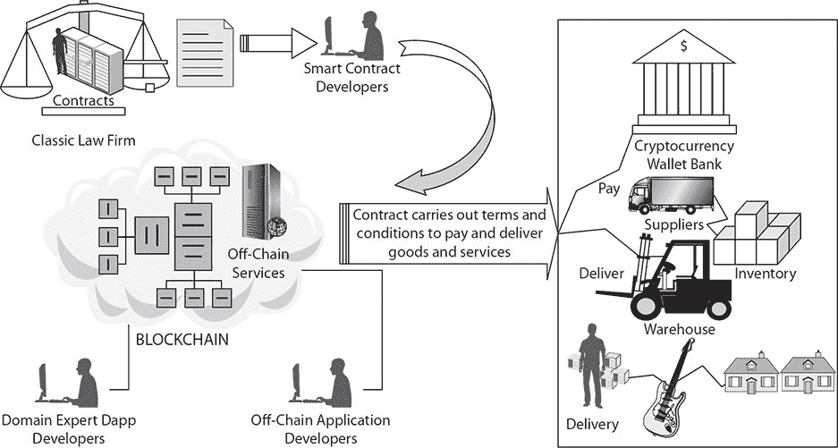

**图 4-1   智能合同流程**

如我们在接下来的章节中包含的智能合同代码示例所看到的，代码的开发和测试至关重要，而且它必须包含对各方身份的安全检查。

#### 智能合同组件

随着智能合同的发展，最初将会有采用不同组件的混合型：区块链上和区块链下。最终，随着区块链技术的成熟和被广泛接受，智能合同将仅作为区块链上的组件。

以下是一些可能性：

  •   智能合同代码，例如，存储在、验证在、并在区块链上执行的以太坊 Solidity 代码。

  •   作为使用智能合同代码作为补充或完全替代法律合同的智能法律合同。

•   一个实际的合同可能最初是一个智能合同，还有一些链下逻辑和执行；随着概念的发展，它将变成一个完全基于区块链执行的智能合同。一个非常简单的合同可以完全自动化。其他合同可能需要自我执行的条款和软件代码之外的条款。这是因为不是合同中的所有决策或步骤都可以简化为逻辑陈述，特别是对于复杂的合同。

对于 dapp 程序员来说，智能合同只是一个执行合同的很好写的程序，即用代码编写的合同。他们会说所有的程序本质上是合同。

对于律师来说，合同的概念有不同的含义。它需要提供和接受、考虑以及具体的条款和条件。他们很难相信代码可以是法律。

#### 智能合同的好处

像任何新技术一样，智能合同也有利有弊。正如我们在第一章所见，分布式区块链的好处在于它比依赖一个可信的中心账本提供更值得信赖的账本。借助区块链技术，参与者和监管者的记录和交易更加安全、可追溯和透明，同时运营成本也较低。智能合同与区块链的结合增加了确定性、安全性和弹性。条款可以由第三方进行验证。此外，存储在区块链上的信息受到安全威胁的保护，因为它存储在多个节点上，只有超过 51%的节点被攻破，才会出现任何问题。

#### 智能合同挑战

区块链的成功，如我们将在第九章中讨论的，将取决于它是否可以实际实施，以及哪些应用是合适的候选。简单地说，关键的部署风险和挑战如下：

•   **性能**   交易处理、验证和欺诈检测所需的计算资源和性能将决定它最适合应用于哪些银行、金融和支付服务。目前区块链的性能还不足以处理每秒数千笔交易。它将被限制在非时间依赖的资产转移上，例如买卖高度交易和波动的证券。

•   **互操作性**   确保不同区块链实现之间的互操作性，使它们能够相互通信。实现这一切的成本是多少？这将由联盟集团决定，希望他们能制定标准。

•   **可扩展性**   特定区块链网络中的每个节点都必须知道全球发生的每一笔交易，这可能会对网络造成重大拖累。目标是提高所有交易的高效性，但以不牺牲网络提供的去中心化和安全为前提。

#### 智能合约风险

不断发展的智能合约和区块链技术的使用确实带来了一系列潜在风险，包括治理、部署、风险管理、监管和法律风险。这些风险以及如何管理它们从根本上支撑着市场对这项技术的信心。我们将在接下来的章节中更详细地讨论它们。为了有效，区块链和智能合约需要一套标准，即所有参与者都遵循的一套共同规则，以确保准确性和可信度。去中心化模型在需要更改规则时提出了挑战，因为这些更改需要得到所有参与者的同意和接受，才能保持一致的功能。将需要一个治理框架来实施和运行区块链作为一项法律应用，并需要考虑监督和监控功能、规则设置、接受和变更控制管理。一般来说，治理不仅对法律，对所有管理信息的技术都是必需的。这种向信息治理共同规则的转变不仅对区块链至关重要，对电子发现和网络安全等其他追求也同样关键。围绕区块链的治理标准（参见[`hbr.org/2017/04/who-controls-the-blockchain`](http://hbr.org/2017/04/who-controls-the-blockchain)）将有助于提升市场对这项技术和法律及监管环境的信心。这将加速智能合约的采用和成功。

#### 智能合约法律挑战

智能合约也引发了许多有趣且具有挑战性的法律问题。首先，是否形成了一份具有法律约束力的合同？如前所述，智能合约当前的混合性质，结合了传统非编程或手动合同，例如带有条款和条件的 Word 文档，使其有效性产生了一些新问题。一个智能合约是否具有法律约束力将取决于多个因素，包括具体的应用场景、所使用的智能合约类型以及适用的法律。

正如我们所看到的，一些州，如特拉华州和亚利桑那州，已经通过了立法来认可智能合约。为了避免围绕区块链交易和与某些数字资产相关的智能合约的法律不确定性，2017 年亚利桑那州通过了修订后的亚利桑那州电子交易法（AETA，HB 2417），其中对区块链技术进行了非常具体的定义，即“分布式、去中心化、共享和复制的账本，可能是公共或私人、受许可或无许可，或由代币化加密经济学或无代币”驱动，并规定“账本上的数据通过加密保护，是不可变的且可审计，并提供未审查的真相。”HB 2417 还定义了智能合约作为一种“事件驱动程序，具有状态，在分布式、去中心化、共享和复制的账本上运行，可以掌管并指导该账本上的资产转移。”具有前瞻性思维的州，如特拉华州和亚利桑那州，通过此类立法鼓励在本州内发展区块链。话说回来，智能合约的电子性质在许多司法管辖区不太可能成为建立合同形成的障碍。

法律上对“确定性”的要求可能不容易满足，因为并非所有智能合约都与自然语言合同条款共同运行。各方如何获得智能合约的条款和条件的通知？在智能合约达成和执行之前或之后，他们何时能够看到这些条款？我们如何处理法律要求以书面形式出现的合同？计算机代码是书面形式吗？我们如何处理遗嘱的正式签署要求，即书面并由特定个人/角色签署？

存在可能的智能合约模型的光谱。一方面，有提倡“代码即合约”方法的人。另一方面，有些人认为智能合约是由业务逻辑的数字化组成，例如支付，这正在发生，可能与自然语言合同相关，也可能不相关。在这两个极端之间可能出现许多变体，例如，一个“分离”的智能合约模型，其中自然语言合同条款通过参数与计算机代码连接。

关于智能合约能否在多个关键缔约司法管区的法律下产生具有法律约束力的合同关系，存在管辖权差异。答案可能因司法管辖区而显著不同。在许多司法管辖区，合同条款的确定性和是否足够全面通常是建立具有法律约束力的合同形成的关键因素。纯粹数字化流程的智能合约，若不包括或与合同条款共同运行，可能无法满足这些要求。

•  **强制执行**   智能合同具有法律约束力的合同效果时，部署其内的技术有时可能与法律强制执行问题有关。可能没有中央管理当局来解决争议。争端解决机制可以解决执行问题和司法管辖区差异。在智能合同中插入争端解决机制将是形式上的，以解决执行问题和司法管辖区差异的问题。

•  **透明度**   区块链可以涉及一定程度的透明度。但是，如果各方不想透露细节呢？如何保持合同的某些部分私密，同时保留区块链的其他好处？

•  **变更**   那么，如何撤销那些本不应该发生的交易——例如，如果存在胁迫——或者是因为某些原因（或是在某些地方）非法或违反监管要求而进行的交易呢？这已经在以太坊平台上发生过，通过技术上的“硬分叉”反应（区块链上的一个分叉，其中未升级的节点无法验证升级节点根据新共识规则创建的区块）。

•  **编码限制**   合同通常涉及未知事项，并包含不易转化为代码的条款，或者可以作为简单的“如果这个，那么那个”程序自动执行。不可抗力就是一个很好的例子。合同通常包括主观判断、合理性和善意行事的概念。这些概念目前无法轻易转化为逻辑语句。话说回来，将会有提供“合理性”测试的代码服务，这些服务已经在证券交易中使用了多年。

•  **错误、错误或欺诈的责任**   如果合同的执行出现什么问题，有人遭受损失，他们应该找谁寻求救济？我们需要一个精通技术的法院系统。法院已经开始认可区块链，不仅用于加密货币，还因为它可以改善法律的行政管理。正如法院对电子发现变得技术化一样，他们还需要能够处理区块链证据。

#### 区块链作为证据和数字签名

除了好处、挑战和风险之外，对于区块链应用要在现实世界中发挥作用，数字签名需要与笔墨纸张一样具有法律约束力，区块链上记录的证据需要在法庭上可采纳。法院关于证据的规则复杂，关于什么信息可以进来以及以什么格式进来有严格要求。目前在大多数法律体系中，区块链证据可以被考虑，但只有在昂贵的专家证人的帮助下才能解释其含义。这个过程将消除通过使用区块链技术获得潜在效率的可能性，反而会增加法庭成本并降低获得正义的机会。

根据美国联邦证据规则 901 条，“为满足证实或标识证据的要求，主张方必须提供足够的证据来支持这样一个发现：该物品就是主张方声称的那样。”这一要求对于确保诉讼当事人不试图引入伪造或篡改的证据非常重要。那么在实际操作中这是如何进行的呢？通常，交易和其他商业记录可以被提交到法庭程序中，但通常需要证人作证以证实这些记录的真实性。例如，如果你与一家证券交易所就一笔交易发生争议，该交易所可以引入其关于你账户和交易的计算机记录，但它的一名技术人员需要就数据的真实性作证。因此，交易记录通常需要证人解释交易记录是什么，它是如何保持或生成的，以及它代表什么。

在区块链上，如果保留了签名数据，通过参考用于验证交易的数字签名，后来验证交易记录会更加容易。这将有助于满足区块链记录“就是主张方声称的那样”的证据要求，即特定交易的区块链收据。并非所有的数字签名都生来平等。有时选择一个系统而非另一个系统有充分的理由，比如避免一个设计拙劣或被监视机构修改的系统（参见[`privacyinternational.org/node/51`](https://privacyinternational.org/node/51)）。但有时这是完全随机的。政府为数字签名设定了复杂的标准，以赋予它们与笔和纸相同的权重（参见[`www.nist.gov/`](https://www.nist.gov/)）。签署电子文件的过程充满了摩擦。如前所述，亚利桑那州电子交易法（AETA）规定，不能因为记录或签名以电子形式而否认其法律效果和强制执行。还有一部联邦电子签名法（15 U.S.C. § 7001），通常规定签名、合同或其他交易记录仅因其以电子形式而无效或不可执行。需要确定联邦法规是否取代了 AETA。根据 AETA，通过区块链技术保障并以 U.C.C.第 2、2A 和 7 条规定的电子记录、电子签名和智能合同条款将被视为以电子形式存在，并且是电子签名。该法规还规定，与交易有关的合同不得因合同包含“智能合同条款”而否认其法律效果、有效性和强制执行。

归根结底，政府正在寻求简化证据规则，允许区块链证据无需专家即可被认为是可接受的。各州正引领这一进程。除了亚利桑那州，佛蒙特州也通过了一项法案，该法案创建了对符合某些要求的区块链记录的默认可接受性。被接受的记录可以用作合同各方或条款、生效日期、所有权、金钱转账、身份、文档真实性或其他任何事物的证据。我们预计在 2018 年将看到更多关于法律发展的情况。

### 智能合约设计示例

因此，我们可以看出，智能合约开发将需要一个不仅精通 Solidity 和分布式应用开发团队，还需要精通法律和区块链法规的业务和法律专业人士。让我们设计一个智能合约，该合约被联盟和社会媒体营销业务使用，以获取他们营销努力的收入。他们是基于被称为 CPA 和 CPC 的营销活动表现指标付费的。

CPA（按行动成本或按获取成本）广告是基于业绩的，在商业的联盟营销领域中很常见。在这种支付方案中，发布者承担运行广告的所有风险，而广告商仅对完成交易的用户数量付费，比如购买或注册。这是支付横幅广告的最佳类型费率，也是最糟糕的收费类型。

CPC（按点击成本）是一种支付选项，每当发布者引用的客户点击广告商提供的链接时，就会补偿发布者。CPC 也是用于定价横幅广告的互联网营销公式。一些广告商将根据横幅广告获得的点击次数向发布者支付。我们将设计一个智能合约，访问 HitPath 的表现和支付数据，以便联盟网络可以简化全球联盟的业绩到支付周期的整个流程，以减少摩擦。HitPath（参见[www.hitpath.com/](http://www.hitpath.com/)）是流行的广告活动跟踪软件，维护着关于发布者的活动中心账本。表 4-1 描绘了一组数据行，标识发布者、广告优惠以及点击是否导致 CPC 和 CPA。HitPath 的这种表现跟踪日志为支付提供了基础。

**表 4-1** **HitPath 的发布者表现跟踪日志**

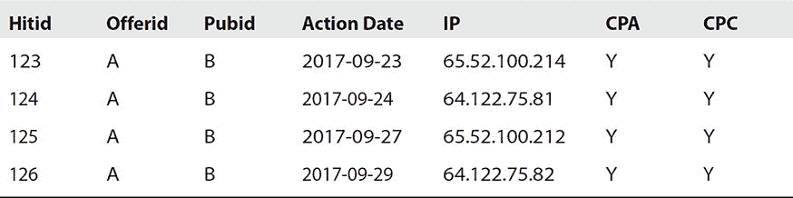

我们将为营销人员设计一个智能合约，以便他们可以自动收到基于社交媒体广告活动而产生的 CPC 或 CPA 的补偿——加密货币、美元或存入钱包账户的代币。这将通过使用预言机来访问 HitPath 性能和支付数据来实现和验证。预言机是一个寻找并验证现实世界事件（如 HitPath 活动）的代理，并将这些信息提交给我们的智能合约使用。智能合约包含价值，并且只有在满足某些预定义条件时才会解锁这些价值，例如，如果出版商的潜在客户产生了 CPA 或 CPC。当达到特定值时，例如月底，智能合约将改变其状态并执行预定义的算法来确定要补偿出版商多少，自动在区块链上触发一个事件。预言机的主要任务是为智能合约提供这些值，以一种安全和可信的方式。区块链无法自行访问其网络外的数据。因此，简而言之，预言机在外部数据和满足预定义条件时触发智能合约执行。预言机是多签名合同的一部分，例如，原始受托人签署一个合同，只有在满足某些条件时才会释放未来的资金。在释放任何资金之前，预言机必须签署智能合约（参见图 4-2）。

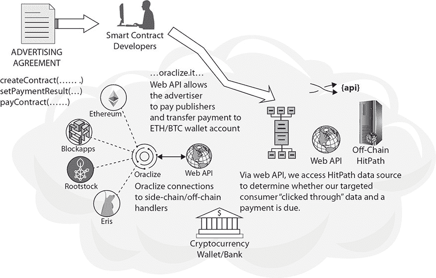

**图 4-2   广告智能合约流程**

我们可以然后取我们跟踪期间的 CPA 和 CPC 点击次数，乘以商定的比率，并将支付转至出版商地址。 图 4-3 展示了一个示例合同。我们使用基于网页的用户界面从正式合同语言中推断了变量。 图 4-4 展示了广告合同头部。

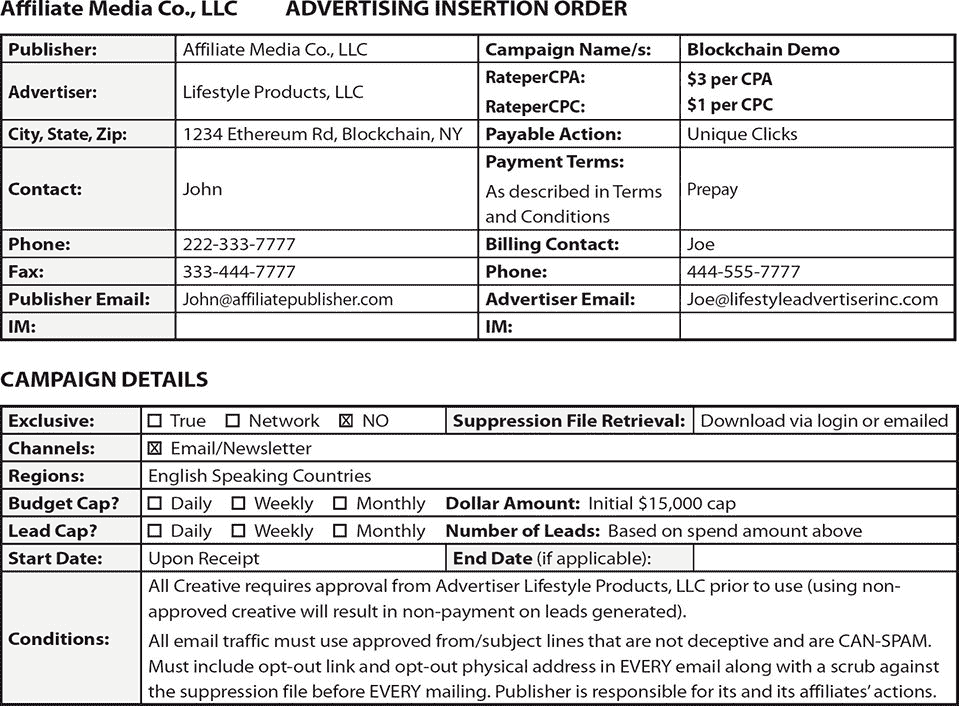

**图 4-3   示例合同**

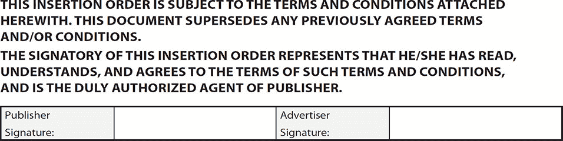

**图 4-4   广告合同头部**

#### 广告支付应用适合区块链吗？

我们将从头开始设计一个智能合约为广告商以智能合约自动支付方式支付。我们将根据我们之前讨论的广告 CPA 和 CPC 建立一个非常基础的区块链自动支付合同。后来，在第十章和第十一章中，我们将详细介绍 JavaScript 和以太坊工具的描述和使用，这些工具用于使用以太坊 Solidity 创建、构建和部署整个应用程序。话说回来，并非所有应用程序都适合于区块链。使用区块链对我们广告支付应用的优势是什么？

• 加密安全身份验证

• 快速、无摩擦、低成本的支付

• 网络运行时间 100%

•   公开可验证和保证的代码交易执行

使用区块链没有真正的劣势：

•   相对较慢的区块链网络不是问题，因为它仍然比手工计费快。

•   相对有限的交易率不是问题，因为它仍然比手工计费快。

•   Contract code deployment cannot exceed the block gas limit.

现在让我们来看看支付应用。以下是所需的一些功能：

•   频繁的支付处理

•   处理多国不同货币的合约

•   提供可验证和一致的支付执行

这些要求非常适合区块链解决方案。广告支付的一个问题是通过电线和银行转账移动资金。网络出版商必须等待三到五个工作日才能从银行账户存入或取出资金，并且必须将他们的银行信息交给广告商网站。相应的网站必须保护这些信息，采取适当的网络安全措施以保护其网站免受黑客攻击，并遵守其在运营的各个国家所需遵守的一系列金融法规。此外，在不同国家进行交易需要支持各种不同的货币和银行，所有这些都增加了运营的复杂性。

使用区块链解决方案可以让广告商和出版商轻松地进行跨境转账，为国际博彩网站提供保证，确保他们的报酬能够及时支付。因此，我们需要一些功能来实现合约：

•   createContract(…如图 4-3(ch4.xhtml#ch4fig3)所示的各种合约属性…)将通过拉取表 4-1 中指定的变量并实例化创建我们的合约，即赋予这个合约生命，以供作为 contractid 引用。

•   setCPAPaymentResult((uint contractid)constant returns (uint)), setCPCPaymentResult((uint contractid)constant returns (uint)) 将定期访问 HitPath 跟踪数据以确定在计费期间我们有多少 CPA/CPC 点击，使用图 4-3 中指定的速率变量来计算支付。

•   payContract(uint contractid) 将从广告商的地址转移相当于支付的金额到出版商的地址，并发送通知给各方交易已完成。

#### 定义合约数据结构

在我们开始编写合约代码之前，需要定义必要的数据结构。

这个结构将包含我们合约中的所有变量。参见表 4-1 和图 4-3 了解从合约中查看这些变量及其跟踪源的视图。正如我们将在第十章中看到的，变量可以有字符串、整数、布尔值等数据类型，区块链钱包账户的地址，这些数据类型的数组或其他结构。参见图 4-3 中的变量。在以太坊 Solidity 中，它看起来像这样：

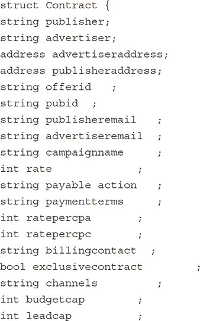

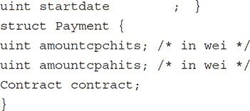

#### 智能合约事件

正如我们稍后详细看到的那样，Solidity 事件用于将交易活动记录到区块链上。与在状态树中创建新条目相比，日志记录成本较低，因此它是存储只读数据的最佳方式。日志不能从合约内部访问（只能访问变量），但可以被 web3.js 等外部客户端库读取（关于这方面的更多信息请参见第十章）。以太坊交易是异步的，通常在它们被广播到网络后 15-30 秒内不会挖掘。正因为如此，交易不能返回值。交易创建输出的唯一方式是修改状态或添加事件日志。客户端库通常解析日志以确定交易的结果。

Solidity 事件是日志的架构。日志会根据合约地址和事件类型自动索引，以便高效查询。此外，Solidity 事件允许您定义三个自定义索引字段。在解析日志时，只有索引字段可以查询。

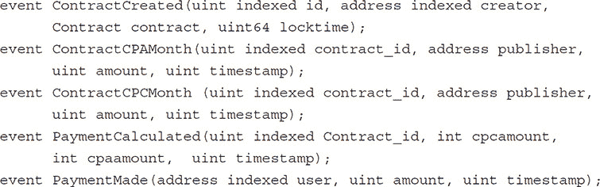

每个主要的状态修改事件都与我们的合约相关联，它们共同构成了合约在区块链上执行动作的历史记录。

#### 智能合约函数

让我们创建一个我们将要在应用程序中定义的函数列表。函数和变量一样，可以是公共的或私有的。公共函数可以被其他合约和客户端库访问，并作为应用程序二进制接口（ABI）的一部分列出，这是调用合约中的函数并获取数据回调的基本方式。私有函数只能被同一个合约中的其他函数访问。Web3.js 是用于与以太坊节点交互的以太坊 JavaScript API。它包含了一系列模块，以促进区块链功能。

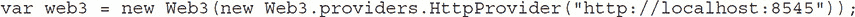

当我们得到一个 ABI，并将其保存在一个单独的文件 abi.js 中时，我们可以将其从应用程序加载到 abiArray 变量中。我们还需要智能合约地址，在 advertiserContract 变量中。然后我们可以获取到该合约的 JavaScript 实例：

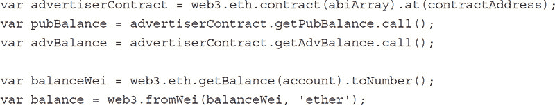

一旦我们有了 web3 对象，我们就可以调用一些 API 来了解区块链上发生了什么，比如获取你的以太币余额并以 wei 为单位转换。

此外，还有一些常量函数只从区块链读取，但不修改区块链。公共常量函数立即返回其结果，不发送交易到网络，并且在调用时不会消耗任何燃料。

以下是我们将需要的公共函数：

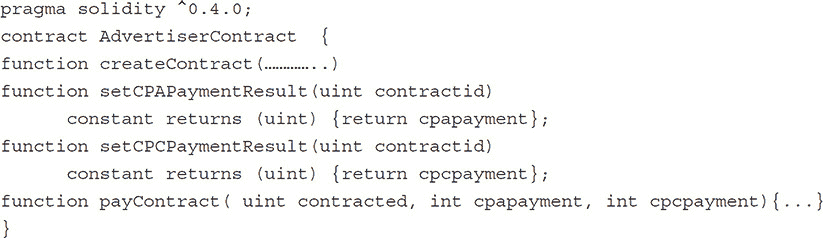

一旦合约被创建，我们将发出一个 ContractCreated 事件来记录我们刚刚执行的状态修改，并返回一个变量以指示没有错误发生。你可能需要一些公共常量函数，如：

一旦创建了一定数量的合约，我们需要能够识别活跃的合约。

此外，我们还将定义一些仅供我们内部使用的私有函数：

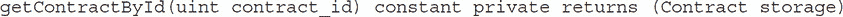

`getContractById`是我们将使用的一个辅助函数，用于获取对特定合约的指针。

`payContract(uint contract_id) private`

常量函数返回一个类型必须在上面的语法中指定的值。

因此，我们的广告商智能合约将会：

•   为每个与我们做生意的出版商执行`createContract`：

`createContract(…)`

•   计算该出版商在当前月份发生的 CPA 和 CPC 数量：

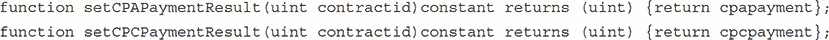

•   为该出版商在当前月份发生的每笔 CPA 和 CPC 补偿每个联盟成员：

该应用程序可能需要一个基于网页的前端，并且需要 MetaMask，一个用于访问以太坊启用分布式应用的扩展程序，或者 dapps，在你的普通 Chrome 浏览器中。这个扩展程序将以太坊 web3 API 注入到每个网站的 JavaScript 上下文中，这样 dapps 就可以读取区块链。MetaMask 还允许用户创建和管理他们自己的身份，所以当一个 dapp 想要执行一个交易并写入区块链时，用户可以通过一个安全的界面来审查交易，然后再批准或拒绝它（见图 4-5）。

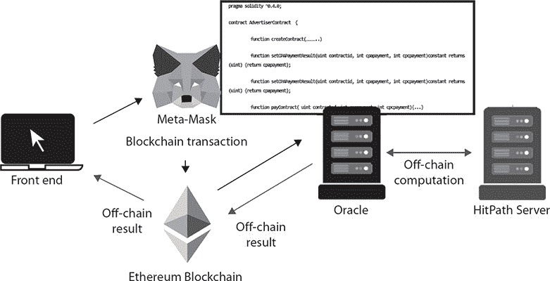

**图 4-5   广告合约预言机流程**

这个智能合约设计必须编写以处理我们在这里列举的功能。在第十章和第十一章中，我们将详细说明并展示一个完整的应用程序（投注），从开发设置到生产实施，包括代码编写和执行的解释以及基于网页的前端。

#### 智能合约实践

正如我们在这章的前几节所看到的，对于智能合约的含义以及其执行力和不断发展的司法问题存在混淆。技术人士提出了一个带有“合同”一词的可编程组件，律师们感到好奇并希望参与这种新的商业和合同执行形式。起草实际的独立合同并不是开发者想要做的事情。开发者构建平台和应用程序（见[`consensys.net/ventures/spokes/`](http://consensys.net/ventures/spokes/)，了解一系列现有的应用程序）。智能合约只是组件之一。随着智能合约的广泛采用，起草合同的传统律师工作将会改变。在律师起草智能合约的新世界中，将涉及法律和技术专业人士的团队。这些团队的构成和新的合同开发生命周期正在孵化中。

### 去中心化自治组织

去中心化自治组织（DAO），也被称为去中心化自治公司（DAC），是一种通过编码为智能合约的规则来运行的组织。DAO 的财务交易记录和程序规则保存在区块链上。DAO 实体的概念最初是在一份文档中引入的。这种商业模式有几个例子（见[`download.slock.it/public/DAO/WhitePaper.pdf`](http://download.slock.it/public/DAO/WhitePaper.pdf)）。区块链、智能合约和 DAO 的使用引发了重大的法律问题。随着这些基于区块链的技术得到广泛应用，我们将需要法律和法规来提供一个法律框架，以便在框架内利用区块链。作为这个新范式中的开发者，我们需要了解这些问题，这样我们才能构建符合规定的区块链应用程序。一些正在发展中的法律问题如下：

• 当服务器是去中心化和全球分布时，我们需要考虑在违反或失败发生时的司法管辖区，并适用跨境法律，这可能导致破坏区块链优势的昂贵解决方案。

• 当实体基本上是自我管理的软件，从事或促进商业活动时，DAO 将附有什么法律地位？它们是简单的公司还是别的什么？

•  DAO 及其创建者的责任是什么，如果有责任的话？在法律争端中针对谁或什么？

此外，DAO 使传统的所有权和责任概念过时。然而，我们认为这种或许更加未来的观点忽略了编码可能出现错误或托管平台可能失败的实际情况。关于 DAO 在其创建或运营过程中的任何欺诈行为的影响如何？法院和监管机构将如何允许全面采用绕过现有监督的技术？

2017 年 7 月 25 日，美国证券交易委员会（SEC）就使用分布式账本或区块链技术进行的数字资产的提供和销售发表了监管意义声明（参见 [`sec.gov/news/press-release/2017-131`](http://sec.gov/news/press-release/2017-131)）。该声明是在 SEC 对一个名为 DAO 的未注册组织的调查报告之后发表的，该组织旨在通过分布式账本发行代币，允许持币者分享组织的预期收益。在一名黑客窃取了其资产的大约三分之一之后，DAO 及其结构引起了广泛关注。

调查引发了关于美国联邦证券法在 DAO 代币的提供和销售中的适用问题的疑问，包括 DAO 代币是否属于证券的根本问题。基于调查，并在呈现的事实基础上，委员会确定 DAO 代币根据 1933 年证券法和 1934 年证券交易法属于证券。该报告重申了美国联邦证券法的这些基本原则，并描述了它们适用于一个新的范例——使用分布式账本或区块链技术的虚拟组织或资本筹集实体，以促进资本筹集和/或投资及相关证券的提供和销售。通过这项技术、智能合约或计算机代码自动化某些功能并不会将行为排除在美国联邦证券法之外。参见“根据 1934 年证券交易法第 21(a) 节进行的调查报告：DAO，”[`sec.gov/litigation/investreport/34-81207.pdf`](https://sec.gov/litigation/investreport/34-81207.pdf)。

#### DAO 与司法管辖权

DAO 能够跨越司法管辖区边界，因为区块链上的节点可以位于世界上的任何国家。这带来了复杂的司法管辖问题，这需要熟悉每个国家法律和相关的合同关系的律师进行专门的考虑。合同和所有权原则在各个司法管辖区之间有所不同，因此确定适当的管辖法律将是设计和实施 DAO 的第一步。在去中心化环境中，确定适当的规则集将至关重要。

首先，网络中每个节点所在位置的司法管辖权都可能覆盖到每笔交易。这可能导致区块链需要符合大量的法律和监管体系。为了促进 DAO 的发展，需要早期确定一些设计约束。如果在区块链中发生了一笔欺诈或错误交易，确定其在区块链中的位置将是重要的安全考虑。

因此，包含一个独家管辖法律和司法条款是非常必要的。它应该确保 DAO 成员在确定协议各方权利和义务适用的法律以及处理任何争议的法院方面有法律确定性。一家供应商，阿拉贡（[`blog.aragon.one`](https://blog.aragon.one/)），已经开发了一种 DAO 仲裁机制，该机制将于 2018 年全面投入运行（参见图 4-6）。

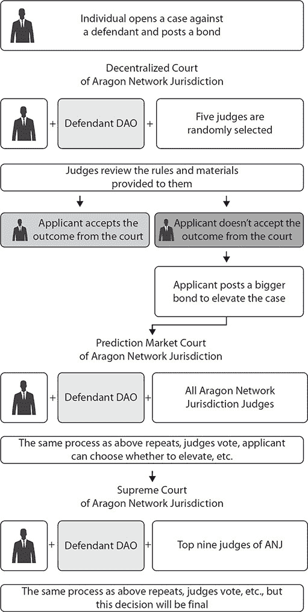

**图 4-6   阿拉贡仲裁机制**

阿拉贡网络司法区要求有争议的个人开启一个案件并缴纳保证金。保证金将在仲裁过程期间锁定，如果仲裁结果对其有利，则返回；如果不利，则作为网络储备金保留。只有有合法争议理由的申请者才会缴纳保证金。在极端情况下，可能有理由冻结组织的运营，例如，当所有利益相关者的资金面临风险时。任何组织股东如果公司的合同被冻结并处于审查状态，都可以提出问题。当仲裁开始时，将从表明有兴趣担任法官的已缴纳保证金的人员池中随机选出五名法官。法官们将就该案的最终判决进行投票。如果申请者对去中心化法院的裁决不满意，他们可以选择将问题提交到下一个领域。这需要缴纳比之前更大的保证金。在这一轮法院中，阿拉贡使用了一个预测市场，网络中的所有法官都可以参与，为申请人提供了一个更大的受众群体。

如果申请者仍然认为问题不令人满意，可以向由 ANJ 支付最高九名法官组成的阿拉贡网络司法区最高法院提出上诉——换句话说，这些是解决阿拉贡网络司法区案件排名最高的人。这次判决将是最终的，没有上诉过程。前一轮的法官将根据最高法院的裁决受到奖励或惩罚。如果最高法院同意前一轮法官的裁决，那么前一轮的法官将得到奖励。如果最高法院推翻了那一轮的裁决，那一轮的法官将被处罚。阿拉贡网络司法区旨在提供解决智能合约代码中未涵盖的所有问题的工具。它为加入并参与网络的阿拉贡组织创造了激励。所有希望与组织互动的各方都有保证，在合同未涵盖的信任违约情况下，他们的问题将得到解决。此外，如果发现一个威胁组织生存的错误，可以通过开启一个冻结所有活动的仲裁来阻止它，直到问题解决。

#### DAO 服务级别责任

去中心化自治组织（DAO）的采用的一个重要方面是供应商（如 Aragon）愿意承诺性能保证和服务水平指标。这取决于诸如供应商风险/回报概况、服务交付模型和同时为多个客户提供重大责任的风险“放大因子”等因素。这可能导致供应商更倾向于以几乎“现状”的形式提供技术和服务，提供有限的服务水平，并排除对服务性能的保证，使客户没有保证技术将按描述运行或服务将是可靠和可用的。对于将该服务作为业务一部分使用的用户来说，这可能不是一个可接受的提议。因此，性能风险的平衡将是关键问题。

#### 去中心化自治组织（DAO）违反合同的责任

如果交易相关的基础设施如区块链出现系统问题，客户的风险可能会很大，如果交易没有结算或结算不正确。同样，与安全和保密性相关联的风险将是任何潜在客户风险问题中的重中之重。由于区块链的技术和运作方式不同，它带来了不同的风险：影响公共区块链的主要问题之一是无法控制和停止其运行。在私有区块链的情况下，平台运行的控制不足的问题不适用，但这种不足是否足以触发管理该平台的公司责任尚无定论。因此，在区块链服务出现故障时，必须仔细思考与风险和责任分配相关的问题，不仅是在供应商/客户层面，而且是在所有相关参与方之间，特别是受到问题影响的各方。

#### 去中心化自治组织（DAO）与知识产权

区块链技术具有价值。知识产权（IP）的所有权将是一个重要的考量因素。考虑到区块链技术的投资规模和潜在的金融回报，供应商必须确定其 IP 策略。供应商可能希望利用区块链产生的任何其他商业效益，包括底层数据集的商业化。至于数据集与用户相关联的程度，这将是一个需要谨慎谈判的区域。同样，那些覆盖核心的、为满足客户特定需求而开发的具体发展或解决方案又如何呢？可能的 IP 选项与其他任何软件开发协议无异，并且可能取决于这些特定需求是否能够给客户带来竞争优势，以及/或者区块链供应商能否将这些需求用于另一客户或由客户使用另一区块链供应商。根据这些问题的答案，客户可能会坚持拥有这些发展成果，或者可能只愿意在协议期间对其进行许可。客户可能会根据时间、使用情况、收件人，或这三者的结合，限制供应商使用这些发展成果的能力。在金融科技领域，“开放创新”方法普遍存在。金融机构正在努力实现可行的区块链概念验证，并在内部开发大量代码。传统上，金融机构期望拥有他们开发的任何软件的 IP。然而，似乎有一种认识，即为了实现真正的价值，技术必须共享。

#### 去中心化自治组织（DAO）及责任归属

去中心化自治组织（DAO）本质上是在线数字实体，通过实施预编码规则来运营。这些实体通常需要对其运营输入最少的到零输入，它们用于执行智能合约和记录区块链上的活动。

现代法律体系旨在允许组织以及实际个人参与。大多数法律体系通过赋予组织与真实个人相同的法律权力来实现这一点——即进入法律合同、提起诉讼和被诉的权力。但是，DAO 将具有什么样的法律地位？它们是简单的公司、合伙企业、法律实体、法律合同，还是其他的东西？由于 DAO 的“管理”是自动进行的，法律体系必须决定如果违反法律，谁负责。DAO 及其创建者的责任是什么，如果有责任的话？在法律纠纷中，对谁或什么提出索赔？法院和监管机构不太可能允许全面采用绕过现有监督的技术。

#### 去中心化自治组织（DAO）遵守金融服务法规

许多采购安排，包括使用某些技术解决方案，要求受监管实体在相关合同中包括一系列规定，使它们能够行使控制权，并寻求在合同所涉及的服务方面实现运营连续性。随着区块链（正如云计算和某些金融科技协议所做的那样），这可能是一个更大的挑战。

#### DAO 和退出合同

退出协助的需求将在很大程度上由具体的解决方案和区块链供应商持有客户数据的程度来决定。如果客户没有自己数据的副本，它将需要数据迁移协助，以确保在协议到期或终止时供应商有义务交出所有此类数据，以及存储在区块链上的所有交易记录的完整记录。

#### DAO 数据作为财产

在普通法中，作为一个一般原则，信息本身没有财产权。但是，尽管个别信息不吸引财产权，数据的汇编可能受到知识产权的保护。当个人信息的数据库被出售时，如果买家想要将个人信息用于新的目的，为了遵守数据保护法规（如欧盟的 GDPR），他们必须得到有关个人的同意。

#### DAO 和尽职调查

公开公司和私人投资者已经开始对区块链技术初创公司进行大量资本投资。随着区块链技术的商业部署成为现实，这一趋势可能会加速。负责执行这些投资购买和/或销售方面的交易律师需要了解区块链技术和基于该技术的新兴商业模式。传统的尽职调查方法可能需要进行调整。例如，将存在关于分布式账本上数据所有权和基于开源区块链技术平台运行的区块链即服务产品知识产权所有权的独特问题。这些问题需要在业务价值主张和进入竞争壁垒的背景下进行考虑。

### 摘要

到目前为止，我们已经看到智能合约可能是当前最具变革性的区块链组件。为此，哈佛商学院的 Marco Iansiti 和 Karim Lakhani 在 2017 年 1 月至 2 月的《哈佛商业评论》中为商业和法律人士提供了一些启示性的见解，“关于区块链的真相”。在他们看来：

“影响深远……如果合同自动化了，那么传统公司结构、流程以及像律师和会计师这样的中介会发生什么？…他们的角色将发生根本性变化…我们距离智能合同的广泛采用还有几十年时间……在智能合同的设计、验证、实施和执行方面需要极大的协调和清晰度……我们认为负责这些艰巨任务的机构需要很长时间才能演变出来。而技术挑战——尤其是安全性——是巨大的……律所将不得不改变，以使智能合同变得可行。他们需要在新软件和区块链编程方面发展新的专业知识。”

总之，区块链，这种具备执行智能合同能力的分布式数据库技术，不仅仅是加密技术的平台。我们简要涉及的使用案例范围正在呈指数级扩大。随着这项技术继续为我们提供新的互动和信息交换方式，它带来了挑战性和复杂的法律问题，并推动现有法律的边界。我们的法律必须像适应互联网、医疗技术、电子发现和社会媒体一样适应区块链技术。作为律师和开发人员，我们面前有一次巨大的变革。我们需要拥抱它，成为其演变的一部分。”
