## 第五部分 以太坊技术

描述比特币最简单的方式就是称它为加密货币或数字货币。比特币于 2009 年 1 月发布，因此在大约九年的时间里，它被用于点对点的区块链网络中转账。没有中心或世界银行实体控制比特币的流动或功能；它是一种去中心化的数字货币。与比特币相比，以太坊的主要区别在于它在其基础加密货币（称为以太）中添加了智能合约的功能。智能合约是什么意思呢？好吧，可以把它想象成带有逻辑的数字货币。可以设置智能合约，在满足某些条件时，将价值从一个实体或账户转移到另一个实体或账户。这是一个例子。假设你想从某人那里购买一块地产。对于那些有幸这样做过的人，你们知道购买过程中涉及太多的第三方，包括房地产经纪人、经纪人、律师、产权调查员、家庭检查员、测量师、抵押银行和托管代理人。这些外部方通常使得流程变得极其缓慢，当然也会增加成本。以太坊解决方案将有逻辑（或代码），可以以更简单的方式自动在卖方和买方之间转移所有权（产权）以及买方和卖方之间的资金，在交易达成协议后，而无需涉及那么多第三方。参见表 5-1 以获取更多以太坊与比特币比较项目。

**表 5-1** **以太坊与比特币比较（来源：bitinfocharts.com）**

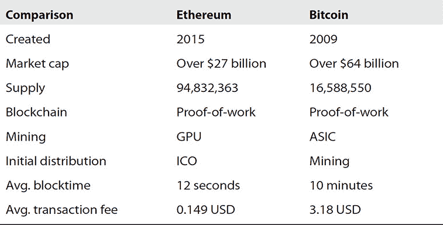

以太坊被创建来作为构建基于区块链的，或去中心化应用程序的平台。它是由瑞士的一家非营利组织以太坊基金会开发的，全球各地的优秀人才为其做出了贡献。以太坊非常适合需要快速构建且在区块链生态系统中高效、安全交互的应用程序。

以太坊使用区块链技术，这是一种由他人独立验证并保存在分布式账本上的交易记录。同样的技术支撑着比特币。然而，比特币区块链主要设计用于做一件事：促进比特币交易。另一方面，以太坊被设计为可编程的基础设施。这意味着以太坊是一个更适应、更灵活的开发平台。

以太坊平台通常被称为建立在区块链基础功能之上的图灵完备虚拟机。以太坊允许构建具有自己任意规则的所有权、交易格式和状态转换逻辑的智能合约和应用程序。一个简化的价值应用可以在两行代码中编写，其他协议，如货币和声誉系统可以在二十行以内构建。

Ethereum 拥有自己的代币，称为以太币（ether），它提供了网络内价值交换的主要流动性形式。以太币还提供了支付和使用网络产生的交易费用的机制。以太币曾遭到投机，和比特币一样，以太币的价格也经历了剧烈波动。在过去的两年里，每个以太币的价格从 10 美元涨到了超过 400 美元。现在又回到了大约 300 美元，但它已经表现出了典型的投机特性。值得注意的是，以太币是推动和促进去中心化（以及吸引矿工）的金融激励，这使得平台更加安全。

Ethereum 包含智能合约。智能合约实质上是指任何可以无需人类干预而执行某些功能的协议。Ethereum 中的智能合约是一个包含逻辑和价值的加密安全箱。逻辑有特定的条件必须满足才能释放价值。正是逻辑和状态的增加使得 Ethereum 比其他加密货币（包括比特币）更具 powerful。一个保险智能合约的例子可以自动向被保险实体支付，基于数据流显示已发生可支付事件。

智能合约能够实现去中心化应用（dapps）。中心化应用实际上是中心化服务。例如，当我们与智能手机上的第三方应用互动时，该应用将会与中心化服务器和服务进行通信。一个 dapp 在用户界面看起来可能完全一样，但后端服务被运行在去中心化 Ethereum 网络上的智能合约所替代。

Ethereum 也有去中心化自治组织（DAO）。DAO 是一种新型的实体或组织形式，例如，可以用智能合约来替代公司章程和股东协议。

dapps 和 DAOs 也可以拥有自己的数字代币，这些代币作为内部货币，通过充当内部货币来实现各种功能。dapps 和 DAOs 的发展目前正通过出售这些数字代币来筹集资金，这被称为代币销售或首次代币发行（ICO）。

### Ethereum 账户

在以太坊中，当前状态由通常称为账户的对象组成。以太坊内部的燃料是以太币，它用来支付交易费用（关于这一点本书稍后会介绍）。以太坊可以被看作是基于交易的态机，从创世态开始，逐步执行交易，使态机转变为最终态。最终态被认为是以太坊世界的标准“版本”。态机包括任何当前可以由计算机表示的内容，比如账户余额、声誉、信任安排以及代表物理世界中信息的数据。因此，交易代表了两态之间的有效过渡。以太坊中的每个账户都有一个 20 字节的地址（或身份），该对象由四个属性或字段组成，这些是：

  •   **Nonce**   用于确保每一笔交易只能处理一次的计数器

  •   **以太币余额**   账户的当前余额

  •   **合约代码**   可选的逻辑容器

  •   **存储**   默认情况下为空

有两种账户类型，外部拥有账户（EOAs）和合约账户。EOAs，也称为普通账户，拥有以太币余额，没有逻辑，由私钥控制。合约账户也有以太币余额，但由伴随的合约代码（逻辑）控制。以太坊平台上的所有操作都是由外部拥有（普通）账户发起的交易触发的。一个外部拥有账户通过创建、签名并提交交易来发送消息。当合约账户接收到一条消息时，其代码会被激活并根据交易的输入参数执行。代码（或逻辑）可以读写内部存储并发送额外消息或创建合约。以太坊中“合约”一词的使用不应该与日常生活中的典型用途混淆，比如需要履行、完成或遵守本身。它用来表示被绑定在以太坊执行环境内的逻辑，当接收到消息或交易（关于交易的内容稍后在本书中介绍）的“刺激”时，以定义的方式（由合约）来执行，并控制其内部状态（变量），这包括它的以太币价值。

####   •   **以太币：加密货币**

以太币（ETH）是推动分布式应用以太坊平台的加密货币。它作为网络客户端支付给实际执行请求任务的机器的形式。如我们早先提到的，以太币是推动和促进去中心化的金融激励，因此吸引矿工。更多的矿工使平台更加安全和可行。以太币也是确保创建高质量应用程序的激励，因为低效的代码通常成本更高，并使网络保持高可用性和功能性，因为所有者为其贡献的资源（计算能力和存储）得到补偿。

与法定货币一样，以太币有不同的面额，有自己的名称，如表 5-2 所示。

**表 5-2  以太币面额**

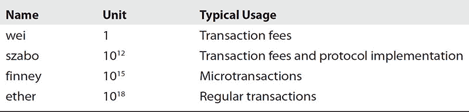

简而言之，以太坊有两个用途：一是用于支付交易相关的费用，二是为以太坊平台提供流动性，以便在平台上交换各种数字资产。

##### 创世区块

以太币（ETH）最初发行是为了启动以太坊项目和平台。平台的启动采用了众筹方法，以比特币换取以太币。众筹始于 2014 年年中，大约有 6000 万（实际上是 60,102,216 ETH）以太币单位以每比特币（BTC）1,000-2,000 以太币的价格发行。出售的总额中，9.9％分配给组织，以补偿早期贡献者，并在 2015 年 7 月 30 日的创世区块之前支付以 ETH 计价的费用。出售总额中的另外 9.9％将作为长期储备维持。这意味着在启动前的总发行量接近 7200 万。出售所得的比特币用于支付开发人员的工资/赏金，并投资于区块链生态系统的各种盈利和非盈利项目。

##### 创世区块后

以太坊平台一旦启动，发行以太币的方式就被确定并设定，以确保平台的未来成功和健康发展。规定每年释放的以太币单位将是筹集资金阶段最初筹集的 6000 万个的 26%。以太币的发行速度为每个区块 5 ETH，目标区块时间为 12 秒。这意味着每年释放的以太币数量将是一个固定的 1560 万个，所以到 2020 年 7 月，大约有 52%的总量将被挖出。见图 5-1 描述的以太币发行模型（在启动时）第一五年每年。

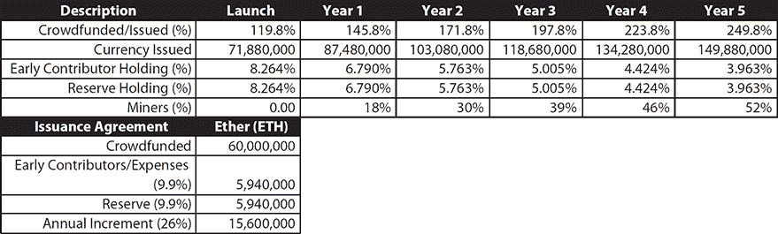

**图 5-1   以太坊（ETH）发行模型**

以太坊的发行模式与比特币相似，通货膨胀在前几年被前置，之后会出现通货紧缩。一个大区别是比特币是有限的，不会再发行。鉴于比特币现金（BCC）的分拆，这可能不那么重要，但以太坊每年将继续发行 1560 万单位，这是一个边缘但无可否认的燃料供应增加。

#### 获取以太币

获取以太坊燃料（以太）有多种方法，你可以

1. 购买它

2. 挖矿它

3. 接受它作为支付

在挖矿方面，这可以在私人环境内或公共测试网络上（testnet）完成。这很简单，但在生产环境中（mainnet）挖矿需要大量的本地 GPU 时间和高性能，并连接到互联网或云中类似强大的基础设施（例如 AWS、GCP、Azure 等）。要购买以太币，你需要通过交易所获取。由于不同地区有不同的交易所，你需要进行搜索以找到关于最适合你的最佳交易所的最新和最佳信息。

#### 以太坊的挖矿

以太坊区块链与比特币的区块链类似。主要区别在于区块的设计。以太坊区块包含交易列表和最近状态的副本（见图 5-2）。以太坊区块还包含块号和难度值。

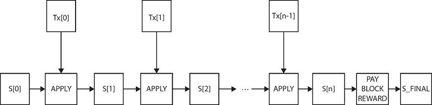

**图 5-2   以太坊区块链交易列表和状态**

以太坊验证算法的最基本形式如下：

1. 检查以下内容：

• 先前块的引用存在且有效。

• 当前块的时间戳晚于先前引用的块，并且比先前块的时间戳晚于 15 分钟。

• 块号、难度、交易根、叔父根和燃料限制有效。

• 块上的工作量证明有效。

• 如果上述任何一点不正确，则返回一个错误。

2. 将零索引状态（即 S[0]）设置为先前引用块的末尾状态。

3. 将 TX 列表设置为块的 n 个交易列表。遍历交易列表并将交易应用于适当的状态，即对于所有 i 在 0...n-1，设置 S[i+1] = APPLY(S[i],TX[i])。如果任何对 APPLY 的调用返回一个错误，或者如果块到目前为止消耗的总燃料超过了 GASLIMIT，返回一个错误。

4. 将 S_FINAL 设置为 S[n]，但向矿工支付的区块奖励。

5. 验证状态 S_FINAL 的 Merkle 树根是否等于块头中提供的最终状态根。如果是，则区块有效；否则，无效。

需要注意的是，虽然看起来整个状态都会随着每个区块存储——这是一种存储效率低下的使用方式——实际上并非如此。状态存储在一个树状结构中，每过一个区块只有树中的少数部分需要改变。通常在两个相邻区块之间，树的大部分将会相同，从而提供了优化机会和技术。数据可以一次存储并两次通过指针引用（即子树散列值）。这种在树上的概念和方法被称为帕特里夏树。这结合了修改后的默克尔树，使得节点可以非常高效地插入、删除和更改。在存储方面，由于所有状态信息都是最后一个区块的一部分，因此无需存储整个区块链历史，与比特币使用的做法相比，这可以在空间上节省 5-20 倍。

一个常见问题是智能合约中的代码将在哪里或何时执行。答案是智能合约代码的执行是状态转换函数定义（在本章后面部分将详细介绍）的一部分，而状态转换函数是区块验证算法的一部分。因此，当一个交易被添加到一个区块中时，由该交易触发的代码执行将在所有节点下载并验证同一个区块时执行。

##### 幽灵实现（GHOST）

贪心观察最重子树协议（Greedy Heaviest Observed SubTree，简称 GHOST）于 2013 年引入区块链平台，旨在解决快速区块时间的区块链（如以太坊）高频率产生无效区块的问题。无效区块是那些被传播到网络并被一些节点验证为正确，但最终因为更晚产生的区块先被挖出和传播而被抛弃的区块。

幽灵协议也解决了被称为中心化偏差的问题——一个例子是，如果矿工 X 是一个拥有 35%算力的矿池，而矿工 Y 有 15%的算力，矿工 X 产生无效区块的风险将有 65%的时间，而矿工 Y 将有 85%的时间。因此，如果区块间隔足够短，使得无效率很高，矿工 X 仅仅凭借其矿池的大小就会比矿工 Y 有效得多。换句话说，矿池越大，区块间隔越短，他们就越有可能通过自己生产区块并立即开始下一区块的比赛，从而在其他矿工之前获得先机。

这两种效果结合在一起，导致区块生产速度非常快的区块链很可能导致一个集中的矿池，拥有足够大的网络哈希功率百分比，从而接管挖矿过程。在比特币中，同时找到一个块的概率更高，因为块时间是 10 分钟，将块传播到网络的 50%大约需要 12 秒。但在以太坊中，块时间更短（目标为 12 秒），需要减少池化挖矿的激励。这就是 GHOST 发挥作用的地方。

GHOST 通过在计算哪条链是“最长”时包含过期区块来解决网络安全性损失的第一个问题。所以最长链不仅考虑块的父节点和更远的祖先，还包括块祖先的过期后代（“叔叔”）在计算哪个区块有最大的总工作量证明支持。

GHOST 通过为过期区块提供区块奖励来解决中心化偏好的第二个问题。在以太坊中，过期区块获得其基础奖励的 87.5%，而侄节点（叔叔节点的子节点）将获得剩余的 12.5%。然而，交易费用不会授予叔叔节点。

以太坊版本的 GHOST 是一个简化版本，只向下（或回溯）七层区块链。

•   区块必须指定一个父节点及其叔叔节点数（零个或多个）。

•   区块中包含的每个叔叔节点必须具备以下特性：

•   它必须是新区块的直接子节点，并且在高度上不超过七个区块。

•   它不能是正在形成的区块的直接祖先。

•   它必须是一个有效的区块头；它不必是预验证甚至是有效的区块。

•   它必须与之前的区块中的所有叔叔节点以及同一区块中的其他叔叔节点不同（非重复包含）。

•   对于区块中包含的每个叔叔节点，矿工将获得额外的 3.125%奖励，叔叔节点的矿工将获得标准区块奖励的 93.75%。

这个 GHOST 的简化版本（仅回溯七代才能包含叔叔节点）在以太坊中有两个用途。首先，如果层数无限，就会使计算给定区块中哪些叔叔节点有效变得过于复杂。其次，无限层级加上补偿会消除矿工相对于恶意行为者的链进行采矿的激励。

##### 费用如何保护

每次将交易发布到区块链时，网络节点都需要下载并验证这些交易。这一特性（或负担）需要以某种方式进行规范，以防止浪费和滥用。在比特币中，默认的方法是自愿费用，矿工设定最低费用并充当看门人。这种市场驱动的方法利用矿工的供应和交易发送者的需求来形成费用市场。但问题是，区块链上的交易处理不是一个真正的市场，因为它不像一个矿工为单个发送者提供交易处理服务那么简单。实际上，矿工在验证并提交的区块中包含的每个交易都需要区块链网络中的每个节点进行处理。这意味着交易处理的大部分成本都分摊到整个网络，而决定是否包含该交易的矿工则获得奖励。

##### 挖矿问题

比特币网络中的挖矿算法要求验证节点（矿工）对区块头的小幅修改版本进行 SHA256 计算。同时，这些节点会反复进行数百万次的计算，最终某个矿工会找到一个散列值低于目标的版本。这为两种形式的中心化提供了漏洞。让我们进一步探讨这个问题。

**中心化** 第一个问题是，矿工使用的硬件被 ASICs（应用特定集成电路）所主导。这些计算机芯片被设计为在比特币挖矿方面更加高效。按照定义，这使得挖矿不再是公平竞争的领域，这意味着为了竞争，有必要投入更多资金来购买这些专用芯片。第二个问题是，大多数比特币矿工实际上并不在本地下 perform 块验证；他们使用中心化的挖矿池来提供块头。挖矿池名称中的“中心化”一词应该能揭示问题，但无论如何，与专用芯片问题相比，这里可能存在一个更糟糕的问题。最大的三个挖矿池都在中国，它们间接控制着比特币网络大约 50％的处理能力。矿工仍然有能力切换挖矿池，这在池或联盟尝试 51％攻击时确实提供了一种缓解策略。

**以太坊处理集中化** 以太坊设置为使用一种算法，矿工需要从状态中获取随机数据，计算之前 N 个区块链块中随机选择的交易，并返回结果的哈希。这有两个好处。首先，智能合约可以包括任何类型的计算，因此以太坊 ASIC 本质上是一个 CPU 或 GPU。其次，以太坊的挖矿需要访问整个区块链，迫使矿工存储整个区块链，至少能够验证每笔交易。更重要的是，这消除了对集中挖矿池的需求和集中化的风险和问题。

### 以太坊工作

以太坊本质上只有一种工作开始的方式，那就是通过交易。以太坊中的交易是一个经过加密签名的数据包，其中包含从外部账户发送的消息。让我们更深入地看看交易和消息对象。

#### 交易

本质上在以太坊上有三种交易类型：

从一个实体到另一个实体的价值转移

智能合约的创建

智能合约的调用

一个交易由属性或字段组成，这些是：

**来自**   发送账户的已签名地址。它被签名，以证明发送者有意将交易发送给接收者。

**至**   交易的目的地地址，对于创建合约的交易，这个地址是不定义的。

**值**   要转移的价值量（总是以 wei 表示）。对于创建合约的交易，此字段通常将持有资金。

**燃料**   有时被称为开始燃料字段。这是用于交易的燃料量，代表交易的最大计算步骤数。任何未使用的燃料将退还给发送者。关于此字段请参考下文。

**Gas 价格**   此交易的燃料价格（以 wei 为单位——本章后面会详细介绍）。这默认为网络平均燃料价格，表示发送者每执行一个计算步骤支付的费用。关于此字段请参考下文。

**数据**   这个字段可以省略，或者定义为一个包含消息数据的字节字符串。对于创建合约的交易，这可能包含初始化逻辑。

**Nonce**   这个字段可以用来覆盖使用相同 nonce 的待处理交易。

正如你所看到的，前三个字段是任何转移价值的金融交易所需的。数据字段根据交易类型有许多用途——如我们前面提到的，这可以是初始化逻辑或数据。这取决于完成交易需要什么。

#### 网络燃料（燃料）

为了处理交易，发送交易账户中需要有足够的燃料（以太币）。以太币是用来支付执行交易的以太坊客户端的费用，并为发送者将结果提交到以太坊区块链。

有趣的是，交易中的燃料（Gas）和燃料价格（Gas Price）属性是内置到以太坊网络中的拒绝服务（DoS）预防设计的的关键组成部分。为了对抗无限循环或计算浪费（无论是有意还是无意），每个交易都必须指定一个限制，即交易可以完成的最大计算步骤数。以太坊中的计算单位被称为燃料，以太坊中的每个操作都有与之相关的燃料成本，这取决于它从计算能力角度有多密集（有关以太坊大多数操作码/指令的燃料成本，请参见表 5-3）。

**表 5-3** **以太坊操作码（指令）成本**

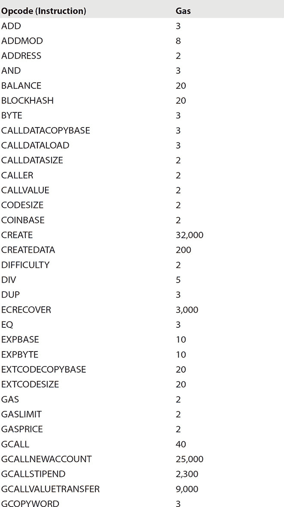

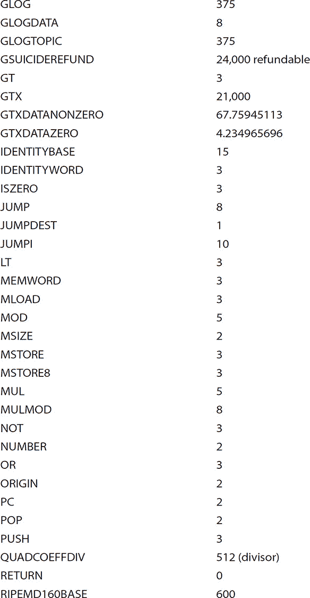

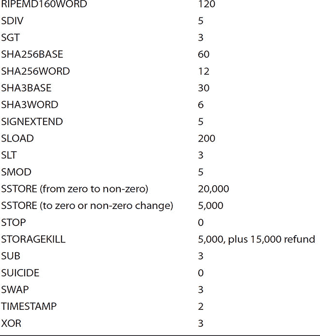

一些操作消耗更多的燃料（Gas）是因为它们在计算资源上非常密集。除了计算力费用之外，交易数据中的每个字节还必须支付 5 个燃料费。如我们之前所述，这种模型中费用结构的意图是确保发送者按比例支付每个使用的资源，无论是计算力、带宽还是存储。因此，资源密集型的合约和消息必须有一个与之成比例的燃料费。

#### 消息

以太坊合约有能力向另一个合约发送消息（可以多次进行）。由外部账户发起的交易可以在数据字段中包含值，这些值将传递给消息。在以太坊中，消息是一个虚拟对象，本身永远不会被序列化，只存在于执行环境中。它由以下字段组成：

-   **发送者（Sender）**   消息的发送者（隐含）

-   **接收者（Recipient）**   消息的接收者

-   **金额（Amount）**   与消息一起传输的以太币数量

-   **数据（可选）（Data (optional)）**   一个可选的数据字段

-   **开始燃料（Start Gas）**   一个值

如你所见，本质上消息非常类似于交易。区别在于它是由智能合约生成的，而不是外部参与者（尽管它可以由一个外部参与者触发）。当智能合约内的代码执行并调用`CALLopcode`函数时，它创建并执行一个消息。与交易类似，该消息被发送到运行其代码的接收方账户。因此，你可以看到智能合约与其他合约的交互方式与外部参与者账户的交互方式是一样的。需要注意的是，智能合约或交易指定的燃料限制是交易及其所有依赖执行的主导金额。所以，例如，如果账户 A 向账户 B 发送（提交）一个带有 100 燃料的交易，B 执行消耗 70 燃料的操作，然后向 C 发送一个消息。C 在返回之前执行消耗 25 燃料的操作。然后 B 可以在耗尽燃料之前（耗尽燃料异常）再使用 5 燃料。

#### 以太坊区块

以太坊中的区块是相关信息的集合（称为区块头部），H，以及与包含的交易对应的信息，T，以及一组其他区块头部，U，这些区块头部已知其父节点等于当前区块父节点的父节点（这样的区块被称为 ommers2）。

以下是在区块头部存在的字段：

•   **parentHash**   该区块父区块头的整个 Keccak 256 位哈希值；正式表示为 Hp。

•   **ommersHash**   该区块 ommers 列表部分的 Keccak 256 位哈希值；正式表示为 Ho。

•   **beneficiary**   所有从成功挖出此区块中收取的费用转到的 160 位地址；正式表示为 Hc。

•   **stateRoot**   在所有交易执行并应用最终确定后，状态 trie（Merkle Patricia Tree 或基数树）的根节点的 Keccak 256 位哈希值；正式表示为 Hr。

•   **transactionsRoot**   该区块交易列表部分的 trie 结构根节点的 Keccak 256 位哈希值；正式表示为 Ht。

•   **receiptsRoot**   该区块交易列表部分填充的每个交易收据的 trie 结构根节点的 Keccak 256 位哈希值；正式表示为 He。

•   **logsBloom**   由包含在每笔交易收据中的每个日志条目中的可索引信息（日志器地址和日志主题）组成的 Bloom 过滤器；正式表示为 Hb。

•   **difficulty**   与该区块难度级别相对应的标量值。这可以从上一个区块的难度级别和时间戳计算得出；正式表示为 Hd。

•   **number**   等于祖先区块数量的标量值。创世区块的编号为零；正式表示为 Hi。

•   **gasLimit**   等于每块燃料消耗限制的标量值；正式表示为 Hl。

•   **gasUsed**   等于在此区块中交易中使用的总 gas 的标量值；正式地，Hg。

•   **时间戳**   一个与该区块创建时 Unix 时间()的合理输出相等的标量值；正式地，Hs。

•   **extraData**   包含与该区块相关的数据的任意字节数组。这个必须不超过 32 个字节；正式地，Hx。

•   **mixHash**   一个证明与 nonce 结合，在该区块上进行了足够计算的 256 位哈希；正式地，Hm。

•   **nonce**   一个证明与 mix-hash 结合，在该区块上进行了足够计算的 64 位哈希；正式地，Hn。

区块中的其他两个组件简单地说就是一个区块头的列表（与上面相同的格式）和一个交易系列。

#### 状态转换函数（STF）

与比特币和其他加密货币一样，以太坊的账本本质上是一个状态转换函数（STF）的结果，该函数在交易执行前获取网络状态，并执行交易后产生新的状态作为结果。参见图 5-3 以太坊状态转换函数的图形描述。

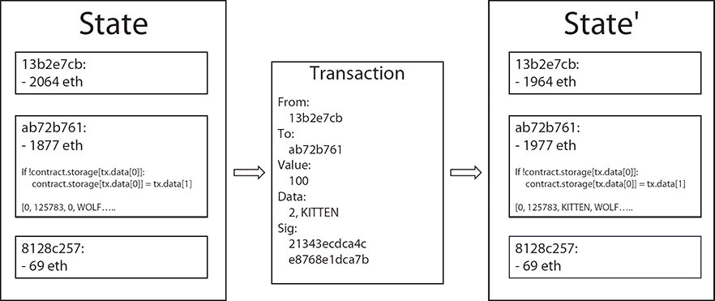

**图 5-3  以太坊状态转换函数（STF）**

以太坊 STF（即 APPLY(S,TX) -> S’）的具体内容如下：

1.   检查以下内容，如果任何不正确，则返回错误：

•   交易格式正确且值的数量正确。

•   签名是有效的。

•   非 once 与发送者账户中的 nonce 匹配。

•   如果以上任何一点不正确，则返回错误。

2.   计算交易的费用为 Start Gas * Gas Price，并从签名中推导出发送者账户地址。从发送者的账户余额中减去计算的交易费用，并增加发送者的 nonce。如果发送者账户中金额不足，则返回错误。

3.   最初将 Gas 设置为 Start Gas，并从中扣除一定数量的 gas 来支付交易中的字节（这是存储费用）。

4.   将交易值从发送者账户转移到接收账户。如果接收账户尚不存在，则创建它。如果接收账户是一个合约，则运行合约代码，直到执行耗尽燃料（Out-of-Gas 异常）。

5.   如果价值转移失败，是因为发送者没有足够的钱，或者代码执行耗尽了燃料，那么除了支付费用外，回滚所有状态更改，并将费用添加到矿工的账户中。否则，将剩余的所有燃料费用退还给发送者，并将消耗燃料的费用发送给矿工。

现在让我们通过一个例子来工作。假设一个合同的存储开始为空，发送一个带有 10 个以太币价值，4000 个气体，0.001 个以太币气体价格和 32 个字节数据的交易，字节 0-15 表示数字 4，字节 16-31 表示字符串“`KITTEN-AND-WOLF`”。在这个特定示例中的状态转换函数的过程如下：

1. 检查交易是否有效且格式正确。

2. 检查交易发送者至少有（4,000 * 0.001）4 个以太币。如果有，那么从发送者的账户中减去 4 个以太币。

3. 初始化气体=4000；假设交易长度为 120 字节，字节费用为 5，从气体中减去 600，剩下的气体为 3400。

4. 从发送者的账户中再减去 10 个以太币，并添加到合同的账户中。

5. 运行代码。代码检查合同存储在索引 4 处是否使用；如果可用，它将值设置为 KITTEN-AND-WOLF。想象这需要 1177 个气体，所以剩余的气体为 3400 - 1177 = 2223。

6. 退款（2,223 * 0.001）2.223 个以太币回到发送者的账户，并返回结果状态。

如果没有在交易的接收端有合同，那么总交易费用将简单地等于提供的气体价格乘以交易的字节长度，发送的交易数据将无关紧要。重要的是要注意消息在回滚方面与交易的方式相同——也就是说，如果一个消息执行耗尽了气体，消息的执行以及由执行触发的所有依赖执行都将回滚，但父执行不需要。这使得合同调用另一个合同是可以的，所以如果 X 用 F 个气体调用 Y，那么 X 的执行保证最多损失 F 个气体。对于用于创建合同的 CREATE 操作码，其执行过程与 CALL 操作码类似，不同之处在于执行的结果确定了新创建合同的代码（逻辑）。

#### 代码执行

Ethereum 合同中的 EVM 代码是一种低级、基于栈的字节码语言。代码是一系列代表操作的字节。通常，在 EVM 中的代码执行是一个无限循环，执行当前程序计数器（即从零开始的索引）处的操作，并将此计数器加 1，直到发生以下三种情况之一：代码结束，异常，遇到 STOP 或 RETURN 指令。在操作执行时，它有四个区域用于读取数据，在大多数情况下用于存储数据：

• 栈 它采用 LIFO（后进先出）原则。数据推送到栈顶或从栈顶弹出数据。计算结束时重置。

• 内存 这是一个无限可扩展的字节数组。计算结束时会重置。

•   **存储** 这是合约的键/值存储。它在计算结束后持久化。

•   **其他**    执行代码可以读取消息的值、发送者和数据。它还可以访问区块头数据，并可选择返回一个字节数组。

以太坊虚拟机执行模型很简单。当 EVM 运行时，其完整的计算状态可以用以下数据元组（集合或行）来定义：

`block_state, transaction, message, code, memory, stack, pc, gas`

其中`block_state`是包含所有账户（包括余额和存储）的顶层或全局状态。在执行的每一步开始时，通过取`code`（或`pc`设置为一个大于`code`项目长度的值时为 0）的`pc`（程序计数器）字节来找到当前指令，每个操作码（或指令）都有它自己的定义，定义了它是如何操作这个元组的。例如，`ADD`操作从栈顶弹出两个项目，将它们相加，并将它们的和值推送到栈顶。然后它将`gas`减少 3，并将`pc`增加 1，`SSTORE`（将单词保存到存储中）从栈顶弹出两个项目，并将第二个项目插入到由第一个项目指定的合约存储中的索引位置。然后它将`gas`减少 20,000，并将`pc`增加 1。

#### 图灵完备

以太坊虚拟机（EVM）被认为是可以进行图灵完备计算的。这是什么意思呢？这意味着 EVM 代码可以编码任何可想象的计算，这包括循环。EVM 代码循环有两种方法。第一种方法是使用两个直接指令：JUMP，它允许执行跳回到代码中的前一个位置，JUMPI，它允许执行带有 if/then/else 或 while 语句的条件跳转。第二种方法是通过递归调用。例如，合约 A 可以调用合约 B，而合约 B 又可以反过来调用合约 A，依此类推。这带来了一个问题，即网络上的恶意行为者可以部署包含无限循环逻辑的合约，从而有效地关闭节点和网络相关的挖矿。这个问题在计算机科学中被称为停机问题，即无法确定程序是否会完成运行还是永远运行下去。以太坊通过简单的经济学原理来解决这个问题。当一个交易被提交到区块链上时，它包含一个字段，Gas（或 Start Gas），它指定了该交易可以执行的最大计算步骤数。一旦超过这个阈值，计算就会回滚，但矿工的费用仍然要支付。对于消息，同样的机制也适用。让我们通过一些恶意行为者的场景来看看以太坊平台是如何处理这些问题的。

恶意参与者构建并部署了一个包含无限循环的合约。他们发送一个激活循环的交易。矿工处理该交易，启动无限循环。即使它在耗尽燃料前就停止了，从矿工的角度看，这个交易仍然被认为是有效的，他们会从攻击者那里收取每个计算步骤的费用。

恶意参与者再次尝试创建一个非常长的无限循环，迫使矿工长时间进行计算。当计算完成时，将产生更多区块，矿工将无法将交易包含在他们正在处理的区块中，以收取费用。这时，启动燃料字段，限制执行可以采取的计算步骤数量，需要设置得足够高且不寻常，为矿工提供足够的线索来判断交易的恶意意图，并有机会拒绝它。

恶意参与者审查的合约代码类似于：

`send(A, contract.storage[A]); contract.storage[A] = 0;`

恶意参与者发送了一个仅运行第一步的交易——换句话说，就是提取一定金额。但将金额设置为零的部分没有执行。网络（特别是合约作者）不需要担心处理和防范此类攻击，因为当交易耗尽燃料时，更改将被撤销。注意，矿工仍然会得到用于处理第一个指令的燃料费，所以恶意参与者仍然需要支付。

创建并部署了一个按以下方式工作的合约。它引用了七个数据源，并取七个数据的平均值作为计算风险因子的方式。恶意参与者找到了一种妥协其中一个数据源的方法，并改变其功能，使其运行无限循环，从而迫使任何尝试从合约中计算风险因子的尝试耗尽燃料。然而，以太坊设置消息燃料限制的功能将防止这种情况造成问题。请注意，将七个值组合成平均值的功能仍然需要处理一个或多个数据源未响应的情况并做出适当反应。

总之，停机问题和相关的图灵完备性在以太坊的设计和架构下出奇地容易管理。

#### 可扩展性

人们对以太坊平台的可扩展性表示担忧。毕竟，它基于区块链技术，设计上必须将交易和区块复制到网络中的每个节点，那么它的可扩展性究竟能达到何种程度呢？让我们回顾一下可扩展性的定义。它是一个系统、网络或处理大量工作能力的能力，或者说是其扩展以适应这种增长潜力的能力。在撰写本文时，比特币区块链的大小约为 159 GB，每 10 分钟大约增长 1 MB。如果比特币网络要处理一家主要信用卡公司的交易量，它可能会每 3 秒增长 1 MB，大约每小时增长 1 GB 或每年增长 8 TB。每个节点都需要具备一些处理如此大量数据所需的重要资源能力。以太坊区块链的大小为 57 GB，也会遭受同样的增长模式。更复杂的是，以太坊是一个包含应用程序和代码的应用平台，而不仅仅是加密货币。以太坊的缓解之处在于完整节点只需存储状态，而不必存储完整历史。然而，这种缓解与区块链大小的巨大增加相结合，因此你会开始看到越来越少的全节点和越来越多的简化支付验证（SPV）节点，增加了中心化的风险。风险在于完整节点可能会勾结，通过调整奖励来欺骗平台。SPV（或轻量级）节点不会立即发现这个问题。除了比特币现金（BCC）的分叉之外，还有一些建议可以减轻比特币未来可扩展性问题。对于以太坊平台，已经实施了两种策略来应对可扩展性问题。首先，由于挖矿算法，每个矿工都被强制成为一个完整节点。其次，在处理每个交易后，会保存一个中间状态树根到区块链上。在中心化事件发生的情况下，只要网络上有一个诚实的矿工，问题就可以通过验证过程得到解决。所以如果一个恶意矿工发布了一个无效区块，验证节点会运行相同的计算，并看到生成的状态与提供的状态不匹配，从而拒绝该交易。

切换到 Casper，一个权益证明（PoS）共识算法，也据说可以改善与当前工作量证明（PoW）共识方法相关的可扩展性问题。在基于 PoW 的区块链中，共识算法奖励解决加密谜题的节点。获胜的矿工验证交易并创建新区块。在基于 PoS 的区块链中，一组验证者轮流提出和投票下一个区块，每个验证者的投票权重取决于他们押注的大小（或存款）。这种 PoS 方法据说在安全性、减少中心化风险和能源效率方面优于 PoW。

#### 基础设施：存储和通信

所有成功的计算机平台的核心都需要以最有效和最安全的方式进行数据的*计算*、*持久化*和*通信*。以太坊虚拟机（EVM）涵盖了计算（或计算）方面，那么让我们来看看用于持久化和通信的方面。

•  **去中心化文件存储（持久性）**  Swarm 是一个点对点（p2p）的文件共享系统，使用 ETH 的微支付进行支付。在 Swarm 中，数据文件被分解成块，分布并存储在参与网络的节点上。需要存储和检索数据的应用程序和智能合约会补偿那些持久化和提供数据的节点。

•  **通信**  Whisper 是一种加密的通信协议，允许节点直接彼此发送消息，同时隐藏发送者、接收者和消息，使其免受第三方窥探者的干扰。

##### INFURA

INFURA 是一个可扩展的、基于标准、全球分布式的集群和 API 端点，用于以太坊、IPFS（星际文件系统）和其他新兴的去中心化基础设施。其使命是提供安全的、稳定的、健壮的、平衡的、容错性好且易于扩展的以太坊和 IPFS 节点。本质上，INFURA 是一个共享的基础设施层，作为连接区块链的桥梁。对于以太坊 dapp 开发者来说，INFURA 消除了安装、配置和维护以太坊节点的需要。特别是对于 IPFS，它实现了分布式存储，可以无缝地访问，而无需管理基础架构的麻烦。图 5-4 展示了 INFURA 的高级架构。

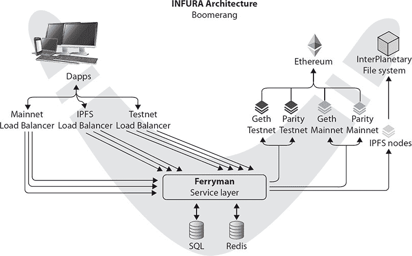

**图 5-4   INFURA**

以下是 INFURA 能力的亮点：

•  向运行本地软件的去中心化应用程序暴露支持 TLS（传输层安全）的端点，以无缝地访问 IPFS。

•  为支持 CORS（跨源资源共享）的以太坊提供 TLS-enabled 端点，并提供可在 JSON-RPC API（包括`web3`和`eth`方法）中使用的功能。

•  将签名原始交易广播到以太坊区块链。

•   提供 Ferryman，一个反向代理，帮助缓存、节流、日志记录、扩展和可靠性，并为智能请求路由到多个专用后端客户端，如 EthereumH、Geth、Nethereum、Parity、Strato 或任何其他以优化方式执行某些操作的客户端。

•   在以太坊主网（ETH）、以太坊测试网（Morden）和以太坊 ConsenSysNet 上运行。

以下是开始使用 INFURA 所需的步骤：

1. 在[`infura.io/register.html`](https://infura.io/register.html)注册一个 INFURA 访问令牌。尽管这项服务是免费的，但请求需要被 RPC 提供者端点识别。

2. 选择一个网络。这可以是生产环境，也可以是众多测试网络之一。

3. 向 INFURA 发起请求。可用的请求列表可以在[`infura.io/docs/#supported-json-rpc-methods`](https://infura.io/docs/#supported-json-rpc-methods)找到。请注意，如果你省略了访问令牌，调用可能仍然可以工作，但它们受到更严格的限制和过滤可用 JSON-RPC API 调用。

4. 或者你可以使用在[`docs.infura.apiary.io/`](http://docs.infura.apiary.io/)文档化的 REST（ish）API。

### 去中心化应用

去中心化应用（dapp）就像其他现代网络架构应用一样，通常由一个用户界面（UI）组成，其功能由后端服务（读写持久存储、处理、复杂逻辑）支持。这些后端服务通常使用以太坊平台，特别是部署在其上的智能合约。参见图 5-5 一个示例 dapp。

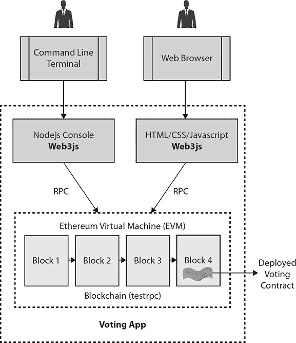

**图 5-5   以太坊 dapp**

#### 去中心化应用轮廓

尽管以太坊及其建立在之上的去中心化应用的生命周期还很短，但越来越明显，出现的应用似乎符合以下轮廓：

•   **去中心化**   操作的完整记录必须存储在公共区块链上，该区块链旨在防止中心化的陷阱（在本章前面有更多关于以太坊方法的讨论）。

•   **激励**   区块链的验证矿工通过加密令牌或价值奖励。

•   **开源**   理想情况下，它应由自主性治理，所有更改必须由其用户的共识或多数决定。其代码库应可供审查。

•   **协议**   应用社区必须就一个加密算法达成一致，以展示价值证明（无论是通过工作量证明或权益证明，或两者的结合）。

回顾起来，第一个 dapp 是以太坊。我们认为比特币只是一种加密货币，但它是一个分布式账本，提供无需中介或 governing 当局的价值转移，并满足上述所有轮廓条目。

现在有很多基于以太坊的 dapps 例子。如果你访问 Dapps 的状态网站([`dapps.ethercasts.com/`](https://dapps.ethercasts.com/))，你会发现有超过 700 个 dapps 处于不同的发展阶段。在市值方面最成功的一些例子包括 Augur（预测市场）、Golem（分布式计算）和 Melonport（资产管理门户）。

### 去中心化自治组织

去中心化自治组织（DAO）使用与比特币相同或类似的思维过程，消除了中心化的中介，并将这种模式扩展到企业结构中。这个想法是，公司和其它组织可以不存在或运行在层级管理之外。DAO 试图将公司运行的规则编码（写入代码）。这些规则包括哪些项目应该获得资助、如何接受投资、如何偿还投资者以及如何修改和扩展治理规则（这很可能意味着分叉 DAO 代码或创建新的 DAO，并将价值从旧转移到新）。图 5-6 展示了一个 DAO 拓扑示例。基本上，DAO 的工作方式与典型公司相同，但其规则是数字编码的，可以自动强制执行和执行。

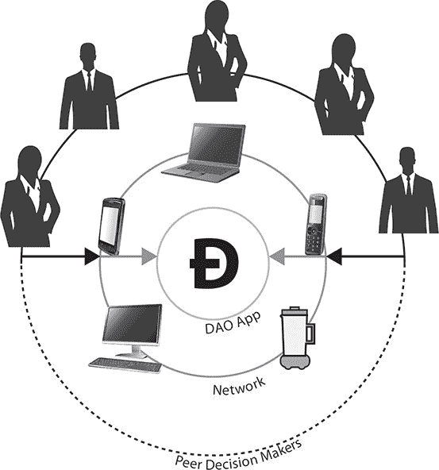

**图 5-6   去中心化自治组织（DAO）**

最大的 DAO 问题是，当遇到无法预见的情况时，其结构和当前的代码库可能不支持修复或更改以克服或解决这种情况。不过，关注并参与其中仍然是有价值的，这样可以通过解决问题和进行迭代来完善。

### 总结

以太坊通过其状态转换函数，提供了一个开放性的平台，非常适合作为金融和非金融去中心化应用的框架。关于监管，目前还在讨论中。它甚至可能适用于全球去中心化平台，这一点还不清楚。现有的法律和规定将会追赶上并适用于这些平台。然而，探讨特定应用的法律和监管影响仍然很重要。在受监管的行业运营的企业，在将关键的、面向客户的或数据处理过程与以太坊等平台集成之前，应寻求监管机构的指导。在金融服务领域，私有和联盟类型的区块链已经取得了重大进展，这清楚地表明金融机构正在密切关注这一领域。
