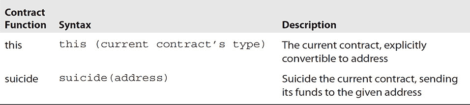

## 6   快速通道应用教程

每当新技术出现，尤其是对于我们开发者来说，我们首先想要学习的是如何使用这门语言来调用其功能和操作其数据类型。我们想要知道如何开发、验证和部署应用。区块链也不例外。在当前时间，比特币区块链并不提供许多应用所需的大量功能，而区块链的应用可以非常有益。然而，以太坊通过使用 Solidity 的智能合约功能确实提供了这些综合功能。在本章中，我们将介绍 Solidity 这门语言，以及一个基于浏览器的集成开发环境（IDE）来编写和部署以太坊合约。在本书撰写于 2017 年年中时，以太坊 IDE 尚未成熟。这在新技术和开发中很常见，就像 Java 一样。当 Java 开发在 20 世纪 80 年代末开始时，开发者使用像记事本这样的文本编辑器来编写 Java 程序，并将它们部署到应用服务器上。那是一个艰难的开发者时期。十年后，像 Eclipse 这样的 IDE 简化了 Java 应用程序的开发、测试和部署。这种演变无疑会在区块链以太坊和 Solidity 上发生。这只是时间问题。

### 介绍 Solidity

**Solidity**这个词语指的是结构坚固或强劲的品质或状态。Solidity 语言是一种以合约为中心的高级语言，其语法与 JavaScript 相似。它被设计用来针对以太坊虚拟机（EVM）。Solidity 是静态类型的，并支持继承、库以及复杂的自定义类型等众多特性。本章将为 Solidity 提供基本的介绍，并假定读者对编程有一定的了解。您可以在浏览器中开始使用 Solidity，无需下载或编译任何内容。这个应用程序只支持编译——如果您想要运行代码或将其注入区块链，您必须使用像 INFURA 这样的客户端或区块链网关服务。

#### Solidity 基础

如前所述，Solidity 是一种用于编写智能合约的对象导向编程语言。开发者会问这样的问题，“Solidity 是图灵完备的吗？” 命令式语言如果是图灵完备的，那么它具有条件分支（如`if`、`while`、`for`）、条件循环语句，以及改变任意内存的能力，比如维护任意数量变量的能力。由于这些特性几乎总是存在，如果忽略有限内存的限制，大多数或全部的命令式语言都是图灵完备的。常用的开发语言 C、C++、C#、Java、Lua 和 Python 都是图灵完备的，Solidity 也是如此。话说回来，除了`switch`，Solidity 中大多数控制结构都来自 C/JavaScript。

让我们从一些基本代码示例开始。首先要问的是当前 Solidity 的版本是什么。在开始时，你应该总是去 GitHub 网站([`github.com/ethereum/solidity/releases`](https://github.com/ethereum/solidity/releases))，该网站列出了 Solidity 的发布和新功能。一旦你知道了，合同中的第二行就是版本。如果你看下面的示例代码，你会注意到指定了在撰写本文时 Solidity 的当前版本。

如前所述，第一行表明源代码是为 Solidity 版本 0.4.16 编写的。关键词或指令`pragma`（来自“实用主义”）是一个语言结构，用于指定编译器或转换器应如何处理其输入。

在 Solidity 中的合约是包括执行和记录合约状态的功能和数据的代码。合约位于以太坊区块链上的特定地址。这个合约，StorageState，如果用 Java 编写，就是一个 bean。Java bean 声明一些变量，并为每个变量包括一个 getter 和一个 setter，用于修改或检索变量的值。bean 通常是一个在类与类之间传递的数据结构，包含我们希望共享的数据。`uint stateData`;这行代码声明了一个名为 stateData 的状态变量，其类型为 uint，是一个 32 字节的无符号整数。这个合约，如前所述，是一个 bean，允许任何人存储一个可以被任何人发布的数字。正如在 Java 中一样，通过将变量声明为 private，我们设置了访问限制，使得只有内部合约代码可以修改变量。正如你所期望的，单行注释(//)和多行注释(/*...*/)如所示。

##### Solidity 控制和流语句

与当前大多数计算机语言一样，有熟悉的构造：亚里士多德条件 if-then-else，循环功能 while 和 for 以及 break、continue、return。请参阅表 6-1 描述和示例。

**表 6-1** 执行的功能和控制

##### 数据类型

Solidity 是一种静态类型语言，这意味着每个变量（状态和本地）的数据类型需要在编译时指定。以下数据类型也被称为值类型，因为它们总是按值传递，而不是按引用，即它们在作为函数参数或在赋值中使用时总是被复制。请参阅表 6-2 描述和示例。

**表 6-2** Solidity 数据类型及相关函数

##### 可见性指定符

函数和存储变量可以被指定为公共的、内部的或私有的，其中函数的默认属性是公共的，存储变量的默认属性是内部的。此外，函数还可以被指定为外部的。详见表 6-3 对于描述和示例。

**表 6-3** 常量和变量的可见性

##### 区块和交易属性

在全局命名空间中存在特殊的变量和函数。它们提供了关于区块链的信息。详见表 6-4 对于语法和描述。

**表 6-4** 区块和交易属性

##### 运算顺序

表达式的求值顺序未指定（更正式地说，表达式树中一个节点的子节点的求值顺序未指定，但当然它们会在节点本身之前被求值）。唯一保证的是语句按顺序执行，并且布尔表达式的短路求值已经完成。详见表 6-5 对于描述和操作符。

**表 6-5** 运算顺序

#### 智能合约函数和参数

函数是用函数关键字定义的，后面跟着一个名称，后面跟着一对括号（）。函数名称可以包含字母、数字、下划线和美元符号（与变量相同的规则）。括号内可以包括由逗号分隔的参数名称（parameter1, parameter2, ...）。函数要执行的代码放在花括号{}内。当函数达到一个返回语句时，函数将停止执行。

如果函数是从一个语句中调用的，合约将会“返回”在调用语句之后执行代码。函数通常会计算一个返回值。返回值被“返回”给“调用者”。详见表 6-6 对于描述和示例。

**表 6-6** 函数和参数

##### 密码学函数

密码学哈希函数是一类具有使其适用于密码学特性的特殊哈希函数。它是一种将任意大小的数据映射到固定大小的位字符串（哈希函数）的数学算法，旨在也成为一个单向函数——即，一个难以逆向的函数。从理想的密码学哈希函数的输出重建输入数据唯一的方式是尝试可能的输入进行暴力搜索以查看它们是否产生匹配，或者使用匹配哈希的彩虹表。

安全哈希算法是一系列由美国国家标准与技术研究院（NIST）发布的密码学哈希函数，作为美国联邦信息处理标准（FIPS）。详见表 6-7 对于语法和描述。

**表 6-7** 密码学函数

##### 与合约相关的函数

当前合约的所有函数都可以直接调用，包括当前函数。有关语法和描述，请参见表 6-8。

**表 6-8** 合约相关函数

##### 地址上的函数

可以通过属性 balance 查询地址的余额，并通过 send 函数向地址发送以太币（以 wei 为单位）。有关语法和描述，请参见表 6-9。

**表 6-9** 地址上的函数

##### 构造函数参数

Solidity 合约期望在合约数据本身结束之后提供构造函数参数。这意味着您通过在编译器返回的通常的应用二进制接口（ABI）格式的编译字节之后放置这些参数来调用合约。ABI 是您如何调用合约中的函数以及如何返回数据的途径。ABI 就像一个应用程序编程接口（API）。它规定了函数是如何被调用的，以及参数是以哪种二进制格式传递的。以太坊智能合约是运行在以太坊区块链上的字节码。一个合约中通常有许多函数。ABI 提供了关于如何调用合约中的函数的规范，并确保函数将返回预期格式的数据。

从以太坊 ABI 规范中，一个例子：

如果我们想要用参数 77 和 true 调用 abc，我们会传递总共 68 个字节，这可以分解为以下内容：

•   方法 ID：这是由 ASCII 格式的签名 `abc(uint32,bool)` 的 Keccak-256 哈希的前 4 个字节生成的。

•   0x000000000000000000000000000000000000000000000000000000000000004D：第一个参数，一个 uint32 值 77 填充至 32 个字节。

•   0x0000000000000000000000000000000000000000000000000000000000000001: 第二个参数，布尔值 true，填充至 32 个字节。

使用像 web3.js 这样的高级库抽象了大多数这些细节，但仍然需要以 JSON 格式的 ABI 提供给 web3.js。

ABI 是一种抽象，不是以太坊核心协议的一部分。任何人都可以为其合约定义自己的 ABI。不过，所有开发者使用 Solidity、Serpent 和 web3.js 会更简单，这些工具都符合上述 ABI。

##### 访问器函数

编译器会自动为所有公共状态变量创建访问器函数。下面给出的合约将有一个名为 `data` 的函数，该函数不接受任何参数并返回一个 uint 类型，即状态变量 data 的值。状态变量的初始化可以在声明时完成。

#### 存储布局

静态大小的变量（除了映射和动态大小的数组类型之外的所有类型）从位置 0 开始在存储中连续布局。如果可能的话，多个需要少于 32 字节的项会被打包到单个存储槽中，遵循以下规则：

•   存储槽中的第一个项目是低位对齐存储。

•   基本类型只使用存储它们所必需的字节数。

•   如果一个基本类型不适合存储槽的剩余部分，它会被移动到下一个存储槽。

•   结构体和数组数据总是开始一个新的槽位，并占用整个槽位，但结构体或数组内的项目是根据这些规则紧密打包的。

结构体（struct）和数组（array）的元素是按照顺序存储的，就像它们被明确给出一样。

由于它们的大小不可预测，映射和动态大小的数组类型使用`sha3`计算来找到值或数组数据的起始位置。这些起始位置总是完整的栈槽位。

映射或动态数组本身根据上述规则（或通过递归应用此规则对映射到映射或数组）在存储中占用某个位置的（未填充）槽位。对于动态数组，此槽位存储数组中的元素数量。对于映射，该槽位未使用，但它是为了使两个相等的映射紧随其后时会使用不同的哈希分布而必需的。数组数据位于`sha3(p)`，与映射键对应的值位于`sha3(k . p)`，其中.是连接。如果值再次是非基本类型，通过添加`sha3(k . p)`的偏移量来找到位置。

所以对于下面的合约片段：

### 在您的浏览器中运行以太坊 Dapps

在区块链之前，构建大型“Web2”应用程序的应用开发生命周期是使用 HTML、CSS、JavaScript、REST web 服务、Java、SQL 和 NOSQL 数据存储等工具构建的。现在它被修改以将区块链集成到该堆栈中。以太坊使去中心化的网络，即“Web3”成为可能。与 Web2 不同的地方在于，在以太坊上，除了用于访问支持智能合约执行的某些可验证条件所需的 web 服务器外，web 服务器都不存在。所以新的 dapp（去中心化应用程序）就像大多数应用程序一样。它由两部分组成：经典的 前端和后端架构。正如您所预期的，前端要么处理像 REST 这样的 web 服务，要么提供 HTML/CSS 用户体验以处理用户请求并提供响应。应用程序的另一个部分是后端，它与区块链交互，新的“数据库”。那么，网络浏览器应用程序是如何与区块链交流的呢？

MetaMask 通过为普通浏览器提供访问区块链和提出交易的方式，解决了区块链关键的易用性问题，帮助任何人轻松、安全地在区块链上完成任何操作，从而启用了一种新的网页浏览体验。

MetaMask 是一个浏览器扩展，它将 web3 API 注入到你访问的每个网站。使用 MetaMask，你可以使用你熟悉的浏览器来浏览新兴的去中心化网络。使用 MetaMask 的关键优势是简化的密钥管理。它本地加密你的私钥，并要求用户在请求之前确认和签署交易和消息，然后将其传达给以太坊区块链。

为了与区块链互动，客户端需要访问整个链。这意味着 MetaMask 要与区块链互动，需要在本地下载整个区块链供使用。为了避免这个问题，可以使用“零客户端”网关，通过 RPC 即时访问区块链。上一章讨论了 JSON-RPC API。MetaMask 使用 INFURA 作为其网关，通过安装一个扩展就可以简单地进行即时设置。

#### 安装 MetaMask

MetaMask 目前作为 Chrome 扩展提供，其他浏览器支持正在积极开发中。技术正在快速发展，最终可能允许 MetaMask 在不需要扩展的情况下在浏览器内运行。要安装 MetaMask，只需访问 Chrome 网上应用店，搜索并安装 MetaMask。

#### 使用 MetaMask 开发合约

安装后，你将在浏览器工具栏看到 MetaMask 狐狸标志。第一次使用应用程序时，你需要生成你的钱包公钥和私钥。私钥将使用你设置的密码在本地加密。你还将被提供一个恢复种子短语，如果你计划使用 MetaMask 存储真实价值，你应该安全地保存和存储这个短语。如果你忘记你的钱包密码，丢失你的电脑，或者以其他方式无法访问你的 MetaMask 钱包，你将能够使用这个种子短语恢复到一个新的浏览器。

Ethereum 钱包是进入以太坊区块链上去中心化应用的门户。它允许你持有和保管以太币和其他建立在以太坊上的加密资产，以及编写、部署和使用智能合约。MetaMask 在你的浏览器内部提供了以太坊钱包。MetaMask 托管了一个包含你私钥的钱包——一个以太坊钱包——并允许你直接在 Chrome 浏览器中访问网站并进行交易，就好像你的钱包就在网站旁边一样。MetaMask 用户界面相当简单，如图 6-1 所示。你的以太坊账户地址可用，附有链接到流行区块链浏览器上账户活动的更详细视图。在以太坊主网上，你有通过与 Coinbase 等流行交易所的集成选项购买以太币代币，你可以在那里用法定货币如 USD 购买以太币，或者通过 ShapeShift 转换现有的加密货币如比特币到以太币。你也可以发送交易，包括将以太币代币发送到另一个账户或智能合约。

**图 6-1   MetaMask 用户界面**

为了与以太坊区块链交互，有必要为智能合约的每个计算步骤支付“燃气”费用。由于在开发过程中这可能变得相当昂贵，因此存在测试网络，在这些网络中，以太币没有实际价值。这样，开发和测试可以在不承担价值损失风险的情况下进行。这样一个测试网络被称为 Ropsten。MetaMask 原生支持 Ropsten，使用 INFURA 在后台与 Ropsten 链通信。现在，你可以在 MetaMask 界面的顶部导航栏上切换 MetaMask 以使用 Ropsten 网络。

在下一步中，我们将开始编写我们的第一个智能合约。为了将其部署到 Ropsten 测试网络，我们需要一些 Ropsten 测试以太币。你可以在 MetaMask 中点击购买按钮获取 Ropsten 喷泉的链接。在喷泉处，你可以请求 1 以太币。一旦这笔交易包含在 Ropsten 区块链上，你 MetaMask 中的以太币余额将是 1。我们稍后会回到这里，当我们部署一个智能合约时。

MetaMask 是允许你的基于网页的去中心化应用程序与区块链交互的网关。部署在区块链上的智能合约是去中心化网络的支柱。现在我们已经有了与这些智能合约交互的网关，我们可以更详细地了解如何编写和部署它们。

#### Remix/Browser Solidity

以太坊区块链上的智能合约是用高级语言编写的，并编译成由以太坊虚拟机（EVM）解释的字节码。为以太坊专门开发的以下语言有编译器：LLL、Serpent 和 Solidity。人们正在积极努力进一步开发 LLL 和 Serpent，但目前 Solidity 是以太坊开发者中最受欢迎的语言。深入了解 Solidity 的最简单方法是通过 Remix Solidity IDE 和编译器。

Remix 是一个在线 Solidity 编辑器，它支持编译 Solidity 代码，甚至可以使用 MetaMask 将其部署到区块链上。要访问 Remix，请访问[`remix.ethereum.org`](https://remix.ethereum.org)。

当你第一次访问 Remix 界面时，你将在编辑器窗口中看到示例 Solidity 代码。对于这个练习，我们将从一个更基本的智能合约开始。

### 开发一个简单的智能合约

让我们编写我们的第一个智能合约！在浏览器中打开 Remix，并通过点击顶部左侧的+创建一个空的新文件。将以下 Solidity 代码输入编辑器：

这是一个非常简单的智能合约，当执行时会在该合约地址的交易日志中写入“Hello World!”。默认情况下，Remix 设置为在你输入时自动编译。当你完全输入了代码且没有语法错误时，Remix 界面右侧的合约标签页将显示编译后的字节码和与合约交互所需的应用程序二进制接口（ABI）。ABI 是一个你将在与智能合约交互的代码中使用的 JSON 格式文本字符串。

Remix 提供了一系列其他功能，包括调试器、形式验证，当然还有对 Solidity 语言完整文档的链接。Remix 集成了部署功能，与 MetaMask 结合使得部署变得无痛。

#### 部署智能合约

如前所述，Remix 编译器在你在编辑器窗口中输入时自动编译。当智能合约语法正确时，右侧的合约标签页会提供编译后的字节码；在合约详情标签页上有 ABI 和 web3 部署 JavaScript 代码。你应该看到类似于图 6-2 的东西。字节码是实际发送到区块链的内容。这个交易首先必须用你的私钥签署。MetaMask 使这变得简单。

**图 6-2   Remix 编译器带有智能合约 Solidity 代码**

首先，在 Remix 中，选择注入 Web3 在选择执行环境选项中。这告诉 Remix 你想要依靠 MetaMask 在你的浏览器中拦截和处理与 web3 API 的任何交互。现在你准备将 Hello World 部署到 Ropsten 网络。假设你已经将 MetaMask 指向 Ropsten，并且你的 Hello World 合约已经成功编译，你可以点击创建按钮。

当你点击创建时，Remix 会在 Ropsten 测试网络上创建一个交易。那个交易首先必须被签署，所以一个 MetaMask 窗口会弹出，要求你接受交易（参见图 6-3）。通过接受，你实际上是用你 MetaMask 钱包里的私钥签署了交易，并将签署的交易发送到以太坊区块链。

**图 6-3   MetaMask 交易签署**

接受之后，你会看到 Remix 告诉你交易正在等待被挖掘。一旦这个待处理的交易被挖掘，或者包含在一个区块中，你就能在区块链上找到这个新部署的智能合约的合约地址。在这个例子中，合约地址是`0x2f8eb76Db701a36f8F44C1cEf0402bD329F6C03B`。一旦这个合约被部署到区块链上，它就不能被更改、删除或篡改。现在它是一个不可变的软件片段，当执行时会精确地完成它应该做的事情。具体来说，记录“Hello World”。

#### 验证智能合约

为了验证我们的 Hello World 智能合约是否已部署，我们可以在区块浏览器中查找它。回想一下，大多数区块链的一个特性是对区块和每个交易中的数据完全透明。区块浏览器就像一个搜索引擎，允许你查看链上包含的所有数据。以太坊生态系统的领先浏览器是 Etherscan（etherscan.io）。

Etherscan 支持多个测试网络，除了主要的以太坊网络。要搜索你新部署的合约，首先在 Etherscan 中选择 Ropsten 网络。在 MISC 菜单上，你可以选择 Ropsten。然后，你可以输入你在部署合约时从 Remix 接收的合约地址进行搜索。Etherscan 应该将该地址标识为合约，而不是用户账户。合约持有 0 个以太币，并完成了一次交易，即我们刚刚完成的合约创建。你还将能够查看这个合约是在哪个区块中创建的，这可以在证明活动的时间线时很有用。此外，你将看到谁创建了合约——这是你的 MetaMask 钱包地址，因为 MetaMask 是签署交易并将其发送到测试网络的钱包。

既然我们知道合约存在，让我们执行它，以便我们可以验证它是否如我们预期的那样行为。要执行合约，我们需要向合约本身发送一个交易。向合约发送以太币是没有必要的——事实上，如果你这样做，那些以太币将永远丢失，因为合约没有写入处理发送给它的任何以太币。因此，我们可以向合约地址发送一个空交易来执行它。我们将如何发送交易？答案又是 MetaMask。

回到 MetaMask，确保你处于 Ropsten 网络。由于上一次交易只用了一点以太币，你应该还剩下很多以太币。要创建交易，在 MetaMask 中点击发送。在收件人地址处，输入你的智能合约地址。在金额处，保持为 0 并点击发送。再次，你会被提示接受交易。接受后，交易将被发送到 Ropsten，并最终包含在一个区块中并写入区块链。

回到 Etherscan，你会注意到现在这个智能合约有两个交易记录。第一个是合约的创建，最近的一个是我们刚刚发送的交易，导致代码执行。如果我们深入查看最近这个交易的细节，我们会看到一些关于交易本身的元数据。在 Etherscan 中，他们还提供了事件日志。在我们合约的事件日志中，数据负载以十六进制格式存储。Etherscan 便利地提供了文本转换，我们看到了我们所期望看到的内容：Hello World! 恭喜你成功部署了你的第一个智能合约！

#### 下一步：尝试 Truffle

如果你对一些有趣的教程感兴趣，或者你想开始使用以太坊区块链构建基于网页的应用程序，你会发现 Truffle 网络框架非常符合你的需求。对于许多类型的去中心化应用（DApps），Truffle 能做你想要的一切：它编译你的区块链合约，将它们注入到你的网页应用中，甚至可以针对它们运行测试套件！查看[`truffleframework.com/`](http://truffleframework.com/)获取文档和教程。

### 摘要

在本章中，我们介绍了 Solidity 智能合约编程语言以及使它简单易行、快速部署到以太坊区块链的工具。在下一章中，我们将介绍一些更复杂的支持处理更复杂开发工作流程的工具。
