## 7   以太坊应用最佳实践

### 以太坊区块链开发

截至 2017 年底我们撰写这本书时，集成的区块链开发环境（IDEs）仍然在涌现。Truffle（\[`truffleframework.com/\`](http://truffleframework.com/)）是一个用于以太坊的开发环境、测试框架和资产管道。

Truffle 提供：

•   内置的智能合约编译、链接、部署和二进制管理

•   自动化的合约测试

•   可脚本化、可扩展的部署和迁移

•   部署到任何数量的公私网络的网络管理

•   使用 ERC190 标准的 EthPM 和 NPM 的包管理

•   用于直接合约通信的交互式控制台

•   具有配置和紧密集成的构建管道的能力

•   在 Truffle 环境中执行的脚本运行器

#### 设置 Truffle 的开发环境

使用 Truffle 需要满足技术要求。你应该安装以下内容：

•   Node.js（\[`nodejs.org/en/\`](https://nodejs.org/en/)）

•   Git（\[`git-scm.com/\`](https://git-scm.com/)）

在开发基于 Truffle 的应用时，建议使用 EthereumJS TestRPC（\[`github.com/ethereumjs/testrpc\`](https://github.com/ethereumjs/testrpc)）。这是一个完整的内存中区块链，只在你的开发机上运行。它立即处理交易，而不是等待默认的区块时间——所以你可以快速测试你的代码是否工作——并且当你的智能合约出现错误时，它会立即告诉你。

你需要以下两个命令来安装用于以太坊和 Truffle 的 TestRPC：

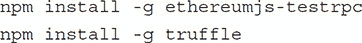

#### 设置 Truffle 项目

为了验证它是否安装成功，请输入

\`truffle list\`

在控制台窗口中输入以下内容以列出所有 Truffle 命令。

然后创建一个新的项目目录，cd 到它并输入：

\`truffle init\`

默认情况下，\`truffle init\`为你提供了一组示例合约（\`MetaCoin\`和\`ConvertLib\`），这些合约像是在以太坊之上的简单山寨币。你可以在浏览入门指南的同时使用这些合约快速学习，或者删除这些文件并构建自己的项目。

默认情况下，\`truffle init\`为你创建了一个简单的项目，这样你可以熟悉编写、编译和部署基于 Solidity 的智能合约。

然后在新的控制台窗口中运行以下命令来启动客户端节点：

`testrpc`

然后在另一个命令提示符窗口运行以下命令来编译和部署代码：

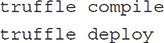

#### Truffle 目录结构

默认的 Truffle 目录结构包含以下内容：

•   \`/contracts\`：包含了我们智能合约的 Solidity 源文件。

•   `/migrations`：Truffle 使用迁移系统来处理智能合约的部署。迁移是一种额外的特殊智能合约，用于跟踪更改。

•   \`/test\`：包含了我们智能合约的 JavaScript 和 Solidity 测试。

•  `truffle.js`：Truffle 的配置文件。

除了这个简要概述之外，前往[`truffleframework.com/tutorials/`](http://truffleframework.com/tutorials/)尝试最新的 Truffle 教程和文档，继续你的以太坊区块链开发。

### 以太坊区块链开发：最佳实践

在深入代码设计和实现之前，让我们回顾一下定义了我们制作合约、应用程序和系统时需要考虑的可能性和限制属性。

以太坊区块链是一种第二代区块链。它包含了一代区块链的所有特性，如不可变的交易区块、工作量证明和加密验证。此外，以太坊区块链包含了一个图灵完备的虚拟机或 EVM（以太坊虚拟机）。这使得可以实现比比特币交易更丰富的应用。EVM 是一个简单的 256 位栈机器，拥有 1024 个栈的大小。EVM 代码作为智能合约部署。所有代码都提交到区块链上，并从 EVM 作为虚拟 ROM 访问。存储是按单词地址的字符串数组，作为区块链系统状态的一部分持久化。

可以认为 EVM 是全世界虚拟机的一个实例，在网络中的所有节点上同步。所有代码执行（交易和智能合约函数调用）都是由外部用户发起的——智能合约不会自己执行。代码执行被视为一个单一的交易。要么执行所有代码，并在区块链上持久化新状态，要么出现错误，一切都会回滚（除了挖矿奖励），就像关系数据库管理系统（RDBMS）中的 ACID 交易一样。

可以认为 EVM 是一个云计算服务，其中支付和执行是集成的。为了执行 EVM 代码并改变区块链状态和存储，向执行调用提供现金作为“燃料”。然而，每个块中可用的执行燃料是有限的。这意味着在单个交易中可以执行的代码量以及可以更改的存储量是有限和受限制的。这与现代开发形成鲜明对比，在现代开发中，您可以访问几乎无限的云计算资源。

在编写智能合约时，最好的心态是把它当作一个被送入太空的微控制器来编程。执行资源非常有限，燃料（gas）和内存及栈大小都有限。如果代码中有错误（bug），修复起来会很困难，需要考虑整个生命周期，包括考虑合约未来的安全性和运营需求。

#### 区块链技术

以太坊虚拟机（EVM）本身只是整个去中心化生态系统的部分。为了与智能合约交互和执行，还需要其他组件。如在第三章区块链技术应用中提到的，Web 3.0 组件包括：

•   Dapps：去中心化应用程序

•  合约：去中心化逻辑

•   Swarm：去中心化存储

•   Whisper：去中心化消息传递

最简单的解决方案是去中心化应用（dapp）。这种形式不需要中心服务器，只需要在浏览器中运行与用户交互的代码和一个底层智能合约（或智能合约集合）。浏览器代码（网络应用）可以从正常的网络服务器或 Swarm 或星际文件系统（IPFS）等去中心化存储中分发。在本章剩余的部分，我们将主要处理与传统系统交互的应用程序。

#### Solidity 基础继续

我们在第六章中介绍了 Solidity 和语言结构。现在让我们继续回顾基本语言元素。以下是一个展示所有权模式构造函数、修改器和事件的合约。

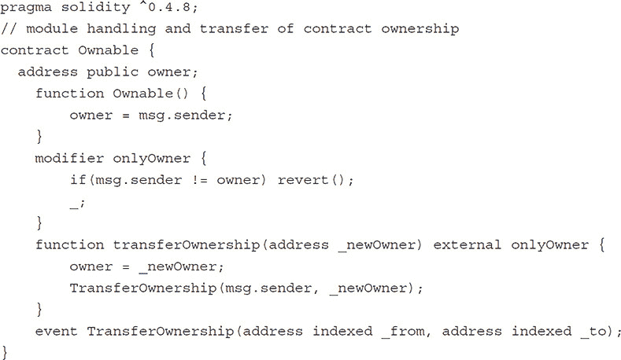

这是一个简单好用的基础合约，定义了一个`onlyOwner`修改器和一个函数，允许转让所有权，并在所有权更改时发出事件。然而，`transferOwnership`函数存在风险。如果用错误的地址调用它，合约的控制权将永远丢失。处理这种情况的一种方法是采用两阶段推/拉模式来转让所有权。首先，原所有者通过调用`transferOwnership`函数“推”出新所有者。这不会立即转让所有权，而是将地址存储在合约变量中，处于待定状态。其次，新所有者必须通过调用`acceptOwnership`函数来接受所有权。这将“拉”所有权给新所有者。请注意，*只有*在`transferOwnership`函数中指定的新所有者才能实际声称新的所有权，所有权*只有在*新所有者调用`acceptOwnership`函数后*才会*实际转让。如果新所有者的地址错误或新所有者失去了对账户的访问权限，那么所有权永远不会转让，从而避免了合约第一版可能出现的潜在困境。

通常，在处理诸如所有权的转移、退款等高影响不可逆函数时，采用两阶段推/拉的做法是一个好习惯。

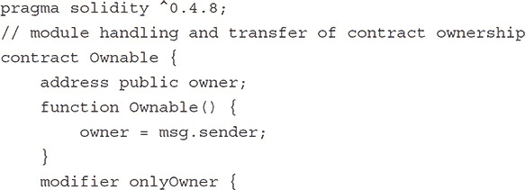

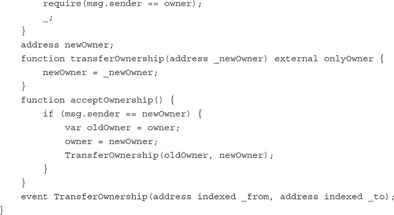

#### 合约中调用合约

以太坊虚拟机环境的一个独特方面是*气*和*值*的概念。如前所述，EVM 可以被认为是一个云计算服务，你需要为每个调用支付云计算执行费用。执行费用以气的形式增加，传递给账户的支付以值的形式增加。如前所述，气有一个 wei 价格（gasPrice），可以计算为气量*气价格（wei）。气和值都从调用者的余额中扣除。

考虑以下合约：

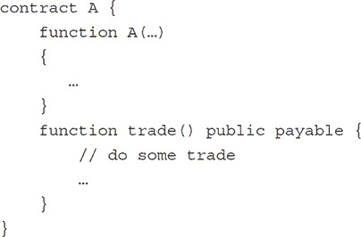

然后从另一个合同中实例化它

`A a = new A(…);`

如果你现在简单地调用

`a.trade();`

默认情况下，它不会向函数传递任何值。你需要给调用添加一个`.value(...)`参数，如

`a.trade**.value**`(**`somevalue`)**();

当你向智能合约调用一个带有值的函数时，该合约将拥有发送的值。它可以反过来调用其他合约上的函数，将这些值转移给这些合约等等。

让我们看看这个操作。考虑一个合同 B：

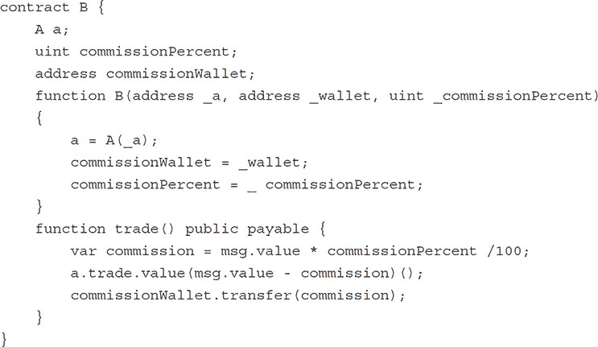

并实例化 B 为

`B b = new B(a,wallet,10);`

然后调用

`a.trade.value(sometradevalue)();`

在 B 的贸易函数中，现在有了`sometradevalue`，你可以看到一个将传递给 b.trade 的值拆分为对`a.trade()`的调用，传递 90%的值，并将 10%的值传递给佣金钱包的示例。

如果你想要为区块链合约创建一个云服务，将合约绑定在 EVM 之外，这是一种直接从调用者那里获得报酬的方式，从而避免了单独开票等等。

然而，请注意，默认情况下`.value`调用传递所有可用的（剩余的）气，因此应考虑对重入不安全。所以，如果你不控制被调用的合约，要小心。

你可以通过向函数调用添加`.gas(someGasAmount)`来指定传递给函数的气量：

`a.trade.value(msg.value - commission).gas(40000)();`

调用`address.transfer`只传递 23000 个气。这不足以进行任何重入，但可能不足以完成复杂的`function () payable`例程。

陷阱：调用可支付函数时，请记得在合约之间传递气和以太币。

#### 处理事件

EVM 事件是智能合约生态系统的核心部分。我们在 Owner 合约中看到了一个事件示例，每次所有者更改时，该合约都会发出一个`TransferOwnership`事件。

事件允许用户特别是应用程序监视区块链上的智能合约变化。这是通过指定过滤器并将它们应用于区块链节点来实现的。事件可以根据主题、值和区块间隔进行过滤，从而监听新事件或扫描旧事件。

用户可以被通知到他们感兴趣的合约的变化，例如所有权的变更、ERC20 代币的变化、余额的变更、多签名钱包待确认的通知等。同样，集成到智能合约中的业务逻辑和流程的企业应用程序可以在需要企业应用程序操作时收到通知。

用户对智能合约的操作可以触发企业服务，而企业智能合约的状态更新可以通知用户，就像常规应用程序中的事件一样。在企业应用程序中，需要建立一个事件捕获流程。考虑以下事件：

`event MyEvent(address indexed myidx, uint myval);`

将`indexed`添加到事件参数`myidx`中，使得可以通过`myidx`值使用过滤器对事件进行搜索。

在 C#中，使用 Nethereum 包监控实时事件可能看起来像这样：

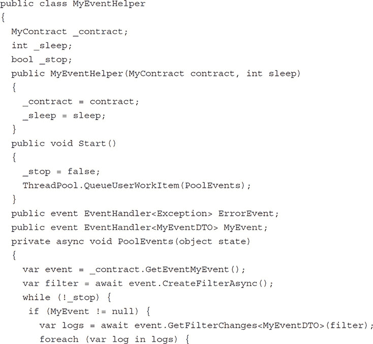

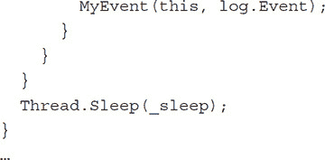

下面的示例将设置一个事件监听器，每当在区块链上看到新的`MyEvent`事件时，就会调用两个函数。

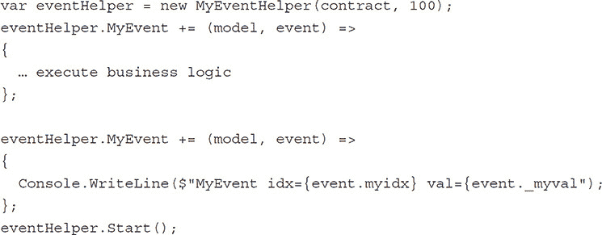

在 NodeJS 中，语法要简单一些：

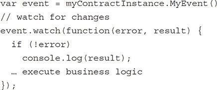

如果服务需要处理过去的事件，它们可以通过块间隔以及索引参数的过滤器进行过滤。

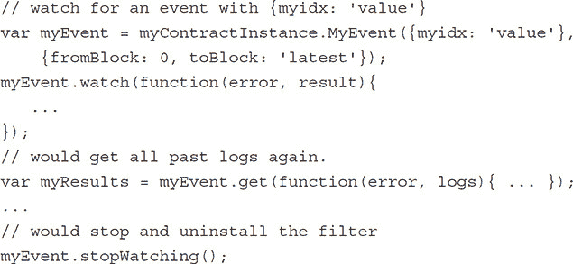

如果企业系统需要处理从合约发出的所有事件，给每个事件添加一个序列号是个好主意。

`event MyEvent(uint indexed eventId, address indexed myidx, uint myval);`

这使得企业系统可以轻松跟踪是否处理了所有事件，在出现故障时可以有效地恢复/重新处理缺失的事件。

请注意，企业系统事件处理程序也可以调用合约上的函数。这使得 EVM 事件的行为与其他事件类似，从而允许通过不同系统混合级联触发。想象一下以下系统流程（参见图 7-1）。

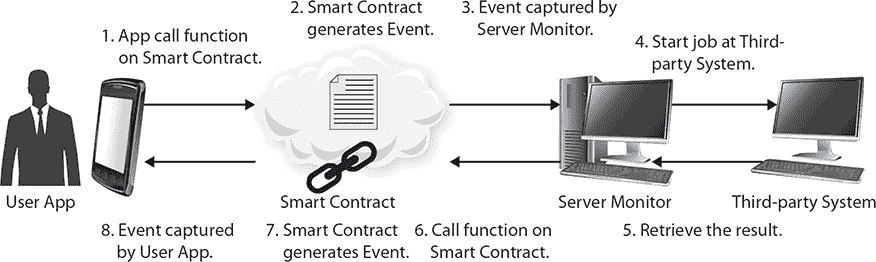

**FIGURE 7-1   涉及智能合约的企业系统流程示例**

-   1. 用户（网页）应用程序调用智能合约上的一个函数。

-   2. 智能合约函数生成一个 EVM 事件。

-   3. 服务器监控捕获了此事件。

-   4. 监控器在第三方系统上启动一个作业。

-   5. 当作业完成或满足某些条件时，从第三方获取结果。

-   6. 监控器调用智能合约上的一个函数，并带有结果更改状态。

-   7. 智能合约函数生成一个包含结果和新状态的事件。

-   8. 用户应用程序捕获此事件，并使用结果和新状态更新 UI。

如所见，这使得可以在信任的各方之间不建立复杂的架构或成本分担协议的情况下构建复杂的集成系统。它仅使用基础架构的区块链和支付平台。用户应用和服务系统彼此独立，无需建立复杂的协议。

在一般形式下，服务器监控充当区块链和现实世界之间的中介；这通常被称为预言机。

如所讨论，智能合约不能触发自己，因为区块链需要是确定性的。所以它不能依赖或直接从 EVM 访问现实世界。它需要由外部代理激活，如图 7-2 所示。代理可以是用户或预言机。预言机有两种形式。他们可以通过生成一个带有请求/回复交互的事件从智能合约中“调用”，如图 7-1 所示。或者他们可以是基于触发的事件，当满足某些条件时预言机会调用智能合约。这可能是当一种货币达到一定的价格，或者当物联网传感器检测到某个值的时候。

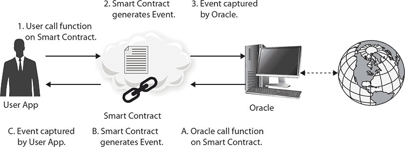

**图 7-2   用户、智能合约和预言机的应用**

为了将第三方预言机包含在智能合约流程中，它需要是可信和可靠的，因为其与区块链的交互是 immutable 的，因此是不可逆的。

### 智能合约设计

所有现代设计的优点当然也适用于编写智能合约。实际上，由于区块链的不变性，更是如此：清晰的设计、深思熟虑的安全性、彻底的测试和生命周期管理都是必不可少的。在本节中，我们将详细阐述一些重要的优点。

#### 模块和接口

对于传统编程，广泛的最佳实践是将代码划分为代表关注点分离的章节。这在编写智能合约时尤其相关。已经存在许多包含编写合约时需要的一些典型模块的库。并且最好重用已经确立的模块。一个很好的例子是 OpenZeppelin([`github.com/OpenZeppelin/zeppelin-solidity`](https://github.com/OpenZeppelin/zeppelin-solidity)). 他们的口号很好地概括了这一点：“通过使用标准、经过测试和社区审查的代码，降低您应用程序中漏洞的风险。”

尽可能使用此类模块可以减少错误风险，并节省宝贵的时间来专注于手头合同的独特特性。即使某个模块需要修改以适应某些特定需求，也强烈建议 reuse 相应的测试以确保不会破坏任何内容。

不要过度设计合约，也不要用花哨的编程技术来炫耀。保持简单，傻瓜——特别是因为大多数公众使用的合约都将对应源代码附加在区块链上，供任何人检查和验证。拥有清晰、简单的合约，易于理解，会赢得更多信任，实际上比一个做很多实际上不需要的事情的大型过度设计的合约含有更少的缺陷，因为它的攻击向量要小得多。

#### 安全与角色

在设计智能合约时，从一开始就要考虑安全性非常重要。由于合约是公开的，并且区块链上的每个人都可见，所以每个人都可能调用每个函数。即使你不提交源代码，还存在字节码，所以任何理解 EVM 并且有适当耐心的每个人都可以弄清楚合约做什么并且调用它，因此不能依靠隐秘性来保证安全。

大多数合约实现所有者模式，以限制最高状态“管理员”变更函数，如`setup`、`start`、`stop`和`kill`。

考虑`kill`函数：

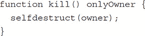

使用修改器签名，可以清楚地看出该函数只能由所有者调用，并且函数体中只包含业务代码。然而，所有者的私钥应该保存在安全的地方，仅在合约的重大生命周期事件中使用。

应该将更多的操作功能模块化并限制在不同的特殊角色中，与所有者角色不同。然后所有者应将这些角色权利委派给其他地址。这些专用角色通常在网络服务或员工计算机上运行，并且需要包含其角色地址的私钥才能执行。如果系统被黑客攻击并且某个角色的私钥被泄露，影响仅限于该角色的操作，并且所有者可以通过更改受影响的角色地址更容易地恢复系统。

角色示例可能包括：

•   铸币师：能够在代币合约中铸新代币的角色

•   迁移大师：负责从旧合约迁移到新合约的流程的角色

•   受邀投资者：给予受邀地址投资受限 ICO 的角色

•   交易员/执行者：代表客户执行交易或订单的角色

每个角色可以是单个地址角色或多个地址，通常被称为白名单地址。

正如我们在 Ownable 合约中看到的那样，单个地址角色的修改器可以简单到

`modifier only***Role*** { require(msg.sender == ***roleAddress***); _; }`

多地址角色可以实现为像这样的映射

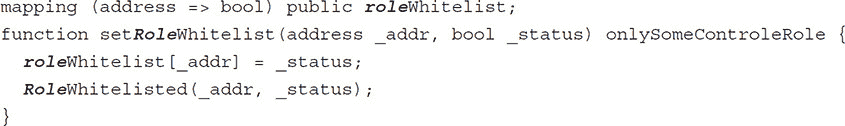

然后修改器将更改为这个样子：

`modifier only***Role*** { require(***role***Whitelist[msg.sender]); _; }`

访问控制的使用不应作为函数本身的一部分实现，而是建议在函数头使用明确定义的修饰符。这是因为它将访问控制逻辑与函数分离，并且使函数更容易阅读，因为它们只包含业务逻辑。

#### 单合同设计

随着合同的发展并且添加了越来越多的功能，很容易最终得到一个过于庞大的合同，做很多事情，并且变得难以管理。如果其他不做任何事情，发展将有一天突然停止，仅仅是因为代码存款和创建执行的总成本超过了单个块执行中的总可用 gas。这称为块 gas 限制（BGL）。公共网络上的 BGL 目前为 4,712,388。

一种保持关注的方法是查看编译输出中的`json`的 gas 估算。如前所见，两个数字（代码存款和执行）之和超过了 BGL，因此这个合同将无法部署。

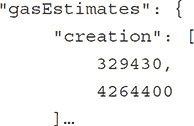

通常，如果合同创建的估算值接近 BGL，合同设计应该进行修订。

#### Linked Contracts

与其将所有功能放入一个单一的合同中，通常建议将其划分为几个一起行动的合同。理想情况下，您可以重用已经设计良好、测试良好并且经过时间考验的现有基础合同。这样的合同可能是标准代币、多签名钱包等。

假设您想要建立一个 ICO 合同，邀请投资者在有限的时间内以固定价格购买代币。您希望将所有的以太币收集到一个安全的钱包中，并且您希望所有的代币都存放在一个最终可以在交易所自由交易的 standard ERC20 代币中，在 ICO 之后。当 ICO 完成并验证后，实际上 ICO 合同不再需要，因为它已经完成了它的生命周期。

您将如何构建这样一个 ICO 合同系统？

嗯，有多重签名钱包和标准合同的许多实现，所以不需要写那些。相反，我们专注于编写我们特定的 ICO 流程，然后只需将其绑定到标准多签名钱包和标准代币合同。

每个合同作为单独的交易部署，因此整个合同系统的总大小可以远大于一个单一的 BGL。只有个别合同需要低于 BGL。以下是创建合同并将它们绑定在一起的伪代码。

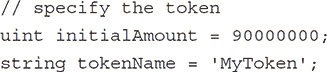

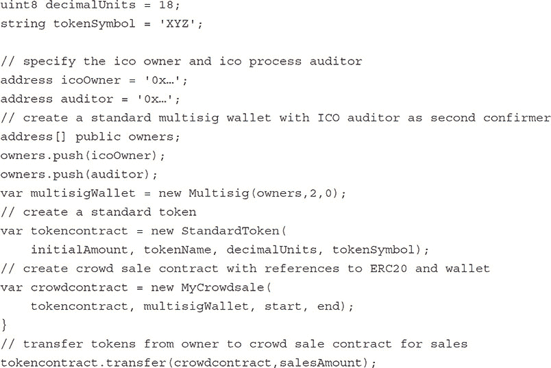

一旦合同部署并连接起来，ICO 销售就可以开始（这里显示为显式函数，通常 ICO 在一个指定的 blockNumber 范围内运行）。

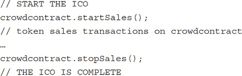

当 ICO 完成时，ICO 所有者可以请求资金。

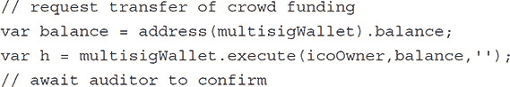

审计员可以验证 ICO 过程和状态，并将资金释放给 ICO 所有者。

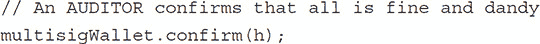

既然 ICO 已经完成，股份已经存储在标准合同中，ICO 人群合同可以被销毁。

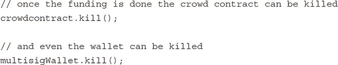

#### 用户特定合同

以前我们看到了一个例子，其中几个（标准）合同协同工作，构成整个系统。如果我们希望每个用户都有其自己的个性化设置和特点，那么与其让这种复杂性污染核心合同，不如将其作为用户特定的合同来维护可能更好。正如我们之前讨论的，多态性在 Solidity 中通过接口规范工作得很好。

想象我们有一个通过主合同 master 只使用资产接口处理的资产的合同系统：

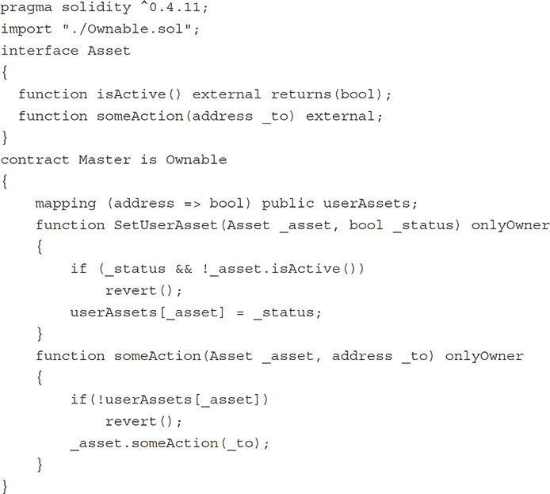

然后在主合同部署后，可以开发不同的资产实现。

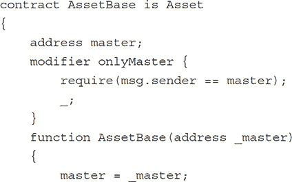

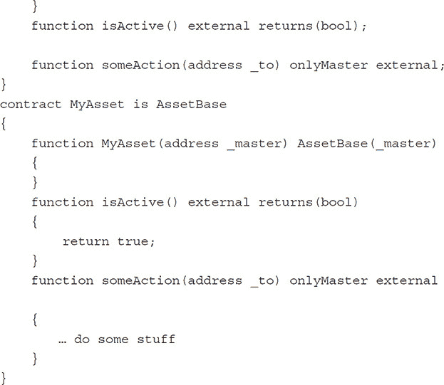

一些后来对资产合同的实现：

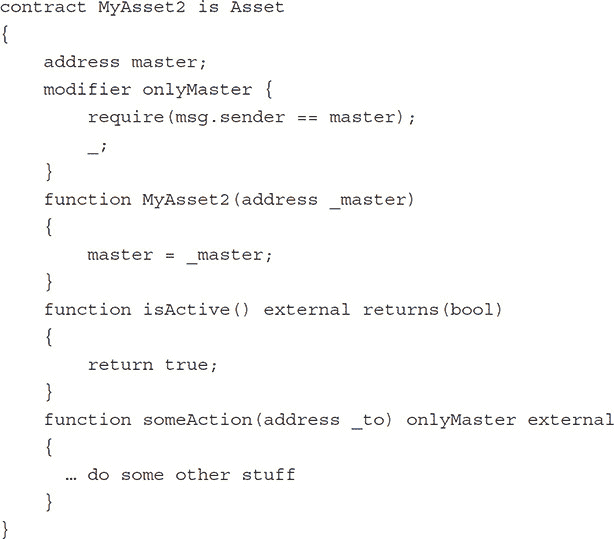

这允许以下部署序列。

部署主合同：

`Master m = new Master();`

开发 MyAsset，部署它，并将其绑定到主合同：

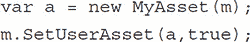

后来，开发 MyAsset2，部署它，并将其绑定到主合同：

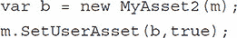

在资产上执行一些操作：

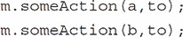

这也说明了一个可以通过不重新部署而随时间升级和扩展的合同系统——在这个例子中，尤其是不需要重新部署主合同，其地址可能被嵌入到许多系统和用户的钱包中。

#### 处理持久合同地址

在某些情况下，保持一个持久的合同地址的同时保持更改实现的可能性可能是有益的。例如，如果合同地址被嵌入到许多其他系统中，或者被许多用户注册，更改实例地址可能是一项无法克服的艰巨任务，并涉及无法管理的同步问题。

这个问题可以通过引入一个包装实现合同的代理合同来解决。这是一个众所周知的技术，尤其适用于这个智能合约问题。

代理的一个实现如下：

你从所需功能的接口开始。

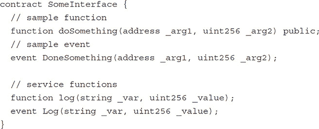

将代理合同实现为对实现合同功能的调用通过。

`log` 函数是在代理合同层面发出事件的辅助函数。

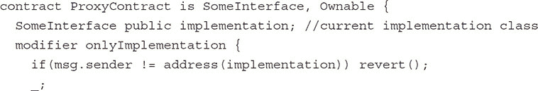

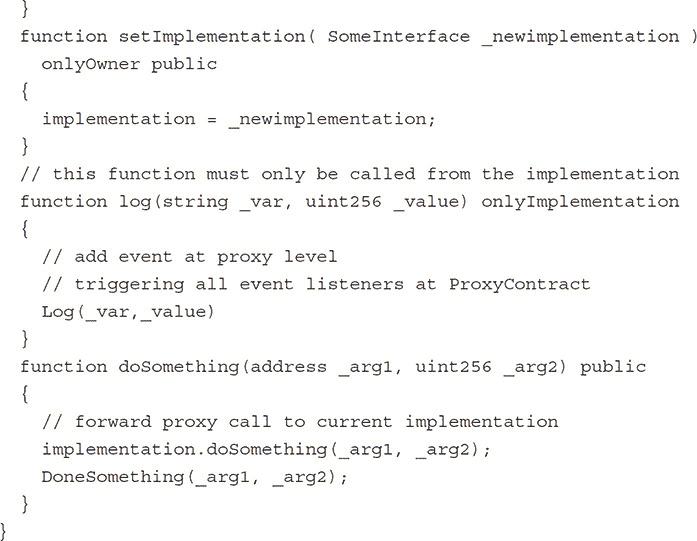

实现实际 `doSomething` 功能的类只能从代理调用中调用。

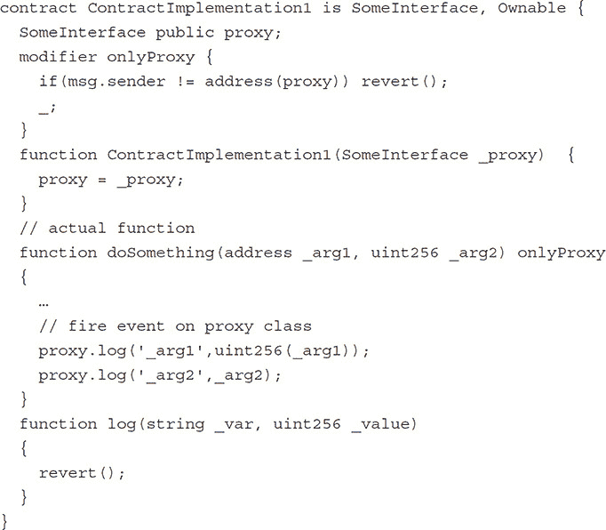

设置代理。

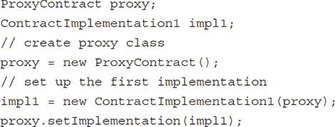

正确地将实现作为对代理合同的调用。

`proxy.doSomething(this,0xFFF0);`

这是不允许的：

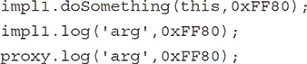

如果需要更改，则将实现更改为新类。

`proxy.setImplementation(new ContractImplementation2(proxy))`

现在相同的代理调用将会调用新实现。

`proxy.doSomething(this,0xFFF0);`

#### Halting a Contract

如果发生无法预见的事件，比如 EVM 中的严重漏洞或代码中的漏洞，合约内的资产可能会面临风险。在这种情况下，拥有一个暂停功能是一个好主意，它可以在评估情况时停止合约内的大部分（但不是全部）活动。

这可以通过向函数添加一个`notHalted`修饰符来轻松实现。

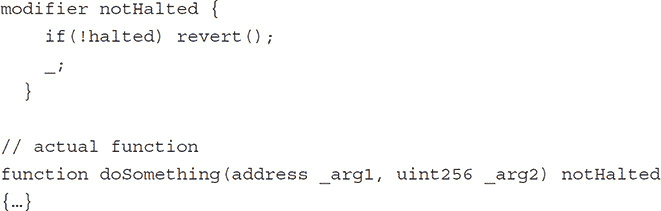

从安全角度讲，暂停合约的决定应该对中心系统运营商和安全机构可用，而恢复运行应该限制给所有者——就像一个普通的紧急按钮，许多人可以停止机器，但只有少数人可以再次启动它。安全总比后悔好。

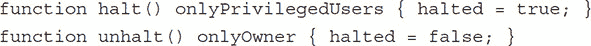

### Smart Contract Life Cycle: Migration

如果出现 bug、漏洞或需要添加新功能，需要一个新的合约来替代旧合约。

智能合约迁移的基本思想与正常应用迁移类似。旧智能合约的状态安全地转移到新智能合约，旧合约变得无效或被销毁。

在这里我们存在一个信任问题。在最佳情况下，善意的合约所有者发现了一个安全问题，修复了错误并部署了一个新合约，作为迁移主控将原始智能合约置于迁移模式并指向新合约。然后每个利益相关者将自己的状态从旧合约转移到新合约——也就是说，对于一个代币合约，用户将他们的代币从旧合约转移到新合约，依此类推。一旦所有状态（代币等）都转移完毕，旧合约可以被销毁或简单地变成一个不活跃的空实例。注意是*用户*转移状态，而不是合约所有者。

迁移接口可能看起来像这样：

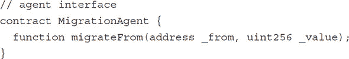

在实现转账函数时，我们必须确保它只能从原始智能合约调用。

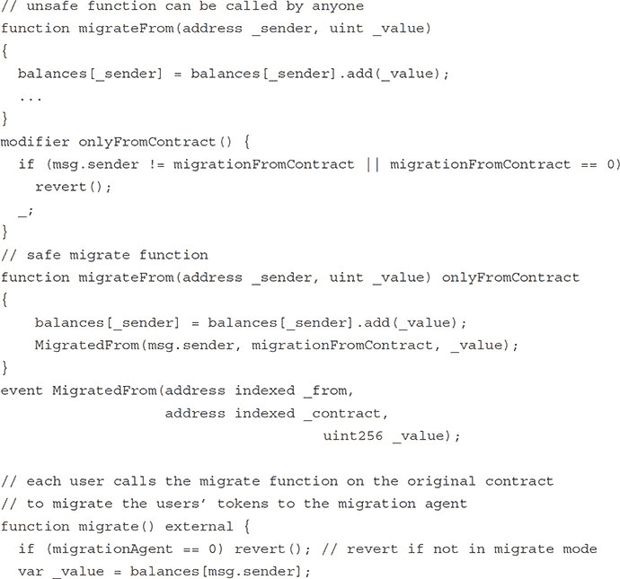

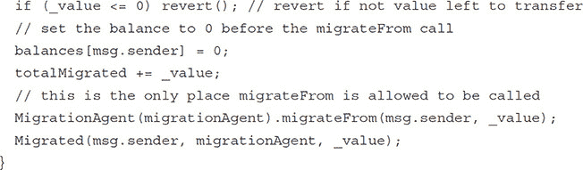

### Smart Contract Interaction with Users and Enterprise Applications

如我们之前讨论的，智能合约和区块链只是整体解决方案的一部分。如果大部分业务逻辑在合约内，并且只需要一个简单的用户应用，这可以很容易地实现为一个 dapp。在企业解决方案中，智能合约可以被看作是系统的一个异步网络服务或批处理作业组件。

当将区块链整合到现有的企业应用程序中时，在许多情况下通过标准 Web 服务暴露区块链交互是一个好主意。这样，"老"企业应用程序开发者不需要处理或理解区块链交互的细节。对他们来说，这只是一个具有正常异步 WEB-API 行为的额外第三方组件。

### 调试你的智能合约

调试是应用程序开发的重要组成部分。这对智能合约开发也是如此。不幸的是，在 Solidity 中，`throw`关键字或调用`revert()`不接受任何参数，也无法返回任何错误号或错误文本。在非琐碎函数中可能有几个失败的原因，对于新手或复杂合约，快速识别失败原因可能很困难。这是当前开发调试和生产问题调试环境的一个局限。我们希望未来版本的 EVM 和 Solidity 能够解决这一问题。

陷阱：低级函数`send`、`call`、`delegatecall`和`callcode`在出错时返回*false*；它们不会抛出异常。使用这些函数时要格外小心，并彻底测试。

#### 使用 Remix 进行调试

如第六章所述，Remix Solidity IDE 是目前可用的最佳调试工具之一。这个工具允许你编写 Solidity 合约，编译它们，分析它们，甚至运行它们。它是尝试事物和熟悉 Solidity 和 EVM 环境的机制和怪癖的好工具。它还有一个 JavaScript VM，允许你逐步执行函数调用并识别问题和状态，是找出那些让你困惑的 bug 的不可或缺的工具。不幸的是，它目前只适用于小型的代码库。对于包含许多合约的大型代码库，Remix 变得缓慢甚至无法使用。

#### 使用事件进行调试

另一种调试代码的方法是误用一个事件。如果你添加这样一个事件，

`event Debug(string text, uint value);`

然后你可以在你的代码中添加这样的调用：

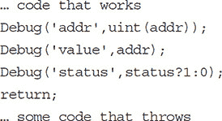

然后你可以在测试环境中检查事件日志的值。

注意提前`return`以防止函数抛出异常，因为否则所有操作都会撤销，且不会记录任何事件。这是在 EVM 中能拥有的最接近`log.writeline`的东西。如果我们不经意间引入了一个在复杂 Truffle 测试集中显现出来的抛出异常的 bug，而这个错误的原因不明显，在 Remix 中复现起来又过于繁琐，我们经常采用这种方法。

### 智能合约验证

测试智能合约尤其重要，因为一旦部署，它们就无法更改。因此，你肯定希望测试和审查在生产网络上可能展开的每一个可能的场景，包括黑客试图窃取它们所包含的资产时会发生什么。

#### 测试类型

相关的测试可以分为不同的类型和领域，并分别描述。

##### 功能测试

首先，你有传统的 CRUD-like 函数测试，确保你可以在你的合约内创建、读取、更新和删除条目、角色、用户等。这只是日常工作。

##### 正常生命周期流量测试

这些测试通过合约的不同阶段，例如创建、准备、运行、停止和终止。它们测试合约能否正确地从创建到销毁的每个阶段都进行更改。对于每个阶段，都测试那个阶段的函数可以被调用，但其他阶段的函数*不能*被调用——例如，测试在运行阶段`init`函数不能被调用。

##### 漏洞测试

有一些已知的漏洞需要缓解和测试。

##### 溢出和下溢攻击

像`uint`这样的数字不会像大多数其他高级语言那样在溢出或下溢时失败，而是简单地绕过，最大尺寸汇编风格。为什么做出这种设计决策是我们无法理解的。

考虑这个代码：

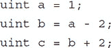

在这里`a – 2`执行了下溢，变成了 115792089237316195423570985008687907853269984665640564039457584007913129639935。

而`b + 2`执行了溢出，变成了 1。这个条件可以在大多数其他操作中找到。

这构成了一种攻击向量，可能允许用户用精心设计的值调用一个函数，触发算术错误，即给一个地址分配一个非常大的账户值。通常，这种类型的错误是通过安全数字操作来缓解的，就像这样：

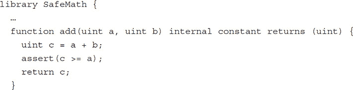

并用在像这样的合约中：

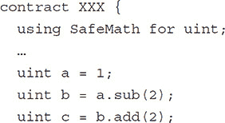

我们不明白为什么这不是默认行为，因为每个人都必须将其添加到他们的合约代码中。

##### 递归调用攻击，重入漏洞

考虑这段代码：

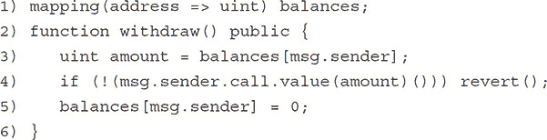

这个函数从账户中提取所有资产（3），将它们发送给其所有者（4），并将账户余额更新为零（5）。然而，由于`call.value`可能会击中发送者合约中的一个函数，这个函数可以在设置为 0 之前再次调用`withdraw`函数，从而反复提取余额值，直到原始合约耗尽。

注意，这种攻击也可能通过调用原始合约上的其他一系列函数来执行，这些函数利用一个不完整的状态更改。通常，这个问题是通过应用 Checks-Effects-Interaction 模式来缓解的——也就是说：

1. 首先检查所有先决条件，

2. 然后对全局状态执行所有 Effects，

3. 最后与其他合约进行交互

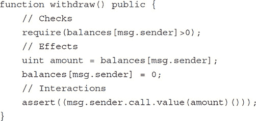

##### 测试合约达到最大容量

区块中有限数量的 gas（BGL）的一个后果是你需要在不断向合约系统添加项目时考虑不同函数的 gas 使用情况。合约在最大容量时会发生什么？在最大容量时合约函数会经历 gas 溢出吗？

循环和递归调用尤其关键。在最坏的情况下，操作是否有足够的 gas 执行？尝试识别循环中的最长运行时间和最深递归调用。事实上，最好是完全避免它们。如果不可避免，确保它们在 BGL 内有定义的上限。

#### 使用私有网络进行干跑

说到底，使用 TestRPC 和 JavaScript VM 进行测试并不是真正的东西。坦白说，每个测试守护进程都实现了自己独特的怪癖和错误，这些错误与生产环境中的怪癖和错误不同。

因此，谨慎地进行一次干跑，以测试预期的使用（和误用）情况，使用真实的守护进程，如 Geth 或 Parity。在所有环境中实际代码都是相同的。在 dev、testnet 或生产环境中执行的唯一区别是 chainId。在许多情况下，尤其是在开发过程中，运行在私有区块链中是可取的。你不希望用半成品的合约在你的名字测试网或生产网上涂抹。幸运的是，启动私有区块链相当容易。这里以 Geth 为例进行展示。

在测试周期中，每次最好从相同的状态开始，所以首先删除所有旧链信息。

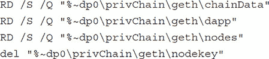

然后使用配置文件初始化一个新的区块链。

`geth --datadir=privChain init genesis_dev.json`

最后，启动一个运行您私有区块链的节点。

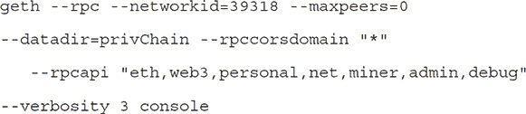

如果您想要您的私有节点与其他节点同时运行，请像这样添加修改后的端口的规格：

`--port 30304 --rpcport=8551 --ipcpath “devgeth.ipc”`

然后使用 URL 连接到私有节点，例如[`localhost:8551`](http://localhost:8551)。

反映生产细节的配置文件可能看起来像这样：

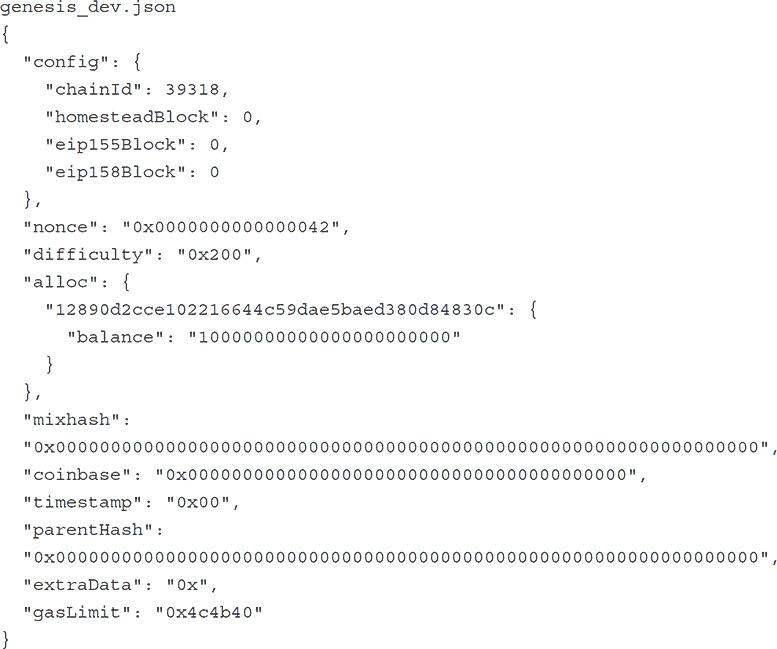

大多数都是默认值，应该与生产环境相匹配。需要设置的主要值是 chainId 和 alloc 部分，在该部分中可以预填充以太币地址。

### 钱包 Bug 的解剖

2017 年 7 月 19 日，有人发现有三个 Parity 多签名钱包被盗窃。这导致了一场社区与白帽小组（WHG）竞争的局面，他们试图识别并减轻问题。

构造函数看起来像这样：

正如你所见，它通过使用汇编操作码直接在内存中构建调用，将初始化委托给`_walletLibrary`函数`initWallet`。这段代码不是给胆小的人看的。这是纯粹的大脑手术——编写这段代码时你不想打喷嚏。

此外，钱包默认函数利用了这样一个事实：如果你调用的是未在钱包合约中定义的函数，它将被默认函数捕获。

对`_walletLibrary`的`delegatecall`调用使用原始函数调用数据。这意味着你将隐式访问`_walletLibrary`中*所有*的函数，因为它们就像直接在钱包合约中实现一样。这是一个非常强大的机制，但也可能非常危险。

钱包库中的一个函数是我们在钱包构造函数中看到的`init`帮助函数`initWallet`，这就是它的用途。然而，由于它没有任何检查或修饰符，并且有默认函数中的`delegatecall`调用，这不幸意味着任何人在钱包生命周期的任何时刻都可以调用`initWallet`。因此，他们获得了多签钱包的所有者控制权，使得将资金转出钱包变得易如反掌。

修复方法非常简单，只需向控制`init`帮助函数只能在其初始化阶段被调用的修改器中添加缺失的修饰符。

这个例子清楚地说明了深入思考每一个函数的重要性：

•   前提条件是什么？

•   谁被允许调用它？

•   它在生命周期中的哪个阶段被允许调用？

而且，测试在正确的时间以合法操作者的身份调用它时，它确实能完成它应该完成的工作（正常单元测试）。更重要的是，测试如果你不是合法操作者或者在错误的状态下调用它，它不会造成伤害并且实际上会被拒绝（安全测试）。

编写详尽的测试用例比编写合约本身的工作量要大得多，也更加全面。

### 未来

智能合约开发系统中落后的一部分是自动化测试。利用和扩展 NatSpec 注释可以很容易地生成骨架测试代码，这将显著减少设置单元和安全测试所需的时间。

然而，房间里的大象是可扩展性的缺乏，这限制了广泛的应用。这也使得区块链容易受到通过垃圾交易淹没它的服务拒绝攻击。此外，为了支持微交易，交易价格需要更低。为了成为一个通用和可扩展的平台，这个问题必须解决。一个尝试解决这个问题的解决方案是针对以太坊的闪电网络式的实现，名为 Raiden 网络。这个进行中的项目通过一个离线链补充以太坊区块链，以解决微交易。然而，它需要预分配代币/以太币，通过将其转移到 Raiden 网络来离线。这引入了等于所需总流动性的资产离线锁定。此外，它并没有解决一般智能合约的可扩展性问题。其他类型的区块链项目也试图解决这个问题。一个例子是以太坊操作系统（EOS）项目，它基于 Steemit 和以太坊的功能特性。这个平台没有交易费，并通过允许块执行中的并行性，提供每 3 秒一个块的交易，从而引入水平可扩展性，超过每秒 100,000 个交易。

另一个例子是 IOTA 项目，它专门为 IoT 设备之间的大量微交易而设计。在 IOTA 中，当你需要添加一个交易时，你需要验证两个其他交易并检查冲突，然后才能提交到纠缠（连接图），所以你成为自己的矿工，从而消除了支付给别人验证的必要性。严格来说，IOTA 不是包含交易的区块链，而是一系列链接交易的网络。在路线图上，IOTA 将包括智能合约和预言机。

绝对隐私也是一个问题。尽管地址在某种意义上匿名，因为背后的身份通常没有注册，但所有交易和余额都是公开的。如果你用以太币支付到一个进行某种 KYC 验证的地址，无论是直接还是间接，可能会追溯到你的消费习惯和财富。门罗币是一个专注于完全匿名、安全、私密的区块链的例子。它使用环签名，在交易中添加诱饵地址，从而可能隐藏交易来源。通过一次性地址（stealth addresses），目的地地址被隐藏。通过使用环密文交易，交易的价值通过加密算法隐藏，但仍然可以验证。总的来说，它确保了端到端的完全匿名。他们还没有闪电网络或智能合约，但这些已经在路线图上。

Ripple XRP 是一个私有的、集中式的、基于权限的区块链，其作用类似于 SWIFT 银行账户之间的全球转账。它通过实现一个点对点的账本网络和分布式共识协议，旨在扩展到与 VISA 相同的性能。Ripple 决定不将智能合约包含在核心区块链中，而是实现一个单独的平台 Codius，用于智能合约和预言机部分，这也允许跨区块链应用程序。

当我们查看不同区块链的路标时，很明显它们有很多相似的属性。这些包括扩展交易数量以允许交易量和微支付，以及智能合约的包含和预言机的集成。所有这些都是本章中最佳实践用武之地的地方。

### 总结

正如本章所看到的，EVM 提供了一个丰富的环境，使得从简单的 dapps 开发，通过与预言机简单交互以获取外部信息，一直到完整的栈式企业解决方案的开发成为可能。智能合约平台包括所有创建现代代码所需的特性，多个合约之间的调用和相互交互，包括向外部系统产生事件。此外，我们认识到了在模块性、角色和安全性以及生命周期管理方面清晰设计的重要性。最后，由于区块链的不变性， smart contracts 在部署到区块链之前需要特别关注测试和验证。
