## 8   私有区块链平台和用例

区块链是一种点对点的分布式账本技术，这使得创建一个没有中心控制点的更成本效益的网络变得容易。这与商业生态系统成员维护自己的账本`或`记录系统（SOR）的世界形成对比。这些独立的账本以一种低效、昂贵且通常非标准化的方式相互协调。随着时间的推移，这些独立的账本在各个成员的数据中心内被多次复制。现在的情况是，数据治理、测试、发布管理和完整的软件开发生命周期（SDLC）总是受到阻碍，或多或少是破裂或损坏的。难怪这些机构不能快速创新。这就像试图在拖着包含你一生中所有衣服的拖车的同时参加比赛！

然而，最近私有区块链的概念在区块链技术的讨论中变得流行，特别是在金融机构中。而不是拥有一个完全去中心化的网络对公众开放，并且参与方是匿名的，创建一个每个参与方都被识别并授予改变或读取区块链权限的系统是可能的。这些私有区块链也在解决性能问题，因为共识是在较少的节点上执行的。实际上，很可能会有许多不同的区块链网络，每个网络服务于不同的一组目标和独特的商业应用（参见图 8-1）。

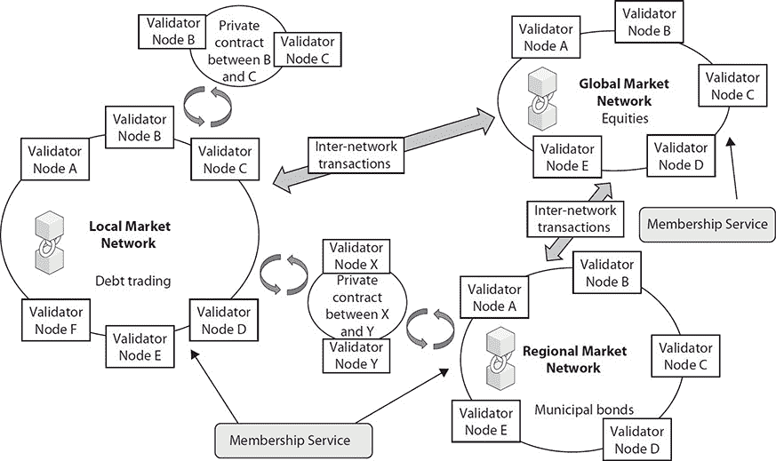

**图 8-1    许多区块链网络**

需要注意的是，有一些讨论认为这些私有区块链正在妥协去中心化的核心概念。但为了本书的目的，让我们来看看不同类型或类别的区块链之间的差异。

### 区块链类别

一般来说，区块链类数据库应用有三种类型：公共的、联盟的和私有的。

•   **公共**   任何人都可以读取或提交交易（如果有效，提交将被提交），任何人都可以参与共识过程。这些无需信任的平台通过工作量证明或权益证明等机制来保证安全，即加密货币经济学。换句话说，共识过程中的影响力与该实体可以动用的经济资源的数量成比例。

•   **联盟**   共识由预先选择的一组节点和实现共识的规则控制。读取区块链的权利可以对公众开放，或者也可以限制在已知参与者集合中——例如，一个同意 7 个中的 10 个银行必须签字（批准）一个区块才能被认为是真相的有效表示的联盟中的 10 家银行。

•   **私有**   写入权限保持在单一组织或其部分手中。读取权限可能是公开的或限制在已知参与者集合中。

总之，实际上有两个类别，*公共*和*私有*。*联盟*是私有链的一个派生，具有多个确定和授权的成员/参与者。

下面是私有链的一些优势列表：

•   当读取权限得到执行时，私有区块链提供了隐私保障。

•   联盟或私有实体可以更改区块链的规则，允许他们撤销交易，修改（修复）余额等。这一功能可能被认为是必要的，尽管我们必须说这些原因看起来更像是为了修复有缺陷功能的补丁。

•   矿工（或验证者）是确定、定义和知名的，所以来自勾结不良行为者的 51%攻击不存在或可以很容易地被识别和处理。

•   交易成本较低，因为它们只需要由有限的信任（且确定）节点验证，而不是由公共网络上的每个节点验证。不一定需要任何交易费。可能仍然需要运行一个验证节点以参与网络。这对参与者来说将是一笔费用，但比在公共网络上的交易费要便宜。验证节点还可能提供对分布式拒绝服务（DDoS）攻击的保护。

•   由于需要的矿工更少，在小团体中可以更快地实现共识最终性。

所以，鉴于上述情况，金融机构选择私有（或联盟）平台用于其区块链应用也就不足为奇了。这也是私有链被称作企业链的一个原因。

### 私有链应用案例

公共区块链在许多方面设计上对企业发展具有挑战性，尤其是在那些高度受监管的行业：

•   没有隐私

•   匿名处理器

•   几乎没有治理

•   有限的吞吐量，交易确认速度慢（性能挑战）

总之，隐私本身本质上分为两个方面：读取权限和区块生成（或写入）权限。如果用例需要隐私，你将希望限制读取权限。如果用例需要信任扩散到有限和预定的参与者集合，你将希望限制写入权限。这两个方面单独或共同可能推动你走向私有（或联盟）区块链平台。

在本章中，我们提到了私有链的应用案例。以下是更完整的应用案例集合：

•   为数字资产（货币和证券）提供一个权限化的金融机构间结算层

•   一个公司内部账本（资产负债表），包含私有数据，而没有任何一个部门拥有权威控制权

•   一个用于发行和维护奖励、忠诚积分和礼品卡的受许可平台

•   私有股权、债务和其他流动协议的跟踪工具

•   单一公司内部的数据库管理、审计等

•   任何需要每秒极高交易量的用例

再次，选择私有区块链平台的考虑因素可以缩小到图 8-2 中描绘的需求。

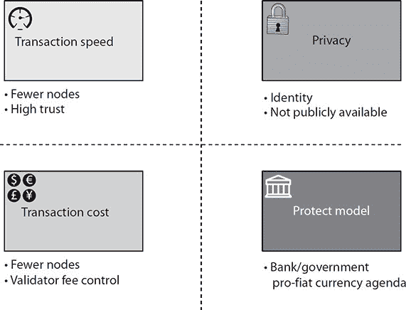

**图 8-2   导致私有区块链的需求**

### 私有区块链技术

本节介绍了适用于私有和联盟空间的区块链技术平台。

#### 阿尔法点分布式账本平台

网站：[`www.alphapoint.com/adlp.html`](https://www.alphapoint.com/adlp.html)

阿尔法点分布式账本平台是一个私有的、受许可的协议，利用区块链，并允许公司完全控制其数据。ADLP 的关键优势是：

•   **安全的架构**   多个实体通过加密消息在安全的网络上进行通信和链接。

•   **受许可**   各方只能访问明确与他们共享的数据。

该平台使组织能够数字化、管理和交换金融工具；部署智能合约以及自动化工作流程；从而降低运营成本。

#### 链核

网站：[`chain.com`](https://chain.com)

链核是一个受许可的区块链平台，用于发行和/或转让金融资产。利用它，金融机构可以启动和运营区块链网络，或连接到其他网络以便转移资产。链协议通过定义资产的发行、转让和控制方式来处理这一点。它允许单一实体（私有）或一组组织（联盟）运营一个网络，支持多种资产类型（如货币、证券、衍生品、礼品卡和忠诚积分）的共存，并且与其他独立网络有一定的互操作性。

#### 科达

网站：[`www.corda.net`](https://www.corda.net)

科达是一个开源平台，实现了一个由相互不信任的节点组成的分布式账本，记录了实体之间的交易和债务状态，这些实体可以是机构或个人。与以太坊不同，科达的智能合约目前仅限于金融逻辑的应用，所有非金融应用都在范围之外。

Corda 的一个关键特性是在同一网络中可插拔共识。这一特性支持多个共识提供者，每个提供者都可以使用不同的算法。这种分布式账本在商业领域有许多应用，如金融、贸易和供应链跟踪。其他关键特性是这是一个受许可的网络，访问由门卫控制（每个节点参与者在成功注册后都会获得 TLS 证书），节点之间的所有通信都是点对点的，而不是发送给所有节点的全局广播。

#### Domus Tower

Website: [`domustower.com`](http://domustower.com)

Domus Tower 有一个专门为结算美国股票设计的垂直区块链产品。该公司的一个主要卖点是，其技术可以在可扩展的方式下记录高交易率。该公司的白皮书以一个声明开头，称该产品已经在亚马逊网络服务的硬件上进行了“基准测试，每小时的硬件成本不到 50 美元，能够处理超过 100 万笔交易，并有潜力扩展到每秒超过 100 万笔交易。”

它采用双记账方法处理贷方和借方，数据存储包含在 Merkle 有向无环图（MerkleDAG）中，确保区块链没有被篡改或损坏。所有传输到区块链的数据在写入区块之前都进行数字签名和验证。在这种模型下，权威是集中的，网络上的任何具有区块链写入权限的节点都可以将交易写入该链。

#### The Elements Project

Website: [`elementsproject.org`](https://elementsproject.org)

Elements Core 是一个开源的、协议级别的技术，开发者可以使用它来扩展比特币的功能以构建新的应用程序。这个技术社区开发的元素（功能）组合可以被汇集在一起，并形成侧链。它使用元素周期表及相关化学方法来命名和组合功能，以构建应用程序。

The current list of Elements are:

•   **Ai (资产发行)**   能够发行代表任何资产（如凭证、优惠券、货币、存款、债券、股份等）的保密资产。

•   **Ct (保密交易)**   以加密方式仅让交易参与者和他们指定的人可见转账金额，同时仍保证不能花费比可用金额更多的币（防止双重花费）。

•   **Dp (确定性 peg)**   允许以去中心化的方式构建跨链交易，使得代币可以从一条区块链转移到另一条。

•   **Op (新操作码)**   向比特币交付新的操作码，并重新启用一些已被禁用但安全的操作码（例如，字符串连接、子字符串、整数移位以及一些位运算）。

•   **Rtl (相对时间锁定)**   允许一个交易被时间锁定，防止在没有达到相对时间变化的情况下在新交易中使用。

•   **Sb (签名区块)**   允许区块的创建者在将来验证他们的身份。

•   **Scv (签名覆盖值)**   如果输入已被花费，交易的签名可以被无效化。通过检查其签名，可以快速验证交易。

•   **Ss (Schnorr 签名)**   为交易构建签名的新方法。

•   **Sw (隔离见证)**   通过因子 4 减少区块中交易所需的空间。

此外，还有一些正在开发中但尚未准备好部署在公共侧链上的提议元素。

#### HydraChain

官网：[`github.com/HydraChain/hydrachain`](https://github.com/HydraChain/hydrachain)

HydraChain 与 Ethereum 完全兼容；它通过添加支持创建私有或联盟链应用程序的受控分布式账本来扩展该平台。Ethereum 平台上的所有现有工具都可以被重复使用。本质上的区别是 HydraChain 不需要工作量证明来达成共识，它依赖于一个注册且可追溯的验证者集合，这些验证者提出并验证交易的顺序。

#### Hyperledger

Hyperledger 是 Linux 基金会于 2015 年 12 月启动的开源区块链和配套工具的伞形项目。Hyperledger 的目标是推进区块链技术，通过识别并解决重要的功能特性，从而改变在分布式账本上进行商业交易的方式。

区块链的需求在不同的用例和行业中差异很大，Hyperledger 被设计为高度模块化，具有可插拔选项以适应不同的行业需求。简化的项目目标是：

•   **创建框架和代码库**   用户可以构建和运行健壮、特定行业的商业交易。

•   **培育社区**   这将有利于所有生态系统的利益。

•   **促进参与**   包括终端用户、开发者和解决方案提供商。

•   **中立主机**   为基础设施、会议、活动和协作讨论建立家园。此外，为商业和技术治理提供结构。

##### Hyperledger 框架

Hyperledger 计划孵化并推广一系列商业区块链技术，包括分布式账本框架、智能合约引擎、客户端库、图形界面、实用库和示例应用程序。Hyperledger 伞形战略鼓励通用构建块的重复使用，并促进分布式账本技术（DLT）组件的快速创新。以下是 Hyperledger 的框架：

##### Hyperledger Fabric

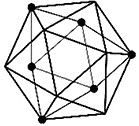

官网：[`hyperledger.org`](http://hyperledger.org)

作为开发应用程序或解决方案的模块化架构的基础支柱，Fabric 允许诸如共识和会员服务之类的组件以即插即用的模式添加。账本数据可以存储在多种格式中，共识协议可以随时切换，并且支持不同的身份验证方法。支持通道，这是仅对指定网络参与者组可见的单独交易账本。

**Hyperledger Fabric 教程**   在运行教程之前，您需要确保您的计算机已安装以下先决条件：

•   cURL（确保您的版本可以处理重定向）

•   Docker 和 Docker Compose

•   Node.js 运行时和 NPM

以下列表包含在 Mac 上设置 Hyperledger Fabric 的命令和控制台输出。首先要做的业务是设置 Path 中的 Go：

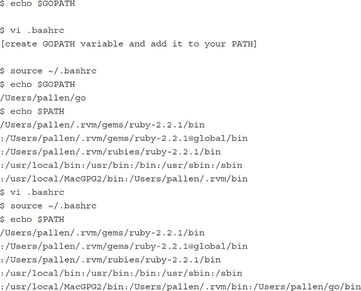

然后升级 Node 包管理器并安装 Node.js：

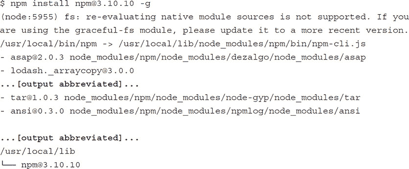

为 Hyperledger Fabric 样本的克隆创建一个工作目录：

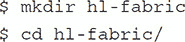

执行`clone`命令：

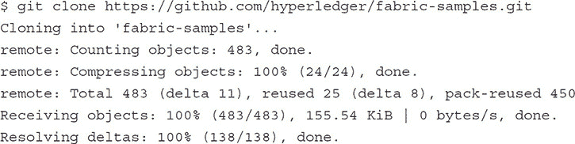

安装特定平台的 Hyperledger Fabric 二进制文件：

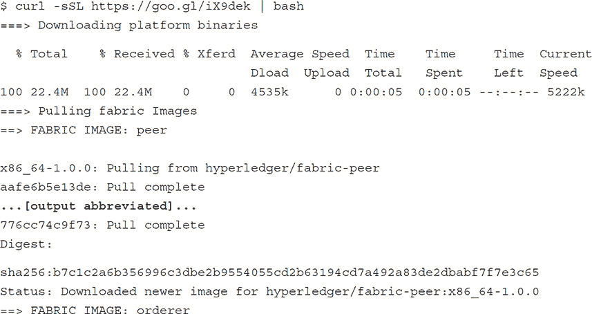

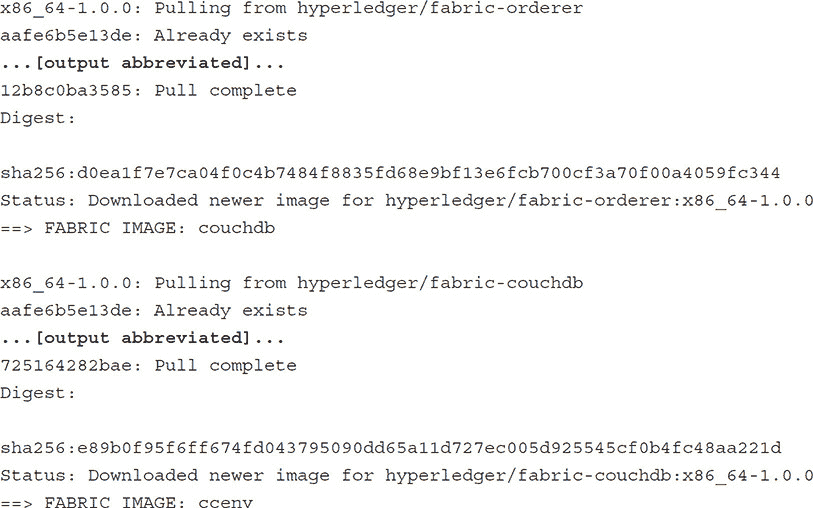

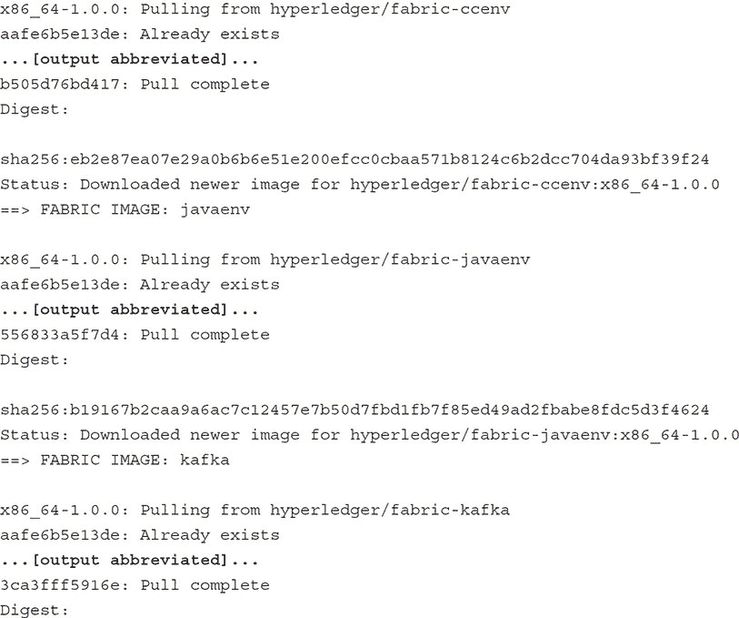

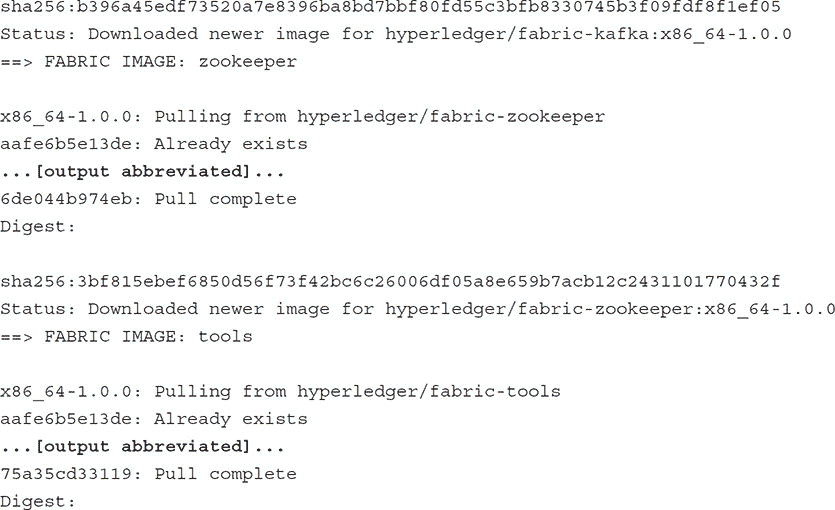

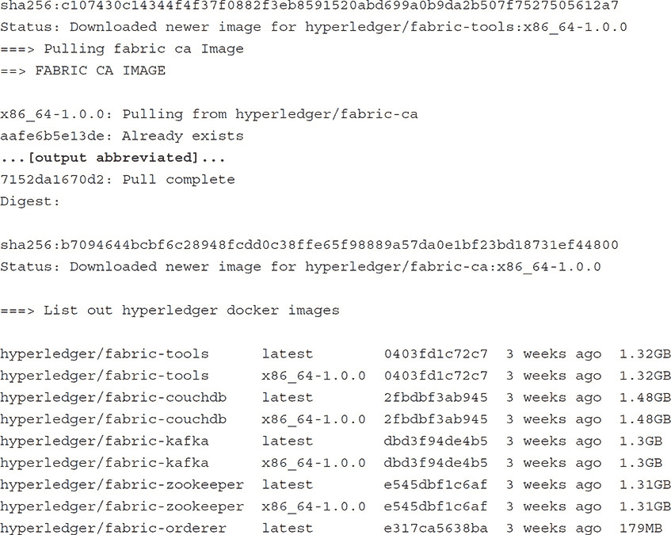

共有四个与 Hyperledger Fabric 一起提供的教程。它们是：

•   **write_first_app**   旨在向应用程序开发者展示如何使用 Node.js SDK 编写他们的第一个应用程序。

•   **build_network**   面向网络运营商，通过建立区块链网络并部署一个简单的应用程序来测试它。

•   **chaincode4ade**   向开发者展示如何在网络上达成共识的商务逻辑。

•   **chaincode4noah**   展示了网络运营商如何管理业务逻辑。

我们现在将逐步通过 write_first_app 教程，该教程旨在展示涉及的任务并提供针对 Hyperledger Fabric 网络编写第一个应用程序的基础。与您之前工作的所有其他基于持久层（即数据库或文件系统）的应用程序一样，这个教程演示了两个常见用例：（1）从链中读取和（2）写入（或更新）链。

因此，第一步是导航到 fabric 目录并列出其内容：

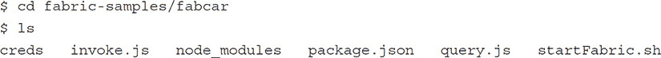

现在开始 Fabric 网络，执行以下操作：

•   启动同伴节点、排序节点、证书权威和 CLI 容器

•   创建一个通道并将同伴节点加入新通道

•   在同伴文件系统上安装智能合约，并通过启动链码（智能合约）容器在通道上实例化此合约。

•   调用智能合约上的 initLedger 函数在账本中创建 10 辆汽车。

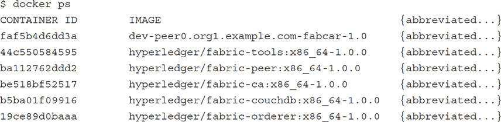

让我们来看看 query.js 代码，特别是突出显示的部分，显示了如何连接到链然后发出查询：

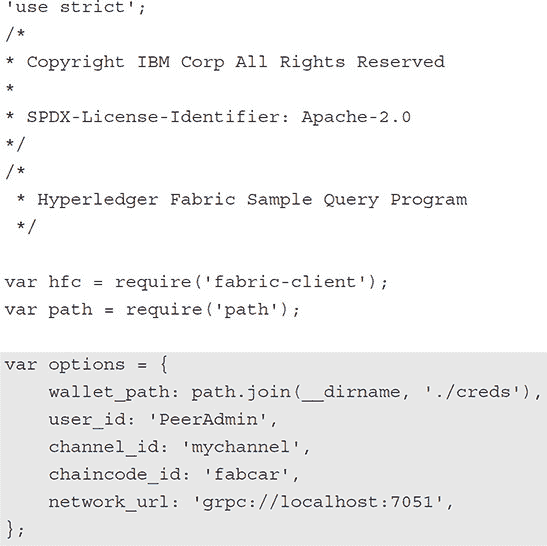

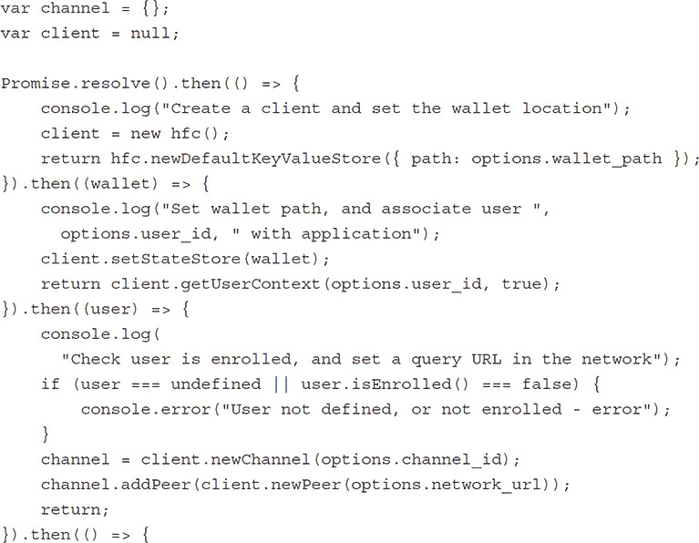

对查询稍作调整，让我们能够通过一个键来读取：

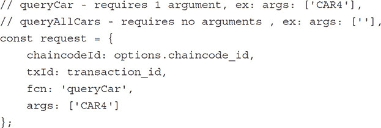

提交调整后的查询并显示回应：

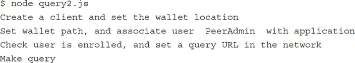

现在我们可以开始对账本进行一些更改。我们将从示例代码开始，该代码将向链中添加一辆新车。以下是 invoke.js 代码；再次突出显示插入 CAR10 的部分：

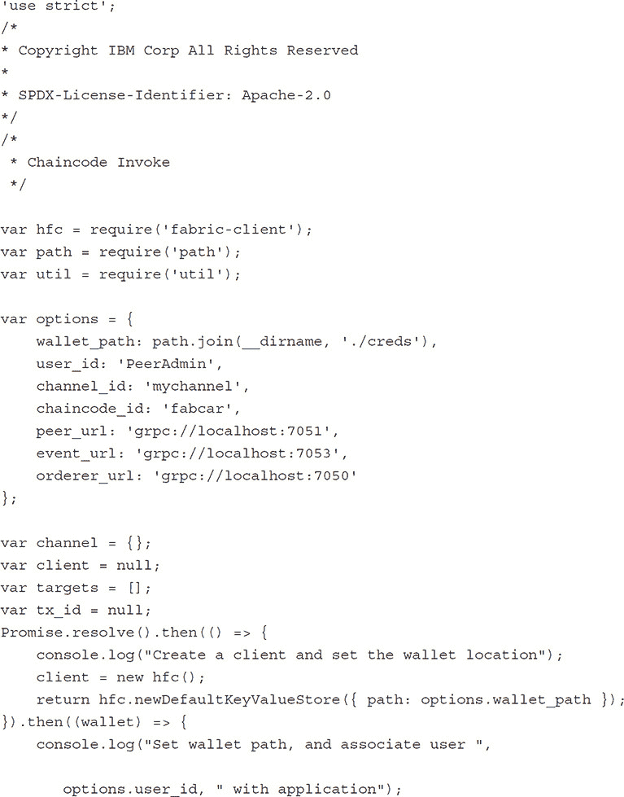

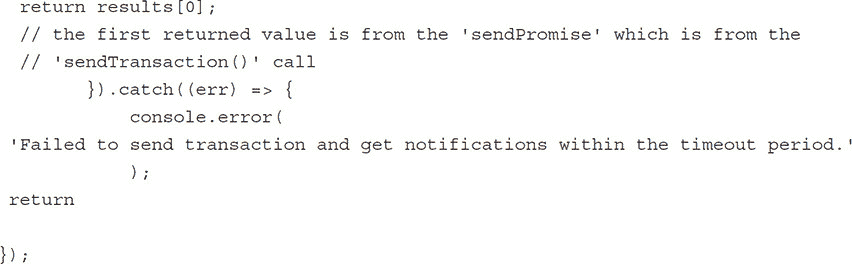

当你执行插入操作时，这是回应：

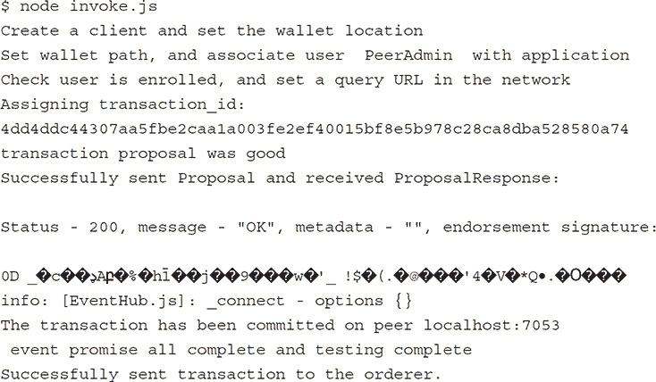

在调整 query.js 代码以读取新键（将`’CAR4’`改为`’CAR10’`）并执行：

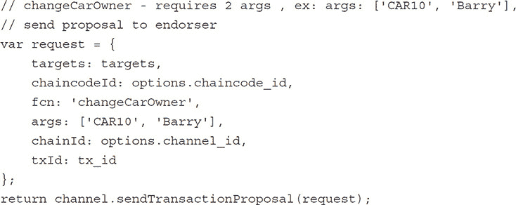

然后执行 invoke.js 代码：

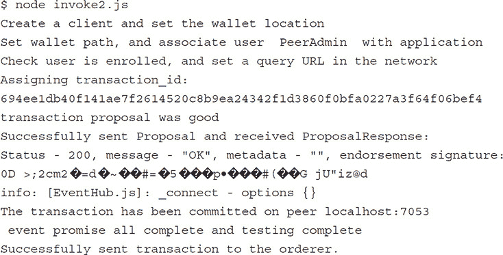

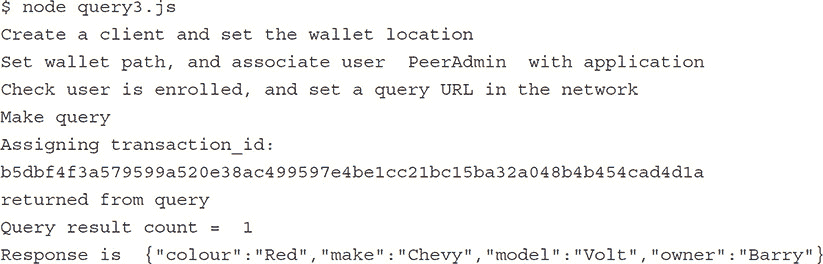

现在我们已经建立了区块链，从中读取和写入。剩下要做的就是通过发出以下命令来关闭 docker 实例：

这结束了超级账本 Fabric 教程。

##### 

网站：

樱花科技（Soramitsu）是一家日本的金融科技公司，它为超级账本（Hyperledger）贡献了 Iroha。Iroha 是一个为基础设施项目设计的简单易集成的业务区块链框架，这些项目需要分布式账本技术。

一些关键特性包括：

Iroha 的目标是提供以下封装的 C++组件，供其他项目使用：

•   Ed25519 数字签名库

•   SHA-3 散列库

•   P2P 广播库

•   API 服务器库

##### 超级账本 Sawtooth

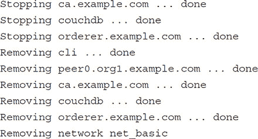

[`www.hyperledger.org/projects/sawtooth`](https://www.hyperledger.org/projects/sawtooth)

Hyperledger Sawtooth 是一个用于构建、部署和运行分布式账本的模块化平台。Hyperledger Sawtooth 包括一种专有的共识算法，证明过去时间（PoET），它针对大型分布式验证者群体，资源消耗最小。

##### Hyperledger 工具

所有平台都需要工具和实用程序，区块链也不例外。以下是 Hyperledger 平台当前的工具。

##### Hyperledger Cello

网站：[`github.com/hyperledger/cello`](https://github.com/hyperledger/cello)

[`www.hyperledger.org/projects/cello`](https://www.hyperledger.org/projects/cello)

Hyperledger Cello 是一个工具包，旨在将按需的“即服务”部署模型引入区块链生态系统。它的目标是减少设置、持续维护和拆除区块链所需的努力。它的亮点包括：

•   即时提供定制的区块链，例如，Hyperledger Fabric

•   在裸机、虚拟机、Docker Swarm 和 Kubernetes 上维护一个执行区块链的池

•   提供系统状态的管理仪表板，允许调整链数或扩展资源

##### Hyperledger Composer

网站：[`github.com/hyperledger/composer`](https://github.com/hyperledger/composer)

[`www.hyperledger.org/projects/composer`](https://www.hyperledger.org/projects/composer)

Hyperledger Composer 是一个用于构建区块链业务网络的协作工具，加速智能合约的开发和部署到分布式账本。参见图 8-3（Figure 8-3）为该工具的示例屏幕截图。Hyperledger Composer 是一个广泛的开源开发协作工具集和框架，使开发区块链应用程序变得更容易。它的目标是加速产生价值，使建模业务网络变得更容易，然后将区块链应用程序与现有的/遗留的业务系统集成。它支持现有的 Hyperledger Fabric 区块链，并支持由授权网络成员建立的可插拔共识协议。

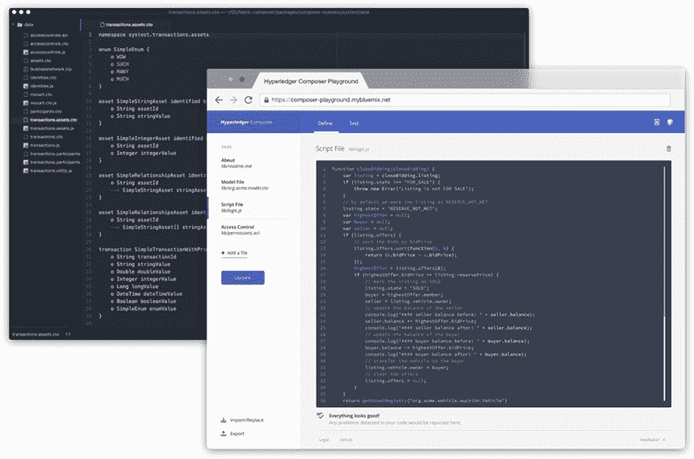

**图 8-3   Hyperledger Composer**

##### Hyperledger Explorer

网站：[`www.hyperledger.org/projects/explorer`](https://www.hyperledger.org/projects/explorer)

[`github.com/hyperledger/blockchain-explorer`](https://github.com/hyperledger/blockchain-explorer)

Hyperledger Explorer，由 IBM、Intel 和 DTCC 贡献，可以查看、调用、部署或查询区块、与相关数据一起的交易、网络信息（例如，名称、状态）、链码和交易家族，以及区块链中包含的其他相关信息。参见图 8-4（Figure 8-4）为该工具的示例屏幕截图。

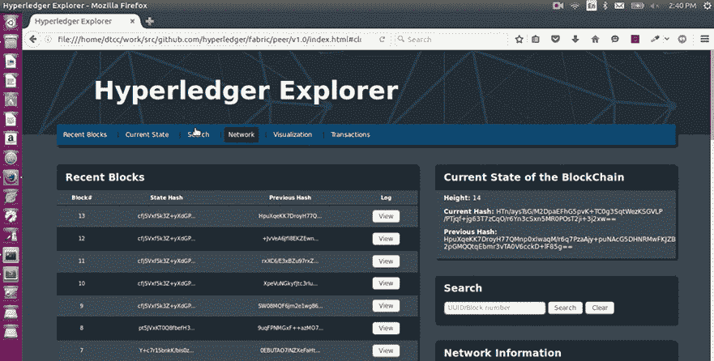

**图 8-4   Hyperledger Explorer**

#### Interbit

网站：[`btl.co/interbit`](http://btl.co/interbit)

Interbit 是一个企业级区块链平台，它使应用程序能够在一个区块链上构建、管理和运行。它的关键特性是：

•   **隐私**   确保数据只对那些有权限查看和更改数据的人可用

•   **可扩展性**   提供一个可以扩展到每秒数十万笔交易的平台

•   **便携性**   第一个能够在轻量级 IoT 设备上运行完整节点的区块链平台

#### Monax

网站：[`monax.io`](https://monax.io)

Monax 是一个可授权的智能合约平台。发布于 2014 年 12 月，Monax 提供了一个模块化的区块链客户端，其中内置了一个部分遵循以太坊虚拟机（EVM）规格的受许可智能合约解释器。2017 年初，区块链初创公司 Monax 宣布加入 Hyperledger。它是第一个加入联盟的基于 EVM 的代码库。Swift，一个银行间转账平台，已经尝试使用 Monax 平台作为其将区块链整合到支付平台项目的一部分。让我们来浏览一下 Monax 教程。

##### Monax 教程

这个教程首先要做的第一件事是建立虚拟环境；这可以是 Docker 或 Vagrant。我们将查看 Vagrant 安装。以下假设你已经安装了 Vagrant，并且你已经下载了相关的 monax.box 文件和 Monax 研讨会源代码.zip 文件。

第一步是注册 Monax 虚拟机：

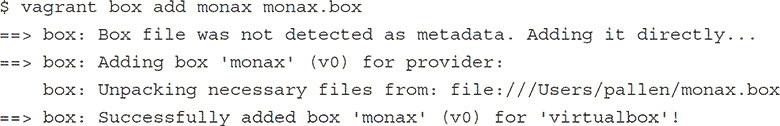

然后切换到教程材料目录并初始化 `vagrant` 实例：

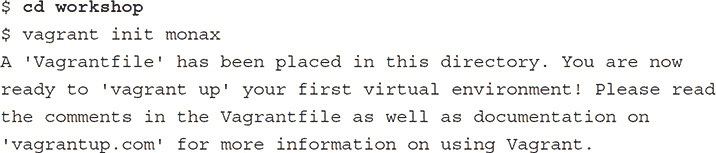

然后启动实例：

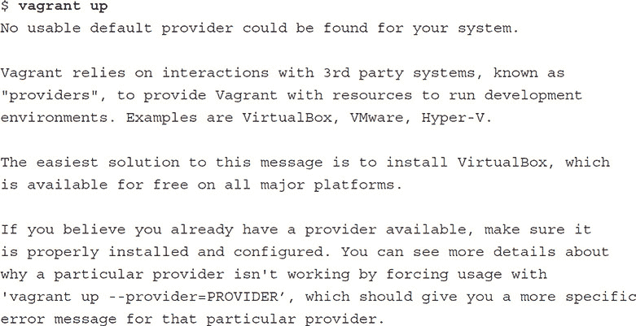

如果你遇到了上面的错误，这意味着你还没有安装 VirtualBox。没关系，只需去下载并安装它，然后再次尝试启动实例。

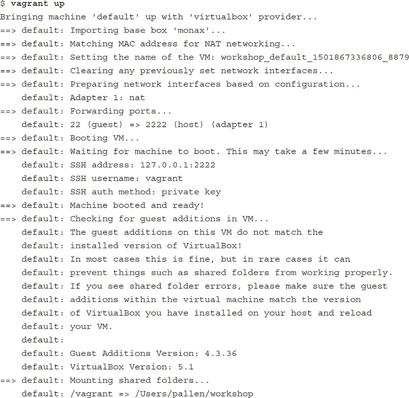

教程设置阶段的最后一步是使用安全壳进入它：

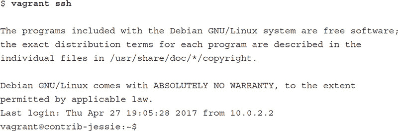

注意，安全壳虚拟机登录为 `contrib-jessie`，这是创建虚拟实例的人的登录名。

**创建链配置**   完成 Monax 虚拟机设置后，你现在可以开始制作链配置的过程。这个过程在 Monax 平台上创建了一个私有区块链的所有必要文件。以下是链的 `make` 命令的帮助文本：

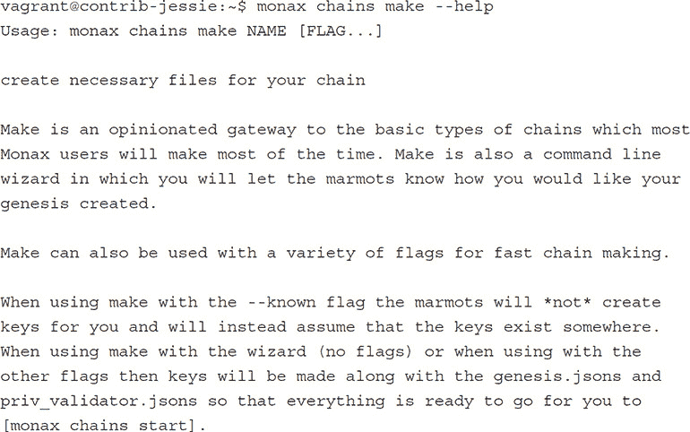

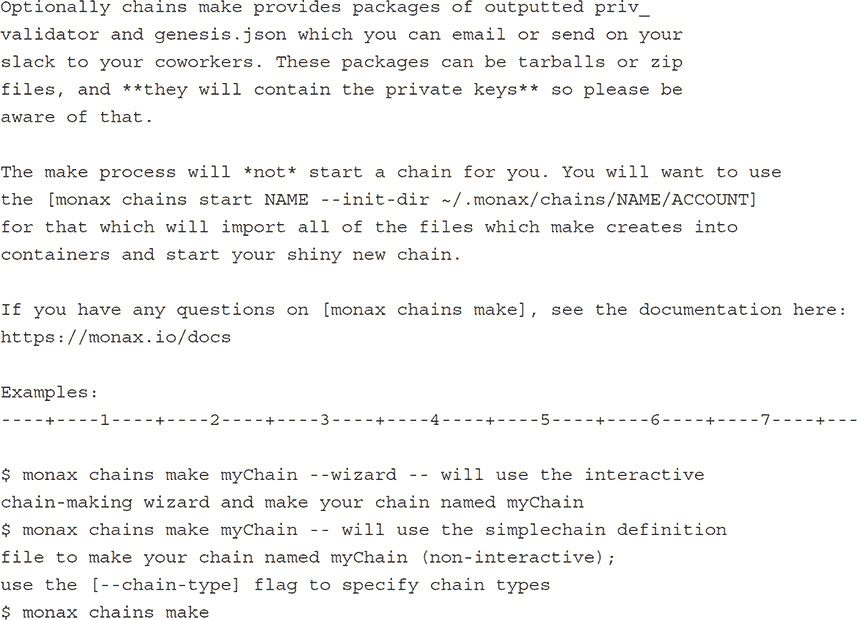

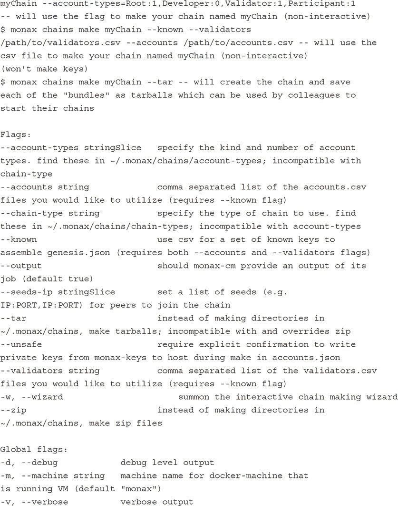

在以下命令中，我们使用一个完整节点和三个参与者创建一个链配置：

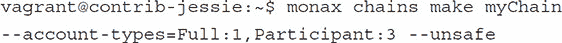

启动研讨会链：

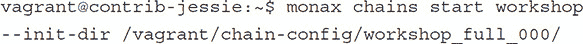

复制用户密钥并将它们导入到开发密钥服务器中：

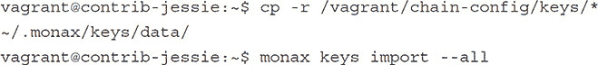

注意，导入步骤可能需要几分钟。

**教程：阶段** 接下来的步骤是主要部署和测试阶段。它从第一阶段开始，这个阶段是一个执行以下操作的作业：

- 部署课程注册表（一个 Solidity 智能合约）

- 注册参与者

- 获取注册的参与者数量

- 验证课程参与人数为 1

以下是在 epm.yaml 文件中表达的上述步骤：

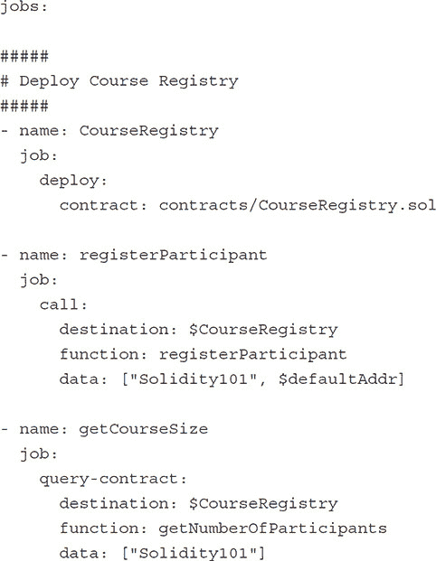

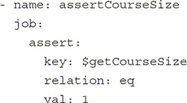

执行上述工作并查看第一阶段的输出：

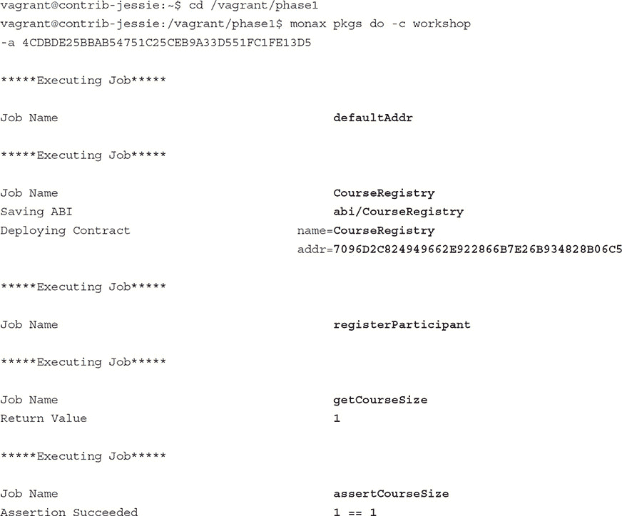

下面的列表显示了课程注册表智能合约被部署的内容（CourseRegistry.sol 文件）：

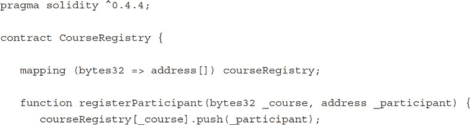

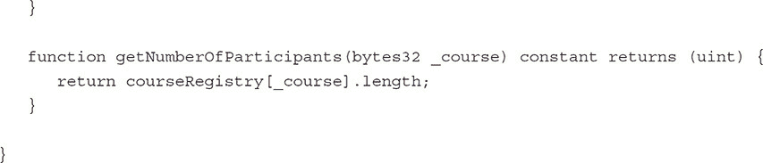

教程下一步，第二阶段，是运行一个作业，执行以下操作：

- 部署课程管理器（另一个 Solidity 智能合约）

- 获取课程管理器的句柄

- 注册参与者

- 获取注册的参与者数量

- 验证课程参与人数为 1

以下是在 epm.yaml 文件中表达的上述步骤：

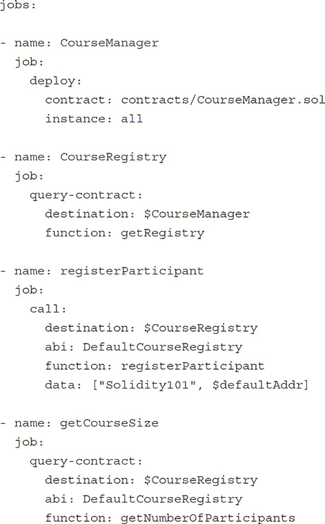

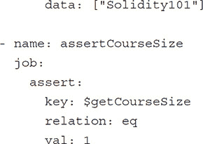

执行上述工作并查看输出：

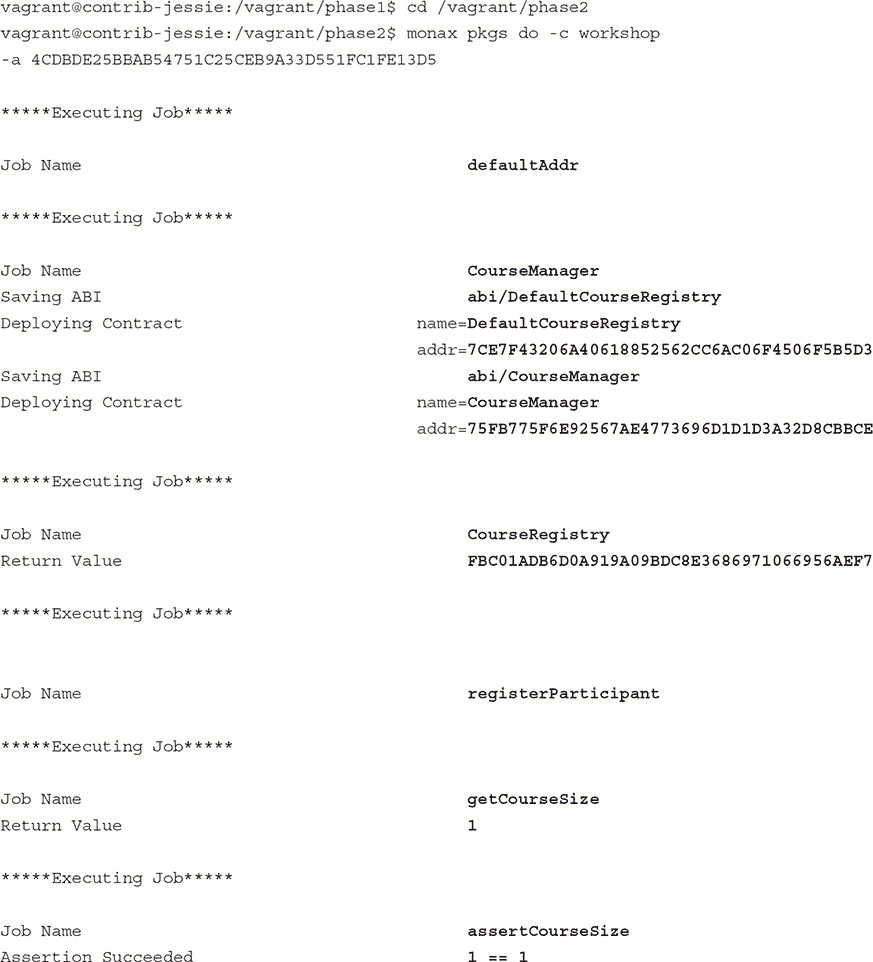

下面的列表显示了课程管理智能合约被部署的内容（CourseManager.sol 文件）：

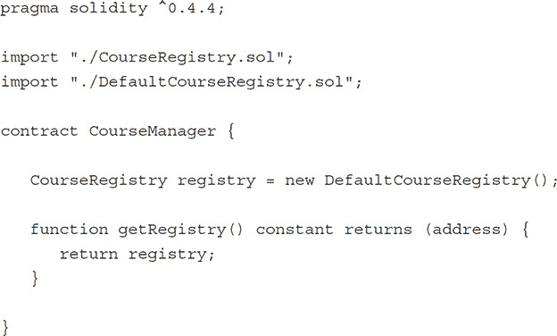

下面的列表显示了课程注册表智能合约被部署的内容（CourseRegistry.sol 文件）：

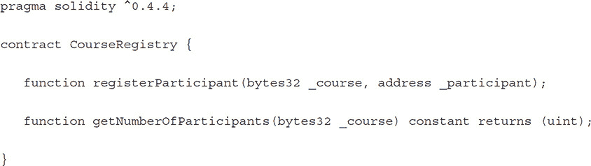

下面的列表显示了默认课程注册表智能合约被部署的内容（DefaultCourseRegistry.sol 文件）：

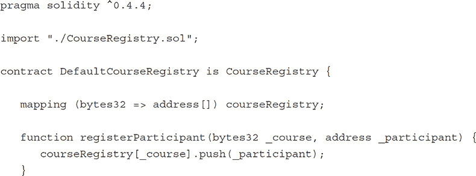

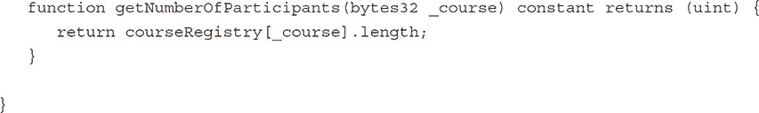

第三阶段是运行一个作业，执行以下操作：

- 部署课程管理器（Solidity 智能合约）

- 获取课程管理器的句柄

- 注册参与者（失败）

- 获取注册的参与者数量

- 验证课程参与人数为 0

- 注册参与者（成功）

- 获取注册的参与者数量

- 验证课程参与人数为 1

以下是在 epm.yaml 文件中表达的上述步骤：

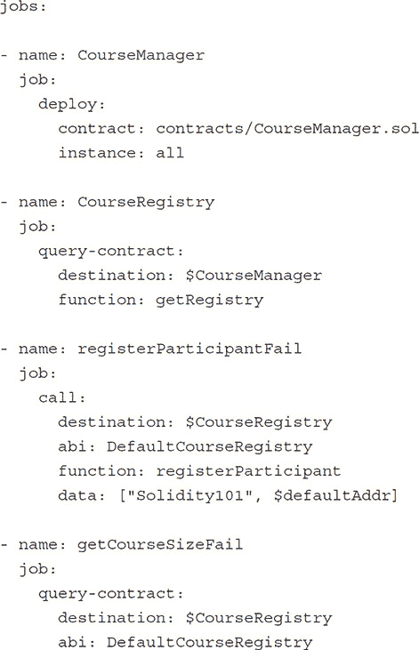

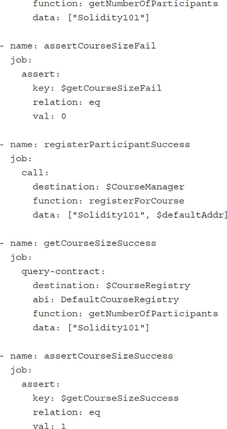

执行上述工作并查看输出：

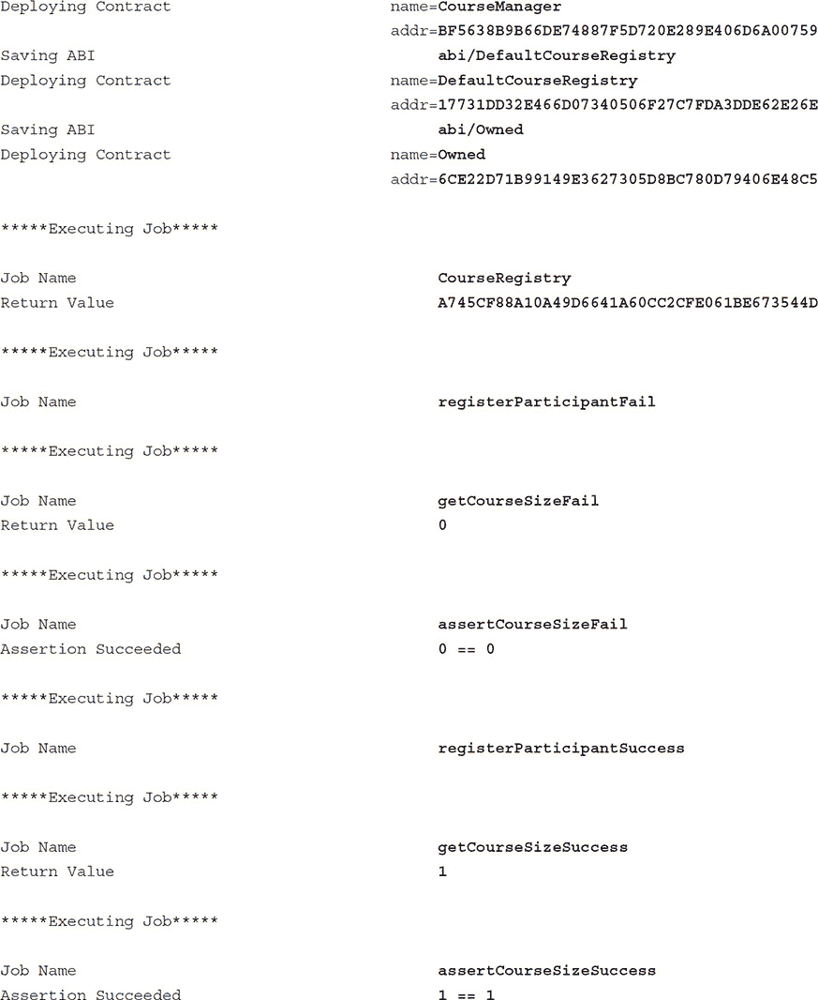

第四阶段是一个执行以下操作的作业：

- 部署课程库（Solidity 智能合约）

- 部署课程管理器（链接到课程库）

- 获取课程管理器的句柄

- 添加课程（Solidity 101）

- 获取可用的课程数量

- 验证可用的课程数量为 1

- 注册参加可用的课程（Solidity 101）

- 获取注册的参与者数量

- 验证课程参与人数为 1

以下是在 epm.yaml 文件中表达的上述步骤：

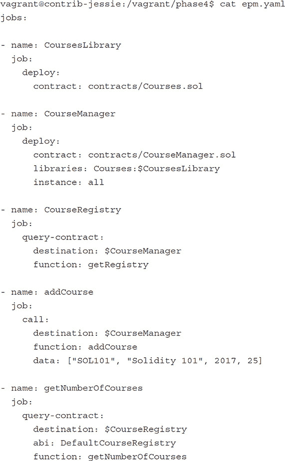

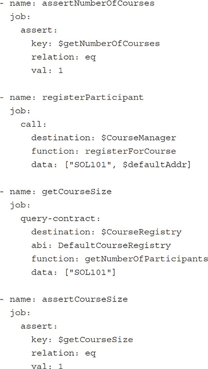

执行上述工作并查看输出：

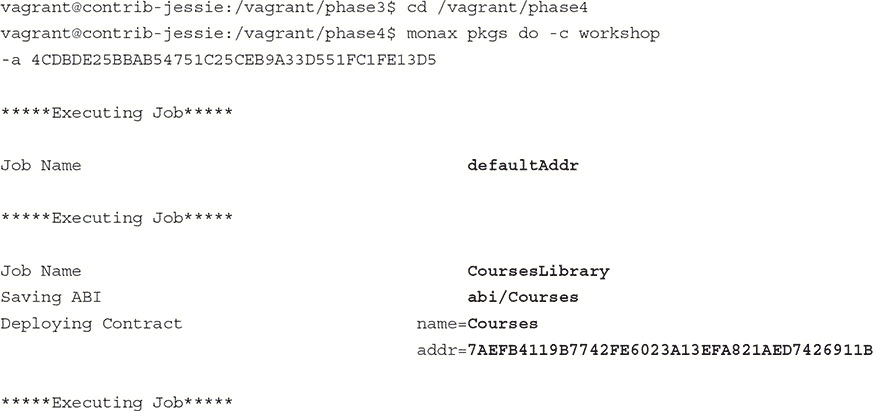

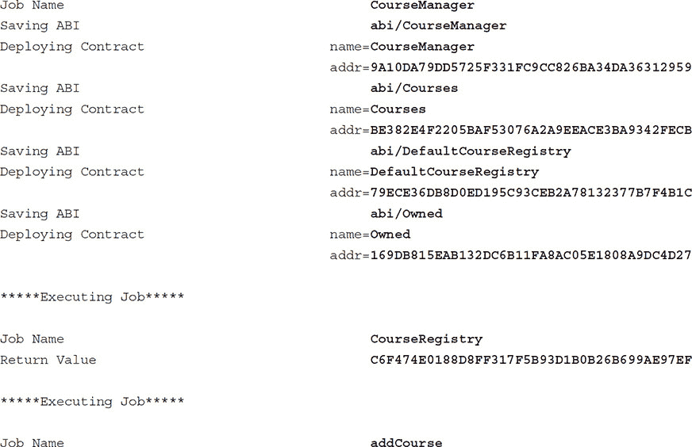

教程到此结束。现在进入拆卸环节，这一部分没有文档。为了彻底拆卸整个虚拟环境，您首先需要退出安全终端，如果您还没有这么做的话：

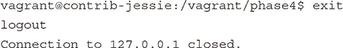

然后您可以按照以下步骤开始拆卸过程：

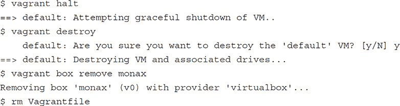

上述教程是对 Monax 产品的简要介绍。它展示了定义和启动一个链，部署用 Solidity 编写的智能合约，然后调用智能合约上的函数。

#### MultiChain

网站：

[`www.multichain.com`](https://www.multichain.com)

[`github.com/MultiChain/multichain`](https://github.com/MultiChain/multichain)

MultiChain 是一个基于比特币区块链的开源私有链平台。其关键特性包括：

•   受管理的权限**   控制谁可以连接；发送和接收交易；创建资产、数据流和区块

•   快速部署**   创建新区块链需要两步，连接现有区块链需要三步

•   无限制的资产**   在网络层面进行跟踪和验证

•   数据流**   允许在区块链上创建多个键值、时间序列或身份数据库

MultiChain 为比特币生态系统提供最大兼容性，包括比特币核心 API/运行时参数、点对点协议及其交易/区块格式。

#### Openchain

网站：

[`www.openchain.org`](https://www.openchain.org)

[`github.com/openchain`](https://github.com/openchain)

Openchain 是一个开源的分布式账本平台，用于发行和管理数字资产。Openchain 实例的管理员定义账本的规则，然后授权的最终用户可以根据这些规则在账本上进行价值交换。账本上的每一笔交易都是数字签名的。

Openchain 是一个资产所有权的通用注册表。一些示例用例包括：

证券、商品、货币

•   所有权证明（土地、房地产、音乐或软件许可）

奖励、礼品和忠诚度卡片

#### 权益证明（Quorum）

网站：[`github.com/jpmorganchase/quorum`](https://github.com/jpmorganchase/quorum)

[`www.jpmorgan.com/country/US/EN/Quorum`](https://www.jpmorgan.com/country/US/EN/Quorum)

Quorum 是一个基于以太坊官方 Go 实现的开源分布式账本平台。它旨在支持需要身份验证以及在已知参与者权限组内进行高速/吞吐量性能的私人交易的应用程序。Quorum 的一个设计目标是尽可能重用现有的以太坊技术，并与公共以太坊代码库的未来版本保持同步。

Quorum 还提供 Cakeshop，这是一个用于与 Quorum 网络、智能合约和 API 工作的图形用户界面。Quorum 共识机制基于多数投票，这导致更快的区块时间、交易最终性和按需创建区块。

Quorum 使用密码学保护数据不被非交易方访问。Quorum 是一个单一共享的区块链和以太坊更改的组合，以及智能合约来分割私有数据。Go-Ethereum 代码库的更改是对区块提议和区块验证过程的更改。对于区块验证，所有节点验证公共交易，当执行与交易相关的合同代码时，它们还验证自己参与的私有交易。

#### 恒星

官网：[`www.stellar.org`](https://www.stellar.org)

恒星是一个开源的分布式支付基础设施，连接银行、支付

系统和人。它支持构建移动钱包、银行工具和智能设备。链中的服务器相互通信并同步，以确保交易是有效的并且被记录在账本上。恒星网络使用自己的共识机制，称为恒星共识协议（SCP）。它的关键特性包括：

•   低延迟。

•   数字签名和哈希家族。

•   去中心化控制，任何人都可以参与，没有中心权威决定谁的支持是达成共识所必需的。

•   灵活的信任。用户有自由信任任何他们认为合适的组合。例如，一个小型非营利组织可能在保持更大机构诚实方面发挥关键作用。

#### 生命之树汇编

官网：[`symbiont.io/technology/introducing-symbiont-assembly`](https://symbiont.io/technology/introducing-symbiont-assembly)

生命之树汇编是一个不可变的（或“只追加”）数据库，提供了一个单一的全球账本，其交易历史被复制到网络中的所有节点。它是一个需要权限的账本，每个用户签署他们的交易，以便他们的身份可以被网络上的所有参与者验证。

生命之树汇编使用一种名为 BFT-SMaRt 的专有拜占庭容错共识协议，该协议设计时考虑了简单性和模块化，并且比公共区块链共识协议有更好的性能。

### 总结

对于受许可的私有区块链，有许多选择，而且这个列表可能会继续增长。在许多情况下，政府/行业规定需要私有控制。话说回来，比特币在公有区块链上启动时的自由、中立和开放是一个需要考虑的事情。在公共平台上分散控制和共识的关注点显然是值得思考的。围绕隐私、身份、速度和公有区块链解决方案的成本，有很多讨论和关注。需要注意的是，通过在公有区块链上创建私有管理的智能合约，或者在公有和私有区块链之间的跨链交换层，可以在公共平台上提供私有区块链的一定属性。时间将告诉我们这些能力和属性是否会被构建到公有区块链中。
