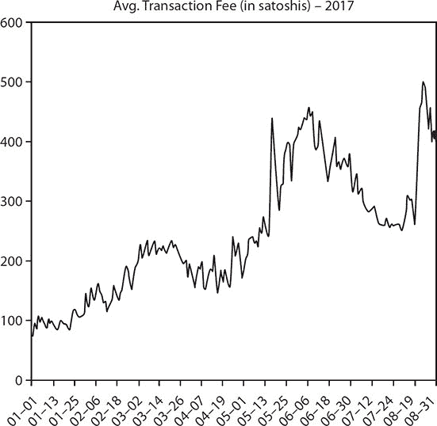
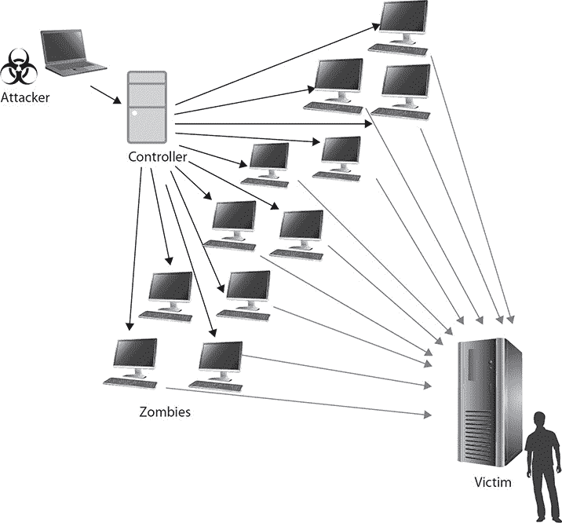
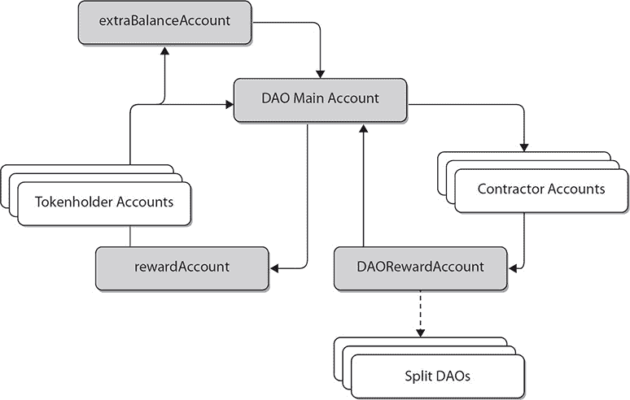
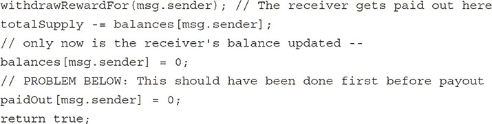
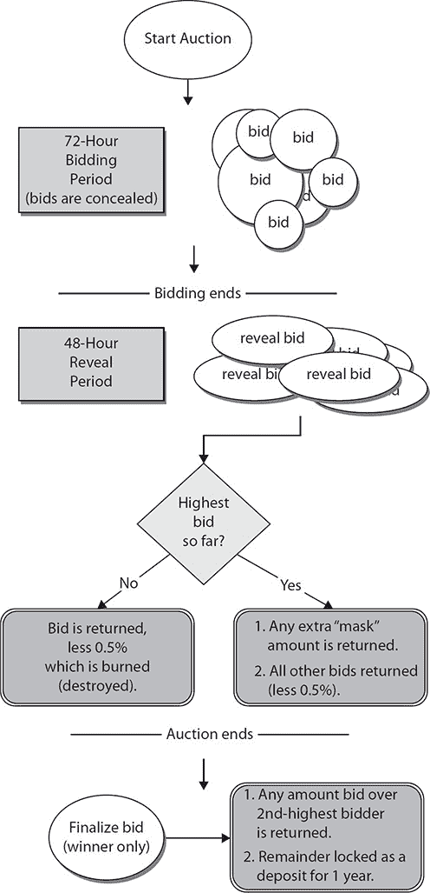
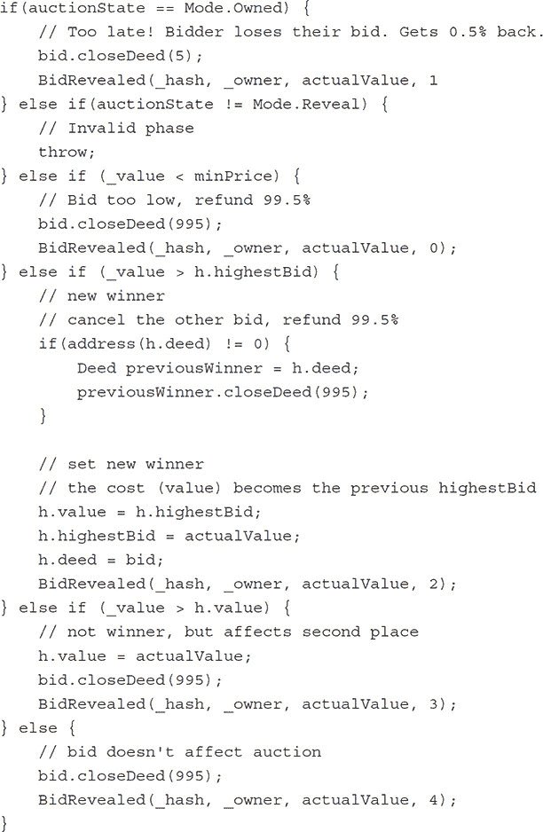
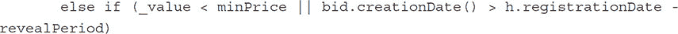
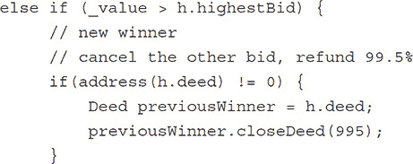
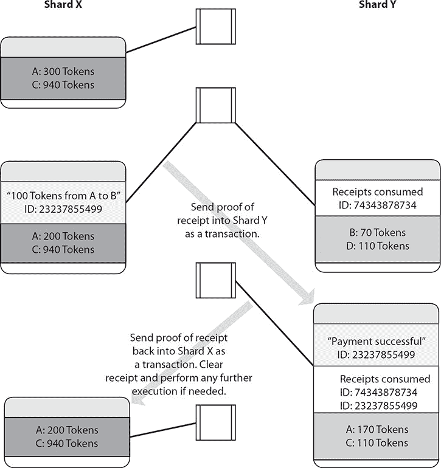

## 9   挑战

随着区块链的发展和新应用的出现，我们这些开发者——以及或许治理监管者和律师——将面临一系列复杂的问题以及新的依赖关系。与区块链相关的关键挑战之一是缺乏对技术及其应用的认识和技能，特别是在银行以外的领域。区块链代表了一种从传统数字技术发展方式向大型转变。它将信任和权威置于去中心化网络中，而不是传统的中心机构中。这种控制权的丧失使得企业领导人犹豫不决。区块链或许是 80%的业务流程变化和 20%的技术实施。目前区块链网络在执行点对点交易的速度和效率上的高总体成本。正如我们所看到的，这种低效源于每个节点在其数据副本上执行与网络上的每个其他节点相同的任务。在本章中，我们将探讨一些可能的替代方案。例如，对于使用工作量证明方法而不是信任网络参与者的比特币网络，2017 年与验证和共享交易相关的总运行成本达到 6 亿美元并呈上升趋势。区块链是一个生产力悖论。因此，在实施区块链应用程序之前，需要仔细考虑和分析有关实施的决定。他们产生的法律和规定始终难以跟上技术的进步。实际上，像比特币区块链这样的技术完全绕过监管，以解决传统中介支付网络中的低效问题。话说回来，仍有强有力的理由认为区块链应用程序应该在法律和监管框架内运作，而不是在其外，但这意味着律师和商业领袖需要理解该技术及其对其所在行业的企业和消费者的影响。

虽然没有任何技术是完全安全的，但没有人成功地破坏过区块链的加密和去中心化架构。就安全和隐私而言，在区块链内创建的身份是独特的，并提供了高度的保证，即该方是他们所声称的人。我们必须考虑隐私和安全如何推动并指导设计。公众对区块链应用的接受可能意味着积极地将隐私讨论围绕价值、安全和信任的概念来构建。我们将在本章中探讨这些挑战和其他问题。

All software systems as they evolve from proof of concept prototypes to virtual necessity naturally face technical challenges. Blockchains as distributed systems not only face technical challenges but, as we have seen, a host of governance challenges as well. We will explore challenges around governance, including the Bitcoin rift and the Ethereum fork. On the technical side, there are challenges such as “51 percent attacks”, and the all too familiar denial-of-service attacks we see in the cybersecurity news each day. Some new wave challenges include the growing use of smart contracts, and the reliability thereof, as well as the perennial scaling problems which all popular technology faces.

### Blockchain Governance Challenges

Governance challenges encompass the philosophical, economic, and social issues that come from those already supporting a given blockchain or cryptocurrency, but disagree on how to move the technology forward. These are challenges that will consistently arise and be different every time. They all revolve around how to upgrade the code to deal with some issue but cannot agree on how to do so. In other words, it’s an issue of how to achieve consensus on the *community level*, of how protocol upgrades are managed. In a decentralized environment, you can’t force anyone to upgrade, but this has presented a number of problems, including:

-   Bitcoin blocksize debate

-   Ethereum DAO fork

-   Ethereum moving to proof-of-stake

#### Bitcoin Blocksize Debate

The Bitcoin blocksize debate has been a long-standing, growing rift in the Bitcoin space. It revolves around the 1MB limitation on blocksize that is hardcoded in the code (see [`github.com/bitcoin/bitcoin/blob/master/src/consensus/consensus.h`](https://github.com/bitcoin/bitcoin/blob/master/src/consensus/consensus.h)):

`static const unsigned int MAX_BLOCK_BASE_SIZE = 1000000;`

The limitation was originally put there by Satoshi Nakamoto to prevent denial-of-service attacks. The fear was that without this limitation some miners could create blocks so large that smaller miners would not be able to process and keep up, in effect cutting them off from participating in the network. When Satoshi first put the limitation in place, it was with the understanding that it will be removed when the network is ready. But even after the capabilities of the network have improved due to hardware advances, the 1 MB limit has remained.

The problem with having such a limit is simply that there are only so many transactions that can fit into a 1MB block (roughly 2,000). Since there is a new block only every 10 minutes, this translates into three or four transactions per second. Obviously, this is untenable for a global system where, for comparison, Visa handles 20,000 transactions per second.

区块大小问题最早是在 2013 年提出的，Jeff Garzik 表示区块大小需要增加。Gavin Andresen 和 Mike Hearn 在 2015 年决定介入，当时他们觉得这个问题需要认真对待。Hearn 写了一篇题为“The Capacity Cliff”的博客文章，敦促比特币社区立即增加区块大小。他认为一旦区块达到容量上限，人们的交易就无法处理，他们就会对比特币的功能失去信心，比特币的市场价值将出现螺旋式下降。Hearn 当时卖掉了所有的比特币。Andresen 认为到 2016 年 3 月比特币区块将会满。他的预测是准确的。然而，Hearn 的末日情景并没有发生。

Instead of the issue working its way closer to a resolution, it has instead drifted in the opposite direction, toward heated technical debates, arguments over the use and nature of Bitcoin, and name calling and infighting. The core developers felt that changing the blocksize would disadvantage small miners and lead to further miner centralization. They also felt a “fee market” is healthy for Bitcoin. They felt that there needs to be competition to get into a block in order to eliminate transaction spam and increase the transaction fees in general. They argued that a small (less than 10 cents) transaction fee is too small for a network that needs to store that transaction forever.

社区分化为支持大区块和支持小区块的两派。每一方都指责对方试图摧毁比特币。在 Reddit 上，有一个从 r/bitcoin 分出来的 r/btc，r/btc 指责 r/bitcoin 审查支持任何大小增加的帖子。的确有很多证据支持审查的说法。r/bitcoin 反过来指责 r/btc 只是攻击任何想要维持现状的人。双方都有无尽的博客文章和评论，从 Coinbase 的 CEO Brian Armstrong 到 Vitalik Buterin 都发表了意见。

满区块的影响意味着交易费用必须上涨，到 2017 年底，典型的交易是支付 2 到 5 美元，而几年前比特币被认为几乎是无成本使用的。图 9-1（Figure 9-1）显示了 2017 年交易费用的上涨，以每字节聪文（即 0.00000001 比特币）计。此外，交易不再在第一个区块确认，而是经常需要几个区块才能得到确认，将原本的 10 分钟等待时间延长到 30 分钟。许多交易根本不会确认，卡在内存池中。最终这些交易会消失，用户可以提高费用重新发送，但内存池中不断增加的交易数量并不乐观。

**图 9-1   2017 年 1 月至 9 月平均交易费用，以每字节聪文计**

这些问题导致许多比特币支持者主张“分叉”比特币——发布一个可以创建 2MB 区块的比特币版本，称为比特币经典，以及一个完全移除硬编码限制的版本，称为比特币无限。2017 年夏季，一个名为比特币现金的新版本被提出，该版本将区块大小提高到 8MB。8 月 1 日，它获得了足够的支持以生效，比特币现金诞生了。比特币网络分为两个。

比特币区块大小问题令人不安，因为即使是相对较小的变化也无法获得足够的支持来防止分叉。如果比特币社区无法就一个小的代码更改达成一致，那么实现协议所需的重大改进（用于扩展和侧链）又有何希望呢？我们可能正朝着拥有许多比特币区块链的世界迈进，每一个区块链都是由于无法获得普遍支持的修改而产生的。

#### Ethereum DAO 分叉

在 2016 年 7 月之前，只有一个以太坊（ETH）。然后以太坊网络分叉了。社区的大部分，大约 90%，支持以太坊基金会，该基金会对代码进行了唯一一次更改：它撤销了一个 DAO 交易的所有交易，这个交易将价值 6000 万美元的以太币从 DAO 合约转移到一个黑客的个人合约。虽然社区的大部分支持这一变化，但也有一些强烈的反对意见——不是因为人们希望黑客逍遥法外，只是认为这是两害相权取其轻。更大的邪恶是背弃区块链的承诺——确实，这是 ethereum.org 上的说法：“不可阻挡的代码。” 区块链承诺代码不可更改，交易不可回滚。如果这笔交易被回滚，那么任何人怎么还能相信他们的交易不会遭受类似的命运呢？当然，这种担忧某种程度上是不公正的，因为你只有当以太坊社区的大部分团结起来撤销交易时，才存在交易被回滚的风险，而这种情况只有在类似 DAO 黑客这样的事件中才可能发生。不管怎样，有一些坚定的反对者不愿意升级。

2016 年 7 月 20 日，在区块编号 1920000 处，以太坊的新版本生效。至少在最初，社区的大部分人立即将其视为一次成功。在未升级的链上几乎没有算力，在前两天似乎旧链将完全消失——在该链上不会有矿工创建区块。但随后发生了令人惊讶的事情。链开始获得更多的算力和更坚定的支持者。然后最大的以太坊交易所——Poloniex——列出了这些“旧链”代币，称为以太坊经典（ETC）。这是将 ETC 开放给交易者和投机者的分水岭，一些交易者认为 Poloniex 支持该币种，而另一些则批评他们出于自身利益添加该币种。以太坊经典自那以后一直保持着稳定的支持者群体，并且市值一直位居前列。

这一切都说明了公共代币的挑战：如何让整个社区在改变某种代码方面达成一致。如果每次变革都会产生一个姐妹链，那么加密货币的价值主张就会被削弱。

#### 以太坊转向权益证明和扩容挑战

继上述情况，以太坊在其近期面临更多的治理问题。以太坊一直提议转向权益证明（PoS）挖矿算法。尽管矿工从第一天就知道这种变革将在某个时刻实施，但他们现在在证明工作挖矿设备上有很大的投入。对他们来说，支持转向权益证明可能并不符合最佳利益。实际上，已经有少部分以太坊矿工讨论维持现状的共识算法。以太坊高级开发者 Vlad Zamfir 也主张在转向 PoS 之前减少挖矿奖励，考虑到以太币的高价格。然而无论这些论点多么有力，如果它们不能满足大多数矿工的需求，那么任何变革都将导致以太坊的另一个版本。

或许更具挑战性的是以太坊的架构变革以实现分片——以太坊的扩容提议。这些变革可能非常重大——且充满风险。很难想象不会有反对声音反对实施可能引入漏洞从而抹掉以太坊整个市值的变革。

在比特币的早期，也有人认为它将经历重大变革以实现扩容。如今，这些梦想随着认识到现在改变比特币太过困难而破灭了。然而，与以太坊不同，比特币的核心功能一直是作为“价值储存”。另一方面，以太坊被推崇为世界计算机。世界计算机必须能够处理每秒超过几十笔交易。这是以太坊独特面临的存在威胁。

### 区块链技术挑战

区块链作为一种软件，面临一些独特的挑战。区块链代码的容错空间非常小，尤其是公共区块链。如果数十亿美元加密货币的安全性依赖于平台的稳定，那么一个虫子可能会造成数亿美元甚至致命的损失。DAO 攻击已经证明了这一点：一个微妙的错误导致了数千万美元的损失，更不用说对整个系统信心的伤害了。因此，区块链代码必须与驾驶飞机的软件或监控石油钻探的软件相提并论。

技术挑战主要有两种类型：安全挑战和可用性挑战。我们将探讨以下内容：

•   安全挑战：核心代码、服务拒绝攻击、智能合约

•   可用性挑战：扩展性

#### Core Code 中的虫子

在比特币的历史上，其核心代码有两个可能造成灾难性的问题。2010 年 8 月 8 日，比特币开发者杰夫·加兹里克在 bitcointalk.org 上宣布，“这个块中的‘输出值’相当奇怪，”指的是一个包含 920 亿 BTC 的块，这比实际应该存在的比特币多出 91,979,000,000 亿比特币。区块编号 74638 利用整数溢出来使总交易变为负数。最终，区块链需要回退到这些比特币引入之前。

然后在 2012 年，比特币核心进行了一次更新，产生了一个意想不到的副作用。在新版本 0.8 中，它使用了 MongoDB 的更新版本（比特币的后端数据库）。这个版本与 0.7 不兼容，导致在旧版本上生成的区块无法被 0.8 识别。区块链分叉了。在 bitcointalk 论坛上疯狂的几小时后，决定所有升级的人都回退到 0.7 版本，并放弃他们的链。幸运的是，这些矿工——实际上是更负责任的那些人，跟随升级——愿意承受打击，为了网络的利益而失去挖矿奖励。尽管如此，这又是微妙的副作用产生的另一个例证。

#### 服务拒绝攻击

以太坊也面临了一个问题，这问题与其说是虫子不如说是校准不当，这允许针对网络进行服务拒绝（DoS）攻击。我们通常认为服务拒绝攻击是敌对者通过发送如此多的请求，以至于服务无法对合法用户做出响应，从而有效地将服务离线。图 9-2 显示了这种情况。

**图 9-2   服务拒绝攻击**

在以太坊上，情况略有不同。在以太坊上，用户需要为网络上的操作付费。所以你会认为这会通过执行操作需要花费金钱来阻止任何服务拒绝攻击。但这是基于执行操作的成本与运行它们的处理开销相匹配的假设；情况并非如此。EVM 中的每种操作类型都与其关联价格。恰好有些操作被定价不当，没有反映出满足它们的计算开销。攻击者释放了一个智能合约，并反复调用它执行内存密集型工作，大大减缓了以太坊网络的速度。实际上，如果不受一个名为 Parity 的较少使用的客户端的启发，该网络可能会陷入停滞。Parity 能够更高效地处理这些交易并满足需求。更受欢迎的 Geth 客户端变得无用。Geth 开发者迅速推出了一项改进，但只有通过硬分叉实现适当的定价才能进行完全修复。不幸的是，即使分叉后，仍有一个操作——自杀——在合约被销毁时调用，占用了太多资源，因此还需要推出另一个分叉来解决此问题。

简而言之，在为期两个月的期间内，以太坊区块链反复遭受攻击，导致服务拒绝攻击，这表明这些网络必须保持警惕并对抗这些攻击。

#### 智能合约中的安全

也许区块链中最重要的安全问题是智能合约的安全性，因为尽管核心区块链经过严格的审查和测试，但智能合约通常是被匆忙推出的。尽管可以回滚区块链以应对灾难性攻击，但智能合约通常无法回滚。

##### DAO 攻击

DAO 攻击是智能合约设计不当的最戏剧性例子。当黑客开始提取 DAO 合约时，该合约拥有价值 1.5 亿美元的以太币。黑客成功地将价值 6000 万美元的以太币转移到了一个他们完全控制的临时持有合约中。攻击发生是因为 DAO 允许用户反复提取他们的资金，这被称为重新注入漏洞。漏洞在于，提取以太币时，它被发送给提取者（在这个例子中是黑客），然后*才*将提取者的余额更新为 0。图 9-3 展示了 DAO 的基本结构，用户可以调用“分割 DAO”操作，并请求从父 DAO 向子 DAO 支付他们的资金。黑客找到了一种在余额更新之前反复请求支付的方法。

**图 9-3   DAO 中资金的正常流动，包括分割 DAO 功能**

以下是`splitDAO()`函数中存在问题的代码行，用户可以从中提取以太币并将其转移到自己的 DAO 中：

不仅 DAO 合约受到了重注入漏洞的影响。MakerDAO 这个存储了数百万美元在其去中心化交易平台的合约，也有这个漏洞，幸运的是，开发人员利用这个漏洞在自己被黑客攻击之前就清空了资金。

##### 其他智能合约漏洞

许多其他项目也遭受了智能合约中的漏洞。以太坊名称服务（ENS）是由以太坊基金会成员尼克·约翰逊领导的一个备受尊敬的项目。ENS 是一个系统，用于将用户友好的名称与以太坊地址相关联，无论是用户地址还是合约地址，就像 DNS 将域名与 IP 地址相关联一样。你可以将公司名称.eth 而不是长串的十六进制地址来引用。ENS 是一个作为注册表的合约，将名称映射到地址。它有一个非常公平的系统来预留这些名称。为了获取一个名称，你必须首先为你的名称开设一个拍卖，这给了任何人三天的时间来对名称进行出价。在出价期结束后，还有两天时间，所有人都可以揭示他们的出价，最高出价者将赢得名称，并退还他们支付高于第二高出价者的任何金额。换句话说，获胜出价者只需支付第二高出价者的金额。图 9-4 展示了出价流程。当出价时，它们是加密的，直到揭示期，出价才会被揭露。这是一个优雅的系统。

**图 9-4   ENS 出价阶段**

在 ENS 合约上线几小时后，发现了一个漏洞，允许某人在揭示期间持续出价，超过任何已揭示的出价。这个缺陷尤其严重，因为它并不依赖于 DAO 攻击所特有的特殊情况。这是一个明显的错误，一个关键的`if`条件完全缺失。这个漏洞在于合约中没有检查出价期是否已经结束。

ENS 团队迅速作出反应，并禁用了合约，承诺当天晚上就会发布修复补丁。他们将这个漏洞归咎于最后一刻的重构引入的——一个严重的疏忽，但得到了迅速的解决。修复的方法是将一个以上的检查更改为

看起来一切都很顺利，回到了正轨，但几小时后报告了第二个漏洞。合约可能会被诱骗，即使某人出的价格很低，也能让他们成为最高出价者。这归结于在一个`if`条件中使用了错误但名称相似的变量。变量`_value`是错误的引用，应该指的是`actualValue`：

具体来说，用户向拍卖会提交出价。他们可能在这里支付以太币，但出价时声明的价值与他们支付的以太币金额之间没有强制性的关系。地产的价值将由支付的金额来定义，并且地产将拥有这笔金额，但这可能不是用户在定义出价时声明的价值。

当调用`unsealBid`时，他们必须识别出与其声明的价值`_value`相匹配的出价，这个声明的价值可能与代表它的地产证的价值不同。该函数将计算出一个`actualValue`的数量，这个值将是支付的价值和声明的价值中的较小者。所以，如果用户付得少了，`actualValue`将是他们实际支付的值。

然而，在检查是否赢得了拍卖（或者至少是否达到了最低价）时，使用的是声明价值`_value`，而不是`actualValue`来决定出价者是否获胜。如果声明的价值足够高，他们会将之前的拍卖赢家排除在外。获胜出价将被设置为`actualValue`，这可能低于用户的声明价值，也低于之前的获胜出价。因此，有人可能通过声明非常高的价值但不足额资金（并在揭示期的最后阶段解封他们的出价，因为他们的实际支付的低价值变成了容易被替换的`highestBid`）来赢得拍卖。

在第一天就出现了两个令人尴尬的漏洞——对 ENS 来说这不是一个好的开始。团队表示他们打算暂停并推迟发布，直到进行全面审计。为什么在发布前没有进行彻底的审核？

ENS 事件是一个高调项目的高调团队未能达到区块链程序所需标准的例子。如果他们都不能发布可靠的代码，那么业余团队或广大工程师又如何能创建出既安全又按预期执行的智能合约呢？

去中心化自治组织（DAO）和其他智能合约的漏洞使社区中的许多人相信，如果这种技术要发挥作用，必须有更好的方法。希望每个人都成为更警惕的程序员是不够的。我们还会继续看到漏洞。替代方案是对智能合约编写的方式进行根本性的改变，以使漏洞在最初就难以出现——使用形式上可验证的语言或形式验证工具，这是函数式语言的一个特性。

在函数式编程中，函数的输出值只取决于传递给函数的参数，所以用相同的参数 x 调用函数 f 两次将每次产生相同的结果 f(x)。这与依赖于局部或全局状态的过程不同，当程序状态不同时，即使使用相同的参数，也可能在不同的时间产生不同的结果。消除副作用（即不依赖于函数输入的状态变化）可以使理解和预测程序的行为变得更容易，这是函数式编程发展的关键动机之一。

维塔利克·布特林（Vitalik Buterin）详细讨论了需要这样的技术，这也是以太坊的生存需求之一。问题在于，不仅需要大量资源来开发这样的语言或工具，而且在这种语言中学习和编程要困难得多。工程师需要重新培训，而且这类工程师的储备很可能更少。

#### 扩展

对于公共区块链来说，最大的挑战是可扩展性。比特币网络每秒可以处理 4 到 7 笔交易，以太坊网络大约 15 笔。这对于一个全球平台来说是微不足道的。如果公共区块链无法真正服务于全球观众，那它有什么用？如果比特币或以太坊今天有 Visa 或 Instagram 那么多用户，网络将会停滞不前。

当你考虑一下，如果网络中的每一个节点都执行每一笔交易，每一次计算，那么整个网络的处理能力将受到单个节点处理能力的限制。如果解决方案是拥有具有巨大内存、CPU 和带宽资源的超级节点，那么网络并不是非常去中心化的。只有强大的节点才会有强大的计算机。

实际上，让每个人都做所有事情是过于夸张的。为了使区块链能够扩展到 Visa 的规模，我们必须找到一种避开这种设计范式的办法。解决方案必须采取某种形式，即不是让每个人都处理所有事情。目前正在研究许多解决方案，但还没有实施。以下是我们所知道的一些概述。

##### 不要在区块链上做所有事情

一种解决方案是建立一个中间层或许多中间层。这些被称为第二层解决方案，它们被称为闪电网络（用于比特币）和雷登网络（用于以太坊）。用户可以创建状态通道，这使他们能够进行许多交易，有效地算作一笔交易。在一段时间后，也许是一个星期，通道关闭，各方在区块链上的总余额得到更新。

然而，即使状态通道也有一定的局限性。你仍然需要在每个双方之间打开一个通道。如果你有太多用户，区块链将无法为所有人容纳状态通道。

##### 不要在每一个节点上记录每一笔交易

最终，绕过可扩展性问题的方式就是消除到处记录一切的无谓冗余。在某种意义上，这实际上已经在多链交易中实现了。Litecoin 和 Ethereum 链的存在减轻了比特币链的一些负担。几乎就像是有了 Bitcoin¹, Bitcoin²,等等。当然，这种解决方案的问题是这些链之间没有直接的互操作性。然而，这导致了对于区块链网络解决方案的研究，包括 Cosmos，Polkadot 和其他许多解决方案。这个想法是有一个外部（去中心化）系统在监听一个区块链上的交易或操作，并将它们传递到另一个区块链上。

然而，多个区块链甚至多个区块链之间的互联并不是真正的可扩展性。你希望的是，随着你的网络增长并为你提供更多的安全性，交易吞吐量也能相应增长。虽然拥有多个区块链确实能增加交易吞吐量，但这也带来了一个代价：整个系统的安全性只取决于最弱的那个区块链。

#### 分片

我们可以将分片视为设计得彼此通信良好的大部分独立区块链。验证者被分配一些分片来跟踪，这可能每小时变化，用户维护一个轻客户端到所有分片。如果分片的数量是*S = O(c)*，其中*c*是分片能支持的事务数，那么这种方法可以支持多达*O(c*²*)*的事务。然而，随着更复杂的分片-分片方案，最大数量可以指数增加到*O(exp(c))*。

由于现在每个分片只拥有*O(n/c)*的节点为其工作，其中*n*是所有分片上节点的总数，问题在于，我们是否仍然可以利用整个网络的*O(n)*力量为每个分片服务？实际上我们可以。如果确定每个分片的状态和历史的方法是智能的，我们可以好像它们都在一个统一的区块链上工作一样，利用整个网络的力量。

更容易处理的场景是，当应用程序大部分完全在一个分片上运行时——要么它们没有很多用户，或者它们之间没有很多互动。当需要与另一个分片进行交互时，可以通过收据进行安全的跨分片通信来传递信息。注意我们不限制用户或应用程序必须使用哪个分片——每个人都有自由使用他们喜欢的任何分片。

当需要跨分片通信时，分片 X 生成一个某些活动在其上发生的收据。分片 Y 会消耗这个收据，因为它执行一些动作，并可能向 X 返回一些确认任务已完成的信息。泛化这个模式并不困难，可以构建到一个高级编程语言中。图 9-5 阐明了这个概念。

**图 9-5   分片 X 生成一个供分片 Y 消费的收据。**

然而，跨分片通信的过程将比同一分片内的通信机制功能更弱，我们在当前非可扩展区块链上执行的一些操作只能在单个分片内完成。

另外，异步方式下分片间的通信并不总是容易。加密货币老将安德鲁·米勒描述了这样一个例子：假设一个用户想要购买一张飞机票并预订一个酒店房间，但希望两个预订都能成功或都失败。他们不希望只拿到一个而另一个没有。如果两个系统都在同一个分片上，这个过程很简单——如果两个预订都没有完成，就撤销一切。但是，如果系统在不同的分片上，那么在异步系统中就有额外的要求。每个系统都必须允许对预订进行临时保留。这将使用户能够确认一个预订，然后是另一个。使用同步跨分片交易有一种更快、更有效的方法，但设计这样的系统并非易事。如果一个应用程序大于一个分片所能支持的大小，它将需要在多个分片上运行，并且通常需要将交易以串行方式跨链处理。

根据阿姆达尔定律，在任何具有非并行化组件的过程中，这些组件很快就会成为可以并行化的系统中的瓶颈。由于以太坊通常是一个计算系统，我们可以很容易地找出非并行化的程序。例如，想象一个合约，它跟踪一个值*x*，并在接收到交易时设置*sha3(x, tx_data)*。没有分片解决方案能比*O(c)*提供更好的性能。所以，即使随着时间的推移，共享区块链将越来越擅长处理更多样化和复杂的应用程序，它们在某些方面仍然会输给单区块链架构。

##### 通过随机抽样实现安全

我们如何协调所有节点，以实现它们共同工作的安全性？答案是随机抽样。每个验证者被随机分配到一个分片，并且可以在几小时或更短的时间内重新分配。从分片指定的验证者集合（比如说，150 个）中，将有一个被选中来自动创建一个区块。即使在任何时间点，验证和创建区块的节点数量要远远少于分片上的节点数量，从统计学角度来看，几乎就像是所有节点都在这样做。如果我们假设所有节点中有一个诚实的三分之二超级多数，那么来自 150 个节点的随机样本中有三分之二诚实的概率是 99.999%。如果我们假设有更高的诚实超级多数，那么这个概率可以非常接近 100%。

### 总结

虽然区块链被誉为一项将解决许多问题的技术突破，但很明显，它们面临着许多独特的挑战。这些挑战并非不可克服，但克服它们仍将需要大量的努力来发展基础设施和安全机制。
