## 11   部署示例应用：区块链与投注

### 部署完整合约

在第十章中，我们介绍了编写智能合约的开发步骤。现在合约已经完全编写完毕，让我们将其部署到我们的测试链上，并与之交互。

`node deploy.js ethereum && node debug.js ethereum`

在编译过程中修复出现的任何错误，如有必要，再次运行部署。如果一切正常，你应该看到交互式提示框弹出。让我们运行几个测试函数来确保我们的合约能正常工作。

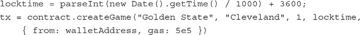

第一行创建了一个 UNIX 时间戳，比现在时间晚 1 小时（3600 秒）。JavaScript 日期类型使用的是自 UNIX 纪元以来的毫秒数，而不是像大多数其他语言那样使用自 UNIX 纪元以来的秒数，因此需要进行转换。第三参数是类别，对于我们来说，1 指的是 NBA。执行`createGame`函数将返回一个交易 ID，该交易 ID 可用于检查交易是否已被矿工打包。

在任何时候，你可以运行:

`web3.eth.getTransactionReceipt(tx);`

以查看交易是否已被矿工打包。如果没有，它将返回 null。如果有，它将返回一个收据对象。

交易确认后，你应该能够从合约中读取到新创建的游戏信息。

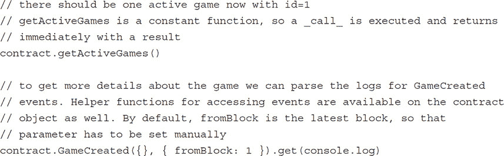

你应该能够从这两个语句的输出中看到单个游戏的信息。

#### 主网部署

主网部署与部署到我们的私有链非常相似。重复上面所有确切的步骤，有两个例外。

首先，通过导航到运行我们私有链的 geth 进程标签并输入 CTRL-C 来退出私有链的 geth 进程。然后使用以下命令运行以太坊主网：

`| geth --rpc --rpcapi web3,eth,net,personal`

如果你之前还没有同步过一个完整的 geth 节点，这个过程可能需要长达一天的时间。如果你已经同步过了，完全同步应该只需要几分钟。为了将应用部署到主网，你必须创建一个钱包地址并从交易所获取以太币。这个流程在早前的章节中有覆盖。

节点同步并追赶上主链之后，运行前文提到的`deploy`命令。你应该在输出中看到你的部署确认信息。现在你可以运行前文提到的测试脚本来确认合约是否已成功部署。

### 种子数据

每次部署时手动为我们合约种子数据是一个既繁琐又耗时的过程，所以我们将编写一个脚本来为我们种子数据。

我们`seeds.js`文件将看起来像这样：

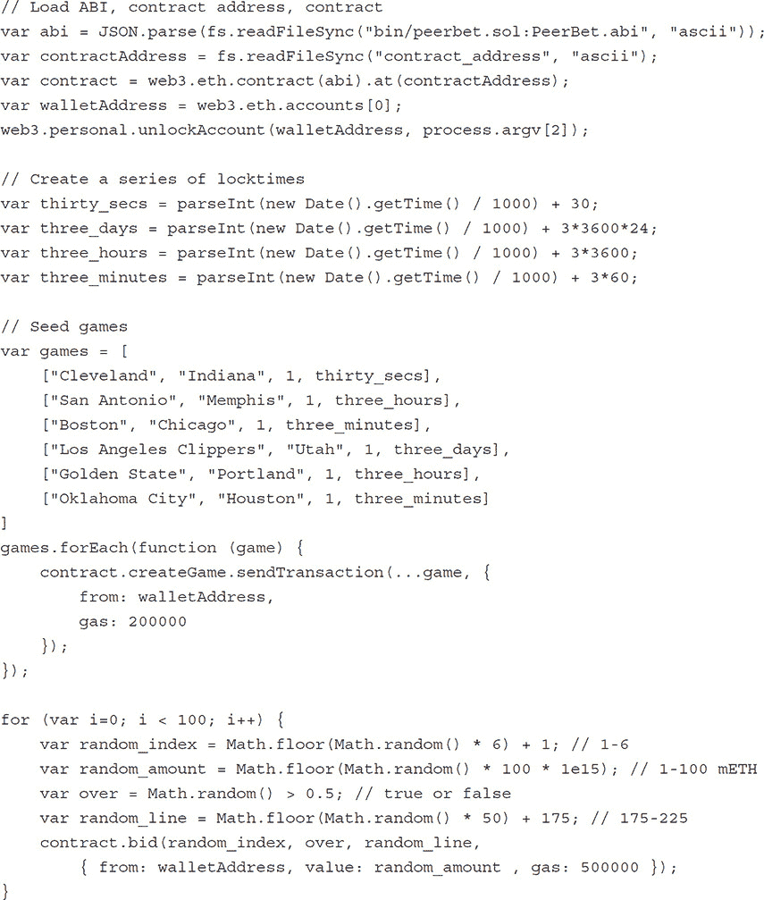

让我们按部分拆分这个流程：

这些都是我们之前见过的标准包含和提供者设置逻辑。

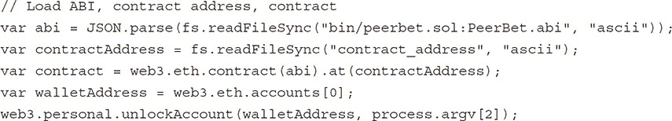

我们从各自的文件中加载 ABI 和合约地址，并使用它们创建一个合约对象。然后我们访问默认的钱包，并使用钱包密码解锁，该密码将作为脚本的第一命令行参数传递。

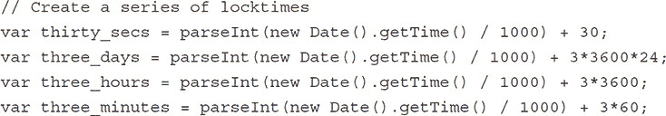

为了混合一下，我们在游戏逻辑中定义了四个不同的锁时间。

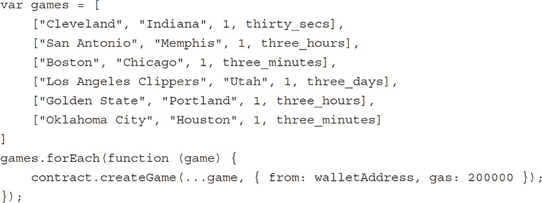

我们在这里通过定义一个游戏属性数组，遍历数组，然后使用 JavaScript 展开操作符`...`，将参数传递到`createGame`合约函数中，从而创建六个游戏。这应该会创建六个国家篮球协会（NBA）比赛（类别=1），具有不同的锁时间和球队。

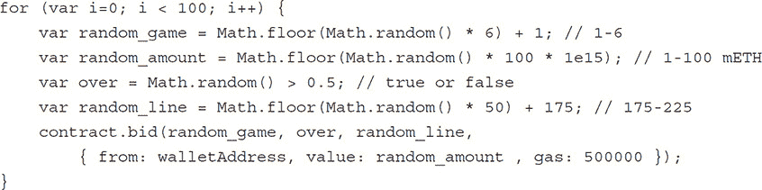

运行 100 次循环，并向合约中播种 100 个出价。每个出价都将随机分配到一个随机游戏、随机金额、随机行、随机下注的一方。

将此文件保存为 seeds.js，然后用以下命令运行我们的完整部署-种子-调试开发流程：

`node deploy.js [password] && node debug.js [password] node seeds.js [password]`

像往常一样，用你的钱包密码替换`[password]`。等待大约 1 分钟，让所有的交易都结算。你可以在运行私有链的终端标签中监控交易的状态。

在调试控制台中，检查一个游戏的市场订单：

`contract.getOpenBids(2)`

由于`getOpenBids`是一个常量函数，它应该立即返回一个看起来像这样的十六进制字符串：

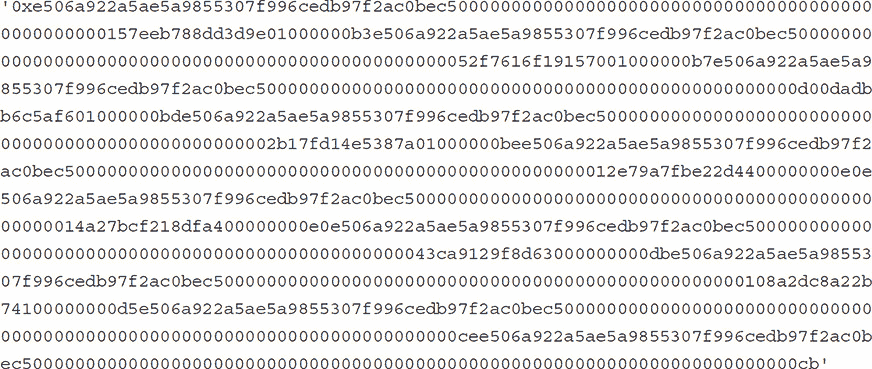

这是合约函数为我们创建的未解析的字节数组。要查看市场，我们必须将字节数组解析回出价数组。退出调试器，然后在 debug.js 中包含这些函数：

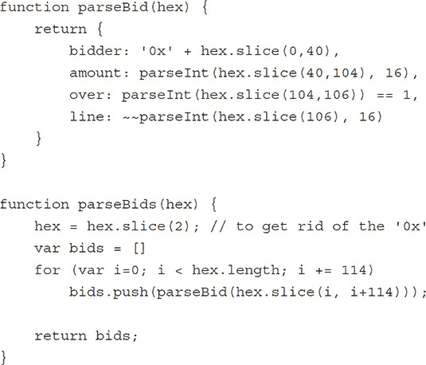

`parseBid`函数接收一个 114 个字符的十六进制字符串，并使用我们在本章早期定义的数据字典将其转换为出价对象。`parseBids`函数去掉了开头的`0x`，将长十六进制字符串分割成 114 个字符的十六进制字符串，并将解析出的出价转换为数组。为什么是 114（57 * 2）个字符，而不是 57，后者是出价表示的字节长度？因为每个字节需要两个十六进制字符来编码，所以需要两倍的字符数。

重新进入调试器：

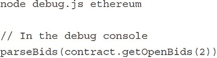

现在你的解析结果应该看起来像这样：

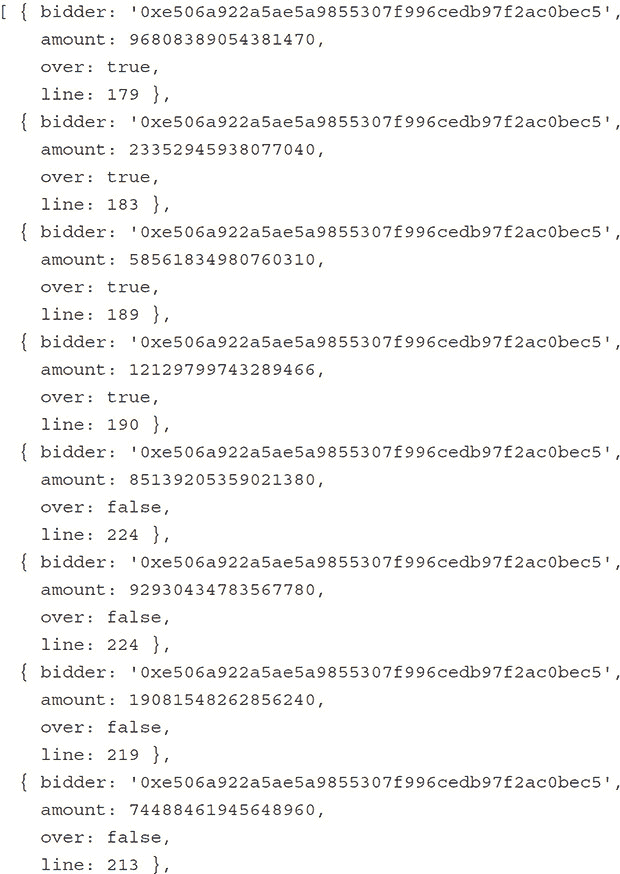

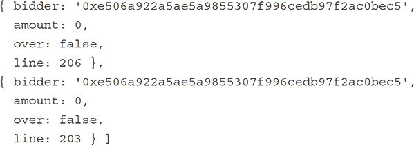

首先出现的是超额出价，最高的行在底部，然后是低于出价的一半，最低的行在底部。一些出价的金额为 0，表示它们已经被匹配，但尚未被新的出价覆盖。

还应该有下注。我们可以通过在调试控制台中搜索`BetPlaced`事件来检查那些下注。

`contract.BetPlaced({}, { fromBlock: 1 }).get(console.log)`

### 前端用户界面

所有公共合约函数都暴露出一个 ABI，可以通过 web3.js 库进行访问。如果您希望运行一个没有用户界面的投注服务器，您的任务就完成了，合约就可以使用了。然而，大多数网站将需要一个前端界面，因此我们将为我们的投注合约构建一个简单的界面。

由于本书的重点是区块链，而不是 Web 界面，所以我们不会构建一个完整的 Web UI。假设读者已经具备了 HTML、JavaScript 和 jQuery 的基本理解，但不会使用 CSS 或样式。我们前端的目的将是展示如何使用 web3.js 库与以太坊合约配合使用，并且我们不会构建除了那之外的功能。那么，让我们开始吧！

#### 用户界面中的页面

我们的前端将包含三个具有以下功能的页面：

•   查看游戏列表（index.html）

•   查看单个游戏的书本（bet.html）

•   提取奖金（withdraw.html）

#### 显示游戏

我们的主页 index.html 将显示一个包含我们所有活跃游戏的表格。此外，还有一个链接到我们稍后要构建的提现页面。以下是页面的 HTML：

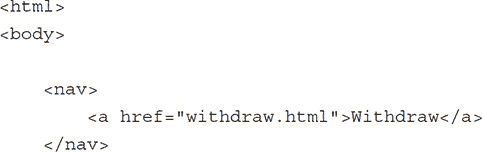

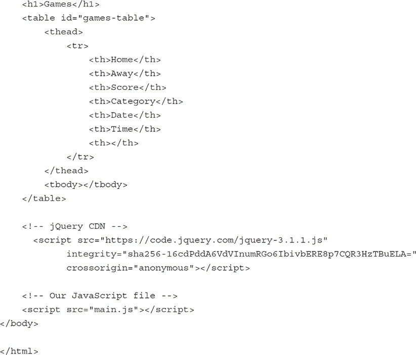

正如您所看到的，在头部上方有一个链接到提现页面的按钮，然后是头部和游戏表格。游戏表格包含了一系列关于每款游戏的描述性列。没有标题的列是放置游戏投注页面链接的地方。

页面上有两个 JavaScript 文件：jQuery CDN 和我们的主.js 文件。jQuery CDN 和 MetaMask Chrome 扩展（它注入了 web3.js 库）是前端唯一的依赖。

让我们逐一查看主.js 文件中所需的自定义 JavaScript。我们将使用主.js 文件来处理我们三个 HTML 页面，所以会有一些重复的代码，这些代码将在我们进行的过程中进行解释。

这一批代码首先加载了一些文件依赖项，并为页面执行做准备。它是我们三个页面中都共有的。

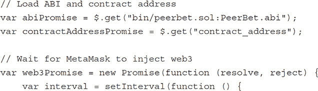

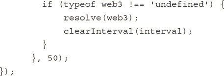

前两行使用 jQuery 的 AJAX 功能来加载我们将需要创建 web3 `Contract` 对象的两种数据，即 ABI 和合约地址，并为这两个 AJAX 调用定义了承诺。

对于不熟悉这个概念的人来说，承诺是一种允许异步代码执行的构造。与线程类似，承诺开始执行一个函数，然后在不等待代码块执行完成的情况下返回。相反，当代码执行完成后，承诺解析，提供绑定，使代码在承诺解析而不是函数立即返回时执行。承诺超出了本书的范围，但它是编写优秀前端 JavaScript 代码的重要组成部分，因此在尝试为您的合约构建前端之前，请熟悉这个概念。

如我们之前提到的，MetaMask Chrome 扩展程序和 Chrome 浏览器是应用程序的要求。MetaMask 扩展程序将 web3.js 库注入到我们的应用程序中，所以我们不必自己引入。然而，注入是异步的，所以任何使用该库的代码（在我们的情况下，整个应用程序）必须等待注入完成才能执行。代码的第二部分处理异步行为，通过定义一个在 web3 注入时解决的承诺。它通过每 50 毫秒检查库是否存在来做到这一点。

一旦 web3 可用且所需文件已加载，我们可以创建`Contract`对象。`$.when`与内置的`Promise.all`函数类似，允许我们等待一系列承诺返回后执行一段代码。一旦我们有了`Contract`对象，我们的代码通过一个`switch`语句分成三个不同的轨道，每个轨道对应三个页面中的一个。默认轨道是游戏页面，这是我们将在本节中探索的轨道。

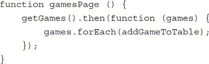

游戏页面获取游戏列表并将它们添加到游戏表格中。这两个功能都由助手函数处理。

让我们来看看`getGames`助手：

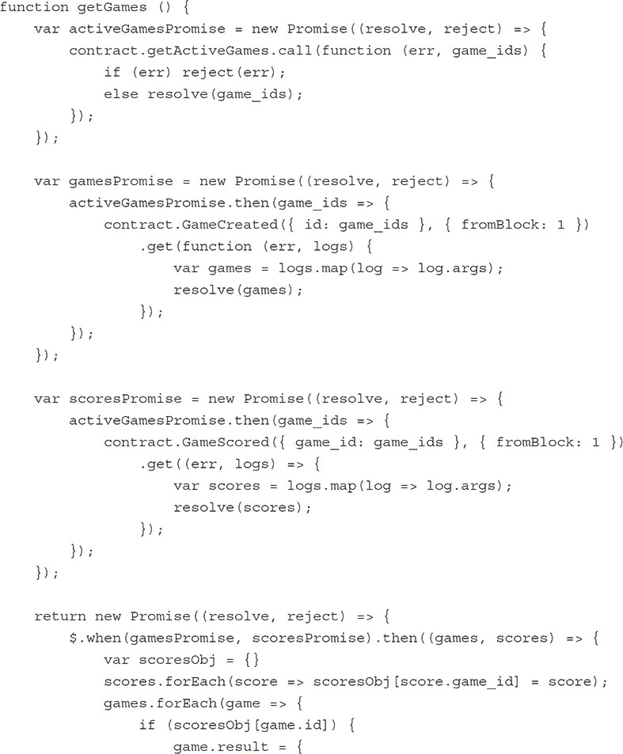

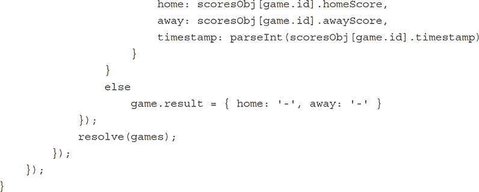

第一个块运行了对`getActiveGames`函数的调用，该函数返回一个游戏 id 数组。然后通过一个承诺解析这些游戏 id，以便它们可以异步地供函数的其余部分使用。然后使用这些游戏 id 来访问两个不同的事件日志，分别是 GameCreated 事件和 GameScored 事件。这在第二和第三日志中发生。这两个日志访问的结果通过各自的承诺解析，然后在最后的块中组合在一起。游戏得分与游戏信息对象合并，然后通过返回的承诺解析合并对象。

如果因为游戏尚未得分而未定义分数，主队和客队的得分将由单个`’-’`表示。这样，当我们用`’-’`分隔主队和客队得分显示分数时，未得分的比赛将显示`’---’`。

一旦我们有了游戏，我们就通过另一个辅助函数`addGameToTable`将其添加到我们的表格中：

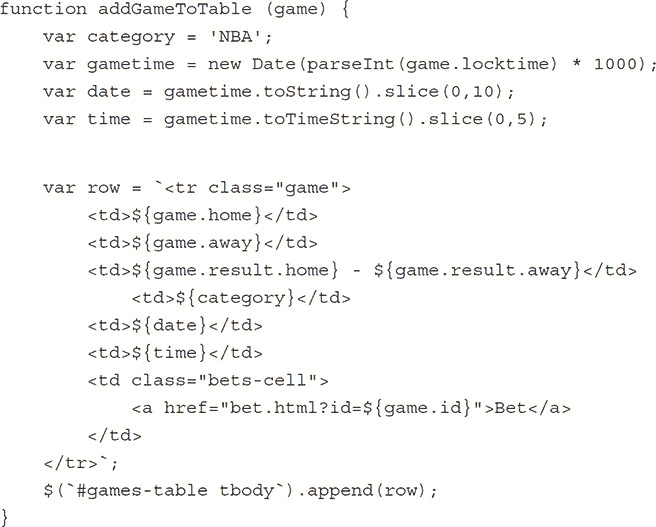

这个函数非常简单。它接收游戏对象，将其转换为 HTML 表格行，然后将其插入到表格中。

这就是游戏页面的所有代码。运行服务器的最简单方法是在该文件夹的命令行中：

`python2 -m SimpleHTTPServer`

Python 2 已预装在 OS X 和 Linux 上，但在 Windows 上，您可能需要从[`www.python.org/downloads/`](https://www.python.org/downloads/)下载该包。

确保您的 geth 私有网络在终端标签中运行。然后，通过点击左上角的狐狸图标，将您的 MetaMask 扩展程序连接到私有网络。选择下拉列表中标注为 Localhost 8545 的项目（见图 11-1）。

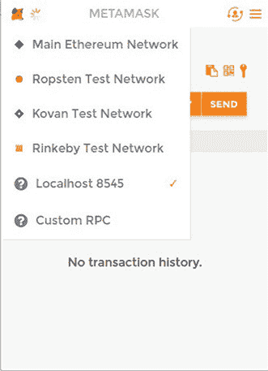

**图 11-1   MetaMask**

如果一切设置正确，您应该看到一个看起来像图 11-2 的页面。

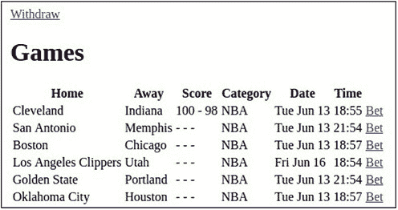

**图 11-2   投注应用页面 1**

恭喜你，你已经拥有了一个丑陋但功能齐全的游戏页面！

#### 投注页面标记

我们将创建一个单独的页面来显示订单簿和下注。我们之前看到，我们的主线程分成了三个不同的轨道，每个轨道对应一个页面。

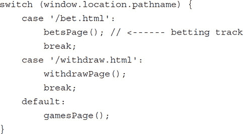

接下来，我们将追求投注轨道，并解释与该页面相关的标记和代码。首先，这里是我们将遵循的基本 HTML 大纲。此页面上还将提供其他功能，我们将在此 HTML 基础上逐步添加它们。

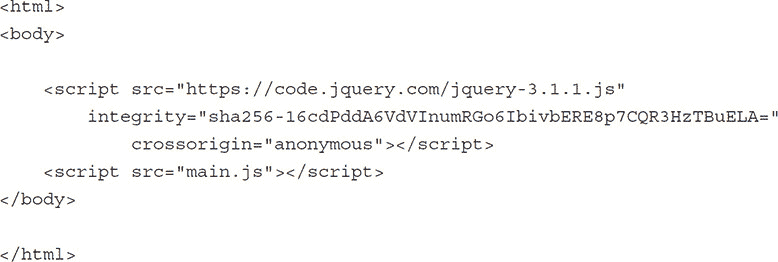

这与游戏页面相同。从这里，我们将添加投注页面特定的功能。首先，我们希望显示一些基本比赛信息：

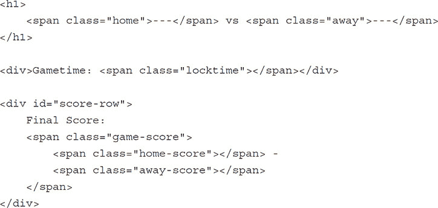

有显示主队、客队、比赛时间和得分的位置。这些将在页面加载时由我们的 JavaScript 填充。与以前一样，我们不会对页面进行样式设计。

接下来，我们需要放置我们的超额和不足投注的部分。

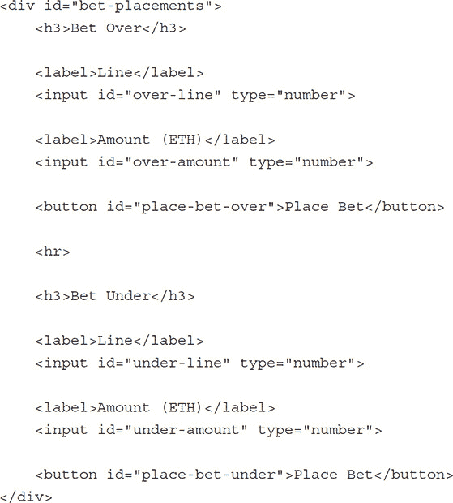

这显示了两个相同的部分，一个用于放置超额投注，一个用于放置不足投注。每个部分都有两个输入框，一个用于投注线，一个用于投注金额，还有一个下注按钮。

除了下注之外，这个页面还将显示订单簿和设置比赛得分的部分。首先，让我们看看用于显示开放出价的 HTML。

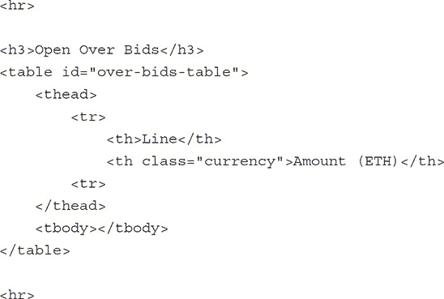

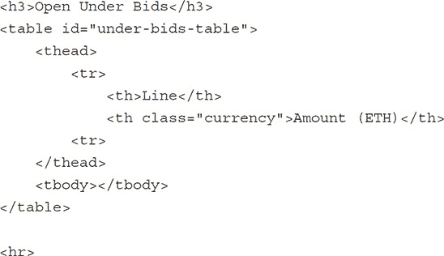

这设置了两个表格，一个用于超额出价，一个用于不足出价。两个表格都包含投注线和投注金额的列。将表格正文和表格标题分开是因为后来我们直接向正文中插入行，而不接触标题。`
`标签用水平分隔符分隔部分。

我们还将显示已经匹配并放入订单簿的投注。

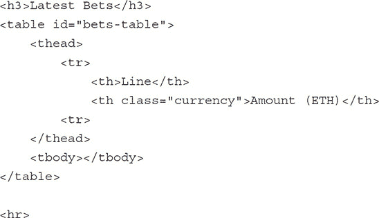

这个表格与出价表格非常相似，包含相同的列。我们添加到表格中的数据唯一的区别。

最后，我们想要一个小的表单，我们可以在投注关闭且游戏完成后使用它来评分。

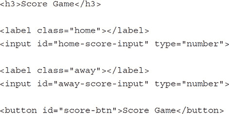

表单内有主队和客队的得分输入，还有一个可以用来提交得分的按钮。

这就是 HTML 的全部内容。实际显示的数据将来自 web3，我们将使用 JavaScript 将数据打印到页面上。

#### 显示游戏信息

为了显示单个游戏的详细信息，我们将重新使用我们之前定义的`getGames`函数，并定义一个新的助手函数来获取我们想要的游戏：

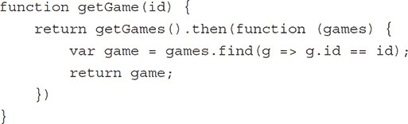

这个函数获取游戏的列表，然后找到所需的游戏。在`.then`回调中返回一个项目会导致该承诺用返回的值解决。因此，这个函数返回一个用所需游戏解决的承诺。

使用这个功能，我们可以在我们的页面上显示游戏信息：

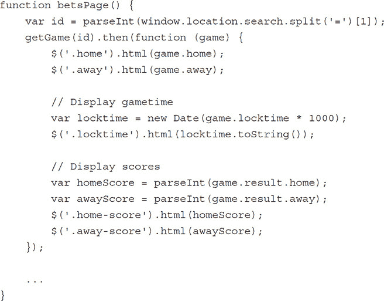

主场和客场队伍名称从游戏对象中显示。然后将锁时间从 UNIX 时间戳转换为 JavaScript 日期并显示。如果游戏还没有得分，得分将不会被定义。在这种情况下，得分将显示`’---’`，因为`getGames`助手将主队和客场得分都设置为单个`’-’`。

#### 显示开放出价

早些时候，我们在我们的 debug.js 文件中定义了`parseBids`和`parseBid`助手函数，以解析合约的`getOpenBids` ABI 函数返回的字节数组。我们将在这里重用这些函数。下面的代码没有解释。请参阅章节前面的“播种数据”部分，以获取代码解释。

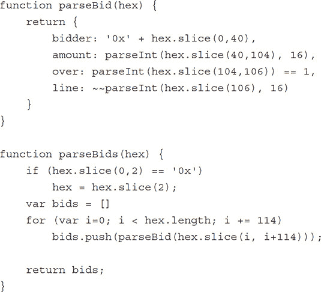

此外，我们将定义一个`getOpenBids`助手函数，以使 web3 调用合约，解析返回的字节数组，并通过承诺解决所有问题。

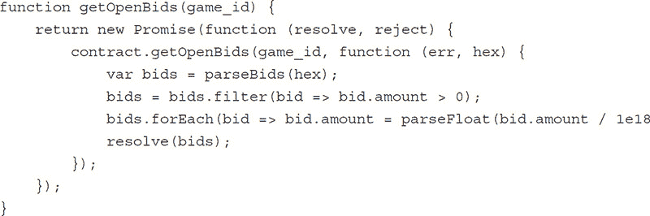

`getOpenBids`合约 ABI 函数是一个常量函数，所以 web3 执行一个立即返回的调用。像往常一样，回调中的第一个参数是错误（如果没有错误就是 null），返回的字节数组是回调中的第二个参数，以十六进制字符串（`“0xf43...”`）的形式出现。将十六进制字符串解析为字节数组，移除金额为 0 的空出价，并将出价金额从 wei 转换为 ether。然后通过返回的承诺解决结果数组。

最后，我们将定义一个助手函数，用于将出价添加到表格中：

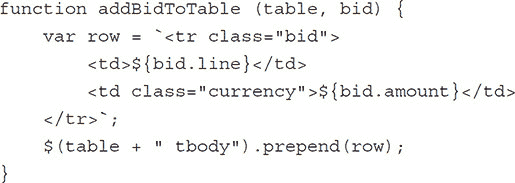

这个函数接受一个表格选择器（例如，`“#over-bids-table”`），并在表格的正文中添加一个包含给定出价信息的行。

把这些助手函数放在一起，我们可以检索出价并在我们的页面上显示它们：

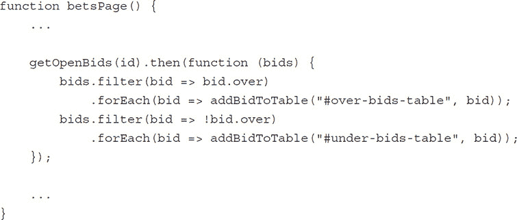

下注信息被过滤两次，一次是为了获取超过的下注并在超过的下注表格中显示它们，然后再次过滤以获取低于的下注并在低于的下注表格中显示它们。

#### 显示投注

我们希望能够显示现有的匹配下注以及开放出价。为此，我们将定义几个更多的助手函数来获取下注并将它们添加到下注表中。

首先，让我们定义一个助手来从区块链日志中检索下注。

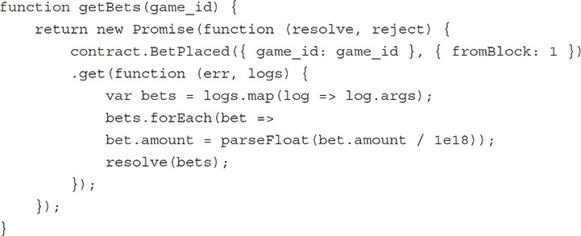

下注存储在带有 game_id 字段的索引的日志中。我们可以利用这一点，仅解析带有我们的 game id 的日志。传递给 web3 合约事件获取器的第一个对象是索引值对的搜索对象。第二个对象是一个配置对象。如前所述，我们只需要指定的唯一配置是 `fromBlock` 字段。其他的默认值就足够了。一旦我们得到日志，我们就通过 `args` 属性从中提取事件数据，并通过返回的承诺解决数据。

我们还将需要一个简单的助手来将我们的下注信息添加到下注表格中。

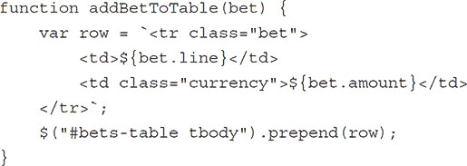

这个函数取下注信息，创建一个带有它的表格行，然后将行添加到下注表格的主体中。

使用这些助手，我们现在可以从区块链中检索下注并在我们的页面上显示它们。

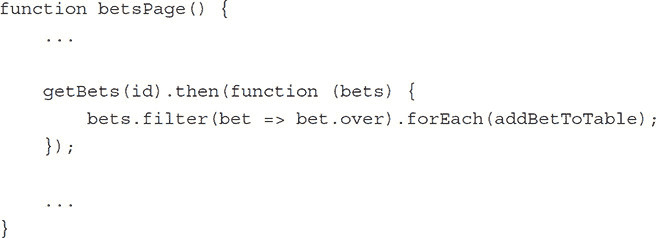

在合约中发生的每一个两面下注，都会产生两个分开的日志，一个是超过方面的，一个是低于方面的。如果我们显示所有的下注日志，每个下注都会显示两次，所以我们就过滤出只是超过的下注并显示那些。选择哪一方无关紧要；我们也可以同样过滤出低于的下注并显示那些。结果会是一样的。

#### 下注/投注

下注时，用户将填写他们选择的一方的行和金额，然后点击相应的下注按钮。我们的 JavaScript 代码将负责将点击转换为我们部署的合约上的真实出价。

我们将不得不定义一个助手函数，以获取当前用户的钱包地址以进行此操作。

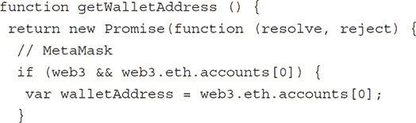

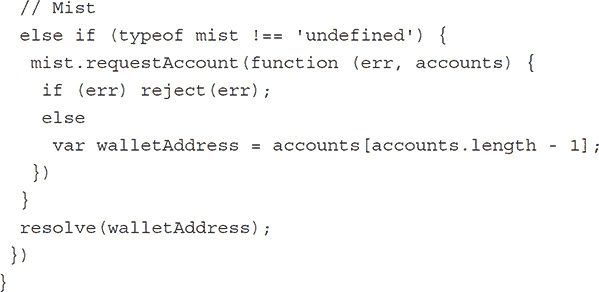

获取用户的钱包地址取决于我们是否使用 MetaMask 还是 Mist 浏览器。虽然到目前为止我们还没有用 Mist 浏览器测试我们的 dapp，这个功能是唯一一个在不同浏览器上有不同实现的功能，所以为了可互操作性，我们将包括它。

MetaMask 将钱包地址作为一个数组暴露在 web3.eth.accounts 中。第一个地址将是用户当前选择的用于的地址。

Mist 浏览器要求您在解锁地址之前请求账户权限。一个弹出窗口，如 图 11-3 所示，将呈现给用户，要求他们在地址可以使用之前授权应用程序。

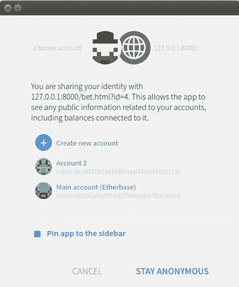

**图 11-3   Mist 浏览器请求账户权限**

这个函数抽象了浏览器级别的差异，并返回一个承诺，无论使用哪个浏览器，都会解析为钱包地址。

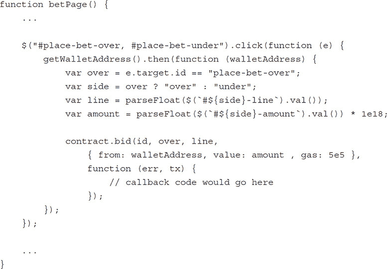

在`betPage`函数中，我们将注册一个事件监听器，同时监听“超过”和“不足”的投注放置。监听器首先异步获取钱包地址。然后使用事件目标（被点击的按钮）的 id 来确定是点击了“超过”还是“不足”按钮，并从输入框中获取相应的行和金额。用户以以太币为单位输入他们的投注金额，但合约期望投注金额以 wei 为单位，因此我们将以太币金额乘以 1e18 以将以太币金额转换为 wei。

一旦所有出价参数都被解析和确定，我们就用参数调用合约的出价 ABI 函数。回调留空，但任何后处理代码（如 UI 调整）都可以放在那里。

让我们通过尝试使用 Chrome 和 MetaMask 下注来测试此功能。此时你应该正在查看一个类似于图 11-4 的页面。你可能需要在页面加载后等待几秒钟，以便游戏信息填充。

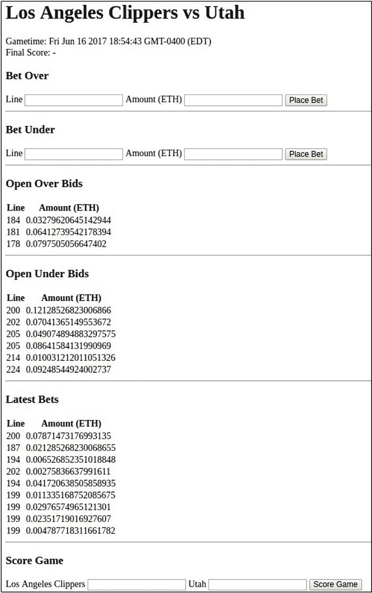

**图 11-4   下注**

在“超过”输入框中输入 200 行，在“投注金额”输入框中输入 0.1，然后下注。MetaMask 应该会弹出一个确认窗口，要求您验证交易；见图 11-5。

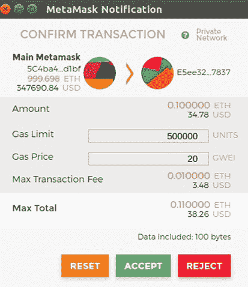

**图 11-5   MetaMask 确认弹窗**

如果燃气字段为空，输入 20 Gwei 的值。这是以太坊的默认燃气价格。点击接受，然后打开你的 geth 标签页。你应该会看到一个类似于此的交易发送日志输出：

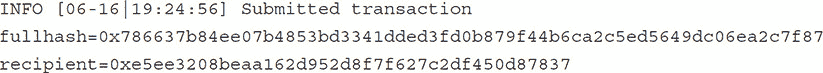

等待一分钟左右，以确保交易被挖掘。现在重新加载页面。如果匹配成功，你应该会在投注部分看到你的投注，如果没有匹配，就会在开放出价部分看到。

#### 计分游戏

当游戏完成后，我们希望能够对其进行计分并支付给赢家的投注。为此，我们已经创建了一个用于计分输入的表单。处理得分提交的 JavaScript 看起来像这样：

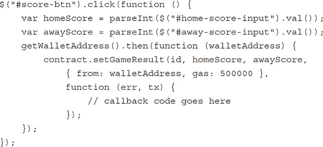

我们从输入框中获取主队和客队的得分，使用父函数的 id，获取钱包地址，并向合约的`setGameResult` ABI 函数发送交易。回调再次留空，但将来可以填写代码。

要测试游戏计分，回到游戏页面，然后导航到一个已经过了锁定时间的游戏。记住，在游戏锁定之前计分会导致错误，并且不会发生任何状态变化。克利夫兰-印第安纳游戏将是一个很好的选择，因为它是部署合约后 30 秒内锁定的。

输入主队和客队的得分（例如，100 和 98），然后提交得分。MetaMask 弹出窗口应该再次出现。如有必要，设置 gas 价格，然后点击接受。再次等待一分钟，然后重新加载页面。在顶部，最终得分现在应该更新为您输入的得分。

#### 提款资金

投注获胜方需要某种方式来访问他们在合约中应得的钱。提款 ABI 函数允许用户提取其账户的余额。

我们将构建一个提款页面，以便用户可以提取他们的以太币。以下是基本的 HTML 代码：

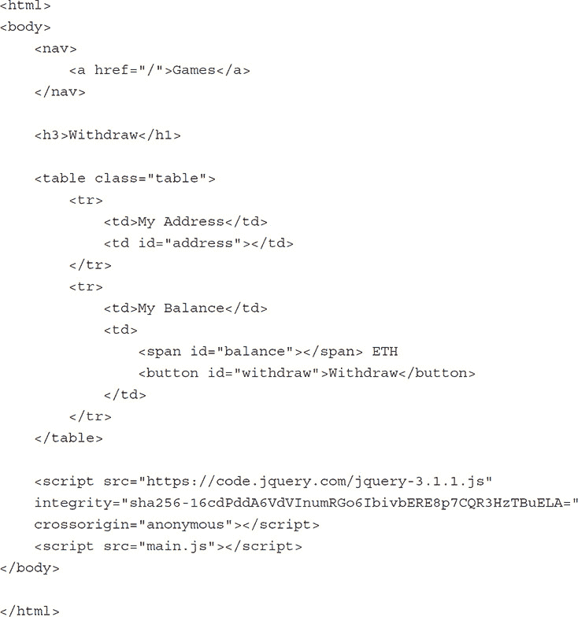

在标准的 html、body 和 script 标签之外，有一个指向游戏页面的链接，一个包含用户地址和余额的表格，以及一个允许用户提款的按钮。地址和余额将通过 JavaScript 注入。

这次我们将遵循`withdraw`路径在我们的`switch`语句中：

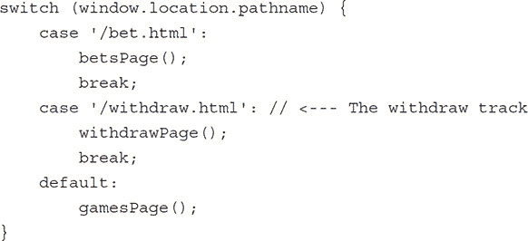

我们的`withdrawPage`函数首先通过查询获取用户的余额。

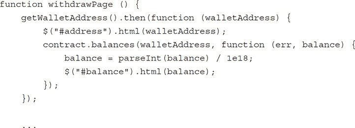

我们获取钱包地址，在页面上显示它，然后使用它来调用`balances` ABI 函数。`balances`函数在合约中没有明确声明，但 Solidity 会自动为公共状态变量创建 getter，因此它是可用的。因为这是一个映射，默认的 getter 需要传递键。我们传递钱包地址作为键，获取用户余额返回，并在页面上显示它。

如果用户有非零余额，他们可以通过点击提款按钮提取。以下是事件监听器的代码：

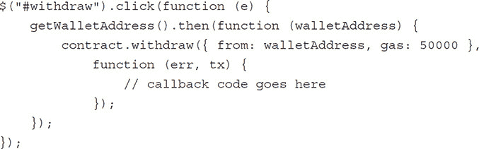

当用户点击提款按钮时，我们获取他们的钱包地址，然后使用`withdraw` ABI 函数提取用户的余额。

您可以通过重新部署合约，在三分钟内到某个游戏中投注多次，然后锁定游戏后计分来测试这个功能。一旦您计分游戏，您应该在提款页面上看到非零余额。提款您的资金（当出现 MetaMask 弹出窗口时接受它），然后在 MetaMask 上检查您的余额。如果一切正常，它应该会上升！

#### 部署到 AWS

为了让您的应用程序在互联网上公开可用，您必须将应用程序部署到服务器上。出于我们的目的，我们将使用 Amazon S3 静态网站托管服务来托管我们的前端。

为了让整个应用程序运行，您必须首先使用本章前面“部署到主网”步骤中概述的步骤，将您的智能合约部署到以太坊主网。如果您之前已经部署了合约，那么将`contract_address`文件的内容替换为主网合约的地址。否则，前端将尝试访问最新部署的测试合约的地址，而不是您想要访问的主网合约地址。

首先，如果您没有 AWS 账户，您将必须在 [`aws.amazon.com`](https://aws.amazon.com) 创建一个。创建账户后，转到 S3 控制台。S3 是一种用于静态文件的低成本存储服务。我们将使用其静态网页服务器功能。

在控制台中创建一个新桶，并给它一个名字。在设置对话框中，在“设置权限 > 管理公共权限”部分，选择“向这个桶授予公共读取访问权限”选项。这将允许外部世界访问我们的文件。

一旦您创建了桶，请在主 S3 控制台中点击该桶并上传以下文件到该桶：

•   bin/peerbet.sol:PeerBet.abi

•   contract_address

•   index.html

•   withdraw.html

•   bet.html

•   main.js

这些文件是运行我们网站前端所必需的。后端智能合约应该已经部署到了以太坊主网，因此静态主机上不需要后端和测试文件。

接下来，前往“属性”部分，点击“静态网站托管”并选择“使用此桶托管网站”来启用它。将 index.html 设为首页，然后保存设置。您的静态网站现在已启用。

要查看网站，请返回至“静态网站托管”部分，然后访问设置中提供的 URL。为了让网站运行，MetaMask 必须连接到主网络，因此请前往 MetaMask 网络设置并选择以太坊主网。一旦完成，网站应该可以看见并且已经连接。

### 总结

如果您已经阅读、理解并尝试了本章中的部分代码，现在您可以编写新脚本来部署和测试您自己的合约。您可以创建一个合约，您还可以创建一个前端来与合约交互。
