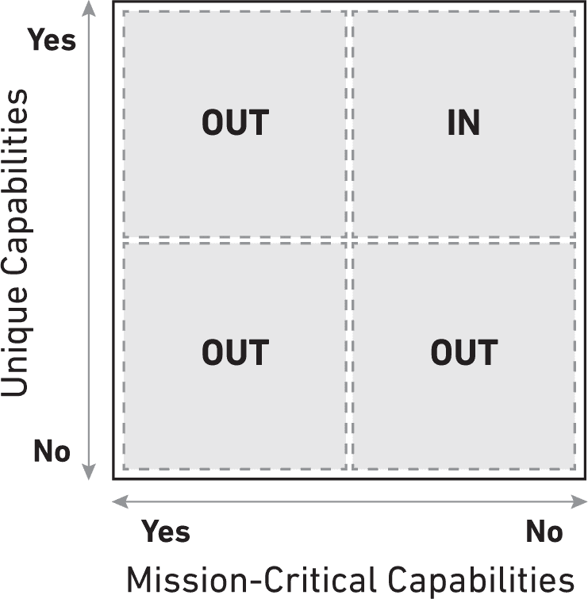
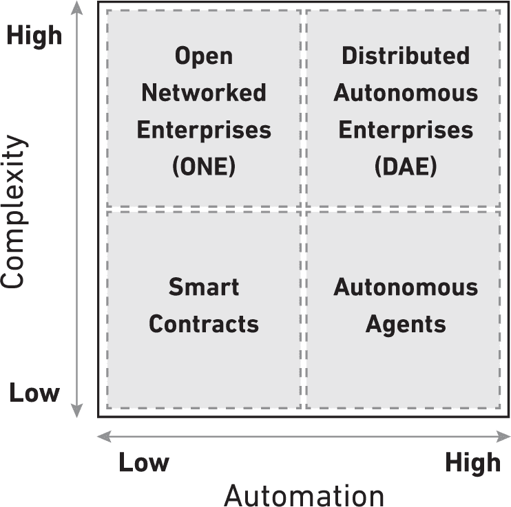

## 第二部分

****

### 变革

## 第三章

## 重新定义金融服务

全球金融系统每天移动数万亿美元，服务于数十亿人，支持着一个超过 100 万亿美元的世界经济。¹ 这是世界上最有影响力的行业，全球资本主义的基石，其领导者被称为宇宙主宰。仔细观察，它就像一个罗布·戈尔伯格（Rube Goldberg）的复杂装置，发展不均，矛盾重重。首先，这个机器已经很久没有升级了。新技术被胡乱焊接在陈旧的基础设施上。想想那个提供网上银行但仍然发行纸质支票并运行着 1970 年代的大型计算机的银行。当它的一个客户用一张信用卡在尖端刷卡机上刷卡购买一杯星巴克的大杯拿铁时，她的钱在到达星巴克的银行账户之前至少要通过五个不同的中介。这笔交易在几秒钟内就处理完毕，但结算却需要几天时间。

然后是像苹果或通用电气这样的大型跨国公司，它们在全球各地只是为了方便运营而维持着数百个银行账户。² 当这样的公司需要在其两个不同国家的子公司之间转移资金时，一个子公司的经理会从他的操作银行账户通过银行电汇发送到另一个子公司的银行账户。这些转账过程复杂且需要数天，有时数周时间才能结算。在这个过程中，两个子公司都不能使用这些资金来资助运营或投资，但中介机构却可以在浮动资金上赚取利息。“技术的出现本质上把基于纸张的过程转变为了半自动、半电子化的过程，但逻辑仍然是基于纸张的，”前花旗集团首席执行官维克拉姆·潘迪特说。³

在每个角落周围，都存在着另一个奇怪的悖论：交易员在世界股票交易所的纳米秒级别上买卖证券；他们的交易立即清算，但需要三天时间才能结算。地方政府至少需要十多个不同的代理商——顾问、律师、保险商、银行家等等——来协助发行市政债券。⁴ 在洛杉矶，一名日结工在一家货币市场用 4%的手续费兑换他的工资支票，然后拿着一把美元走到一家便利店，将钱电汇给他在危地马拉的家人，而在那里他再次因为固定的费用、汇率和其他隐藏成本而受到打击。一旦他的家人将这笔钱分给众多家庭成员，就没有人足够钱来开银行账户或获得信贷。他们就是那生活在每天不足两美元的 22 亿人口中的一员。⁵ 他们需要支付的款项微不足道，对于传统的支付网络如借记卡和信用卡来说太小，在这些网络中，最低费用使得所谓的微支付变得不可能。根据最近哈佛商学院的研究，银行根本不认为服务这些人群是一个“有利可图的提议”。⑥ 因此，货币机器在规模和范围上并不是真正全球化的。

货币政策和金融监管制定者经常发现自己缺乏所有事实，这要归因于许多大型金融操作的故意不透明和监管的分隔。2008 年全球金融危机就是一个例子。过度杠杆、缺乏透明度以及由扭曲的激励驱动的安逸感，使得任何人直到几乎太晚的时候才意识到问题的存在。“你怎么能让从警察部队到货币系统的一切工作起来，如果你没有数字和位置呢？” Hernando de Soto 深思道。⁷ 监管者仍在尝试用为工业时代制定的规则来管理这台机器。在纽约州，货币传输法律可以追溯到内战时期，当时移动资金的主要手段是马车和马。

这是金融怪胎，充满了荒谬的矛盾、不协调、热水管和压力锅。例如，为什么西方联盟在全球需要 50 万个销售点，而全球一半以上的人口都有智能手机呢？⁸ 早期比特币先驱和银行系统直言不讳的批评者 Erik Voorhees 告诉我们，“邮寄一个铁砧到中国的速度比通过银行系统把钱寄到中国的速度还要快。这太疯狂了！货币已经是数字化的了，他们做电汇时又不是在运送成堆的现金！”⁹

为什么它会如此低效？根据经济学家保罗·戴维（Paul David）的论述，他首次提出了“生产力悖论”这个术语，在新技术之上叠加现有基础设施在技术范式转变的历史过渡期是“不足为奇的”。¹⁰例如，制造商们需要花费四十年的时间从蒸汽动力转向商业电气化，而且通常这两种技术会并存一段时间，直到制造商们最终彻底转换。在这段改造期间，生产力实际上是有下降的。然而在金融体系中，问题的复杂性加剧，因为没有从一种技术干净利落地过渡到下一代技术；存在多种遗留技术，有些已有数百年的历史，从未完全发挥出它们的全部潜力。

为什么？部分原因在于金融是一个垄断行业。诺贝尔奖得主约瑟夫·斯蒂格利茨（Joseph Stiglitz）在评估金融危机时写道，银行“尽其所能增加交易成本”。他认为，即使是在零售层面，基本商品和服务的支付“应该只需要花费百分之一便士”。他质疑：“然而它们收取多少呢？”“销售额的 1%、2%或 3%甚至更多。资本和规模，再加上监管和社会运营许可，使得银行能在一个又一个国家，特别是在美国，获取尽可能多的利润。”¹¹历史上，大型集中式中介机构的机会是巨大的。不仅传统银行（例如美国银行），还有信用卡公司（维萨）、投资银行（高盛）、股票交易所（纽约证券交易所）、清算所（CME）、汇款服务（西联）、保险公司（劳埃德保险）、证券律师事务所（斯凯德恩·阿普斯）、中央银行（美联储）、资产管理公司（贝莱德）、会计师事务所（德勤）、咨询公司（麦肯锡）以及大宗商品交易商（维多集团）等构成了这个庞大的金融巨兽。金融系统的齿轮——强大的中介机构，它们集中资本和影响力，并常常实施垄断经济学——既使系统运作，又使其减速、增加成本，并为自身产生不成比例的好处。由于它们的垄断地位，许多现有企业没有改进产品、提高效率、改善消费者体验或吸引下一代消费者的动力。

##### 金融业的全新视角

随着区块链技术承诺使下一个十年成为巨大动荡和重组但也为抓住机遇的人带来巨大机会，Franken-finance（怪异金融）的日子已经不多了。当今全球金融服务行业充满问题：它陈旧不堪，建立在几十年前的科技之上，与我们的快速发展的数字世界相冲突，常常导致其运行缓慢且不可靠。它是排外的，让数十亿人无法接触到基本的金融工具。它是集中的，容易遭受数据泄露、其他攻击或彻底失败。它是垄断的，巩固现状并抑制创新。区块链承诺解决这些问题以及更多问题，创新者和企业家正在设计新的方法，在这个强大的平台上创造价值。

有六个关键原因说明区块链技术将给这个行业带来深刻变革，打破金融垄断，为个人和机构提供真正的选择，以创造和管理价值。全球各行各业的参与者都应该引起注意。

> 证明：历史上第一次，两个互不相识也不信任的双方可以进行交易和做生意。验证身份和建立信任不再是金融中介机构的权利和特权。而且，在金融服务背景下，信任协议具有双层含义。区块链在需要建立信任时也可以发挥作用，通过结合区块链上的过去交易记录、基于综合评价的声誉评分以及其他社会和经济指标来验证任何交易对手的身份和能力。
> 
> 成本：在区块链上，网络既清算又结算点对点价值转移，并且持续进行，使其账本始终是最新的。首先，如果银行利用这种能力，根据西班牙银行桑坦德的说法，它们可以消除大约 200 亿美元的后台费用*而不改变其底层业务模式*，尽管实际数字肯定更大。¹² 成本大幅降低后，银行可以为个人和企业提供更多访问金融服务、市场和资本的机会，服务于被忽视的社区。这对现有企业、勇敢的创新者以及世界各地的企业家来说都可能是一个福音。任何地方任何拥有智能手机和互联网连接的人都可以接入全球金融的巨大动脉。
> 
> 速度：今天，汇款需要三到七天才能结算。股票交易需要两天到三天，而银行贷款交易平均需要惊人的二十三天来结算。¹³ SWIFT 网络每天在全球十万家金融机构之间处理十五百万个支付订单，但需要数天时间才能清算和结算。¹⁴ 自动清算所（ACH）系统也是如此，该系统每年处理美国数万亿美元的支付。比特币网络平均需要十分钟来清算和结算这段时间内进行的全部交易。其他区块链网络甚至更快，新的创新，如比特币闪电网络，旨在显著提高比特币区块链的处理能力，同时将结算和清算时间缩短到秒分之一。¹⁵ Ripple Labs 的首席执行官 Chris Larsen 说：“在相应的银行世界中，你有一个网络中的发送方和一个接收方，你必须通过多个账本，多个中介，多个跃点。中间的东西可能会失败。为此你需要各种各样的资本要求。”¹⁶ 确实，转向即时且无摩擦的价值转移将释放被困在途中的资本，对于那些从浮动中获利的任何人来说，这是个坏消息。
> 
> 风险管理：区块链技术承诺可以减轻几种形式的金融风险。第一种是*结算风险*，由于结算过程中的某些故障，你的交易可能会被弹回的风险。第二种是*对手方风险*，即你的交易对手在结算前违约的风险。最重要的是*系统风险*，系统中所有未结算对手方风险的总和。 Vikram Pandit 将此称为 *Herstatt 风险*，得名于一家德国银行，因无法偿还其负债而随后破产*：* “我们在金融危机中发现，其中一个风险是，如果我与人交易，我怎么知道他们会在另一边结算？” 根据 Pandit 的说法，区块链上的即时结算可以完全消除这种风险。会计师可以随时查看公司的内部运作，并了解正在发生的交易以及网络是如何记录它们的。交易的不可撤销性和财务报告的即时协调将消除代理风险的一个方面——无良经理人利用繁琐的纸质记录和显著的时间延迟来掩盖不当行为的风险。
> 
> 价值创新：比特币区块链是为了移动比特币而设计的，而不是为了处理其他金融资产。然而，该技术是开源的，邀请进行实验。一些创新者正在开发称为替代币的独立区块链，用于除了比特币支付之外的事情。其他人则希望利用比特币区块链的规模和流动性，在所谓的侧链上创建“衍生”币，这些侧链可以“着色”以代表任何资产或负债，无论是物理的还是数字的——一家公司的股票或债券、一桶石油、一根金条、一辆汽车、一辆汽车付款、一项应收账款或应付账款，当然还有货币。*侧链*是与比特币区块链具有不同特性和功能的区块链，但它们利用比特币已建立的网络和硬件基础设施，而不降低其安全特性。侧链通过一种称为 *双向挂钩* 的加密手段与区块链交互，这种手段可以在不通过第三方交易所的情况下将资产转移到区块链上并再次移除。还有一些人试图完全去除币或代币，在私有区块链上建立交易平台。金融机构已经在使用区块链技术记录、交换和交易资产和负债，并最终可能使用它来取代传统交易所和集中市场，改变我们定义和交易价值的方式。
> 
> 开源技术：金融服务行业是一个由遗留系统构成的技术堆栈，高达二十英里，正处于摇摇欲坠的边缘。因为每次改进都必须向后兼容，所以难以做出改变。作为一种开源技术，区块链可以基于网络共识不断进行创新、迭代和改进。

这些好处——证明、成本大幅降低、瞬间速度、风险降低、巨大价值的创新、适应性——有潜力不仅改变支付方式，还改变证券行业、投资银行、会计和审计、风险投资、保险、企业风险管理、零售银行等行业以及其他行业的支柱。继续阅读。

##### 黄金八点：金融服务行业将如何改变

以下是我们认为八个 ripe for disruption 的核心功能。它们还总结在此处的表格中。

1. 身份验证与价值确认：如今，我们在金融交易中依赖强大的中介机构来建立信任和验证身份。这些中介机构是获取基本金融服务（如银行账户和贷款）的最终裁决者。区块链在某些交易中降低了甚至消除了信任，这项技术还将使 peers 能够建立可验证、健壮且加密安全的身份，并在需要信任时建立信任。

2. 转移价值：每天，金融系统在全球范围内转移资金，确保没有一分钱被花两次：从在 iTunes 上花费 99 美分的购买一首歌到转移数十亿美元以结算公司内部基金转移、购买资产或收购一家公司。区块链可以成为转移任何有价值物品——货币、股票、债券和产权——的标准，无论是大批量还是小批量，无论是近距离还是远距离，无论是已知还是未知的对手方。因此，区块链可以像标准集装箱对商品转移所做的那样，为价值的转移降低成本、提高速度、减少摩擦，并推动经济增长和繁荣。

3. 存储价值：金融机构是人们、机构和政府的价值储存库。对普通人乔来说，银行将价值储存在保险箱、储蓄账户或支票账户中。对于希望获得流动性的大型机构，保证微小回报的所谓无风险投资，如货币市场基金或国库券，将发挥作用。个人不必依赖银行作为主要的价值储存或储蓄和支票账户的提供者，机构将拥有一个更高效的机制来购买和持有无风险的金融资产。

4. 借贷价值：从家庭按揭到国库券，金融机构促进了信贷的发行，如信用卡债务、按揭、公司债券、市政债券、政府债券和资产支持证券。放贷业务催生了许多辅助产业，这些产业执行信用检查、信用评分和信用评级。对个人来说，这是信用评分。对机构来说，这是信用评级——从投资级到垃圾级。在区块链上，任何人都可以直接发行、交易和结算传统的债务工具，从而通过提高速度和透明度来减少摩擦和风险。消费者将能够从同行那里获得贷款。这对于世界上无银行账户的人和世界各地的企业家来说尤其重要。

5. 交换价值：每天，全球市场促进数万亿美元的金融资产交换。交易是购买和出售资产和金融工具的行为，目的是为了投资、投机、对冲和套利，并包括交易后的清算、结算和存储价值的生命周期。区块链将所有交易的结算时间从几天、几周缩短到几分钟、几秒钟。这种速度和效率为无银行账户和银行账户不足的人参与财富创造创造了机会。

6. 融资与投资：投资资产、公司或新企业使个人有机会获得回报，形式包括资本增值、股息、利息、租金或某种组合。该行业创造市场：将投资者与企业家和商业所有者在各成长阶段相匹配——从天使投资到 IPO 和更远。筹集资金通常需要中介——投资银行家、风险投资家和律师等。区块链自动化了许多这些功能，使点对点融资的新模式成为可能，并可能使记录股息和支付利息更加高效、透明和安全。

7. 确保价值和风险管理：风险管理旨在保护个人和企业免受不确定的损失或灾难。更广泛地说，在金融市场上，风险管理催生了无数衍生品和其他金融工具，旨在对冲不可预测或不可控制的事件。据最新统计，所有未平仓场外衍生品的的名义价值高达 600 万亿美元。区块链支持保险的去中心化模型，使得使用衍生品进行风险管理变得更加透明。利用基于个人的社会和经济资本、他们的行为以及其他声誉属性为基础的声誉系统，保险公司将对精算风险有更清晰的了解，并能做出更明智的决策。

8. 价值核算：会计是对经济实体财务信息的测量、处理和传达。这是一个由四家大型审计公司——德勤、普华永道、安永和毕马威控制的多达数十亿美元行业。传统的会计做法将无法适应现代金融的速率和复杂性。利用区块链分布式账本的新的会计方法将使审计和财务报告变得透明并实时发生。它还将极大地提高监管机构和其他利益相关者对公司内部财务行为的审查能力。

##### FROM 股票交易所 TO 区块链交易所

“华尔街已经以一种很大的方式觉醒了，”Blockstream 的 Austin Hill 说。¹⁷ 他在谈论金融行业对区块链技术的浓厚兴趣。考虑一下 Blythe Masters，华尔街最有权势的人物之一。她将 JPMorgan 的衍生品和商品部门打造成为一个全球性的巨头，并开创了衍生品市场。在短暂的伪退休后，她加入了一家位于纽约的初创公司 Digital Asset Holdings，担任 CEO。这个决定让许多人感到惊讶。她明白区块链将如何改变她的业务，就像互联网改变了其他行业一样：“我会把它看得和你应该在 1990 年代看待互联网概念一样严肃。这是一个大事件，它将改变我们金融世界的方式。”¹⁸

### 金八条

#### 区块链金融服务的变革

| 功能 | 区块链影响 | 利益相关者 |
| --- | --- | --- |
| 1. 验证身份与价值 | 具有可验证性和鲁棒性的身份，通过加密技术保障 | 评级机构，消费者数据分析，市场营销，零售银行，批发银行，支付卡网络，监管机构 |
| 2. 转移价值——进行支付，转账，购买商品和服务 | 在没有中介的情况下，以非常大的和非常小的增量转移价值将大大降低支付的成本和速度 | 零售银行，批发银行，支付卡网络，货币转账服务，电信，监管机构 |
| 3. 存储价值——货币、商品和金融资产都是价值的存储方式。安全保管箱，储蓄账户，或支票账户。货币市场基金或国债 | 结合了可靠和安全存储价值的支付机制将大大减少对传统金融服务的需要；银行储蓄和支票账户将变得过时 | 零售银行，经纪公司，投资银行，资产管理，电信，监管机构 |
| 4. 借贷价值——信用卡债务，抵押贷款，公司债券，市政债券，政府债券，资产支持证券，以及其他形式的信贷 | 债务可以在区块链上发行，交易和结算；提高效率，减少摩擦，改善系统风险。消费者可以使用声誉从同伴那里获得贷款；对于世界上未开户的人群和企业家来说，这是一个重大变革 | 批发，商业银行和零售银行，公共财政（即政府财政），小额贷款，众筹，监管机构，信用评级机构，信用评分软件公司 |
| 5. 价值交换—投机、对冲和套利。配对订单，清算交易，抵押品管理与估值，结算和保管 | 区块链将把所有交易的结算时间从几天、几周缩短到几分钟、几秒钟。这种速度和效率也为无银行账户和银行服务不足的人群参与财富创造创造了机会 | 投资，批发银行业务，外汇交易员，对冲基金，养老基金，零售经纪，清算所，股票，期货，商品交易所；商品经纪公司，中央银行，监管机构 |
| 6. 为资产、公司、初创企业提供资金和投资—资本增值，股息，利息，租金，或它们的某种组合 | 新的点对点融资模型，通过智能合约自动记录公司行动，如支付股息。产权登记处自动化租赁收入和其他收益主张 | 投资银行，风险投资，法律，审计，物业管理，证券交易所，众筹，监管机构 |
| 7. 保障价值和风险管理—保护资产、家园、生命、健康、企业财产和企业行为，衍生产品 | 利用声誉系统，保险公司将更好地评估精算风险，创建保险的去中心化市场。更加透明的衍生品 | 保险，风险管理，批发银行业务，经纪，清算所，监管机构 |
| 8. 价值核算—新的公司治理 | 分布式账本将使审计和财务报告实现实时、响应迅速和透明化，将显著提高监管机构对公司内部财务行为的审查能力 | 审计，资产管理，股东监督，监管机构 |

**Masters** 曾经轻视了许多关于比特币的早期传说，这些比特币被毒品贩子利用，被赌徒掌握，被自由主义者誉为创建新世界秩序的工具。但到了 2014 年底，Masters 的看法发生了改变。她告诉我们，“我有一个‘顿悟’的时刻，我开始欣赏这项技术对我所熟悉的世界的潜在影响。虽然分布式账本技术在加密货币领域的应用很有趣，并且对支付有影响，但这种底层数据库技术本身具有更广泛的影响。”¹⁹ 根据 Masters 的说法，区块链可以通过允许多方依赖相同的信息而不是复制和重复信息并调和它们，来减少低效和成本。²⁰ 作为共享、去中心化、复制的交易记录的机制，区块链是“黄金来源”，她说道。

“记住，金融服务基础设施已经几十年没有发展了。前端已经发展了，但后端没有，”玛斯特斯说。“在加快交易执行方面的技术投资一直是一场军备竞赛，如今，竞争优势是以纳秒级别的分数来衡量的。讽刺的是，交易后基础设施根本没有真正的发展。”实际上，完成金融交易的后续处理并记录下来仍然需要“数天，有时数周的延迟”。²¹

玛斯特斯并不是唯一对区块链技术充满热情的人。纳斯达克首席执行官鲍勃·格雷夫尔德说：“我坚信区块链技术有能力对金融服务行业的基础设施产生根本性的变化。”²²格雷夫尔德正在通过一个名为纳斯达克链平台的平台，将区块链的分布式账本技术整合到纳斯达克的私人市场平台中。交易所是证券的集中市场，也正面临着被颠覆的时机。2016 年 1 月 1 日，纳斯达克链完成了其在区块链上的第一笔交易。根据区块链流派的希尔的说法，世界上最大的资产管理公司之一“在区块链创新小组中拥有比我们整个公司还多的员工”。希尔的公司筹集了超过 7500 万美元，并雇佣了 20 多人。“这些人认真对待确保他们理解如何使用这项技术改变他们的业务方式。”²³纽约证券交易所、高盛、桑坦德、德勤、加拿大皇家银行、巴克莱、瑞银等几乎所有全球主要金融机构都表现出了类似的浓厚兴趣。2015 年，华尔街对区块链技术的看法变得*普遍*积极：在一项研究中，94%的受访者表示区块链可以在金融领域发挥重要作用。²⁴

尽管华尔街对许多其他应用充满兴趣，但让全球金融高管感兴趣的是使用区块链安全地处理任何交易的整个生命周期，这可能会显著降低成本，提高速度和效率，并在他们的企业中降低风险。²⁵格雷夫尔德是这样说的：“目前我们交易的结算时间为‘T+3’（即三天）。为什么不能在五到十分钟内结算呢？”²⁶

华尔街交易的是风险，这项技术可以实质性减少对手方风险、结算风险，从而降低整个系统的系统性风险。世界经济论坛金融创新负责人 Jesse McWaters 告诉我们：“分布式账本技术最令人兴奋的地方在于其可追溯性如何提高系统稳定性。” 他相信这些“新工具可以让监管机构采取更轻巧的方法。”²⁷ 区块链的公开性质——其透明度、可搜索性——加上其自动结算和不可篡改的时间戳，让监管机构能够看到正在发生的事情，甚至可以设置警报，以免错过任何信息。

##### 博士浮士德的区块链交易

银行和透明度很少能携手同行。大多数金融行为者从信息不对称和比对手方更多的知识中获取竞争优势。然而，构建的比特币区块链是一个极具透明度的系统。对银行来说，这意味着所谓的“掀开面纱”。那么我们如何调和公开平台与银行的闭门政策呢？

Austin Hill 将其称为华尔街的“浮士德交易”，这是一项沉重的权衡。²⁸Hill 说：“人们喜欢不需要等待三天就能结算交易的想法，而是几分钟内就能清算，并知道它们是最终且真实的。” “这种交易的另一面是所有在[比特币]区块链上的交易都是完全公开的。这会让华尔街上的许多人感到恐惧。” 解决方案？所谓的受许可的区块链上的私密交易，也被称为私有区块链。尽管比特币区块链完全开放且*无需许可*——也就是说，任何人都可以访问它并与之互动——但*受许可*的区块链要求用户具备某些资质，赋予他们在该特定区块链上操作的许可证。Hill 开发了一种技术，只有少数利益相关者能看到交易的各个组成部分并确保其完整性。

乍一看，私有链和受许可的区块链似乎确实有几个明显的优势。首先，成员们可以很容易地改变他们想要的区块链规则。由于交易只需得到成员自身的验证，因此可以降低成本，无需那些耗电量大的匿名矿工进行验证。另外，由于所有各方都值得信赖，所以 51%的攻击不太可能发生。节点可以被认为是连接良好的，因为在大多数用例中，它们都是大型金融机构。此外，它们还使得监管机构更容易进行监控。然而，这些优势也带来了弱点。改变规则越容易，成员越可能违反规则。私有区块链还阻止了使技术能够快速扩展的网络效应。通过创建新规则来有意限制某些自由可能会阻碍中立性。最后，由于没有开放的价值创新，这种技术更容易陷入停滞并变得脆弱。²⁹这并不是说私有区块链不会蓬勃发展，但金融服务业的利益相关者仍然必须认真对待这些担忧。

在银行界获得关注的 Ripple Labs 正在开发其他巧妙的方法来缓解 Faust 的压力。“Ripple Labs 针对批发银行，我们使用一种共识机制，而不是工作量证明系统，”CEO 克里斯·拉森解释说，这意味着没有矿工和验证交易的匿名节点。³⁰该公司 Chain 有自己的策略。Visa、纳斯达克、花旗、Capital One、Fiserv 和 Orange 为 Chain 提供了 3000 万美元的资金，Chain 计划构建以企业为中心的区块链解决方案，首先针对金融服务行业，它已经与纳斯达克达成了交易。“未来所有的资产都将是运行在多个区块链上的数字携带工具，”Chain 首席执行官亚当·卢德文争辩说。但这不会是华尔街习惯的孤岛世界，“因为每个人都基于相同的开放规格进行构建”。³¹华尔街的人可能想抓住这项技术，但他们必须应对它所启发的价值创新，这是他们无法控制或预测的。

Masters 还看到了授权区块链的好处。对她来说，只有少数几家交易伙伴、一些供应商和其他对手方以及监管机构需要访问。这些被选中的少数人将被授予区块链凭证。对 Masters 来说，“授权账本的优势在于从未让受监管的金融机构面临与未知方交易的风险，从监管角度来看这是不可接受的活动，或创建对未知服务提供商的依赖，如交易处理器，这也是从监管角度来看不可接受的。”³²这些授权区块链，或*私有链，*吸引了那些害怕比特币及其所有一切的传统金融机构。

当 Blythe Masters 还是初创公司的 CEO 时，她浓厚的兴趣代表了传统金融行为者在这个领域更广泛的参与。这种对新科技的拥抱反映了一个日益增长的关注，即科技初创公司也能颠覆高端金融。对于 Deloitte 的 Eric Piscini 来说，他的客户在过去一年里经历了巨大的觉醒，“突然对科技的关注是任何人都没有预料到的。”³³这种热情像瘟疫一样传播到世界上一些最大和最古老的金融机构中。

巴克莱银行是几十家探索区块链技术机会的金融机构之一。根据巴克莱首席设计及数码官 Derek White 的说法，“像区块链这样的技术将要重塑我们的行业。”White 正在建立一个开放的创新平台，将允许银行与这个行业中的一系列建设者和思想家进行互动。“我们渴望成为塑造者。但我们同样也渴望与技术的塑造者和这些技术的翻译者建立联系，”他说。³⁴巴克莱银行言行一致，削减了传统领域的数万个工作岗位，并在技术上加倍投入，特别是通过推出巴克莱加速器。据 White 所说，“我们上一届十家公司中有三家是区块链或比特币公司。区块链是世界从封闭系统向开放系统转变的最大证据，并对金融服务业以及许多其他行业的未来产生巨大影响。”³⁵银行谈论开放系统——*天哪!*

#### 金融公共服务

在 2015 年秋季，九家世界最大的银行——巴克莱、摩根大通、瑞士信贷、高盛、道富银行、瑞银、苏格兰皇家银行、BBVA 和澳大利亚联邦银行——宣布了一项共同制定区块链技术标准的计划，该计划名为 R3 联盟。此后，又有 32 家银行加入了这一努力，每隔几周，就有新一波行业精英加入。³⁶ 对于这些银行是否认真对待这一计划，仍存在疑问。毕竟，加入该集团的门槛只是 25 万美元的承诺，但 R3 的成立标志着行业的一个明显飞跃。制定标准对于加速新技术的采用和应用至关重要，因此我们对这一计划持乐观态度。R3 已经挖走了一些该领域的顶尖愿景家和技术实践者以推动发展。迈克·赫恩于 2015 年 11 月加入，加入了一个包括前 IBM 银行创新执行架构师理查德·甘达尔·布朗和现在 R3 的首席工程师、前巴克莱首席工程师詹姆斯·卡利尔在内的团队。³⁷

2015 年 12 月，Linux 基金会与更多的大型企业合作伙伴合作，启动了另一个名为 Hyperledger Project 的区块链计划。这并不是 R3 的竞争对手；实际上，Hyperledger Project 将 R3 视为创始成员，还包括埃森哲、思科、CLS、德意志交易所、数字资产控股、DTCC、富士通有限公司、IC3、IBM、英特尔、摩根大通、伦敦证券交易所集团、三菱日联金融集团（MUFG）、道富银行、SWIFT、VMware 和富国银行等。³⁸ 尽管如此，这显示了行业对这项技术的认真态度，以及它不愿意完全接受像比特币这样的开放、去中心化区块链。与 R3 不同，Hyperledger Project 是一个开源项目，它任务社区开发一个“适用于企业的区块链”。这无疑是值得称赞的，也可能非常有效。但不要误解：这是一个旨在通过限制网络中的节点数量或要求身份验证等方式构建*受限制*技术的开源项目。与 R3 一样，Hyperledger 的一个优先任务是制定标准。埃森哲的戴维·特里特，该组织的创始成员之一表示：“在这个旅程中，拥有跨行业参与者使用的标准和共享平台至关重要。”

区块链技术也引发了更广泛的讨论，关于政府在监管金融服务业中的角色。一个“公用事业”让人联想到自然垄断，受到高度的国家监管。然而，由于区块链技术承诺能降低风险、提高透明度和响应性，一些行业参与者认为这项技术*本身*就像是一种规制。³⁹ 如果监管者能够洞察银行和市场的内部运作，那么我们当然可以简化一些法律，废除另一些，对吧？这是一个棘手的问题。一方面，考虑到创新步伐的加快，监管者将不得不重新思考他们的监管角色。另一方面，当政府退场时，银行的行为往往缺乏诚信。

没有比特币部署区块链，大型银行是否会凭借此优势称霸？R3 只是众多迹象中的一项，表明银行正朝这个方向发展。2015 年 11 月 19 日，高盛申请了一项专利，名为“使用分布式、点对点和加密技术在金融市场中结算证券的方法”，使用了一种名为 SETLcoin 的自有货币。⁴⁰ 银行*申请专利*一项原本旨在作为开源礼物赠送给世界的技术，这种讽刺我们并没有忽略，你们也不应该忽略。也许这就是安德里亚斯·安东诺普洛斯在警告观众银行会将比特币从“朋克摇滚变成 smooth jazz”时所担心的？⁴¹ 或者也许银行将不得不与最佳的产品和服务竞争，这些产品和服务来自领导层反对这些公司所代表的一切的全新类型的组织。

未来的金融公用事业可能是一个有围墙和精心打理的花园，由一群有影响力的利益相关者收获，或者它可能是一个有机且宽敞的生态系统，在那里，人们的经济命运 wherever there is light。争论仍在继续，但第一代互联网的经验告诉我们，开放系统比封闭系统更容易扩展。

##### 银行应用程序：零售银行业务谁将胜出

资本的谷歌——这就是杰里米·阿莱尔正在构建的，“一家为消费者提供持有资金、发送资金、发送和接收支付等产品的消费者金融服务公司；这是人们期望的零售银行业务的基本公用事业”。⁴² 他将其视为一个强大、即时且免费的公用事业，任何能够访问互联网设备的人都可以使用。他的公司，Circle Internet Financial，是该领域最大和资金最充足的初创公司之一。

随意称呼 Circle 什么，只是不要叫它比特币公司。“亚马逊不是 HTTP 公司，谷歌不是 SMTP 公司。Circle 不是比特币公司，”Allaire 说。“我们认为比特币是下一代基本互联网协议，这些协议在社会和经济中使用。”⁴³

Allaire 认为金融服务是最后几个、也是最大的、尚未被技术从根本上改变的领域。“如果你看看零售银行，零售银行有三四件事情要做。一是提供存储价值的地方。二是提供某种支付工具。除此之外，它们还提供信贷服务，并为您提供存储财富和产生潜在收入的地方。”⁴⁴他的愿景是：“在三到五年内，一个人应该能够下载一个应用程序，以他们想要的任何货币——美元、欧元、日元、人民币，以及数字货币——存储数字价值，并能够实现即时或几乎即时的全球互操作性支付，具有非常高水平的安保，且不泄露隐私。最重要的是，这将免费。”⁴⁵就像互联网改变了信息服务一样，区块链将改变金融服务，引发前所未有的新能力类别。

根据 Allaire 的说法，区块链技术的优势——即时结算、全球互操作性、高安全性以及几乎零成本的交易——无论你是一个人还是一个企业，都会从中受益。那么，他让这一切免费的计划呢？世界银行的行长们称之为异端！毕竟，高盛和中国的风险投资公司 IDG 不会投入 5000 万美元来创建一个非营利或公共福利公司！⁴⁶Allaire 希望 Circle 拥有“为数百万用户提供全球特许经营并处于用户交易行为中心的能力。”Allaire 期望 Circle 拥有“提供其他金融产品的基础能力。”虽然他没有具体说明，但数百万客户的金融数据可能对公司比他们的金融资产更有价值。“我们希望重新定义消费者的体验以及他们与金钱的关系，并给他们选择如何使用和应用他们的资金以及如何从他们的资金中赚钱。”⁴⁷旧范式的领导者们，请注意。

像 Circle 这样的公司不受传统和文化的束缚。他们的新鲜做法可以成为一个很大的优势。过去许多伟大的创新者都是彻底的外行人。Netflix 不是由 Blockbuster 发明的。iTunes 不是由 Tower Records 发明的。亚马逊不是由 Barnes & Noble 发明的——你明白了。

Stephen Pair，BitPay 的首席执行官，该公司是行业内的早期领导者，他认为新进入者有一个明显的优势。"在区块链上发行股票、债券和货币等可替代资产，并构建必要的基础设施来扩大规模和使其商业化，不需要银行家的简历"，他说。首先，"你不需要所有的遗留基础设施或构成当今华尔街的机构……不仅可以在区块链上发行这些资产，还可以创建一个系统，在这个系统中，我可以实现瞬间的原子交易，比如我钱包里有苹果公司的股票，我想从你那里买东西。但你想要美元。利用这个平台，我可以进入一个单一的原子交易（即全部或没有），并使用我的苹果股票给你发美元。"⁴⁸

真的这么容易吗？重新发明金融服务行业的战斗与早期互联网上的电子商务战斗不同。对于 Allaire 这样的企业来说，要扩大规模，它们必须促进人类历史上最大的价值转移之一，将数万亿美元的资金从数百万个传统银行账户转移到数百万个 Circle 钱包中。并非易事。尽管银行对区块链的热情很高，但它们对这些公司持谨慎态度，认为区块链业务是“高风险”的商户。它们的犹豫可能源于对加速自己消亡的恐惧。旧世界和新世界之间出现了中介。Vogogo 这家加拿大公司已经与 Coinbase、Kraken、BitPay、Bitstamp 等合作，开设银行账户，满足合规标准，并通过传统支付方式使客户将资金*转入*比特币钱包。⁴⁹ 哦，多么讽刺啊。亚马逊可以轻松地超越现有的零售商，但这个新范式的领导者必须与旧世界的领导者好好相处。

也许我们需要一个愿意实验的银行家，具有硅谷的精神。Suresh Ramamurthi 符合这一标准。这位印度出生的前谷歌高管和软件工程师决定购买堪萨斯州威尔的 CBW 银行，人口 650 人，这让许多人感到惊讶。对他来说，这家小型的本地银行是使用区块链协议和基于比特币的支付轨道进行免费跨境汇款支付的实验室。在他看来，那些不了解金融服务细微之处的区块链企业家注定要失败。他说：“他们在建筑物上画了一扇窗户。让它看起来漂亮而多彩。但你不能从外面评估问题。你需要和建筑物里面的人交谈，了解里面的管道。”⁵⁰ 在过去的五年里，Suresh 担任了银行的首席执行官、首席信息官、首席合规官、出纳、清洁工，是的，还有管道工。现在 Suresh 知道银行里面的管道了。

许多华尔街的资深人士并未看到新旧之间的较量。布莱斯·马尔斯认为，银行提高华尔街效率和运营的方法“至少有和新进入者带来的颠覆性机会一样多”。⁵¹ 我们不禁感到潮流正在向彻底的新事物转变。这就是为什么三大电视网络没有创造出 YouTube，为什么三大汽车制造商没有创造出 Uber，为什么三大酒店连锁企业没有创造出 Airbnb 的原因。当《财富》1000 强公司的首席执行官们决定追求一条新的增长道路时，一个新进入者已经以速度、敏捷性和更优越的产品侧面撞击了他们。无论谁占据上风，不可阻挡的技术变革力量与世界上最根深蒂固的金融服务行业的不可移动对象之间的碰撞，都 promises to be an intense one.

##### GOOGLE TRANSLATE FOR BUSINESS: 新框架下的会计和企业治理

“会计师就像蘑菇——他们被放在黑暗中，喂食狗屎，”⁵² 汤姆·莫尔尼说，他是针对会计行业的初创公司 Subledger 的首席执行官。会计已经被称为金融的通用语言，只有少数几个门徒才能理解。如果每一笔交易都可在共享的、全球分布式的账簿上查询，那么我们为什么还需要会计师为我们翻译呢？

现代会计起源于 15 世纪意大利的一个好奇头脑——卢卡·帕西奥利。他看似简单的一项发明是一种被称为复式簿记的公式，即每一笔交易对每个参与者都有两个影响，也就是说，每个参与者必须在资产负债表、公司资产和负债的账簿上同时记录借方和贷方。通过编码这些规则，帕西奥利为否则无法规模化的企业实践提供了秩序。

罗纳德·科斯认为会计有点像宗教。在伦敦政治经济学院学习时，科斯看到“宗教般”的实践。“托付给会计师保管的账簿显然是神圣的书籍。” 会计学生认为他对会计的挑战是“亵渎神明”。⁵³ 他怎么敢质疑他们“计算折旧、评估存货、分配间接费用等等诸多方法，所有这些方法都得出不同的结果，但都是完全可接受的会计实践”，以及其他几乎完全相同的实践，但被认为是完全“不尊重”的。所以，汤姆·莫尔尼并不是第一个批评这个行业的人。

我们发现现代会计有四个问题。首先，当前的制度依赖于经理们宣誓他们的账目是健全的。数十起高调案例——安然、AIG、雷曼兄弟、世通、泰科和东芝——表明管理层并不总是以诚信行事。贪婪经常使人们屈服。裙带关系、腐败和虚假报告导致企业破产、失业和市场崩溃，但也会增加资本成本和加强对股权的束缚。⁵⁴

第二，人为错误是会计失误的主要原因，根据 AccountingWEB 的说法。问题通常始于财务部的 Randy 在电子表格中输入一个数字时按错了键，就像蝴蝶拍打翅膀一样，这个小错误随着它在财务报表中的计算变得大问题。⁵⁵近 28%的专业人士报告称，人们将错误的数据输入了他们公司的企业系统。⁵⁶

第三，像萨班斯-奥克斯利这样的新规则对遏制会计舞弊所做的努力微乎其微。事实上，公司日益复杂的运营、多方面的交易以及现代商业的快速发展，都创造了新的掩盖不当行为的方式。

第四，传统的会计方法无法调和新的商业模式。以微交易为例，大多数审计软件只允许两位小数（即一美分），这对于任何类型的微交易都毫无用处。

会计——财务信息的度量、处理和传达——并非问题所在。它在当今经济中发挥着关键作用。然而，会计方法的实施必须与现代时代保持同步。想想吧，在帕奇奥利时代，审计是每天进行的。如今，它们发生在月亮的周期和季节中。再想想另一个行业，在五百年的技术进步后，完成任务所需的时间增加了 9000%。

#### 环球账本

今天，公司每次交易都会记录借方和贷方——两个条目，因此是复式簿记。他们很容易在环球账本上增加第三个条目，即对公司股东、审计师或监管机构即时可见的条目——想象一下，当一家像苹果这样的大公司销售产品、购买原材料、支付员工工资或在其资产负债表上记录资产和负债时，环球账本记录了这笔交易，并发布了一个时间戳的收据到区块链上。一家公司的财务报告将变成一个活账本——可审计、可搜索、可验证。生成任何实时的财务报表应该像一个电子表格函数一样简单，点击一个按钮就能得到一个不可篡改、完整且可搜索的财务报表，无误。公司可能不想让每个人都看到这些数字，因此高管可能只允许监管机构、经理和其他关键利益相关者访问。

行业中许多人看到了全球记账系统对会计的内在含义。据巴克莱银行的西蒙·泰勒所说，这样的账本可以简化银行与监管机构的合规性并降低风险。“我们做很多监管报告，基本上我们在说，这是我们做的一切，因为我们所做的一切都存在于一个别人看不到的系统中。”⁵⁷全球记账系统和一切事物的透明记录“意味着监管机构可以访问相同的基础数据层。这意味着更少的工作，更低的成本，我们可以在近乎实时的状态下被问责。这真的很强大。”⁵⁸对于 Circle 的杰里米·阿拉尔来说，监管机构受益最大。“银行检查员一直依赖着不透明、私有控制、专有的账本和财务会计系统来完成他们的工作——‘账本和记录’，”阿拉尔说。“有了共享的公共账本，审计员和银行检查员可以自动进行审查，以查看资产负债表的底层健康状况和公司的实力——一种可以自动化大部分监管、审计和会计的重要创新。”⁵⁹

它将诚信融入系统中。“所有的欺诈都会变得非常困难。你必须持续进行欺诈，而在任何时候你都不能回去更改你的记录，”Balanc3 的克里斯蒂安·伦德奎斯特说，该公司是一家基于以太坊的三重记账初创公司。⁶⁰奥斯汀·希尔认为，“一个不断被审计和验证的公共账本意味着你不需要信任你的合作伙伴的账本；因为网络本身在验证声明或交易日志上有诚信。这是一种通过加密方式进行的持续的先验审计。你不是依赖普华永道或德勤。没有对手方风险。如果账本说这是真的，那么它就是真的。”⁶¹

德勤，全球四大会计师事务所之一，一直在努力理解区块链的影响。德勤加密货币中心的负责人埃里克·皮斯钦尼告诉客户，区块链“对你的业务模式来说是一个很大的风险，因为现在的银行业务是管理风险。如果明天那种风险消失了，你该怎么办？”⁶²审计业务已经过度成熟，等待被颠覆，而审计是德勤收入的 1/3。⁶³皮斯钦尼说，“这对我们自己的业务模式来说是一种颠覆，对吧？今天我们要花很多时间审计公司，并相应地收取费用。明天，如果这个过程因为区块链上的时间戳而完全得到简化，那么我们就改变了审计公司的方法。”⁶⁴或许完全消除了审计公司？

德勤推出了一种名为 PermaRec（永久记录）的解决方案，通过“德勤将那些交易记录到区块链上，然后能够很快地对两个合伙人中的一个或两个进行审计，因为那些交易被记录了下来。”⁶⁵ 但是，如果区块链上的第三笔记录——带有时间戳且可供所有人查看——是自动发生的，那么任何人，在任何地方，都可以确定账目是否平衡。相反，德勤及其它三大审计公司增长最快的领域是咨询服务。许多客户已经在对区块链感到困惑。这种困惑为向上迁移咨询价值链提供了机会。

莫尔尼尼，这位勇敢的企业家自诩为“永远的乐观主义者”，将周期性会计比作“在频闪灯前，一个人站起来跳舞。你知道他们在跳舞，但就是不太能弄明白到底发生了什么。看起来很有趣，但很难弄清楚其中的所有步骤。”⁶⁶ 周期性会计提供的是一个快照。审计，从定义上来说，是一个回顾性的过程。通过查看周期性的财务报表来全面了解一家公司的财务状况，就像是把一个汉堡变成了一个牛。

根据莫尔尼尼的说法，大多数大型公司永远都不希望其完全透明的会计记录公之于众，甚至不希望被审计师或监管机构等有特殊权限的人轻易获取。一家公司的财务状况是其最严守的秘密之一。此外，许多公司希望确保管理层在会计某些项目时有一定的灵活性，比如如何确认收入、折旧一项资产，或如何核算商誉费用。

但莫尔尼尼认为，公司会从更大的透明度中受益——这不仅体现在简化其财务部门或降低审计成本上，还包括市场如何评价他们的公司。他说，“第一家采用这种系统的上市公司将会在每股价格或市盈率上比其他公司有显著优势，投资者不必焦急地等待每季度提供的财务信息点滴。”毕竟，他认为，“谁会投资一个每季度向你展示一次情况的公司，而不是一个一直向你展示情况的公司？”⁶⁷

投资者是否会要求采用三式会计以满足公司治理标准？这个问题并非遥不可及。许多机构投资者，如加州公务员退休系统，已经制定了严格的 公司治理标准，除非这些标准得到满足，否则不会投资于任何公司。⁶⁸ 三式会计可能将是下一个趋势。

#### 三式会计：隐私属于个人，而非公司

三联账务制度并非没有怀疑者。英国《金融时报》记者伊扎贝拉·卡米茨卡认为，强制实施三联账务制度将导致越来越多的交易脱离账本。“总会有人拒绝遵循协议，潜逃并将在平行离网网络中隐藏秘密价值，我们称之为黑市、账外、影子银行。”⁶⁹

那么如何协调非交易基础的会计指标，特别是无形资产的确认？我们将如何追踪知识产权、品牌价值，甚至名人地位——想想汤姆·汉克斯？这位奥斯卡获奖者要拍多少部烂片，区块链才会降低汉克斯的品牌价值？

三联账务制度的论点并非针对传统账务。总会有一些领域需要我们有能力的审计师。但是，如果三联账务制度能通过实时的累加、可验证的交易记录和即时的审计大大提高透明度和响应性，那么区块链可能解决会计面临的最大许多问题。德勤需要有人实时评估无形资产的价值并执行区块链无法完成的其它会计职能，而不是一个庞大的审计团队。

最后，一切不可篡改的记录真的值得追求吗？在欧洲，法院支持“被遗忘的权利”，执行人们要求从互联网上删除自己历史的请求。同样的原则是否应适用于公司？不。优步司机要接受客户满意度的评分，而公司高管却可以逍遥法外。想象一个机制——我们称之为信任应用——在公共账本上记录反馈，并为公司诚信保持一个独立、可搜索的得分。在公司这个黑盒子里，阳光是最好的消毒剂。

三联账务制度是区块链在企业治理中众多创新的第一项。像社会中的许多机构一样，我们的公司也正面临合法性危机。股东活动家罗伯特·蒙克斯写道：“资本主义已经成为一种盗窃政体，由首席执行官或我所说的经理君主们经营。”⁷⁰

区块链将权力归还给股东。想象一下，一种代表资产要求的代币，“比特份额”，可以附带一票或多票，每票针对特定的公司决策。人们可以随时从任何地方投票他们的代理权，从而使重大公司行动的投票过程更加响应迅速、更加包容，且更不易被操纵。公司内的决策将需要真正的共识，大规模的产业级的多重签名，每位股东都持有公司未来的钥匙。一旦投票完成，决策以及董事会会议记录将被打上时间戳，并记录在不可篡改的账本上。

公司有没有权利改变自己的历史，被遗忘呢？⁷¹ 不。作为社会的产物，公司伴随着其运营许可有着相应的责任。事实上，公司对社会有义务公布他们所有交易的任何信息。当然，公司有权利和义务保护商业机密和员工的隐私等利益相关者。但这与隐私不同。不断提高透明度对世界各地的管理者来说是一个巨大的机会：维护公司治理的最高标准，抓住作为企业领导者的信任之位，并通过接受区块链来实现这一点。

##### 信誉：你就是你的信用评分

无论你是在申请第一张信用卡还是寻求贷款，银行都会重视一样东西：你的信用评分。这个数字旨在反映你的信用价值，从而反映你违约的风险。这个数字是由多个输入因素组合而成，包括你借款的时间长短和你的还款记录。大多数零售信用都依赖于它。但这个计算方法存在严重缺陷。首先，它的范围极其狭窄。一个没有信用记录的年轻人可能有着优秀的声誉，履行承诺的记录，或者有一个富有的阿姨。这些都不会体现在信用评分中。其次，这个评分对个人产生了扭曲的激励。越来越多的人使用借记卡，也就是他们账户中的现金。因为他们没有信用评分，所以受到惩罚。然而信用卡公司仍然鼓励没有资源的人申请信用卡。第三，这个评分非常滞后：数据输入可能过时，且相关性不大。二十岁时的一次逾期还款对五十岁时一个人的信用风险影响很小。

FICO，一家原本名为 Fair, Isaac and Company 的美国公司，主导着美国的信用评分市场，然而它并没有在其分析中纳入大多数相关信息。Marc Andreessen 表示：“PayPal 可以在毫秒级实时计算信用评分，基于你的 eBay 购买历史——结果证明这比用来生成 FICO 评分的信息来源要好。”⁷² 结合区块链技术产生的交易和商业数据以及其他属性，可以实现一个更加强大的信用发放和管理风险的算法。

你的声誉如何？我们每个人都有至少一个。声誉在商业和日常生活中对信任至关重要。迄今为止，金融中介机构并没有将声誉作为建立个人与银行之间信任的基础。考虑一个想要获得贷款的小企业主。通常情况下，贷款官员会根据个人的文件、身份的一个视角以及他们的信用评分来做出决定。当然，一个人不仅仅是社会安全号码、出生地、主要住所和信用历史的总和。然而，银行不了解，也不关心你是否是一个可靠的员工、一个积极的志愿者、一个积极参与的公民，还是你孩子足球队的教练。贷款官员可能会欣赏你诚实守信的行事方式，但银行的评分系统不会。这些声誉组成部分仅仅是难以制定、文档化和作为社会和经济体系 currently constructed。其中大部分是抽象和短暂的。

那么，那些社交圈之外没有声誉的数十亿人都在做什么呢？在金融服务对全球贫困人口可用的情况下，许多人无法达到所需的身份证阈值，比如身份证、居住证明或财务历史。这个问题在发达国家也存在。2015 年 12 月，许多大型美国银行拒绝将新成立的纽约身份证作为开设银行账户的有效凭证，尽管有超过 67 万人签署了这些身份证，并且银行的联邦监管机构已经批准了其使用。⁷³ 区块链可以通过赋予人们具有各种属性的独特身份，包括之前的交易历史在内，为他们提供传统银行系统之外的新选择来解决这一问题。

在信贷领域，尤其是在信用方面，区块链技术在建立信任方之间仍然有许多应用场景。区块链技术不仅确保贷款资金流向借款人，还确保借款人支付利息。它赋予双方各自的数据权力，加强他们的隐私保护，并根据诸如在区块链上的过去经济历史和社交资本等因素，生成一种新的持久性经济身份。⁷⁴ 身份初创公司 Personal BlackBox 的 CTO 帕特里克·迪根（Patrick Deegan）表示，多亏了区块链技术，个体终将“部署和管理自己的身份，与其他 peers 和节点建立信任连接”。⁷⁵ 由于区块链记录并存储所有交易的不变记录，每一笔交易都可以累积地计入声誉和信誉。此外，个体可以决定哪个身份与哪个机构互动。迪根说：“我可以创建不同的身份，代表我自己的不同方面，我选择与公司互动的身份。”⁷⁶ 银行和其他区块链上的公司不应该要求收集比提供服务所需更多的信息。

这一模式已经被证明是有效的。BTCjam 是一个使用声誉作为信贷基础的点对点借贷平台。用户可以将自己在 BTCjam 上的资料链接到 Facebook、LinkedIn、eBay 或 Coinbase，以增加深度和丰富度。朋友可以从 Facebook 自愿提供推荐。你甚至可以提交你的实际信用评分作为众多属性之一。这些私人信息都不会被泄露。用户在平台上的起始信用评分较低。但你可以通过展示你是一个可靠的借款人，迅速建立声誉。最佳策略是从小额的“声誉贷款”开始，以证明你是可靠的。作为用户，在资金过程中，你必须回应投资者的提问。忽视这些问题是一个红旗；社区会犹豫是否为你提供资金。你第一次贷款时，开始金额要适中，并按时还款。一旦做到这一点，你的定量评分将提高，社区中的其他成员可能会给你好评。截至 2015 年 9 月，BTCjam 已经资助了超过 1400 万美元的 18000 笔贷款。⁷⁷

企业家埃里克·沃海斯呼吁常识：“在一个基于声誉的系统中，那些更有可能负担得起房子的人应该更容易买到房子。那些不太可能的人应该更难获得贷款。”对他来说，这种方法“将永远降低好行为的成本，并将提高不良行为的成本，这是正确的激励措施。”⁷⁷ 在声誉系统中，你的信誉不是来自 FICO 评分，而是来自形成你身份和告知你偿还贷款能力的属性的综合。公司的信用评级也将根据区块链可能实现的新信息和洞察力进行调整。想象一下可以汇总声誉并跟踪不同声誉方面的工具，比如财务信誉、职业能力和社会意识。想象一下基于共享价值观获得信贷，贷款给你的人欣赏你在社区中的角色和你的目标。

##### 区块链 IPO

2015 年 8 月 17 日的一周是非常糟糕的一周：中国股市暴跌，标普 500 指数四年来的表现最差，世界各地的金融专家都在谈论另一场全球经济放缓和可能的危机。传统的 IPO 被撤出市场，合并交易被暂停，硅谷对于其宠儿——超过 10 亿美元的私营公司的过度膨胀的估值感到焦虑。

在混乱之中，一家名为 Augur 的企业开展了有史以来最成功的众筹活动之一。在第一周，来自美国、中国、日本、法国、德国、西班牙、英国、韩国、巴西、南非、肯尼亚和乌干达的超过 3500 人总共筹集了 400 万美元。没有经纪公司、投资银行、证券交易所、强制性文件、监管机构，也没有律师。甚至没有 Kickstarter 或 Indiegogo。女士们、先生们，欢迎来到区块链 IPO。

将投资者与企业家配对是金融服务行业最可能受到 disrupt 的八个功能之一。通过私人配股、首次公开募股、二次公开募股和公开股权私人投资（PIPEs）筹集股权资本的过程自 20 世纪 30 年代以来没有显著变化。⁷⁸

多亏了新的众筹平台，小公司可以通过互联网接触到资本。Oculus Rift 和 Pebble Watch 是这种模式的早期成功案例。然而，参与者不能直接购买股权。今天，美国《启动我们的业务 startups 法案》允许小投资者直接投资于众筹活动，但投资者和企业家仍然需要像 Kickstarter 或 Indiegogo 这样的中介，以及一种传统的支付方式，通常是信用卡和 PayPal，才能参与。中介是最终的仲裁者，包括谁拥有什么。

区块链 IPO 将这一概念推进了一步。现在，公司可以通过发行代表公司某种价值的代币或加密证券在“区块链”上筹集资金。它们可以代表股权、债券，或者在 Augur 的情况下，平台的市场制造商座位，赋予所有者决定公司将开放哪些预测市场的权利。以太坊比 Augur 更大的成功，通过其本地代币以太的众包销售资助了整个新的区块链的发展。如今，以太坊是最长和增长最快的第二大公共区块链。Augur 众筹的平均投资为 750 美元，但很容易想象最低订阅为一美元甚至十美分。世界上任何地方的人——甚至是贫困和最偏远的人——都可以成为股票市场的投资者。

在线零售商 Overstock 正在启动也许是迄今为止最具雄心的加密证券计划。Overstock 的开明创始人 Patrick Byrne 相信区块链“可以为资本市场带来互联网为消费者带来的变化”。该项目被称为 Medici，允许公司在区块链上发行证券，最近获得了证券交易委员会的支持。⁷⁹该公司开始发行其第一份基于区块链的证券，例如为 FNY Capital 的关联公司发行的 500 万美元加密债券，始于 2015 年。⁸⁰ Overstock 声称许多金融服务公司和其它公司正在排队使用该平台。当然，SEC 的默许将使 Overstock 在注定漫长的旅程中获得领先。

如果区块链 IPO 继续获得动力，它们最终将颠覆全球金融体系中的许多角色——经纪人、投资银行家、证券律师——并改变投资的本质。通过将区块链 IPO 与新的价值交换平台（如 Circle、Coinbase（最资金雄厚的比特币交易所初创公司）、Smartwallet（一个全球性的各种价值形式的资产交易所）和其他新兴公司整合，我们预计将出现一个分布式虚拟交易所。旧势力正在注意到这一点。纽约证券交易所投资了 Coinbase，纳斯达克正在将其私有市场与区块链技术整合。纳斯达克首席执行官 Bob Greifeld 正在从小处着手，利用区块链“简化金融记录保存，同时使其更便宜、更准确”，⁸¹但显然纳斯达克和其他现有企业有更大的计划。

##### 预测市场市场

Augur 正在构建一个奖励用户正确预测未来事件的去中心化预测市场平台——体育事件、选举结果、新产品发布、名人婴儿的性别等。它是如何运作的呢？Augur 用户可以购买或出售未来事件结果的股份，其价值是对事件发生的概率的估计。所以如果赔率是均等的（即 50/50），购买一股的成本就是五十美分。

Augur 依赖于“群体智慧”，即科学原理，一个大型人群往往能比一个或多个专家更准确地预测未来事件的结果。⁸²换句话说，Augur 将市场的精神运用到了预测的准确性上。曾经有过几次尝试建立中心化预测市场，例如好莱坞股票交易所、Intrade 和 HedgeStreet（现在称为 Nadex），但大多数因监管和法律问题而被关闭或未能启动。想想刺杀合同和恐怖主义期货。

使用区块链技术使系统更加抗故障，更加精确，并且更加抵抗打压、错误、胁迫、流动性担忧以及 Augur 团队所谓的“过时的地域性规定”。Augur 平台上的仲裁者被称为裁判，他们的合法性来源于他们的声誉积分。因为他们做正确的事情——也就是说，正确地声明一个事件的发生、一场体育比赛的胜者或一位选举的胜者——他们会获得更多的声誉积分。维护系统的完整性还有其他的货币效益：你的声誉积分越多，你可以创建的市场就越多，因此你可以收取更多的费用。用 Augur 的话来说，“我们的预测市场消除了对手方风险、中心化服务器，并通过使用包括比特币、以太坊和稳定加密货币在内的加密货币创造了一个全球市场。所有资金都存储在智能合约中，没有人能偷走这笔钱。”⁸³ Augur 通过实行零容忍犯罪政策来解决不道德合同的问题。

对于 Augur 的领军团队来说，人类想象力是预测市场效用唯一的实际限制。在 Augur 上，任何人都可以针对任何有明确截止日期的清晰定义的预测进行发布——从微不足道的，“布拉德·皮特和安吉丽娜·朱莉是否会离婚？”到至关重要的，“欧盟会在 2017 年 6 月 1 日解体吗？”这对金融服务业、投资者、经济行为者以及整个市场的影响是巨大的。考虑一下尼加拉瓜或肯尼亚的农民，他们没有健全的工具来对冲货币风险、政治风险或天气和气候的变化。获得预测市场的接入将使那个人能够减轻干旱或灾害的风险。例如，他可以购买一个如果作物产量低于一定水平或如果国家降雨量低于预定量就会支付的预测合约。

预测市场对那些想要对特定事件的 outcome 下注的投资者是有用的，比如“IBM 这个季度是否会超出预期的十美分收益？”如今，对于企业收益的“预期”报告不过是几个所谓的专家分析师的平均值或中位数。通过利用群体的智慧，我们可以形成对未来更现实的预期，从而导致更有效的市场。预测市场可以作为对冲全球不确定性和“黑天鹅”事件的工具：“希腊的经济是否会在今年缩水超过 15%？”⁸⁴如今，我们依赖几个意见领袖来发出警报；预测市场会作为全球投资者的早期预警系统更加公正地行动。

预测市场可以补充并最终改变金融系统的许多方面。考虑一下公司行为的预测市场结果——收益报告、并购、管理层变动。预测市场将通知价值保险和风险对冲，甚至可能取代期权、利率掉期和信用违约掉期等深奥的金融工具。

当然，并不是每件事都需要一个预测市场。足够多的人需要关心以使它具有足够的流动性来吸引注意。尽管如此，潜力是巨大的，机会是显著的，而且对所有人开放。

##### 金八路线图

区块链技术将影响金融服务业的每一形式和功能——从零售银行和资本市场到会计和监管。它们还将迫使我们重新思考银行和金融机构在社会中的角色。“比特币不可能有存款保险、银行假日、货币控制、余额冻结、提款限制、银行营业时间，”⁸⁵ 安德烈亚斯·安东诺普洛斯说。

旧世界是等级制度、行动迟缓、不愿改变、封闭和不透明的，由强大的中介机构控制。而新秩序将更加平坦，提供点对点解决方案；更加私密和安全；透明、包容、创新。可以肯定的是，将会有混乱和动荡，但对于行业领导者来说，今天也有难得的机会来应对这些问题。金融服务行业在未来的几年里既会缩小也会扩大；更少的中介机构能够以更低的成本向更大的人群提供更多的产品和服务。那是件好事。至于受许可和封闭的区块链是否会在去中心化的世界中找到一席之地，还有待讨论。SecondMarket 的创始人，现在数字货币集团的 CEO 巴里·西伯特说：“我对大金融机构提出的客观性持非常愤世嫉俗的观点。当你手头只有一把锤子，一切看起来都像一颗钉子。”⁸⁶我们认为，区块链技术这个不可阻挡的力量正在冲击着现代金融的根深蒂固、受监管、僵化的基础设施。⁸⁷它们的碰撞将重塑金融领域未来几十年的格局。我们希望它最终能将金融从工业时代的金钱机器转变为繁荣的平台。

## 第四章

## 重新架构公司：核心与边缘

##### 建立 ConsenSys

2015 年 7 月 30 日对于一群全球程序员、投资者、企业家和公司战略家来说是一个重要的日子，他们认为以太坊不仅是商业界的下一件大事，甚至可能是文明的下一件大事。经过十八个月开发的区块链平台以太坊，正式上线。

我们亲眼见证了在 Consensus Systems（ConsenSys）的布鲁克林办公室里以太坊网络的启动，ConsenSys 是首批以太坊软件开发公司之一。大约上午 11 点 45 分，随着以太坊网络创建了它的“创世纪区块”，大家纷纷互相击掌庆祝，随后矿工们争分夺秒地争夺第一个以太币区块的胜利，以太坊的货币。那一天充满了紧张气氛。一场巨大的雷暴雨突然席卷东河，触发 everyone’s smart phones 上大声且随机的紧急洪水警告。

根据其网站介绍，以太坊是一个运行去中心化应用程序的平台，也就是智能合约，“完全按照编程预期运行，不可能出现停机、审查、欺诈或第三方干预的情况。”以太坊和比特币相似，都通过激励一个由 peers 组成的网络验证交易、保护网络以及就存在的事物和发生的事件达成共识。但与比特币不同，以太坊包含了一些强大的工具，帮助开发者和其他人创建从去中心化游戏到股票交易所的各种软件服务。

以太坊是在 2013 年由当时 19 岁的加拿大裔俄罗斯人维塔利克·布特林构思的。他曾向比特币核心开发者论证，该平台需要一种更健壮的脚本语言来开发应用程序。当他们拒绝他时，他决定构建自己的平台。ConsenSys 是首批吃螃蟹的人，言归正传，它成立之初就是用来创建基于以太坊的应用程序的。快进几年，这个类比就很清晰了：林纳斯·托瓦兹对 Linux 来说就像维塔利克·布特林对以太坊一样。

当讨论区块链和以太坊技术的兴起时，ConsenSys 的联合创始人约瑟夫·洛宾说：“很清楚地，与其让人们浪费时间拿着木棍上的海报在街上走，我们可以共同努力，只是构建这个破碎的经济和社会的新解决方案。”¹不要占领华尔街。发明我们自己的街道。

像许多企业家一样，洛宾有一个大胆的使命，不仅仅是建立一家伟大的公司，而且是解决世界上重要的问题。他一本正经地说，公司是一个“区块链风险生产工作室，主要在以太坊上建立去中心化应用程序”。相当低调。但是，如果实施，ConsenSys 正在构建的应用程序将震撼数十个行业的窗户和墙壁。项目包括一个分布式三重记账系统；一个去中心化的 Reddit 讨论论坛版本，最近因为其中心化控制而引发争议；一个为自我执行合同（也称为智能合同）创建文档和管理系统；为商业、体育和娱乐创建的预测市场；一个开放的能源市场；一个与苹果和 Spotify 竞争的分布式音乐模式，尽管这两家公司也可以使用它；²以及一套用于大规模协作、大规模创造和大规模管理无管理公司的商业工具。

我们关于 ConsenSys 的故事，与其说是关于其雄心勃勃的基于区块链的产品或服务，不如说是关于其努力培养自己的公司，在去中心化的过程——而非等级制度——方面开创重要的全新领域，这种过程定义了将要完成的工作并保持一致。洛宾说：“虽然我不想我们照搬现成的 holacracy——我觉得它过于僵化和结构化——但我们正在努力将其中许多哲学融入到我们的结构和流程中。”那些 holacratic 原则包括“动态角色而非传统职位描述；分散而非委托的权力；透明规则而非办公室政治；以及快速迭代而非大规模重组”，所有这些都描述了区块链技术是如何工作的。ConsenSys 的结构、创造价值的方式以及管理自己的方式，不仅与工业公司不同，也与典型的.com 公司不同。

Joe Lubin 不是一个意识形态者，当然也不是无政府主义者或自由主义者，正如加密货币运动中的一些人那样。但他确实认为，如果我们希望资本主义生存下去，我们就需要改变它，特别是要远离不适合网络化世界的命令和控制型等级制度。他注意到，尽管如今庞大的网络遍布世界，使我们能够以便宜、丰富和立即的方式进行沟通，但等级制度仍然存在。区块链技术就是对这种制度的抗衡：“全球人类社会现在可以在十分钟或十秒钟内达成对真理的共识并做出决定。这当然创造了一个机会，可以拥有一个更加有授权的社会，”他说。参与度越高，繁荣度也越高。

#### 管理者的终结。管理的万岁

ConsenSys 根据所有员工（“成员”）制定的、修改、投票通过并采纳的计划运作。Joe Lubin 将其结构描述为“中心”而不是等级制度，其每个项目都是“辐条”，其中主要贡献者持有股权。

大部分情况下，ConsenSys 的成员可以选择他们要从事的工作。没有自上而下的分配。Lubin 说：“我们尽可能地分享，包括共享的软件组件。我们建立小型的敏捷团队，但它们之间存在协作。我们有大量的即时、开放、丰富的沟通。”成员们选择从事两到五个项目。当有人看到需要完成的一项工作时，他会根据自己的角色适当推动它走得更远或更多。他说：“我们谈论很多事情，所以人们知道有很多事情可以推进。”但这些事情经常在变化。“敏捷的一部分意味着优先级是动态的。”

Lubin 不是老板。他的主要运营角色是咨询：“在许多情况下，个人会问我或其他人什么东西值得从事，”他说。通过 Slack³和 GitHub,⁴他建议他们可能追求的方向“构建我们想要构建的所有服务和平台，以及许多我们尚不知道但想要构建的平台。”

成员所有权明确地激励了这种行为。每个人都直接或间接地拥有每个项目的一部分：以太坊平台发行代币，成员可以用它换取以太币，然后将其转换成任何其他货币。“我们的目标是实现独立性和相互依赖性之间的良好平衡，”Lubin 说。“我们认为自己是一个紧密协作的企业家式代理集体。在某个时候，可能有必要建议某个事情真的需要完成，如果没有人站出来，可以首先为那个角色雇佣某人，或激励内部人员去做，”Lubin 说。但总体来说，“每个人都是自我管理成年人。我提到过我们沟通很多吗？然后我们都自己做决定。”

关键词是*敏捷性*、*开放性*和*共识*：识别需要完成的工作，将工作分配给渴望并有能力完成的人，同意他们的角色、职责和薪酬，然后将这些权利编码在“明确、详细、无歧义、自我执行的协议中，可作为维系我们关系中所有业务方面的粘合剂，”他说。一些协议按表现支付报酬，其他则按年度薪水以以太币发放，还有一些更像“参与请求”，附带完成任务（如编写一行代码）的赏金。如果代码通过了测试，那么赏金将自动释放。“一切都可以公开透明。激励措施明确且细致，”他说。“这让我们自由沟通、发挥创造力、根据这些期望进行适应。”

我们敢创造新词*blockcom*吗，一个基于区块链技术成立并运行的公司？这就是目标，尽可能让 ConsenSys 的多数业务在以太坊上运行，从治理和日常运营到项目管理、软件开发与测试、招聘与外包、薪酬和资金。区块链还允许建立信誉系统，成员可以互相评价合作表现，从而在社区中 syndicating（ syndicate： syndication 的动词形式，意为“ syndicate 经营”）信任。Lubin 说：“持久的数字身份或人格以及信誉系统将使我们彼此之间更加诚实和行为良好。”

这些能力模糊了公司的边界。没有默认的公司成立设置。ConsenSys 生态系统的成员可以通过在战略、架构、资本、性能和治理上达成共识来形成轮辐。他们可能决定启动一个在现有市场中竞争或为新的市场提供基础设施的公司。一旦启动，他们可以调整这些设置。

#### 企业去中心化

区块链将减轻全球公司的摩擦。“降低摩擦意味着降低成本，因为宝贵的仲介服务的价格是通过最有效的价格发现机制确定的：去中心化的自由市场。不再有既得利益者能够利用法律、监管、信息和平衡权力不对称，从他们作为仲介的角色中提取比他们添加到交易中的价值多得多的价值，”Lubin 说。

ConsenSys 能构建一种真正去中心化的自治组织吗？这种组织由其非人类价值创造者拥有和控制，并通过智能合约而非人类代理进行管理。“完全没问题！”Lubin 说。“在去中心化的全球计算底层上，拥有海量智能，应该会改变公司的架构，从由人类运行的、大量专业的部门集合，转变为可以在自由市场上合作和竞争的软件代理。”一些代理会组织较长时间，以满足持续的客户需求，如公用事业和维护。其他代理会围绕一个短期问题聚集，解决问题后迅速解散，完成了它们的目的。

是否存在这样的风险：激进的去中心化和自动化在决策过程中消除了人的能动性（例如，流氓算法的风险）？“我不担心机器智能。我们将与它一起进化，在很长一段时间内，它将服务于人类智能，或者成为人类智能的一个方面，”Lubin 说。“它可能会超越我们，但那也没关系。如果是这样，它将占据一个不同的生态位。它将在不同的速度和不同的相关时间尺度上运行。在这种情况下，人工智能不会区分人类、岩石或地质过程。我们已经超越了许多物种，其中许多现在过得很好（以它们现在的形态）。”

ConsenSys 仍然是一家小公司。它的伟大实验可能成功也可能失败。但它的故事为我们提供了一个窥视公司架构激进变化的窗口，这些变化可能会释放创新，并有助于利用人力资本不仅创造财富，还有繁荣。区块链技术正在启用新的经济组织形式和新的价值组合。正在出现分布式公司的模型——所有权、结构、运营、奖励和治理——这远远超出了增强创新、员工激励和集体行动。它们可能是长期以来更繁荣、更包容经济的前提条件。

企业领导者有机会重新思考他们如何组织价值创造。他们可以在区块链上协商、签订和执行协议；与供应商、客户、员工、承包商和自主代理无缝交易；并为他人维护这样的一组代理。这些代理还可以出租或授权他们价值链中的任何过剩产能。

##### 改变公司的边界

在整个互联网的第一时代，管理思想家（包括唐）谈论着网络化的企业、扁平化的公司、开放创新和商业生态系统作为工业权力等级的继承者。然而，二十世纪初公司的架构基本上保持不变。即使最大的互联网公司也采用了自上而下的结构，决策者如杰夫·贝索斯、玛丽莎·梅耶尔和马克·扎克伯格等。那么，任何成熟的公司——特别是那些从他人数据中赚钱、主要在封闭环境中运作，且在数据泄露后惊人地损失甚小的公司——为什么想要利用区块链技术来分配权力、增加透明度、尊重用户隐私和匿名性，并包括更多负担得起的人呢？

#### 交易成本与企业结构

让我们从一点经济学开始。1995 年，唐利用诺贝尔经济学奖得主罗纳德·科斯的企业的理论来解释互联网将如何影响公司的架构。在 1937 年的论文《企业的性质》中，科斯区分了经济中的三种成本：搜索成本（找到所有正确的信息、人员、资源来创造某物）；协调成本（让所有这些人有效地一起工作）；和合同成本（为生产中的每一项活动谈判劳动力和材料的成本，保持商业秘密，以及监督和执行这些协议的成本）。他假设，一个企业会扩张，直到企业内部执行交易的成本超过企业外部执行交易的 cost of performing a transaction inside the firm exceeded the cost of performing the transaction outside the firm。⑤

唐认为互联网将减少企业内部的交易成本；但我们认为，由于其全球可访问性，它将在整体经济中减少更多的成本，从而为更多人降低进入门槛。是的，通过浏览器和万维网，它降低了搜索成本。它还通过电子邮件、企业资源计划（ERP）等数据处理应用程序、社交网络和云计算，降低了协调成本。许多公司从外包客户服务和会计等单元中受益。营销人员直接与客户互动，甚至将消费者变成生产者（produsers）。产品规划人员通过众包创新。制造商利用庞大的供应链。

然而，令人惊讶的现实是，互联网对公司架构的影响是边缘性的。工业时代的等级制度作为资本主义的明显基础仍然保存完好。当然，网络使得公司能够将业务外包到低成本地区。但互联网也降低了企业内部的交易成本。

#### 从等级制度到垄断

因此，今天的公司仍然保持层级结构，大多数活动仍在企业边界内进行。管理者仍然认为这是组织人才和品牌、知识产权、知识和文化等无形资产以及激励人的更好模式。企业董事会仍然给予高管和首席执行官远超他们创造价值任何合理测度的薪酬。并非偶然的是，工业综合体继续创造财富，但并非繁荣。实际上，正如我们指出的，有强有力的证据表明，权力财富在集团和甚至垄断企业中呈集中增长趋势。

另一位诺贝尔奖得主，奥利弗· Williamson，曾如此预测过：⑥，并指出了这对生产力的负面影响：“只需在此观察到从自治供应（由小型企业集合体）到统一所有制（在一个大企业中）的转变不可避免地伴随着激励强度（在一体化企业中激励更弱）和行政控制（控制更广泛）的变化。”⑦PayPal 的联合创始人彼得·蒂尔在他的广受欢迎且同样有争议的书中《从零到一》中对垄断大加赞赏。作为兰德·保罗的支持者，蒂尔说：“竞争是失败者的游戏……有创造力的垄断不仅对整个社会有益；它们是使其变得更好的强大引擎。”⑧

虽然蒂尔关于努力主导一个行业或市场的说法可能是正确的，但他并没有提供真正的证据表明垄断对消费者或整个社会有益。相反，大多数民主资本主义国家竞争法的整个体系都源于相反的观点。公平竞争的理念可以追溯到罗马时代，对某些违规行为实施死刑。⑨当企业没有真正的竞争时，它们可以想多低效就多低效，在企业和企业外提高价格。看看政府。即使在技术行业，许多人认为垄断可能在短期内促进创新，但可能在长期内损害社会。公司可能通过客户喜爱的酷产品和服

大多数思想家明白，创新通常来自于企业的边缘，而不是核心。哈佛大学法学教授 Yochai Benkler 认同这一点：“垄断企业可能有很多钱投资于研发，但通常不具备进行创新所需的纯粹和开放的探索文化。互联网不是来自垄断企业；它来自边缘。谷歌不是来自微软。推特不是来自 AT&T，甚至不是来自 Facebook。¹⁰在垄断企业中，官僚层使高层管理者与市场信号和边缘的新兴技术疏远，在边缘，公司相互碰撞，与其他市场、其他行业、其他地理区域、其他知识领域、其他代际接触。根据 John Hagel 和 John Seely Brown 的观点，“当今全球商业环境的外围是创新潜力最高的地区。忽视它会让你冒很大的风险。”¹¹

高管们应该对区块链技术感到兴奋，因为来自边缘的创新浪潮可能是前所未有的。从主要的加密货币——比特币、黑币、达什、Nxt 和 Ripple，到主要的区块链平台——Lighthouse 用于点对点众筹，Factom 作为分布式注册表，Gems 用于去中心化消息传递，MaidSafe 用于去中心化应用程序，Storj 用于分布式云，Tezos 用于去中心化投票等——互联网下一个时代拥有实际的价值和真正的参与激励。这些平台承诺保护用户身份，尊重用户隐私和其他权利，确保网络安全，降低交易成本，使无银行账户的人也能参与。

与现有公司不同，他们不需要品牌来传达他们交易的可靠性。通过免费提供他们的源代码，与网络上的每个人共享权力，利用共识机制确保完整性，并在区块链上公开进行业务，他们成为了许多幻灭和被剥夺权利的人的希望磁铁。因此，区块链技术不仅提供了一种削减中介、大幅降低交易成本的可靠和有效手段，而且还使公司变成了网络，分配经济力量，并使财富创造和更繁荣的未来成为可能。

1. 搜索成本——我们如何找到新的人才和客户？

我们如何找到我们需要的人员和信息？我们如何确定他们的服务、产品和能力最适合我们，正如我们寻求通过市场精髓来改善我们的内部运营一样？

尽管公司的架构基本上保持不变，但互联网的第一阶段显著降低了这些成本，并促成了重要的变化。外包只是个开始。利用思想市场（脑力开放市场），像宝洁公司（Procter & Gamble）这样的公司正在找到独特合格的智慧头脑来创新新产品或流程。事实上，宝洁公司 60%的创新来自公司外部，通过建立或利用像 InnoCentive 或 inno360 这样的思想市场来实现。其他公司，如黄金公司（Goldcorp），已经创建了全球挑战，寻找最优秀的大脑来解决他们最棘手的问题。黄金公司将其地质数据和人才扩展到公司边界之外，发现了价值 34 亿美元的黄金，导致公司市值增长了百倍。

现在想象一下，能够搜索全球分布式账本（World Wide Ledger）——一个包含世界大部分结构化信息的去中心化数据库——所带来的机遇。谁把哪个发现卖给了谁？价格是多少？谁拥有这项知识产权？谁有资格负责这个项目？我们医院有哪些医疗技能？谁实施了哪种类型的手术以及手术结果如何？这家公司节省了多少碳信用？哪些供应商有在中国的经验？哪些分包商根据他们的智能合约按时按预算完成了工作？这些查询的结果不会是简历、广告链接或其他被动推的内容；它们将是交易历史，是个人和企业经过验证的业绩记录，或许会根据声誉分数进行排名。明白了吗？以太坊区块链的创始人维塔利克·布特林（Vitalik Buterin）说：“区块链将降低搜索成本，引发一种分解，使你可以拥有水平分割和垂直分割的实体市场。这之前从未真正存在过。相反，你曾经有那种做一切事情的巨石般的存在。”¹²

鉴于潜在的巨大财富，有几家公司正在开发区块链搜索引擎。谷歌的使命是组织世界的信息，因此它分配了大量人力来研究这个问题是很合理的。

互联网搜索与区块链搜索之间有三个关键区别。首先是用户隐私。虽然交易是透明的，但人们拥有自己的个人数据，并可以决定如何处理。他们可以匿名参与，或者至少用假名（通过假名实现的匿名）或准匿名（部分匿名）。感兴趣的各方将能够搜索用户公开的信息。安德烈亚斯·安东诺普洛斯（Andreas Antonopoulos）说：“如果你想要匿名，交易就是匿名的……但区块链更容易实现极端透明度，而不是极端匿名性。”¹³

许多公司需要重新思考并设计招聘流程。例如，人力资源或人事工作人员需要学会如何用是/否问题查询区块链：你是人类吗？你获得了应用数学领域的博士学位吗？你会用 Scrypt、Python、Java、C++编程吗？你明年 1 月至 6 月期间能否全职工作？以及其他资格条件。这些查询将在就业市场的“黑盒”中奔波，列出符合这些条件的人员名单。他们还可以支付潜在人才在区块链平台上放置相关职业信息，以便他们能够筛选。人力资源工作人员必须掌握声誉系统的使用，在不了解与工作无关的信息（如年龄、性别、种族、国籍）的情况下推进候选人。他们还需要能够导航不同开放程度的搜索引擎，从完全私密到完全公开的信息。这样做的好处是消除了潜意识甚至制度偏见以及猎头或高管招聘费用。坏处是精确查询导致精确结果。偶然发现的机会减少，可能发现一个不符合条件但具有巨大学习能力和随机创造性联系能力的候选人，这是公司迫切需要的。

市场营销也是如此。公司可能需要支付费用，仅查询潜在客户的“黑盒”，以查看该客户是否符合公司的目标受众。那个客户可能会全球性地保留某些数据，如性别，因为否定答案仍然有价值。但这样做，公司对潜在客户的了解将不会超出查询的是/否结果。首席市场营销官和市场营销机构需要重新思考基于电子邮件、社交媒体和移动营销的任何策略：基础设施可能会将通信成本降至零，但客户会将成本提高到足以使阅读公司的信息值得一试的数字。换句话说，你将支付客户聆听你的电梯演讲，但你会根据查询量身定制，只针对一个精确定义的受众，这样你就能在不侵犯他们隐私的情况下接触到你想要接触的的确切人群。你可以在新产品开发的每个阶段测试不同的查询，以了解不同的微细分市场。让我们称之为*黑盒营销*。

第二个区别是搜索可以是多维度的。当你今天在万维网上搜索时，你搜索的是一个时间点的快照，正如在过去几周内所索引的那样。¹⁴计算机理论家安东 opoulos 将其称为二维搜索：*水平*，在互联网上进行广泛的搜索，以及*垂直*，对特定网站进行深入搜索。第三维度是*序列*，以上传时间的顺序查看这些内容。“区块链可以增加时间的额外维度，”他说。能够在三维空间中搜索到一切曾经发生过的完整记录的机会是深远的。为了证明他的观点，安东 opoulos 在比特币区块链上搜索了其著名的首次商业交易，某名为“Laslo”的人用 10,000 个比特币购买了两份披萨。“区块链提供了一个几乎考古般的记录，一个深入的发现，永远保存信息。”（为了节省你做数学计算的时间，如果披萨的成本为 5 美元，而 1 美元等于 2,500 个比特币，那么在撰写本书时，这将价值 350 万美元……但我们离题了。）

对于公司来说，这意味着需要更好的判断力：管理者需要雇佣那些已经证明具有良好判断力的人，因为无法撤销糟糕的决定，无法改变事件顺序，无法否认高管的不良行为。对于真正重要的决策，公司可以实施内部共识机制，让所有利益相关者对关键决策进行投票，以结束无知的合唱和否认先前知识的行为。或者使用预测市场来测试情景。如果你是未来安然公司的执行官，那就没有替罪羊。至于新泽西州州长克里斯·克里斯蒂，祝你好运，试着告诉检察官你不知道关闭乔治·华盛顿大桥的计划。

第三个区别是价值：在互联网上，信息是丰富的、不可靠的、易逝的，而在区块链上，它是稀缺的、不可篡改的、永久的。对于这一特征，安东 opoulos 指出：“如果存在足够的经济激励来保留这个区块链的未来，那么不能排除它存在几十年、几百年甚至几千年的可能性。”

这是一个惊人的概念。区块链作为考古记录的一部分，就像美索不达米亚原始的石头平板。纸质记录是短暂和易逝的，而（讽刺的是）记录信息的最古老形式，平板，是最持久的。这对企业架构的 implications 是巨大的。想象一下，有一个永久、可搜索的重要历史信息记录，比如金融历史。负责制定财务报表、年度报告、向政府或捐赠者报告、为潜在员工、客户和消费者制作营销材料的 corporate staff —— 将会从这种公共的、不可争辩的公司视角开始，甚至可能创建一个过滤器，使利益相关者能够按下按钮就能看到他们看到的内容。公司可以拥有交易走势带和仪表板，有些用于内部管理，有些公开。放心：你的所有竞争对手都会构建这样的反馈和仪表板，作为他们竞争情报计划的一部分。那么，为什么不将这些放在你的网站上，吸引所有人呢？

这为公司寻找边界之外资源提供了巨大的激励，因为他们对候选人（无论是个人还是公司）的质量和记录有几乎无限好的信息。

像 ConsenSys 这样的公司正在开发身份系统，在该系统中，求职者或潜在的承包商可以编程他们自己的个人头像，向雇主透露相关信息。这些头像不像集中式数据库那样容易被黑客攻击。用户有动力向自己的头像贡献信息，因为他们拥有并控制这些头像，他们的隐私可以完全自定义，并且他们可以货币化自己的数据。这与 LinkedIn 等由强大公司拥有、货币化和部分保护的集中式数据库有很大不同。

科斯（Coase）和威廉姆森（Williamson）能想象出一个平台，它能降低搜索成本，使公司能找到边界之外成本更低、表现更好的能力吗？

2. 合同成本——我们到底同意做什么？

我们如何与第三方达成协议或签订合同？降低找到能做事的人和资源的成本是一回事。但这不足以显著缩小公司规模。所有各方必须同意一起工作。我们拥有公司的第二个原因是合同成本，例如谈判价格、建立产能、规定供应商商品或服务的条件；监督并执行条款；以及处理各方未能按承诺履行的补救措施。

我们一直都有社会合同，理解在角色专业化中人们之间的关系，其中一些人部落中打猎和保护部落，而其他人则采集和庇护部落。自从现代人类诞生以来，人们一直在实时交易物理对象。合同是一个较新的现象，因为我们开始交易承诺，而不是财产。口头协议容易被操纵或误解，目击者并不可靠。怀疑和不信任使与陌生人合作变得谨慎。合同必须立即履行，而且没有正式的机制来强制执行条款，除非你能够通过武力得到。书面合同是一种编码义务、建立信任和设定预期的方式。当有人没有履行他的合同义务，或者发生意想不到的事情时，书面合同提供了指导。但它们不能存在于真空中；必须有一个法律框架来认可合同并执行各方的权利。

如今，合同仍然是由原子（纸张）构成的，而不是由比特（软件）构成的。因此，它们存在巨大的局限性，仅仅用来记录一个协议。正如我们将要看到的，如果合同是软件——智能且分布于区块链上——它们能够开启一个充满可能性的世界，其中最不重要的是，它们可以简化公司与外部资源的协作。想象一下统一商业法典在区块链上的样子吧。

科斯及其继任者认为，在企业内部，合同成本低于市场外部——企业本质上是一种创造长期合同的载体，当短期合同过于繁琐时。

威廉姆森进一步发展了这一观点，认为企业存在的目的是解决冲突，主要通过与企业内部各方的合同来解决。在开放市场上，唯一的争议解决机制是法院——成本高昂、耗时且常常不尽人意。此外，他还认为在某些情况下，如欺诈、其他非法行为或利益冲突，市场根本不存在争议解决机制。“实际上，内部组织的合同法是宽容法，根据这一原则，企业成为自己的终极法院。正因为如此，企业才能行使市场无法做到的意志。”¹⁵ 威廉姆森将企业视为“合同安排的治理结构”。他说，组织结构在降低交易管理成本方面很重要，并且“采用合同的视角，而不是选择的视角，经常能加深我们对复杂经济组织的理解。”¹⁶ 这是管理理论中一个反复出现的主题，也许最有力地由经济学家迈克尔·詹森和威廉·梅克林解释。他们认为实体不过是合同和关系的集合。¹⁷

今天，一些学识渊博的区块链思想家们已经接受了这种观点。以太坊创始人 VItalik Buterin 认为，公司代理人（即高管）只能使用公司资产用于董事会批准的某些特定目的。“如果一个公司做某事，那是因为其董事会已经同意它应该这么做。如果一个公司雇佣员工，这意味着员工同意向公司的客户在特定的一套规则下提供服务，特别是涉及到支付，”Buterin 写道。“当一个公司有限责时，这意味着特定的人被赋予了可以在政府减少法律起诉的恐惧下行动的特权——这些人拥有比普通人单独行动时更多的权利，但最终仍然是人。无论如何，这不过是人们和合同构成的。”¹⁸

这就是区块链通过降低合同成本，使公司能够对外开放并在其边界之外发展新的关系的原因。例如，ConsenSys 可以架构起与一群多元化成员之间的复杂关系，其中一些成员在其边界内，一些在其边界外，还有一些横跨边界。这是因为智能合约在管理这些关系，而不是传统管理者。成员们可以自行分配到项目中去，定义商定的可交付成果，并在交付时获得报酬——所有这些都在区块链上进行。

#### 智能合约

变化的速度 increasingly setting the stage for smart contracts。越来越多的人不仅在发展计算机素养，也在培养熟练程度。就证明交易而言，这种新的数字媒介与它的纸质前身有显著不同的属性。正如密码学家 Nick Szabo 强调的，它们不仅能捕获更多信息（如非语言的感官数据），而且它们是动态的：它们可以传输信息和执行某些决策。用 Szabo 的话说，“数字媒介可以进行计算，直接操作机器，并且比人类更高效地处理某些推理。”¹⁹

为了讨论的目的，智能合约是 securing, enforcing, and executing settlement of recorded agreements between people and organizations 的计算机程序。因此，它们在谈判和定义这些协议方面提供帮助。Szabo 在 1994 年创造了这个词汇，同年网景（Netscape）这款第一个 Web 浏览器上市：

> 智能合约是一种计算机化的交易协议，执行合同的条款。智能合约设计的一般目标是满足常见的合同条件（如支付条款、留置权、保密和执行），最大限度地减少恶性和意外的例外，并减少需要可信中介的需求。相关的经济目标包括降低欺诈损失、仲裁和执行成本以及其他交易成本。²⁰

当时，智能合约是一个装备齐全却无处可去的主意，因为没有任何可用的技术能像 Szabo 描述的那样部署它们。有一些计算机系统，如电子数据交换（EDI），为买家和卖家计算机之间的结构化数据通信提供了标准，但没有技术能实际触发支付并导致货币交换。

比特币和区块链改变了这一切。现在，当各方满足协议条款时，他们可以达成协议并自动交换比特币。最简单地说，你的姐夫不能逃避一场冰球赌注。更复杂一点，当你购买股票时，交易即时结算，股票立即转让给你。更复杂的是，当承包商交付符合必要规格的软件代码时，他们会得到报酬。

执行有限智能合约的技术手段已经存在一段时间。一个合同是在交换之前可以执行的双方协商的交易。Andreas Antonopoulos 用一个简单的例子解释说：“所以，如果你和我现在约定，我给你五十美元买你桌子上的钢笔，那是一个完全可执行的合同。我们可以说，‘我承诺给你五十美元买你桌子上的钢笔’，你会回答，‘是的，我想要那个。’这实际上是‘要约接受和考虑’。我们成交了，可以在法庭上执行。这与我们承诺的实现的 technological means 无关。”

Andreas 对区块链感兴趣的是，我们可以在一个内置结算系统的去中心化技术环境中执行这种金融义务。“这真的很酷，”他说，“因为我现在实际上可以为你支付钢笔的费用，你会立即看到钱，你会把钢笔寄给我，我可以得到这个验证。我们做买卖的可能性更大。”

法律界正逐步利用这一机会。像所有人一样，律师可能也会受到去中介化的影响，并将最终需要适应。在合同法创新方面想要领先的律师事务所，对智能合约的专业知识可能是一个巨大的机会。然而，这个行业并不以开创新局面而闻名。区块链新书《区块链：从数字货币到智能合约》的合著者、法律专家亚伦·wright（Aaron Wright）告诉我们，“律师们是落后者”。²¹

#### 多签名：智能复杂合同

但是，你可能会说，复杂且耗时的智能合同谈判的成本是否会超过开放边界的益处呢？到目前为止，答案似乎是否定的。如果合作伙伴在开始时花费更多的时间来确定协议的条款，那么监控、执行和结算成本将显著降低，甚至可能降至零。此外，结算可以实时进行，根据交易的性质，可能在一天之内以微秒计进行。最重要的是，通过与优秀人才合作，公司可以实现更好的创新并提高竞争力。

让我们考虑一下独立承包商的使用。在数字贸易的早期阶段，区块链只支持最简单的两方交易。例如，如果爱丽丝需要有人快速完成一段代码，她会在一个适当的讨论板上发布一个匿名的“需要程序员”的请求。鲍勃会看到它。²²如果价格和时间都合适，他会发送工作样本。如果他的样本符合爱丽丝的需求，那么她会向鲍勃提出报价。他们同意了条款：爱丽丝会立即发送一半的费用，另一半在收到完成代码并成功测试后发送。

他们的合同很简单——提供一个雇佣提议和一个接受工作的承诺，虽然他们的区块链互动使其变得必要。他们对比特币的所有权与数字地址（一长串数字）相关联，这个地址有两个组成部分：一个公钥作为地址，一个私钥赋予其所有者对与该地址关联的任何硬币的独家访问权。鲍勃向爱丽丝发送了他的公钥，她将第一笔付款导向那里。网络记录了转账，并将那些比特币与鲍勃的公钥钱包关联起来。

那么，如果在这个时候，鲍勃决定他不想做这个项目呢？在这种两方交易中，爱丽丝很少有办法。她不能去她的信用卡公司撤销交易。她不能（现在还不能）去民事法庭起诉鲍勃违反合同。除了一个随机生成的字母数字代码和一个在线广告，她没有其他办法来识别鲍勃，除非他在一个可以追踪鲍勃的中心化平台上发布了他的广告，或者他们通过一个中心化服务交换了电子邮件。然而，她可以表示不信任他的公钥，从而降低他作为程序员的声誉分数。

如果没有确保对方在链下行动中值得信赖的保证，这笔交易就像是一种囚徒困境：它仍然需要一些信任。声誉系统可以在一定程度上缓解这种不确定性。但我们还需要将信任和安全引入这个匿名和开放的系统中。

2012 年，“核心开发者”Gavin Andresen 在比特币协议中引入了一种新类型的比特币地址，称为“支付到脚本哈希”（P2SH）。其目的是允许一方“资助任何复杂的交易，无论多么复杂。”²³各方使用多个验证签名或钥匙而不是单个私钥来完成交易。社区通常简单地将这个多重签名特性称为“multisig”。

在多重签名交易中，各方同意生成总共多少把钥匙（N）以及完成交易需要多少把钥匙（M）。这称为 M-of-N 签名方案或安全协议。想象一个需要多个物理钥匙才能打开的锁箱。具备这一特性时，Bob 和 Alice 会预先同意使用一个中立、无利害关系的第三方调解员来帮助他们完成交易。三个当事方中的每一个人都持有三把私钥之一，其中两把是访问转移资金所必需的。Alice 会将她的比特币发送到一个公共地址。在此时，任何人都可以查看这些资金，但没有人可以访问。一旦 Bob 看到资金已经发布，他就履行了他的交易。如果 Alice 在收到 Bob 的商品或服务后不满意并感觉被欺骗，她可以拒绝提供 Bob 第二把钥匙。那么双方将寻求持有第三把钥匙的调解员的帮助来解决他们的分歧。只有在类似这些争端的情况下才需要这样的调解员，他们自己从未接触过资金——这一机制促进了“智能合约”的兴起。

要远程甚至自动地签订合同，你需要一定程度的信任，相信系统会执行你在交易中的权利。如果你不能信任另一方，你得信任背后的争端解决机制和法律体系。多重签名技术允许这些故意保持中立第三方为匿名交易带来安全性和信任。

多重签名认证越来越受欢迎。一家名为 Hedgy 的初创公司正在使用多重签名技术来创建期货合约：各方同意未来交易的比特币价格，只交换价格差异。Hedgy 从不持有保证金。各方将其存入多重签名钱包，直到执行日期。Hedgy 的目标是使用多重签名作为完全自我执行和完全基于区块链的智能合约的基础。²⁴将区块链视为匿名性和开放性之间的辩证法，其中多重签名特性在不损失任何一方的情况下调和两者。

在某些方面，智能合约改变了企业内部从事寻找和签约人才的角色的那些人。人力资源部门需要明白，人才不仅在他们内部，而且在外面。他们需要勇敢地面对挑战，利用智能合约降低与外部资源建立关系的成本。

3. 协调成本——我们应该怎样一起工作？

所以我们已经找到了合适的人，并且你们已经与他们签约了。那么你们如何管理他们呢？在他的作品中，科斯讨论了协调、配合或以其他方式组织不同的人、产品和流程进入一个能够有效创造价值的企业所涉及的成本。与传统经济学家认为企业内部存在内部市场的观点相反，科斯说：“工人从部门 Y 搬到部门 X，并不是因为相对价格的变化，而是因为他被命令这样做。”²⁵换句话说，市场通过价格机制分配资源，但企业通过权威指导分配资源。

威廉姆森继续解释说，有两种重要的协调系统。首先是价格系统，用于分散的资源分配需求和机会（市场）。但其次，（传统的）“企业采用不同的组织原则——层次结构——权威用于影响资源分配。”在过去的几十年里，等级制度受到了质疑，作为杀死创造力、破坏主动性、削弱人力资本和通过不透明性归咎责任的组织结构。可以肯定的是，许多管理等级制度已经变成了生产力低下的官僚机构。然而，等级制度作为一个概念已经名誉扫地，其最有力的捍卫者，加拿大出生的心理学家埃利奥特·雅克也受到了批评。在 1990 年《哈佛商业评论》的一篇经典文章中，雅克争辩说：“35 年的研究使我确信，管理层次结构是为大组织设计的最有效、最坚韧、实际上也是最自然的结构。如果结构得当，层次结构可以释放能量和创造力，合理化生产力，甚至提高士气。”²⁶

问题是，在最近的企业历史中，许多等级制度并没有有效，甚至到了可笑的地步。示例 A 是《迪尔伯特原则》，这可能是史上最畅销的管理书籍之一，由斯科特·亚当斯所著。这里有一段关于区块链技术的迪尔伯特漫画：

经理：我认为我们应该建立一个区块链。

迪尔伯特：呃-哦。他理解他刚才说的是什么吗，还是他在贸易杂志广告上看到的东西？

迪尔伯特：你想要区块链的什么颜色？

经理：我认为淡紫色有最多的内存。

在漫画中，亚当斯捕捉到了 hierarchy 出错的标志之一——管理者经常上升到一个权力水平，他们在那里缺乏进行有效领导所需的知识。

结合关于如何建立有效、创新组织的进步管理思想，第一代的互联网使进步思考的管理者能够改变自上而下的工作分配和信用、认可、晋升的占有。

无论好坏，集中的层级制度是常态。分权、网络化和赋权自互联网早期以来就是合理的。团队和项目已成为内部组织的基础。电子邮件使人们能够跨组织孤岛进行协作。社交媒体降低了内部协作成本，降低了交易成本，使公司的边界更加多孔，因为公司能够更容易地与供应商、客户和合作伙伴联系。

然而，当今的商业社交媒体工具正在帮助许多公司实现新的内部协作水平。赋权，真正的权力分散，是商业中的一个重要焦点；公司已经尝试或实施了从矩阵管理到无边际管理的新概念——成功程度不一。

实际上，普遍认为，当公司分配责任、权威和权力时，结果通常是积极的：更好的商业运作、客户服务和创新。但这种做法说起来容易做起来难。

互联网并没有消除经济学家所说的“代理成本”——确保公司内部每个人都按照所有者利益行事的成本。事实上，另一位诺贝尔奖获得者的经济学家（是的，这个故事里似乎有很多这样的人），约瑟夫·斯蒂格利茨，认为这些公司的巨大规模和看似复杂性实际上增加了代理成本，而公司的交易成本却大幅下降。因此，首席执行官和一线员工之间存在巨大的薪酬差距。

那么区块链技术在这种情况下扮演什么角色，它如何改变公司内部的管理和协调方式？借助智能合约和前所未有的透明度，区块链不仅应该降低公司内外部的交易成本，还应该大幅降低管理各个层次的代理成本。这些变化反过来又使得系统被滥用的难度增加。因此，公司可以超越交易成本来解决董事会里的难题——代理成本。Yochai Benkler 告诉我们：“对我来说，区块链技术的激动人心之处在于，它可以让人们以组织的持久性和稳定性 function 在一起，但无需层级制度。”²⁷

这也表明，管理者应该为他们在如何协调和行为上的激进透明度做好准备，因为股东现在将能够看到效率低下、不必要的复杂性以及高管薪酬与高管实际贡献之间的巨大差距。记住，管理者不是所有者的代理人；他们是中介。

4. 重建信任的成本——我们为什么要彼此信任？

正如我们之前所解释的，商业和社会中的信任是期望另一方会诚实、体贴、负责任且透明——他或她将 integrity 地行动。²⁸ 建立信任需要付出很多努力，许多经济学家和其他学者认为，我们之所以有垂直整合的企业，是因为在企业内部建立信任比在开放市场更容易。在信任达到历史低点的情况下，企业的挑战不仅仅是找出可以信任的人，而是如何让外部能力也信任他们。

确实，经济学家迈克尔·詹森及其同事提出了诚信是生产要素的观点。他们不是第一个，但无疑是讨论该话题的最有说服力的人之一，他们解释说，金融界似乎无休止的丑闻及其对价值和人类福利的破坏性影响，强烈要求将诚信纳入金融操作中。对他们来说，这不是一个美德问题，而是金融经济学中一个增加经济效率、生产力和总体人类福祉的机会。对他们来说，“个人的或组织的诚信……具有巨大的经济含义（对价值、生产率、生活质量等）。事实上，诚信是生产要素之一，与劳动力、资本和技术一样重要。”²⁹

华尔街因为一系列诚信违规而失去了信任（几乎摧毁了资本主义）。但是它改变了吗？将来会改变吗？过去，企业社会责任的倡导者认为公司应该“做好事，得好报”。我们还没有看到证据。许多公司*通过做坏事做得好*——在发展中国家有恶劣的劳动力行为，将成本外部化给社会，如污染，成为垄断企业并敲诈客户。2008 年的崩溃确实教会了我们，公司“做得不好是因为做得坏”。主要银行正是通过这种方式意识到了这一点。2008 年之前，许多银行的股东权益回报率高达 20%。而今天，许多公司的股东权益回报率远低于 5%，有些甚至无法覆盖其资本成本。从股东的角度来看，它们本不应存在。³⁰

华尔街真正意识到詹森的号召并诚信行事的机会有多大？当然，西方金融系统的 DNA 中编码了便捷和短期收益。

进入区块链技术和数字货币。如果各方不必彼此信任，但仍能因为技术平台而保持诚信、负责任、体贴和透明地行动会怎样呢？

史蒂夫·奥莫霍尔多给了我们一个令人信服的例子。“如果尼日利亚的某个人想买我卖的东西，我会非常怀疑，我不会接受尼日利亚的信用卡或支票。有了这个新平台，我知道我可以信任它，我不必承担建立信任的成本。所以它使一些根本不可能发生的交易成为可能。”³¹

所以华尔街银行不必将诚信融入其 DNA 和行为中；区块链的创始人已将其编码到软件协议中，并在网络上部署它——为金融服务业提供了一种新的实用性。好消息是，该行业可以重新建立信任，并以持续的方式维护它。

随着区块链技术使搜索、签约、协调和建立信任的成本大幅下降，对于公司来说，不仅更容易开放，而且更容易与外部各方建立信任关系。追求自身利益符合每个人的利益。欺骗系统的代价比按设计使用它要高。

这并不是说企业品牌或伦理行为不再重要。区块链有助于确保交易中 peer 之间的诚信，从而建立起信任。它还有助于实现透明度——这是信任的一个关键因素。然而，正如作者和技术理论家大卫·蒂科尔所说：“信任和品牌不仅仅是保证交易的安全。它们还关乎质量、乐趣、设备或服务的安全性、声望和酷炫。在今天的 COP21 世界中，最好的品牌透明地、可验证地象征着环境、社会和经济上负责的结果。”³²

然而，通过智能合约，高管可以被追究责任——他们必须遵守软件强制和解决的承诺。公司可以以极大的透明度编程关系，以便大家更好地了解各方签约要做什么。总的来说，不管喜欢与否，他们必须以考虑其他各方利益的方式开展业务。平台要求如此。

##### 确定企业边界

总体而言，将公司与其供应商、顾问、客户、外部同行社区和其他实体分开的界限将越来越难以定义。也许同样重要的是，这些界限将不断变化。

即使有区块链技术，企业仍然会存在，因为企业内部进行搜索、签约、协调和建立信任的机制，与开放市场相比，在许多活动中更为高效。所谓自由代理国家的想法是幻想，在那里，个人在企业边界之外执行工作。区块链研究所的创始人梅兰妮·斯旺说：“企业的最佳交易规模是多少？嗯，这并不是一个单一的东西，人们只是作为个体或自由职业者在工作。”对她来说，将会有新类型的“灵活的个体和团队合作的业务实体”。她认为，新的企业模型更像行会，那是工业化前商人和工匠的相互合作的协会。“我们仍然需要作为协调机制的组织。但是，新的团队合作模式还不是完全清晰的。”³³

如今，我们经常听说企业应该关注自己的核心业务。但是，当考虑到区块链技术如何降低交易成本时，核心业务是什么？当公司的核心业务不断变化时，你如何定义它？

似乎每个人都对最佳企业规模有不同的定义，以最大化生产力和竞争优势。我们研究的许多企业都没有清晰的看法，似乎选择了鲍勃·迪伦决定什么应该保留在内、什么应该排除在外的方法（《你不需要一个天气预报员就知道风往哪个方向吹》）。例如，后台处理被描述为毫无疑问的事情，没有任何明确的准则说明原因。

有些人更为严谨。从加里·哈默和 C. K. 普拉哈拉德发展起来的核心竞争力观点来看，企业通过掌握核心竞争力来获得竞争优势。那些掌握的核心竞争力对企业的中心至关重要，而其他的则可以从外部获得。³⁴然而，企业可能对一些并非关键任务的活动中拥有主导权。这些活动还应该保留在内部吗？

策略家迈克尔·波特认为，竞争优势源于活动，特别是那些难以在整体上复制的相互加强的活动网络。对企业来说，重要的不是单个部分，而是这些部分如何组合在一起，构建成一个独特的活动系统中相互加强的整体。竞争优势来源于整个活动系统；尽管系统中的任何单一活动都可能被模仿，但竞争对手除非能够复制整个系统，否则无法产生同样的效益。³⁵

其他人则认为，公司应该始终保留那些任务关键的功能或能力——那些公司必须绝对做对以实现生存和成功的功能。但是，对于计算机公司来说，制造计算机是任务关键的；然而戴尔、惠普和 IBM 将很大一部分这项活动外包给了像 Celestica、Flextronics 或 Jabil 这样的电子制造服务公司。对于汽车制造商来说，车辆的最终组装是任务关键的；然而宝马和奔驰将这项活动外包给了麦格纳。

斯坦福商学院教授 Susan Athey 有说服力地认为：“可能有一些任务关键的功能，比如大数据的收集和分析，风险太大，不能移出企业边界，即使你在这些领域没有独特的能力。”³⁶确实，有些像数据分析这样的功能，生存取决于独特地做得好，而合作的生存风险可能存在。然而，外部资源可以战略性地部署来建立内部能力。

我们的观点是，企业边界决策的起点是了解你的行业、竞争对手和利润增长的机遇——并以此知识为基础制定商业战略。从那里出发，区块链打开了新的网络机会，每位经理和知识工作者都需要考虑。边界选择不仅仅是高级管理人员的专利，任何关心调动创新和高性能最佳能力的人都需要考虑。我们应该补充一点，这也是一个重要的观点，你不能外包公司文化。

#### 进入矩阵

考虑到区块链技术如何能够使公司能够访问企业边界之外的独特能力，公司现在可以定义那些对竞争力至关重要的业务活动或功能——既任务关键又足够独特以确保差异化价值。

然而，这个内外矩阵只是定义企业边界的一个起点。公司在确定什么是根本时还应该考虑其他因素吗？还有哪些可能会影响外包或内部培养选择的特殊情况？

#### 破解你的未来：边界决策

当进行边界选择时，公司应该开始利用区块链来整合全景视角，并对企业中独特和任务关键的部分达成共识。让我们回到乔·卢宾和 ConsenSys，因为他们预示了基于区块链的企业的运作方式。记住，ConsenSys 还处于起步阶段，有很多可能出错的地方会影响其业务。我们仍然可以从这家公司的例子中学到东西。

+   1. 有没有可能存在能做得更好的合作伙伴？特别是，我们能从利用新的同伴生产社区、ideagoras、开放平台和其他区块链商业模式中受益吗？ConsenSys 公司能够调度非凡的专长来完成其工作，尽管许多人都在其边界之外。

+   2. 考虑到区块链技术，企业边界的新的经济学是什么——合作伙伴的交易成本，还是内部保留/开发？你能开发出一套核心元素模块化且可重用的智能合约吗？ConsenSys 使用智能合约来降低协调成本。

+   3. 技术相互依赖性与模块化程度的范围是多少？如果你能定义出具有模块化的商业组件，那么你就可以轻松地在企业边界之外重新配置它们。ConsenSys 为软件开发设定了标准，并为合作伙伴提供了各种软件模块，以便他们可以在此基础上进行构建。

+   4. 您的公司在管理外包工作方面的竞争力如何？智能合约能否增强这些竞争力并降低成本？从一开始，ConsenSys 就是一个区块链业务。首席执行官 Joe Lubin 接受这种技术以及修改后的霍拉旭式管理，我们可以在工作中看到七个设计原则。

+   5. 在合作伙伴可能会侵犯您业务的基本部分的情况下，机会主义风险是什么？正如一些人所建议的，富士康可能会对智能手机公司做的那样？ConsenSys 试图通过建立忠诚度来缓解这一挑战，通过激励结构使其人才分享他们创造的财富。

+   6. 是否存在法律、监管或政治障碍，阻碍组织更深层次的网络化（以及缩小）？这对 ConsenSys 来说还不是问题。

+   7. 创新的速度和节奏对于边界决策很重要。有时公司别无选择，只能为战略功能进行合作，因为它们无法足够快地内部开发。合作伙伴关系可以作为一个占位符。合作伙伴关系将帮助我们建立一个生态系统，以提高我们的竞争优势吗？这是 ConsenSys 的策略：围绕以太坊平台建立一个协作网络，增长平台和生态系统，并增加所有组件成功的机会。

+   8. 有没有可能失去对某些基本事物的控制——例如，一个产品或网络架构？公司必须有一种感觉，了解价值链中的哪些部分对未来创造和捕捉价值将是关键的。如果这些被外包出去，公司将失去优势。以太坊平台为 ConsenSys 提供了基本的架构。

+   9. 是否存在一种能力，如数据资产的利用，必须成为您企业及其所有运营的基石？即使您缺乏独特的能力，您也应该将合作伙伴关系视为一种过渡性策略，以发展非凡的内部专业知识和能力。区块链技术将引入一套新的能力，这些能力需要存在于每位员工的头脑中。您无法将文化移出您的边界。

## 第五章

## 新的商业模式：让雨落在区块链上

成立于 2008 年市场崩溃前一个月，Airbnb 已成为一个价值 250 亿美元的平台，如今是世界上按市值和占用房间数计算的最大房间供应商。但房间提供者只能获得他们创造价值的一部分。国际支付通过 Western Union 进行，每笔交易收取 10 美元，并从顶部扣除大量外汇。结算需要很长时间。Airbnb 存储和货币化所有数据。房客和客户都对隐私问题感到担忧。

我们与区块链专家 Dino Mark Angaritis 一起头脑风暴，设计了一个基于区块链的 Airbnb 竞争对手。我们决定将我们的新业务称为 bAirbnb。它看起来更像是一个会员所有的合作社。除开运营成本，所有收入都将归于其会员，他们将控制平台并做出决策。

##### BAIRBNB VERSUS AIRBNB

bAirbnb 是一个*分布式应用*（DApp），是一组存储在房屋列表区块链上的智能合约。bAirbnb 应用程序有一个优雅的界面：业主可以上传他们财产的信息和图片。¹ 该平台维护提供者和租户的声誉评分，以改善每个人的商业决策。

当你想要租房子时，bAirbnb 软件会扫描并过滤区块链上所有符合您条件（例如，距离埃菲尔铁塔十英里，两间卧室，四星以上评分）的房源。您的用户体验与 Airbnb 中的完全相同，不同之处在于您通过网络直接与对方沟通，通过加密且经过加密签名的不存储在 Airbnb 数据库中的消息。只有您和房主才能阅读这些消息。您可以交换电话号码，而 Airbnb 阻止这种交换以保护未来的收入。在 bAirbnb 上，您可以完全离链完成交易，但您最好还是在链上完成交易，原因有几个。

声誉：因为网络在区块链上记录交易，每位用户的好评都会提高您的 respective 声誉。负面评论的风险激励各方保持诚实。记住，拥有良好声誉的人可以在多个 DApp 中使用相同的身份，并从作为一个好人 的连续性中受益。

身份验证：因为我们不是在与一个中央系统打交道，为我们检查 ID，所以各方需要确认对方的身份。区块链调用一个来自“VerifyID”应用程序的合约，这是 bAirbnb、SUber（区块链 Uber）和其他 DApps 用来验证现实世界身份的众多合约之一。

隐私保护：VerifyID 不会在数据库中跟踪和存储所有交易。当它收到对公钥（persona）的验证请求时，它 simply 返回 TRUE 或 FALSE。不同的 DApps 可以调用 VerifyID，但 VerifyID 永远不会知道交易的细节。这种将身份与活动分离大大提高了你的隐私。

风险降低：目前，房主在自己的服务器上存储客户身份和财务数据，这可能被黑客攻击和泄露，使房主面临诉讼和巨大的责任风险。在区块链上，你不需要信任供应商你的数据；没有中央数据库被黑客攻击和泄露。这里只有个体之间的点对点匿名交易。

保险：如今 Airbnb 为房主提供 100 万美元的保险，并为他们赔偿盗窃和损失。在 bAirbnb 上，房主可以选择获得 bAirbnb 保险 DApp。像你这样信誉良好的租户保险费率较低，不需要补贴那些缺乏警惕、审查 prospects 或对财产处理不当的租户。当你提交预订请求时，bAirbnb 会将你的公钥（persona）发送到保险合约以获取报价。保险 DApp 联系一系列可信的提供商；虚假的保险公司无需申请。保险公司通过基于合约输入（例如房主的房屋市场价值、房主希望保险的金额、房主声誉、作为租户的你的声誉和租金价格）的自主代理软件进行实时计算。bAirbnb 选择最佳出价，并将其添加到房主希望收取的夜间费用中。区块链在后台处理此计算；房主和租户拥有与 Airbnb 类似的用户体验，但是一种更优越和公平的价值交换。

支付结算：当然，在区块链上，你可以将资金转给房主，只需几秒钟，而不是像 Airbnb 那样需要几天。房主可以使用智能合约更轻松地管理安全押金。一些各方使用托管账户部分释放支付（夜间、每周、每小时等）或如各方同意的完全释放。在涉及智能合约的纠纷中，各方可以要求仲裁。

使用智能锁的财产访问（IoT 设备）：与区块链相连的智能锁知道你已经付款。当你到达时，你手机的近场通信功能可以签署一个用你的公钥作为支付证明的消息，然后智能锁会为你打开。房主不需要把钥匙交给你，或者除非他们想说声你好或处理一些紧急情况，否则不需要亲自访问财产。

你和房东现在节省了 Airbnb 15%的费用的大部分。结算是有保证的，且是即时的。国际合同中没有外汇费用。你不必担心身份被盗用。在专制政权下的地方政府无法传唤 Airbnb 获取其所有的租赁历史数据。这才是真正的价值共享经济；客户和服务提供商都是赢家。

##### 全球计算：分布式应用的兴起

在我们考察其他可能的分布式商业实体，如 bAirbnb 之前，先谈谈底层技术如何实现去中心化。在区块链出现之前，集中式组织一直掌握着集中的计算力量。

在企业计算的最初几十年里，所有软件应用程序（app）都在其所有者的计算机上运行。通用汽车公司、花旗银行、美国钢铁公司、联合利华和美国联邦政府拥有运行专有软件的大型数据中心。公司从像 20 世纪 80 年代的巨无霸 CompuServe 这样的提供商那里租用或“分时共享”计算机功率来运行自己的应用程序。

随着个人电脑的成熟，软件市场开始专业化：一些开发客户端应用程序（PC），一些开发服务器应用程序（主机计算机）。互联网，特别是万维网的广泛采用，使个人和公司能够使用他们的电脑来共享信息——最初是文本文件，后来是图片、视频、其他多媒体内容，最终是软件应用程序。³共享开始民主化信息景观。但这种民主化是短暂的。

在 20 世纪 90 年代，一种新的分时共享形式出现，最初被称为**虚拟私人网络**（VPNs），然后是**云计算**。云计算允许用户和公司将其软件和数据存储在第三方数据中心进行处理。像[Salesforce.com](http://Salesforce.com)这样的新技术公司通过利用云计算模式为客户节省开发和运行自己软件的巨大成本，建立了财富。亚马逊和 IBM 等云服务提供商建立了价值数十亿美元的巨大业务。在 2000 年代，社交媒体公司如 Facebook 和 Google 创建了运行在自己大型数据中心上的服务。为了继续这种集中计算的趋势，苹果等公司远离了网络的民主化架构，转而采用专有平台，如苹果商店，客户在那里获取专有应用程序，而不是在开放的网络上，而是在独家封闭花园中。

在数字时代，大型公司一次又一次地集中——创建、处理、拥有或收购——它们在自己的大型系统上的应用程序。集中化的公司孕育了集中化的计算架构，这些架构又集中了技术和经济权力。

一些红旗：具有单一控制点的公司本身容易遭受灾难性崩溃、欺诈和网络安全漏洞。如果你是 Target、eBay、JPMorgan Chase、Home Depot、Anthem，或不妨说 Ashley Madison、美国人事管理局（第二次泄露！）甚至 Uber 的客户，你在 2015 年感受到了黑客攻击的痛苦。④ 公司不同部分的系统之间仍然存在巨大挑战，难以相互沟通，更不用说与公司外的系统沟通了。对于我们用户来说，这意味着我们从未真正拥有过控制权。其他人用他们隐含的价值观和可能与我们冲突的目标来定义我们的服务。在我们产生大量有价值的数据时，其他人拥有这些数据，并正在建立历史上最大的财富——而大多数我们得到的好处或报酬却很少。最糟糕的是，中央权力正在使用我们的数据创建我们每个人的镜像，并可能用这些镜像向我们推销商品或监视我们。

区块链技术应运而生。任何人都可以将程序上传到这个平台，并让其自我执行，有强大的加密经济保证⑤ 程序将如预期那样安全地继续执行。这个平台是公开的，不在任何组织内部，并包含一组不断增长的资源，如数字货币来激励和奖励某些行为。

我们正在进入数字革命的崭新时代，在这个时代，我们可以编程并共享分布式软件。就像区块链协议是分布式的一样，分布式应用程序或 DApp 横跨许多计算设备运行，而不是在单一服务器上运行。这是因为运行区块链的所有计算资源构成了一台计算机。区块链开发者 Gavin Wood 提出了这个观点，他将以太坊区块链描述为一个处理平台。“世界上只有一个以太坊计算机，”他说。“它也是多用户的——任何使用它的人都会自动登录。”由于以太坊是分布式构建，并遵循加密安全性的最高标准，“所有代码、处理和存储都存在于自己的封装空间内，没有人能篡改那些数据。”他认为关键规则已经内置到计算机中，将其比作“虚拟硅”。⑥

对于 DApps，在区块链之前已经有了热身活动。BitTorrent，这个点对点的文件分享应用，展示了 DApps 的力量，因为它目前消耗了互联网流量的 5%以上。⑦ 音乐、电影和其他媒体爱好者免费分享文件，没有中心服务器供当局关闭。叛逆的程序员 Bram Cohen 开发了 BitTorrent，他顺便对围绕它的商业活动不太热情。他说：“革命不会被货币化。”⑧

大多数人认为，只要技术创新带来的收入和经济价值不是被少数人货币化，就是积极的。有了区块链技术，DApps 的可能性几乎无限，因为它将 DApps 带到了一个新的层次。如果，如歌曲所说，“爱情与婚姻，爱情与婚姻，如同马车与马”，那么 DApps 和区块链也是如此。Storj 公司是一个分布式云存储平台和一系列 DApps，使用户能够安全、便宜、私秘地存储数据。没有中央权威机构能访问用户的加密密码。该服务消除了集中式存储设施的高成本；速度极快；并为用户出租其额外的磁盘空间支付费用。这就像是 Airbnb 为您电脑的闲置内存空间提供的服务。

##### DAPP 王者：分布式商业实体

DApps 如何为企业的结构注入更高的效率、创新和响应性？我们可以使用 DApps 创造哪些新的商业模式来产生价值？如果强大的机构今天正在捕捉互联网的好处，我们如何才能超越“外包”和“商业网络”，走向真正分布式的创新和价值创造模式，这些模式可以分配繁荣、数据和财富的所有权？我们把我们认为的四项最重要的创新映射到了一个二维矩阵上。

Y 轴确定了人类在模型中的参与程度。在左边，模型需要一些人类的参与。在右边，模型不需要人。

X 轴描述的是模型的功能复杂性，而不是其技术复杂性。低端是只执行单一功能的模型。顶部是执行多种功能的模型。

这些都是区块链经济的组成部分，因为它们使用区块链技术，通常还使用加密货币作为其基础。智能合约（在上一章中讨论）是最基本的形式：它们涉及一些需要人类参与的复杂性，越来越多地以多签名协议的形式出现。随着智能合约的复杂性增加并与其他合约互动，它们可以促进我们所说的*开放网络企业*（ONEs）的产生。如果我们结合 ONEs 与*自主代理*——无需人类干预即可做出决策并采取行动的软件，我们就能得到我们所说的*分布式自主企业*，这种企业几乎不需要传统管理或层级结构来产生客户价值和所有者财富。我们认为，大量的人，可能是数千人或数百万人，可能能够协作创建一个企业并分享其创造的财富——分配财富，而不是重新分配财富。

#### 开放网络企业

以极低的成本，智能合约使得公司能够与之前不太可能的新供应商和合作伙伴制定出聪明、自我执行的协议。当智能合约汇集起来时，可以使公司看起来像一个网络，使得企业边界变得更加多孔和流动。

区块链技术也降低了科斯搜索成本和协调成本，使得公司可以分解成更有效的网络。一个汽车公司只需扫描在线的分析服务就能检查供应商的可靠性。很快，只需在区块链上的任何一个行业交易所中输入“轴”或“窗玻璃”，就能在线协商价格。

我们可以将这个简单的场景扩展到寻找替代零件、供应链合作伙伴、合作者或用于管理分布式资源的软件。需要从中国进口钢材、从马来西亚进口橡胶，或者从堪萨斯州的威奇托进口玻璃吗？没问题。作为每个商品的 DApps 运行的去中心化在线清算所将使购买者能够通过几下鼠标点击就合同价格、质量和交货日期。你将拥有一个详细的可搜索的先前交易记录——不仅仅是各种公司是如何评价的，而是它们如何准确地履行它们的承诺。你可以在一个虚拟地图上跟踪每个装运，显示它在旅程中的确切位置。你可以微观计划商品，使其准时到达。不需要仓库。

##### 自主代理

想象一下这样一款软件：它带着自己的钱包和自我学习、适应的能力在互联网上漫游，追求由创建者确定的目标，购买它生存所需的资源，如计算机能力，同时向其他实体出售服务。

术语“自主代理”有多种定义。⁹ 在我们的讨论中，它是指代表某些创建者从其环境中获取信息并能够做出独立选择的设备或软件系统。我们可以说一些自主代理是“智能”的，尽管它们缺乏通用智能。然而，它们不仅仅是“计算机程序”，因为它们可以改变实现目标的方式。它们能够随时间感知并响应它们的环境。¹⁰

计算机病毒是自主代理被广泛引用的例子；病毒通过在没有明确人类行为的情况下从一台机器复制到另一台机器来生存。在区块链上释放病毒可能更困难，当然代价也更高，因为它可能需要支付给对方以与之互动，并且网络会迅速识别其公钥，降低其信誉评分，或者不验证其交易。

关注区块链的正面例子，可以考虑以下情况。一家云计算服务公司从各种来源租用计算能力，通过与其他拥有过剩计算能力的计算机达成租赁协议，发展到了与亚马逊相当的大小。¹¹由社区、公司、个人或其本身拥有的无人驾驶汽车在城市中移动，接送乘客并收取适当费用。我们感兴趣的是能够进行交易、获取资源、付款或以其他方式为其创建者产生价值的代理。

以太坊区块链的创造者维塔利克·布特林（Vitalik Buterin）对这些代理进行了理论研究，并开发了一个分类法来描述它们的演变。一方面是像病毒这样的单功能代理，它们致力于实现其有限的目标。接下来是更智能、更灵活的代理，比如，一个会从亚马逊等特定提供商那里租用服务器的服务。一个更复杂的代理可能能够确定如何从任何提供商那里租用服务器，然后使用任何搜索引擎找到新的网站。一个更有能力的代理甚至可以升级自己的软件，适应新的服务器租赁模式，例如，向最终用户支付费用，以租用他们未使用的计算机或硬盘。¹²

#### Weathernet

一个自主代理能否利用区块链技术赚钱预测天气？快进到 2020 年。全球最准确的天气预报来自一个由智能设备组成的网络，这些设备在全球范围内测量和预测天气。那一年，一个名为 BOB 的自主代理被释放到这个网络中，与这些设备合作开展业务。BOB 的工作原理如下。

分布式环境传感器（weatherNodes）部署在电线杆上、人们的衣物上、建筑物屋顶上、行驶中的汽车上，并通过卫星连接，形成了一个全球网格网络。无需互联网服务提供商即可实现连接。它们不是与中央数据库通信，而是将数据存储在区块链上。¹³许多传感器采用太阳能供电，因此无需电网；它们可以有效地无限期运行。

区块链处理一些功能。首先，它负责支付结算。作为激励措施，每个 weatherNode 每三十秒会收到一笔微支付，以在世界上的特定地点提供准确的气象遥测数据（温度、湿度、风等）。

区块链还存储了所有的 weatherNode 交易。每个 weatherNode 用存储在区块链上的公钥签署其所有数据。公钥识别 weatherNode，并允许其他实体确定其声誉。当节点产生准确的风速数据时，它的声誉就会提高。如果一个节点损坏或被妥协并产生不准确的数据，它就会失去地位。声誉低下的节点收到的比特币比声誉高的节点少——受益者是应用程序的创建者，无论是个人、公司还是合作社。

区块链还允许数据提供者和数据使用者在一个单一的开放系统上进行点对点参与，而不是订阅全球数十个中心化的气象服务，并编写他们的软件以与每个服务商的应用程序编程接口（API）进行通信。有了智能合约，我们可以拥有一个全球性的“WeatherDataMarketplace DApp”，消费者可以实时出价获取数据，并以一个普遍认可的格式接收数据。中心化的数据提供商可以放弃他们专有的系统和个性化的销售努力，转而成为全球可访问的 WeatherDataMarketplace DApp 的数据提供商。

#### WeatherDApp：传感器 LP

在互联网的第一个时代，技术创新仅发生在中心；像能源公司、有线电视公司和中央银行这样的中心化公用事业决定何时升级网络、何时支持新特性，以及谁获得访问权限。创新不能发生在“边缘”（即使用网络的个人），因为封闭系统的规则和协议意味着任何设计用于与网络交互的新技术都需要中心权力的许可才能在网络上运行。

但中心化的权力之所以低效，是因为他们不知道市场实时需要什么。他们不得不进行比实时市场要求低效的有根据的猜测。我们最终得到了 WeatherCorp，一个中心化的服务，安装传感器并发射卫星，以便它能出售可能很少有人需要的数据订阅。

区块链允许任何实体成为气象提供商或气象数据使用者，进入门槛非常低。只需购买一个 weatherNode，把它放在你的屋顶上，然后将其连接到 GlobalWeatherDataMarketplace DApp LP（用于链结的对等节点）上，你就可以立即开始赚钱。如果你能安装一个提供更精确数据的屋顶 weatherNode，那很好！你在边缘进行了创新，市场会为此奖励你。在开放网络上的创新激励与封闭网络相比，更能提高效率。

#### 对战机器人

那么利益冲突呢？如果 weatherNode 开始扩大其能力并进入农作物保险市场，它不会出现认知失调吗？农民 weatherNode 希望强调干旱的影响，而保险公司 weatherNode 则认为干旱影响很小。代理的所有者和设计者需要透明运营。如果两者都通过有偏见的屏幕过滤传感器数据，那么它们各自的声誉将会下降。

维塔利克·布特林指出，自主代理很难创建，因为为了生存和成功，它们需要能够在复杂、快速变化甚至敌对的环境中导航。“如果一个网页托管提供商想要不择手段，他们可能会特别定位到服务的所有实例，然后用某种方式作弊的节点替换它们；一个自主代理必须能够检测到这种作弊，并从系统中移除或至少中和作弊节点。”¹⁴

请注意，自主代理还将人格与资产所有权和控制分离。在区块链技术之前，所有资产——土地、知识产权、金钱——都需要一个人或法律组织来拥有。根据安德里亚斯·安东诺普洛斯的说法，加密货币完全忽略了人格。“一个钱包可能由没有所有权的软件控制，所以你有可能拥有完全自主的软件代理，它们控制着自己的钱。”¹⁵

一个自主代理可以为其自己的网页托管支付费用，并使用进化算法通过做出小改动来传播自己的副本，然后让这些副本生存下来。每个副本可能包含它发现的新内容，甚至是从互联网上的某个地方众包的内容。当其中一些副本非常成功时，代理可以向用户出售广告，广告收入可以存入银行账户或发布在区块链上的安全位置，代理可以使用不断增长的收入众包更多广告内容并传播自己。代理会重复这个周期，以便吸引人的内容成功传播和自我托管，而不成功的內容基本上因为没钱托管而消失。

##### 分布式自主企业

我们现在建议你系好*星际迷航*舰长座椅的安全带，片刻想象一下 BOB 9000——一套根据使命声明和规则在复杂的基于区块链的生态系统中合作的自主代理。它们共同创造出一套服务，出售给人类或组织。人类激活这些代理，赋予它们计算能力和资本来执行工作。他们购买所需的服务，雇佣人员或机器人，获取合作伙伴的资源，如制造能力和品牌营销专业知识，并实时适应。

这个组织可能有股东，可能是数百万参与众筹活动的人。股东们提供使命宣言，例如，合法地最大化利润，同时以诚信对待所有利益相关者。股东还可以根据需要投票管理实体。与传统组织不同，在那里人类做出所有决定，在最终的分布式组织中，日常决策的很大一部分可以编程到巧妙的代码中。至少在理论上，这些实体可以在最小或没有传统管理结构的情况下运行，因为一切和工作都按照智能合约中编码的具体规则和程序进行。除非实体决定雇佣并建立一个，否则不会有薪酬过高的 CEO、管理层或企业官僚机构。没有办公室政治、没有官僚主义、没有迪尔伯特企业中的彼得原理在工作，因为技术提供商、开源社区或企业创始人会为软件设定执行特定功能的议程。

任何人类员工或合作伙伴组织都会在智能合约下工作。当他们按指定完成工作时，他们会立即得到支付——或许不是两周一次，而是每天、每小时，或者以微秒计。由于实体不一定具有拟人化的身体，员工可能甚至不知道算法在管理他们。但他们知道良好行为的规则和规范。鉴于智能合约可以编码管理科学的集体知识，以及他们的任务和绩效指标是透明的，人们可能会非常喜欢工作。

客户会提供反馈，企业会冷静且立即应用这些反馈来纠正方向。股东可能会经常收到股息，因为实时会计消除了年终报告的需要。该组织会在指导原则和不可腐蚀的业务规则下进行所有这些活动，这些规则和原则像其创始人用来启动它的开源软件一样透明。

欢迎来到由区块链技术和加密货币驱动的分布式自主企业（DAE），在这里，自主代理可以自我聚集成企业的新颖模式。

在你说这一切听起来不切实际、没有意义，或者像是科幻小说之前，考虑以下几点。利用代币，像 ConsenSys 这样的公司已经在没有监管 oversight 的情况下，对其公司进行了公开募股。你可以在区块链上合法记录私有公司的所有权，并将这些股份转让给其他个人。你的股票证书可以支付股息并赋予投票权。话说回来，你的新“区块链公司”是分布式的；没有地域管辖它就不存在，但你的股东可以住在任何地方。想象一个类似的机制来发行债务，比如公司债券或主权债券，从而创建一个债券市场。同样的逻辑适用于商品——不是商品本身，而是与商品对应的债权凭证，就像芝加哥商品交易所或全球黄金市场运作方式一样。

但不要把证券看作是你现在所了解的样子。想象一个拥有 1 亿股东的全球首次公开募股（IPO），每个股东贡献几美分。管理运营在大规模上进行，数百万人拥有投票权，并不是不可想象的。最后，金字塔底层的投资者可以参与并拥有世界各地财富创造企业的股份。至少在理论上，我们可以设计一个没有高管、只有股东、金钱和软件的有限责任公司。代码和算法可以取代代表层（即执行董事会），股东通过控制该代码来行使权力。繁荣的机会是巨大的，这无异于财富创造工具的所有权民主化。

不实用？或许吧。但考虑一下，企业家们已经开始使用像以太坊这样的脚本语言，为最终实现自主运作的模型设计这些功能。创新的实现者已经在实施允许多重签名的控制资金的代码。通过众筹活动，大量的人们正在购买公司的股份。去中心化应用（DApps）已经逐步让步于自主代理。

这种完全分布式的企业可能有一个需要数千个签署人达成共识才能用于重要交易的钱包。任何股东都可以为这笔钱提出一个受益人，围绕这笔交易汇聚共识。这样的结构显然会面临挑战。例如，需要有机制能够迅速达成共识。或者，谁对那笔交易的后果负责？如果你贡献了投票权的一万分之一，你的法律责任和责任是什么？是否存在自我传播的犯罪或恐怖组织？安德里亚斯·安东诺普洛斯并不担心。他认为网络将管理这类风险。“让这项技术造福于七十五亿人，其中七十四亿九千九百万人将用它做善事，这种善行能给社会带来巨大的利益。”¹⁶

##### 七大开放网络企业商业模式

有无数的机会构建开放网络企业，颠覆或取代传统的集中式模型，可能会发展成为新兴的分布式自主企业。考虑一下分布式模型将如何颠覆或取代金融服务八个功能——从零售银行和股票市场到保险公司和会计师事务所。在位企业和新进入者都可以构建新的商业模式，以更好地创新，以更低的成本创造更好的价值，并使生产者分享他们创造财富。

区块链技术将《维基经济学》中描述的一些新型商业模式提升到了新的高度。¹⁷ 让我们看看如何通过加入本地支付系统、声誉系统、不可审查的内容、无信任交易、智能合约和自主代理——区块链革命的的关键创新，来扩大点对点生产、思想市场、生产消费者、开放平台、公共新的权力、全球生产线和维基（社交）工作场所。

1. 点对点生产者

点对点生产者是成千上万的分散志愿者，他们为你带来了开源软件和维基百科，这些创新项目超越了最大和资金最充足的企业。社区成员参与其中是为了好玩，作为一种爱好，为了建立联系，或是因为他们的价值观。现在，通过启用声誉系统和其他激励措施，区块链技术可以提高他们的效率，并为他们创造的价值奖励他们。

同伴生产社区可以是“基于共同体的同伴生产”，这是哈佛法学教授约柴·本克勒创造的一个术语。¹⁸有时被称为*社会生产*，也是本克勒的术语，这种制度意味着商品和服务是在私营部门的界限之外生产的，并不由公司或个人“拥有”。无数的例子中包括 Linux 操作系统（无人拥有，但现在世界上最重要的操作系统），维基百科（由维基媒体基金会拥有），以及火狐网页浏览器（由 Mozilla 基金会拥有）。同伴生产也可以指私营部门中的活动，同伴们社会性地合作生产某物，但商品不是社会所有。

作为商业模式的同伴生产有两个原因很重要。首先，有时同伴们自愿合作生产商品和服务，而公司充当策展人并实现商业利益。Reddit 讨论平台的读者创建内容，但他们不拥有它。Reddit 是美国流量第十大的网站。其次，公司可以利用广阔的外部劳动力资源。IBM 采纳了 Linux，并将价值数亿美元的软件捐赠给 Linux 社区。这样做的同时，IBM 节省了每年 9 亿美元的开发自有系统的成本，并创建了一个平台，在此平台上建立了价值数十亿美元软件和服务的业务。

经验表明，志愿者社区的长期可持续性可能具有挑战性。实际上，一些较为成功的社区找到了补偿成员辛勤工作的方法。正如史蒂夫·沃兹尼亚克对斯图尔特·布兰德所说的，“信息应该是免费的，但你的时间不应该免费。”¹⁹

在 Linux 的情况下，大多数参与者通过像 IBM 或谷歌这样的公司获得报酬，以确保 Linux 满足他们的战略需求。Linux 仍然是社会生产的例子。本克勒告诉我们，“一些开发者由第三方支付参与并不改变 Linux 的管理模式，或者它是由社会开发的。” 他说，这不仅仅是所谓的开放创新，涉及公司之间的合作和分享某些知识产权。 “许多贡献者仍有很强的社会动机，因此它是一个混合模型。”²⁰

此外，这些社区中有许多受到不良行为、无能、破坏者和喷子（通过发布具有煽动性、不正确或离题的信息来破坏社区的人）的困扰——这些人对社会的影响是制造分裂。这些社区中的声誉通常非常非正式，良好的行为没有经济激励。

利用区块链技术，同行可以为社区的有效贡献建立更加正式的声誉。为了遏制不良行为，成员可以投入一小笔钱，这笔钱根据贡献的大小而增加或减少。在企业拥有的社区中，同行可以分享他们创造的价值，并为他们作为智能合约降低交易成本并打开公司围墙的贡献获得报酬。

考虑 Reddit。社区反抗了中央集权控制，但仍受到轻率、好斗成员的困扰。Reddit 可以通过转向更加分散的模型，奖励优秀的贡献者而从中受益。ConsenSys 已经在开发一个替代 Reddit 的区块链版本，正是这样做的。通过提供财务激励，ConsenSys 团队认为它可以提高 Reddit 式对话的质量，而无需中央集权和审查。以太坊平台可以提供激励，也许是在实时，以产生高质量的内容和有礼貌地贡献于集体理解。

Reddit 已经建立了一套制度，称为 Reddit“黄金”——用户可以购买的一种代币，然后用来奖励他们认为贡献值钱的用户。代币产生的收入用于网站维护。黄金对用户没有内在价值。因此，有了真实、可转让、基于区块链的货币激励，Reddit 成员实际上可以开始为使网站更加健壮而获得报酬。

维基百科，社会生产的旗舰，同样可以从中受益。目前，所有编辑文章的人都会根据他们编辑的文章数量和效果建立一个非正式的声誉，而这些都是通过非常主观的标准来衡量的。维基百科社区不断就激励机制进行辩论，但向七万名志愿者提供某种形式的财务补偿一直是不切实际的。

如果维基百科上了区块链——称之为 Blockapedia 会怎样呢？除了将条目时间戳记录在不可篡改的账本中的好处，还可以有更加正式的措施来衡量一个人的声誉，这有助于激励好的行为和准确的贡献。赞助商可以为，或者所有编辑者都可以为，一个托管账户捐款。每位编辑者都可以有一个与她的账户价值链接的声誉。如果她试图篡改一篇文章，例如声称大屠杀从未发生过，她账户的价值就会下降，在诽谤或侵犯隐私的情况下，她会失去这笔钱，甚至可能面临民事或刑事诉讼。第二次世界大战的真实事件可以通过多种方式确立，例如，通过访问区块链上不可更改的事实，或者通过显示关于真相的共识的算法。

你的 Blockapedia 安全押金的大小可能与你在 Wikipedia 或其他类似平台上的先前声誉成比例。如果你是一个全新的用户并且没有声誉，你会支付更高的安全押金来参与。如果你在 Wikipedia 上成功编辑了比如说两百篇文章，你的押金可能会很小。

这并不一定意味着要把 Wikipedia 转移到一个有偿补偿模型。Smartwallet 区块链平台的 CEO Dino Mark Angaritis 说：“这仅仅是在提供信息的准确性及其真实性的基础上提供真实的经济收益或损失，”²¹。破坏 Blockapedia 会损害你的正式声誉，但你也会损失金钱。

但 Wikipedia 现在不是运行得相当好吗？并不完全如此。Andrew Lih 在《纽约时报》中写道，在 2005 年，有几个月超过六十名编辑被任命为管理员，这是一个在编辑英语版方面具有特殊权限的职位。到了 2015 年，该网站甚至难以每月提升一名编辑。作为一个自愿的全球组织，存在内部紧张。更糟糕的是，在移动设备上编辑内容是困难的。“潜在的 Wikipedia 编辑资源可能会随着移动用户数量的不断增长而枯竭。”Lih 得出结论，Wikipedia 的消亡将是不幸的。“历史上没有如此多的信息以如此低的成本被如此多的人获取——这一壮举在没有利润和所有者的情况下变得更加令人印象深刻。在互联网巨头的时代，这个最无私的网站值得拯救。”²²

总体而言，同伴生产社区是新网络化价值创造模式的核心。在大多数行业，创新越来越依赖于密集的公共和私人参与者网络以及大量的人才和知识产权，这些要素常规性地结合以创造最终产品。正如 IBM 采纳了 Linux，公司甚至可以接入像开源运动这样的自我组织价值创造网络，共同创造或同伴生产价值。

2. 权利创造者

在互联网的第一代，许多知识产权的创造者没有得到适当的补偿。音乐家、剧作家、记者、摄影师、艺术家、时尚设计师、科学家、建筑师和工程师都依赖于唱片公司、出版社、画廊、电影工作室、大学和大型企业，这些企业坚持要求这些发明家将其知识产权转让给本质上是大版权管理操作的企业，以换取他们 IP 价值越来越小的一部分。

区块链技术为知识产权创作者提供了一个新的平台，让他们从中获得价值。考虑一下数字艺术作品的注册表，包括真实性、状态和所有权的证书。一家新成立的公司 Ascribe 使得艺术家们可以上传数字艺术作品，为其打上最终版本的水印，并将其转让，就像比特币一样，从一个藏家的收藏转移到另一个藏家。这是巨大的。这项技术解决了知识产权世界中的双重支付问题的最佳方案，比现有的数字版权管理系统还要好，艺术家们可以决定何时、何地以及如何部署这项技术。

迷因艺术家罗恩·V 说：“艺术是一种货币。艺术进化成数字货币——毫无疑问——是未来。这是好的一步。”²³ 音乐家、摄影师、设计师、插画师或其他可以将作品数字化的艺术家们可以利用这项技术，将自己的知识产权转化为可交易的资产，或许是为特定粉丝定制的限量版。艺术家和博物馆可以使用 Ascribe 的技术将作品借给其他个人或机构。²⁴ Monegraph 提供类似的服务：它使用数字水印和区块链固有的加密技术来验证作品。艺术家只需将艺术作品上传到互联网上一个页面，并将网址提交给 Monegraph。公司发行一套公钥和私钥，不同的是，公钥关联的价值是对艺术的数字地产权，而不是比特币本身。Monegraph 还会发推文公告地产权，值得注意的是，美国国会图书馆会存档公共 Twitter 推文。²⁵ 其他人可能会试图声称网址归他所有，但公共记录中已经有至少两个证据来验证所有权。²⁶

维瑞斯艺术（Verisart）是一家位于洛杉矶的初创公司，其比特币核心开发者彼得·塔德（Peter Todd）担任顾问，该公司有着更大的野心。认证一件精美艺术品的真实性和状况是一笔大生意，而且这个生意主要基于纸质文件，由能够访问受限数据库的精英专家控制。找出谁拥有这件艺术品、它被存放在哪里以及处于什么状况对于那些实际上知道他们在寻找什么的人来说也是一个真正的挑战。维瑞斯艺术正在结合区块链技术和标准博物馆元数据，创建一个艺术品和收藏品的公共数据库。这个全球性的账本将为世界各地的艺术家、收藏家、策展人、历史学家、艺术品评估师和保险公司服务。²⁷ 通过使用比特币区块链，维瑞斯艺术可以为任何实体作品赋予数字来源，而不仅仅是数字艺术，用户将能够通过他们的移动设备检查作品的真实性、状况和所有权链，然后再参加在线拍卖或同意出售。创始人罗伯特·诺顿（Robert Norton）在接受《TechCrunch》采访时表示：“我们相信技术可以增强信任和流动性，尤其是随着每年 670 亿美元的艺术市场越来越多地转向私下交易（点对点）和在线交易。”²⁸ 艺术品世界并没有问题。它只是过于依赖中介来确保信任和流动性。我们认为，一个去中心化的全球账本与强大的加密技术相结合，以掩盖买家和卖家的身份，将对艺术品世界具有吸引力。”²⁷艺术家可以成为所谓的“权利货币化”者，这项技术可以进行交易并实时收集收入。

你可以将这个模式同样应用于其他领域。在科学领域，研究人员可以像中本聪（Satoshi Nakamoto）一样，将论文发表给有限的同行群体，并收到评论和发表给更广泛受众的信誉，而不是将所有权利赋予科学期刊。这篇论文甚至可能是免费的，但其他科学家可以选择订阅更深入的分析或与作者进行线程讨论。她可以提供自己的原始数据，或者作为智能合约的一部分与其他科学家分享数据。如果这篇论文有商业机会，所有权利都可以提前得到保护。关于这一点，请参见第九章。

3. 区块链合作社

信任协议可以超级充电合作社——由为满足共同需求而聚集在一起并控制的人组成的自治协会。

“称优步为共享经济公司是胡说，”哈佛大学的本纳勒教授说。“优步利用移动技术的可用性，为消费者创造了一种降低交通成本的业务。仅此而已。”²⁹大卫·蒂科尔说，“在日常英语中，共享意味着免费交换——而不是金融交易。就像孩子们分享玩具一样。遗憾的是，这个术语的含义已经 somewhat 失去了。”他认为，“共享是人类和其他物种在过去数百万年中相互交换的主要方式，从受精行为本身开始。尽管一些互联网公司促进了真正的共享，但其他公司却占用了并将共享的社会关系和词汇商品化。”³⁰

大多数所谓的共享经济公司实际上是服务聚合商。他们通过集中平台聚合供应商出售过剩产能的意愿（汽车、设备、空闲房间、修理工技能），然后重新销售，同时收集有价值的数据用于进一步的商业开发。

像优步这样的公司已经破解了大规模服务聚合和分发的密码。Airbnb 在旅游住宿方面与酒店竞争；Lyft 和 Uber 挑战出租车和豪华轿车公司；在 Avis 收购 Zipcar 之前，Zipcar 以其时尚的便利性和方便的按小时租赁挑战了传统的汽车租赁公司。

这些公司中的许多已经将传统的本地小规模服务商品化——比如民宿、出租车和修理工。他们利用数字技术挖掘所谓的未充分利用的、基于时间的资源，如房地产（公寓卧室）、车辆（空闲的出租车）、人力（退休人员和找不到全职工作的高素质人员）。

区块链技术为这些服务的供应商提供了一种合作方式，使他们能获得更大的价值份额。对于本纳勒来说，“区块链使人们能够将共同努力的意愿转化为一套可靠的会计——权利、资产、行为、贡献、用途的记录，这取代了像优步这样的公司所做的一些事情。因此，如果司机想要建立自己的优步并用一个纯粹的合作社取代优步，区块链就能实现这一点。”他强调了*enable*这个词。对他来说，“授权和推动世界朝新方向发展是有区别的。”他说，“人们仍然需要愿意这么做，愿意承担这么做的风险。”³¹

所以，准备好迎接区块链 Airbnb、区块链 Uber、区块链 Lyft、区块链 Task Rabbit 以及区块链一切的机会，只要有真正的共享和价值创造的机会，让价值合作地共同工作并获取他们创造的大部分价值。

4. 计量经济

也许区块链技术可以让我们超越共享经济，进入一个*计量经济*，我们可以出租和计量我们过剩的产能。实际共享经济的一个问题在于，例如，房主同意共享动力工具或小型农业设备、渔具、木工车间、车库或停车位等，但这个过程实在太麻烦了。Airbnb 首席执行官 Brian Chesky 在《纽约时报》中写道：“美国有 8000 万把电钻，平均使用时间为 13 分钟。”“每个人都真的需要自己的电钻吗？”³²

问题是，大多数人发现，去家得宝一次性花 14.95 美元买一把电钻，比从一英里外的人那里租 10 美元更方便、更划算，尽管需要多跑两趟。Sarah Kessler 在《Fast Company》杂志中写道：“共享经济已经死了，我们杀死了它。”³³

但是，有了区块链，我们可以出租我们过剩的产能，用于一些几乎没有任何麻烦的商品——比如 Wi-Fi 热点、计算能力或存储容量、电脑产生的热量、我们的额外手机分钟，甚至我们的专业知识——而无需动手，更不用说需要跑到城市另一头的陌生人家里。当你旅行时，你的 Wi-Fi 可以在你不在的情况下自我出租，按每秒几分钱的价格收费。你的想象（以及可能的新规定）是你唯一的限制。你的订阅、物理空间和能源来源现在可以成为收入来源，直接向对方计量使用并为他们收费微支付。你所需要的就是一个去中心化的价值传输协议，让他们能够安全、可靠地进行交易。这些平台为我们的所有资产赋予了从属权利。你需要决定你想把使用权和访问权分配给别人的程度——甚至包括排除其他人使用你的资产的权利——以及为此收取的费用。

这也可以适用于物理资产。例如，我们经常听说关于自动驾驶汽车的事情。我们可以在区块链上建立一个开放的交通网络，网络中的每位车主都拥有一个私有的加密密钥（编号），让他们可以预订一辆车。利用公钥基础设施和现有的区块链技术，如 EtherLock 和 Airlock，他们可以锁定并使用这辆车一定的时间，具体时间由智能合约的规则决定——同时实时支付车辆（或其所有者）所使用的时间和能源——这些都在区块链上进行计量。由于区块链技术具有透明性，车主们可以追踪哪些人遵守了他们的承诺。不遵守的人会受到信誉损害，最终可能完全失去访问权限。

5. 平台构建者

当企业开放其产品和技术基础设施，供外部个人或社区共同创造价值或新业务时，它们就会创建平台。一种类型是*生产消费者*，即生产型客户。³⁴ 在客户创新充满活力的世界中，新一代的生产消费者认为“破解权”是他们的天赋。区块链技术极大地提升了生产消费。耐克跑鞋可以在分布式账本上生成并存储数据，反过来，耐克和鞋子的穿戴者可以按照他们智能合约中的约定进行货币化。如果顾客同意激活鞋子中的智能功能，或者甚至将她的鞋子与其他可穿戴设备同步，如心率监测器或血糖水平计算器等对耐克有价值的数据，耐克可以提供它售出的每一双鞋的一小部分股份。

有些平台与生产消费者社区不同，在那里公司决定与客户共同创造产品。对于开放平台，公司为合作伙伴提供了一个更广阔的场所，用于开展新的业务或简单地为平台增加价值。

现在，随着区块链技术的发展，公司可以迅速创建平台，并与他人合作创建整个行业的平台或实用程序。罗宾·蔡斯创立了 Zipcar（一个服务聚合器）以及 Buzzcar（用户可以与其他人分享他们的汽车），现在她是《同行公司》的作者，这是一本关于同行合作力量的清晰易懂的书。她告诉我们：“利用过剩容量的价值取决于高质量的平台参与。这些平台并不便宜。区块链在提供标准公共数据库（开放 API）和标准公共合同方面表现出色。区块链可以使平台建设变得便宜且易于管理。”这只是开始。“最好的是，它的公共数据库实现了数据透明性和可移植性：消费者和供应商可以追求最好的条款。他们还可以在区块链上以同伴的身份合作，创建自己的平台，而不是使用传统公司的能力。”³⁵

想象一下未来的汽车。它将作为基于区块链网络的一部分而存在，在这里每个人都可以分享信息，车辆的各个部分都可以进行交易和货币交换。有了这样一个开放的平台，成千上万的程序员和利基企业可以为你的汽车定制应用程序。很快，这样的平台可能彻底改变整个行业，比如金融服务行业，通过处理各种金融交易和价值交换。最大的银行之一正在研究这个想法。平台是正在崛起的潮流，它使所有的船只都得到了提升。

《维基经济学》引入了 ideagoras 的概念——新兴的思想、发明和独特资质的市场，这使得像宝洁公司这样的公司能够利用比自身员工规模大十倍以上的全球高素质人才池。公司使用像 InnoCentive 和 Inno360 这样的服务来举办“挑战”、“数字头脑风暴”和其他技巧，以找到边界之外合适的临时人才来解决关键业务挑战。这是利用数据找到合适的人才来更好地“黑”你的业务。

人才——那些 uniquely qualified minds，能够解决问题的独特资质——可以将他们的可用性发布到账本上，这样公司就可以找到他们。与其说是 InnoCentive，不如说是*b*InnoCentive。个人不仅可以培养一个可携带的身份，还可以培养一个可携带的简历（他们身份的扩展版本），可以向潜在的承包商提供关于他们的适当信息。想象一个由没有人或每个人拥有的分布式技能库存。

随着每一个业务都变成了一家数字业务，hackathon 是重要的 ideagora 形式。现在有了区块链技术和开源代码仓库，每家公司都可以为极客和其他商业建设者提供解决问题、创新和创造新商业价值的空间。

区块链和基于区块链的软件仓库将推动此类活动。公司现在可以使用像以太坊区块链这样的强大新编程语言，该语言具有内置的支付系统。来自*Hacker News*上对话的摘录：“想象一下，如果我能分享一个我为我的仓库创建的 guid——然后你的 bit 客户端（让我们称它为 gitcoin，或者也许只是 bit）可以从分布式区块链（基本上是 git 日志）获取新的提交。Github 不再是中介或单点故障。私有仓库？不要分享 guid。”³⁶

多么酷 indeed!（好吧，也许你一个点都没理解这篇酷炫的小文章，但你可能已经明白了这个想法。）

6. 区块链制造者

制造业密集型行业可以催生行星级的生态系统，用于采购、设计和制造物理商品，标志着同行生产的新的阶段。这是在区块链上制造。正如现代飞机被描述为“一堆零件在编队飞行”，大多数行业的公司正趋向于分解成供应商和合作伙伴的网络。三维打印将把制造更靠近用户，给大规模定制带来新生命。很快，数据和权利持有者可以在区块链上存储关于任何物质的元数据，从人体细胞到动力铝，从而打开公司制造的极限。

这项技术也是监控商品来源及其在供应链中移动的强大工具。考虑一个与我们的心脏（和其他身体部位）紧密相关的行业——食品行业。今天，你当地的杂货店可能声称——并且真心相信——它的牛肉是安全的，是以人道的方式养殖的，喂食优质的成分，并且没有使用不必要的药物。但它不能保证这一点。没有人记录单一牛的历史；好的牛也会遭遇不好的事情。我们信任我们的汉堡，但没有验证的手段。通常这没有区别；数十亿数十亿的人都在食用。但偶尔，我们会看到疯牛病的影子。

食品行业可以利用区块链技术存储每一头牛的信息，甚至是每一块肉的信息，这些信息可能与它们的 DNA 相关联。三维搜索能力可以实现对牲畜的全面跟踪，使用户能够将动物的身份与其历史联系起来。通过使用复杂的（但相对易于使用的）基于 DNA 的技术和智能数据库管理，即使是最大的肉类生产商也能保证肉类质量安全。想象一下这些数据可能会加速实验室测试和对危机的社区健康响应。

了解我们的食物是如何种植或养殖的，并不是一个激进的想法。我们的祖先在当地市场或从当地零售商那里购买补给品。如果他们不喜欢当地牧场主对待他的牛的方式，他们就不会买他的牛肉。但运输和冷藏已经让我们与我们的食物疏远了。我们失去了旧食品链的价值观。

我们可以恢复这些价值观。我们可以引领世界发展一个现代化、工业化、开放的食品系统，同时保持脚踏实地的家庭农场价值观。透明度让采用优秀做法的公司能够脱颖而出。品牌可以从营销概念的信任标志——因为熟悉而被客户相信——转变为基于透明度的关系。食品生产商肯定对此有需求。³⁷

7. 企业合作者

约柴·本克勒讨论了区块链技术如何促进公司内以及公司之间和各种同伴之间的点对点协作。“我对这样一个想法感到兴奋，即你有一个完全分布式的机制来处理会计、行动和数字资源，跨越任何事物；无论是货币，社交关系和交流，还是组织。”³⁸

今天，商业协作工具正在开始改变组织内部的知识工作和管理。³⁹像 Jive、IBM Connections、Salesforce Chatter、Cisco Quad、Microsoft Yammer、Google Apps for Work 和 Facebook at Work 这样的产品正在被用来提高性能和促进创新。社交软件将成为变革企业运营的几乎每个环节的关键工具，从产品开发到人力资源、市场营销、客户服务、销售——在某种意义上，这是 21 世纪组织的全新操作系统。

但今天的工具套件 clearly limitations，区块链将这些技术提升到下一个层次。现有的供应商要么面临颠覆，要么拥抱区块链技术，以向客户提供更深层次的能力。

企业版的区块链社交网络会是什么样子？想象一下面向公司的 Facebook（或者对你来说，仅仅是一个 Facebook 的替代品）。因为有好几家公司正在开发这个产品，我们可以快进一到两年，看看我们会得到什么：

每个用户都有一个多功能的钱包，这是一种进入去中心化在线世界的门户。想象一个便携式的个人档案，一个你拥有的虚拟身份或身份。与你的 Facebook 档案不同，钱包有多种功能，并存储包括金钱在内的各种个人和专业数据和财产。钱包也是私人的，你只分享你愿意分享的内容。你有一对公私密钥，用来固定你的持久数字身份。虽然可以为每个人或公司存储多个身份，但让我们假设钱包只包含一个以单一密钥对为锚点的单一 canonical 身份。发布系统提供了一条信息流，你或你的公司愿意为此付费——同事的新代码片段、与新客户交谈的摘要，或者——在客户的允许下——一次电话录音、你无法参加的会议的 Twitter 直播、客户使用你新产品的过程直播、竞争对手在行业博览会上展位的照片、似乎正在关闭新业务的 Prezi 演示、同事刚刚发明的某物的视频教程、完成专利申请的帮助，或者任何你认为有价值的东西。

有广告，可能来自第三方，或者也许来自人力资源部门，关于开放的注册或者保险计划的变更，但注意力的回报是由你而不是 Facebook 获得，你因为关注而获得收入或某种奖励。这被称为“注意力市场”。你可以因为同意观看或与广告互动而获得微补偿，或者因为详细反馈一个新产品提案，或者几乎任何其他事情而获得补偿，比如转录 CAPTCHAs⁴⁰或扫描的文件。

新闻流、发布系统和注意力市场看起来都很相似，但每种的支付方式都不同。ConsenSys 的 Joe Lubin 说：“你为发布内容付费。公司为你的注意力付费。新闻流没有支付流程。我很乐意阅读你的新闻流，因为我很珍视那种社交联系，但我不会付费去看你在酒吧和朋友们喝酒的照片，或者为了读你对蓝鸟队投球阵容的看法。”⁴¹

你还可以参与或创建专题讨论频道，在那里你可以配置你的隐私。隐私在其他方式上也得到了增强。例如，情报机构无法进行交通分析，因为它们无法判断消息的来源或目的地。

也会有一个很酷的机制来寻找你可能关心的人和信息源。此外，分布式工具会聚合并呈现有趣的新人或信息供你关注或交友，可能会使用 Facebook 的社会图谱来提供帮助。Lubin 称这为“使用中心化网络的柱石来启动去中心化的网络。”⁴²

经验表明，在数字时代，价值最终会占上风。这种分布式模式的好处是巨大的——至少对用户和公司来说是这样。尽管社交媒体公司的资源非常庞大，但在这样一个开源环境中，我们可以开发出无尽的丰富性和功能性。拿 Linux 和专有操作系统相比，就能看出力量和成功。区块链技术确保了安全性。你的隐私是可以完全配置的。没有社交公司的允许，政府机构无法出售或泄露你的个人信息。如果你在一个极权国家是一个异见分子，没有人能追踪你在网上阅读或说过的话。因为你有自己的数据，你可以将其与你的注意力和努力一起货币化。你可以分享大数据的财富。

公司也应该对员工使用此类平台进行业务活动感到热情。为了吸引人才，公司需要表现出完整性，并尊重员工的安全和隐私。更重要的是，当任何公司努力成为网络化的公司，超越其边界接近人才时，他们可以提供企业间协作平台，使合作伙伴能够信任。时间会告诉我们答案。

总之，这些都是可以使大公司和小公司“在区块链上降雨”的七个新兴商业模式。总的来说，开放的网络企业显示出深刻甚至激进的潜力，以加速创新并利用非凡的能力为股东、客户和社会整体创造良好的价值。

##### 篡改你的未来：商业模式创新

至于由软件代理管理的公司，罗纳德·科斯（Ronald Coase）在经济学家天堂里一定在击掌相庆（尽管有些人可能会争辩说这样一个地方不存在）。还记得科斯定律的逆向吗？公司应该缩小到内部交易成本低于其边界之外的交易成本。随着技术不断降低市场成本，可以设想公司内部可能几乎没有东西——除了软件和资本。

思考一下。

首先，“搜索”的成本随着新代理商能够对商业存在或曾经存在的万物进行三维搜索的 World Wide Ledger 的出现而不断下降。因此，无需企业图书馆、信息专家、人力资源搜索专家，或众多其他专业人士来获取相关信息以运行企业。

其次，智能合约将大大降低合同签订、监管合同和支付的成本。不再是纸质文件，这些程序可以通过一系列模板制定其条款；通过规则和从外部来源收集的大量信息进行谈判，接受或拒绝条款和条件；制定自我执行的政策；确定绩效条件是否已满足；并执行交易。

第三，组织外的所有这些资源协调成本可能微不足道——以支持企业软件的托管服务器的能源来衡量。至于管理人类、组织和工厂，企业无需官僚机构。有了这个新平台，我们可以想象一个新组织，它需要很少或不需要传统管理或层次结构来产生客户价值和所有者财富。

最后，建立信任的成本将接近零。信任不在于组织，而在于底层代码的功能性、安全性和可审计性，以及无数人在保护区块链上的大规模协作。

那么，您将如何设计一个分布式自主企业？这样的实体可能具有丰富的功能——代理商执行一系列任务或更广泛的企业功能，所有这些都基于预先批准的特许状。个人、组织或潜在股东或用户的集体将通过定义以下内容来设计它们：

+   1. 信念：关于世界以及需要采取哪些措施来创造价值或改变事物的信念。

+   2. 目的：其存在的理由。我们最初为什么要创建这家企业？

+   3. 宪法：概述企业的总体目标和创造价值的规则。

+   4. 运作模式：例如，它将如何创造价值。它将通过众筹、传统的早期投资还是利用收入来自筹资金。它将如何获取资源。

+   5. 人与技术的分工：在可预见的未来，或许人类应该掌权。

+   6. 应用功能：企业如何感知和响应不断变化的环境。

+   7. 道德指南：谷歌承诺“不作恶”是不够的。DAE 需要一些明确的指导原则，关于什么行为是可以接受的，什么是不可以接受的。

你身边可能不会很快出现分布式自治企业，但这些新生企业的思想可以启发你今天的商业战略。随着全球点对点身份、信任、声誉和交易平台的兴起，我们终于可以重新构建公司的深层结构，以实现创新、共享价值创造，或许还能带来多数人的繁荣，而不仅仅是少数人的财富。现在，至少有七个新兴商业模式可以帮助你在行业中民主地分配财富，同时摇晃一些窗户和门。

总的来说，聪明的公司会努力全面参与区块链经济，而不是成为它的受害者。在发展中国家，通过企业家精神进行价值创造（通过公司的分布式所有权）和价值参与可能有助于调和繁荣悖论。当你考虑到数十亿个代理商将被嵌入到物理世界中时，我们的故事变得更加有趣。这让我们进入了下一章。

## 第六章

## 物品账本：让物理世界生动起来

澳大利亚偏远地区的一个热夜，八点钟时一根电线杆倒塌了。这对威廉和奥利维亚·穆罗伊来说是个问题，他们在距离老金矿镇拉弗顿一百英里远的维多利亚大沙漠边缘养羊和牛。夏天，温度经常飙升到华氏 120 度（48.9°C）左右。他们的孩子彼得和洛伊斯通过卫星链接上学，这是他们唯一可以接触到万一生病或紧急情况时的医疗服务的手段。尽管穆罗伊家有一个备用发电机，但它不能长时间为水泵、通信和空调供电。总之，穆罗伊一家的生活完全依赖于可靠的能源。

黎明时分，九个小时后，电力公司派出一个团队去寻找并修复倒下的电杆。客户的投诉让公司了解到故障发生在哪里，但团队需要超过一天的时间来确定、到达并修复电杆。与此同时，穆罗伊家族和附近的居民、企业、机构在没有电力和连接的情况下遭受了很大的不便、经济损失和身体风险。在偏远地区，停电不仅令人瘫痪，而且危险。为了最小化这些危险，公司不惜重金部署检查员团队定期检查广泛网络中的倒下或劣化的电杆。

想象一下，如果每个电杆都是一个智能设备会是多么安全、方便和节省成本。它能够报告自己的状态并触发更换或维修的动作。如果电杆因为任何原因着火或开始倾斜或倒塌，它将实时生成事故报告并通知维修队伍带着适当的设备到确切位置。与此同时，电杆可以将其职责重新分配给最近的正常工作的电杆。毕竟，它们都在电网中。公用事业公司可以更快地恢复社区的电力，而不需要现场检查的巨大持续成本。

##### 人民拥有力量

这只是开始。利用与物联网相关的兴起软件和技术，我们可以将智能植入现有基础设施，如电网，通过添加能够相互通信的智能设备。想象一下，能够迅速且相对经济地创建一个新型的灵活且安全的网络，从而带来更多新服务的机会，更多的参与者，以及更大的经济价值。

这种配置被称为*网格网络*，即直接连接计算机和其他设备的网络。它们可以根据带宽、存储或其他容量的可用性自动重新配置自己，因此能够抵抗断裂或其他中断。社区可以使用网格网络在无法访问或负担不起服务的地方实现基本的连通性。网格网络是组织、监管和控制的传统自上而下模型的替代方案；它们可以提供更大的隐私和安全性，因为流量不会通过一个中央组织路由。²

组织已经开始将网格网络与区块链技术结合起来解决复杂的基础设施问题。Filament 这家美国公司正在澳大利亚荒野地区试验它在电杆上所谓的“龙头”。这些设备可以在高达 10 英里的距离上直接相互通信。因为电杆大约相距 200 英尺，所以一个正在倒下的电杆上的运动探测器会通知 200 英尺外的下一个电杆它遇到了麻烦。如果出于任何原因那个电杆上的龙头不可用，它会与下一个电杆通信，或者下一个电杆（高达 10 英里）会通过最近的互联网回程位置（在 120 英里内）与公司通信。

带有 20 年电池寿命和蓝牙低能耗（BLE）技术的 tap，客户可以用自己的手机、平板电脑或电脑直接连接到这些设备。tap 可以包含多种传感器，以检测温度、湿度、光线和声音，所有这些客户都可以用来监控和分析条件随时间的变化，也许是为了在电杆的生命周期或即将发生的故障方面开发预测算法。客户可以成为 weatherNodes 或作为信息服务对这些数据进行计费，或通过区块链将数据集授权给其他用户，例如政府、广播公司、电杆制造商或环保机构。

Filament 的商业模式是一个涉及三方的服务模式：Filament、其集成客户和公用事业公司。Filament 拥有硬件；其设备持续监控电力杆的状态，并报告任何变化，无论是倒下、着火，还是因灰尘积累或灌木丛烟雾而受损。Filament 将传感器数据流卖给集成商，而这个集成商再卖给公用事业公司。

公用事业公司每月支付一次监控服务费用。这项服务使电力公司能够消除其运营中非常昂贵的现场检查。由于电力杆很少倒下，电力公司很少使用网格网络的实际通信能力，因此 Filament 可以将 tap 的过剩容量用于其他用途。

“由于 Filament 拥有这些设备，我们可以在覆盖大陆大部分的网络之上出售额外的网络容量，”Filament 的联合创始人兼首席执行官 Eric Jennings 说。“Filament 可以与联邦快递达成协议，让他们的半挂卡车能够实时将遥测数据发送到总部，通过我们在澳大利亚乡村的网络。我们将联邦快递添加到智能合约列表中，现在他们可以支付每个设备代表他们发送数据。”³ 联邦快递的司机可以使用网格网络在偏远地区进行通信和车辆追踪，以指示预计到达时间和故障。网络可以将最近的维修设施通知发送必要的零件和设备。

区块链技术至关重要。这个物联网（IoT）应用依赖于一个事物账本。有数以万计的智能电杆通过众多传感器收集数据，并将这些数据传达给另一个设备、计算机或人，这个系统需要持续跟踪一切——包括能够识别每个独特的电杆——以确保其可靠性。

“没有其他东西在没有身份的情况下能工作，”詹宁斯说。“对于物联网来说，区块链身份是核心。我们为每个设备创建了一条独特的路径。这条路径，这个身份，然后存储在分配给 Filament 的比特币区块链中。就像比特币一样，它可以发送到任何地址。”⁴ 区块链（以及智能合约）还确保了设备得到支付，因此它们继续工作。没有区块链支付网络，物联网无法运行，其中比特币是通用的交易语言。

#### 社会能源：为一个社区供电

现在，想象一下，不是电线杆，而是数字化电力系统中的每一个节点，以创建全新的电力生产和分配的点对点模型。每个人都有机会参与一个区块链赋能的电网。在纽约州的一个项目中，即使在极端天气条件下也要提高能源弹性，正在布鲁克林的派克 Slope 地区创建一个社区微型电网。一旦建成，这个微型电网及其本地产生的电力将在紧急情况下提供弹性，同时减少客户成本，并促进社区内的清洁能源、可再生电力、能源效率和存储选项。

虽然校园微型电网已经存在一段时间，但在住宅区并不常见。大多数北美城市的居民、企业、政府和其它组织都从受监管的公用事业公司以规定的价格获取电力。目前，我们通过屋顶上的太阳能板等本地产生的可再生能源获得了更多的多样性。当地的公用事业公司以批发价格收集多余的电力用于再分配，通常会有相当大的泄漏。消费者可能住在微型电网源的对面，仍然必须通过公用事业公司购买，并为邻居产生的可再生能源支付全零售价。这是荒谬的。

“现在电力公司采用的命令和控制系统，实际上只有少数人在运行电网，你可以设计一个能够自行运行的电网，”劳伦斯·奥尔西尼说，他是 LO3 能源的联合创始人兼主管。“网络变得更有弹性，因为电网中的所有资产都在帮助维护和运行电网。”⁵ 这是一个分布式点对点物联网网络模型，智能合约和其他控制措施设计在资产本身（即，区块链模型）中。⁶ 当飓风摧毁输电塔或火灾瘫痪变电站时，电网可以快速自动重定向电力，以防止大规模停电。

弹性并不是唯一的优点。本地产生的电力，本地使用，比依赖长距离传输能源的公用事业规模模型要高效得多，在传输过程中会有能源损失。LO3 能源正在与当地公用事业、社区领导和技术合作伙伴合作，创建一个市场，邻居们可以在其中买卖他们能源的本地环境价值。“所以，你不是在支付一个购买可再生能源信用证的能量服务公司，而是付给实际为你发电、本地且绿色、并在你社区产生环境影响的人。这似乎更公平，对吧？”奥尔西尼说。⁷对！

如果你能定位每个资产并为发电和消费分配位置价值，那么你就可以创建一个实时市场。奥尔西尼说，你可以将你的过剩能源拍卖给可能无法产生可再生能源的邻居。这样做，你的社区可以通过点对点交易创建能源弹性。社区成员可以就实时微电网市场的规则达成共识，例如按小时定价、地板或天花板价格、优先考虑最近的邻居或其他参数，以优化价格和最小化泄漏。你不需要整天坐在电脑前设定价格、提供购买或销售。

未来的微电网将利用创建和保护这种交易性电网平台所需的计算能力产生的热量。将计算能力分布到社区建筑物中，并利用产生的较高温度来驱动供暖、热水和空调系统，提高了同一能量的生产率。“我们的重点是提高 Exergy，”奥尔西尼说。

随着当地可再生能源的不断产生，物联网正在挑战受监管的公用事业模型，而且这一改变势在必行。我们需要应对气候变化，并为越来越极端的天气条件做好准备，特别是海平面上升导致的岛屿淹没和干旱将干旱土地变成沙漠。目前，我们每年因沙漠化而失去约 1500 万英亩的土地，在撒哈拉以南非洲的损失最为严重，那里的人们不像偏远地区的穆罗一家，负担不起水泵、空调或移民。⁸我们需要我们的公用事业电网和引擎不要将能量和碳泄漏到我们的大气中。虽然公用事业公司正在研究物联网对其现有基础设施的好处（“智能电网”），但连接微电网可能会导致全新的能源模型。公用事业公司、它们的工会、监管机构和政策制定者，以及像 LO3 这样的创新新进入者，正在探索这些新的发电、分配和使用电力的模型，首先在社区层面，然后在全球范围内。

##### 计算技术的演变：从大型计算机到智能药丸

与我们的能源网络不同，计算能力已经通过几个范式发展。在 20 世纪 50 年代和 60 年代，大型计算机统治着市场——国际商业机器公司和“BUNCH”野人（布尔沃斯，Univac，国家收银机公司*.*，控制数据和霍尼韦尔）。20 世纪 70 年代和 80 年代，迷你计算机爆炸式地进入市场。特雷西·基德在他的 1981 年畅销书《新机器的灵魂》中捕捉到了数据通用公司崛起的故事。像大型计算机公司一样，这些公司中的大多数退出了市场或消失了。谁还记得数字设备公司，普莱姆计算机， Wang，Datapoint 或者惠普或 IBM 的迷你计算机呢？1982 年，IBM 硬件和微软软件带来了个人电脑的时代，苹果的麦金塔电脑几乎紧随其后。事物是如何变化的。

同样受到技术进步的推动，通信网络也在发展。从 20 世纪 70 年代初开始，互联网（起源于美国高级研究计划局网络）演变成今天全球分布式网络，连接了超过 32⁹亿人，企业，政府和其它机构。当时的计算和网络技术在移动平板电脑和便携式设备上融合。黑莓在 21 世纪初商业化智能手机，苹果在 2007 年的 iPhone 中使其普及。

这些设备能够超出相对被动的监控，测量和通信（天气模式，交通模式）的范畴，而实现感知和响应；也就是说，执行交易或根据预定义的参与规则采取行动。它们可以感知（温度下降，交通堵塞）并做出响应（开启暖气，延长绿灯）；测量（运动，热量）并通信（紧急服务）；定位（爆裂的水管）并通知（维修人员）；监控（位置，接近）并改变（方向）；识别（您的存在）并针对（向您营销），还有许多其他可能性。

这些设备可以是静态的（电线杆，树木，管道）或移动的（衣物，头盔，车辆，宠物，濒危动物，药丸）。护理人员例如，使用智能电子药丸来识别并记录患者是否以及何时服用药物。一个皮肤贴片或纹身可以捕获数据并可以测量心率，食物消耗或其他因素，并通过应用程序将这些信息传达给医生，护理人员或患者本人，以识别模式并提供反馈。医疗行业很快将使用类似技术针对某些类型的癌症进行靶向药物输送，测量核心温度和其他生物标志物。¹⁰

这些设备可以相互通信，可以直接与计算机和数据库通信，也可以通过云通信，还可以与人通信（给你发短信或给你手机打电话）。通过它们不断发展的机器智能和收集的数据，这些设备将数据分析、模式识别和趋势预测分析交到了个人手中。¹¹ 行业术语“大数据”简直无法描述物理世界将产生的海量数据。即使按照最保守的估计，通过互联网连接的 100 亿个设备到 2020 年将增长到 250 亿个以上。¹² 称之为“无限数据”来自无限设备。

那么，为什么我们不生活在智能家居中，不开智能汽车，不实行智能医疗呢？我们看到有六大障碍。一个是应用程序和服务推出的复杂性。简单地说，除非你希望你的烟雾探测器要求你的夜灯给你的智能手机打电话并警告你发生火灾，否则早期消费者物联网设备很少能提供实际价值。¹³

另一个障碍是组织惯性和高管、行业协会、工会不愿或无法预见新的战略、商业模式和人员角色。虽然一些有创造力的企业家已经根据这些原则开发了新的业务（例如，使物理资产能够被识别、搜索、使用和支付），从而扰乱了现有市场（例如，Uber、Airbnb），但影响仍然相对较小，并依赖于公司和其应用程序作为中介。

第三个障碍是担心恶意黑客或其他安全漏洞可能会修改信息和作战规则，以潜在的灾难性后果覆盖设备。第四个挑战是“未来兼容性”的问题，这对于寿命非常长的资本物品至关重要，比典型的应用程序甚至公司的寿命还要长。初创企业破产或被大型企业收购的情况时有发生。

可扩展性是其中之一；为了实现物联网的全面价值，我们必须能够将多个网络连接起来，使它们能够互操作。最后一个是集中式数据库技术的挑战——它无法在不巨大的成本下处理数万亿的实时交易。

为了克服这些障碍，万物互联网需要万物账本——机器、人员、动物和植物。

##### 物联网需要一个万物账本。

欢迎来到由万物账本赋能的物联网——分布式、可靠、安全的跨互联网信息共享、感知和自动执行行动及交易，得益于区块链技术。科技工作者和科幻作家长期以来一直构想一个由无缝全球网络连接的互联网传感器捕获地球上每一个事件、行动和变化的世界。随着无处不在的网络、持续的处理能力进步以及越来越多便宜小巧的联网设备的出现，这个“物联网”的愿景正日益接近现实。

记住，中本聪设计比特币区块链是为了确保每个比特币交易的在线完整性和整个比特币货币的安全。通过在每一个节点上记录交易，然后将该记录与网络上的其他每一个节点分享（即区块链），区块链确保我们能够快速且无缝地在点对点网络中验证交易。我们可以自动、安全、自信地进行有价值交易——在这个案例中是金融交易——而无需知道或信任网络上的每个节点，也无需通过中介。万物账本需要最少的信任。

区块链技术使我们能够识别具有相关核心信息的智能设备，并编程让它们在定义的情况下运行，而无需担心错误、篡改或在澳大利亚内陆地区关闭。因为区块链是一个记录网络中发生的所有数据交换的不变账本，它随着时间的推移由该特定网络中的节点协作建立和维护，所以用户可以确信数据是准确的。

技术公司之间越来越达成共识，认为区块链是解锁物联网潜力的关键。IBM 这家大型集中计算机系统的始祖也已经加入了这一行列。在一份报告中，“设备民主：拯救物联网的未来”，IBM 指出了区块链的价值：

> 在我们构想的去中心化物联网愿景中，区块链是促进交易处理和交互设备之间协调的基础框架。每个设备都管理自己的角色和行为，从而实现“去中心化、自主的万物互联网”——从而实现了数字世界的民主化……设备能够自主执行数字合同，如协议、支付和交换，通过寻找自己的软件更新、与同伴验证信誉并支付和交换资源和服务的手段。这使得它们能够作为自我维护、自我服务的设备……。¹⁴

因此，通过使用区块链，全新的商业模式得以开启，因为网络上的每个设备或节点都可能作为一个自包含的微企业（例如，以极低成本共享电力或计算能力）。

“其他例子包括音乐服务或自动驾驶车辆，”Smartwallet 的创始人 Dino Mark Angaritis 指出。“每播放一秒钟音乐或车辆行驶一秒钟，我的账户余额就会减少一分钱的零头。我不需要一次性支付大量费用，只需为我使用的服务付费。服务提供商不存在收款风险。你不能用传统的支付网络做到这些，因为发送一分钱零头的费用太高了。”¹⁵

空闲的卧室、空置的公寓或空闲的会议室可以自我出租。专利可以自我授权。我们的电子邮件可以对每个收到的垃圾邮件收费。您明白这个意思。借助机器学习、传感器和机器人技术，自主代理可以管理我们的家庭和办公楼、互动式销售和市场营销、公交候车亭、交通流量和道路使用、废物收集和处理（即垃圾箱与卡车对话）、能源系统、水利系统、嵌入式或穿戴式医疗设备、库存、工厂和供应链。

WISeKey 的首席执行官 Carlos Moreira 表示，最大的机遇在于他所说的*工业区块链*。¹⁶ WISeKey 是一家在身份管理、网络安全和移动通信领域工作的瑞士公司，为手表和其他可穿戴设备提供安全的交易能力，并现在将其信任模型提供给制造商和芯片制造商，为大量其他物联网设备提供身份验证和通过互联网或其他网络进行通信的能力。Moreira 说：“我们正在进入另一个世界，信任是在对象级别委托的。一个不可信的物体会被其他物体自动拒绝，而不需要中央权威的检查。”“这是一个巨大的范式转变，对未来的流程产生了巨大的影响。”¹⁷

在这个新兴的世界中，用户使用安全的身份验证和认证与智能设备连接，可能使用公钥/私钥，并定义与其他设备的交战规则，如隐私，而不是遵循集中节点或中介的规则。制造商可以将维护、所有权、访问和责任转让给一个自我维护的设备社区，为物联网的未来做好准备并节省基础设施成本，在设备达到淘汰时精确地更换每个设备。

因此，区块链可以解决物联网运行的六个障碍。总之，新的万物账本具有九个灵巧的网络特性：

+   弹性 自我纠正；没有单点故障

+   健壮性 可以处理数十亿数据点和交易

+   实时性 24/7/365 运行，数据即时流动

+   响应性 对不断变化的环境做出反应

+   彻底开放 不断随着新输入而发展和变化

+   可再生能源可以是多功能的，可循环利用的，可回收的。

+   降低成本：最小化成本和摩擦，最大化流程效率

+   创收：开启新的商业模式和机遇

+   可靠：确保数据完整性，参与者值得信赖

我们为什么相信由区块链启用的物联网（IoT）具有巨大的潜力？主要驱动因素是它允许对物理世界的*活化*。一旦我们在账本上使这些物体“复活”，它们就可以感知、响应、沟通并采取行动。资产可以根据智能合约搜索、查找、使用和补偿彼此，从而实现高度颠覆性的新市场，正如互联网之前对人类和各种数字内容所做的那样。

管理者、企业家和市民领导们需要思考的问题：你们将如何利用这些新的机遇来实现变革和成长？你们的组织将如何应对现有运营模式不可避免的颠覆？你们将如何与初创公司和其他合作模式创新竞争？

在我们的生活中，提高效率、改善服务、降低成本、提高安全性和取得更好成果的机会无处不在，我们可以通过将区块链逻辑应用于物联网（IoT）来逐一改进。我们正处在数字革命的下一个主要阶段的起点。英特尔公司（Intel）的米歇尔·廷斯利（Michelle Tinsley）解释了为什么她的公司正在深入研究区块链革命：“当个人电脑变得无处不在时，生产力率大幅上升。我们将这些电脑连接到服务器、数据中心或云上，使得对于精简的初创公司来说，获取计算机力量变得非常便宜和容易，我们再次见证了快速创新和新业务模式的出现。”¹⁸英特尔希望加速理解哪些方法有效、哪些无效以及机遇何在的过程。“我们可能会看到这项技术成为创新的另一个巨大步骤，它将使各种新公司、新参与者得以涌现。要想成为技术行业的领导者，我们不能缺席这场对话，”她说。¹⁹想象一下，将这些能力应用于各种类型的业务中，而这些业务又有许多未被互联网革命触及，这将产生怎样的潜力。

##### 十二大颠覆：使物体活化

物理世界活化的可能性有哪些？与匹诺曹不同，我们没有蓝仙女。（与匹诺曹不同的是，区块链不会说谎。）但是今天，现在，我们拥有分布式账本技术，它将实际上不仅使通用电气（GE）能够“给生活带来美好事物”。更妙的是，匹诺曹在账本上不能变长鼻子。

我们正处在思考物联网内置的“万物账本”可能性的早期阶段。尽管到目前为止，消费者设备在大众媒体上受到了最多的关注，但在几乎每个部门都有潜在的应用。有许多方法可以对潜在应用进行分类和分组，因为许多应用跨越多个边界，可能适合多个类别。例如，麦肯锡在其物联网分类中使用了一个“设置”的概念。²⁰ 我们在十二个主要功能领域确定了“万物账本”的机会。具体的益处——以及商业案例——将取决于每个应用的具体情况。下面的分类说明了潜在的可能性和对现有市场、玩家和商业模式可能产生的重大颠覆。

1. 交通

将来，你可以召唤一辆自动驾驶汽车把你安全地带到你需要去的地方。它会直觉地选择最快的路线，避开施工，处理过路费，并且自己停车。在交通拥堵的时候，你的车会协商一个*超车率*，这样你就能准时到达目的地，货运经理会利用所有货物上的基于区块链的物联网快速清关或进行其他必要的检查。没有繁文缛节。Allianz 是一家街道清扫机的制造商，它可以给其市政机器配备迷你摄像头或传感器技术，识别在纽约市交替街道停车日没有移动（如果它们不能自己移动）的车辆，将传感器数据提供给交通警察，免除了物理书写停车罚单的麻烦。或者，街道清扫机本身可以在清扫过程中从车辆本身提取停车罚款——因为纽约州交通部将要求所有在纽约市五个行政区注册的车辆维护与车牌相连的比特币钱包。另一方面，自动驾驶汽车会感知到即将到来的清扫机，并简单地移动自己让它通过。

2. 基础设施管理

许多专业人士会使用智能设备来监控路面、铁路线路、电力杆和线路、管道、跑道、港口等公共和私人基础设施的位置、完整性、年代、质量和任何其他相关因素，以便监控状况、检测问题（例如，破裂或篡改），并迅速有效地启动响应。这就是 Filament 等公司将会介入的地方，它们将利用新的、负担得起的、无需替换现有基础设施就能激活现有基础设施的技术。Filament 的 Eric Jennings 估计，“目前超过 90% 的基础设施目前是断开的，而且拆除所有这些设施并用全新的、无线的、互联的资产来替代它们是不切实际的。”²¹

3. 能源、废物和水质管理

“派一辆卡车来清空我，”满溢的垃圾桶说。“修好我，”漏水的管道说。物联网应该激发一百本新的儿童书籍。无论是在发达国家还是发展中国家，传统的公共事业都可以利用区块链赋能的物联网来追踪生产、分配、消费和收集。正如我们已经在[链接](https://example.org)看到的，没有显著嵌入式基础设施的新进入者计划使用这些技术来创造完全新的市场和新的模式（例如，社区微电网）。

4. 资源提取与农业

奶牛可以成为区块链设备，使农民能够追踪奶牛吃的东西、它们接受了哪些药物以及它们的完整健康历史。这项技术还可以帮助追踪昂贵且高度专业的设备，并使其更广泛地用于即时使用和成本回收；通过标记安全设备和自动化清单（确保设备被正确使用）来提高矿工和农场工人的安全性；监测天气、土壤和作物状况以开始灌溉、自动化收割或其他行动；并编制“无限数据分析”以识别新资源或根据过去的模式和结果就农业最佳实践提供建议。土壤和树木上的传感器可以帮助环保机构监控农民及其土地使用情况。

5. 环境监测与紧急服务

记得自主天气代理 BOB 吗？BOB 将生活在一个充满天气传感器的世界上，并通过收集和出售关键天气数据来赚钱。例子包括监测空气和水质量并发出警报以减少污染物或待在室内；为紧急工作者标记危险化学品或放射性物质；监测雷击和森林火灾；安装地震和海啸预警系统；当然，还有风暴监测和预警。除了提高紧急服务部门的响应时间，并将这些事件对人类生命的风险降到最低，我们还可以利用纵向数据来增加我们对潜在趋势和模式的理解，在某些情况下确定预防措施，并提高我们的预测能力，提供更早的预警。

6. 医疗保健

在医疗保健领域，专业人士使用数字化来管理资产和病历，保持库存，处理所有设备和药品的订购和支付。如今，医院里充满了监督这些服务的智能设备，但很少有设备彼此沟通，或者考虑在直接患者护理中保护隐私和安全的重要性。基于区块链的物联网可以使用新兴应用来连接这些服务。正在开发的应用程序包括监测和疾病管理（例如，智能药片、可追踪生命体征并提供反馈的可穿戴设备）以及改进的质量控制。想象一下一个人工髋关节或膝关节，它能自我监测，将匿名性能数据发送给制造商以改进设计，并与患者的医生沟通，“是时候替换我了。”如果技术人员没有采取先决步骤来确保他们的可靠性和准确性，他们将无法使用专用设备。新的智能药物可以在临床试验中追踪自己，并展示它们的有效性和副作用，而不会存在修改结果的风险。

7. 金融服务和保险

金融机构可以使用智能设备和物联网技术对物理资产进行标记，使它们变得可追踪和可追溯。由于数字货币能为所有大小用户快速而安全地存储和转移价值，它们也使得风险评估和管理成为可能。进一步思考，如果贫困和弱势群体允许他们的有限资产被标记和共享，就像之前的微网例子一样，他们能赚取少量现金，或者可能是电力或其他“积分”吗？所有者将能够对无价的物体、古董、珠宝、博物馆的藏品、所有经过苏富比拍卖行拍卖并由劳合社保险的物品进行标记。保险公司可以根据物体所在的位置和环境来调整赔偿金额——如果它位于纽约大都会艺术博物馆并处于受控气候中，那么保险费率较低；如果它被运往希腊，那么收取更高的费用。该物体可以判断它是在保险库中还是在一个名人脖子上。如果设备挂在林赛·罗韩的脖子上，而不是安妮·海瑟薇的，保险费率可能会更高。无人驾驶汽车肯定会有更低的保险费率，而且设备本身可以根据传感器数据现场解决保险索赔。

8. 文档和其他记录保存

正如我们解释过的，物理资产可以变成数字资产。与特定“物”相关的所有文件都可以数字化并存储在区块链上，包括专利、所有权、保修、检查证明、来源、保险、更换日期、批准等，显著增加了数据的可用性和完整性，减少了文件处理、存储和丢失，以及其他与该文件相关的流程改进。例如，如果车辆最近的安检不合格、责任保险已过期、车主未能支付停车罚单或交通违规罚款，或者尝试驾驶的人的驾照被暂扣，那么车辆将无法启动。货架上的商品会通知店经理它们已经超过了“最佳食用日期”。店经理甚至可能会编程这些商品，在最佳食用日期临近时自动降低价格。

9. 建筑和物业管理

据估计，美国十二亿平方英尺的商业地产中有大约 65%是空置的。²² 数字传感器可以通过实现实时发现、可用性和支付来创建这些地产资产的市场。供应商现在正在进入这个领域，并开发新的服务模式来在非营业时间出租这些空间。在晚上，你的会议室可以兼职作为社区青少年的课堂或本地初创公司的办公室。其他应用将包括安全和访问控制、照明、供暖、冷却以及废物和水管理。最环保的建筑将运行在物的账本上。想象一下电梯使用数据和人员流动数据，这些数据将如何告知建筑师设计公共和私人空间。空闲的住宅空间可以自我挂牌并通过万物账本进行谈判，以帮助游客、学生、无家可归者收容所管理人员以及其他需要的人找到符合他们需求的房间。这些想法适用于所有类型的住宅、酒店、办公室、工厂、零售/批发以及机构地产。

10. 工业运营—物的工厂

全球工厂车间需要一个全球物品账本，即工业区块链。工厂经理将利用智能设备来监控生产线、仓库库存、分销、质量和其他检查。整个行业可能会采用账本方法，显著提高供应链管理等流程的效率。庞大的复杂机器，如飞机和火车，由数百万个部件组成。喷气式发动机或火车车辆的每个单独组件都可能有传感器，在需要修理时发出警报。想象一下，从巴尔的摩到长滩的火车在三天前通知长滩的维护团队需要一个关键的新部件。传感器甚至可以发出 RFP 并接受该部件的最佳报价和交付，从而大幅提高通用电气、诺福克南方等大型企业的运营效率和节省成本。更重要的是，从汽车到灯泡、创可贴等领域的制造商正在研究如何在其产品或其部分中嵌入智能芯片，并监控、收集和分析性能数据。有了这些数据，他们可以提供自动升级、预见客户需求并提供新服务，实际上是从产品供应商转变为基于软件的持续服务。

11. 家庭管理

感到孤独吗？您总是可以和您的房子说话。您自己的家和众多产品和服务正在市场上出现，以实现自动和远程的家庭监控。这些服务超越了“保姆摄像头”，包括访问控制、温度调整、照明，最终几乎家里的所有东西。虽然“智能家居”发展相对缓慢，但苹果、三星和谷歌等公司正在努力简化安装和操作。根据 BCC 研究，“2014 年美国家庭自动化市场的估计接近 69 亿美元，到 2019 年将达到 103 亿美元…… 增长将是稳定和长期的。”²³

12. 零售运营与销售

走在街上，您的移动设备通知您您喜欢的裙子在 GAP 有售。走进店里，为您准备了一件您尺寸的裙子。试穿后，您扫描它，支付完成。但是您还有其他事情要做，所以裙子在您回家之前就送到了您家。除了运营效率和环境监控之外，零售商还可以根据客户的地理位置、人口统计信息、已知兴趣和购买历史来个性化产品和服务，前提是这些客户在区块链上向零售商打开了他们的黑盒子。

##### 经济回报

在本章中，我们引用了分布式、区块链增强的物联网在多个层面（个人、组织、工业、社会）上的众多潜在好处。通过点对点网络重新设计并自动化流程，而不是通过人员或集中式中介应用程序，可能会带来已经被识别出的众多好处，包括：

+   速度（端到端的自动化）。

+   减少了成本（与将几乎无限量的数据发送到巨大的中央处理设施相关的成本；消除了昂贵的中介）。

+   增加了收入、效率和/或生产力（释放过剩产能以便重复利用）。

+   提升了有效性（内置的清单和其他协议减少了人为错误的影响）。

+   提升了安全和完整性（人际信任不再是必需的，因为信任已经融入网络架构中）。

+   降低了系统失败的可能性（消除了瓶颈、内置的弹性）。

+   减少了能源消耗（网络本身所需的能量通过提高效率和减少浪费、动态定价和反馈循环来抵消）。

+   提升了隐私保护（中介不能忽视或覆盖区块链中定义的规则）。

+   通过收集和分析“无限数据”来提高对潜在模式和过程的理解，并有机会改进它们。

+   增强了预测各种事件的能力，无论是负面的（恶劣天气、地震、健康状况恶化）还是正面的（作物种植的最佳时间、购买模式）。

分布式的开放模型意味着即使一家公司退出或一个制造商倒闭，物联网网络仍可以自给自足。当系统设计中融入互操作性时，将能够连接不同的物联网网络，并释放更大的价值。²⁴

许多这些好处依赖于分布式或去中心化网络的概念以及消除中心化（例如，命令和控制）或其他中介（例如，清算所或管理应用程序）的想法。一旦这些新的中介建立起来，其他人可能会感到压力要“绕过”或消除它们。在埃里克·詹宁斯看来，“人们会做他们能做的减轻自己不适的事情，导致孤岛化和集中化。对那些特定的人来说，短期内的收益对其他人来说却是长期损失。” 他说，“物联网应该完全去中心化，这样设备可以自主，直接发现对方，直接与对方建立安全的通信，并最终直接在机器之间互相支付价值。”²⁵

IBM 研究所对所谓的五大“颠覆性因素”进行了研究，这些因素将使我们在区块链赋能的物联网下，更好地利用物理资产。²⁶虽然 IBM 在物联网方面有商业利益，但它对商业价值的研究仍然非常有帮助。

首先，该研究所指出，这些新网络将使用户能够立即搜索、访问和支付可用的物理资产，如未充分利用的存储或计算能力。供应的资产可以自行匹配需求。因为我们可以在线自动评估风险和信用，并虚拟回收，我们可以显著向下调整信贷和风险的价格。系统的自动化使用和设备的改进提高了运营效率。最后，公司可以通过数字化整合的价值链实时与业务伙伴众包、协作和优化。

总之，你有机会创造概念上更简单、更高效的市场。你可以访问以前无法访问的资产，实时确定价格，并降低你的风险。一旦基础设施基本建成，进入门槛很低（例如，只需开发一个应用程序），持续成本也相对较低（例如，没有更多第三方服务费）。它大大降低了资金传输的成本，降低了拥有银行账户、获得信贷和投资的门槛。它甚至可以支持微支付渠道，将每分钟的服务使用与每分钟的支付相匹配。

物联账本实现了“分布式资本主义”，而不仅仅是再分配资本主义。这些市场远非自由竞争，可以根据我们个人的、公司的和社会的价值观来塑造，并将这些价值观编码到区块链中，比如使用可再生能源的激励措施，首先使用我们最近的邻居的资源，尊重价格承诺，保护隐私。简而言之，在物联网之上的物联账本在共享更多内容的同时，使物理世界充满活力并个性化。正如 IBM 所说，“从宏观经济层面来看，我们都是物联网未来的赢家，尽管不同行业将经历不同影响。”²⁷根据麦肯锡全球研究所的数据，物联网的经济价值可能被低估了；包括消费者剩余在内的经济影响，到 2025 年物联网应用的产值可能达到每年 11.1 万亿美元。²⁸这是超过 100 万亿美元的当前全球 GDP 的 10%增长；这是一个巨大的数字！

《数字经济》一书中提出的“网络化智能”，指的是网络在各个领域都比其最聪明的节点更聪明。正如我们解释的那样，互联网的第一代降低了交易成本。我们有了更快的供应链、新的营销方法，以及大规模的点对点合作，如 Linux 和维基百科，许多创新性的新商业模式。区块链技术将加速这一过程。随着物联网的普及，这些趋势将进入超车道。

##### 未来：从 Uber 到 SUber

我们在这一章涵盖了很多内容。现在让我们把所有创新的线索汇总到同一个场景中。

考虑像 Uber 和 Lyft 这样的服务聚合器。Uber 是一个基于应用程序的拼车网络，司机愿意为费用提供搭便车服务。要使用 Uber，你需要下载 Uber 应用程序，创建一个账户，并向 Uber 提供你的信用卡信息。当你用应用程序请求一辆车时，它让你选择想要的车类型，并在地图上标记你的位置。应用程序会随时更新潜在司机的可用性和位置。行程结束时，Uber 会自动从你的信用卡中扣款。如果你不想给默认的小费，那么你需要在 Uber 的网站上更改账单设置。²⁹Uber 技术公司，负责开发和运营 Uber 应用程序的公司，保留了每次行程支付价格的一部分。

这听起来很棒，尤其是在出租车数量较少的城市。但 Uber 的服务伴随着许多问题和警示标志。司机账户被黑客攻击，乘车可能会受到 surge pricing（ surge pricing: 价格 surge，即急剧上升，因此 surge pricing 可译为“ surge 定价”，即“高峰定价”或“波动定价”）的影响，乘客可能遭受鲁莽驾驶和性骚扰或攻击。³⁰Uber 还跟踪用户的每一个动作，将部分信息发布给城市官员用于交通研究。最糟糕的是，司机创造了很大价值，但他们只能保留其中的一部分。

现在让我们想象一下，如果 Uber 是一个基于区块链的分布式应用程序，会是怎样的体验。米克·赫恩（Mike Hearn），前谷歌员工，为了全职从事比特币工作而辞职，在 2013 年图灵音乐节上基于比特币技术描述了这个世界。³¹赫恩称这个网络为“TradeNet”，并描述了如何借助比特币，人们可以开始依赖无人驾驶车辆。

它是这样工作的。大多数人并不拥有汽车，而是共享公共车辆。在芝加哥，梅丽莎通过 SUber（想想基于区块链的超级 Uber）请求一辆车。所有可用的车辆自动发布报价，梅丽莎的节点根据她的选择标准对它们进行排名并展示给她。梅丽莎考虑了她愿意为更快路线支付多少费用（例如，更高价格的过路费车道）。

与此同时，约翰与大多数用户不同，他是一名 SUber 车辆所有者，当他的自动驾驶汽车带他去上班时，它会识别所有停车选项，无论是公共的还是私有的，选择一个车位，并通过一个自主的停车市场预订并支付。因为约翰预设的参数总是包括在目的地十分钟步行范围内寻找最便宜的停车位，所以他几乎总是选择汽车的第一个选择。支持停车的底层停车数据库还包含有关不同日子、不同时间停车规则的具体街道信息，以及停车位是否覆盖或露天的信息，或空间所有者是否设定了最低价格。所有这些都运行在分布式点对点平台上——连接多个应用程序——因此没有中央公司调解订单或收取部分费用。没有 surge pricing 和 unexpected fees。

这个提议的模型最引人注目的地方并不在于无人驾驶车辆，因为自动驾驶汽车很快就会变得普遍——可能很快就会实现。相反，这些汽车可能是完全自主的代理商，自己赚取车费，支付自己的燃油和维修费用，为自己购买自动保险，在碰撞中协商责任，在没有外部人类控制的情况下运行（驾驶），除非它们需要将某个实体——可能是一个人——带到法庭。

作为运营的条件，SUber 管理员可以将车辆的协议编程进区块链，以遵守所有交通规则，采取最直接、最快或最经济的路线，并遵守他们的出价。司机最初进入和注册 SUber 系统可能需要车辆注册必要的文件，包括所有权、安全检查和保险，该系统将永久记录这些记录，以确保重新检查或保险和许可续签。传感器可以监控车辆的整体“健康状况”并发出必要的维修信号，预约适当的维修店，并预购任何必要的零件。由于车辆是无人驾驶的，它们不受讽刺、裙带关系、性别歧视、种族歧视或其他形式的人类歧视或腐败的影响。此外，它们不会试图推销自己的政治观点或用香薰装饰仪表盘。所有这一切都在幕后，由自主应用程序驱动。司机创建了如前章所述的区块链合作社，他们几乎获得了他们创造的所有财富。用户——梅丽莎和约翰——只体验到便利，而没有烦恼。有什么不喜欢呢？

互联网降低了搜索和协调的成本，而像比特币这样的数字货币在区块链上能让我们削减谈判、签约、执法和执行这些合同的成本。我们将能够从任何接受比特币的其他实体那里谈判出最好的交易并获得承诺的交付，包括无人驾驶出租车。那么，优步们将如何竞争？

但这个场景并不会就此停止。嵌入城市基础设施的智能设计将推动交通流畅（可变车道方向、可变定价、基于交通流的自动化交通信号管理），进一步减少浪费的能量和成本。区块链可以支持安全控制，既包括车辆（无论是有司机的还是无司机的）上的，也包括基础设施上的，比如接近警告和自动刹车，以及防盗或防止不合格或醉酒的司机握方向盘。此外，城市将使用传感器来帮助管理交通基础设施，包括基础设施和车队的资产管理、监控铁路线路和道路状况、制定维护计划和预算，以及在必要时派遣维修队伍。

真正强大的是，这些系统能协同工作——智能车辆在智能基础设施上运行。虽然共享车辆的司机仍然有生意可做，但自动驾驶车辆能够在其内置导航和安全系统的帮助下安全地在城市街道上运行，并经常与智能基础设施互动，寻找并支付加速车道、停车或寻找并找到首选路线的费用。自动驾驶车辆的便捷性、可负担性和可靠性将显著减少私人车辆的数量，这些车辆常常像上面的商业房地产例子一样，只是停在那里等待而没有使用。

而不仅仅是技术或汽车公司会让这一切成为可能。虽然理论上所有这些都可以由一个单一的市政交通机构开发、拥有、运营和管理，但这条路很可能不是前进的方向。优步更有可能作为一个开放和共享的交通平台进化和发展，当地企业家、社区组织、政府和其他人通过盈利（通过无人货车车队赚取的收入）、共享合作社（一个社区团体投资十辆车供预定和共享使用优步应用）、公共服务（维护和运营在需求高的路线上的高铁或快速公交车）或社会企业（非营利组织投资于优步“点”，他们的客户在需要交通时可以使用）等方式开发和推出各种应用程序。

这可能首先出现在基础设施相对先进、已有分开的交通走廊（铁路、公路、自行车、行人）、重大交通问题（交通拥堵）和有遵守交通规则的长久传统的人口中。它也可能始于与技术公司和汽车公司合作的“绿地”城市建设，这些公司正在寻找测试他们应用程序的试验场。涉及自动驾驶车辆的任何场景，当其他道路使用者不能被隔离（在分开的走廊上）、预测（路上的动物）或控制（分心的行人）时，将不会很成功，甚至可能非常危险。

优步（SUber）情景越来越可行。这类应用可能会在未来几年出现，并长期解决我们的交通需求。即使今天，地方出租车和豪华轿车委员会在许多城市与优步展开了斗争。城市政府正努力在消费者对经济实惠选项的渴望与公共安全和出租车许可之间保持平衡，即使这些新模型似乎是不可避免的。为什么不像芝加哥在我们假设的 SUber 情景中那样，看看交通部门的发展方向并设计出最能满足城市需求的解决方案？

##### 为智能物联世界的未来黑客你的未来

在我们这一章中，我们看到了在生活的几乎所有方面都存在令人惊叹的机遇，包括——或许特别是——许多在数字革命的第一波中几乎没有触及的领域。与此同时，这些机遇威胁着现有的企业和经营方式。

关键问题：作为管理者，你在这个等式两边应该做些什么——来实现新的机遇，同时最小化威胁？无论你是在公共、私人还是社会部门担任管理者，你是否有未充分利用或利用不足的物理资产可以挖掘其更大价值？你是否实现了物联网本身产品和技术的最大可能效率和机遇？新的市场进入者是否通过创新的基于应用程序的新商业模式带走你的客户并减少你的收入，而你应该首先安装这些模式？

新价值：你的物理资产是什么，你如何增强它们以向你的组织或社区交付更大的价值？你是否有可以标记、监控和作为自主网络一部分的物理空间、机器、库存或其他资产，你可以在其中确定操作参数以消除成本或增加价值？你能否将传感器嵌入、升级和编程为更大的网络功能和价值的一部分？你能否从物联网网络中获得新信息以改善你未来的规划和分析？

新的商业模式：通过你的网络收集到的新功能和数据，存在哪些新产品和服务的机会？你的信息和资产是否因为对别人的价值而能够产生收入？例如，当你不使用那台昂贵的设备时，出租它？思考信息的价值并不是新事物（还记得 Sabre 和美国航空吗？），但仍然被忽视。

机遇：你能将你的网络与其他网络连接起来，创造更大的价值吗？或许可以作为一个端到端的供应链或分销和销售渠道的一部分。作为一个行业，是否存在可以利用区块链进行自动化的共享流程和功能？你通过使用基于开放标准且经过国际协作审核的技术来促进这种互操作性吗？

威胁：新的市场进入者将如何利用他们基于物联网的新商业模式攻击你目前服务的市场？例如，是选择一次性销售车辆、消费品或专用设备，还是你和你客户之间通过与该设备持续连接的新服务模式存在持续价值？你能利用你现有的专业知识、资源、基础设施和客户忠诚度来设计新的物联网商业模式，从而减少“空间”，进而降低一个颠覆性新参与者的进入可能吗？

商业案例：这些机会的成本和收益是什么？对于你的组织来说真正的价值在哪里？你是在解决一个实际的商业问题或需求，还是只是以技术为先导？与领先客户一起开发一个概念验证怎么样？

战略计划：根据麦肯锡的说法，“高管将需要应对三组挑战：组织不协调、技术互操作性和分析障碍，以及加剧的网络安全风险。”³² 我们在这份清单上增加了一个第四大挑战——从一开始就建立隐私和激励计划，包括适当的保障措施。IT 和商业功能将如何适应物联网？你应该涉及组织的哪些部分和商业领导者？

## 第七章

## 解决繁荣悖论：经济包容与企业家精神

##### 猪不是猪笼子。

尼加拉瓜的太平洋沿岸是美洲最美丽的景观之一，郁郁葱葱的绿色森林遇见无边无际的蓝色水域。它起伏的山丘和令人惊叹的海滩使它成为背包客、日光浴者和生态旅游者的顶级目的地。尼加拉瓜也是该地区最贫穷、最不发达的国家之一。60%的人口生活在贫困线以下。不在旅游业工作的人靠几乎只能维持生活的农业和渔业为生。尼加拉瓜是美洲名义国内生产总值第二低的国家，其 10%的整个 GDP 来自汇款——尼加拉瓜侨民在国外赚取并汇回国内的资金。19%的尼加拉瓜人有正式的银行账户，但只有 14%的人能够借款，只有 8%的人有正式的储蓄。¹然而，93%的人有手机订阅，通常是以预付费的形式。²

这就是金姆·乔伊斯在带领团队前往尼加拉瓜时所面临的现实。金姆是星际开发基金会的执行总监，这是一个非营利性的区块链技术组织（不要与大型建筑和 construction firm Stellar 混淆）。一个尼加拉瓜的微型金融服务机构想了解更多关于星际的金融平台。尼加拉瓜可怜到极点的银行业让大多数人陷入了一个无法逃脱的贫困循环，并加剧了想要成为企业家的人的困境。他们难以启动新业务，注册土地及其他资产的所有权，以及解决桑地纳斯政府在 20 世纪 80 年代大规模征用土地遗留的未解决索赔。³星际的平台将使尼加拉瓜人能够转账、储蓄、投资、借款和放贷。

金姆对当地对微型信贷的重视印象深刻，同时也感到惊讶。她明白信贷获取对经济包容至关重要，但认为储蓄——一种可靠和安全地存储价值的能力——是几乎所有其他金融服务的前提。当金姆询问储蓄情况时，她被告知：“哦，储蓄在这里不是问题。人们养猪。”⁴

在许多农业经济体中，由于金融服务并不广泛可用，个人对土地的权利不稳定，家畜构成了农民净资产的大部分。在尼加拉瓜，这意味着人们拥有很多猪。金姆起初感到惊讶，但很快看到了其中的古老逻辑。“你走出一个会议，四处看看，到处都是猪。”⁵家畜长期以来被视为一种被接受、相对有用的储蓄形式。对于被排除在数字经济之外的人来说，动物是你可以拥有的最流动的资产，如果它们能产奶，流动性还会更强，它们以小猪、鸡蛋、羊羔、牛犊和有时是奶酪的形式支付股息。

繁荣是一个相对的概念。在肯尼亚，拥有四百到五百只山羊的马赛族土著被认为是富有的，但他们的生活可能很艰苦、粗野且短暂。基于牲畜的财富是“高度地方化的，所以除非他们就在你面前，否则你实际上无法与任何人交易，”金说。“你的牲畜跑掉、生病或者某种疾病来袭，这些都可能实际上抹掉你所有的储蓄。”⁶

信贷比储蓄更难获得。金认识了一位当地尼加拉瓜渔民，他是合作社的成员，他解释说没有任何一个渔民能够获得足够的信贷来装备一整套渔具。根据金的说法，“他们会组成渔民小组，一个人会为渔网贷款，另一个人为鱼饵贷款，还有人为船只贷款，还有人为马达贷款，然后他们聚在一起，形成一个小组。”由于信贷获取非常严格，没有任何一个人能够独自支撑自己的事业（无意冒犯）。这个模式虽然有效，但涉及的中间商数量与渔民一样多。

尼加拉瓜渔民和农民的终身财务挣扎是大多数未银行人口的故事，全球今天有大约两亿成年人。⁷他们所缺乏的——一种不会得疯牛病或因年老而死亡的价值观，或者一种超出村庄的支付机制——我们认为是理所当然的。

金融包容是经济包容的前提。其影响超出金融领域。金说，“我不认为金融接入和金融包容是最终目标。这是我们所有人都必须走的道路，以获得更好的教育、更好的医疗服务、平等的妇女权利和经济发展的道路。”⁸简而言之，金融包容是一项基本权利。

本章探讨了移动和金融服务提供商以及其他企业如何利用区块链释放金字塔底层的经济潜力。我们谈论的是数十亿新的客户、企业家和资产所有者，他们已经在地面上并准备好投入运用。记住，区块链交易可以非常微小，几分钱就能完成，成本也非常低。任何拥有最微小资产的人——比如，缝纫或音乐天赋、多余的水桶、下蛋的鸡、记录数据、音频和图像的手机——都可以进行价值交换。新的平台还消除了接入点障碍。如果你能在移动设备上访问互联网，那么你就可以无需填写任何表格，几乎不需要识字就能访问资产。这些看似微小但非常重要的新突破。如果我们做得正确，区块链技术可能释放历史上最大的未利用人力资本，将数十亿积极参与、繁荣的企业家带入全球经济。

##### 新繁荣悖论

在现代历史上首次，全球经济增长的同时，却鲜有人受益。一方面，数字时代为创新和经济进步带来了无限可能。企业利润激增。另一方面，繁荣却陷入停滞。在整个现代历史上，位于第 51 个百分位数的个人和家庭一直在上升。尽管经历了萧条和动荡，但这些个人以及整个社会的生活水平稳步上升。这种情况已不再适用。在发达国家，生活水平甚至在下降。经合组织国家的平均工资停滞不前。根据国际劳工组织报告，世界上大部分地区的青年失业率停留在约 20%。“年轻人[几乎是]成年人的三倍可能失业，”国际劳工组织报告说。⁹ 在许多发展中国家，这些数字要高得多。无论一个社会的发展水平如何，这种失业都对所有社会具有腐蚀性。大多数公民希望为社区做出贡献。任何曾经失业的人都知道，它如何侵蚀自尊和幸福感。有权有势的人在前进，而没有这些的人则在落后。

这种新的繁荣悖论，与经济学家吉尔伯特·莫里斯等人所定义的代际“繁荣悖论”不要混淆，让所有西方世界的政策制定者都感到困惑。2014 年最畅销的商业书籍之一，托马斯·皮凯蒂的《21 世纪资本论》，在 2014 年成为了《纽约时报》精装非虚构类畅销书排行榜的第一名。这部学术巨著解释了为什么不平等正在加速，只要资本回报率超过长期经济增长，这种加速可能会继续下去。富人变得更富，因为他们的钱为他们赚的钱比他们工作赚的钱多。因此，新百万富翁和亿万富翁的数量激增。但他关于如何遏制日益增长的社会不平等的解决方案——对拥有世界大部分财富的人征收财富税——并不是特别鼓舞人心，如果只是因为我们之前已经听过这个建议。¹⁰ 事实上，自从资本主义成为主要生产方式以来，关于如何更平等地分享成果的辩论并没有超出财富再分配的范畴，通常是通过向富人征税和向穷人提供公共服务来实现。我们当前经济模式的倡导者指出，数亿发展中国家的民众（主要是亚洲）已经摆脱了极端贫困，但往往忽略了财富分配不对称给极端富有者和这些国家其他人口之间日益扩大的鸿沟带来的影响。今天，全球 1%的人拥有世界一半的财富，而 35 亿人每天的收入不足两美元。

维护现状的捍卫者很快指出，世界上大多数超级富豪是通过创办公司而非继承获得财富的。然而，在少数人的成功背后是一些非常令人不安的统计数据。新企业成立率下降了。在美国，1978 年至 2011 年间，总企业中不到一年大的企业的比例从 15%下降到 8%。¹¹ 常常被描述为敢于创业冒险的千禧一代，并没有多少能够扭转这一趋势，或许还在其中起到了作用。最近对美联储数据的分析发现，只有 3.6%的美国家庭，其领导者年龄在 30 岁以下，持有私营公司的股份，低于 1989 年的 10.6%。¹²

在发展中国家，数字革命并没有清除创业之路上的官僚主义和腐败。在经合组织国家，创业所需的成本占人均收入的 3.4%，而在拉丁美洲这一比例为 31.4%，在撒哈拉以南非洲更是惊人的 56.2%。在巴西，企业家要等待近 103 天才能成立他的公司，而在美国只需 4 天，在新西兰只需半天。¹³ 被政府膨胀和低效所激怒，许多有意向在发展中国家创业的人，宁愿选择在所谓的非正式经济中运营。“西方有一堆被认为理所当然的事情。例如，地产记录非常精细。在全球南方，企业家更希望政府不知道他们的存在。我们需要让身份成为一个有利可图的提议，”圣地亚哥·德·索托说。现在，保持在阴影中使这些企业家摆脱了多管闲事和腐败的官员，但这也极大地限制了他们扩大业务的能力，限制了权利，并使得“死资本”的钱本可以更有效部署。¹⁴ 此外，即使对于那些公开经营业务的人来说，许多国家的法律也不提供有限责任。如果你的企业失败了，你个人要为所有债务负责。在许多阿拉伯国家，如果你的企业支票跳票，你将直接入狱——“不经过”或“不经过任何其他正当程序”等其他机构。¹⁵

好吧，那么，世界一直都有富人和穷人。今天， fewer 的人死于饥饿，或死于疟疾或暴力冲突。如今生活在极端贫困中的人数比 1990 年要少。¹⁶ 一些新兴经济体从制造业的外包和经济政策的自由化中受益——中国是两者的典型例子——大多数发达国家公民的平均收入有所增加。总的来说，人们的生活比过去要好，对吧？那么如果恰好富人拥有更多又有什么关系呢？他们应该保留他们通过努力赚来的东西，对吧？问题在哪里？

皮凯蒂指向了资本主义。但资本主义作为一种经济组织体系，并非问题所在。实际上，资本主义是一种极好的创造财富和繁荣的方式，前提是你知道如何利用它。问题在于，大多数人从未有机会看到这个系统的益处，因为现代金融的复杂机制像一个复杂的 Goldberg 机器，阻止了许多人接触到它。

金融和经济排斥是问题所在。经合组织国家 15% 的人口与金融机构没有关系，像墨西哥这样的国家有 73% 的人口未银行。¹⁷ 在美国，15% 的 15 岁以上人口，*即 3700 万美国人，* 未银行。

金融不平等是一种经济状况，它可能迅速演变成社会危机。¹⁸ 在 2014 年，世界经济论坛，一个由世界上最大公司和最有权力的政府组成的多元利益组织，认为不断增长的不平等是全球最大的风险，超过了全球变暖、战争、疾病和其他灾难。¹⁹ 区块链可能是解决方案。通过降低金融包容性的障碍并 enable 新的企业家模式，市场的灵丹妙药可以被带到数十亿未银行人口的梦想和想法中。

#### 繁荣的困境：一场无谓的锻炼

几个世纪以来，银行一直依赖于网络效应。每一位后续的客户、分行、产品、流入的美元和流出的美元都会增加银行网络的价值。然而，建立这些网络是有代价的。具体来说，获取盈利客户的成本一直在增加。如果一个潜在客户的资金不能产生收益，银行就不会对它感兴趣。因此，银行几乎没有经济动力去争取金字塔底部的客户。根据泰勒·温克沃斯的说法，银行没有服务世界上大部分地区，也没有现有的计划去服务他们。然而，新技术可以消除这一步骤。他说：“很多非洲国家通过移动电话跳过了固定电话的基础设施。他们跳过了那一步。区块链将在支付网络不存在或非常糟糕的地区产生最大的影响。”²⁰ 区块链将推动许多新兴计划，例如肯尼亚的移动货币服务提供商 M-Pesa，它由 Safaricom 拥有，以及全球的微信贷机构，使它们变得开放、全球化和快速。

银行是最常见的金融机构，因此我们在这里将以它为例。你如何开设一个银行账户？如果你今天生活在发展中国家，你可能不得不亲自访问分行。在尼加拉瓜，每 10 万人只有 7 家银行分行，而美国则是每 10 万人有 34 家。与许多非洲国家相比，尼加拉瓜的银行覆盖率看起来很好，在这些国家，每 10 万人可能不到 2 家银行。²¹所以你可能需要旅行很远的距离才能找到一家银行。你还需要携带政府发行的身份证明，但如果你没有的话，获得它也会同样困难。

在发达国家，比如美国，你需要满足一些特定要求。虽然这些要求因银行和州而异，但通常你需要存入并维持 100 到 500 美元的最低余额。你还需要证明你的身份。在美国开展业务的银行必须遵守严格的“了解你的客户”、“反洗钱”和“反恐融资”法规。²² 因此，在批准账户前，它们必须对申请人进行更全面的背景调查。最终，银行对你的品格的兴趣不如它对遵守监管机构的兴趣。这意味着有一长串要求。首先，你需要一张社会保障卡。没有？那通常足以被拒绝。那一张像驾驶执照或护照的照片身份证呢？没有？你开不了银行账户。假设你有社会保障卡和照片身份证。为了安全起见，银行还会要求最近的水电费账单作为永久居住证明或某些证明之前有银行账户的文件。如果你刚到这个城市，或者和家里人住在一起，或者来自世界上一个完全*无银行*的地区，你可能会在这些测试中失败。银行除非能根据各种纸质凭证确认你的身份，否则不想让你成为它的客户。它不想了解你作为一个全面发展的人。它只想了解你作为一个被勾选的复选框。过去试图为移民和穷人简化这一过程的尝试，比如纽约计划允许人们使用他们的城市身份证卡，都失败了。²³

#### 繁荣护照：实用性的练习

幸运的是，对于无银行账户的人来说，区块链技术催生了一种新的金融身份形式——这种形式不依赖于与银行的关系，而是根植于个人的声誉。在这个新范式中，“银行化”的传统意义不再是前提。个体无需通过传统的身份验证测试，就可以创建一个持久的数字身份和可验证的声誉，并将其整体或部分地部署在不同的关系和交易中。区块链赋予了这一数字身份信任和访问金融服务的能力。这种能力在大规模上是前所未有的。ConsenSys 的 Joseph Lubin 表示：“我们都有自己的声誉。社会和经济体系目前构建的方式使得它不容易被使用。大部分声誉是飘渺且短暂的。在最佳情况下，它是碎片化的，你必须为每一个需要它的创业项目重新提供浅层次的文件。在最坏的情况下，数十亿人没有向除了他们直接的社交圈之外的任何人展示声誉的方式。”²⁴这可能是一只猪或一头牛。然而，有了基本构建模块，人们可以构建出既不碎片化也不飘渺，而是通用和标准化的数字身份，拥有对自己及其互动方面强大证明。他们可以细致地分享这些数字 ID——也就是说，只分享有关他们身份的非常具体的信息——以促进更多可能带来个人经济增长和繁荣的互动。密码学家和区块链理论家 David Birch 总结道：“身份就是新的货币。”²⁵

想象一下可能性：世界上未受银行服务的人群可以通过与小额贷款机构互动来赋予自己权利。潜在的供应商或贷款机构可以追踪他们在区块链上的小额贷款的使用和偿还情况，而不是依赖某种信用评分。“一旦一个以前未受银行服务的人偿还了一笔小额贷款，他们就走上了获取更多更大贷款以发展自己生意的道路，”Lubin 说。这种行为一旦重复，就会增加借款人的信誉评分。结合一个全球无摩擦的支付平台，个人和小企业主可以做到以前不可能的事情：为商品或服务向远程供应商付款，从而在全球经济中提升他们的前景。Joyce Kim 思索道，“如果我们能为妇女基于她们的家庭历史创建一个信用评分会怎样？”²⁶ 经济和金融裂痕常常与性别线并行，使这项技术成为世界上失权妇女的福音。提到全球贫困人口，de Soto 说，“不是他们不想进入全球经济，而是将他们带入系统的标准和信息不存在。区块链很棒，因为它给了我们一个共同的平台将人们聚集在一起。”²⁸

这种持久的信誉对全球创业意味着什么？如果你有一个可靠、独特和强大的身份，并且被认为值得信赖，交易方会更乐意提供你进入价值的途径。这不是财富的再分配，而是机会更广泛的分配。Personal BlackBox 的 CEO Haluk Kulin 说，“即将发生的最重大的再分配不是财富的再分配，而是价值的再分配。财富是你有多少钱。价值是你参与的地方。”²⁹ 区块链可以使每个人都有一个独特且可验证的基于信誉的身份，使他们能够平等地参与经济。这种平等的含义是深远的。Lubin 设想了一个未来，在这个未来，“未受银行服务和银行服务不足的人群将随着小额贷款服务使全球投资者能够构建多样的小额贷款组合，而这些贷款的使用和偿还可以在区块链上详细追踪，例如使用 Balanc3 的[ConsenSys 投资组合公司]的三重记账系统。”³⁰ 在这个新的未来，当人们偿还小额贷款时，他们就走上了获取更多更大贷款以建设自己生意的道路。

##### 繁荣之路

金融身份是此前超过世界两亿人口无法获得的一系列金融和经济机会的起源。区块链技术使来自各行各业的人能够规划自己的繁荣。想象一下，拥有自己的财富——对于大量人，最终是数十亿人。

丰饶的工具：参与经济的最基本要求是像*手机和某种互联网接入*这样的工具，这是人们与不同的价值体系互动的门户。Andreessen Horowitz 的 Managing Partner 和斯坦福大学的讲师 Balaji Srinivasan 博士说：“如果你能在手机上访问互联网，突然之间你就能访问所有这些其他的东西。你可以访问银行，或者至少是它的机制。”³¹ 区块链技术创造了一套以前无法想象的新商业模式，使个人成为经济主体。

持久身份：您可以将身份用于不同的网络并建立信誉，在金融交易中或在不同的社交网络中进行连接。突然之间，猪不再只是家庭的储蓄罐。新的支付轨道和存储价值、与交易对手方进行交易的手段将开辟新的前沿。的确，金融包容性门槛的降低将使发达世界和发展中国家的企业家比以往任何时候都更容易建立业务。这包括从开启支付机制，到拥有一个可靠的存储价值，到使用区块链软件管理财务报表的一切。

民主化的企业家精神：在适当的情况下，企业家是社会经济增长的引擎。他们将新鲜的思想带入市场，并为市场经济的繁荣带来创造性的破坏。区块链技术赋予世界上任何地方的个人和小公司许多大型组织的相同能力。基于区块链的账本和智能合约降低了成立公司的门槛，加快了成立过程，特别是在发展中国家，成立公司需要三倍的时间，成本则是五倍。

区块链可以自动化、精简并大幅改进企业建设的三个组成部分：成立、筹资和销售。成立成本将大幅下降，因为区块链是一种可信的、已知的成立企业的途径。你可以轻松地看到所有权并维护记录，特别是在法治缺席的地区尤为有用。融资公司变得容易，因为你可以访问全球范围内的股权和债务资本，如果你使用一个共同的标准——比如比特币——你就不必担心汇率变动和兑换率。销售变成了一种访问任何带有连接设备的人的功能。购买者不需要信用卡、本地货币或银行账户。

通过安全和不可篡改的账本，企业家将能够注册他们的业务和公司资产的所有权；管理库存、应付款项和应收款项；并通过三合一会计软件和其他基于区块链的应用程序利用其他财务指标，从而减少对审计师、税务律师和其他重量级供应商的需求，这些供应商对小企业造成了负担。³² 监管机构可能会为选择加入三合一会计方案的小企业提供优惠。这意味着更多的底线收益和更少的时间浪费。随着公司的成长，调和公司行为和文件将变得不那么复杂。通过智能合约，企业家可以自动化公司运营的许多方面：采购订单、工资单、债务利息以及实时财务审计。两种新的个人企业家模型将会获得关注：

计量超额产能。从集中的共享经济到分散的计量经济，个人将能够根据声誉评分向网络中的同行出借他们的空闲床位、手推车、牛以及其他有形和无形的资产。区块链使得诸如计量 Wi-Fi、屋顶安装太阳能电池板产生的电力、Netflix 订阅、手机中潜在的计算能力以及其他家用电器等以前不可能的收入流成为可能——所有这些都通过微支付和智能合约实现。区块链成为个人以非传统方式创造价值和赚取收入的新公用事业。

微量化数据。在家工作的父母以及所有类型的家庭护理人员，他们日以继夜地照顾小孩和年迈的父母，终于可以将自己的劳动变现，并因其每时每刻所提供的价值而得到认可。这不仅仅是一个发达国家的机会。大型公司正在寻找向全球南方的人们市场的方法，但往往缺乏正确的数据来做出商业决策。签订和个人数据许可可能为一个年轻的创业者在他启动新的区块链 IPO 时增加一条新的收入流提供了一个很好的机会。今天，像 Facebook 和 Google 这样的数字巨头 harvest 有关数十亿人的佩塔字节的数据。我们进入了一个类似浮士德的交易，我们用数据换取酷服务，但在这个过程中我们失去了隐私和数据完整性。区块链将消费者变成了 *产消者*。Nike 可能想知道你早餐吃了什么，你跑步的频率，以及你是否在考虑购买新的运动装备。为什么不用那些数据换取 Nike 积分或真实货币呢？让我们再进一步：保险公司正在寻找最好的数据来进行精算计算。你自己的数据——你锻炼的程度，你是否吸烟，你吃什么——对他们来说非常有价值。进入一个许可协议，每次他们使用你的数据来进行精算计算并定价新产品时，你都会得到一笔微支付。³³

#### 分权所有与投资

我们正进入一个人类历史上的时期，大量的人们可以通过分布式账本技术成为财富的所有者。通过使人们能够接触到全球金融市场，从而接触到从传统投资到参与大众协作项目、微贷计划、区块链 IPO 以及基于声誉的微贷等投资机会，这将开启资本的通道。如今，众筹正在改变金融业的面貌。2012 年，全球非区块链众筹活动筹集了 27 亿美元，比前一年增长了 80%。随着直接点对点的基于区块链众筹融资的发展，这些数字有望增长数倍。个人可以通过众筹活动贡献一小笔钱。想象一下一个能吸引一百万每人捐一美元的众筹活动。这就是分布式所有权。你可能会说这没有什么意义。但 Augur 这个预测市场平台，就是从全球各地成千上万的人那里筹集了数百万美元的小额资金。可能性是巨大的。区块链 IPO 不仅能提高筹资的效率和效果，降低发行人的成本，它们还可以具有广泛的包容性，使之前无法想象的一群新兴投资者参与进来。迄今为止，改变收入和财富不平等的各种建议还没有超出对富人多征税这一端，或者在最极端的情况下，由国家直接征用。与其重新分配和征用财富，不如想象一下区块链如何创造机会，使社会创造的财富更加平等地分享。

##### 汇款：阿妮莉·多明戈的故事

阿妮莉·多明戈³⁴ 在过去二十五年里一直做保姆和家政工。她是多伦多 20 万多名菲律宾出生的人之一³⁵，她的故事是相当典型的：她年轻时离开菲律宾，没有积蓄、没有正式教育，对加拿大这个寄养国几乎一无所知，来到加拿大。阿妮莉非常努力地工作，为自己和家人创造了一种生活。十年前，她用积蓄付了一所房子的首付，这是一个了不起的成就，因为此前她已经连续 300 个月定时寄钱给在菲律宾的家人。阿妮莉寄回家的钱如此之多，以至于她的母亲，现在七十多岁了，能够在马尼拉购买自己的房子。

analytical 欣然同意让我们在她发薪日加入她，记录她的经历。周五下午，Analie 收到了她雇主手写的工资单，并步行到当地银行去兑现。这个过程花了十五分钟；如果你算上在出纳员那里的排队时间，则是二十分钟。存入之后，她取出了 200 加元。手中拿着冰冷的现金，她走了一个街区去赶当地公交车。并没有朝着家的方向走，而是相反方向走了两英里，并在一个只能被描述为贫民窟的地方下了车。她走了四个街区，最后抵达了将从那里寄出钱的一家“金融机构”：位于多伦多圣詹姆斯镇的一座住宅楼底层的 iRemit 柜台——加拿大最贫穷和最臭名昭著的社区之一。由于许多使用 iRemit 服务的人没有银行账户，该公司开始提供其他金融服务，如支票兑现。Analie 像往常一样填写了一份纸质表格，并交出了她辛苦赚来的钱。对于 200 加元的汇款，Analie 支付了一个固定的 10 美元费用。在接收方，她 70 岁的母亲同样经历了一次同样疲惫（且同样荒谬）的行程来取钱。当然，她必须等三到四天才能去银行，这是这些支付被处理所需的平均时间。Analie 走回到公交车站，上了公交车，又换乘地铁，再上了一辆公交车，最终，一个小时后，她回到了家里。

这笔汇款的手续费 10 美元，等于总金额的 5%。此外，通常汇率还有大约 1 到 2%的差距。大约 7%，这比国际平均水平的 7.68%略低。³⁶他们两人都有“银行账户”，却仍不得不经历这个过程，这使得整个荒谬的程序更加令人震惊。硬成本未能捕捉到全部成本。例如，Analie 做这件事浪费的两小时时间价值相当于另外 40 美元，基于她的工资。此外，她必须早点离开工作，因为她觉得天黑后去那个社区不安全。对她来说，一个住在马尼拉的 70 岁老人，身体上取钱的行程同样重要。Analie 为了让交易成功而放弃的 10 美元的购买力对她来说确实很重要，但对她的母亲来说更重要。在加拿大，10 美元是一顿饭和公交车的费用，而在马尼拉，这笔钱可以买一周的食品。在她的一生中，Analie 向像 Western Union 这样的中间商支付了*数千*美元，用来往家里寄钱。每月的费用都为全球汇款手续费的 380 亿美元全球蜂蜜池做出贡献。³⁷

居住在遥远地点的人们向他们的家园发送的汇款将移民群体连接在全球范围内。移民群体是由从他们的祖先土地分散开来，但与他们的家园共享一个共同文化和强烈的身份认同的全球社区。

许多今天的移民群体的一个功能是解决和帮助解决共同的全球问题。汇款是流向发展中国家的资本中最大的流动之一，并且可以对世界上一些最脆弱人群的生活质量产生巨大的积极影响。在某些国家，汇款是经济的一个巨大而关键组成部分。例如，在海地，汇款占 GDP 的 20%。菲律宾每年收到 240 亿美元的汇款，占 GDP 的 10%。³⁸ 根据国际货币基金组织(IMF)的数据，汇款接收者通常会将汇款用于必需品——食品、服装、药品和住所，这意味着汇款“通过支持比 otherwise possible 更高的消费水平，帮助大量的人摆脱贫困”。³⁹ 流向发展中国家的汇款流量估计是外国援助流量的三到四倍。⁴⁰ 汇款对发展中国家贫困人口的积极影响是众所周知的，尽管如此，由于这种巨大的经济注入，汇款成本仍然惊人地高。在某些国家间的最昂贵走廊上，汇款费用可以高达 20%以上。⁴¹

加拿大是世界上净汇款量最大的国家之一。在加拿大人口最多、经济最发达的安大略省，360 万人自认为是外国出生的人，每年有数十亿美元以汇款的形式离开该省。⁴² Analie 的故事值得关注，因为这在加拿大是常态。

考虑多伦多的 Dufferin Mall。在大多数日子里，购物中心看到稳定的交通流量，可能会被误认为是加拿大或美国任何其他的购物中心。但在每周四和周五的傍晚五点左右，会发生完全不同的事情。拿着工资单，数千名外国出生的加拿大人涌向购物中心，通过购物中心各种银行和外汇交易商向他们在祖国的需要帮助的家庭成员发送汇款。在周边地区，便利店、酒吧和餐馆中涌现了外汇交易商和西联汇款代理的小型工业，以应对涌入的业务。

经常有带着孩子、一整天疲惫不堪的多伦多居民乘坐公交车、有轨电车或地铁，说着菲律宾语、粤语、西班牙语、旁遮普语、泰米尔语、阿拉伯语、波兰语和其他语言，到达购物中心，然后排队等待机会将他们辛苦赚来的钱寄回家。如今，大多数人都在智能手机上度过时间，通过 WhatsApp 聊天，与多伦多和国外的朋友和家人 Skype 通话，玩游戏，看视频。很多时候，这笔钱要花上一个星期才能到达目的地，此时收款人需要进行同样繁琐、耗时的工作。

这个场景有什么问题？几乎到处都是问题。让我们找出亮点。记住，排队的大部分人在用智能手机，这项技术在加拿大无处不在，并且在全球范围内越来越多。73%的加拿大人拥有智能手机，在多伦多，这个数字几乎肯定更高。这个国家拥有世界上最好的无线网络基础设施之一，这意味着不仅大多数加拿大人能拥有智能手机（实质上是一个超级计算机），而且他们还能用它以两代人之前看起来像科幻小说的方式 harness the power of the mobile Web。那些人为什么要排队等着用几十年前的科技通过实体销售点发送钱呢？美元的数据密集度远低于高清视频。事实上，根据 Skype 的数据，视频通话每秒消耗 500 千比特。⁴³发送一个比特币大约需要 500 比特，或者说一个 Skype 视频通话*一秒*的数据消耗量的千分之一左右！

通过消除传统第三方并彻底简化流程，区块链终于可以实现即时、无摩擦的支付，这样人们就不用排队一个小时以上，旅行很远，或者晚上冒险进入危险街区，只是为了让钱能寄出。如今，有多个公司和组织正在利用比特币协议降低汇款成本。他们的目标是将数十亿美元交到世界上最贫穷的人手中。这些行业一直由几家利用其独特地位和遗留基础设施产生垄断经济的企业控制。但他们也看到了这项技术的风险，并且感到害怕。根据领导德勤加密货币集团的 Eric Piscini 的说法，今天的支付领域的公司“真的很担心区块链对他们实际在做些什么。西联汇款、MoneyGram、iRemit 和其他公司都非常担心业务模式受到的干扰。”⁴⁴他们应该害怕，因为有一个新兴行业，由新的、具有颠覆性的公司组成，计划取而代之。

#### 那么，卢克，我的朋友，年轻的安娜莉呢？

创建一个面向全球贫困人口的基于区块链的支付网络主要有两个障碍。首先，许多发送钱的人是以现金支付工资，而收款人生活在以现金为主的经济环境中。其次，无论是发达国家还是发展中国家，大多数人都不具备有效使用区块链的知识和工具。虽然现金可能最终会像渡渡鸟一样消失，但在雇主开始向发达世界的智能钱包发送价值，以及马尼拉、太子港和拉各斯的小街边商贩开始接受数字支付之前，我们仍然需要硬通货。西方联合理解这一点，这就是为什么它至今仍然非常相关，在全球拥有超过*500,000*个代理商。⁴⁵ 如果你想把你的汇款兑换成现金，你的选择是有限的。如果西方联合只有一个小代理商，它就不会有效。它的网络让它几十年来一直保持着整个市场的垄断地位。很少有公司拥有无缝、易于使用的“杀手级应用”技术。直到现在。

进来的是 Abra，以及其他类似的公司。既然公司名字叫 Abra，人们可能会期待看到一点“cadabra”（即“ Abracadabra”，魔术师用的咒语），而 Abra 并没有让人失望。Abra 正在比特币区块链上构建一个全球数字资产管理系统。它的公开使命是将每一部智能手机变成一个能够向网络上的任何其他成员分发实体现金的出纳机。我们想要测试这个解决方案是否改善了 Analie 的经历。

安丽和她妈妈都把应用下载到了她们的安卓智能手机上。安丽的初始余额是以加拿大元计的。她只需点击一个按钮，就启动了向她妈妈的转账。她妈妈几乎立即就收到了这笔钱，换成了比索。在这个时候，她妈妈可以选择保留比索在手机上作为价值储存，并选择在越来越多的接受 Abra 作为支付系统的商户处使用。通过创建支付机制和价值储存，Abra 有效地取代了传统银行系统的两个最基本角色：支付和价值储存。这一点本身就是革命性的，但更让人感兴趣的是：她妈妈想要现金。她用现金支付房租，购买食物，以及管理几乎所有的其他开销。她查看应用并注意到距离她四街区范围内还有其他四个 Abra 用户。她给他们所有人发消息，看看谁会用数字比索换取实体比索，以及什么价格。这四个人给出了不同的服务报价。一个人要收取 3%，另一个人 2%，还有两个人各要 1.5%。她妈妈决定选择报价 2%的出纳——不是因为它最便宜，而是因为这个出纳有五星级评价，并同意与她各让一步。他们见面后，她用 Abra 比索换取了实体比索，出纳赚取了他的佣金，他们俩都很高兴。Abra 在转换时收取 25 个基点的费用。

从多伦多离开的资金到达菲律宾收款人手中持有现金的整个过程不到一个小时，净成本为 25 个基点，包括外汇和所有其他交易成本。而每个西联汇款交易都需要多达七个或八个中介——对应的银行、当地银行、西联、个体代理商以及其他——而 Abra 交易只需要三个：两个同伴和 Abra 平台。“我现在明白了。这真的很酷！”安丽兴奋地说。⁴⁶

为了使 Abra 在全球范围内扩大规模，它必须解决两个核心挑战。首先，网络需要大量的出纳员来使服务方便。如果最近的出纳员离二十英里远，安丽的妈妈就不会使用它。Abra 明白这一点，并且正在预先签约出纳员——在菲律宾就超过了数千名——他们准备在事情上线时进行交易。其次，该模式假设出纳员和客户在将数字货币兑换成实体货币时会遵守他们的承诺。这并不是很让人担忧。像 Airbnb、Lending Club 和 Zipcar 这样的企业已经揭穿了个体不会相互信任的神话。实际上，对于 Abra 首席执行官比尔·巴赫迪特来说，所谓的共享经济公司的数量激增使他相信这不是一个问题。“人们愿意比信任一个机构更快地信任对方，”他说。⁴⁷

智能手机是这一切的关键。就像智能手机让你能将公寓租给他人、将汽车租给他人或为他人提供拼车服务一样，它还可以被用作自动取款机（ATM）。Barhydt 说：“在共享经济模式中，人们愿意做很多事情，他们现在还没有为了钱而这么做，或许点对点贷款是个例外。”他接着说：“对我们来说，更重要的是你们彼此信任，而不是信任 Abra。如果你们彼此信任，那么你们很可能会了解 Abra，并且喜欢它，有过良好的体验，”最终信任这个平台。⁴⁸

Abra 不是一个汇款应用，而是一个结合了分布式、无信任的区块链网络、智能手机技术以及人类信任网络中同行的强烈愿望的新全球价值交换平台。通过向用户提供存储传统货币、在网络中传输价值以及支付不断增长的商家网络的能力，Abra 不仅挑战了西联汇款，还挑战了维萨等信用卡网络。根据 Barhydt 的说法：

> 西联汇款（Western Union）的结算轨道与维萨（Visa）的结算轨道大相径庭。然而，用于个人对个人支付以及个人对商家支付的 Abra 交易的结算轨道却是完全相同的……我们推出了一套统一的解决方案，无论在国内还是跨国界都能使用，首次可适用于个人对个人支付和個人对商家支付。⁴⁹

Abra 最终可能成为全球巨头，震撼世界上最大金融机构的根基。但现在，它是一个优雅而简单的解决方案，解决了一个重要的全球问题。考虑到明年汇款额将达到五千亿美元，市场机会不容小觑。

##### 区块链人道主义援助

区块链能否从根本上改变非政府组织、政府和个体捐赠者提供外国援助的方式？数十亿美元的年援助流进入发展中国家，然而援助的宏观经济效果并不总是明确的。⁵⁰有充分的证据表明，腐败的官员、当地的强者和其他中介在援助到达预期对象之前就窃取了大部分资金。更令人不安的是，根据《国际经济学杂志》，“政府收入的增加可能会*降低*公共产品的提供。”该报告得出结论，“大规模的援助支付或意外之财并不一定导致福利的增加。”⁵¹组织机构的膨胀和领导腐败结合在一起，在贫困国家造成了大量的浪费和贫富差距的加剧。这一点对于政府之间的直接外国援助同样适用，也适用于在重灾区实地部署的非政府组织。

我们在引言中简要提到了外国援助的问题。让我们进一步探讨。回忆一下，在 2010 年海地地震之后，红十字会受到了抨击，因为独立、非盈利的新闻机构 ProPublica 和全国公共广播电台的一项研究发现，该组织浪费了资金，并且没有履行许多承诺，比如建造 13 万套新房子。它只建造了六套。⁵²作为回应，红十字会辩称，海地的土地登记注册不完善阻碍了其努力：没有人能弄清楚实际上谁拥有这片土地。因此，红十字会采取了不那么理想的解决方案。基于区块链的土地登记注册能否通过提供清晰的土地所有权来改善这种情况，或许还能预防不合法的征用？

外国援助也许是许多政府无能和无道德中间商寻求租金的最明显例子，因此是探索区块链解决方案的优秀领域。2010 年海地地震是过去一百年中最 devastating 人道主义危机之一。⁵³ 当政府瘫痪，危机肆虐时，成千上万的“数字人道主义者”涌向互联网，帮助第一响应者收集、分类和可视化来自受创的海地人的手机的求救信息。最初由志同道合的志愿者在线形成，这些临时的组织在危机中变得越来越有组织和有效。特别是 CrisisCommons——产生了真正的不同。CrisisCommons 代表了全球解决方案网络，一个新兴的非国家民间社会组织的网络，公司和个体，协作解决一个主要问题。数字革命使新的网络能够跨越国界连接和协作，并解决问题和促进全球合作和全球治理。互联网使这一切成为可能。人们以前从未像在海地那样集体组织起来创造公共产品。互联网的信息层证明至关重要——为有需要的人和志愿者组织提供关键连接、知识和数据。想象一下如果还有一个价值层会怎样。那会启用哪些可能性？

区块链可以通过两种方式改进外国援助的交付。首先，通过消除作为大额援助转移通道的中间人，它可以减少慢性的问题，即直接的挪用和盗窃。其次，作为一种资金流动的不变账本，它迫使从援助组织到政府的大型机构保持诚信并遵守他们的承诺。如果他们不这样做，人们将能够看到他们的违法行为并将他们绳之以法。

人们很容易想象得到 UNICEF 或者联合国妇女计划利用区块链技术，直接将资金送到妇女和儿童手中，而不必通过当地的权力结构。贫困国家的个人可以通过由不同援助组织管理的分布式账本注册，这些组织在网络上作为节点。当特定的援助被交付时——比如，来自红十字会的疫苗接种或由 UNICEF 提供的学校用品——这些“交易”可以在账本上时间戳标记。这将减少或可能防止援助组织在特定个人或社区上意外地重复支出，从而更公平地分配援助的好处。

实际上，联合国儿童基金会已经开始探索加密货币。2015 年 6 月，联合国儿童基金会宣布推出 Unicoin，一种儿童可以通过提交鼓舞人心的绘画作品来“挖掘”的数字货币。这些硬币随后可以用来兑换笔记本和铅笔。⁵⁴这是一个开始，但机会是无限的。不妨想象一下我们在第一章中提出的情景——世界各地的村庄中的孤儿院与联合国儿童基金会合作，为每个孩子设立个人账户。捐赠可以按比例分配到每个孩子的个人账户中。政府官员、强人以及其他腐败官员根本无法访问。世界上最贫穷、最脆弱的儿童在成年后会有启动生活的资金。这是通过区块链可以实现的。

当然，自然灾害救援或贫困救济不可能全部实现点对点互助。很多时候，机构不仅令人向往，而且必不可少。但区块链能极大提高这些组织以及其他国际援助价值链中机构的透明度。每一美元捐赠给红十字会都可以追溯到从起始点到直接受益者的整个价值链。回想我们在第一章中的假设情景——红十字会可以为它的每一个重要举措运行众筹活动——运送医疗物资和抗击疾病传播、净水、房屋重建——当你捐款时你会知道你的美元是用于一块木板、一加仑水，还是一个纱布创可贴。如果资金出现流失，社区会知道并且可以对这些组织进行问责。通过智能合约，可以对援助组织本身进行问责。对于主要项目的资金——从房屋倡议到净水项目的实施——在完成关键里程碑后才能释放——例如，为一片土地确立产权、进口原材料、与当地供应商签订合同、建造成品，安装一定数量的安全饮用水接入点——结果将会有革命性的透明度和责任感的提升。

外国援助是发达国家向发展中国家转移的第二大资金，仅次于汇款。区块链技术可以为有良好意图的非政府组织带来透明度、责任感和更高效的运作，并在危机时刻和正常情况下更好地提供关键服务。当然，实施挑战有很多——必须克服的事情。地面上的人需要知道如何使用这项技术。在危机中，移动电话网络可能会失败。狡猾的犯罪分子和腐败的政府可能会找到欺骗穷人和无助的方式。但这些理由不是探索这项技术的理由吗？不。今天的情况是功能失调的，在许多情况下是完全破碎的。赋予个人权力并让援助组织负责意味着更多的援助能落到正确的人手中。减轻贫困和解决灾难性危机是全球繁荣的第一步。让我们尝试区块链技术。

#### 微型金融：使用 Picopayments 的点对点援助

微型金融是一个超越金融服务和发展援助的行业。微型金融机构（MFI）试图赋予个人储蓄、投资和建立小型企业的权力，而不是自上而下地提供援助。通常，它们以社区储蓄合作社的形式出现，社区成员聚集在一起，共同筹集资金并互相贷款以满足短期需求。当正确实施和管理时，微型金融组织可以为挣扎中的社区带来真正的益处：它们减少了慢性饥饿，增加了储蓄和投资，在许多情况下赋予妇女权力。⁵⁵

然而，今天的微型金融机构（MFI）存在一些问题：首先，对它们如何运营的监管非常少，有时它们会促成高利贷和强制性的贷款回收方式，给社区带来压力并增加他们的绝望感。其次，考虑到这一点，发展中国家政府发现，遏制不良行为最好的方法是取缔或严重限制 MFI，正如 2010 年印度所发生的一起 MFI 争议后的情况。⁵⁶ 第三，资金并不总是能落到正确的人手中。没有办法确保最需要钱的社区成员得到这笔钱。第四，它们仍然是地区性的，既限制了资金，也限制了投资和储蓄的机会。

因此，从事减贫工作的人会问自己，区块链在这个工具组合中扮演什么角色？它如何改进我们正在做的事情？

首先，这将提高行政责任感。与公司透明度一样，捐赠者会对任何利用区块链实现更大透明度和责任感的非营利组织产生兴趣。此外，如果小额贷款记录在区块链上，并且小额贷款机构的客户被授权访问它们，那么他们可以对那些机构的不良行为负责。潜在的借款人或储户会选择不透明和模糊不清的机构，而不是公开透明的机构吗？

第二，它可能意味着对妇女和儿童更好的保护。通过智能合约，资金可以捐赠到托管账户中，仅限妇女使用，例如，用于购买食物、卫生用品、医疗保健等必需品。男性不能将其取出来购买香烟或酒精，或者用于赌博，这是储蓄或小额信贷资金的一个持续问题。

第三，它将使人们能够在全球范围内寻找资金和机会，并将吸引全球范围内的捐赠者。社区通常受到地理限制，只能使用特定的 MFI。将来，潜在的借款人可以上网，从多个潜在的贷款人中获取最佳出价，找到利率、条款和声誉最佳的那一个。正式的 MFI 当然会继续存在，但通过区块链将同行连接起来会更容易，从而使它们变得不那么必要。

最后，像比特币这样的区块链支付渠道基本上是为小型、失权的借款人量身定制的，通过实现微小支付（我们称之为 picopayments）和将成本降低到接近零。在一个每一分钱都至关重要的世界里，用户应该能够以微小的增量偿还贷款、提取资金和储蓄，这在区块链出现之前要困难得多。他们还应该能够立即、高效地完成这些操作，因为尽管世界上许多地区仍然存在绝对贫困，但手机普及率和互联网连接正在成为商品化。

##### 房地产真的安全吗？通往资产所有权的道路

土地所有权注册是弗朗西斯科·德·索托所说的非市场交易，这种经济交换通常涉及地方政府。非市场交易成本包括排队等待、追踪所有权、完成和提交文件、打通关系、解决纠纷、向官员和检查员行贿等浪费的资源。⁵⁷这些成本在制度薄弱、政府官员行为不端的贫困经济体中泛滥。洪都拉斯就是这样的地方，它是中美洲第二贫穷的国家，收入分配极其不均。2008 年的经济衰退阻碍了汇款流入，2009 年发生军事政变，推翻了民选的曼努埃尔·塞拉亚。⁵⁸政变得到了该地区最大的地主之一、棕榈油大亨的支持，他在早前的土地夺取中受益匪浅，迫使阿瓜农民出售他们的土地所有权。

自 1990 年代中期以来，世界银行和其他全球非政府组织⁵⁹向洪都拉斯投入了 1.253 亿美元以及专业技术，用于设计和管理工作相关的发展项目，以加速该国的发展。⁶⁰我们发现了一些计划，计划整合空间数据基础设施，以支持土地和自然资源所有权及使用、气候和自然灾害、以及社会经济状况的空间标记，这些是市镇可以用来进行战略规划和投资的。还提到了将土地项目的数据库与国家和地方级别的环境和社会灾害管理项目的数据库进行整合。⁶¹这非常具有野心。

问题是，仍然有关于财产登记、土地销售和争议解决的广泛腐败指控，包括对中介、法官和地方政府官员的指控。根据美国贸易代表的办公室，财产登记制度仍然高度不可靠。⁶²在土地所有权注册过程中，农村村庄的家庭被系统地忽视，通常这是他们最宝贵的资产，因为政府将世界银行的管辖权限制在城镇区域。在农村地区，资金紧张的农民从土地管理项目中受益最少。自 1998 年以来，洪都拉斯的农村贫困并没有减少。在发达国家，产权纠纷中的模糊性和腐败现象普遍存在。如果洪都拉斯遭受像 2010 年海地那样的灾难性自然灾害，像红十字会这样的援助组织在解开产权混乱以提供安全、持久的住房方面也会受到类似的阻碍。

“如果有一个能包含所有这些数据并使高度不可信的情况变得可信的通用账本会是怎样？区块链似乎特别擅长处理交易，而其他系统并不一定具备这一点，”德·索托说。“事实上，贫困国家天生就非常腐败，因此，当你的交易账本在每一个节点上都有安全程序时，这个系统就会变得高效、廉价和快速，但这同样也是穷人想要的，因为它保护了他们的权利，”他补充说。⁶³ 它是这样运作的：区块链是一个开放账本，这意味着它可能存在于需要引用它的洪都拉斯官员的桌面、输入数据的现场工作人员的手机设备上，以及希望保持副本的古巴公民那里。它是一个分布式账本，这意味着这些实体中的任何一个都不拥有它，它是一个 P2P 网络，意味着任何人都可以访问它。在洪都拉斯这样的司法管辖区，公众对公共机构的信任度很低，财产权系统也薄弱，比特币区块链可以帮助恢复信心和重建声誉。

德克萨斯州初创公司 Factom 计划与洪都拉斯政权合作，并与标题软件公司 Epigraph 建立合作伙伴关系，来实现这一点。Factom 的总裁彼得· Kirby 说：“这个国家的数据库基本上被黑了。所以公务员可以进入那里，为自己获得海景房。” 他补充说，洪都拉斯 60%的土地是没有文件的。该项目尚未最终签署，目标是将政府的土地所有权记录在区块链账本上。Kirby 告诉路透社，洪都拉斯可以通过部署 Factom 的区块链技术，跳过发达国家使用的传统系统，最终将使按揭和矿产权更加安全。⁶⁴ “从专利到房屋的所有权文件极其基于纸质，而且没有理由应该是这样的，除非是出于历史原因。区块链适用于任何与财产权和时间有关的交易或互动，”⁶⁵ 麦肯锡硅谷办公室和支付业务负责人 Kausik Rajgopal 说。

归根结底，我们不知道洪都拉斯政府是否会执行区块链上注册的土地所有权，或者维持其使用。在先前的土地注册尝试中，政府曾因扩大规模和纳入更多人员的额外成本而退缩。但是，如果账本能够提供可靠、防篡改的数据，那么非政府组织（NGOs）就能获得他们需要的额外数据，以告知和影响政策决策和治理。如果它消除了在洪都拉斯注册土地目前所需的六个步骤中的五个，并将时间从 22 天缩短到 10 分钟，那么那些非市场交易成本就几乎降到了零。⁶⁶ 也许这将使记者和权利倡导者能够羞辱大型全球公司，使它们不购买或建造在或从被指定用于环境保护或历史上由农民或土著人使用而未给予适当补偿的土地上获取木材或水资源。我们对此抱有希望！

##### 实施挑战与领导机会

区块链技术显然不是解决世界经济和金融困境的灵丹妙药。技术不能创造繁荣；人们可以。有待克服的障碍和领导机会。第一个是技术方面的。根据国际电信联盟的数据，互联网连接仍然存在显著差距，要么是因为电信基础设施薄弱，要么是因为服务负担不起。⁶⁷

第二个是识字率。使用智能手机和在线互动需要一定的识字水平。在美国，16 岁以上的成年人中有 18%的阅读水平低于五年级，30%的数学阅读水平低下⁶⁸，而这些文盲成年人中有 43%生活在贫困中。⁶⁹ 识字率在发展中国家非常不均衡。在非洲的许多地区，识字率大约为 50%，而当比较男女识字率时，问题更为严重。例如，在阿富汗、尼日尔、塞拉利昂、乍得、莫桑比克和其他贫困国家，男女识字率的差距令人震惊地达到了 20%。⁷⁰

第三个是腐败。区块链是一种强大的工具，但像所有技术一样，它本身并不是好是坏。人们可以将电力、收音机，甚至是互联网等辉煌的技术，用于仁慈或恶意的目标。我们需要社会中能够利用区块链技术做好事机构的领导，如援助组织、公民社会团体、公司和政府，甚至包括那些连接到这个庞大网络的个人。只有当这些挑战得到解决和克服，区块链技术才能作为全球繁荣和积极变革的工具发挥其潜力。

## 第八章

## 重建政府和民主

爱沙尼亚共和国是一个波罗的海国家，南部与拉脱维亚接壤，东部与俄罗斯接壤。人口 130 万的它的人口比渥太华市稍少。¹ 当爱沙尼亚于 1991 年从苏联独立时，它有机会重新思考政府的角色，重新设计其运作方式、提供哪些服务以及如何通过互联网技术实现目标。

如今，爱沙尼亚被广泛认为是数字政府的全球领导者，其总统托马斯·亨里克·伊尔维斯（Toomas Hendrik Ilves）会第一个这么说：“我们为我们所做的一切感到非常自豪，”他告诉我们。“我们希望世界其他地区可以从我们的成功中学习。”²

爱沙尼亚在个人和政治权利的社会进步指数上排名第二，与澳大利亚和英国并列。³ 爱沙尼亚领导人围绕去中心化、互联互通、开放和网络安全设计了他们的电子政府战略。他们的目标是使基础设施具备抵御新事物的未来性。所有居民都可以在线访问信息和服务的，使用他们的数字身份进行商务活动，以及更新或更正政府记录。尽管爱沙尼亚的大部分工作早于区块链，但该国引入了一种与区块链技术完美集成的无钥匙签名基础设施。

爱沙尼亚的电子身份是其模式的核心。截至 2012 年，90%的爱沙尼亚人拥有电子身份证，以便访问政府服务和在欧洲联盟内旅行。⁴ 这张卡片中嵌入的芯片包含了关于持卡人的基本信息以及两个证书——一个用于身份验证，一个用于提供数字签名——以及他们选择的个人识别号码（PIN）。

爱沙尼亚人使用这些功能在线投票、查看和编辑自动税务表格，申请社会保障福利，以及访问银行服务和公共交通。无需银行卡或地铁卡。另外，爱沙尼亚人也可以使用手机上的移动 ID 执行相同的操作。2013 年，爱沙尼亚人通过电子方式提交了超过 95%的税款，并在网上完成了 98%的银行交易。

家长和学生使用爱沙尼亚的 e-School 跟踪作业、课程和成绩，并与教师合作。爱沙尼亚实时汇总来自各种来源的多样化健康信息，形成每个公民的单一记录，因此这些记录并不存储在单一数据库中。每个爱沙尼亚人都有独家访问自己记录的权利，并可以控制哪些医生或家庭成员可以在线访问这些数据。⁵

自 2005 年以来，公民已使用 i-voting 进行国家选举。使用他们的身份证或移动 ID，爱沙尼亚人可以登录并从世界任何地方投票。在 2011 年议会选举中，公民在线投下了近 25%的选票，高于上次议会选举的 5.5%。人们显然喜欢并信任这个系统：这个数字在 2014 年欧洲议会选举中再次上升，其中三分之一选民从 98 个不同国家通过互联网投票。爱沙尼亚内阁采用无纸化流程，并使所有草案法律都在线可用。每周内阁会议的平均长度已从约五小时缩短至不到九十分钟。⁶

爱沙尼亚有一个电子土地登记系统，它改变了房地产市场，将土地转让时间从三个月缩短到一个多星期。⁷ 在过去几年中，爱沙尼亚推出了其电子居民计划，世界上任何人都可申请一个“跨国数字身份”以及进行身份验证，以访问安全服务、加密、验证和电子签署文件。世界上任何地方的企业家都可以在二十分钟内在线注册公司并在线管理公司。这些能力有助于塑造爱沙尼亚作为数字化国家的形象。⁸

如果没有坚实的网络安全，这一切都无从谈起或无法被接受。正如 Guardtime 公司的首席执行官迈克·高尔特所指出的，“在网络空间，诚信是最大的问题，这是爱沙尼亚十年前认识到的。他们建立了这项技术，以便政府网络上的所有事物都可以被验证，而无需信任人类……政府对公民撒谎是不可能的。”⁹

爱沙尼亚的网络安全源自其无钥匙签名基础设施（KSI），该基础设施能在区块链上通过数学方式验证任何电子活动，而无需系统管理员、加密密钥或政府工作人员。这种能力确保了完全透明和可追溯；利益相关者可以看到谁访问了哪些信息、何时访问以及他们可能对这些信息做了什么。因此，国家可以证明记录的完整性和合规性，个人也可以在不涉及第三方的条件下验证自己记录的完整性。它降低了成本：无需保护密钥，也无需定期重新签署文件。据[e-Estonia.com](http://e-Estonia.com)称，“有了 KSI，历史无法被改写。”¹⁰

显然，区块链技术不仅适用于那些专注于利润的公司，也适用于那些致力于所有人繁荣的公共机构，从政府、教育和医疗保健到能源电网、交通系统和社会服务。从哪里开始呢？

##### 国家现状中有事发生了

在 1863 年的盖茨堡演讲中，亚伯拉罕·林肯曾说，社会最大的目标是“人民之政府，由人民之政府，为人民之政府”。十二十年后，罗纳德·里根总统在 1981 年的就职演讲中说，“政府不是我们问题的解决方案；政府*就是*问题。”区块链生态系统的许多初学者持相同看法。在 2013 年的一项调查中，超过 44%的比特币用户宣称自己是“自由主义者或无政府资本主义者，支持消除国家”。¹¹

所有类型的自由主义者倾向于支持比特币。它是去中心化的，不受政府控制。它是匿名的，难以征税。它的稀缺性类似于黄金，自由主义者支持金本位。它是一个纯粹的市场，由供需驱动，而不是量化宽松。不足为奇的是，第一个在 2016 年总统选举中支持比特币用于竞选支付的候选人 是兰德·保罗。

自由主义的倾向给了数字货币的反对者完全否定区块链技术的理由。吉姆·爱德华兹，《商业内幕英国》的创始人编辑，撰写了关于他称之为比特币斯坦的乌托邦，一个像索马里一样的国度，“政府干预尽可能少，市场没有繁重的法律和税收。”他将这个天堂描述为“一场彻底的噩梦……特点是激进的不稳定、混乱、一个暗杀他们不喜欢的人的犯罪老板阶级的崛起，以及财富向比当前美国推崇的 1%还要小的少数人的大规模转移。”¹²

当然，我们生活在一个危机四伏的世界。“这个世界已经有一个世代没有看到这么多动荡了。一度备受推崇的阿拉伯之春几乎在任何地方都让位于冲突和压迫，”人权观察成立于 1970 年代支持公民团体的执行主任肯尼思·罗思写道。“许多政府对于动荡的反应是降低调门或放弃人权，”利用互联网监视公民，利用无人机向平民人口投掷爆炸物，以及在奥运会等大型公共活动期间监禁抗议者。¹³

据著名秘鲁经济学家赫尔南多·德·索托所说，那是对于动荡的错误反应。“阿拉伯之春本质上仍然是一场企业家革命，那些被剥夺了的人，”德·索托说。“基本上，这是一场对于现状的巨大反抗，”而现状是*连续剥夺*——政府反复践踏公民的财产权，直到他们别无选择，只能在外面系统外谋生。¹⁴

所以，侵犯更多权利是最糟糕的回应，因为这会让更多的人——比如记者、活动家和企业家——游离在系统之外。在过去的二十年里，包括美国、英国、法国、德国、意大利、瑞典和加拿大在内的多数西方民主国家的选民投票率都有所下降。特别是年轻人，他们希望通过系统外的手段带来社会变革，当然不是通过投票。大多数美国人认为他们的国会运作不正常且极度腐败。有充分的理由：就像许多国家一样，美国的政治家们受制于富有的捐赠者和利益集团，许多国会议员离职后都成为了说客。例证：92%的美国人希望对购买枪支的人进行背景调查，但富有和强大的全国步枪协会却阻挠任何能带来变革的立法。所谓的“人民之政府，由人民所建立，为人民所服务”就是这样。

当越来越多的公民感觉他们的政治机构不反映他们的意愿，不支持他们的人权时，当这些机构越权时，公民就会越加质疑这些机构的合法性和相关性。社会学家西摩·马丁·利普塞特写道，合法性是“一个政治体制产生并维持现有政治机构是社会最适当和恰当的机构的信念的能力。”¹⁵而且，越来越多的年轻人寻求通过非政府甚至非民主的手段带来变革。车贴“别投票！这只会鼓励他们”道出了真相。

德索托说：“对个人来说，他们可能不希望被记录在历史上，供政府搜索和验证，这样政府可能会利用或压迫人民。”¹⁶“世界上大多数国家的立法如此糟糕，如此不欢迎，对穷人来说，进入法律系统的成本是不合理的。而一个有太多穷人和被边缘化的人的国家会造成太多问题。”

随着合法性的消失，自由主义兴起。但在这个动荡的世界中，我们需要强大的政府，需要高效、有成效、对公民负责的政府。

政府应该做什么呢？德索托在《华尔街日报》中写道：“建立、精简并加强让资本主义繁荣的法律和体制。”他说：“任何曾在利马、突尼斯和开罗街头行走过的人都知道，资本不是问题——它是解决方案。”¹⁷那么问题是什么呢？“让人民被识别出来，”他告诉我们。“政府不可能强行让人民进入系统。所以我认为，现在全世界的政府都愿意扭转系统。”¹⁸

这就是区块链发挥作用的地方。区块链的设计原则应该推动这一变革，因为它支持并实现以下更高层次的目标：

诚信。要重建公众对政治机构的信任，当选官员必须行为正直。信任必须内置于系统之中，体现在每一个流程中，而非寄托于任何单一成员。由于区块链支持彻底的透明度，它正在成为重建利益相关者与其代表之间信任的核心。持续的透明度对于维护这种关系至关重要。

权力。每个人都有参与政府的权利，直接参与或通过投票。无论谁当选，都必须在光天化日之下作为平等的一员处理事务。随着互联网的发展，公民对自己社区的职责承担了更多的责任，从当选官员那里学习并影响他们，反之亦然。借助区块链，公民可以走得更远：他们可以倡导将政府行为记录在不可篡改且不可腐败的账本中，以实现公开记录。不仅仅是少数有权势者之间的制衡，而是众多人的广泛共识，例如，对潜在枪支拥有者进行背景调查。

价值。选票必须有价值。系统必须协调所有利益相关者的激励，对公民负责而不是对大资金负责，明智地使用税款。政府的运作必须高性能，随着技术的发展变得更好、更便宜。

保护隐私和其他权利。不得对公民进行监视，不得随意干涉隐私、家庭或家庭，不得攻击任何人的名誉或声誉。不得随意没收财产——无论是房地产还是发明者的专利等知识产权——未经补偿。不得对新闻机构进行审查，不得干涉集会努力。人们可以在区块链上注册版权、组织会议，并进行私人匿名通信。警惕那些主张个人隐私与公共安全之间可以进行交易的政治家。记住，这是一个错误的二分法。

安全。每个人都必须得到法律的平等保护，不得歧视。不得随意拘留或逮捕。任何个人或团体不应因自己的政府或执法机构而生活在恐惧之中，或因其种族、宗教或原籍国而受到执法机构成员的残酷、不人道或辱骂性的对待。警察部队成员不得隐瞒过度使用武力的证据，证据不得失踪。所有这些都会在区块链上进行记录和跟踪。

包容。借助互联网，公民变得更加参与，相互学习。借助区块链，系统可以高效成本地让所有公民参与，把每个人在法律面前都视为平等的个体，并为所有人提供平等的公共服务（如医疗、教育）和社会保障。

技术是一项强大的工具，但单靠技术无法实现我们所需的变革。本着“未来不是预测出来的，而是创造出来的”这一精神，让我们为合法性和信任的新时代重新定义政府。是时候停止小修小补了。

##### 高性能政府服务和运作

“大政府”的批评者在这方面是对的。在效率方面，政府服务和运作还有很长的路要走。政府被组织成不共享信息的孤岛。官僚主义常常胜过常识或共同实践。公民很少能一站式购物政府服务。每个国家都有无数关于政治家和官僚浪费纳税人美元的故事。

区块链能够提升客户服务，增加效率，改善结果，同时确保政府的诚信和透明。提升政府各方面潜在能力巨大，但在发展世界中尤为重要，在那里政府正在建立新流程，并可以跨越长期稳定且开放政府的系统。

让我们来看看可以应用区块链的两个广泛领域：一体化政府和公共部门对物联网的使用。

#### 一体化政府

爱沙尼亚通过为每个人创建电子身份证并使用名为“X-road”的区块链启用互联网骨干网，以连接公共和私人部门中的多个项目和数据库，从而减少行政低效并向居民和企业提供一体化服务。其他人也可以做到。

诸如加拿大、英国和澳大利亚等许多国家明确拒绝了建立中央人口登记册和单一政府身份证的概念，作为公共政策问题。这一决定源于对个人隐私的担忧和对扩大国家权力的反感，特别是在身份授予或撤销方面。

然而，正如爱沙尼亚所展示的，如果我们把现有的多份数据库中加密的官方文件（护照、出生证明、婚姻证书、死亡证明、驾驶执照、健康卡、土地所有权、选民 ID、商业注册、税收支付状态、就业号码、学校成绩单等）散列到一个单一的区块链中，那么区块链启用网络可以无需通过任何中央处理即可提供一体化服务。这种模式不仅保护隐私，而且通过允许人们验证信息的准确性，以及查看访问或添加信息的人员（即永久的信息审计），还可以增强隐私。

实际上，在未来，每个公民拥有自己的身份信息而非政府拥有更有意义。正如我们在第一章中解释的，正如网络和大众协作可以消除政府发行货币或银行建立信任的需要，人们可能甚至不需要政府发行的身份证。加密安全公司 WISeKey 的 Carlos Moreira 说：“今天你需要一个有授权权利的组织来为你提供身份，比如银行卡、常旅客卡或信用卡。但这个身份现在属于你，而来自其在世界互动的数据则属于别人。”¹⁹在区块链上，个人拥有自己的身份。你的“个人头像”可以决定在您的命令下向谁提供信息。它还可以选择整合数据。然而，并不是你与政府做的所有事情都整合在某个大规模政府数据库中，整合是通过虚拟的您——由您拥有和控制的——来实现的。

更好的整合将支持诸如婚姻等生活事件。区块链研究学院的创始人 Melanie Swan 解释说：“区块链——其结构适应安全的身份、多个合同和资产管理——使它成为婚姻等情况的理想选择，因为它意味着一对夫妇可以将他们的婚礼合同与共同储蓄账户、育儿合同、土地契约以及任何其他相关信息和访问权限自动包含在文件元数据中，以确保他们未来的安全。”²⁰一些人建议，区块链可能成为一个不受任何政府授权或参与的公共文件注册机构。世界上第一次基于区块链记录的婚礼于 2014 年 8 月在佛罗里达州奥兰多的华特迪士尼世界举行。有智能婚前协议吗？

除了整合服务外，政府还可以通过透明可靠的方式注册和管理文件。想想政府在发行、验证、更新、续签和更换人们官方政府记录上所花费的员工时间。除了确保文件的真实性，通过点对点网络实现的基于区块链的注册还将支持自助服务，人们通过网络验证文件，而不是通过注册机构；以及个性化服务——当您生成一份官方文件时，它自动包含您的相关信息和访问权限，并在文件元数据中跟踪谁访问和使用它。

例如，英国政府正在研究在维护众多记录中使用区块链，特别是确保它们完整性的方法。英国政府数字服务的技术架构师保罗·道伊（Paul Downey）指出，完美的注册表“应该能够证明数据没有被篡改”并且应该存储已经做出的更改的历史，以及“可供独立审查”。²¹

区块链系统能为各种文档注册表和许多其他政府流程注入效率和诚信。让我们把供应链管理与物联网结合起来，给新设备贴上智能芯片，它能传达其来源、所有权、保修或特别信息。政府部门可以跟踪物品并在每个步骤自动化流程：采购、付款释放、支付销售税、续租或订购升级。这只是更好的资产管理，减少了行政成本，同时增加了政府的收入。²²

特别有趣的是，在国家和地方层面，将不同的区块链网络连接起来，以实现跨司法管辖区的更大效率。例如，车辆管理部门可以跨越州或省级边界连接驾驶员数据库，创建一个虚拟数据库，便于确认驾驶员身份、状态和记录。或者在美国的医疗保健系统中，“假设患者、保险公司、医生和一个政府支付者都将他们的财务记录合并到单一账本上，对所有交易都可见。透明度的潜力将与新层次效率的机会相匹配，”斯旺说。²³

#### 公共物联网

我们已经写过关于物联网上的公共交通。这可能是政府物联网机会中更容易的一个：将智能设备记录在区块链账本中，用于建筑、工作空间和会议室、车辆队、计算机和其他设备的寿命周期资产管理。就像 bAirbnb 一样，政府员工可以动态地匹配可用供应和需求，通过自动访问、照明和温度控制降低安全、维护和能源成本，并跟踪政府车辆的位置、维修和道路适宜性，以及桥梁、轨道和隧道的安全性。²³

公共领导者在基础设施管理、能源、废物和水管理、环境监测和紧急服务、教育以及卫生部门也可能实现更好的公共成果。除了提高效率效益外，这些基于区块链的应用程序还可能提高公共安全与健康，缓解交通拥堵，以及减少能源消耗和废物（例如，通过泄漏的管道），仅举几例效益。²¹

#### 保障基础设施

通过与私营部门和其他利益相关方智能合作，爱沙尼亚政府创建了一个公共部门基础设施，为公民提供了更方便、更便捷地获取政府、银行、公共交通和其他服务的途径。除了便利性，爱沙尼亚还在全球经济中获得了竞争优势，吸引业务和投资进入该国。

政府已经向邻近区域提供服务（消防和救护车）；将服务外包给其他区域（数据处理）；代表其他区域提供服务（联邦政府为国家和省级/州政府处理所得税）；以及共享服务（共享办公大楼）。

爱沙尼亚的电子居民服务对于世界上任何需要官方身份证来启动业务的人都有用，尤其是在线业务。爱沙尼亚正定位自己向外国公民提供其他国家选择不提供的服务。尽管目前可用的服务相当有限，但最终政府服务完全数字化是没有限制的。例如，由公共资金支持的、对当地居民免费的图书馆可以为非居民和世界各地的学者提供其数字收藏的小额费用。还有哪些服务可能适合类似的处理方式，尤其是那些数据管理和完整性重要的数字服务？

跨国提供政府服务常常伴随着监管障碍。然而，我们生活在一个日益全球化的世界中，我们面临的最大挑战往往不局限于一个区域。全球性问题需要新的问题解决模式，以及与其他利益相关方的合作。将边界视为透水性的政策，结合物联网等区块链技术，可能更有助于解决那些棘手的大问题。

##### 赋权人们服务自己和他人

区块链启用的网络使政府服务更加健壮和响应迅速。从续签许可证到获取官方文件的自我服务将改善政府的运作方式。通过节省时间、消除腐败或其他人为障碍的潜在可能、提供在线自我培训模块，以及按时支付公民的社会安全基金，政府赋予其公民权力。

新的模型，很多还需要定义，可以赋予人们合作实现公共政策目标的权力。通过区块链，我们可以找到政府对整个预算的控制和问责的需要与个人和群体控制和贡献预算部分的需要之间的新平衡。一些司法管辖区一直在探索新的模式，赋予个人（来自多个政府计划福利的接受者）或社区（邻里），甚至整个人口（全市范围内）控制他们之前由公务员控制的个人预算。

例如，而不是要求个人申请许多不同的政府计划以获得各种福利，每个计划都有自己的标准（收入、资产、孩子的数量和年龄、住房类型、教育水平等），政府平台可以根据身份、存储的信息以及包括风险因素（如贫困地区的居住、教育水平、香烟、酒精和加工食品的购买率）在内的生产和消费模式来个性化预算。个人可以根据自己的情况决定如何使用资源来实现自己的目标。

想象一下，你不是在说服某个官僚你的孩子需要一件新的冬季外套，而是可以自己决定！结果是增加了个人责任和授权。我们可以在社区层面（与社区特定服务相关的预算部分，如公园和社区中心）或跨政府层面（设定优先级然后使用自由裁量的预算）做同样的事情。

一些司法管辖区已经在赋予最不具优势的人权力。²⁴ 区块链可以加速这一趋势，允许纳税人看到他们的美元流向何方，公民如何使用这些资源，以及项目是否取得成果（收入变化、教育目标的实现、找到住房等）。该平台减少甚至消除了耗时复杂的监控和回报的需要。尽管数据的大范围以及它们通过点对点网络的跟踪方式听起来可能令人害怕和具有奥威尔式特征，但实际上恰恰相反。不是所有的数据和权力都集中在某些中央权威机构或匿名官僚手中，个人和社区可以根据经过验证的可靠信息采取行动。与此同时，区块链账本确保了公共资金使用的问责制。我们现在可以实现两个看似矛盾的目标：“更多的政府”通过更多信息和背景；“更少的政府”通过提供信息和使用更好的工具，让个人和群体在特定背景下做出决策和行动。

#### 流式开放和可信数据

数字商业商会创始人兼会长 Perianne Boring 倡导分布式账本技术能更好地开放政府。对她来说，“区块链技术能实现彻底的透明度，因为它为每个人提供了可靠的事实。任何人都可以查看区块链上发生的任何交易。”²⁵

政府可以轻松地提供他人可以用于公共或私人利益的数据。这与所谓的信息公开法不同，在该法案中，公民必须请求访问重要的政府信息。相反，这涉及到资产的发布——实际的数据。政府可以发布数千种数据类别的原始格式数据，去除个人标识：交通模式、健康监测、环境变化、政府财产、能源使用、政府预算和支出、费用账户。公民、公司、NGO、学者和其他人可以分析这些数据，将它们应用于应用程序、绘制它们，并以其他方式使用它们，例如了解消费者人口统计趋势、研究人类健康模式，或知道公交车是否会准时。

截至 2015 年 8 月，美国政府已经在其开放政府网站上发布了 16.5 万个数据集和工具。²⁶美国政府认为政府持有的数据属于公共数据的哲学使其成为透明度的先驱。其他国家也在效仿。截至 2015 年 8 月，英国政府已经发布了 2.2 万个数据集。²⁷

通过点对点网络和区块链发布数据将引入更高的效率、统一性、实用性和信任度。公开数据是确保数据准确性的激励措施。当人们发现错误或可以证明数据已被篡改或损坏时，他们可以查看和标记数据。

如果您在一个区块链网络上注册一个完整数据集，那么该网络可以记录数据集的增加和更改，并可以阻止对数据进行篡改的努力。无需中心管理员。政府可以发布更多程序性数据，以帮助公众和分析师了解这些程序及其影响。

#### 合作创造公共价值

我们已经看到了仅仅提供更多值得信赖的信息就可以被用于积极的经济和社会价值，以及个人和社区如何被赋予权力来改善他们自己的生活。区块链启用的点对点网络将要求我们重新思考如何分配创造公共价值的职责。当政府发布原始数据时，它们成为了一个平台，公司、公民社会以及其他政府机构和个人可以自我组织来创建服务。我们这几年一直在使用“成功付费”模式来吸引企业解决市政问题。例如，美国劳工部资助了雇佣前罪犯并减少再犯率的倡议，芝加哥市提高了处境不利的前学前儿童的教育水平。²⁸

这一模式还鼓励创新，并通过在实现这些结果并且可以衡量的条件下释放资金来激励实现期望的结果。想想持续对一个小型的非盈利组织在社区中进行可持续能源倡议工作时的微支付的力量。一个政府项目可以将资金与实际消费的下降联系起来。这个非盈利组织可以不依赖于复杂的报销文件来支持自己，甚至可能基于政府承诺参与“成功付费”模式而获得融资。

#### 将智能社会契约与政治声誉挂钩

正如比特币网络利用区块链技术不断确保支付的完整性一样，政府网络也可以利用区块链来确保其交易、记录和重要决策的完整性。官员无法隐藏“账外”支付或其他政府记录，包括电子邮件记录、决策日志和数据库。而安全性往往来源于围栏、墙壁或保护边界，区块链则保护免受内部和外部的篡改。因此，它能让“诚实的人保持诚实”。²⁹

透明度对于改变一个机构的行为至关重要。虽然我们当然不能强迫我们的公共代表接受这些价值观和行为，但我们可以通过定义他们作为我们代表的角色和责任的智能合约来限制他们的决定和行动，然后在上区块链上监视和衡量他们。

记住，智能合约是存储在区块链上的自执行协议，没有人可以控制，因此每个人都可以信任。像共和党这样的政治派别可以使用智能合约，这样像唐纳德·特朗普这样的候选人就无法在初选中利用他们的党组织独立参选。我们可以将智能合约应用于不同的政府运作（供应链、外部法律服务、按成功支付的合同）以及政府更为复杂的角色和我们选举产生的代表。我们预见到点对点网络会跟踪当选官员的承诺及其履行这些承诺的情况。监督机构目前已经通过互联网上的正式和非正式的同行网络这样做。

虽然这种方法不能适用于我们期望从我们的政治领导人那里得到的所有事情，但我们可以用它来处理各种具体的承诺和行动。虽然衡量最终结果将更具挑战性（例如，用钱取得的成果），但随着时间的推移，我们会积累更多经验，熟悉指标，这样我们的评估就会基于事实，而不是当前的炒作。这不是空想—在伦敦，2016 年市长竞选的一名候选人已经呼吁使用区块链来对当选官员进行公共事务的问责。³⁰

监管机构可以实施区块链过程作为验证手段，实时跟踪受监管行业的承诺，评估他们是否在履行承诺（例如，对可持续能源的投资）或遵守监管实践（例如，按时交付、安全目标）。虽然关键绩效指标和结果的公布越来越普遍，但当应用于可衡量的结果时，区块链将使这些过程自动化并保证准确。

这些过程产生的数据确保公众始终了解谁在诚信行事。他参加会议的频率是多少？他是如何投票的？他遵守了他的承诺吗？谁向她的政治竞选活动捐款？谁违反了她的智能合约的条款？当选官员和受监管的人必须信守承诺或解释为什么没有做到。这也为选民提供了反馈，以了解他们的要求是否合理和公平，而不是反应性的。选民经常要求提供更多服务但降低税收，或者要求建厂但不在自家的后院，或者要求降低价格但提高工资。因此，开放数据提供了一种理解权衡和增加所有参与方责任的方式。

##### 第二民主时代

虽然代议制民主复杂且在全球范围内有所不同，但有一点保持不变：被动的公民。迄今为止，讨论一直集中在区块链技术如何帮助创造公平、安全和方便投票的条件。当然，我们有很多机会。基于区块链的在线投票将使公民能够更频繁地表达自己的观点。但试图取代代议制民主将是错误的。Don 在《数字经济》中写道，二十多年前，“提交投票的动议通常是大型复杂问题的精炼提炼。它们来自于一个涉及冲突、矛盾和妥协的漫长过程。要理解一个动议并负责任地投票，公民需要参与某种提炼过程。”³¹然而，如果我们理解了新的模式的特点，我们就可以看到区块链技术在投票之外如何帮助。

#### 技术和民主：不是一个快乐的故事

技术如何影响了民主？令人惊讶的是，这个故事充其量是参差不齐的。电视可能降低了民主讨论的质量，将阿尔·戈尔所说的“思想市场”³²变成了一种单向对话。再加上同样有害的有线新闻——那里的评论员通过攻击对手而不是讨论思想来赢得收视率——你就得到了极端主义的荒谬战斗。正如电影《网络》中虚构的新闻主播霍华德·贝 ale 所说，“我愤怒得要命，我再也不能忍受这一切了！”

到目前为止，互联网并没有使民主变得更好。如果有什么的话，随着国家安全的借口下监控和隐私侵犯的增加，民主政府的行为越来越像权威主义政府。我们希望关注三个特定的挑战。

1. 公众话语的碎片化

阿尔·戈尔希望数字时代能够扭转侵蚀我们基本机构的消极潮流。“恢复一个充满活力且易于获取的思想市场的最大希望是互联网。”³³他并不孤单。我们长期以来一直认为，随着网络在应用、资源和连接上的扩展，对事实信息的增加访问将提高公共话语的质量。

然而，似乎相反的情况正在发生：观点的巴尔干化以及意识形态者利用新工具的组织化。如今，随着内容生产变得更加分散，信息和观点的来源也在增多，任何人都可以说出某种观点并吸引志同道合的观众，这观众可能人数不多，但可能同样狂热。

新的通讯和数据分析工具也允许意识形态驱动的群体劫持社会和政治辩论。无论是自由派还是保守派，他们都在利用这些工具建立回声室，这些回声室破坏了妥协的可能性，更不用说共识了。

2. 在全球范围内扩展无知

正如人们在互联网上不能区分一个人和一条狗一样，他们也不能总是辨别出真相。阴谋论者在几天甚至几小时内推广他们的反证据观点，最近的是围绕马来西亚航空公司 MH370 航班坠毁的阴谋论。³⁴ 有十分之三的美国人现在相信人类从时间开始就一直存在。³⁵ 尽管有压倒性的科学证据表明碳排放威胁到地球上的生命，但那些有短期既得利益的人有效地贬低了科学并阻碍了明智的讨论，更不用说行动计划了。那些利用网络进一步传播无知和否认主义的人正在超越科学家和理性主义者。从伊朗到朝鲜的国际压迫国家正在为其公民创建私人、受限的互联网版本，使网络成为越来越强大的工具，用意识形态取代理性。

3. 政策制定和实施的复杂性

在数字化时代之前，制定和执行政策要简单得多。政策专家和总统顾问对问题有很强的掌控。今天，他们几乎跟不上问题的定义，更不用说制定解决方案或向公众解释了。问题严重到奥巴马总统签署了 2010 年的《清晰写作法案》，要求联邦机构使用公众可以理解的语言。³⁶

今天，在选举之间会出现许多无法预见的问题。没有政府能可信地声称它有授权采取所有相关问题的具体行动的选民授权。此外，政府在许多问题上缺乏足够的内部政策专业知识。因此，即使政府委托进行一次民意调查来了解公众的观点，调查过程也没有挖掘到一个国家公民集体能提供的智慧和洞察力。

#### 将民主放在区块链上

所有这些问题都暗示了一种新的民主模型，这种模型强调公共话语和公民参与。我们不要把公民参与与所谓的*直接民主*概念混淆，那种情况下我们所有人都会看晚间新闻，通过我们的移动设备或互动电视投票决定公众绞刑。公民们没有时间、兴趣或专业知识去了解所有问题。我们想要的是有理由的观点，而不仅仅是任何观点。我们仍然需要立法机构来辩论、完善和解决问题。

但 surely a more collaborative model of democracy—perhaps one that rewards participation such as the mining function—could encourage citizens’ engagement and learning about issues, while at the same time invigorating the public sector with the keen reasoning the nation can collectively offer. Could we create a culture where people are turned on by the democratic process, not turned off by their representatives’ abuse of their seats?

为什么到目前为止还没有实现？主要问题并不是技术上的。大多数政治家，无论政治立场如何，似乎都更关心赢得选举，而不是通过公民参与解决合法性危机。

让我们从基础开始。代表民主最基本的流程就是选举。投票是所有有资格的公民在民主制度中的权利（在某些国家，如比利时，也是责任）。然而，在全球范围内，选举都存在深深的缺陷。腐败的官员篡改结果或者公然操纵选举。投票可以通过从缺乏接触到贿赂和恐吓等各种手段被压制。操纵选举是一项复杂的业务，但几乎无处不在。区块链技术能帮助改善投票过程吗？

尽管我们的技术取得了所有进步，选举投票的机制在数百年间几乎保持不变。在全球许多地方，为了投票，你需要去一个投票站，证明你的身份，在纸质选票上做标记，将其放入一个安全的箱子中，然后等待人类来计数选票。

电子投票（e-voting）是指利用任何电子系统辅助投票的术语。在许多情况下，电子投票已被证明和手工计票一样不可靠。今天的电子投票存在三个问题：软件和硬件受到攻击、编码中的错误或漏洞、人为错误。在 2004 年，一台协助北卡罗来纳州大选的投票机意外地只设置了存储 3,000 票。它在一场仅由 2,287 票决定的比赛中永久性地失去了 4,438 票。³⁷

##### 区块链投票

区块链上的投票可能怎样进行？想象一下，选举委员会为每位候选人或选择创建一个数字“钱包”，每个合格的选民为每个空缺的席位分配一个代币或硬币。公民通过他们的个人虚拟形象匿名投票，将他们的“硬币”发送到他们选择的候选人的钱包中。区块链记录并确认交易。拥有最多硬币的人获胜。

有些人试图通过使用端到端可审计的投票系统来解决信任问题。投票通常是通过对讲机进行的，它产生一个经过加密认证的纸质选票记录，但允许电子计数。

CommitCoin 使用加密工作量证明系统来证明一条消息在特定日期已被发送。该发明的发明者杰里米·克拉克（Jeremy Clark）和亚历克斯·埃塞克斯（Aleks Essex）表示，我们可以使用它来证明事件之前选举数据的真实性，作为一种“碳定年法承诺”的手段，提供一个基线来对抗欺诈和错误。³⁸

#### 端到端电子投票系统

公民们正在不断取得进展。2015 年，雅典国立和 Kapodistrian 大学的学者发表了一篇论文，介绍了 DEMOS，这是一个新的端到端（E2E）电子投票系统，在标准模型下可验证，不依赖于设置假设或对“随机性信标”的访问。它使用类似于区块链的分布式公共账本来创建一个数字投票箱，公民可以从中世界任何地方进行投票。⁴⁰

端到端可验证的选举能够检测到试图操纵结果的选举当局。选民投票后可以获得收据，使他们能够验证（a）他们的投票是否如预期般投出；（b）它是否如投出时那样被记录；（c）它是否如记录时那样被计数。外部第三方可以验证选举结果。选民仍然必须接受设置假设，并对选举结果进行一次信仰飞跃。³⁹

在 DEMOS 中，投票系统生成一系列随机数。⁴⁰ 选民获得两组数字，或密钥：一组对应于他们自己，另一组对应于他们支持的候选人。投票加密后，它会被发送到多个服务器上。结果发布到一个公告板上，公开显示与选举有关的所有信息。

#### 中立投票团

在澳大利亚，一个名为中立投票团（NVB）的组织正在利用区块链投票彻底改变民主政治。他们对于政府有着独特的方法，并且持乐观态度：“我们认为修复政治最好的方法就是亲自参与其中。”⁴¹

创始人 Max Kaye 将 NVB 描述为一个“政治应用”，感兴趣的公民可以通过在区块链上“投票”来注册他们对政策问题的意见。时间到后，最终计票指导当选官员在政府程序中如何投票。当被问及为何使用区块链时，Max Kaye 回答：“因为我们打算促进各种政党，其中一些必然会强烈不同意。为了保持诚信，我们需要每个政党都能够独立验证投票记录，每一票。”此外，Kaye 提到存在反审查功能和不可变性。他说：“地球上唯一我所知的能够做到这一点的电子结构就是比特币网络。（虽然还有其他区块链，但它们的哈希率太低，因此不够不可变。）”⁴²

#### 保护选民

选民威胁可能会有暴力倾向。在津巴布韦，反对罗伯特·穆加贝的政党在支持民兵的威胁变得过于致命时退出了选举。尽管如此，选举还是进行了——穆加贝获胜。虽然技术进步总是伴随着那些将其用于自己利益的人，但一些人开始认为，区块链技术有可能消除亚洲等地的腐败。

在 2014 年 7 月，正值印尼历史上最具争议的总统选举期间，一个由七百名匿名黑客组成的团体创建了一个名为 Kawal Pemilu（“保护选票”）的组织。该组织的任务是在网上公开统计选票，让选民能在每个投票站验证结果。⁴³

“腐败的政府想保持自己的诚实吗？”⁴⁴这是 CoinPip 公司的 CEO Anson Zeall 提出的问题，该公司专业从事利用区块链跨越国际边界发送法定货币。他质疑是否每个人都接受投票的进步，以及政治家们是否真的希望进行公平的选举。对其他人来说，电子投票似乎是不必要或仓促的进步。我们认为这些问题属于实施范畴，而非设计范畴。

我们选举和政治系统的重新设计可能会影响民主选举投票的更根本问题。将选民身份证欺诈与其他更隐蔽的因素相比较。2014 年美国选民身份证欺诈的全面调查发现，自 2000 年以来，在联邦、州和市政选举中，共有 31 起事件，包括起诉和可信的指控。⁴⁵在此期间，仅总统和初选选举就投下了超过 10 亿张选票。

在实施最严格身份证法律的四州，由于缺乏有效的身份证，有三千多张选票被明确拒绝。⁴⁶ 这还不包括那些根本不尝试的人——这是一个更大的问题。虽然他们的民主模式在全球范围内受到赞誉，但大多数美国人不参加选举，理由诸如“什么事也做不了”、“政治太腐败”和“选择之间没有区别”。⁴⁷ 我们期待区块链技术也能对这些问题提供一些创新的解决方案。

随着时间的推移和的发展，区块链技术可能成为推动电子投票变革民主选举和机构的力量，通过有效地和可靠地将它们交到选民手中。

##### 替代政治与正义模型

如果区块链能够实现更高效、更有回应的政府，并通过新的投票程序改善民主的管理方式，它是否也能催生新的政治过程呢？

对于一些支持下一代政府的支持者来说，选举改革 ultimate aim 是实现一个“流动民主”系统。Agora Voting 的 CTO Eduardo Robles Elvira 是这样的粉丝之一。他将流动民主描述为结合了古代雅典实践的直接民主（如）的最佳部分和今天代表民主的最好部分，后者对选民的要求非常低。

流动民主，也称为*代表民主*，允许公民在民主体验中实现定制化和个性化。用 Robles Elvira 的话说，在流动民主中，“你可以随时选择你的参与程度。”⁴⁸ 您的输入总是受欢迎的，但不是维持国家运转的必要条件。

选民可以将投票权委托给跨越多种主题的多位代表。⁴⁹ 然后定期举行公投，并按主题分类，指示应激发哪个代理（如有）就该问题投票。这使得选民可以选择许多值得信赖的专家或顾问代表他们投票。这一理念的基础是，没有人（或政党）对每个问题都有完整、正确的答案。在代议制民主中，这个公理常常被假设并被忽视。

Robles Elvira 正在与政府合作，建立“一个高度分布式、独特的事件日志，非常擅长解决分布式拒绝服务（DDOS）攻击”。区块链技术使这成为可能。他说，“创建一个安全、分布式的系统非常困难，而区块链允许我们这样做……不仅仅是分布式，而且是安全地分布式。这真的很重要，可以用于很多应用；电子投票只是其中之一。”他的公司 Agora Voting，提供了进行可审核、透明和可验证的电子选举所需的 technological 基础设施。“凭借顶级加密技术，人类成为安全链中最薄弱的一环。”⁵⁰

西班牙的反紧缩政党 Podemos（翻译为“我们能”）使用 Agora Voting 举行其初选选举。随着该党对参与式民主的承诺，带来了对透明度的承诺，这是西班牙及其他地区与分布式技术 underlying 相一致的思想转变。

Robles Elvira 也看到了一些局限性。为了最大化安全和匿名性，当前用户需要访问整个区块链，这是一个庞大的文件。文件的大小使得访问变得困难（尤其是在移动设备上），并且明显对用户不友好。然而，技术总是在不断进步，设计也在不断改进。“我们正处于电子投票的开始，”Robles Elvira 说。⁵¹ 这项技术是灵活的。毫无疑问，它最好的应用还在后头。

#### 争议解决

有些法律争议最好还是不要提交到法院。我们已经看到了智能合约如何可以实现商业争议的去中心化、独立和自动裁决。然而，智能合约对公平或正义的概念漠不关心，并且无法调和事实的冲突版本。对于裁决来说，比证据的可验证记录更具革命性的是，区块链可以成为 P2P 争议解决的平台。在这种模式下，数百或数千名你的同行组成的陪审团可以有效地参与裁决，正如 Pamela Morgan of Empowered Law 所说的，“众包正义”。⁵²

#### 随机样本选举

另一种由区块链式治理启发的民主模型是随机样本选举。随机选出的选民将收到邮寄的选票和指导他们访问带有候选人信息和感兴趣方声明的网站的说明。任何人都可以要求一张选票，但这张选票不会被计算在内，对于除要求选票的选民外，它与有效选票无法区分。这些可以卖给选民买家，但他们永远不知道那张选票是否计入了。因为这些选票被认为更有可能被卖出而不是可计数的选票，所以这样做使得贿赂变得不切实际。这一概念的发明者 David Chaum 表示，随机样本投票可以产生比目前选举更具有代表性和可靠性的结果。⁵³

#### 预测市场

公司 Augur 正在利用区块链技术将许多关于未来事件的的小型赌注汇总成强大的预测模型。在正确的应用下，它可能有助于创建协作式民主。政府可以利用预测市场来吸引公民更好地理解未来情景，从而使政府能够做出更好的政策选择。

Ethereum 的 Vitalik Buterin 讨论了一种称为*未来宪政*的政治生活替代模式。⁵⁴ 这个概念由经济学家 Robin Hanson 提出，其教义可以简洁地总结为“为价值观投票，为信念下注”。公民通过两阶段过程选举他们的民主代表：首先，选择一些指标来衡量他们国家的发展（比如文盲率或失业率）。然后，利用预测市场选择旨在优化当选指标的政府政策。

Augur 的预测方式可以吸引公民做出一些小的选择，这些选择有助于国家政策的讨论，最终塑造他们自己的民主未来。

#### 区块链司法

区块链还可以改变我们的司法制度。通过在区块链上结合透明度、众包和在线公民参与的概念，我们可以设想将古雅典民主的概念重新引入 21 世纪。⁵⁵ CrowdJury⁵⁶ 旨在通过将几个司法程序在线化，使用众包和区块链，包括提出指控或投诉、收集和审查证据、在线进行公开审判并担任在线陪审员，以及发出裁决，来改变司法制度。想想透明的过程，众包的发现、分析和决策制定，以及 presto —你会在更短的时间内以大幅降低的成本获得准确的结果。

过程⁵⁷从在线报告疑似民事或刑事违法行为开始（例如，一名公共官员被怀疑接受贿赂），邀请潜在证人提供证据，并结合来自多个来源的信息。原始投诉或索赔以及所有证据将通过区块链进行加密存储，以确保记录保持不变且不被篡改。

一旦提交，相对较小的（九到十二人）志愿者小组会基于所需专业知识进行自我选择，分析事实并确定是否有进行审判的 validity。在审判中，将有两个可能的路径。首先，被指控的“犯错者”认罪并提出恢复提议（陪审团可能接受也可能不接受）或投诉在线审判陪审团。就像在雅典，任何三十岁以上的公民都可以申请在任何给定时间段内担任陪审员（但不是针对特定案件），个人将申请陪审团，并通过随机化设备进行最终选择，就像古雅典的陪审员在公元前四世纪通过 *kleroterion* 进行选择一样。⁵⁸ 结果，陪审员对特定案件的分配没有偏见。审判和所有证据将以类似公开法庭的模式在线广播。任何人都可以“参加”并向被告提问，但只有陪审员通过在线投票对裁决进行投票。

让我们从低价值纠纷的冲突解决和跨越司法管辖区解决全球社区的问题开始，例如社交网络。英国民事司法委员会最近研究了全球的在线模型，以推荐在线纠纷解决方法。⁵⁹ 大多数早期模型在在线流程的某些阶段依赖于法官或其他专家仲裁员的使用。其他现行流程依赖于其他在线参与者来指出并解决在线不当行为，例如诽谤性反馈（例如，荷兰 eBay 子公司 Marktplaats 的独立反馈评论）或在线游戏中的作弊行为（例如，Valve 的 Overwatch，允许社区中有资格的成员审查破坏性行为的报告并施加临时禁令，如果适当的话。）⁶⁰

这远非群体暴力。这是将“群体智慧”应用于更多司法程序的一种方式，并产生了有益的结果。

##### **激励公民解决重大问题**

相信科学大多数人理解，人类碳排放正在温暖大气层。这种气候变化对我们和其他许多地球上的生命形式构成危险。致力于减少碳排放的政府、公司和 NGO 通常认为，所谓的碳交易是降低排放的环境有效和经济合理的方法。

一种政策被称为“碳交易”。一个监管机构设定了碳排放的“上限”或限制，并随着时间的推移逐步降低，以减少排放到大气中的污染物数量。这里的“交易”指的是碳配额市场，帮助公司和其它组织遵守其分配的限制。根据环境防御基金会的数据，“他们排放得越少，支付得越少，因此他们有经济激励减少污染”。⁶¹

如今，欧盟最发达的国家都设有碳交易市场。加利福尼亚州、安大略省和魁北克省达成了蒙特利尔协议，倡导建立全球交易所。国家级、州级、市级和企业的官员都可以分配碳交易配额来平衡既定的配额。与此同时，基于区块链的声誉系统可以根据可持续减少温室气体的标准，对向电网供电的能源提供商进行评分。例如，该系统可以为来自煤炭的能源标记更高的碳负债，而为太阳能等可再生能源标记信用。区块链可以帮助实现工业规模的碳交易自动化。有效的定价算法可以实时计算信用和负债，绿色组织可以在账本上捕捉和跟踪他们的碳信用，并将它们投入交易所。

如果我们为人们创建一个限额和交易系统会怎样呢？显然，我们需要的不只是我们的机构来改变他们的行为！个人碳交易将通过物联网进行。传感器、检测器和仪器将实时测量你的热水器、洗碗机和家庭恒温器，并告知你的碳信用余额。与此同时，你可以通过采取实际、可持续的方式获得信用。如果你在屋顶上安装了一组太阳能电池板，你就可以通过将多余的能量返回到电网来获得信用。

这会为人们创造新的年度收入来源吗？毕竟，穷人和无家可归者是低碳用户。骑自行车上班，你可以节省信用，你的热水器可以用这些信用：“嘿，洗碗机——我的个人碳限额和交易手表表明我们可以负担得起全面清洗和三十分钟干燥的周期。”洗衣机中的水传感器可以根据可接受的颗粒密度管理水使用，干衣机中的湿度传感器可以在衣物达到可接受的干燥程度时关闭干衣机，建筑的 HVAC 系统可以利用多余的热量。

##### 掌握 21 世纪民主的工具

作为一种全球性、分布式、可编程、安全的账本，设计用于隐私，并富含激励系统，区块链技术本身就适合发展如下的新的民主工具：

数字头脑风暴：召集政策官员和公民进行实时、有 moderator 的在线头脑风暴会议，以识别新的政策问题或需求。然后通过一币一票系统达到共识，这有助于实现深思熟虑的讨论，并使破坏者、喷子、和破坏者更难造成损害。

挑战：带有评委小组的在线比赛。想想早于区块链模型，如前面提到的 Goldcorp 挑战、X 奖，或许多西方国家政府进行的众多创新挑战。挑战的目的是让公民参与创新和创造公共价值。

在线公民陪审团和面板：随机挑选的公民担任政策陪审员或顾问，就某一主题进行讨论。陪审团利用互联网分享信息、提问、讨论问题并听取证据。区块链信誉系统帮助提问者了解陪审员和面板成员的背景和声誉。决策和记录记录在区块链上。

深思熟虑式投票：这赋予了公民资源，让他们可以以协作和深思熟虑的方式了解和反思问题。这种方式将结合互联网上的小组讨论和科学的随机抽样，为政策制定提供比即时投票更知情的大众输入。

情景规划：使用模拟和建模软件构建情景，以预测未来的政策需求，并理解决策的长期后果。政治家、公务员和公民可以评估对一系列因素的潜在影响，这些因素包括健康、环境和经济等。

预测市场：如我们之前在 Augur 的案例中解释的那样，有无数机会利用预测市场交易事件的结果。政府可以使用它们来洞察许多实质性问题：桥梁何时真正建成？十二个月后的失业率是多少？下一次选举后是否会有一位国家党总理——这是新西兰 iPredict 市场的一个实际问题。

区块链技术可以极大地提升这些工具。首先，公民的贡献可以是私密的，从而开辟了参与的可能性。这对压制性政府不利，但对民主来说是有利的，因为它使政府当局更难以审查、镇压和追踪反对派。与此同时，如前所述，基于区块链的声誉系统可以提高讨论的质量，减少喷子和小人的数量，并确保所有评论准确且永久地记录下来。当有对胜者或其他贡献者的补偿时，通过数字货币进行的结算可以更加细致且即时。可以与公民和团体构建各种智能合约，以更好地明确每个人在过程中的角色。

Melanie Swan，区块链研究机构的创始人，认为区块链技术可能对社会的治理、独立和公民责任等议题的处理方式产生成熟的影响。"放弃集中权威在政府和经济学领域可能比在文化和信息领域更难，但社会成熟度在这一背景下同样有可能发展起来。⁶²"

显然，下一代互联网提供了深远的新机遇。主要挑战并非技术性的。一个警告性的例子是：奥巴马 2008 年的竞选活动创建了一个庞大的互联网平台[www.My.BarackObama.com](http://www.barackobama.com/)，该平台为支持者提供了组织自己、创建社区、筹款以及促使人们不仅投票而且参与奥巴马竞选的工具。结果是一种前所未有的力量：十三百万支持者通过互联网相互联系，并自行组织起来建立三万五千个有共同兴趣的人的社区。当年轻人高呼“是的，我们能行”时，这不仅仅是希望的口号；这是集体力量的肯定。

然而，在 2012 年，奥巴马竞选团队从公民参与转向了“大数据”，用“我们知道你”取代了“是的我们能”。它利用数据来吸引选民和为支持者筹集资金。竞选赢得了选举，但将公民降级为传播其信息的消费者。大数据策略比自我组织的社区策略风险更小。

在任期间，总统确实采取了重要的步骤来参与公民，主要是通过“挑战”，这是精心设计的创新思想竞赛。但在他关键的第二轮竞选中，奥巴马未能激发公民的参与，错失了加强政府合法性的历史性机会。最后，甚至被称为“首位互联网总统”的奥巴马，也选择了权宜之计来获得权力，通过数据丰富的在线针对性广告使用社交媒体传播信息并筹集资金。

如果不是互联网总统，那还会是谁？

在将政府和国家民主转移到区块链上，每个人都有发挥作用的角色。首先，消除冗余和浪费时间的机会是无限的，可以通过投票和新民主过程参与，担任陪审员，赚取能源积分，纳税和获得公共服务，以及查看税收去向和代表如何投票。当选代表需要挺身而出，在设计和实施智能合约方面发挥领导作用。如果你有诚信，为什么不鼓励建立区块链声誉系统呢？“选民记忆力短暂，”⁶³ 安德烈亚斯·安东诺普洛斯说。无论你是法官、律师、警察还是议会议员，都要创造更好的透明度。公务员和政府工作人员可以使用传感器和摄像头在区块链上追踪公共资产和库存，优先进行基础设施维修，分配资源。如果你是年轻人，不要放弃民主。虽然它可能已经破碎，但它是可以修复的。从区块链透明度的角度，将竞选资金作为起点，因为目前资金问题是最大的根本问题。如果你是政府承包商，使用智能合约来清除腐败和浪费，并证明你的出色表现。可能性无穷无尽。

显然，要实现变革，将会有斗争，但世界各国公民，联合起来！通过区块链，你们将获得一切！

## 第九章

## 在区块链上解放文化：对我们来说如同音乐

这并不是一个典型的一岁小牛的生日派对。庆祝活动是在伦敦一小时车程外的圆形房屋举行的，在一个设有声音反应 LED 树、弹跳城堡和适合亨利八世的盛宴的大型谷仓里进行的。人群是多样化的：一个“接触”杂技演员、二十多个幼儿、他们的父母、邻居、音乐家，还有几位区块链开发者。那里还有苏格兰裔印度工程师维纳伊·古普塔，他因发明小型救灾避难所 hexayurt 而闻名。古普塔现在是向大众解释区块链技术的首席解释员。还有保罗·太平洋诺，特色艺术家联盟的首席执行官。在银行界工作了一段时间后，太平洋诺现在正在为音乐家的权益而战。当然，还有我们的主持人，伊莫金·海普，一位成就卓绝的作曲家和音乐家，被《音乐周》的读者评选为“年度励志艺术家”，¹ 以及一岁的小斯库特·海普的母亲。

“我想知道我正在制作的东西有一天可能对斯库特有所价值，”海普告诉我们。她表达了对音乐行业的深深担忧。“这个行业太碎片化了；领导力太少，商业方面的负面因素太多，”她说。“一切都被颠倒了。全都本末倒置。艺术家处在食物链的末端。这根本说不通。音乐无处不在，无时不在。我们的手机里有音乐，出租车里有音乐，到处都是。但艺术家们得到的越来越少。”²

问题在于，随着每一个新的中间商的出现，艺术家们得到的比例越来越少，而且在事情的发展上也越来越没有发言权。著名的 Talking Heads 乐队的主唱大卫· Byrne 在评论这种情况时说道：“在我看来，这种模式是无法持续地支持任何形式的创造性工作的。不仅仅是音乐。似乎不可避免的后果是，互联网将吸干全世界所有的创造性内容，直到什么也不剩。”³

本章探讨了区块链技术如何让艺术家处于中心地位，这样他们不仅能“拥有蛋糕”，也就是说，行使他们的言论自由，而且还能“吃掉蛋糕”，最大限度地保护他们在知识产权中的道德和物质利益。换句话说，恢复他们的权利。不再有贪婪的中介，也没有大规模的政府审查。在这里，我们审视了文化景观——艺术、新闻和教育——在这些领域，基本人权和生计悬而未决。

##### 公平贸易音乐：从流媒体音乐到计量权利

“如果 Scout 最终成为一名音乐家，她怎么可能谋生？她做不到，”Imogen Heap 说，如果她的女儿的音乐事业取决于当前的音乐产业模式。“我们需要一些非常简单和核心的东西，一些值得信赖的东西，让人们觉得音乐是可以谋生的。”④ Paul Pacifico 同意：“我们希望有一个反映我们这个时代文化、技术、社会和商业意识的音乐产业，并允许创作者和消费者都有一个可持续和可行的未来。”⑤ Heap 与 Pacifico、Vinay Gupta 等人合作，创造了这个新的音乐生态系统。

如果有一个创新预测市场，我们会押注于团队 Heap。2009 年，她成为第一位获得格莱美奖的个人女工程师，为她自己的专辑《Ellipse》工程制作。她穿着被称为“Twitter 礼服”的衣服，带着所有 Twitter 粉丝参加了颁奖典礼。她的服装由莫里茨·瓦尔德迈尔设计，有一个 LED 拉链，围绕她的肩膀直播她粉丝的推文。2013 年，Heap 启动了非营利性 Mi.Mu，发明了一种音乐手套系统。它结合了映射软件和运动检测传感器，使表演者可以使用用户自定义的手势控制灯光、音乐和视频。这项发明在 2015 年柏林奖的可穿戴 IT/时尚科技中获得最高奖项。这种手套正迅速流行起来。流行歌手阿丽安娜·格兰德在 YouTube 上发布了一条视频，翻唱 Heap 的《Hide and Seek》，并附上消息：“想感谢我的偶像@imogenheap，允许我在我的第一次世界巡演中使用 Mimu 手套。”⑥ 任何怀疑 Heap 召集社区围绕新技术的能力的人都再想一想。

“我们真的很清楚我们想要什么，”Heap 说。“我们不是一些喜欢在客厅里吸大麻并制作音乐的空气头。我们是勤奋的企业家。”⑥ Heap 认为区块链技术是知识产权创作者的新平台，可以让他们得到公平的价值。特别是智能合同可以消除行业复杂性的规模，简化音乐标签在这个生态系统中的至关重要角色。

#### 鲁布·戈德堡再次出击：音乐行业的复杂性

借用 Talking Heads 的话，我们是如何到达这里的？我们如何操作这个？⁸ 这是一个艺术家面临的基本问题——他们签署的是为黑胶唱片时代准备的合同，当时巨大的模拟生产和分销成本使得录音艺术家与潜在消费者之间存在障碍。Heap 告诉我们，“当我第一次找到一个唱片公司时，我想我设法得到了大约十五 percent。几年前我的最后一张唱片交易，我可能得到了百分之十九。如果人们幸运的话，他们现在可能会得到更多。”⁹ 艺术家可能已经将他们的权利转让给了一个标签，为期整个版权期。在美国，这是九十五年或艺术家寿命加上七十年的生命。想象一下，一个合同将不得不涵盖多少无法预见的创新，以保持对艺术家及其继承人的公平交易。

最初，标签很小，收音机是王者，唱片店是女王，艺人和曲目人员不仅要寻找新人才，还要监督他们的艺术发展。在过去的二十五年里，从成千上万的标签合并到三家全球超级大国——索尼音乐娱乐、维旺迪的环球音乐和华纳音乐集团，以及几百个独立标签。这三家主要公司共同拥有 Spotify 15%的股份，Spotify 是最受欢迎和盈利的流媒体音乐服务。¹⁰所以当 Spotify 上市时，他们将获得额外的现金注入。苹果已成为世界上最大的音乐零售商，现场娱乐公司 Live Nation 也成为世界上最大的现场娱乐公司。

因此，音乐版权的控制集中在少数人手中。标签和巡回推广公司开始要求艺术家签署*360 度交易*。这意味着要从艺术家产生的所有收入中分一杯羹——作品的出版权、录音的使用权、艺术家巡演的表演权，甚至可能是商品和赞助权——无论他们是否投资于这些权利的培养。

随着合并，系统整合也随之而来，而这从来都不是容易的。每个集团都有自己的会计流程和自己的合同及版税声明版本，使得并排比较成为挑战。“我们在这个行业面临的一个大问题是行业非常碎片化。由于其不同的平台，这有点像噩梦，”Heap 说。¹¹这些系统必须适应在生产、格式、分发和使用上下文方面的创新。但很少有元素会立即过时，所以每个参与方必须同时维护两个或更多模型，最明显的两个是物理和数字。

增加复杂性的是，供应链中有许多成员，不仅仅是出版商和*表演权组织*（PROs）——监控音乐公共表演并收取表演版税的组织，如非营利性的美国作曲家和作者出版商协会（ASCAP）、非营利性的广播音乐公司（BMI）以及曾被称为欧洲舞台作者和作曲家协会（SESAC）的企业——还有制作人及其工作室、演出场地、音乐会巡演组织者和推广商、批发商、分销商和经纪人，每个环节都有自己的合同、会计和报告系统。他们各自提取一部分，然后将剩余的部分转交给艺术家的经理和经纪人。剩下的钱根据合同条款最终归艺术家所有。没错——艺术家是最后一个被支付的人。根据发行的时间和唱片公司的会计周期，第一个版税支票可能要等六到十八个月才能到达。

最终，一层全新的中间商——如 YouTube 或 Spotify 这样的科技公司——将自己插入到艺术家和唱片公司之间的供应链中，将艺术家的份额切得更薄。让我们看看流媒体音乐。Spotify 平均每流支付给版权持有者的费用在 0.006 美元至 0.0084 美元之间，通常这些是唱片公司。¹² 这一初始支付的计算看似在最初是透明的。Spotify 的网站称，它将 70%的广告和订阅收入支付给版权持有者。但我们对它与 Sony USA Inc.的四十一份“数字音频/视频分发协议”进行了审查，发现向 Sony 艺术家支付的大约 4250 万美元的非偿还预付款一点也不清晰。实际上，协议的第一段要求保密。看起来 Spotify 和 Sony 都无法告知 Sony 艺术家这份协议对艺术家收入的影响。美国独立音乐协会主席 Rich Bengloff 表示，根据他的经验，唱片公司通常不会分享与使用间接相关的钱。¹³ 行业分析师 Mark Mulligan 说：“艺术家们至少还要再痛苦四年到五年，正如 iTunes 推出后的前四年到五年一样。”¹⁴

那么标签又能带来什么价值呢？当然，它们试图管理这种复杂性，打击盗版，执行权利。例如，环球音乐出版集团将其三分之一的员工投入到世界各地本地市场的版税和版权管理工作中。¹⁵ 环球最近推出了一个艺术家门户网站，允许艺术家查看他们版税的状态，并且免费地请求预支未来收入。这个门户网站还提供了“关于 Spotify 使用的洞察：一首歌曲被播放的次数，什么样的人在听这首歌，听众的播放列表上还有些什么，以及某些特定的歌曲是如何与特定的观众产生共鸣的。” 环球已经投入十六名员工来升级这个门户网站并为艺术家解读数据。¹⁶ 标签还有庞大的律师和游说团队。他们可以全球范围内推广新艺术家，要求他们接受标准条款，通过当地的外国媒体进行营销，将他们的音乐分发到外国市场，将权利许可给外国出版商，支持国际巡演，以及汇总所有的收入。监管版税的*成本*随着业务的复杂性增加——这是一个直接影响全球艺术家的成本，因为它就像是一种税收。

基于区块链的智能合同可以消除这种复杂性的规模，取代音乐标签在这个生态系统中的关键角色。根据 Imogen Heap 的说法，“如果你是一个计算机程序，一个软件，一个数据库……这些问题都会消失，因为它一半的时候都是数学。这部分给这个人……并且不需要一年或两年就能到达艺术家、作家、表演者……。这是因为它自动化并且被验证了。除此之外，文化变革的新音乐发行服务从艺术家的粉丝那里收集了非常有用的数据，如果艺术家本身能够获取到这些数据，这将大大帮助我们提高效率。”¹⁷ 这是区块链上音乐的未来。

#### 新音乐商业模式的涌现

基于区块链的平台和智能合同的结合——加上艺术社区在交易中包容性、诚信和透明度，隐私、安全、尊重权利和公平价值交换的标准——可能使艺术家及其合作伙伴形成一个新的音乐生态系统。

海普问道：“如果我能决定我的音乐应该如何分享或体验，那不是很好吗？” “比如，简单地上传一首音乐和相关内容到在线的一个地方，供所有人访问和利用。使用权利、所有权，相当于今天的内页说明。视频，最新的传记，” 以及所有其他方——不仅仅是唱片公司、音乐出版商和巡演推广商，还有寻找广告曲、电视制作人寻找配乐、移动服务提供商寻找铃声以及众多想要制作粉丝视频的粉丝——可以决定是否同意海普的使用条款。“感受到艺术家的存在，如果他们对自己的音乐做出那样的决定，它真的会在一个真实的物理意义上感受到，甚至从一天到下一天？”她说。“我可能决定，嘿，今天是我的生日，我所有的音乐都是免费的，或者……如果你十六岁以下或六十岁以上，就由我来买单！或者将应支付给我的所有款项转到救济基金，只需在智能合约中稍作修改。”¹⁸

设计以艺术家为中心的区块链模型的目标是，不是以音乐标签或技术分销商为中心的模型。艺术家可以制作音乐，公平地获得他们创造的价值，而音乐的爱好者可以消费、分享、混音并享受他们所爱的一切，并支付公平的价值。这个模型不会排除标签或数字分销商，但他们将是生态系统的平等成员，而不是主导成员。

新的音乐产业并非空想。2015 年 10 月，海普通过发布她的歌曲《Tiny Human》启动了她的第一个实验，并在互联网上发布了所有相关数据——器乐版本、七个立体声干声、封面图片、音乐视频、音乐家内页说明、设备、字幕、歌词、致谢和有用链接，以及歌曲背后的故事——¹⁹。这些细节将增加她在互联网上的可发现性，也就是说，帮助潜在的合作伙伴找到她。

他邀请粉丝、开发者和服务提供商将她的歌曲上传到他们的各个平台，并分享他们的工作。她授予他们非排他性的权利创建一个 Imogen Heap 艺术家资料，前提是他们上传她的文件到他们的系统后给她登录详细信息和权限。如果他们期望收入流，那么她要求他们提供支付模型、百分比和金额，这样她就可以将这些细节考虑进她对实验的分析中。最后，她欢迎向她的比特币地址捐款，并承诺将收益的一半捐给她的慈善基金会 Mycelia，这是她为新生态系统取的名字。使用数据和参与者行为将指导区块链下一阶段的发展。

各种公司正在为其设计工作，并与 Heap 和其他具有前瞻性思维的音乐家合作。这个新生态系统具有现有行业所缺乏的诸多特点：

价值模板，用以构建尊重艺术家作为企业家和任何事业中平等伙伴的交易，是价值创造的重要组成部分。告别过时的纸质合同，它们助长不公平的起点。“不再有回溯版税百分比了，”Heap 说。

包容版税，根据每个人对创作过程的贡献公平分配收入，不仅包括作曲家和表演者，还包括其他艺术家和工程师。每个人在一首热门歌曲中都能有上不封顶的收入，不仅仅是标签和分销商。

透明账本，分布式的区块链账本，让每个人都清楚地看到一首歌产生了多少收入，收入流的时间和规模，以及谁得到了多少百分比。不再有隐藏在过时且专有的纸质会计系统后面的情况。收入性质的独立标签，从定制工作到版税收入。会计、审计、缴税变得简单。

微计量、微货币化功能，不仅流传音乐，还流传收入。如果对音乐进行计量，消费者每次播放时进行微支付或皮克支付，版税支付可以立即流向艺术家和贡献者。不再有支付延迟，不再有半年或季度的版税支票，不再有神秘的版税声明。不再有食不果腹的艺术家！区块链理论家 Andreas Antonopoulos 举了这样一个例子：“阿根廷的 Streamium 是一个流媒体视频服务。它允许视频制作人以千分之一美分的价格下载，比如说两百毫秒的实时流媒体视频。它使用多重签名、时间锁定的交易、原子性和总和完整性来实现其方案。制作人只交付实际支付的视频，消费者只支付实际消费的视频。他们每秒自动重新谈判合同五次。如果在任何时候其中任何一方退出，合同结束，他们之间最有利于的交易进行兑现。”²⁰

丰富数据库，可以相互接口，并将核心版权材料—歌词、作曲和录音—与所有它们的元数据关联起来，包括内页说明、艺术和照片、个人曲目、作曲家和表演者愿意授权的权利、授权条款、联系方式等等—在数字账本中让所有人看到。不再有权利信息不完整的数据库。权利可用性尽在指尖！权利持有者将容易找到。

艺术家终于可以利用使用数据分析了，用以吸引合适的广告商和赞助商，组织巡演，规划促销和众筹资源，以及与其他艺术家未来的创意合作。这个模型可以捕捉“世界各地丢失的这么多数据，比如你的粉丝在哪里，他们多大了，他们感兴趣的是什么，”海普说。“有了这些信息，我们真的可以量身定制巡演，我们可以与与我们有共鸣的品牌和倡议联系起来，或者推广我们喜爱和支持的艺术家、产品或慈善机构。我说的不是名字和电子邮件地址这类信息，而是更宏观但同样至关重要的数据。我们可以将其与其他乐队的数据交叉参考，为粉丝和艺术家带来各种有趣的使用！”²¹

数字版权管理，也就是说，一种管理数字版权的方式，而不是限制使用的反消费者 DRM 软件包装。我们谈论的是实际管理权利并最大化出版、录音、表演、商品和其他所有权利的智能合约的部署。这包括*第三方参与的条款*，适用于唱片公司和发行服务：唱片公司和发行商可以选择是否加入艺术家的使用条款和服务期望。如果艺术家不想让广告打断音乐体验，那么他们可以禁止这样做。如果他们想要一定比例的广告收入，那么他们可以坚持这样做。如果他们想要这些大型公司在中国等某些地区处理授权、发行和版权执行，那么他们可以这样做。他们还可以设定期限。如果公司未能达到一定的收入水平，合同可以自动终止。艺术家还需要*自动子公司权利管理*，在可能或需要的地方，潜在的许可方要么接受要么拒绝艺术家的使用条款和支付。合同本身执行每个交易，并可以通知艺术家任何违约和终止。

拍卖/动态定价机制，用于实验内容和版本促销，甚至将子公司权利版税百分比与歌曲的需求挂钩。例如，如果一首歌曲的消费者下载量激增，那么获得该歌曲广告权的广告商在广告播放时必须支付更多。

声誉系统通过收集比特币地址的交易历史和社会媒体数据，为该地址创建一个声誉评分。艺术家将能够建立自己的信誉，以及潜在合作伙伴在交易中的信誉，无论是作为合作艺术家，还是艺术家与消费者、唱片公司、商人、广告商、赞助商、许可方等等之间的合作。利用多签名智能合约，艺术家可以避免与不符合某些声誉标准或不具备必要资金的实体进行交易。

这个新的公平音乐产业的关键在于艺术家处于他们自己生态系统的中心，而不是其他许多生态系统的边缘。“我认为 Spotify 和 YouTube 有自己的位置。我认为有策展的位置，也有用户生成内容的位置，”Heap 说。“我认为唱片公司还有自己的位置，因为我们仍然需要人们从全球每天产生的数百万小时的音乐或数十亿的音乐和艺术作品中筛选出精华。”²²借助软件模板，他们可以在区块链上根据自己的意愿吸引创意合作伙伴、大型音乐唱片公司、大型分销商和许多小型中介。

#### 自力更生的艺术家：新音乐范式的迹象

加拿大出生的大提琴手和作曲家，Imogen Heap 的一位朋友 Zoë Keating，一直掌控着自己的音乐。她拥有自己所有的出版权和录音的母带。她精心策划了自己的市场营销、销售、许可和分销策略。考虑到上述所有复杂性，我们深感印象深刻。Keating 在接受《卫报》采访时说：“像我这样的艺术家没有技术是不可能存在的。我可以在地下室录制音乐，然后发布到互联网上。”对她来说，互联网为独立艺术家提供了平等竞争的平台，但她与大型在线音乐分销商的经验与 Imogen Heap 与传统唱片公司的经历并没有太大区别。“这不仅仅是服务提供商为了复制过去的支付格局而找的借口。这也不是利用无权势者的借口，”Keating 说。“公司不仅有责任对其股东负责，还要对整个世界和艺术家负责。”²³

Keating 指的是谷歌 YouTube 给她的新合同，合同被保密条款包裹得严严实实。多年来，她在 YouTube 上发行音乐，并通过内容 ID 程序，使第三方上传她的材料获得收益，这是一个自动通知版权持有者可能存在版权侵权行为的程序。Keating 并不担心盗版、文件共享或版税。对她来说，商业流媒体是推广、接触新观众和分析使用数据的方式。音乐聚合商和热门歌曲制作人通过提供完整的目录，通过按需服务赚取了可观的收入。而她没有。她收入的大部分一直来自那些愿意为新专辑支付 20 美元到 100 美元的核心粉丝。她首先在 Bandcamp 上发布新作品，然后上传到 iTunes，最后在其他地方选择发布——YouTube、Spotify、Pandora。这种*窗口期策略*——在特定渠道独家提供内容一段时间——已经被她和她的核心粉丝证明是有效的。她可以感谢现有的支持者，并培养新的关系。

YouTube 正在推出一项新的订阅服务，Music Key，用户可以通过支付费用来避免广告。如果 Keating 想继续通过 YouTube 货币化她的作品，那么她必须同意 YouTube 的条款：包括她的整个目录，并在其他地方停止窗口期。要么全部接受，要么全部拒绝。她知道独立唱片公司对新许可条款也不满意，但他们更不满的是财务影响。Keating 想维持对自己音乐的控制，按照自己的条件。

她看到了比特币区块链技术的潜力，这是一种可以确保这一目标的技术，从其透明度开始。“我只是在一切事物中相信透明度，”她告诉《福布斯》。“我们如何构建一个不了解当前系统实际如何运作的未来生态系统？”²⁴ 例如，在 YouTube 上，Keating 估计有 15,000 个视频——舞蹈表演、电影、电视节目、艺术项目、游戏会话——使用她的音乐作为背景音乐而没有得到她的授权。她应该能够利用人们对她的作品的所有热情，但只有 YouTube 知道她的音乐究竟有多受欢迎。尼尔森的 SoundScan 只是多维画面的一面。

和 Heap 一样，Keating 也想在区块链上注册版权并利用版权元数据。这样，人们可以更容易地找到她作为版权持有者。她可以通过区块链跟踪衍生作品。一个分布式的音乐元数据账本不仅能追踪谁创造了什么，还能追踪其他物质性参与的人。她想象着可视化使用情况和关系，计算歌曲的真实价值以进行动态定价，并无需第三方黑箱（如 ASCAP 或 BMI）就能使合作者和投资者持续获得微支付。²⁵

再次强调，我们并不是说没有标签或技术公司的作用，艺术家可以在纯粹的对等生态系统中独自成功。而我们所讨论的是以艺术家为中心的新音乐生态系统，在那里他们控制自己的命运并公平地获得他们创造的价值。区块链技术不会创造一个新的艺术家补偿标准。相反，它将解放他们，让他们选择并定制一系列适合他们特定需求和信仰的解决方案。他们可以免费提供，或者对一切进行微货币化——但这是他们的选择，而不是标签或分销商的选择。

#### 新音乐生态系统的其他要素

#### 基本版权注册

音乐版权有两个基本维度。第一个是全球范围内对基础作品的权利——即音乐音符和歌词——在所有形式和语言中的权利，这通常由作曲家和作词人持有。音乐和歌词可以分别进行版权保护。每当有人录制或表演这首歌，购买乐谱，将其改编成另一种风格（例如，电梯音乐），将其翻译成外语，或将在音乐选集或教材中包含这首歌时，作曲家和作词人就会获得版税。第二个是全球范围内对录音的权利，即捕捉并保存在某种介质中的表演，如数字文件或音乐视频。录音通常由表演者或乐队成员持有版权，当录音在广播、电视或互联网上播放；与电视节目、广告或视频游戏同步；流式传输、下载或以某种硬质介质（如黑胶唱片、CD 或 DVD）购买时，这些录音就会获得版税。

多伦多工业摇滚乐队 22Hertz 之所以转向区块链，是因为 Zoë Keating 的高度自主权。在加拿大，为了一首歌曲注册版权需要花费五十个加拿大元，而证书中只包含作品的标题。乐队的创始人 Ralf Muller 认为，如果有人使用歌词或旋律，这并不会在法庭上有所帮助。因此，他决定采用散列方法，通过使用名为 OP_RETURN 的功能创建整首歌曲的散列值，并将其编码到区块链上。如果有人使用他的文字或音乐，他可以简单地通过指向区块链上的交易来证明他的所有权，对歌曲进行另一次散列，并将第二次散列与区块链上的散列进行比较。它们将会是相同的。“一旦你在 OP_RETURN 中编码了一个散列值，并且一个接一个的区块被写在上面的，基本上就不可能回头去改变任何东西。对我来说，这是令人难以置信的。”当被问及为什么乐队的在线商店接受比特币并提供给比特币用户折扣时，Muller 坚决地回答：“我不感兴趣‘一如既往的业务’。”²⁶

#### 数字内容管理系统

哥伦比亚，基于比特币区块链技术的数字内容管理平台，也不例外。它为开发者和企业提供了访问和管理数字资产的工具，包括版权、活动门票和礼品卡——这些都是一个真正分布式的音乐产业所需要的。哥伦比亚与音乐技术领导者雷 VELATOR 合作，建立了一个权利管理应用程序编程接口（API）。目标是实现 Imogen Heap 和 Zoë Keating 所想象的事情——权利所有权的去神秘化，数字发行和实际使用。该 API 还将为在位者提供提供透明度和效率的途径。“我们对哥伦比亚平台简化音乐权利管理的前景感到非常兴奋，特别是与歌曲作者及其作品相关的权利，”雷 VELATOR 的创始人兼首席执行官布鲁诺·盖兹说。“哥伦比亚使区块链的复杂技术对我们这样的平台集成变得容易，我们期待着探索它如何改善对我们的客户服务。”²⁷

#### 新艺术家和曲库管理（A&R）

最后，任何创意产业的关键方面都是人才选拔和培养。音乐家自然会接受指导和在《The Voice》等比赛中扮演“艺术家和曲库”的角色。区块链支持这种类型的 A&R 使用算法。考虑一下 PeerTracks。根据其主页介绍，它是一个“终极一站式音乐平台”，既适合音乐爱好者，也适合艺术家。PeerTracks 为艺术家上传的每一首歌曲附加一个智能合约，该合约根据表演者与词曲作者、作曲家和乐队其他成员达成的任何协议自动分配收入。艺术家创建自己的代币，代币上印有他们的名字和肖像，类似于虚拟棒球卡。代币是收藏品。艺术家设定可购买代币的数量。所以可以说有限量版。这个概念很简单：创建一个与艺术家受欢迎程度相关的价值储存库。²⁸

用户可以免费、无广告打扰地随时访问 PeerTracks 整个音乐目录。他们可以将歌曲和播放列表保存用于离线使用，并从目录中下载任何歌曲或专辑。与 Spotify 或 iTunes 不同，用户还可以购买艺术家的代币，并像棒球卡一样交易这些代币。随着艺术家名声的上升，代币的价值也会上升，因此用户有可能从支持尚未成名的艺术家中潜在地获得经济利益。热爱一个艺术家可以转化为 VIP 待遇、特权和免费艺术家提供的物品。这种激励将原本在 Spotify 上被动收听音乐的人转变为积极的推广者，并建立一个长期、积极参与的粉丝基础。PeerTracks 打算为流媒体和下载支付艺术家更多的费用——具体来说是收入的 95%——并在区块链上即时支付。艺术家可以为自己音乐的下载和商品设置自己的价格。PeerTracks 声称，由于 PeerTracks 用户会将他们投票至可见性，“一群以利润驱动的天才猎人/策展人”会听到新艺术家的歌曲，因为他们正在寻找下一个热门明星/代币。²⁹

##### 艺术爱好者之选：连接艺术家与赞助人

传统艺术市场以排他和不透明著称。相对较少的艺术家和收藏家代表了市场巨大的份额，新兴艺术家进入艺术界的机会非常少，渠道也很狭窄，有时甚至曲折。即便如此，艺术市场的开放性和通常无监管的特点鼓励了新概念和新媒介的尝试，一方面使艺术市场民主化，另一方面则是资本市场的民主化，双管齐下地利用比特币区块链的变革性和颠覆性力量。

艺术廊（Artlery）将自己描述为一个艺术家网络，这些艺术家同意与社交互动他们作品的支持者和同行分享其部分收入。³⁰艺术廊的目标是在区块链上铸造一种以艺术为支持的货币，通过让艺术爱好者成为他们互动的艺术的部分所有者和利益相关者。它的方法是为市场的所有各方——艺术家、赞助商、策展人和画廊、博物馆、工作室和博览会等场所——提供正确的激励，而不是为一方提供扭曲的激励而牺牲其他方。为了培养赞助关系并为艺术家建立声誉，艺术廊通过让艺术家的作品进行首次公开募股（IPO）来吸引艺术爱好者。艺术廊的应用程序使艺术家如 JaZoN Frings、David Perea、Keith Hollander、Benton C Bainbridge 和 Bazaar Teens 等能够数字化复制他们的实体作品，像拼图一样将它们分成许多块，并根据每位赞助商在艺术廊应用中的欣赏程度分配给他们。在作品的 IPO 期间，赞助商可以累积利息，最高达到艺术家最初赠送给社区的指定百分比的作品。随着平台的成熟，艺术廊计划允许转让和出售作品积累的利息。

在由艺术廊赞助的 2015 年斯坦福区块链峰会上，唐决定支持安塞尔姆·斯哥斯塔德（Anselm Skogstad）的一件作品，题目为《EUR/USD 3081》，这是一张欧元纸币的艺术渲染，放大后印刷在 58 英寸乘 44 英寸的迪邦铝复合材料上。

#### 通过比特币区块链购买艺术：它是如何工作的

为了购买这件作品，唐打开了了他的比特币钱包应用。他用它创建了一条消息，指定了代表购买价格的比特币金额，将 Artlery 的公钥指定为比特币的接收者，并使用他的私钥来“签名”或验证该消息。唐仔细检查了所有字段，因为与传统支付方式不同，比特币交易是无法撤销的。然后，他没有将消息发送到他的加拿大银行，而是发送到运行完整比特币区块链的整个计算机网络。

有些人称这些计算机为*节点*，其中一些节点捐赠它们的处理能力来解决与创建区块相关的数学问题。如我们所述，比特币社区称它们为*矿工*，并将他们的问题解决工作称为*挖矿*，就像黄金开采一样。这是一个笨拙的类比，因为它唤起了专家的形象，他们的才能可能会在对新手（newbies）的竞争中提供一些竞争优势。实际上并不会。每个矿工都在后台像一个实用程序一样运行软件，而软件则执行所有计算。认真的矿工会配置他们的机器以优化他们的处理能力、最小化他们的能源消耗并利用高速网络连接。除此之外，实际上并不需要任何人类天赋，也不容忍任何人类干预。

并非所有节点都在挖矿。实际上，比特币网络中的绝大多数节点只是在执行比特币规则，对收到的数据进行验证，然后将数据路由到对等连接。网络验证了两个数据位——唐控制了指定的比特币数量并授权了交易——并认可了唐的信息作为一笔交易。矿工们然后争相将无序且未记录的交易转换为按顺序记录在数据块中的交易。每个区块必须包含前一个区块交易摘要或散列（hash），以及一个称为*nonce*的随机数。为了赢得比赛，计算机必须创建块的散列；这个散列必须以一定数量但任意的零开头。无法预测哪个 nonce 会产生具有正确数量零的散列，因此计算机必须尝试不同的 nonce，直到偶然找到正确的值。这真的像中彩票一样，因为其中没有技巧。然而，一个人可以通过购买专门解决比特币数学问题的最先进计算机处理器来增加她中彩票的机会；也就是说，购买更多彩票，也就是运行多个高性能节点；或者像人类经常做的那样，将她的节点与其他节点（如办公室同事）合并——如果他们的节点之一获胜，则同意平分奖金。因此，获胜取决于运气、处理能力和矿池的大小。

*哈希率*是比特币网络总处理能力的衡量标准。整个网络的总哈希率越高，找到正确的 nonce 就越困难。当矿工找到一个哈希值与正确数量的零相匹配时，它会将其工作量证明与其他网络上的所有矿工分享。这是分布式计算中的另一个重大科学突破：使用工作量证明来实现网络共识。它被称为拜占庭将军问题。其他矿工通过集中于组装下一个区块来表示他们对区块的接受，这个区块必须包含新创建区块的哈希值。正如唐的公钥和私钥对他来说是唯一的一样，每个区块的哈希值也是唯一的：它像一种加密指纹，使区块中的所有交易得以验证。没有两个区块的指纹是相同的。获胜的矿工获得一定数量的新比特币作为奖励——软件本身铸造并分配新币——并且哈希区块被附加到链上。

所以，在唐广播他的信息后的十分钟内，他和 Artlery 收到了一个确认，唐的比特币交易创建了所谓的“未花费交易输出”，这意味着 Artlery 可以通过做唐刚刚做的事情——广播一条指定发送金额和收件人地址的信息，并使用 Artlery 的公钥授权交易——来花费它。如果艺术家和赞助商都知道唐和 Artlery 的公钥，那么他们可以看到他们之间的交易完成，并可以看到交易的金额。这就是我们称之为*公共账本*的原因——所有交易都是透明的——并且是伪匿名的，因为我们可以看到各方的地址，但我们无法看到背后的个人姓名。每一个后续的区块都进一步确认了他们的交易。

#### 新一代艺术赞助商的简介：重新定义金钱

现在 Don 对一幅欧元艺术作品的权利拥有部分权益。当实体作品售出时，艺术家、场馆、Don 以及他的虚拟赞助商都将根据他们的参与程度获得销售收益的一部分。换句话说，赞助商的参与是重要的。那些与艺术家及其作品互动、在社交网络上分享他们的欣赏之情、激发他人与艺术家和艺术作品互动，并本质上促进艺术家品牌的人，会比那些仅仅在线浏览并购买股份的被动赞助商获得更多。我们还不确定是否写在这本书中算作 Don 的参与分数。Artlery 希望欣赏的信号——以对艺术家及其作品的正面引用形式——与作品本身的增值相关联，因此未来的平台版本可能会考虑我们这样的案例。Artlery 最初专注于赠送每件作品销售的一部分权益。平台未来版本将允许赞助商直接购买艺术品的所有权股份，或许还会分享订阅版税收入或作品版权许可的一部分。

Artlery 通过让多个直接参与方——包括赞助商——参与过程，并将他们视为利益相关者，从而将更多目光聚集到会计问题上。作为公共的分布式账本，区块链确保了交易的开放性、准确性和及时性。随着版税支付范围的扩大，超出首售、二售以及诸如印刷和商品销售等衍生权利，艺术家们将不再独自行动。他们将有一个由赞助商组成的利益相关者社区作为其后盾，为他们谈判并执行合同权利。

Artlery 在多个方面利用比特币区块链。首先，它通过与另一家比特币初创公司 Ascribe.io 建立合作伙伴关系和 API 集成，将艺术品的来源作为元数据注册到区块链上，并上传支付表，以便所有利益相关者根据其资产份额立即获得支付，并对所有各方立即透明。它正在探索各种编码这些信息的技术，例如在交易中嵌套比特币脚本。尽管其初始目标市场是艺术品，但 Artlery 在其他版权行业如音乐、书籍和电影上也有显著的进展，它将通过发布自己的 API 来针对这些行业。

##### 区块链上的隐私、言论自由和新闻自由

个人隐私、言论自由和新闻自由对于一个开放、自由和繁荣的社会至关重要。一方面，公民必须能够私下里和匿名地进行通信。另一方面，他们必须能够自由和安全地发表言论，不害怕遭受报复。在线审查、大型机构和公民社会的黑客攻击以及爱德华·斯诺登（Edward Snowden）揭露的大规模和有针对性的监视和数据挖掘，使得发达民主国家的公民寻求匿名和加密技术。这些工具使他们能够隐藏自己的身份并在传输和存储过程中加密他们的消息，只有经过授权的人才能访问。

问题在于，加密技术对于个人使用要么不合法，要么就是在那些最需要它们的国家里难以获得。瓦森纳安排是一个多边的出口控制机制，由技术先进的国家达成协议，它管理着“双重用途”产品的出口，也就是说，那些既能用于善良目的也能用于邪恶目的产品。瓦森纳最初的目的是防止高科技产品落入朝鲜、利比亚、伊朗和伊拉克等独裁者手中。匿名和加密技术，比如公钥基础设施，都被视为双重用途技术。

如今，在俄罗斯和中国等国的个人和公司（包括外国公司）必须寻求授权才能使用这些技术。在一些使用这些技术具有任意性的国家里，政府（甚至奥巴马政府）要求科技公司设置“后门”，也就是说，一种秘密的绕过正常认证过程（例如，使用密码或其他安全代码登录）并远程访问计算机及其数据的方法*无需授权或检测*。这比大哥（Big Brother）更具有破坏性，因为至少大家都知道大哥在监控他们。³¹在这种情况下，科技公司不应告知用户存在后门。毫无疑问，黑客会寻找这些后门，找到它们并利用它们。

联合国人权高专办特别报告员大卫·凯伊（David Kaye）写道：“关于网络安全和隐私的趋势令人深感忧虑。” “加密和匿名通信可能会挫败执法和反恐官员，并使监视变得复杂，但国家当局通常并没有确定需要限制的情况——即使在一般性术语上，考虑到保密的需要——以实现合法目标。”³²他接着说，执法和反恐机构已经淡化了传统的侦探工作和威慑措施，包括跨国合作。³³

毫不奇怪，在全球政治和个人权利保护的衡量标准上，即隐私和言论、集会、新闻自由以及容忍其他宗教、移民、政治难民和同性恋者的标准上，俄罗斯排名第 114 位，中国排在倒数第二，第 160 位。³⁴ 至于美国，也并非楷模：排名第 28 位。

在这些国家，无需法院命令就可以屏蔽网站已成为惯例，许多审查机构已经找到了方法来阻止用于防止审查的虚拟专用网络软件。³⁵ 据无国界记者组织称，自 2012 年弗拉基米尔·普京重返总统职位以来，俄罗斯一直在削弱言论和信息自由，并自 2012 年以来阻止了越来越多的网站，其中包括 Wikipedia。³⁶ 中国已经掌握了有针对性的数据封锁技术，在中国的微博上审查了与香港“占中”亲民主运动和天安门广场抗议二十五周年相关的搜索词。它设法屏蔽了近 90% 的所有 Google 服务。在这些国家，当人们在网上发布被政府认为是可疑的内容时，监禁也很普遍。在 2015 年 7 月中国股市崩盘后，当局因社交媒体上散布“造成恐慌，误导公众并导致股市或社会混乱”的谣言而逮捕了一百多人。³⁷

那些希望压制全球公民声音、并利用互联网等技术来缄默异见者和封锁外部媒体的国家政府，会发现区块链技术在几个方面要显著更具挑战性。首先，公民和记者可以使用公钥基础设施来加密信息，并隐瞒其身份，使其不受潜在审查者和攻击者的侵扰。其次，在政府鼓励和剥夺优秀、诚实的新闻业资金的情况下，记者可以在区块链上筹集资金，吸引更多对其事业表示同情、尤其是愿意保持匿名的投资者。最后，政府无法销毁或篡改区块链上记录的信息；因此，我们可以利用这一点来让政府和其它强大机构对其行为负责。

考虑在区块链上众筹记者。如果我们让他们摆脱国家控制媒体的财政束缚，他们可以在自由报道政治的同时保护捐赠者的匿名性。经验丰富的中国记者可以尝试使用像 Koinify、Lighthouse 或 Swarm 这样的分布式点对点众筹平台，这些平台使用公钥基础设施（PKI）比仅基于互联网的系统更好地保护发送者和接收者的身份。另一个很棒的区块链工具是免费的移动应用程序 GetGems，它通过比特币同时保护和货币化即时通讯。用户可以安全地发送各种文件，GetGems 就像私人电子邮件一样运作，而不仅仅是短信。³⁸ 这些应用程序只是可能的开始。

另一个解决方案是在一个不可变的账本上提交故事的分布式平台，使账本独一无二，例如 Factom 在发展中国家所追求的目标。记者可以购买记账信用——在 Factom 账本上创建条目的权利。与比特币账本一样，每个人都会得到相同的副本，任何人都可以添加内容，但一旦提交，没有人可以更改条目。Factom 有一个提交/揭示的承诺方案，作为反审查机制：例如，中国的服务器不能因为内容阻止有效条目的提交。如果记者将记账信用附在提交上，那么它就会被记录下来。政府可以将某些条目标识为冒犯性，但无法像中国政府对维基百科所做的那样删除或封锁它们。如果一个官方法院下令更改账本，法院官员可以制作新条目以反映裁决，但历史对所有人都是可见的。³⁹

第三种解决方案是分布式点对点微型博客，不走中央服务器。BitPay 的首席执行官 Stephen Pair 描述了如何重新发明 Twitter 或 Facebook，使用户控制自己的数据。“与其像 Facebook 那样只有一个公司，你可能会有很多公司连接到这个共同的数据库[区块链]并参与构建他们自己的独特用户体验。其中一些公司可能会要求你与他们分享或可能需要分享某些信息，以便他们可以货币化这些信息。但作为用户，你将完全控制与这些公司分享的信息。”⁴⁰ 有 Twister，就功能和感觉而言，这是一个类似于 Twitter 的克隆，由位于里约热内卢的巴西 PUC-Rio 大学的黑客和研究工程师 Miguel Freitas 于 2013 年开发。Twister 利用了比特币和 BitTorrent 协议的自由软件实现，并部署了端到端的加密，因此任何政府都无法监控用户的通信。⁴¹

##### 传播消息：教育的重要作用

伊藤昭一是众多成功创业家中的一员——从比尔·盖茨和史蒂夫·乔布斯到比兹·斯通和马克·扎克伯格——他们退学进入数字经济体创造新事物。⁴²正如伊藤喜欢说的，追求一个想法，深入理解其细微差别，是推动一个有远见的人走出教室、进入商界的我们创业文化的一个标志。亨利·福特和华特·迪士尼没有大学学位就追求他们的激情。所以，麻省理工学院选择伊藤执导其传奇的媒体实验室，这是一个数字事物和文化相关联的核心地带，这其中的一个悖论。

时机恰到好处。“数字货币是我甚至在媒体实验室之前就一直感兴趣的东西 .... 我曾在 20 世纪 90 年代的 DigiCash 时代运营过一些早期的数字货币测试服务器。我写的的第一本书是用日语写的，叫《数字货币》，是与日本银行的一位人士合著的。所以，这对我来说是一个长期以来感兴趣的领域，并且早于我所做的大部分其他事情。”⁴³

当他到达媒体实验室时，各种学者都在涉猎与比特币相关的他们核心学科的某个方面——共识模型、密码学、计算机安全、分布式系统和经济学——但没有人专门关注它。他看不到教师进行与比特币相关的基本研究，尽管 MIT 学生已经发起了 MIT 比特币项目，向本科生发放 100 美元的比特币。

伊藤有着与 Imogen Heap 类似的紧迫感，在传播信息和组建围绕法律、技术和创意挑战的团队方面。区块链技术的进展速度远超过互联网技术，但与之相关的学术研究却并不多。比特币协议的核心开发者们正在从声誉受损中恢复：比特币基金会破产，董事会成员马克·卡佩莱斯在日本因通过他的 Mt. Gox 交易所挪用资金而被逮捕。伊藤迅速采取行动。他在媒体实验室推出了数字货币倡议（DCI），并聘请了前白宫顾问布赖恩·福尔德执导该计划。他将三位比特币核心开发者带到 DCI，为他们提供稳定性和资源，以便他们能专注于代码。

他认为创建一个支持比特币的大学学术网络是很重要的，这个网络正在建设中。他说：“我们在设置课程，我们正在尝试组织研究，但我们还处于非常早期的阶段。“我们刚刚筹集到核心资金来支持这个项目，我们正在试图引起教职员工和学生对这个领域的兴趣。”更广泛地说，他希望麻省理工学院媒体实验室能够彻底改革高等教育，这样像他这样的人就不会辍学，并且会看到实验室这样多元化地方的价值。这是尝试试点学术未来的一次机会。⁴⁴

领先的区块链理论家和学者 Melanie Swan 更具体地指出了在哪里教育学生学习区块链，而且不是在传统大学。“是在区块链上。”她说。“这真的是我们在做所有事情方面的一个彻底革命。学术界并不是思考像区块链这样非常新事物的地方。”例如，学者不再需要将研究提交给学术期刊发表，然后等待六到十八个月才能收到拒绝或发表的通知，他们可以像中本聪一样立即发布论文，到一个有限的同行群体中，实时接收评论，并建立必要的信誉来向更广泛的观众发表。评论者可以像 Reddit 上的 redditors 一样对评论进行投票，这样学者就知道哪些评论需要认真对待。论文甚至可能是免费的，但其他科学家可以选择订阅更深入的分析或与作者进行线程讨论。学者可以公开她的原始数据，或将其作为智能合约的一部分与其他科学家分享。如果论文中存在商业机会，她可以提前保护自己的权利，同时考虑资助研究的机构和他们可能对发现提出的主张。

Swan 是区块链研究学院的创始人。“正在发展一个教育基础设施来支持学习这些技术，”她说。“很明显，所有的 meetup、用户组和黑客马拉松都非常有用。”她补充说，“每个战略和会计咨询公司现在都有一个区块链实践小组，还有像区块链大学这样的教育机构。⁴⁵Swan 自己在奇点大学教授一个区块链研讨会。

她谈到了一个教育体系，其中大学生将成为她所说的“教育品酒师”，将兴趣或所需技能与认证课程配对，可能是大规模开放在线课程（MOOCs）。“MOOC 的好处是去中心化的教育。所以，我可以通过 Coursera 参加斯坦福大学的安德鲁·尼格洛夫的顶级机器学习课程。我还可以参加麻省理工学院的顶级课程。”因此，学生可以在世界任何地方资助自己的个人发展项目并获得认证。她解释说：“就像我去参加 GRE 或 GMAT 或 LSAT 时，我带着我的身份证，它本地确认了我就是我所说的那个人，我参加那个考试，”这种本地确认“很容易成为 MOOC 基础设施的一部分。”

斯旺一直在研究如何在区块链上进行 MOOC 认证和解决学生债务问题。区块链为这一目标提供了三个要素：(1)一个可信赖的真理证明机制，即预言机，以确认注册 Coursera 课程的学生实际上完成了课程，参加了考试，掌握了材料；(2)一个支付机制；(3)构成学习计划的智能合约。考虑一下扫盲的智能合约。斯旺说：“为什么我们不对个人发展提供财政援助呢？就像 Kiva，但是是针对扫盲的 Kiva，”不过一切都会非常透明，参与者将承担责任。捐赠者可以资助个别儿童，将资金用于学习目标，并根据成就支付。她说：“比如说我想资助肯尼亚的一个学童的扫盲项目。这个孩子每周需要提供完成阅读模块的证明。也许这一切都是通过一个在线测试自动完成的，其中区块链确认了孩子的身份并记录了进度，然后将下一周的资金发放到我们可能称之为孩子的“学习智能钱包”中，这样孩子就可以继续支付学费而不会受到干扰。对女孩的教育资金不能被转移到她兄弟的学费上，”她说。⁴⁶

##### 区块链上的文化及与你相关

在一代人内经历了两次世界大战之后，全球领导者承认政治和经济协议无法—也永远不会—维持长期的世界和平。这些条件发生了变化，有时频繁，有时剧烈。和平必须植根于更丰富、更普遍的东西，社会的共享道德价值观和智力自由。1945 年，三十多个国家聚集一堂，组建了一个教育机构，旨在建立和平文化。它被称为联合国教育、科学及文化组织（UNESCO）。该组织今天在世界上的使命是“为文明、文化和人民之间的对话创造条件。”⁴⁷

通过区块链技术的视角，音乐家、艺术家、记者和教育工作者都在看到一个公平保护、珍视并奖励他们努力的世界。我们所有人都应该关心这件事。我们是一个依靠思想而非本能生存的物种。当创意产业繁荣，创意工作者本身能够谋生时，我们都会受益。此外，这些行业是我们经济的晴雨表——它们比几乎任何其他行业都更快地揭示生产者和消费者将如何采用并适应一项技术到他们的生活中。音乐家长期以来一直是第一批利用创新造福许多其他人的人，但往往是以他们自己的代价。我们社会这些忠诚的成员激励着我们，每一位商业高管、政府官员和其他组织领导者都有很多可以从他们那里学到关于数字时代新时代的东西。
