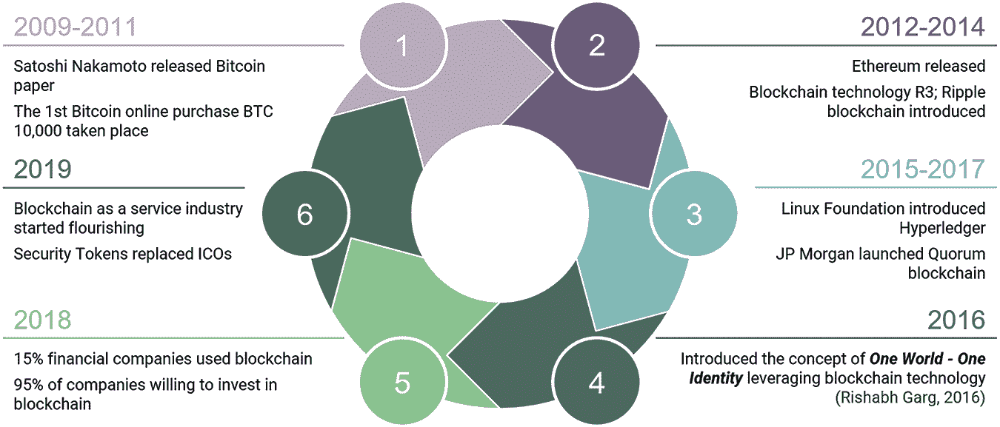
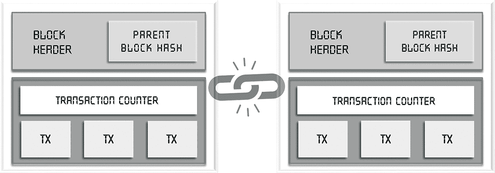
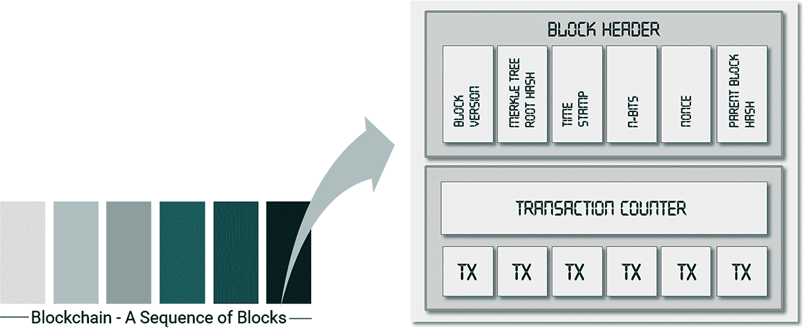
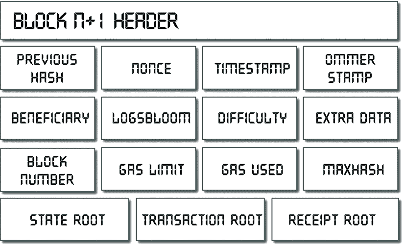
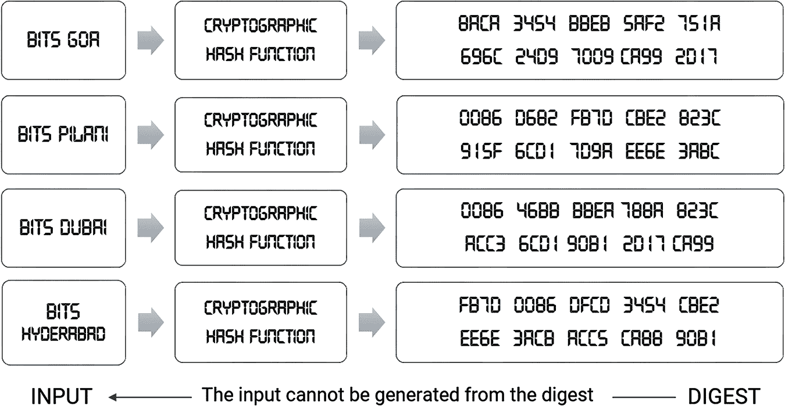
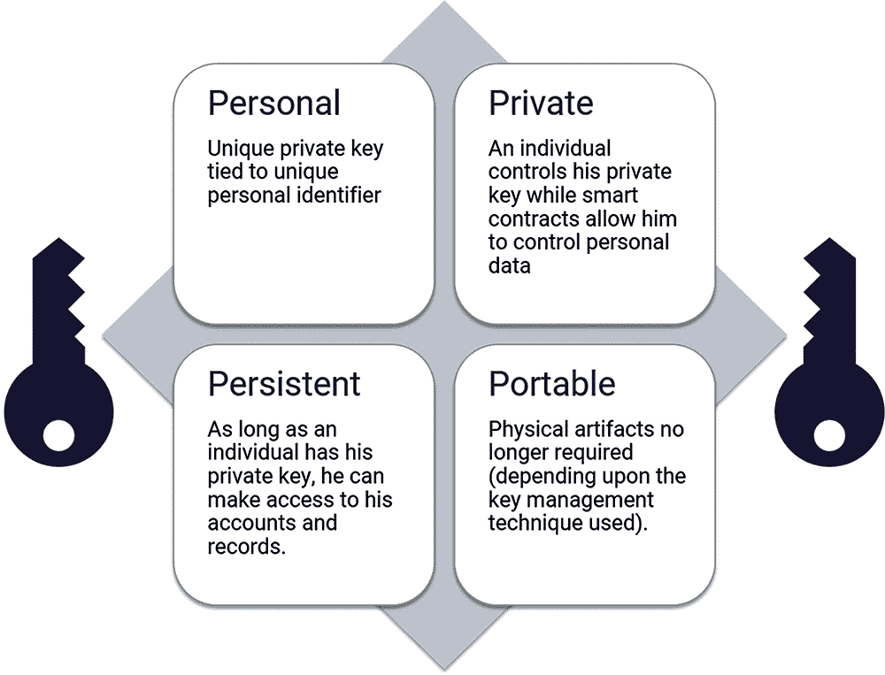
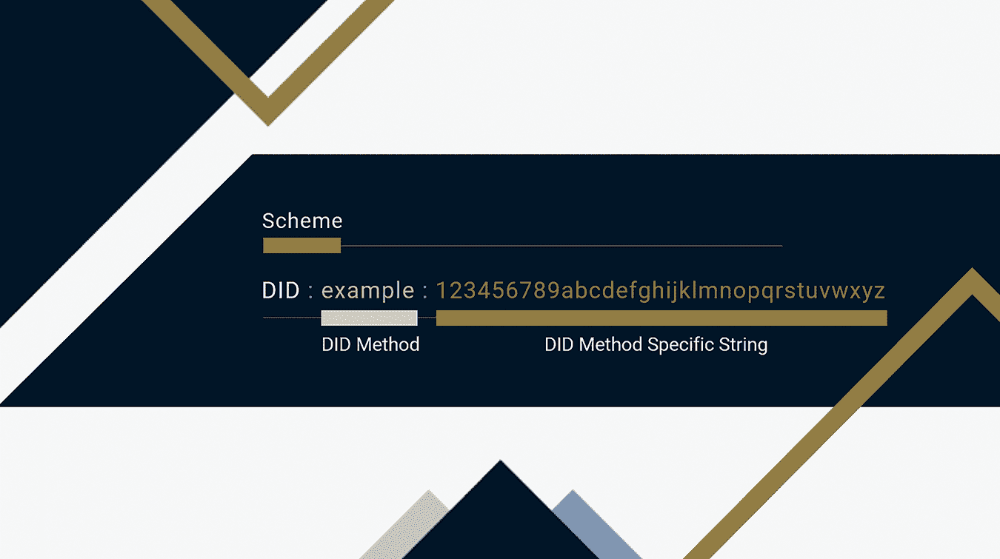

# 2

分布式账本技术

分布式账本技术（DLT）的概念包括如何将密码学与一个开放的分布式账本集成到数字业务中。DLT 指的是允许在跨越多个实体或位置的网络中以不可逆的方式同时访问、验证和更新记录的技术基础设施和协议。它可能是一个区块链、有向无环图、哈希图、霍洛链或 Tempo（Garg，2017）。

## 2.1 不同类型的分布式账本技术

### 2.1.1 区块链

区块链是 DLT 的一种类型，其中交易记录作为块链保存在账本中。所有节点维护一个共同的账本，因此整体计算能力分布在它们之间，从而带来更好的结果。

+   增强的安全性：每一份数据都进行了深度加密（哈希），从而达到了更高的安全级别。它使黑客攻击变得不可能。

+   更快的支付：相对于典型的支付系统来说，速度较快，尽管更大的网络可能具有较慢的交易速率。

+   共识：支持广泛的共识算法，帮助节点做出正确的决策。

一旦发生交易，网络上的节点将对其进行验证。验证完成后，交易获得唯一的哈希 ID 并存储在账本中。一旦添加到账本中，任何人都无法修改或删除交易。

### 2.1.2 有向无环图 (DAG)

每笔交易都以顺序的方式输入到账本中。然而，为了验证它，交易需要赞同前两笔交易才能称之为有效。在这里，交易序列称为“分支”，分支越长，所有交易的有效性越强。

+   几乎无限的可扩展性：用户越多，验证所需的时间越少。这就是它能够达到无限可扩展性的方式。

+   量子抵抗：使用一次性签名使其具有量子抵抗性。

+   并行交易：所有交易在验证后在并行线上对齐。

### 2.1.3 哈希图

哈希图采用八卦协议来传递有关交易的信息。一旦发生交易，相邻节点会将该信息与其他节点分享，过了一段时间后，所有节点都会知道这笔交易。借助“虚拟投票”协议，每个节点验证交易，然后将交易添加到账本中。

+   可以在账本上存储具有相同时间戳的多个交易。所有交易都存储在并行结构中。在此，账本上的每个记录称为“事件”。

+   账本以有序的方式记录网络上的每个八卦序列。

+   随机八卦：节点随机与其他节点八卦他们所知道的信息，以传播信息，直到每个节点都知道这些信息。

### 2.1.4 霍洛链

在 Holochain 中，网络上的每个节点都维护自己的账本。尽管该系统没有规定任何全局验证协议，但网络维持着一组称为“DNA”的规则，以验证每个单独的账本。

+   Holochain 从以数据为中心的结构转向以代理为中心的结构。以代理为中心的节点可以单独验证，而无需任何强制共识协议。

+   节能：不同类型的账本使得该系统比其他等效系统更加节能。

+   真实 DLC：网络上的每个节点维护自己的账本，从而创建了一个真正的分布式系统。

### 2.1.5 节奏（基数）

+   逻辑时钟：系统依赖于交易的顺序，而不是时间戳，来达成共识。

+   分片：网络上的每个节点都保存有一个唯一标识的分片（全局账本的最小部分）。

+   八卦协议：节点广播所有他们的信息以同步他们自己的分片。

从前面的比较中可以看出，由于区块链具有一些特性，如去中心化、信息透明、开放性和防篡改结构，因此它似乎非常适合于身份管理。

## 2.2 时间演变

自区块链问世以来，区块链已经革命化了多个领域（见图 2.1）。文献综述清楚地表明，区块链应用的范围已经从虚拟货币扩展到金融应用、教育、健康、科学、运输和政府。到目前为止，已经确定了三代区块链，分别是用于数字货币的区块链 1.0、用于数字金融的区块链 2.0、用于数字社会的区块链 3.0，以及为现实世界提供商业友好生态系统的区块链 4.0。（Garg，2022a）。

**图 2.1** 区块链演变过程中的不同里程碑。

### 2.2.1 区块链 1.0

区块链 1.0 仅限于虚拟货币，如比特币，这是第一种也是被广泛接受的数字货币（Menelli 和 Smith，2015）。大多数区块链 1.0 应用都是数字货币，用于商业交易，并依赖加密货币生态系统进行小额支付、外汇、赌博和洗钱。

最初，虚拟货币依赖于加密技术来生成、交易和验证其价值。加密货币交易记录在区块链上，该区块链通过利用大型点对点网络的资源来验证和批准每一笔交易。使用区块链进行数字货币的主要优势在于，它提供了一个在没有可信赖的中介或对手方的情况下转移资产的可靠平台。

第一个区块是由中本聪（2008 年）创建的，他引入了第一种加密货币，比特币（日本野村研究所，2016 年）。其当前市值超过 1400 亿美元。其他加密货币——莱特币（2011 年）、名称币（2011 年）、狗狗币（2013 年）和 Peercoin（2012 年）——总市值超过 300 亿美元。目前，市场上共有超过 18000 种加密货币，总市值达到 3.2 万亿美元。

### 2.2.2 区块链 2.0

这一级别的区块链主要包括比特币 2.0、智能合约、去中心化应用程序（dApps）、去中心化自治组织（DAOs）和去中心化自治公司（DACs）（Swan，2015 年）。然而，它被用于颠覆传统货币和支付系统，主要是在银行、股票交易、信贷系统、供应链金融、支付结算、防伪和相互保险等领域。基于可编程智能合约的某些加密货币被引入，例如以太坊、Codius 和 Hyperledger。

### 2.2.3 区块链 3.0

区块链被认为是新经济的蓝图。它可以在教育、健康、科学、交通和物流等领域使用，除了货币和金融（Swan，2015 年）。这种区块链及其潜在应用的范围表明，区块链技术是一个持续的目标（Crosby，Pattanayak 和 Verma，2016 年）。它包括更先进的智能合约，以建立分布式组织单元，制定自己的法律并具有高度自主性（Pieroni 等人，2018 年）。

区块链与代币的合并是区块链 3.0 的关键组合。

+   代币是数字权利的证明，因此，区块链代币得到了广泛认可，这要归功于以太坊及其 ERC20 标准。

+   基于此标准，任何人都可以在以太坊上发行自定义代币，并且此代币可以表示任何权利或价值。

+   代币代表通过加密代币创建的经济活动，基本上但不仅限于基于 ERC20 标准。

+   代币可以作为任何权利的验证形式，包括个人身份、教育文凭、货币、收据、钥匙、折扣点、代金券、股票和债券。

+   可以认为代币是其前端经济面孔，而区块链则是新时代的后台技术。

### 2.2.4 区块链 4.0

区块链 4.0 现在作为一个对商业友好的生态系统正在兴起，用于在现实世界中构建和运行应用程序。该系统通过探索虚拟区块链内的区块链可能性来实现无限可扩展性。区块链 4.0 描述了将技术合理化以满足商业需求的解决方案和途径，特别是工业 4.0 和商业。

工业 4.0 体现了自动化、企业资源计划和各种执行系统的集成，这使得区块链对于未来实际应用有用。区块链与工业和商业的结合允许跨系统业务流程，确保数据安全与隐私，具有自动化、交易对手排除和透明度。

将区块链与物联网（IoT）、云计算、人工智能和机器人等新兴技术结合是未来最大的承诺之一。区块链将通过建立信任、转移价值和安全存储数据来自动化流程。供应链管理、业务工作流、金融交易、IoT 数据收集、健康管理、资产管理以及信用系统是可以通过区块链技术赋予权力的几个例子。

因此，通过使用区块链技术，可以引入一个数字架构，它可以结合自动化、责任追溯和隐私保护，在现实世界中产生无摩擦的体验（Garg, 2021a）。

## 2.3 区块链架构

区块链是一系列区块的序列，它像传统的公共账本（Wang et al., 2018）一样持有完整的交易记录。由于区块头部包含前一个区块的哈希值，一个区块只有一个父区块（见图 2.2）。区块链的第一个区块被称为“创世区块”，它没有父区块。

**图 2.2** 区块链——连续的区块序列。

以下是对区块链内部细节的描述。

### 2.3.1 区块

一个区块由区块头和区块体组成（见图 2.3）。区块头包含：

**图 2.3** 区块的说明。

+   区块版本，表示需要遵循的区块验证规则集。

+   Merkle 树根哈希，表示区块中所有交易的哈希值。

+   时间戳表示自 1970 年 1 月 1 日以来的通用时间。

+   nBits 旨在设定有效区块哈希的阈值。

+   Nonce 是一个 4 字节字段，通常从 0 开始，每次哈希计算后递增。

+   父区块哈希值有 256 位，指向前一个区块。

区块体是由交易计数器和交易组成的单元。一个区块可以容纳的交易数量取决于区块的大小和每个交易的大小。区块链使用非对称加密机制来验证交易的认证（NRI, 2016）。在不可信环境中使用基于非对称加密的数字签名。

区块体包括（见图 2.4）：

**图 2.4** 区块的组成部分。

1.  交易哈希

1.  交易根

1.  状态哈希

1.  状态根

为了检查区块的完整性，使用了所有组件的哈希值。为了验证区块，还需要检查其他条件。

### 2.3.2 哈希函数

如上所述，每个区块都包含经过哈希的信息（参见图 2.5）。

**图 2.5** 一个密码学哈希函数。

哈希函数，在密码学中使用，描述了一个将信息位转换为字母数字字符串的数学算法。哈希本身是独特的，它表示输入和输出的信息是否相同。哈希函数具有高雪崩效应，即输入字符串的微小变化会导致完全不同的输出字符串。这使得除非应用复杂的机器学习算法，否则几乎不可能进行逆向工程（Garg, 2021b, 2022b）。

常见的哈希函数有 SHA-3、SHA-256 和 Keccak。哈希方法有两种类型：

1.  简单哈希：哈希是通过暴力方法完成的。它适用于内容/交易量固定的文档/区块，例如区块头。

1.  默克尔树哈希：数据被安排为叶节点（二叉树），哈希是在两片叶子的集合中进行的。用于哈希函数中的可变大小参数。例如，复合区块完整性；O(*n*) = log *n*。

### 2.3.3 加密

加密的第一个实例是对称密钥加密。在此，相同的密钥（规则）用于加密和解密。例如，凯撒加密；其中字母（ASCII 值）通过一个固定量进行移位。

#### 2.3.3.1 问题

1.  容易推导出原始消息。

1.  传递解密密钥是困难的。

为了解决上述问题，引入了公钥加密或非对称加密。在此，每个用户都有一对密钥。发送者用私钥加密的消息，加上接收者的公钥，用接收者的私钥和发送者的公钥进行解密。这验证了发送者和接收者双方。

罗维斯特-沙米尔-阿德尔曼（RSA）算法使用非对称加密的概念帮助用户登录到云上的虚拟机，例如亚马逊网络服务。然而，在区块链中，椭圆曲线密码学（ECC 家族）算法被用来构建公钥和私钥对，因为它们比 RSA（256 位 ECC 密钥对≡3072 位 RSA 对）要强大得多。

### 2.3.4 密钥：公钥和私钥

为了保护去中心化身份，私钥只有所有者知道，而公钥被广泛传播。这种配对实现了两个目的（参见图 2.6）。第一个是认证，公钥验证持有配对私钥的人是否发送了消息。第二个是加密，只有持有配对私钥的人才能用公钥加密的消息进行解密。这个过程称为“密码学”。

**图 2.6**  区块链中的非对称密钥加密。

网络上的节点通过其账户地址来标识，这些地址按照以下方式生成：

1.  生成一个 256 位的随机数，用作私钥。

1.  椭圆曲线加密算法应用于私钥以生成公钥。

1.  哈希函数应用于公钥以生成一个 20 字节的账户地址。

被哈希和加密的交易数据就像数字签名。接收者收到数据的原始副本和数据的安全哈希。接收者解密安全哈希并重新计算收到的原始数据的哈希。如果两者相同，则说明数据未发生任何修改。

### 2.3.5 去中心化身份标识

去中心化身份标识（DID）是个人或公司的伪匿名标识。每个 DID 都由一个私钥保护。只有私钥所有者才能证明他们拥有或控制自己的身份。一个人可以有多个 DID，这在一定程度上限制了他们在生活中多项活动中被追踪的程度。

每个去中心化身份标识（DID）通常与一系列由其他 DID 发行的可验证凭证（证明）相关联，这些凭证确认了该 DID 的独特特征（如年龄、文凭、工资单、地址）。这些凭证由其发行者通过加密方式签署，允许 DID 所有者自己存储这些凭证，作为单一档案提供者的替代方案。

DID 存储在公共账本上，并与 DID 文档一起存储，该文档包含 DID 的公钥、任何其他希望公开披露的公开凭证（身份所有者），以及用于交互的网络地址（见图 2.7）。

**图 2.7**  去中心化身份标识（DID）。

### 接下来

上述账户讨论了从简单的加密货币发展到完全开发的去中心化系统所需的演变，该系统配备了可编程逻辑。同时也概述了一些将在解释区块链在现实世界中的实际应用案例时使用的技术术语。

接下来的章节将向读者介绍区块链架构及其替代表示，以及选择一种共识算法优于另一种共识算法的适当理由。

## 参考文献

1.  Crosby M, Pattanayak P, 和 Verma S, 2016. 区块链技术：超越比特币。应用创新, 2: 6-19。

1.  Garg R, 2017. 带数字追踪系统的高科技身份识别，印度国家会议：ICT 在建筑环境中的应用。DOI:10.5281/zenodo.4761329。 [`www.researchgate.net/publication/325248504_Hi_-_Tech_ID_with_Digital_Tracking_System`](https://www.researchgate.net/publication/325248504_Hi_-_Tech_ID_with_Digital_Tracking_System)。

1.  Garg R, 2021a. 基于区块链的多行政域网络的去中心化应用。印度 BITS – Pilani, KK Birla Goa 校园，1-69 页。DOI:10.13140/RG.2.2.29003.87845。 [`www.researchgate.net/publication/351871690_Blockchain_based_Decentralized_Applications_for_Multiple_Administrative_Domain_Networking`](https://www.researchgate.net/publication/351871690_Blockchain_based_Decentralized_Applications_for_Multiple_Administrative_Domain_Networking)

1.  Garg R, 2021b. 主权身份。德国 Verlag Unser Wissen 出版社，1-104 页。

1.  Garg R, 2022a. 一种解决 UID（Aadhaar）不足的技术方法。第三届国际大数据、区块链和安全会议，丹麦哥本哈根。DOI:10.5281/zenodo.5854732。[`zenodo.org/record/5854732#.YvYODaBBzIU`](https://zenodo.org/record/5854732%24.YvYODaBBzIU)

1.  Garg R, 2022b. 身份管理的分布式生态系统。区块链研究杂志 1 (1) （待发表）。

1.  Mainelli M 和 Smith M, 2015. 共享账本在共享经济中的应用：对共同分布式账本（区块链技术）的探索。《金融视角杂志》，3 (3): 38.

1.  Nakamoto S, 2008. Bitcoin: A Peer-to-Peer Electronic Cash System。[`bitcoin.org/bitcoin.pdf`](https://bitcoin.org/bitcoin.pdf)

1.  Nomura Research Institute, 2016. 区块链技术与相关服务调查。技术报告。[`www.nri.com/-/media/Corporate/en/Files/PDF/news/info/cc/2016/160621_1.pdf?la=en&hash=5F190404DE669076B66330D09C4AFBEB4B21C501`](https://www.nri.com/-/media/Corporate/en/Files/PDF/news/info/cc/2016/160621_1.pdf?la=en&hash=5F190404DE669076B66330D09C4AFBEB4B21C501)

1.  Pieroni A, Scarpato N, Di Nunzio L, Fallucchi F, 和 Raso M, 2018. 智能城市：基于区块链技术的智能电网。国际先进科学、工程和信息技术杂志，8 (1): 298-306。

1.  Swan M, 2015. 区块链：新经济蓝图。O’Reilly Media, CA 美国，152 页。

1.  Wang H, Zheng Z, Xie S, Dai H, 和 Chen X, 2018. 区块链挑战与机遇：一项调查。国际网络与网格服务杂志，14: 352-375。
