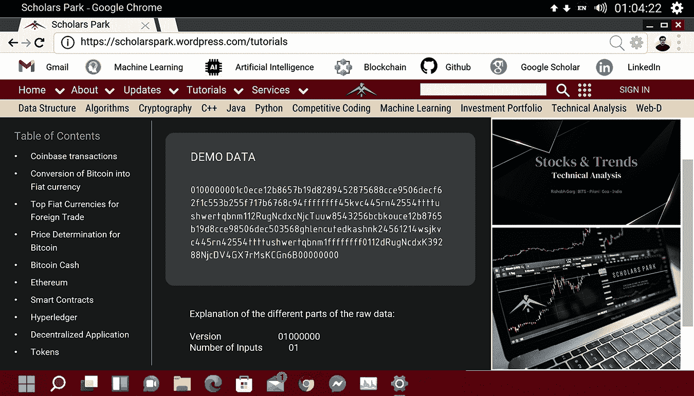
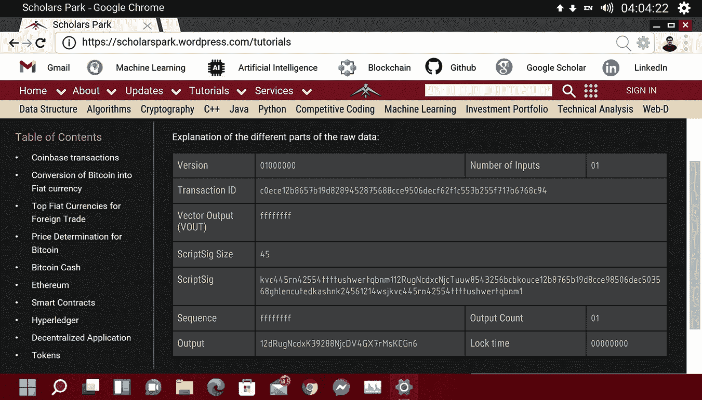
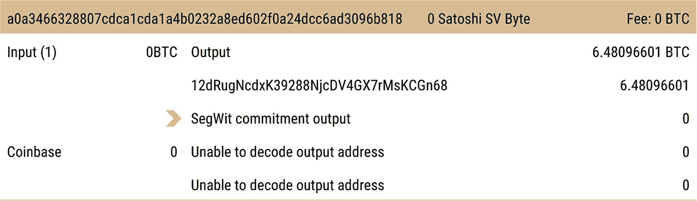
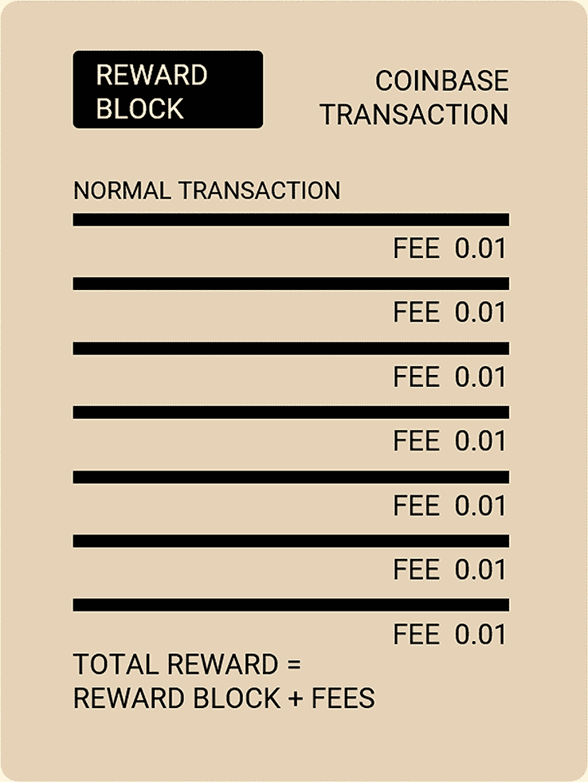
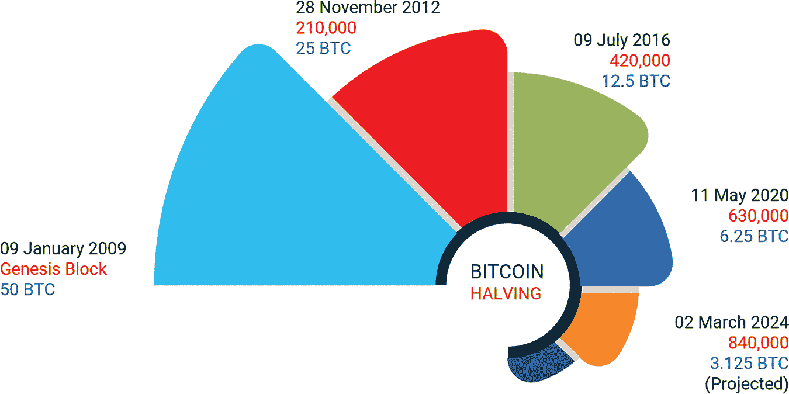
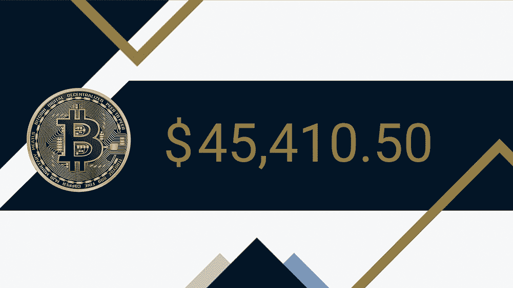
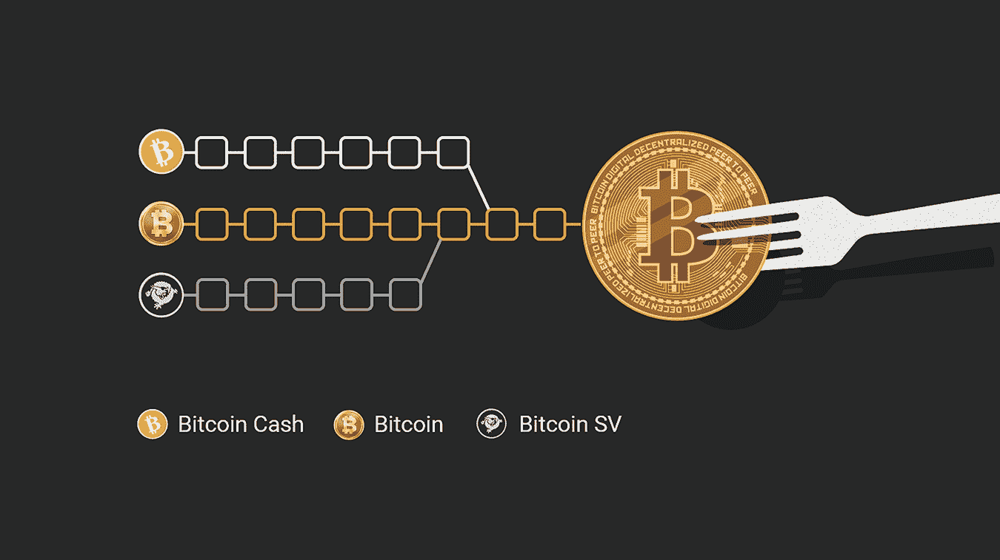

# 4

比特币区块链中的交易

加密货币是数字代币或货币，在区块链上进行交易，如比特币、以太坊或莱特币，可以用来购买资产、商品和服务，就像现金一样。然而，加密货币使用区块链实现公开账本以及先进的加密安全系统，以便在线交易始终被记录并保证安全。

加密货币可以数字化地支付从普通商品到房地产的一切。商品可以通过数字钱包或交易平台以数字化方式购买或转移。区块链通过记录买方、卖方和交易在公开账本中的时间戳和安全的跟踪，创造了一个无可争议的跟踪。

目前，世界上有超过 18000 种加密货币，总市值约为 3.2 万亿美元。这些货币近年来获得了极大的流行，结果是今天一个比特币的价值为 45410.50 美元。

## 4.1 币基交易

在加密货币网络上发生的所有交易不一定都是两个人之间的支付结果。其中一些交易有所不同。区块链中的第一个交易发生在比特币中。它是一个特殊的交易，在区块链的第一个区块内，即“创世区块”中分配了矿工的奖励交易。这些奖励交易通常作为矿工工作的激励或奖励。这种类型的交易称为币基交易。这些交易生成新货币，从未被花费过（例如，法定货币的印刷）。

当中本聪在 2008 年挖掘了比特币的第一个创世块时，他基于当时的主导减半因子创建了一个价值 50 BTC 的币基，并将支付到比特币地址“1A1zP1eP5QGefi2DMPTfTL5SLmv7DivfNa。”然而，这个区块从未被确认，在给定地址支付的奖励无法被花费。尽管区块链开发者和专家找不到原因，但可以安全地假设，第一个币基交易编码在比特币创世块的源代码中，整个区块链就是建立在此块之上。因此，对于这个区块，确认概念不适用。

### 4.1.1 结构

在币基交易的情况下，新货币被创造出来但从未被花费。因此，在此类交易中输入保持空白。这种币基交易的单个空白输入称为“币基”。

让我们以一个币基交易为例。截图展示了演示数据（见图 4.1）及其不同的凭证（见图 4.2）。图中的数据并不表示任何实际交易。

**图 4.1** 原始数据输入。

**图 4.2** 原始数据的不同细分。

与其他加密货币交易不同，coinbase（交易记录）不与任何其他持有者或发送者的地址相链接（参见图 4.3）。该交易指向原始矿工的加密货币钱包地址，可以根据矿工的选择指向一个以上的钱包地址。区块奖励的收集包括用户为每笔交易收取的费用（参见图 4.4）。

**图 4.3** 真实 coinbase 交易的示例。

**图 4.4** Coinbase 交易：奖励区块。

### 4.1.2 Coinbase 交易的主要特点

+   一个 Coinbase 交易通常是新区块中的第一个交易。就像普通的加密货币交易一样，从这个交易产生的奖励也可以发送到一个或多个钱包地址。

+   在成功添加一定数量的区块到区块链之后，每个成功添加的区块的奖励会被减半，即 50%（参见图 4.5）。在比特币中，这个事件发生在每 210,000 个成功挖出的区块之后。通过减少挖掘比特币的奖励或限制比特币的数量，可以限制硬币的供应，从而保持需求的强劲，并提高价格上涨的潜力。

    **图 4.5** 比特币减半。

+   最初，每个成功区块的比特币奖励是每个区块 50 BTC，此后已降至 25 BTC、12.5 BTC，现在是 6.25 BTC。预计在未来两到三年内，这一比率将降至大约 3.125。2020 年初，通过虚拟挖掘，每十分钟向网络添加 12.5 个新比特币，这个过程将继续进行，直到挖出所有 2100 万个硬币。每个 Coinbase 交易的奖励由相应的价值决定。

+   通过 Coinbase 交易获得的奖励在达到区块链一定数量的确认之前不能花费。在比特币的情况下，这个数字是 100。这意味着，通过 Coinbase 交易获得的比特币只能在至少在区块链上获得 100 个确认后才能花费。

+   这个前提条件是为了避免一个称为分叉的事件。在一定数量的确认缺失的情况下，矿工将能够挖掘尽可能多的 BTC。为了防止区块链被分叉，设定了一个条件，即只有当 Coinbase 交易获得等于或超过一定数量的确认时，才能花费。

### 4.1.3 交易价值的计算

+   要计算 Coinbase 交易的价值，需要计算特定区块验证的交易每个输入和输出的价值总和。

+   区块中的交易数量，即区块的高度，是要考虑的。交易越多，手续费和佣金越高。

+   矿工创建 Coinbase 交易，其中包括费用和总奖励。

+   费用是基于下单时的当前定价层计算的（你处于其中），而不是交易结束后的层（你将会处于其中）。奖励大致等于相对的一半。

+   最后，矿工必须等待一定数量的确认来产生并完成 Coinbase 交易的价值。

## 4.2 涉及法定货币的交易

比特币不是政府发行的法定货币。它是一种基于区块链技术的加密货币，不受任何中央权威机构的支持。将比特币兑换成法定货币可能有几个原因：

+   法定货币是全球最常见和受欢迎的货币形式，它使得资金更加流动和灵活。

+   一个人可以从比特币价格的牛市中获利。

+   使用法定货币进行交易和支付负债更为便利。

例如，用于兑换法定货币，例如美元——第一方将其资金发送给第二方，而另一方收到比特币。这个过程通过区块链进行。

将比特币兑换成法定货币有几种方法，其中一些方法如下：

### 4.2.1 加密货币交易所

加密货币交易所是不受单一故障点影响的去中心化系统。这是一个类似于外汇兑换的场景，一个人在从一个国家移动到另一个国家时进行货币兑换。加密货币交易所通常用于将比特币兑换成当地货币，如美元、欧元等。尽管数字硬币的操作和采用正在迅速增加，但每天处理的交易数量仍然不尽如人意。此外，高汇率、流动性不足、交易完成后取款困难等问题也制约了加密货币交易所的发展。

加密货币交易所具有内在的加密货币转换功能，显示了持有比特币的人可以得到多少法定货币。这些交易所中有一些，如 Gemini、Coinbase Exchange、Binance 等，具有用户友好的界面。然而，在牛市行情中，这些交易所可能会遇到技术问题。Coinbase Exchange 是一个更好的选择，因为它通过增加其基础设施容量来解决了停机问题。它确保了将转换后的法定货币直接存入用户的银行账户，无需烦恼。

### 4.2.2 比特币借记卡

比特币借记卡是将比特币兑换成现金或法定货币的最快方式。比特币借记卡的客户身份验证可以通过联系银行完成。为了方便兑换，有一些用户友好的网站。用户可以通过用户界面存入比特币，网站会自动将比特币转换成所需的法定货币。比特币借记卡可以在接受借记卡的网站上使用（参见图 4.6）。与银行兑换的区别在于，资金是从加密钱包而不是银行账户转移的。比特币借记卡对每笔购买收取交易费，并设定了最大的交易限额。

**图 4.6** 比特币借记卡。

### 4.2.3 比特币 ATM

比特币自动取款机（ATM），也被称为比特币柜员机，运作方式类似于普通的 ATM。它与普通 ATM 的不同之处在于，它允许用户使用法定货币购买和交换加密货币。它基于区块链进行交易，通常通过二维码将加密货币发送到用户的数字钱包。

这是一种从比特币钱包提取现金的快速方便方式，具有通过短信确保简单和安全交易的额外安全功能。然而，BTM 对转换收取高额费用，并允许每张卡有限的交易量。

### 4.2.4 金属支付

金属支付是一个基于区块链支付和数字资产奖励钱包的货币转账应用。它提供了购买和出售超过 50 种加密货币（包括比特币）的设施。通过这个应用，用户可以将他们的银行账户链接起来，完成他们的 KYC，添加现金，然后开始交易。金属支付用户可以在银行完成交易之前立即购买加密货币。

### 4.2.5 点对点交易所

由于比特币没有中央权威机构，资金可以从一个节点传输到另一个节点。而不是使用订单簿来匹配买卖订单，从而控制交易所平台上所有使用的资金，点对点交易所在不持有任何资金的情况下匹配买家和卖家。基本上，它涉及一个买家，这个买家会购买你的比特币并给你现金。

发送比特币就像转账一样简单。你只需要复制收款人的地址，并将该地址粘贴到你正在使用的比特币钱包应用的发送字段中。但是，要小心！比特币交易是不可逆的，所以选择一个在比特币交易后能可靠地支付现金的买家。

## 4.3 用于比特币交易的顶级法定货币

交易比特币最活跃的国家货币（参见图 4.7）有：

**图 4.7** 世界顶级法定货币。

### 4.3.1 美元

美元在比特币交易的法定货币列表上始终排名第一，市场份额约为 85.5%。这主要是因为基于区块链的比特币网络中有庞大的用户基础，该网络迅速渗透到该国。而其他国家比特币领域尚未获得动力时，美国已经在这场竞赛中遥遥领先。

### 4.3.2 日元

日本元（日元）在比特币交易中使用的法定货币中排名第二，市场份额约为 7%。日本监管机构也是最早采用比特币的一批，并且非常积极地引入必要的法规，使其能够获得全球市场的一个相当份额。

### 4.3.3 欧元

欧元（Europe's currency）在比特币交易中的市场份额排名第三，约为 4.7%。但是，欧洲人在购买比特币时仅限于某些地区。德国柏林市、荷兰和比利时已成为加密货币的大型枢纽，而其他一些欧洲国家则处于接受比特币的边缘。

### 4.3.4 韩元

韩国元（KRW）在比特币交易中排名第四，市场份额为 3.2%。由于该国监管机构禁止在韩国使用匿名银行账户进行加密货币交易，过去三年里，交易量大幅下降。

### 4.3.5 人民币

有趣的是，人民币不再是在比特币交易中使用的主要法定货币之一。2014 年和 2015 年，中国对其人民币进行贬值，使其冲到首位，击败了日元和美元。由于自 2017 年以来，中国政府对中国大陆的比特币交易所实施了多项禁令，所有这些来自中国的比特币交易活动迅速转移到其他场所，日本受益最大，其次是香港。

### 4.3.6 印度卢比

在印度，监管机构对采用比特币的发展反应迟缓。此外，无论是直接还是通过中介持有比特币的个人，都需要首先将印度卢比(INR)兑换成美元(US$)来购买比特币。

## 4.4 比特币交易价格的确定

比特币不由任何中央机构发行或监管，因此不受通常适用于货币的货币政策、通货膨胀率和经济措施的约束。比特币的价格主要受其供应量、市场需求、可用性和竞争性加密货币的影响。它与法定货币或股票有根本的不同。购买股票会使你拥有公司的所有权，而购买比特币会使你拥有那种加密货币的所有权。因此，除了常规的金融因素外，比特币的价格还受到一些技术因素的影响：

+   比特币的挖矿成本

+   比特币的供应量及其市场需求

+   向比特币矿工支付的，在区块链中验证交易的奖励

+   比特币交易的交易所

+   竞争性加密货币的数量，如以太坊、狗狗币、XRP 等。

+   销售和使用方面的法律法规

+   内部治理

### 4.4.1 比特币挖矿成本

一个比特币的成本是通过计算在给定时间生产一个比特币的平均边际成本来估算的，基于区块奖励、电力价格、挖矿硬件的能量效率以及与算法难度级别相关的间接成本。

电力成本是一个主要因素，因为矿工需要大量电力来进行计算；低电力价格支持和有利于矿工。算法构成了一种间接成本，因为算法的不同难度级别可以加快或减慢挖矿的速度，从而影响其价格。

### 4.4.2 市场供需

正如美元的价值是由市场决定的，比特币的供需价格也是这样。与法定货币一样，当比特币的需求增加时，价格上升，反之亦然。

然而，比特币是一种独特的资产，因为它的流动绝对僵化。当大多数商品，包括黄金和法定货币，需求旺盛时，生产者通过增加生产和采取纠正措施，将价格拉回平衡。但在比特币的情况下，其新的供应计划完全不受需求波动的影响。当比特币的需求增加时，新比特币的生产并不会增加。

中本聪创建比特币时，他为比特币的数量设立了一个严格的限制，称为比特币的硬顶，即比特币的最大供应量。比特币的总数在任何时候都不能超过 2100 万个。因此，新比特币只能以固定的速率创建，随着时间的推移必然会下降。这个硬顶导致需求超过供应，对价格施加更大的压力。这增强了投资者对即将到来的通货膨胀的信心。

### 4.4.3 比特币奖励

比特币协议允许以团体速率来挖矿比特币。比特币区块奖励是新比特币，奖励给第一个解决复杂谜题并创建一个包含验证比特币交易的新块的矿工。矿工用计算能力来做这件事，并以此获得交易费用和区块奖励。区块奖励是完成区块链上的一个区块所奖励的比特币数量。

矿工处理交易区块时，市场上会新增比特币，而新币的发行速度编程设计会随着时间的推移而减少。比特币挖矿的奖励大约每四年减半。2009 年，比特币首次被挖出时，奖励或激励的价值为 50.00 BTC，到 2012 年减半至 25.00 BTC，2016 年进一步减半至 12.50 BTC\. 自从 2020 年 5 月以来，这一价格一直维持在 6.25 BTC。奖励的价值对定价有影响。

### 4.4.4 交易所

在交易所交易的比特币总量代表了流通中总供应量的小部分，这影响了其价格。货币的流行会提高价格，而对货币的需求减少则导致价格下跌。此外，由于交易所中货币管理缺乏效率，有时需要补偿。这阻止了交易者在交易所之间维持统一的套利，从而反映了市场价格的波动。

### 4.4.5 竞争加密货币

尽管比特币是最受欢迎的加密货币，但许多其他加密货币，如狗狗币、XRP 和以太坊，都在威胁其主导地位。在最初阶段，比特币交易征服了加密货币市场，但现在它正随着时间的推移失去其主导地位。

比特币，世界上最大的加密货币，在 2017 年占据了加密货币市场总市值的 80%以上，到 2022 年，随着以太坊的流行，其比例缩水至不到 40%。

以太坊的以太币（ETHUSD）得益于去中心化金融（DeFi）代币的繁荣，成为比特币的强大竞争对手。以太币作为一种加密货币，在以太坊网络上用作“燃料”进行交易，占据了加密货币市场总市值的 17%以上。

瑞波币的 XRP（XRPUSD）和卡尔达诺的 ADA（ADAUSD）也有所上涨，稳定币吸引了投资者对币安的 BNB 代币（BNBUSD）的投资。

### 4.4.6 监管规定

比特币存在于一个非监管的市场中，没有集中的发行权威。它不需要社会安全号码（SSN）、标准银行账户、税务账户号码或独特的身份证明地址。监管的缺失使得可以进行没有政府强加限制的跨境交易，这与其他货币的情况相同。但它也在许多金融司法管辖区招致了犯罪后果。

在这种意义上，监管似乎是影响加密货币价格最重要的因素。每次有政府，无论是中国的还是韩国的，试图对加密货币交易引入监管时，比特币都会下跌。

### 4.4.7 内部治理

比特币不是一个由中央权威控制的稳定协议。它是在开发者层面实施的去中心化过程，决定哪些变化有资格被采纳以及如何采纳。这与世界上各国普遍存在的中心化系统有很大不同，那里的决策是自上而下做出的。

事实上，开发或完善比特币协议的过程是一种共识形成，其中讨论和强制很重要，但参与者总是有退出的选项。通常，除非大多数参与者同意进行更改，否则无法进行更改，即使这样，那些希望跟随更改的人也总是自由地走自己的路。这意味着任何能够提交比特币改进提案（BIP）的人都可以这样做，以供考虑，如果提议的更改不大，整个协议可以相对容易地分叉。

-   此外，所有节点和矿工都可以自由选择他们希望运行的客户端。在更大的相互协商下，这个客户端成为了主链。虽然它有很多优点，但也存在一些缺点。由于变化可以通过共识过程引入，因此解决根本问题（如可扩展性）需要花费很长时间。目前，比特币软件处理的交易速度几乎只有每秒三笔，这太慢了。每当社区在技术上创新以提高交易速度时，往往会出现一种全新的加密货币。

### 4.4.8 比特币的价值

一个产品的内在价值是指它本身所具有的价值，并且它不需要任何补充来源来获得价值。如果人们愿意为获得某物品支付价格，那么每个项目都能赚取其价值。比特币这种商品限量只有 2100 万个，这个限量使得比特币的价值在于它与法定货币或黄金相比极为稀有。例如，所有流通中的比特币的总价值仅为 1750 亿美元，而存在的黄金总价值为 8800 亿美元。所以，它很可能会保持价值（参见图 4.8 了解 2022 年 4 月的价值）。投资者们渴望分得由于其有限供应而不断增加的利润的一杯羹。

**图 4.8** 比特币价值。

更重要的 fact 是比特币是基于一种迫在眉睫的技术——区块链。区块链是一个公开可用的分布式账本，其中所有交易都以一种不可变、可审计和防篡改的方式保存。这些交易由所谓的矿工验证，他们只把有效的交易添加到区块链上，并因此获得比特币作为奖励。这是一种有潜力解决无数领域根本问题的技术，比如身份管理、教育和就业验证、医疗保健、交通、房地产、证券交易等等。比特币是它的一个应用。

### 4.4.9 比特币价格能降到零吗？

假设比特币的价格为绝对零是一个巨大的任务，看似几乎不可能完成。比特币的价格基本上是上涨的，其价格从基本为零上涨到十年的最高点，达到 6 万美元。比特币，作为原生加密货币，如今已成为世界上最大的货币之一，在很短的时间内已成为有史以来最赚钱的资产之一。

尽管比特币的增长无与伦比，但比特币的怀疑者认为，比特币最终会跌至零只是时间问题。这种不可信的观点基于比特币既没有实体商品的支持，也没有行政系统。一些人甚至认为比特币会跌至零，因为它没有内在价值（没有像黄金这样的实体商品支持）。但是，一个问题随之产生，那就是曾经由黄金支持的美元和英镑等法定货币今天是否还受到任何有价值物品的支持？比特币的爱好者认为，加密货币是由消费者信心和数学——用户数量支持的。

近年来，比特币涌入了大量机构投资，包括 Aker ASA、MicroStrategy、Square 和特斯拉等公司用比特币作为企业储备。这种机构投资可以被视为其稳定性的一个迹象。

另一个关注点是，比特币可能会被一种更先进的加密货币或一种并行支付系统所取代，这可能会使比特币作为资产或支付手段变得毫无用处。但创造这种条件可能需要很多年，到那时，这样的可能性可能对任何货币或支付方式构成威胁。此外，比特币具有巨大的部署潜力，因此可能有一个普遍持有或转移比特币储备的选项，或者可以分阶段使用其储备。无论如何，比特币的价值将保持存在，如果不是作为货币，至少作为未来几代人的历史文物。

一个指向比特币价值几乎为零的可能性是，世界上所有政府可能会彻底废除比特币的所有权、使用或交易。目前，许多国家已经采取了这样的措施。但要实现这一点，他们需要摧毁整个比特币网络，使所有节点（包括在太空中运行的节点）下线，然后重新建立网络。这一切将非常困难。

批评者还声称，比特币实际上是一个精心设计的骗局，由一些不道德的实体策划，目的是抽取用户辛勤赚来的钱。一些学者，包括沃伦·巴菲特和马克·库班，认为比特币被高估了，而其实用价值几乎为零。

网络效应的特性可以用梅特卡夫法则来描述，该法则指出：“电信网络的价值与系统内连接用户数量的平方成正比。”这意味着随着比特币钱包数量的指数增长，比特币的实用性可能会增长得更快。这种最初用于点对点交换和在线交易的加密货币，现在已经拥有一个完整的去中心化金融（DeFi）工具生态系统，以及无数增加其实用性的用例。

### 4.4.10 比特币价格为什么波动？

与其它投资工具和货币相比，比特币还处于婴儿期。任何新概念都需要时间来沉淀并表现出相应的行为，加密货币也是如此。

加密货币在过去十年中获得了全球性的声望，无论是好是坏，但作为一种资产类别，它们并不像其他传统资产（如股票或黄金）那样受到欢迎。市场的接受度和成熟度相辅相成。由于投资者仍然随着市场变动而动，所以在早期阶段不可能有稳定的价格。

与法定货币不同，一些加密货币的供应量是有限的。比特币的最大供应量为 2100 万个，莱特币的供应量限制在 8400 万个，而链链（基于以太坊）的最大供应量为 10 亿。由于供应量有限，一些组织倾向于进行主要持股，从而推高价格。有时，持有大量硬币的机构开始出售它们，导致价格下跌。这样的账户被称为“鲸鱼”，因为它们持有大量股份并有能力影响市场。由于比特币是最受欢迎的加密货币之一，需求和供应在定价中起着重要作用。

此外，投资者不断尝试用他们的资金来预测导致加密货币价格波动的动态。当价格上涨或下跌时，投资者下注，这些投机行为会导致突然的资金流入或流出，从而导致高波动性。随着加密货币越来越受欢迎，越来越多的投资者将能够理解决定它们动力的因素。在此之前，这些暗流涌动仍然具有投机性，因为投资者是根据市场情绪进行买卖。

例如，一个新投资者预期价格上涨，在价格上涨之前购买比特币，兴奋地认为当价格上涨时，他能够以每股更高的利润出售这些比特币。这种消费者投机行为导致比特币市值的增加。

相反，当比特币的价格开始下跌时，人们预期市场会转熊，想要在价格进一步下跌和大规模抛售发生之前出售他们的比特币。随着消费者信心的下降，比特币的价格通常也会下跌。拥有比特币的投资者看到价格下跌，通常想在市场没有仔细分析的情况下就出售他们的比特币，以免亏损，结果价格继续下跌。

## 4.5 在比特币中控制交易成本

比特币是一种用于日常交易的点对点加密货币。多年来，随着它获得主流关注和价格上涨，比特币成为了一种投资工具，而不是货币。它工作的区块链平台被认为缺乏可扩展性，因为它本质上无法处理大量交易。比特币的 MB 区块大小限制导致了比特币区块链上交易确认时间和费用的增加。等待确认的延迟不当，因为区块无法处理交易大小的增加，因此，创建了另一种与比特币共享许多功能的加密货币，同时也解决了这些问题——比特币现金。

创建比特币现金的主要目的是在区块链中创建更大的区块大小，从 8 MB 增加到 32 MB，这样单个区块就能容纳比原始比特币更多的交易记录。当比特币现金提案推出时，比特币的平均每区块交易量约为 1,000 和 1,500。2018 年 9 月的压力测试中，比特币现金区块链的交易量估计为每区块 25,000。

比特币现金是一种主要设计为花费而非持有的交易型加密货币。它作为一种电子现金支付系统运作。它是比特币的一种分叉，其交易成本低于比特币。起源于 2017 年 8 月，比特币被分成两种不同的加密货币——比特币和比特币现金。

加密货币在 2018 年 11 月经历了另一次分叉，分裂为比特币现金 ABC 和比特币现金 SV（中本聪愿景）。比特币现金 ABC 现在被称为比特币现金，因为它使用了原始的比特币现金客户端。

尽管比特币现金是原始比特币的升级版本，但比特币现金和比特币在技术上有很多相似之处。它们使用相同的共识机制，其比特币供应量都限制在 2100 万个比特币。两者都使用工作量证明机制来挖掘新比特币和生成交易。比特币现金还使用相同的挖矿难度算法——紧急难度调整（EDA），该算法大约每两周或每 2016 个区块调整一次难度。矿工利用这一相似性，交替在比特币和比特币现金之间进行挖矿活动。尽管这种做法对矿工是有利的，但它对市场上比特币现金的供应增加产生了负面影响。因此，比特币现金已经修改了其 EDA 算法，以减轻矿工生成加密货币的难度。

因此，比特币现金能够每秒处理比比特币网络更多的交易，并且更快地处理它们，这也节省了确认时间并降低了处理费用。

### 4.5.1 比特币现金的历史

2010 年，比特币推出了自己的区块链，该区块链容易受到黑客攻击，主要处理低价值交易，使得系统某种程度上可以被爬取。比特币区块链上一个区块的平均大小不到 100 KB，每笔交易的费用几乎只有几美分。此外，挖掘新比特币所需的时间比其他加密货币长得多，大约需要十分钟。因此，原始比特币在各个方面都被超越了。

Bitcoin Cash 被认为是比特币的一个分叉，是在参与者对如何在比特币生态系统中扩展加密货币存在分歧的情况下创建的（Bitcoin, 2022）。主要争议点是区块的大小，它决定了每秒处理的交易量。由于交易以数据形式处理，更大的区块大小意味着可以包含更多的交易，从而实现更高的吞吐量。

比特币协议多年来一直限制区块大小为 1 MB。但当比特币因其潜力和无与伦比的效率而获得主流关注时，这种安全措施被证明是具有威慑性的。随着比特币用户的增加，由于区块大小的限制，结算时间也增加了，竞争对手开始收取高额交易费用以追求更高的收益。因此，比特币在处理高价值交易方面保持了相关性，在这种情况下，交易速度并不重要，但在低价值交易方面失去了优势，在这些交易中，费用和速度都是至关重要的。这意味着比特币作为现金的使用价值降低了。

开发者提出了两种解决方案来解决问题：要么增加平均区块大小，要么删除交易的一些部分，以便在区块链中容纳更多数据。负责开发和维护比特币算法的比特币核心团队坚持保持 1 MB 的区块大小不变。他们主张将比特币的扩展转移到链下，在第二层解决方案上保持现状，对于大量交易仍然在链上。另一方努力增加区块大小，使每个区块的交易更快，并保持费用低。

由于比特币社区未能达成共识，因此硬分叉导致比特币的两个版本分离——增加区块大小的升级版本被称为比特币现金，而未更改的版本被称为比特币（BTC）。比特币现金作为完全新的加密货币，在单独的区块链上运行。

2017 年 8 月，比特币现金在加密货币交易所以令人印象深刻的 900 美元高价亮相。每个比特币持有者都获得了与比特币现金相等的金额，导致硬币数量空前增加。Coinbase 和 itBit 等主要加密货币交易所对比特币现金实施了禁运，并未在其交易所上市。在这种情况下，比特币现金得到了世界上最大的加密货币挖矿平台 Bitmain 的大力支持。这确保了在比特币现金推出时，加密货币交易所上有足够的硬币进行交易。2017 年 12 月，比特币现金在加密货币狂潮的高峰时达到了 4091 美元的高价。

有趣的是，在几乎一年的时间里，比特币现金又经历了一次分叉（参见图 4.9）。2018 年 11 月，比特币现金分为比特币现金 ABC 和比特币现金 Satoshi Vision (SV)。这一次，争议是关于一个拟议的协议更新，包括增加平均区块大小和比特币区块链上智能合约的使用。比特币现金 ABC 使用原始的比特币现金客户端，但对其区块链进行了几次更改，例如规范交易顺序路线（CTOR），它将区块中的交易重新排列成特定的顺序。

**图 4.9** 比特币的分叉。

比特币现金 SV 由声称是原始中本聪的 Craig Wright 领导。他拒绝了在支付交易平台上使用智能合约。无论争议是在什么情况下开始的，最后，越来越多的资金流入加密货币生态系统，为投资者提供了大量的硬币。自推出以来，这两种加密货币在加密货币交易所上都获得了可观的估值。

### 4.5.2 关于比特币现金的担忧

Bitcoin Cash 还没有达到它被设想时的标准。这些标准中最重要的是区块大小，它比比特币区块链的区块大小小得多。较小的区块大小意味着通过较大区块实现更多交易的想法还没有经过技术测试。

比特币交易费用的下降使它成为 Bitcoin Cash 的一个可行的竞争对手。其他一些旨在成为日常交易媒介的加密货币已经冲击了 Bitcoin Cash 的原始目标。许多人甚至开始与国内外组织和政府建立合作伙伴关系。即使这样的说法值得怀疑，Litecoin 已经开始与活动组织者和专业协会合作，Dash 试图在经济动荡中取得进展，比如委内瑞拉。

尽管它与比特币的分裂非常高调，但 Bitcoin Cash 并没有像比特币今天这样获得同样的名声。比特币在基于区块链的交易水平上仍然远远领先于竞争对手。许多人 outside the crypto community 对 Bitcoin Cash 一无所知，它还没有找到一个赞助商。

Bitcoin Cash 在区块链上的第一次分叉是可以接受的，但第二次分叉使开发者团队的董事会受到了怀疑。一股较大的力量认为 Bitcoin Cash 正在损害其最初的愿景，为未来的进一步分裂铺路。智能合约是所有加密货币的一个基本特征，因此，尚需观察 Bitcoin Cash 是否仅仅是一个支付系统的平台，还是也能作为一种手段，在交易中融入智能合约。

Bitcoin Cash 没有一个明确定义的治理协议，而其他加密货币，如 Dash 和 VeChain，都有精心制定的治理协议，分配了投票权。Bitcoin Cash 的发展和设计愿景似乎是集中在它的开发团队身上，该团队没有透露没有持有大量加密货币的投资者是否有投票权或特权来决定 Bitcoin Cash 的未来发展方向。

### 4.5.3 Bitcoin Cash 核心特点

Bitcoin Cash 是一种去中心化、点对点的电子现金系统，它不依赖于政府或金融机构等中心权威。它完全去中心化且独立，借助于分布式账本——通常被称为区块链技术运作。交易过程中没有任何第三方参与。它代表了一种货币的根本性重塑。

Bitcoin Cash 的几个显著特点包括：

+   比特币不受政府和其它中心权威的管辖，这些机构既不能阻止用户交易，也不能限制比特币账户。

+   比特币现金对每个人都开放。使用它不需要任何身份验证或授权。它不属于任何人，也不受任何人的控制。任何人都可以无需审查地进行交易。与使用国家货币相比，用户体验到更多的自由。

+   与比特币类似，一个块会按时间顺序存储交易，直到其 1 MB 的数据容量被占用，然后另一个块重复同样的过程。所有这些块按顺序连接在一起，形成一个全球公共账本，即区块链。

+   所有的交易都是以安全和透明的方式进行的，并且随时可以获取账本的一份副本，这样人们就可以在任何时间点轻松地访问整个记录。

+   账本由一个称为节点的网络参与者以离散的硅库形式公开存储和分发。这不仅避免了蜜罐问题（所有数据集中在一个中央存储库中），还减少了单点故障（SPoF）的可能性。

+   尽管机制不受任何中央权威的控制，但所有节点都遵循一个预先确定的协议来达成对账本状态的一致意见。比特币现金还使用工作量证明（PoW）共识机制来处理交易。

+   尽管可以根据参与者的需求开发协议，但变化是在达成高度共识后实施的。这个共识作为一个准政治系统，构成了真理，其中参与者形成了一种社会契约。

+   比特币现金运行在不可变的技术上。一旦交易记录在区块链中，它就成为永恒的，即它不能被更改。所有交易都按照预定的协议记录，留下了任何交易过程操纵的余地。

+   像比特币一样，矿工通过一个工作量证明（PoW）过程竞争将新块添加到链中，这个过程构成了账本。因此，通过采用博弈论的原则，PoW 挖矿所涉及硬件和能源成本在保持网络安全方面起着重要的作用。由于前两者的成本极高，攻击网络极其昂贵，而且攻击者永远无法占到便宜。

+   比特币的 2100 万枚硬币硬顶使得比特币现金成为了一种像土地、房产或黄金这样的硬资产，赋予了人们长期以数字形式存储价值的可能性。

+   比特币现金中的每一笔交易都是一个公共记录，任何人都可以对其进行审计。投资者的私钥是他与他的比特币现金之间的唯一联系。只要私钥安全，投资者的资金就是安全的。

+   比特币现金使跨越地理或政治边界的任何价值的交易快速且成本低廉。由于其操作简便，它可能成为像维萨和万事达这样的支付网络的有效替代品。

### 4.5.4 比特币现金的实用性

比特币现金提供了一种支持经济自由的奇特货币形式。与世界上流行的法定货币不同，比特币现金保护货币免受（i）货币没收，（ii）审查，以及（iii）无限制通货膨胀导致的贬值。

如前所述，比特币交易相对于传统法币的银行转账来说相对更快。这些交易的手续费很低，有时甚至为零，使其适合小额交易，例如支付餐厅账单或购买杂货。无论参与者的物理位置如何，都涉及立即结算。它比现金或信用卡转移货币更好的选择。

### 4.5.5 优于比特币的方面

比特币现金是基于与比特币相同的代码库构建的。这就是硬分叉导致比特币现金出现的原因——一种与比特币共享许多技术特性的货币。尽管如此，自 2017 年分叉以来，独立的开发团队在比特币现金协议上进行了许多创新，以提高比特币现金的易用性，使比特币现金在许多方面优于原始的比特币：

#### 4.5.5.1 最大区块大小

通过使用硬分叉技术，比特币现金将区块大小升级到约 8MB 至 32MB，这不仅提供了每秒更快的交易率，还记录了每个区块内的交易细节。

这使得比特币现金的处理量和速度无与伦比。比特币现金通过支持每秒 116 笔交易来有效解决可扩展性问题，而比特币网络的处理能力为每秒 10 笔交易。

#### 4.5.5.2 成本效益

随着交易量的增加和速度的提高，比特币现金的交易费用大幅降低。比特币现金交易通常的费用不到一分钱。总体而言，比特币现金比比特币更便宜、更快，使得更多的人能够在同一时间在区块链上执行交易。比特币交易的平均链上手续费约为 20 美元，而比特币现金的交易成本约为 3 美分。

#### 4.5.5.3 智能合约支持

使用比特币现金，开发者可以利用智能合约语言，如 CashScript 来实现比比特币更复杂的操作。CashScript 允许以更加直接的方式编写现金合约。这实际上是比特币现金在去中心化金融（DeFi）领域与 BTC 和 ETH 面对面竞争的入场券。

比特币创建了一个智能合约，它只能将资金发送到特定的地址，其他地方都不行。单词“covenant”源自财产法，在那里它用来限制商品的使用或限制在比特币现金上下文中货币的使用。比特币现金契约使用一个名为 OP_CHECKDATASIG 的 opcode，它允许你验证任何消息上的数字签名。它为去中心化金融（合成衍生品交易）、私人支付（CashFusion 和 CashShuffle）和代币发行开辟了新的途径。

#### 4.5.5.4 代币发行

BCH 是比特币现金网络的数字货币代币。与比特币类似，BCH 的最小单位等于 10⁸ BCH 或 BCH 的一百万分之一（0.00000001 BCH）。比特币现金可以与法定货币或其他数字货币交换。利用简单账本协议，开发者还可以在比特币现金区块链上发行新代币，如在以太坊区块链上存在的 ERC-20 代币或比特币现金链上的 USDT 代币。它使得人们能够在每次交易中使用非托管数字钱包，如[Bitcoin.com](https://Bitcoin.com)钱包发送和接收 USDT。

#### 4.5.5.5 非同质化代币

简单账本协议还支持非同质化代币（NFTs），其功能与以太坊的 ERC-721 标准（Garg, 2022）相似。NFTs 是彼此不同的数字代币，适用于从数字艺术品市场到游戏物品等多种潜在用例。

#### 4.5.5.6 无替换费用

替换费用（RBF）指的是用一个高费用的相同交易的版本替换区块链上被困的未确认交易。

一种观点认为，一些用户可能会误用 RBF 来重复花费同一笔资金。例如，如果一个买家使用 RBF 以很小的费用向卖家转账购买产品，如果卖家没有给足够的确认时间，买家可以通过支付更高的费用将交易路由到另一个钱包。

然而，大多数 RBF 版本实际上匹配两个交易的输出。此外，如果收款人同意等待直到确认，将不需要 RBF，因为原始交易将会执行。RBF 协议自 2017 年 8 月比特币现金网络除名以来已被弃用。

在比特币现金协议中，由于未确认交易是不可逆的，缺乏替换费用使得比特币现金更加安全。随着 2021 年 5 月比特币现金协议的升级，取消了之前设定的 50 的未确认链上交易限制，并引入了双重花费测试。这进一步增强了比特币现金作为支付解决方案的实用性，在短时间内处理大量小额交易。

#### 4.5.5.7 Schnorr 签名

舒尔茨签名是一种由克劳斯·舒尔茨提出的轻量级签名方案。通常，数字签名包括一个公钥、一个需要认证的信息和一个签名，该签名证明公钥的所有者已经签署了给定的信息。当涉及同一交易的多个方并且他们希望签署相同的信息时，每个方都必须包含自己的公钥和签名。这意味着如果三个方参与一个交易，文件将包括三个公钥和三个签名，这在计算和存储方面似乎不是最优的。这将要求每个节点执行三次签名验证并存储三组公钥，这是一项极其昂贵的任务。

密钥聚合消除了多个公钥和签名的要求。在舒尔茨方案下，如果三个方希望签署一个交易，他们可以不可逆转地将他们的三个公钥合并成一个公钥。然后，利用他们各自的三个私钥，他们可以签署同一个信息。验证者只需验证一个签名和公钥，以确保三个方都已经签署了该信息。

#### 4.5.5.8 难度调整算法

由于分叉技术，比特币同时存在而没有任何干扰。BTC 和 BCH 硬币都使用难度调整算法（DAA）。BTC 的网络难度每 14 天调整一次，或者在每 2016 个区块之后调整，而 BCH 的网络难度每十分钟调整一次，或者在每 2016 个区块之后调整。难度告诉我们矿工为每个区块需要多少计算能力。

比特币现金部署了一种称为“aserti3-2d”的指数移动目标难度调整算法。每当区块进度延迟两天时，难度减半；每当区块进度提前两天时，难度翻倍。相应地，SHA256 矿工将他们的计算能力从 BTC 转移到 BCH，然后再转移回来。比特币现金的 DAA 确保块以期望的恒定速率继续生产。

### 4.5.6 比特币现金——使用便捷

比特币现金的交易费用约为 0.28 美元。交易费用如此之低的主要原因是它可以存储大量的交易详情，这要归功于其大的区块大小和高速的工作效率。只有在将加密货币转移到其他人地址时才会产生交易费用。由于其低成本费用和安全的透明交易，比特币现金成为人们最受欢迎的加密货币。

### 4.5.7 比特币现金面临的挑战

在 2017 年，比特币现金的支持者也分成了两个派系。比特币现金的支持者希望将其作为商品和商业交易的媒介，而反对者则希望将其作为储存价值的手段。因此，在 2018 年，它创造了一种新的加密货币：比特币 SV。

比特币现金的第二次分裂开始于两个阵营之间的对抗。一方由比特大陆的罗杰·维尔和吴忌寒支持，希望将区块大小限制在 32MB。另一方由史蒂文·赖特和凯尔文·阿耶尔支持，他们希望将区块大小增加到 128MB，并成立了比特币 SV。

### 即将呈现

上一章讨论了理解比特币区块链上交易所需的财务视角。在下一章中，读者将深入探讨区块链交易的编程方面，这是现代商业用例的基础。

## 参考文献

1.  比特币, 2022. [`news.Bitcoin.com`](https://news.Bitcoin.com).

1.  高尔 R, 2022. 以太坊为基础的贸易和金融智能合约。国际区块链和智能合约会议，泰国曼谷。DOI: 10.5281/zenodo.5854730 [`www.researchgate.net/publication/357510533_Ethereum_based_Smart_Contracts_for_Trade_Finance/`](https://www.researchgate.net/publication/357510533_Ethereum_based_Smart_Contracts_for_Trade_Finance/) 2022 年 2 月 2 日访问。

1.  中本聪 S, 2008. Bitcoin: A Peer-to-Peer Electronic Cash System. [`bitcoin.org/bitcoin.pdf`](https://bitcoin.org/bitcoin.pdf).
