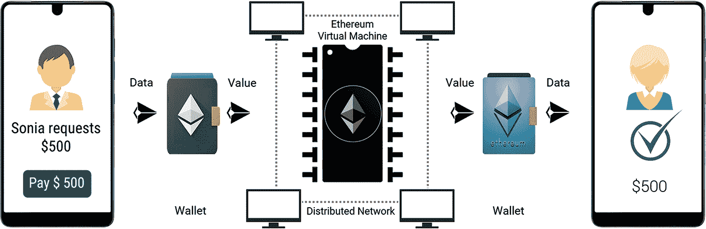
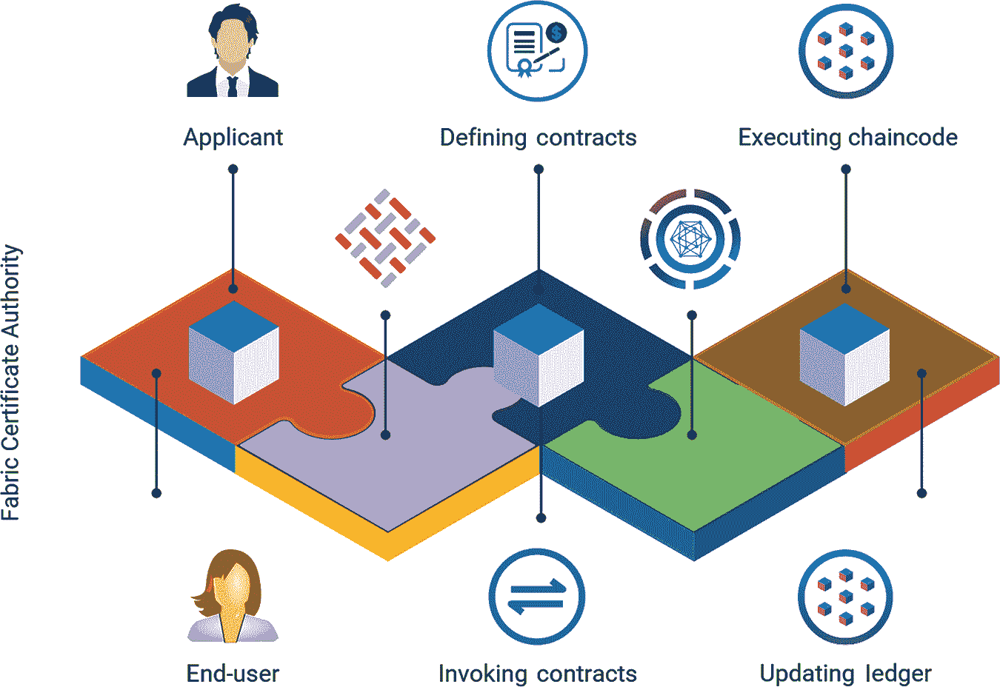
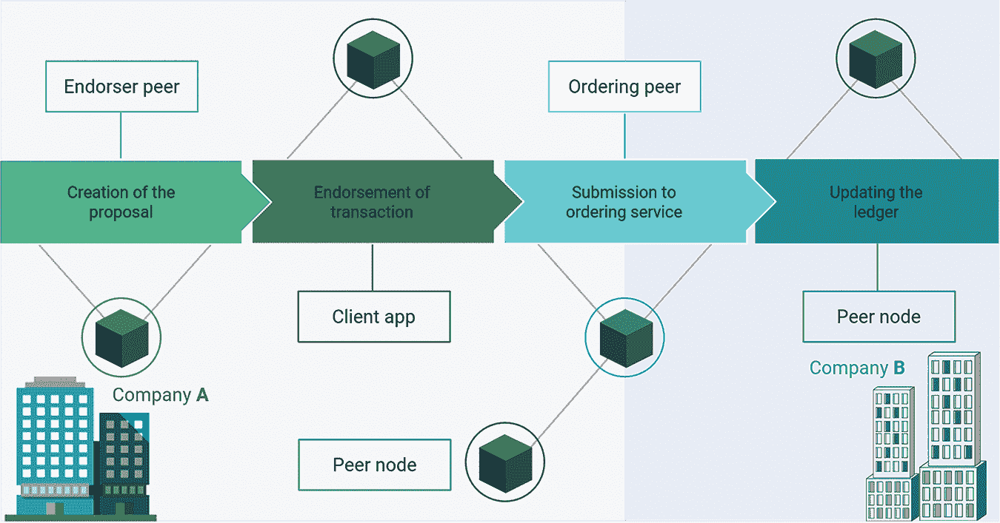
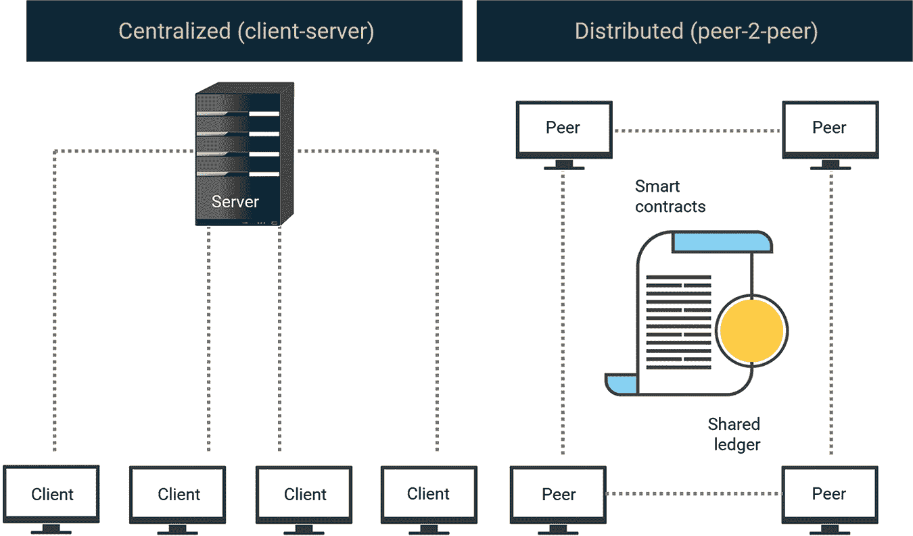

# 5

Ethereum 和 Hyperledger Fabric

Ethereum 是区块链的一个变种，由俄罗斯-加拿大开发者 Buterin（2014）和他的同事提出。比特币专注于去中心化支付，而 Buterin 和他的合作者则旨在通过在区块链上运行应用程序来改进去中心化金融系统，并解决比特币中存在的各种局限。他们提出了一个初步建议，建议用户或应用程序通过交易将任意计算机代码推送到区块链。这就是智能合约（或简称为合约）这个概念首次出现的方式。

因此，以太坊作为一套点对点网络系统，运行在一种去中心化平台上，名为区块链。它安全地执行和验证应用程序代码，这些代码迄今为止被称为智能合约，并允许区块链上的参与者之间进行交易，而无需可信赖的中心权威。交易通过用户创建的以太坊账户发送和接收。发送者签署每笔交易，并承担以太币（以太坊的原生加密货币）的费用，用于在网络上处理交易。交易记录是不可变的、可审核的，并且安全地分布在整个网络上，使参与者拥有交易数据的完全所有权和可见性。

但使以太坊对用户如此令人兴奋的是，其网络的能力不仅仅是处理金融交易。以太坊进一步增强了比特币区块链的优点，因为它允许开发者在区块链上运行代表去中心化应用程序或 dApps 核心逻辑的程序。

这样，以太坊网络比比特币区块链和派生的专用区块链提供了更加灵活的环境。它还可以处理智能合约，而无需创建任何特殊的区块链基础设施。与比特币和其他单一用途的区块链不同，以太坊解耦了智能合约层，现在该层运行在底层以太坊区块链之上，使得通过几行代码创建智能合约变得容易。

与其他加密货币一样，以太坊可用于在全球范围内发送和接收价值，而无需第三方参与存储数据、转移抵押品以及跟踪复杂的金融工具。以太坊还具有任何参与者都可以广播请求以执行其他网络参与者验证、验证和执行任意计算的功能。这导致以太坊虚拟机（EVM）的状态发生变化，该状态被提交并在网络上传播。所有节点共识生成的 EVM 状态存储在区块链上。加密机制确保所有交易均经过适当授权并已签署执行。

## 5.1 早期尝试编程加密货币

### Bitcoin Scripts

脚本可以被认为是区块链中业务逻辑层实现的一个初始概念。脚本曾是交易中的可选功能，用于限制特定目的的加密货币支出。后来，因为脚本操作码中的一个错误（如 OP _LSHIFT）而被移除。比特币脚本中的一些操作码示例见表（参见表 5.1 和 5.2）。

**表 5.1** 常数。

| **单词** | **操作码** | **十六进制** | **输入** | **输出** | **描述** |
| --- | --- | --- | --- | --- | --- |
| OP_0, OP_FALSE | 0 | 0x00 | 无。 | (空值) | 将空字节数组压入栈中。 (这不是无操作：一个项目被添加到栈中。) |
| N/A | 1-75 | 0x01–0x4b | (特殊) | 数据 | 下一个*操作码*字节是将要压入栈的数据 |
| OP_PUSH-DATA1 | 76 | 0x4c | (特殊) | 数据 | 下一个字节包含要压入栈的字节数。 |

**表 5.2** 流程控制。

| **单词** | **操作码** | **十六进制** | **输入** | **输出** | **描述** |
| --- | --- | --- | --- | --- | --- |
| OP_NOP | 97 | 0x61 | 无 | 无 | 什么都不做。 |
| OP_IF | 99 | 0x63 | 如果 [语句] [否则 [语句]]* 结束 if | 如果栈顶值不是 False，执行语句。移除栈顶值。 |
| OP_NOTIF | 100 | 0x64 | 如果 [语句] [否则 [语句]]* 结束 if | 如果栈顶值是 False，执行语句。移除栈顶值。 |

但埃里安，参与了此类项目一段时间，意识到这些比特币区块链的适应性是可行的，但既不够高效也不够灵活。随后，他提出了将智能合约功能与区块链功能解耦的想法，并开始了以太坊项目。

## 5.2 智能合约

智能合约是存储在区块链上特定地址的应用程序代码，该地址称为合约地址。应用程序可以调用智能合约函数，更改其状态，并发起交易。智能合约是用如 Solidity（类似于面向对象编程语言）和 Viper 等编程语言编写的。为了在任何硬件或软件中执行智能合约，需要一个抽象层。这由 EVM 提供，它将高级语言转换为 EVM 字节码。

智能合约通过在区块链上遵循计算机的简单“如果…那么”语句来满足条件，这些语句是预先编程的。这些条款可能包括支付、货物转让或在满足特定条件时发行发票。一旦交易完成，区块链更新后，交易就不能被更改。只有授权的方可以看到结果。

在实际操作中，参与者不是每次在 EVM 上请求计算时都编写新代码；相反，应用程序开发人员将可重用的代码片段上传到 EVM 存储，然后用户根据各种参数请求执行这些代码片段。

智能合约用于自动化常见的集中式过程，如数字资产的条件转移、多重签名资产交换，或等待特定时间执行交易。

智能合约由合约账户表示。这可以通过一个需要参与以太坊区块链的外部所有账户（EOA）来实现。邀请过程通过 EOA 发送的以以太币和燃料形式的事务完成。当事务的目标地址是智能合约时，在验证（如检查 nonce 组合和费用）和验证事务（参见表 5.3）后执行智能合约。

**表 5.3** 计算费用（以燃料点数计）。

| 序号 | 操作名称 | 燃料成本 |
| --- | --- | --- |
| 1. | 步骤 | 1 |
| 2. | 从内存加载 | 20 |
| 3. | 存储到内存 | 100 |
| 4. | 事务基本费用 | 21000 |
| 5. | 合约创建 | 53000 |

以太坊事务包含：

1.  以太（1 Ether = 10¹⁸ Wei）的数量

1.  STARTGAS（最大计算步骤）

1.  GASPRICE（每不同代码执行步骤的费用）

大约 21000 个燃料点数支付给矿工，用于将事务添加到区块。

注意：计算要求以燃料点数指定，因为它是加密货币的标准单位。与以太币不同，它的价值不会因市场波动而改变。

当智能合约的状态哈希和收据哈希改变时，以太坊区块链的状态也会改变。

像编程语言一样，Solidity 类包含变量的状态和访问公共变量的方法。在智能合约执行期间调用方法时，变量的值会改变，进而改变智能合约的状态。这种变化以状态哈希的形式记录。执行的最终结果以收据哈希的形式存储。以下示例展示了一个使用 Solidity 实现的智能合约。

```
pragma solidity >=0.8.4;
contract MyCoin {
  mapping (address => uint) balances;
  event Transfer(address indexed from, address indexed _to, uint256 _value);
  constructor() {
    balances[tx.origin] = 10000;
  }
  function sendCoin(address receiver, uint amount) public returns(bool success) {
    if (balances[msg.sender] < amount) return false;
    balances[msg.sender] -= amount;
    balances[receiver] += amount;
     emit Transfer(msg.sender, receiver, amount);
    return true; }
  function getBalance(address addr) public view returns(uint) {
    return balances[addr];
  }
}

```

给出的示例代表模拟的代币或硬币在区块链地址间转移。现在，让我们深入检查每个部分。

```
pragma solidity >=0.8.4;

```

Pragma 指令指定了可以用来编译合约的 Solidity 版本。如果有人用不在该范围内的任何版本编译合约，他将得到编译错误。

```
contract MyCoin {

```

MyCoin 是合约定义的名称，仅在其他合约的代码中用来指代这个合约。通过知道公共地址来调用合约，所以名称冲突是不可能的。

```
mapping (address => uint) balances;

```

映射是 Solidity 中的一个特定构造，它充当字典或哈希，用于键值对。地址是一种特定数据类型，表示公共地址，uint 是不带符号的整数。

```
event Transfer(address indexed _from, address indexed _to, uint256 _value);

```

转移是由合约产生的事件，其载荷包含所有者或发送者（from）、接收者（to）和值。由于合约在验证后异步并行运行，它们不发出任何反馈。模拟反应的一种方法是发出事件。这些交易记录在日志中，可以通过连接到网络的任何节点查询，或者通过附加到客户端库（这可能是一个选项）。

```
constructor() {
        balances[tx.origin] = 10000;
}

```

智能合约构造函数在部署到区块链上时只调用一次，并分配一个公共地址。它为合约所有者分配任意数量的代币。"tx"是一个隐含变量，提供了对当前交易信息的访问。

```
function sendCoin(address receiver, uint amount) public
returns(bool success) {
        if (balances[msg.sender] < amount) return false;
        balances[msg.sender] -= amount;
        balances[receiver] += amount;
        emit Transfer(msg.sender, receiver, amount);
        return true;
}

```

这个方法将代币从发送者的地址转移到接收者的地址。就像“tx”一样，“msg”是另一个变量，它提供了访问执行上下文的能力。这个实现会检查发送者余额中是否有代币可用，如果有代币，则相应地将它转移到接收者的地址。如果没有代币可用，它将返回 false 来完成交易。

```
function getBalance(address addr) public view
returns(uint) {
    return balances[addr];
}

```

getBalance 方法返回关联地址的余额。执行这个方法的节点只能查询账本，而不提交任何交易，因此不需要 gas。

## 5.3 以太坊的工作原理

当一个交易触发智能合同时，网络中的所有节点忠实地执行每个指令。为了实现这一点，以太坊通过一个单一的规范计算机 EVM 实现了一个执行生态系统。作为区块验证协议的一部分，网络中的所有节点操作 EVM（参见图 5.1）。在区块验证中，每个节点都需要验证他们需要验证的区块中列出的交易，并在 EVM 中运行由交易触发的计算机代码。网络上的所有节点执行相同的计算，以保持他们的账本同步。每个交易都包括一个 gas 限制和发送者自愿支付的交易费用。如果处理交易所需的总 gas 量小于或等于 gas 限制，则处理交易。否则，交易将被放弃，费用将损失。交易后未使用的 gas 余额以以太的形式退还给发送者。因此，为了安全的交易，最好比预期更高的 gas 限制。此外，价格越高，执行队列中验证交易的优先级越高。验证者当然更愿意选择那些支付更多费用的人。



**图 5.1** 以太坊的工作原理。

### 5.3.1 Gas

在执行代码行或分配存储空间时会消耗燃料。计算资源和存储资源都十分稀缺，并且都有其自身的成本。因此，在 EVM 上运行代码需要付出代价，这个代价以一个被称为“燃料”的单位来表示。燃料代表一个单位而非价格，它表示以太币的极小部分（Wei 或 10 的 18 次方）。因此，在以太坊上的每一个交易中，用户都必须支付燃料。发送者可以按照自己的意愿为每个交易设置燃料限制，表示他愿意为执行支付多少。如果交易的费用超过这个限制，交易将被放弃，代币将丢失。否则，余额将退还给发送者。

### 5.3.2 以太币

以太币的目的在于建立一个计算市场的经济激励机制，使参与者执行交易请求并提供计算资源给网络。广播交易需要支付一定数量的以太币，这些以太币最终会作为奖励发放给那些验证交易、执行交易、将交易提交到区块链并将其在网络上广播的人。

由于所有参与者都在不断被收费，这阻止了恶意参与者故意通过执行无限循环或资源密集型脚本来关闭网络，因为这样做会让他们钱包承受重负。

以太币和燃料是两个方面。以太币是一种具有内在价值的货币。另一方面，燃料是一种使用系统的不可避免成本。然而，拥有系统（燃料）的人可以将其与希望使用系统的人进行交易，交换相同的内在价值。如果用户偶尔没有燃料进行交易，他可以将周围的任何以太币转换为燃料。这就是以太币市场和燃料市场之所以不同的原因。一个的价格可以波动而不会影响另一个的价格。

## 5.4 超级账本

超级账本（HPL）是一个由 Linux 基金会管理的开源私有平台，旨在构建具有模块化架构的分布式账本解决方案，提供高度的隐私性、弹性和可扩展性。

## 5.5 超级账本的工作原理

### 5.5.1 组件

超级账本 Fabric 是一个企业级的私有区块链网络，各种商业组织——如银行、企业机构或贸易公司——在此相互交易以实现其商业目标。

每个组织都有一个基于其基础的超级账本证书权威，根据该权威将其识别为成员。超级账本中的每个成员可以建立一个或多个授权节点参与网络，使用自己的超级账本证书权威。

有一个与网络连接的客户端应用程序，是用特定编程语言的软件开发工具包（SDK）编写的。

### 5.5.2 工作流程

超级账本中的每个交易都按照以下步骤进行：

#### 5.5.2.1 提案

交易是由通过成员组织客户端应用程序或门户提供或调用交易请求发起的。然后客户端应用程序将接收到的提案发送到每个组织的 peer 以供背书。

#### 5.5.2.2 背书

在联系每个组织的 peer 以背书提案后，该 peer 会检查请求成员的 Hyperledger 证书权威和其他用于验证交易的详细信息。然后执行链码（用支持的语言如 Go 或 Java 编写的一段代码），并返回一个响应。这个响应表示以下交易的接受或拒绝。这个响应被发送到客户端。

#### 5.5.2.3 传输到排序服务

在接收到背书输出后，客户端应用程序会将已批准的交易传输到排序服务。负责排序服务的对等节点会将交易包含在特定区块中，并将其发送到网络各个成员的 peer 节点。

#### 5.5.2.4 更新账本

在接收到特定区块后，各组织的 peer 节点会用这个区块更新它们的本地区账本，从而提交新交易（参见 图 5.2）。



**图 5.2** Hyperledger Fabric 的工作原理。

### 5.5.3 Hyperledger Fabric 的工业应用

Hyperledger 区块链是领先的开放源代码区块链技术之一，它提供了企业级区块链部署的工具和框架。它确保了在政府实施各种行政流程时有一个可靠的系统，该系统可以根据需要进行扩展，同时不牺牲安全和透明度。

Fabric 为联邦计划的行政操作提供了一个受许可的区块链。如果政府希望，它还可以为数字身份创建模块并将人们连接到系统中。作为一个许可网络，它还可能提供一个会员识别服务，该服务可用于验证和管理网络参与者的数字身份。

#### 5.5.3.1 生产

生产是 Hyperledger Fabric 的顶级应用之一。最终组装者可以使用 Fabric 创建一个供应链网络，这将成为零件供应商和制造商之间的绝佳媒介，以跟上需求和供应。使用 Fabric 意味着系统更具响应性，因此，在制造业中，区块链具有改变当前格局的巨大潜力。

此外，参与各方使用标准协议意味着他们都要遵循相同的规则和规定，从而形成一种标准化的方法。

#### 5.5.3.2 B2B 合同

在企业对企业（B2B）合同中，双方在一个相互信任的环境中自动化合同。为了确保双方隐私和安全得到维护，超级账本 Fabric 提供了一种权限化的方式来管理合同。因此，敏感的业务信息不会与账本上除这两方之外的任何人共享。这样 B2B 合同可以确保保护来自账本上外部方的敏感信息（参见图 5.3）。



**图 5.3** HPL 的 B2B 工作方式

当涉及到使合同可追溯至账户中的各方时，这尤为有用。这样，各方可以仔细审查合同并相应出价。超级账本 Fabric 确保方法标准化，出价者可以找到并无需直接与另一方企业互动就可以出价竞标合同。

#### 5.5.3.3 供应链

供应链可以是特定产品的全球或区域性制造商、供应商和零售商网络。超级账本 Fabric 网络通过降低假冒交易的风险，可以提高 Fabric 内交易的清晰度和可追溯性。在 Fabric 网络中，持有访问账本权限的企业可以查看过去交易的数据。通过在账本中更新实时生产、交易和运输状态，可以非常快速、简单且高效地跟踪产品状态。

超级账本 Fabric 可以通过管理所有方面，如原材料投入和追踪来源、制造遥测、货物来源和仓储以及成品的运输，来维护供应链网络中所有参与者的不可变跟踪记录。

#### 5.5.3.4 资产存档

超级账本 Fabric 的另一个用例是资产存档，其中资产可以在区块链网络上进行数字化。

这样，所有利益相关者都可以直接访问资产，在没有中介的情况下使用它进行交易并与市场实时互动。此外，企业或利益相关者可以通过向存储的资产添加业务规则来降低运营成本。

超级账本 Fabric 为公司、利益相关者和最终用户提供了将一种资产类型转换为另一种资产类型的能力，其中一方拥有某种资产类型，而另一方不接受它。

#### 5.5.3.5 交易和资产转移

交易和资产转移是在像进口商、出口商、银行、经纪人等组织或成员之间执行的，这些组织或成员协同工作。超级账本 Fabric 可以用一个由可信机构签署的文件代替纸质文件，为交易添加一层信任。它还提高了系统性能。

超级账本 Fabric 使交易者或利益相关者能够直接访问他们的金融证券并随时进行交易。另一个优点是，在区块链网络上，资产可以借助超级账本 Fabric 进行数字化。

#### 5.5.3.6 保险

保险行业中欺诈和诈骗行为屡见不鲜。该行业每年要花费数十亿美元来揭露保险欺诈和虚假索赔。通过使用 Hyperledger Fabric 这样的私有区块链，可以简化 KYC 流程和验证。此外，保险公司还可以参考存储在账本中的交易数据。Hyperledger Fabric 可以使用链上代码加速索赔处理和自动化支付，进一步自动化向被保险人支付错误款项的回收流程。此流程还将有助于处理多方结算索赔。

#### 5.5.3.7 房地产

房地产是另一个可以利用 Hyperledger Fabric 增加市场流动性的行业。实际上，市场由于市场波动性变得成为一个大问题。市场仅限于高端买家的接触范围，使得中产阶级市民难以承受。

区块链的使用可以在房地产行业带来巨大的变化。通过使用 Fabric，房地产可以提供碎片化所有权，这是投资这个行业的好方法。此外，它还可以无需任何压缩过程流线化国际房地产交易。

### 5.5.4 Hyperledger Fabric 的好处

#### 5.5.4.1 开源

Hyperledger Fabric 是由 Linux 基金会托管的一个开源区块链框架，由一个活跃的开发者社区设计，以使代码公开可用。社区中任何有兴趣或专长于编程的参与者都可以帮助开发源代码。世界上任何人都可审计、开发、修改或以他认为合适的方式分发代码。

#### 5.5.4.2 私有和保密

在公共区块链网络中，网络中的每个节点都会接收到账本的完整副本。因此，保持保密性成为一个非常严重的问题，因为一切对所有人都是开放的。作为一个公共区块链，所有参与成员的身份没有得到认证。但 Hyperledger Fabric 并非如此。所有参与成员的身份都经过验证，且账本仅对认证成员开放。在银行、保险等需要保护客户数据的行业级别案例中，这更具优势。

#### 5.5.4.3 访问控制

Hyperledger Fabric 在物理区块链网络之上提供了一个虚拟区块链网络，从而实现了数据的可访问和控制。它有自己的访问规则和交易排序机制。这些作为访问控制的附加工具，有助于使数据私有，隐藏信息竞争对手，或限制合作伙伴之间的数据广播。

#### 5.5.4.4 Chaincode 功能

Chaincode 使用容器技术来托管应用程序代码或智能合约，这些定义了系统的业务规则。它容纳了经济中的复杂性，并支持各种可插拔组件。

#### 5.5.4.5 性能

Hyperledger Fabric 是一个私有区块链网络，因此交易无需验证即可快速执行。它还提供了并行性和并发性，因为交易是独立于交易提交和排序执行的。

#### 5.5.4.6 模块化设计

Hyperledger Fabric 的模块化架构使其能够与其他系统一起使用，并随着时间的推移修改其功能。

## 5.6 以太坊对比 Hyperledger

以太坊和 Hyperledger 之间的关键区别如下：

### 5.6.1 目的

+   以太坊是一个构建 B2C 业务和去中心化应用的平台，旨在在 EVM 上运行智能合约。有了以太坊，可以为大众消费创建去中心化应用。

+   Hyperledger Fabric 由 Linux 基金会管理。Hyperledger 旨在构建 B2B 和跨行业应用。它帮助企业或行业与开发者合作，后者与分布式账本技术（DLT）合作。这使得可以创建具有有限访问权限的定制区块链应用。

### 5.6.2 加密货币

+   以太坊有自己的原生加密货币，称为以太坊（ETH）。任何参与节点都可以通过支付燃料费来挖掘 ETH。

+   Hyperledger 没有任何可以参与挖掘的加密货币。

### 5.6.3 参与

+   以太坊是一个公共（无需许可）网络，任何能访问互联网的人都可以下载软件并开始挖掘。

+   Hyperledger 是一个有限参与网络，只有经过授权成员选定的授权成员和参与者才能访问 Hyperledger 平台及其工具。它保护其宝贵且保密的信息，不允许任何篡改。

### 5.6.4 隐私

+   以太坊是一个公共网络，其中所有交易都是绝对透明的。任何能访问互联网的人都可以查看这些交易。

+   Hyperledger 是一个受许可和有限访问的区块链网络，只有持有授权证书的组织或个人才能查看网络上的交易。它非常安全且保密。

### 5.6.5 治理

+   以太坊网络只由以太坊开发者管理。这是一个内部开发的产品，而不是合作的产物。

+   Hyperledger Fabric 是 Linux 基金会和 IBM 成功合作的产物。

### 5.6.6 计算机代码

+   以太坊经常使用 Solidity 来编写智能合约，而像 JavaScript、Python、Golang 这样的高级语言则用于开发应用。

+   广泛使用 Go 来编写链码，在 Hyperledger 中在一定程度上使用 Java 和 JavaScript。

### 5.6.7 智能合约

+   以太坊智能合约是一组用编程语言编写的条件，当满足某些条件时会自动启动实施。它是不可逆的，一旦创建，任何第三方都无法更改。它管理着在合同下两方或更多方之间的数字资产转移。

+   与智能合约一样，超级账本 Fabric 也允许成员组织在创建特定状态交易的 peers 上运行一些代码。这些被称为链码（Chaincodes）。

### 5.6.8 共识机制

+   以太坊作为一个去中心化网络，拥有工作量证明（PoW）机制或共识机制，该机制贯穿整个区块链。这使得所有参与去中心化网络的节点能够对某些参数，如账户余额、交易顺序等达成共识，防止参与者进行虚假交易或双重花费货币。

+   超级账本作为一个私有和许可的网络，不需要任何 PoW 或共识机制来验证交易。如果两个参与方对某笔交易达成一致，第三方不能查看或干预这笔交易。这提高了系统的可扩展性、交易速率以及网络的整体性能。

### 5.6.9 交易速率

+   作为公共领域的以太坊，其庞大的 PoW 机制减慢了其交易速度。它几乎只能处理每秒 20 笔交易。

+   作为一个许可型区块链网络，超级账本 Fabric 不需要像以太坊那样沉重的 PoW 机制。凭借这一点，交易速度可以达到约 2,000 笔/秒，远高于以太坊。

### 5.6.10 应用案例

+   以太坊智能合约可以公开使用，或用于 B2C，当开发者或开发组织意图构建面向客户使用的去中心化应用。借助以太坊网络，任何可访问互联网的人都可以创建一个节点，并且每个这样的节点都拥有区块链的完整副本。全球各地的区块链开发者社区开发的、托管的去中心化开源应用可以使用以太坊创建。这样的应用不需要任何保密性。

+   企业，比如私企或者 B2B 企业，如果不想将机密数据保存在如以太坊这样的公有区块链上，可以采用超级账本作为许可型区块链网络。它能够完全保障组织信息的安全和保密。超级账本的灵活性可以证明是一个异常有用的工具，当一个组织或企业需要定义自己的定制化区块链算法时。在超级账本项目中，整个区块链的基础设施都可以被修改，以创建面向商业用途的定制化区块链应用。

## 5.7 去中心化应用

在集中式方案中，应用软件位于一个或多个中心位置，这取决于安装的客户端基数大小。在分布式方案中，应用软件位于每个客户端机器上（见图 5.4）。



**图 5.4** 集中式与分布式系统比较。

去中心化应用（dApps）解决了需要区块链服务和区块链基础设施的问题（Garg，2021）。dApps 包括前端、区块链后端和中间件，即连接两者的代码。dApp 前端用于实现智能合约上的功能/方法，进而改变智能合约的状态。前端可以是一个复杂的网页应用或移动应用，可以采用诸如 HTML、CSS 和 React 之类的 JavaScript 框架的技术。它可以被看作是一个带有与 web3.js 脚本通信的嵌入式网页客户端。代币用于维护 dApp 的标准。

### 5.7.1 dApp 的优点

#### 5.7.1.1 零停机

依赖于点对点系统确保即使个别计算机或网络的部分出现故障，dApps 仍然可以继续运行。一旦智能合约部署在区块链上，合约将默认执行。这禁止恶意行为者针对个别 dApp 发起拒绝服务（DoS）攻击。

#### 5.7.1.2 隐私

部署或与 dApp 互动无需进行真实世界的身份验证。

#### 5.7.1.3 抵抗审查

具有单一故障点，政府或强大个体很难控制网络。网络上的任何实体都无法阻止用户提交交易、部署 dApps 或从区块链中读取数据。

#### 5.7.1.4 绝对数据完整性

存储在区块链上的数据是固化的且加密的。一旦添加到区块链中，它就不能被更改。

### 5.7.2 dApp 的缺点

尽管去中心化应用（dApps）承诺解决传统应用面临的大部分主要问题，但它们也存在一些小故障。

#### 5.7.2.1 维护

dApp 可能难以维护，因为一旦部署，开发者就无法更新他们的 dApp（或 dApp 存储的底层数据）。如果之前版本中引入了错误或漏洞，即使确定了问题，也很难解决。

#### 5.7.2.2 性能开销

扩容是一个严重的问题，面临着巨大的性能开销。为了达到以太坊寻求的安全性、完整性、透明性和可靠性水平，每个节点都必须运行和存储每一笔交易。此外，工作量证明（proof-of-work）也需要时间。

#### 5.7.2.3 网络拥堵

当 dApp 使用大量的计算资源时，整个网络都会陷入困境。目前，网络每秒只能处理大约 10 到 15 笔交易；也就是说，如果交易速度超过这个限制，未确认交易池会迅速增长。

#### 5.7.2.4 用户体验

由于网络效应，dApps 经常面临用户数量少的问题，这使得它们交互性较低。它也可能使它们不那么安全，因为 dApp 的安全性往往取决于它有多少用户。

#### 5.7.2.5 中心化

建立在以太坊基础层之上的用户友好和开发者友好的解决方案类似于中心化服务。中心化可能会抵消区块链的优势。

## 5.8 代币

在以太坊系统中，代币代表各种数字资产，如优惠券、借条，甚至是现实世界的有形物体。本质上，以太坊代币是使用以太坊区块链的智慧合约。

代币可以分为两种类型——同质化或非同质化。同质化代币具有相等的价值，可以相互交换。ERC20 指南被认为是可交换代币的标准，例如——投票代币、质押代币或虚拟货币（Garg, 2022）。非同质化代币的标准继承自 ERC721 指南，例如，艺术品或歌曲的权利。ERC-777 允许在代币之上增加额外功能，例如混合器合同以提高交易隐私性，或紧急恢复功能以防止私钥丢失。ERC-1155 允许更高效的交易和交易捆绑。这个代币允许创建标准功能代币（如$BNB 或$BAT）和非同质化代币，如 Cryptopunk。

基于以太坊的去中心化应用，如 Augur 和 Grid+，在市场预测和解决电力使用支付方面的争议中大量使用代币。

以太坊还允许创建独特且不可分割的代币，称为非同质化代币（NFTs）。它们的所有权信息记录并维护在区块链网络上。这些是独特且不可分割的代币，用于证明稀有资产的来源，无论这些资产是数字的还是物质的，例如，代表收藏品、数字艺术、体育纪念品、虚拟地产和游戏内的物品。随着越来越多的公司寻求将资产代币化并提供关于其资产的防篡改血统信息，NFTs 越来越受欢迎。

### 即将呈现

在后续章节中，我们将探讨基于以太坊的智能合约和代币的具体应用场景，包括身份管理、网络安全、银行、金融等。个人身份对于任何个人、公共机构或企业都是一种前提。一个复杂的识别系统使得企业能够在现实世界中进行数字交易。带着这样的理念，接下来的章节将重点关注一个系统的开发，该系统不仅允许身份数字化、通用和多用途，而且还确保了个人敏感信息的隐私和安全。

## 参考文献

1.  Buterin V, 2015. **下一代智能合约与去中心化应用平台**。白皮书，第 1-36 页。[`blockchainlab.com/pdf/Ethereum_white_paper-a_next_generation_smart_contract_and_decentralized_application_platform-vitalik-buterin.pdf`](https://blockchainlab.com/pdf/Ethereum_white_paper-a_next_generation_smart_contract_and_decentralized_application_platform-vitalik-buterin.pdf) 访问日期：2020 年 6 月 3 日。

1.  Garg R, 2021. **基于区块链的多行政域网络的去中心化应用**。印度比拉尼·基兰·比尔拉戈阿校区，1-69 页。DOI：10.13140/RG.2.2.29003.87845。[`www.researchgate.net/publication/351871690_Blockchain_based_Decentralized_Applications_for_Multiple_Administrative_Domain_Networking`](https://www.researchgate.net/publication/351871690_Blockchain_based_Decentralized_Applications_for_Multiple_Administrative_Domain_Networking)。

1.  Garg R, 2022. **身份管理的分布式生态系统**。《区块链研究杂志》，1（1）（待发表）。
