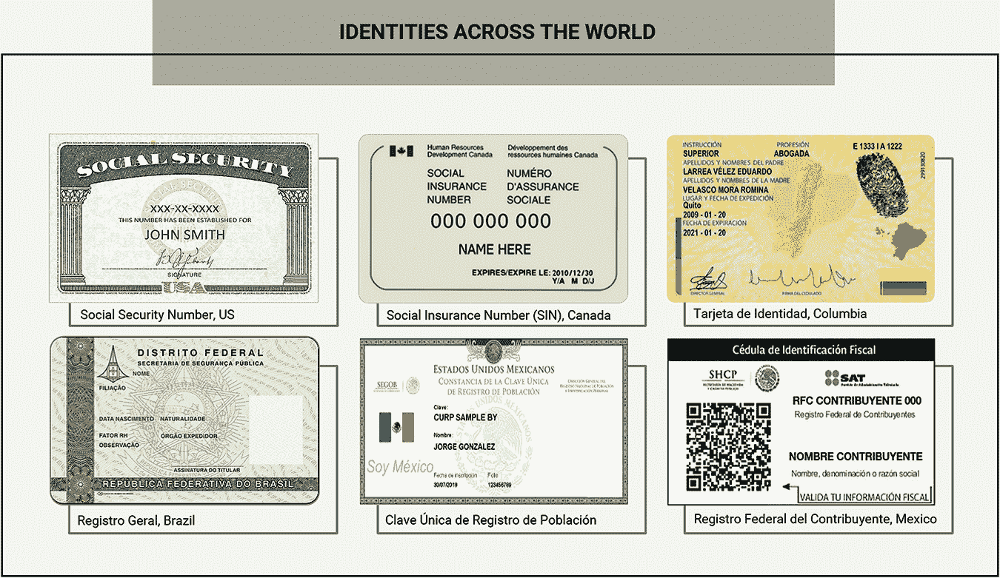
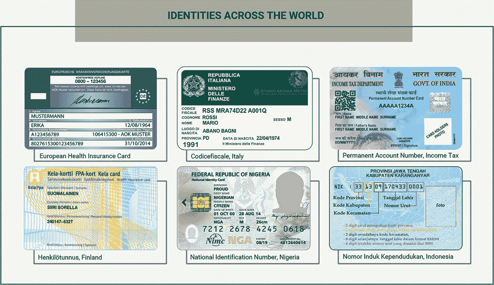
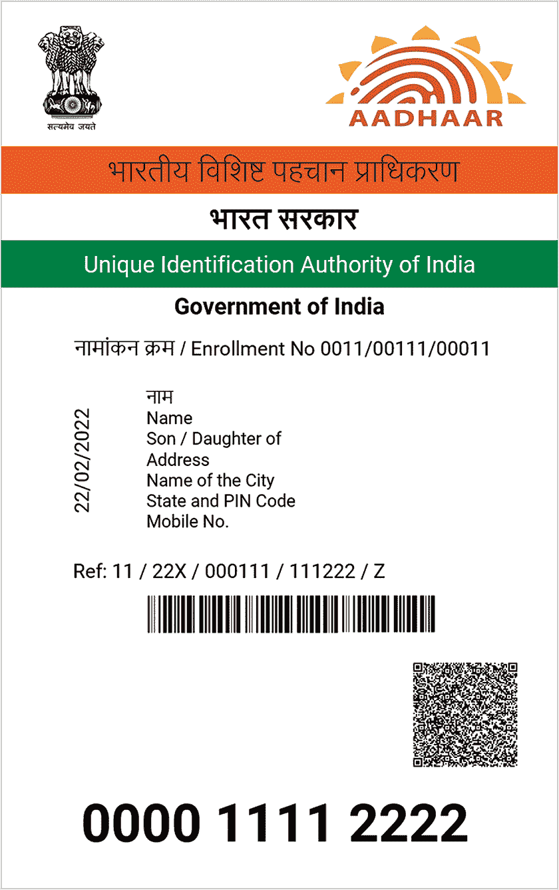
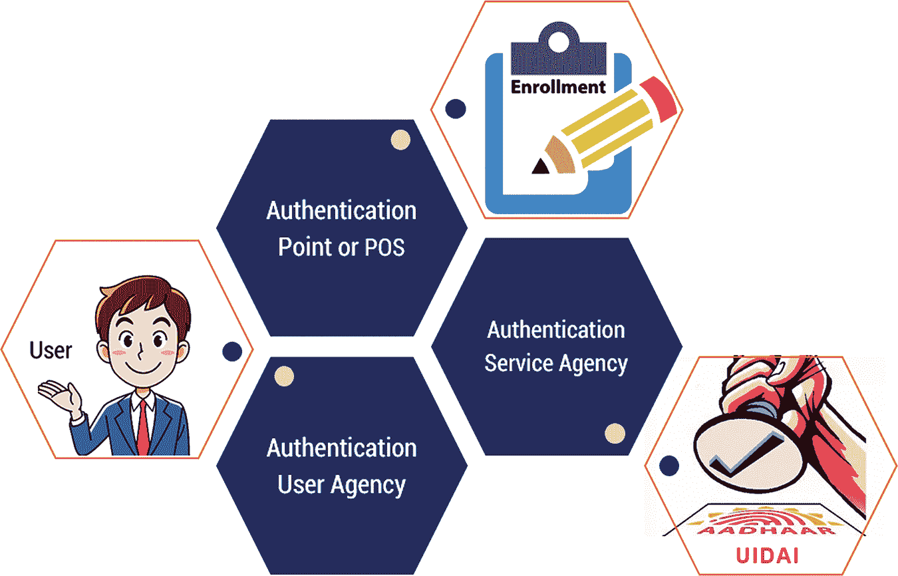
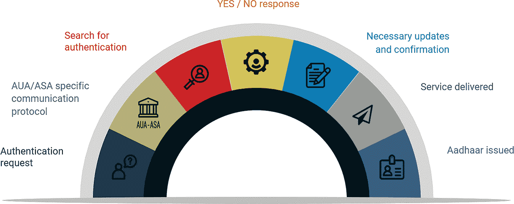
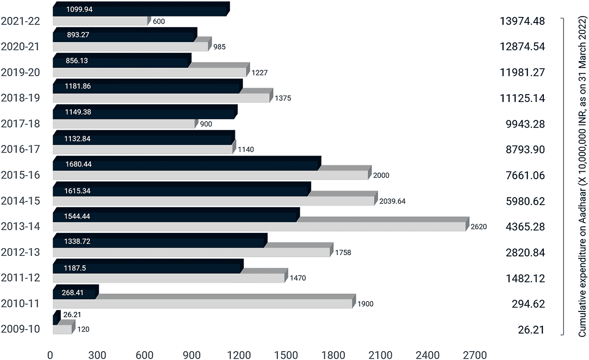
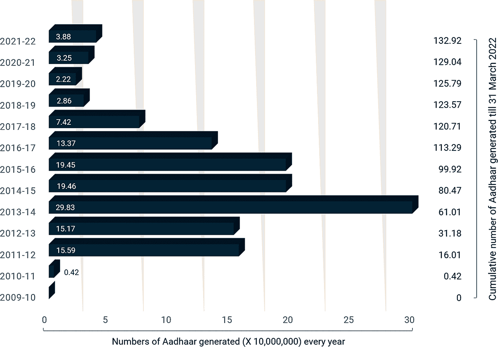
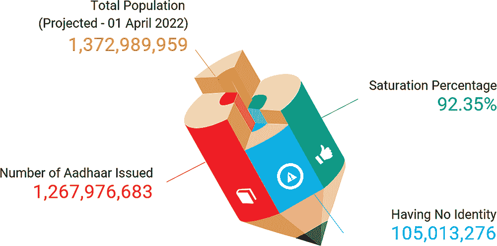
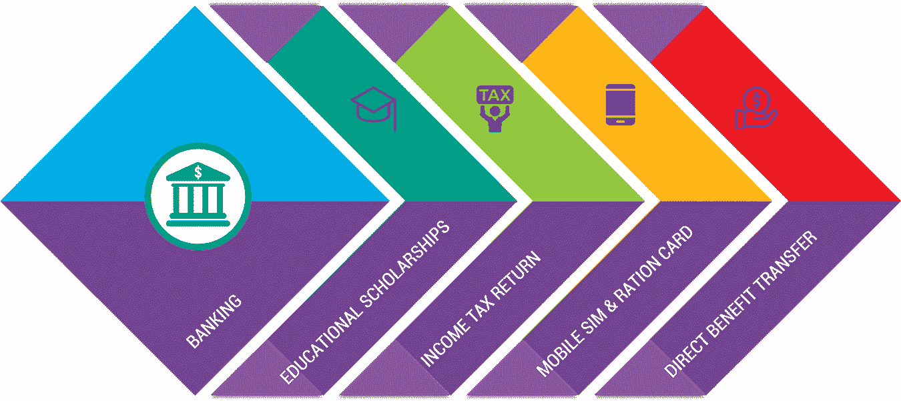

# 6

身份作为现实世界的万能药

身份使个人能在文明社会中公平公正地行使他的权利和责任。它提供了接受教育、医疗服务、商业活动、养老金、银行业务、社会福利和福利计划的机会。通过注册，政府可以准确获得人口数据，以便进行精细规划和政策准备。

使用纸质文件来确立用户身份既繁琐又存在数据丢失的高风险。相比之下，先进的电子数据捕获和存储已被发现可以降低成本以及减少人为错误，并提高行政效率（世界银行，2020 年）。公民数字注册和身份识别系统的核心思想是将一个随机生成的唯一识别号码与身份关联，同时将所有相关详细信息保存在一个安全且分布式的数据库中。

然而，在各种物理和地理障碍之间注册人口并实现全面覆盖极其困难。因此，仍有超过十亿人，包括 2100 万难民，无法获得授权的身份证明，这可能是因为费用过高、间接成本、中介以及程序复杂。

## 6.1 身份系统

在全球范围内，居民拥有多种形式的身份证件，用于特定目的，如选举用的选民卡、驾驶执照、出国旅行用的护照，或者记录受保工资或自雇收入的社安号码（Garg, 2016）。这种制度可以追溯到 1803 年，当时拿破仑·波拿巴推出了世界上第一个身份系统。

当代身份证时代始于二战（参见图 6.1）。1938 年，英国通过了国民登记法案，要求所有居民持有身份证（Whitley 和 Hosein，2009）。1940 年，法国维希政府与希腊和波兰建立了一个身份证系统，该系统或多或少一直保留至今。除了少数例外，世界上几乎没有任何一个普通法国家采用了和平时期的身份识别系统。

**图 6.1** 世界各地的纸质身份证。

二战后，亚洲地区普遍开始采用身份证，香港政府于 1949 年推出身份证，以防止来自中国大陆的移民，并加强其主权。台湾在 1949 年、韩国和新加坡在 20 世纪 60 年代也纷纷效仿，借口是经济转型。

### 6.1.1 当代身份证系统

在美国，所有年满 18 岁的美国公民、永久居民和临时居民都会发放一个九位数的社安号码（SSN）（见图 6.2）。尽管它最初是为了社会安全目的而用来标识个人，但现在也用于税收目的跟踪个人。实际上，由于其广泛的应用，如开设银行账户或申请驾驶执照，它已经成为事实上的国家标准编号。

**图 6.2** 全球数字身份——南北美洲。

加拿大引入了社会保险号码，但在 2004 年个人信息保护与电子文档法实施后，该号码终止，并成为真正的身份证号码。

在欧洲经济区以及瑞士，欧洲健康保险卡是为了医疗保健目的而发行的。这张卡上有一个名为识别号码的代码。在芬兰，自 1964 年以来，个人识别代码（henkilotunnas，HETU 或瑞典语 Personbeteckning）一直很流行，用于政府和企业交易中识别公民。

在法国，起源于维希政府的 INSEE 代码用于身份证明、社会保险、就业和税收目的。在德国，截至 2007 年，只有社会保险公司维护的分散数据库，为几乎每个人分配了一个社会保险号码。2008 年以后，原来的税务文件号码被新的纳税人识别号码（Steuerliche Identifikationsnummer 或 Steuer-IdNr）所取代。同时既是雇员又是自雇者的个人可以获得两个纳税人识别号码。组织的相应号码由联邦中央税务局发行，称为 Wirtschafts-Identifikationsnummer。

在意大利，出生时会发放一个金融代码（Codicefiscale），格式为 SSSNNYYMDDZZZZX（见图 6.3）。SSS 是姓氏的前三个辅音字母（如果不够辅音则用第一个元音，然后用 X）；NNN 是名字，使用第一个、第三个和第四个辅音字母。YY 是出生年份的最后两位数字，M 是出生月份的字母，DD 是出生日期。ZZZZ 是出生地市镇的特定区域代码；X 是一个通过将偶数和奇数位置的字母相加计算出的校验字符。月份的字母按字母顺序使用，但只使用 A 到 E、H、L、M、P 和 R 到 T（因此，一月是 A，十月是 R）。为了区分性别，女性的出生日期的数字要加上 40；对于外国人，则使用全国代码代替市镇代码。

**图 6.3** 全球数字身份——欧洲、亚洲和非洲。

冈比亚和尼日利亚分别为其公民分配了 11 位数的身份号码，称为国家身份号码（国家身份管理委员会（NIMC），2012 年）。

在中国人民共和国内，16 岁以上所有公民必须持有 18 位数的身份证，格式为 RRRRRRRYYYMMDDSSSC。RRRRRR 是出生地或城市的标准行政区划代码；YYYYMMDD 是持有人的出生日期；SSS 是为了区分出生日期和出生地相同的人而设定的顺序代码（Shaw，1996；Perry，1997）。顺序代码奇数表示男性，偶数表示女性。

自 2012 年起，印度尼西亚推出了带有电子签名、虹膜扫描、十指指纹扫描和高分辨率护照的 16 位 RFID 卡，名为 e-KTP（电子居民卡）。该计划是基于印度的 UIDAI 设计的。

在印度，到目前为止已经推出并取消了无数的身份证，导致公民处于不确定和混乱的状态（Garg，2017，2019）。这些包括照片身份证、执照、许可证、注册证书和文件，它们基本上是各种机构提供服务的衍生品，如印度选举委员会发行的 EPIC。

选举人照片身份卡（俗称 EPIC 或选民 ID），于 1993 年实施，旨在为选举过程带来透明度，并在选举日当天便于识别选民。到目前为止，全国已有超过 4.5 亿选民持有选民身份卡。EPIC 还作为开立银行账户、在线预订旅行以及预订住宿的身份和地址证明。然而，由于其运营范围有限，它未能成为一本多用途的国民身份证。

截至目前，已有超过一百种身份文件可用于进行交易和接收政府福利，代替任何国民身份证（Garg，2021a），例如：

+   印度护照

+   海外护照

+   由 ECI 发行的选举照片身份卡（EPIC）

+   印度海外公民（OCI）

+   印度裔人士卡（PIOC）

+   永久账户号码（PAN），由税务部门颁发

+   驾驶执照，由各州颁发

获取这些文件不仅仅是关于获取文件的问题；由于这些文件需要定期更新，过程变得更加复杂，长时间的队伍、繁琐的程序、大量的正式手续以及代理人和中介的干预（Garg，2021b）。

即使在在线过程中，每个电子网站在流量大和服务器问题中都会生成和需要一个新的用户名和密码，以及随机的验证码。这就是在线流程本应简化事物，但实际上使事物更加繁琐的方式。政府官员也因处理大量申请而陷入困境。

对这些文档的每一级验证都是另一个繁琐的练习。平均印度人必须携带至少三到五种不同的文件来证明他的身份。现有身份证的限制是它们只服务于不同且有限的用途。此外，在不同存储库中找到公民档案的矛盾并不罕见，导致混淆和错误（Garg, 2021c）。

为了满足不同身份证的需求，爱沙尼亚开发了世界上最先进的国民身份识别系统。它替代了旅行证件、医疗令牌和银行账户。新加坡是另一个遵循国家数字身份（NDI）系统的国家。从 2020 年起，NDI 预计将与 SingPass —— 新加坡的在线账户管理一起，通过公民的智能手机，访问数百项数字政府服务（Govtech, 2022）。

## 6.2 集中式模型

### 6.2.1 世界最大生物特征身份识别系统——Aadhaar 的案例研究

十多年来，印度一直在努力为所有公民提供官方身份。2006 年首次提出了普遍身份的概念，主要目标是为印度的每一位居民提供一个生物特征启用的唯一编号。印度独特识别局（UIDAI）的旗舰项目，广为人知的 Aadhaar，过去十年一直在流行。这是世界上最大的生物特征识别计划，UIDAI 代表印度政府发放 12 位个人身份号码。政府认为 Aadhaar 卡是更好的治理工具，因为每个 Aadhaar 号码对一个人来说都是独一无二的，并且直到死亡有效。它的目标是：

+   通过更有效的公共服务和私人服务交付实现社会包容；

+   减少伪装和假身份的数量；

+   促进直接利益转移。

Aadhaar 的构想是为了为那些没有个人身份或有多重身份的居民提供一个身份。基本想法是创建一个可追踪且不易被滥用的超级身份。政府提出了建立一个由 UIDAI 监控的单一生物特征识别系统，可能允许印度居民访问公共服务。

2010 年，印度国家身份认证局（NIAI）成立，旨在向印度所有居民以及某些其他类别的个体发放唯一身份编号——Aadhaar。NIAI 法案没有定义某些其他人员，但规定中央政府可以随时通知这类其他类别的人员，他们可能拥有 Aadhaar 号码。收集的信息将存储在中央身份数据仓库（CIDR）中，用于提供认证服务。

#### 6.2.1.1 Aadhaar 的显著特点

UIDAI 草案（UIDAI，2009 年）中提到的 Aadhaar 项目的某些显著特点如下：

+   UID，一个随机生成的数字，没有智能，将用于减少欺诈的可能性，但不会表明公民身份。

+   UID 号码的注册过程将是自愿的，居民需提供人口统计和生物识别信息。

+   UIDAI 只会向个体发放可以印在像 PAN 卡或选民身份证上的数字。这个数字直到死亡都会保持不变。

+   为了防止欺诈，UIDAI 将在 UID 注册过程中设置了解你的居民（KYR）参数。

+   UIDAI 将建立一个中央身份数据仓库（CIDR）并确保核心服务，如存储、验证、身份认证和修改与 UID 关联的居民数据。

+   为了加快注册过程，UIDAI 计划与全国现有的政府和非政府机构合作，并利用他们的基础设施处理 UID 申请，连接 CIDR 数据库进行验证和去重，最后接收 UID 号码。

##### 6.2.1.2 生物识别和人口统计标准

Aadhaar 使用的数据包括生物识别和人口统计信息（Sharma 和 Kumar，2013）。

a) 人口统计信息

UIDAI 为 Aadhaar 收集以下人口统计详情（i-Government Bureau，2009 年）：

+   个人详情

+   地址详情

+   父母详情

+   介绍人详情

+   联系详情（见图 6.4）

**图 6.4** Aadhaar——基于生物识别和人口统计数据的身份。

b) 生物识别

UIDAI 基于三种不同生物识别数据采用了多模态生物识别系统：（i）十个指纹；（ii）虹膜扫描；（iii）每个个体的面部识别（见表 6.1；Li 和 Jain，2011）。多模态系统允许整合两种或更多类型的生物识别和验证，以满足严格的性能要求。它有助于克服单一生物识别系统带来的限制，如角质层指纹或由于环境光线变化导致的面部检测问题（Kant，Nath 和 Chaudhary，2008）。

**表 6.1** UIDAI 收集的人口统计和生物识别详情。

| 人口统计信息 | 姓名、地址（永久和临时）、出生日期/年龄、性别、手机号码、电子邮件地址、婚姻状况、父母 UID 号码（成人居民可选），以及信息共享同意书。 |
| --- | --- |
| 生物识别信息 | 通过照片的虹膜、指纹和面部身份 |

c) 支持文件

为了验证居民提交的信息，采用了三种不同的验证方法（Dass 和 Bajaj，2008）：

+   支持文件

+   个人介绍人

+   国家人口登记册（NPR）

##### 6.2.1.3 注册设置

6.2.1.4 实体及其角色

    

**图 6.5** 参与 UID 项目的实体。

    |

###### 唯一身份识别项目包括 UIDAI、注册站和中央身份数据仓库（CIDR）等独特实体，它们共存并紧密协作。UIDAI 还从各种政府和非政府组织中任命了多个认证服务机构和认证用户机构（ASA 和 AUA）。

    |

**表 6.2** UID 周期中不同实体及其作用。

|     | **实体** | **功能** |
| --- | --- | --- |
| 从 Aadhaar 持有者那里收集个人身份数据。 |
|     注册站 |

+       |

    |

|     | 认证点或销售点（PoS） |
| --- | --- |

+   标准注册架构包括注册机构和注册站点的网络。注册机构是 UIDAI 授权的单位，用于注册个人，反过来，它指定了负责在注册过程中收集生物识别和人口统计信息的注册站点。后者通过涉及认证的操作员/监督员来完成任务（见图 6.5）。

    认证服务机构（ASA）|

    |

+       捕捉个人的生物识别和人口统计细节，用于在 Aadhaar 数据库中注册。

|

|     | 用户 |
| --- | --- |

+       提供基本的身份识别和认证服务。

    |

| 以下表格（见表 6.2）描述了关键因素及其相互关联的方式。 |
| --- |

+   代表一个或多个 AUA，根据与 UIDAI 的正式债券，传输认证请求。

    |

|     认证用户机构（AUA） |
| --- |

+       提供认证服务给用户。

    |

    |

+   连接到 CIDR，并使用 Aadhaar 身份验证来验证用户，以启用诸如 PDS、NREGS 等服务。

    |

|     印度唯一身份识别局（UIDAI） |
| --- |

+   由于认证服务是实时提供的，两个数据中心同时运行，一个进行认证，第二个提供在线服务，如 e-KYC，以保证及时响应。金融机构和支付网络运营商已经将 Aadhaar 身份验证嵌入到他们的微型 ATM 中，以实现全国范围内的实时、可访问和互操作的分行外银行服务。

    |

    |

+   向每位居民发放 UID（Aadhaar 号码）。

    |

    在 UIDAI 注册并接收由 UIDAI 发行的 UID（Aadhaar 号码）。

+   维护生物识别和人口统计数据在中央身份数据仓库（CIDR）中。

|

    | --- | --- |

+   监控所述仓库（CIDR）。

    准备传输和认证信息，并接收认证结果。

印度 UIDAI，为了即时验证居民的身份，建立了一个可扩展的生态系统。Aadhaar 身份验证生态系统能够处理数百万次的身份验证，每天都在进行。

    |

##### 6.2.1.5 认证过程

+   在获取 Aadhaar 号码以及必要的人口统计信息和/或生物识别信息以及/或从用户手机获取 OTP 后，客户端应用程序会立即将这些输入参数打包并加密为 PID 块，在传输之前。

+   将 PID 块通过安全协议转发给请求实体服务器，按照规定的规范和规格进行。

+   请求实体在验证后，通过 ASA 的服务器，按照指定的规范和程序，将认证请求发送到 CIDR。认证请求由请求实体和/或 ASA 根据他们之间的相互协议进行数字签名。

+   此后，CIDR 根据认证请求验证输入参数，并基于存储在此处的数据，返回一个数字签名的“是”或“否”认证响应，如有必要，还返回加密的电子 KYC 数据，以及其他技术细节（参见图 6.6）。

    **图 6.6** 认证过程。

+   认证过程简化为一对一匹配，因为 Aadhaar 号码以及所有输入参数是提交前的必要前提条件。

关键因素可能以许多方式相互参与。例如，一个 AUA 可以选择成为自己的 ASA，或者一个 AUA 可以出于业务连续性计划等原因，通过多个 ASA 访问 Aadhaar 认证服务，或者一个 AUA 可以为其自身服务交付需求传输认证请求，也可能代表多个子 AUA 进行传输。

UIDAI 采用的生物识别系统主要是模式识别系统，从个体那里获取生物识别数据，然后从获取的数据中提取特征集，最后将这个特征集与数据库中的标准模板集进行比较。因此，无论任何分类，都会生成一个随机数作为个人的唯一身份标识。对于识别查询，UIDAI 进行“是”或“否”的认证（Patnaik 和 Gupta，2010）。

为了确认个人身份，系统在数据库中搜索所有用户模板以寻找最佳匹配。因此，系统执行一对一比对。识别是负识别应用中的关键组成部分，其中系统确定一个人是否否认其身份。负识别有助于防止一个人使用多个身份。

在验证模式下，通过将个人存储在数据库中的生物特征模板与捕获的生物特征数据相等来验证个人的身份。在这种情况下，需要被识别的人通过个人身份识别号码（PIN）、用户名或 IC 卡来声称身份，系统进行一对一比较以确定主张的有效性。身份验证，通常称为正识，通常用于防止多个人使用同一身份。

##### 6.2.1.6 预算和支出

图 6.7 展示了 UIDAI 在注册和认证方面的总预算分配和支出。

**图 6.7** UIDAI 的预算和支出（以 10,000,000 印度卢比计）。

##### 6.2.1.7 注册状态和饱和度

截至目前，已有 13.3 亿公民在该系统中被注册，在过去十三年中，用于发放 Aadhaar 号码的支出为 1397.5 亿印度卢比（UIDAI，2022）（见图 6.8）。

**图 6.8** 产生的 UID（Aadhaar）数量（×10,000,000）。

因此，显然印度尚未实现向所有相关人员交付 Aadhaar 卡的目标。到目前为止，只发出了 12.6 亿张 Aadhaar 卡（见图 6.9），总体饱和度为 92.35%（UIDAI，2022）。饱和度是相对于国家预计总人口发放的 Aadhaar 卡数量，以百分比表示。在这里，预计的总人口是基于 2022 年人口普查数据估计的人口。

**图 6.9** 饱和度状态（百分比）。

饱和度（%）=（A/B）*100

其中 A = 发行的 Aadhaar 卡数量，

B = 总人口。

截至目前，尽管支出≥1397.4 亿印度卢比，政府在过去十三年中未能实现 100%的目标。这暗示了 1.05 亿边缘化居民，他们急需获得国家提供的有限福利，仍然生活在无产状态。一定存在某些疏漏，需要进一步调查。

## 6.3 成本和收益

对 Aadhaar 性能的仔细评估表明，这一身份识别系统已经有效地吸引了数十亿用户，在过去十年中让印度政府付出了超过 1300 亿印度卢比。它还在加速 several government schemes 方面发挥了重要作用；然而，由于系统中的内在不良实践和假身份，系统的真实性和运行似乎已经受到影响。以下是对系统成本和收益的学术评估。

### 6.3.1 优点

在一个多样化的国家，如印度，人口分布在 3,287,263 平方公里上，有 13.7 亿人，使用 22 种不同的官方语言，信仰不同的宗教，仅有 75%的人口受过教育，实施唯一身份识别（UID）确实在 socioeconomic、政治和技术层面上是一个挑战。

阿达哈尔最初是一种独特的身份识别工具，在第一阶段拥有认证基础设施，在第二阶段演变成公共部门交付改革的工具，在第三阶段变成了电子 KYC 和直接福利转移的工具（Prasad，2019 年）。在前两年，它在几个福利计划中为政府节省了 3614.4 亿印度卢比。

阿达哈尔（Aadhaar）作为一种便携式身份识别，赋予了社会边缘和弱势群体，如移民、跨性别者和部落民，以权力。Jan Dhan-Aadhaar-Mobile（JAM）三合一机制作为桥梁，将公共资金、手机号码和 Aadhaar 卡连接起来，以便转移补贴并消除中介以阻止资金流失。它使得银行代理能够深入农村地区，利用与 Aadhaar 相连的微型 ATM 来促进银行交易。银行账户的开设附带免费意外保险、零余额储蓄账户、RuPay 卡以及更多福利。

建议州政府实施基于阿达哈尔的直接福利转账（DBT），以便所有由中央政府全部或部分资助的计划中个人受益人。主要影响体现在依赖于 2013 年国家食品安全法下的食品补贴和粮食的人群中。基于阿达哈尔的 DBT 不仅排除了幽灵受益人，还便利了资金直接转入目标个人的银行账户。

阿达哈尔（Aadhaar）的一个主要突破在护照获取过程中显而易见。这显著缩短了耗时的警察验证过程，为在十天内发放护照铺平了道路。也许这就是为什么阿达哈尔卡成为获取护照的必备文件的原因。

同样，阿达哈尔简化了已注册 Aadhaar 号码的个体每月养老金和公积金提取过程，这些号码与他们的银行账户以及员工公积金记录关联。阿达哈尔还与选民身份证关联，以消除伪造选民和持有多份选民身份证的人。

阿达哈尔还启动了将女性的关系身份转变为个人身份的过程。现在，女性有权直接将现金转移存入她们的银行账户，这一过程赋予了她们更大的流动性（Kelkar 等人，2015 年）。总的来说，作为每个个体身份证明的阿达哈尔，是实现金融包容和社会经济发展的巨大飞跃。

### 6.3.2 缺点

UID 项目对印度是一个关键的举措，在所有可能性中，政府必须确保这个项目的未来不会像其他大型项目一样，例如在国内推出 EPIC。不幸的是，过于热情的政治和行政团体从未深入研究过利弊，而普通人可能只是后见之明。

#### 6.3.2.1 资源浪费

Aadhaar 的陷落历程始于《印度国家身份管理局法案》（NIAI，2010）本身。在财政常务委员会的第 42 份报告中，对增加另一种身份证明的必要性提出了质疑，即 Aadhaar，而没有探索使用现有身份证明的可能性，如护照、选民身份证、驾驶执照等，并称其为潜在的资源浪费。政府澄清说，该项目旨在取代现有的身份证明形式。那些身份证对于一个领域和服务仍然是相关的。这可能是其衰败的第一个迹象。

政府原本想象的 Aadhaar 号码作为一般身份证明和地址证明无法站稳脚跟，因为各种现有的身份证明仍然继续存在，即使在发放 Aadhaar 号码后，提供其他文件证明地址的要求也使其存在变得多余。

#### 6.3.2.2 缺乏中立性

根据法案，Aadhaar 号码并不与公民身份挂钩，因此，只要他们提供人口统计信息和生物识别信息，每个印度居民都有权获得它。尽管人口统计信息不包括与国籍、宗教、语言、收入或健康相关的信息，但这些信息是通过收集的文件证明自动产生的，这引发了人们对信息中立的质疑。

#### 6.3.2.3 技术故障

此外，根据法案的框架，NIAI 负责保护和管理信息。法案规定，未经居民同意、法院命令或出于国家安全时由授权官员指示，禁止共享数据。然而，“国家安全”这一术语没有明确规定，也没有在法案中定义。

常务委员会提出了一些来自公民社会团体的安全担忧，并建议政府引入一项新法案，以及一项作为前提条件的全国数据保护法。

委员会还批评称，关于项目的安全性、实际方面和财务影响，尚未进行全面的评估。人们原本认为该项目是一项扶贫项目，可以阻止福利系统的漏洞，技术可以解决剩下的问题。然而，即使是在技术层面上，也需要纠正这些缺陷。使用生物特征作为认证机制存在许多缺点，类似的项目在英国和美国等发达国家因公众审查而暂停。根据美国国家研究委员会的观点，生物特征技术只适合小规模应用。对于大规模生物特征而言，其本质上是不可靠的，结果通常是概率性的。

#### 6.3.2.4 安全程序

产生的一个问题是什么是印度政府为保护公民的私人及机密信息所采取的安全措施？

UIDAI 已经制定了一份全面的安全政策，其中规定：

+   Aadhaar 号码绝不应作为特定域的标识符使用。

+   在操作员辅助设备的情况下，操作员必须通过密码、Aadhaar 认证等机制进行身份验证。

+   在 Aadhaar 认证的初始捕获块之后，个人识别数据（PID）需要进行加密。

+   除非需要缓冲区认证，否则不应存储加密的 PID 块；即便如此，最长存储时间也不得超过 24 小时。

+   用于 Aadhaar 认证的生物特征或其他个人数据，不能保存在任何永久存储设备或数据库中。

+   应对响应和元数据进行日志记录，以供审计用途。

+   AUA 和 ASA 之间应存在安全的网络连接。

这些措施是否有效降低了数据泄露的发生率？

#### 6.3.2.5 未授权访问

在过去十年中，Aadhaar 数据在线泄露的事件多次发生。有三家古吉拉特邦的网站被发现在其网站上披露了受益人的 Aadhaar 号码（ToI, 2018）。此外，贾坎德邦社会安全局托管的一个网站因技术异常披露了约 160 万人的 Aadhaar 详情（The Quint,2017）。这个问题如此严重，以至于单个谷歌搜索就能揭示大量的人口统计数据和个人信息。

一名 IIT 毕业生因建立了一个名为 Aadhaar e-KYC 的应用程序而被捕，该程序通过黑客攻击与电子医院系统相关的服务器，这是数字印度倡议下创建的。他被指控在 2017 年 1 月 1 日至 7 月 26 日期间未经授权访问 Aadhaar 数据库，并获取了同样的数据（The Hindu, 2017a）。

UIDAI 定期关闭声称向用户提供 Aadhaar 服务的欺诈网站和移动应用。UIDAI 意识到 Aadhaar 门户可能未经授权被访问，因此阻止了大约 5000 名官员访问该门户（Tech2, 2018）。故事并没有就此结束，因为《论坛报》的一名记者揭露了另一个骗局，他通过 WhatsApp 向个人收取 500 卢比提供 Aadhaar 数据的访问权限。报道显示，代理商攻入了拉贾斯坦邦政府的网站以获取软件访问权限，并获取了 UIDAI 列出的所有用户的信息，包括姓名、地址、电子邮件 ID 以及手机号码。

除了典型的黑客攻破 Aadhaar 数据库的安全之外，一些恶棍还制造了假的 Aadhaar 卡，对 UIDAI 构成了威胁。根据一份报告，坎普尔的一个团伙正在经营制造假 Aadhaar 卡的勾当（The Hindu, 2017b）。UIDAI 表示，系统检测到了异常活动并提起了投诉。它明确指出，系统阻止了一个大型制造假卡的骗局，并没有影响到处理系统的数据库。

由于数据记录没有安全的加密，它们很容易被非法公司交换并按他们的方便使用。根据一家数字安全公司计算的 Breach Level Index（BLI），自 2013 年以来，印度几乎有十亿数据记录被泄露，包括姓名、地址和其他个人信息。BLI 是一个全球公共数据泄露数据库。它揭露了 2018 年 1 月至 7 月间导致约 45 亿数据记录被盗窃、丢失或泄露的 945 起数据泄露事件。令人严重关切的是，只有 8.33%的数据进行了加密，使得信息对黑客无用。

最近，关于 Aadhaar 的隐私问题引起了公众的关注，当时一位法国安全研究人员指出 Google Play 商店上可用的 mAadhaar 应用存在漏洞。这个有漏洞的政府移动应用可能会允许攻击者在不访问人口数据的情况下访问 Aadhaar 数据库。

在数据泄露的报道屡见不鲜和在线数据持续受到威胁的情况下，数字身份的安全已经成为国家层面上最重要的担忧之一。

#### 6.3.2.6 没有数据保护法

起初，Aadhaar 是可选的，并且为了分发 LPG 和食物而与少数政府计划强制关联。它针对的是由于缺乏官方身份而无法开设银行账户或使用公共服务的社会弱势群体。近来，Aadhaar 已成为服务部门进行数据驱动改革的工具。印度计划委员会制定了 UIDAI 战略概述，保证这种身份识别将帮助弱势群体更容易获得政府和私营部门的服务。

**UIDAI 战略概述**坚称该项目关于身份，并且是一份单一阶段的身份验证文件。但若细查 UIDAI 系统收集、维护和使用信息的方法，其目的显然是要确保身份识别而不仅仅是身份。否则，它与驾驶执照、PAN 卡、护照、粮食配给卡或选民身份证有何不同？所有这些文件同样是有效且可接受的身份验证形式。为了回应所有此类问题，必须对法案进行彻底审查。

目前印度没有数据保护法，隐私权在宪法中没有提及。然而，印度最高法院从宪法第 19 条第 1 项和第 21 条下述权利中推导出隐私权。除了宪法之外，保护隐私的唯一法律工具是 2000 年的《信息技术法》第 43-A 节，该节规定了当某人持有的敏感个人数据或信息在计算机资源中无法保持神圣不可侵犯，而损失给从中获利的非法个体时应支付的赔偿。

尽管隐私权在宪法中没有明确的提及，但印度是所有主要国际公约的共签国，这些公约捍卫隐私权，如 1945 年的《联合国宪章》、1948 年的《世界人权宣言》和 1966 年的《公民和政治权利国际公约》。

在当前环境中，UIDAI 无法在未经个人同意的情况下共享个人数据。根据印度最高法院发出的临时命令，任何服务提供商都不能使 Aadhaar 成为强制性要求。政府和私营供应商只能在用户在场的情况下访问用户信息。

尽管法院已经作出裁决，但关于向 UIDAI 提供的信息是自愿的还是强制的仍存在混淆，因为印度国家身份认证局（NIAI）法案对此问题保持沉默。然而，官方回应中的后续澄清表明，向该机构提供的信息是自愿性质的。显然，这种自愿性也适用于向注册官或注册机构披露信息。尽管如此，仍然不确定谁会访问这些信息，它将被检索到什么程度，以及在这另一端将利用多少这些信息。在印度缺乏明确的立法和司法裁决的情况下，UIDAI 项目需要得到有效保护。在其他国家和地区，信息隐私受到全面的数据保护法律保护（美国《1974 年隐私法》；英国《1998 年数据保护法》；美国《1988 年计算机匹配与隐私法》）。

遗憾的是，尽管法院已经介入，印度的数据隐私问题仍未解决。相反，政府对《所得税法》进行了修正案，强制要求将 Aadhaar 号码与 PAN 号码关联起来，以便处理税务申报。不这样做可能导致相应的 PAN 作废。这些规定强制要求公民将这些文件上的 Aadhaar 让渡。由于 Aadhaar 包含大量个人和私人信息，如生物特征、指纹等，因此最终违反了数据隐私。

#### 6.3.2.7 私人参与者的参与

有关私人参与者参与 Aadhaar 流程的额外担忧也存在。由于大多数注册中心由私人机构运营，因此数据安全显然存在威胁。由于 Aadhaar 与多种政府服务和补贴相链接，无法排除滥用这些服务的机会。

不仅如此，数据安全问题也适用于那些可以访问用户生物特征信息的私人公司、服务提供商、金融机构和其他私人参与者。他们保存 Aadhaar 的副本作为处理和获取他们服务的先决条件。一个名为 magicapk 的网站泄露了现有 Reliance Jio 客户的数据，表明公民私人信息存在潜在风险（Livemint，2017）。

Aadhaar 经常与美国的社交安全号码（SSN）系统进行比较（Medianama，2019）。然而，其规定与 Aadhaar 客观上不同。美国为每个公民提供一个唯一编号（SSN），需要身份证明。在数据安全方面，这是一个更好的格式；它单独存储，并且仅出于安全原因与姓名匹配。多年来，美国政府一直试图将其限制在联邦机构的使用上，用于身份识别，这与印度政府不断努力增加其使用的情况形成对比。在印度，Aadhaar 也适用于商业目的，在其数据访问中涉及私人各方，这给数据泄露带来了巨大风险，因为目前没有现有的隐私法律。

另一个主要担忧是关于 UIDAI 的网络安全生态系统，其中公民的隐私至关重要。这引发了一个疑问，即印度官僚体系是否有足够的能力来管理像 UID 数据库这样的东西。否则，处理如此大数据的能力不足只会让黑客更容易针对蜜罐（UID 系统）。

到目前为止，一直的做法是捕捉用户提供的信息，这些信息被提供给政府办公室、金融机构和服务提供商等孤岛式塔楼（数据孤岛）。每个塔楼都保存着为特定目的而具体的信息，以便尽可能地不让任何单一机构或机构聚集与之相关的数据。但在 Aadhaar 的情况下，UIDAI 将这些孤岛式数据合并在一起，以方便和一步式解决方案。国家身份信息法案委员会正确地建议，在缺乏足够的安全措施，关于信息隐私的情况下，必须停止在集中式机构中存储和共享敏感数据，以防止出现奥威尔式国家（经济时报，2019）。

#### 6.3.2.8 选择的自由作为一种幻觉

罗默将 UID 项目描述为世界上最具 sophisticated 的 ID 计划（Rodrigues，2017）。尼莱卡尼也辩称，Aadhaar 的注册是自愿的，个人正在为自己的便利和利益授予数据收集权限。因此，这几乎不符合侵犯他们隐私权的标准（尼莱卡尼，2015）。

然而，Nilekani 的观点似乎是伪善的，因为如果个人希望继续获取基本的社会和金融服务，他们实际上别无选择只能注册（Chandrasekhar，2015）。这呼应了一种意识形态信念，即个人在评估成本效益后才做出选择，因此他们要为此负责。这种哲学实际上验证了几乎所有直接或间接收集用户个人数据的技术公司所使用的用户协议，如谷歌和脸书（Hoofnagle 和 Urban，2014）。因此，在这些问题上，个人本身，而不是政府或企业，成为隐私决策的中心（Baruh 和 Popescu，2017）。

以所谓的自主性或选择自由的名义，让用户对他们与技术公司及政府支持的数据项目交往中的隐私负责，这实质上是一种骗局，在最坏的情况下是最佳的花招。在政治经济环境中，个人选择是一种错觉；政府以一次性同意为前提，继续以分数基础推进项目（Shahin 和 Zheng，2018）。

在一个有 4.12 亿文盲和贫困人口的国家，要求公民对他们所做的决定或选择负责是不公平的。这导致人们推测，塑造公众对技术服务及数据项目理解所谓的“数据中介”（Sawicki 和 Craig，1996），已经忠诚地发挥了他们的作用，并以透明的方式呈现了大数据的成本和收益。

总的来说，大数据被视为信息时代的技术奇迹。三个 V——数量、速度和多样性，指的是数据集前所未有的规模、数据产生的无与伦比的速度和前所未有的数据类型范围（Ward 和 Barker，2013）——说服普通人依赖它们。这就是为什么 NAIA 设想技术会解决所有问题。然而，隐私威胁并非由于数据量，而是由于正在应用于收集、分析和利用数据的技术（Andrejevic 和 Gates，2014）。

如今，网站、社交媒体、电信运营商、传感器网络、政府部门、信用卡公司和公共档案管理器等都从各种数据点收集用户的个人信息，无论用户是否知情。如果一个数据集没有个人指标，那么大数据可以通过与其他网站的交叉参考来创建它们。例如，通过面部识别技术（Ohms，2010；Acquisti、Gross 和 Stutzman，2011），可以轻松地将约会网站上的匿名资料与 Instagram 或 Facebook 上的公开图片相匹配。

尽管社交媒体上的公共信息前所未有的激增，但许多用户仍然不知道技术服务如何妥协他们的隐私（Srinivasan 等人，2018）。那些意识到这一点的人希望对提供这些服务的政府和公司的活动进行更多监管（Elueze 和 Quan-Haase, 2018）。政府和公司运营的法律框架往往要求用户对自己的隐私负责。即使在美国，个人也有必要评估他们的选择，并为他们的决定承担责任（白宫，2012）。

印度的数据隐私格局遵循相同的逻辑。2000 年的《信息技术法》和 2011 年的《信息技术规则》警告公民，生物识别数据是敏感数据，只能在与同意的情况下共享（Roy 和 Kalra, 2011）。但共识本身非常模糊，因此实际价值很小（Dixon, 2017）或没有实际价值。一次性同意可能具有滥用并影响个人隐私的潜力。

建议在接收服务的每个阶段都要求个人给出同意。政府必须认识到隐私权的所有维度，并解决关于数据安全、防止未经授权的拦截、访问个人身份和监视的担忧。隐私应该被视为一项不可剥夺的权利，而不是个人可以为数据驱动的服务或设施付出的市场商品。此外，提供这些服务的政府和公司应对隐私权的侵犯承担责任。

政府必须向公民保证，它将防止未经授权的数据披露和访问。这可能是改变政府和企业将数据和技术服务视为监视工具和扩大其社会控制手段的倾向的第一步。

#### 6.3.2.9 隐性强制

项目的另一个有争议的方面是自愿与暗示的强制性质的注册。尽管项目文件没有规定个人必须获得 Aadhaar 号码，但它也没有禁止机构要求提供 Aadhaar 号码以享受服务。利用这一点，近年来，政府已将提供服务的前提条件定为必须提交与 PAN、护照和 ration 卡一起的 Aadhaar 号码（见图 6.10）。

**图 6.10** 需要 Aadhaar 号码的地区。

如今，Aadhaar 与社会保障计划的关联在讽刺性地为社会的弱势群体设置更多障碍，这些群体迫切需要获得国家提供的有限福利。这与美国的情况显著不同，在美国，政府机构不能因为个人没有社会保障号码或拒绝透露该号码而拒绝向其提供福利，除非法律明确要求这样做。

2013 年 9 月，印度最高法院在 UIDAI 的合宪性问题上对一起案件作出临时裁决，这一声明受到了打击，即在任何公共服务中都必须有一张 Aadhaar 卡。2015 年 3 月 16 日，最高法院明确表示，不得因没有 UIDAI 发行的 Aadhaar 卡而拒绝任何人的任何福利或使其遭受不利待遇。在法院裁决的背景下，Aadhaar 失去了其基础（The Economic Times, 2018）。

## 6.4 追求*全球一人一身份*

在当前形势下，似乎实施一个*全球一人一身份*系统是有价值的，该系统可以利用去中心化身份的优势。出生或人口普查那天向每个人提供一个由 20 位数字组成的唯一识别码。数字身份识别系统（使用星际文件系统（IPFS）或所谓的私有账本）将记录公民的所有实质性数据，包括数字身份编号、公民姓名、出生日期、家庭详细信息、照片、生物特征详细信息、数字签名、教育进展、校外成就、就业详情、转账和转换、驾驶执照、车辆注册、手机、PAN、LPG、银行账户、金融资产、负债、护照、签证、出国旅行、法律和医疗记录、奖励和惩罚等信息，这些信息将存储在分布式账本中（Garg, 2021d）。

显然，这将取代一个人在一生中可能获得的的所有可能文件，并保护系统免受假账户、伪造身份和数据泄露的威胁。"*全球一人一身份*"有助于改进教育、银行、投资、医疗保健、公共分配方案和其他服务，在这些服务中，一张带有唯一编号的卡将持有公民的所有实质性数据，无论是个人、生物特征、教育、课外、职业、医疗、法律还是财务数据，这些数据存储在不同的隔离区中，以适当加密的方式（Garg, 2022a）。一个单一的 ID 将加强公民的国家和社会安全，并作为访问各种政府和企业服务的工具（i-Government Bureau, 2009）。

引入“一世界一身份”也可能将个人数据的控制权交给公民。通过分享最适量的个人数据，可以最小化与敏感数据相关的黑客攻击和泄露风险。根据 Scalar Decisions 的数据，加拿大每个个体组织平均每年面临 440 次网络攻击，其中 3% 导致泄露（Scalar，2019）。通过采用分布式数字身份模型，将不会有集中式数据库，组织将削减伴随数据泄露的成本。与此同时，用户能够限制对相关信息的访问，避免过度分享个人信息的问题。

此外，分布式模型向消费者、组织和 service 提供商保证，大部分信息从不存储在单一的存储库中，而是分布在去中心化的数据库中。消费者无需亲自到场，可以通过个人设备（如智能手机）与服务提供商分享他们的数字 ID，并在不危及隐私的情况下获得适当的服务。

此类身份系统的一个强大优势是它能简化行政流程，从而提高部门和服务的生产力。随后，该系统可以在全球范围内运行，通过使用分布式账本技术连接多个国家中的不同服务提供商。组织可以最小化花费在包括客户服务电话或输入公民提交的申请表等繁琐任务上的时间（加尔格，2022b）。

### 即将到来

本章通过研究世界上最大的生物识别项目 Aadhaar 的案例，探讨了集中式身份管理模型的成本和好处。这导致结论，集中式身份系统可能会因为成为黑客和未经授权实体的蜜罐而在数据安全和隐私问题上失败。

随着在线数据的滥用和反复威胁，数字身份的安全已成为全球最关注的问题之一。对于个人数据的隐私和安全，去中心化身份可能是一个很好的解决方案，而跃升至名单顶端的是一项技术：区块链。接下来的章节将讨论如何利用区块链将先进的隐私功能与认证技术相结合，提供一个健壮且无摩擦的身份管理。

## 参考文献

1.  阿丘蒂·A、格罗斯·R 和 施图茨曼·F，2011。Facebook 的面孔：增强现实时代的隐私。在拉斯维加斯举行的黑帽会议论文。

1.  安德烈耶维奇·M 和 盖茨·K，2014。大数据监控：引言。监控与社会，12（185-196）。

1.  巴鲁赫·L 和 波佩斯库·M，2017。大数据分析与隐私自我管理的局限。新闻媒体与社会，19（579-596）。

1.  钱德拉塞卡兰·R，2015。《颤抖的 Aadhaar》。印度快报。

1.  达斯 R 和巴 aja RK，2008。《印度单一国家身份证的挑战与机遇》。

1.  迪克逊 P，2017。《未能做到无害——印度阿达哈尔生物识别身份计划及其在与欧洲和美国的措施中的隐私保护能力》。健康技术，7: 539-567。

1.  《经济时报》，2018。《阿达哈尔判决：合法，但将用途限制在政府福利上，最高法院说》。

1.  《经济时报》，2019。《个人数据保护法案可将印度变成奥威尔式国家》。

1.  埃吕泽 I 和 Quan-Haase A，2018。《数字生活中老年人的隐私态度和担忧：重新审视韦斯顿的隐私态度类型学》。美国行为科学家，62

1.  加格 R，2016。《通用信息追踪器》。第二届印度国际科学节，印度新德里。DOI: 10.5281/zenodo.3474609。 [`zenodo.org/record/3474609#.YvZkCaBBzIU`](https://zenodo.org/record/3474609#.YvZkCaBBzIU)。

1.  加格 R，2017。《带数字追踪系统的多功能身份证》。全国建筑环境应用 ICT 研讨会。DOI:10.5281/zenodo.4761329。 [`www.researchgate.net/publication/325248504_Hi_-_Tech_ID_with_Digital_Tracking_System`](https://www.researchgate.net/publication/325248504_Hi_-_Tech_ID_with_Digital_Tracking_System)。

1.  加格 R，2019。《多功能身份证：一个国家-一个身份》。印度技术教育学会年会。全国能源、科学与技术进展研讨会（39）。DOI: 10.6084/m9.figshare.16945078。 [`www.researchgate.net/publication/337398750_Multipurpose_ID_One_Nation_-_One_Identity`](https://www.researchgate.net/publication/337398750_Multipurpose_ID_One_Nation_-_One_Identity)。

1.  加格 R，2021a。《利用区块链推动数字身份》。美国新泽西州巴林克格 Barnes & Noble，第 1-124 页。

1.  加格 R，2021b。《*Souveräne Identitäten*》。德国 Verlag Unser Wissen 出版社，第 1-104 页。

1.  加格 R，2021c。《*Identità Auto Sovrane*》。意大利 Sapienza 出版社，第 1-104 页。

1.  加格 R，2021d。区块链身份解决方案。《计算机科学与信息技术国际期刊》（待发表）。

1.  加格 R，2022a。《身份管理的分布式生态系统》。《区块链研究杂志》（待发表）。

1.  加格 R，2022b。《解决 UID（阿达哈尔）缺陷的技术方法》。第三届大数据、区块链与安全国际会议，丹麦哥本哈根。DOI:10.5281/zenodo.5854732。 [`www.researchgate.net/publication/325247615_A_Technological_Approach_to_Address_Deficiencies_in_UID_Aadhaar`](https://www.researchgate.net/publication/325247615_A_Technological_Approach_to_Address_Deficiencies_in_UID_Aadhaar)。

1.  新加坡政府技术局，2022。《数字身份》。 [`www.tech.gov.sg/singapore-digital-government-journey/digital-identity`](https://www.tech.gov.sg/singapore-digital-government-journey/digital-identity)。

1.  《印度教徒报》，2017a。坎普尔假阿达哈卡网络被捣毁。

1.  《印度教徒报》，2017b。技术员在班加罗尔因访问阿达哈卡数据被捕。

1.  Hoofnagle C 和 Urban J，2014 年。艾伦·韦斯特的隐私经济人。 Wake Forest Law Review，49: 261-309。

1.  i-Government Bureau，2009 年。印度计划为公民发放多用途的国家身份证。1966 年的国际公民权利和政治权利公约。联合国大会。[`treaties.un.org/doc/publication/unts/volume%20999/volume-999-i-14668-english.pdf`](https://treaties.un.org/doc/publication/unts/volume%20999/volume-999-i-14668-english.pdf)。

1.  Kant C，Nath R 和 Chaudhary S，2008 年。生物识别面临的挑战。国际计算机科学和信息技术会议。

1.  Kelkar G，Nathan D，Revathi E 和 Sain Gupta S，2015 年。Aadhaar：性别、身份与发展，学术基金会。[`www.ihdindia.org/Aadhar-Gender-Identity-and-Development.pdf`](http://www.ihdindia.org/Aadhar-Gender-Identity-and

1.  Li SZ 和 Jain AK，2011 年。《人脸识别手册》。Springer Link。

1.  Livemint，2017 年。据报告，Reliance Jio 数据在网站上泄露。[https://www.livemint.com/Industry/ucK2SJDM4Ws8k36ovZVj6H/Reliance-Jio-customer-data-allegedly-compromised-report.html](https://www.livemint.com/Industry/ucK2SJDM4Ws8k36ovZVj6H/Reliance-Jio-customer-data-allegedly-compromised-report.html)。

1.  Majumdar S，2019 年。《独特识别倡议：对印度世界最大项目 Aadhaar 的评价研究》。国际管理与经济学会，08（3）：45-50。

1.  Medianama，2019 年。美国社会保障体系与印度 Aadhaar 系统之间的关键差异。[`www.medianama.com/2019/08/223-differences-between-the-u-s-social-security-system-and-indias-aadhaar-system`](https://www.medianama.com/2019/08/223-differences-between-the-u-s-social-security-system-and-indias-aadhaar-system)/.

1.  National Identity Management Commission (NIMC)，2012 年。关于 NIN。[`nimc.gov.ng/about-nin`](https://nimc.gov.ng/about-nin)/.

1.  NIAI，2010 年。《印度国家身份验证局法案》，第四十二份报告。[`uidai.gov.in/images/report_of_the_departmental_standing_committee_on_finance_on_the_bill_13012017.pdf`](https://uidai.gov.in/images/report_of_the_departmental_standing_committee_on_finance_on_the_bill_13012017.pdf)。

1.  Nilekani N，2015 年。为什么最高法院对 Aadhaar 的裁决需要提起上诉？印度快报。[`indianexpress.com/article/opinion/columns/why-supreme-court-judgment-on-aadhaar-calls-for-an-appeal`](https://indianexpress.com/article/opinion/columns/why-supreme-court-judgment-on-aadhaar-calls-for-an-appeal)/ 2015 年 9 月 15 日访问。

1.  Ohms P，2010 年。隐私的破碎承诺：应对匿名化的惊人失败。UCLA Law Review，57: 1701。

1.  Patnaik A 和 Gupta D，2010 年。独特识别系统。国际计算机应用杂志，7（5）：46-48。

1.  Perry EJ, 1997. 从籍贯地到工作地点：中国单位制度的劳动力来源和结果. 在 Lu X 和 EJ P (eds.) 单位：历史与比较视角下的变化中的中国工作场所. M.E. Sharpe, 纽约, 42-59.

1.  Prasad RS, 2019. Aadhaar 出于国家利益，不侵犯隐私. 商业标准. [`www.business-standard.com/article/news-ani/aadhaar-in-national-interest-does-not-violate-privacy-rs-prasad-119062400785_1.html`](https://www.business-standard.com/article/news-ani/aadhaar-in-national-interest-does-not-violate-privacy-rs-prasad-119062400785_1.html)/ 2019 年 6 月 24 日访问.

1.  The Quint, 2017. 令人震惊的数据泄露：超过一百万的 Aadhaar 详情泄露. [`www.thequint.com/news/india/shocking-data-breach-million-aadhaar-number-details-leaked-online-jharkhand-directorate-of-social-security`](https://www.thequint.com/news/india/shocking-data-breach-million-aadhaar-number-details-leaked-online-jharkhand-directorate-of-social-security)/ 2017 年 4 月 23 日访问.

1.  Rodrigues J, 2017. 尽管有“大哥”恐惧，印度 ID 计划仍获得世界银行赞誉. 彭博社. [`www.bloomberg.com/news/articles/2017-03-15/india-id-program-wins-world-bank-praise-amid-big-brother-fears#xj4y7vzkg`](https://www.bloomberg.com/news/articles/2017-03-15/india-id-program-wins-world-bank-praise-amid-big-brother-fears#xj4y7vzkg)/ 2017 年 3 月 16 日访问.

1.  Roy C 和 Kalra H, 2011. 信息技术规则. PRS 立法研究中心, 政策研究. [`prsindia.org/files/bills_acts/bills_parliament/2011/IT_Rules_and_Regulations_Brief_2011.pdf`](https://prsindia.org/files/bills_acts/bills_parliament/2011/IT_Rules_and_Regulations_Brief_2011.pdf).

1.  Sawicki DS 和 Craig WJ, 1996. 数据的民主化：为社区团体搭建桥梁. 美国规划协会杂志, 62: 512-523.

1.  Scalar Security, 2019. 加拿大组织的网络弹性：2019 Scalar 安全研究结果. [`tucu.ca/wp-content/uploads/2020/02/Scalar_Security_Study_2019.pdf`](https://tucu.ca/wp-content/uploads/2020/02/Scalar_Security_Study_2019.pdf)

1.  Shahin S 和 Zheng P, 2018. 大数据和选择的幻觉：比较印度 Aadhaar 和中国社会信用系统的技术社会话语演变. 社会科学计算机评论, 38: 25-41.

1.  Sharma N 和 Kumar S, 2013. 唯一识别系统：印度的挑战与机遇. 第七届先进计算与通信技术国际会议，印度潘皮特.

1.  Shaw VN, 1996. 中国

1.  Srinivasan J, Bailur S, Schoemaker E, 和 Seshagiri S, 2018. 边际隐私. 隐私的贫困：从印度身份基础设施用户的角度理解隐私权衡. 国际传播杂志, 12: 1228-1247.

1.  Tech2，2018 年。印度身份认证管理局在报告未经授权使用后，阻止了 5000 名官员访问阿达哈尔门户网站。[`www.firstpost.com/tech/news-analysis/uidai-blocks-5000-officials-from-aadhar-portal-following-reports-of-unauthorised-usage-4294143.html`](https://www.firstpost.com/tech/news-analysis/uidai-blocks-5000-officials-from-aadhar-portal-following-reports-of-unauthorised-usage-4294143.html)

1.  《印度时报》，2018 年。包括政府门户网站在内的三个古吉拉特网站公开了阿达哈尔详情。[`timesofindia.indiatimes.com/city/ahmedabad/three-gujarat-websites-including-govt-portal-made-aadhaar-details-public/articleshow/62406648.cms`](https://timesofindia.indiatimes.com/city/ahmedabad/three-gujarat-websites-including-govt-portal-made-aadhaar-details-public/articleshow/62406648.cms)

1.  印度身份认证管理局，2009 年。[`uidai.gov.in`](https://uidai.gov.in)

1.  印度身份认证管理局，2022 年。[`uidai.gov.in`](https://uidai.gov.in)

1.  英国数据保护法案，1998 年。1-86 页。[`www.legislation.gov.uk/ukpga/1998/29/pdfs/ukpga_19980029_en.pdf`](https://www.legislation.gov.uk/ukpga/1998/29/pdfs/ukpga_19980029_en.pdf)

1.  联合国宪章，1945 年。联合国宪章和国际法院规约。旧金山，1-55 页。1948 年世界人权宣言。联合国大会。[`www.un.org/en/about-us/universal-declaration-of-human-rights`](https://www.un.org/en/about-us/universal-declaration-of-human-rights)

1.  美国计算机匹配与隐私法案，1988 年。81 联邦纪事 8053-8054。

1.  美国隐私法案，1974 年。公共法律 93-579。

1.  Ward JS 和 Barker A，2013 年。由数据定义：大数据定义调查。[`citeseerx.ist.psu.edu/viewdoc/download?doi=10.1.1.705.9909&rep=rep1&type=pdf`](https://citeseerx.ist.psu.edu/viewdoc/download%3Fdoi%3D10.1.1.705.9909%26rep%3Drep1%26type%3Dpdf)

1.  白宫，2012 年。在网络世界中保护消费者数据隐私：促进全球数字经济增长的创新框架。

1.  Whitley EA 和 Hosein G，2009 年。全球身份政策面临的挑战。技术、工作和全球化。帕尔格雷夫·麦克米伦，英国贝辛斯托克。

1.  世界银行集团，2020 年：数字金融服务，54 页。[`pubdocs.worldbank.org/en/230281588169110691/Digital-Financial-Services.pdf`](https://pubdocs.worldbank.org/en/230281588169110691/Digital-Financial-Services.pdf)
