# 8

加密与网络安全

## 8.1 密码学

密码学是一种安全的通信技术，它只允许信息的实际发送者和预期的接收者看到相关内容。这个词来源于希腊词根——*kryptos*（隐藏）。

克劳德·E·香农在贝尔实验室工作多年，提出了密码学的数学理论，被认为是密码学的之父。在这个技术中，加密的消息用另一个字符替换字符。要解密的加密内容，你需要一个网格或表格，定义字母是如何编码或解码的。

### 8.1.1 不同类型的密码学

通常，密码学有三种类型：

#### 8.1.1.1 对称密钥加密

对称加密是一种加密系统，发送者和接收者使用共同的密钥来加密和解密消息。对称密钥系统快速简单，但需要发送者和接收者以安全的方式交换密钥。在对称加密中，秘密密钥（或私钥）是一段短代码，从中解密和加密消息。最流行的对称密钥加密系统是数据加密系统（DES）。

#### 8.1.1.2 非对称密钥加密

非对称加密也称为公钥加密，但实际上是由两个数学上相互关联的密钥同时使用而产生的，一个是公钥，另一个是私钥。在这个过程中，消息分别用这两个密钥进行加密和解密，以防止未经授权的访问或使用。公钥广泛传播用于加密，接收者的私钥用于解密。公钥为众人所知，所以只有预期的接收者才能解码，因为他唯一知道私钥。因此，私钥保持秘密，仅由其所有者使用。

#### 8.1.1.3 哈希函数

哈希函数接受任意大小的输入集合，并将它们放入一个表或其他数据结构中，该结构包含固定大小的元素。哈希可以将密码转换成一系列授权字符，称为“哈希值”或“摘要”。

利用这种数据结构，数组中的数据可以有效地进行搜索和存储。假设某人有一个包含 5000 个数字的表格，他需要在列表中找到一个特定的数字——软件或系统将扫描列表中的每个数字，直到找到匹配项。

此算法中的哈希函数不使用加密，而是根据明文计算固定长度的哈希值，这使得无法恢复明文的内容。许多操作系统使用哈希函数来加密密码。虽然可能，但通过反转输出值产生原始输入的可能性不大。

### 8.1.2 密码学方案

密码学的历史有几个里程碑，导致了现代算法基础的形成。密码在早期时代是传递机密信息的常见概念。这些密码是基于对称密钥加密方案设计的。与当今的数字系统不同，这些系统以字母作为基本元素。

#### 8.1.2.1 简单替换密码

简单替换密码是最常用的密码，由一个算法组成，用每个密文字符替换每个明文字符。这种密码利用字母的排列。尽管有大量无懈可击的密钥，这种密码仍有一些效率低下的问题，比如选择一个显式的排列，这使得密码不安全。

#### 8.1.2.2 凯撒密码

凯撒密码是最简单的替换密码方案。使用这种密码，明文中的每个字母都可以与另一个字母表字母交换，形成密文。即使处理能力有限，黑客也可以用 26 个可能的密钥之一轻松解密明文，使其高度脆弱。

#### 8.1.2.3 维吉尼亚密码

为了提供更多强度给加密系统，凯撒密码被修改成设计维吉尼亚密码。这种密码使用文本字符串作为可见的密钥。它将键上的每个字母转换为数值，以转换明文中的字符。因为它难以解密，曾被认为是不可破解的密码。

#### 8.1.2.4 换位密码

在换位密码中，明文单元的位置被移动，使得密文是明文的排列。

## 8.2 普莱费尔密码

普莱费尔密码是第一个实用的双字母替换密码，由查尔斯·惠斯通在 1854 年发明。它以推广使用该密码的劳德·普莱费尔爵士的名字命名。普莱费尔密码相当快，不需要任何特殊设备。与传统密码不同，它们加密的是字母对（双字母）。

这种密码在布尔战争、第一次世界大战（英国军队使用）和第二次世界大战（澳大利亚军队使用）期间用于战略目的。密码用于在实际战争中保护重要但非关键的秘密。等到敌人能解密加密信息时，这些信息对它们来说已经没有用了。

然而，普莱费尔密码在计算机发展后不再使用，因为计算机可以迅速轻松地解密它，使用破译代码在几秒钟内完成。此外，它是一个耗时且劳动密集型的过程，不需要普莱费尔密码解码器或计算器。尽管 Python 和 C 都具有普莱费尔密码程序，但对于商业组织来说，使用普莱费尔密码是有风险的。

### 8.2.1 加密算法

普莱费尔密码由密钥和明文组成。密钥可以形成一个短词或长词，使用任何不重复的 25 个字母组合。可以通过一个普莱费尔密码的加密和解密算法示例来说明这一点：

#### 8.2.1.1 步骤 1 – 生成方格（5 * 5）

密钥方格是一个 5 * 5 的字母网格，用于加密明文。考虑到网格只能容纳 25 个字母，字母表中有一个字母（J）被从表中删除。因此，字母表中剩下 25 个字母，没有数字、标点符号或非字母字符。加密从密钥的独字母开始，按照出现顺序，然后是字母表中剩余的字母。因此，加密使用一个不重复的字母类，并包括双字母替换。

#### 8.2.1.2 步骤 2 – 加密明文算法

明文分为两个字母的对（双字母）。例如：

明文：“ambidextrous”

分割后：“am” “bi” “de” “xt” “ro” “us”

如果字母数量是奇数，在最后一个字母后添加一个 Z。

明文：“workmanship”

分割后：“wo” “rk” “ma” “ns” “hi” “pz”

如果同一字母无法形成一对，可以通过将字母拆分为单个字母来给其前一个字母添加虚构字母。

明文：“ditto”

分割后：“di” “tx” “to”

此处“x”是虚构字母。

如果一个字母在配对过程中单独存在，可以给这个孤立的字母添加一个虚构的字母。

明文：“recurrence”

分割后：“re” ”cu” “rx” “re” ”nc” “ez”

此处“z”是虚构字母。

加密规则：

考虑每个字母表下方的字母，如果双字母中的两个字母在同一列。相应地，如果双字母中的一个字母是网格中的最后一个字母，请考虑同一列中的最上面字母（见图 8.1）。

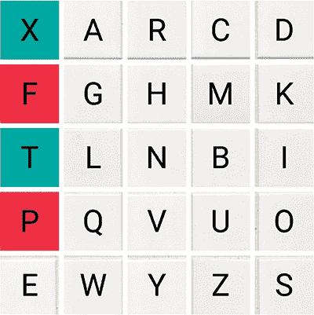

**图 8.1** 加密：如果双字母中的两个字母在同一列。

例如：

双字母：“xt”

加密文本：“fp”

加密：x -> f 且 t -> p

考虑每个字母表右侧的字母，如果双字母中的两个字母在同一行。结果是，如果双字母中的一个字母用网格中最右边的字母表示，请考虑该行的最左边字母（见图 8.2）。

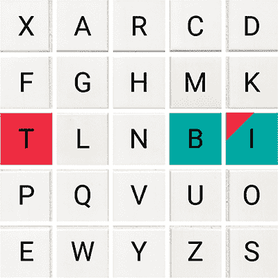

**图 8.2** 加密：如果双字母中的两个字母在同一行。

例如：

双字母：“bi”

加密文本：“it”

加密：b -> i 且 i -> t

如果上述规则都不适用，请绘制一个四边形或矩形，其中包含双字母中的两个字母，并考虑矩形的对角线相对角上的字母（见图 8.3）。

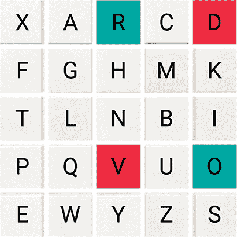

**图 8.3** 加密：如果上述规则都不适用。

例如：

双字母：“ro”

加密文本：“dv”

加密：r -> d 且 o -> v

现在，总结如下：

明文：“ambidextrous”

加密文本：“rhitxsfpdvoz”

加密：a -> r; m -> h; b -> i; i -> t; d -> x; e -> s; x -> f; t -> p; r -> d; o -> v; u -> o; 和 s -> z（参见 图 8.4）。

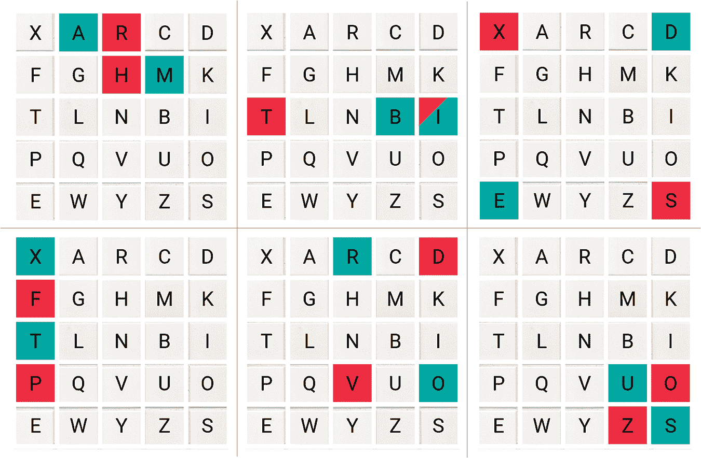

**图 8.4**  加密过程：明文到密文。

**Playfair 密码在 C 语言中的实现**

输出（参见 代码单元 8.1）

键文本：“Monarchy”

明文：“ambidextrous”

密文：“rhitxsfpdvoz”

```
// C program to implement Playfair Cipher

#include <stdio.h>
#include <stdlib.h>
#include <string.h>
#define SIZE 30

// convert the string to lowercase
void toLowerCase(char plain[], int ps)
{
    int i;
    for (i = 0; i < ps; i++) {
        if (plain[i] > 64 && plain[i] < 91)
            plain[i] += 32;
    }
}

// remove all spaces in the string
int format(char* plain, int ps)
{
int i, count = 0; 
    for (i = 0; i < ps; i++)
        if (plain[i] != ' ')
            plain[count++] = plain[i];
    plain[count] = '\0';
    return count;
}

// generate the 5x5 key square
void generate(char key[], int ks, char keyT[5][5])
{
    int i, j, k, flag = 0, *dicty;

    dicty = (int*)calloc(26, sizeof(int));
    for (i = 0; i < ks; i++) {
        if (key[i] != 'j')
            dicty[key[i] - 97] = 2;
    }

    dicty['j' - 97] = 1;

    i = 0;
    j = 0;

    for (k = 0; k < ks; k++) {
        if (dicty[key[k] - 97] == 2) {
            dicty[key[k] - 97] -= 1;
            keyT[i][j] = key[k];
            j++;
            if (j == 5) {
                i++;
                j = 0;
            }
        }
    }
    for (k = 0; k < 26; k++) {
        if (dicty[k] == 0) {
            keyT[i][j] = (char)(k + 97);
            j++;
            if (j == 5) {
                i++;
j = 0; 
            }
        }
    }
}

// search for the characters of digraph
in the key square and return their // position
void search(char keyT[5][5], char a, char b, int arr[])
{
    int i, j;

    if (a == 'j')
        a = 'i';
    else if (b == 'j')
        b = 'i';

    for (i = 0; i < 5; i++) {

        for (j = 0; j < 5; j++) {

            if (keyT[i][j] == a) {
                arr[0] = i;
                arr[1] = j;
            }
            else if (keyT[i][j] == b) {
                arr[2] = i;
                arr[3] = j;
            }
        }
    }
}
// find the modulus with 5
int mod5(int a) { return (a % 5); }
// make the plaintext length even
int make even(char str[], int ptrs)
{
    if (ptrs % 2 != 0) {
        str[ptrs++] = 'z';
        str[ptrs] = '\0';
    }
    return ptrs;
} 
// perform encryption
void encrypt(char str[], char keyT[5][5], int ps)
{
    int i, a[4];

    for (i = 0; i < ps; i += 2) {

        search(keyT, str[i], str[i + 1], a);

        if (a[0] == a[2]) {
            str[i] = keyT[a[0]][mod5(a[1] + 1)];
            str[i + 1] = keyT[a[0]][mod5(a[3] + 1)];
        }
        else if (a[1] == a[3]) {
            str[i] = keyT[mod5(a[0] + 1)][a[1]];
            str[i + 1] = keyT[mod5(a[2] + 1)][a[1]];
        }
        else  {
            str[i] = keyT[a[0]][a[3]];
            str[i + 1] = keyT[a[2]][a[1]];
        }
    }
}

//encrypt using Playfair Cipher
void encryptByPlayfairCipher(char str[], char key[])
{
    char ps, ks, keyT[5][5];

    // Key
    ks = strlen(key);
    ks = format(key, ks);
    LowerCase(key, ks);

    // Plaintext
    ps = strlen(str);
    LowerCase(str, ps);
    ps = format(str, ps);

ps = make even(str, ps); 

    generate(key, ks, keyT);

    encrypt(str, keyT, ps);
}
int main()
{
    char str[SIZE], key[SIZE];

    // Key to be encrypted
    strcpy(key, "Monarchy");
    printf("Key text: %s\n", key);

    // Plaintext to be encrypted
    strcpy(str, "ambidextrous");
    printf("Plaintext: %s\n", str);

    // encrypt using Playfair Cipher
    encryptByPlayfairCipher(str, key);

    printf("Ciphertext: %s\n", str);

    return 0;
}

```

**代码单元 8.1** Playfair 密码 – 使用 C 进行加密。

### 8.2.2 解密算法

Playfair 密码通过逆向加密过程进行解密。通信可以由接收者使用相同的密钥和相同的密钥表进行解密。

#### 8.2.2.1 步骤 1 – 生成方块（5 * 5）

密钥是一个 5 * 5 的方块字母网格，用于解密加密代码。由于网格只能容纳 25 个字符，在加密时，字母表中的一个字母（J）被从表中删除。因此，在没有数字、标点符号或非字母字符的情况下，字母表类中只有 25 个字母。密钥以发生顺序的独特字母表开始；之后，其余字母按顺序出现。因此，构建了一个不重复的单一字母类的双字母替换密码，并且它具有双字母替换。

Playfair 密码是一种块密码，它通过依赖于明文中的相邻字符来在加密过程中替换特定的明文字符。破解 Playfair 密码的最简单方法是对那些字母对进行频率分析。知道消息中使用的语言的大致频率，可以尝试将连续的密文对与语言中的连续字母对匹配。尽管这是一个巨大的任务。

#### 8.2.2.2 步骤 2 – 解密密文算法

密文被划分为双字母或双字母对——两封信。这是因为加密时，如果有一个奇数对，会添加一个额外的字母以将其转换为偶数。由于解密本身是加密的逆过程，所以字母实际上是成对的。

例如：

密文：“rhitxsfpdvoz”

拆分后：“rh” “it” “xs” “fp” “dv” “oz”

解密规则

考虑每个字母表上方的字母，如果双字母中的两个字母在同一列。结果是，如果双字母中的一个字母是矩阵中最上面的字母，请考虑同一列中底部的字母（参见 图 8.5）。

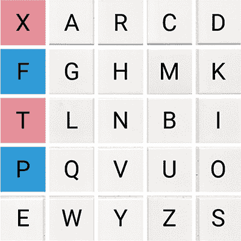

**图 8.5**  解密过程：如果两个字母在双字母表中处于同一列。

例如：

双字母表：“fp”

解密文本：“xt”

解密：f -> x 和 p -> t

如果双字母词中的两个字母在同一行，考虑每个字母左侧的字母。在这种情况下，如果双字母词中的一个字母是矩阵中最左边的字母，考虑该行的最右边的字母（见图 8.6）。

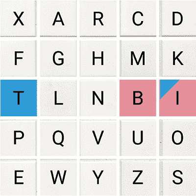

**图 8.6** 密码解密：如果双字母词中的两个字母在同一行。

例如：

双字母词：“it”

解密后的文本：“bi”

解密：i -> b，t -> i

如果以上规则都不适用，请用双字母词中的两个字母画一个四边形，并考虑四边形的对角线上的字母（见图 8.7）。

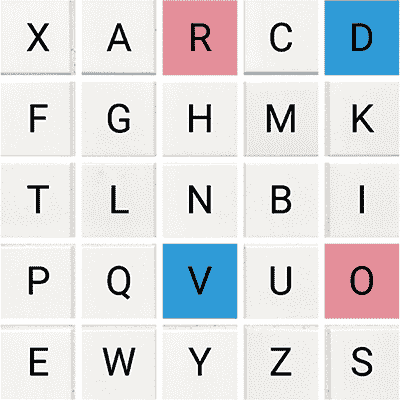

**图 8.7** 密码解密：如果以上规则都不适用。

例如：

双字母词：“dv”

解密后的文本：“ro”

解密：d -> r，v -> o

例如：

密码文：“rhitxsfpdvoz”

解密后的文本：“ambidextrous”

解密：r -> a；h -> m；i -> b；t -> i；x -> d；s -> e；f -> x；p -> t；d -> r；v -> o；o -> u；z -> s（见图 8.8）

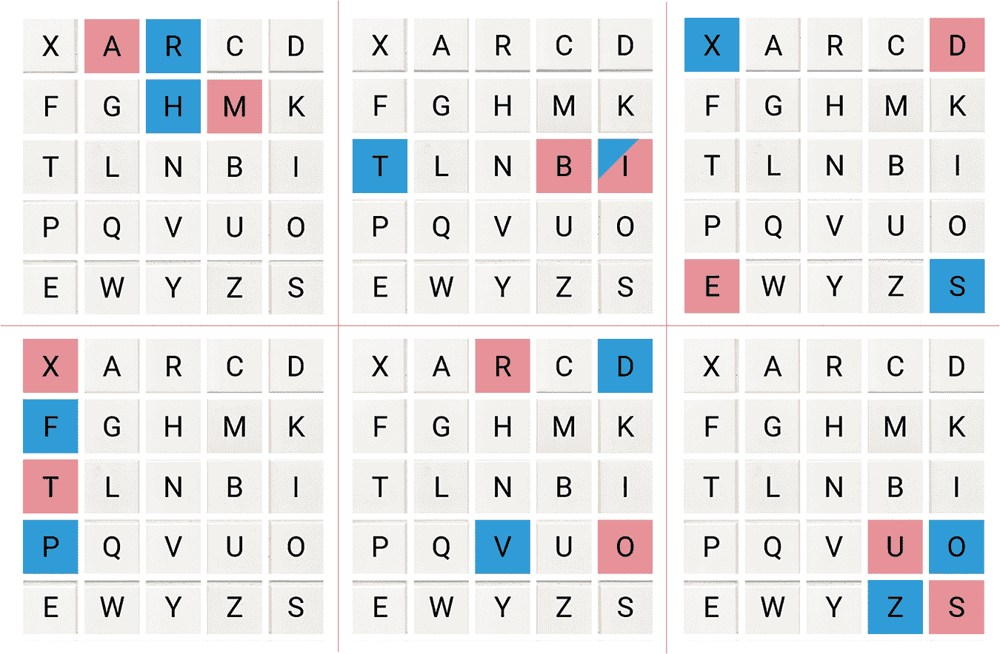

**图 8.8** 密码解密：密码文转明文。

**Playfair 密码解密在 C 语言中的实现**

输出（见代码单元 8.2）

```
#include <stdio.h>
#include <stdlib.h>
#include <string.h>
#define SIZE 30

// convert all characters
of string to lowercase
void LowerCase(char plain[], int ps)
{
    int i;
    for (i = 0; i < ps; i++) {
        if (plain[i] > 64 && plain[i] < 91)
            plain[i] += 32;
    }
}

// remove all spaces in a string
// remove punctuation
int format(char* plain, int ps)
{
    int i, count = 0;
    for (i = 0; i < ps; i++)
        if (plain[i] != ' ')
            plain[count++] = plain[i];
    plain[count] = '\0';
    return count;
}

// generates the 5x5 key square
void generate(char key[], int ks, char keyT[5][5])
{
    int i, j, k, flag = 0, *dicty;

    dicty = (int*)calloc(26, sizeof(int));
    for (i = 0; i < ks; i++) {
        if (key[i] != 'j')
            dicty[key[i] - 97] = 2;
    }
    dicty['j' - 97] = 1;
    i = 0;
    j = 0;
for (k = 0; k < ks; k++) { 
        if (dicty[key[k] - 97] == 2) {
            dicty[key[k] - 97] -= 1;
            keyT[i][j] = key[k];
            j++;
            if (j == 5) {
                i++;
                j = 0;
            }
        }
    }
    for (k = 0; k < 26; k++) {
        if (dicty[k] == 0) {
            keyT[i][j] = (char)(k + 97);
            j++;
            if (j == 5) {
                i++;
                j = 0;
            }
        }
    }
}

// search for the characters of a digraph
// in the key square and return their position
void search(char keyT[5][5], char a, char b, int arr[])
{
    int i, j;
    if (a == 'j')
        a = 'i';
    else if (b == 'j')
        b = 'i';

    for (i = 0; i < 5; i++) {
        for (j = 0; j < 5; j++) {
            if (keyT[i][j] == a) {
                arr[0] = i;
                arr[1] = j;
            }
            else if (keyT[i][j] == b) {
                arr[2] = i;
                arr[3] = j;
} 
        }
    }
}

// find the modulus with 5
int mod5(int a)
{
    if (a < 0)
        a += 5;
    return (a % 5);
}
void decrypt(char str[], char keyT[5][5], int ps)
{
    int i, a[4];
    for (i = 0; i < ps; i += 2) {
        search(keyT, str[i], str[i + 1], a);
        if (a[0] == a[2]) {
            str[i] = keyT[a[0]][mod5(a[1] - 1)];
            str[i + 1] = keyT[a[0]][mod5(a[3] - 1)];
        }
        else if (a[1] == a[3]) {
            str[i] = keyT[mod5(a[0] - 1)][a[1]];
            str[i + 1] = keyT[mod5(a[2] - 1)][a[1]];
        }
        else {
            str[i] = keyT[a[0]][a[3]];
            str[i + 1] = keyT[a[2]][a[1]];
        }
    }
}

void decryptByPlayfairCipher(char str[], char key[])
{
    char ps, ks, keyT[5][5];

    // Key
    ks = strlen(key);
    ks = format(key, ks);
    LowerCase(key, ks);

// ciphertext 
    ps = strlen(str);
    LowerCase(str, ps);
    ps = format(str, ps);

    generate(key, ks, keyT);

    decrypt(str, keyT, ps);
}
int main()
{
    char str[SIZE], key[SIZE];
    // Key to be encrypted
    strcpy(key, "Monarchy");
    printf("Key text: %s\n", key);

    // Ciphertext to be decrypted
    strcpy(str, "rhitxsfpdvoz");
    printf("Plaintext: %s\n", str);

    // encrypt using Playfair Cipher
    decryptByPlayfairCipher(str, key);

    printf("Deciphered text: %s\n", str);

    return 0;
}

```

**代码单元 8.2** Playfair 密码——使用 C 语言进行解密。

键文本：“Monarchy”

明文：“rhitxsfpdvoz” 解密后文本：“ambidextrous”

### 8.2.3 优点和缺点

#### 8.2.3.1 优点

Playfair 密码由于其使用的复杂数学使其 extremely difficult for the recipient to decrypt the information，因此似乎更加安全。

对简单替换密码有效的频率分析在这里不起作用，所以很难破解加密。然而，如果尝试通过频率分析来破解，将需要大量的密码文，以 25 * 25= 625 种可能在 Playfair 迭代中的双字母词，而不是在简单替换密码中的 25 个单字母词。

Playfair 密码是一种不需要任何数字设备（如计算器或解码器）的手动过程，用于加密和解密。在 C 语言中实现 Playfair 密码的加密-解密时，数据可以在源和终点之间安全传输，而不会做出任何妥协。

此外，暴力破解对 Playfair 密码没有影响。

#### 8.2.3.2 缺点

Playfair 密码使用相同的密钥进行加密和解密，使其可能破解对称密码学，并且不能用于传输大量数据。

在 Playfair 密码中，由于替换本身就是反转的，因此可以通过频率分析轻松解码信息。如果黑客知道明文的语言，他将明白密码文（RG）及其逆文（GR）在双字母词中有对应的明文，例如 HA 和 AH。

此外，它只支持 25 个字符，而且只能是全部大写或全部小写。

它不支持任何数字或特殊字符，如符号、方程、空格或标点符号。

此外，它只允许使用英语以外的语言。甚至不支持媒体文件的加密。

## 8.3 希尔密码

希尔密码是一种基于线性代数的多元替换密码。由莱斯特·桑德斯·希尔于 1929 年发明，它完美地适用于双字母（两个字母的块）、三字母（三个字母的块）或其他多种大小的块，以产生一致的密码。它是第一个可以一次处理超过三个符号的多字母密码。

希尔密码中的每个字母都表示为 26 个模块。通常使用简单的方案，如 A = 0, B = 1 ...

Z = 25 被使用，但这不是密码的一个重要特征（见图 8.9）。用于加密的矩阵是密钥，从可逆的*n* * *n*矩阵集合（模 26）中随机选择。在这里，*n* 可以是 2、3、4、5 或 6。为了解密消息，每个块需要与编码矩阵的逆相乘。

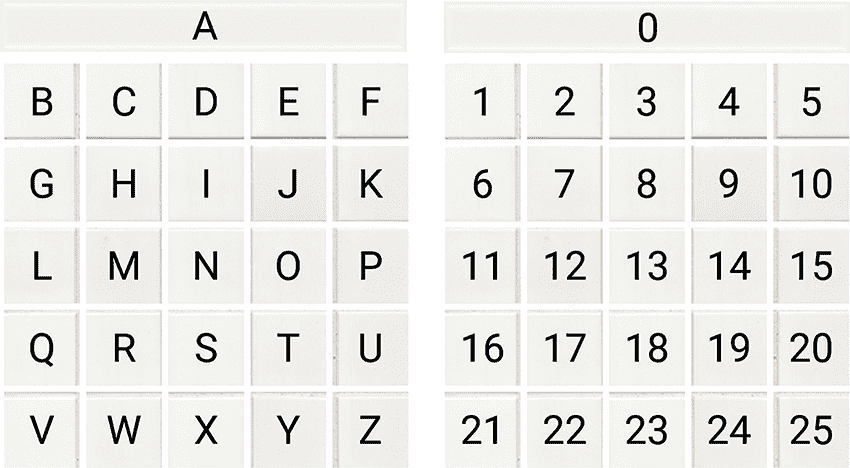

**图 8.9** 字母（左）和相应的数字（右） - 希尔密码加密使用上述字母和数字方案，可以根据条件进行修改。

示例：

输入：明文：“ACT”

密钥：“GYBNQKURP”

输出：密文：“POH”

输入：明文：“GFG”

密钥：“HILLMAGIC”

输出：密文：“SWK”

### 8.3.1 替换方案

通常，希尔密码加密使用以下字母数字（字母和数字）结构，但根据需要可以进行修改。

#### 8.3.1.1 加密

要加密给定的消息，与模 26 同时进行，每个块由*n*个字母组成，这些字母在*n* * *n*矩阵中相乘。接下来，为了解密，每个块需要与逆矩阵相乘（见图 8.10）。

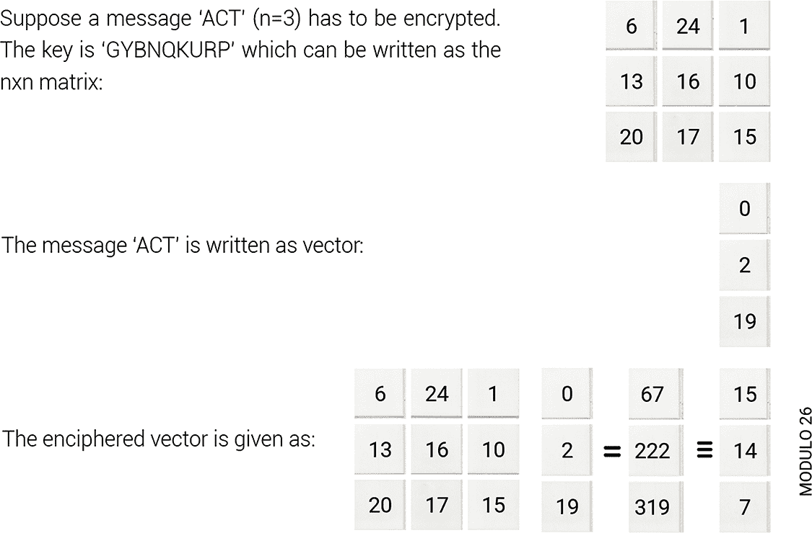

**图 8.10** 希尔密码加密 - ACT 加密为 POH。

它对应于密文“POH”

#### 8.3.1.2 解密

它给了我们“ACT”，假设所有的字母都是大写的（见图 8.11）。

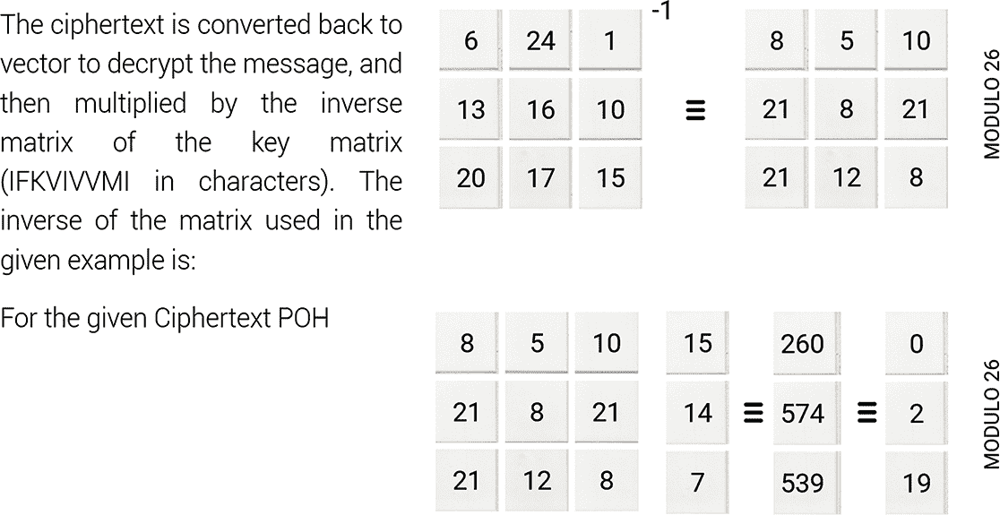

**图 8.11** 希尔密码解密 - POH 解密回 ACT。

**n=3 的上述想法实现**

密文：“POH”

```
// C++ code to implement Hill Cipher
#include <iostream>
using namespace std;

void getMatrix(string key, int Matrix[][3])
{
    int k = 0;
    for (int i = 0; i < 3; i++)
    {
        for (int j = 0; j < 3; j++)
        {
            Matrix[i][j] = (key[k]) % 65;
            k++;
        }
    }
}

// encrypt the message
void encrypt(int cipher[][1],
            int Matrix[][3],
            int message[][1])
{
    int x, i, j;
    for (i = 0; i < 3; i++)
    {
        for (j = 0; j < 1; j++)
        {
            cipher[i][j] = 0;

            for (x = 0; x < 3; x++)
            {
                cipher[i][j] +=
                    Matrix[i][x] * message[x][j];
            }
            cipher[i][j] = cipher[i][j] % 26;
        }
    }
}

// implement Hill Cipher
void HillCipher(string message, string key)
{
    // Get key matrix
    int Matrix[3][3];
    getKeyMatrix(key, Matrix);

    int message[3][1];

    // Generate vector for the message
    for (int i = 0; i < 3; i++)
        message[i][0] = (message[i]) % 65;

    int cipher[3][1];

    // generate
    the encrypted vector
    encrypt(cipher, Matrix, message);

    string CipherText;

    // generate the encrypted text from
    // the encrypted vector
    for (int i = 0; i < 3; i++)
        CipherText += cipher[i][0] + 65;

    cout << "result:" << CipherText;
}

int main()
{
    // Get the message to be encrypted
    string message = "ACT";

    // Get the key
    string key = "GYBNQKURP";

    HillCipher(message, key);

    return 0;
}

```

**代码单元 8.3** 利用希尔密码使用 C++进行加密和解密。

希尔密码是已经屈服于已知明文攻击的经典对称加密算法的一个例子。在这种类型的攻击中，密码分析师拥有某些消息的明文和这些消息的相应密文。他们试图解算出算法来解密用相同的密钥加密的任何新消息。因此，其对密码分析的脆弱性使得它在实际中不可行，然而，它在密码学和线性代数的教学中仍然扮演着重要的角色。

## 8.4 密码学中的 RSA 算法

RSA 算法是一种非对称加密算法，因此，它使用两个不同的密钥工作——公钥和私钥。它是在 1978 年由 Ron Rivest，Adi Shamir 和 Leonard Adelman 发明的。它被称为 Rivest Shamir Adelman（RSA）算法，以他们的名字命名。

假设一个客户端（用户）将他的公钥发送到一个服务器（协调员）以接收一些数据。使用客户端的公钥，服务器在发送之前加密数据。客户端收集这些数据，但需要先解密。由于它是非对称的，只有客户端（用户）有它的私钥，即使他拥有用户的公钥，第三方也无法解密信息。

RSA 算法的基本思想基于大整数分解的困难性。虽然乘法两个数字很容易，但从乘积中确定原始的素数却似乎是不可能的。让我们这样来理解它。公钥包括两个数字（数），其中一个是大于两个素数的乘积。这两个相同的素数也用于生成私钥。这暗示着如果一个人成功地对一个大的数字进行因式分解，那么秘密或私钥就可以被黑客攻击。

因此，RSA 算法背后的防御机制是，黑客必须首先通过指数时间的大整数分解来确定值*p*和*q*。因此，如果 N 是一个 100 位整数，那么分解它将需要超过 70 年。这种复杂性阻止了攻击者找到解密密钥 I，因为*d*依赖于*p*、*q*和加密密钥*e*。因此，即使黑客获得了 N 和*e*，他们也无法从 N 和*e*计算出*d*。

由于加密强度完全取决于密钥大小，将密钥大小加倍或三倍可以增强加密。通常，RSA 密钥可以是 1024 或 2048 位长，而现在，破解如此大量的加密似乎是一个不可能的任务。

使用 RSA 算法，可以按照以下方式生成公钥和私钥（Techtarget，2022）：

选取两个大素数*p*和*q*。

通过乘以这些值找到*n* = *p* x *q*，其中*n*被称为加密和解密的模数。

选择一个小于*n*的数字*e*，使得*n*与(*p* – 1) x (*q* – 1)互质。这表明*e*和(*p* – 1) x (*q* – 1)之间唯一的共同因子是 1。

如果*n* = *p* x *q*，那么公钥是<*e*, *n*>。

公钥<*e*, *n*>用于加密明文消息*m*。以下公式用于从明文获得密文 C。

*m*^e mod *n* = C

在这种情况下，*m*必须小于*n*。一个更大的消息（>*n*）被视为一系列通信，每个都单独加密。

为了找到私钥，使用以下公式计算*d*，使得：

*d[e]* mod {(*p* – 1) x (*q* – 1)} = 1

或者

*d[e]* mod φ (*n*) = 1 其中 φ (*n*) = (*p* – 1) x (*q* – 1)

私钥是 <*d*, *n*>。

使用私钥 <*d*, *n*> 解密密文消息 C。为了从密文 C 中检索明文 *m*，使用以下公式来获得明文 *m*。

*m* = C*^d* mod *n*

### 8.4.1 工作机制

#### 8.4.1.1 生成公钥

+   选择两个素数。假设 P 和 Q 分别是 53 和 59。

    现在公钥的第一部分：*n* = P*Q = 3127。

+   在这里，也需要一个小的指数，比如 *e*

然而，*e*应该是：

+   一个整数。

+   不是*n*的元素或因子。

+   1 < *e* < Φ(*n*) [Φ(*n*)下面讨论]，

    现在，考虑它等于 3。

    我们的公钥由 *n* 和 *e* 组成

#### 8.4.1.2 生成私钥

+   按照以下方法计算 Φ(*n*)：

    所以 Φ(*n*) = (P – 1) x (Q – 1)

    因此，Φ(*n*) = 3016

+   然后，确定私钥，*d*：

    对于某个整数（整数）*k*，*d* = (*k**Φ(*n*) + 1) / *e*

    对于 *k* = 2，*d* 的值是 2011。

因此，我们现在有：公钥 (*n* = 3127 和 *e* = 3) 和私钥 (*d* = 2011)

首先，加密“HI”：

+   将字母转换为数字：

    在这里，H = 8 且 I = 9

+   因此，加密后的数据 *c* = 89*^e* mod *n* = 89³ mod (3127)

    因此，加密后的数据变成了 1394

进一步，解密 1394：

+   解密后的数据 = *c^d* mod *n* = (1394)²⁰¹¹ mod (3127)

    所以，加密后的数据变成了 89，代表“HI”。

    其中，8 = H 和 I = 9

**RSA 算法的小值 C 实现**

消息中的数据：12.000000

加密的数据：3,000,000

原始消息发送：12.000000

似乎在许多年内对 RSA-1024 和 RSA-2048 进行因式分解是不可能的。尽管勒索软件病毒也使用 RSA-2048 来加密被感染机器上的文件，但没有解码密钥既无法解密这些文件，也无法因式分解这样一个大密钥。

RSA 的应用可以在网页浏览器、电子邮件、VPN、聊天和其他多种通信渠道中看到。RSA 通常用于在 VPN 客户端和 VPN 服务器之间创建安全连接。RSA 算法还可以用于诸如 OpenVPN、TLS 握手等协议，以交换密钥并建立安全通道。

RSA 是一种内在脆弱的密码系统，包含无数的陷阱，普通的软件工程师无法期望避免。测试弱参数可能困难，甚至不可能，而它们的拙劣表现迫使开发者采取危险捷径。

## 8.5 多项式精度算术库

| **密钥生成 – 摘要** |  |  |
| --- | --- | --- |
|  | 选择 *p*, *q* *p*, *q* 都是素数 |  |
|  | 计算 *n* = *p***q* |  |
|  | 计算 ø(*n*) = (*p* – 1)*(*q* – 1) |  |
|  | 选择整数 *e* | *gcd* (ø(*n*),*e*) = 1;1 < *e* < ø(*n*) |
|  | 计算 *d* |  |
|  | 公钥 | KU = *e*,*n* |
|  | 私钥 | KR = *d*,*n* |
| **加密** |  |  |
|  | 明文 | M < *n* |
|  | 密文 | C = M*^e*(mod *n*) |
| **解密** |  |  |
|  | 密文 | C |
|  | 明文 | M = C*^d*(mod *n*) |

RSA 方法的三步分别显示在上面的等式中。如果一个素数生成器生成了 1024 位的素数*p*和*q*，那么*N*将是一个 2048 位的数。处理 2048 位的软件会花费很多时间，因为所有的模运算过程在加密和解密时都是以*N*为参照，而*N*是一个 2048 位的数。

鉴于 RSA 算法的需求，可以使用 GNU 多精度算术库（GMP）来支持大型密钥的创建。这将加快包含大模数的大规模加密和解密过程。这个库将使完整的 RSA 算法能够在没有依赖高配置硬件设备的简单 64 位操作系统上运行。

### 8.5.1 GNU 多精度算术库

GMP 是一个开源库，用于算术计算。这包括非常大的或高度精确的数字，其中大部分用于密码技术。这使得它可以在有符号整数、有理数和十进制数上执行算术运算，而不受机器配置或任何实际限制的影响（GNU 库，2022）。

GNU 库的本地方法是为 C 编程语言设计的。然而，为 C++、C#、Ada、Julia、OCaml、PHP、Python、Perl、R、Ruby 和其他语言提供了包装器。

### 8.5.2 使用 GMP 库的 RSA 算法实现

一个用 C 语言编写的展示 RSA 算法在小素数情况下的工作原理的程序在代码单元 8.4 中给出。为了理解实际 RSA 算法的步骤，需要用 GMP 库编写一个使用大素数的 C 代码。该程序通过创建 512 位随机素数*p*和*q*来执行 RSA-1024，然后进行编码和解码。在这样的背景下，变量模数大小被赋值为 1024。这个值可以修改为 2048，以生成一个 2048 位的 RSA 密钥。

```
// C program for RSA asymmetric cryptographic
// algorithm.
#include<stdio.h>
#include<math.h>
int gcd(int a, int h)
{
    int temp;
    while (1)
    {
        temp = a%h;
        if (temp == 0)
        return h;
        a = h;
        h = temp;
    }
}

int main()
{
    // random prime numbers
    double p = 3;
    double q = 7;

    // first step for public key:
    double n = p*q;

    // next step for public key.
    // e - > encrypt
    double e = 2;
    double phi = (p-1)*(q-1);
    while (e < phi)
    {
        // e is co-prime to phi and
        smaller than phi.
        if (gcd(e, phi)==1)
            break;
        else
            e++;
    }
    // Private key (d - > decrypt)
    // choosing d such that it satisfies
    // d*e = 1 + k * totient
    int k = 2; // any constant value
    double d = (1 + (k*phi))/e;

    // Message to be encrypted
    double msg = 20;

    printf("data = %lf", msg);

    // Encryption c = (msg ^ e) % n
    double c = pow(msg, e);
    c = fmod(c, n);
    printf("\nEncrypted data = %lf", c);
    // Decryption m = (c ^ d) % n
    double m = pow(c, d);
    m = fmod(m, n);
    printf("\nOriginal Message = %lf", m);

    return 0;
}

```

**代码单元 8.4 ** 使用 C 语言的 RSA 非对称加密。

**RSA 算法的实现**

RSA 算法可以实现于安全的网络传输和交易中，应用于各种电子商务应用。此外，它还可以实现于向在线交易商分享信用卡详细信息，实现低比特率通道上的语音消息，高速 IPSec 的安全密钥交换等。（参见代码单元 8.5）。

```
#include <stdio.h>
#include <gmp.h>

int main {
mpz_t x, y, result;

mpz_init_set_str(x, "7612058254738945", 10);
mpz_init_set_str(y, "9263591128439081", 10);
mpz_init(result);

mpz_mul(result, x, y);
gmp_printf(" %Zd\n"
        "*\n"
        " %Zd\n"
        "--------------------\n"
        "%Zd\n", x, y, result);
/* free used memory */
mpz_clear(x);
mpz_clear(y);
mpz_clear(result);

return 0;
}

```

**代码单元 8.5 ** 使用 C 语言的 RSA 算法。

### 8.5.3 使用中国剩余定理的弱 RSA 解密

RSA 解密比加密需要更长的时间，因为在私钥解密的时刻，参数*d*不可避免地更大。此外，参数*p*和*q*是两个非常大的素数。

[由于计算量大，RSA 相当慢。消息通常比加密的秘密钥长得多。一种方法是只用 RSA 加密一个秘密密钥，该密钥用于对称加密算法。这可以同时获得非对称加密的安全性和对称加密算法的速度]。

确定 m 使得 c = m^e mod (p x q)，给定整数 c、e、p 和 q。（RSA 解密脆弱整数）。

基础：有一个由两个因子或结构 n（模数）和 e（指数）表示的公钥。模数是两个非常大的质数（如后面给出的 p 和 q）的乘积。用户必须将 n 分解为两个质数（RSA 安全）以解密此消息，然后确定 e 的模逆，这是一项耗时的工作。

首先将文本版本转换为相应的十进制值——下面要找到的参数 m。然后通过计算 c = m^e mod (p x q)*c* 表示加密文本。

在这里，通过利用指数值和弱模数来找到 p、q 和 d 的值，尝试生成私钥。在当前示例中，已经取了小的 p 和 q 值，尽管如此，在实际应用中，必须取大的 p 和 q 值以保护 RSA 系统。

因此，让我们在下面的情况下尝试找到 d，给定 p 和 q。

示例

输入：

c = 1614

e = 65537

p = 53

q = 31

输出：

1372

解释：

计算 c = m^e mod (p x q)。

插入 m = 1372。

计算得到 c = 1614。

输入：

c = 3893595

e = 101

p = 3191

q = 3203

输出：

6574839

解释：

如上所述，如果我们计算 m^e mod (p x q)

当 m = 6574839 时，我们得到 c = 3893595

通常，m 的值可以如下获得：

（1）找出 e 的模逆。

使用以下等式，d = e^(-1) mod (λ(n))，

其中 n 是变量数，λ 是卡迈克尔函数。

（2）现在，确定 m = c^d mod (p x q)

（3）如下面实现所示，中国剩余定理可以用来加速计算。

**中国剩余定理的 Python 实现**

输出

41892906

```
# find the gcd of two
# integers using Euclidean algorithm
def gcd(p, q):

    if q == 0:
        return p

    return gcd(q, p % q)

# find the
lcm of two integers
def lcm(p, q):
    return p * q / gcd(p, q)

# implementing extended
# Euclidean algorithm
def ext gcd(e, phi):

    if e == 0:
        return (phi, 0, 1)
    else:
        g, y, x = ext gcd(phi % e, e)
        return (g, x - (phi // e) * y, y)

# compute the modular inverse
def modinv(e, phi):

    g, x, y = ext gcd(e, phi)
    return x % phi

# Implement Chinese Remainder Theorem
def implement(dq, dp, p, q, c):

    # Message part 1
    m1 = pow(c, dp, p)

    # Message part 2
    m2 = pow(c, dq, q)

    qinv = modinv(q, p)
h = (qinv * (m1 - m2)) % p 
    m = m2 + h * q
    return m

p = 9817
q = 9907
e = 65537
c = 36076319
d = modinv(e, lcm(p - 1, q - 1))

"""

pow(a, b, c) calculates a raised to power b
modulus c much faster than pow(a, b) % c
use Chinese Remainder Theorem as it
splits the equation to calculate two
values whose equations have smaller moduli and exponent
value, thereby reducing computing time.
"""

dq = pow(d, 1, q - 1)
dp = pow(d, 1, p - 1)
print implement(dq, dp, p, q, c)

```

**代码单元 8.6** 中国的剩余定理。

## 8.6 SHA-512 哈希在 Java 中

安全哈希算法 512（SHA-512）是一种哈希算法，其每个输出产生一个 512 位长（64 字节）的 SHA-512 值，即 128 个十六进制字符。它可以将任何大小的文本转换为固定大小的字符串。此算法常用于获取电子邮件地址哈希、密码哈希和数字记录验证。

六个哈希函数属于安全哈希算法——两种加密哈希函数的家族：

| 哈希算法 | 哈希值 |
| --- | --- |
| SHA-224 | 224 位哈希值 |
| SHA-256 | 256 位哈希值 |
| SHA-384 | 384 位哈希值 |
| SHA-512 | 512 位哈希值 |
| SHA-512/224 | 512 位哈希值 |
| SHA-512/256 | 512 位哈希值 |

这些中最广泛使用和接受的哈希算法是 SHA-256 和 SHA-512，分别用于计算 32 位和 64 位的单词。SHA-224 和 SHA-384 是 SHA-256 和 SHA-512 的短版本，分别按顺序计算。这些使用不同的起始值进行计算。

MessageDigest 类，位于 java.security 包中，用于在 Java 中计算密码学哈希值。

为了确定一个文本的哈希值，MessageDigest 类提供了这些密码学哈希函数：

+   MD2

+   MD5

+   SHA-1

+   SHA-224

+   SHA-256

+   SHA-384

+   SHA-512

一个名为 getInstance()的静态方法负责初始化这些算法。在选择一个算法后，确定消息摘要值，并将输出反转成一个字节数组。使用 BigInteger 类将结果字节数组转换为其符号表示。这种表示随后被转换成十六进制格式，以获得所需的 MessageDigest。

输入: hello

输出：

309ecc489c12d6eb4cc40f50c902f2b4d0ed77ee511a7c7a9bcd3ca86d4cd86f989

dd35bc5ff499670da34255b45b0cfd830e81f605dcf7dc5542e93ae9cd76f

输入: helloworld

输出：

acc10c4e0b38617f59e88e49215e2e894afaee5ec948c2af6f44039f03c9fe47a9210

e01d5cd926c142bdc9179c2ad30f927a8faf69421ff60a5eaddcf8cb9c

**SHA-512 哈希函数的实现**

输出（参见 代码单元 8.7）

由 SHA-512 生成的哈希码：

你好:

309ecc489c12d6eb4cc40f50c902f2b4d0ed77ee511a7c7a9bcd3ca86d4cd86f989

dd35bc5ff499670da34255b45b0cfd830e81f605dcf7dc5542e93ae9cd76f

```
// Java program to calculate SHA-512 hash value

import java.math.BigInteger;
import java.security.MessageDigest;
import java.security.NoSuchAlgorithmException;

public class Sha {
    public static String encrypt(String input)
{
        try {
            // getInstance() method is called with
algorithm SHA-512
            MessageDigest md = MessageDigest.
getInstance("SHA-512");

            // digest() method is called
            // to calculate message digest of the input
string
            // returned as array of byte
            byte[] messageDigest = md.digest(input.
getBytes());

            // Convert byte array into signum
representation
            BigInteger no = new BigInteger(1,
messageDigest);
            // Convert message digest into hex value
            String hashtext = no.toString(16);

            // Add preceding 0s to make it 32 bit
            while (hashtext.length() < 32) {
                hashtext = "0" + hashtext;
            }

            // return the HashText
            return hashtext;
        }

        // For specifying wrong message digest
algorithms
catch (NoSuchAlgorithmException e) { 
            throw new RuntimeException(e);
        }
    }

    public static void main(String args[]) throws
NoSuchAlgorithmException
    {

        System.out.println("HashCode Generated by
SHA-512 for: ");

        String s1 = "Hello";
        System.out.println("\n" + s1 + " : " +
encrypt(s1));

        String s2 = "hello world";
        System.out.println("\n" + s2 + " : " +
encrypt(s2));
    }
}

```

**代码单元 8.7  ** 计算 SHA-512 哈希值。

你好世界:

309ecc489c12d6eb4cc40f50c902f2b4d0ed77ee511a7c7a9bcd3ca86d4cd86f989

dd35bc5ff499670da34255b45b0cfd830e81f605dcf7dc5542e93ae9cd76f

SHA-1 是许多广泛使用的网络安全应用和协议的一部分，包括 TLS 和 SSL、PGP、SSH、S/MIME 和 IPsec。这些应用也可以使用 MD5，因为 MD5 和 SHA-1 都源自 MD4。SHA-1 是由美国国家安全局设计的，是美国联邦信息处理标准。

## 8.7 网络安全

网络安全是一种保护系统和企业网络免受在线攻击的方式，这些攻击试图访问、修改、破坏或以敏感数字信息换取金钱。网络攻击可以通过特洛伊木马、根 kit、病毒等几种恶意软件实施，并被称为分布式拒绝服务（DDoS）攻击、中间人（MITM）攻击、网络钓鱼、勒索软件攻击和结构化语言查询（SQL）注入（IBM，2022）。随着对技术和大数据依赖的增加，迫切需要解决与数据和交易保护相关的安全问题。

### 8.7.1 常见网络攻击

#### 8.7.1.1 服务拒绝攻击

拒绝服务攻击是指网络犯罪分子用流量淹没计算机系统的网络和服务器，以阻止合法请求得到服务。这使得系统无法使用，阻止组织执行重要任务。

#### 8.7.1.2 恶意软件

恶意软件是常见的网络安全威胁之一，是旨在获得未授权访问或损害计算机的恶意软件。这种恶意软件由黑客或网络犯罪分子创建，目的是为了赚钱或基于政治动机的网络攻击，干扰或损坏合法用户的计算机。它通常通过一个看似正宗和合法的无需请求的电子邮件附件或可下载软件来传播。

恶意软件可以是多种类型，例如：

**病毒**

它是一种自我复制的程序，将自己固定在未感染的文件上，并使用包含恶意代码的文件感染整个计算机系统。

**特洛伊木马**

这是一种伪装成正宗软件的恶意软件。网络攻击者诱使用户上传特洛伊木马到他们的计算机上，并通过损害他们的系统来收集数据。

**间谍软件**

这是一种安装在用户计算机上并秘密监视他们在线行为而不为他们所知或同意的软件。它将关于个人或组织的信息传递给其他方。

**勒索软件**

这是一种恶意恶意软件，它锁定用户的文件和数据，威胁要抹掉信息，并封锁文件或计算机系统的访问，直到支付赎金为止。尽管支付了赎金，用户也不能保证文件会被恢复或系统会被修复。

**广告软件**

它是一种广告软件，可以通过广告牌传播恶意软件。

**僵尸网络**

这种恶意软件是一个由感染计算机组成的网络，网络犯罪分子利用它在线执行任务，而无需用户的同意。

#### 8.7.1.3 中间人攻击

通过中间人攻击，一名网络犯罪分子拦截两个人之间的通信来窃取数据（见图 8.12）。例如，在未加密的 WiFi 网络上，攻击者可以拦截用户设备与网络之间传递的数据。


**图 8.12** 网络安全威胁（中间人攻击）。

#### 8.7.1.4 网络钓鱼

网络钓鱼是发送模仿合法公司或可信来源的欺诈性电子邮件的做法。这是最常见的网络攻击类型，其基本目标是窃取敏感数据，例如信用卡号码和登录密码。

#### 8.7.1.5 结构化语言查询注入

结构化语言查询（SQL）注入是一种用于从数据存储库中窃取数据的网络攻击类型。网络犯罪分子利用数据驱动应用程序中的漏洞，通过恶意的 SQL 语句将恶意代码插入数据库，从而获得对数据库中包含的敏感信息的访问权限。

社交工程是一种策略，敌对势力通过向你们索要货币支付或获取你们的机密数据来揭露敏感信息。为了实现这一目的，他们坚持要求用户点击链接、下载恶意软件或依赖恶意来源。

#### 8.7.1.6 最新的网络威胁

***Dridex 恶意软件***

这是一种具有广泛能力的金融特洛伊木马。它通过钓鱼邮件或现有恶意软件感染计算机。它专门窃取个人数据、登录信息、银行详情等，然后用于进行欺诈交易。

为了防止这种情况发生，确保设备打补丁、开启并更新防病毒软件以及备份文件是非常重要的。

***Emotet 恶意软件***

Emotet 是一种先进的特洛伊木马，它依赖于简单的密码。它能够窃取数据并加载其他恶意软件。避免这种恶意软件的唯一方法是创建安全的密码。

### 8.7.2 关键网络安全特性

+   **加密中使用的校验和**

+   数据备份和修复的代码

+   评估风险和威胁

+   减轻系统漏洞

+   恶意软件的知识

+   访问管理和控制

+   认证

+   加密

+   设置防火墙

+   实施入侵检测和预防系统（IDS 和 IPS）

在过去几年中，网络攻击的规模呈指数级增长（IBM，2022）。正如数据泄露数量惊人地增加并造成重大经济损失一样，区块链已经作为一种有前景的网络安全缓解技术出现。

### 8.7.3 区块链在网络安全中的应用

1.  数据无疑是任何业务增长的重要工具。企业从各种来源收集敏感数据，并智能和安全管理这些数据。大多数组织仍然将数据存储在像网络犯罪分子的蜜罐一样的集中存储中。组织可以通过实施基于区块链的分布式存储解决方案来保护其数字信息和资产。分布式存储平台通常会将用户文件分散存储在其网络上的多个节点上。

1.  物联网（IoT）及其他连接设备面临着随时间推移而增加的安全漏洞和挑战。随着人工智能的广泛应用，黑客找到了轻松访问整个系统的途径。在物联网系统中，基于区块链的设备间加密可以是一个有效的解决方案，以维护网络安全。

1.  分布式拒绝服务：DDoS 是目前最流行的网络攻击之一，通过创建大量的互联网数据洪水，可以破坏目标服务器或网络的正常流量，从而影响其周围的基础设施。许多新的 DDoS 攻击形式正在迅速出现，包括捉迷藏式恶意软件。通常可以看到，路由器、智能手机、吸尘机器人和网络摄像头等连网设备被用来发起攻击。即使在系统重启后，这种攻击仍然存在。由于其不可变性和加密特性，区块链可以有效地克服这些异常。

1.  更好的 DNS 安全：域名系统（DNS）就像一个公共目录，将域名与它们的 IP 地址关联起来。黑客利用 IP 地址和网站之间的连接来崩溃域名，给商家的忠实顾客带来不必要的损失。通过去中心化 DNS 条目，区块链可以提供一个预防性的解决方案来挫败此类攻击。其去中心化网络允许用户域信息不可逆转地存储在分布式账本上，连接可以通过不可变的智能合约来操作。

1.  多签名认证：篡改用户名和密码是主要的网络威胁。区块链技术通过确认用户能够访问多个设备，使得用户能够采用一种不需要用户名或密码的多签名认证机制。

1.  软件完整性：区块链可以用来保护设备不受恶意软件感染，通过验证安装程序。软件的哈希值可以记录在区块链上，并与安装程序的哈希值进行比较，以验证下载的完整性（网络管理联盟，2020 年）。

### 8.7.4 区块链在网络安全中的优缺点

#### 8.7.4.1 优点

+   用户隐私：通过公钥和私钥对区块链数据进行完全加密，确保数据在流经不可信网络时无法被未授权的各方访问。

+   数据透明度和可追溯性：在区块链中，随着每一轮迭代，系统的先前状态都被保留，因此可以获取完整的交易历史。交易数据得到区块链网络中参与者的数字背书，从而保持透明度。

+   数据完整性：不可变性和可追溯性是区块链的固有特性，帮助区块链保持数据完整。在遭遇网络攻击的情况下，智能合约可以用来在所有参与者之间检查并执行规则，以预防和控制账户共享。

+   没有单点故障：区块链系统是分布式的，单点故障无法使整个网络瘫痪。它消除了基于 IP 的 DDoS 攻击。数据通过不同的节点始终可用。通过使用多个节点和分布式操作，使平台和系统变得灵活。

+   安全数据传输：区块链中的公钥基础设施（PKI）在数据传输时保存认证。尽管将私钥备份存储在次要存储设备上可能存在高风险，但如果实施了基于密钥管理程序和整数分解问题的加密算法，如互联网工程任务组（IETF）或远程函数调用（RFC），则可以避免这种情况。

#### 8.7.4.2 缺点

+   为了加密数据，区块链严重依赖私钥；然而，如果私钥丢失，用户对加密数据的访问可能会永远丢失。因为一旦私钥丢失，它就无法恢复。

+   适应性和可扩展性挑战：政府和组织可能会发现整合区块链技术具有挑战性，因为它将需要替换目前使用的所有系统。这是因为区块链网络具有预定的区块体积和每秒执行交易的限制。增加其可扩展性可能会有些令人困惑。

+   高运营成本：由于高计算和存储要求，区块链应用比其非区块链竞争对手更昂贵。

+   缺乏控制：区块链的观念尚未受到全球治理和监管。

+   区块链素养：尽管区块链技术有无数的应用，但在当前情况下，拥有各种编程语言和工具深入了解的区块链开发者却寥寥无几。

### 8.7.5 现实世界示例

使用区块链进行网络安全的一些突出示例：

#### 8.7.5.1 澳大利亚政府

堪培拉，澳大利亚：澳大利亚政府计划在一个分布式账本平台上建立一个网络安全网络。政府已经做出了大量努力来建立区块链生态系统，并与 IBM 合作，保护联邦文件的存储。

#### 8.7.5.2 巴克莱

伦敦，英国 —— 传统银行：巴克莱银行最近提交了一份专利申请，试图利用区块链技术来优化基金转移过程中的安全参数。通过采用分布式账本技术（DLT），它将有助于监管加密货币的转移。

巴克莱银行率先使用区块链追踪金融交易、遵守法规和打击欺诈。它持有知识你的客户（Know-Your-Customer）流程的专利，该流程使银行能够将所有可识别的客户信息安全地存储在区块链上。

#### 8.7.5.3 中国军队

北京，中国 —— 国防和武装力量：中国的军队和政府正在准备利用区块链网络安全来保护关键的政府、军事和其他情报数据。

#### 8.7.5.4 思科

-   圣何塞，加利福尼亚州（物联网）：思科计划通过区块链技术保护物联网设备，因为区块链技术可以绕过单点故障，并通过加密保护数据。思科之前曾与硬件公司罗克韦尔自动化以及供应链公司 Flex 合作，在制造和运输领域建立区块链网络。

#### -   8.7.5.5 Coinbase

-   旧金山，加利福尼亚州——加密货币：Coinbase 是一个用户购买和出售数字货币的交易所。钱包和密码保存在一个安全的数据库中，使用加密技术。为了确保您的加密货币安全，该公司对员工进行严格的背景调查。Coinbase 到目前为止已经处理了超过 1500 亿美元的交易。

#### -   8.7.5.6 科罗拉多州

-   科罗拉多州丹佛市——政府：根据科罗拉多州参议院通过的法案，政府将采用区块链技术确保记录的安全并阻止攻击企图。

#### -   8.7.5.7 创始人银行

-   瓦莱塔，马耳他——加密货币：这家银行旨在成为世界上第一家去中心化的银行，既不由购买者拥有，也不由中央当局拥有。该银行将由其基于代币的股权持有者进行监管。银行将使用独立的存储筒仓、大规模公共账本系统和加密技术，以确保加密货币交易能够安全、有序地进行。

#### -   8.7.5.8 健康链接

-   山景城——加利福尼亚州：是一家在医疗系统中使用的区块链网络，通过医院、诊断实验室、制药公司和医生保存和交换患者数据。该公司旨在保护患者的病历，并只允许少数人员访问记录。它将追踪重要的健康相关事件，以帮助医生做出明智的决策。

#### -   8.7.5.9 摩根大通

-   纽约——传统银行：美国最大的金融机构，摩根大通，开发了一个以企业为重点的以太坊版本，名为 Quorum，它使用区块链处理私人交易。银行在网络上部署智能合约以处理加密安全但透明的交易。摩根大通的基于区块链的试点旨在涵盖贷款生命周期的所有方面：发起、执行和结算。

#### -   8.7.5.10 Mobile Coin

-   旧金山，加利福尼亚州——加密货币：MobileCoin 正在开发一种易于使用的加密货币，适用于资源受限的企业，这些企业没有足够的能力安全地处理账本信息。MobileCoin 计划使其产品能轻松与 Facebook Messenger、WhatsApp 和 Signal 集成。

#### -   8.7.5.11 飞利浦医疗保健

马萨诸塞州安多弗——医疗保健：飞利浦医疗保健与世界各地的医院合作，建立了一个基于区块链和人工智能的医疗保健网络。这个生态系统将追踪和检查医疗保健系统的各个方面，包括运营、秘书处和治疗数据。区块链被用来保护存储在这些系统中的大量数据。

#### 8.7.5.12 桑坦德银行

马萨诸塞州波士顿——国际支付：桑坦德银行是英国第一家采用区块链来保护其国际支付网关的银行。它使客户能够进行桑坦德在欧洲和南美洲账户之间的交易。桑坦德的 One Pay FX 与 Ripple 合作，在巴西、波兰、西班牙和英国非常流行。

#### 8.7.5.13 华尔街

过时且集中的网络安全协议和数万亿美元的现金流动使大型银行成为黑客和欺诈的目标。区块链可以分散风险并提供多层次的安全协议。这可能是华尔街关注区块链加强的安全协议的原因。华尔街一些最大的金融机构，如摩根大通和美国银行，虽然通常在采用新技术方面落后，但它们正试图保持领先。

与银行行业一样，医疗保健行业也不断面临网络攻击。医生、诊所、医院和医疗保健集团不仅保存着患者的银行信息，还保存着大量敏感数据，如社会保障号码、全名、体重、身高、疾病、处方和医疗状况。黑客通过威胁公开私人数据，向全球医疗保健集团勒索数百万美元，如果没有新技术的实施，他们可能会无限期地这样做。区块链可能是这个问题的立即解决方案。分布式账本技术（DLT）的去中心化状态使得信息可以存储在离散的隔离区中，并阻止网络犯罪分子访问一个人健康记录的所有可识别方面。

##### 接下来

本章从早期对称加密的普莱菲尔和希尔密码开始，旨在描述著名的非对称加密密钥技术，如 RSA。此外，还深入讨论了各种网络攻击及其预防，使用了现实世界的例子。

下一章将探讨通过区块链管理和验证数据和记录的可能性。

## 参考文献

1.  网络安全联盟，2020. [`www.cm-alliance.com`](https://www.cm-alliance.com)。访问日期：2020 年 6 月 3 日。

1.  GNU 库，2022. [`gmplib.org`](https://gmplib.org)。访问日期：2022 年 4 月 1 日。

1.  IBM, 2022. [`www.ibm.com`](https://www.ibm.com). 访问日期：2022 年 3 月 20 日。

1.  Techtarget, 2022. RSA 算法（Rivest-Shamir-Adleman）。[`www.techtarget.com`](https://www.techtarget.com)/searchsecurity/definition/RSA。
