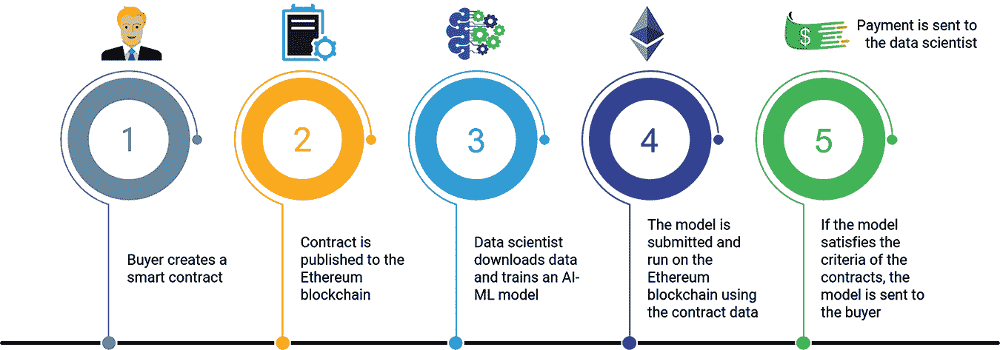
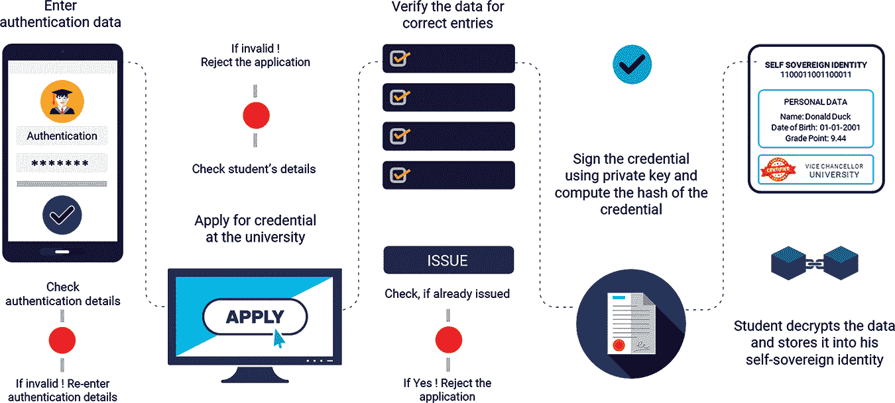
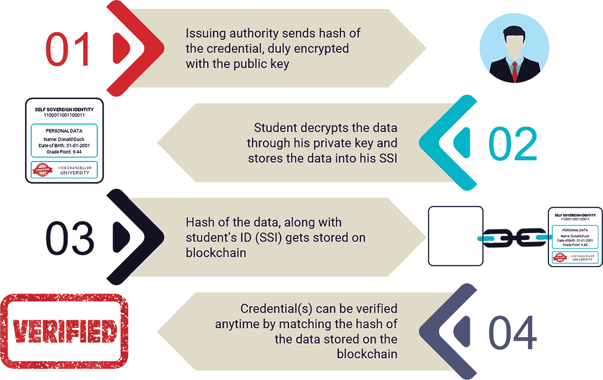
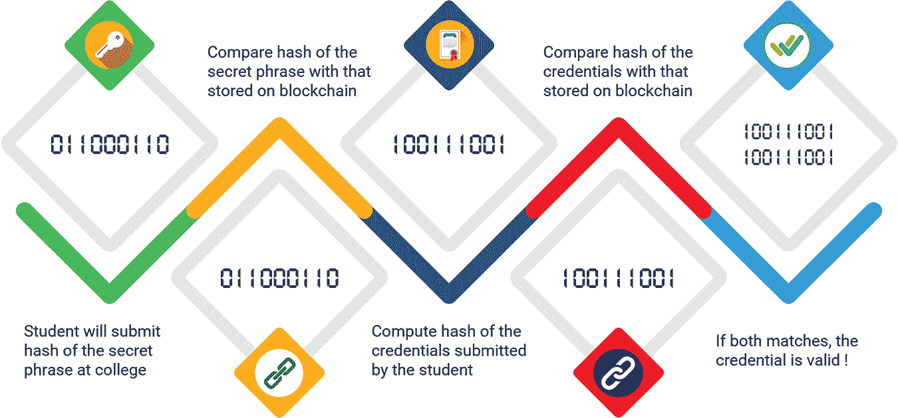
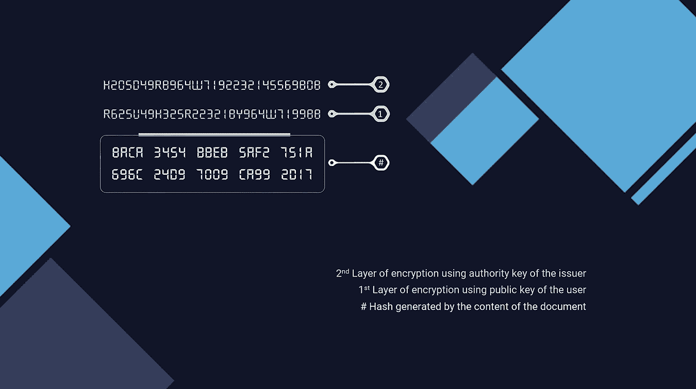
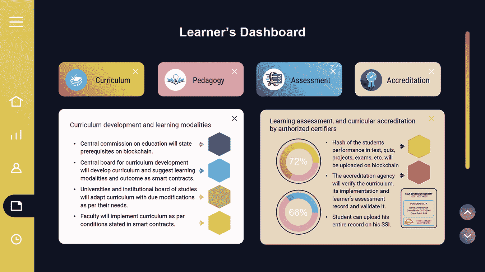
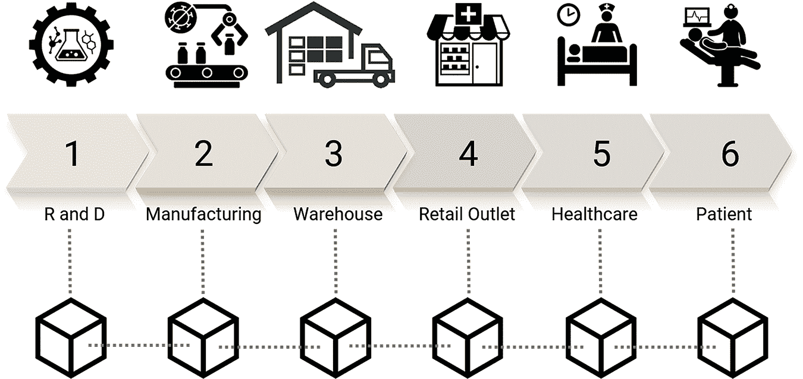
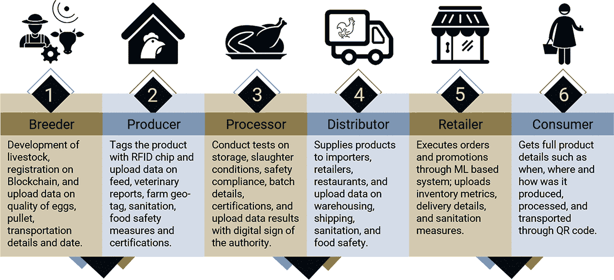

# 9

数据管理

## 9.1 数据科学

大数据和区块链是相互独立的。他们有自己的独特方向和用途。尽管数据科学专注于使用数据进行适当的治理，但区块链的去中心化账本确保了数据的安全。然而，可以从区块链和数据科学的结合中获益。

区块链的去中心化使得获取关键数据变得困难，因为几乎不可能 compromised all nodes。此外，行为可疑的节点可以立即被区块链排除，从而使系统安全。由于其加密和严格的验证过程，区块链使数据保持完整、可追溯和透明。

数据科学提供深入的数据分析，而区块链允许实时交易。这两种技术可以结合起来提供实时数据分析。数据科学可以用来评估区块链数据，揭示数据洞察和隐藏趋势。

### 9.1.1 数据科学家的挑战

+   数据科学家从各种来源收集信息，这些信息容易受到篡改和盗窃。数据价值的上升导致了数据泄露的数量惊人的增加。

+   数据保密性是数据科学家在处理消费者个人敏感信息时面临的最重要障碍。

+   随着许多国家实施数据保护法规，数据科学家获取数据变得越来越具有挑战性。

+   数据科学家将大量时间花费在过滤数据上，因为无论他们如何高效地分析它，不精确的数据可能不会为他们提供有益的结果。

+   数据科学家在访问数据时，经常遭受数据访问过程不稳定带来的困扰，这使得访问和分析的生命周期变得更加困难。

+   传统的数据管理系统不支持实时数据分析，从而使数据科学家无法利用实时分析的优势。

### 9.1.2 基于区块链的解决方案

+   作为分布式系统，区块链保存数据的多个副本，以便于轻松验证数据的真实性。区块链上的每个区块都有其独特的散列或指纹，这防止了数据的操纵和篡改。

+   凭借其独特的协议，区块链可以帮助数据科学家获取受隐私保护的数据以供其研究使用。

+   区块链可以通过让数据科学家成为特定级别的分布式账本的一部分来简化他们的数据访问过程（参见图 9.1）。

+   区块链的加密真实性方法确保了数据的一致性。区块链有一个去中心化的共识方法，在数据记录时验证数据以确保数据的准确性。

+   联邦机器学习是一种协作数据分析技术，允许在不同位置的多个设备上分析数据。

+   数据科学家无疑会从数据库系统的完整性中受益，这将使他们能够对可靠的数据进行真正的分析。



**图 9.1** 数据科学的区块链应用。

## 9.2 教育和就业验证

每年，数百万人次的候选人将他们的教育证明书提交到世界各地，以获得高等学府的录取或实现理想的工作。他们的成绩、证书和学位需要被核实，以便决定他们的教育资格的合法性。在每一次招聘努力中，申请者的比例令人震惊地伪造了他们的工作经历或以各种方式误报他们的教育——要么夸大其学术资格，要么从未经认证的机构提交假学位。

验证所需的文件，如教育学位、文凭或证书，是区块链可以提供实质性结果的领域之一。凭证持有者可以将他的所有学术证明以加密格式存储在他的设备上，由星际文件系统（IPFS）支持，有选择地向验证者分享信息以进行验证或认证，而不依赖第三方或中心数据仓库。没有得到主人明确同意，任何文件都不能被分享。因此，区块链确保了真实的数据交换和验证，而没有在系统上存储任何经过验证的证明。由于区块链账本是不可逆和不可变的，所以不会删除原始版本的真相，因此不可能进行任何篡改。

### 9.2.1 现有的验证流程

大学和其他教育机构颁发的成绩单、文凭和证书被认为是教育资格的原始工具。几个世纪以来，实体形式的证明一直是唯一的服务工具。实体证书被认为是认证的最安全工具，因为：

+   由于内置的安全特性，它们难以被伪造；

+   证书直接由收件人持有，使他们完全控制着这些证明；

+   它们相对容易地被安全地保存在一个更长时间的地方；并且

+   它们可以随时由持证人发放给任何人，用于任何目的。

然而，实体证书也有其缺点：

+   没有实体证书能免受伪造的风险。

+   实体证书的安全性是有代价的。证书越安全，创建它的成本就越高。

+   证书细节或时间戳可以被发行者伪造。

+   一旦错误地发放，除非放弃所有者的控制权，否则没有办法收回证书。

+   证书注册机构因为只维护在数字文件或物理注册中，所以是一个失败点。如果记录丢失，即使证书有效，验证证书也是不可能的。

+   维护这样一个注册表并定期更新它需要大量的人力。

+   验证物理证书的过程耗时较长，因为每个证书都需要人工阅读和验证。

在这样的环境中，许多候选人伪造他们的凭证以使自己看起来是合适的人选。美国每年平均培养出 198 万毕业生。如此大量的学位持有者需要一个严格验证过程，以识别未经授权的机构和它们颁发的假学位。这可能就是为什么大量申请人面临获得确认信过程中的不寻常延迟的原因。

目前，验证过程如下进行：

+   学校、学院和大学通常会通过内部员工进行人工验证。

+   验证过程通常需要一到两周时间，但对于那些多年前毕业的学生来说，时间会稍长一些。

+   一些学校在开始验证之前要求候选人填写披露和释放表。

+   女性候选人在申请表上通常会提到她们的已婚名字，而她们的教育证明则显示她们使用婚前名字完成的学业。第三份文件，如结婚证书，也需要验证以决定两者之间的相似性。

+   很难验证那些没有出现在中央监管机构名单上的大学的学位和证书，比如印度的 UGC。

在一个认证系统中，如果有多个机构或个人被授权发行证书，每个发行者都会应用个人或专有标准来发行证书，从而导致创建多个子系统。这些需要在测试或验证过程中单独和独立地理解和验证，以产生信任。因此，需要在整个发行者网络中协调格式和标准化，以保持验证系统中的固有信任水平。

### 9.2.2 区块链作为一个选项

在区块链技术中，去中心化标识符（DID）是可以通过加密验证的，当每个实体都有一个关于与凭证相关数据的单一真相来源时，它建立了参与者之间的信任。

DID 存储在公共账本上，与之一起的还有 DID 文档，其中包含 DID 的公钥、证书持有者希望公开的任何其他公共凭证以及用于谈判的网络地址。因此，凭证所有者通过关联的私钥控制 DID 文档。

为了确保去中心化身份的安全，私钥仅由证书所有者拥有，而公钥则广泛传播。这对密钥 serving two purposes – first authentication, where the public key verifies that the holder of the paired private key sent the message, and second encryption, where only the holder of the paired private key can decrypt the message encrypted with the public key.

在区块链上发布或验证证书所需的资源相对较少，因为证书的真实性可以无需人工干预即可验证。证书由发证机构发行，通常是经授权的教育机构，为满足获奖标准并获得相关学历或学位的候选人提供教育证书。发证机构最终充当认证和验证机构，在发行证书时，附上其中所含细节的有效性。区块链在世界范围内的成千上万个节点上存储带有发证机构签名（散列）和收件人名称的证书，这使得可以验证最初发行证书的权威性。证书所有者（候选人）可以将这些证书存储在他们的派钱包中，并根据需要分享给第三方，以证明他们的合格性（参见 图 9.2）。



图 9.2 记录管理流程。

验证者或第三方（可能是高等教育机构或雇主）通过验证证明的有效性和证明方的信誉来确定证据的有效性，而不需要探究证据中提供的实际数据的准确性。这是一种零知识证明认证方法，其中一个实体通过加密隐藏获取的信息的详细信息，同时证明它拥有相关信息，而不向另一实体披露任何实际信息。验证实体尽管没有知识，但确信支持证据的信息是有效的。

通常，大学学历或学位包含有限的信息，例如颁发高等教育机构（HEI）的名称、获奖者姓名、学位名称、发行当局签名以及发行日期。此类学位或证书可以作为数字证书的散列进行交易，或者作为令牌从一方转移到另一方。散列仅仅是添加链接到原始文档的一种方式，用户持有该文档。这意味着该机制允许发布文档签名，无需发布文档本身，从而保持文档的机密性。

然而，在某些情况下，这些文凭或学位包含了辅助信息，比如教学学习方法描述、课程和學習成果等，长达数页，无法发布在区块链上。如果所有信息都存储在区块链上，链条会变得非常庞大，可能导致资源消耗过高。在这种情况下，辅助信息可能存储在链外，同时，主要文本中可能提供超链接。因此，一些信息可能存储在用户的私人钱包中，而其他信息可能存储在区块链上的公共领域。

因此，区块链注册表是不可篡改的、带时间戳的、加密安全的，并且可以由发行机构出于正当理由进行更新或撤销。

#### 9.2.2.1 注册过程

在这个系统中，学生可以使用自己的个人信息进行注册，比如姓名、地址、电子邮件 ID、Aadhaar 号码、PAN 卡、以前的教育详情，以及秘密短语的哈希值（Garg，2021a）。秘密短语的哈希值将以交易的形式存储在区块链上。学生也将保留这个哈希值的副本。学院将使用学生的公钥发行数字签名学位证书。这个已签名的证书将被加密并上传到 IPFS 服务器上。这个加密的、已签名的证书的哈希值将存储在区块链上（见图 9.3）。



**图 9.3** 注册过程。

#### 9.2.2.2 验证过程

如果学生想要被另一所学院录取，他将提交秘密短语的哈希值。验证学院将检索存储在区块链上的哈希。他们将把学生的秘密短语的哈希值与区块链上存储的哈希进行比较。如果找到匹配项，学生的身份是有效的（见图 9.4）。



**图 9.4** 验证过程。

#### 9.2.2.3 双层加密

为了使其更加安全，上传凭证到 IPFS 后生成的哈希可以有两层加密（见图 9.5；Garg，2021b）。第一层加密将通过使用公钥实现，在其之上，将使用发行方（权威机构）的私钥进行加密。为了验证共享凭证，将进行使用接收方私钥的解密。



**图 9.5** 双层加密模型。

生成的加密哈希可以与发行方数据库中提供的哈希进行比较。如果两者匹配，凭证将被视为有效。

### 9.2.3 学习者控制台

尽管许多大学和机构提供了大规模的在线开放课程，但由于第三方认证，这些课程并没有变得特别受欢迎。这些证书不具有普遍有效性，因此在高等教育或工作中会带来问题。另外，如果原始证书丢失，获取副本将是一项艰巨的任务。因此，可以使用区块链向学生发放加密数字证书。这还将降低硬件成本。通过在区块上记录所有完成的课程并附有时间戳，可以将学习者的历史按时间顺序保存。

### 9.2.4 评估门户

学习者的成就证书不包含任何有关课程或教学-学习模式的信息。它剥夺了学生将他的学习成果或学分从一门平台转移到另一门平台的权利。通过使用区块链技术，可以开发出新的工具来提高学习过程并衡量其结果。通过为个别学生提供一个评估仪表板（参见图 9.6）以通过他们的 SSI 提交课堂作业和项目，教师和学生之间使用智能合约，可以维护课程、教学、学习和评估的详细记录（Chen 等人，2018；Garg，2021b）。



**图 9.6** 学习者评估记录。

### 9.2.5 背景调查

为了验证应聘者的经验和表现，雇主可以检索并验证区块链上维护的信息，而无需联系前雇主。当凭证持有者（应聘者）提交一份文档时，技术将该文档转换或编码为一个加密摘要或散列值。这项技术的独特之处在于，当同一文档多次提交以供验证时，散列值和交易标记实际上每次都匹配。如果文档内容发生变化，标记将永远不匹配。

一种替代方法是检查区块链上的交易记录，以验证带时间戳文档的存在。回到原始的带时间戳文档的验证页面，早期日期的带时间戳文档的存在证明该文档已被早期验证且真实。这可以证明是对教育机构、人力资源经理和医疗保健行业进行文档验证的理想工具，节省了时间、成本和努力。

#### 9.2.5.1 记录维护

区块链的概念允许从幼儿园到高等教育阶段候选人的整个历史记录在数字 ID 追踪的线条上存储。从这里，我们可以对候选人的学习以及参与其他活动的情况进行全面了解，这些活动从各方面转化为他的工作经验。传统的背景调查往往非常缓慢且昂贵，这对于那些不想浪费宝贵时间填写表格的候选人来说尤其是一个负担。如果记录了候选人生命每个阶段取得的成就，并在一个强大的平台上保护隐私和安全，如区块链，雇主将能够寻找合适的候选人，核实他们的背景，并测试他们为支持其候选人资格所提交的文件。最终，用于验证和评估的时间、成本和人力资源将显著减少。

澳大利亚加密货币（Chronobank）创建了一个基于区块链的平台 Chrono.tech，允许招聘经理访问自由职业者的数据库，以及他们的验证凭证和工作经验。Chrono.tech 于 2016 年成立，旨在促进短期就业机会，如同其他在线服务。该公司使用区块链技术平台赋予人力资源和招聘专业人士权力，帮助全球自由职业者找到最佳工作并根据他们的努力获得报酬。它是一个在以太坊和其他参与区块链上提供稳定代币的系统。基于时间银行模式，工人用劳动时间交换商品和服务，绕过传统招聘行业的经纪人、成本和不效率（Chronotech, 2022）。

ValidateMe 是一个基于区块链的数字保险库，供个人托管、分享和验证他们的教育、工作和个人文件。然而，文件始终归原始持有者所有，只有他们有权分享。这是一个基于 SaaS 的平台，用于发放证书和验证文件，吸收了区块链技术的不可变性和透明性特点（ValidateMe, 2022）。它有效地利用区块链技术，为信息提供无法恢复存储和任何有权查看的人轻松验证的平台。

Blockcerts 是一个创建、发布、查看和验证基于区块链的凭证的开源标准，使用户能够保存和分享他们自己的真实记录。其最初的原型由 MIT 媒体实验室和 Learning Machine 开发，以促进互操作性。它将经过加密签名、防篡改且可共享的数字记录注册在区块链上（Blockcerts, 2022）。

ProFed 是另一家由验证过的专业人士组成的机构，他们在平台上安全地添加了验证过的个人数据。每当专业人士根据验证数据获取工作、商业提案或商业报价时，公司都会收取佣金，从而将网络扩展到新的水平（Profed 信用合作社，2022）。

#### 9.2.5.2 简历验证

通常，招聘人员会为获取存储在数据库中多年的简历而向职位板支付费用。这些简历有时太旧，不再具有相关性，或者可能不再代表该候选人。在简历中夸大成就或误传事实信息已成为一种普遍做法。

利用区块链技术，招聘人员可以拥有候选人拥有的真实简历数据库。此外，候选人所取得的成就，如他所在学校的成绩单、参加课外活动和运动、获得的奖项、休假或工作的小时数、职业性质等，都可以保存在区块链上，并在需要时进行检索和验证。

#### 9.2.5.3 求职者的机会

区块链系统为雇主和求职者提供了一个可靠且透明的平台。由于该系统在一个无法对事实进行追溯性更改的平台上运行，因此消除了基于伪造简历或虚假求职的选拔可能性。这将给合格且熟练的候选人带来更多机会，也会增加招聘人员的信心。

### 9.2.6 官僚去中介化

多年来，大学已经变成了庞大的官僚机构，其中发展更多地是在行政领域而不是学术领域。这些机构按照商业管理策略管理大学。大学内部的层次组织极为缓慢和僵化。这也适用于教授如何记录他们的研究活动、课程评估和认证，以及通过适当的层次结构申请资金和报销。这就是为什么官僚主义会从高等教育机构的核心活动中窃取宝贵的时间和关注的原因。在高等教育机构中，时间和金钱本可以用于学生的学习和研究活动。Garg（2016, 2017, 2018, 2019, 2022）引入了许多有趣的想法，以便在没有中央权威的情况下访问个人的教育记录、健康历史、银行账户、税务记录、土地登记等信息。基于区块链的技术与这样的网络相结合，也有助于消除高等教育机构中的官僚主义。

### 9.2.7 区块链验证的优势

在当前背景下，区块链技术提供以下好处：

+   在一个去中心化架构中，凭证通常直接存储在用户的设备上，或安全地存储在私有仓库中，从而降低了数据泄露或泄露的风险。

+   凭证所有者有权允许或禁止任何组织或个人访问文件。

+   存储在区块链上的学术资格比存储在中心化服务器上的数据更安全。利用基于内容的存储系统（CBS 或 IPFS），它们更能保持信任和数据完整性。

+   去中心化公钥基础设施（DPKI）使每个人都能在时间顺序上生成或在区块链平台上锚定非对称加密密钥。

+   数字文档验证将使教育机构和商业实体在减少所需的努力、时间和成本的同时更加熟练地操作。

+   它使信息具有互操作性，防止凭证持有者被锁定在单一平台上，允许持有者在多个平台上部署数据，并使他们能够将信息用于各种目的。

+   利用数字身份（DID）和可验证凭证，它允许凭证从一台平台无缝导航到另一台平台。

+   尽管一旦在区块链上发行的凭证无法更改或篡改，但小的排版错误和一些变量，如家庭地址、电话号码或电子邮件 ID，可能会随时间变化使旧凭证无效，从而需要重新发行新凭证。区块链允许这样的强制性变化，但区块链保留了每个凭证的状态，无论是被撤销还是更新。

+   在传统的文档管理系统中，如果凭证持有者丢失了他们的凭证，他们必须向有关机构申请，直到发出副本。在提议的系统中，每个用户会将他们的凭证存储在数字钱包或 IPFS 上，这些将通过区块链与全球连接。这使得凭证丢失变得不可能。

这样，学术文档存储的过程可以变得去中心化和可互操作，任何组织或第三方都可以使用区块链平台验证某人的学术凭证。由于这是一个分布式系统，将没有单点故障(SPoF)。

## 9.3 医疗保健

区块链在医疗保健领域有广泛的应用和用途。它有助于安全地转移患者病历，管理药品供应链，并为健康研究人员解锁生物学密码。

### 9.3.1 医疗保健的潜在用途

#### 9.3.1.1 数字医疗记录

世界各地的健康保健系统都面临着集中式数据库的问题。将病人的所有医疗记录放在一个地方使它们容易受到黑客攻击，否则病人和他们的医疗服务提供者可能对病人的医疗史有一个不完整的了解。

解决这个问题的一种方案是创建一个基于区块链的系统，可以与现有的电子病历软件集成。这使得患者的全面病历可以作为一个单一视图提供。连接到区块链的每个记录，无论是医生的处方、注释还是实验室结果，都被转换成一个唯一的哈希函数。每个哈希函数都是唯一的，只有在持有数据的人同意的情况下才能被解码。

每次病人同意分享其医疗记录的一部分时，新的信息都会以交易的形式记录在区块链上——一种新的疾病、一种新的治疗方案、一个新的结果。保险公司可以直接从病人那里获得即时、有效的健康服务确认，而不需要第三方的干预、时间和成本。

#### 9.3.1.2 药品供应链

医疗保健部门面临的一个主要挑战是确保医疗商品的来源以确认其真实性。通过利用区块链，人们可以跟踪商品从制造点开始，通过供应链的每个阶段，使客户能够全面了解他们将要购买的商品的完整视图和透明度（参见图 9.7）。



**图 9.7** 医疗保健供应链中的区块链。

MediLedger 是一个示例，它是一个允许处方药物供应链上的公司验证药品真实性的区块链协议，以及有效期等信息。

#### 9.3.1.3 健康保险

在基于区块链的系统中，制药公司、医疗器械原始设备制造商（OEMs）、批发商、保险公司和医疗保健提供者可以验证其组织身份，记录合同细节并跟踪交易。这种环境超越了供应链管理，使医疗保健领域的商业伙伴和保险公司能够数字化运营，在某些情况下，根据智能合同中规定的条款进行操作。

制造商、分销商和医疗保健组织可以通过登录区块链账本来解决处方药物和其他商品的付款和退款索赔，并共享数字合同。

#### 9.3.1.4 远程健康监控

数字健康当前的一个趋势是采用远程监控解决方案，通过传感器指示的生命体征，使医生能够获得患者健康状况，并提供主动和预防性护理。

区块链加密确保只有授权方可以访问存储在区块链上的个人数据，该数据以独特的哈希函数形式存在。原始数据的任何操纵或更改都会产生完全不同的哈希函数。一旦患者数据以哈希形式输入区块链账本，几乎不可能对其进行篡改，因为需要访问所有存储的副本。

#### 9.3.1.5 器官移植

器官移植是一个复杂的过程。至关重要的是，捐赠的器官应属于相应血型的人，并且应该及时移植。尽管有 12 万人等待器官移植，但由于未能及时进行移植，许多捐赠的器官都变得无用。区块链可能是合理的解决方案。通过这种方式，可以在器官捐赠者、移植寻求者以及擅长器官移植的医疗保健提供者之间建立完美的匹配。Organtree 是世界上第一家提供区块链平台以连接器官捐赠者、器官接受者和医疗机构的去中心化器官捐赠数据库公司。

阿拉伯联合酋长国（UAE）是全世界首个利用区块链和人工智能进行器官移植的国家。UAE 与专注于全球医疗健康的国内领先公司 Donor Healthtech 合作，提供安全且优化的器官捐赠流程。其目标是通过人工智能和区块链改善器官验证、为患者匹配器官，并优化移植过程（Abdul-Malak, 2019）。

#### 9.3.1.6 资质验证

与追踪医疗商品的来源类似，区块链技术也可以追踪经验丰富的医疗专业人员的经验。可信的医疗机构和组织可以记录他们员工的资质，从而使医疗组织的招聘过程更加顺畅。总部位于美国的 ProCredEx 已经建立了这样一个医疗资历验证系统，使用 R3 Corda 区块链协议（stl partners, 2022）。

区块链的去中心化特性使 IoT 设备能够不通过中心化服务器直接相互交互，这使得发起 DDoS 或中间人攻击变得非常困难。

### 9.3.2 实际应用案例

#### 9.3.2.1 Akiri |  Foster City

加利福尼亚州 – 大数据：Akiri 运营一个网络即服务网络，致力于医疗行业。在将患者健康数据从一个医疗中心传输到另一个医疗中心时保护这些数据。Akiri 系统充当网络和协议，以设置策略和配置数据层，实时验证数据源和目的地。Akiri 不存储任何类型的数据；相反，它确保在需要了解的基础上与各方共享适用的医疗数据。订阅者可以是任何医疗保健提供者、健康保险支付者或制药公司。

#### 9.3.2.2 Avaneer 健康

康涅狄格州格拉斯顿伯里 – 大数据：Avaneer 健康提供了一个公用事业网络，该网络可实现对安全且可共享数据的安全访问，以提供更好的体验和更好的结果。该数字平台基于区块链技术构建，允许数据迅速在患者、提供者、支付者、雇主和医疗创新者之间流动，同时确保隐私、安全和控制。由 Aetna、Anthem 和克利夫兰诊所支持，Avaneer 支持完善医疗保健效率、更好的索赔处理和维护提供者目录。

#### 9.3.2.3 Block Pharma

巴黎，法国 – 药品，供应链：BlockPharma 提供了一个解决方案，用于药品的可追溯性和防伪。通过这个应用程序，消费者购买药品的真实性可以立即得到验证。

BlockPharma 依赖于最新的机器学习技术来提高假药案例的检测率。通过验证供应链和所有发货点，用户可以非常容易地知道他是否携带假药。

#### 9.3.2.4 BurstIQ

科罗拉多州斯普林斯 – 大数据、网络安全、软件：BurstIQ 允许数字健康机构、医疗保健系统、支付方、制药公司、生物技术企业和政府通过其受权限的区块链网络访问与健康相关的数据。该平台确保严格遵守区块链技术 HIPAA 规定，以保护、销售、分享或许可大量患者数据。由于 BurstIQ 的平台包括关于患者健康和护理活动的完整和最新信息，因此它可以在防止阿片类药物或其他药物滥用方面发挥有效作用。

#### 9.3.2.5 疾病控制和预防中心

佐治亚州亚特兰大 – 政府机构、医疗保健、安全：疾病控制和预防中心（CDC）利用 IBM 区块链技术开发了一个加密账本，收集电子健康记录（EHRs），同时不损害数据安全和监管要求。它使用区块链来监控疾病，并实时提供疫情报告。通过研究这些信息，科学家可以追踪疾病的起源和模式，这可能有助于预防疾病。CDC 还可能利用区块链追踪阿片类药物流行情况。

#### 9.3.2.6 记录

加利福尼亚州旧金山 – 供应链管理：记录区块链网络用于确保药物运输的安全和详细审查。Chronicled 创建了一个显示物权链的区块链网络。Chronicled 提供基于区块链的 Mediledger 网络的自动化解决方案，以消除交易的手动处理、收入泄露和现金流延迟。Mediledger 网络是医疗保健行业的行业网络 2.0，推动实时对齐、规则执行和交易直接对企业伙伴进行结算。因此，它帮助制药公司确保其药品顺利运输，并使执法部门能够审查任何可疑活动，如毒品交易。

#### 9.3.2.7 珊瑚健康

加拿大温哥华 – 医疗保健 IT：珊瑚健康公司利用区块链自动化行政流程，加快护理过程，提高医疗结果。该公司还实施了患者与医疗专业人士之间的智能合约，以自动化流程，并确保数据和治疗符合合约规定。

通过将患者信息整合到分布式账本技术（DLT）中，该公司使医生、科学家、实验室技术人员和公共卫生官员能够比以往更快地连接。该公司正在探索 Smart over FHIR 协议的潜力，以允许患者跟踪他们的健康文件。

#### 9.3.2.8 Embleema

纽约 – 药物开发：Embleema 是一个健康数据和分析的 SaaS 平台，它将创新治疗带给无法接受治疗的患者。Embleema 是一个虚拟试验和监管分析平台，旨在通过公司的虚拟研究套件加速治疗对患者的可用性。该平台由美国食品药品监督管理局（FDA）用于健康产品与基因组数据集相关的监管评估。除了 FDA 之外，该平台还由主要制药公司、生物技术公司、患者和临床研究中心使用。

#### 9.3.2.9 Factom

奥斯汀，德克萨斯州 – IT，企业软件：Factom 创建有助于医疗行业将数字记录存储在区块链平台上的产品。实体文件可以配备特殊的 Factom 安全芯片，携带患者信息并作为个人数据存储，仅限于医院和医疗保健管理员访问。

#### 9.3.2.10 Guardtime

欧文，加利福尼亚州 – 网络安全：Guardtime 为患者、设施提供商、支付方、监管机构和制药商创建一个可信赖的数据和信息生态系统，使每个利益相关者都能访问执行有效患者护理所需的信息。Guardtime 使用区块链平台进行网络安全应用和医疗保健。该公司在爱沙尼亚医疗保健系统的区块链实施中发挥了关键作用，最近还与威瑞森企业解决方案合作，部署了基于密钥签名基础设施（KSI）区块链的多个平台服务。

#### 9.3.2.11 MedicalChain

伦敦，英格兰 – 电子健康记录，医疗：MedicalChain 利用区块链技术以协作、智能的方式管理健康记录。医生、医院或实验室可以请求患者信息。该系统有助于维护健康记录的完整性，同时建立单一的真实点。2018 年 5 月，MedicalChain 宣布推出 [MyClinic.com](https://MyClinic.com) —— 一个允许患者通过视频咨询医生并使用 MedToken 支付咨询费的远程医疗平台。

#### 9.3.2.12 Patientory

亚特兰大，佐治亚州 – 网络安全，医疗保健，IT：Patientory 利用区块链技术进行药品供应链映射。一旦为某种药物创建了账本，它就会记录从原始点到最终消费者的每个步骤的数据。这对于成功分发产品、防止囤积以及保护药品免受不当行为至关重要。该过程还可以监控劳动力成本和废物排放。

Patientary 的端到端加密确保患者数据的安全、高效存储和分享。该公司的平台使得患者、医疗保健提供者和医生能够通过区块链访问、存储和传输所有关键信息。

#### 9.3.2.13 专业资质交换

坦帕，佛罗里达州 – 大数据：专业资格交易所（ProCredEx）提供了一个网络兼基础设施，使组织能够轻松安全地在彼此之间转移医疗文件。在医疗系统中，从业者通过计算机、平板电脑或移动应用程序控制和批准数据共享。它使用专有的验证引擎和分布式账本技术，并将会员资格限制为只有经过验证和批准的组织开展，以便医疗系统能够快速获得验证的证书并提高患者护理质量。

#### 9.3.2.14 RoboMed

莫斯科，俄罗斯 – 医药：RoboMed 致力于通过编码在智能合约中的临床指南将患者与提供者连接起来。该公司部署了聊天机器人、远程医疗会议和可穿戴诊断设备来收集患者信息并与医疗团队分享。它结合了人工智能和区块链，为患者提供单一的护理点。

#### 9.3.2.15 Tierion

山景城，加利福尼亚州 – SaaS，区块链：Tierion 使用区块链在医疗供应链中维护清晰的归属历史。该公司的区块链平台审计文件、记录和药物，并使用时间戳和凭证来维护供应链中的所有权证明。

## 9.4 基因组学

区块链可以安全地持有数十亿个基因数据点。它正在变成一个市场，人们可以在其中交易他们加密的基因信息，以创建综合数据库，使科学家能够比以往任何时候都更快地获得有价值的数据。与现有系统的工作方式相反，如果数据所有者可以不通过中介公司直接联系数据买家，分析成本可能会降低，数据所有者可以获得收入。

### 9.4.1 现实世界用例

根据 Emergen Research 的数据，2020 年全球区块链基因组市场规模为 4062 万美元，预计在未来几年将达到 2.086 亿美元（BioSpace，2022）。

#### 9.4.1.1 doc.ai

帕洛阿尔托，加利福尼亚州 – AI，医疗软件：doc.ai 是一家基于区块链的人工智能公司。其数字健康平台通过整合现实世界的医疗和生活数据，使用户能够加快洞察力。用户可以加入该公司的平台，与一群使用共享数据进行预测建模的科学家分享他们的医疗和基因组数据。一旦信息被上传并加密到区块链上，在试验后，数据将被删除，以确保保密性。

#### 9.4.1.2 EncrypGen

Coral Springs, Florida – 数据共享：EncrypGen Gene-Chain 是一个区块链平台，促进搜索、存储、共享、购买和销售遗传信息。它通过与捐赠者姓名、电子邮件和其他敏感信息分离来存储原始 DNA 数据文件。该公司通过只允许成员使用可追踪的 DNA 代币购买遗传信息来保护用户的隐私。DNA 数据购买者为他们的项目找到合适的基因链配置文件，并使用 DNA 代币购买去识别的基因组信息。成员公司可以使用遗传信息来建立他们的遗传知识并推进行业发展。它目前正在与测试公司、分析软件开发商和其他公司合作，整合区块链平台。

#### 9.4.1.3 Nebula Genomics

Boston, Massachusetts – 生物技术，遗传学：Nebula Genomics 准备引入 DNA 测序，使用区块链而不透露客户的个人信息。制药和生物技术公司每年花费数十亿美元从第三方获取遗传数据。该公司通过分布式账本技术消除遗传研究过程中的不必要成本。Nebula Genomics 试图建立一个庞大的遗传数据库，鼓励用户安全地出售他们的加密遗传数据。

## 9.5 食品供应链

在食品行业中使用区块链尤其有价值，因为它允许追踪各种食品的旅程，从农场到超级市场的货架。许多问题，如食品欺诈、安全召回和供应链低效，可以通过区块链技术的食品追溯性解决。

例如，你去超市买蔬菜。那些整齐堆放的蔬菜和水果看起来很新鲜，因此你买了它们。但是你知道你买的蔬菜或水果是否安全食用吗？目前，消费者或零售商无法获取与食品种植、加工或运输相关的信息。

多年来，由于系统不完善和低效，供应链管理面临了许多问题。海鲜是非法食品供应链中极其受欢迎的类别之一。全球捕鱼业面临着许多挑战，例如无限制、未监管和非法捕鱼。这是食品中感染或过敏的最容易来源。

通常，政府当局通过食品召回来确定食品中可能存在的潜在过敏原。由于食品召回，许多知名品牌如 Cadbury、Nestle、Pepsi、Coca-Cola、Kraft Foods、Blue Bell Creameries 和 Peanut Corporation of America 多年来遭受了经济损失。

我们今天吃的很多食物都来自一个复杂的全球供应链，包括生产、物流、加工、包装、仓储、检验、分销等环节。但正是这个复杂的链条带来了掺假、篡改、虚假表示或有意替代等问题。食品欺诈每年给全球食品行业带来数十亿美元的损失。大多数食品类别包括牛奶、茶、咖啡、果汁、橄榄油、枫糖浆、海鲜、蜂蜜等，这些都是普通人一天中无法想象没有它们的日子。

随着全球供应链的不断增加，食品安全成为消费者和监管机构关注的严重问题。根据世界卫生组织(WHO)的数据，食品污染影响到全球十分之一的人，导致 3.3 亿健康生命年损失，每年全球约有 42 万人因此丧生(WHO, 2019)。此外，每年有 12.5 万名 5 岁以下儿童因食品污染而死亡。

在这种背景下，区块链成为唯一能够保持不可变记录追溯性的解决方案。让我们以雀巢为例进行分析。成立于 150 年前的雀巢是世界上最大的食品制造商。这家瑞士食品巨头在全球约 187 个国家拥有 403 家工厂，生产的食品产品价值超过 800 亿美元。由于其知名品牌——雀巢咖啡、巴黎水和米洛，雀巢成为世界超市供应链的信任支柱。雀巢正在将大量资源投入到通过开放区块链技术进行创新中，使得产品历程像翻开薯片袋并检查其内容一样简单、方便和标准化（雀巢，2019）。

通过 SaaS 区块链，雀巢集团现在有能力提供每种食品的记录、当前状态、认证、测试数据和温度数据等信息。消费者可以了解到生产者上传的数据后来没有被其他人更改。其他公司，如沃尔玛、金州食品、麦克莱恩、联合利华和都乐等，也在探索区块链在食品供应链中的潜在应用。

因此，区块链技术为食品供应链提供了快速追踪食品产品从源头到生产每一接触点的整个生命周期的能力、可靠性、效率和安全性。食品供应链中每个阶段记录的信息由食品供应链网络的所有成员达成一致，一旦达成共识，就成为不可逆转的永久记录。借助这项技术，消费者可以通过扫描包装上的二维码来追踪他的食品从农场到餐桌（见图 9.8）。



图 9.8 食品供应链管理。

在食品 sector 之外，区块链正在迅速巩固其在其他产品供应链管理中的主导地位。尽管大多数领先公司都拥有先进的数字基础设施，如企业资源计划（ERP）和供应链管理（SCM）软件，但当产品从连接的制造设备（来源）跟踪到数字运输通知和 RFID 扫描时，系统显示出模拟缺口。即使最先进的设备也无法跟踪产品生命周期。

因此，大多数公司的可见性和洞察力仅限于他们产品当前所在的位置。有了区块链，公司可以拥有一个实时且不可篡改的数字账本，记录其供应链网络中所有参与者的交易和活动。这使得供应链能够对不准确性做出反应，作为传统基于纸张的跟踪和手工检查系统的替代品。

区块链可以用于收集数据财富并将其部署在相关领域。它可以成为食品供应商与消费者连接的平台，提供更多可验证的信息。尤其是那些不直接向最终用户销售产品的食品供应商，很少有机会与消费者互动。通常这样的供应商在与客户沟通时很难解释他们为产品加工所采用的最佳实践。区块链为食品供应商提供了一个工具，让他们在供应链的各个阶段向消费者传达他们的观点。

供应商可以提供证据，证明他们所说的来自印度的芒果实际上是从印度果园采摘的。供应商可以声明，在种植过程中没有使用有机肥料或农药，以及食品加工方法优于其他类似的加工方法。农业的复杂性质可能不容易通过智能手机应用程序解释。

## 9.6 房地产

房地产被认为是世界上最大的资产类别。根据一份关于全球房地产价值计算的报告，商业、住宅和林业财产的总价值大约为 217 万亿美元，其中非住宅资产只占四分之一（财富 - 萨维尔，一家位于伦敦的房地产顾问）。

自古以来，房地产一直是富人的可靠投资选择。很少有物业能提供与之一样的资本增值水平。然而，在国际范围内，有许多障碍，例如各自国家的公民身份、商业机构的认可、国际银行账户、信用评分、匹配资金以及接触合适的赞助商、融资者和基金经理。所有这些都使得房地产业务跨国界变得困难。

根据联合国的数据，全球每年处理的资金量在 8000 亿美元到 2 万亿美元之间，其中很大一部分是通过房地产洗白的。在未来几年，这个数字可能会超过每年 1.6 万亿美元。高度透明度可以打击腐败、逃税和洗钱。

投资国际房地产需要支付许多额外费用，如经纪人费用、律师费用、兑换费用、转让费用、投资费用、税费等。由于第三方干预的数量如此之大，投资外国房地产成为一项昂贵的交易。另外，即使投资者在原籍国有出色的信用评分，这在他想要投资的国家可能并不受重视。

房地产交易通常进展缓慢，有时找到理想的投资物业需要六个月甚至一年时间。此外，房地产的流动性不如加密货币，也不能在公开交易所上市并在交易时间内快速出售。因此，购买物业或将其变现是一项艰巨的任务。

### 9.6.1 产权管理

房地产业务中，产权管理是高度容易遭受伪造和勒索的领域。为了保护自己的财产，每个财产所有者都要在产权注册、解除抵押、将所有权过户到市政厅等方面投入大量资金。作为一个全球不可变账本，区块链为所有参与者提供关于土地所有权标题的单一真相版本。因此，与房地产经常相关的诸如双重出售、伪造注册和侵占等过程可以被消除。

区块链提供了以无风险且可靠的方式编写和维护不可撤销的房地产标题记录的能力。它通过简化流程降低购买、出售和转让土地的成本。借助智能合约规范房地产交易，可以消除文档过程的成本、中介的参与以及物业评估人员的费用。

### 9.6.2 智能资产

智能合约是用计算机语言编写的一套协议，当满足一组预先定义的条件时，允许执行商业交易。这些合约可以像银行根据 standing instruction 在一段时间内向客户账户支付利息或回收贷款一样，在区块链上自动化。智能合约可以引入智能资产的概念——即在基于区块链的模型上交易所有资产的理念。本书中多次强调，可以为物理世界中的任何硬资产创建基于区块链的身份，通过智能合约可以控制所有权。

### 9.6.3 信任与透明度

区块链允许每个资产拥有自己的数字地址，并将其详细信息保存到各自所有者的钱包中，同时保持账本上资产所有权和转移的不变记录。

这些细节可能包括尺寸、位置、地理边界、结构、租赁、税收、账单支付、法律纠纷、金融交易以及财产转让的完整历史。区块链的哈希技术，即用前一个块的哈希值创建一个新块并添加新的哈希，提供了一个强大的安全机制，使得操纵注册表变得不可能。

### 9.6.4 融资

区块链能够追踪从信贷起源到贷款还款分期、合同合规性以及其他高级活动。智能合约可以用来保持承诺、识别违约、减少合同调整成本等。在当前情况下，印度、瑞典、格鲁吉亚共和国等国家正在探索区块链在他们注册系统中的潜力，以实现记录保存框架的现代化。

### 9.6.5 成本与效率

分布式账本可以根据用户的需求进行定制，可以是受许可的或无许可的。在分布式账本上记录的每一条信息都保存在网络中每个相连的节点上。

商务条款和条件可以通过智能合约来设定，当满足那些条件时，例如将产权登记在新所有者（买家）的名下，或在市政记录中转移产权等，就可以启动支付流程。

由于区块链网络中的所有参与者都拥有相同版本的真相，这使得通常需要传统流程中中介和中央权威机构的数据处理和验证变得快速。

### 9.6.6 代币化

房地产的流动性对于交易员和产权所有人来说是一项艰巨的任务。区块链创新可以帮助将资产按需转化为真实领域的代币。这些代币化的资源可以在代币交易中出售给投机者或买家，而不是直接出售整个资产。

代币化作为一种可替代资源，使得在现实世界中购买和转让资产更快更容易。它减少了费用，加快了租赁、购买和销售。它可以开发新的设施，并能够满足特定组织的需求。

相关组织之间未匹配的资源和扩大接触为贸易和商业开辟了新的途径，并增加了流动性。代币化资源可以减少办公室开支和代理成本，具有更大的适应性。从投资于这些划分成代币的资产中获得的利润，可以根据每位股东所持代币的比例进行分享。

### 9.6.7 代币化的利弊

代币化有许多好处。它是一个基于区块链的账本，其中第三方干预的可能性几乎为零，也不允许任何形式的官僚主义进入。它为全球范围内的无与伦比的流动性和安全的跨境交换提供了便利。代币只允许碎片化所有权，这通常会导致房地产资产交易的低成本。由于代币没有贬值的空间，它为投机者和买家提供了无懈可击的保护。

代币化的另一面是，区块链仍然处于起步阶段。黑客的恶意程序对代币构成了巨大的威胁，可能会对买家和投机者造成混乱。除非为代币的购买和交换制定规定，否则一般心态无法广泛接受它作为房地产的替代品。

## 9.7 群体运营

去中心化应用程序（dApps）有潜力实现智能合约来自动化与群体运营相关的过程（Garg, 2022）。应用程序编程接口（API）可以用来发布一套方法和函数来访问数据、调用程序化操作并存储数据。API 可以帮助在 dApp 上发布一套服务。

区块链中 API 的类别

1.  管理 API – 例如 admin、miner、personal、txpool

1.  Web3 API – 例如 web3、eth、net

+   区块链中的 API 示例

1.  admin.addPeer(): 这里 admin 是 API，addPeer()是 API 的方法/函数。

1.  debug.dumpBlock(): 这可以显示区块号码 16 的区块头详细信息。

这些 API 可以用于在 dApp 后端编码特定操作，以便在前端以按钮的形式直观显示和抽象化。

### 9.7.1 去中心化投票（选举过程）

任何选举过程的目的都是要以公平、可靠和透明的方式进行选举，为此，官僚机构常常花费数十亿美元，并随意部署政府官员。这个过程包括选举培训、选举材料、为确保选民能够到达投票站而进行的临时建设、为投票团体提供的车辆、数字投票机、选民可验证的纸质审计轨迹以及印刷提名纸、选票、选票账目、宣言、三到四打文件、它们的信封、培训材料等，这些都可以被消除。相反，所有条款和条件都可以在智能合约中预先定义，整个选举过程可以自动化。

区块链可以使投票过程变得简单、易访问、透明和安全。它将激励那些由于居住在偏远地区、无法到达投票站或身体有残疾而经常不行使投票权的人。作为一个分布式账本，它可以让选民在全球任何地方投票，同时不牺牲安全性。它使选民可以在选举当天舒适地在家中投票，无需排队或完成繁琐的正式程序。它确保了选民的最大参与度，消除了整个过程的所有不确定性。它使用去中心化账本技术将投票数据分布到多个服务器上，这样就几乎不可能破坏或更改结果。

正如本书中多次提到的，每个公民都可以被赋予一个去中心化身份，即所谓的自我主权身份，通过这个身份，公民生活中所有重要的事件都可以记录在分布式账本上。在公民数据的基础上，如惯常居住地（选区，他有权投票的地方）、出生日期（达到投票的最低年龄，即 1 月 1 日）以及其他任何条件（如有），他可能被允许参与选举过程。

一旦选民在登录时使用其去中心化身份号码和凭证投过票，他将无法再次使用相同的身份号码为同一选举投票。通过软件将每个选区的投票分离出来，区块链将通过加密哈希算法确保通过各个节点投下的选票的完整性，从而统计每个候选人的选票。在满足智能合约中预设的条件后，选举委员会应在全国规定的日期和时间同时宣布所有选区的选举结果。

在任何时间点，选民都可以查看选票（区块）并亲自验证投票是否如预期那样投出。结果公布后，任何人都可以审计选票，确认选举结果的准确性。

这里有一个用智能合约来自动化投票过程的示例（见代码单元 9.1）。

**去中心化投票系统**

```
pragma solidity ⁰.4.0;
contract Ballot {

    struct Voter {
        bool voted;
        uint weight;
        uint8 vote;
        address delegate;
    }
    struct Proposal {
        uint voteCount;
    }
    enum Stage {Init,Reg, Vote, Done}
    Stage public stage = Stage.Init;

    address president;
    mapping(address => Voter) voters;
    Proposal[] proposals;

    event votingCompleted();

    uint startTime;
    //modifiers
   modifier validStage(Stage reqStage)
    { require(stage == reqStage);
      _;
    }

    /// new ballot with $(_numProposals) different
proposals.
    function Ballot(uint8 _numProposals) public {
        president = msg.sender;
        voters[president].weight = 5;
        proposals.length = _numProposals;
        stage = Stage.Reg;
        startTime = now;
    }
    /// $(toVoter) is given the right to vote on ballot.
    /// only call by $(president).
function register(address toVoter) public validStage
Stage.Reg) {
        //if (stage != Stage.Reg) {return;}
        if (msg.sender != president || voters[toVoter].
voted) return;
        voters[toVoter].weight = 1;
        voters[toVoter].voted = false;
        if (now > (startTime+ 30 seconds)) {stage =
Stage.Vote; }
    }

    /// give a single vote to proposal $(toProposal).
    function vote(uint8 toProposal) public
validStage(Stage.Vote) {
        // if (stage != Stage.Vote) {return;}
        Voter storage sender = voters[msg.sender];
        if (sender.voted || toProposal >= proposals.
length) return;
        sender.voted = true;
        sender.vote = toProposal;
        proposals[toProposal].voteCount += sender.
weight;
        if (now > (startTime+ 30 seconds)) {stage =
Stage.Done; votingCompleted();}
    }

    function winner() public validStage(Stage.Done)
constant returns (uint8 _winner) {
        //if(stage != Stage.Done) {return;}
        uint256 winningVoteCount = 0;
        for (uint8 prop = 0; prop < proposals.length;
prop++)
            if (proposals[prop].voteCount > winningVote
Count){ 
                winningVoteCount = proposals[prop].
voteCount;
                _winner = prop;
            }
        assert  (winningVoteCount > 0);
    }
}

```

**代码单元 9.1 ** 使用智能合约进行投票过程。

为了避免在选举期间结果的可见性，投票可以利用一个开源库——eccrypto 进行加密，而 eccrypto 又是被 eth-crypto 这个开源的 JavaScript 库封装起来的，后者使用椭圆曲线数字签名算法。要测试 Solidity 代码，可以使用 Truffle 和 Ganache。Truffle 包含一个名为 Mocha 的测试框架，它使得编写 JavaScript 测试成为可能。

Truffle 也是一个包管理器，它具有内置的 Solidity 代码编译和部署功能。Truffle 提供了三个不同的命令：truffle compile、truffle migrate 和 truffle test，可以用来编译合约、将它们部署到网络上的区块链上，并在它们上执行测试。为了收集测试数据，可以使用 Ganache CLI 版本。

**示例 Python 基础前端**

```
pragma solidity 0.4.24;
contract Election {
    struct Candidate {
        uint id;
        string name;
        uint voteCount;
    }
    bool curr = true;
    mapping(address => bool) public voters;
    mapping(uint => Candidate) public candidates;
uint public candidatesCount; 
    event voted (
        uint indexed _candidateId
    );

    constructor () public {
        addCandidate("Candidate 1");
        addCandidate("Candidate 2");
        addCandidate("Candidate 3");
        addCandidate("Candidate 4");
        addCandidate("Candidate 5");
        addCandidate("Candidate 6");
        addCandidate("Candidate 7");
        addCandidate("Candidate 8");
    }
    function add (string memory _name) private {
        candidateCount ++;
        candidates[candidateCount] =
Candidate(candidateCount, _name, 0);
    }

    function end () public {
        curr = false;
    }

    function vote (uint _candidateId) public {
        require(!voters[msg.sender],"Already voted"); require(_candidateId > 0 && _candidateId <=
candidatesCount,"Invalid candidate");
        require(curr,"Election ended");

        voters[msg.sender] = true;

        candidates[_candidateId].voteCount ++;

        emit voted(_candidateId);
    }
}

```

**代码单元 9.2 分布式投票过程**

```
from flask import Flask, render_template, flash,
request, session, redirect, url_for
from wtforms import Form, TextField, TextAreaField,
validators, StringField, SubmitField
import requests;
import json;

backend_addr = "https: //election-backend.net/"

app = Flask(__name__)
app.secret_key = 'helloworld'

@app.route("/", methods=['GET', 'POST'])
def home():
    return redirect(url_for('verify'))

@app.route("/results", methods=['GET'])
def results():
    try:
        req = requests.get(backend_addr+'results')
        if(req.status_code!=200):
            return render_template('confirm.
html',message=req.text),req.status_code
        result = eval(req.text)
        print(result)
        result.sort(reverse=True,key=lambda x: x[2])
        return render_template('results.html',result=result)
    except:
        return render_template('confirm.html',
message="Error processing"),500

@app.route("/verify", methods=['GET', 'POST'])
def verify():
    try:
        req = requests.get(backend_addr+'isended')
        if(not eval(req.text)):
            if request.method == 'POST':
                aid = request.form['aid']
bio = request.form['biometric'] 
                req
= requests.get(backend_addr+'number_of_users')
                number_of_accounts = int(req.text)
                if(bio == 'yes' and aid.isdigit() and
int(aid)<=number_of_accounts):
                    session['verified'] = True
                    session['aid'] = int(aid)
                    return redirect(url_for('vote'))
                return render_template('verification.html')
            else:
                return render_template('confirm.html',
message="Election ended",code=400),400
    except:
        return render_template('confirm.html',
message="Error processing"),500

@app.route("/vote", methods=['GET', 'POST'])
def vote():
        req = requests.get(backend_addr+'isended')
        if(not eval(req.text)):
            if('verified' in session):
                req
= requests.get(backend_addr+'candidates_list')
                candidates = eval(req.text) print(candidates) candidates1 = candidates[:int(len
(candidates)/2)]
                candidates2 = candidates[int(len
(candidates)/2):]
                if  request.method == 'POST':
                    aid = session['aid']
                    session.pop('verified')
                    session.pop('aid')
                    candidate = request.form['candidate']
                    cid = candidates.index(candidate)+1
                    print(cid)
                    req = requests.post(backend_
addr,json.dumps({'aadhaarID':aid,'candidateID':cid}))
                    print(req)
                    return render_template('confirm.
html',message=req.text,code=req.status_code),req.
status_code
                return
render_template('vote.html',candidates1=candidates1,
candidates2=candidates2),200
            else:
                return redirect(url_for('verify'))
        else:
            return render_template('confirm.
html',message="Election ended",code=400),400

if __name__ == '__main__':
    app.run(host="0.0.0.0", port=80, debug = True)

```

**代码单元 9.3 Python 基础前端**

#### 接下来

在前一章节中，我们考虑了区块链如何安全高效地管理数据，创建不可篡改的敏感活动日志，如教育、就业、医疗保健、药物配送、远程医疗保健、器官移植、食品供应、分布式选举等。

在下一章节中，我们将探讨区块链如何允许银行和贸易金融减少当前的复杂性，消除过多的文件工作，并加强现实世界中的分布式金融可能性。

## 参考文献

1.  Abdul-Malak L, 2019. 阿联酋成为世界上第一个使用区块链进行器官捐赠的国家。 [`www.unlock-bc.com/news/2019-02-01/uae-first-country-in-the-world-to-use-blockchain-for-organ-donation`](https://www.unlock-bc.com/news/2019-02-01/uae-first-country-in-the-world-to-use-blockchain-for-organ-donation)。2019 年 2 月 3 日访问。

1.  Blockcerts, 2022. 区块链凭证的开放标准。 [`blockcerts.org/guide`](https://blockcerts.org/guide)。2022 年 2 月 2 日访问。

1.  BioSpace, 2022. [`www.biospace.com/article/blockchain-in-genomics-market-size-to-reach-usd-in-2-086-26-million-in-2028-growing-at-a-cagr-of-65-8-percent-/`](https://www.biospace.com/article/blockchain-in-genomics-market-size-to-reach-usd-in-2-086-26-million-in-2028-growing-at-a-cagr-of-65-8-percent-/) 2022 年 1 月 10 日访问。

1.  Chen G, Xu B, Lu M, and Chen NS, 2018. 探索区块链技术与其在教育领域的潜在应用。智能学习环境，5: 1–10。 [`doi.org/10.1186/s40561-017-0050-x`](https://doi.org/10.1186/s40561-017-0050-x)。

1.  Chronotech, 2022. 区块链人力资源软件解决方案。 [`chrono.tech`](https://chrono.tech)。

1.  Garg R, 2016. 通用信息追踪器。第二界印度国际科学节，印度新德里，2:1-34。DOI: 10.5281/zenodo.4762602。 [`zenodo.org/record/4762602#.YwG8_qBBzIU`](https://zenodo.org/record/4762602#.YwG8_qBBzIU)。

1.  Garg R, 2017. 高科技身份识别与数字追踪系统，全国 ICT 在建筑环境中的应用会议。DOI:10.5281/zenodo.4761329。 [`www.researchgate.net/publication/325248504_Hi_-_Tech_ID_with_Digital_Tracking_System`](https://www.researchgate.net/publication/325248504_Hi_-_Tech_ID_with_Digital_Tracking_System)。

1.  Garg R, 2018. 电子监控系统下的数字身份。该创新已注册至印度国家创新基金会，科学技术部下属的自治机构。doi: 10.5281/zenodo.4760532。[`www.researchgate.net/publication/325247403_Digital_Identity_with_Electronic_Surveillance_System`](https://www.researchgate.net/publication/325247403_Digital_Identity_with_Electronic_Surveillance_System)

1.  Garg R, 2019. 多功能身份识别：一个国家 - 一个身份。印度技术教育学会年会 - *能源、科学和技术近期进展全国会议*, 39。doi: 10.6084/m9.figshare.16945078。[`www.researchgate.net/publication/337398750_Multipurpose_ID_One_Nation_-_One_Identity`](https://www.researchgate.net/publication/337398750_Multipurpose_ID_One_Nation_-_One_Identity)

1.  Garg R, 2021a. 基于区块链的教育和就业验证生态系统. 第十三届国际网络与通信安全会议，加拿大多伦多。doi:10.5281/zenodo.5702685。[`www.researchgate.net/publication/325336225_Blockchain_Ecosystem_for_Education_and_Employment_Verification`](https://www.researchgate.net/publication/325336225_Blockchain_Ecosystem_for_Education_and_Employment_Verification)

1.  Garg R, 2021b. 行星际文件系统用于文档存储和电子验证. 第二届软件工程、安全和区块链国际会议，澳大利亚悉尼。[`figshare.com/authors/Rishabh_Garg/5261744`](https://figshare.com/authors/Rishabh_Garg/5261744)

1.  Garg R, 2022. 基于智能合约的去中心化交易机制。第三届区块链与物联网国际会议，澳大利亚悉尼。doi: [10.5281/zenodo.5708294](http://doi.org/10.5281/zenodo.5708294)。[`www.researchgate.net/publication/325336102_Decentralized_Transaction_Mechanism_based_on_Smart_Contracts`](https://www.researchgate.net/publication/325336102_Decentralized_Transaction_Mechanism_based_on_Smart_Contracts)

1.  雀巢，2019. 雀巢开展开源区块链试点，打破新领域。 [`www.nestle.com/media/pressreleases/allpressreleases/nestle-open-blockchain-pilot`](https://www.nestle.com/media/pressreleases/allpressreleases/nestle-open-blockchain-pilot) 2019 年 7 月 2 日访问。

1.  Profed Credit Union, 2022. [`profedcu.org`](https://profedcu.org)

1.  STL Partners, 2022. [`stlpartners.com`](https://stlpartners.com)

1.  ValidateMe, 2022. [`validateme.online`](https://validateme.online)

1.  世界卫生组织, 2019. 食品安全是每个人的事，报告。
