# 10

银行与金融

## 10.1 银行与投资

对区块链的独特特性进行深入研究，可以清楚地看出银行业可以有效地采用这项技术。也许，建立银行业的目的与区块链的本质有很多共同之处。银行机构的存在是为了通过将一群人连接在一起，使各种贸易和商业成为可能。区块链有潜力在全球范围内以完全的安全性、完整性和透明度实现这一概念。

它通过引入简化的自动化流程，代替手动和基于纸张的过程，使商业更加高效。因此，区块链不仅仅是比特币或以太坊等加密货币的底层技术。

在信用卡和借记卡行业，区块链使得远程不可信方能够轻松地就数据库的状态达成共识，消除了守门人的干扰。它是一个记录所有金融交易，如支付、结算系统、筹资、证券管理、贷款、信贷和贸易融资等的账务人员，而不受任何政府、组织或机构的约束。

### 10.1.1 身份认证

银行在进行在线金融交易时，必须进行身份验证。然而，验证过程中可能会有几个不同的步骤，消费者可能不喜欢。这可能是面对面的验证，一种认证方式（例如，每次登录服务时），或者授权。出于安全考虑，对于每个新的服务提供商，都需要完成所有这些步骤。有了区块链，消费者和企业都能从快速的验证过程中受益。这是因为区块链将使得其他服务能够安全地复用身份验证。

这一领域最受欢迎的创新是零知识证明（ZKP）。许多国家和大型公司目前正在研究基于 ZKP 的解决方案（The Wire, 2019）。多亏了区块链，用户可以选择他们想要如何识别自己以及与谁分享他们的身份。他们只需在区块链上注册一次身份。对于每个服务提供商来说，没有必要重复注册——只要这些提供商也是由区块链提供动力即可。当然，在区块链上存储这类信息也确保了其安全性。

### 10.1.2 银行收费

区块链对银行的一个好处是成本降低。通过在单一平台上实施机制，如智能合约，银行可以减少对手方和中介的干扰。这可以显著地通过消除创建、执行和手动交换资产的间接成本来降低交易费用。消除中介还使得跨境支付、贸易和结算等流程更快、更可靠、更便宜。此外，区块链不需要昂贵的专有基础设施，这进一步减少了维护支出。它还通过提高数据完整性来降低风险，从而削减了与监管合规相关的成本，例如了解你的客户（KYC）计划。

### 10.1.3 快速支付

通过去中心化的账本功能，区块链能够以低银行费用提供快速支付。任何交易都可以在区块链上瞬间完成，而且比其他传统方法更安全。这将使银行能够避免中介，从而让客户和银行能够完成和处理更多的交易。

银行机构可以通过建立去中心化的支付渠道来使支付更容易、更便宜。通过提供更高的安全性和更低的成本，银行可以推出一个新的服务级别，将新产品推向市场，并最终能够与创新的金融科技公司竞争。

### 10.1.4 提款与结算

在全球范围内转移资金是一项巨大的物流挑战。简单的银行转账需要绕过复杂的中介系统，如保管服务，才能到达目的地。此外，银行余额需要在全球金融系统中进行对账，这包括一个广泛的资产管理者、交易者等网络。

假设，一个客户想要将从美国银行账户转账到印度的账户；这笔转账必须通过环球银行间金融电信协会（SWIFT）进行。SWIFT 官员每天向大约 10,000 个组织发送大约四分之一亿条消息。

中心化的 SWIFT 协议只处理支付命令。真正的资金是通过中介机构的系统进行交易的，每个中介机构都必须支付额外的费用。这也需要很多时间。

像区块链这样的分布式账本技术可以简化银行交易的直接结算，并比现有的 SWIFT 等协议更好地跟踪交易。平均银行转账需要几天时间来结算，因为它通过我们金融基础设施中嵌入的功能运作。但区块链加速了提款和结算系统，分布式账本可以降低运营成本，并使金融机构之间能够进行实时交易。

### 10.1.5 信贷与贷款

传统的银行机构通过信用报告系统承保贷款。在具备点对点借贷能力的区块链平台上，可以高效地执行包括联合贷款结构或按揭在内的更快、更安全的贷款流程。

处理贷款申请的银行通常通过评估诸如信用评分、土地所有权或债务收入比等信用机构提供的因素来评估风险。这种集中式系统有时对银行或消费者有害，因为它们可能包含敏感的财务信息。也许这就是区块链声称是一种更安全、高效且成本效益高的贷款申请处理选项的原因。

### 10.1.6 资产转让

区块链创造了一个更高效的资本市场。通过将股票、债券和替代资产等传统证券市场的不稳定性降低，将证券放置在公共区块链上，可以缓解传统证券市场的波动。通过消除中间人和资产权利转移，区块链资产交易所的费用可以大幅降低。

购买和出售资产，如股票、商品或债务，是基于谁拥有什么以及他们需要什么。金融市场通过一个由经纪人、交易所、清算所、托管银行和中央证券托管机构组成的复杂网络来实现这一点。这个系统不仅缓慢，而且由于它还没有放弃其纸质所有权的旧做法，因此充满了漏洞和欺诈。

所有权转让如此复杂，以至于订单需要通过几个第三方来执行。大多数时候，买家和卖家不信任同一个经纪人或托管银行。因此，每个当事方都希望在单独的账本中保持其真相版本，并且除了维护纸质文件、销售合同和销售证明外，没有可靠的替代方案。

区块链可以通过创建一个数字资产的去中心化数据库来革命化金融市场。分布式账本允许通过加密代币转移资产的权利，这些代币可以在链下代表资产。

### 10.1.7 点对点转账

点对点（P2P）转账允许客户从他们的银行账户或信用卡在线向任何其他人转账。尽管市场上有很多 P2P 转账的应用程序，但它们都有某些限制。某些应用程序只允许在给定的地理区域内进行金融交易。其他一些应用程序如果双方位于同一个国家，则不允许进行资金转账。此外，P2P 服务也可能收取相当多的佣金作为提供服务，并且不足以安全存储敏感的客户数据。

区块链技术可以通过去中心化应用程序帮助点对点转账。由于区块链没有地理限制，它使得全球范围内的 P2P 转账成为可能。此外，基于区块链的交易可以实时发生，并且不收取费用。

### 10.1.8 对冲基金

对冲基金是一种投资合伙企业，其中一组投资者在一个有限合伙企业中合作。传统的对冲基金由基金经理管理，这些经理在一个单一实体内运作。这些参与者通常是专家或交易员，而不是普通投资者。

区块链为对冲基金提供了一个开放平台，允许更多的投资者和策略师参与。对冲基金的目标是最大化投资者的回报和最小化风险。区块链技术正在影响投资。影响代币与智能合约集成，并为某些活动提供作为奖励。

### 10.1.9 筹资

通过风险投资筹资是当今常见但复杂的流程。大多数时候，企业家与潜在合作伙伴面对面会谈，就估值和股权进行几轮谈判，并最终提出用他们的公司换取支付。

区块链公司通过多种筹资方式加快了进程。这些包括首次币发行（ICO）、首次交易所发行（IEO）、股权代币发行（ETO）和证券代币发行（STO）。

区块链融资模式可能会消除从筹资服务和公司获得资本的途径。尽管 ICO 在最初更受欢迎，但它们现在被认为是不可靠的。STO 是更受欢迎的选择，因为它们被认为在法律上是安全的。项目必须经过一个有组织的尽职调查过程，才能利用这种模式。

### 10.1.10 增强安全性

分布式账本可以帮助银行进行安全和快速的交易。每一笔交易都受到一组独特数字签名的保护——一个公钥和一个私钥，它们受到严格的加密措施的约束。公钥对每个用户都是可见的，而私钥则由给定交易的两方共享。一旦数据被输入到一个区块中，就无法事后更改。因为它被大量用户共享，所以很难被黑客攻击，这使得区块链本身具有安全性。区块链涉及使用公钥和私钥的交易价值交换；因此，它降低了欺诈风险。

### 10.1.11 责任制

区块链的主要优势是其验证和跟踪交易的方法，使个人和组织能够无需第三方或中央银行即可处理交易。区块链使所有交易易于检查和验证，这将确保银行更一致地处理交易。

不是一切都被一个单一的中央权威控制，区块链通过在交易链中的所有对等方之间分配权利创建了一个共享的基础设施。它消除了对手方风险，因此，用户可以确信交易将根据协议执行。

银行可以让审计师和政府官员通过区块链账本访问他们的业务。当局可以更快地跟踪交易，并及时发现错误。银行和审计师可以拦截可疑的交易活动，并简化审计流程。

**借贷的智能合约代码**

```
pragma solidity ⁰.7.0 || ⁰.8.0;
import "./IERC3156FlashBorrower.sol";

interface IERC3156FlashLender {

   function maxFlashLoan(
      address token
   ) external view returns (uint256);

   function flashFee(
      address token,
      uint256 amount
   ) external view returns (uint256);

   function flashLoan(
      IERC3156FlashBorrower receiver,
      address token,
      uint256 amount,
      bytes calldata data
   ) external returns (bool);

```

**借款人界面**

```
pragma solidity ⁰.7.0 || ⁰.8.0;`

interface IERC3156FlashBorrower {

  function onFlashLoan(
      address initiator,
      address token,
      uint256 amount,
      uint256 fee,
      bytes calldata data
  ) external returns (bytes32);
}

```

**代码单元 10.1** 借贷的智能合约代码（接口）。

**ERC 3156 代码**

总之，区块链技术可以在银行和金融领域带来巨大的变革。这可能会帮助银行避免欺诈或骗局。区块链交易总体上是安全的，可以在几秒钟内轻松完成，而不是等待三天的结算时间。区块链交易中没有中间商和较低的费用也降低了资金转移的成本。

```
pragma solidity ⁰.8.0;

//interfaces discussed above
import "./IERC3156FlashBorrower.sol";
import "./IERC3156FlashLender.sol";

interface IERC20 {
  function totalSupply() external view returns (uint256);
  function balanceOf(address account) external view returns (uint256);
  function transfer(address recipient, uint256 amount) external returns (bool);
  function allowance(address owner, address spender) external view returns (uint256);
  function approve(address spender, uint256 amount)
  external returns (bool);
  function transferFrom(address sender, address recipient, uint256 amount) external returns (bool);
  event Transfer(address indexed from, address indexed to, uint256 value);
  event Approval(address indexed owner, address indexed spender, uint256 value);
 }

//borrower implementation
contract FlashBorrower is IERC3156FlashBorrower {
  enum Action {NORMAL, OTHER}
  IERC3156FlashLender lender;
  constructor (IERC3156FlashLender lender_) {
    lender = lender_;
  }

  // @dev ERC-3156 Flash loan callback
  function onFlashLoan(address initiator, address token, uint256 amount, uint256 fee, bytes calldata data) external override returns(bool) {
       require(msg.sender == address(lender),
"FlashBorrower: Untrusted lender"); 
      require(initiator == address(this),
  "FlashBorrower: Untrusted loan initiator");
(Action action) = abi.decode(data, (Action)); 
      return keccak256("ERC3156FlashBorrower.onFlashLoan");
  }

  /// @dev Initiate a flash loan
  function flashBorrow(address token, uint256 amount)
public {
bytes memory data = abi.encode(Action.NORMAL); 
        uint256 _allowance = IERC20(token).
allowance(address(this), address(lender));
        uint256 _fee = lender.flashFee(token, amount);
uint256 _repayment = amount + _fee; 
        IERC20(token).approve(address(lender), _allowance + _repayment);
        lender.flashLoan(this, token, amount, data);
      }
}

 //Lender implementation
 contract FlashLender is IERC3156FlashLender {
bytes32 public constant CALLBACK_SUCCESS = 
keccak256("ERC3156FlashBorrower.onFlashLoan");
    mapping(address => bool) public supportedTokens;
uint256 public fee; // 1 == 0.0001 %. 

    constructor(address[] memory supportedTokens_, uint256 fee_)
      {
        for (uint256 i = 0; i < supportedTokens_.length; i++)
        {
            supportedTokens[supportedTokens_[i]] = true;
         }
         fee = fee_;
} 
function flashLoan(IERC3156FlashBorrower receiver, 
address token, uint256 amount, bytes calldata data)
external override returns(bool) { 
      require(supportedTokens[token], "FlashLender: Unsupported currency");
      uint256 fee = _flashFee(token, amount);
require(IERC20(token).transfer(address(receiver), amount),"FlashLender: Transfer failed"); 
require(receiver.onFlashLoan(msg.sender, token, amount, fee, data) == CALLBACK_SUCCESS,"FlashLender: Callback failed"); 
      require(IERC20(token).transferFrom(address(receiver), address(this), amount + fee),"FlashLender: Repay failed");
      return true;
    }

      function flashFee(address token, uint256 amount)
external view override returns (uint256) { 
      require(supportedTokens[token],"FlashLender: Unsupported currency");
      return _flashFee(token, amount);
    }

    function _flashFee(address token,uint256 amount) internal view returns (uint256) {
    return amount * fee / 10000;
    }

    function maxFlashLoan(address token) external view override returns (uint256) {
    return supportedTokens[token] ? IERC20(token).balanceOf(address(this)) : 0;
    }
}

```

**代码单元 10.2** ERC3156 代码。

## 10.2 贸易金融

另一个非常适合区块链革命的领域是贸易金融。贸易金融严重依赖基于纸张的业务操作，涉及信息传输、资产转移、货物转移和支付过程。传统上，商业各方通过集中运营机制，如发票、信用证或汇票，建立信任。

贸易金融在国际贸易和商业中扮演着关键角色。国际寄售涉及三个主要流程——文件流程、现金流和运输（见图 10.1）。它涉及出口商（制造商、卖家、供应商）、进口商（零售商、买家、消费者）、运输商（船运公司、物流移动公司）、信贷运营商（银行、金融机构）以及保险公司及其代理人。交易员通常根据不同的风险水平和战略考虑选择支付方式，并在卖方和买方之间创建销售合同。在各种支付方式（信用证、开放账户、电汇、货到付款）中，由于其低风险潜力，出口商通常更偏好信用证（Garg, 2021a, 2022a）。然而，这包括不必要的文件工作、高银行费用和伪造的可能性。

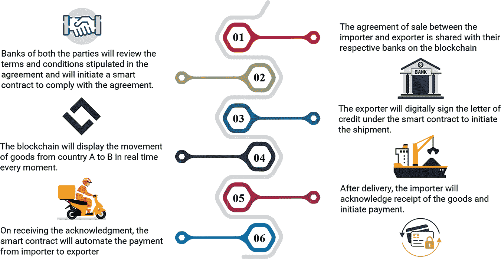

**图 10.1** 贸易金融中各方及其角色。

卖方和买方国家的银行充当可靠的中介来处理现金以换取货物。买方要求他的银行向卖方银行发出信用证以换取货物。目前，有几个中心化的可信中介机构充当公务员，如中央对手方（CCP）保证交易所交易，中央证券存管处（CSD）提供证券结算；环球银行金融电信协会（SWIFT）在全球货币转移中充当调解人，CLS 银行处理外汇交易结算等等。少数银行控制着代理银行，更少的银行向大量投资机构提供保管服务。

在这种贸易金融系统中，所有参与者都要求维护与交易相关的自己的数据库，并且所有这些数据库都需要不断地相互对账。单份文件中的一个错误可能会导致其副本中出现同样的差异，或者可能会在其他数据库中创建另一个差异。许多订单管理系统希望这样做是在线完成的，但这个过程消耗了大量的時間。基于区块链的贸易金融可以通过消除这些耗时的手工过程、文件和官僚作风，成为简化贸易流程的工具。有了区块链，就无需保存同一文件的多个副本。这是因为信息可以整合到一个单一的数字文件中，实时更新并可供所有参与者访问。

报告表明，分布式账本能够在峰值时段处理整个交易日的成交量，以达到所需的水平，这相当于 1 亿 1500 万笔日常交易，或者在测试条件下，连续五小时内每秒处理 6300 笔交易（保管信托和清算公司，2018）。

### 10.2.1 智能合约

交易合同是一种商业协议，无论是以物理形式还是书面形式，都是由复杂法律语言构成的，商业双方中的任何一方都很难理解。与其用法律术语，这些合同更好的描述方式是使用 Python 编程语言的代码，这样交易者可以更好地理解它们。2010 年，美国证券交易委员会还建议，资产支持证券中规定的条款和条件应以计算机语言制定（美国证券交易委员会，2010）。

在这种环境中，区块链为智能合约提供了理想的平台。智能合约结合了协议和用户界面，以正式化和保障新的关系，例如商业形式、合同法和账户控制。尽管在没有可信中介的情况下，双方之间共享数据库或部署智能合约是可能的；然而，谁将建立信任呢？双方都不会信任对方的数据、格式、标准和程序，也不会在对方的节点上运行智能合约。这就是区块链应运而生的地方；它不仅是在云端的一台计算机，还是多个节点上的共享平台，由共识算法支持，由密码学保护。它本质上设计为对每笔交易进行审计，没有修改或省略的余地。

通过自动化关键合同阶段——搜索、谈判、承诺、表现和裁决——交易可以得到保障，开支可以减少，小额交易变得可行。如今，许多金融交易，包括股票交易，很大程度上是由基于价格信号做出买入或卖出决定的算法完成的。一个基于动量的算法可能会推荐买入订单，而另一个相反的算法可能会推荐卖出订单。证券交易所的软件在没有人工干预的情况下，根据某些复杂规则在两个算法之间做出决定。在区块链上部署的智能合约可以在没有交易所的场外市场实现类似的输出。

因此，结合智能合约的区块链为贸易投资者提供了一个安全、透明、可审计和自动化的交易环境。智能合约可以根据贸易合同的条款进行自动化，物流状态可以根据事件驱动机制更新，支付可以根据预定的程序激活。这就是区块链网络如何减轻实体店运营中需要中心权威验证交易的需求。

### 10.2.2 企业资源计划

组织大多使用带有通用数据库的企业资源计划（ERP）软件，为众多部门实时提供单一版本的事实。它确保了更好的管理和内部控制（参见图 10.2）。再次，区块链本身就是一个分布式账本，共享一个通用数据库，并为所有参与节点提供单一版本的事实，而不受任何地理或行政辖区的影响。额外的好处是，在缺少可信中介的情况下，双方更容易采用像区块链这样的中立平台。同时，其他参与者——清关代理人、保险公司、货运公司和发展代理人——也将实时访问同一版本的事实。因此，这是区块链可以从试点跳跃到实际应用的一个领域（D'Monte，2018；Sanghvi，2018）。

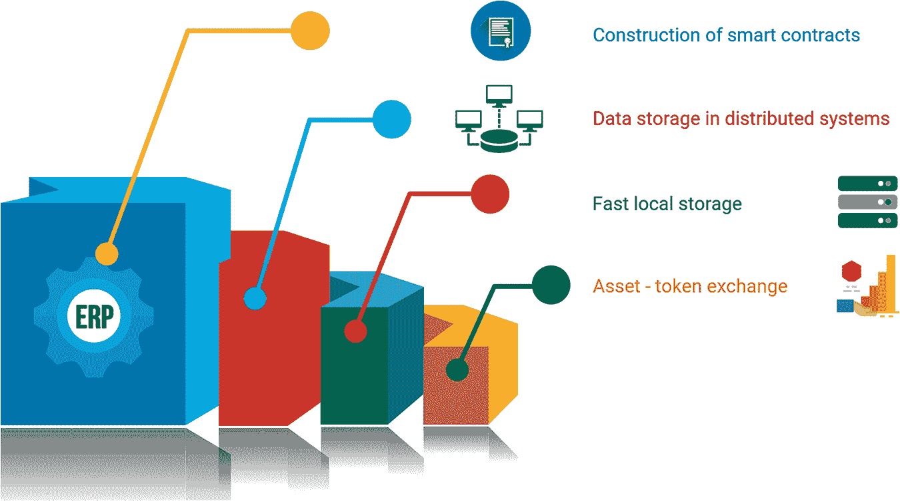

**图 10.2** 企业资源计划与区块链的集成。

### 10.2.3 数据存储库和注册表

全球金融危机后，2008 年，贸易存储库已经形成，以确保监管机构拥有关于金融系统风险和互联性的必要信息。2008 年后的金融在很大程度上依赖于数据存储库（例如，信用局）和注册表（例如，贷款注册表），这些存储库为各种交易提供验证数据。尽管这种信息对于提供信贷至关重要，但信用存储库存储的数据包含无意中的错误，如重复，系统一直受到缺乏责任感、隐私丧失和过度成本的困扰。由于区块链是永久性和可审核的，因此可以提供一个真正的解决方案。

### 10.2.4 法定货币的令牌化

金融就是关于货币，随着时间的推移，如果直接在链上交易法定货币（美元、欧元、卢比等）而不是加密货币，可以实现更好的流动性和规模。最初，中央银行本身可能发行一种在区块链上流动的数字货币。然而，除非发行量足够大，否则覆盖初始运营成本和回报并不容易。

从报告中可以看出，区块链已经占据了庞大的市场份额，全球有 2.95 亿加密货币用户。日本是加密货币交易的先驱，已经宣布了支付服务法，以规范加密货币及其用于交易目的的使用。在日本之后，美国万事达卡和纽约梅隆银行允许用户交易某些加密货币。同样，亚马逊、赛百味、微软商店、Expedia、Overstock 等已开始接受比特币支付。到 2022 年，超过 22,000 个交易场所采用了加密货币支付。

在欧洲联盟（法国于 2014 年跟进）中，德国也合法化了比特币，并仍然是区块链解决方案的领导者。此外，加拿大已经验证了比特币交易所，但限制了其使用以防止洗钱。澳大利亚是已经有效合法化加密货币的国家之一。政府已经征收资本利得税并将其视为一种资产。

根据世界经济论坛（Statista, 2021）进行的全球消费者调查，尼日利亚是使用加密货币最多的国家之一。主要原因似乎是向国外汇款的高费用。由于地区内相对较小的传统系统，金融科技全面发展的前景很高，因为金融业和地方政府给予了强有力的支持。利益相关者正在逐步将区块链视为新兴的颠覆者和推动者，并正在研究和培养该技术，以确保不排除从其潜在利益中受益。

菲律宾作为一个大惊喜，成为继越南之后加密货币用户数量第三大的国家。尽管存在基础设施挑战和竞争，乌克兰和俄罗斯在加密货币采用方面是领导者。

亚洲是全球领导者，拥有 5900 万加密用户。然而，亚洲各国之间存在明显的差异，中国、香港和新加坡走在前列。中国对区块链的渴望超出了加密货币，正如其在五年计划中所宣布的，并正在提供有利的监管环境。令人惊讶的是，中国政府在世界上最迅速的行动之一中禁止了加密货币交易和挖矿。尽管如此，中国政府仍在追求区块链技术和其他非同质代币的使用，只要技术仍在其控制之下。

其他国家，如越南、泰国和巴基斯坦也名列其中，印度的加密货币用户超过 1.07 亿。亚洲在区块链发展的生态系统方面已经发展得最为全面，得到了监管支持，以及风险投资家和行业参与者的资本动员。尽管中东地区许多国家仍然不允许与区块链相关的活动，但该地区也在迎头赶上。

在拉丁美洲，缩短的政治不确定性和风险缓解效果使得基于区块链的金融产品变得有吸引力。一些国家，如秘鲁、阿根廷、巴西和智利，已经开始行动，但整个地区缺乏技术基础设施、足够的风险资本融资和监管沙盒以实现开放采用。

当加密货币作为一种法定货币的替代品形成一个坚实的基础时，值得我们深思并采纳法定货币的规范化代币化。

### 10.2.5 闪电网络

闪电网络，依赖于区块链的底层技术，可以创建一个安全的参与者网络，以高体积和高速度进行交易，使用其原生智能合约语言。假设两个参与者想要一天内交易多次。最初，他们将创建一个多签名钱包，可以用各自的私钥访问。然后，他们在该钱包中存入一定金额，之后，他们之间可以进行无数次交易。由于所有交易仅限于他们两人之间，这更像是在共享钱包内进行资金再分配。每次交易时，他们都使用私钥签署更新后的资产负债表。但是，只有在通道关闭时才会实际分配资金。一旦通道关闭，区块链上只传输有关初始贡献和最终余额的信息。这样，闪电网络使用户能够在主链之外进行无数次交易，然后将它们记录为区块链上的一次交易。这样，在区块链上强制执行的信心下，实现了体积和速度。

### 10.2.6 交易前和交易后流程

证券的交易和结算分为三个阶段：（一）交易前的授权和批准；（二）交易执行；（三）结算。由于在技术基础设施上进行了大量投资，交易执行已经高度自动化，以将延迟减少到微秒级。区块链每秒处理七笔交易，任何区块链要达到证券交易所的速度都是几乎不可能的。因此，证券交易所可能会继续运作，但涉及低效和碎片化遗留系统的交易前后流程，可以通过实施区块链来增强。

区块链可以消除交易前检查和交易确认中现金和证券的不确定性。由于股息和股票分割由智能合约控制，并且在交收时采用交收对支付的基础，我们不再需要保管机构、经纪商或托管人。通过中央对手方提供的结算——包括空头交易、保证金交易和净结算，可以通过智能合约复制，而托管人——可以运行权限区块链，在此区块链上进行结算。

然而，预测事物为时尚早，因为新的业务组织和公司治理协议可能在近日到来。它可能是一个算法规则（Du Pont，2017 年）；没有实体的企业（Verstein，2017 年），或者具有万无一失代码的去中心化自治组织（DAO）。

### 10.2.7 账户和审计

会计在数字化方面一直是相对较慢的领域。它需要与现行严格的监管要求相匹配，这些要求涉及数据的完整性和有效性。所以会计可能是另一个可能被区块链取代的领域。

专家们认为，该技术将简化合规程序并简化传统的复式簿记。企业无需根据交易收据保持单独的记录，而是可以直接将交易合并到单一账本。账本中的所有条目都将分布式。因此，记录将更加透明和安全的。区块链将充当数字公证人，验证所有交易。在应用程序中，区块链智能合约可以用来自动支付发票。

### 10.2.8 潜在好处

区块链可以在改善商业组织和金融机构的活动方面发挥重要作用。

#### 10.2.8.1 去中心化

在传统的贸易金融中，如果一个中心信任机构在一段时间内关闭，整个系统就会停止运行。2014 年，英国实时大额结算系统（RTGS）经历了九小时的停机时间（德勤，2014 年）。尽管所有银行和其他机构都在运营，但在这一时期，高价值交易无法进行。使用分布式账本的好处是，区块链在节点失败或与网络断开连接的情况下是分区抵抗的，因为所有节点都携带相同数据的副本。节点其余部分继续运行。

#### 10.2.8.2 信息传输

供应商融资过程需要大量的手动文档，从供应商发起采购订单和汇票，到向银行提交发票和运输文件。区块链允许交易各方——银行、运输公司、代理商、出口商和进口商——分享一个共同的分布式账本进行贸易实践。商业文件可以数字化，以通过智能合约实现贸易过程的自动执行。由于各方之间的关键信息流将通过事件驱动机制进行，大部分贸易摩擦和商品交接的痛苦可以转化为工作流状态的实时响应。这将消除用于验证商业物流、货物交付和支付参考的重复性手动检查（参见表 10.1）。

**表 10.1** 全球贸易痛点及使用区块链平台潜在的好处。

| 序号 | **问题** | **全球贸易担忧** | **区块链解决方案** |
| --- | --- | --- | --- |
| 1 | 信任机制 | 依赖于授权的中心方（例如，银行）来处理贸易金融。 | 不可篡改的、基于共识的、分布式的账本网络，为贸易环境创造有利条件 |
| 2 | 篡改问题 | 恶意企图可能导致欺诈和贸易争端；当局在贸易各方之间建立信任。 | 永远保存合同条款及其修正案在区块中；减轻篡改问题。 |
| 3 | 使用的工具 | 基于纸张，手工流程；跨国界交付耗时长。 | 在一个安全且共享的账本上部署数字化文件。 |
| 4 | 交易风险 | 风险敏感；依赖授权的第三方。 | 风险减轻。通过共识机制确保信任 |
| 5 | 提单（B/Ls） | 提单展示需要大量文件工作。在交接过程中复杂的所有权转移。 | 数字化操作；最小的交接和交付时间；基于区块链的身份识别，无需展示提单 |
| 6 | 信息传输和成本效益 | 手工流程，耗时且成本高；集中数据，容易受到网络攻击或系统故障。 | 事件驱动的共识与智能合约；具有成本效益和防篡改功能。在联盟链上安全性隐私担忧较少 |
| 7 | 可追溯性 | 由于多方参与而导致的复杂交易流程；追踪资产身份、所有权和运输状态的不确定性。 | 成员数据库，易于追溯；提供信用评级，承诺更好的用户体验 |

#### 10.2.8.3 物联网融入

在贸易金融的任何时候都没有自动化，卖方需要大约四到五天时间才能根据相关文件从银行收款。这个过程阻碍了卖方的流动资金。对于所有参与者——银行、客户和供应商——实时追踪发票和交易的运动都很困难。参与者在邮件中了解到发票的状态。

这暗示着支付是在货物交付或通知后产生的，这阻碍了业务的顺利进行。区块链通过部署智能合约（Wu 等人，2017 年）实时提供货物和文件状态的并行通知。此外，物联网启用的操作，如机器对机器交易、源追踪、物流和航运（Panarello 等人，2018 年）可以方便业务合作伙伴准确追踪货物和供应品。

#### 10.2.8.4 防御机制

在传统的贸易流程中，发票在交易过程中经过多人之手，导致文档篡改和资金支付给错误实体的机会众多。此外，网络攻击者潜伏着，企图对系统造成巨大损害。拜占庭容错机制通过（i）在完全隔离的计算机网络上运行的大量节点上复制数据和（ii）加密完整性检查，提供了强大的防御，以防止篡改或任何恶意攻击。因为只有一个真相来源，只有当所有相关方达成一致并验证时，交易才能被处理。

#### 10.2.8.5 透明度

区块链账本不仅不可逆转，而且值得信赖。它消除了任何恶意活动或欺诈的可能性，从而减轻了任何认证的可信方或共识机制的义务。此外，它允许用户验证他们的身份，不受任何地理边界的限制，并为身份验证创建了可追溯的审计（Mainelli，2017）。因此，所有权的转移和身份的验证可以更加便捷、透明和可审计（参见表 10.2）。

**表 10.2** 区块链对贸易金融的影响。

| 序号 | **维度** | **区块链的影响** |
| --- | --- | --- |
| 1. | 透明度 | 通过全球账本进行交易的可审计轨迹 |
| 物理财产的数字化以及参与节点使用共享数据库进行关键交易的协作验证 |
| 在共同的分布式账本上实现不可篡改的交易 |
| 减少交易过程中的假冒和伪劣商品或文件 |
| 为参与者提供访问交易记录的权限 |
| 2. | 信息传输 | 启用经过验证且带有时戳的交易广播 |
| 通过智能合约自动执行贸易活动 |
| 3. | 可追溯性 | 商品的物理流动 |
| 实时通知 |
| 4. | 去中介化 | 无第三方干预的贸易文件的现金结算和有效性检查 |
| 5. | 成本 | 简化行政流程 |
| 缩短延迟并减少交易费用 |
| 6. | 物联网的融入 | 促进存储跟踪记录 |

#### 10.2.8.6 去中介化

在贸易实践中，许多中介机构发挥其作用，最终阻碍了交易过程。区块链将不同的贸易团体联合成一个没有中介机构的单一交易网络，自动确认贸易文件，加快现金结算过程。

#### 10.2.8.7 企业贷款

寻求贷款的企业客户与牵头安排人协调并管理辛迪加成员。牵头安排人代表客户进行 KYC，创建一个愿意为贷款的一定比例提供资金并分散风险的成员辛迪加。区块链可以通过牵头安排人的数字身份为客户实现即时 KYC。它通过智能合约实现实时融资。

#### 10.2.8.8 成本效率

在信用证融资中，与海上航线相关的贸易行政和物流交接阻碍了商业流程，并使其在支付选项下（如公司间贸易信贷（Clark, 2014））的竞争力降低。区块链将通过减少文档和支付给中央服务提供商的成本来简化贸易流程和降低开支。

#### 10.2.8.9 忠诚度奖励

忠诚度积分是企业文化中客户保持策略的一个重要组成部分。从银行到电子钱包，再从批发商到零售商，每个组织都以不同的方式提供基于忠诚度的激励措施。这些机构推出了各种奖励积分计划，用于在特定的销售点或一组卖家处兑换。积分奖励有助于将客户的一部分支付货币化，并保持与机构的联系。

区块链协议创建了一个算法生成的标准忠诚度代币，这是参与节点发布所有种类奖励的基础。这个代币可用于发起和执行任何交易——发行、兑换或交换。积分数量和忠诚度代币的唯一标识符在每位参与者的账本上更新，并在整个网络上提供。区块链平台可以容纳不同类型的组织及其忠诚度计划，特别是在它们的积分的转换和交换方面。该网络还促进商家、客户和银行之间的协调、共识和即时兑换，无需任何清算所。

### 10.2.9 即将到来的挑战和补救措施

#### 10.2.9.1 安全

安全和身份以及金融一样，是主要的关注点。一个拥有超过 50%挖矿能力的参与者可以计划通过在虚拟上完全控制区块链来进行攻击。尽管区块链上有一个分叉，攻击者仍然可以通过以下步骤进行逐步伪造交易：(i)发布具有预期价值的挖矿软件；(ii)通过创建具有粘性的池（庞氏骗局）；(iii)形成不想要的联盟；(iv)与其他池（包括食肉池）一起攻击其他池；(v)最终转为仅限成员。

在这种情况下，可以采用多重签名过程，即 MultiSig，来提高钱包安全性。虽然创建脚本有助于解决许多问题，但由于脚本的复杂性，交易可能配置不正确。如果出现这种情况，由于解锁脚本无法生成，使用错误配置脚本的比特币将被丢弃（Park, 2017）。

#### 10.2.9.2 存储容量

在不久的将来，区块链在存储容量方面可能存在问题，因为交易历史不断交织在一起。这个问题可以通过只允许中央中介写入信息来解决，但这将减少共识需求（Mills 等人，2016）。

#### 10.2.9.3 区块时间

目前，比特币每秒处理 4.6 笔交易，而维萨每秒处理大约 1700 笔交易（每天 1.5 亿笔交易），其电力消耗仅为比特币的一小部分（Del Rio, 2017）。

如今，比特币区块谜题的解决时间在最少三秒到最多五十分钟之间。降低工作量证明（PoW）的复杂性将减少花费的时间，但如果区块生成的时间过短，则可能会发生区块链分叉（Chen, Jiang, 和 Wang, 2017）。林等人（2020）提出了一种基于抵押模型而非概率模型的改进区块链共识算法，一个具有横向扩展能力的跨链协议，这将支持链间消息传输；以及一个高性能的跨链区块链网络结构，它可以通过验证处理每秒超过一千笔交易。

#### 10.2.9.4 隐私

尽管透明度是区块链的一个优点，但它仍然对隐私构成威胁。通过与支付相关的公钥，可以追踪加密货币的持有者。使用软件工具，可以访问并通过公钥收集的信息创建行为地图，包括他的支付选择、消费能力以及交易频率。

为了解决隐私问题，Del Rio（2017）提出了一种基于证明人的区块链系统，其中系统中的任何节点都不具备完整的信息集。由于可信的第三方将参与验证交易，这将确保更大的机密性。唯一的缺点是，如果一个或多个节点包含任何伪造信息，系统将崩溃，验证将不可能进行，因为没有谁会有账本的全份拷贝。在这种情况下，可以采用比特币雾或促进匿名性的暗钱包，通过一系列脚本来实现匿名性（Irwin 和 Turner，2018）。

#### 10.2.9.5 网络攻击

在没有任何中央权威的区块链系统中，可以进行全球范围内的交易，而无需验证个人身份。这可能会鼓励非法活动的开发，例如毒品交易、洗钱和金融恐怖主义（Chen，Jiang 和 Wang，2017）。

近年来，像 WannaCry 这样的勒索软件攻击已经影响了 150 个国家中的 300,000 多台计算机。如果投资者的加密密钥丢失，他们可能会遭受巨大的经济损失，因为大多数情况下攻击是立即发生的，且不可逆转（Mills 等人，2016）。Irwin 和 Turner（2018）以及 Stefan（2018）指出，需要制定监管程序以防止欺诈和洗钱活动。

#### 10.2.9.6 健壮性

贸易和金融需要全天候的服务，以确保没有停机时间进行交易。初创企业的一个担忧是预见区块链基础产品软件需求的增加，以便他们的业务可以无缝增长。这将需要决策能力增强的软件、更高水平的自动化，以及将传统软件概念升级为适应区块链的版本（Almeida，Albuquerque 和 Silva，2019）。将智能合约适应区块链将有助于网络恢复其力量（Kumar，Mookerjee 和 Shubham，2018）。

#### 10.2.9.7 法律执行

区块链系统到目前为止一直是由有意识形态动机的计算机专业人士或极客主导的，他们对商业方面不够细致。在现实世界的金融领域，他们必须面对不仅富有且强大的现有玩家的竞争，而且这些玩家还深深植根于当前的法律和监管框架中。因此，为了将现实世界的金融带入区块链，代码和法律必须共存。

政策制定者处于是否继续现状的未监管状态，还是激励新技术的困境。独裁状况可能会鼓励非法组织在没有规范这些活动的情况下获利（Ducas 和 Wilner，2017）。另一方面，适应性监管的发展可能导致国家竞争优势的丧失，因为金融科技初创企业可能会最终迁移到全球其他地区更有利的司法管辖区。

其他问题与暗网相关，包括金融风险（信用或流动性风险）、网络安全以及加密货币的波动性。然而，由于只有 3000 个网页中的一个能被日常搜索引擎看到，互联网上 80–98%的信息存在于暗网中，因此暗网对普通用户来说是遥不可及的。同样，也需要解决加密货币不稳定等问题，在过去两年里，加密货币经历了前所未有的增长，伴随着剧烈的波动（Stefan，2018）。

任何新技术的采用往往难以理解其将采取的路径。在处理重大市场创新时，历史充满了早期实施与监管认可之间的差距的例子。法律合规和监管机构的监管，依赖于稳定和最优替代方案，是任何此类创新进入金融系统的先决条件。目前，这一框架似乎不足，特别是在区块链之类的颠覆性技术与金融体系相提并论时。

然而，最近的市场趋势表明，在新兴市场中正在发生概念验证阶段，迫使政府和政策制定者观察并制定区块链的监管程序。

## 10.3 拍卖流程

拍卖是邀请多个服务提供商或供应商竞争性报价以出售或购买商品或服务的流程。竞争参与者可能知道也可能不知道其他竞争者的身份或资质。这是一个自动化拍卖流程的智能合约（参见图 10.3；代码单元 10.3）。

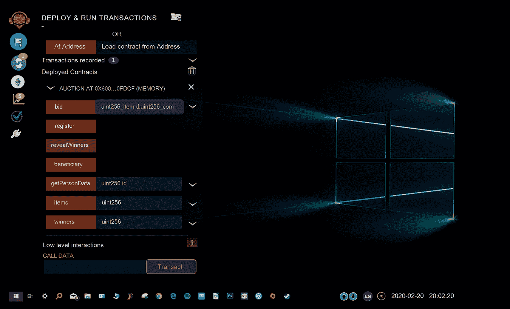

**图 10.3** 使用 remix IDE 部署智能合约。

```
pragma solidity ⁰.4.17;
contract Auction {

// Data
//Structure to hold details of the item
   struct Item {
     uint itemId; // id of the item
     uint[] itemTokens; //tokens bid in favor of the item
   }

//Structure to hold the details of a persons
   struct Person {
     uint remainingTokens; // tokens remaining with bidder uint personId; // it serves as tokenId as well address addr;//address of the bidder
   }

   mapping(address => Person) tokenDetails; //address to person
   Person [4] bidders;//Array containing 4 person objects

   Item [3] public items;//Array containing 3 item objects
   address[3] public winners;//Array for address of winners
   address public beneficiary;//owner of the smart contract

   uint bidderCount=0;//counter

   //functions

function Auction() public payable{ //constructor 

    //Task 1\. Initialize beneficiary with address of smart contract’s owner
    //constructor,"msg.sender" is the address of the owner.
// ** Start code here. 1 line approximately. **/ 
   beneficiary = msg.sender;
    //** End code here. **/
    uint[] memory emptyArray;
    items[0] = Item({itemId:0,itemTokens:emptyArray});

    //Task 2\. Initialize two items with at index 1 and 2.
// ** Start code here. 2 lines approximately. **/ 
items[1] = Item({itemId:1,itemTokens:emptyArray}); 
    items[2] = Item({itemId:2,itemTokens:emptyArray});
    //** End code here**/
}
function register() public payable{ 

   bidders[bidderCount].personId = bidderCount;

//Task 3\. Initialize the address of the bidder 
    /the bidders[bidderCount].addr be initialized with address of the registrant.*/

    // ** Start code here. 1 line approximately. **/
    bidders[bidderCount].addr = msg.sender;
//** End code here. ** 

    bidders[bidderCount].remainingTokens = 5; //
only 5 tokens 
tokenDetails[msg.sender]=bidders[bidderCount]; 
    bidderCount++;
}
function bid(uint _itemId, uint _count) public payable{
   /*
    Bids tokens to a particular item.
    Arguments:
    _itemId -- uint, id of the item
    _count -- uint, count of tokens to bid for the item
   */
   /*
    Task 4\. Implement the conditions below.
     4.1 If the number of tokens remaining with the bidder is < count of tokens bidded, revert.
     4.2 If there are no tokens remaining with the bidder, revert.
     4.3 If the id of the item for which bid is placed, is greater than 2, revert. "tokenDetails[msg.sender].remainingTokens" gives the details of the number of tokens remaining with the bidder.
   */

    // ** Start code here. 2 lines approximately. **/
    if (tokenDetails[msg.sender].remainingTokens<_count || tokenDetails[msg.sender].remainingTokens == 0 || _itemId > 2) revert();

//** End code here. ** /*

   Task 5\. Decrement the remainingTokens by the number of tokens bid and store the value in balance variable.
"tokenDetails[msg.sender].remainingTokens" should be decremented by "_count". */ 
// ** Start code here. 1 line approximately. ** uint balance=tokenDetails[msg.sender].remainingTokens - _count;
//** End code here. ** 

   tokenDetails[msg.sender].remainingTokens=balance;
bidders[tokenDetails[msg.sender].personId].remainingTokens=balance;//updating the same balance in bidders map. 

   Item storage bidItem = items[_itemId];
   for(uint i=0; i<_count;i++) {
    bidItem.
    itemTokens.push(tokenDetails[msg.sender].personId);
  }
}
   // Task 6\. Create a modifier named "onlyOwner" to ensure that only owner is allowed to reveal winners
 // Use require to validate if "msg.sender" is equal to the "beneficiary".
  modifier onlyOwner {
   // ** Start code here. 2 lines approximately. ** require(msg.sender == beneficiary);
   _;
   //** End code here. **
  }

function revealWinners() public onlyOwner{

   /*
Iterate over all the items present in the auction. 
    If at least on person has placed a bid, randomly select the winner */

   for (uint id = 0; id < 3; id++) {
Item storage currentItem=items[id]; 
     if(currentItem. itemTokens.length != 0){
     // generate random# from block number
     uint randomIndex = (block.number / currentItem. itemTokens.length)% currentItem. itemTokens.length;

     // Obtain the winning tokenId
     uint winnerId = currentItem. itemTokens[randomIndex];

   /* Task 7\. Assign the winners.
   " bidders[winnerId] " will give the person object with the winnerId.
   you need to assign the address of the person obtained above to winners[id] */

// ** Start coding here *** 1 line approximately. 
   winners[id] = bidders[winnerId].addr;
   //** end code here*
   }
  }
}
assist:
    function getPersonDetails(uint id) public constant returns(uint,uint,address){
   return (bidders[id].remainingTokens,bidders[id].personId,bidders[id].addr);
  }
}

```

**代码单元 10.3** 使用智能合约的拍卖流程。

**使用 truffle 的 dApp 项目**

测试智能合约的代码<truffle test>显示在图 10.4 中；参见代码单元 10.4。

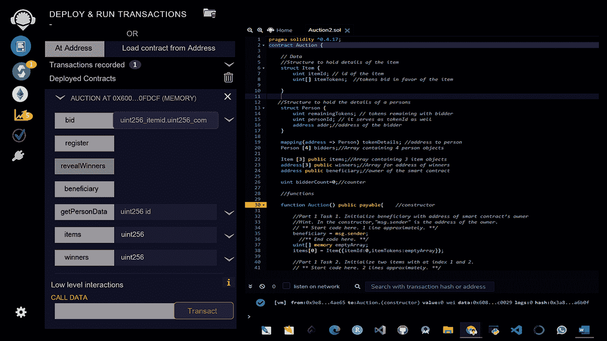

**图 10.4** 用于智能合约的 truffle 测试。

Truffle 为使用以太坊虚拟机（EVM）的区块链提供世界一流的开发环境、测试框架和资产管道，这使得开发者的工作变得容易。Truffle 拥有超过 150 万次的终身下载量，被广泛认为是区块链应用开发最受欢迎的工具。

```
let Auction = artifacts.require("./Auction.sol");

let auctionInstance;

contract('AuctionContract', function (accounts) {
   //accounts[0] is the default account
   //Test case 1
   it("Contract deployment", function() {
    //Fetching the contract instance of our smart contract
   return Auction.deployed().then(function (instance) {
    //We save the instance in a gDlobal variable and all smart contract functions are called using this auctionInstance = instance;
    assert(auctionInstance !== undefined, 'Auction contract should be defined');
    });
});

//Test Case
it("Should set bidders", function() { 
    return auctionInstance.register({from:accounts[1]}).then(function(result) {
     return auctionInstance.getPersonDetails(0); }).then(function(result) {
    assert.equal(result[2], accounts[1], 'bidder address set');
   })
 });

   //Test Case for checking if the bid is more than the token amount
   it("Should NOT allow to bid more than remaining tokens", function() {
    /**********
    Task 1: Call bid method from accounts[1] of Auction.sol using auctionInstance and
    pass itemId=0, count=6 as arguments
    To make a function call from account 1 use {from: accounts[1]} as an extra argument ***********/
    return auctionInstance.bid(0,6,{from:accounts[1]}) .then(function (result) {
    /*
This is to test for a negative condition and hence this particular block will not have executed if test case was correct. If this part is executed then throw an error and catch the error to assert false 
    */
    throw("Failed to check remaining tokens less than count");
   }).catch(function (e) {
   var a = e.toString();
   if(e === "Failed to check remaining tokens less than count") {
   /**********
   Task 2: An error that has been intentionally thrown. Should you assert true or false?
   Use assert(false) to assert false
     Use assert(true) to assert true
   ***********/
   assert(false);
   } else {
    /**********
     Task 3: assert the opposite here
     ***********/ assert(true);
    }
   })
});
it("Should NOT allow non owner to reveal winners", function() {
/********** 
Task 4: Call revealWinners from account 1 
    ***********/
return auctionInstance.revealWinners({from:accounts[1]}) 
    .then(function (instance) {
    /*
    This is to test for a negative condition and hence this particular block will not have executed if the test case was correct. If this part is executed then throw an error and catch the error to assert false
    */
    throw("Failed to check owner in reveal winners"); }).catch(function (e) {
    if(e === "Failed to check owner in reveal winners") {
/********** 
    Task 5: It's an intentionally thrown error.Should you assert true or false?
    Use assert(false) to assert false
    Use assert(true) to assert true
    ***********/
    assert(false);
   } else
     { /**********
     Task 6: assert the opposite here
     ***********/
     assert(true);
    }
   })
})
    it("Should set winners", function() {
    /**********
Task 7: Call register function from account 2 
   ***********/
    return auctionInstance.register({from:accounts[2]}) .then(function(result) {
   /**********
   Task 8: Call register function from account 3 ***********/
    return auctionInstance.register({from:accounts[3]}) }).then(function() {
   /**********
   Task 9: Call register function from account 4 ***********/
    return auctionInstance.register({from:accounts[4]}) }).then(function() {
   /********** Task 10: Call bid method from accounts[2] of Auction.sol using auctionInstance and pass itemId=0, count=5 as arguments
   ***********/
    return auctionInstance.bid(0,5,{from:accounts[2]}) }).then(function() {
   /**********
Task 11: Call bid method from accounts[3] of Auction.sol using auctionInstance and pass itemId=1, count=5 as arguments 
   ***********/ return auctionInstance.bid(itemId=1,count=5,{from:accounts[3]}) }).then(function() { /********** Task 12: Call bid method from accounts[4] of Auction.sol using auctionInstance and pass itemId=2, count=5 as arguments
    ***********/
    return auctionInstance.bid(itemId=2,count=5,{from:accounts[4]})
   }).then(function() {
   /**********
   Task 13: Call revealWinners function from accounts[0]
   ***********/
return auctionInstance.revealWinners({from:accounts[0]}) 
   }).then(function() {
   /**********
   Task 14: call winners function from accounts[0] to get the winner of item id 0
   ***********/
    return auctionInstance.winners(0,{from:accounts[0]}) }).then(function(result) {
   /**********
   Task 15: assert to see if the winner address is not the default address Default address is '0x0000000000000000000000000000000000000000' Use notEqual method of assert Parameters for notEqual : (result, default address , message);
   ***********/
     assert.notEqual(result, '0x0000000000000000000000000000000000000000', '')

   /**********
   Task 16: call winners function from accounts[0] to get the winner of item id 1
   ***********/
     return auctionInstance.winners(1,{from:accounts[0]}) }).then(function(result) {
   /**********
   Task 17: assert to see if the winner address is not the default address Default address is '0x0000000000000000000000000000000000000000' Use notEqual method of assert Parameters for notEqual : (result, default address , message);
   ***********/
     rassert.notEqual(result, '0x0000000000000000000000000000000000000000', '')
   /**********
   Task 18: Call winners function from account 3 to get the winner of item id 2
   ***********/
     return auctionInstance.winners(2,{from:accounts[0]}) }).then(function(result) {
   /**********
   Task 19: assert to see if the winner address is not the default address
    Default address is '0x0000000000000000000000000000000000000000'
      Use notEqual method of assert
      Parameters for notEqual : (result, default address , message);
   ***********/
    assert.notEqual(result, '0x0000000000000000000000000000000000000000', '')
   })
   });
});

```

**代码单元 10.4** 用于智能合约的 truffle 测试。

实现拍卖智能合约的 dApp 显示在代码单元 10.5 中。

```
App = {
     web3Provider: null,
     contracts: {},
     names: new Array(),
     url: '[`127.0.100.94.1231`](http://doi.org/127.0.100.94.1231)',
     President:null,
     currentAccount:null,
     init: function() {
       $.getJSON('../proposals.json', function(data) {
var proposalsRow = $('#proposalsRow'); 
       var proposalTemplate = $('#proposalTemplate');

for (i = 0; i < data.length; i ++) { 
       proposalTemplate.find('.panel-title').
       text(data[i].name);

       proposalTemplate.find('img').attr('src', data[i].picture);
       proposalTemplate.find('.btn-vote').attr('data-id', data[i].id);

proposalsRow.append(proposalTemplate.html()); 
       App.names.push(data[i].name);
      }
    });

   return App.initWeb3();
},

initWeb3: function() {
     // Is there is an injected web3 instance?
    if (typeof web3 !== 'undefined') {
App.web3Provider = web3.currentProvider; } else { 
    // If no injected web3 instance is detected, fallback to the TestRPC
    App.web3Provider = new Web3.providers.HttpProvider(App.url);
   }
   web3 = new Web3(App.web3Provider);
     App.populateAddress();
    return App.initContract();
},
     initContract: function() {
    $.getJSON('Ballot.json', function(data) {
   // Get the necessary contract artifact file and instantiate it with truffle-contract
    var voteArtifact = data;
    App.contracts.vote = TruffleContract(voteArtifact);

// Set the provider for our contract 
App.contracts.vote.setProvider(App.web3Provider); 

   App.getPresident();
   return App.bindEvents();
  });
},

    bindEvents: function() {
   $(document).on('click', '.btn-vote', App.handleVote);
   $(document).on('click', '#win-count', App.handleWinner);
   $(document).on('click', '#register', function(){ var ad = $('#enter_address').val(); App.handleRegister(ad);
  });
},

    populateAddress : function(){ new Web3(new Web3.providers.HttpProvider(App.url)).
eth.getAccounts((err, accounts) => { 
   jQuery.each(accounts,function(i){
     if(web3.eth.coinbase != accounts[i]){
       var optionElement = '<option value="'+accounts[i]+'">'+accounts[i]+'</option';
       jQuery('#enter_address').append(optionElement);
    }
   });
  });
},
getPresident : function(){ 
   App.contracts.vote.deployed().then(function(instance) {
return instance.President(); 
}).then(function(result) {
App.President = result.toString(); 
App.currentAccount = web3.eth.coinbase; 
  if(App.President != App.currentAccount){ jQuery('#address_div').css('display','none');
   jQuery('#register_div').css('display','none');
  }else{
    jQuery('#address_div').css('display','block');
    jQuery('#register_div').css('display','block');
   }
  })
},

handleRegister: function(addr){

  var voteInstance;
  App.contracts.vote.deployed().then(function(instance) {
   voteInstance = instance;
   return voteInstance.register(addr);
  }).then( function(result){
if(result.receipt.status == '0x01') 
   alert(addr + " is registered successfully")
  else
   alert(addr + " account registeration failed due to revert")
  }).catch( function(err){
   alert(addr + " account registeration failed")
  })
},

handleVote: function(event) { 
   event.preventDefault();
   var proposalId = parseInt($(event.target).data('id'));
   var voteInstance;

  web3.eth.getAccounts(function(error, accounts) {
   var account = accounts[0];

  App.contracts.vote.deployed().then(function
    (instance) {
   voteInstance = instance;

   return voteInstance.vote(proposalId, {from: account});
  }).then(function(result){
if(result.receipt.status == '0x01') 
    alert(account + " voting done successfully")
    aelse
aalert(account + " voting not done successfully due to revert") 
    a}).catch(function(err){
    aalert(account + " voting failed")
   });
  });
},
    handleWinner : function() {
var voteInstance; 
App.contracts.vote.deployed().then(function(instance) { 
voteInstance = instance; return voteInstance.Winner(); 
   }).then(function(res){
     alert(App.names[res] + " is the winner ! :)"); }).catch(function(err){ console.log(err.message); }) } }; $(function() { $(window).load(function() { App.init();
    console.log('starting app.js');
   });
});

```

**代码单元 10.5** 实现拍卖智能合约的 dApp。

## 10.4 去中心化金融

去中心化金融（DeFi）是一种基于区块链的新型金融技术，被加密货币使用。它与现有的金融网络不同，因为它开放且可编程。任何有互联网连接的人都可以使用它，而无需任何权威机构的批准。它通过点对点的金融网络、安全协议、连接性、软件和硬件的进步来运作。它通过智能合约及其背后的条件自动运作，没有中央权威，这使得开发者能够构建安全的去中心化金融应用。它使开发者能够构想新的支付、投资、借贷、交易、兑换等模型，而无需受到银行和机构的影响。像 Aave、Compound、MakerDAO 和 Uniswap 这样的 DeFi 公司已经在开发这样的产品，允许点对点金融、计算加密货币持有产生的利息，以及通过去中心化交易所进行交易等。

DeFi 是一个包含许多不同功能和应用的宽泛术语。当前的金融生态系统属于中心化金融，包括像印度储备银行这样的中心化银行，它们围绕再融资利率设定输入。DeFi 不涉及任何这样的监管机构或中央银行，完全消除了银行和机构对货币、金融产品和金融服务的影响。

在中心化金融中，您的资金由银行、金融机构或企业持有，这些机构作为交易的保证人。这给他们带来了巨大的自由度来赚钱。金融体系充满了第三方，它们促进各方之间的资金流动，每个实体都为其服务收取费用。在 DeFi 中，智能合约取代了金融机构在交易中的位置。这里的智能合约是一个以太坊账户，可以持有、发送或返回资金，前提是一系列预设的条件。智能合约总是为了自动化而编程，一旦上线就不能更改。因此，买卖双方、贷款人和借款人进行点对点交易变得比公司或机构促进的交易更容易。因此，农民可以直接将他们的产品销售给终端用户，而无需任何中间商。他们可以接触到新的购买社区，并获得更多的股息。

DeFi 应用通过交易服务和个人钱包，让用户对自己的资金有更大的控制权。通常情况下，当人们购买加密货币并计划持有一段时间时，这些硬币暂时没有用处。通过使用 DeFi 借贷协议，人们可以把自己持有的加密货币作为抵押来获得贷款。这些贷款比从传统银行获得的贷款更容易且更经济。用户可以把钱存在安全的数字钱包里，而不是银行，需要时再转账。

### 10.4.1 DeFi 金融产品

点对点金融交易是 DeFi 背后的主要前提之一。P2P DeFi 交易是两个各方同意用加密货币交换商品或服务的交易，不涉及第三方。在中心化银行系统中，当客户去银行申请贷款时，银行会检查他的信用记录，完成了解你的客户（KYC）过程，然后计算任何抵押品的价值。

在 DeFi 平台上，借款人使用去中心化金融应用程序（dApp）输入他的贷款需求，算法将他的条件与贷款人的条件相匹配。然后，在所有贷款报价中，借款人必须同意任何一个贷款人的条款以获得贷款。

现在，借款人和贷款人聚集在一起执行智能合约。借款人用自己的加密货币作为抵押，从平台上获得贷款，而贷款人则将他的法定货币交给平台以获得一些利息。一旦交易记录在区块链上，您就会在同伴验证后收到贷款金额。

DeFi 下的点对点借贷并不意味着完全无利息和费用。一旦客户收到贷款，贷款人可以从约定的时间开始向客户提供贷款。当你通过你的 dApp 付款时，它遵循共识过程，再次在区块链上进行；因此，钱转给了贷款人。

如果交易员有互联网连接，他可以使用软件从任何地方征集、交易和借贷，该软件在一个分布式金融数据库中记录并验证金融操作。

### 10.4.2 DeFi 中的总锁定价值

总锁定价值是所有在所有 DeFi 平台上为金融目的而锁定的、借用的、池化的或用于其他金融活动的加密货币的总和。它也可以代表用于金融活动的特定加密货币的总和，如以太坊或比特币。

### 10.4.3 去中心化金融的使用案例

DeFi 协议为全球用户开辟了新的经济活动和机会。这是一个集成的、组织良好的努力，在以太坊上建立一个平行金融系统，挑战中心化服务作为更易于访问、灵活和透明。

#### 10.4.3.1 资产管理

在 DeFi 空间中，用户是自身数据的拥有者。他们是自己加密基金的监护人，拥有从购买、出售和转移加密货币到赚取数字资产利息的一切权力。像 Argent、Gnosis Safe 和 MetaMask 这样的加密货币钱包帮助用户安全地与去中心化应用程序互动。MetaMask 将您的种子短语、密码和私钥以加密格式存储在您的设备上，因此只有您才能访问您的账户和数据。

#### 10.4.3.2 代币化

[代币化](https://wiki.example.org/tokenization)是去中心化金融（DeFi）和以太坊区块链的核心功能。代币是一种在区块链上创建、发行和管理的网络运营工具。代币内置了保护措施和功能。基于以太坊的代币成为全球用户安全、数字化使用、交易和储存价值的选项。

#### 10.4.3.3 代币化衍生品

基于以太坊的智能合约允许创建代币化衍生品，其价值依赖于底层资产的表现。去中心化金融（DeFi）衍生品可以代表现实世界资产，如法定货币、债券、商品以及加密货币等。

#### 10.4.3.4 去中心化交易所

去中心化交易所（DEXs）是允许用户进行点对点交易并保持对资金控制的加密货币交易所。由于它们依赖于区块链，因此不受中央权威机构的控制。

去中心化交易所（DEX）为代币项目提供了与中心化交易所相媲美的流动性。DEX 由于减少了价格操纵、黑客攻击和盗窃的风险，因为加密货币资产从未落在交易所手中。当前 DeFi 领域流行的 DEX 包括 AirSwap、Liquality、Mesa、Oasis 和 Uniswap。DeFi 流动性数据的聚合器，如 MetaMask Swap，通过为 DeFi 用户提供独特见解来优化交易体验，使他们能够识别最佳报价。

#### 10.4.3.5 去中心化自治组织

去中心化自治组织（DAO）根据编码在以太坊区块链上的透明规则进行合作。DeFi 领域的一些流行协议已经推出了 DAO，用于筹款、金融操作和对社区的去中心化治理。例如 Maker 和 Compound。

#### 10.4.3.6 数据分析与评估

由于在交易数据和网络活动方面无与伦比的透明度，去中心化金融（DeFi）协议有能力发现、分析和决策与金融机会和风险管理相关的数据。DeFi 应用的爆炸式增长导致了多种工具和仪表板的发展，如 DeFi Pulse，帮助用户评估平台风险、追踪收盘价以及跨 DeFi 协议比较流动性。

#### 10.4.3.7 支付

点对点支付可以说是 DeFi 领域和整个区块链生态系统的核心应用之一。DeFi 支付解决方案正在通过创建一个对无银行账户人群更开放的经济系统，引领简化市场基础设施，更好地服务于批发和零售客户。

#### 10.4.3.8 借贷

点对点借贷协议是 DeFi 生态系统中使用最广泛的应用之一。Compound DeFi 是该领域指数级增长机会的一个有力例证。它是一个基于算法的自主利率协议，与 DeFi 平台集成。它允许用户通过在以太坊上提供一个利率市场来对他们提供给借贷池的加密货币赚取利息。Compound 智能合约自动匹配借款人和出借人，并根据借款比例计算利率。随着越来越多产品继续集成 Compound 协议，越来越多的加密货币资产即使在不活跃状态下也能赚取利息。

#### 10.4.3.9 身份

将 DeFi 协议与基于区块链的身份系统相结合，可以帮助那些账户被冻结的用户重新获得对全球经济系统的访问权限。对于那些没有传统数据点的人来说，比如多余的资金、土地所有权或资产，DeFi 解决方案可以降低抵押品要求。它可以通过声誉和财务活动等属性来评估用户信用。任何有互联网连接的人都可以使用 DeFi 应用，同时保持对他们的数据和资产的控制。

#### 10.4.3.10 了解你的交易

在 DeFi 领域，以太坊的去中心化框架使得围绕参与者地址的行为而不是其身份进行下一代合规性分析成为可能。这些了解你的交易（KYT）有助于进行实时风险评估，防范欺诈和金融犯罪。

在传统金融中，反洗钱（AML）和反恐融资（CFT）的合规性依赖于 KYC 指南。在 DeFi 领域，以太坊的去中心化框架使得围绕参与者地址的行为而不是其身份进行下一代合规性分析成为可能。这些 KYT 有助于实时风险评估，防范金融违规行为。

#### 10.4.3.11 保险

市场上出现了一系列新的保险选项，帮助用户购买保险并保护他们的持仓。然而，DeFi 仍然是一个新兴平台，存在与智能合约漏洞和渗透相关的风险。

#### 10.4.3.12 保证金交易

在传统金融中，保证金交易者通常通过从经纪人那里借款来投资他们的业务，这会为贷款创建抵押品；而 DeFi 保证金交易是由去中心化、非托管借贷协议驱动的。

#### 10.4.3.13 市场

DeFi 协议支持各种在线市场，使用户能够在全球范围内交换产品和服务的。

DeFi 协议中的可组合性允许系统中的不同组件轻松连接和互操作。可组合代码创造了一个强大的网络效应，社区继续在他人创建的基础上进行构建。从 Truffle 的智能合约库和 Infura 的 API 套件到 Diligence 的安全工具，以太坊开发者现在可以利用全栈工具和安全集成来构建和部署适合他们需求的 DeFi 协议。

#### 10.4.3.14 游戏

DeFi 可组合性为各种垂直领域中的产品开发人员开辟了新的道路，直接将 DeFi 协议构建到平台中。由于其底层经济和创新激励模型，基于以太坊的游戏已成为去中心化金融的流行应用。PoolTogether 是一个无损失审计的储蓄彩票，允许用户通过存入 Dai 稳定币购买数字门票，然后将这些代币汇集在一起，向结合货币市场协议放贷以赚取利息。

#### 10.4.3.15 收益农耕

收益农耕是 DeFi 最具前景的应用之一，用户通过将加密货币锁定在交易所交易平台运行的智能合约中来获得代币。该协议允许加密持有者利用现有代币来农耕更多加密代币，从而节省时间和金钱。这为流动性提供者提供了激励，他们将加密资产锁定在基于智能合约的流动性池中（参见图 10.5）。这些激励可以是交易费用的百分比，借款人的利息等。

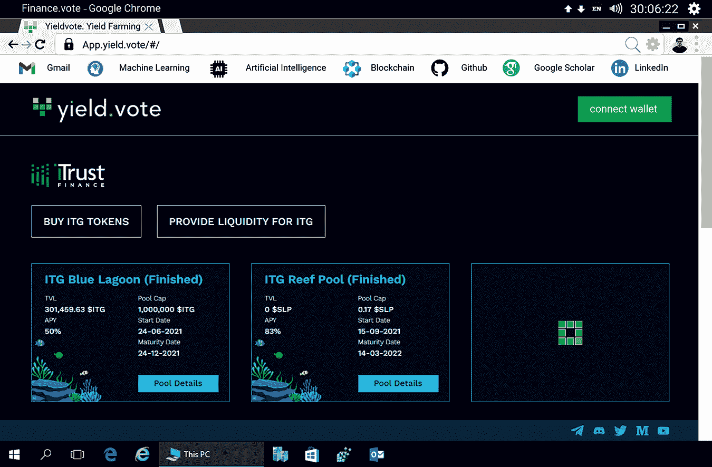

**图 10.5** Yield.vote 作为 DeFi 平台。

收益农耕允许以额外加密货币的形式锁定加密资产以产生更高的回报或奖励。为此类型的农耕采用了许多不同的策略，最受欢迎的是 Yearn.Finance。它持续将用户代币在多个借贷平台之间移动，以在区块链（如以太坊）上实现更高的回报。

**运营机制**

DeFi 是一种编程代码，而收益农耕是一种基于简单逻辑的应用。借助这些智能合约，您的资金被编程执行各种功能。这为任何拥有电脑和互联网连接的人参与全球经济提供了一个独特的机会。通过将 DeFi 应用于收益农耕，用户锁定他们的加密代币持有量，并根据预先存在的智能合约从中获得利息。这类似于投注加密代币，但区别在于运营机制。

收益农业通过多个智能合约和流动性提供者（LP）运作。以太坊区块链是这些应用程序最受欢迎的底层技术。字面上，LP 是向智能合约提供资金或流动性的用户，主要用于在系统中换取奖励。这个池子用来创建一个市场，用户通过支付费用在这个智能合约系统中借贷或交换他们的加密货币代币。这部分费用的一部分作为奖励给 LP（与奖励金额成比例）。LP 获得的奖励也是一种 ERC-20 代币。

然而，DeFi 存在风险，即资产在存入流动性池后价格发生变化，造成未实现损失。另一个风险是技术可能存在漏洞，你可能会失去你的钱。

### 10.4.4 作为 DeFi 平台的以太坊

以太坊是一种新的经济体系，由代码驱动，为金融接入、机会和信任设定了新标准。由于几个原因，以太坊是 DeFi 的完美土壤：

+   没有人拥有或控制以太坊或其上的智能合约。这使得每个人都平等地使用去中心化金融（DeFi），但需遵守某些限制。

+   许多 DeFi 产品在以太坊平台上无缝协作。参与人或成员可以在完全不同的应用程序上的不同市场交换利息代币。

+   以太坊是迈向完全金融独立的一个美好步骤，在这里，你的资金永远不会受到任何第三方的控制。

#### 10.4.4.1 全球快速资金转账

与比特币类似，以太坊使得全球转账像发送电子邮件一样简单。它旨在以一种安全的方式执行全球交易。要发送或接收付款，用户需要一个钱包。他输入收款人的以太坊名称服务（ENS）或他的账户地址，指定金额将瞬间转入他的账户。

#### 10.4.4.2 全球范围内流送资金

人们还可以在以太坊上流送资金。它允许组织支付其员工的薪水。当员工（用户）需要资金时，以太坊让他们随时访问自己的资金。如果用户不想发送或流送 ETH，也可以在以太坊上访问稳定币等替代币。

#### 10.4.4.3 可编程资金

任何人都可以编程到支付中——只有在以太坊上才可能的代币默认功能。这允许控制和比特币的安全性相结合，再加上金融机构提供的服务。因此，通过以太坊可以进行投资指数基金、借贷、安排支付以及许多比特币无法实现的交易。

#### 10.4.4.4 访问稳定币种

加密货币的波动性是大多数金融产品和一般消费的问题。去中心化金融（DeFi）社区通过稳定币解决了这个问题。稳定币的价值与另一种资产挂钩，比如美元。像美国美元币（USDC）这样的硬币，其价值在几美分内保持稳定，这使得它们适合用于赚取或零售。许多拉丁美洲人在不确定时期使用稳定币来保障他们的储蓄。

#### 10.4.4.5 借用

去中心化提供商通常执行两种类型的交易，点对点交易，借款人直接从特定的贷款人那里借款；以及基于池的交易，贷款人向池提供资金，借款人可以从池中借款。

从去中心化贷款人那里获得贷款可能有许多优势：

+   从银行借款，围绕那个交易中涉及的人员。在银行向个人放贷之前，确保有关方面有偿还贷款的可能性是强制性的。去中心化借贷在借款人的抵押品担保上进行贷款交易，而无需识别任何方，如果借款人未能偿还贷款，这自动变成贷款人的权益。一些贷款人也接受非同质化代币作为抵押品。它允许借款人在不提供借款人信用检查或个人信息，如独特资产的情况下借款。

+   当一个人使用去中心化贷款人时，他们可以访问世界各地的资源，而不仅仅是存放在选定银行或机构中的钱。这使得以合理利率获得贷款更加容易。

+   借款人可以在不卖出他们的 ETH 的情况下获得所需的资金。借款人可以用 ETH 作为稳定币贷款的抵押品，而不是卖出 ETH。

    闪电贷款是一种更实验性的去中心化借贷形式，允许借款人在不提供抵押品或任何个人信息的情况下借款。它的运作前提是贷款在同一笔交易中借出并偿还。如果无法偿还，交易将回滚，好像什么都没发生一样。经常使用的资金存放在流动性池中，我们知道这些大资金池用于借款。这为某人借用这些资金、用它们做业务并如果在给定时间点没有使用，全额偿还它们创造了机会。

    有可能有人会使用闪电贷款以相同的价格借入更多资产，然后在一个不同的交易所出售，那里的价格更高。在这种情况下，以下事件可能在一个单一交易中发生，这可能涉及多个逻辑：

    +   ● 用户从交易所 A 以 1.00 美元的价格借入 X 金额的资产。

    +   ● 他用 1.10 美元的价格在交易所 B 出售 X 资产。

    +   ● 他将贷款还给交易所 A。

    +   ● 他保留了利润，减去交易费用。

    +   ● 如果交易所 B 的供应突然下降，交易将会失败，因为用户无法购买足够的资产来覆盖原有的债务。

+   在传统金融中，这些赚钱策略只有那些拥有大量资产或资金的人才能接触到。闪电贷款也适用于那些没有足够的资产来赚钱的人。

#### 10.4.4.6 借贷

参与者可以通过出借他们的加密货币来赚取利息，这些利率远高于当地银行的利率。它允许客户实时观察他们的资金增长。

例如，参与者用他的十枚稳定币，比如 Dai，支付产品。他收到十份 Dai 产品（pDai），这是一种代表他以 Dai 计价的贷款的代币。他的 pDai 会根据他们可以看到的增加钱包余额的利率不断增加。根据年化利率（APR），几天或几小时后，他的钱包余额将增加，比如 10.01。他可以在任何时间点提取与他 pDai 余额相等数量的标准 Dai 代币。

#### 10.4.4.7 无损彩票

像 PoolTogether 这样的无损彩票是一种新颖的储蓄方式。在此之下，参与者可以用十枚 Dai 代币购买十张彩票，从而获得代表他十张彩票的十份 lDai。如果参与者赢得彩票，他的 lDai 余额将增加他从奖金池中赚取的金额。如果他没有赢，他的十份 lDai 将留在池中，他将在下周的抽奖中再次有机会赢取。与此同时，参与者可以随时提取与他 lDai 余额相等数量的标准 Dai 代币。

#### 10.4.4.8 交易所代币

去中心化交易所（DEX）允许客户随时交易不同的代币。像以太坊这样的平台上有着成千上万的代币，这就像一个货币交易所，但功能更加强大。去中心化金融（DeFi）版本全年 365 天、每天 24 小时运行。因此，客户可以无缝地访问资金。DEX 允许客户根据需要用他们的以太币（ETH）交换代币，并随时取回。

#### 10.4.4.9 高级交易

在中心化交易所交易时，交易员必须存入他的资产，并信任交易所会照顾好他的资产。奇怪的是，资产属于客户，其安全性变成了交易所的责任。通过去中心化交易，你可以获得全球流动性，交易员的资产始终在他手中和控制之下。此外，对于那些更喜欢更多控制的交易员，还有更高级的选项，如限价单、永续合约、保证金交易等。

**在智能合约中实现限价单的基本 Solidity 代码**

（参见代码单元 10.6）

```
// SPDX-License-Identifier: BITS

pragma solidity 0.8.11;

import "@openzeppelin/contracts/utils/cryptography/
draft-EIP712.sol";
import "./OrderMixin.sol";
import "./OrderRFQMixin.sol";

contract LimitOrderProtocol is
    EIP712("1inch Limit Order Protocol", "2"),
    OrderMixin,
    OrderRFQMixin
{
    // solhint-disable-next-line func-name-mixedcase
    function DOMAIN_SEPARATOR() external view
returns(bytes32) {
        return _domainSeparatorV4();
    }
}
OrderMixin.sol
// SPDX-License-Identifier: BITS

pragma solidity 0.8.11;

import "@openzeppelin/contracts/utils/Address.sol";
import "@openzeppelin/contracts/utils/cryptography/
draft-EIP712.sol";
import "@openzeppelin/contracts/utils/cryptography/SignatureChecker.sol";

import "@openzeppelin/contracts/token/ERC20/IERC20.sol";
import "./helpers/AmountCalculator.sol";
import "./helpers/ChainlinkCalculator.sol";
import "./helpers/NonceManager.sol";
import "./helpers/PredicateHelper.sol";
import "./interfaces/InteractiveNotificationReceiver.
sol";
import "./libraries/ArgumentsDecoder.sol";
import "./libraries/Permitable.sol"; 
/// @title Regular Limit Order mixin
abstract contract OrderMixin is
    EIP712,
    AmountCalculator,
    ChainlinkCalculator,
    NonceManager,
    PredicateHelper,
    Permitable
{
    using Address for address;
    using ArgumentsDecoder for bytes;

    /// @notice Emitted every time order gets filled,
including partial fills
    event OrderFilled(
        address indexed maker,
        bytes32 orderHash,
        uint256 remaining
    );

    /// @notice Emitted when order gets cancelled
    event OrderCanceled(
        address indexed maker,
        bytes32 orderHash,
        uint256 remainingRaw
    );

    // Fixed-size order part with core information
    struct StaticOrder {
        uint256 salt;
        address makerAsset;
        address takerAsset;
        address maker;
        address receiver;
        address allowedSender; // equals to Zero
address on public orders
        uint256 makingAmount;
        uint256 takingAmount;
    }

    // `StaticOrder` extension including variable-sized
additional order meta information 

   struct Order {
      uint256 salt;
      address makerAsset;
      address takerAsset;
      address maker;
      address receiver;
      address allowedSender; // equals to Zero address on public orders
      uint256 makingAmount;
      uint256 takingAmount;
      bytes makerAssetData;
      bytes takerAssetData;
      bytes getMakerAmount; // this.staticcall(abi.encodePacked(bytes, swapTakerAmount)) => (swapMakerAmount)
      bytes getTakerAmount; // this.staticcall(abi.encodePacked(bytes, swapMakerAmount)) => (swapTakerAmount)
      bytes predicate; // this.staticcall(bytes) => (bool)
bytes permit; // On first fill: 
      permit.1.call(abi.encodePacked(permit.selector, permit.2))
      bytes interaction;
    }

    bytes32 constant public LIMIT_ORDER_TYPEHASH = keccak256(
        "Order(uint256 salt,address makerAsset,address takerAsset,address maker,address receiver,address allowedSender,uint256 makingAmount,uint256 takingAmount,bytes makerAssetData,bytes takerAssetData,bytes getMakerAmount,bytes getTakerAmount,bytes predicate,bytes permit,bytes interaction)"
      );
      uint256 constant private _ORDER_DOES_NOT_EXIST = 0;
      uint256 constant private _ORDER_FILLED = 1;

      /// @notice Stores unfilled amounts for each order plus one.
      /// Therefore 0 means order doesn't exist and 1 means order was filled
      mapping(bytes32 => uint256) private _remaining;

/// @notice Returns unfilled amount for order. 
Throws if order does not exist function remaining(bytes32 orderHash) external view returns(uint256) {
      uint256 amount = _remaining[orderHash];
      require(amount != _ORDER_DOES_NOT_EXIST, "LOP: Unknown order");
      unchecked { amount -= 1; }
      return amount;
   }

      /// @notice Returns unfilled amount for order
      /// @return Result Unfilled amount of order plus one if order exists. Otherwise 0 function remainingRaw(bytes32 orderHash) external view returns(uint256) {
      return _remaining[orderHash];
   }

      /// @notice Same as `remainingRaw` but for multiple orders
function remainingsRaw(bytes32[] memory orderHashes) external view returns(uint256[] memory) { 
      uint256[] memory results = new uint256[](orderHashes.length);
      for (uint256 i = 0; i < orderHashes.length; i++) {
          results[i] = _remaining[orderHashes[i]];
      }
      return results;
  }

      /**
      * @notice Calls every target with corresponding data. Then reverts with CALL_RESULTS_0101011 where zeroes and ones
      * denote failure or success of the corresponding call
      * @param targets Array of addresses that will be called
       * @param data Array of data that will be passed to each call
      */
function simulateCalls(address[] calldata targets, bytes[] calldata data) external { 
            require(targets.length == data.length, "LOP: array size mismatch");
bytes memory reason = new bytes(targets.length); 
            for (uint256 i = 0; i < targets.length; i++) {
                  // solhint-disable-next-line avoid-low-level-calls

                  (bool success, bytes memory result) = targets[i].call(data[i]);
if (success andand result.length > 0) { 
                        success = result.length == 32 andand
result.decodeBool();
            }
            reason[i] = success ? bytes1("1") :
    bytes1("0");
            }

            // Always revert and provide per call results
            revert(string(abi.encodePacked("CALL_RESULTS_",
   reason)));
      }

      /// @notice Cancels order by setting remaining amount to zero function cancelOrder(Order memory order) external {
            require(order.maker == msg.sender, "LOP: Access denied");

            bytes32 orderHash = hashOrder(order);
uint256 orderRemaining = _remaining[orderHash]; 
            require(orderRemaining != _ORDER_FILLED, "LOP: already filled");
            emit OrderCanceled(msg.sender, orderHash, orderRemaining);
            _remaining[orderHash] = _ORDER_FILLED;
    }
            /// @notice Fills an order. If one doesn't exist (first fill) it will be created using order.makerAssetData
      /// @param order Order quote to fill
      /// @param signature Signature to confirm quote ownership
      /// @param makingAmount Making amount
      /// @param takingAmount Taking amount
      /// @param thresholdAmount Specifies maximum allowed takingAmount when takingAmount is zero, otherwise specifies minimum allowed makingAmount
        function fillOrder(
          Order memory order,
          bytes calldata signature,
          uint256 makingAmount,
          uint256 takingAmount,
          uint256 thresholdAmount
       ) external returns(uint256 /* actualMakingAmount */, uint256 /* actualTakingAmount */) {
return fillOrderTo(order, signature, makingAmount, takingAmount, thresholdAmount, msg.sender);
   }

      /// @notice Same as `fillOrder` but calls permit first,
      /// allowing to approve token spending and make a swap in one transaction.
      /// Also allows to specify funds destination instead of `msg.sender`
      /// @param order Order quote to fill
      /// @param signature Signature to confirm quote ownership
      /// @param makingAmount Making amount
      /// @param takingAmount Taking amount
      /// @param thresholdAmount Specifies maximum allowed takingAmount when takingAmount is zero, otherwise specifies minimum allowed makingAmount
      /// @param target Address that will receive swap funds
/// @param permit Should consist of abiencoded token address and encoded `IERC20Permit.permit` call. 
      /// @dev See tests for examples function fillOrderToWithPermit(
          Order memory order,
          bytes calldata signature,
          uint256 makingAmount,
          uint256 takingAmount,
          uint256 thresholdAmount,
          address target,
          bytes calldata permit
) external returns(uint256 /* actualMakingAmount */, uint256 /* actualTakingAmount */) { 
       require(permit.length >= 20, "LOP: permit length too low");
       (address token, bytes calldata permitData) = permit.decodeTargetAndData();
       _permit(token, permitData);
       return fillOrderTo(order, signature, makingAmount, takingAmount, thresholdAmount, target);
    }

      /// @notice Same as `fillOrder` but allows to specify funds destination instead of `msg.sender`
      /// @param order Order quote to fill
      /// @param signature Signature to confirm quote ownership
      /// @param makingAmount Making amount
      /// @param takingAmount Taking amount
      /// @param thresholdAmount Specifies maximum allowed takingAmount when takingAmount is zero, otherwise specifies minimum allowed makingAmount
      /// @param target Address that will receive swap funds
      function fillOrderTo(
        Order memory order,
        bytes calldata signature,
        uint256 makingAmount,
        uint256 takingAmount,
        uint256 thresholdAmount,
        address target
   ) public returns(uint256 /* actualMakingAmount */, uint256 /* actualTakingAmount */) {
     require(target != address(0), "LOP: zero target is forbidden");
    bytes32 orderHash = hashOrder(order);

    { // Stack too deep
        uint256 remainingMakerAmount = _remaining[orderHash];
require(remainingMakerAmount != _ORDER_FILLED, "LOP: remaining amount is 0"); 
        require(order.allowedSender == address(0) || order.allowedSender == msg.sender, "LOP: private order");
        if (remainingMakerAmount == _ORDER_DOES_NOT_EXIST) {
           // First fill: validate order and permit maker asset
           require(SignatureChecker.isValidSignatureNow(order.maker, orderHash, signature), "LOP: bad signature");
           remainingMakerAmount = order.makingAmount;
           if (order.permit.length >= 20) {
              // proceed only if permit length is enough to store address
              (address token, bytes memory permit) = order.permit.decodeTargetAndCalldata();
_permitMemory(token, permit); 
              require(_remaining[orderHash] == _ORDER_DOES_NOT_EXIST, "LOP: reentrancy detected");
         }
   } else {
         unchecked { remainingMakerAmount -= 1; }
   }

   // Check if order is valid
if (order.predicate.length > 0) { 
      require(checkPredicate(order), "LOP: predicate returned false");
   }

// Compute maker and taker assets amount 
if ((takingAmount == 0) == (makingAmount == 0)) { 
         revert("LOP: only one amount should be 0");
      } else if (takingAmount == 0) {
         uint256 requestedMakingAmount = makingAmount;
if (makingAmount > remainingMakerAmount) { 
           makingAmount = remainingMakerAmount;
       }
       takingAmount = _callGetter(order.getTakerAmount, order.makingAmount, makingAmount, order.takingAmount);
       // check that actual rate is not worse than what was expected
// takingAmount / makingAmount <= thresholdAmount / requestedMakingAmount 
       require(takingAmount * requestedMakingAmount <= thresholdAmount * makingAmount, "LOP: taking amount too high");
     } else {
         uint256 requestedTakingAmount = takingAmount;
         makingAmount = _callGetter(order.getMakerAmount, order.takingAmount, takingAmount, order.makingAmount);
         if (makingAmount > remainingMakerAmount) {
            makingAmount = remainingMakerAmount;
            takingAmount = _callGetter(order.getTakerAmount, order.makingAmount, makingAmount, order.takingAmount);
          }
          // check that actual rate is not worse than what was expected
          // makingAmount / takingAmount >= thresholdAmount / requestedTakingAmount

          require(makingAmount * requestedTakingAmount >= thresholdAmount * takingAmount, "LOP: making amount too low");
       }

       require(makingAmount > 0 andand takingAmount > 0, "LOP: can't swap 0 amount");
       // Update remaining amount in storage unchecked {
         remainingMakerAmount = remainingMakerAmount - makingAmount;
         _remaining[orderHash] = remainingMakerAmount + 1;
     }
     emit OrderFilled(msg.sender, orderHash, remainingMakerAmount);
   }

   // Taker => Maker
   _makeCall(
      order.takerAsset, abi.encodePacked(
      IERC20.transferFrom.selector,
      uint256(uint160(msg.sender)),
      uint256(uint160(order.receiver == address(0) ? order.maker : order.receiver)),
      takingAmount,
      order.takerAssetData
   )
 );
 // Maker can handle funds interactively if (order.interaction.length >= 20) {
   // proceed only if interaction length is enough to store address
      (address interactionTarget, bytes memory interactionData) = order.interaction.decodeTargetAndCalldata();
      InteractiveNotificationReceiver(interactionTarget).notifyFillOrder(
      msg.sender, order.makerAsset, order.takerAsset, makingAmount, takingAmount, interactionData
    );
  }

    // Maker => Taker _makeCall(
order.makerAsset, 
    abi.encodePacked(
       IERC20.transferFrom.selector,
      uint256(uint160(order.maker)),
      uint256(uint160(target)),
      makingAmount,
      order.makerAssetData
     )
   );

   return (makingAmount, takingAmount);
 }

 /// @notice Checks order predicate
 function checkPredicate(Order memory order) public view returns(bool) {
    bytes memory result = address(this).functionStaticCall(order.predicate, "LOP: predicate call failed");
    require(result.length == 32, "LOP: invalid predicate return");
    return result.decodeBool();
  }

  function hashOrder(Order memory order) public view returns(bytes32) {
   StaticOrder memory staticOrder;
   assembly { // solhint-disable-line no-inline-assembly
   staticOrder := order
  }
  return _hashTypedDataV4(
    keccak256(
      abi.encode(
          LIMIT_ORDER_TYPEHASH,
          staticOrder,
          keccak256(order.makerAssetData),
          keccak256(order.takerAssetData),
          keccak256(order.getMakerAmount),
          keccak256(order.getTakerAmount),
          keccak256(order.predicate),
          keccak256(order.permit),
          keccak256(order.interaction)
        )
      )
   );
 }

 function _makeCall(address asset, bytes memory assetData) private {
   bytes memory result = asset.functionCall(assetData, "LOP: asset.call failed");
   if (result.length > 0) {
     require(result.length == 32 andand result.
decodeBool(), "LOP: asset.call bad result");
  }
 }
 function _callGetter(bytes memory getter, uint256 orderExpectedAmount, uint256 amount, uint256 orderResultAmount) private view returns(uint256) {
    if (getter.length == 0) {
      // On empty getter calldata only exact amount is allowed
      require(amount == orderExpectedAmount, "LOP: wrong amount");
      return orderResultAmount;
    }else {
      bytes memory result = address(this).
functionStaticCall(abi.encodePacked(getter, amount),
"LOP: getAmount call failed"); 
      require(result.length == 32, "LOP: invalid getAmount return");
      return result.decodeUint256();
    }
  }
 }

```

**代码单元 8.6 **（#rc10-fea-0006）智能合约中的限价单。

#### 10.4.4.10 资金聚合

常见的投资者需要一个安全且组织良好的平台来跟踪他的所有投资、贷款和交易。在以太坊上有许多产品能够协调所有的去中心化金融（DeFi）活动。开发者可以构建界面，让投资者不仅能看到自己在各产品中的余额，还能利用去中心化金融开放架构上的所有功能。

#### 10.4.4.11 投资组合管理

在以太坊上有许多资产管理产品，试图根据客户的定制策略增长他的投资组合。它面向所有人，包含多种策略，并且自动运行。人类经理没有机会侵占客户的利润。例如，去中心化金融脉冲指数基金（DPI）是一个基金，它会自动平衡，以确定客户的组合总是包含市值最高的去中心化金融代币。客户可以随时从基金中提取资金，他永远不需要单独管理任何投资组合。

#### 10.4.4.12 二次筹资

以太坊为二次筹资开发了一种创新的筹资模式。二次筹资规定，获得最多资金的项目是那些有最独特需求的项目，这些项目旨在改善大多数人的生活。它有潜力改善未来所有公共商品的资金筹集方式。

二次基金是一个由捐赠资金组成的池，从一轮公共筹资开始。感兴趣的人可以通过捐一些钱来提高一个独特项目的需求。随着一轮的结束，资金池中的资金会在各项目之间分配，那些有最独特需求的项目将从匹配池中获取大部分份额。

二次筹资的核心是其匹配池。匹配池是一种公共商品融资模型，其中一个基金由政府或慈善机构提供，与项目收到的个人贡献相匹配。二次筹资强烈鼓励人们贡献，并确保资金的民主分配。匹配金额是通过使用二次筹资公式计算的，其中项目收到的资金与收到的贡献的平方根之和的平方成比例。

假设，以下发起三个共同利益的项目：

|  | 项目 A | 项目 B | 项目 C |
| --- | --- | --- | --- |
| 收到的资金 | 10,000 | 10,000 | 10,000 |
| 捐赠者数量 | 5 | 2 | 10 |
| 每单位贡献 | 2000 | 5000 | 1000 |

使用公式：

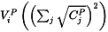

项目 A 的匹配金额：

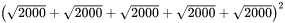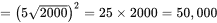

项目 B 的匹配金额：

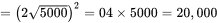

项目 C 的匹配金额：


**在 10 万美元的匹配池中**

池中 A 的份额将等于 = 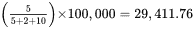

池中 B 的份额将等于 = 

池中 C 的份额将等于 = 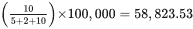

|  | 项目 A | 项目 B | 项目 C |
| --- | --- | --- | --- |
| 收到的资金 | 10,000 | 10,000 | 10,000 |
| 捐赠者数量 | 5 | 2 | 10 |
| 匹配资助 | 29,411.76 | 11,764.71 | 58,823.53 |
| 初始基金中的份额百分比 | **294.12%** | **117.65%** | **588.23%** |

它通过确保项目根据捐赠者数量进行优先排序，从而优化匹配资金。这样一来，资金流向了实际上能为更广泛目标造福公众的项目，而不是那些只有少数富有人支持的项目。

#### 10.4.4.13 众筹

假设潜在的资助者可以来自任何地方，以太坊及其代币对全世界任何人都开放。这是一个理想且透明的众筹平台，筹款人可以证明资金的来源、筹得的金额以及如何使用这些资金。以太坊上的筹款人可以设定一个具体的时间框架和一个指定的金额，以确保自动退款。

#### 10.4.4.14 保险

去中心化保险是一个更便宜、更透明的替代品。通过自动化，保险覆盖更加经济，赔付也更快。目前大多数保险产品主要集中在保护用户免受因潜在的漏洞和利用而造成的金钱损失。去中心化保险可以为没有接入传统保险的农民和零售商提供一个实惠的保险选择。

## 10.5 预测市场

预测市场是交换交易市场，事件的结果在其中进行交易。市场价格可以显示群体认为什么或者事件可能的结果是什么。这是一个投机市场，参与者不是赌一个产品、期权或加密货币，而是赌信息。准确地说，这是一个买卖二元事件期货合约的平台。市场的结构是这样的，个别合约的价格在 0 到 1 美元之间。一个参与者为结果*x*买一个 50 美分的合约，或者其补数*y*，如果结果是*x*，他会得到 1 美元，如果不是，则得到 0 美元。如果我们把合约价格*x*设定为*px*，那么*y*的理论价格将是 1-*px*。然而，实际上，由于市场动态，合约价格可能会稍低或稍高，以产生交易所的营收或购买合约的费用，或为了维持均衡而支付赔付。

例如，乌克兰能否在俄罗斯和乌克兰之间的战争中幸存？这里有两种可能性——它会幸存或不会幸存。如果你自信乌克兰不会幸存，你可以购买许多“否”合约。这些合约的成本在 0 到 1 美元之间。如果乌克兰没有幸存，那么“否”合约可以兑换 1 美元，“是”合约则没有价值。相反，如果它幸存下来，“否”合约将一文不值，而“是”合约则价值 1 美元。

与此同时，市场情绪将发生变化，合约的价值也会相应地波动。如果俄罗斯继续主导乌克兰，那么“否”合约的价格会上升，如果俄罗斯发起和解，可以假设俄罗斯正在变弱，“是”市场将开始回暖。与投机市场不同，预测市场上的合约作为证券存在，而不是孤立的赌注。这使得流动性显著提高，因为参与者不需要等到事件发生。这种流动性反过来又有助于价格搜索，因为具有相关洞察力的参与者可以利用暂时的价格偏差，而不是坚持他们的赌注。尽管它的工作原理与标准的投机市场相似，但预测市场比普通的投机平台更先进。当正确使用时，它可以证明是一个强大的预测工具。

詹姆斯·索罗维基（2005）在他的书中表示，对某些变量的大量估计很可能比大多数个别估计更接近真实值。预测市场遵循同样的原则，即群体的智慧总是优于少数专家所知道的数据。如果个别估计是基于深奥的知识和洞察，足够大的样本将能够产生所需的效果。然而，参与者的估计是独立的，反映了不同的观点，这就是为什么群体有时会表现得非常愚蠢，比如股市突然跳涨或下跌。尽管如此，只有存在这种强制性取消资格的因素，预测市场才能发挥作用。如果每个人都相信同样的事情，没有人会承担合同的另一方。潜在利润的对立面无疑是潜在的损失，这也是同样有价值的。潜在利润吸引拥有特殊知识的人加入市场，但不可能让一个群体的所有成员都拥有完美的直觉，因此社区将市场推向更接近现实的价位。

只要预测市场是去中心化的，它就可以是一个强大的工具。由于当地法规或所有者不愿列出某些合同，中心化平台今天提供的内容是不充分的。用户需要一个快速且不向第三方收取费用的平台。传统的中心化模型可以用基于区块链的方法替换成去中心化的替代品。这可以提供许多好处，如抗审查、消除中介和增加访问权限。

### 10.5.1 去中心化市场的范围

专家们认为，加密资产可以在改善这些市场方面发挥作用。目前美国市场的监管非常严格，参与其中会产生相对较高的费用。支持者认为，加密货币可以绕过这些问题。这是因为使用加密货币时，用户不需要依赖中心实体。以太坊的理念是，其代码中包含的规则可以指导项目中的某些行动。

加密领域最著名的预测市场有：

+   Augur

+   Gnosis 的 Omen

+   Polymarket

加密货币没有地理限制。全球用户都可以购买以太坊和其他支持预测市场的加密货币。购买后可以运送到世界上任何地方。中心化市场的费用通常高于以太坊的费用，尽管最近以太坊的费用也在上升，因为网络越来越受欢迎且拥挤。

多年来，一些预测市场被政府当局关闭。实际上，预测市场通常是由一方运营的。这意味着政府当局或恶劣实体可以轻易地关闭它们。向预测市场添加加密货币的一个优点是，用户可以在区块链上创建赌场。去中心化平台不受政府控制，因此它们不会那么容易被关闭。当系统由智能合约管理时，没有用户可以编辑或删除支撑市场的程序。系统默认执行合同，无需中介（Garg, 2021b, 2022b）。在预测市场中，智能合约汇集了投机者的资金，然后在市场的最后自动将其分配给赢家。然而，智能合约是相对较新技术，并且据观察，过去由于虫害或代码缺陷而导致了金钱损失。

区块链不需要管理员。正如预期的那样，在中心化平台上，用户不需要向任何第三方支付费用，因为交易是通过智能合约进行的。它还排除了对手方风险。

通过去中心化的预测市场，全球各地的个体可以自由地下注或向全球用户提供合同。因此，曾经影响物理或数字平台的地理和监管制裁可能不再是问题。

预言家数据服务将现实世界数据输入预测市场的智能合约。假设一个预测市场问：黄金价格明天会上涨吗？人们可以使用[goldprice.com](http://goldprice.com)作为预言家来源来预测投注日期的黄金价格。

但中心化预言家也有缺陷。假设一个投注者在地“是”上下了很多钱，有可能[goldprice.com](http://goldprice.com)可以被他黑掉。如果他成功黑掉[goldprice.com](http://goldprice.com)，那么他几乎肯定会赢。

避免此类麻烦可能有多种选择。一种选择可能是经济激励用户真实报告事件。在此之下，可以实施质押机制，要求用户转发代币进行报告。如果他们报告正确，他们将获得报酬，但如果他们作弊，他们将失去他们的质押。这种模式正在由 Augur 使用，Augur 是第一个为争议解决设计的区块链预测市场平台（Augur, 2022）。

目前，预测市场 Omen 也在尝试通过一个去中心化预言机来解决这个问题，该预言机从多个预言机编译数据并消除不准确数据的预言机。预测市场中的区块链预言机是一个相对较新的概念。作为一种新兴技术，我们还没有看到哪种预言机最适合不同类型的预测市场。几年前，Binance Research 在其报告中指出了一个预测市场的高度受欢迎的实现（Binance, 2019）的设计缺陷攻击以及其他一些缺陷。

### 10.5.2 预测市场的真实世界示例

#### 10.5.2.1 Augur

Augur 是一个基于以太坊 ERC-20 协议的去中心化预测市场，于 2014 年首次亮相。Augur 是加密预测市场空间的一个创新协议，旨在实现金融民主化（参见图 10.6）。Augur 的第一版于 2018 年 7 月在公共领域发布。


**图 10.6** Augur 投注平台。

**显著特点**

**用户生成市场**

在传统的预测市场中，每个用户都可以自由参与预测交易股份。通过支付小额费用，Augur 的任何用户都可以创建一个真实世界事件的预测市场。事件价格可以在 0%至 50%之间设定，创建者可以从交易费用中获得收益。

**低交易费**

Augur 的交易费用相当低（<1%），与中心化预测市场相比。声誉代币（REPs）的供应量也有限，为 1100 万，其中 80%在 2017 年的首次币发行（ICO）中售出。

**扩展范围**

Augur 仍然是领先的加密预测市场，在 2018 年成功的 ICO 启动后筹集了超过 500 万美元。Augur 在主网上推出了其 V2，支持 Dai 稳定币。它有效地解决了波动性问题。

#### 10.5.2.2 TotemFi

TotemFi 的平台即将在主网上线。它是一个基于投注的预测市场平台，在即将到来的市场领域中显示出很大的潜力（参见图 10.7）。

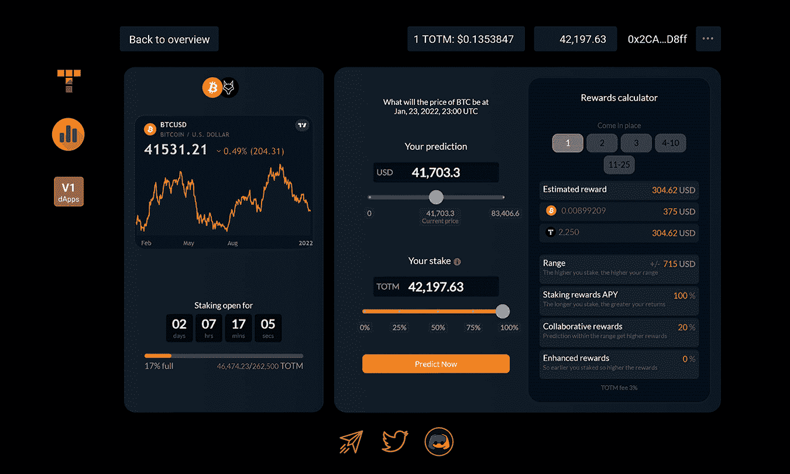

**图 10.7** TotemFi 预测平台。

**显著特点**

**非惩罚性预测**

TotemFi 代币提供非惩罚性预测，所以如果用户的预测错误，他们不会失去他们的初始股份。它是市场上唯一提供此类功能的平台。它努力改变资产类别和事件预测的方式，承担不准确性的损失，为用户提供更多激励进行股份投注和做出预测，并鼓励用户说出他们认为事件将如何结果。

**比特币奖励**

TotemFi 的平台提供本地 TOTM 代币以及比特币奖励，对于正确预测，避免了本地代币通货膨胀。它是唯一提供此功能的平台，有助于为其用户提供真实价值。

**合作奖励**

TotemFi 使用了“群体智慧”概念的最真实含义。如果预测池的加权平均值接近准确预测它所围绕的事件的结果，那些合作者将获得奖励。它促进了真正的协同预测方法。

#### 10.5.2.3 Finance.vote

在未来的日子里，Finance.vote 旨在构建一系列 dApps，为 DAOs 提供治理基础设施，并启动可持续的代币经济（参见 图 10.8；Finance.vote，2022）。Finance.vote 促进了去中心化的路径，并加快了进程。这使得项目能够专注于它们的使用案例和主要业务线。

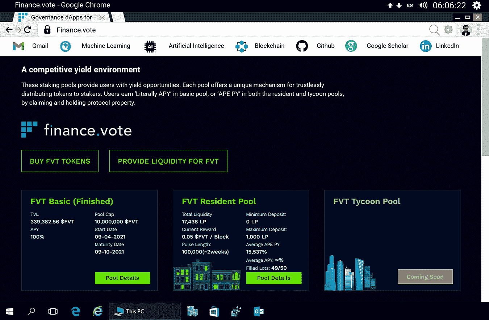

**图 10.8** Finance.vote 市场。

通过 Finance.vote dApp 套件，项目能够向投资者提供公平的代币发行、参与治理决策的激励、无需信任的锁仓计划、具有操作价值的市场洞察和交易信号，以及去中心化的流动性挖矿（参见 图 10.9）。

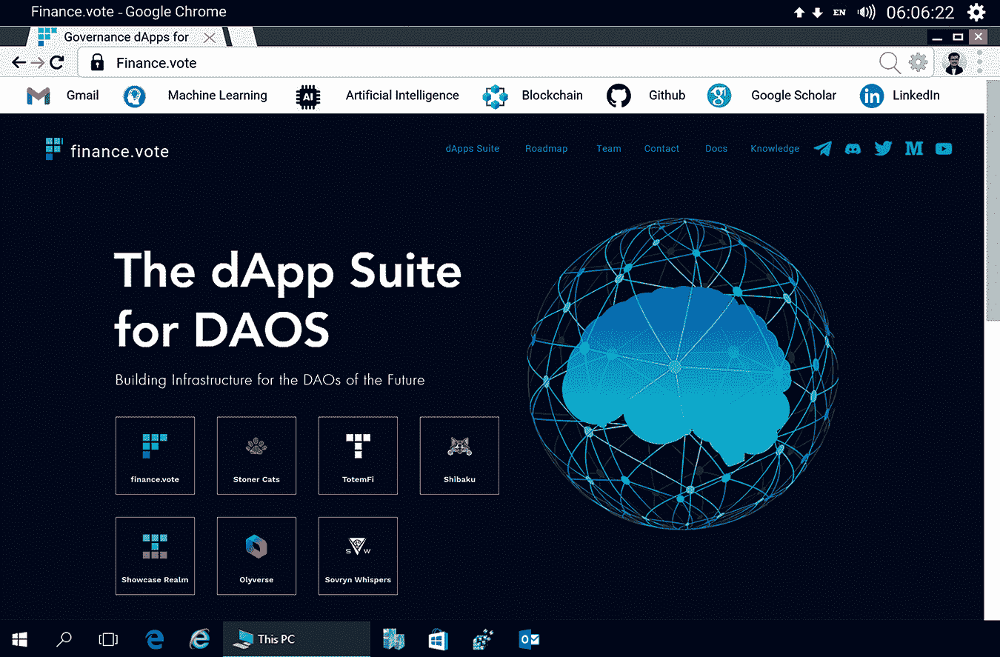

**图 10.9** Finance.vote 市场。

其中之一是 dApp Market.Vote，它是一个预测市场和集体智能工具。它使用二次投票和去中心化身份系统来策划新兴市场，并就资产的预期未来表现达成共识。

**显著特点**

**具有操作价值的市场洞察和阿尔法生成**

Market.vote 是 finance.vote 架构的重点区域。它允许用户超越无需许可系统的噪音，并专注于他们的关注资产。

**二次投票**

二次投票是一种集体决策方法，参与者可以选择支持或反对，表达他或她对某事的决心。这对于关心某个特定问题的少数选民有利。

**游戏化**

使用 Market.vote，用户可以对加密空间中的资产进行投票，以参加每周的比赛。他们可以通过赢得一部分每周奖励池来获得下一场比赛的投票权。

#### 10.5.2.4 OptionRoom

OptionRoom 是一个完全去中心化的预测协议，它使投资者能够猜测真实世界事件的结局（参见 图 10.10）。

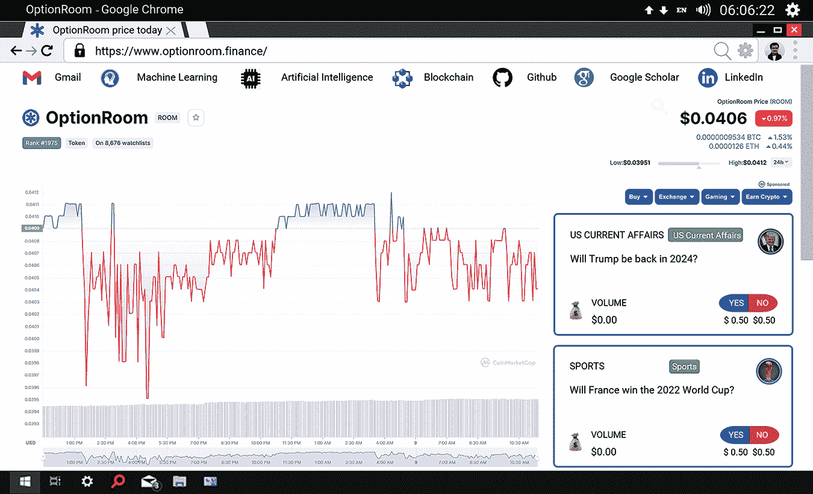

**图 10.10** OptionRoom 市场。

**显著特点**

**用户驱动的预言机**

OptionRoom 能够提供用户驱动的预言机，这是因为他们的独一无二且创新的“预言机即服务”引入了人在数据验证中的人为因素，通过用户治理共识解决预言机请求。这使他们能够处理定性和定量数据请求（OptionRoom，2022）。

**无限制的预测市场**

OptionRoom 是市场上唯一的预测协议，它降低了用户的进入门槛，简化了用户进入预测市场景观的流程，并提供了无限数量的市场。

**激励与奖励**

OptionRoom 为用户提供行业领先的激励措施，以鼓励创建预测市场报价，并满足 Oracle 请求标准，从而形成一个强大而活跃的社区，提供无限的预测市场并成功验证 Oracle 请求。

#### 10.5.2.5 Polymarket

Polymarket 于 2020 年在以太坊的 ERC-20 协议上推出。它是一个去中心化市场，用户可以交易全球最具争议的事件。Polymarket 预测主要围绕流行的事件，旨在防止错误信息的传播。

**显著特点**

**法币支持交易**

为了交易事件的结果，Polymarkets 使用了以美元支持的稳定币 USDC。

**简洁的用户界面**

Polymarket 通过其简单易用的平台，向广大用户提供预测事件的机会，该平台包括一个分步指南，用于全球范围内的融资和交易事件（参见图 10.11）。

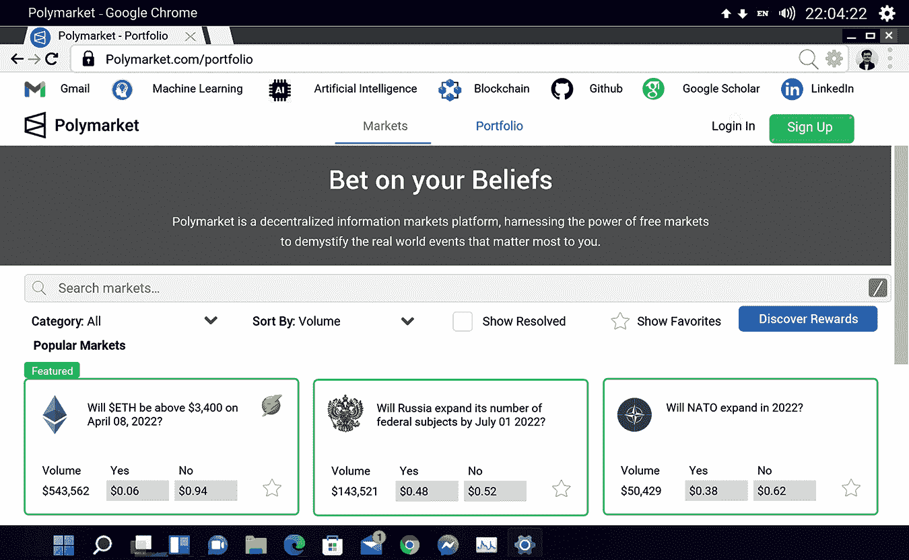

图 10.11 Polymarket。

**流畅的解决流程**

Polymarkets 平台能够自动解决事件的结果，而无需共识机制。

### 10.5.3 总结

+   预测市场意味着对结果下注。

+   Augur 是一个基于公共区块链的去中心化市场解决方案。

+   市场创建者在平台上发布市场事件。

+   市场报告人猜测事件的结果。

+   市场参与者可以使用他们的代币/加密货币作为赌注。

+   如果预测结果为真/假，参与者将赢得/失去奖品。

+   使用的代币称为声誉代币（REP 代币），用于在争议情况下下注，而交易货币是以太币。

+   股票、期货、产品、想法等的一站式市场由智能合约促成。

+   Oracle 用于解决可以被智能合约访问的结果。

#### 接下来内容

前一章节阐述了区块链如何与智能合约一起，为商业投资者提供一个安全、透明、可审计和自动化的交易环境，这导致了银行业、贸易融资和去中心化金融领域对技术的快速采用。此外，还详细讨论了与资产管理、代币化、去中心化自治组织、支付、借贷、保险、保证金交易、去中心化市场等相关的多个用例，例如 Augur、TotemFi、Finance.Vote、OptionRoom 和 PolyMarket。

在阐述区块链日益增长的基础设施的同时，接下来的章节将涵盖人力资源管理、电子治理、供应链管理、电子商务、分布式资源和物联网。

## 参考文献

1.  Almeida S, Albuquerque A, and Silva A, 2019\. 一种使用区块链开发软件的方法。软件工程算法智能系统，763：346-355。

1.  Augur, 2022: [`www.kraken.com`](https://www.kraken.com)。

1.  Binance, 2019. [`www.binance.com`](https://www.binance.com)

1.  Chen PW, Jiang BS, 和 Wang CH, 2017. 基于区块链的支付收集监督系统使用普遍的比特币数字钱包. 意大利罗马 IEEE 第 13 届无线和移动计算、网络和通信会议论文集, 139–146。

1.  Clark J, 2014. 贸易融资：发展及问题. 纽约联邦储备银行，CGFS 论文第 50 号。

1.  D’Monte L, 2018. 区块链如何加速贸易融资交易. Mint. [`www.livemint.com/Money/aeuKOy0BpNrlFgXyjzTIqJ/How-blockchain-putstradefinance-deals-in-fast-lane.html`](https://www.livemint.com/Money/aeuKOy0BpNrlFgXyjzTIqJ/How-blockchain-putstradefinance-deals-in-fast-lane.html). 2018 年 11 月 6 日访问。

1.  Del Rio CA, 2017. 中央银行使用分布式账本技术的回顾. Enfoque Ute, 8: 1–13.

1.  Deloitte, 2014. 2014 年 10 月 20 日 RTGS 系统故障的独立审查. 英格兰银行. [`bankofengland.co.uk`](http://bankofengland.co.uk).

1.  Depository Trust and Clearing Corporation, 2018. DTCC 宣布研究结果证明分布式账本技术可以支持美国股市的交易量. [`www.dtcc.com/news/2018/october/16/dtcc-unveils-groundbreaking-study-on-dlt`](https://www.dtcc.com/news/2018/october/16/dtcc-unveils-groundbreaking-study-on-dlt). 2018 年 10 月 16 日访问。

1.  Du Pont Q, 2017. 算法治理实验：一个失败的去中心化自治组织（DAO）的历史与民族志. 在《比特币及其超越》中，Malcolm Campbell-Verduyn (编辑), Routledge, Abingdon, 157–175。

1.  Ducas E 和 Wilner A, 2017. 区块链技术的安全和金融含义：在加拿大监管新兴技术. 国际期刊——加拿大全球政策分析, 72: 538–562.

1.  Finance.vote, 2022. [`www.finance.vote`](https://www.finance.vote)

1.  Garg R, 2021a. 贸易与金融的以太坊智能合约. 泰国曼谷国际区块链与智能合约会议. 知识库 DOI: 10.5281/zenodo.5854730. [`www.researchgate.net/publication/357510533_Ethereum_based_Smart_Contracts_for_Trade_Finance`](https://www.researchgate.net/publication/357510533_Ethereum_based_Smart_Contracts_for_Trade_Finance)

1.  Garg R, 2021b. 基于区块链的身份解决方案. 国际计算机科学和信息技术杂志. (待发表)。

1.  Garg R, 2022a. 分布式身份管理系统生态. 区块链研究杂志, 1 (1). (待发表)。

1.  Garg R, 2022b. 基于智能合约的去中心化交易机制. 澳大利亚悉尼第三届区块链与物联网国际会议. 知识库 DOI: 10.5281/zenodo.5708294. [`www.researchgate.net/publication/325336102_Decentralized_Transaction_Mechanism_based_on_Smart_Contracts`](https://www.researchgate.net/publication/325336102_Decentralized_Transaction_Mechanism_based_on_Smart_Contracts)

1.  Irwin AS 和 Turner AB，2018。非法比特币交易：挑战在于找出谁、什么、何时何地。货币洗钱控制杂志，21：297-313。

1.  Kumar S，Mookerjee V 和 Shubham A，2018。运营管理与信息系统界面研究。生产与运营管理，27：1893-1905。

1.  Lin T，Yang X，Wang T，Peng T，Xu F，Lao S，Ma S，Wang H 和 Hao W，2020。基于跨链技术的物联网应用高性能区块链网络的实施。传感器，20：3268。

1.  Mainelli M，2017。区块链将帮助我们在数字世界中证明我们的身份。在《区块链：你需要的洞察》中，Catherine Tucker（编辑）哈佛商业评论数字文章，2-6。

1.  Mills D，Wang K，Malone B，Ravi A，Marquardt J，Chen C，Badev A，Brezinski T，Fahy L，和 Liao K，2016。支付、清算和结算中的分布式账本技术。金融与经济学讨论系列，1-34。 [`doi.org/10.17016/FEDS.2016.095`](https://doi.org/10.17016/FEDS.2016.095)。2020 年 6 月 19 日访问。

1.  OptionRoom，2022。 [`www.optionroom.finance`](https://www.optionroom.finance)。

1.  Panarello A，Tapas N，Merlino G，Longo F 和 Puliafito A，2018。区块链与物联网集成：系统调查。传感器，18：2575。

1.  Park JH，2017。云计算中的区块链安全：用例、挑战和解决方案。对称，9：164。

1.  Sanghvi N，2018。《真相：信实与印度首次区块链交易》。[`coincrunch.in`](https://coincrunch.in)。

1.  美国证券交易委员会，2010。 [`www.sec.gov`](https://www.sec.gov)。

1.  Statista，2021。全球消费者调查：[`www.statista.com`](https://www.statista.com)。

1.  Stefan C，2018。来自密码学的传说：加密货币是否会预示着传统货币的终结？一项定量分析。《国际商业卓越会议论文集》，罗马尼亚布加勒斯特，12: 918-930。

1.  Surowiecki J，2005。《群体的智慧》。平装本。Abacus 出版社。

1.  Verstein A，2017。没有实体的企业。《密歇根法律评论》，116（2）：247。

1.  《连线》杂志，2019。 [`www.wired.com`](https://www.wired.com)。

1.  Wu H，Li Z，King B，Ben Miled Z，Wassick J 和 Tazelaar J，2017。供应链物理分销可见性的分布式账本。信息，8：137。
