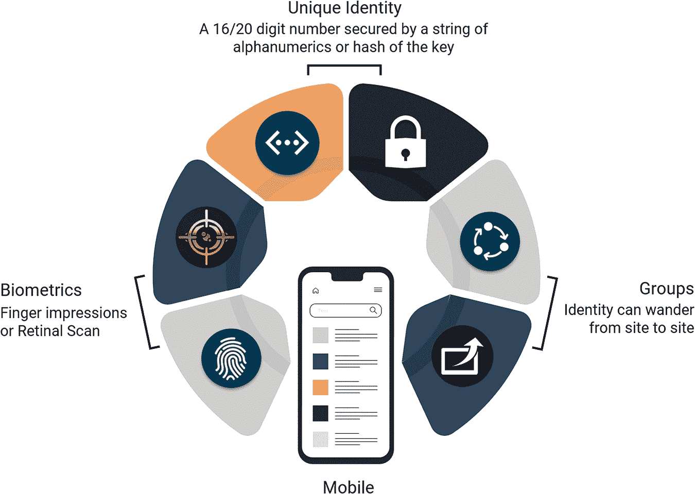
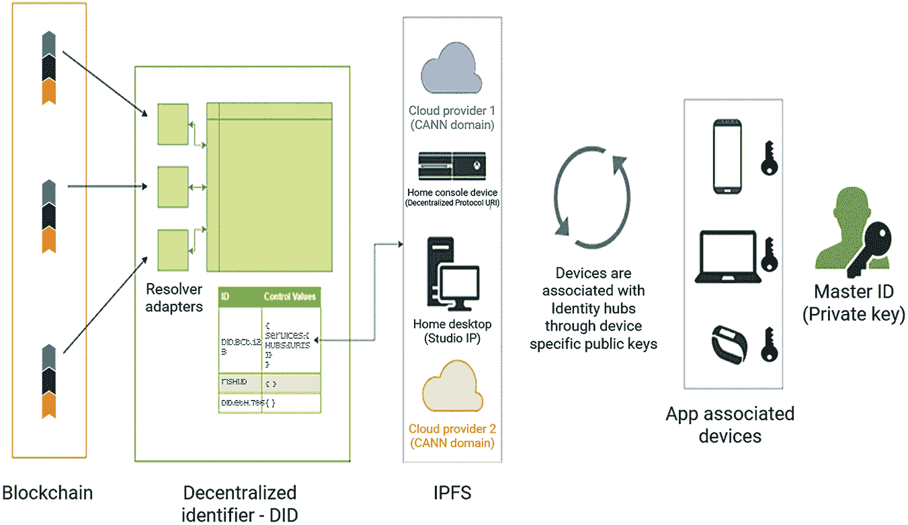
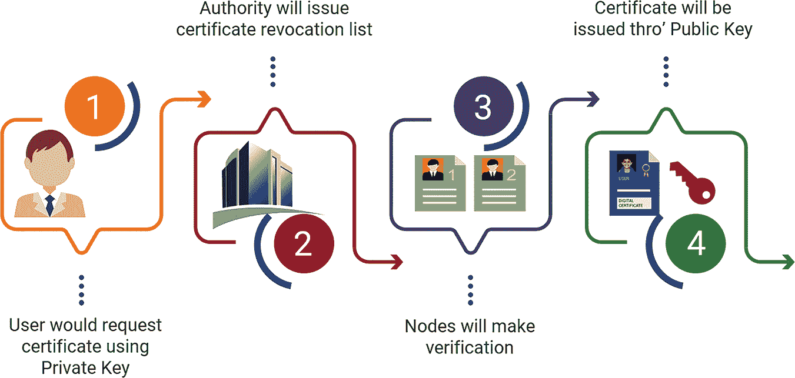
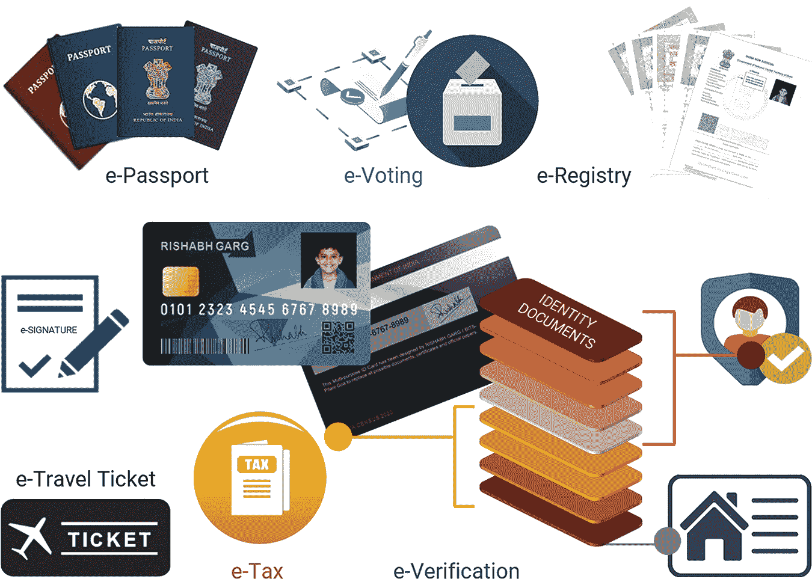
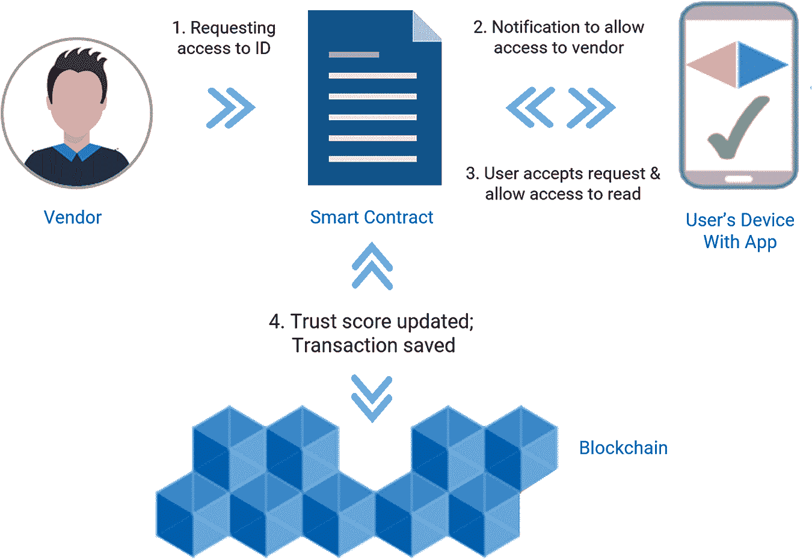
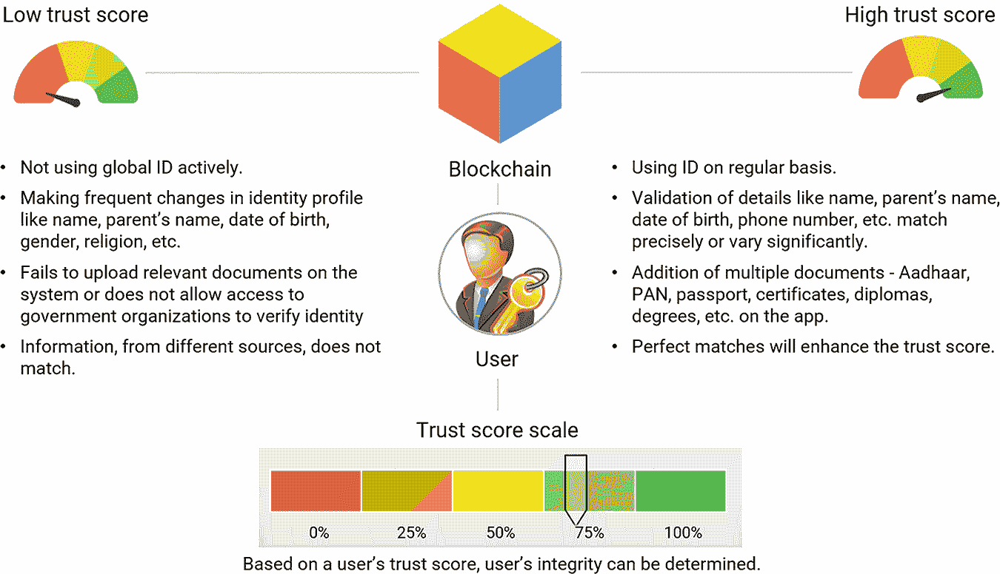

# 12

功能机制

区块链可以用来创建一个平台，保护用户身份免遭黑客攻击和盗窃。人们不再需要创建无数的用户名和密码，它可能使人们构建自主和加密的数字身份。

## 12.1 软件需求

在区块链应用程序中，几乎所有的软件都是开源的。然而，大多数这些软件都旨在在 Linux 操作系统上运行。在 Windows 上运行这些软件最合适的方式是使用虚拟机或 Docker 容器，通过提供 Linux 环境使这些程序得以运行。这丝毫不阻碍商业应用程序的发展，因为金融服务企业已经在使用大量基于 Linux/UNIX 的服务器用于其他应用程序（加格，2022a）。

最受欢迎的受许可区块链应用程序软件平台包括 R3 Corda，一个具有商业版本的开源平台，以及 Hyperledger Fabric，一个由一群主要银行和科技巨头组成的开源合作项目。由于工作量证明（Proof-of-Work）等内在限制，无许可区块链难以实现高吞吐量；然而，受许可的系统在这方面没有任何困难。

区块链身份管理所需的技术元素和接口，由加格（2022b）提出，如下所示：

+   原生 Android 或苹果的移动操作系统，运行在 iPhone 上。应用程序可能仅为用户所需，或为第三方验证所需。

+   使用 IPFS 存储用户个人可识别信息（PII）。

+   使用 NodeJS 编程的微服务。

+   公共区块链元素。

此后，可以使用唯一的私钥创建账户地址，参与区块链。私钥可能是一个与随机数结合的字母数字密码，采用复杂的数学算法（参见图 12.1）。虽然生物特征可以用于识别，但它们永远不能用于生成私钥，因为指纹和视网膜血管可能会随时间变化。

**图 12.1** 启用身份的区块链

## 12.2 安装移动应用程序

+   用户必须从 Google Play 或 Apple App Store 下载移动应用程序。

+   在智能手机上安装应用程序后，用户将在应用程序上创建一个个人资料。

+   一旦创建了个人资料，用户将从 UDI 机构收到一个唯一编号，这将使组织能够提交文件或请求访问用户的身份证明文件。

## 12.3 获取或上传文件

+   拥有唯一编号后，用户需要通过应用程序获取政府发行的身份证，并将其保存在 IPFS 中，并将它们的哈希地址保留在区块链上（参见图 12.2）。

**图 12.2** 记录公民数据的区块链

+   为了让用户自我认证他们的信息，程序将从这些 ID 中回收个人信息。

+   用户现在将拥有和控制自己的数据。这将帮助用户选择要与组织共享哪些信息。为了分享具体细节或所需信息，他将加密信息（在此例中为凭据的哈希值）并将其相关的公钥分享给有关方面（政府部门/服务提供商或验证者）以进行解密。未经用户明确同意，任何信息都不能与第三方共享。

+   对于新生婴儿，出生和死亡登记官将记录出生详情，并提供一个 16 位的唯一数字身份识别号码（UDI）。

+   家庭成员的详细信息，如孩子的姓名、出生日期、地点、父母姓名、地址等，以及孩子的生物特征信息（DNA 地图、指纹、视网膜图像、血型等，如可行）将从 UDI 数据库（对于现有公民）或可能通过授权的服务提供机构（对于新生婴儿）获取，并保存在 IPFS 上。生物特征细节将在孩子 15 岁之前每五年更新一次。

+   现在，无论他或她搬到哪里，无论是学校、医疗中心、工作场所还是市场，这个 16 位 ID 号码都将成为他们的学号、注册号、登记号、银行账户号码、驾照号码、车辆注册号码、手机号码、LPG 气体号码等。对于任何目的都不需要额外的号码（Garg, 2016）。即使 16 位 ID 变得公开，除非获取密码，否则也无法从应用程序中获取文档/信息。此外，黑客不能从密码生成私钥，因为前者包含系统自动生成的随机数。

+   为了分享特定的凭据，可以采用两种方法：（i）可以向接收者发送所有凭据的相应哈希值，或者（ii）将凭据编译到 IPFS 上的一个对象，并发送该对象的根哈希值。根哈希值是通过使用 Merkle 树哈希方法对对象实体进行哈希生成的。

+   例如，如果一个孩子要被送入学校，父母（代表孩子）将分享孩子的公钥以及相应凭据的哈希值，与学校管理层共享，以允许访问相关详细信息（姓名、父亲姓名、母亲姓名、出生日期、国籍等，均已加密）。学校将在区块链上记录候选人的所有成就，例如参与、学术成绩、附加内容、课外成就、体育等。

+   在申请从一个机构转到另一个机构时，之前的学校会通过其权威密钥生成一份转学证书。权威密钥是持有权威职位的官方人员的私钥，它与他们的个人私钥是不同的（见图 12.3）。一旦孩子被连续的机构录取，他们的父母就会分享他们的公钥以及所有相关详细信息，新学校的管理就会开始在区块链上记录。学校会写一个撤销注册表，这会阻止学生在两个机构同时注册。

**图 12.3** 用户档案上文档的背书。

+   通常邮政部门由于收到的邮件或包裹上的地址不完整或错误，很难提供及时的高质量服务。如果每个公民都有一个唯一的识别号码，这个号码可以被输入邮政部门的门户网站，那么部门将永远不需要收件人或收货人的姓名和地址。他们可以根据这个识别号码解码地址，并在注册地址提供服务。这种服务已经在航空部门、供应链管理等有限的地域范围内使用。

+   在定期的普查期间，政府可以发布通知给全国的所有公民，让他们分享他们的散列数据（用他们的私钥加密），包括最相关的信息，如姓名、父母姓名、地址、出生日期和教育资格，用公钥进行解密。政府应该避免收集多余的信息，这可能会成为黑客的诱饵。

+   根据普查记录，在达到成熟年龄时，个人将自动获得投票权。显然，他们不需要任何单独的 EPIC（Garg, 2019）。由于区块链将每天验证那些年满 18 岁的人的选举权，因此不需要额外的程序。在选举日，任何年满 18 岁的公民都可以通过他们的密码在世界上任何地方的 dApp 上登录。一旦他们投下他们的票，账户地址将被禁用。

+   对于像护照这样的少数服务，其中文件可能对于签证或移民程序以纸质形式是必要的，似乎没有充分的理由需要硬拷贝。对于其他服务，这也会简化采购程序。一旦权威机构以数字形式发放文件，它将出现在区块链上，用户可以将它存储在他们的 IPFS 中。由于大多数服务将可在线上获得，办事员或代理人将很少有机会拖延或索要贿赂。

+   如果一个人去医院就诊，无论是作为门诊患者还是住院，所有慢性和主要疾病都应记录在 IPFS 中，这样医生在需要时就可以研究患者的整个病历。这将帮助患者得到更好的治疗（Garg, 2018）。

+   对于所有金融交易，您的 UDI 将只与一个对象关联。因此，使用树根散列获取所有存款和借款的详细信息将仅需几秒钟。无论您去哪里，无论是餐厅、俱乐部、购物中心还是出国，与 ID 关联的 IPFS 对象都将携带你每一分钱的收入和支出的声明。这将使诚实的纳税人能够向所得税（IT）当局展示他们所有的资产和负债；即使是 IT 当局也没有理由怀疑他们的诚信。然而，不诚实的纳税人将会有糟糕的日子。

+   同样，与财产、职业、金融历史、医疗记录、健康保险等有关的文件可以通过在唯一 ID 关联的 IPFS 上创建分布式哈希表（DHT）来维护；这些散列值可以使用用户的公钥进行加密。这些加密的散列值将通过多功能数字身份标识进行操作、访问或检索。

### 全球一本身份

+   多功能身份标识将包含用户的姓名、一个二维码和用户的照片（参见图 12.4）。当卡片插入读卡器或定制机器时，将显示 DHT，包括所有对象及其子对象加密散列的信息。用户可以使用他们的私钥访问在线文件。

**图 12.4** *全球一本身份*。

+   如果有人丢失了多功能身份标识，他们可以向有关当局申请发放一个克隆件。这个克隆件将是原始身份的植物副本（因为在区块链上不可能发生变异），如果犯罪分子试图盗用某人的身份或从中受益，他们将无法做到，因为整个信息都是通过私钥加密的（Garg, 2022c）。

+   一旦死亡，出生和死亡登记官应被告知。他们将注销唯一身份标识，以供进一步使用。在这种情况下，只有法定继承人可以通过提名或授权书来提取索赔。

## 12.4 政府或第三方访问

+   每当政府机构或第三方需要访问有关身份认证目的的个人信息时，持有身份的人将被通知（参见图 12.5）。

+   一旦用户允许第三方访问他们的具体细节，所述机构或实体只能使用可识别信息进行身份验证，用户可以跟踪他们的 PII 是如何被使用的。

+   区块链不持有用户的任何个人信息或数据。信息存储在用户的 IPFS 中，只有当身份持有者和第三方之间发生交易时，这些交易才会出现在区块链上。

**图 12.5** 第三方访问。

+   例如，如果护照局使用公钥或一个应用程序来确认一个人的身份，这笔交易将被发布到区块链上，并可供所有相关节点使用。假设“A”是一个需要证明自己身份以申请签证的人。他将提供包含所有所需凭证的对象的哈希值（由 A 的私钥和当局的公钥适当加密）给当局，使他们能够访问这些信息。当局将使用其权威密钥和 A 的公钥解密对象的哈希值。现在，验证当局可以查阅申请人的文件，并在区块链上记录结果。这就是当局可以立即验证身份的方式。

## 12.5 通过智能合约提高可信度

+   具有业务逻辑的智能合约可以从用户提供的信息中确定一个信誉或信任评分，以形成自主身份。信任评分越高，个人信誉越高。这可以帮助组织实时验证用户的身份（参见图 12.6；（加尔，2021 年））。

**图 12.6** 信任评分的上升和下降。

+   新用户可能会在最初的一个学期（六个月）内受到监控，让他们建立信誉。在此期间，他们可以提供所需信息并上传相关凭证以建立自己的身份。通过将众多文件上传到应用程序/IPFS，用户可以提高他们的信任评分。

+   系统将验证姓名、父母姓名、出生日期等详细信息是否完全一致或存在显著差异。完全匹配将提高信任度。

+   相反，如果用户未能将必要文件上传到系统，拒绝政府机构进行身份验证，或频繁更改其身份资料，尤其是姓名、父母姓名、出生日期、性别和宗教信仰，用户的信任度将会降低。

+   用户的信任评分也可以作为确定其账户是否合法或可疑的工具。

+   例如，如果银行在贷款前需要验证一个人的信用，它可以通过查看用户的信任评分来做到这一点。这将节省时间和金钱，并提供用户信用的洞察。

+   由于包含所有信息或交易的对象将受到用户私钥的保护，所以只有用户才能访问全部信息。在怀疑或非法活动或信息压制的情况下，依法指定的有权机关将要求用户提供所需的信息，该信息经过加密后与公钥一起分享。如果用户在规定的时间（如 15 天）内未能分享相关信息，系统将开始每十天下调用户信任度 20%。随着信任度的下降，用户将发现进行交易变得困难。他们将别无选择，只能分享密钥。一旦他们分享了公钥，信任度将自动恢复。

## 12.6 用户优化特性

+   每位加入区块链身份管理系统用户都会获得一个唯一标识，他们可以在支持 IPFS 的设备上保存该标识。

+   由于区块链身份管理系统使用智能合约来共享个人信息而不是存储任何用户数据，所以它完全排除了任何数据操纵的可能性。没有用户的明确许可，用户信息的安全性就会增加。

+   区块链身份管理系统不存储任何用户的数据；相反，它使用智能合约来共享个人信息，因此区块链上的数据操纵是不可能的。没有用户的明确同意，用户信息的安全性就会增加。

+   用户的任何个人身份文件都不会存储在中央数据库中。所有证明用户身份的文件都存储在他们的设备上，由 IPFS 支持，使敏感信息远离黑客的觊觎。去中心化允许数据在系统中的每个节点传播，这降低了单一故障点（SPoF）的可能性。

+   不受地理界限的限制，用户可以在全球范围内验证他们的身份。

+   区块链生态系统是用户优化的。它既节省成本又节省时间。

+   区块链允许网络上的每个个体追踪交易。记录在区块链上的每一笔交易都有可验证的真实性。然而，参与交易的个人的身份仍然是不透明的。

## 参考资料

1.  Garg R, 2016. 通用信息追踪器，第二印度国际科学节，印度新德里，2:1-34. doi: 10.5281/zenodo.4762602. [`zenodo.org/record/4762602#.YwG8_qBBzIU`](https://zenodo.org/record/4762602#.YwG8_qBBzIU).

1.  Garg R, 2018. 带电子监控系统的数字身份. 该创新已注册至印度科学与技术部下的国家创新基金会—一个自治机构. 文献编号: 10.5281/zenodo.4760532. [链接](https://www.researchgate.net/publication/325247403_Digital_Identity_with_Electronic_Surveillance_System).

1.  Garg R, 2019. 多功能身份识别：一国民众—一身份，印度技术教育学会年度大会—ISTE. 在能源、科学和技术方面的最新进展全国会议, 第 39 卷. 文献编号: 10.6084/m9.figshare.16945078. [链接](https://www.researchgate.net/publication/337398750_Multipurpose_ID_One_Nation_-_One_Identity).

1.  Garg R, 2021. 基于区块链的身份解决方案. 《国际计算机科学与信息技术杂志》(In Press).

1.  Garg R, 2022a. 身份管理的分布式生态系统. 《区块链研究杂志》, 1 (1) (In Press).

1.  Garg R, 2022b. 基于智能合约的去中心化交易机制. 第三届国际区块链与物联网会议，悉尼，澳大利亚. 文献编号: 10.5281/zenodo.5708294. [链接](https://zenodo.org/record/5708294#.YwI5Z6BBzIU).

1.  Garg R, 2022c. 用技术方法解决 UID（Aadhaar）缺陷. 第三届国际大数据、区块链和安全会议，哥本哈根，丹麦. 文献编号: 10.5281/zenodo.5854732. [链接](https://www.researchgate.net/publication/325247615_A_Technological_Approach_to_Address_Deficiencies_in_UID_Aadhaar).
