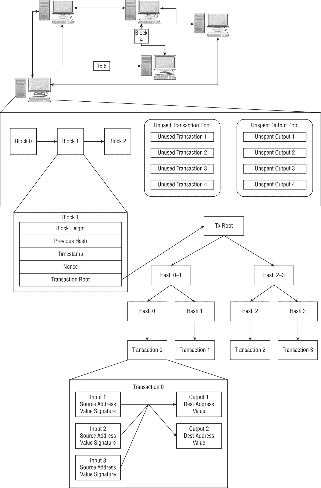
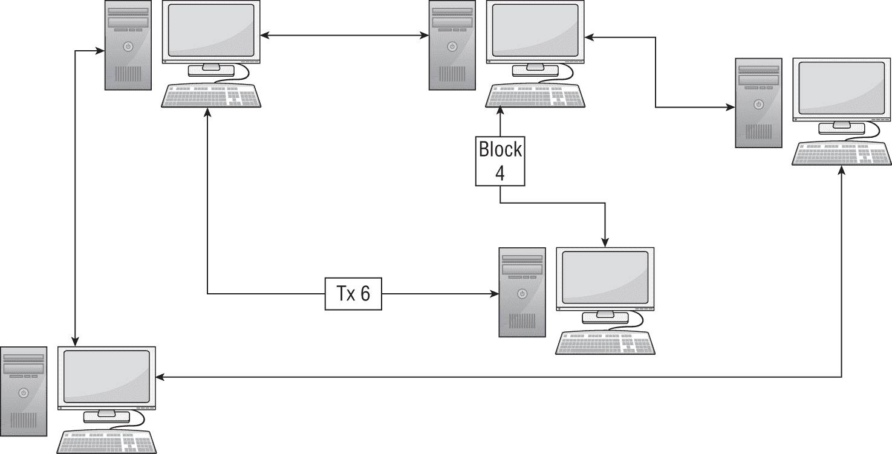
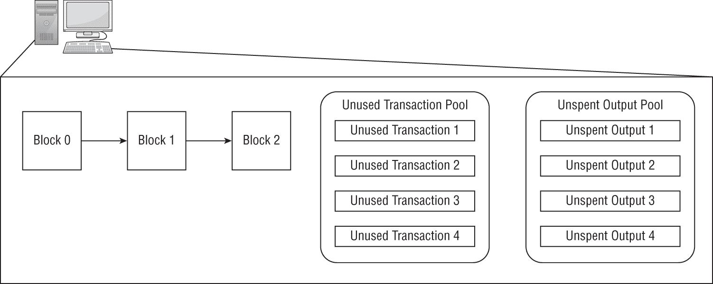
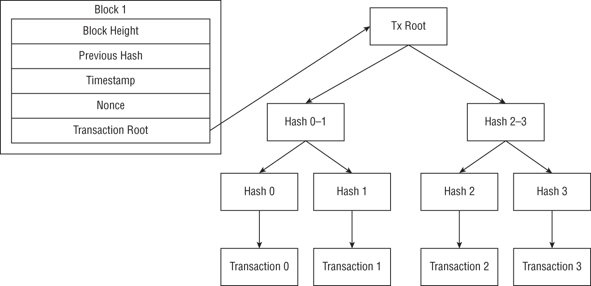
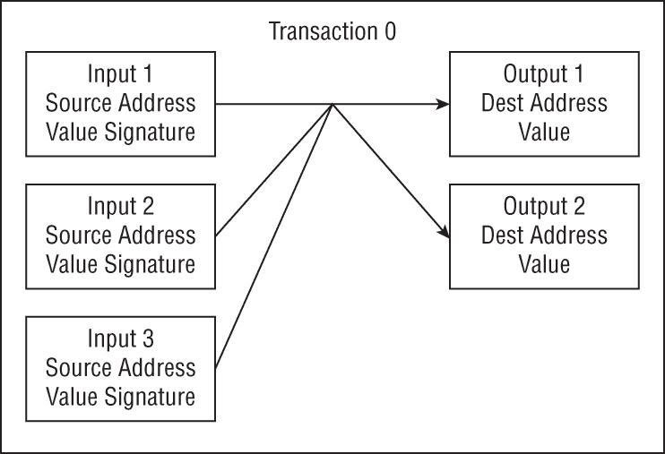

# 第一章

区块链安全简介

区块链是一种新且令人兴奋的技术，它提供了实现常见目标的不同方式。区块链使维护分布式、去中心化和不可篡改的数字账本成为可能。这些账本的内容也设计为对公众可见，使区块链网络中的任何人都能够独立验证账本包含的数据和交易的真实性。

然而，区块链技术也是复杂的。即使是最原始的基本区块链，如比特币，也是多层系统，它们使用一系列算法来确保分布式账本的正确性和不可篡改性。智能合约平台更进一步，允许程序在分布式账本之上运行。

在深入探讨区块链安全性和这些系统可能遭受的攻击之前，有必要了解一些基本原理。本章首先讨论区块链的目标以及它在高层次上是如何工作的。后半部分，我将把区块链生态系统分解为更易管理的部分，并讨论区块链的威胁建模。## 区块链技术的目标

区块链技术提供了一种维护数字账本的不同方式。区块链的设计提供了一些承诺或保证，这些承诺或保证在不同层面上得到满足。

### 匿名性

区块链技术最大的一个承诺就是匿名性。基于区块链的系统设计将资产所有权和交易创建与一个地址关联，而不是与现实世界的身份关联。因为账户地址基于随机生成的公/私钥，理论上这应该提供一定程度的匿名性。

实际上，尽管如此，区块链技术提供的是伪匿名性，而非匿名性。通过收集区块链分布式账本中的公开信息，可能推断出关于账户所有者的信息，打破了匿名性。### 去中心化

区块链技术的一个主要目标就是创建一个分布式、去中心化的数字账本系统。过去，维护一个单一的、官方的账本需要一个中心化的权威机构或团体。区块链技术使用共识算法、加密原语和其他工具来替代这个中心权威。

大多数区块链系统并不像预期的那样去中心化。区块链共识算法往往鼓励中心化。例如，工作量证明（Proof of Work）矿工倾向于形成池，以保证更稳定的奖励，而权益证明（Proof of Stake）共识算法下，富者愈富，随着时间的推移能更好地控制区块链。### 容错性

对于一个 IT 系统来说，弹性和容错性是关键特性。在多个场合，单个关键组件的故障使一家公司或互联网的一个重大部分离线。

由于其去中心化特性，区块链系统本质上是容错的。从理论上讲，区块链网络中的没有一个节点对其运行至关重要，如果只有一个节点在线，网络仍然可以运行——性能和安全性大大降低。然而，随着区块链变得更加中心化，造成干扰变得更容易，影响也更大。### 不可变性

区块链被设计用来创建一个不可篡改的、去中心化的分布式账本。区块链网络中的每个节点都负责维护自己的分布式账本副本。

如果每个节点都维护自己的账本副本，那么需要存在某种机制来防止它们更改自己的账本副本。区块链使用哈希函数、数字签名和其他算法，使得伪造区块和更改账本，使其被网络其他部分接受变得不可行。### 透明度

维护账本的传统中心化系统通常不是非常透明。例如，银行的内部流程非常不透明，很难确定它如何公平地维护其内部账本。结果是，客户需要信任银行会公平地并且在其最佳利益下行事，才能将业务交给银行。

相比之下，区块链实施了一个非常透明的数字账本。区块链网络中的所有节点都负责维护账本副本，并在将区块包含在账本之前验证所有区块。这种透明度允许任何人验证区块链账本上任何交易的合法性。### 无信任

正如提到的，传统的记账系统需要信任一个中心化的权威机构。区块链的设计旨在消除这种信任需求，同时仍然维持一个可信的账本。

区块链系统通过使用拜占庭容错（Byzantine Fault Tolerant）共识算法来维持去中心化的数字账本，在一定程度上实现了这一点。拜占庭容错算法能够抵抗一定数量的叛变者，消除了区块链节点之间需要信任彼此的必要性。这种抵抗力通过奖励用户诚实行为和为区块链最佳利益行动的算法得到增强。## 区块链结构

区块链是一个复杂的多层次环境。图 1.1 展示了从区块链网络到单个交易内容的详细信息。

**图 1.1**：区块链生态系统结构

区块链网络的复杂性可能使得这个图表难以阅读和理解。在下面的章节中，我将把它分解为其组成部分。

### 区块链网络

区块链被设计用来创建一个分布式、去中心化的数字账本。这个账本由如图 1.2 所示的区块链节点网络维护。

区块链的去中心化意味着每个区块链节点都负责执行使区块链运行的所有操作。图 1.3 展示了一些关键组件。

区块链网络使用点对点网络进行通信。网络中的每个节点只连接几个邻居，它们直接与这些邻居进行通信。

通过网络发送的交易和区块通过多个跃点传播。网络中的每个节点都可以存储并处理新区块中的交易，以及接收用于存储在其分布式账本副本中的区块。### 区块链节点

区块链的去中心化意味着每个区块链节点都负责执行所有使区块链运行的操作。图 1.3 展示了区块链区块的结构。

区块链网络中的每个节点负责维护和更新数字账本的完整副本，该账本由一系列区块组成。节点必须存储整个区块链，也可能维护一个更易访问的版本。例如，以太坊维护一个数据库，包含由区块链派生并更新的当前状态，反映了区块链的当前状态。

此外，节点可能参与创建新区块的过程。这需要了解尚未包含在区块中的交易，以及可能用于新交易的先前交易输出。例如，这些未使用的输出可能描述区块链加密货币的当前分配。

区块链节点可能还有维护基本区块链之外的其它职责。例如，智能合约平台旨在创建一个去中心化计算机。为了实现这一点，每个节点还将托管一个虚拟机（VM），其中包含在交易中的指令将在新区块添加到区块链时执行。### 区块链区块

区块是区块链的基本组成部分。如图 1.4 所示，区块链区块由两部分组成。

区块头如图 1.4 左侧所示，是区块实际属于区块链的部分。每个区块头包含有关区块的元数据，包括区块的默克尔树根哈希。

区块头通过哈希函数链接在一起，每个区块头包含前一个区块的哈希值。哈希函数是抗冲突的，意味着找到两个产生相同哈希输出的输入是不可行的。通过在每个区块头中包含前一个区块的哈希值，区块链使得改变一个区块而不改变其后的每一个区块变得不可行。这使得伪造区块并尝试重写分布式账本的历史变得更加困难。区块体包含该区块内的交易列表。虽然这些交易可能作为列表进行通信，但它们被设计成如图 1.4 右侧所示的组织成默克尔树。

**图 1.4**：区块链区块结构

在默克尔树中，叶节点包含交易的哈希值，所有内部节点包含其两个子节点的哈希值。由于哈希函数的特性，这种结构使得找到两个具有相同根哈希值的默克尔树（特定大小）的版本变得不可行。因此，区块头内的单个根哈希值安全地总结了交易列表，并赋予它们区块链不可变性的保护。### 区块链交易

最初的区块链，比特币，被设计成一种加密货币。区块链的分布式账本旨在记录比特币在不同账户之间的转移。

为此，存储在区块链数字账本上的数据被称为交易。 图 1.5 显示了一个区块链交易的示例。

交易名称*transaction*有些误导，因为区块链交易可以包括不同账户之间多次的价值转移。 图 1.5 显示了同一种加密货币的转移，其中所有输入在分配给输出之前都汇总在一起；然而，一个交易也可以包括多个不同代币的转移或独立动作。

**图 1.5**：区块链交易结构

区块链交易的输入至少必须包含源地址、金额和数字签名。这些字段描述了交易的目的，并证明它是由拥有与账户相关联的私钥（最好是账户所有者）授权的。此外，交易输入必须是有效的，这通常意味着它是另一个交易的未使用输出。

大多数区块链不需要交易得到接收方的授权，因此它们只包含一个地址和金额。如果一个交易是有效的，其输出可以被接收方用作新交易的输入。## 区块链生态系统内部

如前所述，区块链环境是复杂且多层次的。网络攻击和安全漏洞可能存在于区块链生态系统的多个层面，攻击者可以以多种不同的方式实现相同的目标。

当讨论区块链安全时，将区块链生态系统分解为几个不同的层次会有所帮助。本书将探讨区块链的四个不同层次，每个层次内还有两个子层次。

### 基础

区块链的目标是维护一个分布式数字账本，同时消除需要一个可信赖的、集中的权威。相反，网络中的每个节点维护着账本的一个副本，并且与网络中的其他节点同步更新。为了实现这个目标，区块链严重依赖密码学基础元素，并定义了某些数据结构，用于存储和传输分布式账本上存储的信息。

#### 基础元素

分布式账本技术建立在密码学之上。区块链的一个主要目标是将信任的需求从集中的权威转移到密码学和其他算法。

密码学基础元素，如哈希函数和公钥加密，为区块链提供了至关重要的安全保证。在这两者之间，哈希函数和公钥加密可以确保数据的安全性、完整性和真实性。

这些基础元素被广泛应用于区块链的多种不同目的，因此它们的安全性对区块链安全至关重要。如果由于密钥泄露、算法漏洞等原因导致哈希函数或公钥加密的安全性被破坏，区块链将分崩离析。  #### 数据结构

区块链的目的是创建一个分布式、不可篡改的数字账本。这一角色的核心部分是数据存储。

信息以特定的格式存储在账本中，这可能因实现方式的不同而有所差异。如果数据的存储方式使系统面临攻击，它可能会影响账本中存储数据的安全性。  ### 协议

分布式账本系统被定义为一套协议，而不是具体的实现。就像万维网协议 HTTP 一样，不同供应商设计的客户端软件只要遵循协议的既定规则就可以进行交互。尽管区块链可能存在实现错误从而产生安全问题，但区块链协议也可能受到理论攻击的威胁。

对工作量证明区块链的 51%攻击是此类协议级攻击的一个例子。这种攻击是工作量证明区块链设计中公认的风险，并利用了系统内部如何强制执行安全和去中心化的方式。

#### *共识*

区块链被设计用来创建一个共享的、分布式的数字账本。区块链网络中的每个节点独立维护和更新自己的账本副本。为了让这个过程运作，这些节点需要有能力同步他们的更新并且就数字账本的当前状态达成共识。

区块链共识算法使得在无需信任的环境下，区块链节点能够就账本的内容达成一致，前提是区块链的一定百分比节点是诚实的。利用共识是攻击旨在修改区块链分布式账本内容的关键，这也是 51%攻击是最著名的区块链攻击的原因。这种攻击利用了工作量证明实现的是多数票的原则，如果攻击者控制了多数，他们可以迫使网络接受他们想要的任何有效区块链版本。  #### *区块创建*

区块链有一个定义明确的过程，用于向分布式账本添加新信息。创建后，交易通过点对点网络分发给所有区块链节点。区块创建者定期收集交易，并将这些交易包含在区块中，然后将这些区块分发给网络的其他部分。节点随后验证这些区块并将它们添加到其分布式账本的副本中。

这个过程为干扰提供了多个机会，或者让攻击者利用。例如，如果攻击者确定了下一个区块的选定创建者，他们可以针对该节点执行分布式拒绝服务（DDoS）攻击，以延迟或阻止区块的创建。  ### 基础设施

区块链的概念最初在比特币白皮书中理论性地定义。然而，为了让区块链有用，需要使用现代技术来实现它。

在比特币白皮书发布几个月后，中本聪发布了比特币软件的第一个实现版本。比特币以及其他区块链软件在节点上运行，并通过网络进行通信。

#### *节点*

分布式账本系统作为在用户计算机上运行的软件来实现。这种软件与用户、计算机上的其他软件以及计算机的操作系统和核心功能（如内存管理、网络堆栈等）进行交互。

攻击者可以使用恶意软件和其他技术来攻击区块链的这一层面的安全性。例如，恶意软件可能被用来窃取与区块链账户相关的私钥，或者执行拒绝服务攻击，阻止节点构建区块或更新其账本副本。  #### *网络*

区块链节点通过点对点网络进行通信，以向彼此发送交易和区块。这些点对点通信是通过传统的网络基础设施进行的，例如公共互联网或内部企业网络。

这些通信对于确保区块链达成共识以及节点能够访问最新的交易和区块至关重要。能够干扰这些通信的攻击者可以对网络执行拒绝服务攻击，或者促进其他攻击。例如，一种将区块链网络分成孤立片段的攻击可以使 51%攻击变得更加容易且成本更低。### 高级

原始的比特币区块链旨在实现一个去中心化的金融系统，该系统追踪比特币加密货币的所有权和转移。随着时间的推移，区块链的目的和功能不断扩大。如今，许多区块链支持在区块链之上执行智能合约，或者使区块链软件能够与外部应用程序集成。

#### 智能合约

智能合约平台是设计用来在分布式账本之上运行程序的区块链。区块链节点托管虚拟机并执行包含在区块链交易中的指令。

智能合约引入了新的安全风险以及区块链可能遭受攻击的手段。易受攻击的智能合约可能会对自己、其用户或整个区块链网络造成伤害。#### 扩展

分布式账本系统通常不是设计为自包含的。外部应用程序可以通过内置 API 或通过在平台上运行的智能合约连接到系统。

这些扩展是系统威胁表面的组成部分，可能允许攻击者破坏区块链的安全，反之亦然。例如，利用持有区块链私钥的易受攻击系统可能会允许攻击者代表用户执行交易。## 区块链的威胁建模

威胁建模是一种旨在帮助识别系统潜在安全威胁的练习。通过使用定义好的威胁建模框架，安全研究人员可以更好地定位他们的调查，并降低潜在疏忽的概率。

在这本书中，我将使用 STRIDE 威胁模型来探讨区块链安全威胁。这个模型，结合前面讨论的各种区块链层，有助于澄清各种区块链安全威胁的讨论。

### 使用 STRIDE 进行威胁建模

STRIDE 是由微软员工创建的一个助记符，用于帮助识别和分类对系统潜在威胁。STRIDE 中的字母代表欺骗、篡改、否认、信息泄露、服务拒绝和权限提升。

虽然 STRIDE 是为传统 IT 环境设计的，但它也可以映射到区块链上。每个六种威胁类别都适用于区块链。

#### *伪装攻击*

伪装攻击是指威胁系统内数据真实性的攻击。如果攻击者能够伪装成系统内的合法用户，系统的安全性可能会受到损害。

在区块链系统中，用户与区块链交互的主要方式是创建交易。在区块链环境中，伪装攻击将涉及生成可以通过验证和数字签名检查的假交易。#### *篡改*

篡改攻击涉及修改存储的数据。这可能包括删除或更改存储的数据。

分布式账本技术使用哈希函数和数字签名来帮助在不同层面维护账本的完整性。对数字签名或哈希函数的安全性发起攻击是区块链环境中篡改的一个例子。#### *否认*

否认，或更准确地说非否认，是指用户否认执行某项操作的能力。防止否认需要强认证和能够准确地将行为归因于特定用户。

在区块链上，否认交易方是指用户否认他们执行了某些操作，例如生成和签名交易。通过非对称加密，只有知道私钥的人才能生成有效的数字签名，使得否认行为变得困难（假设密钥得到妥善保护）。#### *信息泄露*

信息泄露应对未经授权访问敏感信息。在传统的 IT 环境中，这种威胁是通过使用访问控制和数据加密来预防的。

虽然大多数数据在账本上对公众可见，但通过使用私有账本或对账本中的数据进行加密，可以实现一定程度的隐私保护。如果攻击者能够访问私有账本或窃取私钥来解密数据，敏感信息可能会泄露。#### *服务拒绝*

服务拒绝攻击旨在降低或破坏系统执行其功能和响应合法请求的能力。在传统的 IT 环境中，DDoS 攻击是最著名的这种威胁的形式，并试图用伪造的、垃圾邮件请求淹没系统。

区块链系统被设计成分布式和去中心化的，这应该为抵御 DoS 攻击提供强大的保护。然而，DoS 攻击可以在分布式账本实现的每个层面发生。任何使系统无法使用或降低其效率或有效性的攻击都是 DoS 攻击。#### *权限提升*

权限升级是指攻击者未经适当授权获取受保护功能的过程。在分布式账本技术中，攻击者可以获得几种不同级别的未授权访问，包括账本、区块链和智能合约层面。

攻击者不应有权访问分布式账本系统上合法用户的账户。如果未授权用户能够访问一个账户，这是账户级别权限升级的一个例子。

针对分布式账本系统的多数攻击旨在获得对分布式账本的高级控制权。例如，51%攻击可以让攻击者重新编写账本历史以满足他们的需求。

智能合约是运行在分布式账本上的程序，通常设计为对公众不可见的受保护功能。智能合约代码中的漏洞或设计智能合约时未考虑系统环境，都可能让攻击者获得这些受保护功能的访问权限。### 将 STRIDE 应用于区块链

STRIDE 威胁模型描述的各种威胁可以在区块链生态系统的不同层面发生。例如，权限升级可以通过盗用用户的私钥、对共识进行 51%攻击或未经授权访问智能合约来实现。这些都是非常不同的威胁，但都归类在同一个 STRIDE 类别下。

在本书中，我将讨论威胁和攻击作为区块链生态系统层面和关联的 STRIDE 威胁的组合。这明确了攻击的可能威胁和影响。例如，51%攻击是针对共识算法的攻击，可能导致修改分布式账本，这不仅破坏了账本的完整性，还让攻击者可以从记录中删除过去的事务（抵赖）。## 结论

区块链技术复杂且多层次，这使得区块链安全成为一个复杂的话题。区块链系统面临着来自区块链生态系统的各个层面的各种不同威胁。

本章将区块链划分为四层和八个子层，并讨论了如何将 STRIDE 威胁模型映射到区块链上。本书接下来的四章将分别探讨这些层的每一个，并讨论区块链生态系统的每一层可能面临的安全威胁。
