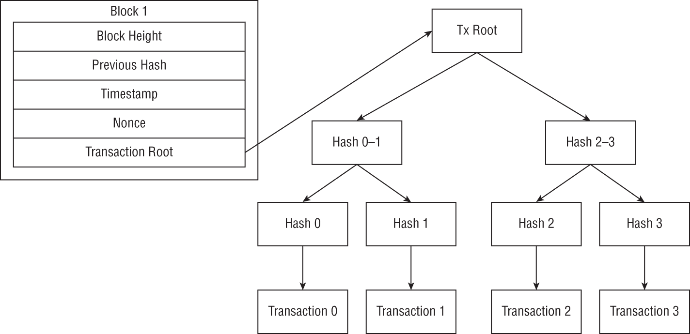

# CHAPTER 2

基础

区块链技术的目的是创建一个共享的、去中心化的数字账本。在这个系统中，不存在中央权威来规定数字账本的官方版本。

区块链技术将数字账本中的信任从集中式权威转移到一组旨在提供与集中式账本相同的保证的协议。这些协议使用具有某些性质的小型构建块创建，能够提供这些期望的保证。

本章探讨区块链安全的基础知识。这包括用于构建区块链协议和使去中心化数字账本成为可能的密码学原语和数据结构。## 密码学原语

金融机构维护一个内部账户账本，通过简单地更新此账本中的相关值，使价值能够从一方转移到另一方。每个金融机构都负责维护其账本的准确性，客户必须信任金融机构能够正确追踪他们的财务交易。

区块链旨在将这种信任从这些集中式权威转移到密码学算法和协议。密码学算法被依赖以确保记录在区块链账本上的交易的完整性和真实性。

区块链技术从比特币开始，自那时以来，出现了许多不同的区块链，每个区块链都有自己对该底层协议和实现方法的调整。然而，所有这些协议都依赖于相同的密码学构建块。

区块链的设计使得数据完整性和真实性保护对系统运行至关重要。为了提供这些保护，区块链技术使用公钥加密和哈希函数。

### 公钥加密

密码学算法根据它们如何使用加密密钥分为两大类。对称算法用于加密和解密的单密钥。这种对称性意味着算法通常更高效，使它们更适合大数据传输。然而，它们需要通过安全通道将共享密钥分发给所有参与者。

不对称加密，或公钥加密，使用公钥进行加密和解密。这使得能够将秘密消息发送给任何人，而无需设置共享密钥。然而，这些算法通常不如其对称对手高效。

区块链技术严重依赖公钥加密。它使用两个相关密钥，并能够使用它们创建和验证数字签名，提供了验证消息发送者的无价能力。

#### 介绍“困难”的数学问题

公钥密码学是构建在“困难”数学问题之上的。这些数学函数由它们难以执行与难以逆向的 asymmetric 关系定义。对于这些问题，\( F(x) \)的复杂度是多项式的，而\( F^{-1}(x) \)的复杂度是指数的。

这种关系使得开发既可用又安全的密码算法成为可能。算法设计为合法用户只需进行简单操作，\( F(x) \)，而任何攻击者必须解决更难的问题，\( F^{-1}(x) \)。

存在几个数学上“困难”的问题。在“经典”（即非后量子）密码学中，最常使用的两个问题是因数分解问题，它是 RSA 算法的基石，以及离散对数问题，它是数字签名算法（DSA）的基石。基于这些问题的算法也可以通过使用椭圆曲线密码学（ECC）更有效地实现。

### 因数分解问题

在因数分解问题中，较简单的操作是两个素数的乘法。执行此操作的复杂度是两个数字长度的多项式。这意味着两个素数长度的增加，例如从 128 位增加到 129 位，对整体复杂度的影响相对较小。

因数分解逆用了乘法，且因数分解的复杂度随因数长度的指数增长。其原因是，在非量子计算机上分解两个数字的最佳已知方法其复杂度随因数长度指数增长。

虽然其中一个因子保证小于商的平方根，但这是一个巨大的空间，且快速增长。将素数的长度增加一个比特（即从 128 位增加到 129 位）会将攻击者需要搜索的潜在因数数量翻倍。

因数分解的难度远大于乘法的难度。因此，可能找到这样一个因数的长度，使得乘法是可能的，但因数分解是不可能的。### 离散对数问题

离散对数问题是公钥密码学中常用的另一个非对称问题。它基于指数运算的“容易”问题和对数的“困难”问题。

与因数分解问题类似，离散对数问题也是设计成使合法操作相较于恶意操作变得简单。指数大小的增加对合法用户影响最小——但对攻击者影响显著。与因数分解问题一样，解决离散对数问题的最佳方法是猜测指数的可能值，因此用户可以通过增加密钥长度来实现任意安全级别。### 椭圆曲线密码学

椭圆曲线密码学（ECC）是一种使用椭圆曲线上的点而不是整数作为计算基础的公开密钥密码学。椭圆曲线是形式为`y² = x³ + ax + b`的数学函数。

使用这些曲线上的点作为公钥，可以创建一个利用离散对数问题相同原理的公钥密码系统。在椭圆曲线上，称为点加法的操作与整数上的乘法等价，而点乘法与指数运算等价。

在椭圆曲线密码学中，公钥是通过将一个随机整数（私钥）与曲线上的一个公开点（生成器）相乘得到的。与因数分解和离散对数问题一样，点加法和乘法（乘法和指数运算的等价物）对于合法用户来说是“容易”的，而点减法和除法（因数分解和对数的等价物）对于攻击者来说是“困难”的。

椭圆曲线密码学相对于基于整数的公钥密码学有两个主要优势：密钥长度和能量消耗。椭圆曲线密码学以更短的密钥实现了与使用离散对数问题的密码系统相同的级别安全性。例如，2048 位的 RSA 密钥与 160 位的 ECC 曲线具有等效的安全性。ECC 在低功耗环境也比算法如 RSA 更好，因为 ECC 基础密码学中使用的操作（点加法和乘法）比整数上的等效操作（乘法和指数运算）消耗的功率更少。#### 使用“困难”问题构建密码学

公钥密码学利用这些“困难”问题来构建既可用又安全的算法。这些算法的设计旨在使合法用户只能执行“容易”的操作，而攻击者被迫完成“困难”的操作。

此过程的一个关键部分是公钥/私钥对的导出。虽然私钥是一个随机数，但公钥是从私钥导出的，以具有某些属性。目的是使一个密钥能够撤销另一个密钥对特定算法所做的工作。

例如，RSA 加密操作是`c = m^e (mod n)`，其中*`c`*是密文，*`m`*是消息，*`e`*是公钥，*`n`*是一个公开模数值。代入一些值，`2⁵ (mod 14) = 4`。

RSA 用于解密相同的操作，因此私钥被选择以撤销加密的效果。私钥 11 产生`4¹¹ (mod 14) = 2`。

在 RSA 的情况下，公钥和私钥*`e`*和*`d`*被选择为任意消息*`m`*满足`m^(d*e) = 1 (mod 14)`，因为这与我们由于指数的性质执行的两阶段过程等价。使用一个随机的私钥 11，根据欧拉函数，*`d`*必须是 5。

由于消息的接收者知道私钥，他们可以通过指数运算来撤销加密。然而，缺乏这一密钥的攻击者需要计算对数，这要难得多。#### *区块链如何使用公钥加密*

公钥加密算法可以提供机密性、完整性和认证保护。它们是区块链如何工作的基本组成部分，用于数字签名和账户地址。

#### 数字签名

在前几节中，我们探讨了公钥加密如何用于保护机密性，通过证明私钥可以用来创建只有预期接收者才能阅读的加密消息。数字签名将这一点反过来，生成只有声称的发送者才能生成的数字签名。

如前所述，公钥和私钥的选择意味着一个可以撤销另一个的操作。在 RSA 的情况下，这意味着 `m^(d*e) = 1 (mod n)`。

然而，这也意味着 `m^(e*d) = 1 (mod n)` 或者我们可以说，我们可以使用私钥进行“加密”以生成数字签名，“解密”以得到原始明文。通过生成签名并与相关数据一起发送，我们可以证明数据只能由知道私钥的人生成，并且在传输过程中没有修改。任何拥有相关公钥的人都可以“解密”签名，并验证明文是否匹配。

区块链使用数字签名来证明区块链上交易的 authenticity。如果加密货币正从一个特定账户转出，我们希望能够确定转账是由该账户的所有者完成的。

此外，我们还依赖一个点对点网络来传输交易，以及节点将交易副本存储在未使用交易池中，直到它被包含在一个区块中。数字签名还证明交易在传输过程中没有被修改。##### 账户地址

与数字签名相关的一个难题是证明某个特定的公钥属于某个特定的用户。如果攻击者拦截了一条消息和一个签名，他们可以修改消息，用自己的密钥签署，并发送自己的公钥。如果收件人接受这个公钥属于声称的发送者，他们可以验证签名。

区块链通过使用公钥来推导账户地址解决了这个问题。这样，我们可以通过重新推导公钥得到账户地址并核对是否一致，来验证一个公钥是否属于某个特定账户。#### 公钥加密的安全假设

为了使公钥加密有效，它需要是安全的。公钥加密有两个主要的安全假设：用户私钥和所使用算法的安全性。

#### 私钥安全

在公钥加密中，唯一的秘密是一个用户的私钥。任何获得私钥访问权限的人都可以解密发送给该用户的消息或代表他们生成数字签名。

私钥必须在整个生命周期内安全生成和保护。如果私钥是用弱随机数生成器生成的，或者来源于可以猜到的密码或密码短语，攻击者可能能够学到私钥。区块链安全依赖于私钥使用密码学上安全的随机数生成器生成。

一旦生成了私钥，就必须保护它不被泄露。如果攻击者能够使用恶意软件、网络钓鱼或其他方法窃取用户的私钥，他们就能够伪装成该用户在分布式账本上执行交易。控制分布式账本上具有提升权限的账户或存储大量价值的账户的私钥应该在冷存储中或存储在无法从互联网访问的设备上。##### 算法安全

公钥加密安全的另一半在于算法本身的安全性。这涉及到确保算法建立在其上的“困难”问题保持“困难”。

如果是这样，那么打破加密的唯一方法就是进行暴力搜索。如果私钥足够长，使得这不可行，那么协议仍然保持安全。####*攻击公钥加密*

公钥加密的安全性归根结底在于私钥的安全性和算法所使用的数学难题的难度。如果攻击者能够攻陷私钥或破解这种非对称性，那么公钥加密就变得不安全了。

##### 私钥安全

在公钥加密中，用户的私钥是唯一的秘密。加密算法及其使用的任何参数都是公开知识。这意味着任何知道用户私钥的人都可以在伪装成该用户的情况下解密消息和生成数字签名。

因此，私钥的安全对于非对称加密的安全至关重要。出问题的主要两种方式是密钥生成薄弱和未能妥善保护私钥。##### 弱密钥生成

私钥应该是随机生成的数字，以满足特定算法的要求（密钥长度、素性等）。如果密钥不是随机的，那么攻击者可能会猜到这个密钥。这可能让他们能够代表用户生成交易，窃取加密货币或与智能合约互动。

###### *弱随机数生成*

许多区块链用户使用工具为他们区块链账户生成私钥。这个功能可以集成到他们用来访问区块链的软件中，或者是一个独立的网站或服务。

这些工具应使用密码学随机数生成器（RNG）来创建用户的私钥。然而，一些工具实现不正确，或者使用了非密码学 RNG，导致随机性来源薄弱。

“区块链大盗”的故事展示了这种方法的风险。独立安全评估师的一项研究发现，攻击者正在扫描以太坊区块链，寻找使用薄弱私钥生成的账户地址。¹截至 2018 年 1 月 13 日，区块链大盗已经从这些账户中窃取了 37,926 个以太币。

使用第三方服务生成密钥的另一个风险是，生成的私钥可能是故意薄弱的，或者被服务记录以允许未来的盗窃。2019 年的一项研究发现，`[WalletGenerator.net](http://walletgenerator.net)`的源代码在 2018 年 8 月 17 日之后的一段时间内与项目 GitHub 存储库的源代码有所偏离。²

在网站上测试“批量钱包”生成器发现，尝试创建 1,000 个密钥导致非恶意的 GitHub 版本和恶意活跃版本的结果不同。GitHub 版本正确生成了 1,000 个唯一密钥，而活跃版本每次请求仅提供 120 个唯一密钥。如果这 1,000 个密钥提供给不同的用户，其中一些将拥有相同的密钥，并能够访问彼此的区块链账户。###### **基于密码的私钥**

**脑钱包**是指与区块链账户关联的私钥的记忆。虽然这种方法的好处是不可破解的，但大多数人却难以记住一串随机的字母和数字。

一种不安全的解决方案是使用一个容易记忆的单词或短语来生成私钥。为此，这个种子短语可以被 SHA-256 或其他与所需秘密密钥长度相同的算法散列。

BitMEX 研究对此方法进行了一项研究，题目为《叫我以实玛利》（Call me Ishmael），来源于《白鲸记》的一句引用。³ 研究人员使用了《白鲸记》、比特币白皮书以及简·奥斯汀的书籍中的引用生成秘密密钥。攻击者在一天内猜出了所有这些账户的密码短语，而“叫我以实玛利”这个密码短语只持续了 0.67 秒。###### **受损的记忆密钥**

对于希望记忆他们区块链私钥的人来说，记忆密钥或种子短语比基于密码的密钥提供了更安全的选择。记忆密钥是一组从标准词表中选取的 12 到 24 个单词。每个单词编码了原始密钥的 11 位随机性。

助记词钥匙使得私钥更易于记忆，但它们也需要得到适当的保护，而即使是一个部分受损的助记词钥匙也可能使区块链账户面临攻击。2020 年，Alistair Milne 分两次发布了 12 个助记词中的 8 个，意图一次性发布最后三个或四个以防止暴力攻击。⁴ John Cantrell 编写了一个自定义脚本，在 30 小时内尝试了超过 1 万亿种可能性以领取账户中的 1 BTC。⁵  ##### 弱键安全性

在生成私钥之后，区块链用户需要保护该密钥的秘密，直至账户生命周期结束。如果未经授权的方获得了该密钥，他们可以代表用户生成交易，并从他们那里窃取加密货币。

###### 脆弱的存储

不安全的秘密数据存储问题是区块链存在的问题之一。将密码写在键盘下的便签纸上，或保存在电脑上的文本文件中，数十年来一直是安全挑战。

随着区块链技术的引入，私钥经常被存储在容易被盗或永远丢失的位置，这并不令人意外。无数的区块链账户因密钥管理不当而被攻破，估计有 30%的比特币因丢失私钥而永远丢失。⁶

硬件钱包通过在设备上存储私钥并提供专用微处理器来生成数字签名，从而使密钥从不离开设备，为私钥提供了一种潜在的解决方案。然而，即使是硬件钱包也可能存在安全漏洞。已经发现了数十个硬件钱包漏洞，可能导致它们暴露私钥或其他不良行为。⁷  ###### 加密货币钱包与交易所

许多区块链用户不想管理自己的私钥。相反，他们使用第三方服务来存储这些密钥。常见例子包括加密货币钱包服务和交易所。

使用这些钱包和交易所，用户账户的安全模型发生了变化。攻击者不需要猜测应该是一个大随机值的用户的秘密密钥，而只需要了解用户密钥管理服务的密码，并可能击败多因素认证（MFA）。

这对攻击者来说是一个更容易解决的问题。以下是一些常见的方法：

+   **密码猜测：**许多人使用弱密码且密码重复使用。这使得攻击者通过暴力破解密码猜测或凭据填充攻击轻易地访问账户变得简单。

+   **网络钓鱼：** 网络钓鱼攻击是窃取密码和 MFA 代码或向目标电脑传递恶意软件的常见方式。2021 年，一场网络钓鱼攻击感染了 bZx 开发人员的电脑，窃取了私钥，使当时价值 5500 万美元的代币从项目和其用户中被盗。⁸

+   **SIM 交换：** 许多在线服务使用短信进行 MFA，因此 SIM 交换攻击者可以获取这些代码。2021 年，欧洲执法部门逮捕了 8 名参与 1 亿美元 SIM 交换攻击的嫌疑人。⁹

+   **恶意软件：** 一些针对私钥的攻击旨在用恶意软件替换合法软件，该软件会窃取私钥或修改用户执行的交易。2021 年 4 月，EasyFi DeFi 协议在一场使用恶意版本的 MetaMask 窃取私钥的黑客攻击中失去了超过 4600 万美元的代币。¹⁰  ###### 恶意软件

区块链技术是以软件形式实现的。当用户想要与区块链互动时，他们需要使用电脑。这意味着要将私钥或助记词输入到区块链软件中，用于签署交易。

如果私钥或助记词种子被输入到电脑中，那么它可能容易受到恶意软件的攻击。一些恶意软件，如 Clippy Malware，被设计为扫描系统剪贴板或计算机内存中的任何类似于私钥或区块链地址的数据。

其中一个恶意软件活动旨在重定向被感染机器上用户的交易。这种恶意软件监控感染机器的剪贴板，寻找与 230 万个比特币地址匹配的数据。¹¹ 一旦找到匹配项，它就会将地址替换为攻击者的地址。除非用户在粘贴后再次检查地址，否则交易将被发送给攻击者，而不是预期的接收者。  ##### 算法安全

虽然被泄露的私钥是公钥加密被攻击的最常见方式，但算法本身也可能存在安全漏洞。然而，目前还没有已知的攻击能够允许在现代技术上破解区块链所使用的非对称加密算法。

这只有在大规模量子计算变得可用之前才是真的。一旦这种情况出现，Shor 算法将迫使转向后量子加密算法。

###### 鲨鱼算法

许多公钥加密算法都是基于两个大素数乘积的因式分解问题或计算模数内的对数的“难”问题。利用现代计算机，解决这些问题的最佳方式是通过暴力搜索，随着所使用密钥值的增加，难度会呈指数级增长。由于合法操作的难度仅呈多项式增长，因此可以选取一个密钥长度，使得该系统对合法用户可用，但对攻击者来说却难以实施。

肖尔算法是为量子计算机编写的算法，比暴力搜索更有效地解决这些问题。使用肖尔算法，攻击经典公钥加密算法的复杂性从指数级降低到多项式级，与合法操作的成本相同。

这使得在对抗量子计算机的方案中无法使用经典公钥加密。即使“难”操作的复杂性比“易”操作增长几倍，攻击者也可以通过增加投入来可行地跟上。如果因式分解比乘法难五倍，而窃听者拥有一百台计算机与你的一台相比，那么这一点就无关紧要了。###### 后量子加密

肖尔算法对古典非对称加密算法构成问题，因为它打破了这些算法所基于的“难”问题的非对称性。如果乘法和因式分解都具有多项式复杂性，那么开发既可用又安全的系统是不切实际的。即使因式分解的复杂性比乘法增长 100 倍，攻击者也可以通过投入合法用户 100 倍的成本来攻破它。  ### 哈希函数

哈希函数是区块链技术的核心。哈希函数的主要作用是确保数据完整性。这是因为哈希函数是一种单向、抗冲突的函数，意味着确定产生给定输出的输入或找到产生相同输出的两个输入是不切实际的。

提供数据的哈希值与数据本身一起是确保数据完整性的常见方法。文件校验和利用哈希函数确保文件在创建后没有被修改（因为找到另一个产生相同哈希值的版本的数据的概率极低）。计算机存储密码的哈希值以保持密码的保密性，因为从哈希值确定原始密码是不可能的，将密码的哈希值与存储的哈希值进行比较与比较真实密码一样安全。

在区块链（以及其他分布式账本实现）中，散列函数通常用于确保分布式账本中存储的数据的完整性。区块链中的每个区块包含前一个区块的散列和总结存储在区块中的交易数据的散列。只要散列函数保持安全，分布式账本中的数据就不能被修改，而不会被检测到修改。

#### *散列函数的安全假设*

散列函数的安全性是分布式账本技术的主要假设。散列函数保护分布式账本中存储的数据的完整性，并必须具有两个重要属性：前像抵抗和碰撞抵抗。

##### 前像抵抗

散列函数的前像是一个产生所需输出的输入。散列函数必须具有前像抵抗性，这意味着对于给定的输出，对于某人来说找到一个产生该输出的输入应该是不可行的。

前像抵抗是通过在密码散列函数中使用单向函数来实现的。单向函数在计算过程中丢弃一些信息，这样就无法唯一地将一个输出映射到创建它的输入。

一个简单的单向函数的例子是模运算，其中输入除以模数，只保留除法的余数。当模运算的输出为 5 除以 10 时，可能的输入是 5、15、25 等等。没有额外知识，无法确定哪个可能的输入被用来创建输出 5。

散列函数具有潜在输入的无限空间和潜在输出的有限空间，因为它们可以接受任何输入并产生固定大小的输出。这意味着散列函数将无限多个输入映射到每个潜在的输出，使其本质上具有前像抵抗性。  ##### 碰撞抵抗

分布式账本安全的散列函数的另一个重要原则是碰撞抵抗。散列函数的碰撞是指可以找到两个输入，它们产生的输出相同。加密散列函数必须具有两个级别的碰撞抵抗：弱碰撞抵抗和强碰撞抵抗。

如果给定一个输入`m`[1]，散列函数是弱碰撞抵抗的，那么很难找到另一个输入`m`[2]，它映射到相同的输出。强碰撞抵抗意味着很难找到任何一对输入映射到相同的输出。在分布式账本技术中使用的加密散列函数需要同时具有弱和强的碰撞抵抗性。  #### *额外的安全要求*

在图像抵抗和冲突抵抗是安全所必需的仅有要求的同时，哈希函数必须具备某些其他属性才能实现这些要求。密码学哈希函数必须具备大的状态空间和非局部性函数，以保护它免受成功的暴力攻击。

#### 大状态空间

如果一个哈希函数设计得当，寻找冲突的最佳方法是搜索可能的输入集合，寻找一个能产生所需输出的输入。为了使这种攻击不可行，哈希函数需要设计得足够好，使得攻击者不太可能在合理的时间内完成这个搜索。

需要搜索的状态空间大小由哈希函数的输出大小决定。根据鸽巢原理，攻击者需要测试一个等于可能的输出数量的输入集合，才能确信找到一个冲突。一个强大的密码学哈希函数将具有足够大的输出，以至于使用现代技术试图搜索它将花费太多时间或太多资源，从而变得不可行。

有几个区块链使用 Keccak-256 哈希函数（SHA-256 哈希函数的一种变体）。正如它的名字所说的，这个哈希函数有一个 256 位的输出，意味着有 2²⁵⁶种可能的输出值。作为比较，已知的宇宙包含的的原子数少于 2²⁷²，¹²所以即使使用所有这些原子制成的硬盘仍然太小，无法存储完整的选项集合（现代硬盘大约使用 100 万原子每个比特¹³)。尽管攻击者可能运气好，一次尝试就找到解决方案，但确信的唯一方法是搜索 2²⁵⁶个选项的完整空间。  ##### 非局部函数

哈希函数为了抵抗冲突还需要另一个重要的属性，那就是非局部性。在密码学哈希函数中，两个非常相似的输入会产生非常不相似的输出。平均而言，对两个仅有一个比特不同的输入进行哈希，将会有半数的比特不同。

哈希函数的非局部性对于冲突抵抗很重要，因为它能抵御山丘攀爬攻击。在山丘攀爬攻击中，攻击者采取以下步骤：

1.  选择一个输入。

1.  对输入进行哈希。

1.  改变输入的一位。

1.  对新的输入进行哈希。

1.  将新输入的哈希值与当前哈希值进行比较。

    1.  如果新的哈希值更接近目标，保留这个变化，回到步骤 3。

    1.  如果新的哈希值离目标更远，丢弃这个变化，回到步骤 3。

山丘攀爬攻击利用函数的局部性，通过做出小的改变并评估改变是正还是负。通过保留正的变化并丢弃负的变化，攻击者逐步接近他们的目标（一个冲突）。

密码学散列函数之所以能抵御这种攻击，是因为无法评估变化是正面还是负面。由于对散列函数输入的小变化会产生输出的大规模、不可预测的变化，因此无法确定攻击者是朝着产生冲突的输入移动还是远离它。  #### *区块链如何使用散列函数*

区块链技术中，散列函数提供的完整性保护至关重要。在区块链上，散列函数主要出现在区块的“链”、Merkle 树以及数字签名中。

##### 区块的“链”

区块链之所以得名，是因为它是由链接在一起的区块集合。区块链中的“链”是指散列函数。

区块链中每个区块的头部都包含前一个区块头部的散列值。这不仅使区块链连接在一起，提供清晰的排序，而且还使伪造区块变得更加困难。

没有这些前一个区块的散列值，在分布式账本中修改过去的交易只需要找到一个包含它的替代、有效区块版本。虽然有效区块的定义取决于区块链使用的共识算法，但区块创建者经常创建新区块，因此这并不困难。

在区块的“链”中，每个区块头的值取决于前一个。对一个区块头的更改会在下一个更改前一个区块的散列值，以此类推。

这些级联变化意味着在区块链中更改单个交易需要找到包含它的区块及其后续所有区块的替代版本。区块链共识算法旨在使这比伪造一个单独的区块困难得多。

要绕过这些级联变化，攻击者必须找到一个不会在下一个区块中更改前一个区块散列值的区块的替代版本。这就是散列冲突的定义：两个产生相同输出的散列输入。如果区块链使用的是安全的、抗冲突的散列函数，这是不可能的。  ##### Merkle 树

区块内的交易存储在区块的体中，而不是头部。这意味着它们不包括在实现区块“链”的散列函数的输入中。

区块链交易的不可变性由 Merkle 树保护。Merkle 树是一种二叉树，其内部节点包含其子节点的散列值。

一个 Merkle 树的例子显示在图 2.1 中。区块内的交易显示在树的底部。树的每个叶节点包含其下方交易的散列值，所有其他节点包含其子节点值连接起来的散列。

Merkle 树的一个主要优点是，它允许通过 Merkle 树的根哈希来安全地总结交易数据。由于哈希函数抗碰撞的特性，找到两个产生相同根哈希的 Merkle 树版本是不切实际的。通过在区块头中只包含 Merkle 树的根哈希，区块链确保包含在其中的所有交易都受到区块链的保护，防止被修改。

**图 2.1**：Merkle 树的示例

Merkle 树还使得能够证明一个交易包含在 Merkle 树中或给定区块内，而不揭示该区块中其他任何交易的信息。例如，向仅拥有区块头的某人证明 Transaction 0 包含在图 2.1 中的 Merkle 树中，只需揭示以下值：

+   Transaction 0

+   Hash 1

+   Hash 2-3

从 Transaction 0 的值可以计算出 Hash 0。通过将 Hash 0 和 Hash 1 结合，用户可以计算出 Hash 0-1。有了 Hash 0-1 和 Hash 2-3，用户可以计算出 Tx Root 的值，并与区块头中的 Tx Root 值进行比较。

这些证明通常被简化支付验证（SPV）节点用于验证一个交易是否包含在一个区块内，而无需下载整个区块体。这些 SPV 节点追踪区块头和它们连接的链，但通过请求这些证明来验证交易。##### 数字签名

在讨论公钥密码学中的数字签名时，遗漏了一个关键组成部分。实际上由私钥“加密”并由公钥“解密”的数据是消息的哈希，而不是消息本身。

哈希函数的使用有助于缩小数字签名的尺寸，通过安全地将其压缩到一个固定大小的值中。由于哈希函数抗碰撞的特性，找到另一个会产生相同哈希输出的消息并无效化数字签名是不切实际的。因此，对消息进行哈希处理并比较哈希值在安全性上几乎与直接比较消息本身一样。  #### *攻击哈希函数*

如果一个哈希函数是安全的且抗碰撞的，找到哈希冲突的唯一方法就是通过暴力攻击。随着量子计算的发展，Grover 算法使得这种攻击更容易实施；然而，它并没有破坏哈希函数的安全性。

##### 暴力攻击

哈希函数被设计成抗碰撞的，意味着找到两个输入值使得它们产生相同的输出是不切实际的。然而，鸽巢原理表明，如果你尝试得足够努力，是可以破坏碰撞抵抗的。

只要哈希函数没有可利用的漏洞，对其进行暴力攻击就是不可行的。一个设计良好的哈希函数，如果是一个单向的、非局部的函数，并且状态空间很大，那么对它进行攻击就是不可行的。

Lisk 区块链提供了一个例子，说明如果一个哈希函数不满足所有这些属性会发生什么。在 Lisk 中，账户地址是通过哈希一个公钥并将结果截断到 64 字节地址计算得出的。¹⁴

由于区块链只有 2⁶⁴个潜在的地址，对其进行暴力攻击是完全可能的。在撰写本文时，比特币网络的哈希率超过了 2⁶⁷次每秒，这意味着它每秒钟可以找到每个地址的多个潜在私钥。

只有在创建交易或为代表投票时，Lisk 才会将公钥与地址关联。这意味着包含加密货币的账户可能被第一个找到其有效私钥的人提取加密货币。在发现漏洞时，其中一个易受攻击的账户包含了超过 4800 万美元。

这位道德黑客发现了这个漏洞，并报告给了 Lisk 开发者，开发者警告用户生成一个保护其账户的交易。然而，由于漏洞的性质，无法确定是否生成交易的账户所有者是该账户包含的任何加密货币的合法所有者。##### 格拉夫算法

与肖尔算法类似，格拉夫算法也是为在量子计算机上运行而设计的，这种计算机使用经典密码学威胁分布式账本的安全。与肖尔算法不同的是，格拉夫算法威胁现代哈希函数的安全，但不像肖尔算法那样完全破解经典公钥密码学。

在经典计算机上，寻找安全哈希函数的冲突的最有效方法是搜索一个等于可能输出空间大小的可能的输入集合。哈希函数通过使可能的输出空间太大而无法有效搜索来设计，从而使这变得不可行。

格拉夫算法使攻击者寻找冲突的过程更加高效。在经典计算机上，对一个 N 位输出的哈希函数寻找冲突需要 2^N 次哈希函数评估。使用格拉夫算法和量子计算机，这降低到 2^(N/2)次评估，即`sqrt(2^N)`。

然而，Grover 算法并没有完全破解古典哈希函数的安全性，因为通过将输出大小加倍可以达到所需的安全级别。SHA-256 理论上与 SHA-128 对抗量子计算机一样安全。随着量子计算机变得更加普及，需要开发新的哈希函数，其输出长度足够长以保护免受使用 Grover 算法的攻击。  ### 针对密码算法的安全威胁建模

针对区块链技术中使用的公钥密码学和哈希函数的攻击可能会对 STRIDE 威胁模型中的多个领域产生影响：

+   **伪装攻击:** 被破解的私钥让攻击者能够伪装成用户，代表他们生成区块链交易。

+   **篡改:** 区块链中的块链、Merkle 树或数字签名中的哈希函数冲突可以破坏分布式账本的不可变性。

+   **信息披露:** 被破解的私钥可能允许解密旨在发送给区块链账户所有者的消息。

+   **权限提升:** 被破解的私钥提供了对用户区块链账户的未授权访问。  ## 数据结构

区块链的主要功能是数据存储。区块链网络协作维护一个分布式、不可变的数字账本，跟踪区块链网络的历史。

在底层，区块链可能会使用多种不同的数据结构来存储有关网络状态的信息。然而，在区块链中最重要的两种数据结构是交易和区块。

### 交易

交易是区块链数字账本的基本数据单位。当区块链用户想要转移价值或与智能合约互动时，他们会创建一个交易并将其广播到区块链网络。

#### **交易中包含什么？**

不同的区块链可能具有略有不同的交易格式；然而，许多核心字段是相同的。在比特币中，交易包含以下七个字段：

+   **版本:** 交易的版本。

+   **见证标记:** 表示交易使用了隔离见证。

+   **标志:** 用于解析是否包含见证人标记的标志。

+   **输入:** 交易的输入数组。

+   **输出:** 交易的输出数组。

+   **见证人:** 交易的见证人数组。

+   **锁定时间:** 时间锁定交易的锁定时间。

如图所示，比特币交易可以包括多个不同的价值转移。如果使用隔离见证，每个输入都有自己的对应见证，其中包含授权在该交易中使用该输入的数字签名。

与比特币不同，以太坊为每笔交易指定了一个单一的预期接收者，这可以是外部地址（即用户账户）或智能合约地址。与比特币相似，智能合约可以在单个交易中执行多个动作，这些被称为*内部交易*。#### *交易的生命周期内*

交易不会立即添加到区块链不可变的数字账本中。交易作为区块的一部分被添加到区块链上，并在它们的创建和包含在账本之间发生几个阶段。

创建后，交易通过区块链的对等网络广播给其他节点。每个节点都将待处理的交易存储在内存池中，以包括在稍后的区块中。

当生成新区块的时候，区块生产者从这个可用交易池中提取。在将交易包含在潜在的区块之前，创建者检查它以确保它是有效的，并且它不会与区块链上当前的任何其他交易冲突（*双重支付*）。

在生成有效的区块后，区块创建者通过对等网络将其传输给区块链网络的其余部分。这些节点也会验证区块内的交易，如果它们是有效的，就会接受该区块。这包括将区块添加到数字账本中并执行状态更新，例如确定区块链网络内加密货币的新分配或在一个智能合约平台上执行代码。#### *攻击交易*

交易是区块链的基本构建块，完全受区块链用户的控制。恶意交易可能被用于各种攻击，以利用脆弱的区块链节点和其他系统。

##### 格式错误或无效交易

作为创建区块和更新账本过程的一部分，区块链节点必须读取并验证每笔交易的內容。这确保了双重支付攻击和其他无效交易不会被包含在区块链上。

区块链交易是不可信的用户输入，可能被故意格式错误以利用脆弱的节点。如果一个脆弱的节点处理了一笔无效交易，它可能会崩溃或表现出其他不受欢迎的行为。

###### *对策*

利用格式错误的区块链软件进行攻击需要一个可利用的漏洞。安全的代码开发实践和代码审查是对这种威胁的最佳保护。###### *案例研究*

区块链软件是软件，所有软件都有漏洞。因此，在区块链交易验证代码中已经发现或可能已经被利用多年的多个漏洞。

一个显著的例子是 2010 年的比特币攻击，它创造了超过 1840 亿个比特币。¹⁵ 这次攻击是利用了比特币核心软件中的整数溢出漏洞。恶意交易执行了两次转账，加上其他一些值后溢出到了 50.51，通过了交易验证检查。

然而，实际的转账是分开执行的，这没有触发溢出，使大量比特币被转到了攻击者的账户。这个漏洞后来通过一个硬分叉得到了修复，该硬分叉修补了漏洞，并将历史回滚到了攻击前的那个区块。  ##### 交易可塑性

在比特币区块链上，交易通过交易 ID（txid）唯一标识。这个 txid 是通过双重哈希交易的内容计算得出的。

交易可塑性攻击利用了这样一个事实，即交易的解锁脚本包含在哈希中，而脚本的格式并不总是得到适当验证。这可能允许攻击者修改待处理交易的解锁脚本，而不使其无效。

这个修改将改变那个交易的 txid。如果交易发送者只使用 txid 在区块链上识别交易，接收者可以使用交易可塑性声称他们从未收到过付款。这可能导致发送者重复交易，向接收者支付两次。

###### *对策*

比特币通过隔离见证（SegWit）解决了交易可塑性问题，它将见证从交易输入中移出。由于这些数字签名不再包括在 txid 计算中，这解决了交易可塑性问题。

其他区块链通过不同的方式解决了可塑性问题。例如，比特币现金（BCH）因对 SegWit 的看法不一致而与比特币网络分裂。相反，BCH 在一系列独立的升级中解决了交易可塑性的各种来源。¹⁶  ###### *案例研究*

[Mt. Gox](https://example.org/mt-gox) 是一家申请破产的加密货币交易所。在宣布破产之前，该交易所将比特币提现冻结归咎于连续的交易可塑性攻击。利用交易可塑性漏洞，攻击者声称他们从未收到提现交易，从而得以从交易所提取了 386 个比特币（价值 203,000 美元）。¹⁷  ##### 序列化漏洞

序列化是将对象或变量集合转换为单一比特序列的技术，以便进行传输或存储。如果对象的结构是明确定义的，那么数据的接收方可以将它反序列化为原始对象或变量集合。

区块链节点通常会序列化和反序列化未经验证的用户输入，包括交易、区块和其他数据结构。这创造了序列化漏洞的可能性，其中反序列化代码对收到的数据做出了假设，并在没有首先验证这些假设的情况下处理这些数据。

序列化漏洞可能导致整数和缓冲区溢出漏洞、无限循环或递归，或其他问题。利用这些漏洞可以让攻击者执行恶意代码或对易受攻击的软件执行服务拒绝（DoS）攻击。

###### 对策

序列化漏洞是由于在反序列化之前没有对未经验证的数据进行适当的输入验证造成的。在反序列化或处理之前验证序列化数据是否遵循协议并且有效，可以防止这些漏洞。###### 案例研究

2018 年，在 NEO 智能合约平台中发现了一个序列化漏洞，这可能使网络面临服务拒绝（DoS）攻击。¹⁸ 该软件的 StackItem 类型可以包含不同类型的数据，包括数组，其大小和子元素也会被序列化。

发现这个漏洞的安全研究人员发现，一个数组*a*可以作为自身的元素添加进去。尝试反序列化这会导致无限循环，从而导致处理数据的 NEO 节点崩溃，抛出 StackOverflowException。##### 区块浏览器注入

区块浏览器是设计用来提供对区块链上正在发生事情的可见性的网站。区块浏览器允许查看区块链上的每个区块，甚至包括个别交易输入和输出的内容。

区块链交易有一个定义好的结构，但它们也存在任意数据的空间。例如，比特币创世区块因包含来自英国报纸《泰晤士报》的引用而闻名，“《泰晤士报》03/Jan/2009 财相面临第二次银行救助。”¹⁹

由于能够在交易中嵌入任意数据，攻击者可能会构造一个旨在利用易受攻击的区块浏览器或其他处理交易的软件的交易。

例如，一个区块链交易可能被设计包含一个跨站脚本攻击（XSS）利用。如果一个易受攻击的区块浏览器显示了这个恶意交易，那么它可能会将访问者暴露于 XSS 攻击之下。

###### 对策

注入攻击是 Web 应用程序常见的攻击方式，这种威胁之所以不同，只是因为恶意用户数据的潜在来源不同。对输入进行验证并实施针对 XSS 和其他 Web 应用程序攻击的标准保护可以帮助抵御这一威胁。##### 案例研究

EtherDelta 是一个包含前端应用程序的去中心化交易所，该应用程序显示用户可以交易的代币信息。作为交易平台的前端，它还让用户输入私钥来执行交易。

这个前端应用程序包含了一个 XSS 漏洞，可以通过恶意代币合约被利用。²⁰ 漏洞页面从合约代码中提取代币名称并将其嵌入网页中。攻击者通过创建一个包含 JavaScript 代码的恶意合约来利用这一点，该代码旨在访问用户输入的私钥并将它们发送给攻击者。

攻击者在 Discord 和 Slack 上发布了他们合约的链接。通过窃取访问网站的用户的私钥，攻击者能够从他们的被攻陷账户中窃取数千美元。#### #块

交易作为区块的一部分添加到区块链的分布式账本中。区块是由通过区块链共识算法选择的区块生产者创建的。

#### *区块内部*

如前所述，区块链块由两部分组成。块头是一个固定大小的结构，包含有关块的元数据，并且是前一个块哈希所覆盖的值。虽然不同区块链的块头内容可能有所不同，但比特币块头包括以下字段：

+   版本

+   前一个块哈希

+   Merkle 根

+   时间戳

+   难度目标

+   随机数（Nonce）

区块向分布式账本添加交易，但这些不包括在块头中。区块的另一个部分是块体，其中包含这些交易。

区块体内的交易按照它们在区块 Merkle 树中的顺序组织。这使得任何拥有整个区块访问权限的人都可以重新计算 Merkle 树，并将其根值与存储在块头中的值进行比较。如果它们匹配，那么自区块创建以来，区块中的交易 presumably 没有被修改过。#### *攻击区块链区块*

像交易一样，区块链区块包含不可信的数据，并且作为账本更新过程的一部分由网络中的每个节点处理。尽管块创建过程中的潜在漏洞在后面的章节中有所涉及，但请注意，块数据结构可以用于不同的攻击。

##### 序列化漏洞

在讨论针对交易的攻击时提到了序列化漏洞的可能性，因为它们可以包含序列化数据。同样，块头在区块链上进行序列化以供传输，这可能使恶意块头利用易受攻击的节点。##### Bitcoin Leaf-Node Weakness

Merkle 树是一种二叉树，它总结了区块内的交易，并以交易根的形式进行汇总。Merkle 树中的层数取决于区块包含的交易数量。

比特币叶节点弱点利用了比特币没有指定梅克尔树深度的事实。理论上，攻击者可以构造一个交易，这个交易看起来是梅克尔树的一个内部节点，它总结了两个交易在一个 64 字节的哈希值内。²¹

通过 72 位的暴力攻击，攻击者可以构造一对交易，这些交易哈希后会生成这个 64 字节的哈希值。然后攻击者可以生成一个有效的证明给一个 SPV 节点，证明这些子交易在区块链中被包含，尽管实际上并没有被包含。

###### *对策*

比特币区块链 0.14 版本通过禁止任何长度为 64 字节的交易解决了这个问题。此外，足够有价值的交易会使用完整节点进行验证，而不依赖于 SPV 证明。### 数据结构威胁建模

区块链中用于组织数据的交易和区块处于攻击者的控制之下。这允许它们被用于针对 STRIDE 威胁模型的绝大多数领域的攻击：

+   **伪装：** 利用区块浏览器和其他前端系统中的注入漏洞可以导致私钥被泄露。这些泄露的私钥可以被用来伪装成用户，代表他们执行交易。

+   **篡改：**未确认交易的哈希和交易 ID 可以被攻击者修改，改变它们在区块链上的记录方式。

+   **服务拒绝：** 恶意格式化的交易或区块可以用来崩溃易受攻击的节点。

+   **权限提升：**通过区块浏览器注入攻击窃取私钥可以授予攻击者对用户账户的不授权访问。## 结论

本章探讨了区块链生态系统的基石——公钥加密、哈希函数、交易和区块的安全性。这些是构建区块链去中心化、不可篡改账本的核心组件。

在下一章中，我们将提升一个层次，来研究区块链中实现共识的协议以及定义区块是如何创建并添加到数字账本中的。这些协议使用前面探讨过的密码学算法和数据结构，为区块链提供关键功能和安全保证。## 注释

1.  1.  `[www.ise.io/casestudies/ethercombing](http://www.ise.io/casestudies/ethercombing)`

1.  2.  `[`medium.com/mycrypto/disclosure-key-generation-vulnerability-found-on-walletgenerator-net-potentially-malicious-3d8936485961`](https://medium.com/mycrypto/disclosure-key-generation-vulnerability-found-on-walletgenerator-net-potentially-malicious-3d8936485961)`

1.  3.  `[`blog.bitmex.com/call-me-ishmael`](https://blog.bitmex.com/call-me-ishmael)`

1.  4.  `[`twitter.com/alistairmilne/status/1266037520715915267`](https://twitter.com/alistairmilne/status/1266037520715915267)`

1.  5.  `[`medium.com/@johncantrell97/how-i-checked-over-1-trillion-mnemonics-in-30-hours-to-win-a-bitcoin-635fe051a752`](https://medium.com/@johncantrell97/how-i-checked-over-1-trillion-mnemonics-in-30-hours-to-win-a-bitcoin-635fe051a752)`

1.  6.  `[`blog.chainalysis.com/reports/money-supply`](https://blog.chainalysis.com/reports/money-supply)`

1.  7.  `[`thecharlatan.ch/List-Of-Hardware-Wallet-Hacks`](https://thecharlatan.ch/List-Of-Hardware-Wallet-Hacks)`

1.  8.  `[`therecord.media/hacker-steals-55-million-from-bzx-defi-platform`](https://therecord.media/hacker-steals-55-million-from-bzx-defi-platform)`

1.  9.  `[www.europol.europa.eu/media-press/newsroom/news/ten-hackers-arrested-for-string-of-sim-swapping-attacks-against-celebrities](http://www.europol.europa.eu/media-press/newsroom/news/ten-hackers-arrested-for-string-of-sim-swapping-attacks-against-celebrities)`

1.  10. `[`medium.com/easify-network/easyfi-security-incident-pre-post-mortem-33f2942016e9`](https://medium.com/easify-network/easyfi-security-incident-pre-post-mortem-33f2942016e9)`

1.  11. `[www.bleepingcomputer.com/news/security/clipboard-hijacker-malware-monitors-23-million-bitcoin-addresses](http://www.bleepingcomputer.com/news/security/clipboard-hijacker-malware-monitors-23-million-bitcoin-addresses)`

1.  12. `[www.universetoday.com/36302/atoms-in-the-universe](http://www.universetoday.com/36302/atoms-in-the-universe)`

1.  13. `[www.bbc.com/news/technology-16543497](http://www.bbc.com/news/technology-16543497)`

1.  14. `[`research.kudelskisecurity.com/2018/01/16/blockchains-how-to-steal-millions-in-264-operations`](https://research.kudelskisecurity.com/2018/01/16/blockchains-how-to-steal-millions-in-264-operations)`

1.  15. `[`news.bitcoin.com/bitcoin-history-part-10-the-184-billion-btc-bug`](https://news.bitcoin.com/bitcoin-history-part-10-the-184-billion-btc-bug)`

1.  16. `[`bitcoincashresearch.org/t/transaction-malleability-malfix-segwit-sighash-noinput-sighash-spendanyoutput-etc/279`](https://bitcoincashresearch.org/t/transaction-malleability-malfix-segwit-sighash-noinput-sighash-spendanyoutput-etc/279)`

1.  17. `[www.coindesk.com/markets/2014/03/27/study-mt-gox-may-have-lost-just-386-btc-due-to-transaction-malleability](http://www.coindesk.com/markets/2014/03/27/study-mt-gox-may-have-lost-just-386-btc-due-to-transaction-malleability)`

1.  18. `[`blog.360totalsecurity.com/en/alert-dos-vulnerability-is-discovered-to-crash-the-entire-neo-network`](https://blog.360totalsecurity.com/en/alert-dos-vulnerability-is-discovered-to-crash-the-entire-neo-network)`

1.  19. `[`en.bitcoin.it/wiki/Genesis_block`](https://en.bitcoin.it/wiki/Genesis_block)`

1.  20. `[`medium.com/hackernoon/how-one-hacker-stole-thousands-of-dollars-worth-of-cryptocurrency-with-a-classic-code-injection-a3aba5d2bff0`](https://medium.com/hackernoon/how-one-hacker-stole-thousands-of-dollars-worth-of-cryptocurrency-with-a-classic-code-injection-a3aba5d2bff0)`

1.  21. `[`bitslog.com/2018/06/09/leaf-node-weakness-in-bitcoin-merkle-tree-design`](https://bitslog.com/2018/06/09/leaf-node-weakness-in-bitcoin-merkle-tree-design)`
