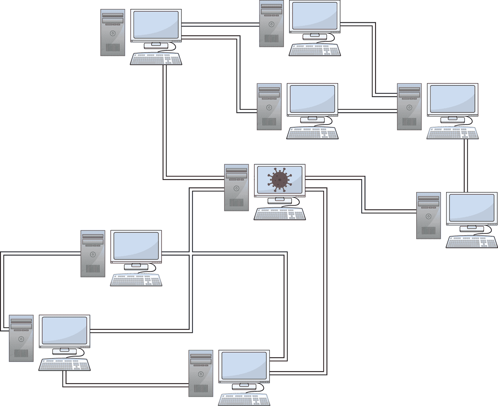
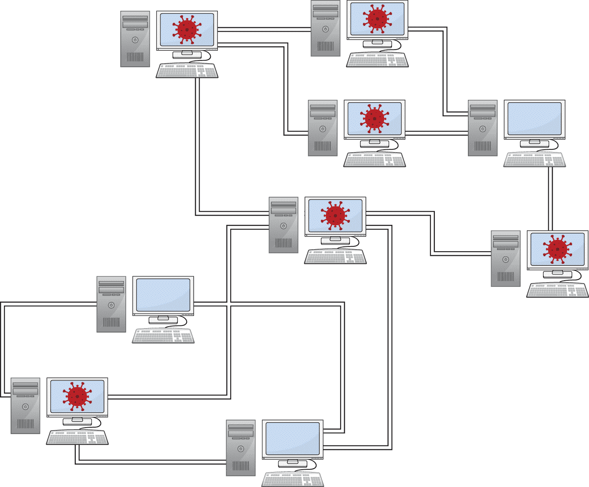

# 第四章

基础设施

第三章探讨了理论层面和协议级别的区块链。就像 HTTP 一样，这些协议定义了不同系统如何交互以实现特定目标。

虽然区块链白皮书描述的理论完全定义了系统应该如何工作，但区块链需要被实现才能被使用。这创建了对底层基础设施的依赖。

区块链协议可以以各种不同的方式实现。例如，比特币可以用笔、纸和信鸽运行；然而，这种方法会创建一个非常慢且无法使用的系统。

区块链技术依赖于现代 IT 设备。这包括将区块链作为在区块链节点上运行的软件，并通过计算机网络进行通信。  ## 节点

区块链系统作为软件实现。这种软件运行在被称为*节点*的计算机上。

虽然区块链在理论层面可能具有非常强大的安全性，但是将协议以代码形式实现会引入额外的风险。区块链软件可能包含业务逻辑或实现错误，或者可能受到在同一环境中运行的其他软件的攻击。

### 区块链节点内部

区块链节点就是运行在计算机上的软件。然而，区块链节点可能承担许多不同的职责。以下是一些区块链节点可能承担的角色：

+   **账本存储：** 区块链网络中的每一个节点都可以维护区块链数字账本的一个副本。这需要能够存储账本的内容，并根据需要访问交易或区块的内容。

+   **区块生产：** 区块链的数字账本通过包含交易集合的区块进行更新。区块链节点可能参与共识过程和区块候选的创作与分发。

+   **区块验证：** 区块链被设计用来对存储在区块链数字账本上的交易进行去中心化验证。区块链节点在将区块添加到其数字账本的副本之前，预期要验证其接收到的每个区块。

+   **智能合约执行：** 智能合约平台允许程序在数字账本之上运行。智能合约平台上的节点托管虚拟机，并在验证区块和更新数字账本的过程中在其中执行代码。

区块链网络中的每一个节点并不一定都承担这些角色。例如，一个节点可能选择不参与共识和区块生产。

然而，满足区块链网络的需求需要区块链节点投入大量的资源。针对这些节点的攻击，如果扰乱了访问这些资源的通道，将对区块链网络的性能和安全性产生重大影响。  ### 攻击区块链节点

区块链节点可能以各种不同的方式受到攻击。在以下部分，我将介绍一些针对区块链节点及其用户的主要安全威胁：

+   区块链特定恶意软件

+   拒绝服务攻击

+   未能更新

+   恶意输入

+   软件配置错误

#### 区块链特定恶意软件

运行在节点上的区块链软件还与其他软件一起运行，包括合法程序和潜在的恶意软件。

一些恶意软件变种被专门设计用来针对区块链系统。这些恶意软件变种的潜在影响如下：

+   **私钥盗窃：**安装在节点或区块链用户计算机上的恶意软件可能监控剪贴板并扫描计算机内存以寻找类似于区块链私钥的数据。然后将这些密钥导出给攻击者，为攻击者提供用户账户的完全控制权。

+   **交易修改：**区块链恶意软件可能被设计在用户数字签名之前修改交易数据。例如，恶意软件可能会将交易的目的是攻击者的地址替换，或修改交易以创建对攻击者的恶意批准，从而使攻击者能够从去中心化金融（DeFi）项目中提取用户的代币。

+   **流量过滤：**区块链节点的区块链状态视图及其参与其操作的能力取决于其接收和发送交易和块的能力。拦截和过滤节点区块链流量的恶意软件可能会向其提供区块链状态的虚假版本。这可能会诱使用户支持支持攻击者的 51%攻击的分叉区块链。

+   **拒绝服务攻击：**节点上运行的恶意软件可能会对该节点执行拒绝服务攻击。这可以通过消耗资源、攻击区块链软件进程或其他手段来实现。

区块链账户的安全以及整个区块链网络的安全取决于运行在节点上的区块链软件的安全。安装在这些节点上的恶意软件可能会以各种方式干扰它们的操作。

##### 应对措施

恶意软件感染是传统的 IT 安全威胁，区块链特定恶意软件与其它变种并没有太大不同。传统的防恶意软件解决方案可以帮助防御这种威胁。##### 案例研究

由于代码中使用了大数字，TRON 区块链容易受到拒绝服务（DoS）攻击。¹ 在现代笔记本电脑上，每次加载一个大数字需要 2 到 3 分钟，而代码每个请求使用了 6 个大数字。利用这一漏洞的攻击者可以将 TRON 节点的 CPU 占用尽，并填满其内存，使区块链软件无法使用。#### 拒绝服务攻击

拒绝服务（DoS）攻击可以在区块链生态系统的任何层面发生。在节点层面，拒绝服务攻击涉及崩溃运行在单个节点上的区块链软件。

针对一个节点可以以多种不同的方式实施拒绝服务攻击。一个节点可能成为分布式拒绝服务（DDoS）攻击的受害者，该攻击通过垃圾流量淹没它，使其无法对合法请求做出响应。安装在节点上的恶意软件可能消耗内存或计算资源来阻碍与区块链相关的进程。区块链交易可能是特别设计的，消耗资源并使区块链节点崩溃。

拒绝服务攻击可能伤害到区块链节点以及整个网络。受到 DDoS 攻击的区块链节点可能再也无法参与区块链网络。这个节点的损失也可能通过使它无法参与共识和区块生产，从而影响到区块链网络的安全和性能。

##### 应对措施

拒绝服务攻击可以来自区块链生态系统的内部和外部。节点可以部署传统的抗 DDoS 和抗恶意软件解决方案来保护外部威胁。在区块链生态系统内部，必须设计系统来保护节点，防止恶意交易消耗资源并压垮区块链节点。  ##### 案例研究

拒绝服务攻击多次通过利用软件漏洞针对区块链网络实施。比特币核心代码库中的一个缺陷让攻击者能够对节点执行拒绝服务攻击，或者通过在多笔交易中使用同一笔比特币来膨胀加密货币。² 这个漏洞是由于对比特币核心软件的代码审查不力造成的，在比特币区块链上被利用之前就已经修补了。然而，其他区块链分叉了比特币核心软件，因此也容易受到同样的攻击。鸽子币（Pigeoncoin）这种加密货币因为利用了这个漏洞而被攻击，攻击者能够打印出 2.35 亿鸽子币（接近计划最大供应量四分之一）。  #### *未能更新*

区块链软件是软件，所有软件偶尔都需要更新。更新可能是为了增加功能或修复早期版本中识别出的问题。

在传统的 IT 领域，更新和补丁管理是一个重大挑战。这导致攻击者扫描并利用公开已知的漏洞，而这些漏洞已有可用的补丁。

然而，区块链的去中心化加剧了更新和补丁管理过程。区块链网络的安全取决于网络中节点的 security，但不存在有力量强制节点进行更新的集中权威。

这个问题加剧的原因之一是一些对区块链协议的更新可能存在争议。例如，比特币现金就是由于对 SegWit 升级的分叉而从比特币中分离出来的，而以太坊经典则是因为以太坊对 DAO 攻击的回应而分叉。

区块链节点面临一些与更新相关的安全风险：

+   **节点利用：** 一些区块链软件更新旨在修复使区块链节点面临风险的安全漏洞。如果一个节点未能安装更新，它可能会被攻击者利用。

+   **区块链分叉：** 区块链遵循最长链规则，该规则认为应接受两个相互冲突的区块链版本中最长的那个。如果一个更新包含硬分叉，那么安装了更新和未安装更新的节点可能会遵循不同的区块链分叉。这可能会造成干扰，并增加区块链网络受到共识攻击的风险。

+   **恶意更新：** 区块链软件通常是在开源模式下开发的，接受来自第三方的贡献。攻击者可能会在分发作为软件更新的区块链代码中插入恶意功能。

软件更新对于维护区块链的安全性和扩展其功能至关重要。然而，通常区块链开发者需要在鼓励节点安装更新和公开漏洞之间谨慎行事，当足够多的区块链节点存在漏洞，攻击可能会 disrupt 区块链网络的正常运行时。

##### 应对措施

区块链软件通常遵循林纳斯定律，该定律认为“只要有足够的眼睛，所有的 bug 都是浅显的。”然而，这仅当有资格的开发人员实际审计代码时才适用。区块链软件应遵循安全开发实践，以确保更新高质量，节点应该在更新一可用时就安装。##### 案例研究

以太坊派利客户端在 2.2.10 版本之前存在整数溢出漏洞，该漏洞将允许攻击者远程崩溃派利节点。³ 在漏洞公布一个月后，仍有 40%的派利节点未应用补丁。这些节点当时占所有以太坊节点的 15%，因此利用该漏洞可能会对以太坊网络的性能和安全性产生明显影响。  #### *恶意输入*

区块链软件旨在处理不可信输入。用户有权提交交易到区块链，这些交易将由区块链软件处理，甚至可能被执行。

理想情况下，所有这些处理都应该在区块链的隔离虚拟机内完成。然而，如果处理交易、智能合约代码或区块的代码中存在漏洞，攻击者可能利用这些漏洞攻击区块链网络，或者突破沙盒式区块链环境。

这些注入攻击可能对节点或网络的其他部分产生重大影响。区块链突破可能允许攻击者访问底层主机，可能导致它崩溃或允许攻击者接管它。

对区块链节点的攻击也可能影响整个区块链网络。例如，利用导致易受攻击节点崩溃的 DoS 漏洞可能会使攻击者更容易针对网络执行 51%攻击，因为网络的哈希功率显著降低。

##### 应对措施

恶意输入和注入漏洞是由糟糕的输入验证引起的。任何接受并处理不可信用户输入的代码在处理输入之前应该验证输入是否有效。  ##### 案例研究

这种攻击可能已经发生在使用 EOS 分布式账本软件的用户身上。在发布前，来自安全公司奇虎 360 的研究人员检查了 EOS 源代码，并发现了一个在向数组写入数据前没有正确检查其边界的错误。⁴ 这个漏洞存在于解析 EOS 交易的代码中，这意味着它会被恶意 EOS 用户利用。研究人员道德上向 EOS 团队报告了这一问题，并得到了修复。

这个漏洞的影响将允许攻击者在任何运行中的 EOS 代码中写入代码。奇虎 360 的研究人员开发了概念验证攻击，证明利用这个漏洞生成反向壳是可能的。这将允许攻击者以与 EOS 进程相同的权限控制受影响的计算机。由于区块链网络中的每个节点都会处理包含在区块中的所有交易，因此将恶意交易包含在区块中将允许攻击者利用 EOS 网络中的所有节点。  #### *软件配置错误*

区块链软件可能包含大量的可选功能。例如，区块链节点可能有机会与外部应用程序连接，用于管理私钥、执行交易等。

随着这些可选功能的出现，用户可能在不知道或考虑安全影响的情况下启用它们的风险。例如，能够连接到可以使用区块链账户进行交易的外部系统对于订单处理或物流管理系统来说很好，但如果被攻击者访问就是一个大问题。

##### 应对措施

区块链软件中的可选功能应该默认禁用。在启用任何功能之前，用户应该研究它们的目的、如何工作以及使用和保护它们的最佳实践。  ##### 案例研究

攻击者利用这种篡改的一个例子是一系列来自以太坊钱包的盗窃。⁵ 这款钱包软件具有打开端口 8545 的能力，以允许外部软件通过远程过程调用（RPCs）与钱包交互。这个功能是为了使钱包能够与组织软件集成，该组织软件有权在以太坊区块链上执行交易。

这个功能是为了内部使用设计的，因此用户应该在网络防火墙处封锁端口 8545，以防止利用。该功能默认禁用，但一些爱好者在不知晓采取适当安全预防措施的情况下启用了它。结果，攻击者扫描并利用端口 8545 开放的脆弱设备，从以太坊用户那里窃取了超过 2000 万美元的以太币。### 区块链节点的威胁建模

区块链节点存在覆盖了所有 STRIDE 类别（除了抵赖）的安全威胁：

+   **伪装**：区块链恶意软件可以窃取私钥或修改交易，以代表区块链账户执行操作。

+   **篡改**：恶意软件可以用来执行日食/路由攻击，这可能使攻击者能够实施 51%攻击，重写分布式账本的历史。

+   **信息泄露**：区块链恶意软件窃取私钥可能使攻击者能够解密账户所有者预期的消息。

+   **服务拒绝**：区块链节点可能以多种方式遭受 DoS 攻击，例如恶意软件攻击或由于未能应用更新而在硬分叉后无法访问区块链。

+   **权限提升**：区块链恶意软件可以窃取私钥，为用户账户提供未经授权的访问。利用恶意输入的注入漏洞可能使攻击者获得对或控制底层节点的访问。  ## 网络

区块链节点必须能够彼此通信。节点需要访问最新的交易和区块，以便对其区块链分布式账本的副本进行更新。

去中心化是区块链的核心原则之一，因此区块链网络不采用客户端-服务器模型。相反，区块链使用点对点网络，其中每个节点直接连接到几个其他节点。信息通过多个不同的跃点在区块链上传播。任意两个节点之间都有多个不同的路径连接，使得区块链网络具有高度的冗余性和弹性。

可靠、高性能的通信对于区块链共识和区块链网络的同步至关重要。因此，区块链依赖的基础网络基础设施的安全性对区块链协议本身的安全性有重大影响。

### 攻击区块链网络

区块链网络可以以几种不同的方式受到攻击。这些攻击的影响范围从干扰和性能下降到双重支出和针对区块链共识的攻击。针对区块链的网络级攻击有以下三种：

+   服务拒绝

+   Eclipse/路由

+   Sybil

#### 拒绝服务攻击

作为一种分布式、去中心化的系统，区块链本应对抗传统的拒绝服务（DoS）攻击免疫。在传统的 DoS 攻击中，攻击者试图压倒系统中的单一故障点或瓶颈，从而导致功能下降。例如，许多现实世界的 DoS 攻击试图用连接尝试淹没一个 Web 服务器。一旦 Web 服务器的连接容量被超出，它就无法再接受合法的连接。

在一个完全去中心化的区块链中，没有运行网络的中心权威，因此不存在永久的单一故障点。然而，许多区块链实现中存在临时的单一故障点，一些实现并不完全去中心化。这两个都可能使系统遭受 DoS 攻击。

一个临时单一故障点的例子是由区块链共识算法选择的区块创建者。这些算法旨在确保在给定时间间隔内只有一个人能被选中创建一个区块。如果攻击者能够在他们有机会生成和分发区块之前预测下一个区块创建者（在权益证明中绝对可能），他们可以对那个用户进行 DoS 攻击。至少，区块的分发可能会被延迟，如果它没有在适当的时间间隔内发布，该区块甚至可能会被忽略。

尽管原始的区块链没有永久的单一故障点，但为了在某些实例中创建它们，对协议进行了修改。所有私有和受许可的区块链实现都存在一定程度的集中化，因为有人能够允许或拒绝区块链网络的访问或网络上的高级权限。这些单一故障点的例子（可以被 DoS 攻击）包括在 Hyperledger 私有区块链上的会员服务提供商（MSPs）和在一系列受许可的区块链上使用的 masternodes。

##### 对抗措施

针对区块链网络中的区块生产者和其他单一故障点的 DoS 攻击使用传统方法来降低或破坏这些系统的可用性。防 DDoS、防恶意软件和其他类似解决方案可以帮助保护节点免受这些攻击。##### 案例研究

要针对区块链操作中的区块生产者或其他关键节点执行 DoS 攻击，有必要揭露该节点的身份。然而，这比应有的要容易。在 2018 年 Devcon 4 的一个演讲中，Péter Szilágyi 概述了几种可以揭露以太坊用户身份的方法，包括跟踪器以及用于将轻节点连接到网络的发现协议。⁶ 有了关于节点 IP 地址和位置的信息，就可以针对它们进行 DDoS 和其他攻击。#### *日食/路由攻击*

区块链安全的一个重要假设是网络中的所有节点彼此都有连接，直接或通过一系列的对等连接。在日食或路由攻击中，攻击者故意将一个或多个节点与区块链网络的其余部分隔离。这种隔离允许攻击者影响目标节点对区块链生态系统的状态的看法，并可以作为多种不同攻击的一部分。

图 4.1 说明了针对区块链的日食/路由攻击。图中的恶意节点控制着区块链网络两个段之间的所有通信路由。这允许节点控制这两个段之间的数据流动。

图 4.1：路由攻击

日食/路由攻击的一个简单用途是执行双重支付攻击。通过向网络的每个孤立段发送同一交易的不同版本，攻击者可以让这些段的用户接受并根据他们看到的版本采取行动。当攻击完成时，孤立段将重新连接并发现它们有冲突的历史版本。根据最长链规则，较短版本将被丢弃，只留下网络正式历史中的一个冲突交易版本。由于攻击者控制了网络分割的方式和时间，他们可以确保较长链包含他们更喜欢的版本的历史。

日食/路由攻击也可以用来使执行 51% 攻击变得更容易。如果一个孤立的段仅有网络 60% 的哈希力，那么攻击者只需要控制 30% 的哈希力就可以在该段创建被接受的区块链版本。一旦攻击者的版本被那 60% 接受并得到支持，并成为最长的总链，攻击者就可以结束日食/路由攻击。之后，攻击者的区块链版本将被整个网络接受。

eclipse 和路由攻击可以通过多种不同的手段进行。如果攻击目标是单个用户（eclipse 攻击），恶意软件或 Sybil 攻击可以用来控制受害者与区块链网络其他部分的连接。如果恶意软件控制了一个节点的网络连接，或者攻击者控制了足够的 Sybil 账户，使得一个节点的所有对等节点都是恶意的，那么攻击者就可以过滤节点对区块链网络的视图。

将节点组彼此分隔的一种方法是通过边界网关协议（BGP）劫持。BGP 旨在定义互联网上自治系统（AS）之间的路径——如 ISP 的网络——并且 AS 会隐式信任提供给一组 IP 地址的路径的真实性。如果攻击者成功地伪造了一个比所有合法路径更短的 BGP 路由，它将被选择。结果是，两个对等体（或甚至两组 IP 前缀）之间的所有流量在到达目的地之前都会通过攻击者的控制。这使得攻击者能够操纵区块链网络的拓扑结构，切断段之间的链接，使它们除了通过攻击者控制的节点外无法相互连接。

##### 对策

Eclipse 和路由攻击依赖于攻击者将区块链网络分割成多个孤立的部分的能力。节点可以通过故意选择分布式对等体，使用连接不同 IP 前缀的多宿主节点，并分析由网络分区导致的哈希能力突然丧失引起的网络延迟，来使这种攻击更加困难。##### 案例研究

2017 年的一项研究发现，由于比特币节点分布在互联网上，路由攻击将相对容易进行。⁷当时，60%的比特币网络流量通过了三家 ISP。

比特币节点经常受到 BGP 路由攻击的影响。实际上，从 2015 年 10 月到 2016 年 3 月，每个月都有至少 100 个节点受到 BGP 劫持攻击的影响，2015 年 11 月大约有 8%的比特币节点受到了攻击的影响。#### Sybil 攻击

Sybil 攻击是一种简单的网络层攻击，旨在促进其他类型的攻击。在 Sybil 攻击中，攻击者会在区块链上创建大量用户账户。图 4.2 说明了 Sybil 攻击。

**图 4.2**：Sybil 攻击

Sybil 攻击与 51%攻击的区别在于，每个 Sybil 账户并不一定需要有大量的计算资源。实际上，Sybil 节点可以通过作为活跃账户，将接收到的区块和交易传递给其对等节点，从而成为不同攻击的重要组成部分。

一个 Sybil 攻击的常见例子是恶意区块链用户试图利用设计不当的链上治理系统。如果在链上投票中，区块链网络上的每个账户都有一票，那么攻击者可以通过创建大量伪账户来参与投票，从而控制治理系统。因此，许多采用链上治理的区块链系统根据用户在网络中的权益来分配投票权，要么直接要么通过定义某些用户为基于他们拥有的一定最小数量的区块链加密货币的 masternode。

Sybil 攻击也可以用来促进日食/路由攻击，如图 4.2 所示。如果一个攻击者控制了网络账户和节点的大部分，其他节点更有可能选择一个恶意节点作为同伴。如果两个节点之间的所有路由都通过一个恶意节点，那么攻击者就有能力过滤这两个节点之间的流量。

##### 应对措施

大多数区块链共识和治理算法都是设计用来抵御 Sybil 攻击的，通过控制稀缺资源作为投票的代理。通过遵循检测和减轻日食/路由攻击的最佳实践，可以减轻网络层面 Sybil 攻击的影响。  ##### 案例研究

区块链账户的匿名性使得检测 Sybil 攻击变得困难。2019 年的一项研究模拟了 Sybil 攻击的效果，发现 Sybil 节点可能会影响区块链性能，但恶意节点可以通过检查一个节点是否只转发来自特定节点的交易或区块来被发现。[⁸  ### 区块链网络的威胁建模

针对区块链网络的攻击可分为几个 STRIDE 威胁类别：

+   **篡改**：日食/路由攻击可以帮助攻击者执行 51%攻击，从而重写分布式账本的历史。

+   **否认**：日食/路由攻击可以实现双重支付和 51%攻击，允许攻击者否认过去的交易。

+   **服务拒绝**：区块链网络可能以各种方式成为服务拒绝攻击的受害者。

+   **权限提升**：日食/路由攻击可以使 51%攻击成为可能，赋予攻击者对区块链的控制权。  ## 结论

区块链节点和网络构成了将理论区块链协议转化为可行系统的物理基础设施。然而，从理论到实践的这种转变可能会为区块链系统创造额外的攻击向量。

在下一章中，我们将超越比特币和其他类似区块链网络实施的的基本区块链协议。智能合约平台允许程序在区块链的数字账本之上运行，而区块链扩展则实现了区块链的可扩展性、可扩展性和互操作性。  ## 注释

1.  1.  `[www.yahoo.com/video/tron-discloses-critical-vulnerability-could-211000583.html](http://www.yahoo.com/video/tron-discloses-critical-vulnerability-could-211000583.html)`

1.  2.  `[www.coindesk.com/markets/2018/10/02/bitcoin-bug-exploited-on-crypto-fork-as-attacker-prints-235-million-pigeoncoins](http://www.coindesk.com/markets/2018/10/02/bitcoin-bug-exploited-on-crypto-fork-as-attacker-prints-235-million-pigeoncoins)`

1.  3.  `[`cointelegraph.com/news/data-just-2-3-of-eth-nodes-running-parity-have-been-patched-against-critical-security-flaw`](https://cointelegraph.com/news/data-just-2-3-of-eth-nodes-running-parity-have-been-patched-against-critical-security-flaw)`

1.  4.  `[`thehackernews.com/2018/05/eos-blockchain-smart-contract.html`](https://thehackernews.com/2018/05/eos-blockchain-smart-contract.html)`

1.  5.  `[`cointelegraph.com/news/ethereum-hacks-on-the-rise-again-as-price-remains-below-100`](https://cointelegraph.com/news/ethereum-hacks-on-the-rise-again-as-price-remains-below-100)`

1.  6.  `[www.coindesk.com/markets/2018/11/08/the-little-known-ways-ethereum-reveals-user-location-data](http://www.coindesk.com/markets/2018/11/08/the-little-known-ways-ethereum-reveals-user-location-data)`

1.  7.  `[`btc-hijack.ethz.ch`](https://btc-hijack.ethz.ch)`

1.  8.  `[`ieeexplore.ieee.org/document/8944507`](https://ieeexplore.ieee.org/document/8944507)`
