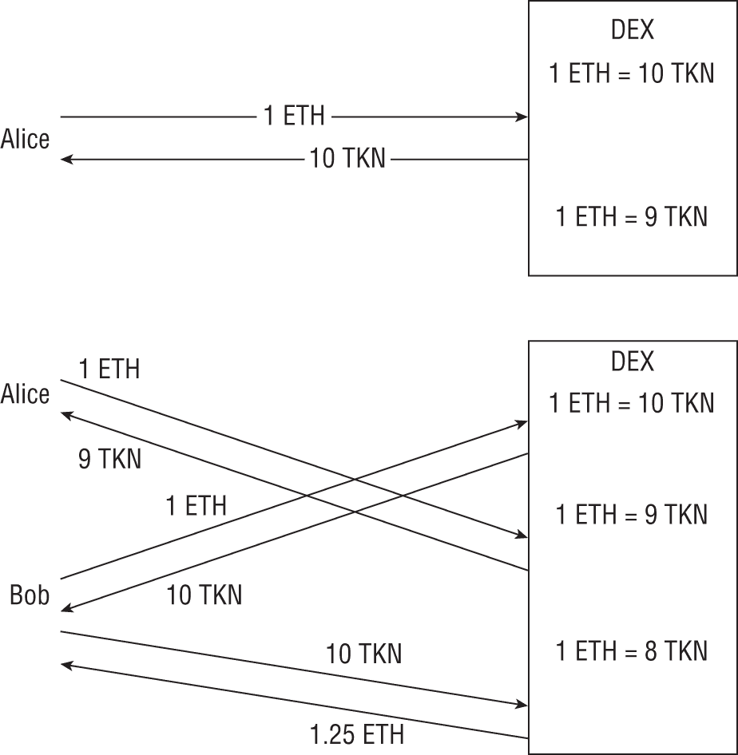

# 第五章

高级

Bitcoin，最初的区块链协议，主要是为了实现一个用于追踪金融交易的分布式系统。尽管比特币具备一些脚本功能，但这些程序并不具备图灵完备性，这意味着它们无法实现运行在另一台计算机上的程序的所有功能。这种图灵不完备性限制了它们的能力。

智能合约平台扩展了区块链协议，允许图灵完备的程序在区块链之上运行，极大地扩展了区块链上可以完成的事情。区块链扩展更进一步，利用智能合约的能力构建协议，通过在智能合约之上构建新的协议或连接不同的区块链系统，解决区块链技术的关键局限性。  ## 智能合约

智能合约是在区块链分布式账本之上运行的程序。智能合约平台的目标是创建一个“世界计算机”，在该计算机中，区块链网络中的每个节点维护一个虚拟机实例，并且这个虚拟机的状态在整个区块链网络中同步。

智能合约平台通过控制在分布式虚拟机上运行的指令和执行环境来实现同步。指令通过区块链的分布式账本和共识算法进行协调。指令嵌入在交易中，交易组织成区块并添加到账本中。这确保了，如果网络就区块链的状态达成共识，每个节点都同意交易执行的顺序。

智能合约平台通过在虚拟机中运行这些指令来控制执行环境。智能合约的虚拟机旨在为网络中的每个节点创建完全相同、确定性的执行环境。

理论上，如果每个节点在相同的环境中运行相同的代码，它们应该都会得到完全相同的结果。这使得在“世界计算机”内同时维护去中心化和同步成为可能。

### 智能合约漏洞

智能合约是软件，而软件有漏洞。即使智能合约技术尚不成熟，已经与它相关联的各种常见漏洞已经存在。

接下来的章节涵盖了智能合约中一些最常见的漏洞。然而，由于智能合约和智能合约安全领域在不断演变，这永远不会是一个全面的，包含所有可能的智能合约漏洞的列表。

在本讨论中，漏洞被分为四大类：

+   **通用编程漏洞：**这些漏洞可能存在于任何应用程序中。智能合约之所以存在这些漏洞，仅仅是因为它们是程序。

+   **区块链特定漏洞：**这些漏洞源于区块链技术的独特设计。它们与平台无关，并适用于大多数或所有区块链实现。

+   **平台特定漏洞：**这些漏洞是特定于某个智能合约平台的。以太坊和 EOSIO 是最老和最常用的两个智能合约平台，它们提供了最多的漏洞被发现的机会。

+   **应用特定漏洞：**智能合约可以被设计用于不同的目的。去中心化金融（DeFi）和非同质化代币（NFTs）是智能合约最常见和增长最快的两个应用。

#### *通用编程漏洞*

通用编程漏洞是可能存在于任何程序中的漏洞。它们源于软件是如何工作和管理变量、内存等等的方式。

缓冲区溢出漏洞是通用编程漏洞的一个例子。程序为数据分配内存块，如果打算放入缓冲区的数据比缓冲区本身还要大，就会出现问题。只要程序以这种方式管理内存，在缺乏保护的语言中，缓冲区溢出就是一个潜在的风险。

本文讨论的范围之外，完整地列出所有可能在智能合约中存在的通用编程漏洞是不可能的。一些在智能合约中出现的主要漏洞如下：

+   算术漏洞

+   十进制精度

+   数字签名漏洞

+   外部依赖

+   从左到右的控制字符

+   不安全的序列化

##### 算术漏洞

像整数溢出和下溢漏洞这样的算术漏洞存在于大多数编程语言中。算术漏洞是由变量的工作方式所允许的。

###### *变量和符号位*

变量是设计用来存储一个值的字节大小的内存块。这个变量中存储的一系列位是如何解释的，取决于变量的类型。例如，`int` 和 `float` 都可以是 4 或 8 字节长，但同样的位序列被解释的方式非常不同。

在数值数据类型中，还存在有符号和无符号变量的概念。如他们的名字所暗示，有符号变量有符号并且能够存储负值，而无符号变量则没有。在有符号变量中，最高位存储符号，而在无符号变量中，这个位是值的一部分。

整数溢出和下溢漏洞是由变量的固定大小和将值在有符号和无符号类型之间转换的能力所启用的。存储在变量中的值必须保持在一定的范围内，变量之间的不安全转换可能导致同样的位序列被以不同的方式解释。  ###### *整数溢出*

整数溢出漏洞发生在使用过小的变量来保存一个值时。例如，32 位无符号整数可以容纳 0 到 4,294,967,295 的值，而 32 位有符号整数可以容纳-2,147,483,648 到 2,147,483,647 的值。如果将一个大于这个最大值的值放入变量中，保存的值就是原始数字的 32 个最低有效位。

整数溢出可以以两种方式之一发生。一种选项是计算结果超过了变量能容纳的最大值。 图 5.1 为一个 8 位值说明了这一点。


**图 5.1**：整数溢出

另一种可能性是，一个不安全的类型转换强制一个值进入一个太小而无法容纳它的变量中。例如，值 3000000000 适合无符号整数但不适合有符号整数。

下面的代码示例来自一个智能合约，其中包含一个由 PeckShield 命名的整数溢出漏洞 batchOverflow。¹

```
function batchTransfer(address[] _receivers, uint256 _value) 
 public whenNotPaused returns (bool){
 uint cnt = _receivers.length;
 uint256 amount = uint256(cnt) * _value;
 require(cnt > 0 && cnt <= 20);
 require(_value > 0 && balances[msg.sender] >= amount);

 balances[msg.sender] = balances[msg.sender].sub(amount);
 for (uint i =0; i < cnt; i++) {
 balances[_receivers[i]] = balances[_receivers[i]].add(_value);
 Transfer(msg.sender,_receivers[i],_value);
 }
 return true
}

```

这个代码示例旨在向多个接收者发送相同金额的价值。代码计算要发送的总价值量，并验证发送者账户中至少有这么多价值。然后，它分别向每个预期接收者转账价值。

这段代码在计算*`amount`*时存在一个潜在的整数溢出值。如果*`cnt`*和*`_value`*的乘积至少为 2²⁵⁶，那么*`amount`*的值就会溢出。例如，*`cnt`*为 8，*`_value`*为 2²⁵³将会产生一个乘积为 2²⁵⁶，这超过了*`amount`*能容纳的值，导致*`amount`*存储的值为 0。*`amount`*的值为 0 将通过了`balances[msg.sender] >= amount`的测试，允许转账完成。

在循环中执行转账时，代码使用了变量*`_value`*，它表示要发送给每个接收者的金额。因此，每个接收者将收到 2²⁵³个代币的转账，而发送者的账户将记账 0 个代币(*`amount`*的值)。这些接收者随后可以从合约中提取他们的余额，提取属于其他用户的合法价值。###### 整数下溢

当一个变量被要求存储一个低于其最小值的值时，就会发生整数下溢。这也可以是由于计算结果或者由于使用错误的变量类型来存储一个值而发生的。

无符号变量只能存储正数，所以任何小于零的值都会使变量下溢。这可能是由于数学操作或者由于从有符号变量（可以存储负数）的不安全转换而发生的。

下面的代码示例是一个包含整数下溢漏洞的提现函数。

```
function withdraw(uint _amount) {
 require(balances[msg.sender] - _amount >= 0);
 msg.sender.transfer(_amount);
 balances[msg.sender] -= _amount;
}

```

在这个代码示例中，`require` 语句的目的是验证账户中是否包含请求的金额，然后再允许提款。理论上，从余额中减去金额并测试结果是否非负应该可以工作。

然而，用于计算的变量(*`amount`* 和 *`balances`*) 都是无符号整数，这意味着结果也将是一个无符号整数。由于无符号整数无法存储负数，计算的结果总是大于或等于零。因此，`require` 语句将批准任何提款请求，允许恶意用户从合约中窃取价值。###### *对策*

算术漏洞通常是由于使用了不适合操作的变量类型或变量类型之间的不安全转换造成的。这些可以通过自动化工具检测到，或者应该在代码审查中找出。###### *案例研究*

2021 年 12 月，PIZZA DeFi 项目遭到攻击，损失了 500 万美元的代币。攻击者利用了 eCurve 智能合约中的整数溢出漏洞，创建了大量 Tripool 代币。² 然后这些代币被存入 PIZZA 智能合约中，这使得攻击者能够提取合约中存放的其他代币。##### 小数精度

智能合约通常包含数学运算，尤其是在存储和传输价值时。一个常见的脆弱代码模式是乘法之前的除法。

在 Solidity 中——以及任何其他编程语言中——数值数据类型都有有限的精度。虽然在大多数情况下这可能不重要，但大数字的除法和乘法可能会导致小的舍入错误产生重大影响。

以下代码示例在计算代币价值时使用了除法在乘法之前的代码模式。

```
function calcLiquidityShare(uint units, address token, 
 address pool, address member) {
 uint amount = iBEP20(token).balanceOf(pool);
 uint totalSupply = iBEP20(pool).totalSupply();
 return(amount.div(totalSupply)).mul(units);
}

```

Solidity 使用整数数据类型进行操作，这意味着在乘法执行之前，除法的结果将被四舍五入。这可能导致最终答案与除法在乘法之前执行时的答案不同且更小。结果，代币被低估，用户在交易中获得的比他们应该得到的要少。

###### *对策*

在 Solidity 中执行乘法和除法时，应使用乘法在除法之前的代码模式。这有助于保留结果的精度，但存在整数溢出的风险。##### 数字签名漏洞

数字签名提供了验证交易并在传输过程中验证其未被修改的能力。数字签名通常用于智能合约中，尤其是在 DeFi 领域中。

然而，数字签名可能会以几种不同的方式出错：

+   **缺少验证：** 数字签名只有在其被验证时才有效。缺少签名验证可能会允许攻击者代表其他用户提交伪造请求。

+   **加密错误：**加密算法可能很脆弱，必须正确实现才能保证安全。一个加密漏洞的例子是在多个签名之间重复使用随机值。

+   **可塑签名**：在某些情况下，由于序列化或其他因素，数字签名覆盖的数据可能会以不同的方式解释。

数字签名错误的效果取决于具体漏洞。从接受伪造交易到向攻击者提供生成签名的账户完全控制权，其范围不一。

###### *对策*

应尽可能使用受信任的加密库实现数字签名。此外，代码应确保在接受交易之前验证签名。  ###### *案例研究*

2021 年 7 月，Anyswap 协议因实现椭圆曲线数字签名算法（ECDSA）中的加密错误而遭到黑客攻击。³多个交易使用了相同的 K 值，这个值应该是一个随机的一次性使用值。结果，两个签名的部分 R 是相同的，使得这种重复使用很容易被检测到。

利用这两个签名，攻击者能够计算出生成签名的私钥。这使得攻击者能够控制区块链账户，并能够窃取大约 787 万美元的代币。  ##### 外部依赖

在传统编程和智能合约中，使用库函数和其他第三方依赖是很常见的。代码重用可以加快开发过程，如果使用高质量的库，还可能提高代码性能和安全。

然而，外部依赖的使用使得第三方代码成为应用程序攻击面的一部分。以下列表包括与外部依赖相关联的两个风险：

+   **漏洞利用：**第三方代码可能包含漏洞，使其容易受到攻击。具有外部依赖的智能合约可能会从这种第三方代码中继承漏洞。

+   **服务拒绝攻击：**智能合约可能依赖于外部智能合约和功能来实现重要的功能。如果这些外部依赖因自毁或其他问题而变得不可用，那么除非能够更新以去除这些依赖，否则智能合约可能变得无法操作。

智能合约旨在交互，并且在区块链上减少冗余代码尤为重要，因为这有助于减少区块链数字账本上的膨胀。然而，外部依赖的使用可能会为智能合约带来安全风险。

###### *对策*

在使用外部依赖之前，应该对其进行审计，以识别它们可能引入到智能合约中的任何潜在安全问题。此外，智能合约应该以一种方式部署，以便它们可以根据需要更改，以移除或更新脆弱或过时的依赖。###### 案例研究

Parity 钱包是基于智能合约的钱包。钱包的用户可以部署他们自己的合约实例，这些实例依赖于一个中心库合约的核心功能。

这个库函数包含一个访问控制漏洞，允许攻击者接管合约。④ 攻击者随后调用了合约的 `self_destruct` 函数，使其变得无法使用。由于所有 Parity 钱包合约都依赖于这个合约的核心功能，这导致 513,774.16 ETH 以及存储在这些钱包中的其他代币永远丢失，因为不再存在将这些代币从钱包中转出的功能。##### 右至左控制字符

右至左控制字符是计算机上的一项功能，使它们能够支持不同的语言。虽然英语是从左至右书写的，但其他语言，如阿拉伯语，是从右至左书写的。非打印控制字符使得能够切换文本方向，从而支持这两种约定。

由于这些控制字符是不可打印的，并且可以出现在文本行的任何位置，因此它们可以被一个不择手段的智能合约开发者用来模糊其代码的含义。智能合约通常是开源的，通过允许任何人审查合约代码来建立信任。

下面的代码示例是由 Skylight Cyber 开发的，用以展示右至左控制字符的恶意使用。⑤

```
contract GuessTheNumber {
 uint _secretNumber;
 address payable _owner;
 event success(string);
 event wrongNumber(string);

 constructor(uint secretNumber) payable public {
 require(secretNumber <= 10);
 _secretNumber = secretNumber;
 _owner = msg.sender; 
 }

 function getValue() view public returns (uint) {
 return address(this).balance;
 }

 function guess(uint n) payable public {
 require(msg.value == 1 ether);

 uint p = address(this).balance;
 checkAndTransferPrize(/*The prize*/p , n/*guessed number*/
 /*The user who should benefit */,msg.sender);
 }

 function checkAndTransferPrize(uint p, uint n, address payable guesser) 
 internal returns(bool) {
 if(n == _secretNumber) {
 guesser.transfer(p);
 emit success("You guessed the correct number!");
 }
 else {
 emit wrongNumber("You've made an incorrect guess!");
 }
 }

 function kill() public {
 require(msg.sender == _owner);
 selfdestruct(_owner);
 }
}

```

这个代码示例是一个游戏，用户下注并尝试猜测一个秘密数字。如果他们赢了，他们将获得奖品。

`guess` 函数验证用户是否下注了 1 ETH，并将彩池的当前值存储在 *`p`* 中。然后调用 `checkAndTransferPrize` 函数，该函数检查 *`n`* 是否等于秘密数字，如果是，则将奖金发送给获胜者。

在此合约中，恶意代码行是对 `checkAndTransferPrize` 函数的调用，如下所示：

```
checkAndTransferPrize(/*The prize*/p , n/*guessed number*/
 /*The user who should benefit */,msg.sender);

```

这个命令将奖金金额、猜测的数字以及获胜者的账户地址发送到 `checkAndTransferPrize` 函数。

然而，由于良好的编码实践，此行代码中的注释并不存在。相反，代码第一行中的注释包含非打印的控制字符，这些字符使文本方向从左至右切换到右至左，再切换回来。

实际上，这个代码示例测试的是秘密数字是否等于合约中存储的值，而不是用户的猜测。由于*`secretNumber`* 小于或等于 10，所以拥有至少 11 个以太币价值的合约将无法赢得。实际代码将 *`n`* 作为 `checkAndTransferPrize` 函数的第一个参数，将 *`p`* 作为第二个参数。

然而，使用从右至左和从左至右的字符使得这些参数看起来被颠倒了。结果，代码审查提供了对合约功能的错误理解，这可能会诱使人们浪费钱玩一个无法赢得的游戏。

###### *对策*

利用从右至左和从左至右的控制字符进行欺骗之所以有效，仅仅是因为这些字符是不可打印的。只要在文本编辑器中源代码看起来是正确的，就没有理由怀疑这种攻击。

尽管从右至左和从左至右的控制字符是不可打印的，但它们仍然存在于智能合约的源代码中。扫描这些字符可以帮助检测这种试图的欺骗。  ##### 不安全的序列化

序列化使得数据结构可以转换成用于传输或存储的二进制字符串。在另一端，接收者根据对底层结构的了解，解包这些二进制序列。智能合约可以使用如以太坊的 `abi.encodePacked` 函数来实现序列化。

如果智能合约没有正确验证序列化数据，攻击者可以利用故意构造的序列化数据来利用序列化。的一个例子是智能合约弱点分类（SWC）133，它解决了由带有可变长度参数的数据序列化引起的哈希冲突。

以太坊的 `abi.encodePacked` 函数可能会导致包含数组的序列化数据有多种不同的解释。如果打包的数据包含多个相邻的数组，那么可以将值在这些数组之间移动，而不会改变最终的序列化值。

如果相同的序列化数据可以以多种不同的方式反序列化，那么对一个版本进行数字签名的认证可以用来认证它们中的任何一个。攻击者可以利用这一点来绕过认证机制，或者代表另一个账户执行恶意交易。

以太坊的短地址漏洞是另一个不安全反序列化的例子。这个漏洞在前面的代码示例中有所说明。

```
event Transfer(address _from, address indexed _to, uint256 _value);
function sendCoin(address to, uint amount) returns (bool sufficient) {
 if(balances[msg.sender] < amount) return false;
 balances[msg.sender] -= amount;
 balances[to] += amount;
 Transfer(msg.sender, to, amount);
 return true;
}

```

以太坊序列化输入到函数中，被调用函数进行解包。如果一个参数太短，那么它会从下一个参数中窃取缺失的字节。在前面的代码示例中，攻击者可以发送一个故意短一个字节的 *`to`* 值。

`sendCoin`函数没有检查*`to`*和*`amount`*的长度，所以*`balances`*和*`amount`*的比较使用了*`amount`*的正确值。然而，`Transfer`函数指定了参数的长度，因此以太坊将*`amount`*用零填充，将其乘以 256。结果，转移的金额远远超过了在`sendCoin`中批准的金额。

###### *对策*

序列化漏洞通常是由变量长度数据的序列化或序列化过程中数据验证失败引起的。使用固定大小的数据结构并在序列化数据正确解包时进行验证可以帮助减轻此漏洞。##### *案例研究*

2022 年 2 月，超流体协议遭到了价值 1300 万美元的黑客攻击。攻击者利用了项目在跨不同的超流体协议中跟踪事务内状态的序列化漏洞。

用于状态跟踪的*`ctx`*变量旨在通过`callAgreement`函数初始化为一个空占位符。攻击者在对`callAgreement`的调用中包含了一个恶意的*`ctx`*，然后将其占位符添加到发送到其他协议的序列化 calldata 中。

由于恶意的*`ctx`*在占位符之前，目标协议接受了它并忽略了占位符的值。此外，由于 calldata 来自一个可信的合约，协议没有验证它。恶意的*`ctx`*包含了一个从另一个账户到攻击者的伪造代币转账，该协议处理了它。#### *区块链特定漏洞*

区块链系统与传统的软件环境非常不同。智能合约代码不是在计算机上运行，而是运行在区块链之上。要执行的指令嵌入在交易中，这些交易广播到网络，组织成区块，最后添加到数字账本并执行。

区块链的独特设计创造了智能合约漏洞的潜力。以下是因为智能合约在区块链之上运行而存在的漏洞示例：

+   访问控制

+   坏随机数

+   服务否认

+   前置交易

+   回滚攻击

+   时间戳依赖

##### 访问控制

大多数智能合约平台都是以开放、公共区块链的形式实现的。任何人都可以在区块链上创建账户、创建交易，并与托管在区块链上的智能合约互动。

然而，智能合约中的所有功能可能都不打算公开访问。因此，智能合约平台有能力限制对特定功能的访问，例如智能合约的所有者。

为了将某些功能限制在特定的各方，智能合约需要定义这些各方是谁。通常，这是通过指定某些区块链账户的地址来完成的。尽管这些地址可以硬编码到智能合约中，但这并不是最佳实践，因为这些地址在合约运行时可能需要更新。

许多智能合约都有一个`initContract`或类似函数，在智能合约部署后分配所有权。以下代码样本展示了一个带有访问控制漏洞的`initContract`函数。

```
function initContract() public {
 owner = msg.sender;
}

```

该函数设计为将智能合约的所有权分配给调用函数的地址。此合约中的其他函数将被标记为仅可由合约所有者访问。

这个函数设计为在合约首次启动时调用；然而，它缺乏防止其被多次调用的任何限制。 instead of assigning ownership of the contract to the first account that calls `initContract`, the function assigns ownership to the account that called it most recently. This could allow an attacker to access privileged functions within the contract, potentially stealing value from it or using its permissions to bypass other access controls.

###### *对策*

这个函数存在漏洞，因为它没有阻止对其的多重调用。以下代码片段解决了这个问题。

```
function initContract() public {
 require(firstCall);
 owner = msg.sender;
 firstCall = false;
}

```

当这个合约启动时，*`firstCall`*会被设置为 true，允许部署者声称拥有该合约。然而，在函数的第一次调用后*`firstCall`*被设置为 false，所有未来的调用都会失败，因为`require`语句会解析为 false。

这个例子是智能合约访问控制机制可能失败的最简单方式。在部署智能合约之前，应审查所有访问控制机制，以识别潜在的漏洞或绕过方法。

例如，考虑一个设计为仅能从智能合约中的其他函数调用的函数，如以下代码样本中的`privateFunction`。

```
function privateFunction(_data) private {
 // Perform privileged actions
}
function forwarder(address callee, bytes _data) public {
 callee.delegatecall(_data);
}

```

如果合约内的公共函数（如`forwarder`）允许使用用户控制的参数调用该函数，那么该函数本质上也是公开的。  ###### *案例研究*

波场网络（Poly Network）的黑客攻击是迄今为止最大的去中心化金融（DeFi）攻击，窃取了超过 6.11 亿美元的代币。攻击者利用了智能合约内各个函数之间的信任关系链，从公开可访问的一个变为具有在智能合约内更新守护者角色能力的一对一关系。⑥ 利用守护者角色提供的访问权限，攻击者能够提取波场网络项目内储存的值。  ##### 不良随机性

生成随机数是智能合约的常见需求。例如，许多作为智能合约实现的游戏需要生成随机数来确定获胜者。

然而，在区块链上生成随机数存在几个困难：

+   **确定性：**为了让“世界计算机”工作，网络中的每个节点都需要能够运行相同的代码并获得相同的结果。如果每个节点独立地在执行合约代码时生成伪随机数，节点之间就会在“世界计算机”的状态上失去共识。

+   **公共账本：**所有交易都公开显示在区块链的数字账本上，包括创建和调用智能合约的交易。因此，区块链上没有隐私。

智能合约已经使用了生成伪随机值的不同方法，但其中许多都是不安全的。一些最常见的方法如下：

+   **秘密值：**智能合约代码可能会部署一个秘密值，用于初始化伪随机数生成器（PRNG）。然而，由于区块链上的交易是公开的，任何人都可以读取这个秘密值并预测伪随机值序列。

+   **秘密代码：**智能合约开发者不是使用一个秘密种子和一个已知的伪随机数生成器（PRNG），而是可能创建自己的生成伪随机数的函数。然而，由于智能合约代码是在一个交易中部署的，并且是公开可见的，所以这和秘密值有同样的问题。

+   **区块链元数据：**一些智能合约试图使用不可预测的区块链元数据，例如区块的时间戳或哈希值。然而，这些值中有些可以被区块生产者操纵，而且所有这些值也都可被其他智能合约访问。

下面的代码示例包含弱的随机数生成方法。⁷

```
function play() public payable {
 require(msg.value >= 1 ether);
 if (block.blockhash(blockNumber) % 2 == 0) {
 msg.sender.transfer(this.balance);
 }
}

```

在这个函数中，随机性的来源是特定区块的哈希值。虽然*`blockNumber`*的值没有显示，但没有一种选项能提供强随机数：

+   **当前区块：**当前区块和未来任何区块的哈希值是未知的，所以默认值为 0。这意味着指向当前区块的*`blockNumber`*的值总是会导致获胜。

+   **超过 256 个区块之前：**Solidity 只存储前 256 个区块的哈希值，并且对更早区块的请求会产生 0 的值。因此，一个*`blockNumber`* 超过 256 个区块之前将自动获胜。

+   **最近的区块：**对于过去任意 256 个区块中的任意一个，另一个智能合约都可以访问该区块的哈希值，并测试它是否为获胜者。如果是，它只能在确保获胜的情况下调用`play`函数。

###### *对策*

任何区块链生态系统中的信息，一旦被一个智能合约所获取，也很可能被另一个智能合约所获取。生成一个秘密随机值的唯一方法是从区块链生态系统外部进行生成。

智能合约应使用外部预言机提供随机生成的值。由于网络中的每个节点都会从预言机看到相同的值，这使得在不使用其他恶意智能合约可访问的值的情况下实现确定性成为可能。###### *案例研究*

SmartBillions 彩票是一个在以太坊区块链上举办的博彩游戏。玩家可以选择六个幸运数字，然后调用 `won` 函数来参与游戏。如果他们在调用 `won` 时他们的幸运数字与一个随机数字相匹配，那么他们可以获得递增的奖励。

SmartBillions 的随机数字基于之前块的哈希，在 Solidity 中只能访问到之前的 256 个块。攻击者猜测幸运数字为零，并在目标区块后的 256 个块调用 `won`，确保他们的猜测是正确的。⁸ 他们能够在游戏 creators 使用后门从合约中提取剩余的 1,100 ETH 之前从游戏中赢得 400 ETH。  ##### 服务拒绝

区块链系统被设计为分布式和去中心化的。网络中的任何节点都不是必需的，这意味着区块链系统缺乏永久性的单点故障。从理论上讲，这应该为抵御拒绝服务（DoS）攻击提供强有力的保护。

在实际应用中，区块链系统和运行在其上的智能合约容易遭受各种不同的拒绝服务（DoS）攻击，包括以下例子：

+   **针对交易创建者的 DDoS 攻击：** 为了执行智能合约，交易需要由其创建者广播到区块链网络。如果 DDoS 攻击使交易创建者无法发布它，那么它将不会被添加到账本中。

+   **针对区块创建者的 DDoS 攻击：** 交易仅作为区块的一部分添加到账本并执行。如果一个区块创建者无法创建一个区块，那么交易将被延迟添加到账本中。

+   **交易洪水 DDoS：** 区块链以固定最大尺寸定期创建区块，这意味着它们有最大吞吐量。如果区块链被垃圾交易淹没，那么合法交易可能无法通过并添加到数字账本中。

+   **日食/路由攻击：** 交易和区块通过区块链的对等网络进行分发。如果这些消息被攻击者拦截并删除，那么它们可能会被延迟或阻止被添加到数字账本中。

+   **恶意区块创建者：** 区块生产者完全控制着他们创建的区块中应包含哪些交易。区块生产者可以选择不在一个区块中包含一个交易，从而延迟它被添加到数字账本中。

一旦交易被分发到节点，它最终应该被包含在一个区块中，除非所有区块生产者勾结阻止这种情况。然而，一些智能合约是时间依赖的，所以延迟调用它们的交易可能会对结果产生重大影响。

#### 应对措施

许多这些攻击针对的是区块链依赖的基础设施。传统的 DDoS 攻击或针对区块链网络连接性的攻击是可以通过传统解决方案解决的 IT 安全问题。然而，区块链网络的去中心化可能会使得这些解决方案的普遍采用变得困难，比如让所有区块生产者部署 DDoS 保护。

其他的拒绝服务攻击利用了区块链的设计，比如交易洪水攻击和恶意区块创建者的潜在可能性。交易洪水可以通过区块生产者忽略垃圾交易来缓解，而在区块生产者没有普遍勾结的情况下，合法交易可能会被延迟但最终会被包含在一个区块中。###### 案例研究

西雅图（Sia）是一个去中心化、基于区块链的存储系统。2021 年 6 月，针对该网络的多日 DDoS 攻击针对了 Sia 网络主机和存储提供商的四分之一。⁹ 尽管这次攻击无法影响文件存储操作，但它确实中断了 30% 的主机连接。¹⁰  ##### 前锋攻击

交易不是立即添加到区块链的数字账本中。在创建交易后，它通过点对点网络广播给所有区块链节点。每个节点然后存储将要包含在稍后区块中的交易。只有当交易包含在一个区块中时，它才会被执行并添加到数字账本中。

这种设计为攻击者提供了一个机会，可以看到一个交易并基于它创建自己的交易，在第一个交易被处理之前。实际上，由于交易通常是按照交易费用顺序添加到区块中的，攻击者可以创建一个费用更高的交易，这可能会在原交易之前被处理。

基于费用对交易进行排序被称为矿工可提取价值（MEV），而利用它的能力是前锋机器人（frontrunning bots）的基础。图 5.2（#c05-fig-0002）展示了这些机器人如何利用前锋漏洞获利。



图 5.2：针对去中心化交易所的前锋攻击

去中心化交易所（DEX）是作为智能合约实现的加密货币交易所。DEX 需要能够计算各种交易对的汇率。通常，它们是基于供求法则实现的：DEX 中某种资产越多，其相对价值就越低。

在图片的上半部分，Alice 与 DEX 进行交易。由于当前汇率为 1 ETH 兑换 10 TKN，向合约发送 1 ETH 可返回 10 TKN。由于 DEX 的 ETH 供应相对于 TKN 供应的增长，ETH 相对于 TKN 的价值会降低。

图片的下半部分说明了这笔交易的 前冲攻击。尽管 Alice 仍然发送了 1 ETH，但 Bob 观察到交易并用自己的交易进行前冲。结果，Bob 以原始汇率 1 ETH:10 TKN 进行交易，而 Alice 的交易是在降低的汇率 1 ETH:9 TKN 进行的。

在 Alice 的交易完成后，Bob 进行另一笔交易，用他的 10 TKN 换取 ETH。由于前两笔交易增加了 TKN 相对于 ETH 的价值，Bob 得到了 1.25 ETH 的回报。因此，他的净收益为 0.25 ETH，减去他两次交易的费用。

这是前冲如何被用来造福攻击者的一个例子。前冲者也可能能够基于先到先得模型赢得比赛。

####应对措施

前冲攻击利用了区块链的设计，其中区块生产者完全控制着如何将交易组织到区块中。区块生产者应基于相关费用组织交易，但也可能选择优先处理某些交易，使它们能够无需费用地进行前冲交易。

智能合约可以被设计成最小化前冲的风险或收益。例如，合约可以随机从第一个*`X`*个提交中选择一个胜者，而不是采用先到先得的方式。尽管攻击者可以创建许多前冲交易来击败这个系统，但这样做更昂贵，可能使其无利可图。#####案例研究

DODO DEX 和 Punk Protocol 是 2021 年遭到攻击的 DeFi 项目。尽管这些攻击没有涉及前冲，但攻击者的交易被自动化机器人前冲了。通过复制攻击者的交易并支付更高的交易费，这些机器人利用了脆弱的合约，在攻击者之前提取了部分目标资金。

在这两起案例中，前冲机器人（frontrunning bots）的所有者都能够限制攻击的影响。Punk Protocol 机器人的操作者返回了价值 500 万美元的代币,¹¹而 DODO DEX 机器人的操作者返回了价值 188 万美元的代币。¹²#####回滚攻击

大多数智能合约平台默认对交易采取全或无的方法。如果交易的任何部分失败，那么整个交易将被回滚。

攻击者可以在与基于区块链的游戏的智能合约互动时利用这一点。智能合约可以调用游戏合约，如果它不喜欢结果，可以撤销交易。这意味着攻击者只有在肯定会赢的情况下才会参与游戏。

####应对措施

回滚攻击如果触发了另一个 Transaction，其影响将是非常大的。尽可能地，智能合约应该在验证触发它们的 Transaction 成功执行后才发起新的 Transaction。  ###### *案例研究*

2018 年 12 月，Betdice、EOSMax、Tobet 等基于 EOS 的赌博应用遭受了回滚攻击。¹³ 攻击者从区块生产者黑名单中的地址执行交易，这意味着它永远不会被接受并包含在区块中。

然而，与赌博应用相关的服务器看到了并处理了这笔交易，并确定它会赢得比赛。然后，它们发起交易，将奖励发送给玩家。因此，攻击者的初始投注交易没有记录在区块链上，但包含他们奖励的揭示交易却有记录。  ##### 时间戳依赖性

一些智能合约可能被设计为在特定时间点采取行动。例如，一个比赛可能在 1 月 1 日零点开始，所以在这个时间之前提交的将被拒绝，而之后的将被接受。

智能合约依赖于区块头中的时间戳来获取当前时间。然而，这并不是一个可靠的时钟。区块头时间戳受区块生产者的控制，并具有很高的灵活性。例如，以太坊虚拟机（EVM）只要求每个区块的时间戳要大于前一个区块的。尽管节点可能会拒绝时间戳过于靠后的区块，但有效时间戳没有正式的定义。

这创造了区块创建者为了自身利益而操纵时间戳的潜在风险。例如，以下代码片段具有时间戳依赖性功能。

```
function play() public {
 require(now > 1521763200 && neverPlayed == true);
 neverPlayed = false;
 msg.sender.transfer(1500 ether);
}

```

这段代码实现了一个比赛，时间戳 1521763200 之后的第一个玩家将赢得 1,500 ETH。一个在这次之前不久创建区块的节点可以通过将区块时间戳设置为 1521763201 并在区块中包含一个调用`play`函数的交易来作弊，从而声称奖励。只要他们的区块被网络接受，他们就可以在其他用户开始玩游戏之前赢得比赛。

###### *对策*

时间戳依赖性漏洞存在是因为时间戳受区块生产者的控制。尽管一些区块链对区块头中可接受的时间戳值有所限制，但这些限制往往是灵活的，以考虑到不同步的时钟和区块在点对点网络中传播的延迟。

实现时间依赖函数的更好方法是使用块高而不是块时间戳。这些值不受块生产者的控制，能够合理地近似当前时间。例如，尽管比特币的区块并非精确地在 10 分钟间隔内创建，但它们足够接近，以至于在一定时间内应该达到某个块高。  ###### *案例研究*

GovernMental 是一个在以太坊区块链上运行的庞氏骗局智能合约。游戏的规则是，如果在 12 小时内没有人对合约进行交易，前一个玩家将获得奖金。

这个智能合约可能会被一个在 12 小时窗口到期前创建区块的攻击者利用。¹⁴ 通过在区块头中伪造时间戳，恶意块生产者可以迫使合约提前支付，在 12 小时完成之前。  #### *平台特定漏洞*

智能合约平台是原始区块链协议的扩展。比特币不支持智能合约，不同的智能合约平台以不同的方式实现了这一功能。智能合约平台可能使用现有的编程语言和虚拟机，也可能创建自己的。

因此，不同的智能合约平台容易受到不同类型的漏洞攻击。以太坊和 EOSIO 是两个最古老且最常用的智能合约平台，这意味着它们有最多的机会发现这些平台特定漏洞。

##### 以太坊

以太坊是最早的智能合约平台，于 2015 年 7 月 30 日启动。这个平台的年龄和广泛采用为识别平台上的潜在漏洞提供了充足的机会。以下是一些特定于以太坊智能合约平台的漏洞示例：

+   服务拒绝：块气体限制

+   服务拒绝：意外反转

+   强制发送以太币

+   缺失零地址检查

+   重入

+   代币标准兼容性

+   未检查的返回值

+   不安全的外部调用

###### *服务拒绝：块气体限制*

以太坊使用气体的概念来对抗垃圾邮件并补偿节点的努力。气体是以太币的一部分，EVM 中的每个指令都有相应的气体成本。

当创建运行智能合约的交易时，账户会包含一些气体。如果在那之前气体耗尽，交易将会被撤销。

以太坊也有块气体限制，它限制了区块内可以使用的气体量。虽然这有其优点，但也创造了 DoS 攻击的潜在可能。如果一个智能合约功能需要的气体量超过了一个区块的容量，那么它就不能被执行。

以下代码片段显示了一个由于块气体限制而导致的 DoS 漏洞的函数示例。

```
function selectNextWinners(uint256 _largestWinner) {
 for(uint256 i = 0; i < largestWinner, i++) {
 // heavy code
 }
 largestWinner = _largestWinner;
}

```

这个函数包含一个由用户确定的循环次数的循环。循环基于之前的输入执行一些操作，然后将函数的参数*`_largestWinner`*的值分配给*`largestWinner`*，这决定了循环的终止条件。循环内部是消耗大量燃料的重代码。

一旦*`largestWinner`*的值足够大，使得循环的执行遇到或超过区块燃料限制，这个函数将变得无法使用。这可能是攻击的一部分，也可能是合法使用的一部分，因为随着更多用户参与游戏，*`largestWinner`*的值会增长。

触发此 Out of Gas 异常的人预计将赢得游戏，因为没有任何新玩家能够运行`selectNextWinners`函数来取代他们。因此，攻击者有动机选择一个大的*`largestWinner`*值，使其在未来无法运行。

**对策**：区块燃料限制漏洞通常存在于具有无限循环或递归的代码中。在前面的例子中，循环的迭代次数受到智能合约用户的控制。因此，函数可能会处于无法在区块燃料限制内运行的状态。

为避免这个问题，以太坊智能合约应避免无限循环或递归。尽可能模块化代码也是一个好主意，以最小化任何函数使用的燃料。如果可以将一系列操作分解为多个交易，这将降低遇到区块燃料限制的概率。  ***案例研究***     在时间戳依赖性案例研究中提到的 GovernMental 合约也由于以太坊的区块燃料限制而包含服务拒绝漏洞。允许玩家领取奖励的过程还包括一些清理代码。

这包括两个跟踪合约状态的数组。一旦参与者数组超过某个点，尝试清除它将超过区块燃料限制。因此，玩家将无法赢得游戏并领取奖励。¹⁵  ###### *服务拒绝：意外的回滚*

在以太坊中，智能合约账户与普通用户账户几乎完全相同。唯一的区别是智能合约账户关联了可以被其他账户执行的代码。

因此，智能合约具有发送、接收和存储价值的能力。这对于基于智能合约的游戏和允许用户在合约内存入和提取价值的 DeFi 智能合约至关重要。

与智能合约中的价值转账相关的一个漏洞是价值转账可能意外回滚。如果智能合约向另一个智能合约发送价值，接收合约的回退函数将被执行，允许它执行一些代码。这个回退函数可以被设计为回滚其所有的交易。

如果智能合约假设所有转账都会成功，这可能会在合约内造成 DoS（拒绝服务）漏洞。以下代码示例包含这种漏洞的一个例子。

```
contract Auction {
 address currentLeader;
 uint highestBid;

 function bid() payable {
 require(msg.value > highestBid);

 // Refund the old leader, if it fails then revert 
 require(currentLeader.send(highestBid)); 

 currentLeader = msg.sender;
 highestBid = msg.value;
 }
}

```

这段代码来自于“以太坊之王”智能合约¹⁶，该合约命名一位君主，然后允许其他玩家支付以宣称头衔。当这种情况发生时，前任君主会收到继任者的付款。

在这个函数中，`require(currentLeader.send(highestBid))`命令由于回滚交易的潜在可能性创建了一个 DoS 漏洞。如果当前君主撤销任何向他们转帐的交易，这段代码将会失败。

这里的意图是确保前任君主在被废黜之前总能收到他们的付款。然而，这段代码允许一个回滚他们付款的君主使得任何试图废黜他们的尝试失败。

***对策***    这个函数因为假设所有交易都会成功而容易受到 DoS 攻击。Solidity 包含了 try-catch 结构，可以用来在外部调用中处理回滚，使合约能够检测并响应失败的转账。###### *强制发送以太币*

如前所述，回退函数内的意外回滚可能会在调用合约中造成 DoS 漏洞。强制发送以太币漏洞则从另一个角度看待这个问题，探讨如果一个具有回滚回退函数的合约被迫接收以太币会发生什么。

下面的代码片段展示了一个试图回滚所有价值转账的以太坊智能合约的例子。¹⁷

```
contract Vulnerable {
 function () payable {
 revert();
 }

 function somethingBad() {
 require(this.balance > 0);
 // Do something bad
 }
}

```

在以太坊中，回退函数通过关键字`payable`来标识。在这个合约中，所有尝试的付款都会自动回滚。原因是，在`somethingBad`函数中，如果合约持有非零价值时会发生一些不希望的事件。

这个合约有效地保护自己免受正常价值转账的攻击，例如在意外回滚示例中使用`send`。然而，攻击者有几种方法可以绕过这一点，向合约发送以太币而不触发回退函数：

+   **预部署资金：**智能合约账户与以太坊上的任何其他账户一样，意味着它们在智能合约代码部署之前就能接收转账。如果攻击者能够预测智能合约的部署地址，那么他们可以在合约部署之前和回退函数存在时向其转账以太币。

+   **挖矿/质押**：参与共识可能会获得区块奖励。攻击者可以指出智能合约账户是区块奖励的预期接收者，这不会触发回退函数。

+   **自毁**：一个自毁的智能合约可以指定另一个合约作为该地址持有的以太币的接收者。由自毁触发的转账不会触发接收者的回退函数。

使用这些方法之一，攻击者可以将以太币强制转入目标智能合约。在这种情况下，对`somethingBad`的后续调用会通过`require`语句，允许执行不良功能。

**对策**：如果智能合约执行严格的价值比较，将以太币强制转入智能合约通常只会成为一个问题。例如，命令`if (value == 5)`如果攻击者将 6 个以太币强制转入合约，那么就会成为问题。

instead of using strict value comparisons, contracts should use greater than or equal to or less than or equal to. This way, any unexpected Ether does not break the contract's functionality.

对于需要严格跟踪的代码，例如之前的玩具示例，应该内部跟踪价值，而不是通过*`this.balance`*。以下代码示例展示了这种方法的示例。

```
contract Fixed {
 function () payable {
 if (isAcceptableTransaction()) {
 balance = balance + msg.value;
 } else {
 revert();
 }
 }

 function somethingBad() {
 require(balance > 0);
 // Do something bad
 }
}

```

在这个例子中，只有通过回退函数的转账会影响*`balance`*的值。因此，以太币的强制转账不会触发`somethingBad`函数。**案例研究**：Edgeware 项目允许用户在 3 到 12 个月内锁定以太币以换取奖励。当用户创建一个锁仓时，主锁仓合约会创建一个新合约来持有他们的以太币并实现锁功能。这些合约由于在创建时断言合约的价值严格等于用户发送的以太币金额，因此容易受到以太币的强制转账攻击。¹⁸

锁仓合约使用确定性算法来确定下一个合约的地址。由于新合约的地址是可以预测的，因此如果攻击者预先用以太币资助这个地址，可能会导致锁仓合约的创建失败。另外，由于锁仓合约会一直尝试使用同一个地址直到成功，锁定下一个地址会导致它永远失败。  ###### *缺失零地址检查*

创世地址，或零地址（`0x0`），在以太坊中用于销毁代币。由于这个地址的私钥是未知的，且很可能永远无法被发现，发送到这个地址的代币无法恢复。

在处理地址时，确保一个地址不是零地址非常重要。将代币或合约的所有权转让给零地址无法撤销。

智能合约如果假设在`0x0`地址处有智能合约代码，也可能出现错误。以下代码示例显示了脆弱代码实现了一个代币的`safeTransferFrom`函数。¹⁹

```
function safeTransferFrom(address token, address from, 
 address to, uint value) internal {
 (bool success, bytes memory data) = 
 token.call(abi.encodeWithSelector(0x23b872dd, from, to, value));
 require(success && (data.length == 0 || abi.decode(data, (bool)), 
 "!safeTransferFrom");
}

```

在此代码中，`safeTransferFrom`函数在创建存款代币的合约中被调用。这应该将该代币从一个地址转移到另一个地址。

如果*`token`*的地址是`0x0`地址，那么`call`函数将尝试调用`0x0`处的合约回退函数，但该函数并不存在。代替回退，这次调用将成功，使得看起来代币转账成功，而实际上并没有。因此，合约将接受并响应一个不存在的转账。

**对策**     在与代币的转账和智能合约的调用交互时，智能合约应始终检查零地址。此外，智能合约在尝试调用其内的函数之前，应验证地址处是否有智能合约代码。 **案例研究**     之前的脆弱代码示例来自 Qubit 项目，该项目实现了一个连接以太坊和 BNB 链平台的桥。这座桥于 2022 年 1 月被黑客攻击。

攻击者利用了缺失的零地址检查，诱使桥接接受一笔假 ETH 存款，触发了存款事件。该事件被桥接的智能合约捕捉，导致在 BNB 链上为攻击者账户铸造了 qxETH 代币，攻击者将其兑换成了 8000 万 BNB。###### *重入*

重入可能是最著名的以太坊特定漏洞。它是 DAO 攻击的原因，这是迄今为止最重大的以太坊攻击。

与意外回退一样，重入是由在回退函数内执行代码的能力实现的。以下代码片段包含一个重入漏洞。

```
function withdraw(uint _amount) {
 require(balances[msg.sender] >= _amount);
 msg.sender.call.value(_amount)();
 balances[msg.sender] -= _amount;
}

```

这个`withdraw`函数检查提现请求是否有效，将价值转移到的目标地址，并相应地更新其内部账本。然而，在状态更新之前，命令`msg.sender.call.value(_amount)()`执行，允许目标智能合约执行一些命令。

恶意智能合约可以通过在其回退函数内部再次调用`withdraw`函数来利用此漏洞。假设账户余额为 5 ETH，并要求提现 4 ETH，这将产生以下事件序列：

+   恶意合约调用`withdraw`函数。

+   `require`语句验证交易是否有效（5 >= 4）。

+   脆弱的`withdraw`函数 t 向恶意合约发送 4 ETH，触发回退函数。

    +   恶意合约调用`withdraw`函数。

    +   `require`语句验证交易是否有效（5 >= 4）。

    +   脆弱的`withdraw`函数向恶意合约发送 4 ETH，触发回退函数。

    +   回退函数返回。

    +   脆弱的合约更新内部状态(*`balances[msg.sender]`* = 1)。

    +   脆弱的`withdraw`函数返回。

+   脆弱的`withdraw`函数更新内部状态(*`balances[msg.sender]`* = -3)。

+   脆弱的`withdraw`函数返回。

因为脆弱的`withdraw`函数仅在执行价值转移后更新其内部状态，所以攻击者可以使用*`balances[msg.sender]`* 的原始值进行多次调用，允许他们从合约中提取过量价值。重入次数主要受每次迭代可用的 gas 量限制。

***对策***    通过遵循检查-效果-交互的代码模式，可以消除重入漏洞。这包括以下内容：

+   **检查：** 检查请求是否有效（例如，来自示例的`require`语句）。

+   **效果：** 记录事件的影响（例如，更新*`balances[msg.sender]`* 的值）。

+   **交互：** 执行行动（例如，转移价值）。

采用这种代码模式，对`withdraw`函数的重入调用将在`require`语句处失败，因为*`balances[msg.sender]`* 将等于 1，而不是 5。***案例研究***     DAO 攻击是迄今为止最著名的以太坊攻击。DAO 是一个旨在在区块链上实现众筹的合约。项目提案可以提交给合约，并由 DAO 代币所有者进行投票。如果获得批准，它们将获得资金，成功的项目将为 DAO 代币持有者支付股息。

DAO 智能合约中的一个重入漏洞允许攻击者通过反复请求提款，在合约更新其内部状态之前耗尽合约的价值。²⁰ 攻击者从合约中窃取了大约 3600 万 ETH。

最终，DAO 攻击最终失败，因为以太坊网络执行了一个硬分叉，重写历史，将其从账本中抹去。这引发了以太坊(ETH)和以太坊经典区块链的分叉，包含遵循和不遵循这个硬分叉的节点。这打破了区块链不可变性的规则，但帮助保留了 ETH 的价值。  ###### *代币标准兼容性*

以太坊有一系列称为以太坊改进提案（EIPs）的标准。其中一个是 EIP-20 标准，它指定在以太坊智能合约平台上创建的代币的标准接口。²¹

EIP-20 规范指定了常见代币函数的函数原型，包括它们的参数、返回值以及必须执行的动作，如触发某些事件。然而，并非所有代币都遵循 EIP-20 标准。

例如，EIP-20 规范指定`transfer`和`transferFrom`函数返回一个布尔值，表示成功或失败。然而，USDT 稳定币在这些函数中返回`void`。

这可能会与严格遵循 EIP-20 标准的智能合约不兼容，如下面的命令所示：

```
require(IERC20(inputToken).transfer(msg.sender,_amountIn),errorMessage);

```

这里的`require`意味着一个符合标准的代币将在转移成功时允许继续执行，如果交易失败则导致回滚。然而，使用像 USDT 这样的不合规代币调用此代码的交易将每次都会回滚，因为`require(null)`将抛出错误。

***对策***    像 OpenZeppelin 这样的项目已经实现了`safeTransfer`和`safeTransferFrom`函数，这些函数能够正确处理返回值检查和不合规代币。使用这些实现既提供了安全性，也支持不合规代币。  ***案例研究***    ForceDAO 是一个在上线几小时内被黑客攻击，损失了价值 36.7 万美元的代币的 DeFi 聚合器项目。²²该项目的保险库是 xSUSHI 合约的分叉，该合约对不符合 EIP-20 标准的代币存在漏洞。

攻击者向合约中存入了会在失败存款时返回 false 而不是回滚的代币。由于合约没有检查返回值，因此由于这些失败的存款而发行了 xFORCE 代币。然后攻击者可以将这些 xFORCE 代币兑换为存储在合约保险库中的 FORCE 代币。  ###### *未检查返回值*

在 Solidity 中，函数可以通过几种不同的方式指示失败。如果一个低级函数回滚，那么除非通过`try-catch`块处理，否则这笔交易会被完全撤销。然而，如果一个函数通过返回 false 来指示失败，那么调用函数可以在其下一个命令继续执行。

低级函数处理错误的这种差异可能会创建智能合约漏洞，就像以下代码样本中的那个一样。

```
function withdraw(uint256 _amount) public {
 require(balances[msg.sender] >= _amount);
 balances[msg.sender] -= _amount;
 etherLeft -= _amount;
 msg.sender.send(_amount);
}

```

前面的代码样本实现了一个带有重入保护的提款函数。这里的关键代码行是使用`send`命令发送值。

在 Solidity 中，定义了几种不同的机制将以太币发送到另一个合约：

+   `transfer`：消耗 2300 个气体，并通过抛出错误来指示失败

+   `send`：消耗 2300 个气体，并通过返回 false 来指示失败

+   `call`：发送任意数量的气体，并通过返回 false 来指示失败

`send`和`transfer`函数几乎相同，除了它们处理错误的方式不同。在之前的代码样本中，如果调用`send`时出错，由于合约没有检查返回值，转移可能会失败而没有被发现。这可能会使合约处于无效状态，因为它已经在*`balances`*和*`etherLeft`*变量中记录了转移。

**对策** 之前提到的国王合约的早期版本中存在一个未检查返回值的漏洞。²³ 该合约没有包含足够的 gas 来支持向支持智能合约钱包的转账调用，该钱包将执行回退函数。结果是，当之前的君主使用智能合约钱包时，尝试退还先前的君主失败了。

由于合约没有检查发送调用的返回值，所以忽略了失败，王位传给了下一个要求者。然而，当这个发现时，合约运营商从合约中提取了价值，并发送给了之前的君主。###### *不安全的对外调用*

在以太坊上，智能合约账户与用户账户没有什么不同，智能合约被设计用来相互交互。然而，智能合约函数调用其他函数的方式对其安全性有重大影响。

下面的代码示例实现了一个调用转发器，是对外部函数进行不安全调用的例子。

```
contract Proxy {

 address owner;

 constructor() public {
 owner = msg.sender; 
 }

 function forward(address callee, bytes _data) public {
 require(callee.delegatecall(_data));
 }
}

```

Solidity 的`delegatecall`函数可以在保持调用函数上下文的情况下调用智能合约的功能。在被调用者中执行的代码可以访问调用者的数据和值，被调用者进行的任何调用都会将*`msg.sender`*设置为调用者的地址。

通过使用`delegatecall`，智能合约将完全信任被调用函数。被调用者可以修改或删除调用者的数据，窃取调用者的价值，并通过伪装成调用者调用其他函数来绕过访问控制。

**对策** 永远不要使用`delegatecall`。任何可以通过`delegatecall`完成的事情都有更安全的其他方法。**案例研究** Furucombo 是一个为 DeFi 交易者构建交易链的拖放界面。Furucombo 允许用户预先批准某些代币的转账，使合约能够在不需要明确批准的情况下从用户账户中提取这些代币。

Furucombo 的`batchExec`函数允许对 Aave 代理合约进行`delegatecall`。²⁴ 这允许攻击者调用 Aave 合约的回退函数，该函数执行对其实施逻辑合约的`delegatecall`。攻击者利用这一系列的`delegatecall`将实施合约设置为自己的恶意合约。

使用相同的 `delegatecall` 链，攻击者可以调用 Furucombo 合约状态下的他们自己合约中的函数。然后攻击者可以将预先批准的代币从用户账户转移到自己的账户中。  ##### EOSIO

EOSIO 是另一种早期智能合约技术的例子，它被用来托管各种分布式应用（DApps）。以下列表包括一些特定于 EOSIO 平台的漏洞示例：

+   假代币

+   通知假设

+   重入性

+   未检查交易状态

###### *假代币*

在许多智能合约平台上，代币名称和符号必须是唯一的。尝试创建一个与现有代币具有相同符号的新代币将失败。

在 EOSIO 上，不同的智能合约可以创建具有相同符号的代币。这可能导致类似于以下代码示例中的假代币漏洞。²⁵

```
void test::transfer(name from, name to, asset quantity, string memo)
{
 if (from == _self)
 {
 // we're sending money, do nothing additional
 return;
 }

 eosio_assert(to == _self,"contract is not involved in this transfer");
 eosio_assert(quantity.symbol.is_valid(),"invalid quantity");
 eosio_assert(quantity.amount > 0,"only positive quantity allowed");
 eosio_assert(quantity.symbol == EOS_SYMBOL,"only EOS tokens allowed");
}

```

此代码示例中的 `test::transfer` 函数在接受转账之前执行验证，以确保转账是有效的。这包括验证代币符号是 EOS，即 EOSIO 的原生代币。

然而，在 EOSIO 中，合约和符号的组合是唯一的，不仅仅是代币符号本身。此函数将接受任何具有 EOS 符号的代币，而不仅仅是官方的 EOS 代币。这可能允许攻击者存入一个无价值的代币，并从合约中提取具有实际价值的代币。

***对策***    在 EOSIO 中，代币合约和符号的组合是唯一的，不仅仅是代币符号。在验证转账时，必须检查这两个是否符合预期值。   ***案例研究***    BitDice 项目包含一个在 2019 年 10 月被利用的假代币漏洞。²⁶ 该代码验证了代币符号与 EOS 匹配，但没有验证代币合约是否与 `eosio.token` 匹配。结果，攻击者能够从合约中发送假 EOS 代币，然后从中提取 4,000 枚真实 EOS 代币。  ###### *通知假设*

在 EOSIO 中，智能合约可以接收到关于特定事件的通知，并创建监听器，如果收到这些通知，则执行代码。最常见的通知是当用户作为发送者或接收者参与交易时。

以下代码示例由于对 EOSIO 中通知工作方式的错误假设而容易受到利用。²⁷

```
void transfer(uint64_t sender, uint64_t receiver) {

 auto transfer_data = unpack_action_data<st_transfer>();

 if (transfer_data.from == _self || 
 transfer_data.from == N(eosbetcasino)){
 return;
 }

 eosio_assert( transfer_data.quantity.is_valid(), "Invalid asset");
}

```

这个转账函数设计用于在接收到交易时执行操作。它通过关于转账的通知被触发，并测试它是否启动了转账。如果不是，它假定自己是交易的接收者并做出相应响应。

这段代码的问题在于，任何 EOSIO 账户都可以使用 `require_recipient` 命令通知关于某笔交易的信息。攻击者可以通过在其他两个账户之间进行转账并使用 `require_recipient` 通知这个账户来欺骗这个函数。

在此案例中，合约将正确地确定它不是交易的来源。然而，它将错误地得出它是接收者的结论，这可能导致它向攻击者发送代币或对它认为收到的存款采取其他行动。

***对策***    使用`require_recipient`，任何人都可以得知一笔转账或其他事件。在回应关于转账的通知时，有必要验证合约实际上是转账的接收者，而不仅仅是它不是发送者。  ***案例研究***    之前展示的易受攻击的代码样本来自 EOSBet 赌场智能合约，该合约于 2018 年 10 月被利用。²⁸ 攻击者通过`require_recipient`通知 EOSBet 赌场合约，将转账从账户 ilovedice123 发送到 whoiswinner1。由于 EOSBet 没有验证它确实是交易接收者，因此它将转账记入了攻击者的账户。  ###### *重入*

由于 Ethereum 中的回退函数允许第三方、潜在的恶意代码在调用函数的相邻指令之间运行，因此存在重入漏洞。EOSIO 合约也容易受到重入攻击，但工作方式不同。

以下代码样本演示了一个重入漏洞。²⁹

```
[[eosio::on_notify("*::transfer")]]
void tester::on_transfer(const name from, const name to, 
 const asset quantity, const string memo )
{
 log_action log( get_self(), { get_self(), "active"_n });
 log.send( "hello from " + get_self().to_string() );
}

```

在 EOSIO 中，重入漏洞起源于通知系统。如前所述，EOSIO 允许智能合约通过`require_recipient`通知某些事件，并在收到这些通知时执行代码。

此处理程序代码可能包括如前一个示例中的日志操作的内联操作。从逻辑上讲，似乎这个内联操作将在`on_transfer`函数之后立即执行。

然而，EOSIO 在执行事件的任何通知处理程序之前会执行所有内联操作。这意味着前述代码中的日志操作可能在`on_transfer`函数之后很长一段时间执行，中间有其他函数的代码。

如果一个易受攻击的合约将操作分隔在通知处理程序和内联操作之间，这将创建重入攻击的可能性。例如，一个合约可能会在处理程序中执行转账，然后使用内联操作执行状态更新，或反之。如果攻击者能够分割这两个操作，它可能能够利用该合约。

***对策***    EOSIO 中的重入攻击利用了内联操作在触发它们的 notification handler 执行后不会立即执行的事实。尽可能让动作和状态更新原子化，而不是将它们分隔在通知处理程序和内联操作之间。  ***案例研究***    2021 年 5 月，Vaults.sx 收益聚合器智能合约成为重入攻击的受害者。³⁰ 攻击包括以下步骤：

1.  攻击者用 SX 代币兑换了代币。

1.  攻击者兑换了这些 SX 代币的一半。

1.  当攻击者收到兑换交易通知时，他创建了两个内联操作。一个触发了 Vault.sx 的更新函数，而另一个兑换了其 SX 代币的一半。

1.  当攻击者收到兑换交易通知时，vault.sx 合约创建了一个内联操作来支付奖励，并根据此更新更新了其内部的总量供应值。

1.  攻击者的内联操作执行了，覆盖了步骤 4 中尚未执行的余额更新。

1.  攻击者获得了已兑换的代币。第二次兑换包括了超额奖励，因为它基于合同总供应量的错误值。###### *未检查交易状态*

在 EOSIO 中，一个交易可以有几种不同的状态，³¹包括以下内容：

+   `executed`：交易成功，没有执行错误处理。

+   `soft_fail`：交易失败但错误处理成功。

+   `hard_fail`：交易和错误处理失败。

+   `delayed`：用户延迟交易以在将来执行。

+   `expired`：交易过期，CPU/NET 退还给用户。

对大多数这些情况，EOSIO 的行为是逻辑的。成功的交易记录在链上，而不成功或过期的交易则没有。

这里的一个例外是延迟交易。当交易被延迟时，其内容被记录在区块链上。后来，当延迟计时器到期，节点可以从区块中提取交易的正文以执行和验证它。

如果交易成功，延迟执行不是一个问题。然而，导致`hard_fail`状态的延迟交易仍然记录在区块链上。

这可能会对观察交易但不对其状态进行验证的智能合约造成混淆。智能合约可能会看到区块链上存在对它的交易并做出相应响应。然而，这笔交易可能会被延迟，并设计成导致`hard_fail`，这意味着它实际上并没有执行。因此，脆弱的合约对一个从未发生的交易做出了反应。

***对策***    交易*`status`*是交易收据中的字段之一。智能合约应检查此字段，并在接受交易之前验证其已执行。  ***案例研究***    Vegas Town 包含一个未检查交易状态的漏洞，在 2019 年 3 月被 forrest12 利用。攻击者使用延迟交易向合约发送转账，这将导致状态为`hard_fail`但仍在区块链上记录。易受攻击的合约未能检查这些交易的状态，导致它接受失败的交易。  #### *应用特定漏洞*

smart contracts 可以用于各种不同的目的。目前智能合约的两个主要应用是去中心化金融（DeFi）和非同质化代币（NFTs）。

这两个智能合约应用引入了智能合约中不存在的特性和功能。随着它们而来的是这些用例特有的潜在漏洞和安全问题。

##### DeFi 漏洞

比特币被设计用来实现一个使用区块链数字账本的去中心化金融系统。然而，比特币主要被设计用来在区块链上跟踪价值的转移。

DeFi 智能合约被设计来实现金融机构的其他功能，如借贷、资产间交换等。这些智能合约非常有价值但也可能包含各种漏洞：

+   访问控制

+   集中控制

+   前端漏洞

+   价格操纵

###### 访问控制

访问控制漏洞可能存在于任何智能合约中。然而，DeFi 领域的独特性质创造了新的访问控制漏洞，而 DeFi 合约的高价值加剧了它们的影响。

在 DeFi 合约中，`mint`和`burn`函数必须得到适当的保护。下面的代码示例展示了一个未受保护的`mint`函数。³²

```
function mint(address to, uint256 amount) public virtual {
 mint(to, amount);
}

```

DeFi 智能合约通常具有原生代币。这些代币可能被设计用来表示合约流动性的股份（可能产生利息）或当用户提取贷款时发放，允许他们收回抵押品。

像前面代码中的`mint`函数允许创建新的代币。未受保护的`mint`函数可能会让攻击者创建新的代币并发送到他们的账户。在示例代码中，`mint`函数被标记为`public`，意味着任何人可以调用它来创建新的代币。

如果发生这种情况，现有代币会失去一些价值，攻击者可以从协议中窃取价值。例如，当存在 100 个代币时铸造 100 个代币，每个代币的价值会减半，但允许攻击者声称 DeFi 合约中投入价值的一半。

`burn`函数相反，销毁智能合约的一些原生代币。如果攻击者能够销毁合约持有的代币，那么剩余的代币将获得额外的价值。如果攻击者持有这些代币，他们可以从协议中提取的价值超过他们投入的价值。

****对策****     DeFi 合约的访问控制最佳实践与一般智能合约相同。函数应该默认标记为`private`，并且只有在智能合约逻辑需要时才应公开可用。  ****案例研究****     Zenon Network 在 2021 年 11 月遭受了黑客攻击。³³ 一个未受保护的`burn`函数允许任何人销毁合约持有的 wZNN 代币。

攻击者向合约中存入代币以赚取 wZNN，然后销毁了超过 26,000 个 wZNN 代币。这导致 wZNN 代币的价值大幅上升，因为合约中持有的价值映射到的 wZNN 代币更少了。然后攻击者通过赎回他们的 wZNN 代币提取了超过 100 万美元的 WBNB。###### *中心化控制*

当太多的人可以访问智能合约中的高风险功能时，就存在访问控制漏洞。然而，实现强大的访问控制也可能通过集中控制合约的保护功能来为合约带来安全风险。

许多 DeFi 合约是通过使用单个签名钱包部署的，这意味着只有一个人需要私钥来签署访问私有功能（如`mint`、`burn`和`self_destruct`功能）的交易。这使得攻击者或恶意内部人员更容易接管合约并窃取其包含的价值。

下面的代码示例是中心化控制漏洞的一个例子。³⁴

```
function mint(uint256 amount) public onlyOwner returns (bool) {
 _mint(_msgSender(), amount);
 return true;
}

```

这个`mint`函数正确地限制了铸币功能的访问，使攻击者难以铸造未经授权的代币。然而，对合约所有者铸造新代币的能力没有限制，这意味着合约所有者可以随意铸造新代币，从而贬低其他用户持有的代币价值。这项功能可能会被合约所有者滥用，或者被获得合约所有者账户访问权的攻击者利用。

***对策***    访问管理对 DeFi 安全很重要，但特权访问应尽可能去中心化。所有 DeFi 合约都应通过多签名钱包管理，执行特权功能需要访问多个私钥。

理想情况下，DeFi 智能合约应该在不去中心化治理模型下运行，不对项目团队完全控制。这有助于保护项目成员抽取投资价值并消失的*地毯式拉扯*攻击。***案例研究***     bZx DeFi 协议在 2021 年 11 月的一次黑客攻击中失去了超过 5500 万美元的代币。³⁵ 攻击者利用了智能合约没有使用多签名钱包的事实。

一名 bZx 开发者收到的钓鱼邮件安装了恶意软件，窃取了开发者个人账户以及管理 bZx 合约的私钥。攻击者随后使用这些密钥从开发者的账户、bZx 合约以及任何在 bZx 上有预先批准代币权限的用户那里提取资金。###### *前端漏洞*

大多数去中心化金融（DeFi）协议并非仅作为智能合约实施。它们还拥有一个网页前端，为与智能合约交互提供了一个用户友好的界面。这种分布式应用（DApp）架构与传统的网页应用类似，不同之处在于后端系统是作为区块链上的智能合约实现的，而不是部署在网页服务器上的应用程序。

前端应用应成为 DeFi 智能合约的威胁模型的一部分。一些前端安全风险如下：

+   **恶意脚本：** 被入侵的前端系统可能会在页面中注入恶意 JavaScript。该 JavaScript 可能会尝试窃取私钥或创建用户不知不觉批准的恶意交易。

+   **接口不匹配：** 网页前端与智能合约后端之间的接口不匹配可能会产生非故意和不希望的效果。例如，前端执行的操作可能不会传递给智能合约后端或记录在区块链上。

+   **账户接管：** 用户通常使用用户名和密码向网页前端进行身份验证，这些网站可能会存储和管理私钥。通过钓鱼或其他手段窃取用户密码的攻击者可能能够访问他们的私钥并接管他们的区块链账户。

+   **服务拒绝攻击：** 网页前端是 DeFi 项目中单点故障。针对这些网站的 DDoS 攻击可能会使项目对合法用户不可达。

这些只是与 DeFi 项目网页前端相关的部分安全风险。这些网站将网页应用的传统安全风险与智能合约安全风险相结合。

**对策：** DeFi 项目的网页前端与其他任何网站一样。在安全审计过程中，应分析这些网站的潜在漏洞和业务逻辑错误。**案例研究：** 2021 年 12 月，BadgerDAO 智能合约的用户在使用前端的漏洞时遭到黑客攻击。³⁶ 攻击者将恶意 JavaScript 插入项目的网页前端，在用户生成的交易中插入向攻击者地址发送代币的批准。有超过 500 个钱包作出了这些不受欢迎的批准，攻击者利用这些批准从它们那里提取了超过 1.2 亿美元的代币。###### *价格操纵*

价格操纵漏洞是 DeFi 领域最常见的攻击之一。它们是由代币价值的链上计算和*闪电贷款*的存在所实现的。

通常，当借款人申请贷款时，他们需要提供一些抵押品。这笔抵押品价值大致等于贷款金额。如果借款人违约，贷款人可以接管这笔资产以弥补损失。

在传统金融中需要抵押品，因为它允许贷款人管理其风险。在 DeFi 中，可以无需抵押品发放闪电贷，因为贷款人可以发放无风险贷款。

这是可能的，因为区块链中交易的工作方式。在许多区块链中，交易要么全部完成，要么全部不做。如果交易的一部分失败，整个交易将被回滚，就像它从未发生过一样。

闪电贷利用这一点，要求在交易开始时所借款项必须在交易结束时还清。如果借款人违约并未偿还，那么整个交易将被无效化，贷款从未发生。因此，贷款人可以放心地发放巨额无风险贷款，因为这些贷款总是在交易结束时得到偿还。

一些 DeFi 智能合约根据代币的供求关系和合同的价值计算各种代币的汇率。以下代码示例包括了一个 DeFi 合同原生代币价值的计算。³⁷

```
function calcLiquidityShare(uint units, address token, 
 address pool, address member) {
 `uint amount = iBEP20(token).balanceOf(pool);`
 `uint totalSupply = iBEP20(pool).totalSupply();`
 `return(amount.mul(units)).div(totalSupply);`
`}` 
```

此函数计算用户可以通过存入合同原生代币的一部分来声称智能合约流动性的份额。利用闪电贷，攻击者可以操纵这一计算，通过相对于原生代币数量膨胀合同的资产余额。这使得攻击者可以通过赎回高估的代币从合同中提取价值。

***对策***   价格操纵利用链上代币价值的计算。合同可以通过使用 Chainlink 或类似的价格预言机来避免滑点。   ***案例研究***   2021 年 10 月，Cream Finance 被利用，代币损失超过 1.3 亿美元。³⁸ 攻击始于一笔闪电贷，并包括将代币存入 Cream 并使用存款作为另一笔借款的抵押品的循环。其中一个攻击合同积累了大约 15 亿 crYUSD 和约 5 亿 yUSDVault 代币。

攻击者存入 yUSDVault 代币以提取 yUSD，并减少保管库中代币的总供应量至 800 万美元。在 yUSD 中存入 800 万美元后，保管库的总供应量翻了一番，crYUSD 代币的公认价值也翻了一番。攻击者能够使用其现在大约 30 亿美元的 crYUSD 代币来偿还闪电贷，并从保管库中提取 1.3 亿美元。##### NFT 漏洞

部署在智能合约平台上的代币可以分为两大类：

+   **同质化：** 代币完全可互换。例如，美元钞票是同质化的，因为一张钞票与另一张具有相同的价值。

+   **非同质化：** 某个特定的代币具有独一无二的内在价值。例如，一张棒球卡可能比另一张价值高得多，尽管它们都只是纸上的墨水。

在区块链上，非同质化代币（NFTs）可以用来执行基于区块链的追踪。例如，NFTs 今天最常用的应用之一就是追踪数字艺术的所有权。然而，NFTs 也可以用于物流、身份管理等其他目的。

NFTs 具有很大潜力，但它们也存在安全问题。NFTs 今天面临的一些主要安全担忧如下：

+   伪造的 NFTs

+   恶意 NFTs

+   离链资产存储

+   平台集中化

+   不受约束的代币供应

###### **伪造的 NFTs**

NFTs 被设计用来追踪区块链上的资产所有权。然后，可以通过将 NFT 在钱包之间发送来转移所有权。然而，NFT 基于这样一个假设，即 NFT 的创建者实际上拥有该资产并有权创建 NFT。

目前，大多数 NFT 都应该是用来追踪数字艺术作品的所有权。伪造的 NFT 是在艺术家或艺术作品当前所有者不知情和未经同意的情况下创建的，这意味着它们没有固有的价值。

**对策**：验证 NFT 的真实性是困难的，因为这可能需要验证资产的所有者。然而，对 NFT 发行进行背景研究可能有助于确定它看起来是合法的还是可疑的。**案例研究**：2021 年 3 月，艺术家 Derek Laufman 发现，在 Rarible NFT 市场的一个经过验证的账户冒充他，在未经他同意的情况下出售他的艺术作品。³⁹尽管 Rarible 在注意到这一点后关闭了该账户，但至少有一个粉丝已经购买了他作品的一个 NFT。###### **恶意 NFTs**

大多数现代的 NFT 都是为了追踪数字艺术的所有权而设计的。要查看艺术品，用户需要点击嵌入在 NFT 中的链接，这使得它们成为网络钓鱼攻击的理想工具。

恶意 NFT 可能会被设计用来利用社交工程，诱使用户向像 OpenSea 这样的 NFT 平台或其区块链账户的私钥交出他们的凭证。如果成功，攻击者然后可以利用这种访问权限从用户的账户中窃取代币和 NFT。

**对策**：恶意 NFT 是包含恶意代码的图片文件。在打开这些图片文件之前扫描其中的代码可以帮助防御这种攻击。**案例研究**：2021 年 10 月，Check Point Research 在 OpenSea 发现了漏洞，这些漏洞可能允许恶意 NFT 攻击。⁴⁰精心制作的 CVG 文件可能被用来创建弹窗，提示用户采取可能暴露其凭证或私钥的行动。目前尚无迹象表明这一漏洞被利用，OpenSea 在其平台上进行了修复。###### **离链资产存储**

区块链被设计成不可变的数字账本，这意味着膨胀是一个重要问题。区块链网络上每个节点都必须无限期地存储在区块链上存储的所有数据。

因此，NFT 并没有直接存储在区块链的数字账本上。相反，NFT 包含一个指向关联图片或该图片在星际文件系统（IPFS）上的哈希值的 URL。

这种设计意味着，NFT 并不表示数字艺术的所有权，而是一个特定的 URL 或 IPFS 哈希值。特定 URL 或 IPFS 哈希值上的图片可能会被移除或（在 URL 的情况下）被更改。如果是这样，那么 NFT 就会失去其价值。

***对策***    对于存储在 IPFS 上的 NFT 的所有者，代币的所有者可能接管了托管他们 NFT 的 IPFS 网关的角色。然而，基于 URL 的 NFT 可能随时被移除或用另一个文件替换。  ***案例研究***    多个 NFT 平台已经下架了侵犯真实内容所有者权利的伪造 NFT。例如，Cent 在 2022 年 2 月因“猖獗的假货和剽窃”而下架了许多 NFT。  ###### *平台中心化*

虽然 NFT 存储在区块链上，但大多数用户是通过网页前端与之互动的。这使得管理 NFT 更加方便，但也引入了新的漏洞。

这些 NFT 平台是中心化的，它们引入了与 DeFi 前端相同的漏洞。攻击者可以通过 DDoS 攻击接管一个网站，或者在其中嵌入恶意内容以窃取用户的私钥或 NFT。

***对策***    正如在 DeFi 领域中一样，在前端进行安全审计时应解决前端漏洞问题。这包括测试 web 前端中的网络应用漏洞，以及验证前端、后端和它们之间的接口的业务逻辑。***案例研究***    2022 年 1 月，OpenSea 用户成为了一个利用平台 web 前端和智能合约后端之间通信失误的黑客攻击的受害者。⁴²用户认为他们在钱包之间转移 NFT 时，因为不再在 web 前端列出来售，所以正在取消上市。然而，这些交易并没有记录在智能合约后端。攻击者直接向智能合约发送交易，以远低于市场价格的早期销售价格购买这些代币。  ###### *无约束的代币供应*

许多现代 NFT 是生成艺术实例，其中算法以各种不同方式组合一套构建模块。许多 NFT 系列至少部分价值来源于这样一个事实：即该系列中只有特定数量的 NFT。这种资产的稀缺性推高了其价值。

然而，并非所有 NFT 智能合约都执行这些限制。以下代码样本是 Bored Apes Yacht Club (BAYC)合约中的一个函数：⁴³，这是一个流行的 NFT 系列。

```
function reserveApes() public onlyOwner { 
 uint supply = totalSupply();
 uint i;
 for (i = 0; i < 30; i++) {
 _safeMint(msg.sender, supply + i);
 }
}

```

这个`reserveApes`函数允许 BAYC 的所有者随时铸造 30 个新的 NFT。通过更新函数指示的 URI，他们还可以向收藏中添加 30 张新图片。

与 DeFi 中的`mint`函数一样，这存在贬值现有 NFT 的风险。这可能会导致这些代币失去所有价值，或允许合约所有者随意创建和销售有价值的 NFT。这种漏洞可能由合约创建者或利用访问控制漏洞的攻击者触发。

***对策*** NFT 铸造合约应具有内置控制，限制集合中的 NFT 数量。如果未来预期有扩展，它们应由代码管理，防止未经授权的更改。### 智能合约的威胁建模

智能合约中的漏洞可以映射到 STRIDE 威胁模型的所有类别，如下例所示：

+   **仿冒:**智能合约的漏洞可以以多种方式用于仿冒。例如，Solidity 的 delegatecall 允许恶意合约伪装成另一个合约，签名漏洞可以允许伪造的交易被接受，甚至揭示私钥。

+   **篡改:**重入性和`delegatecall`漏洞允许攻击者篡改易受攻击的智能合约的内部状态。

+   **否认:**回滚攻击允许攻击者在数字账本记录结果之前撤销操作。

+   **信息泄露:**由于签名错误导致的私钥暴露可能允许攻击者解密旨在发送给用户的加密消息。此外，许多糟糕的随机性漏洞都是基于合约希望保持私有的信息的可公开可见性。

+   **服务拒绝:** 智能合约中存在许多服务拒绝漏洞，例如以太坊的区块气体限制和意外回滚漏洞。

+   **权限提升:**访问控制漏洞赋予攻击者对智能合约中受保护功能的特权访问。## 区块链扩展

智能合约建立在基本的区块链协议之上，极大地扩展了其功能。随着 DeFi 等应用的发展，区块链已经从跟踪金融交易的分布式系统扩展到一个完全功能的金融系统。

然而，智能合约的能力受到它们运行的基础设施的限制。例如，像以太坊这样的区块链具有相对较低的交易率（每秒 15 笔）。这限制了在此平台上可以执行的交易数量和系统的可扩展性。

层 2 协议建立在层 1 区块链（以太坊、比特币等）之上，扩展了其功能和可扩展性。一些常见的层 2 协议如下：

+   状态通道

+   侧链和桥梁

### 状态通道

状态通道是创建两个区块链账户之间直接支付通道的第二层协议。状态通道是通过记录在区块链数字账本上的交易建立和拆除的，但所有中间交易都是在链下执行的。状态通道的知名例子包括比特币的闪电网络和以太坊的雷登网络。

在任何时间点，状态通道中的双方都有一个关于通道中资金当前分配的对方签署的承诺。通道是通过创建这些共同承诺并将通道中存储的余额发送到一个地址来建立的，该地址在通道关闭前锁定它。

支付是通过交换这些承诺的新版本来完成的，这些新版本在通道内重新分配资金。如果一方或双方发布一个彼此签署的承诺作为一个区块链上的交易，通道就可以关闭。

如果用户单方面关闭通道，另一方有设定的一段时间来提交一个更近期的承诺版本。如果这样发生，那么受骗的一方将获得通道中的全部余额。如果没有，时间锁定的资金将被解锁并根据发布的承诺进行分配。

状态通道允许两个缺乏直接通道的当事人之间进行支付。这是通过将支付路由通过一系列连接这两个当事人的通道来完成的。这些交易设计得如此精巧，以至于中间当事人的余额更新只有在收款人确认收到交易后才会被批准。此外，中间通道提供商可能会对其通道的使用收取费用。

#### *状态通道安全考虑*

状态通道依赖于许多与其他区块链技术相同的的安全假设，比如数字签名算法的安全性。然而，状态通道的使用也引入了其他潜在的安全风险：

+   服务拒绝攻击

+   时间锁利用

##### 服务拒绝攻击

只有在两个当事人之间存在足够流动性的路由时，状态通道才能处理支付。例如，如果爱丽丝和他们通道中的当前余额只分配了 0.9 BTC 给她，那么她就不能向鲍勃发送 1 比特币。

攻击者可以利用这个事实对状态通道网络执行服务拒绝（DoS）攻击。如果攻击者能够对状态通道网络中的关键节点执行 DoS 攻击或失衡状态通道，他们就可以防止特定用户的价值被转移。  ##### 时间锁利用

状态通道可以被通道参与者之一单方面关闭。然而，关闭上有一个时间锁，这可以让另一方生成一个惩罚交易，让他们声称通道中的价值。

然而，这一交易必须在时间锁内提交和处理，以在释放资金前生效。如果由于日食/路由攻击、恶意矿工等原因导致这笔交易延迟，那么受害者可能会失去资金。⁴⁴  ### 侧链

每个区块链协议都有其优势和局限性。例如，比特币由于其工作量证明共识算法支持大量哈希能力，因此具有强大的安全性。然而，比特币的吞吐量有限，不支持智能合约。其他区块链可能具有更大的可扩展性和智能合约支持，但缺乏比特币的安全性和知名度。

侧链试图通过创建不同区块链之间的关系来解决这些问题。这些链接允许用户将代币发送到一个区块链上的锁定地址，并在另一个区块链上释放等量的代币。

侧链可以通过几种不同的方式实现：

+   **桥梁:**桥梁使独立的区块链之间建立链接。例如，Anyswap、Binance Bridge 和 Wormhole 是主要的桥梁。

+   **子链:**子链是增加区块链可扩展性和功能的区块链。它们有自己的创建和验证区块的方法，但使用父链来解决争端。Plasma 为以太坊区块链创建子链。

#### *侧链安全考虑*

侧链通过中介实现不同区块链之间的互操作性。这种设计创造了潜在的安全问题：

+   中心化桥梁

+   独立链安全

+   接口错误

+   脆弱的桥梁

##### 中心化桥梁

连接两个侧链的桥梁创造了高度的集中度。其用户完全依赖桥梁在两条链之间转移资产。

这种程度的中心化创造了重大的安全风险。针对桥的对服务攻击可能使桥对用户不可用，或者攻击者可能利用桥从用户那里窃取代币或操纵其价值。

2022 年 2 月，Meter.io 桥遭到了攻击，该攻击利用了桥处理包装代币的假设错误。⁴⁵通过利用这个漏洞，攻击者能够向桥中伪造存款，然后提取真实代币。

这一漏洞导致 BNB.bsc 在 BNB 链上的价值下降。这使得攻击者可以以低价购买这种代币，并将其作为从 Hunter Finance 获得的贷款的抵押品，该贷款使用 Chainlink 的资产价格。⁴⁶尽管其中一些贷款得到了偿还，但该项目损失了 330 万美元。##### 独立链安全

侧链创建了区块链之间的链接，但每个区块链都有自己的安全性。例如，比特币与另一条链之间的 peg 并不会授予侧链比特币对抗 51%攻击的保护。

如果侧链成为 51%或其他攻击的受害者，这可能会影响两条链上代币的汇率。这发生在 Meter.io 黑客攻击中，其中 BNB.bsc 在 BNB 链上被贬值。##### 接口错误

理论上，侧链之间的桥梁将允许用户在一个区块链上锁定代币，从而在另一个区块链上解锁代币。然而，这种交换可能不会像设计的那样工作，特别是如果桥梁合约包含可利用的漏洞。

这就是 2022 年 1 月 Qubit 的 QBridge 被黑的情况。⁴⁷ Ethereum 区块链上桥梁的智能合约中的一个漏洞允许攻击者用假的 WETH 存款欺骗它。桥梁接受了假的存款，并在 BNB 链上为攻击者释放了 qXETh 代币。##### 脆弱的桥梁

一些侧链之间的链接作为智能合约实现，监控一个区块链上的操作并相应地响应。如果这些智能合约包含可利用的漏洞，攻击者可能能够利用这些漏洞从桥接合约中窃取代币或干扰其运行。

2022 年 2 月 Wormhole 桥梁的黑客攻击是当时第二昂贵的 DeFi 黑客攻击，允许攻击者从桥梁中窃取 3.26 亿美元的 wETH。攻击者利用了一个签名验证漏洞，涉及欺骗合约相信签名已经成功验证，而实际上并没有。⁴⁸ 这使得攻击者能够铸造 120,000 ETH 代币，然后“合法地”从合约中提取。##### 区块链扩展的威胁建模

针对状态通道和侧链的攻击可以映射到几个 STRIDE 威胁类别：

+   **篡改:**时间锁利用允许攻击者删除状态通道历史的一部分。

+   **否认:**状态通道中的时间锁利用可以允许攻击者撤销在这些通道中执行的交易。

+   **服务拒绝:**对状态通道或桥梁的服务拒绝攻击可能影响合法用户的访问。

+   **权限提升:**桥梁代码中的漏洞可能授予攻击者控制侧链之间转移的权限。## 结论

智能合约和区块链扩展极大地扩展了区块链协议的功能，但也创造了额外的复杂性和风险。大多数针对区块链系统的攻击发生在这些层面，因为攻击者利用协议和程序中的设计缺陷或实现错误。

这结束了我们对区块链生态系统各个层次的漏洞和安全风险的探讨。下一章讨论了安全设计、实现和审计基于区块链的系统的最佳实践。## 注释

1.  1.  `[`peckshield.medium.com/alert-new-batchoverflow-bug-in-multiple-erc20-smart-contracts-cve-2018-10299-511067db6536`](https://peckshield.medium.com/alert-new-batchoverflow-bug-in-multiple-erc20-smart-contracts-cve-2018-10299-511067db6536)`

1.  2.  `[`twitter.com/PizzaProFi/status/1468869822389768192`](https://twitter.com/PizzaProFi/status/1468869822389768192)`

1.  3.  `[`medium.com/multichainorg/anyswap-multichain-router-v3-exploit-statement-6833f1b7e6fb`](https://medium.com/multichainorg/anyswap-multichain-router-v3-exploit-statement-6833f1b7e6fb)`

1.  4.  `[www.parity.io/blog/a-postmortem-on-the-parity-multi-sig-library-self-destruct](https://www.parity.io/blog/a-postmortem-on-the-parity-multi-sig-library-self-destruct)`

1.  5.  `[`skylightcyber.com/2019/05/12/ethereum-smart-contracts-exploitation-using-right-to-left-override-character`](https://skylightcyber.com/2019/05/12/ethereum-smart-contracts-exploitation-using-right-to-left-override-character)`

1.  6.  `[`slowmist.medium.com/the-root-cause-of-poly-network-being-hacked-ec2ee1b0c68f`](https://slowmist.medium.com/the-root-cause-of-poly-network-being-hacked-ec2ee1b0c68f)`

1.  7.  `[`dasp.co`](https://dasp.co)`

1.  8.  `[`www.reddit.com/r/ethereum/comments/74d3dc/smartbillions_lottery_contract_just_got_hacked`](https://www.reddit.com/r/ethereum/comments/74d3dc/smartbillions_lottery_contract_just_got_hacked)`

1.  9.  `[`sia.tech/ddos2021`](https://sia.tech/ddos2021)`

1.  10. `[`hacked.slowmist.io/en/search`](https://hacked.slowmist.io/en/search)`

1.  11. `[`medium.com/punkprotocol/punk-finance-fair-launch-incident-report-984d9e340eb`](https://medium.com/punkprotocol/punk-finance-fair-launch-incident-report-984d9e340eb)`

1.  12. `[DODO 关于近期事件的更新](https://dodoexhelp.zendesk.com/hc/en-us/articles/900004851126-Important-update-regarding-recent-events-on-DODO)`

1.  13. `[EOS 回滚攻击：关于黑名单的问题](https://slowmist.medium.com/roll-back-attack-about-blacklist-in-eos-adf53edd8d69)`

1.  14. `[2016 年 IACR 论文](https://eprint.iacr.org/2016/1007.pdf)`

1.  15. `[2016 年 IACR 论文](https://eprint.iacr.org/2016/1007.pdf)`

1.  16. `[KingOfTheEtherThrone 智能合约](https://github.com/kieranelby/KingOfTheEtherThrone/blob/v1.0/contracts/KingOfTheEtherThrone.sol)`

1.  17. `[ConsenSys 智能合约最佳实践：强制喂食攻击](https://consensys.github.io/smart-contract-best-practices/attacks/force-feeding)`

1.  18. `[Gridlock：一个智能合约漏洞](https://medium.com/@nmcl/gridlock-a-smart-contract-bug-73b8310608a9)`

1.  19. `[当 SAFETRANSFER 变得不安全：从 QBridge 安全事件中得到的教训](https://blocksecteam.medium.com/when-safetransfer-becomes-unsafe-lesson-from-the-qbridge-security-incident-c32ecd3ce9da)`

1.  20. `[DAO 的故事：它的历史及其后果](https://medium.com/swlh/the-story-of-the-dao-its-history-and-consequences-71e6a8a551ee)`

1.  21. `[以太坊 EIP-20](https://eips.ethereum.org/EIPS/eip-20)`

1.  22. `[XForce 漏洞剖析](https://blog.forcedao.com/xforce-exploit-post-mortem-7fa9dcba2ac3)`

1.  23. `[www.kingoftheether.com/postmortem.html](https://www.kingoftheether.com/postmortem.html)`

1.  24. `[`cmichel.io/replaying-ethereum-hacks-furucombo`](https://cmichel.io/replaying-ethereum-hacks-furucombo)`

1.  25. `[`cmichel.io/eos-1-3-contract-development-toolkit-updates`](https://cmichel.io/eos-1-3-contract-development-toolkit-updates

1.  26. `[www.reddit.com/r/eos/comments/9fpcik/how_eosbet_attacked_by_aabbccddeefg](https://www.reddit.com/r/eos/comments/9fpcik/how_eosbet_attacked_by_aabbccddeefg)`

1.  27. `[`github.com/slowmist/eos-smart-contract-security-best-practices/blob/master/README_EN.md#transfer-error-prompt`](https://github.com/slowmist/eos-smart-contract-security-best-practices/blob/master/README_EN.md#transfer-error-prompt)`

1.  28. `[`blog.peckshield.com/2018/10/26/eos`](https://blog.peckshield.com/2018/10/26/eos)`

1.  29. `[`cmichel.io/eos-vault-sx-hack`](https://cmichel.io/eos-vault-sx-hack)`

1.  30. `[`cmichel.io/eos-vault-sx-hack`](https://cmichel.io/eos-vault-sx-hack)`

1.  31. `[`developers.eos.io/welcome/v2.1/protocol-guides/transactions_protocol`](https://developers.eos.io/welcome/v2.1/protocol-guides/transactions_protocol)`

1.  32. `[`twitter.com/RugDocIO/status/1451067795140005891`](https://twitter.com/RugDocIO/status/1451067795140005891)`

1.  33. `[`twitter.com/peckshield/status/1462165620506742784`](https://twitter.com/peckshield/status/1462165620506742784)`

1.  34. `[`letmeape.medium.com/how-to-spot-a-potential-rug-clear-signs-something-is-sketchy-169fb84c7084#59e7`](https://letmeape.medium.com/how-to-spot-a-potential-rug-clear-signs-something-is-sketchy-169fb84c7084#59e7)`

1.  35. `[`bzx.network/blog/prelminary-post-mortem`](https://bzx.network/blog/prelminary-post-mortem)`

1.  36. `[`rekt.news/badger-rekt`](https://rekt.news/badger-rekt)`

1.  37. `[`peckshield.medium.com/the-spartan-incident-root-cause-analysis-a0324cb4b42a`](https://peckshield.medium.com/the-spartan-incident-root-cause-analysis-a0324cb4b42a)`

1.  38. `[`rekt.news/cream-rekt-2`](https://rekt.news/cream-rekt-2)`

1.  39. `[www.theverge.com/2021/3/20/22334527/nft-scams-artists-opensea-rarible-marble-cards-fraud-art](https://www.theverge.com/2021/3/20/22334527/nft-scams-artists-opensea-rarible-marble-cards-fraud-art)`

1.  40. `[`gizmodo.com/gullible-opensea-users-were-vulnerable-to-malicious-nft-1847850437`](https://gizmodo.com/gullible-opensea-users-were-vulnerable-to-malicious-nft-1847850437)`

1.  41. `[www.reuters.com/business/finance/nft-marketplace-shuts-citing-rampant-fakes-plagiarism-problem-2022-02-11](https://www.reuters.com/business/finance/nft-marketplace-shuts-citing-rampant-fakes-plagiarism-problem-2022-02-11)`

1.  42. ``decrypt.co/91076/opensea-exploit

1.  [43`. `[`etherscan.io/address/0xbc4ca0eda7647a8ab7c2061c2e118a18a936f13d#code`](https://etherscan.io/address/0xbc4ca0eda7647a8ab7c2061c2e118a18a936f13d#code)`

1.  44. `[www.coindesk.com/tech/2020/10/27/4-bitcoin-lightning-network-vulnerabilities-that-havent-been-exploited-yet](https://www.coindesk.com/tech/2020/10/27/4-bitcoin-lightning-network-vulnerabilities-that-havent-been-exploited-yet)`

1.  45. `[`twitter.com/ishwinder/status/1490227406824685569`](https://twitter.com/ishwinder/status/1490227406824685569)`

1.  46. `[`rekt.news/meter-rekt`](https://rekt.news/meter-rekt)`

1.  47. `[`certik.medium.com/qubit-bridge-collapse-exploited-to-the-tune-of-80-million-a7ab9068e1a0`](https://certik.medium.com/qubit-bridge-collapse-exploited-to-the-tune-of-80-million-a7ab9068e1a0)`

1.  48. `[`twitter.com/samczsun/status/1489044939732406275`](https://twitter.com/samczsun/status/1489044939732406275)`
