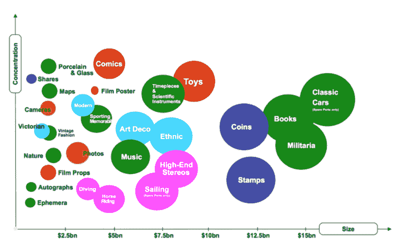
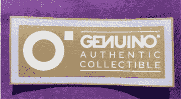

# 第一章

# Genuino 如何在收藏品行业中应用区块链技术

+   Daniel Ruzza

    意大利 Luiss 大学

+   Gabriele Bernasconi

    Genuino，意大利

+   Pietro De Giovanni

    

    意大利 Luiss 大学

摘要

本章分析了 Genuino 在收藏品行业中实施的区块链技术。由于收藏品存在被大量仿造和伪造复制品的高度风险，区块链技术可以极大地帮助确保透明度、原创性、所有权以及数据安全和保护。目前在行业内使用区块链的两种方法似乎最为普遍：一是创建基于区块链的数字原生收藏品；二是通过创建数字孪生将物理对象转移到区块链中。利用区块链，新的消费者群体脱颖而出，突显了传统经济和现有商业模式现代化的需求。

引言

随着电子商务革命，收藏品市场经历了重要变革，收藏品交易从实体店转移到了 eBay 等在线平台（Heitner，2016；Seideman，2018）。然而，这种转变意味着假货数量大幅增加。在可用的减轻这些风险的技术中，区块链技术目前作为一种可能解决这些业务问题的方案正在兴起。在所有选项和功能中，区块链使公司能够创建非同质化代币，这些代币证明是安全且不可更改的，其唯一性、原创性和所有权通过区块链得到保证（Tapscott 和 Tapscott，2016）。研究已经记录了采用区块链来减轻仿造品风险的采用情况（Debayouty 等人，2021），这使得区块链成为解决收藏品仿造问题的理想技术。特别是，两种目前在行业内最普遍的方法，其应用在收藏品和纪念品行业绝对是可行的：1）在区块链上创建数字原生收藏品；2）通过创建数字孪生将物理对象转移到区块链中。

区块链上创建数字原生收藏品的选项在收藏品和纪念品行业中有先天的优势。实际上，区块链保护相关代币，使其无法被销毁、伪造或复制。因此，用户可以轻松地参与所有权并交易这些代币（Rensing，2021）。最近，Dapper Labs 创造了并出售了 CriptoKitties，（https://www.dapperlabs.com），这是完全数字化和独特的卡通猫。在 2018 年推出仅两个月后，Dapper Labs 设法产生了近 2000 万美元的营业额（Zorloni，2018）。鉴于 CriptoKitties 取得的巨大成功，Dapper Labs 随后转向体育收藏品，与 NBA 合作创建了 NBA Top Shots（Browne，2021）。NBA Top Shots 创造了一种新的收藏品类别：NBA 比赛的精彩瞬间。通过这种收藏品，消费者可以购买某场比赛的关键时刻的视频并成为独家所有者（Guzman，2021）。与 NBA Top Shots 相关联的商业模式在第一天就创造了 5000 万美元的营业额（Guzman，2021）。购买后，瞬间可以在球迷之间进行交易。例如，一场比赛中勒布朗·詹姆斯的关键时刻以 20.8 万美元的价格售出（Browne，2021）。替代方法包括数字收藏卡，它们与实体卡具有相同的功能。无论如何，有许多应用程序适合这些选项。Dapper Lab 为综合格斗 MMA（Roberts，2020）创建了代币，为 Sorare（https://sorare.com）和 Fantastec Swap（https://www.swap-fantastec.com）创建了代币。Player Tokens Inc. 转向棒球（https://playertokens.co），而 Animoca Brands（https://www.animocabrands.com）进入了 Moto GP 和一级方程式（Schmidt，2020）的世界。最后，一些公司同时拥抱更多种类的体育，例如 Ex Sport（https://www.ex-sports.io）。

另一种更为复杂化的代币化方法，是通过区块链技术将实体体育收藏品带入数字世界。实体对象的“转换”涉及在区块链上创建一个数字孪生。Fantastec Swap（https://www.fantastec.io/#home）采用了一种混合方法，既创建完整的数字收藏品，也将一些实体对象转化为数字对象。此类应用的一个典型例子是签名。Fantastec Swap 的合作伙伴包括一些顶级国际足球俱乐部，如皇家马德里、多特蒙德和阿森纳。这些合作伙伴关系提供了一个遵循商业模式的经济价值的例子。Collectable.com（https://collectable.com）也采取了类似的方法，他们寻找高价值的体育收藏品，验证其真实性，并确保以最佳方式保存。然后，Collectable.com 持有这些实体收藏品，并在区块链上创建一个数字孪生。Collectable.com 的客户可以购买整个数字孪生或其部分，并将其纳入他们的投资组合。在 Collectable.com 的市场上，消费者可以交易收藏品，并创建一个类似于股票市场的二级市场。

随着前述浪潮的到来，收藏品行业正在涌现出新的数字化方法。在这些方法中，Genuino 无疑采取了一种不同且原创的方法来管理收藏品（https://genuino.world/page.html）。Genuino 的最终目标是打击体育收藏品市场的假冒伪劣产品，同时允许收藏爱好者持有实体和数字物品，并自由交换。Genuino 的想法是通过应用印有体育赛事信息的 T 恤补丁来数字化收藏品。信息例子包括运动员的名字、他是否参加了比赛、表现、上场时间以及角色。补丁从分布在全场各地的物理预言者那里接收信息和信号，并整合到所有体育设施中。收集到的信息随后记录到区块链上，从而变得可信、可追溯、有价值且原创。考虑到 Genuino 采用的不同方法，我们将详细介绍整个案例，以突出区块链的使用、与之相关的潜在优势以及新兴的威胁。

章节内容安排如下。第二部分提供了收藏品行业的概览，以突显其重要性；而第三部分描述了 Genuino 解决方案背后的理念。第四部分介绍了认证流程；第五部分解释了区块链与其他技术的集成。第六部分讨论了案例；第七部分分析了新兴的威胁和机遇。最后，第八部分简要总结并确定了未来需要开展的研究方向。

收藏品行业概览

收藏品市场是一个年产值约 3700 亿美元的增长行业（Heitner, 2016; Ito, 2020）。人们购买收藏品出于多种动机：纯粹的激情、确认社会地位、社会共识、慈善以及投机的投资（Bleve et al., 2018）。收藏品通常被等同于反映所有者激情和生活方式的真正奢侈品（Hechler-Fayd’herbe and Picinati di Torcello, 2020）。根据瑞士信贷银行的一项调查，超过 70%的客户是收藏家，他们购买收藏品最可能是为了培养他们的激情。此外，收藏品最近作为一种投资形式变得非常受欢迎，可以分散投资组合（Bleve et al., 2018; Kiesnoski, 2019）。这一发现对于超高净值个体尤其正确，因为收藏品占总投资额的 5%至 10%（高峰时为 15%）（Hechler-Fayd'herbe and Picinati di Torcello, 2020）。这些百分比与其他咨询和专业建议和报告一致（Kiesnoski, 2019）。尽管目前对收藏品的投资在 2500 至 5000 美元之间呈上升趋势（Hechler-Fayd’herbe and Picinati di Torcello, 2020），但德勤指出，收藏品受到的关注与其与传统资产的低相关性有关（Bleve et al., 2018），这是分散投资组合的一个指标。

| 图 1.­ |
| --- |
|  |

图 1（Ito, 2020）展示了根据大小和集中度分类的最常见收藏品类别。后者由每个类别的物品数量和它们对类别内销售的影响组成。颜色标识了商品的集群。气泡的大小表示该类别的全球贸易量。因此，艺术、经典汽车、葡萄酒、硬币、邮票和体育纪念品是最显著的收藏品。在本章中，我们重点关注体育纪念品市场，因为考虑到其规模和增长，它提供了应用区块链技术的众多机会（Seideman, 2018）。事实上，有经济能力享受收藏的千禧一代和 Z 世代成员，通常愿意收集这类物品（Weil, 2019）。体育纪念品是收藏品市场的一个基本部分，每年涉及 6700 万人（Heitner, 2016），全球市场规模约为 100 亿美元，其中大约一半来自美国（Seideman, 2018）。体育巨星穿过的球衣往往价值数十万美元（Weil, 2019）。2019 年 6 月，1928-1930 年 Babe Ruth 的纽约洋基球衣在拍卖会上以 564 万美元的价格售出，创下体育纪念品的最昂贵售价（Weil, 2019）。最受欢迎的物品是六次 NBA 冠军和巨星迈克尔·乔丹（Heitner, 2016）拥有的，他的受欢迎程度因最近的 ESPN 纪录片系列“最后的舞蹈”（Red, 2020）而不断增长。乔丹在芝加哥公牛队告别赛中所穿的球衣以 17.3 万美元的价格拍卖（Heitner, 2016）。

欺诈和假冒的风险极高是体育纪念品市场（Red, 2020）最经常出现的问题之一。过去，被称为“纪念品之王”并拥有 Mastro Auction 的 William Mastro（Crosby, 2015），因诈骗客户被起诉，并最终被判处监禁 20 个月；他篡改了体育纪念品并出售假货超过 7 年（Crosby, 2015）。然而，Mastro 的案件并非孤立。FBI 自 20 世纪 90 年代开始的“牛棚”调查显示，美国销售的体育纪念品中约有 50%是假冒的，而某些商品的假冒率甚至高达 90%（The Federal Bureau of Investigation, 2005）。这些估计使体育纪念品市场变得非常具有风险和不确定性，正如美国邮政检查局（2019）所证实的那样。

体育纪念品市场上持续存在的最重要威胁与验证物品真实性难度大、所需特殊技能以及高经验要求有关，还与规范物品交易的交流系统有关（Weil, 2019; Thomas, 2020; Red, 2020）。迄今为止，集体物品是在独立拍卖或像 eBay 这样的综合网站上，在粉丝和收藏家之间进行交换（Seideman, 2018）。根据 Pownall（2017）的说法，私人销售调动了体育纪念品市场总价值的 70%，这些交易很可能是通过在线完成，没有面对面会议，通过没有保证的支付，并且将商品运送到买家地点。因此，在收到实物之前，买家无法验证收藏品的真实性。所以，当买家可以将价格视为一个信号，表明商品的真实性时，他们没有足够的操作工具来对抗可能的诈骗。实际上，一个超出或低于市场价格的价格可能会警告买家可能的诈骗（Weil, 2019; Thomas, 2020）。作为替代方案，买家可以收集关于卖家的信息，验证他们在市场上的存在或他们在过去交易中的可靠性（Weil, 2019）。商品也可以由专业组织如专业体育鉴定师 JSA 和 Beckett 认证和验证，或者从这些来源购买（Red, 2020）。然而，仍然存在一些问题，比如验证程序的成本和时间，以及假证书和认证者错误的风险（Thomas, 2020）。

**GENUINO 案例研究**

Genuino 是一家成立于 2018 年美国，并于 2019 年 2 月 1 日在意大利成立的创新性初创公司，属于信息技术和通信（ICT）领域。Genuino 是一个去中心化协议，旨在认证、验证并交易由认证物理资产支持的数字收藏品，该协议将区块链、物联网（IoT）和人工智能（AI）技术整合到专有的网络应用和移动应用（Genuino，2020）中。通过结合所有这些技术，Genuino 连接了数字世界和物理世界。公司的座右铭是：“收藏数字。拥有实体”。这个应用的想法来源于这样一个认识：我们生活在一个后真相时代，仅凭卖家的沟通和广告来盲目信任产品真实性是困难的。Genuino 知道，新的主要消费者需求是首先要亲自验证产品，并获得对产品的理解和证据。公司应该适应这种需求，赢得消费者的信任，为产品及其整个供应链创造透明度。Genuino 创建的认证协议满足了这些需求；该系统在生产过程中收集数据，同时将操纵风险降到最低并增加产品的真实性。Genuino 的使命是提高产品质量，确保产品的可追溯性、可持续性和防伪性，从而保护最终消费者、产品制造商和所有利益相关者。尽管 Genuino 知道其区块链方法的潜力，但今天，它通过与 Daruma sushi 的合作测试并将其解决方案应用于食品领域，以及通过与 ACF Fiorentina 的合作在体育收藏品领域应用其解决方案。后者是 Genuino 目前和未来业务的主要领域。Genuino 旨在创建一个防伪解决方案并赋予品牌力量。这两个目标将使他们能够通过与物理认证资产相连的 NFT 讲述他们的故事并吸引他们的粉丝。为此，Genuino 的解决方案必须实现三个主要目标：保证球衣的真实性，区分“比赛穿着”和“比赛准备”，追踪衬衫的组成元素，以及追踪创建和所有权转移事件。

Genuino 是在 2018 年基于 Gabriele Bernasconi 和 Eleonora Mulas 两位意大利海外人士的想法创立的，他们希望把一点意大利特色带到他们的祖国之外。为了实现这一点，他们首先将注意力转向了食品行业，因为意大利在全球范围内都享有盛誉，试图通过区块链认证产品的质量。然而，他们很快意识到这可能不是最好的行业，特别是因为与区块链技术相关的扩展问题（De Giovanni，2020）。相比之下，体育行业的人们更愿意采用新技术，这使得大规模和更快的采用成为可能。2019 年 2 月，Genuino 在意大利成立为公司，并在获得更多技能和资本后，Genuino 与 ACF Fiorentina 开发了第一个区块链技术的原型。这个原型在 2019/2020 赛季意甲联赛的最后两轮比赛中进行了测试：Fiorentina 对阵 Roma 和 Fiorentina 对阵 Inter。与此同时，Genuino 被选中参加在拉斯维加斯的 CES，这是世界上这个行业最大的活动之一。与 ACF Fiorentina 的项目很快发展壮大，并从仅仅认证球衣发展到创建一个市场，一系列数字收藏品以吸引他们的球迷。这个产品将于 2021 年 7 月推出，为新体育赛季的开始做准备，并将包括实体和数字收藏品。

GENUINO 的认证流程

通过认证流程，Genuino 旨在保证球员在官方比赛中穿着的球衣的真实性。实际上，当物体具有高经济价值时，高仿冒率也存在（De Giovanni, 2019）。这是一个挑战性的挑战，因为开发的协议必须保证在区块链上使用所有必要的技术对对象进行认证，同时不干扰比赛前后及比赛期间工作人员和运动员的通常活动。尽管 Genuino 的原型是为足球比赛设计的，但它可以轻松地应用于其他运动。每件足球球衣都由一件原始匿名球衣和一套可以通过热压机应用的补丁制成。为活动准备的球衣分为两种类型：比赛穿着或比赛准备。比赛穿着的球衣是实际穿着并进入比赛阶段的球衣。两件衬衫进入场地（一件在第一半场，一件在第二半场）。一件留给足球队出售，另一件留给穿着它的球员。比赛准备的球衣是准备好的和/或穿着的球衣，但没有积极参与比赛。如果它们没有受到损坏，比赛准备的球衣可以在稍后的活动中使用。为每场比赛准备的内容包括：每个球员两件衬衫，每名守门员三色中的两件衬衫，以及大约十件中性球衣，以防有需要时在瞬间进行定制。

为确保认证目标的实现，每件球衣必须在物理和数字环境中唯一标识。因此，每个球衣上都添加了一个包含识别被动标签的智能补丁。每个球衣还将创建一个基于区块链的非同质化代币（NFT）。智能补丁是物理对象和数字对象之间的连接。门记录了球员入场和离场时球衣的通过。所有记录的数据都直接注册在区块链上，没有第三方中介。完成这一后台过程后，就可以出售代表球衣的数字衬衫和代币。球衣可以通过 Genuino Marketplace 购买和交换。

买家如何验证球衣的真实性？球衣的真实性可以通过使用 Genuino 应用程序在框定补丁时进行验证。球衣所有权的转移分为两步，首先是物理转移，然后是数字转移。一旦买家转入了约定的费用，卖家就会将球衣作为物理对象和代表球衣所有权的数字 NFT 代币转让给买家。NFT 代币的转移就像正常的钱包交易一样，因为 NFT 代币从一个钱包转移到另一个钱包，一旦买家通过 Genuino 应用程序验证了球衣的真实性。

区块链及其他技术

在上述认证协议中，应用了区块链和非区块链技术。鉴于基因优“收藏物理。拥有数字”的使命定位，仅凭区块链技术还不足以保证一个物体的原创性。还需要其他技术将物理对象与在区块链上创建的虚拟代币连接起来（De Giovanni，2021）。实际上，从物理到虚拟的过渡是区块链上认证过程中最微妙的阶段之一，因为这是最容易伪造的步骤。在本节中，我们将确定基因优在这个阶段使用的关键技术。特别是，我们将了解区块链、NFT 和补丁是如何一起工作的。

基因优选用的一个基本选择是选择用于注册与物理对象关联的 NFT 的区块链，基于此区块链进行交易。起初，基因优的选择是以太坊，这种区块链特别有效，适合这类操作。以太坊是最重要的公共区块链之一，保证了记录信息的稳定性和可靠性。此外，以太坊创建了名为 ERC 721 的 NFT，非常适合这种用途。然而，由于燃气费的增加，基因优不得不重新考虑其选择。燃气费是指矿工在以太坊上执行交易和智能合约操作所需的钱（Kay，2021）。所需的燃气费因操作而异，取决于您希望操作完成的速度、操作的复杂性以及网络中待处理的交易数量（Kay，2021）。随着 2020 年夏季去中心化金融的爆发，以太坊上的复杂交易数量显著增加，导致网络拥堵（Haig，2021）。这导致平均交易费用超过每笔 20 美元（Foxley，2021）。在像基因优这样的追踪协议中，将每个相关事件记录在区块链上非常重要，如果在区块链上写入信息的成本过高，将变得不可行。因此，基因优不得不重新考虑选择，并依赖 L2 EVM。使用 L2 对基因优应用程序的两个主要优势是，它可以以非常低的燃气费执行交易（例如，可以用几美分的成本完成多达 500 笔交易），并且可以快速创建一个区块，从而快速记录信息。此外，作为以太坊的一条侧链，它与以太坊“桥接”，并适应任何将代币转移到以太坊的请求。

NFTs 建立在 L2 区块链上。“非同质化代币是具有区块链管理所有权的独特数字物品”（Finzer，2020）。非同质化商品所有不能互换的商品，与同质化商品，如货币，完全可互换形成对比。一个人拥有一张 10 欧元纸币还是另一张并没有区别，因为这些纸币具有完全相同的价值。得益于区块链技术，可以这些对象的所有权分配给可以将其保存在钱包中并按喜好进行管理的主题。NFTs 可以在不同的生态系统和不同的区块链之间转移（Finzer，2020）。NFTs 的另一个有趣特性是它们可以被交易和出售，并且由于这一过程可以以极高的速度完成，因此它们具有高流动性（Wintermeyer，2021）。NFTs 的例子包括收藏品、游戏物品、数字艺术、活动门票、域名，甚至实体资产的所有权记录（Finzer，2020）。

NFTs 是 Genuino 用来在虚拟世界中代表实体衬衫的工具，作为球衣的真实所有权证书。实体衬衫与数字 NFT 之间的连接是通过附着在衬衫和体育场大门上的智能补丁实现的。补丁被应用在比赛球衣上。利用这些补丁，全新的球衣可以定制赞助商、球员姓名以及球衣使用时的比赛信息。在足球世界里，球衣上的补丁由单一供应商生产，材质各不相同。主要有两种补丁套装：前面补丁代表赞助商和其他辅助信息，背面补丁则指示球员姓名和球衣号码。为了在 Genuino 的区块链上识别 T 恤，每个 T 恤上都会额外贴上一个小补丁（图 2），而不会干扰游戏准备过程中的任何操作或活动，包括比赛球衣。补丁一次性附着在空白球衣上，其制备过程仅略有不同，考虑到不同类型的补丁。这种新的智能补丁是 Genuino 与世界上该领域的领导者 DekoGrapics 合作开发的。研究和开发阶段的特点主要在于补丁中嵌入的传感器耐久性。实际上，当补丁附着在 T 恤上以及洗涤过程中，传感器都会受到压力。

| 图 2. Genuino 补丁示例 |
| --- |
|  |

案例讨论 |

Genuino 的解决方案为企业和消费者双方创造了利益（见表 1）。一方面，企业通过为实体对象附加数字所有权证书来减轻假冒问题。这使得他们能够通过保护仿制品和提高透明度来提升品牌价值。另一方面，消费者只需几秒钟即可快速有效地验证和验证产品，只需拥有原始性和所有权证明即可。使用 Genuino，消费者可以追踪球衣的所有权链，了解对象的生命周期以及与之相关的完整批次信息。此外，消费者还可以访问一个高效安全的平台，在未来的交易中出售和交换球衣。从这个意义上说，值得提及的是，Genuino 将体育收藏品市场面向三类人：收藏家、粉丝和加密货币爱好者。第一类包括收藏品和纪念品的经典收藏家。这些人收集对象与区块链无关；然而，他们可以通过 Genuino 轻松安全地交换对象。此外，球迷和支持球队通常因为购买能力较低而放弃购买体育收藏品。Genuino 通过简化购买过程并将他们纳入新的市场平台来支持他们。

最后，加密货币爱好者对比特币世界更为熟悉，而不是体育领域。这一群体对加密货币世界的动态了如指掌，主要对投资和投机机会感兴趣。加密货币爱好者知道 CryptoPunk 和 CryptoKitties 的成功，这两款数字收藏品的 NFT 价值在几个月内呈指数级增长。因此，他们可以投资于体育收藏品及其相应的 NFT，希望走上同样的成功之路。

Genuino 解决方案在连接物理世界和数字世界及其相关过程时引起了一些担忧，这些过程无论是在链上还是链下都可以发生。尽管数据记录在区块链上，从而使其不可更改且得到保证，但插入阶段提供了篡改的机会。因此，数据输入过程是大多数应用程序中最薄弱和最复杂的任务。Genuino 投入了大量资金来限制这些问题，尤其是在过程发生在链下或区块链外部时。Genuino 的座右铭是“收集数字，拥有物理。”因此，与完整的数字收藏品不同，无法在链上管理所有任务。对于实体物体，尤其是球衣，需要进行链下步骤。为了确保它们的正确识别并防止非法行为，如使用被盗标签或克隆序列号，当所有者在补丁和产品之间建立关联时生成 NFT 代币。从这一点开始，篡改机会极为有限，因为所有数据都由传感器（物理预言者）记录，而无需任何人工干预。当球员穿着的球衣进入或离开场地时，传感器捕捉到这些信息并记录在区块链上。总的来说，Genuino 通过使用 IoT 传感器在区块链上的数据收集和记录阶段限制了篡改。

通过区块链涌现出的新兴威胁和机遇。

尽管 Genuino 为使用区块链的客户带来了许多优势，但这个解决方案极具挑战性。在这些挑战中，我们之前提到了开发可以嵌入球衣中的身份标签，这种标签会受到压力、温度和体液等多重影响。除了这个问题，我们还确定了三个进一步的挑战：补丁传感器可能会损坏或破裂，可能会出现法律问题，还可能存在与 NFTs 相关的定价泡沫（表 1）。智能补丁及其传感器是虚拟 NFT 和球衣之间的桥梁。传感器将球衣与区块链上的 NFT 关联起来。传感器损坏的可能性很小。事实上，收藏家习惯于保存和防止比赛穿过的球衣被磨损或洗涤，因此保护整个市场价值。为了避免这种风险，Genuino 对补丁进行了各种压力测试，以确保它们在使用多次机洗时的耐用性。补丁在各种情况的组合中表现出良好的耐用性。然而，对于任何表现不佳的补丁，Genuino 已经开发了一种程序，可以快速更换，包括从后端检查实际传感器损坏的情况。然后将损坏的球衣发送给 Genuino，更换损坏的补丁，并创建一个新的 NFT 与新补丁关联。为了保留与损坏补丁连接的 NFT 中记录的所有信息，Genuino 将所有信息传输到新的 NFT 中，保留了球衣的全部历史，并确保向客户保持完全透明。Genuino 面临的另一个挑战与反洗钱（AML）相关的问题有关，以及与了解你的客户（KYC）以及隐私问题相关。KYC 属于 AML 立法范畴，包括提供给被指控方的 KYC 法律义务。通常，被指控的主体是律师、公证人、会计师、银行和金融机构等合格主体。这些机构习惯于通过交叉检查与不同来源相关联的数据来手动或自动识别联系他们提供任何服务的客户。直到加密货币被引入商业世界以管理交易并模仿传统货币的行为，这种立法只适用于被指控的各方。与区块链相关（如 NFTs）的代币可以添加到加密货币中，考虑到 NFT 本身并不是一种货币。然而，它可以与球衣、画作、视频等关联。出售 NFT 并不意味着出售货币；相反，这意味着出售一个对象，因此表明 NFT 具有价值，并且经常以类似于加密货币的投机方式使用。

这种范式在意大利和欧洲监管机构中造成了混乱，他们认为所有加密资产都是一个潜在洗钱风险很高的行业。因此，他们创建了一个负责进行加密活动的新主体类别。意大利立法法令 231/2007 和 2019 年的第五个欧洲反恐指令确定了新的负责主体。立法法令 231/2007 第 1 条字母 FF 确定了以下作为负责主体：“与虚拟货币使用相关的服务提供商：任何自然人或法人，为第三方提供在线或专业基础上的功能服务使用、交换、存储虚拟货币及其转换 […]以及发行、提供、转让和结算服务以及任何其他有助于获取、谈判或中介交换相同货币的服务；ff-bis) 数字钱包服务提供商 [...]。 “ Genuino 属于这些类别，既因为接收和保管数字货币，也因为将其转换为 Genuino 的 NFT 等进一步的数字价值表示。因此，Genuino 必须执行这些任务以避免法律问题。

Genuino 制定的程序包括通过姓名、姓氏、出生日期、身份证和照片来识别客户。然后，它必须保持这些数据的安全并报告给当局任何超过一定金额的或可以被法律视为异常的可疑交易。已经开发出许多软件来追求这些目标以及数据收集和报告。Genuino 仅为购买 NFT 并执行交易以防止洗钱的客户获取数据并履行这些义务。

通过 Genuino 的区块链出现的第二个法律问题是对隐私的潜在妥协。在欧洲，一般数据保护条例（GDPR）679/2016 于 2018 年在所有欧洲国家完全适用\。自 2018 年以来，所有欧洲国家都有义务遵守 GDPR 规定，该规定也适用于在欧洲联盟注册办公室的公司，只要涉及欧洲联盟公民。当 Genuino 获取用户的个人信息时，它必须遵守这一规定。Genuino 拥有与消费者相关的敏感数据，知道一个人拥有多少 NFT，也知道每个人都有可能拥有价值数百万欧元的 NFT。因此，Genuino 可能有影响个人自由和权利的信息。Genuino 特别关注隐私，不仅是因为可能的法定负担，还因为在未来它将发挥关键的竞争作用。实际上，客户越来越关注他们的数据是如何被公司处理的，尤其是在加密世界。

基因尼奥为减轻隐私问题所采取的措施必须在技术和形式两个层面进行分析。从技术角度来看，基因尼奥采用了所有可用的技术，如服务器分区、加密和备份。从形式角度来看，它确定了一个极其受限的员工和管理员名单，他们拥有访问数据的凭据。

基因尼奥解决方案的最后弱点可能在于 NFT 可能的泡沫。事实上，虽然 NFT 的支持者认为 NFT 是收藏品和数字经济未来的趋势，但越来越多的人认为 NFT 可能会产生一个最终会破裂的泡沫（Wintermeyer，2021）。与收藏品或艺术品相连的 NFT 经历着不断增加的价值，并以重要的投机价格交易。一个例子就是 Beeple（一位最伟大的数字艺术家）的数字艺术 NFT，在 2021 年 3 月以近 7000 万美元的价格售出（Reyburn，2021）。因此，绝大多数购买者购买 NFT 是为了投机，并从未来的销售中获利（Turley，2021）。评估 NFT 市场的演变极其困难，因为影响它的因素无数，比如投机投资者的兴趣、燃气价格（特别是在以太坊上），以及可能出现的专注于 NFT 的专用区块链（Wintermeyer，2021）。因此，基因尼奥必须在这个不断变化且高度不稳定的环境中运作。对基因尼奥用户的主要风险可能是随着增加的 NFT 的可用性，它们的价值会急剧下降。然后，就没有人购买 NFT，它将变得流动性不足。为此，基因尼奥现在正在研究一个基于去中心化金融系统的解决方案，以确保在任何情况下其 NFT 都保持一定的流动性。

积极方面，Genuino 利用区块链技术发展其理念和商业策略。它将在 2021 年 7 月与一些包括 ACF Fiorentina 在内的 Serie A 团队合作，随着 2021/2022 赛季的开启，将其产品推向市场。Genuino 还在进行其产品除认证过程外的进一步开发。其中最重要的一个是 NFT 代币和实体 T 恤交换的市场，以及完整数字收藏品的销售。“收藏数字，拥有实体”与 Genuino 的座右铭一致，该市场包括三个主要阶段，旨在提高可交易性和粉丝参与度。第一阶段被称为“收藏数字”。在这个阶段，消费者可以通过参与空投或购买虚拟收藏品套餐来获取数字对象。第二阶段被称为“拥有实体”。在这个阶段，收藏家在收集数字 NFT 时必须完成挑战和任务。完成这些任务后，他们将获得实体对象作为奖励。前两个阶段主要针对收藏家和粉丝，而第三个阶段针对 Genuino 的所有三类客户。第三阶段被称为“释放 DeFi”。这一阶段将 Genuino 代币与去中心化金融系统结合，通过耕作和质押创造价值。此外，这些动态确保了在没有人想购买该项目的情况下 NFT 的流动性。

表 1. 区块链在收藏品行业应用的机遇与挑战

| 机遇 | 挑战 |
| --- | --- |
| 减轻假冒问题 | 将数据输入区块链可能为伪造提供了机会 |
| 提升品牌价值 | 补丁传感器可能被损坏或破裂 |
| 快速有效地验证和验证产品 | 法律问题：反洗钱（AML）和了解你的客户（KYC） |
| 市场 | 法律问题：隐私 |
| 将体育收藏品市场开放给三种类人群：收藏家、粉丝和加密货币爱好者 | 与 NFTs 相关的可能的定价泡沫和可能的代币流动性问题 |

结论

本章分析了 Genuino 的案例，该公司将区块链技术应用于体育收藏品，挖掘行业对象背后的价值，并通过区块链将这些物理对象与数字平台连接起来。Genuino 业务中区块链的存在激活了三种消费者类别，分别是收藏家、粉丝和加密货币爱好者。他们因访问区块链解决方案有不同的动机，这一切都通过与物理对象链接的 NFTs 来管理。

区块链利用物理预言家，很可能是与物联网相连的补丁，在体育赛事期间收集信息，并将所有信息记录在区块链上，以提高收藏品的价值。这种记录信息的方法在减轻伪造问题、提供收藏品的原始证明；提供关于事件、运动员和收藏品的不腐败细节；并确保在区块链平台上注册的物品可以在 Genuino 平台内以安全和授权的环境进行交换方面具有优势。

尽管商业模式很有前景，Genuino 仍然面临一些挑战。从运营角度来看，补丁的符合性和耐久性可能会在整个过程中造成一些问题。由于传统合作伙伴关系中存在多种类型的协议（Preeker 和 De Giovanni, 2018），Genuino 可以将与 DekoGrapics 的合作伙伴关系提升到更高层次，同时将合同协议整合到区块链中。此外，法律问题必须得到理解和治理。作为一种全新的商业模式和不同的环境，交易和规则作为整个交易集合的一部分必须重新思考和动态重构。从这个意义上说，Genuino 必须解决洗钱问题，因为 NFT 不是可以在股市交易的加密货币，但它们执行的经济价值就像加密货币一样。这种情况可能会创造出消费者阻力，因为消费者不熟悉这类应用，以及监管机构和立法机构需要与传统交易相比进行整合。最后，Genuino 需要制定投资和战略行动计划，以确保在大范围内保护利益相关者的隐私。实际上，利益相关者应提供和交换机密信息，这些信息可能会随着时间的推移受到网络战争和网络间谍活动的威胁。挑战在于通过特定的和更新的保护系统来保证机密性。

Genuino 的区块链经验将促进未来研究方向的研究。首先，新的消费者群体的存在激发了关于战略消费者的研究，这些消费者根据市场情况和机会调整他们的购买行为。在 Genuino 框架内，NFT 的价值和市场感知可以改变收藏家、粉丝和加密爱好者的购买态度。其次，未来研究应分析收藏品价格的形成如何根据团队表现改变，进而改变采用区块链技术的便利性。第三，Genuino 可以评估获取有关制作补丁的知识的可能性，以减轻供应商产生的任何运营问题。最后，Genuino 创建的当前区块链技术很可能会连接到位于整个比赛场地周围的物理或 acles。还可以采用其他预言者和其他数字技术来增加对象的原产地和价值（De Giovanni 和 Cariola，2020）。例如，人类预言者可以与球迷的门票相连接。比赛中的重要时刻随后由物联网系统收集，并与人类预言者交换信息。当人类预言者达成共识时，球迷会因任何经过验证的信息而收到代币，然后将信息记录到区块链上。将要采用的其他预言者类型包括软件预言者以及入站和出站预言者。

参考文献

Bleve, D., Costa, M., Ghilardi, R., Lanzillo, E., Picinati di Torcello, A., Ripa, P., & Tagliaferri, B. (2018). Il Mercato Dell’arte e Dei Beni Da Collezione Report 2018. 意大利。

Browne, R. (2021). 加密收藏品售价数千美元——马克·库班等名人借此获利. CNBC。

Crosby, R. (2015). 纪念品之王因欺诈被判 20 个月监禁. 芝加哥论坛报, 第 1-7 页。

De Giovanni, P. (2019). 数字供应链通过动态库存和智能合约实现. 数学, 7(12), 1235. doi:10.3390/math7121235

De Giovanni, P. (2020). 供应链管理中的区块链和智能合约：一个博弈论模型. 国际生产经济学杂志, 228, 107855. doi:10.1016/j.ijpe.2020.107855

De Giovanni, P. (2021). 数字供应链中的动态质量模型和游戏：数字转型如何影响供应链质量管理. 斯普林格自然科学.

De Giovanni, P., & Cariola, A. (2020). 通过工业 4.0 技术、精益实践和绿色供应链实现流程创新. 交通经济学研究, 100869. doi:10.1016/j.retrec.2020.100869

Finzer, D. (2020). 非同质化代币圣经：关于 NFT 你需要知道的一切. 可在: https://opensea.io/blog/guides/non-fungible-tokens/#:~:text=非同质化代币(NFTs),物理资产的所有权记录。

**福克斯利**（2021）《以太坊交易费达到历史新高，因为以太币、DeFi 硬币飙升》。雅虎财经（Yahoo Finance）。

**Genuino**（2020）《关于我们》。可在 https://genuino.world/page.html 查阅。

**瓜兹曼**（2021）《这家区块链初创公司出售可收藏的 NBA 精彩瞬间，30 天内销售额达到 5000 万美元》。雅虎财经（Yahoo! Finance）。

**海 ig**（2021）《以太坊创下新高，因为 DeFi 燃料费飙升》。Cointelegraph。

**赫克尔-费代尔贝**和**皮卡纳蒂·迪·特雷西奥**（2020）《收藏品：财富的重要组成部分》。学术出版社（Academic Press）。

**海特纳**（2016）《在价值数十亿美元的体育收藏品市场中打球》。福布斯（Forbes），第 2-7 页。

**伊藤穰一**（2020）《收藏品的未来是数字化》。Tech Crunch。可在 https://techcrunch.com/2020/03/25/the-future-of-collectibles-is-digital/查阅。

**凯**（2021）《出售加密艺术可能带来巨大的隐藏费用，导致一些人损失数百美元》。商业内幕（Business Insider）。

**基恩诺斯基**（2019）《收藏品是为了收藏还是投资？顾问们发表了意见》。可在 https://www.cnbc.com/2019/06/21/are-collectibles-for-collecting-or-investing-advisors-weigh-in.html 查阅。

**理查德·费曼**（2017）《2017 TEFAF 艺术品市场报告》，欧洲艺术品基金会（TEFAF）。霍尔维恩。可在 www.ideebv.com 查阅。

**普里克**和**德· Giovanni**（2018）《通过合同与高科技供应商协调创新项目》。研究政策（Research Policy），第 47 卷第 6 期，第 1161-1172 页。DOI:10.1016/j.respol.2018.04.003

**雷德**（2020）《体育纪念品正在蓬勃发展，但行业也有其过去的丑闻》。福布斯（Forbes），第 1-6 页。

**伦辛**（2021）《体育的未来正在拥抱数字化》。体育 Pro。

**雷布 urn**（2021）《艺术的 NFT 问题：交易的下一个前沿，还是一种新的郁金香形式？》。纽约时报，第 3-7 页。

**罗伯茨**（2020）《UFC 和 Dapper Labs 为 MMA 拳击手推出加密收藏品》。财富（Fortune）。

**施密特**（2020）《21 世纪体育：技术将如何改变数字时代的体育》。施普林格·自然（Springer Nature）。DOI:10.1007/978

**塞德曼**（2018）《技术企业家确定美国体育纪念品市场的首次估计：54 亿美元》。福布斯（Forbes），第 5-10 页。

**塔普斯科特**和**塔普斯科特**（2016）《区块链革命：比特币背后的技术如何改变货币、商业和世界》。兰登书屋（Penguin Random House LLC）。

美国联邦调查局（2005）《Operation Bullpen》。可在 https://archives.fbi.gov/archives/news/stories/2005/july/operation-bullpen-overview 查阅。

**托马斯**（2020）《体育纪念品市场预计达到 54 亿美元，但小心假货》。体育 casting。

**特利**（2021）《如果你还没有关注 NFT，这就是你为什么要开始的原因》。Tech Crunch。

美国邮政检查局（2019）《假冒体育纪念品》。美国邮政检查局。

**魏尔**（2019）《体育纪念品市场继续取得巨大成功》。华尔街日报，第 1-2 页。

**温特梅耶**（2021）《非同质化代币市场繁荣，因为知名人士加入加密最新热潮》。福布斯（Forbes），第 1-7 页。

Zorloni, L. (2018). Cryptokitties，一款使用加密货币支付的塔玛高奇式猫咪游戏。Wired，11，1–7。
